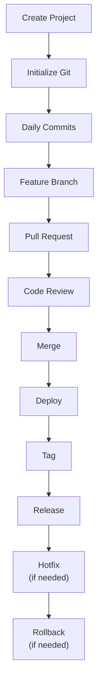
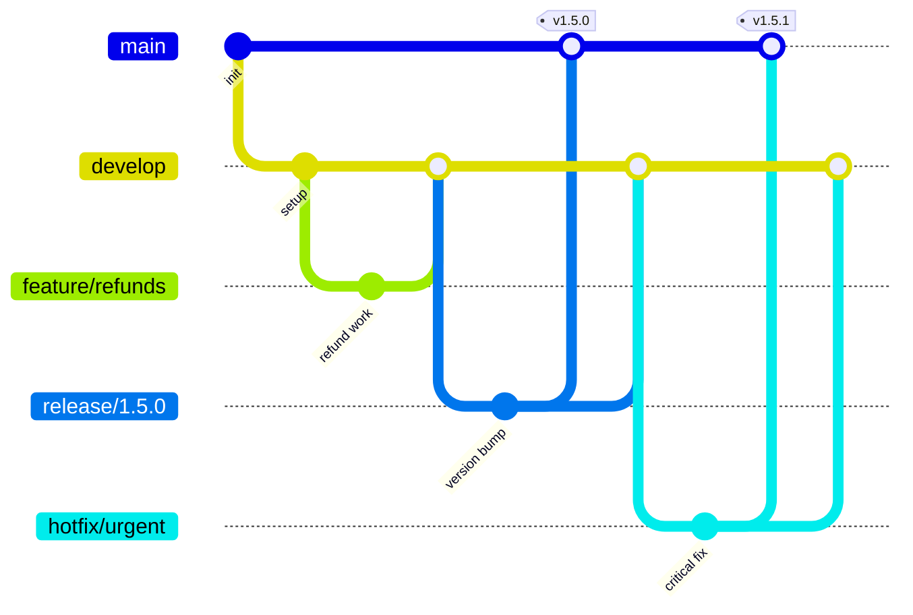
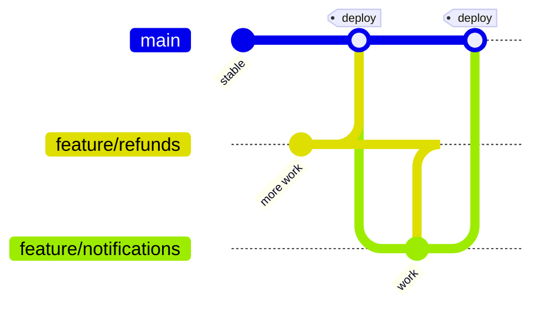
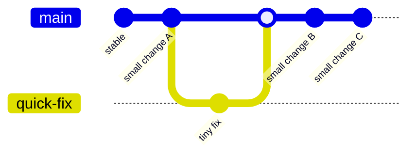
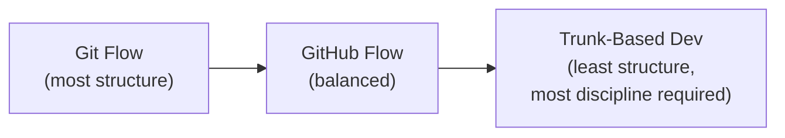
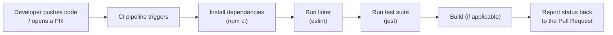
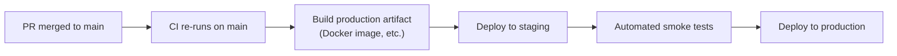

# Module 6 — Real-World Git Workflow (Backend Developer Edition)

> **Masterclass:** Git & GitHub Masterclass (7 Modules)
> **Prerequisite:** Modules 1–5 (Fundamentals, Daily Workflow, Branching & Merging, Remotes & GitHub, Advanced Internals)
> **Module Goal:** Zoom out from individual commands to see the complete lifecycle of a real backend project — from `npm init` to production deployment, hotfixes, rollbacks, and versioned releases — and understand the major branching workflow philosophies teams choose between.
> **Audience:** You should be comfortable with everything in Modules 1–5. This module is about **process and strategy**, not new commands — though a few new ones appear along the way.

---

## 📖 Table of Contents

1. [The Complete Node.js Project Workflow](#1-the-complete-nodejs-project-workflow)
2. [Git Flow](#2-git-flow)
3. [GitHub Flow](#3-github-flow)
4. [Trunk-Based Development](#4-trunk-based-development)
5. [Comparing the Three Workflows](#5-comparing-the-three-workflows)
6. [Monorepo vs Polyrepo](#6-monorepo-vs-polyrepo)
7. [Semantic Versioning](#7-semantic-versioning)
8. [Release Notes](#8-release-notes)
9. [CI/CD Basics](#9-cicd-basics)
10. [GitHub Actions Overview](#10-github-actions-overview)
11. [Best Practices](#11-best-practices)
12. [Mistakes Developers Make](#12-mistakes-developers-make)
13. [Exercises](#13-exercises)
14. [Interview Questions](#14-interview-questions)
15. [Cheat Sheet](#15-cheat-sheet)
16. [Key Takeaways](#16-key-takeaways)

---

## 1. The Complete Node.js Project Workflow

This section walks through the **entire lifecycle** of a real feature, end-to-end, on our running example project, `FinPilot`. Every step uses tools from Modules 1–5 — this is where it all comes together into one continuous story.



### 1.1 Create Project

```bash
mkdir finpilot-api && cd finpilot-api
npm init -y
npm install express dotenv
npm install --save-dev nodemon eslint jest
```

### 1.2 Initialize Git

```bash
git init
git branch -M main
```

**Create `.gitignore` immediately** (Module 2, Section 9) — before your first commit, not after:
```gitignore
node_modules/
.env
dist/
coverage/
*.log
```

**First commit:**
```bash
git add .
git commit -m "chore: initial project setup with Express and dev tooling"
```

**Connect to GitHub (Module 4):**
```bash
git remote add origin git@github.com:ashish8824/finpilot-api.git
git push -u origin main
```

### 1.3 Daily Commits

Following Module 2's habits — atomic, well-described commits, using `git add -p` where useful:

```bash
git add server.js
git commit -m "feat: add basic Express server with health check"

git add routes/transactions.js
git commit -m "feat(transactions): add GET /transactions endpoint"
```

### 1.4 Feature Branch

A new requirement arrives: **"Add refund processing."**

```bash
git switch main
git pull origin main
git switch -c feature/refund-processing
```

Work happens here across several commits (Module 2 + Module 3 habits):
```bash
git add routes/refunds.js
git commit -m "feat(refunds): add refund route skeleton"

git add utils/refundValidator.js
git commit -m "feat(refunds): add amount validation logic"

git add tests/refunds.test.js
git commit -m "test(refunds): add unit tests for validation"
```

Keep the branch current with `main` as it evolves (Module 3, Section 9):
```bash
git fetch origin
git rebase origin/main
```

### 1.5 Pull Request

```bash
git push -u origin feature/refund-processing
```

On GitHub: open a PR, `feature/refund-processing` → `main`, with a clear description, linked issue (`Closes #58`), and requested reviewers (Module 4, Section 9).

### 1.6 Code Review

Reviewers leave inline comments (Module 4, Section 10). You address feedback:
```bash
git add utils/refundValidator.js
git commit -m "fix(refunds): handle zero-amount edge case per review feedback"
git push
```

### 1.7 Merge

Once approved and CI checks pass (Section 9 of this module), the PR is merged — commonly via **Squash and Merge** (Module 4, Section 11) to keep `main`'s history clean:

```bash
git switch main
git pull origin main
git branch -d feature/refund-processing
```

### 1.8 Deploy

Merging to `main` typically triggers an automated deployment pipeline (Section 9-10) that builds, tests, and ships the new code to a staging or production environment — no manual server access needed in a mature setup.

### 1.9 Tag

Once enough merged features justify a new version, tag the release commit (Module 3, Section 13):
```bash
git switch main
git pull origin main
git tag -a v1.5.0 -m "Release 1.5.0: refund processing"
git push origin v1.5.0
```

### 1.10 Release

Create a GitHub Release from this tag (Module 4, Section 14), with generated/edited release notes (Section 8 of this module).

### 1.11 Hotfix

A critical bug is found in production two days later — refunds over $10,000 are silently failing.

```bash
git switch main
git pull origin main
git switch -c hotfix/large-refund-failure

git add utils/refundValidator.js
git commit -m "fix(refunds): correctly handle refunds over $10,000"

git push -u origin hotfix/large-refund-failure
# Fast-tracked review and merge directly to main
```

```bash
git switch main
git pull origin main
git tag -a v1.5.1 -m "Hotfix 1.5.1: large refund validation fix"
git push origin v1.5.1
```

### 1.12 Rollback

Suppose the hotfix itself introduced a new, worse regression, and you need to immediately restore the previous stable behavior in production.

**Option A — Revert the bad commit (preferred, Module 2, Section 6.3):**
```bash
git switch main
git log --oneline
git revert <bad-commit-hash>
git push origin main
```

**Option B — Redeploy a previous tagged version directly (infrastructure-level rollback):**
```bash
git checkout v1.5.0
# trigger your deployment pipeline against this exact tagged commit
```

> 💡 **Why `revert` is generally preferred over resetting `main` backward:** As established in Module 2, `main` is shared/pushed history — `revert` safely undoes the bad change with a new commit, without rewriting anything teammates or CI systems have already built on top of.

---

## 2. Git Flow

### 2.1 The Model

**Git Flow** is a structured, multi-branch workflow designed for projects with **formal, scheduled releases** (think: versioned software shipped periodically, like a mobile app or an enterprise product) rather than continuous deployment.



### 2.2 The Branch Roles

| Branch | Purpose | Lifespan |
|---|---|---|
| `main` (or `master`) | Always reflects **production-ready, released** code | Permanent |
| `develop` | Integration branch — where completed features accumulate before a release | Permanent |
| `feature/*` | Individual features, branched from `develop`, merged back into `develop` | Temporary |
| `release/*` | Final prep for a specific release (version bumps, last-minute fixes, testing) branched from `develop`, merged into BOTH `main` and `develop` | Temporary |
| `hotfix/*` | Urgent production fixes, branched from `main`, merged into BOTH `main` and `develop` | Temporary |

### 2.3 Why the "Merge Into Both" Rule Matters

Notice `release/*` and `hotfix/*` branches merge into **both** `main` and `develop`. This is critical: if a hotfix only merged into `main`, the next regular release (built from `develop`) could accidentally **reintroduce the bug** the hotfix just fixed, since `develop` never received that correction.

### 2.4 When Git Flow Makes Sense

- Software with **distinct, versioned releases** (e.g., v1.0, v1.1, v2.0) rather than continuous rolling deployment.
- Products where multiple versions might need to be **supported simultaneously** (e.g., enterprise software still patching v1.x while building v2.x).
- Teams comfortable with more process/ceremony in exchange for very clear release boundaries.

### 2.5 When It's Overkill

For a typical fast-moving startup backend API deploying multiple times a day, Git Flow's extra branches (`develop`, `release/*`) often add process overhead without matching benefit — this is exactly the gap **GitHub Flow** (Section 3) and **Trunk-Based Development** (Section 4) fill.

---

## 3. GitHub Flow

### 3.1 The Model

**GitHub Flow** is a dramatically simpler workflow, designed around **continuous deployment** — there's no `develop` branch, no `release/*` branches, just `main` and short-lived feature branches.



### 3.2 The Rules (Deliberately Simple)

1. `main` is **always deployable** — every commit on `main` should be safe to ship to production immediately.
2. Create a descriptively-named branch off `main` for any new work.
3. Commit regularly, push to the remote often.
4. Open a Pull Request early (even as a Draft — Module 4, Section 9.4) for visibility and discussion.
5. Once approved and CI passes, merge into `main`.
6. **Deploy immediately after merging** — this is the defining characteristic. There's no waiting for a batch of features to accumulate on a separate `develop` branch.
7. If something goes wrong, revert or roll forward with another fix — fast.

### 3.3 Why This Fits Modern Web/API Backends

Most SaaS products, APIs, and web applications (very much including a project like `FinPilot`) deploy continuously — multiple times a day is common — rather than shipping discrete, numbered versions to end users manually installing updates. GitHub Flow matches this reality: every merge to `main` is a potential deployment, so there's no need for the extra `develop`/`release` ceremony.

### 3.4 GitHub Flow vs Git Flow — Side by Side

| | Git Flow | GitHub Flow |
|---|---|---|
| **Branches** | `main`, `develop`, `feature/*`, `release/*`, `hotfix/*` | `main`, `feature/*` (only) |
| **Release model** | Scheduled, versioned releases | Continuous deployment |
| **Complexity** | Higher | Lower |
| **Best for** | Versioned software with distinct release cycles | Web apps, APIs, SaaS products deployed continuously |

---

## 4. Trunk-Based Development

### 4.1 The Model

**Trunk-Based Development (TBD)** pushes simplicity even further than GitHub Flow: developers commit **directly to `main`** (the "trunk") as much as possible, using **very short-lived branches** (often merged within hours, not days) — or in the most extreme form, committing straight to `main` with **feature flags** controlling whether new, incomplete code is actually active.



### 4.2 Feature Flags — The Key Enabler

Since branches are so short-lived, **incomplete** features often need to be merged into `main` before they're fully ready for users — this is made safe using **feature flags** (a configuration toggle deciding whether a piece of code is active):

```javascript
if (featureFlags.isEnabled('refund-processing-v2')) {
  return handleRefundV2(req, res);
} else {
  return handleRefundV1(req, res);
}
```

This lets developers merge and deploy code continuously, even mid-feature, without exposing unfinished functionality to real users — the flag can be flipped on later (even without a new deployment, in mature flag systems) once the feature is genuinely ready.

### 4.3 Why Large, Elite Engineering Teams Favor This

- **Avoids "merge hell"** — long-lived feature branches that diverge from `main` for weeks accumulate painful, large conflicts (Module 3, Section 6). Trunk-based development minimizes divergence by design.
- **Forces smaller, safer changes** — since everything must be mergeable quickly, work is naturally broken into small, incremental, reviewable pieces.
- **Pairs extremely well with strong CI/CD** (Section 9) — since `main` must always stay releasable, comprehensive automated testing is non-negotiable in this model.

### 4.4 The Tradeoff

Trunk-based development requires significant engineering discipline and CI/CD maturity — feature flag management adds its own complexity, and teams without strong automated testing can find `main` breaking frequently under this model. It's most associated with large, sophisticated engineering organizations (Google's internal monorepo workflow is a famous example) rather than being a universal beginner recommendation.

---

## 5. Comparing the Three Workflows

| | Git Flow | GitHub Flow | Trunk-Based Development |
|---|---|---|---|
| **Branch lifespan** | Feature branches can live for weeks | Feature branches live days | Branches live hours, or commits go straight to `main` |
| **Release cadence** | Scheduled/versioned | Continuous | Continuous, often multiple times per day |
| **Structural complexity** | High (5 branch types) | Low (2 branch types) | Lowest (mainly just `main`) |
| **Requires feature flags?** | No | Rarely | Often, for safety |
| **CI/CD maturity required** | Moderate | High | Very high |
| **Best fit** | Versioned software, enterprise products, apps with staged rollouts | Most web apps, APIs, SaaS backends | Large-scale, high-velocity engineering orgs with strong automated testing culture |



> 💡 **There's no universally "correct" choice** — the right workflow depends on release cadence, team size, CI/CD maturity, and the nature of the product. Many real teams also run **hybrids** — e.g., GitHub Flow with an added `hotfix/*` convention borrowed from Git Flow.

---

## 6. Monorepo vs Polyrepo

### 6.1 Polyrepo — One Repository Per Project

**FinPilot's ecosystem, as a polyrepo:**
```
finpilot-api/            (separate repo)
finpilot-frontend/       (separate repo)
finpilot-shared-utils/   (separate repo)
finpilot-mobile/         (separate repo)
```

**Pros:**
- Clear ownership boundaries — each repo can have its own access controls, CI pipeline, and release cadence.
- Smaller, faster individual clones and CI runs.
- Teams can adopt different tools/conventions per repo without affecting others.

**Cons:**
- Cross-project changes (e.g., a shared type definition used by both API and frontend) require coordinating changes and versions across multiple repositories — often via published packages (npm) or submodules (Module 5, Section 13).
- Harder to get a single, unified view of "everything that changed this week" across the whole product.

### 6.2 Monorepo — One Repository, Many Projects

**FinPilot's ecosystem, as a monorepo:**
```
finpilot/
├── packages/
│   ├── api/
│   ├── frontend/
│   ├── shared-utils/
│   └── mobile/
├── package.json          (workspace root)
└── turbo.json / nx.json  (monorepo tooling config)
```

**Pros:**
- **Atomic cross-project changes** — a single commit/PR can update `shared-utils` AND both consumers (`api`, `frontend`) simultaneously, always keeping them in sync — no version-juggling required.
- Easier code sharing and refactoring across the whole codebase.
- One unified history, one place to search, one CI configuration philosophy (though often with path-based optimizations, so unrelated projects don't all rebuild on every change).

**Cons:**
- Repository size and clone time can grow significantly (mitigated by Module 5's shallow/partial/sparse clone techniques).
- Requires dedicated tooling (e.g., Nx, Turborepo, Lerna for JS/Node ecosystems) to manage build caching, dependency graphs, and selective CI runs efficiently — a plain `git clone` alone doesn't solve monorepo-scale build orchestration.
- Access control is coarser by default (though platforms increasingly support path-based permissions).

### 6.3 Practical Guidance

| Situation | Better Fit |
|---|---|
| Small team, tightly coupled frontend + backend, frequent cross-cutting changes | Monorepo |
| Independent teams/services with different release cadences and ownership | Polyrepo |
| Open-source project meant to be consumed as separate, independently-versioned packages | Polyrepo |
| Large engineering org wanting unified tooling, atomic refactors, and trunk-based development (Section 4) | Monorepo (this is Google's and Meta's internal approach, at massive scale, with heavily custom tooling) |

---

## 7. Semantic Versioning

### 7.1 The Format: `MAJOR.MINOR.PATCH`

```
v1.5.2
 │ │ │
 │ │ └── PATCH: backward-compatible bug fixes
 │ └──── MINOR: backward-compatible new features
 └────── MAJOR: breaking changes
```

### 7.2 The Rules

| Change Type | Version Bump | Example |
|---|---|---|
| Bug fix, no API changes | **PATCH** (`1.5.2` → `1.5.3`) | Fixed a rounding error in refund calculations |
| New feature, fully backward-compatible | **MINOR** (`1.5.3` → `1.6.0`) | Added a new `/refunds/bulk` endpoint; existing endpoints unchanged |
| Breaking change | **MAJOR** (`1.6.0` → `2.0.0`) | Renamed a required field in the request body, or removed an endpoint |

> 💡 **Why "backward-compatible" is the key question, not just "how big is the change":** A MAJOR bump signals to anyone depending on your API/package: **"upgrading may require you to change your own code."** A MINOR or PATCH bump signals: **"safe to upgrade without any changes on your end."** This is the entire practical value of Semantic Versioning — it's a promise, not just a label.

### 7.3 Pre-Release and Build Metadata

```
v2.0.0-beta.1        ← pre-release identifier
v2.0.0-rc.1           ← release candidate
v1.5.2+20260710        ← build metadata (rarely used in typical workflows)
```

### 7.4 Connecting Semantic Versioning to Git Tags

```bash
git tag -a v1.6.0 -m "Release 1.6.0: bulk refund endpoint"
git push origin v1.6.0
```

Many teams use tools like **`semantic-release`** (an npm package) to fully automate this: it inspects commit messages (relying on the **Conventional Commits** format from Module 2, Section 4.4 — `feat:`, `fix:`, `BREAKING CHANGE:`) since the last tag, automatically determines whether the next version should be a MAJOR, MINOR, or PATCH bump, creates the tag, generates release notes, and publishes — with zero manual version-number decisions.

**This is precisely why Conventional Commits (Module 2) matters beyond just "readable history"** — structured commit messages become machine-parseable input for real release automation.

---

## 8. Release Notes

### 8.1 What Good Release Notes Include

```markdown
## v1.6.0 — July 10, 2026

### ✨ Features
- Add bulk refund processing endpoint (`POST /refunds/bulk`) (#58)
- Add pagination support to transaction history (#61)

### 🐛 Bug Fixes
- Fix rounding error in refund total calculations (#63)
- Correctly handle refunds over $10,000 (#65, hotfix)

### 🔧 Chores / Internal
- Upgrade Express to v4.19.2 (#59)
- Add integration tests for the payments module (#60)

### ⚠️ Breaking Changes
- None in this release
```

### 8.2 Auto-Generating Release Notes

Since Module 4, Section 14.3 introduced GitHub's auto-generated release notes (built from merged PR titles and labels), the practical workflow most teams use is:

1. Write clear, well-categorized PR titles (often following Conventional Commits style: `feat:`, `fix:`, `chore:`).
2. Apply consistent labels to PRs (`enhancement`, `bug`, `breaking-change`).
3. Let GitHub (or `semantic-release`, or similar tooling) generate a first draft of release notes automatically from merged PRs since the last tag.
4. A human does a final editing pass for clarity, especially for user-facing changes.

### 8.3 Why This Matters for a Backend API

For an API product specifically, release notes are how **consumers of your API** (frontend teams, mobile teams, external partners) know whether upgrading is safe, what's new, and — critically — whether any **breaking changes** require them to update their own integration code before adopting a new version.

---

## 9. CI/CD Basics

### 9.1 What CI and CD Actually Mean

| Term | Full Name | What It Means |
|---|---|---|
| **CI** | Continuous Integration | Automatically building and testing every change (commit/PR) as soon as it's pushed, catching problems immediately rather than at the end of a long development cycle |
| **CD** | Continuous Delivery / Deployment | Automatically preparing (Delivery) or directly shipping (Deployment) code to a staging/production environment once it passes CI, minimizing manual deployment steps |

### 9.2 A Typical CI Pipeline for a Node.js Backend



**Why this matters practically:** Recall Module 4's branch protection rules (Section 15.2) — teams typically require these CI checks to **pass** before a PR can be merged at all, turning "did I break the build?" from a manual, easily-forgotten check into an automatic, unbypassable gate.

### 9.3 A Typical CD Pipeline (Continuous Deployment)



### 9.4 Where Git Fits Into All of This

Every stage above is triggered by a **Git event** — a push, a PR being opened/updated, or a merge to a specific branch. This is the deepest practical reason Modules 1–5 matter: **CI/CD systems are, at their core, automation layered directly on top of Git events and Git history.** Understanding branches, commits, tags, and hashes isn't just about your own workflow — it's the vocabulary your entire deployment pipeline is built from.

---

## 10. GitHub Actions Overview

### 10.1 What GitHub Actions Is

**GitHub Actions** is GitHub's built-in automation system — you define **workflows** (YAML files) that run in response to Git/GitHub events (a push, a PR, a tag, a schedule, etc.), executing on GitHub-hosted (or self-hosted) virtual machines.

### 10.2 A Minimal CI Workflow Example

**File location:** `.github/workflows/ci.yml`

```yaml
name: CI

on:
  push:
    branches: [main]
  pull_request:
    branches: [main]

jobs:
  test:
    runs-on: ubuntu-latest
    steps:
      - name: Checkout code
        uses: actions/checkout@v4

      - name: Set up Node.js
        uses: actions/setup-node@v4
        with:
          node-version: '20'

      - name: Install dependencies
        run: npm ci

      - name: Run linter
        run: npm run lint

      - name: Run tests
        run: npm test
```

**Reading this file:**
- `on:` — the trigger. Here, any push to `main`, or any Pull Request targeting `main`.
- `jobs:` → `test:` — a named job that runs on a fresh Ubuntu virtual machine.
- `steps:` — a sequence of actions: check out the repo's code (using the official `actions/checkout` action), set up Node.js, install dependencies, lint, then test.

### 10.3 A Simple Deployment Workflow Example

```yaml
name: Deploy to Production

on:
  push:
    tags:
      - 'v*'

jobs:
  deploy:
    runs-on: ubuntu-latest
    steps:
      - uses: actions/checkout@v4
      - name: Build and deploy
        run: |
          echo "Deploying version ${{ github.ref_name }}"
          # actual deployment commands would go here
```

**Key detail:** This workflow triggers specifically on **tag pushes** matching `v*` (e.g., `v1.6.0`) — directly connecting back to Module 3's tagging (Section 13) and this module's Semantic Versioning discussion (Section 7): pushing a properly-formatted version tag can be the exact trigger that kicks off a production deployment.

### 10.4 Why This Belongs in a Git Masterclass

GitHub Actions workflows are triggered entirely by Git concepts you already know deeply: pushes, branches, tags, and Pull Request events. Nothing here is new Git knowledge — it's the payoff of understanding Git well enough to see exactly how automation hooks into it.

> 💡 **Note:** GitHub Actions itself (available actions, runner specifics, pricing/minutes) is a broader product topic that evolves — for specific current details beyond this Git-focused overview, GitHub's own Actions documentation is the authoritative source.

---

## 11. Best Practices

1. **`main` should always be deployable.** Whichever workflow you choose (Sections 2–4), this is close to a universal rule in modern practice.
2. **Keep feature branches short-lived.** The longer a branch diverges from `main`, the more painful the eventual merge (Module 3, Section 6).
3. **Write commits and PR titles as if release notes will be generated from them** — because increasingly, they will be (Section 8.2).
4. **Automate what you can enforce.** Linting, testing, and formatting should run in CI, not rely on developers remembering to do them locally (though local hooks — Module 5, Section 11 — are a nice first line of defense).
5. **Tag every release**, even for a continuously-deployed API — it gives you a precise, permanent reference point for "what exactly was running in production on this date," essential for debugging and rollbacks.
6. **Prefer `revert` over history-rewriting for production rollbacks** — safe, fast, and doesn't disrupt anyone else's work (Module 2, Section 6.3; Section 1.12 of this module).
7. **Match your branching workflow to your actual release cadence** — don't adopt full Git Flow for a project deploying five times a day, and don't adopt bare trunk-based development without the CI/CD maturity to support it.
8. **Use semantic versioning honestly** — a MAJOR bump should always mean "this can break your integration," never be skipped to avoid "looking scary" to consumers.
9. **Document your team's branching/workflow choice explicitly** (e.g., in a `CONTRIBUTING.md`) — don't leave new team members to reverse-engineer the convention from examples alone.
10. **In a monorepo, invest in path-based CI early** — running your entire test suite on every single commit, regardless of which package changed, becomes painfully slow as the repository grows.

---

## 12. Mistakes Developers Make

| Mistake | Why It's a Problem | Better Approach |
|---|---|---|
| Committing directly to `main` without a PR, on a team that expects reviews | Bypasses code review and CI checks; often blocked by branch protection anyway (Module 4, Section 15.2) | Always branch, even for tiny changes, unless your team has explicitly adopted trunk-based development with its own safeguards |
| Letting a feature branch live for weeks without rebasing/merging from `main` | Massive, painful conflicts when finally merged (Module 3, Section 6) | Rebase/merge from `main` regularly; keep branches short-lived |
| Force-pushing to a shared branch without `--force-with-lease` | Can silently destroy a teammate's work (Module 4, Section 5.7) | Always prefer `--force-with-lease`; communicate before force-pushing shared branches at all |
| Skipping semantic versioning discipline — bumping PATCH for a breaking change | Consumers upgrade expecting safety, then experience unexpected breakage | Be strict about MAJOR bumps for any breaking change, however small it seems |
| Deploying straight from a developer's laptop instead of through CI/CD | No consistent build environment, no automated test gate, no audit trail of what was actually deployed | Always deploy through a pipeline triggered by Git events (Section 9-10) |
| Treating `git revert` and `git reset --hard` as interchangeable for production rollbacks | `reset --hard` on a shared branch rewrites history teammates and CI may depend on (Module 2, Section 8.2) | Use `revert` for anything already shared/deployed |
| Not tagging releases at all in a continuously-deployed system | No reliable way to answer "what exact code was live during last week's incident?" | Tag every production deployment, even automatically via CI on every merge to `main` |
| Choosing Git Flow's full ceremony for a small team, early-stage startup | Excess process slows down a team that doesn't need scheduled, versioned releases yet | Start with GitHub Flow; adopt more structure only when the release model genuinely requires it |
| Ignoring `.gitignore` until `node_modules/` is already committed | Painful retroactive cleanup (Module 2, Section 9.4), bloats every clone | Set up `.gitignore` before the first commit, every time |
| Writing release notes purely by memory after the fact | Inaccurate, incomplete, inconsistent | Generate a first draft from PR titles/labels automatically, then edit |

---

## 13. Exercises

### Exercise 1 — Full Lifecycle Simulation
Using a fresh `finpilot-workflow-practice` repo, complete the **entire** Section 1 walkthrough yourself: create project → init git → daily commits → feature branch → (simulate a) PR → merge → tag → simulate a hotfix → simulate a rollback via `git revert`. Document each command you ran in a `WORKFLOW_LOG.md`.

### Exercise 2 — Workflow Comparison Essay
Write a 400-600 word comparison (in your own words) of Git Flow, GitHub Flow, and Trunk-Based Development, using a **hypothetical scenario** you invent (e.g., "a 4-person startup building a mobile banking app" or "a 200-engineer company running a monorepo"). Recommend a workflow for your scenario and justify why, referencing specific tradeoffs from Section 5.

### Exercise 3 — Semantic Versioning Judgment Calls
For each change below, decide whether it should be a MAJOR, MINOR, or PATCH bump, and justify your answer:
- a) Adding an optional new query parameter to an existing endpoint.
- b) Removing a deprecated endpoint that's been unused for 6 months.
- c) Fixing a typo in an error message's text.
- d) Changing a response field's data type from string to number.
- e) Adding a brand-new, entirely optional feature that doesn't touch existing functionality.

### Exercise 4 — Write a GitHub Actions CI Workflow
Write a `.github/workflows/ci.yml` file for a Node.js project that: runs on every push and PR to `main`, installs dependencies, runs a linter, and runs tests — using the example in Section 10.2 as a reference, but for a project of your choosing (real or hypothetical).

### Exercise 5 — Monorepo vs Polyrepo Decision
Given this scenario: *"Your company has 3 backend services (auth, payments, notifications) each owned by a different team, deployed independently, with different release schedules, but they share one common logging library."* — decide monorepo or polyrepo, and design the repository structure (or structures) you'd actually set up, including how the shared logging library would be handled (referencing Module 5's submodules discussion where relevant).

---

## 14. Interview Questions

### 🟢 Beginner Level

**Q1: What is the main difference between Git Flow and GitHub Flow?**
> **A:** Git Flow uses multiple long-lived branch types (`main`, `develop`, `feature/*`, `release/*`, `hotfix/*`) designed around scheduled, versioned releases. GitHub Flow simplifies this to just `main` and short-lived feature branches, designed around continuous deployment where every merge to `main` can be shipped immediately.

**Q2: In Semantic Versioning (`MAJOR.MINOR.PATCH`), what triggers each type of version bump?**
> **A:** PATCH is for backward-compatible bug fixes. MINOR is for backward-compatible new features. MAJOR is for breaking changes that could require consumers to update their own code.

**Q3: What is the difference between CI and CD?**
> **A:** CI (Continuous Integration) is the automated process of building and testing every code change as soon as it's pushed. CD (Continuous Delivery/Deployment) is the automated process of preparing or directly shipping code that has passed CI to a staging or production environment.

**Q4: Why is `git revert` generally preferred over `git reset --hard` for rolling back a production issue?**
> **A:** `git revert` creates a new commit that safely undoes a previous change without altering existing shared history, making it safe for branches others have already pulled or that automated systems depend on. `git reset --hard` rewrites what the branch points to, which is disruptive and risky on shared, already-pushed history.

### 🟡 Intermediate Level

**Q5: In Git Flow, why must `hotfix` and `release` branches be merged into both `main` and `develop`?**
> **A:** If a hotfix or release branch only merged into `main`, the fix or changes would be missing from `develop` — meaning the next regular release, built from `develop`, could accidentally reintroduce the bug that was already fixed in production, or diverge from what's actually live.

**Q6: What is a feature flag, and why is it essential for trunk-based development?**
> **A:** A feature flag is a configuration toggle that controls whether a piece of code is active at runtime. It's essential for trunk-based development because it lets developers merge incomplete features directly into `main` (which must always stay deployable) without exposing unfinished functionality to real users — the feature can be safely enabled later once it's ready.

**Q7: What is the key advantage of a monorepo when making a change to a shared library used by multiple services?**
> **A:** In a monorepo, a single commit or Pull Request can update the shared library AND all of its consumers simultaneously, keeping everything in sync atomically. In a polyrepo, this typically requires publishing a new version of the shared package and then separately updating each consumer's dependency version, which is more coordination-heavy and can lead to version drift.

**Q8: Why does Conventional Commits formatting (from Module 2) matter for automated release tooling like `semantic-release`?**
> **A:** Tools like `semantic-release` parse commit messages since the last tag to automatically determine the next version number — a `feat:` commit suggests a MINOR bump, a `fix:` suggests PATCH, and a `BREAKING CHANGE:` footer triggers a MAJOR bump. Without a structured, consistent commit format, this automatic determination isn't reliably possible.

### 🔴 Senior / Advanced Level

**Q9: A company is choosing between GitHub Flow and Trunk-Based Development for a team of 50 backend engineers working on a single service with strong CI/CD but only moderate automated test coverage. What would you recommend, and why?**
> **A:** GitHub Flow is likely the safer choice here. Trunk-based development's core safety net is comprehensive automated testing combined with feature flags to keep `main` deployable even with very short-lived branches or direct commits — "moderate" test coverage means undetected regressions could reach `main` (and potentially production) more easily than under GitHub Flow's slightly longer-lived branches with mandatory PR review as an additional human safety net. Recommending trunk-based development here would be prioritizing process velocity over the actual risk profile the team's current test maturity can support; it would be reasonable to suggest working toward trunk-based development as test coverage improves, rather than adopting it immediately.

**Q10: Why might a team using GitHub Flow still choose to adopt a lightweight `hotfix/*` naming convention, even though GitHub Flow's official model doesn't define one?**
> **A:** While GitHub Flow's branches are all conceptually "just feature branches," in practice, distinguishing an urgent production fix from routine feature work has real operational value: it signals to reviewers this needs fast-tracked review, it can trigger different CI/CD behavior (e.g., skipping non-essential slow test suites for speed), and it creates a clear, searchable historical record of exactly which changes were emergency fixes versus planned work — valuable for later incident retrospectives. This is a common real-world hybrid: GitHub Flow's simplicity, borrowing Git Flow's naming discipline for a specific, high-value case.

**Q11: Explain the relationship between shallow/partial clones (Module 5) and monorepo CI/CD performance, and why simply using `git clone --depth 1` alone is often insufficient for a large monorepo's CI pipeline.**
> **A:** A shallow clone reduces the amount of *history* downloaded, which helps CI checkout speed regardless of repository shape. However, in a large monorepo, the dominant cost is often the sheer number of *files and packages present in the current snapshot* itself, not historical depth — a shallow clone still checks out every package's current files, even ones completely unrelated to what changed. This is why monorepo CI systems typically combine shallow/partial clones (Module 5, Section 15) WITH path-based change detection and sparse checkout, so a CI job only checks out and tests the specific package(s) actually affected by a given commit, rather than the entire monorepo's current snapshot on every single run.

**Q12: A team's `main` branch requires passing CI checks and one approving review before merge (Module 4, Section 15.2), and they use Squash and Merge exclusively. Explain how this combination affects their ability to later use `git bisect` (Module 5, Section 10) to find a regression, compared to a team using regular merge commits with no squashing.**
> **A:** With squash merging, `main`'s history contains one commit per completed PR/feature, with all of that feature's intermediate development commits collapsed away. `git bisect` run against this history can still correctly identify *which merged feature* introduced a regression (since each squashed commit is a coherent, testable unit corresponding to one PR), but it cannot narrow down further to the *specific line or intermediate step within that feature's original development* that caused the issue, since that granularity no longer exists in `main`'s history. A team using regular merge commits (preserving every individual development commit) retains the ability to bisect at that finer granularity directly against `main`'s history — though in practice, once bisect identifies the offending squashed commit/PR, a developer can still manually inspect that PR's original (pre-squash) commit history via the merged PR's page on GitHub, which retains the full original commits even though `main` itself doesn't.

---

## 15. Cheat Sheet

### Full Feature Lifecycle
```bash
git switch main && git pull origin main
git switch -c feature/my-feature
# ... commit work ...
git fetch origin && git rebase origin/main
git push -u origin feature/my-feature
# open PR, review, address feedback, merge (often squash)
git switch main && git pull origin main
git branch -d feature/my-feature
```

### Tagging a Release
```bash
git tag -a v1.6.0 -m "Release 1.6.0: description"
git push origin v1.6.0
```

### Hotfix + Rollback
```bash
# Hotfix
git switch main && git pull origin main
git switch -c hotfix/urgent-fix
# ... fix, commit, push, fast-track review, merge ...
git tag -a v1.6.1 -m "Hotfix 1.6.1"
git push origin v1.6.1

# Rollback (preferred: revert)
git revert <bad-commit-hash>
git push origin main
```

### Semantic Versioning Quick Reference
```
PATCH (1.6.0 -> 1.6.1): backward-compatible bug fix
MINOR (1.6.1 -> 1.7.0): backward-compatible new feature
MAJOR (1.7.0 -> 2.0.0): breaking change
```

### Minimal GitHub Actions CI (`.github/workflows/ci.yml`)
```yaml
name: CI
on:
  push:
    branches: [main]
  pull_request:
    branches: [main]
jobs:
  test:
    runs-on: ubuntu-latest
    steps:
      - uses: actions/checkout@v4
      - uses: actions/setup-node@v4
        with:
          node-version: '20'
      - run: npm ci
      - run: npm run lint
      - run: npm test
```

### Workflow Decision Quick Reference
```
Scheduled, versioned releases           -> Git Flow
Continuous deployment, typical web/API  -> GitHub Flow
Large team, strong CI/CD, high velocity -> Trunk-Based Development
```

---

## 16. Key Takeaways

1. **Everything from Modules 1–5 comes together in one continuous real-world lifecycle**: create → init → commit → branch → PR → review → merge → deploy → tag → release → hotfix → rollback.
2. **Git Flow suits scheduled, versioned releases**; **GitHub Flow suits continuous deployment**; **Trunk-Based Development suits large, high-velocity teams with strong CI/CD and testing discipline** — match the workflow to the actual release model, not the other way around.
3. **Monorepos enable atomic cross-project changes** at the cost of needing dedicated tooling; **polyrepos offer clear boundaries and independence** at the cost of cross-project coordination overhead.
4. **Semantic Versioning is a promise to your API's consumers**, not just a label — MAJOR bumps specifically mean "this may break your integration."
5. **Release notes are best generated from disciplined commit messages and PR titles**, then edited by a human — this is the direct payoff of Module 2's Conventional Commits habit.
6. **CI automatically tests every change; CD automatically ships changes that pass** — and both are triggered entirely by Git events you already understand deeply.
7. **GitHub Actions workflows are YAML automation layered directly on Git/GitHub events** — pushes, PRs, and tags — connecting this module's process knowledge to executable automation.
8. **`main` should always be deployable**, across virtually every modern workflow philosophy.
9. **Prefer `revert` for production rollbacks** — safe, fast, and non-disruptive to shared history and dependent systems.
10. **The most common real-world mistakes are process mismatches** (too much or too little ceremony for the team's actual needs) — not a lack of command knowledge.

---

> ✅ **Module 6 Complete.** You now understand not just *how* to use Git commands, but *how professional teams structure their entire development lifecycle* around them — from daily commits to production releases and emergency rollbacks.
>
> **Next up: Module 7 — Master Git Through Projects & Interview Preparation**, the capstone module: three hands-on projects (including a simulated 5-developer team workflow with merge conflicts, cherry-picks, rebases, hotfixes, and rollbacks), a full interview question bank across beginner/intermediate/senior levels with company-style scenarios, comprehensive comparison tables, and 100 practice questions to cement everything from Modules 1–6.
