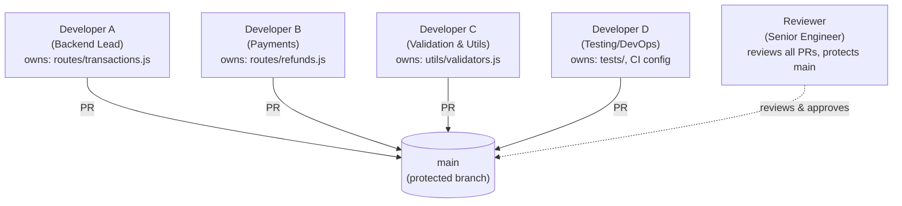

# Module 7 — Master Git Through Projects & Interview Preparation

> **Masterclass:** Git & GitHub Masterclass (7 Modules) — **Capstone Module**
> **Prerequisite:** Modules 1–6 (Fundamentals through Real-World Workflow)
> **Module Goal:** Consolidate everything into three hands-on projects, a realistic 5-developer team simulation covering every advanced scenario you'll face professionally, a comprehensive interview question bank, and 100 practice questions to cement true mastery.
> **Audience:** You should be comfortable with all of Modules 1–6. This module is applied practice, not new theory — though a few new integrative ideas appear.

---

## 📖 Table of Contents

1. [How to Use This Module](#1-how-to-use-this-module)
2. [Project 1 — Personal Portfolio](#2-project-1--personal-portfolio)
3. [Project 2 — Node.js REST API](#3-project-2--nodejs-rest-api)
4. [Project 3 — FinPilot Workflow (Capstone Simulation)](#4-project-3--finpilot-workflow-capstone-simulation)
5. [Simulating a Team of 5 Developers](#5-simulating-a-team-of-5-developers)
6. [Simulation Scenarios](#6-simulation-scenarios)
7. [Interview Questions — Beginner](#7-interview-questions--beginner)
8. [Interview Questions — Intermediate](#8-interview-questions--intermediate)
9. [Interview Questions — Senior](#9-interview-questions--senior)
10. [Company-Style Scenario Questions](#10-company-style-scenario-questions)
11. [Master Git Cheat Sheet](#11-master-git-cheat-sheet)
12. [Command Comparison Tables](#12-command-comparison-tables)
13. [100 Practice Questions](#13-100-practice-questions)
14. [Final Key Takeaways — The Whole Masterclass](#14-final-key-takeaways--the-whole-masterclass)

---

## 1. How to Use This Module

This module has no new mechanics to learn — its job is to force **retrieval and application** of everything from Modules 1–6, which is how real mastery is built. The recommended approach:

1. **Build Projects 1 and 2 for real**, on your own machine, pushed to your own GitHub. Don't just read the steps — type every command.
2. **Simulate Project 3 solo**, playing all 5 developer roles yourself across different branches — this is how you safely practice conflicts, rebases, and hotfixes without needing 4 other people.
3. **Attempt every interview question before reading the answer.** Cover the answer with your hand/a note, answer out loud or in writing, then check yourself.
4. **Treat the 100 practice questions as a real exam** — set a timer, answer in one sitting, then review.

---

## 2. Project 1 — Personal Portfolio

### 2.1 Goal

Build and deploy a simple personal portfolio site, using this as a low-stakes environment to practice the **full daily workflow** from Modules 1–2 before moving to more complex branching scenarios.

### 2.2 Step-by-Step

```bash
mkdir ashish-portfolio && cd ashish-portfolio
git init
git branch -M main
```

**Create a `.gitignore` immediately (Module 2, Section 9):**
```gitignore
node_modules/
.env
dist/
.DS_Store
```

**Build incrementally, with atomic commits (Module 2, Section 4):**
```bash
# Structure
mkdir src
touch src/index.html src/style.css src/script.js README.md

git add README.md .gitignore
git commit -m "chore: initial project setup"

git add src/index.html
git commit -m "feat: add basic HTML structure with hero section"

git add src/style.css
git commit -m "feat: add base styling and layout"

git add src/script.js
git commit -m "feat: add smooth scroll navigation"
```

**Push to GitHub (Module 4):**
```bash
git remote add origin git@github.com:ashish8824/ashish-portfolio.git
git push -u origin main
```

**Add a feature via a branch (Module 3):**
```bash
git switch -c feature/dark-mode-toggle
git add src/script.js src/style.css
git commit -m "feat: add dark mode toggle with localStorage persistence"
git push -u origin feature/dark-mode-toggle
```

Open a Pull Request, review it yourself (or ask a friend), merge via **Squash and Merge** (Module 4, Section 11), then:
```bash
git switch main
git pull origin main
git branch -d feature/dark-mode-toggle
```

**Tag your first live version (Module 3, Section 13):**
```bash
git tag -a v1.0.0 -m "Release 1.0.0: initial portfolio launch"
git push origin v1.0.0
```

### 2.3 Practice Checklist for This Project

- [ ] At least 8 atomic, well-described commits
- [ ] At least one feature branch, merged via PR
- [ ] A properly configured `.gitignore` from the start
- [ ] One tagged release
- [ ] A clean `git log --oneline --graph` telling a readable story

---

## 3. Project 2 — Node.js REST API

### 3.1 Goal

Build a small REST API (e.g., a simple "Notes" API) to practice **branching, merge conflicts, and undo operations** in a slightly more realistic backend context, applying Modules 2–3 deliberately.

### 3.2 Step-by-Step

```bash
mkdir notes-api && cd notes-api
npm init -y
npm install express
git init && git branch -M main
```

```gitignore
node_modules/
.env
```

```bash
git add .
git commit -m "chore: initial Express project setup"
```

**Build the core API across meaningful commits:**
```bash
git add server.js
git commit -m "feat: add basic Express server"

git add routes/notes.js
git commit -m "feat(notes): add GET /notes endpoint"

git add routes/notes.js
git commit -m "feat(notes): add POST /notes endpoint"
```

**Deliberately practice a merge conflict (Module 3, Section 6):**
```bash
git switch -c feature/note-validation
# edit routes/notes.js to add validation
git commit -am "feat(notes): add input validation"

git switch main
# ALSO edit the same lines in routes/notes.js differently
git commit -am "refactor(notes): restructure route handler"

git switch feature/note-validation
git merge main
# resolve the conflict deliberately, following Module 3's process
git add routes/notes.js
git commit
```

**Practice an undo scenario (Module 2):**
```bash
# Commit something you didn't mean to
echo "console.log('debug')" >> server.js
git add server.js
git commit -m "oops debug log"

# Undo it safely since it's not pushed yet
git reset --soft HEAD~1
git restore --staged server.js
git restore server.js
```

**Practice rebase before opening a PR (Module 3, Section 9):**
```bash
git switch feature/note-validation
git fetch origin
git rebase origin/main
git push -u origin feature/note-validation
```

### 3.3 Practice Checklist for This Project

- [ ] At least one deliberately-triggered and resolved merge conflict
- [ ] At least one use of `git reset` to undo a mistake before it was pushed
- [ ] At least one successful rebase onto `main`
- [ ] A Pull Request merged, with the branch cleaned up afterward

---

## 4. Project 3 — FinPilot Workflow (Capstone Simulation)

### 4.1 Goal

This is the **full-scale simulation**, tying together every module. You'll play multiple roles across a realistic sprint, including the team simulation detailed in Section 5.

### 4.2 Setup

```bash
mkdir finpilot-capstone && cd finpilot-capstone
npm init -y
npm install express
git init && git branch -M main
```

Recreate the FinPilot structure used throughout this masterclass:
```bash
mkdir routes utils tests
touch server.js routes/transactions.js routes/refunds.js utils/validators.js
```

```gitignore
node_modules/
.env
coverage/
```

```bash
git add .
git commit -m "chore: initial FinPilot API scaffold"
git remote add origin git@github.com:ashish8824/finpilot-capstone.git
git push -u origin main
```

From here, proceed directly into the team simulation (Section 5) — this project **is** the simulation.

---

## 5. Simulating a Team of 5 Developers

Since you likely don't have 4 spare developers on hand, you'll simulate this **solo**, using separate local branches (and, ideally, separate local clones or worktrees — Module 5, Section 14 — for maximum realism) to represent each teammate.

### 5.1 The Roles



### 5.2 Setting Up the Simulation

**Option A — Simple (single local clone, switching branches to "become" each developer):**
```bash
git switch -c dev-a/transactions-pagination
# ... work as Developer A ...
git switch main
git switch -c dev-b/refund-limits
# ... work as Developer B ...
```

**Option B — Realistic (using worktrees, Module 5 Section 14, so each "developer" has their own working folder):**
```bash
git worktree add ../finpilot-dev-a dev-a/transactions-pagination
git worktree add ../finpilot-dev-b dev-b/refund-limits
git worktree add ../finpilot-dev-c dev-c/amount-validation
git worktree add ../finpilot-dev-d dev-d/test-coverage
```

Option B is strongly recommended for this exercise — it makes the simulation feel genuinely close to a multi-developer environment, since each "developer" has an independent working directory that won't interfere with the others mid-task.

---

## 6. Simulation Scenarios

Work through each scenario below, in order, on your `finpilot-capstone` repo.

### 6.1 Scenario: Parallel Feature Development

**Developer A** (`dev-a/transactions-pagination`):
```bash
git switch -c dev-a/transactions-pagination
# edit routes/transactions.js: add pagination
git add routes/transactions.js
git commit -m "feat(transactions): add limit/offset pagination"
git push -u origin dev-a/transactions-pagination
```

**Developer B** (`dev-b/refund-limits`), working at the same time:
```bash
git switch main
git switch -c dev-b/refund-limits
# edit routes/refunds.js: add a max refund limit check
git add routes/refunds.js
git commit -m "feat(refunds): enforce maximum refund limit"
git push -u origin dev-b/refund-limits
```

Both open PRs independently. **Reviewer** approves Developer A's PR first; it merges cleanly (no conflicts, different files).

### 6.2 Scenario: Merge Conflict Between Two Developers

**Developer C** (`dev-c/amount-validation`) and **Developer A**, both need to touch `utils/validators.js` around the same time.

```bash
git switch main
git switch -c dev-c/amount-validation
# edit utils/validators.js, add validateAmount function
git commit -am "feat(validators): add validateAmount function"
```

Meanwhile, Developer A's second task also touches `utils/validators.js`:
```bash
git switch main
git switch -c dev-a/currency-validation
# edit the SAME lines in utils/validators.js differently
git commit -am "feat(validators): add validateCurrency function"
git push -u origin dev-a/currency-validation
# This PR merges to main FIRST
```

Now Developer C rebases onto the updated `main` and hits a conflict:
```bash
git switch dev-c/amount-validation
git fetch origin
git rebase origin/main
```
```
CONFLICT (content): Merge conflict in utils/validators.js
```

**Resolve it (Module 3, Section 6.4):**
```bash
# open utils/validators.js, manually combine both functions
git add utils/validators.js
git rebase --continue
git push --force-with-lease origin dev-c/amount-validation
```

### 6.3 Scenario: Urgent Hotfix Mid-Sprint

While **Developer D** is deep in uncommitted test-writing work, a production bug is reported: refunds are being processed twice.

```bash
# Developer D stashes in-progress work
git stash push -m "WIP: refund test coverage"

git switch main
git pull origin main
git switch -c hotfix/duplicate-refund

# fix, commit, push, fast-track review
git add routes/refunds.js
git commit -m "fix(refunds): prevent duplicate refund processing"
git push -u origin hotfix/duplicate-refund
```

**Reviewer** fast-tracks approval; merged directly to `main`.

```bash
git switch main
git pull origin main
git tag -a v2.3.1 -m "Hotfix 2.3.1: prevent duplicate refunds"
git push origin v2.3.1
```

Developer D returns to their original work:
```bash
git switch dev-d/test-coverage
git stash pop
```

### 6.4 Scenario: Cherry-Picking the Hotfix Into an In-Progress Branch

**Developer B**'s long-running `dev-b/refund-limits` branch was created *before* the hotfix, so it doesn't have the duplicate-refund fix. Rather than fully rebasing (which might disrupt ongoing work), Developer B cherry-picks just that fix:

```bash
git switch dev-b/refund-limits
git log hotfix/duplicate-refund --oneline
# find the fix commit hash
git cherry-pick <hotfix-commit-hash>
```

### 6.5 Scenario: Cleaning Up Messy History Before a PR (Interactive Rebase)

**Developer C**, before opening the PR for `dev-c/amount-validation`, realizes their commit history is messy (typo fixes, "oops" commits):

```bash
git switch dev-c/amount-validation
git log --oneline
```
```
f6a7b8c oops missed a semicolon
e5f6a7b fix typo
d4e5f6a feat(validators): add validateAmount function
```

```bash
git rebase -i HEAD~3
```
```
pick d4e5f6a feat(validators): add validateAmount function
fixup e5f6a7b fix typo
fixup f6a7b8c oops missed a semicolon
```

**Result:** one clean commit, ready for review.

### 6.6 Scenario: A Bad Merge Reaches `main` and Needs a Rollback

Two days after `dev-a/currency-validation` merges, a bug report reveals it broke currency conversion for EUR.

```bash
git switch main
git pull origin main
git log --oneline
```

```bash
git revert <bad-merge-commit-hash>
git push origin main
```

**Reviewer** confirms the revert restores stable behavior; a follow-up branch (`dev-a/fix-currency-validation`) is created to properly re-implement the feature correctly, going through the full PR process again.

### 6.7 Scenario: Preparing and Tagging a Release

After a sprint's worth of merged PRs (pagination, refund limits, validators, duplicate-refund hotfix, currency fix):

```bash
git switch main
git pull origin main
git log v2.3.1..HEAD --oneline    # everything since the last tag
```

```bash
git tag -a v2.4.0 -m "Release 2.4.0: pagination, refund limits, validation improvements"
git push origin v2.4.0
```

Generate release notes (Module 6, Section 8), categorizing the merged PRs into Features / Fixes / Chores.

### 6.8 Full Simulation Summary Table

| Scenario | Concepts Practiced | Module Reference |
|---|---|---|
| Parallel feature development | Branching, independent PRs | Module 3, Module 4 |
| Merge conflict between two devs | Rebase conflicts, manual resolution, force-with-lease | Module 3 §6, §9; Module 4 §5.7 |
| Urgent hotfix mid-sprint | Stash, hotfix branching, tagging | Module 3 §14; Module 6 §1.11 |
| Cherry-picking a hotfix | Cherry-pick across branches | Module 3 §12 |
| Cleaning history before PR | Interactive rebase (fixup) | Module 3 §10 |
| Rollback after a bad merge | Revert on shared history | Module 2 §6.3; Module 6 §1.12 |
| Release tagging | Semantic versioning, tags, release notes | Module 6 §7, §8 |

---

## 7. Interview Questions — Beginner

**Q1: What is the difference between `git init` and `git clone`?**
> **A:** `git init` creates a brand-new, empty Git repository from an existing local folder. `git clone` downloads a complete existing repository (all files and history) from a remote source, such as GitHub.

**Q2: What are the three main states a file can be in within a Git repository?**
> **A:** Modified (changed but not yet staged), Staged (marked to be included in the next commit), and Committed (safely stored in the local repository history).

**Q3: What does `git status` do?**
> **A:** It shows the current state of the working directory and staging area — which files are untracked, modified, staged, or clean relative to the last commit.

**Q4: What is a commit?**
> **A:** A commit is a permanent, saved snapshot of the entire project at a specific point in time, along with metadata (author, timestamp, message) and a pointer to its parent commit(s).

**Q5: What is the difference between `git add .` and `git commit`?**
> **A:** `git add .` moves changes from the working directory into the staging area, preparing them to be included in the next commit. `git commit` actually saves the staged changes permanently into the repository's history.

**Q6: What is a branch in Git?**
> **A:** A branch is a movable pointer to a specific commit, allowing independent lines of development that can later be merged back together.

**Q7: What is the difference between a local repository and a remote repository?**
> **A:** A local repository lives on your own computer. A remote repository is a copy hosted elsewhere (like GitHub), used for backup, sharing, and collaboration.

**Q8: What does `.gitignore` do?**
> **A:** It tells Git which files or folders to never track, such as dependencies, secrets, or build output.

**Q9: What is the difference between `git push` and `git pull`?**
> **A:** `git push` uploads your local commits to a remote repository. `git pull` downloads new commits from a remote repository and merges them into your current branch.

**Q10: What is HEAD in Git?**
> **A:** HEAD is a pointer indicating your current position in the repository — normally pointing to the branch you currently have checked out.

**Q11: What is the purpose of a commit message?**
> **A:** It explains what changed and why, providing context for anyone (including your future self) reviewing the project's history.

**Q12: What does `git log` show?**
> **A:** The commit history of the current branch, including commit hashes, authors, dates, and messages.

**Q13: What is a merge conflict?**
> **A:** A situation where two branches have changed the same part of a file differently, and Git cannot automatically decide which version to keep, requiring manual resolution.

**Q14: What is the difference between GitHub and Git?**
> **A:** Git is the version control software itself, usable entirely offline. GitHub is a cloud-based hosting service for Git repositories that adds collaboration features like Pull Requests and Issues.

**Q15: What command would you use to create a new branch and switch to it in one step?**
> **A:** `git switch -c <branch-name>` (or the older equivalent, `git checkout -b <branch-name>`).

---

## 8. Interview Questions — Intermediate

**Q1: Explain the difference between `git merge` and `git rebase`.**
> **A:** `git merge` combines two branches by creating a new merge commit (unless a fast-forward is possible), preserving the true branching history. `git rebase` rewrites your branch's commits to sit on top of the target branch's latest commit, producing new commit hashes and a linear history — but should only be used on commits not yet shared with others.

**Q2: What is the difference between `git fetch` and `git pull`?**
> **A:** `git fetch` downloads new commits from a remote without merging them into your current branch — a safe, inspectable operation. `git pull` performs a fetch followed immediately by a merge (or rebase, with `--rebase`).

**Q3: Describe the three modes of `git reset` and what each affects.**
> **A:** `--soft` moves only the branch pointer, leaving the staging area and working directory untouched (changes appear staged). `--mixed` (default) also resets the staging area, leaving the working directory untouched (changes appear unstaged). `--hard` resets both the staging area and working directory, discarding uncommitted changes entirely.

**Q4: What is the difference between `git revert` and `git reset`, and when would you use each?**
> **A:** `git revert` creates a new commit that undoes a previous commit's changes, safely preserving history — ideal for anything already pushed/shared. `git reset` moves the branch pointer backward, potentially discarding commits from the branch's history — safe only for local, unpushed commits.

**Q5: What is a fast-forward merge, and when does it occur?**
> **A:** It occurs when the target branch has had no new commits since the source branch diverged, so Git simply moves the branch pointer forward with no new merge commit created.

**Q6: What is `git stash`, and what problem does it solve?**
> **A:** It temporarily saves uncommitted changes so you can switch context (e.g., branches) with a clean working directory, without committing unfinished work — solving the problem of needing to switch branches mid-task without losing or prematurely committing in-progress changes.

**Q7: What is `git cherry-pick`, and how is it different from merging a branch?**
> **A:** It copies one specific commit's changes onto your current branch as a new commit, without bringing in the rest of that commit's original branch — unlike merging, which brings in an entire branch's history or combined effect.

**Q8: Explain the fork workflow and why it's used for open-source contributions.**
> **A:** A contributor forks the original repository into their own GitHub account, clones their fork, adds the original as an `upstream` remote, makes changes on a branch, pushes to their fork (`origin`), and opens a Pull Request back to the original repository. It's used because contributors typically don't have direct write access to the original repository.

**Q9: What is the purpose of `.gitignore`, and what happens if a file was already committed before being added to it?**
> **A:** `.gitignore` prevents new, untracked files matching its patterns from being tracked. If a file was already committed before being ignored, it must be explicitly removed from tracking with `git rm --cached <file>` — `.gitignore` alone has no retroactive effect.

**Q10: What is the difference between `git branch -d` and `git branch -D`?**
> **A:** `-d` safely deletes a branch only if it's fully merged, refusing otherwise. `-D` force-deletes the branch regardless of merge status.

**Q11: What does `git reflog` show, and how is it different from `git log`?**
> **A:** `git reflog` shows every local position HEAD has pointed to over time, including commits made unreachable by resets, amends, or rebases. `git log` only shows commits currently reachable from your branch's history.

**Q12: What is a detached HEAD state?**
> **A:** A state where HEAD points directly to a specific commit hash instead of a branch name, typically entered by checking out a specific commit or tag — commits made here can become orphaned if you switch away without creating a branch first.

**Q13: Explain the difference between `origin` and `upstream` in a forked repository workflow.**
> **A:** `origin` refers to your own fork, where you push your work. `upstream` refers to the original repository you forked from, used to keep your fork synced with the latest official changes.

**Q14: What are the three GitHub Pull Request merge strategies, and what does each do?**
> **A:** "Create a merge commit" preserves all individual commits with an explicit merge commit. "Squash and merge" combines all commits into one clean commit. "Rebase and merge" replays each commit individually onto the target branch without a merge commit, keeping history linear.

**Q15: What is Semantic Versioning, and what triggers a MAJOR version bump?**
> **A:** A versioning convention (`MAJOR.MINOR.PATCH`) signaling compatibility: PATCH for backward-compatible fixes, MINOR for backward-compatible new features, and MAJOR for breaking changes that could require consumers to update their own code.

---

## 9. Interview Questions — Senior

**Q1: Explain, at the object-model level, exactly why rebasing a commit changes its hash even when its code content is identical.**
> **A:** A commit's SHA-1 hash is computed from its full content, which includes a pointer to its parent commit. Rebasing gives a commit a new parent, so even with identical tree/blob content, the commit object itself differs, producing a new hash — making rebased commits entirely new, independent objects from Git's perspective.

**Q2: Walk through exactly how you would recover a commit that was lost due to a teammate accidentally running `git reset --hard` with no other backup.**
> **A:** Run `git reflog` to find the commit hash from immediately before the reset (the "commit:" entry preceding the "reset:" entry), then run `git reset --hard <that-hash>` to restore the branch. This works because the underlying commit, tree, and blob objects aren't immediately deleted by a reset — they remain in the object database, reachable via reflog, until garbage collection eventually prunes genuinely unreferenced objects after the configured expiration window.

**Q3: Compare the tradeoffs of Git Flow, GitHub Flow, and Trunk-Based Development for a team scaling from 10 to 100 engineers.**
> **A:** Git Flow's structured, multi-branch model can become a coordination bottleneck at scale if releases are frequent, since `develop` and `release/*` branches require careful synchronization across many contributors. GitHub Flow scales reasonably well up to a point, but as team size grows, longer review queues and more frequent `main` contention can emerge without additional safeguards (like feature flags or path-based CI). Trunk-Based Development is specifically designed for this scale — minimizing branch divergence and merge pain — but requires substantial upfront investment in automated testing, feature flag infrastructure, and CI/CD maturity to be safe; without that investment, forcing trunk-based development at 100 engineers can destabilize `main` frequently.

**Q4: Explain why `git push --force-with-lease` can still fail even when you're certain no one else has touched the branch, and what that reveals about how it actually works.**
> **A:** `--force-with-lease` compares the remote branch's actual current state against your local remote-tracking reference (e.g., `origin/main` as of your last fetch) — not against your assumption or memory of the branch's state. If your remote-tracking reference is stale (you haven't fetched recently) even though no one has genuinely pushed new work, the safety check can still trigger, since Git is verifying against what it locally recorded, not performing a live check of collaborator activity. This reveals that `--force-with-lease` protects against divergence from your last-known reference point, not omniscient awareness of the remote's true current state — a `git fetch` immediately before force-pushing is still good practice.

**Q5: A production incident requires identifying which of the last 300 commits introduced a subtle performance regression, with no existing automated test for the specific symptom. Describe your complete approach.**
> **A:** First, write a minimal, reliable automated check that can detect the regression's specific symptom (e.g., a script measuring response time against a threshold, exiting non-zero if the threshold is exceeded) — this is a prerequisite for efficient bisection. Then run `git bisect start`, mark the current commit `bad` and a known-good older commit `good`, and use `git bisect run <script>` to let Git automatically binary-search through the ~300 commits (roughly 8-9 steps) and identify the exact first bad commit. If writing an automated check isn't feasible in the available time, fall back to manual `git bisect` stepping with hands-on verification at each step, still benefiting from the logarithmic search reduction versus checking commits linearly.

**Q6: In a monorepo using trunk-based development with feature flags, explain the specific role feature flags play in decoupling deployment from release, and why this distinction matters.**
> **A:** Feature flags allow code to be deployed to production (physically present and running) while remaining inactive/hidden from users until explicitly toggled on — this decouples "deployment" (code reaching production infrastructure) from "release" (the feature becoming visible/active to users). This matters because it allows continuous, low-risk deployment of incomplete or in-progress features directly to `main` and production (supporting trunk-based development's short-lived-branch model) while still controlling exactly when, and to whom (e.g., gradual rollout to a percentage of users), a feature actually becomes active — reducing the blast radius of a problematic feature without requiring a code rollback, since it can simply be flagged off.

**Q7: Explain why squash-merging every Pull Request can complicate root-cause analysis via `git bisect`, and how a team might mitigate this without abandoning squash merging.**
> **A:** Squash merging collapses a feature's entire development history into one commit on `main`, so `git bisect` run against `main` can only identify *which feature/PR* introduced a regression, not the specific intermediate commit within that feature's original development. Mitigation: ensure PR descriptions and squashed commit messages are detailed enough to quickly locate the likely cause once the offending PR is identified, and/or retain the original pre-squash commits accessible via the merged PR's page (which GitHub preserves) for manual deeper investigation once bisect narrows down to that specific PR — accepting a two-stage investigation process (coarse bisect, then manual fine-grained review) as the tradeoff for a clean `main` history.

**Q8: Describe how you would structure a monorepo's CI/CD pipeline to avoid running the entire test suite on every commit, referencing specific Git capabilities.**
> **A:** Use `git diff --name-only <base>...<head>` (or equivalent path-based change detection) to determine exactly which files/packages changed in a given commit or PR, then map those changed paths to the specific package(s) affected using a dependency graph (via monorepo tooling like Nx or Turborepo), running only the tests for affected packages and their dependents rather than the entire repository. Additionally, combine this with shallow or partial clones (Module 5) in the CI checkout step itself to reduce checkout time, and sparse-checkout if the CI job only needs specific subdirectories rather than the full monorepo snapshot.

---

## 10. Company-Style Scenario Questions

### 10.1 Google-Style Questions (Systems Thinking, Scale, Correctness)

**Q1:** *"You're designing the branching strategy for a new internal tool used by 500 engineers across 12 teams, deployed multiple times daily. What workflow would you propose, and what specific safeguards would you require before recommending trunk-based development at this scale?"*

> **Suggested approach:** Reference Module 6, Section 4 and Section 5's comparison table. Propose GitHub Flow as a safe starting baseline, and lay out the specific prerequisites (comprehensive automated test coverage, feature flag infrastructure, fast CI feedback loops, strong code review culture, path-based/selective CI if monorepo) that would need to be true before recommending a move toward trunk-based development — demonstrating you understand it's a maturity-gated decision, not a default best practice.

**Q2:** *"A commit somewhere in the last 5,000 commits introduced a memory leak that only manifests under sustained load after several hours. You have a load-testing script that can detect it, but each test run takes 2 hours. How do you find the offending commit efficiently, and what's the actual time cost?"*

> **Suggested approach:** `git bisect run` with the load-testing script (Module 5, Section 10.3), noting the binary search requires roughly log₂(5000) ≈ 13 steps — meaning even at 2 hours per test, total time is roughly 26 hours of automated (unattended) testing, dramatically better than a linear scan of 5,000 commits (up to 10,000 hours in the worst case). A strong answer also discusses whether the test can be shortened/parallelized, or whether a smaller reproducible test case could reduce the 2-hour cost per step.

**Q3:** *"Explain how Git's content-addressable storage model relates to build reproducibility and caching in a large-scale CI/CD system."*

> **Suggested approach:** Reference Module 1 (SHA-1 hashing, content-addressable objects) and Module 5 (packfiles, delta compression). A commit's hash uniquely and deterministically identifies its exact content; CI/CD and build-caching systems (e.g., Bazel-style remote caching, or monorepo tools like Nx) exploit this by keying build/test cache entries off content hashes (of source files or entire commit trees) rather than timestamps, guaranteeing that identical inputs always produce cache hits regardless of when or by whom they were built — directly leveraging Git's underlying hash-based object identity model as a foundation for reproducible, cacheable builds.

### 10.2 Amazon-Style Questions (Ownership, Operational Rigor, Incident Response)

**Q1:** *"You merged a Pull Request to `main` that passed all CI checks, but it caused a production outage 20 minutes after deployment. Walk through your exact incident response, including the specific Git commands you'd run, in order."*

> **Suggested approach:** Reference Module 6, Section 1.12. Immediate priority: restore service — `git revert <bad-commit>` on `main`, push, and trigger redeployment (or roll back the deployment to the previous tagged release directly if faster — `git checkout <previous-tag>`). Only after service is restored: root-cause analysis (possibly `git bisect` if the specific offending change within a squash-merged PR isn't immediately obvious), a proper fix on a new branch, thorough review, and — critically — a retrospective on why CI didn't catch the issue (a testing gap to close, referencing Module 6's CI/CD section).

**Q2:** *"A hotfix branch was created from `main` and merged back only into `main`, but the team also maintains a `develop` branch under a Git-Flow-like model. Two weeks later, the same bug resurfaces in a new release. Diagnose what went wrong and how you'd prevent recurrence."*

> **Suggested approach:** Reference Module 6, Section 2.3 — the hotfix was never merged into `develop`, so the next release (built from `develop`) never received the fix and reintroduced the bug. Prevention: enforce the Git Flow rule that hotfix and release branches always merge into both `main` and `develop`, potentially automated via a CI check or branch protection rule that flags hotfix branches not yet merged into `develop`.

**Q3:** *"Your team's monorepo CI takes 45 minutes per PR because every change re-runs the entire test suite across all 30 internal packages. You're asked to cut this to under 10 minutes without reducing test coverage. What's your plan?"*

> **Suggested approach:** Reference Module 6, Section 6 and this module's Section 9, Q8. Implement path-based/dependency-graph-aware CI (only test affected packages and their dependents), parallelize test execution across packages, leverage build/test result caching keyed off content hashes (Module 1/5), and consider shallow/partial clones for faster checkout — all while preserving full coverage by ensuring the dependency graph correctly identifies every downstream package actually affected by a given change.

### 10.3 Microsoft-Style Questions (Collaboration, Process Design, Practical Tradeoffs)

**Q1:** *"Your team is debating whether to require 'Squash and Merge' exclusively, or allow developers to choose their merge strategy per PR. Present the tradeoffs and make a recommendation."*

> **Suggested approach:** Reference Module 4, Section 11 and this module's Section 9, Q7. Squash-only: clean, consistent `main` history, simpler `git revert` of entire features, at some cost to `git bisect`/`blame` granularity. Per-PR choice: maximum flexibility, but inconsistent history shape makes `main`'s log harder to reason about as a whole, and inconsistent tooling behavior (e.g., some PRs show many commits, others show one). Recommendation: squash-only as a default policy for consistency, with a documented exception process (e.g., large multi-commit refactors where preserving history has clear reviewable value) rather than fully open per-PR choice.

**Q2:** *"A new engineer on your team keeps accidentally committing directly to `main` because they're not used to your branching workflow. Beyond just telling them not to, what systemic safeguards would you put in place?"*

> **Suggested approach:** Reference Module 4, Section 15.2 (branch protection rules) — configure `main` to reject direct pushes entirely, requiring all changes through Pull Requests regardless of seniority or intent. Supplement with clear onboarding documentation (a `CONTRIBUTING.md`, Module 6, Section 11) and possibly a local `pre-push` hook (Module 5, Section 11) as an early local warning, while recognizing server-side branch protection is the only safeguard that can't be accidentally bypassed.

**Q3:** *"Explain, to a non-technical product manager, why 'we merged the code' doesn't mean 'it's live for customers,' referencing your team's use of feature flags."*

> **Suggested approach:** Reference this module's Section 9, Q6. Merging means the code has been reviewed and integrated into the main codebase and may even be deployed to production servers — but feature flags act as a separate on/off switch controlling whether customers actually see or experience the new functionality. This lets engineering ship code frequently and safely (continuous deployment) while product/business stakeholders retain control over the actual customer-facing launch timing, independent of the engineering deployment schedule.

---

## 11. Master Git Cheat Sheet

*A single consolidated reference spanning all seven modules.*

### Setup
```bash
git config --global user.name "Name"
git config --global user.email "email"
git config --global core.editor "code --wait"
git config --global alias.st status
```

### Starting & Status
```bash
git init
git clone <url>
git status / git status -s
```

### Staging & Committing
```bash
git add <file> / <folder>/ / . / -A
git add -p <file>              # partial staging
git commit -m "message"
git commit --amend --no-edit
```

### History
```bash
git log --oneline --graph --all
git show <hash>
git diff / git diff --staged
git blame <file>
git reflog
```

### Undo
```bash
git restore <file>              # discard working dir changes
git restore --staged <file>      # unstage
git reset --soft/--mixed/--hard <commit>
git revert <commit>
```

### Branching & Merging
```bash
git branch / git branch -a
git switch -c <name> / git switch <name>
git branch -d / -D <name>
git merge <branch> / --no-ff / --squash
git merge --abort
```

### Rebase
```bash
git rebase <branch>
git rebase -i HEAD~N
git rebase --continue / --skip / --abort
```

### Cherry-Pick, Tags, Stash
```bash
git cherry-pick <hash>
git tag -a v1.0.0 -m "message"
git stash push -m "message" / pop / list / apply
```

### Remotes & Collaboration
```bash
git remote add origin <url>
git fetch origin
git pull origin main / --rebase
git push -u origin <branch> / --force-with-lease
```

### Advanced/Internals
```bash
git gc
git fsck --lost-found
git bisect start / good / bad / run
git worktree add <path> <branch>
git submodule add <url> <path>
```

---

## 12. Command Comparison Tables

### `restore` vs `reset` vs `revert`
| | Affects | Rewrites history? | Safe on shared commits? |
|---|---|---|---|
| `restore` | Working dir / staging area | No | N/A |
| `reset` | Branch pointer + staging (+ optionally working dir) | Yes | ⚠️ Only if unpushed |
| `revert` | Adds a new commit | No | ✅ Always safe |

### `merge` vs `rebase`
| | History shape | New commits? | Safe on shared branches? |
|---|---|---|---|
| `merge` | Preserves branching shape | Merge commit (unless FF) | ✅ Yes |
| `rebase` | Linear | Replaces all replayed commits | ⚠️ Only if unpushed |

### `fetch` vs `pull`
| | Downloads? | Merges automatically? |
|---|---|---|
| `fetch` | Yes | No |
| `pull` | Yes | Yes (merge or, with `--rebase`, rebase) |

### `checkout` vs `switch` vs `restore`
| | Purpose |
|---|---|
| `checkout` | Legacy, overloaded: branches + files + commits |
| `switch` | Modern, branches only |
| `restore` | Modern, files only |

### `clone` vs `fork`
| | Where copy lives | Needs write access to original? |
|---|---|---|
| `clone` | Your local machine | Yes, to push back |
| `fork` | New repo under your GitHub account | No |

### Git Flow vs GitHub Flow vs Trunk-Based
| | Branches | Release model |
|---|---|---|
| Git Flow | main, develop, feature/*, release/*, hotfix/* | Scheduled/versioned |
| GitHub Flow | main, feature/* | Continuous |
| Trunk-Based | mainly main | Continuous, high-frequency |

---

## 13. 100 Practice Questions

*Answer each in one sentence before checking your understanding against Modules 1–6. Numbers in brackets indicate the primary module for review if you're unsure.*

**Fundamentals [Module 1]**
1. What problem did distributed version control solve that centralized systems couldn't?
2. What are the four zones in Git's architecture?
3. What is stored inside a Git blob?
4. What is stored inside a Git tree?
5. What is stored inside a Git commit object?
6. Why does Git use SHA-1 hashes instead of sequential numbers?
7. What does HEAD normally point to?
8. What file tells Git which branch is currently checked out?
9. Why is Git branching described as "cheap"?
10. What's the difference between Git storing snapshots vs diffs?

**Daily Workflow [Module 2]**
11. What's the difference between `git add .` and `git add -A`?
12. What does `git add -p` let you do that plain `git add` doesn't?
13. What's a "good" commit, according to the atomic commit principle?
14. What does the `feat:` prefix mean in Conventional Commits?
15. What's the risk of using `git commit --amend` on a pushed commit?
16. What does `git log --oneline` show that plain `git log` doesn't?
17. What does `git blame` tell you?
18. What's unique about what `git reflog` can show compared to `git log`?
19. What's the difference between `git restore <file>` and `git restore --staged <file>`?
20. What's the difference between `reset --soft` and `reset --mixed`?
21. What does `reset --hard` do to your working directory?
22. When should you use `revert` instead of `reset`?
23. Why doesn't adding a file to `.gitignore` un-track it if it was already committed?
24. What command removes an already-tracked file from Git without deleting it from disk?
25. What does `git status -s` output format tell you with two-letter codes like `M `, ` M`, and `??`?

**Branching & Merging [Module 3]**
26. What's the difference between `git branch <name>` and `git switch -c <name>`?
27. When does a fast-forward merge happen?
28. When does a three-way merge create a merge commit?
29. What are the three parts of a merge conflict marker?
30. What does `git merge --abort` do?
31. What's the difference between finishing a merge conflict and a rebase conflict?
32. Why does rebase sometimes require resolving conflicts more than once?
33. What is the golden rule for choosing between `reset` and `revert`?
34. What does `git rebase -i` let you do that a normal rebase doesn't?
35. What's the difference between `squash` and `fixup` in an interactive rebase?
36. What does `git cherry-pick` copy, exactly?
37. What's the difference between a lightweight and an annotated tag?
38. What problem does `git stash` solve?
39. What's the difference between `git stash pop` and `git stash apply`?
40. Why is rebase considered risky on shared branches?

**Remotes & GitHub [Module 4]**
41. What's the difference between Git and GitHub?
42. What's the difference between cloning and forking a repository?
43. What does `origin` typically refer to?
44. What does `upstream` typically refer to, in a fork-based workflow?
45. What's the difference between `git fetch` and `git pull`?
46. What does the `-u` flag do in `git push -u origin main`?
47. Why is `--force-with-lease` safer than `--force`?
48. What's the difference between SSH and HTTPS authentication with GitHub?
49. What is a Pull Request, technically (Git concept or GitHub feature)?
50. What are the three PR merge strategies GitHub offers?
51. What does writing "Closes #42" in a PR description do?
52. What's the purpose of a CODEOWNERS file?
53. What do branch protection rules typically enforce?
54. What's the difference between an Issue and a Pull Request?
55. What does a GitHub Release typically bundle together?

**Advanced Internals [Module 5]**
56. What is a packfile, and why does Git use them?
57. What is delta compression, and does it contradict Git's snapshot model?
58. What makes an object eligible for garbage collection?
59. What's the difference between a direct reference and a symbolic reference?
60. What is detached HEAD state?
61. What's the risk of committing while in detached HEAD state?
62. Why is `git reflog` local-only?
63. How would you recover a commit lost to a hard reset?
64. How would you recover a deleted branch?
65. What does `git bisect` do, and why is it faster than linear checking?
66. What does `git bisect run` require to work automatically?
67. Why don't Git hooks apply automatically to everyone who clones a repo?
68. What problem does Git LFS solve?
69. What does a Git submodule actually store — a copy of files, or something else?
70. What must you remember to do after updating a submodule's content?
71. What problem does `git worktree` solve that `git stash` doesn't?
72. What's the difference between a shallow clone and a partial clone?
73. Why is deleting a file in a later commit insufficient to remove a secret from history?
74. What's the correct first step after discovering a committed secret?
75. What does `git fsck --lost-found` help you find?

**Real-World Workflow [Module 6]**
76. What's the core philosophical difference between Git Flow and GitHub Flow?
77. Why must hotfix and release branches merge into both `main` and `develop` in Git Flow?
78. What enables trunk-based development to merge incomplete features safely?
79. What's the main advantage of a monorepo for cross-project changes?
80. What's the main advantage of a polyrepo for team independence?
81. In Semantic Versioning, what triggers a MAJOR bump versus a MINOR bump?
82. Why does Conventional Commits formatting matter for automated release tooling?
83. What's the difference between CI and CD?
84. What Git events commonly trigger a GitHub Actions workflow?
85. Why is `git revert` generally preferred over `git reset --hard` for production rollbacks?

**Integration & Judgment [All Modules]**
86. If a teammate already pulled a commit you want to undo, should you reset or revert it?
87. If you need to combine three messy local commits into one before opening a PR, what command sequence would you use?
88. If your feature branch has diverged significantly from `main`, should you generally merge or rebase to catch up, assuming it's not yet pushed?
89. If you need just one specific fix from a long-running branch, without merging the whole thing, what command do you use?
90. If you're mid-edit and need to urgently switch branches without committing unfinished work, what do you use?
91. If a repository's clone time has become painfully slow due to a large committed binary from years ago, what's the general remediation path?
92. If your team requires all PRs to be squash-merged, what's the tradeoff for future `git bisect` usage?
93. If a hotfix needs to reach both `main` and an in-progress feature branch quickly, what's an efficient way to do that for the feature branch without a full rebase?
94. If you're unsure whether a commit has been pushed and shared, what's the safest assumption to make before rebasing or amending it?
95. If a CI pipeline requires passing tests before merge, and your local `pre-commit` hook already runs those same tests, why is the CI check still necessary?
96. What's the practical reason a team might choose GitHub Flow over full Git Flow for a continuously-deployed API?
97. Why would a large engineering organization invest in feature flags before adopting trunk-based development?
98. What's the relationship between a Git tag and a GitHub Release?
99. Why is understanding Git's object model (blobs, trees, commits, hashes) genuinely useful beyond just knowing which commands to type?
100. In your own words, summarize the single most important habit for producing a clean, professional, trustworthy Git history.

---

## 14. Final Key Takeaways — The Whole Masterclass

1. **Git's power comes from a simple, elegant foundation** — content-addressable snapshots, identified by hashes, connected by parent pointers — and everything else (branches, merges, rebase, remotes) is built as logical operations on top of that foundation.
2. **The four zones (Working Directory, Staging Area, Local Repository, Remote Repository) are the mental model for every command** — every operation you run moves data between exactly two of these zones, or undoes such a move.
3. **Daily discipline (atomic commits, clear messages, `git status` habitually) compounds into a trustworthy history** that pays off enormously during debugging, code review, and incident response.
4. **Branching and merging exist to enable safe, parallel, reviewable work** — and the golden rule (`reset` for private history, `revert`/never-rewrite for shared history) prevents nearly every serious team disaster.
5. **GitHub adds collaboration, automation, and process on top of Git** — Pull Requests, Issues, Actions, and Releases are tools for people and process, not changes to Git itself.
6. **Understanding Git's internals (packfiles, garbage collection, reflog, bisect) turns you from someone who follows Git recipes into someone who can debug, recover, and optimize Git itself** — a genuine differentiator at the senior level.
7. **Real teams choose workflows (Git Flow, GitHub Flow, Trunk-Based) based on release cadence and CI/CD maturity** — there's no universally correct choice, only fit-for-purpose decisions.
8. **Every advanced scenario — conflicts, rebases, hotfixes, rollbacks, releases — is just a combination of the fundamentals** you learned in Module 1, applied under realistic pressure.

---

> ✅ **Module 7 Complete — Masterclass Complete.**
>
> You've gone from "why does Git exist" to designing branching strategies, resolving conflicts under simulated team pressure, recovering from advanced disasters, and reasoning about workflow tradeoffs at a senior level. This is a genuinely complete, professional-grade Git and GitHub foundation — the kind that clears technical interviews and holds up under real production pressure.
>
> **Suggested next steps:** Apply this directly to your own portfolio projects (QueueCare, PulseBloom) — clean commit history, a proper branching workflow, and a tagged release history on both repositories will meaningfully strengthen your job search narrative alongside the technical skills themselves.
