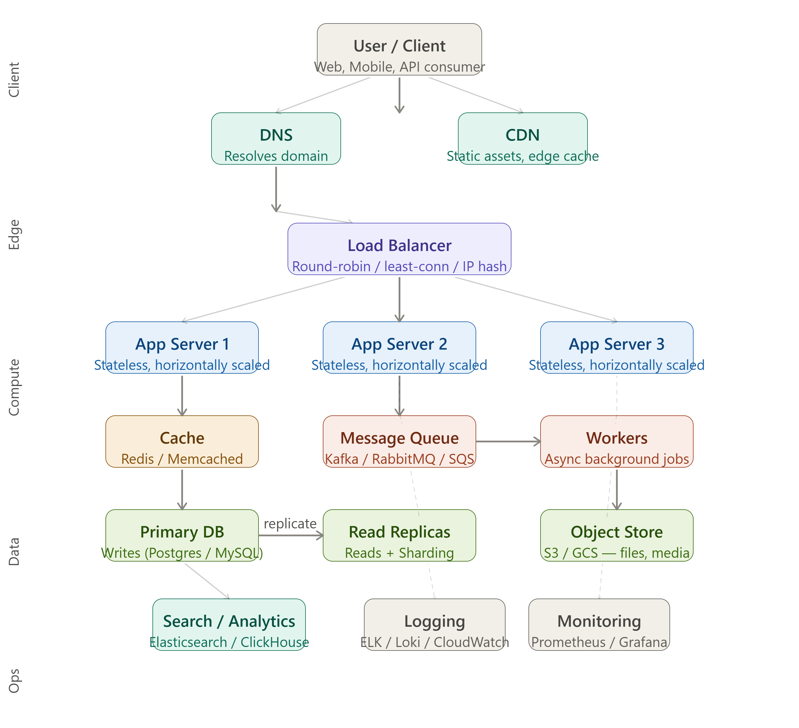

# High Level System Design — Complete Guide



> A generic reference to help you **ace any HLD round** — applicable to any product (URL shortener, Twitter, YouTube, Uber, etc.)

---

## Table of Contents

1. [What is High Level Design?](#1-what-is-high-level-design)
2. [The HLD Framework (Interview Strategy)](#2-the-hld-framework-interview-strategy)
3. [Layer 0 — Client](#3-layer-0--client)
4. [Layer 1 — Edge (DNS + CDN)](#4-layer-1--edge-dns--cdn)
5. [Load Balancer](#5-load-balancer)
6. [Layer 2 — Compute (App Servers)](#6-layer-2--compute-app-servers)
7. [Caching](#7-caching)
8. [Message Queue & Async Workers](#8-message-queue--async-workers)
9. [Layer 3 — Data Storage](#9-layer-3--data-storage)
10. [Search & Analytics](#10-search--analytics)
11. [Layer 4 — Observability (Logging & Monitoring)](#11-layer-4--observability-logging--monitoring)
12. [Scalability Patterns Cheat Sheet](#12-scalability-patterns-cheat-sheet)
13. [Non-Functional Requirements Checklist](#13-non-functional-requirements-checklist)
14. [End-to-End Request Lifecycle](#14-end-to-end-request-lifecycle)
15. [Common Interview Questions & Answers](#15-common-interview-questions--answers)

---

## 1. What is High Level Design?

High Level Design (HLD) is a **bird's-eye view** of a system — how its major components are structured, how they communicate, and how the system meets its non-functional requirements (scale, availability, latency, durability).

**HLD is NOT:**

- Code-level implementation (that's LLD)
- A database schema (that belongs in LLD)
- A step-by-step algorithm

**HLD IS:**

- Component identification and responsibility
- Data flow between components
- Technology choices with justification
- Trade-off decisions (CAP theorem, consistency vs availability)

---

## 2. The HLD Framework (Interview Strategy)

Follow this order in every HLD interview:

### Step 1 — Clarify Requirements (5 min)

Ask these questions before drawing anything:

- **Scale**: How many DAU (daily active users)? Reads vs writes ratio?
- **Latency**: What's the acceptable p99 latency?
- **Availability**: 99.9% or 99.99% uptime?
- **Consistency**: Strong or eventual consistency acceptable?
- **Features**: Which features are in scope for this round?

### Step 2 — Capacity Estimation (3–5 min)

Back-of-envelope math:

```
Traffic:     100M DAU × 10 req/day = ~12,000 RPS
Storage:     12,000 RPS × 1KB/req × 86400s = ~1 TB/day
Bandwidth:   12,000 RPS × 10KB = 120 MB/s
```

### Step 3 — High Level Architecture (10–15 min)

Draw the diagram layer by layer (Client → Edge → LB → Compute → Data → Ops).

### Step 4 — Deep Dive Key Components (10 min)

Pick the hardest/most interesting part and go deep (e.g., database sharding strategy, cache invalidation, consistency model).

### Step 5 — Identify Bottlenecks & Trade-offs (5 min)

- What breaks first at 10× scale?
- What are you trading off (cost vs latency, consistency vs availability)?

---

## 3. Layer 0 — Client

The **entry point** to your system.

| Client Type              | Notes                                          |
| ------------------------ | ---------------------------------------------- |
| Web Browser              | HTTP/HTTPS, can use WebSockets for real-time   |
| Mobile App (iOS/Android) | Same protocols, often uses long polling or SSE |
| External API Consumer    | REST or gRPC, needs rate limiting and auth     |
| IoT Devices              | MQTT or CoAP for lightweight pub/sub           |

**Key Decisions:**

- **REST vs gRPC**: REST for public APIs (easy to consume), gRPC for internal microservices (faster, typed contracts)
- **WebSocket vs Polling**: WebSocket for chat/live feeds; polling for simple dashboards
- **Auth**: JWT (stateless) for most cases; OAuth 2.0 for third-party login

---

## 4. Layer 1 — Edge (DNS + CDN)

### DNS (Domain Name System)

Translates `api.myapp.com` → IP address of your load balancer or CDN.

**Advanced DNS Patterns:**

- **Geo-routing (GeoDNS)**: Route Indian users to Mumbai, US users to Virginia — reduces latency by 100–200ms
- **Weighted routing**: Send 10% traffic to new infra (canary deployments)
- **Health-check based failover**: If region A is down, DNS automatically points to region B (Route53, Cloudflare)
- **TTL tuning**: Low TTL (30s) for fast failover; higher TTL (300s) to reduce DNS lookup overhead

### CDN (Content Delivery Network)

Serves static content from **edge nodes** close to users — bypasses your origin server entirely for cached assets.

**What to put on CDN:**

- JavaScript bundles, CSS, HTML (static site)
- Images, videos, fonts
- API responses that don't change per user (public feeds, product catalogs)

**CDN Caching Strategy:**

```
Cache-Control: public, max-age=31536000  → static assets (immutable with hash in filename)
Cache-Control: public, max-age=300       → semi-static (product listings)
Cache-Control: private, no-store        → user-specific (cart, profile)
```

**Popular CDNs:** Cloudflare, AWS CloudFront, Akamai, Fastly

**Interview tip:** Mention CDN as your first move for reducing latency and origin load. Interviewers love it.

---

## 5. Load Balancer

Acts as the **traffic director** — receives all client requests and distributes them across app servers.

### Load Balancing Algorithms

| Algorithm             | How it works                                   | When to use                                  |
| --------------------- | ---------------------------------------------- | -------------------------------------------- |
| Round Robin           | Requests go to servers 1, 2, 3, 1, 2, 3…       | Homogeneous servers, uniform request cost    |
| Least Connections     | Route to server with fewest active connections | Long-lived connections (WebSockets)          |
| IP Hash               | Same IP always goes to same server             | Stateful sessions without a session store    |
| Weighted Round Robin  | Server A gets 70%, Server B gets 30%           | Mixed capacity servers                       |
| Random with 2 choices | Pick 2 random, choose the less loaded          | Very high throughput, avoids thundering herd |

### L4 vs L7 Load Balancing

- **L4 (Transport Layer)**: Routes by IP + TCP port. Fast, no content inspection. (HAProxy, AWS NLB)
- **L7 (Application Layer)**: Routes by HTTP headers, URL path, cookies. Enables A/B testing, canary, path-based routing. (Nginx, AWS ALB, Traefik)

### Health Checks

Load balancers continuously probe `/health` endpoint on each server. If a server fails 3 consecutive checks → removed from rotation automatically.

### Stateless Servers (Critical!)

App servers must be **stateless** — no local state, no sessions stored in memory. This is what enables horizontal scaling:

- Sessions → Redis
- Files → S3
- Config → environment variables or secrets manager

---

## 6. Layer 2 — Compute (App Servers)

The core business logic lives here.

### Horizontal vs Vertical Scaling

|               | Vertical Scaling                | Horizontal Scaling      |
| ------------- | ------------------------------- | ----------------------- |
| What          | Bigger machine (more CPU/RAM)   | More machines           |
| Limit         | Physical ceiling of one machine | Almost unlimited        |
| Downtime      | Yes (restart needed)            | No (add instances live) |
| Cost          | Expensive past a point          | Commodity hardware      |
| Preferred for | Databases (initially)           | App servers always      |

### Auto-Scaling

Cloud providers (AWS EC2 Auto Scaling, GKE HPA) automatically add/remove instances based on metrics:

```
Rule: If average CPU > 70% for 2 minutes → add 2 instances
Rule: If average CPU < 30% for 10 minutes → remove 1 instance
```

### Microservices vs Monolith

**Start with a monolith.** Extract microservices only when you have a clear need (independent scaling, separate deployment cadence, team ownership).

**When to split:**

- User service vs Notification service (notifications need to scale independently)
- Payment service (needs PCI compliance isolation)
- Media processing (CPU-intensive, should not share resources with API tier)

**Communication between services:**

- Synchronous: REST/gRPC (for immediate response needed)
- Asynchronous: Message queue (for eventual processing, decoupling)

---

## 7. Caching

The single biggest performance lever in system design.

### Cache Placement Strategies

```
Client → [Client Cache] → CDN → [CDN Cache] → LB → App Server → [App Cache / Redis] → DB
```

Each layer catches requests before they reach the next.

### Cache-Aside (Lazy Loading) — Most Common Pattern

```
Read:
  1. Check cache
  2. If HIT → return cached value
  3. If MISS → query DB → store in cache → return value

Write:
  1. Write to DB
  2. Invalidate (delete) cache key  ← don't write to cache, let next read repopulate
```

### Write-Through Cache

Write to cache AND DB simultaneously. Ensures cache is always warm. Slight write latency overhead. Good for frequently-read, infrequently-written data.

### Write-Behind (Write-Back) Cache

Write to cache immediately; DB write is async (batched later). Very fast writes, risk of data loss if cache crashes before DB write. Use only where some loss is acceptable.

### Cache Eviction Policies

| Policy                      | Description                             | Use case                         |
| --------------------------- | --------------------------------------- | -------------------------------- |
| LRU (Least Recently Used)   | Evict the item not accessed the longest | General purpose (default)        |
| LFU (Least Frequently Used) | Evict the item accessed least often     | Popularity-based content         |
| TTL-based                   | Evict after fixed time                  | Data with known staleness window |
| FIFO                        | Evict oldest inserted item              | Simple queues                    |

### Cache Invalidation Problems

The hardest part. Three common issues:

1. **Thundering herd**: Cache expires → 10,000 requests hit DB simultaneously. **Fix:** Cache lock/mutex, jitter on TTL
2. **Cache stampede**: Same as above. **Fix:** Probabilistic early expiration (PER algorithm)
3. **Stale data**: Cache has old data. **Fix:** Event-driven invalidation (on write, publish event, consumers invalidate their cache)

### What to Cache

✅ Cache: DB query results, computed aggregations, user sessions, API responses, HTML fragments  
❌ Don't cache: User-specific sensitive data (or encrypt it), data that changes every second, one-time-use tokens

**Tools:** Redis (most common, supports data structures), Memcached (simpler, pure key-value, multi-threaded)

---

## 8. Message Queue & Async Workers

Decouples producers from consumers. Critical for resilience and throughput.

### Why Use a Message Queue?

Without queue:

```
User uploads video → App server processes video (30 sec) → User waits 30 sec ❌
```

With queue:

```
User uploads video → App server drops job on queue (instant) → Returns 200 OK ✅
                                              ↓
                                    Worker picks up job → Processes video (30 sec) → Sends notification
```

### Core Concepts

| Concept                 | Description                                                              |
| ----------------------- | ------------------------------------------------------------------------ |
| Producer                | Service that publishes messages                                          |
| Consumer                | Service that reads and processes messages                                |
| Queue                   | Point-to-point; one consumer gets each message                           |
| Topic / Pub-Sub         | One message → multiple consumers (fan-out)                               |
| Dead Letter Queue (DLQ) | Messages that fail repeatedly go here for inspection                     |
| Acknowledgement         | Consumer signals successful processing; otherwise message is redelivered |

### Kafka vs RabbitMQ vs SQS

|                   | Kafka                                 | RabbitMQ              | AWS SQS                   |
| ----------------- | ------------------------------------- | --------------------- | ------------------------- |
| Model             | Log-based pub/sub                     | Message broker (AMQP) | Managed queue             |
| Throughput        | Millions/sec                          | Thousands/sec         | High (managed)            |
| Message retention | Days/weeks (replayable)               | Until consumed        | 14 days max               |
| Ordering          | Per-partition ordering                | FIFO queues available | FIFO queues available     |
| Use case          | Event streaming, audit log, analytics | Task queues, RPC      | Simple async tasks on AWS |
| Complexity        | High                                  | Medium                | Low                       |

**Interview default:** Kafka for high-scale event streaming; SQS for simple async jobs on AWS; RabbitMQ for complex routing logic.

### Worker Patterns

- **Fan-out**: One event → multiple workers (email + SMS + push notification)
- **Rate limiting workers**: Process max N jobs/minute to protect downstream
- **Priority queues**: High-priority jobs skip ahead of low-priority
- **Idempotency**: Workers must be safe to run twice (in case of redelivery). Use idempotency keys.

---

## 9. Layer 3 — Data Storage

Choosing the right database is the most critical HLD decision.

### Database Selection Guide

| Data Type               | Database       | Examples                       |
| ----------------------- | -------------- | ------------------------------ |
| Relational / structured | SQL            | PostgreSQL, MySQL              |
| Document                | NoSQL Document | MongoDB, DynamoDB              |
| Key-Value               | NoSQL KV       | Redis, DynamoDB                |
| Wide-column             | NoSQL Column   | Cassandra, HBase               |
| Graph                   | Graph DB       | Neo4j, Amazon Neptune          |
| Time-series             | TSDB           | InfluxDB, TimescaleDB          |
| Full-text search        | Search Engine  | Elasticsearch, OpenSearch      |
| Files / Blobs           | Object Store   | S3, GCS, Azure Blob            |
| Analytics / OLAP        | Columnar       | ClickHouse, BigQuery, Redshift |

### SQL vs NoSQL — When to Choose What

**Choose SQL when:**

- You need ACID transactions (banking, orders, inventory)
- Data is relational and schema is stable
- You need complex joins and aggregations
- Team is familiar with SQL

**Choose NoSQL when:**

- You need horizontal write scaling beyond what SQL offers
- Schema is flexible / evolves rapidly
- You're storing user activity logs, events, or time-series data
- Latency requirements are extreme (sub-millisecond reads)

### Replication

Copies data from **primary** (write) to **replica** (read).

```
All WRITEs → Primary DB
         ↓ (async replication, ~ms lag)
All READs → Replica(s)  [can have many replicas]
```

**Benefits:** Increased read throughput, geographic distribution, failover  
**Downside:** Replication lag — replicas may be slightly behind primary (eventual consistency)

### Sharding (Horizontal Partitioning)

Split data across multiple DB servers. Each server owns a subset of data.

**Sharding strategies:**

| Strategy        | How                                | Good for             | Problem                         |
| --------------- | ---------------------------------- | -------------------- | ------------------------------- |
| Range-based     | Users A–M → Shard 1, N–Z → Shard 2 | Time-series          | Hotspot if one range is popular |
| Hash-based      | hash(user_id) % N → shard number   | Uniform distribution | Hard to add shards later        |
| Directory-based | Lookup table: user_id → shard      | Flexible             | Lookup table is a bottleneck    |
| Geo-based       | Indian users → India shard         | Compliance, latency  | Uneven distribution             |

**Problems with sharding:**

- Cross-shard queries are expensive (no JOINs across shards)
- Re-sharding (adding shard) requires data migration
- Distributed transactions are complex

### CAP Theorem

A distributed system can only guarantee **2 of 3**:

```
        Consistency
            /\
           /  \
          /    \
    Partition ---- Availability
    Tolerance
```

- **CP**: Consistent + Partition Tolerant. Data is always correct, but might be unavailable during partitions. (HBase, Zookeeper)
- **AP**: Available + Partition Tolerant. Always responds, but data might be stale. (Cassandra, DynamoDB)
- **CA**: Consistent + Available. Only works without network partitions — not realistic for distributed systems.

**Interview tip:** Always state your CAP choice and justify it. For user profiles → AP is fine. For financial transactions → CP is required.

### ACID vs BASE

| ACID (SQL)  | BASE (NoSQL)          |
| ----------- | --------------------- |
| Atomicity   | Basically Available   |
| Consistency | Soft state            |
| Isolation   | Eventually consistent |
| Durability  |                       |

---

## 10. Search & Analytics

### Full-Text Search

Don't do `LIKE '%query%'` in SQL — it's a full table scan.

**Elasticsearch / OpenSearch:**

- Inverted index: maps words → documents containing them
- Sub-second full-text search across billions of documents
- Sync from primary DB via CDC (Change Data Capture) or event stream

**Pattern:**

```
Write: Client → App → Primary DB → CDC (Debezium) → Kafka → Elasticsearch indexer
Read:  Client → App → Elasticsearch
```

### Analytics (OLAP)

Analytical queries (aggregations over millions of rows) should NEVER run on your operational DB (OLTP).

**Separate OLAP pipeline:**

```
Operational DB → ETL/CDC → Data Warehouse (BigQuery / Redshift / ClickHouse)
                                  ↓
                         BI Tools (Metabase, Grafana, Tableau)
```

**ClickHouse** is the current darling for real-time analytics — ingests millions of rows/second, columnar storage, blazing aggregation speed.

---

## 11. Layer 4 — Observability (Logging & Monitoring)

You can't fix what you can't see.

### The Three Pillars of Observability

| Pillar      | What                                                      | Tools                                     |
| ----------- | --------------------------------------------------------- | ----------------------------------------- |
| **Logs**    | Discrete events with context                              | ELK Stack, Loki + Grafana, CloudWatch     |
| **Metrics** | Numeric measurements over time (latency, error rate, CPU) | Prometheus + Grafana, Datadog, CloudWatch |
| **Traces**  | End-to-end journey of a single request across services    | Jaeger, Zipkin, AWS X-Ray, OpenTelemetry  |

### Logging Best Practices

```json
{
  "timestamp": "2026-06-29T10:30:00Z",
  "level": "ERROR",
  "service": "payment-service",
  "trace_id": "abc123",
  "user_id": "u_987",
  "message": "Payment failed",
  "error": "Insufficient funds",
  "duration_ms": 245
}
```

Always include: `trace_id` (correlate across services), `user_id`, `duration_ms`, structured JSON.

### Key Metrics to Track

| Metric         | Description                     | Alert threshold (example) |
| -------------- | ------------------------------- | ------------------------- |
| p99 latency    | 99th percentile response time   | > 500ms                   |
| Error rate     | % of 5xx responses              | > 0.1%                    |
| Throughput     | Requests per second             | Sudden drop               |
| CPU / Memory   | Resource utilization            | > 80%                     |
| Queue depth    | Backlog in message queue        | Growing trend             |
| DB connections | Active connections              | > 80% of pool             |
| Cache hit rate | % of requests served from cache | < 90%                     |

### Alerting

- **PagerDuty / OpsGenie** for on-call alerting
- Alert on symptoms (high latency, error rate) not causes (high CPU)
- Define SLOs: "99.9% of requests complete in < 200ms"
- SLO breach → alert → on-call engineer

---

## 12. Scalability Patterns Cheat Sheet

| Pattern            | Problem Solved                             | Example                               |
| ------------------ | ------------------------------------------ | ------------------------------------- |
| Horizontal scaling | Single server capacity limit               | Add more app servers behind LB        |
| Vertical scaling   | Quick win for DB                           | Upgrade RDS instance class            |
| Caching            | DB overload, high read latency             | Redis in front of DB                  |
| CDN                | Static asset latency, origin load          | CloudFront for images                 |
| Read replicas      | Read-heavy workload                        | 1 primary + 5 replicas                |
| Sharding           | Write-heavy workload beyond vertical limit | Hash shard by user_id                 |
| Message queue      | Slow async operations, decoupling          | Kafka for order processing            |
| Rate limiting      | Protect from abuse, fair use               | Token bucket per API key              |
| Circuit breaker    | Prevent cascade failures                   | Hystrix / Resilience4j                |
| Backpressure       | Consumer slower than producer              | Queue depth monitoring + flow control |
| CQRS               | Separate read/write models                 | Command DB vs Query DB                |
| Event sourcing     | Audit log, replay capability               | Store events, derive state            |

---

## 13. Non-Functional Requirements Checklist

Use this as a sanity check before ending your HLD answer:

### Availability

- [ ] Load balancer with health checks
- [ ] Multiple availability zones (multi-AZ)
- [ ] DB replication with auto-failover
- [ ] Circuit breakers between services
- [ ] Graceful degradation (return cached data if DB is down)

### Scalability

- [ ] Stateless app servers (enable horizontal scaling)
- [ ] Auto-scaling group
- [ ] Caching layer
- [ ] Database sharding plan (even if not needed yet)
- [ ] Async processing for heavy tasks

### Reliability

- [ ] Idempotent API operations
- [ ] Retry with exponential backoff + jitter
- [ ] Dead letter queues for failed messages
- [ ] Data backups and point-in-time recovery

### Security

- [ ] HTTPS everywhere (TLS termination at LB)
- [ ] JWT / OAuth2 authentication
- [ ] Rate limiting and throttling
- [ ] Input validation and parameterized queries (prevent SQL injection)
- [ ] Secrets in Secrets Manager (never in code)

### Performance

- [ ] CDN for static assets
- [ ] Cache hot data
- [ ] Database indexes on query columns
- [ ] Connection pooling (PgBouncer for Postgres)
- [ ] Async for non-critical path operations

---

## 14. End-to-End Request Lifecycle

**Example: User posts a tweet**

```
1. Client (Mobile App)
   └─ HTTPS POST /tweets  →

2. DNS resolves api.twitter.com → CDN/LB IP

3. CDN (Cloudflare)
   └─ Dynamic request, passes through to origin

4. Load Balancer (L7 — AWS ALB)
   └─ Routes to least-loaded App Server
   └─ Validates SSL, checks health

5. App Server (Node.js / Java / Go)
   ├─ Auth middleware: validate JWT token
   ├─ Rate limit check: Redis → "user X has posted 3 times this minute"
   ├─ Input validation (tweet ≤ 280 chars)
   ├─ Write tweet → Primary DB (Postgres)
   ├─ Publish event to Kafka: { type: "tweet_created", user_id, tweet_id }
   └─ Return 201 Created to client (fast!)

6. Kafka Consumers (async, after response sent):
   ├─ Fanout Worker: push tweet to followers' timeline cache
   ├─ Notification Worker: send push notifications to @mentions
   ├─ Search Indexer: index tweet in Elasticsearch
   └─ Analytics Worker: record event in ClickHouse

7. Next Read Request: "get my timeline"
   ├─ Check Redis cache (timeline:user_123) → HIT → return (< 5ms)
   └─ Cache MISS → query DB → populate cache → return

8. Observability (parallel, always):
   ├─ Structured log → Loki
   ├─ Trace span → Jaeger
   └─ Metrics → Prometheus → Grafana dashboard
```

---

## 15. Common Interview Questions & Answers

**Q: How would you handle 10× traffic spike suddenly?**  
A: Auto-scaling triggers more app servers. CDN absorbs static traffic. Rate limiting protects DB. Redis cache absorbs most reads. Message queue absorbs write bursts — workers process at their own pace.

**Q: How do you ensure no messages are lost in the queue?**  
A: Producer uses acknowledgement (acks=all in Kafka). Consumer sends ACK only after successful processing. Failed messages go to DLQ after N retries. DLQ is monitored and alerted on.

**Q: How do you handle database hotspots?**  
A: Identify hot keys via DB slow query logs. Cache hot keys in Redis. If a specific shard is hot (celebrity user), use dedicated shard or cache that user's data more aggressively.

**Q: Explain the difference between replication and sharding.**  
A: Replication creates **copies** of the same data — improves read throughput and availability. Sharding **splits** data across servers — improves write throughput and storage capacity. You typically use both together.

**Q: When would you choose eventual consistency over strong consistency?**  
A: For user timelines, like counts, follower counts — a 1-second delay is acceptable. For financial transactions, inventory deduction, seat booking — strong consistency is required to prevent double-spending or double-booking.

**Q: How does your system handle partial failures (one service goes down)?**  
A: Circuit breaker pattern (Resilience4j / Hystrix). If Payment service fails 50% of requests in 10s → open circuit → return fallback response. This prevents cascade failure where the API server's thread pool gets exhausted waiting for the dead service.

---

## Quick Reference — Technology Choices

| Need                    | Default Choice                  | Alternative           |
| ----------------------- | ------------------------------- | --------------------- |
| API Layer               | Node.js / Go / Java Spring Boot | FastAPI (Python)      |
| Cache                   | Redis                           | Memcached             |
| Message Queue           | Kafka                           | AWS SQS, RabbitMQ     |
| SQL DB                  | PostgreSQL                      | MySQL                 |
| NoSQL                   | DynamoDB                        | MongoDB, Cassandra    |
| Object Storage          | AWS S3                          | GCS, Cloudflare R2    |
| Search                  | Elasticsearch                   | OpenSearch, Typesense |
| CDN                     | Cloudflare                      | AWS CloudFront        |
| Monitoring              | Prometheus + Grafana            | Datadog               |
| Logging                 | ELK Stack                       | Loki + Grafana        |
| Tracing                 | Jaeger                          | AWS X-Ray             |
| Container Orchestration | Kubernetes                      | AWS ECS Fargate       |
| CI/CD                   | GitHub Actions                  | Jenkins, GitLab CI    |

---

_Generated for interview prep — covers 90% of what any HLD interview will test. Go deep on whichever layer matters most for the specific system you're designing._
