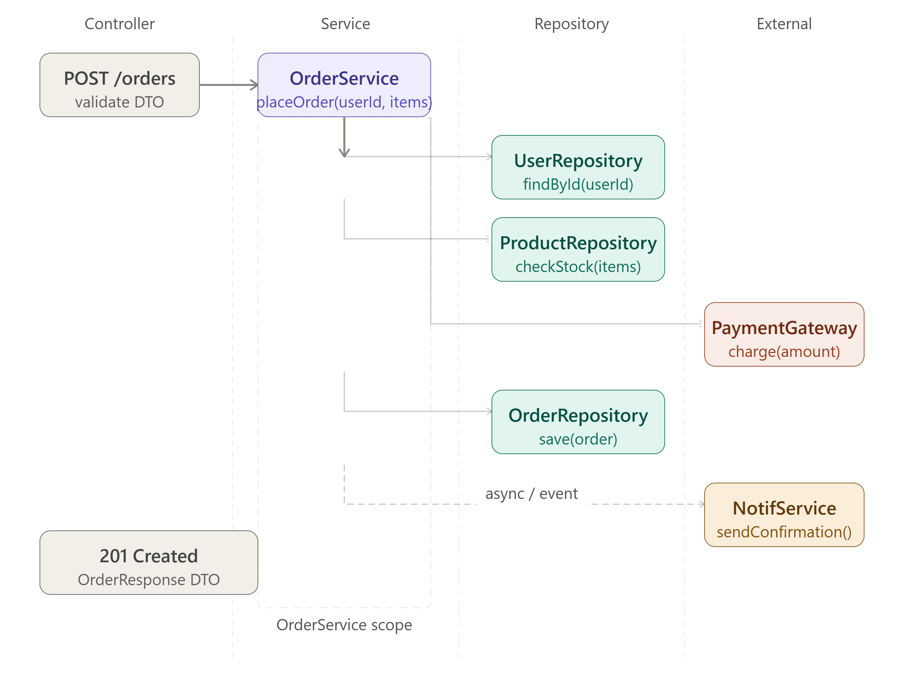
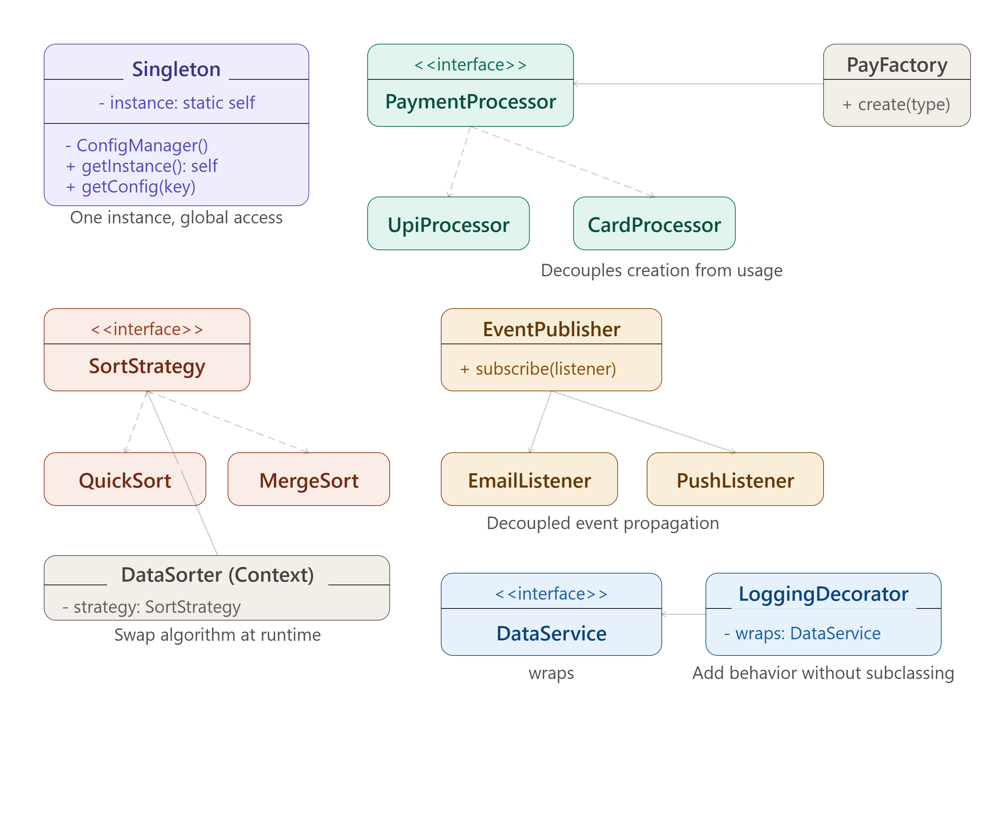
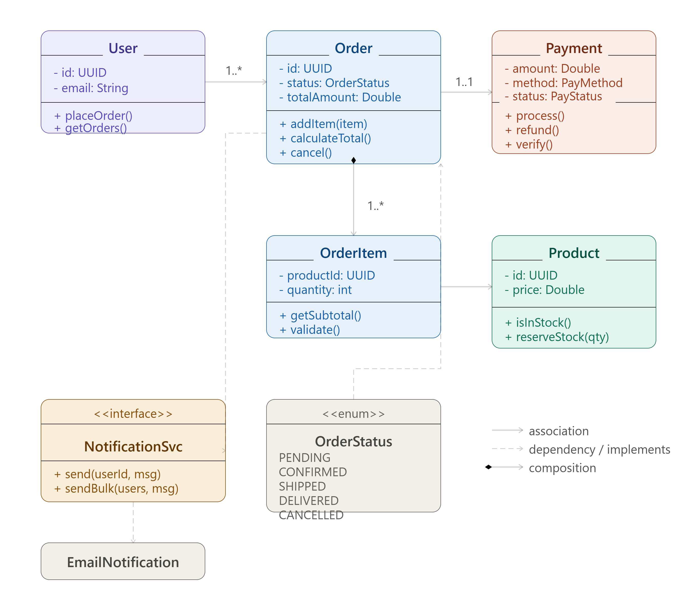

# Low Level Design — Complete Guide





> A generic, interview-ready reference covering OOP principles, design patterns, class diagrams, SOLID, and code-level design for any LLD round.

---

## Table of Contents

1. [What is Low Level Design?](#1-what-is-low-level-design)
2. [LLD vs HLD — Key Differences](#2-lld-vs-hld--key-differences)
3. [The LLD Interview Framework](#3-the-lld-interview-framework)
4. [SOLID Principles](#4-solid-principles)
5. [OOP Concepts Deep Dive](#5-oop-concepts-deep-dive)
6. [UML Class Diagram Notation](#6-uml-class-diagram-notation)
7. [Relationships Between Classes](#7-relationships-between-classes)
8. [Layered Architecture (Controller → Service → Repository)](#8-layered-architecture-controller--service--repository)
9. [Design Patterns — Creational](#9-design-patterns--creational)
10. [Design Patterns — Structural](#10-design-patterns--structural)
11. [Design Patterns — Behavioral](#11-design-patterns--behavioral)
12. [Design Patterns — Comparison Table](#12-design-patterns--comparison-table)
13. [End-to-End LLD Example — Parking Lot](#13-end-to-end-lld-example--parking-lot)
14. [End-to-End LLD Example — Food Delivery](#14-end-to-end-lld-example--food-delivery)
15. [Exception Handling & Validation Strategy](#15-exception-handling--validation-strategy)
16. [Concurrency in LLD](#16-concurrency-in-lld)
17. [Common Interview Questions & Answers](#17-common-interview-questions--answers)
18. [LLD Checklist Before You Finish](#18-lld-checklist-before-you-finish)

---

## 1. What is Low Level Design?

Low Level Design (LLD) translates the high-level architecture into **implementable code structure**. It defines:

- Which classes/interfaces exist and what they own
- How classes relate to each other (inheritance, composition, dependency)
- Which design patterns apply and why
- Method signatures, field types, access modifiers
- How SOLID principles are applied

**LLD output includes:**

- Class diagrams with fields and methods
- Sequence diagrams showing method call flow
- Concrete design pattern implementations
- Code skeletons (pseudocode or actual Java/Python)

---

## 2. LLD vs HLD — Key Differences

| Dimension        | HLD                       | LLD                                  |
| ---------------- | ------------------------- | ------------------------------------ |
| Level            | System                    | Component / Class                    |
| Focus            | What components exist     | How each component works internally  |
| Output           | Architecture diagram      | Class diagram + code skeleton        |
| Technologies     | Load balancer, CDN, Kafka | Classes, interfaces, design patterns |
| Decision         | Kafka vs SQS              | Observer vs Strategy                 |
| Audience         | Architects, PMs           | Engineers implementing the code      |
| Interview timing | First round               | Second or same round, deeper         |

---

## 3. The LLD Interview Framework

Follow this sequence every time:

### Step 1 — Clarify scope (3 min)

- What features are in scope?
- What scale assumptions? (affects which patterns matter)
- Any specific constraints? (language, frameworks?)

### Step 2 — Identify entities (3 min)

List all the nouns in the problem. Each noun is likely a class:

```
Problem: "Design a parking lot"
Nouns: ParkingLot, Floor, Slot, Vehicle, Ticket, Payment, Gate
```

### Step 3 — Define relationships (3 min)

Map entities:

- ParkingLot **has many** Floors (composition)
- Floor **has many** Slots (composition)
- Slot **holds** Vehicle (association)
- Vehicle **generates** Ticket (dependency)

### Step 4 — Draw class diagram (10 min)

Fields + methods + visibility + relationships for each class.

### Step 5 — Apply design patterns (5 min)

Identify where patterns improve extensibility:

- Factory for Vehicle types
- Strategy for pricing
- Observer for notifications
- Singleton for ParkingLot manager

### Step 6 — Code skeleton (5 min)

Write the key class(es) with method bodies or pseudocode.

### Step 7 — Walk through a use case (3 min)

Trace a `parkVehicle()` call end-to-end through your classes.

---

## 4. SOLID Principles

The foundation of every LLD answer. Interviewers check these implicitly.

### S — Single Responsibility Principle

> A class should have only one reason to change.

**Bad:**

```java
class OrderService {
    public void placeOrder(Order order) { ... }
    public void sendEmail(Order order) { ... }   // ❌ not order's job
    public void generateInvoice(Order order) { ... } // ❌ not order's job
}
```

**Good:**

```java
class OrderService {
    public void placeOrder(Order order) { ... }   // ✅ only order logic
}
class NotificationService {
    public void sendEmail(Order order) { ... }    // ✅ separate responsibility
}
class InvoiceService {
    public void generateInvoice(Order order) { ... } // ✅ separate
}
```

### O — Open/Closed Principle

> Open for extension, closed for modification.

**Bad:** Adding a new payment method means modifying `PaymentService` with another `if` block.

**Good:**

```java
interface PaymentProcessor {
    void process(Payment payment);
}

class UpiProcessor implements PaymentProcessor {
    public void process(Payment payment) { /* UPI logic */ }
}

class CardProcessor implements PaymentProcessor {
    public void process(Payment payment) { /* card logic */ }
}

// Adding WalletProcessor never touches existing classes
class WalletProcessor implements PaymentProcessor {
    public void process(Payment payment) { /* wallet logic */ }
}
```

### L — Liskov Substitution Principle

> Subtypes must be substitutable for their base types without breaking correctness.

**Violation:**

```java
class Bird {
    public void fly() { ... }
}
class Ostrich extends Bird {
    public void fly() { throw new UnsupportedOperationException(); } // ❌ breaks LSP
}
```

**Fix:** Separate `FlyingBird` from `Bird`. Don't force an ostrich to fly.

### I — Interface Segregation Principle

> Don't force a class to implement methods it doesn't need.

**Bad:**

```java
interface Worker {
    void work();
    void eat();
    void sleep();
}
// Robot must implement eat() and sleep() even though it doesn't eat or sleep ❌
```

**Good:**

```java
interface Workable { void work(); }
interface Eatable  { void eat(); }
// Robot implements only Workable ✅
```

### D — Dependency Inversion Principle

> Depend on abstractions, not concretions.

**Bad:**

```java
class OrderService {
    private MySQLOrderRepository repo = new MySQLOrderRepository(); // ❌ hardcoded
}
```

**Good:**

```java
class OrderService {
    private final OrderRepository repo;
    public OrderService(OrderRepository repo) { // ✅ injected abstraction
        this.repo = repo;
    }
}
```

---

## 5. OOP Concepts Deep Dive

### Encapsulation

Hide internal state. Expose only what's needed via public methods.

```java
class BankAccount {
    private double balance;                            // hidden
    public void deposit(double amount) {               // controlled access
        if (amount <= 0) throw new IllegalArgumentException();
        balance += amount;
    }
    public double getBalance() { return balance; }
}
```

### Inheritance

Reuse and extend behaviour. Use sparingly — prefer composition.

```java
abstract class Vehicle {
    protected String id;
    public abstract double calculateFare(int hours);
}

class Car extends Vehicle {
    public double calculateFare(int hours) { return hours * 50.0; }
}

class Bike extends Vehicle {
    public double calculateFare(int hours) { return hours * 20.0; }
}
```

### Polymorphism

Same interface, different implementations.

```java
Vehicle v = new Car();
v.calculateFare(3);  // calls Car's implementation
v = new Bike();
v.calculateFare(3);  // calls Bike's implementation — same call, different result
```

### Abstraction

Expose _what_ an operation does, not _how_.

```java
interface NotificationService {
    void send(String userId, String message);  // what — no implementation detail
}
```

### Composition over Inheritance

**Rule of thumb:** "Has-a" is usually better than "is-a" for code reuse.

```java
// Bad: inheritance for reuse
class LoggingOrderService extends OrderService { ... }  // tightly coupled

// Good: composition
class LoggingOrderService implements OrderServiceInterface {
    private final OrderService delegate;
    private final Logger logger;

    public Order placeOrder(PlaceOrderRequest req) {
        logger.info("Placing order: {}", req);
        Order order = delegate.placeOrder(req);
        logger.info("Order placed: {}", order.getId());
        return order;
    }
}
```

---

## 6. UML Class Diagram Notation

### Visibility Modifiers

| Symbol | Visibility      |
| ------ | --------------- |
| `+`    | public          |
| `-`    | private         |
| `#`    | protected       |
| `~`    | package-private |

### Field and Method Syntax

```
ClassName
─────────────────────
- fieldName: Type
─────────────────────
+ methodName(param: Type): ReturnType
# protectedMethod(): void
```

### Stereotypes

```
<<interface>>   — abstract contract, no state
<<abstract>>    — cannot be instantiated
<<enum>>        — fixed set of constants
<<service>>     — stateless business logic component
<<repository>>  — data access component
```

---

## 7. Relationships Between Classes

### Association

A uses B. Weakest relationship. Neither owns the other.

```
User ────────> Order    (User places Orders)
```

**Multiplicity:**

- `1..1` — exactly one
- `0..1` — zero or one (optional)
- `1..*` — one or more
- `0..*` or `*` — zero or more

### Aggregation

A "has" B, but B can exist independently. (hollow diamond)

```
Department ◇────> Employee    (Employee can exist without Department)
```

### Composition

A "owns" B. B cannot exist without A. (filled diamond)

```
Order ◆────> OrderItem    (OrderItem dies when Order is deleted)
```

In code:

```java
class Order {
    private List<OrderItem> items = new ArrayList<>(); // created inside, owned fully
}
```

### Inheritance / Generalization

B is a type of A.

```
Animal ◁────── Dog
```

### Realization / Implementation

Class implements interface.

```
<<interface>>
Printable ◁- - - - - PDFPrinter
```

### Dependency

A uses B temporarily (method parameter or local variable). Dashed arrow.

```
OrderService - - - -> PaymentGateway    (calls gateway, doesn't hold reference)
```

---

## 8. Layered Architecture (Controller → Service → Repository)

Every LLD system uses this three-layer pattern.

```
┌─────────────────────────────────────────────────────┐
│  Controller Layer                                   │
│  • Handles HTTP requests/responses                  │
│  • Input validation (DTO validation)                │
│  • No business logic                                │
│  • Calls Service layer                              │
└───────────────────────┬─────────────────────────────┘
                        │
┌───────────────────────▼─────────────────────────────┐
│  Service Layer                                      │
│  • Business logic lives here                        │
│  • Orchestrates multiple repositories               │
│  • Enforces business rules                          │
│  • Transaction boundaries                           │
│  • Calls external services                          │
└───────────────────────┬─────────────────────────────┘
                        │
┌───────────────────────▼─────────────────────────────┐
│  Repository Layer                                   │
│  • Data access only — no business logic             │
│  • Abstracts DB technology                          │
│  • CRUD operations                                  │
│  • Can switch from SQL → NoSQL without touching     │
│    Service layer                                    │
└─────────────────────────────────────────────────────┘
```

### Code Example — Order Placement

```java
// Controller — HTTP concern only
@RestController
public class OrderController {
    private final OrderService orderService;

    @PostMapping("/orders")
    public ResponseEntity<OrderResponse> placeOrder(@Valid @RequestBody PlaceOrderRequest req) {
        Order order = orderService.placeOrder(req);
        return ResponseEntity.status(201).body(OrderResponse.from(order));
    }
}

// Service — business logic
@Service
public class OrderService {
    private final OrderRepository orderRepo;
    private final ProductRepository productRepo;
    private final PaymentGateway paymentGateway;
    private final NotificationService notificationService;

    @Transactional
    public Order placeOrder(PlaceOrderRequest req) {
        // 1. Validate user
        User user = userRepo.findById(req.getUserId())
            .orElseThrow(() -> new UserNotFoundException(req.getUserId()));

        // 2. Check stock
        List<OrderItem> items = req.getItems().stream()
            .map(this::resolveItem)
            .collect(toList());

        // 3. Process payment
        Payment payment = paymentGateway.charge(req.getPaymentDetails(), calculateTotal(items));

        // 4. Create and save order
        Order order = Order.builder()
            .userId(user.getId())
            .items(items)
            .payment(payment)
            .status(OrderStatus.CONFIRMED)
            .build();
        orderRepo.save(order);

        // 5. Notify (async — non-blocking)
        notificationService.sendOrderConfirmation(user, order);

        return order;
    }
}

// Repository — data access only
public interface OrderRepository extends JpaRepository<Order, UUID> {
    List<Order> findByUserId(UUID userId);
    Optional<Order> findByIdAndUserId(UUID id, UUID userId);
}
```

---

## 9. Design Patterns — Creational

### Singleton

**Intent:** Ensure only one instance of a class exists.

**When to use:** Config manager, connection pool, logging, thread pool executor.

```java
public class ConfigManager {
    private static volatile ConfigManager instance;
    private final Map<String, String> configs;

    private ConfigManager() {
        configs = loadConfigs();
    }

    public static ConfigManager getInstance() {
        if (instance == null) {
            synchronized (ConfigManager.class) {
                if (instance == null) {           // double-checked locking
                    instance = new ConfigManager();
                }
            }
        }
        return instance;
    }

    public String get(String key) { return configs.get(key); }
}
```

**Interview tip:** Always mention `volatile` and double-checked locking. Alternatively use an enum singleton (thread-safe by default in Java):

```java
public enum ConfigManager {
    INSTANCE;
    public String get(String key) { ... }
}
```

### Factory Method

**Intent:** Define an interface for creating objects but let subclasses decide which class to instantiate.

**When to use:** When object creation logic is complex or varies by type.

```java
public interface PaymentProcessor {
    PaymentResult process(PaymentRequest request);
}

public class UpiProcessor implements PaymentProcessor { ... }
public class CardProcessor implements PaymentProcessor { ... }
public class WalletProcessor implements PaymentProcessor { ... }

public class PaymentProcessorFactory {
    public static PaymentProcessor create(PaymentMethod method) {
        return switch (method) {
            case UPI    -> new UpiProcessor();
            case CARD   -> new CardProcessor();
            case WALLET -> new WalletProcessor();
            default     -> throw new IllegalArgumentException("Unknown method: " + method);
        };
    }
}

// Usage — caller doesn't know the concrete type
PaymentProcessor processor = PaymentProcessorFactory.create(PaymentMethod.UPI);
processor.process(request);
```

### Abstract Factory

**Intent:** Factory of factories — produce families of related objects.

**When to use:** UI components for different OS (Windows button vs Mac button), database drivers.

```java
interface UIFactory {
    Button createButton();
    TextField createTextField();
}

class WindowsUIFactory implements UIFactory { ... }
class MacUIFactory implements UIFactory { ... }
```

### Builder

**Intent:** Construct complex objects step by step.

**When to use:** Objects with many optional fields, immutable objects.

```java
Order order = Order.builder()
    .userId(userId)
    .items(items)
    .couponCode("SAVE10")
    .deliveryAddress(address)
    .paymentMethod(PaymentMethod.UPI)
    .build();
```

---

## 10. Design Patterns — Structural

### Decorator

**Intent:** Add behaviour to an object at runtime without subclassing.

**When to use:** Logging, caching, auth, rate-limiting wrappers around a service.

```java
public interface OrderService {
    Order placeOrder(PlaceOrderRequest req);
}

public class OrderServiceImpl implements OrderService {
    public Order placeOrder(PlaceOrderRequest req) {
        // core logic
    }
}

// Adds logging without touching core
public class LoggingOrderService implements OrderService {
    private final OrderService delegate;
    private final Logger log = LoggerFactory.getLogger(this.getClass());

    public Order placeOrder(PlaceOrderRequest req) {
        log.info("Placing order for user {}", req.getUserId());
        long start = System.currentTimeMillis();
        Order result = delegate.placeOrder(req);
        log.info("Order placed in {}ms: {}", System.currentTimeMillis() - start, result.getId());
        return result;
    }
}

// Stack decorators
OrderService service = new LoggingOrderService(
    new CachingOrderService(
        new OrderServiceImpl(repo)));
```

### Adapter

**Intent:** Make incompatible interfaces work together.

**When to use:** Integrating third-party libraries, legacy code, external APIs.

```java
// Third-party SMS gateway has its own interface
class TwilioSmsClient {
    public void sendSms(String to, String body) { ... }
}

// Your system expects NotificationService
interface NotificationService {
    void send(String userId, String message);
}

// Adapter bridges the two
class TwilioAdapter implements NotificationService {
    private final TwilioSmsClient twilioClient;
    private final UserRepository userRepo;

    public void send(String userId, String message) {
        String phone = userRepo.findPhoneByUserId(userId);
        twilioClient.sendSms(phone, message);  // adapts the call
    }
}
```

### Facade

**Intent:** Provide a simplified interface to a complex subsystem.

**When to use:** When a controller/client shouldn't know about multiple internal services.

```java
// Without facade: controller calls 5 services
class OrderFacade {
    private final InventoryService inventoryService;
    private final PaymentService paymentService;
    private final ShippingService shippingService;
    private final NotificationService notificationService;
    private final AuditService auditService;

    public OrderSummary checkout(CheckoutRequest request) {
        inventoryService.reserve(request.getItems());
        Payment payment = paymentService.charge(request.getPayment());
        Shipment shipment = shippingService.schedule(request.getAddress());
        notificationService.sendConfirmation(request.getUserId());
        auditService.log(request, payment);
        return new OrderSummary(payment, shipment);
    }
}
// Controller calls only OrderFacade.checkout() — knows nothing else
```

### Proxy

**Intent:** A surrogate that controls access to another object.

**Types:** Virtual proxy (lazy loading), protection proxy (auth), remote proxy (RPC), caching proxy.

```java
// Caching proxy for expensive product catalog
class CachingProductRepository implements ProductRepository {
    private final ProductRepository real;
    private final Map<UUID, Product> cache = new ConcurrentHashMap<>();

    public Optional<Product> findById(UUID id) {
        return Optional.ofNullable(
            cache.computeIfAbsent(id, k -> real.findById(k).orElse(null))
        );
    }
}
```

---

## 11. Design Patterns — Behavioral

### Strategy

**Intent:** Define a family of algorithms, encapsulate each one, make them interchangeable.

**When to use:** Sorting strategies, pricing strategies, routing strategies, discount calculation.

```java
public interface DiscountStrategy {
    double apply(double originalPrice, Order order);
}

public class PercentageDiscount implements DiscountStrategy {
    private final double percent;
    public double apply(double price, Order order) {
        return price * (1 - percent / 100);
    }
}

public class FlatDiscount implements DiscountStrategy {
    private final double amount;
    public double apply(double price, Order order) {
        return Math.max(0, price - amount);
    }
}

public class NoDiscount implements DiscountStrategy {
    public double apply(double price, Order order) { return price; }
}

// Context uses strategy
public class PricingService {
    private DiscountStrategy strategy;

    public void setStrategy(DiscountStrategy strategy) {
        this.strategy = strategy;
    }

    public double calculateFinalPrice(double price, Order order) {
        return strategy.apply(price, order);
    }
}
```

### Observer

**Intent:** Define a one-to-many dependency. When one object changes state, all dependents are notified.

**When to use:** Event systems, pub-sub, UI state updates, domain events.

```java
public interface OrderEventListener {
    void onOrderPlaced(Order order);
}

public class EmailNotificationListener implements OrderEventListener {
    public void onOrderPlaced(Order order) {
        // send confirmation email
    }
}

public class InventoryListener implements OrderEventListener {
    public void onOrderPlaced(Order order) {
        // deduct stock
    }
}

public class AnalyticsListener implements OrderEventListener {
    public void onOrderPlaced(Order order) {
        // record event in ClickHouse
    }
}

public class OrderEventPublisher {
    private final List<OrderEventListener> listeners = new ArrayList<>();

    public void subscribe(OrderEventListener listener) {
        listeners.add(listener);
    }

    public void publish(Order order) {
        listeners.forEach(l -> l.onOrderPlaced(order));
    }
}

// Wire it up
publisher.subscribe(new EmailNotificationListener());
publisher.subscribe(new InventoryListener());
publisher.subscribe(new AnalyticsListener());
publisher.publish(order);  // all three notified
```

### Command

**Intent:** Encapsulate a request as an object. Enables undo, queuing, logging.

**When to use:** Undo/redo, task queues, transactional operations, audit trail.

```java
public interface Command {
    void execute();
    void undo();
}

public class PlaceOrderCommand implements Command {
    private final OrderService service;
    private final PlaceOrderRequest request;
    private Order placedOrder;

    public void execute() {
        placedOrder = service.placeOrder(request);
    }

    public void undo() {
        if (placedOrder != null) {
            service.cancelOrder(placedOrder.getId());
        }
    }
}

public class CommandInvoker {
    private final Deque<Command> history = new ArrayDeque<>();

    public void execute(Command cmd) {
        cmd.execute();
        history.push(cmd);
    }

    public void undo() {
        if (!history.isEmpty()) {
            history.pop().undo();
        }
    }
}
```

### Template Method

**Intent:** Define the skeleton of an algorithm in a base class; let subclasses fill in specific steps.

**When to use:** Data importers (CSV vs XML), report generators, order processors with shared flow.

```java
public abstract class DataImporter {
    // Template method — fixed order
    public final void importData(String source) {
        String raw = readData(source);          // step 1
        List<Record> parsed = parseData(raw);   // step 2 — subclass fills this
        validateData(parsed);                    // step 3
        saveData(parsed);                        // step 4
        sendReport(parsed.size());               // step 5
    }

    protected abstract List<Record> parseData(String raw);  // subclass must implement

    private String readData(String source) { /* read file/URL */ return ""; }
    private void validateData(List<Record> data) { /* common validation */ }
    private void saveData(List<Record> data) { /* common DB save */ }
    private void sendReport(int count) { /* common report email */ }
}

class CsvImporter extends DataImporter {
    protected List<Record> parseData(String raw) {
        // CSV specific parsing
    }
}

class JsonImporter extends DataImporter {
    protected List<Record> parseData(String raw) {
        // JSON specific parsing
    }
}
```

### State

**Intent:** Allow an object to change behaviour when its internal state changes.

**When to use:** Order state machine, vending machine, traffic light, booking workflow.

```java
public interface OrderState {
    void confirm(Order order);
    void ship(Order order);
    void deliver(Order order);
    void cancel(Order order);
}

public class PendingState implements OrderState {
    public void confirm(Order order) {
        order.setState(new ConfirmedState());
    }
    public void ship(Order order) {
        throw new IllegalStateException("Cannot ship a pending order");
    }
    public void deliver(Order order) {
        throw new IllegalStateException("Cannot deliver a pending order");
    }
    public void cancel(Order order) {
        order.setState(new CancelledState());
    }
}

public class ConfirmedState implements OrderState {
    public void confirm(Order order) { /* already confirmed, no-op */ }
    public void ship(Order order) {
        order.setState(new ShippedState());
    }
    public void cancel(Order order) {
        order.setState(new CancelledState());
    }
    public void deliver(Order order) {
        throw new IllegalStateException("Must ship before delivering");
    }
}

public class Order {
    private OrderState state = new PendingState();

    public void confirm()  { state.confirm(this); }
    public void ship()     { state.ship(this); }
    public void deliver()  { state.deliver(this); }
    public void cancel()   { state.cancel(this); }

    void setState(OrderState newState) { this.state = newState; }
}
```

---

## 12. Design Patterns — Comparison Table

| Pattern                 | Category   | Intent                                   | Signals to use                          |
| ----------------------- | ---------- | ---------------------------------------- | --------------------------------------- |
| Singleton               | Creational | One instance globally                    | Config, connection pool, logger         |
| Factory Method          | Creational | Create objects via interface             | Object type varies by input             |
| Abstract Factory        | Creational | Family of related objects                | UI toolkits, driver families            |
| Builder                 | Creational | Step-by-step complex construction        | Many optional fields, immutable objects |
| Prototype               | Creational | Clone existing object                    | Expensive initialization                |
| Adapter                 | Structural | Make incompatible interfaces work        | Third-party or legacy integration       |
| Facade                  | Structural | Simplify subsystem interface             | Complex orchestration behind simple API |
| Decorator               | Structural | Add behaviour at runtime                 | Logging, caching, auth wrappers         |
| Proxy                   | Structural | Control access to object                 | Lazy loading, caching, auth             |
| Composite               | Structural | Tree structures of objects               | File system, menu hierarchies           |
| Bridge                  | Structural | Separate abstraction from implementation | Multiple dimensions of variation        |
| Strategy                | Behavioral | Swappable algorithms                     | Pricing, sorting, routing               |
| Observer                | Behavioral | One-to-many event propagation            | Events, notifications, UI updates       |
| Command                 | Behavioral | Encapsulate request as object            | Undo/redo, task queue                   |
| Template Method         | Behavioral | Algorithm skeleton, steps vary           | Report generators, data importers       |
| State                   | Behavioral | Object changes behaviour with state      | Order/booking state machine             |
| Chain of Responsibility | Behavioral | Pass request along handler chain         | Middleware, validation chains           |
| Iterator                | Behavioral | Traverse collection uniformly            | Custom data structures                  |

---

## 13. End-to-End LLD Example — Parking Lot

### Entities

```
ParkingLot      — singleton, manages everything
Floor           — one level of the lot
Slot            — individual parking space
Vehicle         — Car, Bike, Truck
Ticket          — issued on entry
Payment         — settled on exit
EntryGate       — issues tickets
ExitGate        — processes exit + payment
DisplayBoard    — shows available slots
```

### Class Diagram (key classes)

```java
// Enums
enum VehicleType   { CAR, BIKE, TRUCK }
enum SlotType      { COMPACT, LARGE, HANDICAPPED }
enum SlotStatus    { AVAILABLE, OCCUPIED }
enum PaymentStatus { PENDING, COMPLETED, FAILED }

// Vehicle hierarchy
abstract class Vehicle {
    protected String licensePlate;
    protected VehicleType type;
}
class Car   extends Vehicle { Car(String plate)  { type = VehicleType.CAR; } }
class Bike  extends Vehicle { Bike(String plate) { type = VehicleType.BIKE; } }
class Truck extends Vehicle { Truck(String plate){ type = VehicleType.TRUCK; } }

// Slot
class Slot {
    private UUID id;
    private SlotType slotType;
    private SlotStatus status = SlotStatus.AVAILABLE;
    private Vehicle parkedVehicle;
    private int floor;
    private int number;

    public boolean isAvailable() { return status == SlotStatus.AVAILABLE; }

    public void park(Vehicle vehicle) {
        if (!isAvailable()) throw new SlotOccupiedException(id);
        parkedVehicle = vehicle;
        status = SlotStatus.OCCUPIED;
    }

    public void vacate() {
        parkedVehicle = null;
        status = SlotStatus.AVAILABLE;
    }
}

// Ticket
class Ticket {
    private UUID id;
    private Vehicle vehicle;
    private Slot slot;
    private LocalDateTime entryTime;
    private LocalDateTime exitTime;
    private double amountDue;
}

// Pricing Strategy (Strategy Pattern)
interface PricingStrategy {
    double calculate(long durationMinutes, VehicleType type);
}

class HourlyPricing implements PricingStrategy {
    public double calculate(long minutes, VehicleType type) {
        double ratePerHour = switch (type) {
            case BIKE  -> 20.0;
            case CAR   -> 50.0;
            case TRUCK -> 100.0;
        };
        return Math.ceil(minutes / 60.0) * ratePerHour;
    }
}

// Parking Lot — Singleton
class ParkingLot {
    private static volatile ParkingLot instance;
    private final List<Floor> floors;
    private final PricingStrategy pricingStrategy;

    private ParkingLot() {
        floors = new ArrayList<>();
        pricingStrategy = new HourlyPricing();
    }

    public static ParkingLot getInstance() {
        if (instance == null) {
            synchronized (ParkingLot.class) {
                if (instance == null) instance = new ParkingLot();
            }
        }
        return instance;
    }

    public Ticket parkVehicle(Vehicle vehicle) {
        Slot slot = findAvailableSlot(vehicle.getType())
            .orElseThrow(() -> new NoAvailableSlotException(vehicle.getType()));
        slot.park(vehicle);
        return new Ticket(vehicle, slot, LocalDateTime.now());
    }

    public Payment exit(Ticket ticket) {
        ticket.setExitTime(LocalDateTime.now());
        long minutes = ChronoUnit.MINUTES.between(ticket.getEntryTime(), ticket.getExitTime());
        double amount = pricingStrategy.calculate(minutes, ticket.getVehicle().getType());
        ticket.setAmountDue(amount);
        ticket.getSlot().vacate();
        return new Payment(ticket, amount);
    }

    private Optional<Slot> findAvailableSlot(VehicleType type) {
        return floors.stream()
            .flatMap(f -> f.getSlots().stream())
            .filter(s -> s.isAvailable() && s.getSlotType().supportsVehicle(type))
            .findFirst();
    }
}
```

### Design Patterns Used

| Pattern   | Where                                | Why                                      |
| --------- | ------------------------------------ | ---------------------------------------- |
| Singleton | `ParkingLot`                         | Only one lot manages state               |
| Factory   | `VehicleFactory.create(type, plate)` | Decouple vehicle creation                |
| Strategy  | `PricingStrategy`                    | Swap pricing model (hourly/flat/dynamic) |
| Observer  | `SlotStatusObserver`                 | Update display board on slot change      |
| State     | `Slot` status transitions            | AVAILABLE → OCCUPIED → AVAILABLE         |

---

## 14. End-to-End LLD Example — Food Delivery

### Entities

```
Customer, Restaurant, MenuItem, Cart, Order, DeliveryAgent,
DeliveryTracking, Payment, Review, Notification
```

### Key Design Decisions

**Order State Machine (State Pattern):**

```
PENDING → ACCEPTED → PREPARING → PICKED_UP → DELIVERED
                ↘ REJECTED
         ↘ CANCELLED
```

**Notification Strategy (Observer Pattern):**

```java
// When order status changes → notify customer, restaurant, delivery agent
orderEventPublisher.subscribe(new CustomerNotificationListener());
orderEventPublisher.subscribe(new RestaurantNotificationListener());
orderEventPublisher.subscribe(new DeliveryAgentAssignmentListener());
```

**Delivery Assignment (Strategy Pattern):**

```java
interface DeliveryAssignmentStrategy {
    DeliveryAgent assign(Order order, List<DeliveryAgent> availableAgents);
}

class NearestAgentStrategy implements DeliveryAssignmentStrategy { ... }
class LeastBusyAgentStrategy implements DeliveryAssignmentStrategy { ... }
class RatingBasedStrategy      implements DeliveryAssignmentStrategy { ... }
```

---

## 15. Exception Handling & Validation Strategy

### Custom Exception Hierarchy

```java
// Base
public class AppException extends RuntimeException {
    private final String errorCode;
    private final HttpStatus httpStatus;
}

// Specific exceptions
public class ResourceNotFoundException extends AppException {
    public ResourceNotFoundException(String resource, UUID id) {
        super(resource + " not found: " + id, "NOT_FOUND", HttpStatus.NOT_FOUND);
    }
}

public class BusinessRuleException extends AppException {
    public BusinessRuleException(String message) {
        super(message, "BUSINESS_RULE_VIOLATION", HttpStatus.UNPROCESSABLE_ENTITY);
    }
}

public class PaymentFailedException extends AppException { ... }
public class InsufficientStockException extends AppException { ... }
```

### Global Exception Handler

```java
@RestControllerAdvice
public class GlobalExceptionHandler {
    @ExceptionHandler(ResourceNotFoundException.class)
    public ResponseEntity<ErrorResponse> handleNotFound(ResourceNotFoundException ex) {
        return ResponseEntity.status(404).body(new ErrorResponse(ex.getErrorCode(), ex.getMessage()));
    }

    @ExceptionHandler(BusinessRuleException.class)
    public ResponseEntity<ErrorResponse> handleBusinessRule(BusinessRuleException ex) {
        return ResponseEntity.status(422).body(new ErrorResponse(ex.getErrorCode(), ex.getMessage()));
    }
}
```

### Validation at Each Layer

```
Controller: @Valid DTO validation — field presence, format (email, phone)
Service:    Business rule validation — stock availability, user eligibility
Repository: DB constraints — unique, not null, foreign keys
```

---

## 16. Concurrency in LLD

### Thread Safety for Singleton

Use `volatile` + double-checked locking (shown above), or use enum singleton.

### Concurrent Slot Booking (Race Condition)

```java
// Problem: Two users try to book the same slot simultaneously
// Solution: Optimistic locking in DB

@Entity
class Slot {
    @Version
    private Long version;  // JPA increments this on every update
    // If two transactions try to update same version → OptimisticLockException
}

// Or: Pessimistic locking
@Lock(LockModeType.PESSIMISTIC_WRITE)
@Query("SELECT s FROM Slot s WHERE s.id = :id")
Optional<Slot> findByIdForUpdate(@Param("id") UUID id);
```

### Thread-Safe Collections

```java
// Singleton holding available slots
private final ConcurrentHashMap<UUID, Slot> availableSlots = new ConcurrentHashMap<>();
private final BlockingQueue<AssignmentTask> assignmentQueue = new LinkedBlockingQueue<>();
```

### Idempotency (Critical for Payment)

```java
// Client sends idempotency key
public Payment processPayment(String idempotencyKey, PaymentRequest request) {
    // Check if already processed
    Optional<Payment> existing = paymentRepo.findByIdempotencyKey(idempotencyKey);
    if (existing.isPresent()) return existing.get();  // return cached result

    // Process fresh
    Payment payment = gateway.charge(request);
    payment.setIdempotencyKey(idempotencyKey);
    return paymentRepo.save(payment);
}
```

---

## 17. Common Interview Questions & Answers

**Q: How do you decide between inheritance and composition?**  
A: Default to composition. Use inheritance only when you have a genuine "is-a" relationship AND the subtype passes the Liskov Substitution test (can be substituted without breaking callers). Composition ("has-a") is more flexible — you can swap the composed object at runtime (Strategy pattern), while inheritance creates a rigid compile-time coupling.

**Q: What's the difference between Factory and Abstract Factory?**  
A: Factory Method creates one type of product (e.g., a `PaymentProcessor`). Abstract Factory creates a family of related products (e.g., both `Button` and `TextField` for a specific UI platform). Use Abstract Factory when products need to be consistent with each other.

**Q: When would you use the Decorator pattern vs Inheritance?**  
A: Decorator when you want to add behaviour to specific instances at runtime without modifying the class hierarchy. For example, a `LoggingOrderService` wrapping `OrderServiceImpl` means you can choose to add logging on specific deployments without every class knowing about it. Inheritance adds the behaviour to all instances and requires knowing at compile time.

**Q: How do you enforce a state machine in code?**  
A: Use the State pattern. Each state is a class implementing a `State` interface with methods for all possible transitions. Invalid transitions throw `IllegalStateException`. This prevents scattered `if/else` or `switch` chains and makes adding new states additive (Open/Closed Principle).

**Q: How do you handle an operation that must be atomic across two services?**  
A: Two options. (1) Saga pattern — a sequence of local transactions with compensating transactions for rollback (e.g., if shipping fails after payment succeeds, issue a refund). (2) Two-phase commit (2PC) — rarely used in practice due to performance and coordinator failure risk. The Saga is the correct answer for microservices.

**Q: What design pattern does Spring's `@Transactional` use?**  
A: Proxy pattern. Spring wraps your bean in a dynamic proxy that intercepts method calls, begins the transaction before your method runs, and commits or rolls back when it returns. You never write transaction boilerplate — the proxy handles it transparently.

**Q: How would you design a rate limiter in LLD?**  
A: Define a `RateLimiter` interface with a `tryAcquire(userId)` method. Implement `TokenBucketRateLimiter` (tokens added at fixed rate, consumed per request) or `SlidingWindowRateLimiter` (count requests in rolling window). Store the token/count per user in Redis (distributed) or `ConcurrentHashMap` (single instance). Use Strategy to swap algorithms. Add Decorator to wrap any service with rate limiting.

**Q: How do you make your design extensible for future notification channels?**  
A: Define a `NotificationChannel` interface with `send(userId, message)`. Implement `EmailChannel`, `SmsChannel`, `PushChannel`. Use the Observer pattern — `OrderEventPublisher` notifies all subscribed channels. Adding WhatsApp later means creating `WhatsAppChannel` and subscribing it — zero changes to existing code. This satisfies the Open/Closed Principle.

---

## 18. LLD Checklist Before You Finish

Use this before closing your interview answer:

### Classes & Interfaces

- [ ] Every entity from the problem is represented as a class or enum
- [ ] Interfaces defined for all polymorphic behaviour
- [ ] No god classes (a class with >5–7 responsibilities)
- [ ] Fields have correct access modifiers (private with getters)

### SOLID

- [ ] Single Responsibility — each class has one job
- [ ] Open/Closed — adding new types doesn't modify existing code
- [ ] Liskov — subtypes are safe substitutes for their parent
- [ ] Interface Segregation — no fat interfaces forcing empty implementations
- [ ] Dependency Inversion — services depend on interfaces, not concrete classes

### Design Patterns

- [ ] At least 2–3 patterns applied with justification
- [ ] Singleton used only where there's genuine single-instance need
- [ ] Strategy used where algorithm varies
- [ ] Observer used for event propagation

### Relationships

- [ ] Composition vs aggregation distinction made clear
- [ ] Correct multiplicity annotated (1..\*, 0..1, etc.)
- [ ] Dependencies shown with dashed arrows

### Correctness

- [ ] Thread safety addressed (especially for Singleton and shared mutable state)
- [ ] Exception hierarchy defined
- [ ] Validation at each layer
- [ ] Idempotency for financial or state-change operations

### Walkthrough

- [ ] Traced at least one full use case end-to-end through your classes
- [ ] Mentioned one trade-off you made and why

---

## Quick Reference — Pattern Selection Signals

| You hear...                              | Use...                     |
| ---------------------------------------- | -------------------------- |
| "only one instance"                      | Singleton                  |
| "different types of the same thing"      | Factory / Abstract Factory |
| "configure at runtime", "swap algorithm" | Strategy                   |
| "notify multiple components on change"   | Observer                   |
| "add features without changing class"    | Decorator                  |
| "simplify a complex subsystem"           | Facade                     |
| "legacy or third-party integration"      | Adapter                    |
| "undo / audit trail / queue"             | Command                    |
| "many optional parameters"               | Builder                    |
| "state machine / workflow"               | State                      |
| "shared skeleton, varying steps"         | Template Method            |
| "control access / lazy load / cache"     | Proxy                      |
| "tree structure"                         | Composite                  |

---

_This guide covers 95% of what any LLD interview at product companies will test. Combine it with the HLD guide for complete system design coverage._
