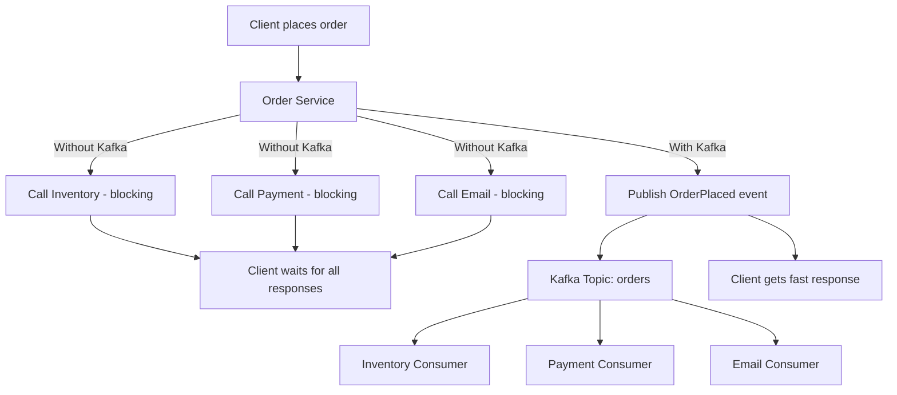
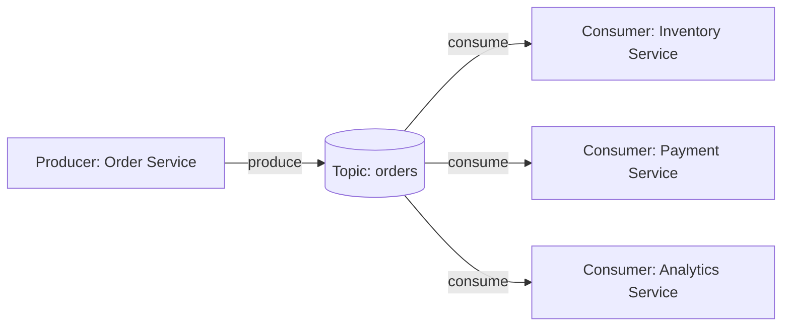
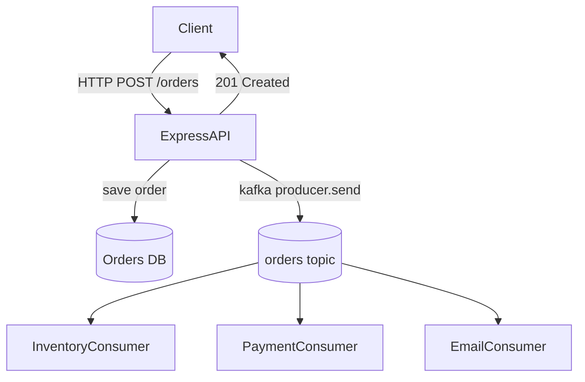
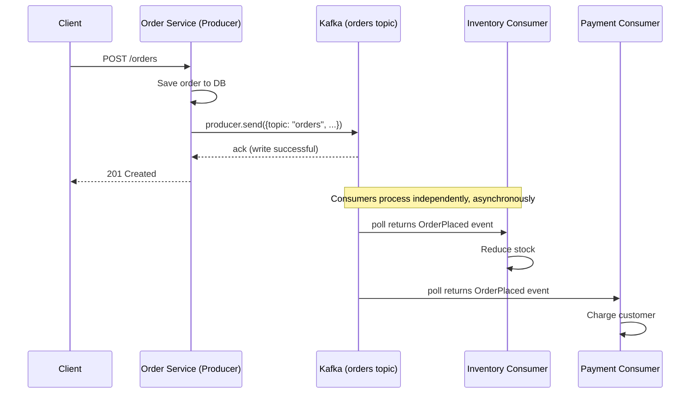

# Module 1 — Why Kafka Exists

**Level:** ⭐ Beginner
**Track:** Kafka Complete Masterclass for Node.js Backend Engineers
**Module:** 1 of 25

---

## 1. Introduction

Before you write a single line of Kafka code, you need to understand *why Kafka was invented in the first place*. Most engineers learn Kafka backwards — they learn `producer.send()` and `consumer.run()` before they understand the disease Kafka is the cure for.

This module fixes that. By the end, you will understand the exact pain points that existed in backend systems before Kafka, why traditional tools (databases, REST calls, Redis Pub/Sub, RabbitMQ) could not solve them well, and how Kafka's design solves them at massive scale.

This is the foundation module. Every later module (partitions, consumer groups, replication, exactly-once delivery) will make sense only if you deeply understand this one.

---

## 2. Learning Objectives

By the end of this module, you will be able to:

1. Explain what a message broker is and why backend systems need one.
2. Explain the difference between synchronous and asynchronous communication, and why async matters at scale.
3. Explain what "event streaming" means, and how it's different from simple messaging.
4. Compare Kafka against a database, Redis Pub/Sub, and RabbitMQ, and know when to pick each.
5. Describe 3–4 real companies' use cases for Kafka.
6. Answer beginner-to-intermediate interview questions about "Why Kafka" confidently.
7. Set up the mental model needed for Module 2 (Installation) and Module 3 (Architecture).

---

## 3. Why This Concept Exists

Every additional feature in a backend system tends to add **one more network call** to some other service. In the early days of a startup, this is fine — you might have 3 services. But as a company grows:

- Service A needs to call Service B, C, D, and E.
- Service B needs a response from A before it can proceed.
- If any one of B, C, D, E is slow or down, the whole chain slows down or breaks.
- Every new feature means updating multiple services to call each other directly.

This is called **tight coupling**, and it does not scale — not in code maintainability, and not in system performance. Kafka exists to remove this tight coupling by inserting a durable, ordered, replayable buffer between services, so that services never need to talk to each other directly again.

---

## 4. Problem Statement

Let's ground this in a concrete example: an **e-commerce Order Placement system**.

When a customer places an order, several things need to happen:

- Reduce inventory stock
- Charge the customer's payment method
- Send a confirmation email
- Send a push notification
- Log the event for analytics
- Update a recommendation engine

### The naive (pre-Kafka) approach

```
Client
   │
   ▼
Order Service
   │
   ├──► calls Inventory Service   (must wait for response)
   ├──► calls Payment Service     (must wait for response)
   ├──► calls Email Service       (must wait for response)
   ├──► calls Notification Service(must wait for response)
   ├──► calls Analytics Service   (must wait for response)
   └──► calls Recommendation Svc  (must wait for response)
```

### Problems with this design

| Problem | Explanation |
|---|---|
| **Tight coupling** | Order Service must know about, and directly call, every downstream service. Adding a 7th feature means modifying Order Service again. |
| **Cascading failure** | If Email Service is down, does the whole order fail? If you make it "best effort," how do you retry safely? |
| **Latency stacking** | If each call takes 100ms and they're sequential, the customer waits 600ms+ just for order placement to "complete." |
| **No replay** | If Analytics Service was down for 2 hours, those 2 hours of order events are lost forever — there's no log to replay from. |
| **Difficult scaling** | If Order Service suddenly needs to fan out to 20 services, you're maintaining 20 direct integrations, each with its own retry/timeout logic. |
| **No ordering guarantee** | If two requests race, downstream services may process events out of order (e.g., "refund" processed before "order placed"). |

This is the exact pain that large companies (LinkedIn, where Kafka was born, Uber, Netflix, Airbnb) hit once they crossed a certain scale. Kafka was built by LinkedIn engineers in 2010–2011 specifically to solve this class of problem.

---

## 5. Real-World Analogy

### Analogy 1: The Restaurant Kitchen (Direct Calls vs. Order Ticket Rail)

Imagine a restaurant where the waiter **personally walks into the kitchen, finds the chef, and waits next to them** until the dish is cooked — and does this separately for the drinks station, the dessert station, and the billing counter. This is slow, fragile (what if the chef is on a break?), and doesn't scale as the restaurant grows.

Now imagine instead: the waiter simply clips an **order ticket** onto a rail. The kitchen station, the drinks station, and the billing counter each pick up the ticket **whenever they're ready**, at their own pace. The waiter doesn't wait around. If the dessert station was busy for 10 minutes, the ticket is still there, waiting, unharmed.

That order ticket rail is Kafka. The waiter is your Producer. The stations are your Consumers. The rail is a Kafka Topic.

### Analogy 2: The Postal Sorting Office

Before mail existed, if you wanted to send a message to five friends, you'd have to personally visit each one. If one wasn't home, you'd have to keep coming back.

The postal system decoupled this: you drop **one letter** into a mailbox, and the sorting office handles delivery to however many recipients need it, whenever they're available to receive it. Kafka is your sorting office: producers "post" events once, and any number of consumers can read them, each independently, each at their own pace.

---

## 6. Technical Definition

> **Apache Kafka** is a distributed, durable, append-only, publish-subscribe event streaming platform that allows producers to write records to named streams called **topics**, and allows any number of independent consumers to read those records — in order, and durably stored on disk — at their own pace.

Key words to unpack:

- **Distributed**: Kafka runs across multiple machines (brokers), not a single server.
- **Durable**: Messages are written to disk, not just held in memory. They survive restarts.
- **Append-only**: New records are only ever added to the end of a log — never modified in place.
- **Publish-subscribe**: Producers publish without knowing who (if anyone) is consuming. Consumers subscribe without knowing who produced.
- **Event streaming**: Kafka doesn't just deliver a message once and forget it — it retains a stream of events that can be replayed, reprocessed, and read by multiple independent readers.

### Message Broker vs. Event Streaming Platform

This distinction matters and is a common interview trap.

| | Traditional Message Broker (e.g. RabbitMQ) | Event Streaming Platform (Kafka) |
|---|---|---|
| Message lifecycle | Deleted once consumed/acknowledged | Retained for a configured period (hours/days/forever), regardless of consumption |
| Replay | Not possible once consumed | Fully replayable — a new consumer can read from the beginning |
| Multiple consumer groups | Harder — usually one consumer per message | Any number of consumer groups can independently read the same data at their own pace |
| Model | Queue-based (message goes to *one* consumer) | Log-based (message is retained; many consumers can read it) |

---

## 7. Internal Working (Conceptual, Pre-Architecture Preview)

At its heart, Kafka is a **distributed commit log**. Think of a single Kafka topic-partition as a simple append-only file:

```
Offset:    0     1     2     3     4     5
Record:  [E0]  [E1]  [E2]  [E3]  [E4]  [E5]
                                          ▲
                                   new records
                                   appended here
```

- Producers can only **append** to the end.
- Consumers read this log **sequentially**, tracking their own position (called an **offset**).
- Because consumers track their own offset, multiple consumers (or consumer groups) can read the exact same log independently, each at a different position, without interfering with each other.
- Because it's a log on disk (not memory), it survives broker restarts and can be replayed.

This "dumb but durable append-only log + smart consumers who track their own position" design is the single biggest reason Kafka scales so well. We'll go much deeper into this in Module 11 (Kafka Internals).

---

## 8. Architecture (High-Level Preview)

Full architecture is covered in Module 3. Here's the minimal picture needed for Module 1:

```
                      ┌───────────────────────────┐
                      │        Kafka Cluster        │
                      │  ┌────────┐   ┌────────┐   │
                      │  │Broker 1│   │Broker 2│...│
                      │  └────────┘   └────────┘   │
                      └───────────────┬─────────────┘
                                      │
        ┌─────────────┐       Topic: orders       ┌──────────────┐
        │  Producer    │ ───► [partitioned log] ◄─── │  Consumer   │
        │ (Order Svc)  │                              │ (Inventory) │
        └─────────────┘                              └──────────────┘
                                      │
                                      ▼
                              ┌──────────────┐
                              │   Consumer    │
                              │  (Payment)    │
                              └──────────────┘
                                      │
                                      ▼
                              ┌──────────────┐
                              │   Consumer    │
                              │ (Analytics)   │
                              └──────────────┘
```

Notice: **Order Service (Producer) does not know or care** how many consumers exist, or whether they're currently online. It just writes to the `orders` topic once. This is the core unlock.

---

## 9. Step-by-Step Flow (Order Placement, Kafka-Based)

1. Customer clicks "Place Order" on the frontend.
2. Frontend calls `POST /orders` on the Order Service (Express API).
3. Order Service validates the request and writes the order to its own database (source of truth).
4. Order Service publishes an `OrderPlaced` event to the `orders` Kafka topic. This step is fast — it's just an append to a log.
5. Order Service immediately responds `201 Created` to the customer. **It does not wait for Inventory, Payment, Email, etc.**
6. Independently, and at their own pace:
   - Inventory Consumer reads the event, reduces stock.
   - Payment Consumer reads the event, charges the customer.
   - Email Consumer reads the event, sends confirmation.
   - Analytics Consumer reads the event, logs it for reporting.
7. If any consumer was down, it simply resumes from its last committed offset once it's back — no events are lost.

This is the essence of **event-driven architecture**, which we formalize in Module 14.

---

## 10. Detailed ASCII Diagrams

### 10.1 Without Kafka (Tight Coupling)

```
Client
   │
   ▼
Order Service
   │
   ├──────────► Inventory Service   (sync call, blocking)
   │
   ├──────────► Payment Service     (sync call, blocking)
   │
   ├──────────► Email Service       (sync call, blocking)
   │
   └──────────► Analytics Service   (sync call, blocking)

Total response time = sum of all downstream latencies
One failure = entire chain can fail or hang
```

### 10.2 With Kafka (Loose Coupling)

```
Client
   │
   ▼
Order Service ──► [ Kafka Topic: orders ] 
                          │
        ┌─────────────────┼─────────────────┬───────────────┐
        ▼                 ▼                 ▼               ▼
  Inventory Svc      Payment Svc       Email Svc      Analytics Svc
  (own pace)          (own pace)        (own pace)      (own pace)

Order Service responds to client immediately after the publish.
Each consumer works independently — no blocking, no cascading failure.
```

### 10.3 Synchronous vs Asynchronous Communication

```
SYNCHRONOUS                          ASYNCHRONOUS (Kafka-style)

Caller                                Caller
  │  request                            │  publish event
  ▼                                     ▼
Callee (must respond               Kafka Topic (durable buffer)
before caller continues)                │
  │  response                           ▼
  ▼                                  Callee (consumes whenever ready)
Caller continues
                                     Caller already moved on
```

---

## 11. Mermaid Diagrams

### 11.1 System Comparison Flowchart



### 11.2 Event-Driven Architecture Overview



---

## 12. Request Flow Diagram



---

## 13. Sequence Diagram



---

## 14. Kafka Internal Flow (Preview)

```
Producer.send()
      │
      ▼
Kafka Broker receives record
      │
      ▼
Record appended to Partition Log (on disk)
      │
      ▼
Leader replica acknowledges (based on acks config)
      │
      ▼
Followers replicate the record (see Module 9)
      │
      ▼
Consumer polls and reads from the log at its own offset
```

We will go much deeper into this in Module 3 (Architecture) and Module 11 (Internals). For Module 1, the goal is just to understand that **writes are appends to a durable log**, not fire-and-forget messages held in memory.

---

## 15. Producer Perspective

From the Order Service's point of view, "using Kafka" means:

- I don't need to know who is listening.
- I don't need to know how many services are listening.
- I don't need to wait for downstream processing to finish.
- I just need to reliably **append** an event describing "what happened" (`OrderPlaced`, not "please do X").

This is an important mindset shift: **you publish facts about what already happened**, not commands telling someone what to do. This is the difference between an "event" and a "command," discussed further in Module 14.

---

## 16. Consumer Perspective

From the Inventory Service's point of view, "using Kafka" means:

- I don't need an API exposed for Order Service to call me.
- I read events from the `orders` topic **whenever I'm ready** — I control my own pace.
- If I crash and restart, I resume exactly where I left off (via committed offsets — Module 8).
- I can even replay historical events if I need to rebuild my internal state (e.g., after a bug fix).

---

## 17. Broker Perspective

The Kafka broker's job, at a high level:

- Accept records from producers and append them to the correct partition log, durably, on disk.
- Serve read requests from consumers efficiently (Kafka is optimized for sequential disk reads — see Module 11's "Zero Copy" and "Sequential Disk Write" topics).
- Replicate data to other brokers for fault tolerance (Module 9).
- Track which broker is the "leader" for each partition (Module 3, Module 9).

For Module 1, just remember: **the broker is a dumb, fast, durable log-keeper** — it does not know about "business logic," "services," or "consumer groups" in any special way. That simplicity is what makes it fast and reliable.

---

## 18. Node.js Integration

The most popular Kafka client for Node.js is **KafkaJS** — a modern, promise-based, zero-dependency client written in pure JavaScript (no native bindings required, unlike `node-rdkafka`).

### Recommended project structure

```
order-service/
├── src/
│   ├── config/
│   │   └── kafka.js          # Kafka client configuration
│   ├── producers/
│   │   └── orderProducer.js  # Publishes OrderPlaced events
│   ├── routes/
│   │   └── orders.js         # Express route handlers
│   ├── app.js                 # Express app setup
│   └── server.js              # Entry point
├── package.json
└── .env
```

---

## 19. KafkaJS Examples

### 19.1 Install dependencies

```bash
npm install kafkajs express dotenv
```

### 19.2 `src/config/kafka.js` — Kafka client setup

```javascript
// src/config/kafka.js
import { Kafka, logLevel } from "kafkajs";

// The Kafka client is the entry point for both producers and consumers.
// clientId helps identify this application in Kafka broker logs/metrics.
// brokers is the list of broker addresses this client will try to connect to.
export const kafka = new Kafka({
  clientId: "order-service",
  brokers: (process.env.KAFKA_BROKERS || "localhost:9092").split(","),
  logLevel: logLevel.INFO,
  retry: {
    initialRetryTime: 300, // ms to wait before first retry
    retries: 8,            // how many times to retry connecting
  },
});
```

### 19.3 `src/producers/orderProducer.js` — Publishing events

```javascript
// src/producers/orderProducer.js
import { kafka } from "../config/kafka.js";

// A single shared producer instance is reused across requests.
// Creating a new producer per-request is expensive and unnecessary.
const producer = kafka.producer({
  allowAutoTopicCreation: false, // production systems should create topics explicitly (Module 2/6)
});

let isConnected = false;

// Connect once when the app starts, not on every publish.
export async function connectProducer() {
  if (!isConnected) {
    await producer.connect();
    isConnected = true;
    console.log("[kafka] producer connected");
  }
}

// Publishes an OrderPlaced event to the "orders" topic.
export async function publishOrderPlaced(order) {
  try {
    await producer.send({
      topic: "orders",
      messages: [
        {
          // key ensures all events for the same order go to the same partition,
          // preserving order for that specific order's lifecycle events (Module 6).
          key: String(order.id),
          value: JSON.stringify({
            eventType: "OrderPlaced",
            orderId: order.id,
            customerId: order.customerId,
            items: order.items,
            totalAmount: order.totalAmount,
            timestamp: new Date().toISOString(),
          }),
        },
      ],
    });
    console.log(`[kafka] OrderPlaced event published for order ${order.id}`);
  } catch (err) {
    // In production, failed publishes should be logged, alerted on,
    // and potentially retried or written to a fallback store.
    console.error("[kafka] failed to publish OrderPlaced event:", err);
    throw err;
  }
}

export async function disconnectProducer() {
  await producer.disconnect();
  isConnected = false;
}
```

### 19.4 `src/routes/orders.js` — Express route using the producer

```javascript
// src/routes/orders.js
import { Router } from "express";
import { publishOrderPlaced } from "../producers/orderProducer.js";

export const ordersRouter = Router();

ordersRouter.post("/orders", async (req, res) => {
  try {
    const { customerId, items, totalAmount } = req.body;

    // Basic validation — never trust client input.
    if (!customerId || !Array.isArray(items) || items.length === 0) {
      return res.status(400).json({ error: "Invalid order payload" });
    }

    // Step 1: Persist the order in the source-of-truth database.
    // (Pseudocode — replace with your actual DB call.)
    const order = {
      id: crypto.randomUUID(),
      customerId,
      items,
      totalAmount,
    };
    // await db.orders.insert(order);

    // Step 2: Publish the event. This does NOT block on downstream
    // services (inventory, payment, email) — only on Kafka's ack.
    await publishOrderPlaced(order);

    // Step 3: Respond immediately.
    return res.status(201).json({ orderId: order.id, status: "PLACED" });
  } catch (err) {
    console.error("[orders] failed to place order:", err);
    return res.status(500).json({ error: "Failed to place order" });
  }
});
```

### 19.5 `src/app.js` and `src/server.js`

```javascript
// src/app.js
import express from "express";
import { ordersRouter } from "./routes/orders.js";

export const app = express();
app.use(express.json());
app.use("/api", ordersRouter);
```

```javascript
// src/server.js
import "dotenv/config";
import { app } from "./app.js";
import { connectProducer, disconnectProducer } from "./producers/orderProducer.js";

const PORT = process.env.PORT || 3000;

async function main() {
  await connectProducer();

  const server = app.listen(PORT, () => {
    console.log(`[server] listening on port ${PORT}`);
  });

  // Graceful shutdown ensures the Kafka producer flushes/disconnects
  // cleanly instead of dropping in-flight messages.
  const shutdown = async () => {
    console.log("[server] shutting down...");
    await disconnectProducer();
    server.close(() => process.exit(0));
  };

  process.on("SIGINT", shutdown);
  process.on("SIGTERM", shutdown);
}

main().catch((err) => {
  console.error("[server] fatal startup error:", err);
  process.exit(1);
});
```

### 19.6 A minimal consumer (preview — full detail in Module 5)

```javascript
// src/consumers/inventoryConsumer.js
import { kafka } from "../config/kafka.js";

const consumer = kafka.consumer({ groupId: "inventory-service" });

export async function startInventoryConsumer() {
  await consumer.connect();
  await consumer.subscribe({ topic: "orders", fromBeginning: false });

  await consumer.run({
    eachMessage: async ({ topic, partition, message }) => {
      const event = JSON.parse(message.value.toString());
      if (event.eventType === "OrderPlaced") {
        console.log(`[inventory] reducing stock for order ${event.orderId}`);
        // await reduceStock(event.items);
      }
    },
  });
}
```

---

## 20. CLI Commands

These assume a local Kafka installed via Docker (full setup in Module 2). Useful commands to internalize now:

```bash
# List all topics
kafka-topics.sh --bootstrap-server localhost:9092 --list

# Create the "orders" topic with 3 partitions and replication factor 1 (local dev)
kafka-topics.sh --bootstrap-server localhost:9092 \
  --create --topic orders --partitions 3 --replication-factor 1

# Describe a topic (see partitions, leader, ISR)
kafka-topics.sh --bootstrap-server localhost:9092 \
  --describe --topic orders

# Produce a test message from the console
kafka-console-producer.sh --bootstrap-server localhost:9092 --topic orders

# Consume messages from the beginning of the topic
kafka-console-consumer.sh --bootstrap-server localhost:9092 \
  --topic orders --from-beginning
```

---

## 21. Configuration Explanation

Even at this early stage, a few configs matter conceptually:

| Config | Meaning | Why it matters |
|---|---|---|
| `clientId` | Identifies your app to the Kafka cluster | Helps in broker-side logs, metrics, and quota enforcement |
| `brokers` | List of bootstrap broker addresses | The client only needs one reachable broker to discover the whole cluster |
| `allowAutoTopicCreation` | Whether Kafka auto-creates a topic on first publish | Should be `false` in production — topics should be created deliberately with the right partition count (Module 6) |
| `acks` (producer, Module 4) | How many broker replicas must acknowledge before a write is "successful" | Directly affects durability vs. latency trade-off |
| `groupId` (consumer, Module 5) | Identifies which consumer group this consumer belongs to | Determines how partitions are load-balanced across consumer instances |

---

## 22. Common Mistakes

1. **Treating Kafka like a database.** Kafka is not meant for ad-hoc queries ("find all orders by customer X") — it's an event log. Use a real database for that; use Kafka to *notify* other services.
2. **Creating a new producer/consumer per request.** This wastes connections and hurts performance. Create once, reuse.
3. **Publishing commands instead of events.** Publishing `"ChargeCustomer"` couples the producer to business logic it shouldn't own. Publish `"OrderPlaced"` and let Payment Service decide what to do.
4. **Assuming Kafka guarantees ordering across an entire topic.** Ordering is only guaranteed **within a single partition** (Module 6) — a critical and frequently-tested interview point.
5. **Ignoring topic auto-creation in production.** Leads to topics with default (often wrong) partition counts and replication factors.
6. **Blocking on downstream services anyway.** Some teams adopt Kafka but keep synchronous HTTP calls "just in case," defeating the purpose.

---

## 23. Edge Cases

- **What if the producer publishes successfully, but the app crashes before responding to the client?** The event is still in Kafka — a consumer will process it — but the client might see an error/timeout even though the order technically "went through." This requires idempotency on the client/API side (retry-safe order creation).
- **What if a consumer is down for hours?** Kafka retains events per the topic's retention policy (Module 8/24). When the consumer restarts, it resumes from its last committed offset — no data loss, assuming retention hasn't expired.
- **What if two events for the same order arrive out of order?** This can happen if they're produced without a consistent partition key. Using `order.id` as the message key (as shown in the example) ensures all events for that order land in the same partition, preserving order.

---

## 24. Performance Considerations

- Kafka's append-only log design allows **sequential disk writes**, which are dramatically faster than random writes — this is a major reason Kafka can handle very high throughput on ordinary disks (deep dive in Module 11).
- Because producers don't wait for consumers, the observed latency for an API request is decoupled from the total processing time of every downstream effect.
- Batching multiple events into a single producer request (Module 4, Module 12) reduces network overhead and increases throughput.

---

## 25. Scalability Discussion

- Kafka scales producers and consumers **independently** of each other. You can have 1 producer and 50 consumer instances, or 50 producers and 1 consumer — the model doesn't force symmetry.
- Adding a new downstream service (e.g., a new "Fraud Detection" consumer) requires **zero changes** to the Order Service. It just subscribes to the existing `orders` topic. This is the biggest architectural win Kafka provides over direct service-to-service calls.
- Horizontal scaling of consumers is achieved through **partitions** and **consumer groups** — covered fully in Modules 6 and 7.

---

## 26. Production Best Practices

- Always create topics explicitly with a deliberate partition count and replication factor (never rely on auto-creation).
- Use meaningful, consistent topic naming conventions (Module 24) — e.g., `orders.placed`, `orders.cancelled`.
- Treat events as **immutable facts** ("OrderPlaced"), not mutable commands.
- Always include a `timestamp` and a unique `eventId`/`orderId` in your event payloads for traceability and idempotency.
- Log every publish/consume at the boundary for observability (Module 19).

---

## 27. Monitoring & Debugging

Even in Module 1, know that in production you will care about:

- **Producer send failures** — should be logged and alerted, not silently swallowed.
- **Consumer lag** — how far behind a consumer group is from the latest event (Module 19, Module 8).
- **Kafka UI tools** (e.g., Kafka-UI, Redpanda Console) to visually inspect topics, partitions, and consumer group offsets — introduced in Module 2.

---

## 28. Security Considerations

Full detail arrives in Module 20, but conceptually:

- In production, Kafka brokers should require **authentication** (SASL) so arbitrary clients cannot publish/consume.
- Data in transit should use **SSL/TLS** encryption between clients and brokers.
- **ACLs** (Access Control Lists) restrict which services can produce/consume on which topics — e.g., only the Order Service should be allowed to *produce* to the `orders` topic.

---

## 29. Interview Questions (Easy → Medium → Hard)

### Easy

1. What problem does Kafka solve that a direct HTTP call between services does not?
2. What is the difference between synchronous and asynchronous communication?
3. Is Kafka a database? Why or why not?
4. What is a "topic" in Kafka, in one sentence?
5. Why is Kafka described as "durable"?

### Medium

6. How is Kafka different from a traditional message queue like RabbitMQ in terms of message retention?
7. Why would a company choose Kafka over Redis Pub/Sub for order events?
8. What does "loose coupling" mean, and how does Kafka enable it in a microservices system?
9. If a consumer is offline for 3 hours, what happens to the events it missed?
10. Why should you publish events (facts) rather than commands in an event-driven system?

### Hard

11. Kafka guarantees ordering within a partition, not across an entire topic. Explain a real scenario where ignoring this fact could break your system.
12. Explain why Kafka's append-only log design gives it higher write throughput than a typical relational database under heavy write load.
13. If your Order Service crashes right after `producer.send()` succeeds but before the API responds to the client, is the order "safe"? What complexities does this introduce?
14. Design the trade-offs of choosing Kafka vs. a simple database polling approach ("poll for new orders every 5 seconds") for a notification system.
15. Why does Kafka's design allow multiple, independent consumer groups to each read the entire topic at their own pace, while a traditional queue typically does not?

---

## 30. Common Interview Traps

- **Trap:** "Kafka guarantees global ordering." → **Reality:** Ordering is only guaranteed *within a partition*.
- **Trap:** "Kafka is just a faster RabbitMQ." → **Reality:** Kafka is a log-based streaming platform with replayability; RabbitMQ is a queue-based broker where messages are typically removed after consumption.
- **Trap:** "Once a consumer reads a message, it's gone." → **Reality:** In Kafka, messages remain in the log per the retention policy regardless of whether they've been consumed — unlike traditional queues.
- **Trap:** Confusing "message broker" with "event streaming platform" as if they're interchangeable terms with no distinction — interviewers often probe this specifically.

---

## 31. Summary

- Before Kafka, services called each other directly, creating tight coupling, cascading failures, and unnecessary latency.
- Kafka introduces a durable, ordered, replayable log between producers and consumers, enabling **loose coupling** and **independent scaling**.
- Kafka is best understood as an **event streaming platform**, not merely a message queue or a database.
- Producers publish facts ("what happened"); consumers decide what to do about them, independently and at their own pace.
- Ordering is guaranteed only within a partition — not across an entire topic.
- KafkaJS is the standard client for integrating Kafka into Node.js applications.

---

## 32. Cheat Sheet

```
WHY KAFKA EXISTS — ONE PAGE

Problem:        Tight coupling from direct service-to-service calls
Solution:       Durable, append-only log (topic) between services

Producer        → writes events (facts), doesn't wait for consumers
Kafka Topic      → durable, ordered (per partition), replayable log
Consumer         → reads at its own pace, tracks its own offset

Kafka vs DB:     Kafka = stream of events; DB = queryable current state
Kafka vs Redis:  Redis Pub/Sub = fire-and-forget, no persistence
Kafka vs RabbitMQ: Queue-based & message deleted after ack (RabbitMQ)
                   vs Log-based & retained regardless of consumption (Kafka)

Ordering:        Guaranteed within a PARTITION, not across a topic
Golden Rule:     Publish events ("OrderPlaced"), not commands ("ChargeCard")
```

---

## 33. Hands-on Exercises

1. Write a one-paragraph explanation (in your own words) of why a growing e-commerce company would eventually need Kafka.
2. Draw (on paper or ASCII) the "without Kafka" and "with Kafka" architecture for a food delivery app (like Swiggy/Zomato) placing an order.
3. List 3 events (not commands) you would publish for a ride-hailing app like Uber (e.g., `RideRequested`, `DriverAssigned`, `RideCompleted`).
4. Explain, in your own words, the difference between a message queue and an event streaming platform to a non-technical colleague.

---

## 34. Mini Project

**Build:** A minimal Express API that accepts `POST /api/orders` and publishes an `OrderPlaced` event to a local Kafka topic using KafkaJS (code above). Verify the event was published using the console consumer CLI command from Section 20.

**Goal:** Get comfortable with the producer side end-to-end before Module 2 formalizes installation and Module 4 deepens producer internals.

---

## 35. Advanced Project

**Build:** Extend the mini project into a 2-service system:
- `order-service` (Express API + Kafka producer, as shown above)
- `inventory-service` (Kafka consumer that logs "stock reduced" for each `OrderPlaced` event)

Run both simultaneously, place several orders via `curl`/Postman, and observe in the terminal that the Inventory Service processes each event asynchronously, without the Order Service ever calling it directly.

---

## 36. Homework

1. Research and write 3–5 sentences on how **your** favorite app (Instagram, Swiggy, Netflix, etc.) likely uses Kafka internally (search publicly available engineering blogs).
2. Compare, in a small table, Kafka vs. RabbitMQ vs. Redis Pub/Sub across: persistence, replay capability, ordering guarantees, and typical use case.
3. Read about the origin of Kafka at LinkedIn and note down the specific scaling problem that led to its creation.

---

## 37. Additional Reading

- Official Kafka documentation: Introduction section (kafka.apache.org)
- KafkaJS official documentation (kafka.js.org)
- LinkedIn Engineering Blog: original Kafka motivation posts
- "Designing Data-Intensive Applications" by Martin Kleppmann — Chapter on Stream Processing (excellent conceptual grounding, not Kafka-specific but highly relevant)

---

## Key Takeaways

- Kafka exists to eliminate tight coupling caused by direct, synchronous service-to-service calls.
- It is a distributed, durable, append-only, replayable event log — not a queue, not a database.
- Producers publish facts; consumers independently decide what to do, at their own pace.
- Ordering is guaranteed per-partition, not globally across a topic.
- KafkaJS is the standard, dependency-free way to integrate Kafka into Node.js services.

---

## Revision Notes

- Re-read Section 4 (Problem Statement) and Section 6 (Technical Definition) until you can explain both without notes.
- Be able to redraw the "Without Kafka vs. With Kafka" diagram from memory (Section 10).
- Memorize the Kafka vs. RabbitMQ vs. Redis vs. Database comparison — it appears in almost every Kafka interview.

---

## One-Page Cheat Sheet

*(See Section 32 above — copy it to a flashcard app or sticky note.)*

---

## 20 Practice Questions

1. What is a message broker?
2. What is event streaming?
3. Name two problems with direct service-to-service HTTP calls at scale.
4. What does "durable" mean in the context of Kafka?
5. What does "append-only" mean?
6. Why is Kafka called a "distributed" system?
7. What's the difference between a producer and a consumer?
8. What is a topic?
9. Why doesn't a Kafka producer wait for consumers to finish processing?
10. What is an offset?
11. Why can multiple consumer groups read the same topic independently?
12. What's the difference between Kafka and a relational database?
13. What's the difference between Kafka and Redis Pub/Sub?
14. What's the difference between Kafka and RabbitMQ?
15. Give one real-world analogy for how Kafka works.
16. What is the risk of publishing "commands" instead of "events"?
17. What Node.js library is most commonly used to integrate with Kafka?
18. What CLI command lists all Kafka topics?
19. Why is `allowAutoTopicCreation: false` recommended in production?
20. What happens to unconsumed events when a consumer is offline?

---

## 10 Scenario-Based Questions

1. Your Order Service currently calls Payment, Inventory, and Email services directly via HTTP, and customers complain about slow checkout. How would you redesign this using Kafka, and what would change for the customer's experience?
2. Your company wants to add a new "Fraud Detection" service that must see every order event. Under the old direct-call architecture, what would need to change? Under Kafka, what would need to change?
3. A consumer service was down for maintenance for 6 hours. Explain, step by step, what happens to the events published during that window and what happens when it comes back online.
4. Your team publishes a message called `"SendEmail"` with instructions on exactly what email to send. Why might this be considered an anti-pattern in event-driven design? How would you redesign it?
5. Two events for the same order (`OrderPlaced` then `OrderCancelled`) are produced back-to-back. Explain how you'd guarantee the consumer sees them in that exact order.
6. A junior engineer suggests replacing your Kafka setup with "just polling the database every 2 seconds for new orders." What trade-offs would you explain to them?
7. Your system currently uses Redis Pub/Sub for notifications, but you've noticed that any notification published while a service is restarting is permanently lost. How does Kafka address this specific issue?
8. Leadership asks: "Why can't we just use RabbitMQ, since it's simpler?" Give a balanced answer describing when RabbitMQ might actually be the better choice.
9. You need 5 different teams to each independently process the same stream of `PaymentReceived` events, at their own pace, without interfering with each other. Explain why Kafka's consumer group model supports this naturally.
10. A teammate asks why the Order Service's API response time didn't change even after you added 3 new downstream consumers. Explain why, referencing the architecture.

---

## 5 Coding Assignments

1. **Basic Producer:** Extend the `orderProducer.js` example to also publish an `OrderCancelled` event via a new `DELETE /api/orders/:id` route.
2. **Basic Consumer:** Write a second consumer service (`emailConsumer.js`) that logs `"Sending confirmation email for order <id>"` whenever it reads an `OrderPlaced` event.
3. **Error Handling:** Modify `publishOrderPlaced` to retry up to 3 times with exponential backoff if the initial `producer.send()` call fails, before giving up and throwing.
4. **Structured Logging:** Add a small logging utility (e.g., using `pino` or plain `console.log` with structured JSON) that logs every publish and every consume event with a timestamp, topic, and key.
5. **Idempotency Key:** Update the event payload to include a unique `eventId` (UUID), and write a consumer that skips processing if it has already seen that `eventId` (in-memory `Set` is fine for this exercise) — this previews the idempotency concepts from Module 10.

---

## Suggested Next Module

**Module 2 — Installing Kafka**
Now that you understand *why* Kafka exists, the next step is getting a real Kafka broker running on your machine using Docker (Java, Zookeeper/KRaft mode, and CLI basics), so you can move from theory into hands-on practice.
