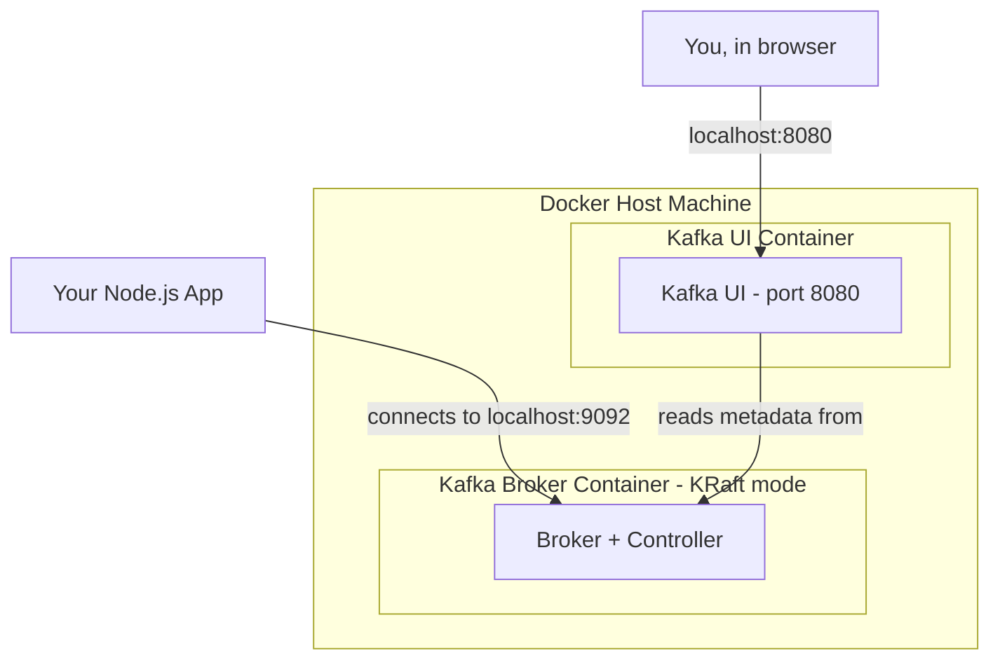
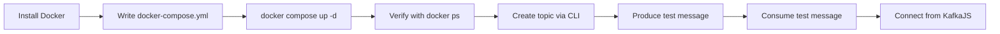
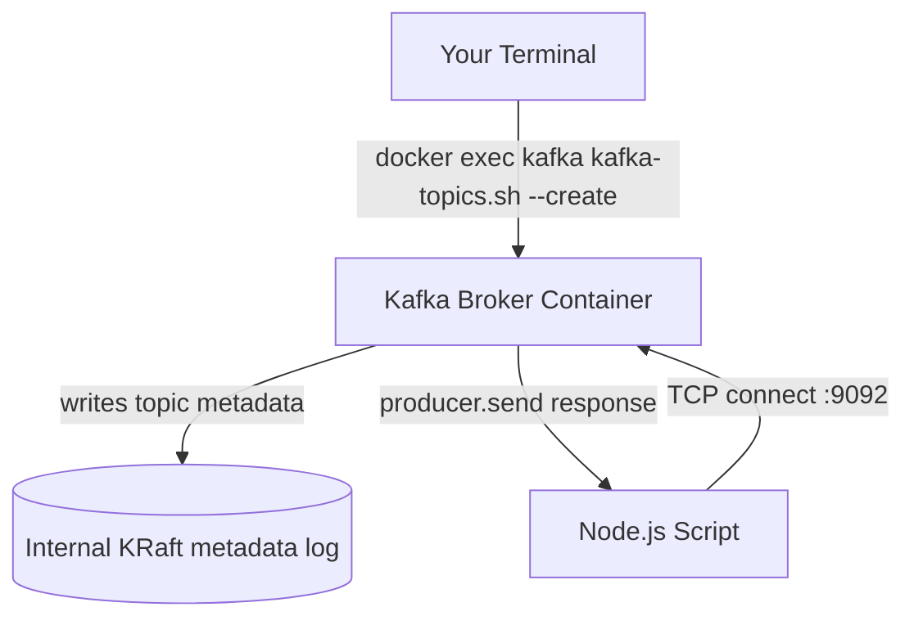
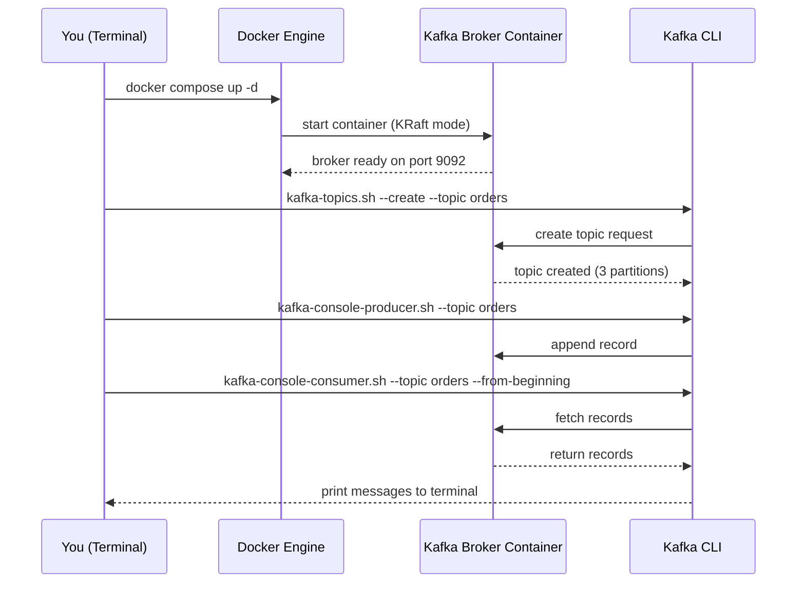

# Module 2 — Installing Kafka

**Level:** ⭐ Beginner
**Track:** Kafka Complete Masterclass for Node.js Backend Engineers
**Module:** 2 of 25

---

## 1. Introduction

You cannot understand Kafka by reading about it alone — you need a running broker on your machine that you can poke at, break, and restart. This module gets Kafka running locally using Docker, explains what Java, Zookeeper, and KRaft mode actually are (and why Kafka is moving away from one of them), and gives you the CLI muscle memory you'll use throughout this entire course.

This is a hands-on module. By the end, you will have a working single-broker Kafka cluster on your machine, a topic created, and messages flowing through it — all before writing a single line of Node.js.

---

## 2. Learning Objectives

By the end of this module, you will be able to:

1. Explain why Kafka needs Java to run, even though you'll write client code in Node.js.
2. Explain what Zookeeper did for Kafka, and why KRaft mode replaces it.
3. Install and run Kafka locally using Docker on Windows, Linux, or Mac.
4. Use the Kafka CLI to create topics, list them, and produce/consume test messages.
5. Use a Kafka UI tool to visually inspect your cluster.
6. Answer interview questions about Kafka's runtime dependencies and deployment modes.

---

## 3. Why This Concept Exists

Kafka is not an npm package — it's a standalone distributed system written in Scala/Java that runs as its own server process (the **broker**), separate from your application code. Your Node.js app is just a *client* that connects to this broker over the network (default port `9092`).

This separation exists because:

- Kafka needs to be **language-agnostic** — a Node.js producer, a Python consumer, and a Java stream processor should all be able to talk to the same Kafka cluster.
- Kafka needs to run independently of any single application's lifecycle — if your Node.js app restarts, Kafka (and its stored data) must not disappear.
- Kafka needs cluster coordination (which broker is the leader for which partition, cluster membership, configuration) — historically this required a *separate coordination service*, which is where Zookeeper came in.

Understanding this separation early prevents a very common beginner confusion: **"Why do I need Docker/Java just to send a message from Node.js?"**

---

## 4. Problem Statement

To run Kafka locally, a beginner faces several real obstacles:

1. Kafka's broker is a **JVM (Java Virtual Machine) application** — it needs Java installed to run, regardless of what language your client is written in.
2. Historically, Kafka also required **Zookeeper**, a separate coordination service, to be running alongside it — meaning you had to manage *two* processes just to get started.
3. Installing Java + Zookeeper + Kafka manually, configuring ports, and keeping versions compatible is tedious and error-prone, especially across Windows/Mac/Linux differences.
4. Once running, you need a way to **verify** it's actually working — which means learning a handful of CLI commands before you can trust your setup enough to write code against it.

Docker solves problems 1–3 by packaging Java + Kafka (and optionally Zookeeper) into ready-to-run containers, so you don't install anything on your host OS except Docker itself.

---

## 5. Real-World Analogy

### Analogy: Renting an Apartment vs. Building a House

Installing Kafka manually (downloading tarballs, installing Java, configuring Zookeeper, editing `server.properties`) is like building a house from raw materials — you learn a lot, but it's slow and error-prone for a beginner.

Using Docker is like renting a fully-furnished apartment: the plumbing (Java runtime), electricity (Zookeeper/KRaft coordination), and walls (Kafka broker process) are already set up for you in a box (the container). You just move in and start using it. Later, once you're experienced, you might build your own house (manual production installs) — but for learning, rent the apartment.

---

## 6. Technical Definition

- **Java**: Kafka's broker is written primarily in Scala and Java, and runs on the Java Virtual Machine (JVM). You need a JRE/JDK installed to run a Kafka broker directly on a host machine (not needed if using Docker images that bundle it).
- **Zookeeper**: A separate distributed coordination service that older Kafka versions (pre-2.8, and commonly used through Kafka 3.x) used to store cluster metadata — which broker is the controller, topic configurations, ACLs, and leader election bookkeeping.
- **KRaft Mode** (Kafka Raft): A newer architecture (production-ready since Kafka 3.3+) where Kafka manages its own metadata using the **Raft consensus protocol**, built directly into Kafka brokers — eliminating the need for a separate Zookeeper cluster entirely.
- **Docker**: A containerization platform that lets you run Kafka (and Zookeeper, if needed) as isolated, pre-configured processes without installing Java or Kafka directly on your machine.

---

## 7. Internal Working

### Why did Kafka need Zookeeper in the first place?

A Kafka cluster has multiple brokers. Someone needs to answer questions like:

- Which broker is the **controller** (the broker responsible for managing partition leadership across the cluster)?
- Which broker is the **leader** for partition 0 of topic `orders`?
- What topics exist, and what are their configurations?
- If a broker dies, who takes over as leader for its partitions?

Historically, **Zookeeper** answered all of these questions. Kafka brokers registered themselves with Zookeeper, and Zookeeper handled leader election and metadata storage.

### Why is Kafka moving to KRaft?

Running Zookeeper is operational overhead: it's a separate distributed system with its own scaling limits, failure modes, and configuration — you're essentially running two distributed systems to get one working. KRaft mode removes this by having a small set of Kafka brokers (called **controllers**) manage metadata directly using the Raft consensus algorithm — one system instead of two, simpler operations, faster controller failover, and higher scalability (Zookeeper became a bottleneck at very high partition counts).

```
BEFORE (Zookeeper-based)              AFTER (KRaft mode)

┌─────────────┐                       ┌─────────────────────┐
│  Zookeeper   │◄──registers──┐        │   Kafka Brokers      │
│  Ensemble    │              │        │  (some act as        │
└─────────────┘              │        │   KRaft controllers) │
       ▲                      │        └─────────────────────┘
       │ metadata             │                  ▲
       │                ┌─────┴──────┐           │
       └────────────────┤   Brokers   │           │
                         └────────────┘  metadata handled internally
                                          via Raft consensus — no
                                          separate service needed
```

---

## 8. Architecture

### Single-broker local dev setup (what we're building)

```
Your Machine
│
├── Docker Engine
│     │
│     ├── Container: Kafka Broker (port 9092)
│     │      (KRaft mode — acts as both broker and controller)
│     │
│     └── Container: Kafka UI (port 8080) — optional, for visualization
│
└── Your Node.js app (runs directly on host, connects to localhost:9092)
```

Note: This module uses **KRaft mode**, since it's the modern, recommended approach (no Zookeeper container needed) and is what you should learn going forward. We'll mention the Zookeeper-based setup for completeness since many existing tutorials and legacy systems still use it.

---

## 9. Step-by-Step Flow

1. Install Docker Desktop (Windows/Mac) or Docker Engine (Linux).
2. Write a `docker-compose.yml` that defines a Kafka broker running in KRaft mode.
3. Run `docker compose up -d` to start the broker in the background.
4. Verify the broker is running with `docker ps`.
5. Use the Kafka CLI (via `docker exec` into the container, or a locally installed CLI) to create a topic.
6. Produce a test message via the console producer.
7. Consume that message via the console consumer.
8. (Optional) Open a Kafka UI tool in the browser to visually confirm the topic and messages exist.
9. Confirm you can connect from a Node.js script using KafkaJS.

---

## 10. Detailed ASCII Diagrams

### 10.1 Zookeeper-based vs. KRaft-based Cluster

```
ZOOKEEPER-BASED (legacy, Kafka <= 3.x with ZK)

+------------------+       +------------------+
|   Zookeeper      | <---> |   Kafka Broker    |
|   (port 2181)    |       |   (port 9092)     |
+------------------+       +------------------+


KRAFT-BASED (modern, recommended)

+---------------------------------+
|   Kafka Broker (KRaft mode)      |
|   Acts as broker + controller    |
|   (port 9092)                    |
+---------------------------------+
```

### 10.2 Docker Container Layout

```
Docker Host
   │
   ├── kafka-broker  (image: apache/kafka or confluentinc/cp-kafka)
   │      port 9092 exposed to host
   │
   └── kafka-ui       (image: provectuslabs/kafka-ui)
          port 8080 exposed to host, connects internally to kafka-broker:9092
```

---

## 11. Mermaid Diagrams





---

## 12. Request Flow Diagram



---

## 13. Sequence Diagram



---

## 14. Kafka Internal Flow

When the broker starts in KRaft mode:

```
1. Broker process starts (JVM boots up)
2. Broker reads its own KRaft metadata log (or initializes one if first run)
3. Broker elects itself (or another node, in multi-broker setups) as the
   "active controller" using Raft consensus
4. Broker opens a listener socket on port 9092 for client connections
5. Broker is now ready to accept:
      - Topic creation requests
      - Producer writes
      - Consumer reads
      - Admin requests (describe topic, list topics, etc.)
```

---

## 15. Producer Perspective

For this module, "producer" refers to the **CLI producer** (`kafka-console-producer.sh`), which is just a testing tool — it lets you type lines into a terminal and each line becomes one Kafka message. This is invaluable for quickly verifying your broker works, before you write any Node.js code.

```bash
kafka-console-producer.sh --bootstrap-server localhost:9092 --topic orders
> Hello Kafka
> This is my second message
```

Each line you press Enter on becomes a separate record appended to the `orders` topic.

---

## 16. Consumer Perspective

Similarly, `kafka-console-consumer.sh` is a CLI tool for reading messages — useful for confirming your producer's messages actually landed in the topic.

```bash
kafka-console-consumer.sh --bootstrap-server localhost:9092 \
  --topic orders --from-beginning
```

`--from-beginning` tells it to read from the start of the log, not just new messages — critical for confirming your test messages are actually there.

---

## 17. Broker Perspective

At this stage, think of the broker as a black box that:

- Listens on `9092` (or whatever port you configure) for client connections.
- Stores topic data on disk inside the container (mapped to a Docker volume if you want persistence across container restarts).
- In KRaft mode, also manages its own metadata internally — no external Zookeeper dependency.

---

## 18. Node.js Integration

Once your broker is running, connecting from Node.js requires zero extra installation beyond KafkaJS itself:

```bash
mkdir kafka-test && cd kafka-test
npm init -y
npm install kafkajs
```

```javascript
// test-connection.js
import { Kafka } from "kafkajs";

const kafka = new Kafka({
  clientId: "connection-test",
  brokers: ["localhost:9092"],
});

const admin = kafka.admin();

async function main() {
  await admin.connect();
  const topics = await admin.listTopics();
  console.log("Connected! Topics found:", topics);
  await admin.disconnect();
}

main().catch(console.error);
```

Run it:

```bash
node test-connection.js
```

If this prints a list of topics (even an empty array, or `["orders"]` if you created one), your local Kafka setup is working end-to-end.

---

## 19. KafkaJS Examples

### 19.1 Full Docker Compose file (KRaft mode, single broker)

```yaml
# docker-compose.yml
version: "3.8"

services:
  kafka:
    image: apache/kafka:3.7.0
    container_name: kafka-broker
    ports:
      - "9092:9092"
    environment:
      # KRaft mode settings — no Zookeeper needed
      KAFKA_NODE_ID: 1
      KAFKA_PROCESS_ROLES: broker,controller
      KAFKA_LISTENERS: PLAINTEXT://:9092,CONTROLLER://:9093
      KAFKA_ADVERTISED_LISTENERS: PLAINTEXT://localhost:9092
      KAFKA_CONTROLLER_LISTENER_NAMES: CONTROLLER
      KAFKA_CONTROLLER_QUORUM_VOTERS: 1@kafka:9093
      KAFKA_LISTENER_SECURITY_PROTOCOL_MAP: CONTROLLER:PLAINTEXT,PLAINTEXT:PLAINTEXT
      KAFKA_OFFSETS_TOPIC_REPLICATION_FACTOR: 1
      KAFKA_TRANSACTION_STATE_LOG_REPLICATION_FACTOR: 1
      KAFKA_TRANSACTION_STATE_LOG_MIN_ISR: 1
      CLUSTER_ID: "MkU3OEVBNTcwNTJENDM2Qk"
    volumes:
      - kafka_data:/var/lib/kafka/data

  kafka-ui:
    image: provectuslabs/kafka-ui:latest
    container_name: kafka-ui
    ports:
      - "8080:8080"
    environment:
      KAFKA_CLUSTERS_0_NAME: local
      KAFKA_CLUSTERS_0_BOOTSTRAPSERVERS: kafka:9092
    depends_on:
      - kafka

volumes:
  kafka_data:
```

### 19.2 (Legacy reference) Zookeeper-based Compose — for comparison only

```yaml
# docker-compose.zk.yml — NOT recommended for new learning, shown for context
version: "3.8"
services:
  zookeeper:
    image: confluentinc/cp-zookeeper:7.6.0
    environment:
      ZOOKEEPER_CLIENT_PORT: 2181
    ports:
      - "2181:2181"

  kafka:
    image: confluentinc/cp-kafka:7.6.0
    depends_on:
      - zookeeper
    ports:
      - "9092:9092"
    environment:
      KAFKA_ZOOKEEPER_CONNECT: zookeeper:2181
      KAFKA_ADVERTISED_LISTENERS: PLAINTEXT://localhost:9092
      KAFKA_LISTENER_SECURITY_PROTOCOL_MAP: PLAINTEXT:PLAINTEXT
      KAFKA_OFFSETS_TOPIC_REPLICATION_FACTOR: 1
```

---

## 20. CLI Commands

```bash
# Start the cluster
docker compose up -d

# Confirm containers are running
docker ps

# View broker logs (useful for debugging startup issues)
docker logs kafka-broker -f

# Enter the broker container to run CLI tools directly
docker exec -it kafka-broker bash

# --- Inside the container (or with a local Kafka CLI install) ---

# List topics
kafka-topics.sh --bootstrap-server localhost:9092 --list

# Create the "orders" topic
kafka-topics.sh --bootstrap-server localhost:9092 \
  --create --topic orders --partitions 3 --replication-factor 1

# Describe topic details
kafka-topics.sh --bootstrap-server localhost:9092 --describe --topic orders

# Produce test messages
kafka-console-producer.sh --bootstrap-server localhost:9092 --topic orders

# Consume messages from the beginning
kafka-console-consumer.sh --bootstrap-server localhost:9092 \
  --topic orders --from-beginning

# Delete a topic (careful in production!)
kafka-topics.sh --bootstrap-server localhost:9092 --delete --topic orders

# Stop and remove containers (data persists in the named volume)
docker compose down

# Stop and remove containers AND delete all data
docker compose down -v
```

---

## 21. Configuration Explanation

| Config | Meaning |
|---|---|
| `KAFKA_NODE_ID` | Unique ID for this broker/controller node within the cluster |
| `KAFKA_PROCESS_ROLES` | In KRaft mode, whether this node acts as `broker`, `controller`, or both (fine for single-node dev setups) |
| `KAFKA_LISTENERS` | Which network interfaces/ports the broker listens on internally |
| `KAFKA_ADVERTISED_LISTENERS` | The address clients should use to connect — critical to set correctly, or clients (including Docker-external ones like your Node.js app) can't connect |
| `KAFKA_CONTROLLER_QUORUM_VOTERS` | Which nodes participate in the Raft-based controller quorum (in a single-node setup, just itself) |
| `CLUSTER_ID` | A unique ID identifying this Kafka cluster — required in KRaft mode since there's no Zookeeper to auto-generate one |
| `KAFKA_OFFSETS_TOPIC_REPLICATION_FACTOR` | Replication factor for Kafka's internal `__consumer_offsets` topic — must be `1` for single-broker dev setups (would be 3 in production, Module 9) |

---

## 22. Common Mistakes

1. **Forgetting `KAFKA_ADVERTISED_LISTENERS`.** This is the #1 reason people can connect to Kafka *inside* Docker but not from their host machine's Node.js app.
2. **Using a Zookeeper tutorial's Compose file with a KRaft image (or vice versa).** These modes are not interchangeable — mixing configs causes cryptic startup failures.
3. **Not waiting for the broker to fully start** before running CLI commands — check `docker logs` for a "started" message first.
4. **Deleting volumes accidentally** (`docker compose down -v`) and losing all local topic data during development.
5. **Forgetting `--replication-factor 1`** on a single-broker setup — the default may be higher and cause topic creation to fail.

---

## 23. Edge Cases

- **Port 9092 already in use:** Common if you have a previous Kafka install or another container already bound to that port. Solution: stop the conflicting process or remap the port (e.g., `9093:9092`) and update your client config.
- **Container restarts but data is "gone":** If you didn't mount a named volume, data lives only inside the ephemeral container filesystem and is lost on removal.
- **Multi-broker KRaft clusters need careful `KAFKA_CONTROLLER_QUORUM_VOTERS` configuration** — misconfiguring this in a multi-node setup can prevent the cluster from ever reaching quorum (deep dive in Module 21, Production Deployment).

---

## 24. Performance Considerations

- For local development, a single broker with 1 partition/1 replication factor is completely fine — performance tuning (Module 12) only matters once you're closer to production scale.
- Running Kafka inside Docker on Mac/Windows (via Docker Desktop's VM layer) can have slightly higher I/O latency than native Linux — usually irrelevant for learning, but worth knowing if you benchmark locally.

---

## 25. Scalability Discussion

- This module intentionally uses a **single-broker** setup for simplicity. Real production clusters run 3+ brokers for fault tolerance (Module 9, Module 21).
- KRaft mode itself is designed to scale to far more partitions than Zookeeper-based clusters could reliably support — one of the core motivations for the migration.

---

## 26. Production Best Practices

- Use **KRaft mode** for any new Kafka deployment — Zookeeper-based deployment is being phased out by the Kafka project itself.
- Never run a single-broker cluster in production — always use at least 3 brokers for replication (Module 9).
- Pin exact image versions (e.g., `apache/kafka:3.7.0`, not `latest`) in production Compose/Kubernetes manifests to avoid unexpected upgrades.
- Mount persistent volumes for broker data directories — container filesystems are ephemeral by default.

---

## 27. Monitoring & Debugging

- Use `docker logs kafka-broker -f` to tail broker startup and runtime logs.
- Use a **Kafka UI** tool (like the one in our Compose file, at `localhost:8080`) to visually browse topics, partitions, consumer groups, and messages without memorizing CLI syntax.
- `kafka-topics.sh --describe` is your first debugging step whenever "something about a topic looks wrong" (wrong partition count, missing replicas, etc.).

---

## 28. Security Considerations

- The setup in this module has **no authentication or encryption** — appropriate only for local development, never for anything internet-reachable.
- Never expose port `9092` on a publicly reachable server without SASL/TLS configured (Module 20).

---

## 29. Interview Questions (Easy → Medium → Hard)

### Easy

1. Why does Kafka require Java to run?
2. What was Zookeeper's role in a Kafka cluster?
3. What is KRaft mode?
4. Name one tool that lets you visually inspect Kafka topics and consumer groups.

### Medium

5. Why did Kafka move away from requiring Zookeeper?
6. What does `KAFKA_ADVERTISED_LISTENERS` control, and why does misconfiguring it cause connection issues from outside Docker?
7. What's the difference between `KAFKA_PROCESS_ROLES=broker` and `KAFKA_PROCESS_ROLES=controller` in KRaft mode?
8. Why is `--replication-factor 1` acceptable for local dev but dangerous in production?

### Hard

9. Explain, at a high level, how Raft consensus allows KRaft-mode Kafka to manage cluster metadata without Zookeeper.
10. In a 3-broker KRaft cluster, what happens if the node currently acting as active controller crashes?
11. Why might an organization with an existing large Zookeeper-based Kafka deployment be cautious about migrating to KRaft mode, despite its advantages?

---

## 30. Common Interview Traps

- **Trap:** "Zookeeper is required for Kafka to work." → **Reality:** Only true for Zookeeper-mode deployments; KRaft mode removes this requirement entirely, and it's now the recommended default.
- **Trap:** Assuming KRaft and Zookeeper modes can be mixed in one cluster casually. → **Reality:** Migration between modes is a deliberate, versioned process, not a simple config toggle.
- **Trap:** Thinking Docker is "required" for Kafka. → **Reality:** Docker is a convenience for local dev; Kafka can run directly on a host with Java installed — Docker just avoids manual setup pain.

---

## 31. Summary

- Kafka's broker runs on the JVM and is a separate process from your Node.js application.
- Zookeeper was historically required for cluster coordination; KRaft mode replaces it with Kafka's own built-in Raft-based consensus.
- Docker Compose is the fastest, most reliable way to get a local Kafka broker running for learning and development.
- The Kafka CLI (`kafka-topics.sh`, `kafka-console-producer.sh`, `kafka-console-consumer.sh`) is essential for verifying your setup before writing application code.
- A Kafka UI tool makes topics, partitions, and consumer groups visible and far easier to reason about while learning.

---

## 32. Cheat Sheet

```
INSTALLING KAFKA — ONE PAGE

Runtime dependency:     JVM (Java) — bundled inside Docker images
Coordination (legacy):  Zookeeper (separate service, port 2181)
Coordination (modern):  KRaft mode — built into Kafka, no separate service

Local setup:            docker compose up -d
Verify running:         docker ps / docker logs kafka-broker -f

Create topic:           kafka-topics.sh --create --topic X --partitions N --replication-factor 1
List topics:            kafka-topics.sh --list
Describe topic:         kafka-topics.sh --describe --topic X
Produce (test):         kafka-console-producer.sh --topic X
Consume (test):         kafka-console-consumer.sh --topic X --from-beginning

Common gotcha:          KAFKA_ADVERTISED_LISTENERS must match how
                        your CLIENT (host machine) reaches the broker
```

---

## 33. Hands-on Exercises

1. Get the `docker-compose.yml` from Section 19.1 running on your machine and confirm with `docker ps`.
2. Create a topic called `test-topic` with 3 partitions using the CLI.
3. Produce 5 messages into `test-topic` using the console producer.
4. Consume all 5 messages using the console consumer with `--from-beginning`.
5. Open Kafka UI at `localhost:8080` and visually locate `test-topic`, confirming the message count matches.

---

## 34. Mini Project

**Build:** A `verify-kafka.js` Node.js script (using KafkaJS's Admin API) that connects to your local broker, lists all topics, and prints whether `test-topic` (from the exercises) exists — printing a clear ✅ or ❌ result to the terminal.

---

## 35. Advanced Project

**Build:** A `docker-compose.yml` that runs a **3-broker KRaft cluster** locally (all three acting as both broker and controller, forming a proper Raft quorum). Verify with `kafka-topics.sh --describe` that a topic created with `--replication-factor 3` actually gets replicas spread across all three brokers.

---

## 36. Homework

1. Research the exact Kafka version in which KRaft mode became "production ready" (not just early access/preview).
2. Read the official Kafka KRaft migration guide and summarize, in your own words, the steps required to migrate an existing Zookeeper-based cluster to KRaft mode.
3. Compare resource usage (memory/CPU) between a Zookeeper+Kafka setup and a KRaft-only setup for a single-broker dev environment, using `docker stats`.

---

## 37. Additional Reading

- Apache Kafka official documentation — "KRaft: Apache Kafka Without ZooKeeper"
- Docker Compose official documentation
- `apache/kafka` and `provectuslabs/kafka-ui` Docker Hub image documentation
- KIP-500 (the original Kafka Improvement Proposal that introduced KRaft) for those who want to go deep on the design rationale

---

## Key Takeaways

- Kafka's broker is a JVM process, independent of your application's language.
- KRaft mode is the modern, recommended way to run Kafka — it removes the Zookeeper dependency entirely.
- Docker Compose is the fastest path to a working local Kafka setup for learning.
- The CLI tools (`kafka-topics.sh`, console producer/consumer) are your first line of verification before writing any application code.
- `KAFKA_ADVERTISED_LISTENERS` is the single most common source of "can't connect" issues from outside Docker.

---

## Revision Notes

- Be able to explain, without notes, why Kafka moved from Zookeeper to KRaft.
- Memorize the 4 core CLI commands: list, create, produce, consume.
- Understand the difference between `KAFKA_LISTENERS` and `KAFKA_ADVERTISED_LISTENERS`.

---

## One-Page Cheat Sheet

*(See Section 32 above.)*

---

## 20 Practice Questions

1. What language/runtime does the Kafka broker run on?
2. What did Zookeeper store for Kafka?
3. What is KRaft mode, in one sentence?
4. What port does Kafka listen on by default?
5. What command starts a Docker Compose stack in the background?
6. What command lists running Docker containers?
7. What CLI tool creates a Kafka topic?
8. What flag makes the console consumer read from the start of a topic?
9. What environment variable tells clients how to reach the broker from outside Docker?
10. Why is `CLUSTER_ID` required in KRaft mode but not in Zookeeper mode?
11. What does `--replication-factor` control?
12. What tool provides a visual UI for inspecting Kafka topics?
13. What happens to topic data if you run `docker compose down -v`?
14. Why shouldn't you run a single-broker Kafka cluster in production?
15. What Node.js library connects to Kafka from an Express app?
16. What KafkaJS object lets you list topics without producing/consuming?
17. What's the risk of using the `latest` Docker image tag in production?
18. Why is authentication disabled by default in a local dev Kafka setup risky if exposed publicly?
19. What does `KAFKA_PROCESS_ROLES=broker,controller` mean in a single-node setup?
20. Name one difference between running Kafka via Docker vs. installing it manually on your host OS.

---

## 10 Scenario-Based Questions

1. You start your Kafka container, but your Node.js script can't connect from your host machine, even though `docker logs` shows the broker started successfully. What's the most likely misconfiguration?
2. Your teammate's Compose file uses Zookeeper, and yours uses KRaft. You both try to connect to each other's clusters using the same client code. What happens, and why?
3. You need to reset your local Kafka environment completely (all topics, all data) before a demo. What commands do you run?
4. Your company is planning a migration from a 5-broker Zookeeper-based production cluster to KRaft mode. What risks would you flag before proceeding?
5. A colleague suggests exposing your local Kafka broker to the internet temporarily "just for testing" a partner integration. What security concerns would you raise?
6. You create a topic with `--replication-factor 3` on your single-broker dev setup, and it fails. Explain why.
7. Your Kafka UI shows a topic exists, but your console consumer with `--from-beginning` shows nothing. What are two possible explanations?
8. You're debugging a "port already in use" error when starting your Kafka container. Walk through your diagnostic steps.
9. A new engineer asks why you need Docker at all if Kafka is "just a Node.js dependency." How do you correct this misunderstanding?
10. You want three developers on your team to share one local Kafka cluster instead of each running their own. What would you need to change in the Compose file's networking configuration?

---

## 5 Coding Assignments

1. Write a Node.js script using KafkaJS's Admin API to create a topic named `orders` with 3 partitions and replication factor 1, replacing the need for the CLI command.
2. Write a script that lists all existing topics and deletes any topic whose name starts with `test-` (cleanup utility).
3. Extend the `docker-compose.yml` to include a second Kafka UI-alternative tool of your choice, and expose it on a different port.
4. Write a health-check script that pings the Kafka broker every 5 seconds and logs "Kafka is UP" or "Kafka is DOWN" based on whether `admin.listTopics()` succeeds.
5. Modify the Compose file to persist Kafka data to a **bind mount** (a specific folder on your host machine) instead of a named Docker volume, and verify data survives `docker compose down` and `up` again.

---

## Suggested Next Module

**Module 3 — Kafka Architecture**
With a running broker in hand, the next step is understanding what's actually happening inside the cluster: brokers, the controller, topics, partitions, producers, consumers, consumer groups, leaders, followers, and ISR — the vocabulary you'll use in every subsequent module.
