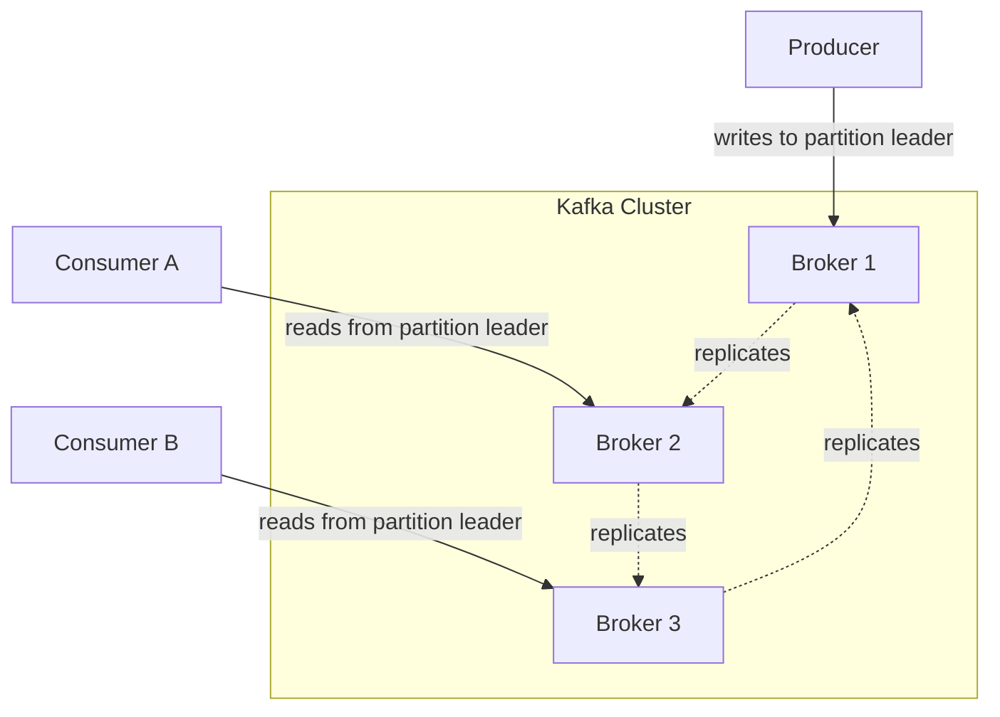
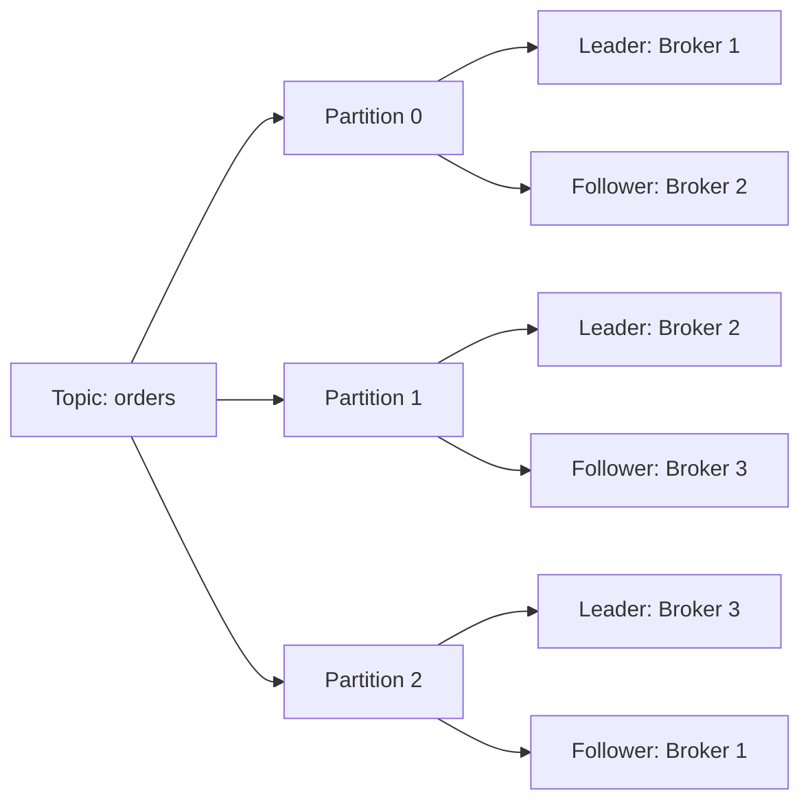
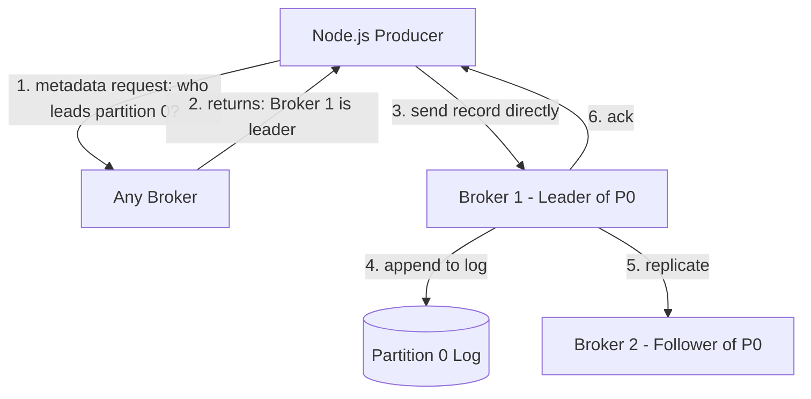
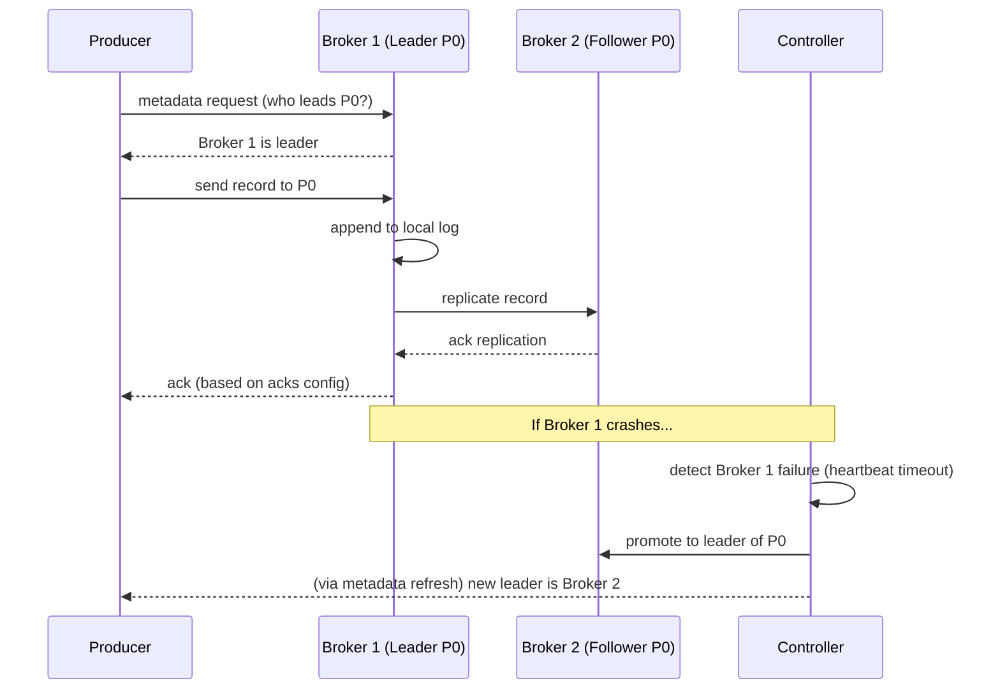

# Module 3 — Kafka Architecture

**Level:** ⭐ Beginner
**Track:** Kafka Complete Masterclass for Node.js Backend Engineers
**Module:** 3 of 25

---

## 1. Introduction

Module 1 gave you the "why." Module 2 gave you a running broker. This module gives you the **vocabulary and mental map** of everything inside a Kafka cluster: brokers, the controller, topics, partitions, producers, consumers, consumer groups, offsets, leaders, followers, and ISR.

This module is dense with terminology on purpose — every single term here reappears in every later module. If you skip this one, later modules (Partitions, Consumer Groups, Replication) will feel like they're using words you half-understand. Read slowly.

---

## 2. Learning Objectives

By the end of this module, you will be able to:

1. Name and define every core Kafka component: broker, cluster, topic, partition, producer, consumer, consumer group, offset, leader, follower, controller, ISR.
2. Draw the full architecture of a Kafka cluster from memory.
3. Explain how a producer and a consumer each interact with a specific broker for a specific partition.
4. Explain what a "leader" and "follower" are for a partition, and why this matters for fault tolerance.
5. Explain the role of the controller in a Kafka cluster.
6. Answer architecture-level interview questions confidently.

---

## 3. Why This Concept Exists

A distributed system needs a shared vocabulary and a clear division of responsibility, or nobody — including you — can reason about where data lives, who owns what, or what happens during a failure.

Kafka's architecture exists to answer very concrete engineering questions:

- If I have 10 servers, how do I spread the write/read load across all of them? → **Partitions across Brokers**
- If a server dies, how do I not lose data? → **Replication (Leader/Follower)**
- If 5 different consumers need the same data independently, how does that work without conflict? → **Consumer Groups**
- Who decides which broker leads which partition, and what happens when that decision needs to change (e.g., broker crash)? → **The Controller**

Each concept in this module exists to solve one specific distributed-systems problem. We'll go through them one at a time.

---

## 4. Problem Statement

Imagine you have:

- A `payments` topic receiving **50,000 events per second**.
- A requirement that **no data is lost**, even if a server crashes.
- **5 independent teams** (Fraud, Accounting, Analytics, Notifications, Reporting) that each need to read every payment event, at their own pace, without interfering with each other.
- A cluster of **3 physical servers** to spread this load across.

A single-server, single-file log (like we described conceptually in Module 1) cannot satisfy any of these requirements alone:

- One file can't be written to by 50,000 events/sec fast enough if it's not spread across servers.
- One file on one server is a single point of failure.
- Multiple independent readers reading a shared file at different speeds is messy without a formal mechanism to track "where is each reader up to."

Kafka's architecture — partitions spread across brokers, replication for fault tolerance, and consumer groups for independent, coordinated reading — solves exactly this.

---

## 5. Real-World Analogy

### Analogy: A Multi-Branch Library with Photocopied Books

Imagine a library system (Kafka cluster) with 3 branches (brokers). A popular book series (a topic, e.g., `orders`) is split into 3 volumes (partitions) — Volume 1 might be kept at Branch A, Volume 2 at Branch B, Volume 3 at Branch C. This way, three different people can be reading three different volumes **at the same time**, at three different branches, without queueing behind each other.

To protect against a branch burning down, each branch also keeps **photocopies** of the other branches' volumes (replication) — so if Branch A burns down, Branches B and C still have a backup copy of Volume 1 and can serve it.

Finally, imagine 5 different reading clubs (consumer groups) — Fraud Club, Accounting Club, Analytics Club — each independently reading through all 3 volumes at their own pace, each keeping their own bookmark (offset), without needing to coordinate with the other clubs.

---

## 6. Technical Definition

| Term | Definition |
|---|---|
| **Broker** | A single Kafka server process that stores data and serves client requests. A cluster is made of multiple brokers. |
| **Cluster** | A group of brokers working together, coordinated (via KRaft or Zookeeper) as a single logical Kafka system. |
| **Topic** | A named category/feed of records (e.g., `orders`). Logical, not physical — a topic is split into partitions which are the actual physical storage units. |
| **Partition** | An ordered, append-only, immutable sequence of records — the actual unit of storage and parallelism within a topic. |
| **Producer** | A client application that writes (publishes) records to a topic. |
| **Consumer** | A client application that reads (subscribes to) records from a topic. |
| **Consumer Group** | A named set of consumers that cooperatively divide up the partitions of a topic so each partition is read by exactly one consumer within that group. |
| **Offset** | A unique, sequential ID assigned to each record within a partition, representing its position in the log. |
| **Leader** | For a given partition, the one broker replica responsible for handling all reads and writes for that partition. |
| **Follower** | A broker replica that passively replicates the leader's data for a given partition, ready to take over if the leader fails. |
| **Controller** | A special broker (elected among the cluster) responsible for cluster-wide administrative decisions — e.g., detecting broker failures and reassigning partition leadership. |
| **ISR (In-Sync Replicas)** | The set of replicas (leader + followers) that are fully caught up with the leader's log at any given moment — used to decide which replicas are eligible to become the new leader if needed. |

---

## 7. Internal Working

### How a topic actually becomes partitions on disk

When you create a topic `orders` with 3 partitions and replication factor 2, on a 3-broker cluster, Kafka does something like this:

```
Topic: orders (3 partitions, replication factor 2)

Partition 0: Leader = Broker 1, Follower = Broker 2
Partition 1: Leader = Broker 2, Follower = Broker 3
Partition 2: Leader = Broker 3, Follower = Broker 1
```

Notice how Kafka **spreads leadership** across brokers rather than making one broker the leader for everything — this balances load across the cluster. Each broker is a leader for some partitions and a follower for others, simultaneously.

### How the controller works

One broker in the cluster is elected as the **controller** (in KRaft mode, this is tied to the Raft-elected leader among controller nodes). The controller's job:

- Watch for broker failures (via heartbeats/session timeouts).
- When a broker carrying a partition leader dies, promote an in-sync follower to become the new leader.
- Propagate this metadata change to all other brokers so clients know where to send requests.

---

## 8. Architecture

```
                         ┌─────────────────────────────────────────┐
                         │              Kafka Cluster                │
                         │                                            │
                         │   ┌──────────┐  ┌──────────┐  ┌──────────┐ │
                         │   │ Broker 1  │  │ Broker 2  │  │ Broker 3  │ │
                         │   │ (Leader:  │  │ (Leader:  │  │ (Leader:  │ │
                         │   │  P0)      │  │  P1)      │  │  P2)      │ │
                         │   │ (Follower:│  │ (Follower:│  │ (Follower:│ │
                         │   │  P2)      │  │  P0)      │  │  P1)      │ │
                         │   └──────────┘  └──────────┘  └──────────┘ │
                         │        ▲ One of these is the Controller     │
                         └─────────────────────────────────────────┘
                                          ▲            ▲
                              produce/    │            │  consume
                              consume     │            │
                                    ┌─────┴────┐  ┌─────┴─────┐
                                    │ Producer  │  │ Consumer   │
                                    │ (Node.js) │  │ Group      │
                                    └──────────┘  └────────────┘
```

---

## 9. Step-by-Step Flow

1. A topic `orders` is created with 3 partitions and replication factor 2.
2. The controller assigns leader and follower roles for each partition across available brokers, balancing load.
3. A producer wants to send a record. It first asks any broker (via a metadata request) "who is the leader for partition X of topic `orders`?"
4. The producer sends the record **directly to the leader broker** for that partition.
5. The leader appends the record to its local log and returns an acknowledgment (based on `acks` config, Module 4).
6. Follower brokers replicate the record from the leader asynchronously (or synchronously, depending on config) to stay in the ISR.
7. A consumer (part of a consumer group) is assigned some subset of partitions to read from.
8. The consumer sends fetch requests **directly to the leader broker** of its assigned partitions, tracking its own offset.
9. If the leader broker crashes, the controller promotes an in-sync follower to be the new leader, and clients automatically redirect their requests there.

---

## 10. Detailed ASCII Diagrams

### 10.1 Topic → Partitions → Brokers

```
Topic: orders

  Partition 0  →  Leader: Broker 1   Follower: Broker 2
  Partition 1  →  Leader: Broker 2   Follower: Broker 3
  Partition 2  →  Leader: Broker 3   Follower: Broker 1
```

### 10.2 Leader / Follower / ISR

```
Partition 0

   Leader (Broker 1)
   ┌─────────────────┐
   │ [r0][r1][r2][r3] │  <- accepts all writes & reads
   └─────────────────┘
          │  replicate
          ▼
   Follower (Broker 2)
   ┌─────────────────┐
   │ [r0][r1][r2][r3] │  <- caught up = "in-sync" = part of ISR
   └─────────────────┘

ISR = { Broker 1 (leader), Broker 2 (follower, caught up) }
```

### 10.3 Controller Responsibility

```
                 ┌───────────────┐
                 │  Controller    │  (one broker, elected)
                 │  (Broker 2)    │
                 └───────┬───────┘
                          │ monitors broker health
             ┌────────────┼────────────┐
             ▼            ▼            ▼
        Broker 1      Broker 2     Broker 3
        (healthy)     (healthy)    (CRASHES) ✗
                                       │
                          Controller detects failure,
                          promotes a follower of Broker 3's
                          partitions to be the new leader
```

---

## 11. Mermaid Diagrams





---

## 12. Request Flow Diagram



---

## 13. Sequence Diagram



---

## 14. Kafka Internal Flow

```
Producer writes record
      │
      ▼
Leader broker for target partition receives it
      │
      ▼
Record appended to leader's local partition log (disk)
      │
      ▼
Followers in ISR pull/replicate the new record
      │
      ▼
Once required replicas have the record (per acks config),
producer receives acknowledgment
      │
      ▼
Consumer (via consumer group) fetches from the leader,
tracking its own offset per partition
```

---

## 15. Producer Perspective

A producer doesn't need to know the entire cluster topology in advance. It only needs **one or more bootstrap broker addresses** to start — from there, it asks for cluster metadata (which brokers exist, which broker leads which partition) and caches this information, refreshing it periodically or when errors indicate stale metadata (e.g., "not leader for partition" errors after a failover).

```javascript
// KafkaJS handles all of this internally — you don't manually
// figure out which broker leads which partition.
const kafka = new Kafka({
  clientId: "order-service",
  brokers: ["broker1:9092", "broker2:9092", "broker3:9092"], // bootstrap servers
});
```

---

## 16. Consumer Perspective

A consumer, similarly, doesn't manually track "which broker has partition 2." KafkaJS's consumer group logic automatically:

- Discovers which broker is the leader for each assigned partition.
- Sends fetch requests to the correct leader broker.
- Re-discovers the new leader automatically if a failover happens mid-session.

---

## 17. Broker Perspective

Each broker in the cluster simultaneously plays multiple roles:

- **Leader** for some subset of partitions (handles all reads/writes for those).
- **Follower** for other partitions (passively replicates from another broker's leader).
- Possibly the **Controller** (only one broker cluster-wide at a time).

This is a key architecture insight: **there's no single "master" broker that does everything** — responsibility is distributed evenly, which is exactly why Kafka scales horizontally so well.

---

## 18. Node.js Integration

Using KafkaJS's Admin API, you can introspect cluster architecture directly from Node.js — genuinely useful for debugging.

```javascript
// src/inspectCluster.js
import { Kafka } from "kafkajs";

const kafka = new Kafka({
  clientId: "cluster-inspector",
  brokers: ["localhost:9092"],
});

async function inspectCluster() {
  const admin = kafka.admin();
  await admin.connect();

  // Get metadata for a specific topic: partitions, leaders, replicas, ISR
  const metadata = await admin.fetchTopicMetadata({ topics: ["orders"] });

  metadata.topics.forEach((topic) => {
    console.log(`Topic: ${topic.name}`);
    topic.partitions.forEach((p) => {
      console.log(
        `  Partition ${p.partitionId} | Leader: broker ${p.leader} | Replicas: [${p.replicas}] | ISR: [${p.isr}]`
      );
    });
  });

  await admin.disconnect();
}

inspectCluster().catch(console.error);
```

---

## 19. KafkaJS Examples

### 19.1 Creating a topic with explicit partition/replication settings

```javascript
// src/createTopic.js
import { Kafka } from "kafkajs";

const kafka = new Kafka({ clientId: "topic-admin", brokers: ["localhost:9092"] });

async function createOrdersTopic() {
  const admin = kafka.admin();
  await admin.connect();

  await admin.createTopics({
    topics: [
      {
        topic: "orders",
        numPartitions: 3,        // parallelism — see Module 6
        replicationFactor: 1,    // use 3 in production, see Module 9
      },
    ],
  });

  console.log("Topic 'orders' created (or already existed).");
  await admin.disconnect();
}

createOrdersTopic().catch(console.error);
```

### 19.2 Checking which broker is the controller

```javascript
// src/whoIsController.js
import { Kafka } from "kafkajs";

const kafka = new Kafka({ clientId: "controller-check", brokers: ["localhost:9092"] });

async function whoIsController() {
  const admin = kafka.admin();
  await admin.connect();

  const cluster = await admin.describeCluster();
  console.log("Cluster ID:", cluster.clusterId);
  console.log("Controller broker ID:", cluster.controller);
  console.log("All brokers:", cluster.brokers);

  await admin.disconnect();
}

whoIsController().catch(console.error);
```

---

## 20. CLI Commands

```bash
# Describe a topic — shows partitions, leader, replicas, and ISR
kafka-topics.sh --bootstrap-server localhost:9092 --describe --topic orders

# Example output:
# Topic: orders  PartitionCount: 3  ReplicationFactor: 1
#   Partition: 0  Leader: 1  Replicas: 1  Isr: 1
#   Partition: 1  Leader: 1  Replicas: 1  Isr: 1
#   Partition: 2  Leader: 1  Replicas: 1  Isr: 1

# List all brokers in the cluster and cluster metadata
kafka-metadata-quorum.sh --bootstrap-server localhost:9092 describe --status

# Check which broker is currently the active controller (KRaft mode)
kafka-metadata-quorum.sh --bootstrap-server localhost:9092 describe --status
```

---

## 21. Configuration Explanation

| Config | Meaning |
|---|---|
| `numPartitions` | Number of partitions for a topic — determines maximum parallelism for producers/consumers (Module 6) |
| `replicationFactor` | Number of copies of each partition across the cluster — determines fault tolerance (Module 9) |
| `min.insync.replicas` | Minimum number of replicas that must acknowledge a write for it to be considered successful when `acks=all` (Module 4, Module 9) |
| `broker.id` (server-side) | Unique numeric ID for each broker in the cluster |
| `controller.quorum.voters` (KRaft) | Defines which broker nodes participate in controller elections |

---

## 22. Common Mistakes

1. **Assuming a "topic" is a physical thing.** A topic is a logical name; partitions are the actual physical, ordered logs.
2. **Confusing replication factor with partition count.** Partition count = parallelism. Replication factor = fault tolerance. They solve different problems and are configured independently.
3. **Thinking one broker "owns" the whole topic.** In reality, different partitions of the same topic are very often led by different brokers.
4. **Assuming the controller is a special, separate type of server.** The controller is just a regular broker that has additionally been elected to handle cluster-wide admin decisions.
5. **Ignoring ISR when reasoning about durability.** A replication factor of 3 provides little protection if `min.insync.replicas` is misconfigured and only 1 replica is ever actually in sync (explored deeply in Module 9).

---

## 23. Edge Cases

- **What happens if a follower falls behind and drops out of the ISR?** It's temporarily excluded from being eligible for leader election until it catches back up — this prevents an out-of-date replica from becoming leader and silently losing recent data.
- **What if the controller itself crashes?** A new controller is elected automatically from the remaining eligible broker/controller nodes (via Raft consensus in KRaft mode).
- **What if all replicas for a partition are down simultaneously?** The partition becomes unavailable until at least one replica (ideally one from the ISR) comes back online — this is why replication factor and rack-awareness matter in production (Module 9, Module 21).

---

## 24. Performance Considerations

- More partitions generally means more parallelism (more consumers can read simultaneously) — but also more overhead (more file handles, more replication traffic, longer leader election during failures). Module 6 and Module 12 dive deeper.
- Spreading partition leadership evenly across brokers (as Kafka does by default) avoids a "hot broker" problem where one server does most of the work.

---

## 25. Scalability Discussion

- Adding more brokers to a cluster allows more partitions to be spread out, increasing total throughput capacity.
- Because producers and consumers talk **directly to leader brokers** (not through some central bottleneck), Kafka's architecture avoids a single chokepoint as the cluster grows — this is fundamentally different from a single-server queue system.

---

## 26. Production Best Practices

- Use **at least 3 brokers** in production for meaningful fault tolerance (replication factor 3 requires at least 3 brokers).
- Monitor **ISR shrinkage** — a shrinking ISR list is often the earliest sign of a struggling broker (network issues, disk I/O problems) before it fully fails.
- Distribute brokers across different physical racks/availability zones where possible, so a single infrastructure failure doesn't take out multiple replicas of the same partition at once.

---

## 27. Monitoring & Debugging

- `kafka-topics.sh --describe` is your primary tool to inspect leader/replica/ISR state for any topic.
- Watch for `UnderReplicatedPartitions` metrics — partitions where the ISR is smaller than the replication factor, indicating a replica is behind or down.
- Track `ActiveControllerCount` — should always be exactly `1` across the cluster; `0` means no controller is currently active (a serious cluster health issue).

---

## 28. Security Considerations

- Broker-to-broker replication traffic can also be encrypted with TLS in production (separate listener/config from client traffic — Module 20).
- Admin operations (like creating/deleting topics) should be restricted via ACLs to specific trusted service accounts, not open to every client.

---

## 29. Interview Questions (Easy → Medium → Hard)

### Easy

1. What is a broker?
2. What is the difference between a topic and a partition?
3. What is a consumer group?
4. What does "leader" mean for a partition?

### Medium

5. Why does Kafka spread partition leadership across multiple brokers instead of having one broker lead everything?
6. What is the role of the controller in a Kafka cluster?
7. What is ISR, and why does it matter for choosing a new leader during a failover?
8. If a topic has 3 partitions and replication factor 2 on a 3-broker cluster, roughly how many partition "copies" (leader + follower) does each broker hold?

### Hard

9. Explain step by step what happens when the broker that is the leader for partition 0 of topic `orders` suddenly crashes.
10. Why can a follower replica that is technically "alive" still be excluded from the ISR, and why does this matter for data safety?
11. Explain why producers and consumers connect directly to leader brokers instead of routing all traffic through the controller.
12. If replication factor is 3 but `min.insync.replicas` is set to 1, describe a failure scenario where data could still be lost despite having 3 copies.

---

## 30. Common Interview Traps

- **Trap:** "The controller handles all reads and writes for the cluster." → **Reality:** The controller only handles cluster metadata/admin decisions (like leader election); actual reads/writes go directly to partition leader brokers.
- **Trap:** "A topic lives on one broker." → **Reality:** A topic's partitions are typically spread across multiple brokers.
- **Trap:** "Replication factor and partition count are the same concept." → **Reality:** They solve entirely different problems (fault tolerance vs. parallelism) and are configured independently.
- **Trap:** "ISR always equals the full replica set." → **Reality:** ISR can shrink below the full replica set when followers fall behind — a critical operational signal.

---

## 31. Summary

- A Kafka **cluster** is made of multiple **brokers**, each holding a mix of partition leaders and followers.
- A **topic** is a logical name; its actual data lives in **partitions**, the true unit of storage and parallelism.
- Each partition has one **leader** (handles all reads/writes) and zero or more **followers** (replicate for fault tolerance).
- The **ISR** tracks which replicas are fully caught up and thus eligible for leader promotion.
- The **controller** is a specially elected broker responsible for cluster-wide decisions like leader election after a failure.
- **Consumer groups** let multiple independent consumer applications divide up partitions for parallel, coordinated reading.

---

## 32. Cheat Sheet

```
KAFKA ARCHITECTURE — ONE PAGE

Cluster    = multiple Brokers working together
Broker     = a single Kafka server (stores data, serves clients)
Topic      = logical name/category (e.g., "orders")
Partition  = physical, ordered, append-only log — the real unit of storage
Producer   = writes records (talks directly to partition LEADER)
Consumer   = reads records (talks directly to partition LEADER)
Consumer Group = set of consumers dividing up partitions of a topic
Offset     = position of a record within a partition
Leader     = the one broker handling reads/writes for a partition
Follower   = a broker replicating a partition's leader, for fault tolerance
ISR        = replicas fully caught up with the leader (eligible for promotion)
Controller = one elected broker managing cluster-wide admin decisions
             (like leader election after a crash)
```

---

## 33. Hands-on Exercises

1. Create a topic with 3 partitions and replication factor 1 on your single-broker local cluster, then run `--describe` and identify the leader for each partition (it will be the same broker, since you only have one).
2. Write down, in your own words, the difference between "the controller" and "a partition leader."
3. Draw the architecture diagram from Section 8 from memory, labeling every component.
4. Using the `whoIsController.js` script from Section 19.2, identify which broker ID is your current controller.

---

## 34. Mini Project

**Build:** A Node.js CLI tool (`cluster-inspector.js`) using KafkaJS's Admin API that prints a clean, human-readable summary of your cluster: total brokers, total topics, and for each topic, its partition count, replication factor, and current leader/ISR per partition.

---

## 35. Advanced Project

**Build:** Extend your 3-broker KRaft cluster from Module 2's advanced project. Create a topic with replication factor 3. Manually stop (`docker stop`) the broker that is currently the leader for partition 0. Observe (via `kafka-topics.sh --describe`) that a new leader is automatically elected from the ISR, and that your Node.js producer/consumer (with proper retry config) recovers automatically without code changes.

---

## 36. Homework

1. Research and write a short explanation of what happens to in-flight, unacknowledged writes when a partition leader crashes mid-write.
2. Explain, in your own words, why Kafka chose a "leader handles all reads/writes, followers just replicate" model instead of allowing followers to also serve reads (as some other systems do).
3. Read about "preferred leader election" in Kafka and explain why it's needed even when no broker has crashed.

---

## 37. Additional Reading

- Apache Kafka documentation — "Design" section, specifically "Replication"
- KIP-500 (KRaft architecture proposal) — controller design details
- Confluent blog: "Kafka architecture — a deep dive into brokers, partitions, and replication"

---

## Key Takeaways

- Clusters are made of brokers; brokers hold a mix of partition leaders and followers.
- Partitions, not topics, are the real unit of storage and parallelism.
- Every partition has exactly one leader at a time; followers exist purely for fault tolerance.
- The controller manages cluster-wide decisions, not data traffic itself.
- ISR determines which replicas are safe to promote to leader during a failure.

---

## Revision Notes

- Be able to explain the difference between "topic," "partition," and "broker" without hesitating.
- Be able to describe, step-by-step, what happens when a leader broker crashes.
- Memorize: Partition count = parallelism. Replication factor = fault tolerance. Two different knobs.

---

## One-Page Cheat Sheet

*(See Section 32 above.)*

---

## 20 Practice Questions

1. What is a Kafka broker?
2. What is a Kafka cluster?
3. What is the difference between a topic and a partition?
4. What is a producer?
5. What is a consumer?
6. What is a consumer group?
7. What is an offset?
8. What is a leader replica?
9. What is a follower replica?
10. What is the controller responsible for?
11. What does ISR stand for?
12. Why does replication factor matter?
13. Why does partition count matter?
14. Can one broker be a leader for some partitions and a follower for others simultaneously?
15. Who elects the controller?
16. What happens when the controller detects a broker has failed?
17. Do producers send data through the controller?
18. Do consumers read data through the controller?
19. What is the risk if a follower falls out of the ISR and then is promoted anyway?
20. Why is a single-broker cluster not fault-tolerant?

---

## 10 Scenario-Based Questions

1. You have a 5-broker cluster and a topic with 10 partitions and replication factor 3. Describe how leadership might be distributed across the brokers.
2. Broker 2 (currently a partition leader for several partitions) loses network connectivity for 30 seconds. Walk through what the controller does.
3. Your monitoring shows `UnderReplicatedPartitions > 0` for the last hour. What does this likely indicate, and what would you check first?
4. A teammate asks: "If we have replication factor 3, can we survive 2 broker failures at once?" Answer precisely, including any caveats about ISR.
5. You create a topic with `numPartitions: 1`. Explain why this limits your consumer group's maximum parallelism, regardless of how many consumer instances you run.
6. Your cluster's `ActiveControllerCount` metric briefly drops to 0 during a deployment. What does this mean, and should you be concerned if it recovers within a few seconds?
7. You notice one broker in your cluster consistently has much higher CPU/network usage than the others. What architectural factor might explain this imbalance?
8. A follower broker has been down for 10 minutes and just came back online. Is it immediately part of the ISR again? Explain your reasoning.
9. Your team wants to add 2 new brokers to an existing 3-broker cluster to increase capacity. Does this automatically rebalance existing partitions? What would you need to do?
10. Explain to a junior engineer why "the leader" for partition 0 might be a completely different broker than "the leader" for partition 1 of the very same topic.

---

## 5 Coding Assignments

1. Write a Node.js script that uses `admin.fetchTopicMetadata()` to print a warning if any partition's ISR size is smaller than its replica count (indicating under-replication).
2. Write a script that uses `admin.describeCluster()` to print the total number of brokers and flag if the cluster has fewer than 3 (a production-readiness check).
3. Build a small Express `/health/kafka` endpoint that returns `200 OK` if it can successfully fetch cluster metadata within 2 seconds, and `503` otherwise.
4. Write a script that creates a topic, then immediately calls `fetchTopicMetadata` to print which broker is the leader for each partition, formatted as a table.
5. Write a script that monitors and logs (every 10 seconds) the current controller broker ID — useful for detecting unexpected controller re-elections during testing.

---

## Suggested Next Module

**Module 4 — Producers**
With the full cluster architecture in your head, it's time to go deep on the producer side: the producer API, message lifecycle, acknowledgements (`acks`), batching, compression, retries, idempotent producers, and transactions.
