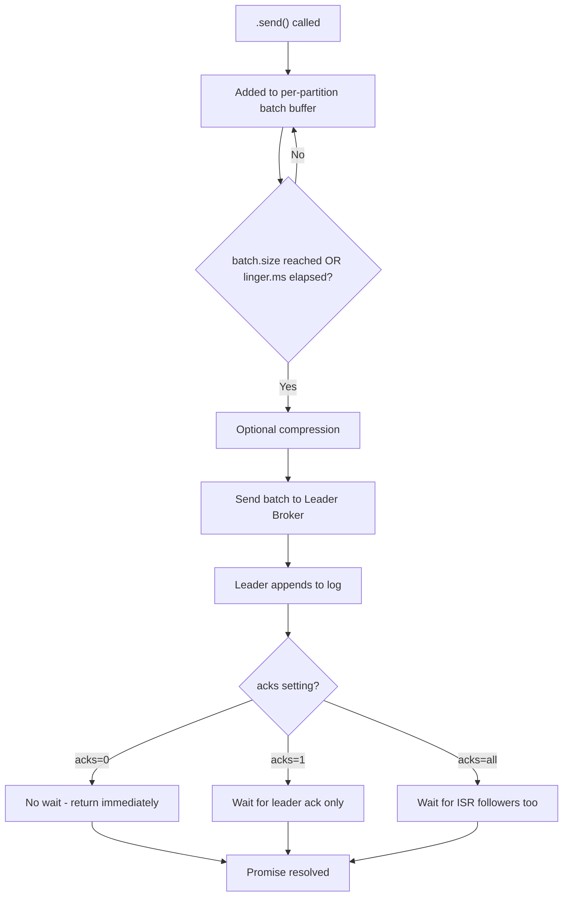
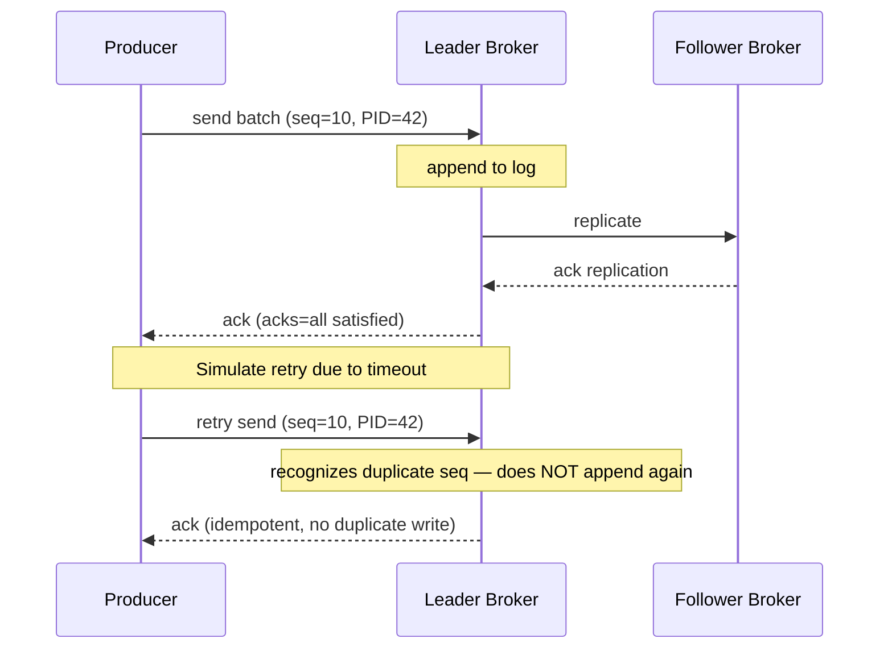
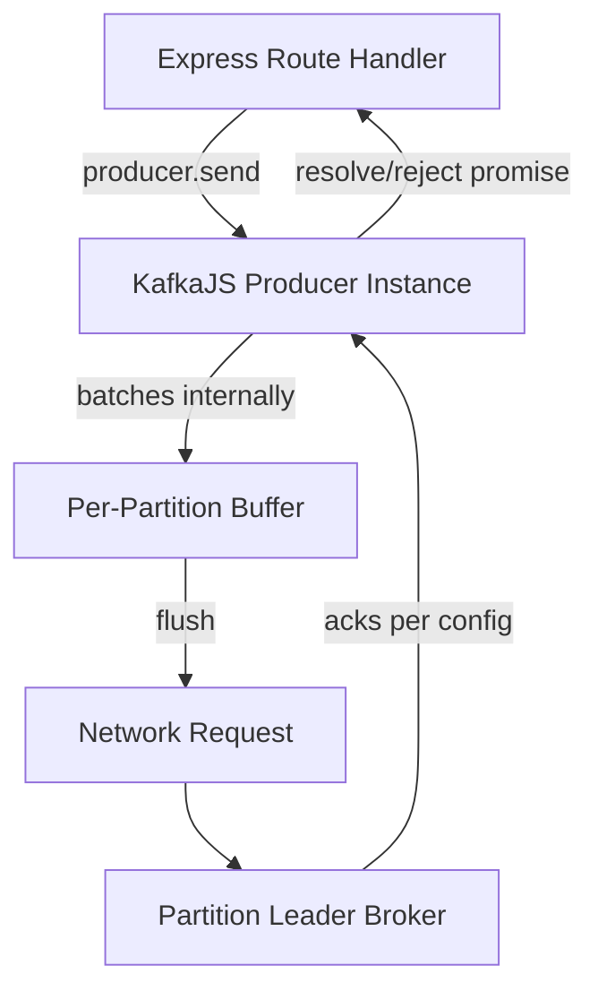
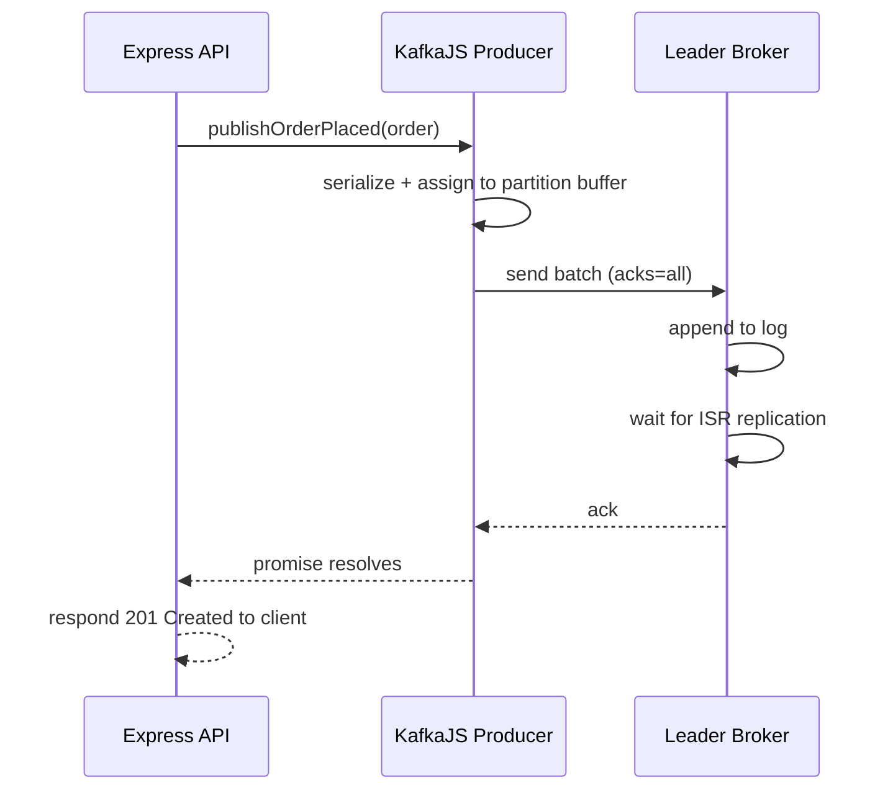

# Module 4 — Producers

**Level:** ⭐⭐ Beginner → Intermediate
**Track:** Kafka Complete Traject for Node.js Backend Engineers
**Module:** 4 of 25

---

## 1. Introduction

In Module 1 you wrote a simple `producer.send()` call and moved on. Now we go deep: what actually happens between the moment you call `.send()` and the moment your data is durably stored on a broker's disk? What does `acks` really mean? Why does batching exist? What is an idempotent producer, and why would you ever need Kafka transactions from Node.js?

This module turns you from "someone who can publish a message" into "someone who can explain, defend, and tune producer behavior in a production system."

---

## 2. Learning Objectives

By the end of this module, you will be able to:

1. Explain the full lifecycle of a producer request, from `.send()` to broker acknowledgment.
2. Explain the `acks` config (`0`, `1`, `all`) and the durability/latency trade-offs of each.
3. Explain batching and why it dramatically improves throughput.
4. Explain compression and when to use which codec.
5. Explain retries and the danger of message duplication they introduce.
6. Explain what an idempotent producer is and how it solves the duplication problem.
7. Explain Kafka transactions at a conceptual level and when you'd actually need them.
8. Write production-ready KafkaJS producer code with proper configuration and error handling.

---

## 3. Why This Concept Exists

A producer is the entry point of every event into Kafka. If the producer is misconfigured, everything downstream — no matter how well-architected — inherits the problem: lost messages, duplicated messages, out-of-order messages, or a producer so slow it becomes your API's bottleneck.

Each producer concept in this module exists to solve one specific real-world failure mode:

- **Acks** exists because "successfully sent" can mean different things — do you want speed, or do you want a guarantee the message survived a broker crash?
- **Batching** exists because sending one network request per message is wasteful at scale.
- **Retries** exist because networks and brokers are unreliable — but retries alone can create duplicate messages.
- **Idempotent producers** exist specifically to fix the duplication problem retries introduce.
- **Transactions** exist for the rare but real case where you need multiple writes (possibly across topics) to succeed or fail *together*, atomically.

---

## 4. Problem Statement

Consider our recurring example: the Order Service publishing `OrderPlaced` events. Several very real production questions arise:

1. If the broker crashes 5 milliseconds after receiving my message, but before I get an acknowledgment, is the message safe? Did I already tell the customer "Order Placed"?
2. If I send 10,000 orders per second, and each is a separate network round-trip, will my producer become the bottleneck?
3. If a retry causes the same message to be sent twice due to a transient network blip, will Payment Service double-charge the customer?
4. If I need to publish an `OrderPlaced` event AND update a `payments-ledger` topic atomically (both succeed, or neither does), how do I guarantee that with Kafka alone?

Each of these questions has a specific, well-defined Kafka producer feature as the answer, which we cover below.

---

## 5. Real-World Analogy

### Analogy: Registered Mail vs. Regular Mail vs. Notarized Contracts

- **`acks=0`** is like dropping a letter in a mailbox and walking away without even checking it fell in properly — fastest, but you have zero confirmation it was received.
- **`acks=1`** is like a single postal worker signing to say "yes, I have your letter" — but if their branch burns down before it's forwarded to the main sorting center, it's still lost.
- **`acks=all`** is like requiring signatures from the local branch **and** the regional distribution center before you consider the letter "sent" — slower, but far safer.
- **Idempotent producer** is like writing a unique tracking number on every letter so that even if you accidentally mail the same letter twice (due to a mix-up), the postal system recognizes the duplicate and discards the second copy.
- **Transactions** are like a notarized contract involving multiple documents — either all documents get signed and filed together, or the whole transaction is voided; there's no in-between state where only half of it went through.

---

## 6. Technical Definition

- **Producer**: A client that publishes (writes) records to one or more Kafka topics.
- **`acks`**: A producer configuration controlling how many broker replicas must acknowledge a write before it's considered successful:
  - `acks=0`: Fire-and-forget; don't wait for any acknowledgment.
  - `acks=1`: Wait for the partition **leader** to acknowledge the write (not followers).
  - `acks=all` (or `-1`): Wait for **all in-sync replicas (ISR)** to acknowledge the write.
- **Batching**: Grouping multiple records together into a single network request to the broker, controlled by `batch.size` and `linger.ms`.
- **Compression**: Compressing batches of records before sending (e.g., `gzip`, `snappy`, `lz4`, `zstd`) to reduce network and disk usage.
- **Retries**: Automatically re-sending a record if the initial send fails due to a transient/retriable error.
- **Idempotent Producer**: A producer mode (`enableIdempotence: true`) where Kafka assigns each producer a unique ID and sequence number per partition, allowing the broker to detect and discard duplicate retries.
- **Transactions**: A mechanism allowing a producer to write to multiple partitions/topics atomically, such that consumers configured with `read_committed` isolation only see the writes if the entire transaction succeeded.

---

## 7. Internal Working

### The producer send pipeline

```
.send() called
      │
      ▼
Record added to an internal per-partition BATCH (buffer)
      │
      ▼
Batch is sent when EITHER:
   - batch.size (bytes) is reached, OR
   - linger.ms (time) has elapsed
      │
      ▼
Batch is optionally COMPRESSED
      │
      ▼
Batch sent over the network to the partition's LEADER broker
      │
      ▼
Leader appends batch to its local log
      │
      ▼
Depending on `acks`:
   acks=0   → producer doesn't wait at all
   acks=1   → producer waits for leader's local append confirmation
   acks=all → producer waits for ISR followers to also confirm replication
      │
      ▼
Producer receives acknowledgment (or an error, triggering retry logic)
```

### Why batching this way is fast

Instead of one network round-trip per message (extremely wasteful for small, frequent messages), KafkaJS (like all Kafka clients) accumulates messages destined for the same partition into a buffer, and flushes that buffer either when it's full (`batch.size`) or after a small delay (`linger.ms`) — trading a tiny bit of added latency for a massive gain in throughput.

---

## 8. Architecture

```
                     Node.js Producer Process
   ┌───────────────────────────────────────────────────────┐
   │                                                          │
   │  .send() calls  ──►  Internal per-partition buffers       │
   │                         │                                 │
   │                         ▼                                 │
   │                    Batch assembled                        │
   │                    (batch.size / linger.ms)                │
   │                         │                                 │
   │                         ▼                                 │
   │                    Optional compression                   │
   │                         │                                 │
   └─────────────────────────┼─────────────────────────────────┘
                              ▼
                    Network request to Leader Broker
                              │
                              ▼
                    Leader appends to partition log
                              │
                    (acks=all) waits for ISR replication
                              │
                              ▼
                    Acknowledgment returned to producer
```

---

## 9. Step-by-Step Flow

1. Your application calls `producer.send({ topic, messages })`.
2. KafkaJS determines the target partition for each message (via key hashing, or round-robin if no key — Module 6).
3. The message is added to an internal batch buffer for that partition.
4. Once `batch.size` or `linger.ms` triggers a flush, the batch is sent to the partition's leader broker.
5. The leader appends the batch to its local log.
6. Based on `acks`, the leader either responds immediately (`acks=1`) or waits for follower replication first (`acks=all`).
7. If the request fails due to a retriable error (e.g., temporary leader unavailability), KafkaJS automatically retries, following the configured retry policy.
8. If `enableIdempotence: true`, the broker detects and silently discards any duplicate retries using sequence numbers, so your consumer never sees the same message twice **from this specific cause**.
9. The producer resolves the `.send()` promise (or throws, if all retries are exhausted).

---

## 10. Detailed ASCII Diagrams

### 10.1 `acks` Comparison

```
acks=0                    acks=1                    acks=all

Producer                  Producer                  Producer
   │ send                    │ send                    │ send
   ▼                         ▼                         ▼
Leader (no wait)          Leader (append)           Leader (append)
   │                         │ ack                     │
   ▼ (producer already      ▼                         ▼ wait for...
     moved on)           Producer continues        Follower 1 (ack)
                                                        │
                                                        ▼
                                                    Follower 2 (ack)
                                                        │
                                                        ▼
                                                  Producer continues

Fastest, least safe      Balanced                  Slowest, safest
```

### 10.2 Batching Timeline

```
Time:     0ms        5ms        10ms       15ms (linger.ms elapsed)
Messages: [m1]       [m1,m2]    [m1,m2,m3] → FLUSH batch to broker

If batch.size is reached earlier (e.g., at message m2 due to large payload),
the batch flushes immediately, without waiting for linger.ms.
```

### 10.3 Idempotent Producer — Duplicate Detection

```
Producer (PID=42, sequence starts at 0)

Send record, seq=5 ──► Broker appends seq=5
   │ (network blip, no ack received)
   ▼
Producer retries, seq=5 (same seq number, same PID)
   │
   ▼
Broker recognizes seq=5 from PID=42 was ALREADY written
   │
   ▼
Broker silently ACKs without appending again — no duplicate in the log
```

---

## 11. Mermaid Diagrams





---

## 12. Request Flow Diagram



---

## 13. Sequence Diagram



---

## 14. Kafka Internal Flow

```
1. Message serialized (key + value as bytes)
2. Partition selected (via murmur2 hash of key, or round-robin/sticky if no key)
3. Message added to that partition's in-memory batch
4. Batch flushed on batch.size or linger.ms trigger
5. Batch (optionally compressed) sent to leader broker over TCP
6. Leader validates request (auth, quotas, message size limits)
7. Leader appends batch to partition's active log segment (Module 11)
8. Leader responds based on acks setting
9. If enableIdempotence=true, leader checks (PID, sequence) for duplicates first
```

---

## 15. Producer Perspective

The producer's core responsibilities, in priority order:

1. **Correctness** — don't lose data, don't (avoidably) duplicate data.
2. **Throughput** — batch efficiently, compress when it helps.
3. **Latency** — balance `linger.ms` against how "real-time" your use case needs to be.

For most business-critical events (payments, orders), correctness wins: use `acks=all` and `enableIdempotence: true`. For high-volume, loss-tolerant data (e.g., raw clickstream/analytics pings), you might accept `acks=1` for better throughput.

---

## 16. Consumer Perspective

Consumers are affected by producer choices in ways that aren't always obvious:

- If the producer uses `acks=0` or `acks=1` without idempotence, consumers may occasionally see **duplicate** messages (from retries) or, in rare failure scenarios, **missing** messages.
- If the producer uses **transactions**, consumers must set `isolation.level: read_committed` (Module 4 advanced, Module 10) to only see fully-committed transactional writes — otherwise they might see uncommitted (and potentially rolled-back) data.

---

## 17. Broker Perspective

The broker's job during a produce request:

- Validate the request (topic exists, message size within `message.max.bytes`, correct partition).
- If idempotence is enabled, check the (Producer ID, sequence number) pair against what it has already seen for that partition, rejecting/deduplicating stale or duplicate sequences.
- Append the batch to the partition's log segment.
- If `acks=all`, wait until followers in the ISR have replicated before responding.

---

## 18. Node.js Integration

### Recommended producer configuration for a production order service

```javascript
// src/config/kafka.js
import { Kafka, logLevel, CompressionTypes } from "kafkajs";

export const kafka = new Kafka({
  clientId: "order-service",
  brokers: (process.env.KAFKA_BROKERS || "localhost:9092").split(","),
  logLevel: logLevel.INFO,
});

export const producerConfig = {
  allowAutoTopicCreation: false,
  idempotent: true,          // enables idempotent producer (see Section 19.2)
  maxInFlightRequests: 5,    // safe upper bound when idempotence is enabled
  transactionTimeout: 30000,
};
```

---

## 19. KafkaJS Examples

### 19.1 Basic producer with `acks=all` and compression

```javascript
// src/producers/orderProducer.js
import { CompressionTypes } from "kafkajs";
import { kafka, producerConfig } from "../config/kafka.js";

const producer = kafka.producer(producerConfig);
let connected = false;

export async function connectProducer() {
  if (!connected) {
    await producer.connect();
    connected = true;
  }
}

export async function publishOrderPlaced(order) {
  await producer.send({
    topic: "orders",
    acks: -1, // acks=all — wait for full ISR acknowledgment (durability first)
    compression: CompressionTypes.GZIP, // reduces network/disk usage for larger payloads
    messages: [
      {
        key: String(order.id),
        value: JSON.stringify({
          eventType: "OrderPlaced",
          orderId: order.id,
          items: order.items,
          totalAmount: order.totalAmount,
          timestamp: new Date().toISOString(),
        }),
      },
    ],
  });
}
```

### 19.2 Idempotent producer (recommended default for business-critical events)

```javascript
// src/producers/idempotentProducer.js
import { kafka } from "../config/kafka.js";

// enableIdempotence guarantees that retried sends due to transient network
// errors do NOT result in duplicate records in the log.
const producer = kafka.producer({
  idempotent: true,
  maxInFlightRequests: 5, // KafkaJS requires this to be <= 5 when idempotent
  retry: {
    retries: 10,
  },
});

export async function connectIdempotentProducer() {
  await producer.connect();
}

export async function publishPaymentEvent(payment) {
  await producer.send({
    topic: "payments",
    messages: [
      {
        key: String(payment.orderId),
        value: JSON.stringify(payment),
      },
    ],
  });
}
```

### 19.3 Producer transaction (multi-topic atomic write)

```javascript
// src/producers/transactionalProducer.js
import { kafka } from "../config/kafka.js";

const producer = kafka.producer({
  idempotent: true,
  transactionalId: "order-service-tx-1", // required for transactions
  maxInFlightRequests: 5,
});

export async function connectTransactionalProducer() {
  await producer.connect();
}

// Atomically publish to BOTH "orders" and "payments-ledger" —
// either both succeed, or neither is visible to read_committed consumers.
export async function placeOrderAtomically(order, ledgerEntry) {
  const transaction = await producer.transaction();

  try {
    await transaction.send({
      topic: "orders",
      messages: [{ key: String(order.id), value: JSON.stringify(order) }],
    });

    await transaction.send({
      topic: "payments-ledger",
      messages: [{ key: String(order.id), value: JSON.stringify(ledgerEntry) }],
    });

    await transaction.commit();
  } catch (err) {
    await transaction.abort();
    throw err;
  }
}
```

### 19.4 Custom batching tuning

```javascript
// Fine-tuning throughput vs latency for a high-volume analytics producer
const analyticsProducer = kafka.producer({
  allowAutoTopicCreation: false,
});

// Note: KafkaJS batches automatically per send() call; for true micro-batching
// tuning akin to linger.ms/batch.size, group multiple messages into one
// send() call, since KafkaJS sends each send() call as one batched request:
export async function publishAnalyticsBatch(events) {
  await analyticsProducer.send({
    topic: "analytics-events",
    messages: events.map((e) => ({
      key: e.sessionId,
      value: JSON.stringify(e),
    })),
  });
}
```

---

## 20. CLI Commands

```bash
# Describe topic config, including message size limits
kafka-configs.sh --bootstrap-server localhost:9092 \
  --entity-type topics --entity-name orders --describe

# Set min.insync.replicas for a topic (works with acks=all for durability)
kafka-configs.sh --bootstrap-server localhost:9092 \
  --entity-type topics --entity-name orders --alter \
  --add-config min.insync.replicas=2

# Produce a message with a specific key using the console producer
kafka-console-producer.sh --bootstrap-server localhost:9092 \
  --topic orders --property "parse.key=true" --property "key.separator=:"
# Then type: order-123:{"eventType":"OrderPlaced"}
```

---

## 21. Configuration Explanation

| Config | Meaning | Trade-off |
|---|---|---|
| `acks` | How many replicas must ack before success | `0`=fast/unsafe, `1`=balanced, `all`=slow/safe |
| `enableIdempotence` / `idempotent` | Prevents duplicate writes from retries | Small overhead, strongly recommended for critical data |
| `maxInFlightRequests` | Number of unacknowledged requests allowed in flight at once | Must be ≤ 5 when idempotence is enabled to preserve ordering guarantees |
| `compression` | Codec used to compress batches | Trades CPU for reduced network/disk usage |
| `retries` | How many times to retry a failed send | Too few = failures surface too easily; too many without idempotence = duplicate risk |
| `transactionalId` | Enables producer transactions | Adds coordination overhead; only needed for true atomic multi-write scenarios |
| `min.insync.replicas` (broker/topic config) | Minimum ISR size required for `acks=all` to succeed | Works together with replication factor to define real durability guarantees |

---

## 22. Common Mistakes

1. **Using `acks=0` or `acks=1` for financial/critical data** without understanding the data-loss window this creates.
2. **Enabling retries without idempotence** — this can silently create duplicate messages, especially under network instability.
3. **Setting `maxInFlightRequests` too high with idempotence enabled** — KafkaJS and Kafka itself cap this at 5 to preserve ordering guarantees during retries.
4. **Assuming compression is always a win** — for very small messages, compression overhead can outweigh the benefit; benchmark for your actual payload sizes.
5. **Forgetting to handle `.send()` promise rejections** — an unhandled rejected promise can crash a Node.js process or silently swallow a failed publish.
6. **Using transactions when they're not needed** — transactions add real overhead and complexity; they should be reserved for genuine atomic multi-write requirements, not used by default.

---

## 23. Edge Cases

- **What if `min.insync.replicas=2` but only 1 replica is currently in the ISR?** With `acks=all`, the produce request will fail (`NotEnoughReplicas` error) rather than silently proceeding with weaker durability — this is a *feature*, not a bug, and needs proper retry/alerting handling in your app.
- **What happens to in-flight batches if the leader crashes mid-send?** KafkaJS detects the error, refreshes metadata to find the new leader, and retries automatically (assuming retries are configured) — idempotence ensures this doesn't create a duplicate if the original write had actually succeeded before the crash.
- **What if you call `.send()` for 2 different topics inside one non-transactional flow, and the 2nd call fails?** The 1st write is already durably committed — there's no atomicity without an explicit transaction.

---

## 24. Performance Considerations

- `acks=all` with a well-configured ISR is only marginally slower than `acks=1` in most networks — the durability trade-off is usually well worth the small latency cost for anything business-critical.
- Compression (especially `lz4` or `zstd`) can significantly reduce network bandwidth usage for larger, more repetitive payloads (like JSON with many similar field names).
- Batching more aggressively (higher `linger.ms`) increases throughput but adds latency to individual message delivery — tune based on your specific SLA.

---

## 25. Scalability Discussion

- A single producer instance can be reused across many concurrent requests in a Node.js app (it's connection-pooled internally) — you should almost never create a new producer per request.
- For extremely high-throughput producers, consider multiple producer instances behind a load balancer or multiple application instances, each maintaining their own producer connection to the cluster.

---

## 26. Production Best Practices

- Default to `acks=all` + `enableIdempotence: true` for anything where correctness matters (which is most business events).
- Always explicitly handle `.send()` failures — log them, alert on them, and consider a fallback (e.g., writing to a local dead-letter store) rather than silently dropping the event.
- Reuse a single, long-lived producer connection per application instance; connect once at startup, disconnect gracefully at shutdown (Module 1's `server.js` pattern).
- Set sensible topic-level `min.insync.replicas` (commonly `2` with replication factor `3`) to balance durability and availability.

---

## 27. Monitoring & Debugging

- Monitor producer error rates and retry counts — a sudden spike often indicates broker or network issues, not application bugs.
- Track `request-latency-avg` and `record-send-rate` metrics (exposed by most Kafka clients, including via KafkaJS's instrumentation events) to catch throughput regressions early.
- Log every failed `.send()` with enough context (topic, key, error) to reconstruct what was lost or delayed.

---

## 28. Security Considerations

- Producer credentials (SASL username/password, or mTLS certificates) should never be hardcoded — use environment variables or a secrets manager (Module 20).
- Restrict topic-level ACLs so a given producer service account can only **produce** to the topics it legitimately owns (e.g., Order Service can produce to `orders`, but not to `payments-ledger`).

---

## 29. Interview Questions (Easy → Medium → Hard)

### Easy

1. What does `acks=0`, `acks=1`, and `acks=all` each mean?
2. What is batching, and why does it improve throughput?
3. What is compression used for in a Kafka producer?

### Medium

4. Why can retries cause duplicate messages, and how does an idempotent producer prevent this?
5. What's the difference between `linger.ms` and `batch.size`?
6. Why is `maxInFlightRequests` capped at 5 when idempotence is enabled?
7. What does `min.insync.replicas` control, and how does it interact with `acks=all`?

### Hard

8. Explain, step by step, how Kafka's idempotent producer mechanism (producer ID + sequence numbers) prevents duplicate writes during a retry.
9. Describe a real scenario where using Kafka transactions would be necessary, versus a scenario where idempotence alone is sufficient.
10. If `acks=all` and `min.insync.replicas=2` but the ISR temporarily shrinks to 1, what happens to new produce requests, and why is this the correct (not broken) behavior?
11. Compare the durability guarantees of `acks=1` vs `acks=all` in the specific case where the partition leader crashes immediately after acknowledging a write but before followers replicate it.

---

## 30. Common Interview Traps

- **Trap:** "`acks=all` means all replicas in the cluster must acknowledge." → **Reality:** It means all replicas *currently in the ISR* must acknowledge — not necessarily the full replication factor if some followers have fallen behind.
- **Trap:** "Idempotent producers guarantee exactly-once delivery end-to-end." → **Reality:** Idempotent producers guarantee no duplicates *from producer retries*; true end-to-end exactly-once (including consumer-side effects) requires additional patterns (Module 10).
- **Trap:** "More retries is always safer." → **Reality:** Without idempotence, more retries increases the risk and frequency of duplicate messages.

---

## 31. Summary

- Producers batch, optionally compress, and send records to partition leader brokers.
- `acks` controls the durability/latency trade-off: `0` (fastest/unsafe) → `1` (balanced) → `all` (safest/slowest).
- Idempotent producers solve the duplicate-message problem introduced by retries, using producer IDs and sequence numbers.
- Transactions provide true atomicity across multiple writes, at the cost of added complexity and overhead — use them only when genuinely needed.
- Reuse a single producer instance per application; always handle send failures explicitly.

---

## 32. Cheat Sheet

```
PRODUCERS — ONE PAGE

acks=0     → fire and forget (fastest, least safe)
acks=1     → leader ack only (balanced)
acks=all   → full ISR ack (safest, use for critical data)

Batching:   batch.size (bytes) OR linger.ms (time) — whichever triggers first
Compression: gzip / snappy / lz4 / zstd — trade CPU for bandwidth

Idempotence: enableIdempotence=true → prevents duplicate writes from retries
             requires maxInFlightRequests <= 5

Transactions: transactionalId + producer.transaction()
              → atomic multi-topic/multi-partition writes
              → pair with consumer isolation.level=read_committed

Golden rule: acks=all + idempotent=true for anything business-critical
```

---

## 33. Hands-on Exercises

1. Modify the `publishOrderPlaced` function to use `acks=1` instead of `acks=all`, and explain in a comment what durability guarantee you're giving up.
2. Enable `idempotent: true` on a producer and verify (via logs or by inspecting KafkaJS's internal behavior) that retries don't create duplicate records.
3. Benchmark publishing 1,000 messages with and without GZIP compression, and record the time difference.
4. Intentionally misconfigure `min.insync.replicas` higher than your available broker count and observe the resulting error when producing with `acks=all`.

---

## 34. Mini Project

**Build:** A `resilient-producer.js` module that wraps KafkaJS's producer with: idempotence enabled, `acks=all`, a retry wrapper with exponential backoff for non-retriable application-level failures, and structured logging of every failed publish attempt with full context.

---

## 35. Advanced Project

**Build:** A transactional order-placement flow: when an order is placed, atomically publish to both an `orders` topic and a `payments-ledger` topic using `producer.transaction()`. Build a consumer with `isolation.level: read_committed` (Module 5/10 preview) and demonstrate that if the transaction is aborted (simulate a forced error before `commit()`), the consumer never sees either message.

---

## 36. Homework

1. Research and summarize how Kafka's idempotent producer feature was introduced (which KIP), and what problem it originally targeted.
2. Compare `snappy`, `gzip`, `lz4`, and `zstd` compression codecs in terms of compression ratio vs. CPU cost, and note which is Kafka's often-recommended default for high-throughput use cases.
3. Write a short explanation of why "exactly-once" is a commonly misunderstood term in Kafka, and what it actually requires end-to-end (preview for Module 10).

---

## 37. Additional Reading

- Apache Kafka documentation — "Producer Configs" (official reference for `acks`, `retries`, `enable.idempotence`, etc.)
- KIP-98 — Exactly Once Delivery and Transactional Messaging in Kafka
- KafkaJS official documentation — Producer and Transactions sections

---

## Key Takeaways

- `acks` is the single most important durability knob for a Kafka producer.
- Batching and compression are what make Kafka fast at scale — understand both, tune both.
- Retries without idempotence risk duplicate messages; idempotence closes this gap cheaply.
- Transactions provide true atomicity, but are heavier and should be used deliberately, not by default.

---

## Revision Notes

- Memorize the 3 `acks` levels and their trade-offs cold — this is asked in nearly every Kafka interview.
- Be able to explain, step by step, why retries without idempotence cause duplicates.
- Understand that transactions and idempotence solve *different* (related but distinct) problems.

---

## One-Page Cheat Sheet

*(See Section 32 above.)*

---

## 20 Practice Questions

1. What does `acks=0` mean?
2. What does `acks=1` mean?
3. What does `acks=all` mean?
4. What triggers a batch to be sent: name both conditions.
5. Why does compression help throughput?
6. What problem does an idempotent producer solve?
7. What two pieces of information does Kafka use to detect duplicate writes in an idempotent producer?
8. Why is `maxInFlightRequests` limited to 5 with idempotence enabled?
9. What is a Kafka transaction used for?
10. What consumer setting is required to only see committed transactional writes?
11. What does `min.insync.replicas` control?
12. What happens if `acks=all` but the ISR is smaller than `min.insync.replicas`?
13. Should you create a new producer instance per HTTP request? Why or why not?
14. Name two compression codecs supported by Kafka producers.
15. What is `linger.ms`?
16. What is `batch.size`?
17. Why might retries without idempotence be dangerous for payment processing?
18. What does `transactionalId` enable on a producer?
19. What's the difference between idempotence and transactions?
20. Why should you always handle `.send()` promise rejections explicitly?

---

## 10 Scenario-Based Questions

1. Your team is publishing sensor data at extremely high volume where occasional data loss is acceptable but throughput is critical. What `acks` setting would you recommend, and why?
2. A payment processing service currently uses `acks=1` with no idempotence, and customers have reported occasional double-charges. Diagnose the likely cause and propose a fix.
3. You need to publish an event to `orders` and simultaneously update a `inventory-reservations` topic such that either both happen or neither does. What Kafka feature would you use, and how would you structure the code?
4. Your producer's average latency suddenly doubled after switching from no compression to `gzip`. What could explain this, and what would you check?
5. Your `acks=all` producer starts throwing `NotEnoughReplicas` errors after a broker in your 3-broker cluster goes down. Explain what's happening and how you'd handle it in application code.
6. A teammate suggests always using `transactionalId` "just in case we need atomicity later." What trade-offs would you point out?
7. Your producer's retry count is very high, but you don't see any actual message loss or duplication in consumers. What's a plausible, benign explanation?
8. You're publishing very small (under 100 bytes) messages at high frequency, and enabling compression didn't meaningfully reduce bandwidth. Why might this be?
9. Explain to a new engineer why enabling `enableIdempotence: true` should be close to a "default on" decision for most production producers, with minimal downside.
10. Your system needs the absolute lowest possible publish latency and can tolerate rare message loss (e.g., real-time gaming telemetry). What producer configuration would you choose, and what are you consciously giving up?

---

## 5 Coding Assignments

1. Write a producer wrapper function `sendWithRetry(topic, messages, maxRetries)` that manually retries on failure with exponential backoff, independent of KafkaJS's built-in retry mechanism (for learning purposes).
2. Modify the Module 1 `publishOrderPlaced` function to accept an `acks` parameter, defaulting to `-1` (all), and log which durability mode was used for each publish.
3. Build a small benchmarking script that publishes 10,000 messages with `acks=0`, then `acks=1`, then `acks=all`, and prints the total time taken for each, to observe the real latency difference.
4. Implement a transactional producer function that writes to two topics atomically, and deliberately throws an error between the two writes to confirm (via a `read_committed` consumer) that neither message appears.
5. Write a producer health-check utility that attempts a test publish to a dedicated `__health-check` topic every 30 seconds and logs success/failure, useful for production monitoring dashboards.

---

## Suggested Next Module

**Module 5 — Consumers**
Now that you deeply understand how data gets *into* Kafka safely and efficiently, it's time to look at the other side: the poll loop, consumer lifecycle, offsets, manual vs. auto commit, and rebalancing — everything you need to reliably get data *out* of Kafka.
