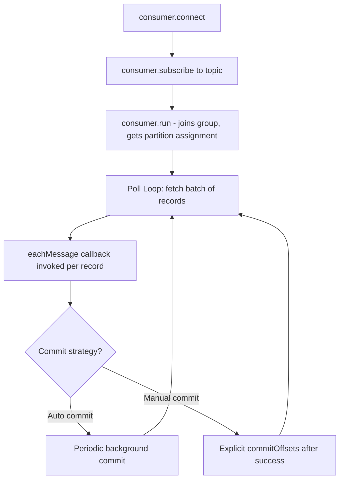
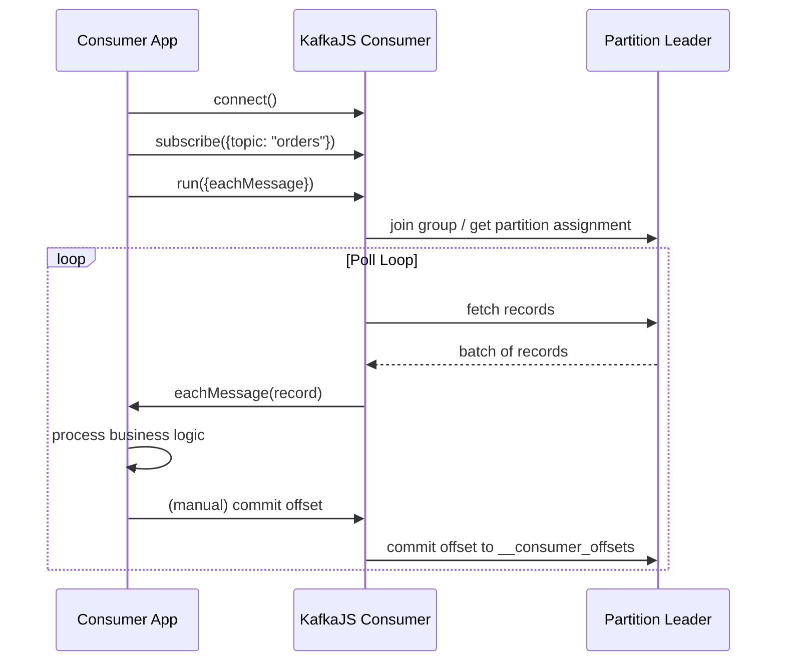
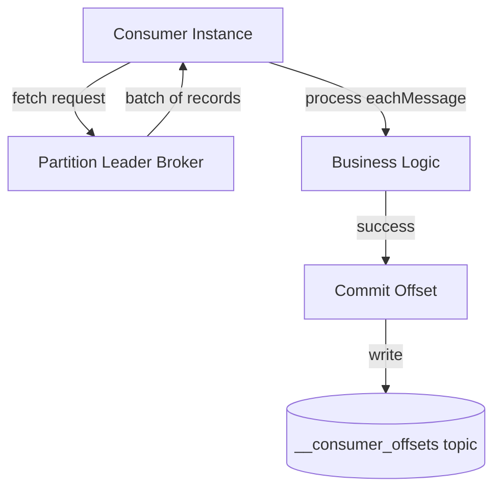
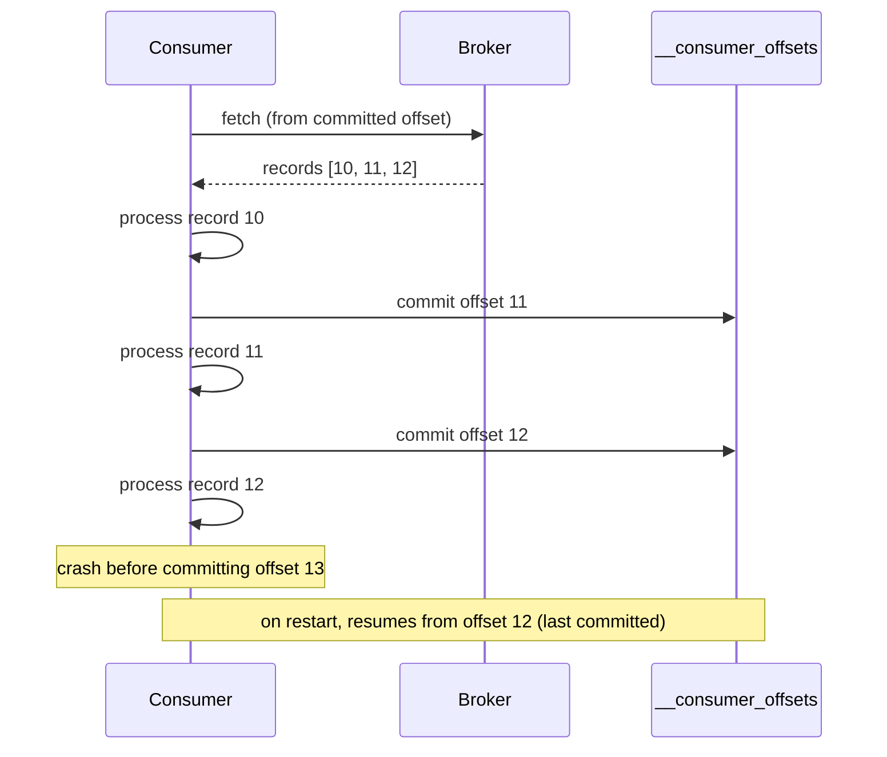

# Module 5 — Consumers

**Level:** ⭐⭐ Beginner → Intermediate
**Track:** Kafka Complete Masterclass for Node.js Backend Engineers
**Module:** 5 of 25

---

## 1. Introduction

Producers get data *into* Kafka. Consumers get data *out*. This sounds simple, but the consumer side is where most real-world Kafka bugs live: messages processed twice, messages skipped, consumers that silently stop making progress, and rebalances that cause brief but confusing outages.

This module goes deep into the **poll loop**, the **consumer lifecycle**, **offsets**, **manual vs. auto commit**, and **rebalancing** — the exact areas where "it works on my machine" consumer code breaks in production.

---

## 2. Learning Objectives

By the end of this module, you will be able to:

1. Explain the poll loop model and why Kafka consumers are "pull-based," not "push-based."
2. Explain the full consumer lifecycle from connect to graceful shutdown.
3. Explain what an offset is and the difference between committed and current position.
4. Compare auto-commit vs. manual commit and know when to use each.
5. Explain what a rebalance is, why it happens, and how to minimize its disruption.
6. Write production-ready KafkaJS consumer code with correct error handling and shutdown behavior.

---

## 3. Why This Concept Exists

A consumer needs answers to very practical questions:

- **How do I read data without the broker force-feeding me faster than I can process it?** → The **poll loop** (pull-based model).
- **If my app restarts, how do I know where I left off?** → **Offsets**, and whether they're committed.
- **If I have 5 instances of my service running, how do they divide up the work without duplicating effort or fighting over the same messages?** → **Consumer Groups** (Module 7) and **rebalancing**.
- **What if I crash halfway through processing a message — do I reprocess it, or skip it?** → The **commit strategy** you choose (auto vs. manual) directly controls this trade-off.

---

## 4. Problem Statement

Imagine the Inventory Service consuming from the `orders` topic:

1. If Kafka pushed messages to the consumer as fast as possible, a slow consumer would be overwhelmed — how does Kafka avoid this?
2. If the Inventory Service crashes mid-processing (after reducing stock, but before acknowledging the message), will it reprocess that message when it restarts? Should it?
3. If you deploy a new version of the Inventory Service and briefly run 2 versions simultaneously, will both instances process the same message, doubling stock reduction?
4. If a consumer hangs on a single "poison pill" message, does the whole consumer group grind to a halt?

Each of these questions maps directly to a specific concept in this module.

---

## 5. Real-World Analogy

### Analogy: Reading a Serialized Book at Your Own Pace

Imagine a serialized novel published chapter by chapter (records in a partition). You (the consumer) don't get chapters pushed onto your desk uncontrollably — instead, you walk to the mailbox and **pull** the next chapter whenever you're ready to read it (the poll loop). You keep a bookmark (the offset) at your current page. If you close the book and come back next week, you resume from your bookmark, not from the beginning.

If you have a reading group (a consumer group) with 3 members, the group leader assigns different volumes to different members so nobody re-reads the same pages — but if a member drops out, the group **reorganizes** who reads what (a rebalance).

---

## 6. Technical Definition

- **Poll Loop**: The core operating model of a Kafka consumer — it repeatedly calls `poll()` (abstracted by `consumer.run()` in KafkaJS) to fetch a batch of new records from its assigned partitions, rather than having records pushed to it.
- **Consumer Lifecycle**: connect → subscribe → join group / get partition assignment → poll loop begins → process records → commit offsets → (eventually) graceful disconnect.
- **Offset**: A sequential integer identifying a record's position within a partition. Two important offset concepts:
  - **Current position**: The next offset the consumer will read.
  - **Committed offset**: The last offset the consumer has confirmed ("committed") as successfully processed, stored in Kafka's internal `__consumer_offsets` topic.
- **Auto Commit**: KafkaJS (and Kafka clients generally) can automatically commit offsets periodically in the background, without your code explicitly doing so.
- **Manual Commit**: Your application explicitly decides when to commit an offset — typically only after successfully finishing processing.
- **Rebalancing**: The process by which a consumer group redistributes partition assignments among its members — triggered when a consumer joins, leaves, or crashes.

---

## 7. Internal Working

### The poll loop, conceptually

```
loop forever:
    records = broker.fetch(assigned partitions, from current offset)
    for record in records:
        process(record)
    if auto-commit enabled:
        (periodically, in background) commit current offsets
    else:
        application explicitly commits when ready
```

KafkaJS abstracts this loop for you via `consumer.run({ eachMessage })` or `consumer.run({ eachBatch })` — but understanding that this loop exists under the hood is essential for reasoning about performance, backpressure, and failure handling.

### Committed offset vs. current position

```
Partition 0:  [0] [1] [2] [3] [4] [5] [6] [7] [8]
                           ▲               ▲
                    committed offset   current position
                    (last confirmed)   (next to be read)

If the consumer crashes now and restarts, it resumes from the
COMMITTED offset (4), meaning records 4-7 may be reprocessed
if they were already read but not yet committed.
```

This gap between "read" and "committed" is the exact source of **at-least-once** delivery semantics, covered in depth in Module 10.

---

## 8. Architecture

```
                     Kafka Cluster
        ┌──────────────────────────────────┐
        │   Partition 0  │  Partition 1     │
        └──────────────────────────────────┘
                   │              │
          fetch    │              │  fetch
                   ▼              ▼
        ┌─────────────────────────────────┐
        │       Consumer Instance           │
        │  (single Node.js process)         │
        │                                    │
        │   Poll Loop:                       │
        │     1. fetch records                │
        │     2. process (eachMessage)        │
        │     3. commit offset (auto/manual)  │
        └─────────────────────────────────┘
```

---

## 9. Step-by-Step Flow

1. Consumer calls `consumer.connect()`.
2. Consumer calls `consumer.subscribe({ topic: "orders" })`.
3. Consumer calls `consumer.run({ eachMessage })`, joining its consumer group and receiving a partition assignment (Module 7 covers the group coordination protocol in depth).
4. The internal poll loop begins: KafkaJS fetches batches of records from the assigned partitions' leader brokers.
5. For each record, your `eachMessage` callback is invoked, where you implement business logic (e.g., reduce stock).
6. Once processing succeeds, the offset is committed — either automatically (periodically) or manually (explicitly, after your logic confirms success).
7. If the consumer crashes or is shut down, upon restart it resumes from the last **committed** offset for its assigned partitions.
8. If a new consumer instance joins the same group (e.g., during a scale-up), a **rebalance** occurs, and partitions are redistributed among all group members.

---

## 10. Detailed ASCII Diagrams

### 10.1 Push vs. Pull Model

```
PUSH MODEL (NOT how Kafka works)          PULL MODEL (how Kafka works)

Broker ──push──► Consumer                 Consumer ──poll──► Broker
(broker decides pace,                     (consumer decides pace,
 can overwhelm a slow consumer)            naturally handles backpressure)
                                           Broker ──returns batch──► Consumer
```

### 10.2 Auto-Commit Risk Window

```
Time:  0ms         1000ms (auto-commit fires)     1500ms
       │                    │                        │
       ▼                    ▼                        ▼
   read msg 5          commits offset 6         CRASH while
   (in memory,                                  processing msg 6
    not yet "done")

Result: offset 6 was already committed, but msg 6's business logic
never actually completed — this message may be silently SKIPPED
on restart, since the consumer resumes from offset 6, not 6 itself.
```

### 10.3 Manual Commit — Safer Ordering

```
read msg 6
   │
   ▼
process msg 6 (business logic completes successfully)
   │
   ▼
explicitly commit offset 7 (i.e., "next to read is 7")
   │
   ▼
CRASH here is safe — msg 6 was fully processed before commit
```

---

## 11. Mermaid Diagrams





---

## 12. Request Flow Diagram



---

## 13. Sequence Diagram



---

## 14. Kafka Internal Flow

```
1. Consumer sends a Fetch request to the leader broker for its assigned partitions
2. Broker returns available records starting from the consumer's current offset
3. Consumer processes records in order (eachMessage or eachBatch)
4. Consumer commits offsets back to the special internal topic __consumer_offsets
   (this is itself a Kafka topic! Offsets are stored using the same log mechanism
    as any other data)
5. On restart, consumer reads its last committed offset from __consumer_offsets
   and resumes fetching from there
```

---

## 15. Producer Perspective

Not directly relevant here, but worth noting: producers have no awareness of consumer offsets at all. The producer's job ends once the broker acknowledges the write — everything about *tracking progress through the log* is entirely the consumer's responsibility.

---

## 16. Consumer Perspective

This entire module is the consumer's perspective. The key mental model to internalize: **you are in control of your own pace and your own "done" definition.** Kafka doesn't decide when you're "finished" with a message — your commit call does.

---

## 17. Broker Perspective

From the broker's point of view, serving a consumer is simple:

- Respond to fetch requests with the next available records after the requested offset.
- Store committed offsets (submitted by consumers) in the internal `__consumer_offsets` topic, keyed by `(consumer group, topic, partition)`.
- The broker does **not** track "has this consumer successfully processed this message" — it only knows what offset the consumer told it to remember. This is a crucial distinction: **commit ≠ "definitely processed correctly,"** it just means "the consumer said so."

---

## 18. Node.js Integration

### Recommended consumer service structure

```
inventory-service/
├── src/
│   ├── config/
│   │   └── kafka.js
│   ├── consumers/
│   │   └── inventoryConsumer.js
│   └── server.js
├── package.json
```

---

## 19. KafkaJS Examples

### 19.1 Basic consumer with auto-commit (simplest, higher risk)

```javascript
// src/consumers/inventoryConsumer.js (auto-commit version)
import { kafka } from "../config/kafka.js";

const consumer = kafka.consumer({
  groupId: "inventory-service",
  // autoCommit defaults to true in KafkaJS
});

export async function startInventoryConsumer() {
  await consumer.connect();
  await consumer.subscribe({ topic: "orders", fromBeginning: false });

  await consumer.run({
    // Auto-commit fires periodically (every 5s by default), regardless
    // of whether eachMessage has actually finished for the latest record.
    eachMessage: async ({ topic, partition, message }) => {
      const event = JSON.parse(message.value.toString());
      console.log(`[inventory] processing order ${event.orderId}`);
      await reduceStock(event.items); // your business logic
    },
  });
}

async function reduceStock(items) {
  // ... actual DB update logic
}
```

### 19.2 Manual commit (safer, recommended for critical processing)

```javascript
// src/consumers/inventoryConsumer.js (manual commit version)
import { kafka } from "../config/kafka.js";

const consumer = kafka.consumer({
  groupId: "inventory-service",
});

export async function startInventoryConsumer() {
  await consumer.connect();
  await consumer.subscribe({ topic: "orders", fromBeginning: false });

  await consumer.run({
    autoCommit: false, // we control exactly when to commit
    eachMessage: async ({ topic, partition, message, heartbeat }) => {
      const event = JSON.parse(message.value.toString());

      try {
        await reduceStock(event.items);

        // Only commit AFTER business logic succeeds.
        // offset committed = message.offset + 1 (the NEXT offset to read)
        await consumer.commitOffsets([
          {
            topic,
            partition,
            offset: (Number(message.offset) + 1).toString(),
          },
        ]);
      } catch (err) {
        console.error(`[inventory] failed to process order, will retry:`, err);
        // Do NOT commit — this message will be reprocessed on restart
        // or the next poll cycle, depending on your retry strategy.
        throw err; // KafkaJS will stop processing this partition's batch on error
      }
    },
  });
}

async function reduceStock(items) {
  // ... actual DB update logic
}
```

### 19.3 Graceful shutdown

```javascript
// src/server.js
import { startInventoryConsumer } from "./consumers/inventoryConsumer.js";

async function main() {
  await startInventoryConsumer();
  console.log("[inventory-service] consumer running");
}

main().catch((err) => {
  console.error("[inventory-service] fatal error:", err);
  process.exit(1);
});

// Graceful shutdown ensures the consumer leaves the group cleanly,
// triggering an immediate, clean rebalance instead of waiting for
// a session timeout to detect the crash.
const errorTypes = ["unhandledRejection", "uncaughtException"];
const signalTraps = ["SIGTERM", "SIGINT", "SIGUSR2"];

errorTypes.forEach((type) => {
  process.on(type, async (e) => {
    console.error(`[inventory-service] ${type}:`, e);
    process.exit(1);
  });
});

signalTraps.forEach((type) => {
  process.once(type, async () => {
    console.log(`[inventory-service] received ${type}, shutting down...`);
    process.exit(0);
  });
});
```

### 19.4 `eachBatch` for higher-throughput, batch-aware processing

```javascript
// Useful when you want manual control over batching/committing at
// a batch level rather than per-message (higher throughput scenarios)
await consumer.run({
  eachBatch: async ({ batch, resolveOffset, heartbeat, commitOffsetsIfNecessary }) => {
    for (const message of batch.messages) {
      const event = JSON.parse(message.value.toString());
      await reduceStock(event.items);

      // Mark this offset as processed within the batch
      resolveOffset(message.offset);

      // Send periodic heartbeats to avoid the consumer being
      // kicked out of the group during long-running processing.
      await heartbeat();
    }

    // Commits all resolved offsets for this batch
    await commitOffsetsIfNecessary();
  },
});
```

---

## 20. CLI Commands

```bash
# List all consumer groups
kafka-consumer-groups.sh --bootstrap-server localhost:9092 --list

# Describe a consumer group: shows current offset, log-end offset, and LAG
kafka-consumer-groups.sh --bootstrap-server localhost:9092 \
  --describe --group inventory-service

# Reset a consumer group's offset to the earliest available (careful!)
kafka-consumer-groups.sh --bootstrap-server localhost:9092 \
  --group inventory-service --topic orders --reset-offsets --to-earliest --execute

# Reset to a specific offset
kafka-consumer-groups.sh --bootstrap-server localhost:9092 \
  --group inventory-service --topic orders:0 --reset-offsets --to-offset 100 --execute
```

---

## 21. Configuration Explanation

| Config | Meaning |
|---|---|
| `groupId` | Identifies which consumer group this consumer belongs to (Module 7) |
| `autoCommit` | Whether offsets are committed automatically on a timer (`true`) or manually by your code (`false`) |
| `autoCommitInterval` | How often (ms) auto-commit fires, if enabled |
| `sessionTimeout` | How long the group coordinator waits without a heartbeat before considering the consumer dead and triggering a rebalance |
| `heartbeatInterval` | How frequently the consumer sends heartbeats to the group coordinator to signal it's alive |
| `fromBeginning` | Whether a *brand new* consumer group (no committed offset yet) starts reading from the earliest or latest available record |
| `maxBytesPerPartition` / `maxWaitTimeInMs` | Control fetch request sizing and latency trade-offs |

---

## 22. Common Mistakes

1. **Relying on auto-commit for critical processing.** As shown in Section 10.2, this can silently skip messages that were "committed" but never actually finished processing.
2. **Not handling errors inside `eachMessage`.** An uncaught error can crash the consumer process, or (depending on config) get silently swallowed, both bad outcomes.
3. **Long-running processing without heartbeats.** If your `eachMessage` logic takes too long without KafkaJS getting a chance to send heartbeats, the group coordinator may consider the consumer dead and trigger an unnecessary rebalance.
4. **Confusing "committed" with "correctly processed."** Kafka only knows what offset you told it — it has no idea if your business logic actually succeeded, unless your code explicitly ties the two together (as in Section 19.2).
5. **Ignoring consumer lag.** A consumer that's falling further and further behind (lag increasing) is a silent, slow-building production incident if not monitored.

---

## 23. Edge Cases

- **What if the very first consumer in a new group starts, and there's no committed offset yet?** The `fromBeginning` setting decides: `true` reads from the earliest retained record, `false` starts from the latest (only new records going forward).
- **What if a "poison pill" message (one that always throws an error during processing) is at the front of the queue?** Without a dead-letter-queue strategy (Module 15), the consumer may get stuck retrying the same message forever, blocking all progress on that partition.
- **What if the consumer crashes exactly between processing and manually committing?** The message will be reprocessed after restart — this is expected and is the foundation of **at-least-once** delivery (Module 10).

---

## 24. Performance Considerations

- `eachBatch` generally offers better throughput than `eachMessage` for high-volume topics, since it reduces the per-message overhead of offset bookkeeping — but it requires more careful manual handling (heartbeats, offset resolution).
- Fetching larger batches (`maxBytesPerPartition`) can improve throughput but increases memory usage and the time between polls.

---

## 25. Scalability Discussion

- A single consumer instance can only process one partition's records at a time in strict order — to scale horizontally, you add more consumer instances to the same group, up to the number of partitions (fully explored in Module 6 and Module 7).
- Manual commit strategies must be designed carefully when scaling to multiple partitions per consumer instance, since each partition's offsets are tracked and committed independently.

---

## 26. Production Best Practices

- Default to **manual commit** for anything where correctness matters more than raw simplicity.
- Always wrap `eachMessage`/`eachBatch` logic in try/catch, with clear logging on failure.
- Monitor consumer lag continuously (Module 19) — it's often the earliest, clearest signal of a struggling consumer.
- Implement graceful shutdown (Section 19.3) so deployments trigger clean rebalances instead of relying on session timeouts.

---

## 27. Monitoring & Debugging

- `kafka-consumer-groups.sh --describe` shows **LAG** per partition — the gap between the latest available offset and the consumer's committed offset. This is your single most useful health metric.
- Watch for frequent, unexpected rebalances in logs — often a sign of session timeouts caused by slow processing or insufficient heartbeating.

---

## 28. Security Considerations

- Consumer group IDs and topic-level read ACLs should be scoped per service — e.g., Inventory Service's consumer credentials should only be authorized to **consume** from `orders`, not produce to it or read unrelated topics.

---

## 29. Interview Questions (Easy → Medium → Hard)

### Easy

1. What is the poll loop, and why is Kafka described as "pull-based"?
2. What is an offset?
3. What's the difference between auto-commit and manual commit?

### Medium

4. Why can auto-commit cause a message to be silently skipped after a crash?
5. What triggers a consumer rebalance?
6. What does "consumer lag" mean, and why does it matter?
7. What is the difference between the current position and the committed offset?

### Hard

8. Explain, step by step, a scenario where manual commit still results in a message being processed twice (not skipped) after a crash.
9. Why does KafkaJS require periodic heartbeats during long-running `eachMessage` processing, and what happens if they're missed?
10. Compare `eachMessage` and `eachBatch` in terms of throughput, complexity, and offset-commit granularity.
11. Explain why `__consumer_offsets` is itself a Kafka topic, and what that implies about how offset commits are stored and replicated.

---

## 30. Common Interview Traps

- **Trap:** "Kafka pushes messages to consumers like a webhook." → **Reality:** Kafka consumers *pull* records via a poll loop; nothing is pushed to them.
- **Trap:** "A committed offset guarantees the message was processed correctly." → **Reality:** A commit only reflects what the consumer told Kafka; it says nothing about whether business logic actually succeeded, unless your code enforces that link.
- **Trap:** "Auto-commit is always unsafe and should never be used." → **Reality:** Auto-commit is fine for use cases tolerant of occasional message loss/skips (e.g., best-effort metrics); it's specifically risky for correctness-critical processing.

---

## 31. Summary

- Kafka consumers pull data via a poll loop, giving them natural control over their own processing pace.
- Offsets track a consumer's position in a partition; the gap between "read" and "committed" defines your delivery guarantees.
- Manual commit, tied explicitly to successful business logic completion, is the safer default for critical processing.
- Rebalances redistribute partitions among consumer group members when membership changes — graceful shutdown minimizes their disruption.

---

## 32. Cheat Sheet

```
CONSUMERS — ONE PAGE

Poll loop:        consumer pulls records; NOT pushed by broker
Offset:            position within a partition
Committed offset:  last offset consumer confirmed as processed
Current position:  next offset to be read

Auto-commit:  simple, periodic, RISK of skipping unprocessed messages
Manual commit: safer — commit only AFTER business logic succeeds

Rebalance: triggered when a consumer joins/leaves/crashes in a group
Graceful shutdown: leave group cleanly to avoid rebalance delay

eachMessage: simple, per-record processing
eachBatch:   higher throughput, manual offset/heartbeat control

Golden rule: commit offsets only after work is DONE, not before
```

---

## 33. Hands-on Exercises

1. Run the auto-commit consumer example, kill the process mid-processing (simulate with a `setTimeout` delay + manual `process.exit()`), and observe whether the next restart reprocesses or skips the in-flight message.
2. Convert the same consumer to manual commit and repeat the experiment — compare the behavior.
3. Use `kafka-consumer-groups.sh --describe` to observe LAG while your consumer is running and while it's stopped.
4. Deliberately cause a rebalance by starting a second consumer instance in the same group, and observe the partition reassignment in the logs.

---

## 34. Mini Project

**Build:** A consumer service with manual commit, structured error logging, and graceful shutdown (SIGTERM/SIGINT handling) for the Inventory Service from Module 1's mini project — ensuring restarts never silently skip an unprocessed order event.

---

## 35. Advanced Project

**Build:** A consumer using `eachBatch` that processes messages in parallel (with a concurrency limit) within each batch, manually resolving offsets and sending heartbeats appropriately, then benchmark its throughput against the simple `eachMessage` version from the mini project.

---

## 36. Homework

1. Research what happens internally when `heartbeat()` is not called frequently enough during `eachBatch` processing — what error does KafkaJS raise, and how would you diagnose it in logs?
2. Explain, in your own words, why Kafka chose to store consumer offsets in a Kafka topic (`__consumer_offsets`) rather than an external database.
3. Write a short comparison of "at-least-once" vs. "at-most-once" consumer behavior, based on auto-commit timing relative to processing completion (preview for Module 10).

---

## 37. Additional Reading

- Apache Kafka documentation — "Consumer Configs" and "Consumer Group Protocol"
- KafkaJS official documentation — Consumer, `eachBatch` vs `eachMessage`
- Confluent blog: "Offset management in Apache Kafka"

---

## Key Takeaways

- Kafka consumers pull records via a poll loop — this is fundamentally different from push-based messaging systems.
- The gap between reading and committing an offset determines your delivery guarantees.
- Manual commit tied to successful processing is the production-grade default for critical systems.
- Rebalances are a normal part of consumer group life — graceful shutdown minimizes their cost.

---

## Revision Notes

- Be able to draw the "committed offset vs. current position" diagram from memory.
- Be able to explain why auto-commit can skip messages, with a concrete timeline.
- Know the difference between `eachMessage` and `eachBatch` cold.

---

## One-Page Cheat Sheet

*(See Section 32 above.)*

---

## 20 Practice Questions

1. What is the poll loop?
2. Why is Kafka described as pull-based rather than push-based?
3. What is an offset?
4. What is the difference between current position and committed offset?
5. What does auto-commit do?
6. What risk does auto-commit introduce?
7. What is manual commit?
8. When should you prefer manual commit over auto-commit?
9. What triggers a consumer rebalance?
10. What is a "poison pill" message?
11. What does `fromBeginning: true` do for a brand-new consumer group?
12. What is consumer lag?
13. Why does `eachBatch` require manual heartbeats?
14. What's the difference between `eachMessage` and `eachBatch`?
15. Where does Kafka store committed consumer offsets?
16. What happens if a consumer crashes before committing an offset it already processed?
17. Why is graceful shutdown important for consumers?
18. What CLI command shows consumer group lag?
19. What does `sessionTimeout` control?
20. What does `heartbeatInterval` control?

---

## 10 Scenario-Based Questions

1. Your consumer group's lag has been steadily increasing over the past hour. Walk through your diagnostic steps.
2. A consumer using auto-commit crashes and restarts. Your team notices order #4521 was never processed by Inventory Service, even though it appears in the `orders` topic. Explain the likely cause.
3. You deploy a new version of your consumer service, and for about 10 seconds, no messages seem to be processed by either the old or new instance. What's likely happening?
4. Your `eachMessage` callback occasionally takes 45 seconds to complete due to a slow downstream API call, and you've noticed unexpected rebalances. Diagnose and propose a fix.
5. A teammate wants to reset a consumer group's offset back to the beginning of the topic to "reprocess everything." What command would you use, and what risks would you flag?
6. Your monitoring shows a consumer group with 0 lag, but business stakeholders report that some orders were never reflected in inventory counts. What are 2 possible explanations, given 0 lag?
7. You have 3 partitions and 5 consumer instances in the same group. What happens to the 2 "extra" consumers?
8. Explain to a junior engineer why committing an offset does not guarantee the corresponding message was correctly processed.
9. Your consumer group needs to temporarily pause processing during a maintenance window without losing its place. How would you achieve this safely?
10. A consumer instance is killed abruptly (`kill -9`, no graceful shutdown) during a live incident. Explain what happens to its partition assignments and how long it might take for the group to recover.

---

## 5 Coding Assignments

1. Write a consumer with manual commit that also implements a simple retry-with-backoff (3 attempts) before giving up and logging the message as failed (a precursor to Module 15's Dead Letter Queue pattern).
2. Write a script using `admin.fetchOffsets()` (or the CLI equivalent wrapped in Node) that prints the current lag for a given consumer group and topic.
3. Implement graceful shutdown for a consumer that ensures in-flight message processing completes before the process exits.
4. Build an `eachBatch`-based consumer that processes messages with a concurrency limit of 5 at a time (using a simple semaphore or `p-limit`), while correctly resolving offsets and sending heartbeats.
5. Write a small monitoring script that periodically queries consumer group lag via the Admin API and logs a warning if lag exceeds a configurable threshold.

---

## Suggested Next Module

**Module 6 — Topics & Partitions**
Now that you understand both producers and consumers individually, it's time to dive deeper into partitions themselves: why they exist, how partition keys determine ordering, and how to choose the right partitioning strategy for your data.
