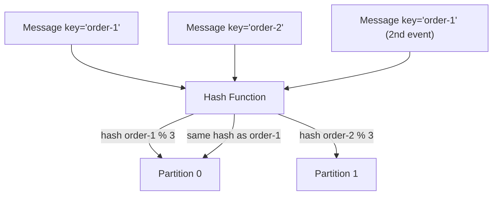
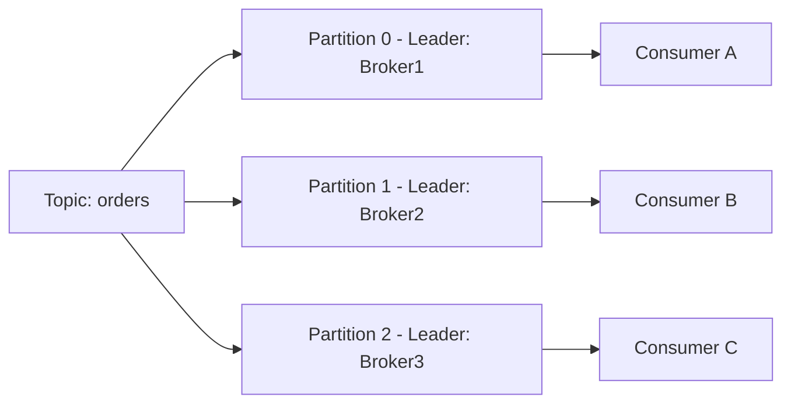
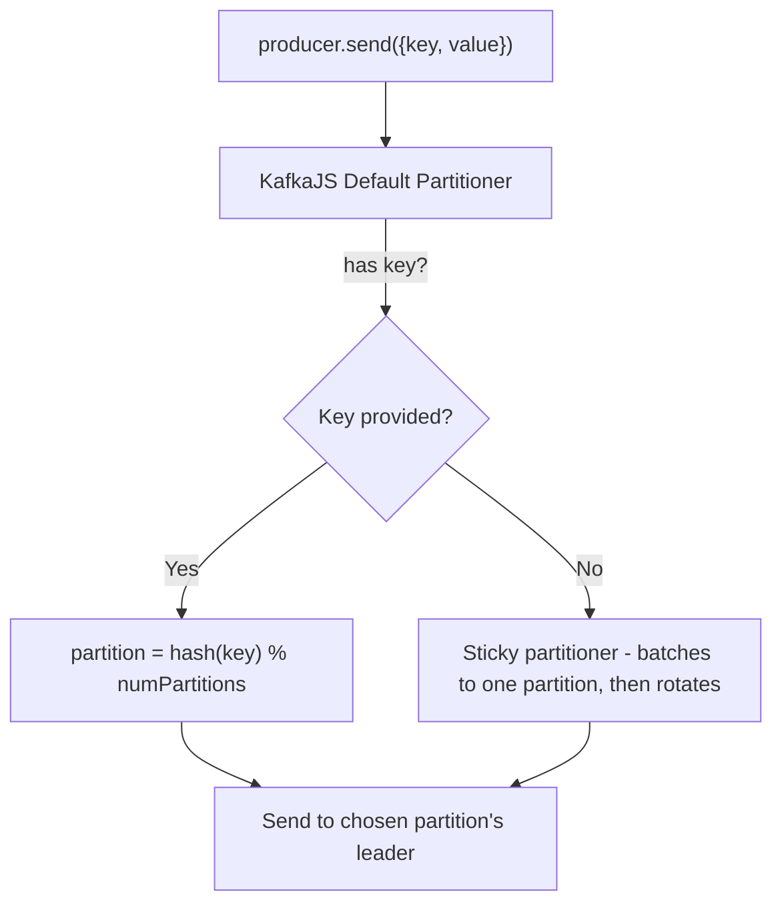
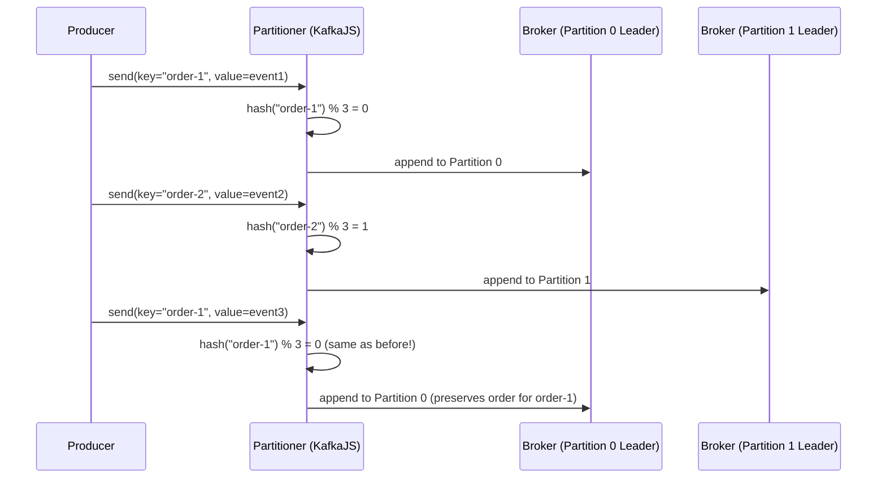

# Module 6 — Topics & Partitions

**Level:** ⭐⭐ Beginner → Intermediate
**Track:** Kafka Complete Masterclass for Node.js Backend Engineers
**Module:** 6 of 25

---

## 1. Introduction

You've now used topics and partitions casually in every previous module. This module makes that knowledge rigorous: why partitions exist at all, how Kafka decides which partition a message goes to, what ordering guarantees you actually get, and how to choose a partitioning strategy that won't come back to bite you in production.

Partitioning decisions made on Day 1 of a system are some of the hardest to change later (repartitioning a live topic can break ordering assumptions across your whole system) — so this module deserves careful attention.

---

## 2. Learning Objectives

By the end of this module, you will be able to:

1. Explain why partitions exist and what specific problem they solve.
2. Explain how Kafka decides which partition a message is routed to (with and without a key).
3. Explain Kafka's ordering guarantee precisely: per-partition, not per-topic.
4. Design a partition key strategy for a real use case, and justify the trade-offs.
5. Explain the relationship between partition count and consumer parallelism.
6. Answer interview questions about partitioning strategy and its consequences.

---

## 3. Why This Concept Exists

If a topic were a single, giant, un-partitioned log, it could only be handled by a single broker (for writes) and read by a single consumer at a time (to preserve order) — a severe bottleneck. Partitioning exists to split a topic's data into independent, parallel sub-logs, each of which can be:

- Hosted on a different broker (parallelizing storage and write throughput).
- Read by a different consumer within a group (parallelizing consumption).

The cost of this parallelism is that **Kafka can only guarantee ordering within a single partition**, not across an entire topic. Understanding this trade-off — and how to pick a partition key that aligns with the ordering your business actually needs — is the core skill this module builds.

---

## 4. Problem Statement

Consider the `orders` topic, and think through 3 different partitioning choices:

1. **No key (round-robin/sticky partitioning):** Every message goes to a different partition in rotation. Maximizes load spreading, but two events for the *same order* (`OrderPlaced`, then later `OrderCancelled`) could land on different partitions and be processed **out of order** by different consumers.
2. **Key = `order.id`:** All events for the same order always land on the same partition, preserving order **for that order**, but different orders can still be processed in any relative order to each other (usually fine).
3. **Key = `customer.id`:** All events for the same customer land on the same partition — useful if you need strict per-customer ordering (e.g., loyalty points), but risks a "hot partition" if one customer generates far more events than others.

Choosing the wrong strategy either breaks correctness (out-of-order processing where it matters) or creates a scalability bottleneck (a hot partition).

---

## 5. Real-World Analogy

### Analogy: Bank Teller Lines

Imagine a bank with a single teller window (one partition) — every customer, regardless of what they need, waits in one line. This is fair and simple, but slow once the bank gets busy.

Now imagine 5 teller windows (5 partitions). To keep things orderly, the bank assigns customers to windows **based on their account number** (a partition key) — customer 4521 always goes to Window 2, no matter when they show up. This guarantees: transactions for account 4521 are always processed **in the order they arrive**, because they always go through the same teller. But transactions across *different* accounts have no guaranteed relative order — and if one customer (say, a business with thousands of daily transactions) always uses Window 2, that window becomes a bottleneck compared to the others.

---

## 6. Technical Definition

- **Topic**: A named, logical stream of records. Purely a label — has no ordering or storage guarantees on its own.
- **Partition**: An ordered, immutable, append-only sub-log of a topic. Records within a single partition have a strict, guaranteed order (by offset). A topic is made of one or more partitions.
- **Partition Key**: An optional value (`message.key`) used to deterministically decide which partition a message is routed to, via hashing.
- **Partitioning Strategy**: The algorithm used to map a message (with or without a key) to a specific partition number:
  - **Keyed**: `partition = hash(key) % numPartitions` (conceptually — KafkaJS uses a specific default partitioner, murmur2-based, matching Kafka's Java client behavior).
  - **Unkeyed (no key provided)**: Uses a **sticky partitioner** by default in modern Kafka clients — batches several messages to one partition before rotating to the next, improving batching efficiency over strict per-message round robin.
- **Hot Partition**: A partition receiving disproportionately more traffic than others, becoming a throughput bottleneck.

---

## 7. Internal Working

### How the default partitioner decides, with a key

```
message.key = "order-4521"
      │
      ▼
hash("order-4521") using murmur2  →  some large integer
      │
      ▼
partition = hash_value % numPartitions
      │
      ▼
Always the SAME partition for the SAME key, as long as
numPartitions doesn't change.
```

**Critical gotcha:** if you ever **increase** the partition count of an existing topic, the modulo calculation changes, and the same key can now map to a *different* partition than it did before — silently breaking your ordering assumption for pre-existing keys. This is a major reason partition count is usually decided carefully upfront rather than casually increased later.

### How ordering actually works

```
Partition 0:  [OrderPlaced #1] [OrderShipped #1] [OrderDelivered #1]
                  (all for order #1, strictly in this order, because
                   the key "order-1" always hashes to Partition 0)

Partition 1:  [OrderPlaced #2] [OrderPlaced #3] [OrderCancelled #3]
                  (order #2 and #3's events, in the order they were
                   produced, but order #2 and #3 have NO relative
                   ordering guarantee to each other, or to Partition 0)
```

---

## 8. Architecture

```
Topic: orders (3 partitions)

┌─────────────────────────────────────────────────────────┐
│  Partition 0            Partition 1           Partition 2 │
│  [key: order-1]         [key: order-2]        [key: order-3]│
│  msg0, msg1, msg2       msg0, msg1            msg0, msg1, msg2│
└─────────────────────────────────────────────────────────┘
        │                      │                      │
        ▼                      ▼                      ▼
  Consumer A               Consumer B             Consumer C
  (same group, each assigned a different partition — Module 7)
```

---

## 9. Step-by-Step Flow

1. A producer sends a message with `key: "order-4521"` to the `orders` topic.
2. KafkaJS hashes the key to deterministically pick a partition (say, partition 1).
3. The message is appended to partition 1's log on its leader broker.
4. Any future message with the exact same key (`"order-4521"`) will also hash to partition 1, preserving relative order for that order.
5. A consumer group with 3 consumers, one per partition, each independently processes their assigned partition's records in strict order.
6. Two messages with different keys (e.g., `"order-4521"` and `"order-9981"`) might land on different partitions and be processed **concurrently**, with no ordering relationship to each other — which is fine, because they represent unrelated business entities.

---

## 10. Detailed ASCII Diagrams

### 10.1 Keyed vs Unkeyed Partitioning

```
KEYED (key = order.id)                    UNKEYED (sticky/round-robin)

msg(key="order-1") → hash → Partition 0    msg1 → Partition 0
msg(key="order-2") → hash → Partition 1    msg2 → Partition 0  (batched together)
msg(key="order-1") → hash → Partition 0    msg3 → Partition 1  (rotates after batch)
   (same key = same partition,             msg4 → Partition 1
    guaranteed order for that key)            (no ordering guarantee between
                                                 any two messages)
```

### 10.2 Hot Partition Problem

```
Partition 0 (key = "customer-VIP-1")
   │
   ▼
[huge volume — this one customer generates 80% of all traffic]
   → this partition/broker becomes a bottleneck

Partition 1 (key = "customer-2")      Partition 2 (key = "customer-3")
   │                                      │
   ▼                                      ▼
[normal volume]                       [normal volume]
```

### 10.3 Repartitioning Danger

```
Before: numPartitions = 3
  key "order-500" → hash % 3 = Partition 1

After increasing to numPartitions = 6
  key "order-500" → hash % 6 = Partition 4  (DIFFERENT partition!)

Any consumer logic relying on "all of order-500's events are
always on the same partition" silently breaks after this change.
```

---

## 11. Mermaid Diagrams





---

## 12. Request Flow Diagram



---

## 13. Sequence Diagram



---

## 14. Kafka Internal Flow

```
1. Producer prepares a record with an optional key
2. If a key is present, the configured partitioner computes:
      partition = hash(key) % numPartitions
3. If no key is present, the sticky partitioner assigns a batch
   of messages to one partition, then rotates for the next batch
   (improves batching efficiency vs. naive round-robin)
4. Record is added to that partition's producer-side batch buffer
5. Batch is sent to that partition's leader broker
6. Broker appends to the partition's log, assigning the next offset
```

---

## 15. Producer Perspective

The producer is the only place where the partitioning decision is made. Once a message is sent to a partition, it's fixed — there's no "repartitioning" a message after the fact. This means **choosing the right key is a producer-side design decision with system-wide consequences** — get it right at design time.

```javascript
// The key decides EVERYTHING about ordering guarantees downstream.
await producer.send({
  topic: "orders",
  messages: [
    { key: String(order.id), value: JSON.stringify(event) }, // ordering per order.id
  ],
});
```

---

## 16. Consumer Perspective

A consumer within a group is assigned specific partitions (Module 7 covers exactly how). It processes records from its assigned partition(s) strictly in offset order — but has **zero visibility or guarantee** about the relative timing of records in other partitions, even within the same topic.

If your business logic *requires* seeing events across different keys in a specific global order, partitioning (by design) cannot provide that — you'd need a single-partition topic (sacrificing all parallelism) or an entirely different architectural pattern.

---

## 17. Broker Perspective

Each broker hosts some subset of a topic's partitions (as leader or follower). The broker has no concept of "keys" at read time — it simply serves whatever is in a given partition's log, in offset order. The **hashing decision already happened on the producer side**; the broker just stores and serves bytes.

---

## 18. Node.js Integration

KafkaJS exposes hooks to customize partitioning behavior when the defaults don't fit your use case (rare, but useful to know exists).

```javascript
// src/config/kafka.js
import { Kafka, Partitioners } from "kafkajs";

export const kafka = new Kafka({
  clientId: "order-service",
  brokers: ["localhost:9092"],
});

// Using the modern default partitioner explicitly (recommended since
// KafkaJS changed its default partitioner in a breaking way — always
// pin this explicitly to avoid surprises across version upgrades).
export const producer = kafka.producer({
  createPartitioner: Partitioners.DefaultPartitioner,
});
```

---

## 19. KafkaJS Examples

### 19.1 Choosing a partition key deliberately

```javascript
// src/producers/orderProducer.js
import { producer } from "../config/kafka.js";

export async function publishOrderEvent(order, eventType) {
  await producer.send({
    topic: "orders",
    messages: [
      {
        // Using order.id ensures ALL lifecycle events for this specific
        // order (placed, shipped, delivered, cancelled) are strictly
        // ordered relative to each other.
        key: String(order.id),
        value: JSON.stringify({
          eventType,
          orderId: order.id,
          timestamp: new Date().toISOString(),
        }),
      },
    ],
  });
}
```

### 19.2 Explicit partition assignment (rare, use with caution)

```javascript
// You CAN bypass the partitioner entirely and choose a partition number
// directly — useful for advanced custom routing logic, but risky if
// misused, since you're now responsible for load balancing yourself.
await producer.send({
  topic: "orders",
  messages: [
    {
      partition: 0, // explicit — overrides key-based hashing entirely
      value: JSON.stringify({ eventType: "SystemMaintenance" }),
    },
  ],
});
```

### 19.3 Inspecting partition assignment for a topic

```javascript
// src/inspectPartitions.js
import { Kafka } from "kafkajs";

const kafka = new Kafka({ clientId: "inspector", brokers: ["localhost:9092"] });

async function inspectPartitions() {
  const admin = kafka.admin();
  await admin.connect();

  const metadata = await admin.fetchTopicMetadata({ topics: ["orders"] });
  metadata.topics[0].partitions.forEach((p) => {
    console.log(`Partition ${p.partitionId}: leader broker ${p.leader}`);
  });

  await admin.disconnect();
}

inspectPartitions().catch(console.error);
```

### 19.4 Increasing partition count (and understanding the consequence)

```javascript
// src/increasePartitions.js
import { Kafka } from "kafkajs";

const kafka = new Kafka({ clientId: "topic-admin", brokers: ["localhost:9092"] });

async function increasePartitions() {
  const admin = kafka.admin();
  await admin.connect();

  // WARNING: This is a one-way operation. Partition count can only
  // increase, never decrease, and existing keys may now hash to
  // DIFFERENT partitions than before, breaking per-key ordering
  // continuity for any key whose new hash % newCount != old hash % oldCount.
  await admin.createPartitions({
    topicPartitions: [{ topic: "orders", count: 6 }],
  });

  console.log("Partition count increased to 6 — review key-to-partition assumptions!");
  await admin.disconnect();
}

increasePartitions().catch(console.error);
```

---

## 20. CLI Commands

```bash
# Describe partition count and leader assignment
kafka-topics.sh --bootstrap-server localhost:9092 --describe --topic orders

# Increase partition count (irreversible, use with caution)
kafka-topics.sh --bootstrap-server localhost:9092 \
  --alter --topic orders --partitions 6

# Produce with an explicit key using the console producer
kafka-console-producer.sh --bootstrap-server localhost:9092 \
  --topic orders --property "parse.key=true" --property "key.separator=:"
# Then type: order-4521:{"eventType":"OrderPlaced"}
```

---

## 21. Configuration Explanation

| Config | Meaning |
|---|---|
| `numPartitions` (topic creation) | Total number of partitions — sets the ceiling on consumer parallelism within a group |
| `message.key` | Determines routing via hashing; absence triggers sticky/round-robin partitioning |
| `createPartitioner` (KafkaJS producer config) | Allows overriding the default partitioning algorithm |
| Explicit `partition` field (per message) | Bypasses hashing entirely — direct partition targeting |

---

## 22. Common Mistakes

1. **Choosing no key when ordering actually matters.** Leads to silently out-of-order processing for related events.
2. **Choosing an overly broad key** (e.g., `region` instead of `order.id`) that creates hot partitions because too much traffic funnels through too few keys.
3. **Increasing partition count without auditing key-based ordering assumptions.** As shown in Section 10.3, this can silently break ordering for existing keys.
4. **Assuming more partitions is always better.** More partitions means more open file handles, more replication overhead, and longer leader-election times during failover (Module 12 covers this trade-off in depth).
5. **Manually assigning partition numbers "for simplicity"** without a real load-balancing strategy, effectively reinventing (poorly) what the default partitioner already does well.

---

## 23. Edge Cases

- **What if two different keys happen to hash to the same partition?** This is expected and fine — Kafka doesn't guarantee unique keys map to unique partitions, only that a *given* key is always consistent. Multiple keys sharing a partition still each retain their own internal relative order.
- **What if you need strict global ordering across an entire topic?** The only way to guarantee this is a single-partition topic — which caps your throughput and consumer parallelism to 1. This is a legitimate, if rare, design choice for low-volume, strictly-ordered use cases.
- **What if partition count is much higher than your consumer group's instance count?** Some consumers will be assigned multiple partitions (Module 7) — this is normal and expected.

---

## 24. Performance Considerations

- More partitions generally allow more throughput (more parallel writers/readers) but come with overhead: more replication traffic, more metadata for the controller to track, and longer time-to-recovery during a broker failure (each partition needs its own leader election).
- A reasonable starting point for many production topics is somewhere in the range of the expected maximum consumer group size, with some headroom for future scaling — exact numbers depend heavily on message volume and size (Module 12, Module 24 go deeper).

---

## 25. Scalability Discussion

- Partition count is the **hard ceiling** on how many consumer instances within a single group can do useful work in parallel — this is one of the most important scalability facts in all of Kafka.
- If you expect to scale a consumer group from 3 to 20 instances over time, you need at least 20 partitions from the start (or plan carefully for a partition increase and its ordering consequences).

---

## 26. Production Best Practices

- Decide partition count deliberately upfront, based on expected peak consumer parallelism and throughput needs — treat it as a much more permanent decision than it technically is.
- Choose partition keys based on the entity whose events must stay strictly ordered relative to each other (commonly an ID like `orderId`, `userId`, or `accountId`).
- Avoid using low-cardinality keys (e.g., a boolean flag, or a small fixed set of categories) as partition keys — this creates hot partitions.
- Document your partitioning strategy explicitly (Module 24) so future engineers don't accidentally break assumptions when adding new event types.

---

## 27. Monitoring & Debugging

- Use `kafka-topics.sh --describe` to check for partition imbalance (are some partitions accumulating much more data than others?).
- Track per-partition throughput/byte-rate metrics to detect hot partitions early, before they become a bottleneck.

---

## 28. Security Considerations

- Partition-level security is generally not a distinct concern — ACLs (Module 20) apply at the topic level, not per-partition.

---

## 29. Interview Questions (Easy → Medium → Hard)

### Easy

1. What is a partition?
2. What is a partition key?
3. Does Kafka guarantee ordering across an entire topic?

### Medium

4. How does Kafka decide which partition a keyed message goes to?
5. What happens if you send a message with no key?
6. Why might increasing a topic's partition count break existing ordering assumptions?
7. What is a "hot partition," and what usually causes one?

### Hard

8. Design a partitioning strategy for a ride-hailing app's `ride-events` topic, where you need strict ordering per ride, but also need to avoid hot partitions from very active drivers.
9. Explain precisely why partition count acts as a hard ceiling on consumer group parallelism.
10. A team wants to increase partition count on a live production topic without breaking downstream consumers' ordering assumptions. What would you advise, and what are the real risks?
11. Compare the trade-offs of using `orderId` vs. `customerId` as a partition key for an e-commerce order-events topic.

---

## 30. Common Interview Traps

- **Trap:** "Kafka guarantees message ordering." → **Reality:** Only within a single partition — a hugely important qualifier that trips up almost every beginner.
- **Trap:** "More partitions is always better for performance." → **Reality:** More partitions increases parallelism potential but also adds real overhead and slower failover; it's a trade-off, not a free win.
- **Trap:** "Changing partition count is a safe, routine operation." → **Reality:** It can silently change which partition existing keys map to, breaking ordering assumptions for those keys going forward.

---

## 31. Summary

- Partitions are the actual unit of parallelism and storage within a topic; a topic is just a logical grouping.
- Kafka guarantees ordering only within a single partition, not across a topic.
- Partition keys determine routing via hashing — same key always maps to the same partition (as long as partition count doesn't change).
- Partition count is a hard ceiling on consumer group parallelism, and increasing it later can silently break ordering guarantees for existing keys.
- Choosing the right partition key is a critical, largely irreversible design decision.

---

## 32. Cheat Sheet

```
TOPICS & PARTITIONS — ONE PAGE

Topic      = logical name, no ordering guarantee on its own
Partition  = actual ordered, append-only sub-log — THE unit of parallelism

Ordering guarantee: PER PARTITION ONLY, never across a whole topic

Partitioning:
  With key:    partition = hash(key) % numPartitions (deterministic)
  Without key: sticky partitioner (batches per partition, then rotates)

Partition count = hard ceiling on consumer group parallelism
Increasing partition count = CAN break ordering for existing keys

Golden rule: key by the entity that needs relative ordering
             (e.g., orderId), not by a low-cardinality field
             (e.g., region, boolean flags) — avoid hot partitions
```

---

## 33. Hands-on Exercises

1. Create a topic with 3 partitions, produce 10 messages with the same key, and verify (via console consumer with `--property print.partition=true`) they all land on the same partition.
2. Produce 10 messages with no key and observe the sticky partitioning behavior across partitions.
3. Increase the topic's partition count to 6, and produce a message with a key you used earlier — check if it now lands on a different partition than before.
4. Design (on paper) a partitioning strategy for a `chat-messages` topic in a messaging app, considering both per-conversation ordering and avoiding hot partitions for very active group chats.

---

## 34. Mini Project

**Build:** A Node.js script that produces 100 `OrderPlaced`/`OrderShipped`/`OrderCancelled` events for 10 different fake order IDs (keyed by `orderId`), then a consumer that prints each event grouped by partition, visually demonstrating that each order's events stay in-order within their assigned partition.

---

## 35. Advanced Project

**Build:** A partition-distribution analyzer: a script that produces a large volume (10,000+) of keyed messages using a realistic key distribution (e.g., simulate a small number of "power user" keys generating disproportionate traffic), then reports per-partition message counts to visually demonstrate the hot-partition problem — followed by a redesign using a better key strategy (e.g., composite key or salting) to even out the distribution.

---

## 36. Homework

1. Research and explain, in your own words, what "key salting" means as a technique to avoid hot partitions while still preserving useful (if slightly weaker) ordering guarantees.
2. Compare the partitioning strategies of 2 real-world systems you can find engineering blog posts about (e.g., Uber, LinkedIn) and summarize what entity they chose as a partition key and why.
3. Write a short design doc (half a page) proposing a partitioning strategy for a hypothetical `payment-events` topic for a fintech app, justifying your key choice.

---

## 37. Additional Reading

- Apache Kafka documentation — "Partitions" section under Design
- KafkaJS documentation — Partitioners and custom partitioning
- Confluent blog: "How to choose the number of topics/partitions in a Kafka cluster"

---

## Key Takeaways

- Partitions, not topics, are Kafka's real unit of parallelism, storage, and ordering.
- Ordering is guaranteed strictly within a partition — never across an entire topic.
- Partition keys deterministically route messages via hashing; consistent keys preserve relative order for that key.
- Partition count sets a hard ceiling on consumer group parallelism and should be chosen deliberately upfront.
- Poor key choice leads to either broken ordering guarantees or hot-partition bottlenecks.

---

## Revision Notes

- Memorize: ordering is per-partition, not per-topic — this single fact resolves most partitioning confusion.
- Be able to explain why increasing partition count can silently break existing ordering assumptions.
- Practice designing a partition key for at least 3 different hypothetical systems until it feels natural.

---

## One-Page Cheat Sheet

*(See Section 32 above.)*

---

## 20 Practice Questions

1. What is a partition?
2. What is a partition key?
3. Is ordering guaranteed across an entire topic?
4. Is ordering guaranteed within a single partition?
5. What determines which partition a keyed message goes to?
6. What happens to messages with no key?
7. What is a hot partition?
8. What commonly causes a hot partition?
9. Why is partition count a ceiling on consumer parallelism?
10. Can you decrease a topic's partition count?
11. What happens to key-to-partition mapping when you increase partition count?
12. What's a good partition key for an `orders` topic?
13. What's a bad partition key choice, and why?
14. What does the "sticky partitioner" do differently from naive round-robin?
15. Can you manually specify a partition number when producing a message?
16. What tool would you use to check partition-level message distribution?
17. Why should partition count be chosen carefully upfront?
18. What's the trade-off of having too many partitions?
19. What's the trade-off of having too few partitions?
20. Does the broker decide partitioning, or does the producer?

---

## 10 Scenario-Based Questions

1. You're designing a `payment-events` topic and need strict ordering per transaction. What would you use as the partition key, and why?
2. Your `orders` topic has a single VIP customer generating 60% of all traffic, and you notice one partition is consistently far busier than the others. Diagnose and propose a fix.
3. A teammate increases partition count from 6 to 12 on a live topic without telling anyone. Two weeks later, a bug report comes in about orders being processed out of sequence. Explain the likely connection.
4. You need consumer group parallelism of up to 50 instances during peak load, but your topic currently has 10 partitions. What's your plan?
5. Your `chat-messages` topic uses `conversationId` as the key, but one extremely popular public group chat is overwhelming a single partition. What are 2 possible mitigation strategies?
6. Explain to a junior engineer why "no key" doesn't mean "no partitioning" — what actually happens to unkeyed messages?
7. You need global, strict ordering across ALL events in a `financial-audit-log` topic, regardless of entity. What partitioning choice would satisfy this, and what do you give up?
8. Your team is debating between keying by `userId` vs `sessionId` for a `user-activity` topic. What ordering and hot-partition trade-offs would you raise?
9. A consumer group has 8 instances but the topic only has 5 partitions. What happens to the 3 extra consumer instances?
10. You're asked to justify, in a design review, why you chose 12 partitions instead of 3 or 100 for a new topic. What factors would you cite?

---

## 5 Coding Assignments

1. Write a script that produces 50 messages across 5 different keys and prints, for each message, which partition it landed on — verify consistency per key.
2. Write a "hot partition detector" script that consumes an entire topic and prints a histogram of message counts per partition.
3. Implement a simple "key salting" wrapper function that appends a random suffix (e.g., `orderId-{0-9}`) to spread a hot key across multiple partitions, and demonstrate the more even distribution it produces (noting the ordering trade-off this introduces).
4. Write a script using the Admin API to safely increase a topic's partition count only after printing a warning listing all currently-used partition keys and their old partition assignments, for manual review.
5. Build a small Express endpoint `/debug/partition-for-key?key=X` that returns which partition a given key would currently hash to, using the same partitioner logic as your producer, to help debug ordering issues in production.

---

## Suggested Next Module

**Module 7 — Consumer Groups**
With a solid understanding of how data is split across partitions, the next step is understanding exactly how multiple consumer instances coordinate to share that work: scaling, load balancing, rebalancing, and the group coordinator protocol.
