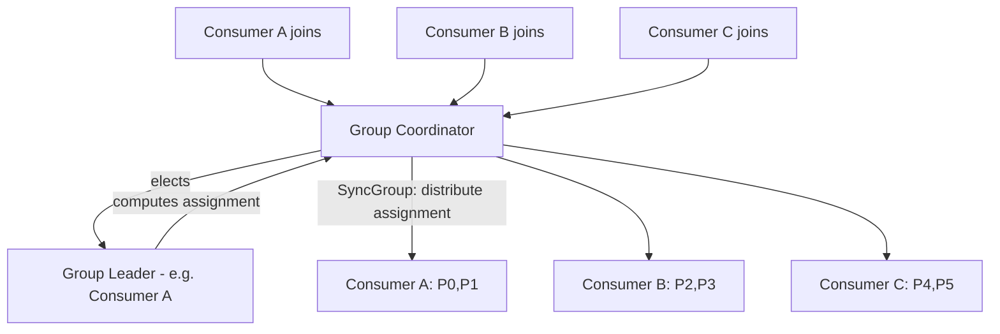
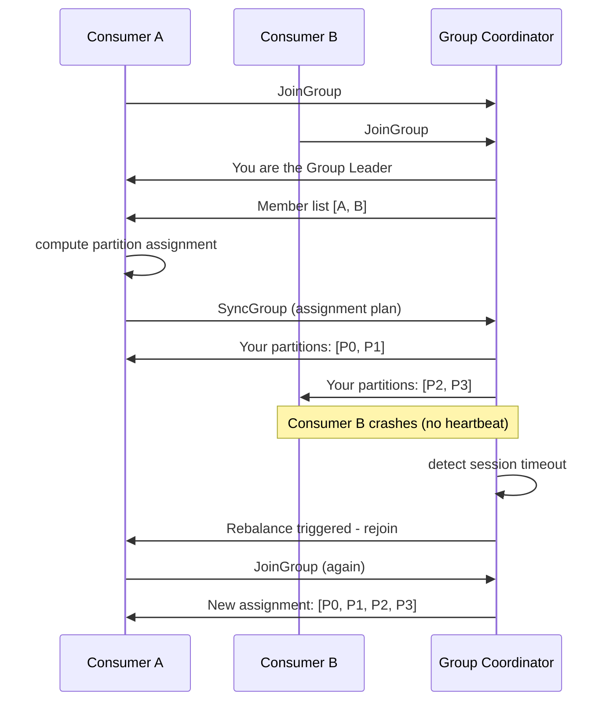
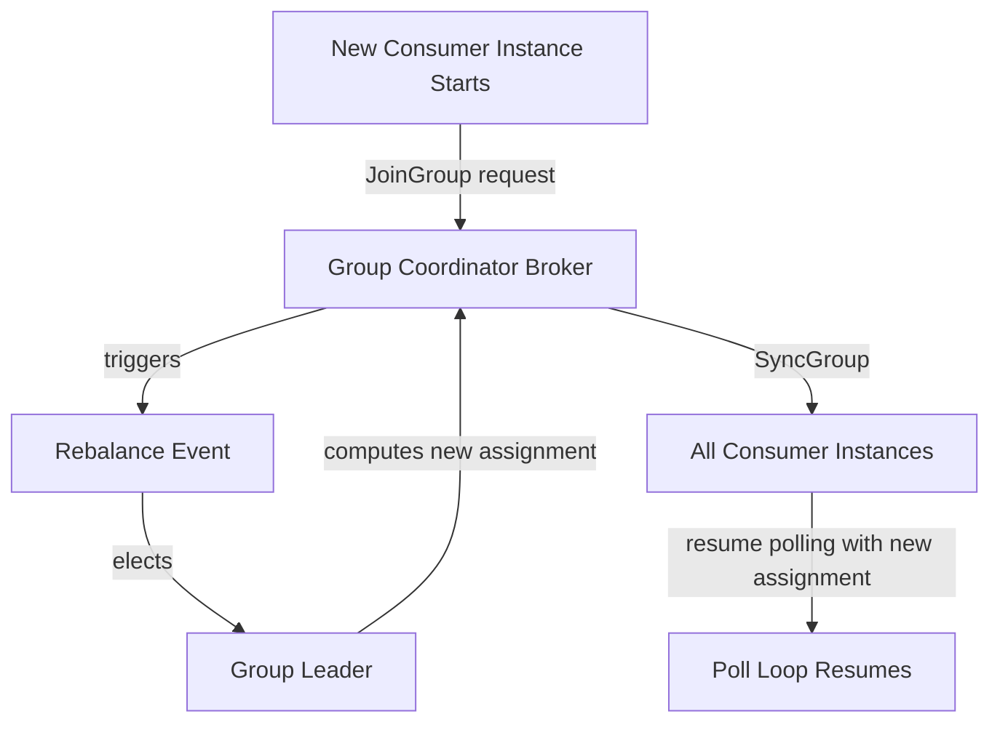
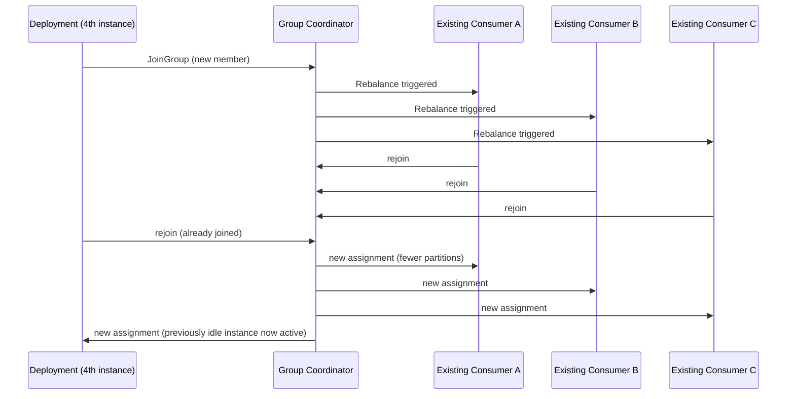

# Module 7 — Consumer Groups

**Level:** ⭐⭐ Beginner → Intermediate
**Track:** Kafka Complete Masterclass for Node.js Backend Engineers
**Module:** 7 of 25

---

## 1. Introduction

Module 5 taught you how a single consumer reads records. Module 6 taught you how data is split across partitions. This module connects the two: how multiple consumer *instances* cooperate as a **consumer group** to share the work of reading a topic — scaling horizontally, balancing load, and recovering automatically when instances come and go.

Consumer groups are the mechanism that makes Kafka consumers horizontally scalable, and understanding the coordination protocol behind them (rebalancing, the group coordinator) is essential for building reliable, scalable Node.js services.

---

## 2. Learning Objectives

By the end of this module, you will be able to:

1. Explain what a consumer group is and why it exists.
2. Explain exactly how partitions are distributed among consumers in a group.
3. Explain what happens when a consumer joins or leaves a group (rebalancing).
4. Explain the role of the group coordinator.
5. Reason correctly about consumer group scaling limits.
6. Configure and run multiple KafkaJS consumer instances safely within the same group.

---

## 3. Why This Concept Exists

A single consumer instance, no matter how well-written, is limited by the throughput of a single process/machine. Consumer groups exist to answer: **"How do multiple independent processes divide up the work of consuming a topic, without manual coordination, and without duplicating or missing work?"**

This is a genuinely hard distributed-systems problem — what if two consumers both think they own partition 3? What if a consumer crashes mid-processing? Kafka solves this with a formal **group membership protocol**, coordinated by a broker-side **group coordinator**, so your application code never has to implement this coordination logic itself.

---

## 4. Problem Statement

Imagine the Inventory Service needs to handle a growing volume of orders:

1. With 1 consumer instance and 6 partitions, that single instance must read all 6 partitions — it becomes the bottleneck.
2. If you spin up 3 more instances (4 total) of the *same service*, how do they avoid each processing the same messages (duplicating stock reduction)?
3. If one instance crashes, how do the remaining instances pick up its abandoned partitions without manual intervention?
4. If you deploy a 5th instance, but your topic only has 6 partitions and you already have 6 instances, what happens to the 7th consumer?

Consumer groups, and the rebalancing protocol behind them, answer all of these automatically.

---

## 5. Real-World Analogy

### Analogy: A Restaurant Kitchen with Rotating Chefs

Imagine 6 dishes constantly need to be prepared (6 partitions) and a kitchen coordinator (group coordinator) assigns dishes to available chefs (consumer instances). With 2 chefs, each handles 3 dishes. If a 3rd chef joins mid-shift, the coordinator **reassigns** dishes so each of the 3 chefs handles 2 — this reassignment moment is a **rebalance**, and it briefly pauses cooking while the reassignment happens.

If a chef suddenly leaves (crashes) mid-dish, the coordinator notices they've stopped responding (missed check-ins/heartbeats) and reassigns their dishes to the remaining chefs. If a 7th chef shows up but there are only 6 dishes, that chef simply has nothing to do — sitting idle until a dish (or a chef) frees up.

---

## 6. Technical Definition

- **Consumer Group**: A named collection of consumer instances that cooperatively consume a topic's partitions, such that **each partition is assigned to exactly one consumer within the group at any given time**.
- **Group Coordinator**: A specific broker (determined by hashing the group ID) responsible for managing group membership, triggering rebalances, and tracking committed offsets for that group.
- **Group Leader**: One consumer instance within the group (elected during the join process) responsible for computing the actual partition assignment plan, which it sends back to the coordinator to distribute to all members.
- **Rebalance**: The process of reassigning partitions among group members, triggered by membership changes (join, leave, crash) or partition count changes.
- **Partition Assignment Strategy**: The algorithm used to decide which consumer gets which partitions (e.g., `RangeAssignor`, `RoundRobinAssignor`, `CooperativeStickyAssignor` — KafkaJS supports configurable assignors).

---

## 7. Internal Working

### The group join protocol (simplified)

```
1. Consumer instance starts, connects, and sends a JoinGroup request
   to the group coordinator (a specific broker for this group.id)

2. Coordinator collects JoinGroup requests from all members within
   a rebalance window, then designates one member as the GROUP LEADER

3. Coordinator sends the full list of current group members to the
   elected leader

4. The leader computes a partition assignment plan (using the
   configured assignment strategy) and sends it back to the coordinator

5. Coordinator distributes the assignment to each member via a
   SyncGroup response — each consumer now knows exactly which
   partitions it owns

6. Each consumer begins its poll loop for its assigned partitions
```

### Why rebalances are disruptive

During a rebalance, **all group members typically pause processing** until the new assignment is finalized (this is especially true for the older "eager" rebalance protocol; "cooperative" rebalancing, discussed below, improves on this). This is why frequent, unnecessary rebalances (e.g., from flapping consumers or long processing times triggering false session timeouts) can meaningfully hurt throughput.

---

## 8. Architecture

```
                     Kafka Cluster
        ┌─────────────────────────────────┐
        │   Group Coordinator (a broker)    │
        └─────────────────────────────────┘
                   ▲       ▲       ▲
          JoinGroup│       │       │JoinGroup
                   │       │       │
        ┌──────────┴─┐ ┌───┴──────┐ ┌─┴──────────┐
        │ Consumer A │ │Consumer B │ │ Consumer C  │
        │(Partition 0│ │(Partition2│ │(Partition 4,│
        │ & 1)       │ │ & 3)      │ │ & 5)        │
        └────────────┘ └───────────┘ └─────────────┘

     All 3 consumers share group.id = "inventory-service"
     Topic "orders" has 6 partitions, evenly split: 2 each
```

---

## 9. Step-by-Step Flow

1. 3 consumer instances start up, all configured with `groupId: "inventory-service"`.
2. Each sends a `JoinGroup` request to the broker acting as the group coordinator for `"inventory-service"`.
3. The coordinator waits briefly for all members to join, then elects one as the group leader.
4. The leader computes a partition assignment (e.g., 6 partitions ÷ 3 consumers = 2 partitions each).
5. The coordinator distributes this assignment to all 3 consumers via `SyncGroup`.
6. Each consumer begins independently polling and processing its assigned partitions.
7. A 4th instance is deployed (scaling up). It sends `JoinGroup`, triggering a **rebalance** — partitions are recomputed and redistributed (now roughly 1-2 each across 4 consumers).
8. Consumer B crashes unexpectedly. After its session timeout expires (no heartbeats received), the coordinator triggers another rebalance, redistributing B's partitions among the remaining 3 consumers.

---

## 10. Detailed ASCII Diagrams

### 10.1 Even Partition Distribution

```
Topic: orders (6 partitions)
Consumer Group: inventory-service (3 instances)

Consumer A:  Partition 0, Partition 1
Consumer B:  Partition 2, Partition 3
Consumer C:  Partition 4, Partition 5

Every partition has exactly ONE owner. No overlaps, no gaps.
```

### 10.2 Scaling Up Triggers Rebalance

```
BEFORE (3 consumers, 6 partitions)          AFTER (4th consumer joins)

A: P0, P1                                   A: P0, P1
B: P2, P3               -- rebalance -->    B: P2
C: P4, P5                                   C: P3, P4
                                             D: P5

Partitions are redistributed to keep the load roughly even.
```

### 10.3 More Consumers Than Partitions

```
Topic: orders (3 partitions)
Consumer Group: inventory-service (5 instances)

Consumer A: Partition 0
Consumer B: Partition 1
Consumer C: Partition 2
Consumer D: (no partitions — IDLE)
Consumer E: (no partitions — IDLE)

Idle consumers act as "hot standbys" — ready to pick up a
partition immediately if an active consumer crashes.
```

---

## 11. Mermaid Diagrams





---

## 12. Request Flow Diagram



---

## 13. Sequence Diagram



---

## 14. Kafka Internal Flow

```
1. Each consumer sends periodic heartbeats to the group coordinator
   to signal it is alive (separate from the poll/fetch loop)
2. If a heartbeat isn't received within `session.timeout.ms`, the
   coordinator considers that consumer dead and triggers a rebalance
3. During a rebalance (eager protocol), all consumers in the group
   pause processing, rejoin, and receive a fresh assignment
4. With "cooperative sticky" rebalancing (a newer protocol), only the
   specific partitions that need to move are revoked/reassigned —
   consumers keep processing their unaffected partitions throughout
```

---

## 15. Producer Perspective

Producers are entirely unaware of consumer groups — a producer just writes to a topic's partitions. Any number of consumer groups (Fraud, Analytics, Inventory) can each independently and fully consume the same topic, with no coordination or awareness required from the producer side.

---

## 16. Consumer Perspective

From inside a single consumer instance, joining a group means:

- You don't choose your own partitions — the group coordinator (via the elected leader's assignment plan) tells you.
- Your assignment can change at any time due to a rebalance — your code must handle `onPartitionsRevoked`/`onPartitionsAssigned`-style lifecycle events gracefully (KafkaJS exposes rebalance events for this).
- You must send heartbeats reliably (handled automatically by KafkaJS, but can be disrupted by long-blocking synchronous code) to avoid being incorrectly considered dead.

---

## 17. Broker Perspective

One broker per group acts as the **group coordinator**, determined by hashing the `group.id`. This broker:

- Tracks group membership (who has joined, who's sent recent heartbeats).
- Triggers and orchestrates rebalances.
- Stores the group's committed offsets in the internal `__consumer_offsets` topic.

---

## 18. Node.js Integration

Running multiple instances of the same consumer service in Node.js is as simple as starting multiple processes with the same `groupId` — Kafka handles all coordination automatically.

```javascript
// Each of these runs in a SEPARATE Node.js process (e.g., separate
// pods/containers in Kubernetes), but all share the same groupId.
// You do NOT need any custom coordination logic in your application.

import { kafka } from "../config/kafka.js";

const consumer = kafka.consumer({ groupId: "inventory-service" });

export async function startConsumer() {
  await consumer.connect();
  await consumer.subscribe({ topic: "orders", fromBeginning: false });

  await consumer.run({
    eachMessage: async ({ partition, message }) => {
      console.log(`[instance] processing partition ${partition}, offset ${message.offset}`);
      // business logic here
    },
  });
}
```

---

## 19. KafkaJS Examples

### 19.1 Listening for rebalance events

```javascript
// src/consumers/inventoryConsumer.js
import { kafka } from "../config/kafka.js";

const consumer = kafka.consumer({ groupId: "inventory-service" });

export async function startInventoryConsumer() {
  // KafkaJS exposes consumer events, including rebalance-related ones,
  // useful for logging and observability.
  consumer.on(consumer.events.GROUP_JOIN, (event) => {
    console.log(
      `[inventory] joined group. Assigned partitions:`,
      event.payload.memberAssignment
    );
  });

  consumer.on(consumer.events.CRASH, (event) => {
    console.error(`[inventory] consumer crashed:`, event.payload.error);
  });

  await consumer.connect();
  await consumer.subscribe({ topic: "orders", fromBeginning: false });

  await consumer.run({
    eachMessage: async ({ partition, message }) => {
      // business logic
    },
  });
}
```

### 19.2 Configuring a cooperative sticky assignor (minimizes rebalance disruption)

```javascript
// src/config/kafka.js
import { Kafka, PartitionAssigners } from "kafkajs";

export const kafka = new Kafka({
  clientId: "inventory-service",
  brokers: ["localhost:9092"],
});

// CooperativeStickyAssignor minimizes the number of partitions that
// actually need to move during a rebalance, reducing disruption
// compared to the default eager RangeAssignor/RoundRobinAssignor.
export const consumer = kafka.consumer({
  groupId: "inventory-service",
  partitionAssigners: [PartitionAssigners.cooperativeSticky],
});
```

### 19.3 Simulating horizontal scaling locally

```javascript
// Run this same file 3 times in 3 separate terminals to simulate
// 3 instances of the same service joining one consumer group.

// src/consumers/instance.js
import { kafka } from "../config/kafka.js";

const instanceId = process.env.INSTANCE_ID || "unknown";
const consumer = kafka.consumer({ groupId: "inventory-service" });

async function run() {
  await consumer.connect();
  await consumer.subscribe({ topic: "orders", fromBeginning: false });

  await consumer.run({
    eachMessage: async ({ partition, message }) => {
      console.log(
        `[instance ${instanceId}] partition ${partition}, offset ${message.offset}`
      );
    },
  });
}

run().catch(console.error);

// Terminal 1: INSTANCE_ID=A node src/consumers/instance.js
// Terminal 2: INSTANCE_ID=B node src/consumers/instance.js
// Terminal 3: INSTANCE_ID=C node src/consumers/instance.js
```

---

## 20. CLI Commands

```bash
# List all consumer groups
kafka-consumer-groups.sh --bootstrap-server localhost:9092 --list

# Describe a group — shows which consumer instance (by member ID)
# owns which partition, plus current lag
kafka-consumer-groups.sh --bootstrap-server localhost:9092 \
  --describe --group inventory-service

# Example output columns:
# GROUP  TOPIC  PARTITION  CURRENT-OFFSET  LOG-END-OFFSET  LAG  CONSUMER-ID  HOST  CLIENT-ID
```

---

## 21. Configuration Explanation

| Config | Meaning |
|---|---|
| `groupId` | Identifies the consumer group — all instances sharing this ID cooperate on the same set of partitions |
| `sessionTimeout` | Max time without a heartbeat before the coordinator considers a consumer dead |
| `heartbeatInterval` | How often heartbeats are sent — should be well below `sessionTimeout` (commonly 1/3) |
| `rebalanceTimeout` | Max time allowed for all members to rejoin during a rebalance before those that haven't are dropped |
| `partitionAssigners` | Determines the algorithm used to distribute partitions (e.g., range, round robin, cooperative sticky) |

---

## 22. Common Mistakes

1. **Running consumer instances with different `groupId`s by accident** (e.g., a typo in an environment variable) — this creates two separate groups, each fully consuming the topic independently, causing unintended duplicate processing.
2. **Long-blocking synchronous code inside `eachMessage`** that prevents timely heartbeats, causing false-positive "dead consumer" detections and unnecessary rebalances.
3. **Not planning for idle consumers** when scaling beyond the partition count — this is normal, expected behavior, not a bug.
4. **Assuming rebalances are instantaneous and free** — frequent rebalances (from flapping consumers, deploys without graceful shutdown) meaningfully hurt throughput.
5. **Ignoring the `CRASH` event** — an unhandled consumer crash can silently take a consumer instance out of the group without clear operational visibility.

---

## 23. Edge Cases

- **What if the group leader itself crashes mid-rebalance?** A new JoinGroup round occurs, and a new leader is elected among the remaining/rejoining members.
- **What if all consumers in a group are down and a producer keeps writing?** Messages simply accumulate in the topic (subject to retention) — no data loss, but growing lag, ready to be processed once a consumer rejoins.
- **What if two different applications accidentally use the exact same `groupId`?** They'll unintentionally share partition assignment — each will only get a subset of partitions, likely breaking both services' assumptions about seeing all messages.

---

## 24. Performance Considerations

- Frequent rebalances are a hidden performance tax — minimize deploy-triggered rebalances via graceful shutdown (Module 5) and tune `sessionTimeout`/`heartbeatInterval` appropriately for your workload's processing time variability.
- The **cooperative sticky** assignor (Section 19.2) significantly reduces rebalance disruption compared to older eager assignors, since it only reassigns the specific partitions that actually need to move, letting unaffected consumers keep working.

---

## 25. Scalability Discussion

- The maximum useful size of a consumer group equals the topic's partition count — beyond that, additional instances sit idle (useful only as hot standbys for faster failover).
- If you anticipate needing to scale a consumer group significantly, plan your partition count (Module 6) with that ceiling in mind from the start.

---

## 26. Production Best Practices

- Always implement graceful shutdown (Module 5, Section 19.3) so deploys trigger clean, minimal rebalances rather than relying on session timeouts.
- Use the cooperative sticky assignor for large or frequently-scaled consumer groups to minimize rebalance disruption.
- Set `sessionTimeout` and `heartbeatInterval` based on realistic worst-case processing times, not just happy-path benchmarks.
- Monitor rebalance frequency as an operational health metric — frequent, unexplained rebalances often indicate an underlying stability issue.

---

## 27. Monitoring & Debugging

- `kafka-consumer-groups.sh --describe` shows the current owner (consumer/member ID) of each partition and per-partition lag — your primary tool for group health checks.
- Log `GROUP_JOIN` and `CRASH` events (Section 19.1) for visibility into rebalance frequency and causes over time.

---

## 28. Security Considerations

- Group IDs themselves aren't typically a security boundary, but consumer group ACLs (Module 20) can restrict which service accounts are permitted to join a given group, preventing unauthorized consumption.

---

## 29. Interview Questions (Easy → Medium → Hard)

### Easy

1. What is a consumer group?
2. What is the group coordinator?
3. What happens if you have more consumers than partitions?

### Medium

4. What triggers a rebalance?
5. What is the group leader, and how is it different from the group coordinator?
6. Why do idle consumers exist when there are more instances than partitions?
7. What's the difference between eager and cooperative rebalancing?

### Hard

8. Explain, step by step, what happens when a 4th consumer instance joins an existing 3-instance consumer group.
9. Why can long-running, blocking code inside `eachMessage` cause an unintended rebalance, even if the consumer process is technically still alive?
10. Compare the operational impact of frequent rebalances under an eager assignment strategy vs. a cooperative sticky strategy.
11. Two services accidentally use the same `groupId` for two entirely different topics they each need to fully consume independently. Explain what breaks and why.

---

## 30. Common Interview Traps

- **Trap:** "More consumer instances always means more throughput." → **Reality:** Only up to the partition count — beyond that, extra instances are idle.
- **Trap:** "Rebalances are free/instantaneous." → **Reality:** Especially under the eager protocol, rebalances pause processing across the whole group until a new assignment is finalized.
- **Trap:** "The group coordinator and group leader are the same thing." → **Reality:** The coordinator is a broker managing membership/offsets; the leader is a consumer instance that computes the actual assignment plan.

---

## 31. Summary

- Consumer groups let multiple instances of a service cooperatively and automatically divide up a topic's partitions.
- The group coordinator (a broker) manages membership and triggers rebalances; the group leader (a consumer instance) computes the actual assignment.
- Partition count is a hard ceiling on useful consumer group size — extra instances beyond that sit idle as standbys.
- Rebalances are disruptive; minimizing their frequency (graceful shutdowns) and impact (cooperative sticky assignment) is a real production concern.

---

## 32. Cheat Sheet

```
CONSUMER GROUPS — ONE PAGE

Consumer Group  = named set of consumers sharing partition ownership
Group Coordinator = a broker managing group membership + offsets
Group Leader      = a CONSUMER instance that computes partition assignment

Each partition → exactly ONE consumer within the group at a time
More consumers than partitions → extras sit IDLE (standby)

Rebalance triggers: consumer joins, leaves, crashes, or partition count changes
Eager rebalance:       ALL consumers pause during reassignment
Cooperative sticky:    only AFFECTED partitions are reassigned — less disruptive

Golden rule: partition count = ceiling on consumer group parallelism
             graceful shutdown = fewer, cleaner rebalances
```

---

## 33. Hands-on Exercises

1. Run 3 instances of the same consumer (Section 19.3) against a 6-partition topic and observe (via `kafka-consumer-groups.sh --describe`) the even partition split.
2. Kill one instance abruptly (`kill -9`) and observe the rebalance and new assignment.
3. Add a 7th instance to a 6-partition topic's consumer group and confirm it remains idle.
4. Switch the assignor to `cooperativeSticky` and repeat the kill-and-restart experiment, comparing the disruption to unaffected consumers.

---

## 34. Mini Project

**Build:** A small "consumer fleet simulator": a script that spins up N consumer instances (as child processes) against a topic with a configurable partition count, logs partition assignments on startup and after each rebalance, and lets you kill/restart individual instances to observe rebalancing behavior live.

---

## 35. Advanced Project

**Build:** A production-style deployment simulation: implement graceful shutdown across all consumer instances (SIGTERM handling), then perform a rolling deploy (stop instance 1, wait, start new instance 1; repeat for 2 and 3) while continuously producing messages, measuring total rebalance-caused processing pauses versus an ungraceful (`kill -9`) rolling restart.

---

## 36. Homework

1. Research the difference between `RangeAssignor`, `RoundRobinAssignor`, and `CooperativeStickyAssignor` in terms of exact partition distribution behavior, and write a short comparison.
2. Explain, in your own words, why Kafka's consumer group protocol avoids needing an external coordination service (like a separate lock manager) to prevent two consumers from claiming the same partition.
3. Investigate and summarize what `static membership` (`group.instance.id`) is in Kafka, and how it can reduce unnecessary rebalances during quick restarts (e.g., rolling deploys).

---

## 37. Additional Reading

- Apache Kafka documentation — "Consumer Group Protocol" design docs
- KIP-429 — Incremental Cooperative Rebalancing
- KIP-345 — Static membership to reduce rebalances during rolling restarts
- KafkaJS documentation — Consumer group configuration and assignors

---

## Key Takeaways

- Consumer groups automatically divide partition ownership among multiple consumer instances.
- The group coordinator (broker) manages membership; the group leader (a consumer) computes assignments.
- Partition count caps useful consumer group parallelism — extra instances beyond that are idle standbys.
- Rebalances are a real operational cost; minimize their frequency and impact through graceful shutdown and cooperative assignment strategies.

---

## Revision Notes

- Be able to explain the difference between group coordinator and group leader without hesitating.
- Practice reasoning through "what happens when X consumer joins/crashes" scenarios until they're intuitive.
- Memorize: partition count = ceiling on useful consumer group size.

---

## One-Page Cheat Sheet

*(See Section 32 above.)*

---

## 20 Practice Questions

1. What is a consumer group?
2. What is a group coordinator?
3. What is a group leader?
4. Is the group coordinator a broker or a consumer?
5. Is the group leader a broker or a consumer?
6. What triggers a rebalance?
7. What happens to extra consumers beyond the partition count?
8. What's the difference between eager and cooperative rebalancing?
9. What CLI command shows current partition ownership within a group?
10. What KafkaJS event fires when a consumer successfully joins a group?
11. What KafkaJS event fires when a consumer crashes?
12. Why can long processing times cause unwanted rebalances?
13. What is `sessionTimeout`?
14. What is `heartbeatInterval`?
15. Why should `heartbeatInterval` be well below `sessionTimeout`?
16. What is static membership, and what problem does it solve?
17. Can two different services safely share the same `groupId`?
18. What does the cooperative sticky assignor try to minimize?
19. Does a rebalance affect consumers whose partitions are NOT reassigned, under the cooperative protocol?
20. What happens to a partition if its assigned consumer crashes?

---

## 10 Scenario-Based Questions

1. You scale your Inventory Service from 3 to 6 instances during a traffic spike, but your topic has only 4 partitions. What happens, and what would you advise the team?
2. Your team notices processing pauses every time you deploy a new version of a consumer service. Diagnose the likely cause and propose two possible fixes.
3. A consumer instance is technically still running but hasn't sent a heartbeat in over `sessionTimeout` due to a long synchronous database call. What does the coordinator do, and is this appropriate behavior?
4. Two different teams accidentally configure their services with the same `groupId` while each expecting to independently consume 100% of a topic's messages. What bug will each team observe?
5. You want to minimize rebalance disruption during frequent, fast rolling restarts (e.g., multiple deploys per day). What Kafka feature would you investigate, and why?
6. A consumer group member crashes and is never replaced. Explain what happens to its previously-owned partitions and any resulting lag.
7. Your `kafka-consumer-groups.sh --describe` output shows one partition with a completely different consumer ID than a moment before, without any deploy happening. What would you investigate?
8. You're designing a new service and need to decide its consumer group's expected max scale upfront. What factor from Module 6 does this decision depend on?
9. A rebalance is taking unusually long to complete across a large consumer group. What configuration would you check first?
10. Explain to a stakeholder, in non-technical terms, why briefly pausing message processing during a deploy is sometimes unavoidable with Kafka consumer groups (absent cooperative rebalancing).

---

## 5 Coding Assignments

1. Write a script that starts 3 consumer instances (as separate KafkaJS consumer objects within one Node.js process, each with a distinct simulated ID) in the same group, and logs each one's assigned partitions on startup.
2. Implement the `GROUP_JOIN` and `CRASH` event listeners (Section 19.1) and build a small in-memory dashboard (console table) showing current partition ownership across your simulated fleet.
3. Write a graceful shutdown handler that, on SIGTERM, stops accepting new messages, finishes in-flight processing, and disconnects cleanly — then compare rebalance behavior against an ungraceful `process.exit()`.
4. Build a script using the Admin API's `describeGroups()` method to print a group's current state (`Stable`, `PreparingRebalance`, etc.) every 2 seconds, and use it to observe a rebalance happening live.
5. Configure and test the `cooperativeSticky` assignor on a 3-instance consumer fleet, and write a short script that measures how many partitions actually change ownership when a 4th instance joins, compared to the default assignor.

---

## Suggested Next Module

**Module 8 — Offsets**
With a solid grasp of how consumer groups distribute and rebalance partition ownership, the next module dives deeper into offsets themselves: how they're stored, how offset reset policies work, and how to manage them safely in production.
