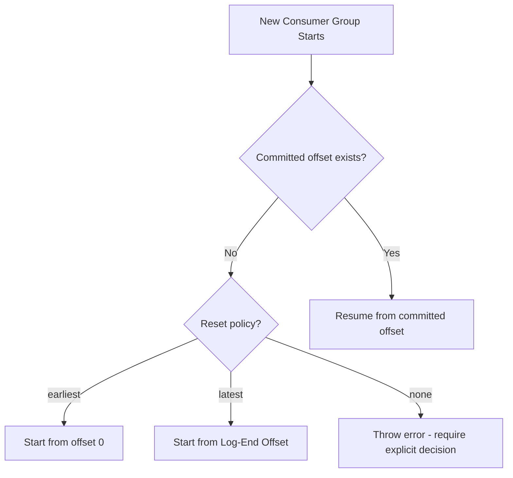
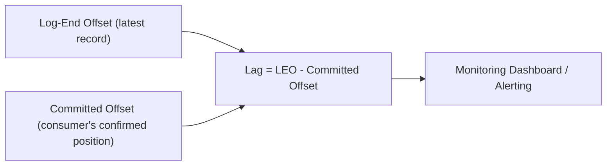
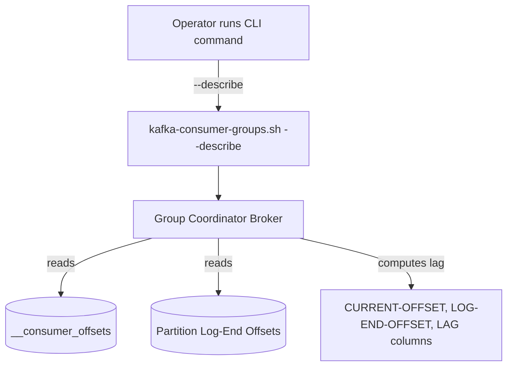
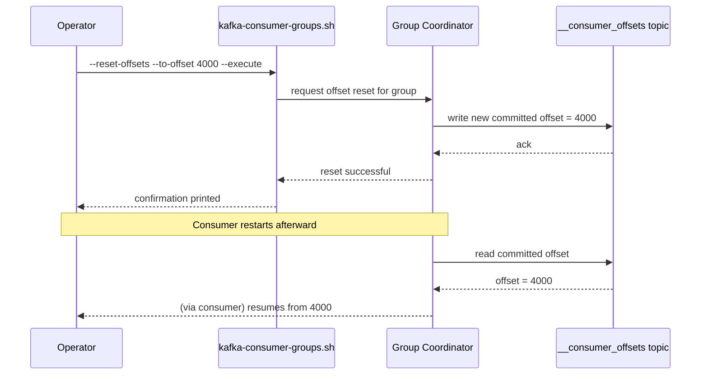

# Module 8 — Offsets

**Level:** ⭐⭐ Beginner → Intermediate
**Track:** Kafka Complete Masterclass for Node.js Backend Engineers
**Module:** 8 of 25

---

## 1. Introduction

Offsets have appeared in every module so far as "the bookmark a consumer keeps." This module makes that precise: how offsets are actually stored, what "offset reset" policies mean for new or lagging consumers, how to manually inspect and manipulate offsets, and the operational patterns you need to safely reprocess or skip data in production.

If Module 5 was "how consumers work," this module is "how to actually operate consumers safely in a live system" — the difference between reading about offsets and being trusted to manage them during an incident.

---

## 2. Learning Objectives

By the end of this module, you will be able to:

1. Explain precisely what an offset is and how it's stored.
2. Explain the difference between committing an offset, the current position, and the log-end offset.
3. Explain offset reset policies (`earliest`, `latest`, `none`) and when each applies.
4. Manually inspect, reset, and manage consumer group offsets using both the CLI and KafkaJS.
5. Reason about common offset-related incidents (stuck consumers, unintentional data skips, reprocessing needs).

---

## 3. Why This Concept Exists

Offsets exist to answer one deceptively simple question: **"Where exactly is this consumer in this partition's log?"** Without a formal offset mechanism:

- A consumer restarting wouldn't know whether to start from the beginning, the end, or somewhere in between.
- Multiple consumers in a group couldn't independently track progress through their own assigned partitions.
- Operators couldn't safely "rewind" a consumer to reprocess data after fixing a bug, or "skip ahead" past a batch of bad data.

Offsets — and Kafka's decision to store them **as data in a Kafka topic itself** (`__consumer_offsets`) — solve all of this with the same durable, replicated log mechanism Kafka already uses for everything else.

---

## 4. Problem Statement

Consider these real production scenarios:

1. A new consumer group is deployed for the very first time against a topic that already has 3 months of historical data. Should it process all 3 months, or only new records going forward?
2. A bug in your consumer's business logic silently corrupted data for the last 2 hours. After fixing the bug, how do you make the consumer **reprocess** just those 2 hours of events?
3. A "poison pill" message is stuck at a specific offset, permanently crashing your consumer on every retry. How do you safely **skip** just that one message without losing everything after it?
4. Your monitoring shows increasing lag for a specific partition. What exactly does "lag" mean in terms of offsets, and how do you calculate it?

Each of these is a routine, real operational task — and each requires a precise understanding of offsets to execute safely.

---

## 5. Real-World Analogy

### Analogy: An Audiobook with a Cloud-Synced Bookmark

Imagine an audiobook app that syncs your listening position (an offset) to the cloud every time you pause. If you open the app on a new device for the very first time (a new consumer group), you have to decide: **start from the beginning of the book** (`earliest`), or **jump straight to "now," skipping everything you haven't heard** (`latest`) — there's no middle ground without you manually choosing a specific chapter.

If you realize you misunderstood a plot point, you can manually **rewind your bookmark** to a specific earlier chapter to relisten (reprocessing). If a specific 10-second clip is corrupted and crashes the app every time it tries to play it, you can manually **skip past just that clip** to your next chapter (skipping a poison pill) without starting the whole book over.

---

## 6. Technical Definition

- **Offset**: A monotonically increasing integer uniquely identifying a record's position within a specific partition (starts at 0).
- **Current Position**: The offset of the *next* record the consumer will read (i.e., "high water mark" of what it has consumed so far).
- **Committed Offset**: The last offset the consumer has explicitly (or automatically) confirmed as processed, stored durably in `__consumer_offsets`.
- **Log-End Offset (LEO)**: The offset of the next record that *would* be written to a partition — i.e., the very end of the log at this moment.
- **Consumer Lag**: `Log-End Offset − Committed Offset` — how far behind the consumer is from the latest available data.
- **Offset Reset Policy** (`auto.offset.reset` in Kafka terms, `fromBeginning` in KafkaJS's simplified model): Determines what a consumer does when it has **no committed offset** to resume from (e.g., a brand-new consumer group, or one whose committed offset has expired from retention):
  - `earliest`: Start from the very first available record.
  - `latest`: Start from the current log-end offset (only new records going forward).
  - `none`: Throw an error instead of guessing — forces explicit human/operational decision.

---

## 7. Internal Working

### `__consumer_offsets` — offsets stored as Kafka data

```
Topic: __consumer_offsets (internal, created automatically)

Key:   (group.id, topic, partition)
Value: committed offset, metadata, commit timestamp

Example record:
  Key:   ("inventory-service", "orders", 2)
  Value: offset=1057, timestamp=2026-07-04T10:15:00Z
```

This is a genuinely elegant design choice: Kafka doesn't need a separate database to track consumer progress — it just uses **itself**, benefiting from the same replication and durability guarantees as any other topic.

### Lag calculation

```
Partition 2:
  Log-End Offset (LEO):     1200   (latest record written)
  Committed Offset:         1057   (consumer's last confirmed position)

  Lag = 1200 - 1057 = 143 messages behind
```

---

## 8. Architecture

```
                    Kafka Cluster
     ┌───────────────────────────────────────────┐
     │  Topic: orders           Topic: __consumer_offsets │
     │  Partition 2: [...records up to offset 1200]        │
     │                          Key: (inventory-service,    │
     │                                orders, 2)            │
     │                          Value: offset=1057          │
     └───────────────────────────────────────────┘
                          ▲
                          │ commit
              ┌───────────┴────────────┐
              │   Consumer Instance      │
              │   (reading Partition 2)  │
              └─────────────────────────┘
```

---

## 9. Step-by-Step Flow

1. A consumer group is created for the first time and subscribes to `orders`.
2. Since no committed offset exists yet for its assigned partitions, the configured reset policy (`earliest`/`latest`) determines the starting point.
3. As the consumer processes records, it periodically (auto) or explicitly (manual) commits its current offset to `__consumer_offsets`.
4. If the consumer restarts, it fetches its last committed offset from `__consumer_offsets` and resumes exactly from there.
5. An operator can manually inspect lag (`kafka-consumer-groups.sh --describe`) or manipulate offsets (`--reset-offsets`) for operational tasks like reprocessing or skipping data.

---

## 10. Detailed ASCII Diagrams

### 10.1 Earliest vs Latest Reset Policy

```
Partition 2:  [0][1][2][3][4][5][6][7][8][9]  <- LEO = 10
                                             ▲
                                    (new consumer, no
                                     committed offset yet)

reset policy = "earliest"   →   starts reading from offset 0
reset policy = "latest"     →   starts reading from offset 10 (only NEW records)
```

### 10.2 Reprocessing After a Bug Fix

```
Before fix:  committed offset = 5000  (bug corrupted data from 4000-5000)

Operator runs:
  kafka-consumer-groups.sh --reset-offsets --to-offset 4000 --execute

After reset: committed offset = 4000

Consumer restarts, reprocesses records 4000-5000 with the FIXED logic
```

### 10.3 Skipping a Poison Pill

```
Partition 2:  [...][4998][4999 - POISON PILL][5000][5001]...
                              ▲
                    consumer keeps crashing here on every retry

Operator manually commits offset 5000 (skipping the poison pill entirely)

Consumer resumes from 5000, never processes 4999 again
(logged separately for manual investigation)
```

---

## 11. Mermaid Diagrams





---

## 12. Request Flow Diagram



---

## 13. Sequence Diagram



---

## 14. Kafka Internal Flow

```
1. Consumer commits offset N (meaning "I have processed up to N-1;
   next record to read is N") — either via auto-commit timer or
   explicit commitOffsets() call
2. This commit is itself a WRITE to the __consumer_offsets topic
   (key: group+topic+partition, value: offset N)
3. This write is replicated like any other Kafka write (subject to
   the same acks/replication guarantees, Module 4 and Module 9)
4. On restart or rebalance, the consumer's assigned broker (via the
   group coordinator) reads the latest committed offset for that
   group+topic+partition combination
5. Consumer resumes fetching from that offset
```

---

## 15. Producer Perspective

Producers have no interaction with consumer offsets whatsoever — offsets are purely a consumer-side and broker-side bookkeeping concept. This separation is intentional: it lets any number of independent consumer groups track their own progress through the same data without any producer awareness or involvement.

---

## 16. Consumer Perspective

The consumer's job regarding offsets:

- Decide (via reset policy) what to do when there's no prior committed offset.
- Track its current position as it reads.
- Commit offsets at a cadence and strategy (Module 5) that matches its correctness requirements.
- Be operationally preparable for manual offset intervention (reprocessing, skipping) during incidents.

---

## 17. Broker Perspective

The broker (specifically, the group coordinator for a given group) is the source of truth for committed offsets. It:

- Stores commits durably in `__consumer_offsets`, replicated like any other topic data.
- Serves `OffsetFetch` requests (when a consumer wants to know its last committed position).
- Serves `ListOffsets` requests (used to compute the log-end offset for lag calculations).

---

## 18. Node.js Integration

KafkaJS's Admin API gives you full programmatic control over offsets — useful for building internal tooling (dashboards, safe reprocessing scripts) rather than relying solely on CLI commands during incidents.

```javascript
// src/tools/offsetInspector.js
import { Kafka } from "kafkajs";

const kafka = new Kafka({ clientId: "offset-tool", brokers: ["localhost:9092"] });

async function inspectLag(groupId, topic) {
  const admin = kafka.admin();
  await admin.connect();

  const groupOffsets = await admin.fetchOffsets({ groupId, topics: [topic] });
  const topicOffsets = await admin.fetchTopicOffsets(topic); // log-end offsets

  groupOffsets[0].partitions.forEach((p) => {
    const logEnd = topicOffsets.find((t) => t.partition === p.partition).offset;
    const lag = Number(logEnd) - Number(p.offset);
    console.log(`Partition ${p.partition}: committed=${p.offset}, logEnd=${logEnd}, lag=${lag}`);
  });

  await admin.disconnect();
}

inspectLag("inventory-service", "orders").catch(console.error);
```

---

## 19. KafkaJS Examples

### 19.1 Configuring reset policy for a new consumer group

```javascript
// src/consumers/inventoryConsumer.js
import { kafka } from "../config/kafka.js";

const consumer = kafka.consumer({ groupId: "inventory-service" });

export async function startInventoryConsumer() {
  await consumer.connect();

  // fromBeginning: true  → equivalent to "earliest" reset policy
  // fromBeginning: false → equivalent to "latest" reset policy
  // ONLY applies if there's no existing committed offset for this group.
  await consumer.subscribe({ topic: "orders", fromBeginning: false });

  await consumer.run({
    eachMessage: async ({ partition, message }) => {
      console.log(`Partition ${partition}, offset ${message.offset}`);
    },
  });
}
```

### 19.2 Manually seeking to a specific offset (reprocessing)

```javascript
// src/tools/reprocessFromOffset.js
import { kafka } from "../config/kafka.js";

const consumer = kafka.consumer({ groupId: "inventory-service-reprocess" });

async function reprocessFromOffset(topic, partition, offset) {
  await consumer.connect();
  await consumer.subscribe({ topic, fromBeginning: false });

  // consumer.run() must be called before seek() takes effect
  await consumer.run({
    eachMessage: async ({ partition, message }) => {
      console.log(`Reprocessing offset ${message.offset}:`, message.value.toString());
    },
  });

  // Explicitly jump to a specific offset, overriding wherever
  // the group's committed offset currently points.
  consumer.seek({ topic, partition, offset: offset.toString() });
}

reprocessFromOffset("orders", 2, 4000).catch(console.error);
```

### 19.3 Programmatically resetting offsets via Admin API

```javascript
// src/tools/resetOffsets.js
import { Kafka } from "kafkajs";

const kafka = new Kafka({ clientId: "offset-admin", brokers: ["localhost:9092"] });

async function resetGroupOffset(groupId, topic, partition, offset) {
  const admin = kafka.admin();
  await admin.connect();

  await admin.setOffsets({
    groupId,
    topic,
    partitions: [{ partition, offset: offset.toString() }],
  });

  console.log(`Reset ${groupId} on ${topic}:${partition} to offset ${offset}`);
  await admin.disconnect();
}

// Use with EXTREME caution in production — always confirm the target
// offset and impact (reprocessing vs. skipping data) before running.
resetGroupOffset("inventory-service", "orders", 2, 4000).catch(console.error);
```

---

## 20. CLI Commands

```bash
# View current offsets and lag for a group
kafka-consumer-groups.sh --bootstrap-server localhost:9092 \
  --describe --group inventory-service

# Reset offsets to earliest (dry run first — no --execute flag)
kafka-consumer-groups.sh --bootstrap-server localhost:9092 \
  --group inventory-service --topic orders --reset-offsets --to-earliest

# Actually apply the reset (add --execute)
kafka-consumer-groups.sh --bootstrap-server localhost:9092 \
  --group inventory-service --topic orders --reset-offsets --to-earliest --execute

# Reset to a specific offset on a specific partition
kafka-consumer-groups.sh --bootstrap-server localhost:9092 \
  --group inventory-service --topic orders:2 --reset-offsets --to-offset 4000 --execute

# Reset based on a timestamp (e.g., "reprocess everything since this time")
kafka-consumer-groups.sh --bootstrap-server localhost:9092 \
  --group inventory-service --topic orders --reset-offsets \
  --to-datetime 2026-07-04T00:00:00.000 --execute

# Shift offsets forward/back by a relative amount
kafka-consumer-groups.sh --bootstrap-server localhost:9092 \
  --group inventory-service --topic orders --reset-offsets --shift-by -100 --execute
```

**Important:** `--reset-offsets` only works while the consumer group has **no active members** (i.e., all consumer instances must be stopped first) — this is a deliberate safety mechanism to prevent conflicting with a live poll loop.

---

## 21. Configuration Explanation

| Config | Meaning |
|---|---|
| `auto.offset.reset` (Kafka term) / `fromBeginning` (KafkaJS) | What a consumer does when no committed offset exists |
| `offsets.retention.minutes` (broker config) | How long committed offsets are retained if a consumer group is inactive — if exceeded, the group effectively "loses" its position and reset policy applies again |
| `enable.auto.commit` | Whether offsets commit automatically on a timer (Module 5) |

---

## 22. Common Mistakes

1. **Assuming `latest` is always the safe default.** For a brand-new consumer group that needs historical context (e.g., rebuilding aggregate state), `earliest` may be required instead.
2. **Trying to reset offsets while the consumer group is still active.** Kafka will reject this — you must stop all instances first.
3. **Confusing "current position" with "committed offset"** when debugging — they can differ significantly if auto-commit hasn't fired recently.
4. **Letting a consumer group stay inactive long enough for its committed offsets to expire** (`offsets.retention.minutes`), causing an unexpected fallback to the reset policy on next start.
5. **Resetting offsets without understanding the consequence** — resetting to `earliest` on a large topic can cause a massive reprocessing spike that overwhelms downstream systems.

---

## 23. Edge Cases

- **What if you reset offsets forward, past the log-end offset?** Some tooling will clamp this to the actual log-end offset; always verify with `--describe` after a reset.
- **What if retention deletes the offset a consumer wants to resume from** (e.g., its committed offset points to data that has since been deleted due to topic retention)? The consumer will typically fall back to the reset policy (`earliest`/`latest`) for that partition, since the requested offset no longer exists.
- **What if two different tools (CLI and a custom script) both try to reset offsets for the same group simultaneously?** Last write wins — coordinate operational access carefully during incidents.

---

## 24. Performance Considerations

- Resetting to `earliest` on a very large topic can cause a burst of reprocessing that may overwhelm downstream systems (databases, APIs) not designed for that volume — consider throttling or batching reprocessing jobs deliberately.
- Frequent lag-checking scripts (via Admin API) add light load to the group coordinator broker — reasonable at normal monitoring intervals (e.g., every 10-30 seconds), but avoid extremely tight polling loops.

---

## 25. Scalability Discussion

- Offset storage in `__consumer_offsets` scales naturally with Kafka's own replication and partitioning — no separate database is needed regardless of how many consumer groups or topics exist.
- Very large numbers of consumer groups (hundreds+) can increase load on group coordinators; this is rarely a practical concern for most systems but worth knowing for very large-scale platforms.

---

## 26. Production Best Practices

- Always run `--reset-offsets` **without** `--execute` first (dry run) to review exactly what will change before applying it.
- Document your reset policy choice (`earliest` vs `latest`) per consumer group, and the reasoning, in your system's runbook (Module 24).
- Build internal tooling (like Section 19.3) for common offset operations rather than relying purely on ad-hoc CLI commands during high-pressure incidents.
- Monitor lag continuously and set alerting thresholds appropriate to each consumer's SLA.

---

## 27. Monitoring & Debugging

- Lag (`LOG-END-OFFSET − CURRENT-OFFSET`) is your primary consumer health signal — trend it over time, not just as a snapshot.
- A lag that's growing steadily (not just spiking temporarily) indicates the consumer cannot keep up with the producer's rate — a genuine capacity problem, not a transient blip.

---

## 28. Security Considerics

- Offset reset operations should be restricted to authorized operators via broker ACLs — an unauthorized reset can cause significant unintended reprocessing or data skipping.

---

## 29. Interview Questions (Easy → Medium → Hard)

### Easy

1. What is an offset?
2. What is the difference between committed offset and log-end offset?
3. What does `auto.offset.reset=earliest` mean?

### Medium

4. What is consumer lag, and how is it calculated?
5. Why does Kafka store consumer offsets in a Kafka topic instead of an external database?
6. What must be true about a consumer group before you can reset its offsets via CLI?
7. What happens if a consumer's committed offset has expired due to `offsets.retention.minutes`?

### Hard

8. Explain, step by step, how you would safely reprocess the last 2 hours of a topic's data for a specific consumer group after fixing a bug.
9. Explain the risk of resetting a consumer group to `earliest` on a very large, high-volume topic, and how you'd mitigate it operationally.
10. Two engineers each run a reset-offsets command against the same group within seconds of each other. What determines the final state, and why is this risky?

---

## 30. Common Interview Traps

- **Trap:** "Offsets are stored in Zookeeper or some external metadata store." → **Reality:** Committed offsets are stored in the `__consumer_offsets` Kafka topic itself.
- **Trap:** "`auto.offset.reset` applies every time a consumer restarts." → **Reality:** It only applies when there's no valid committed offset to resume from (new group, or expired offset).
- **Trap:** "You can reset offsets on a live, running consumer group." → **Reality:** Kafka requires the group to have no active members before a reset can be applied via the standard CLI tooling.

---

## 31. Summary

- Offsets track a consumer's position within a partition and are stored durably in the internal `__consumer_offsets` topic.
- Reset policy (`earliest`/`latest`/`none`) only matters when there's no existing committed offset to resume from.
- Lag (log-end offset minus committed offset) is the single most important consumer health metric.
- Manual offset manipulation (reprocessing, skipping poison pills) is a routine, necessary operational skill — but requires the consumer group to be fully stopped first, and should always be done deliberately with a dry run.

---

## 32. Cheat Sheet

```
OFFSETS — ONE PAGE

Offset            = position of a record within a partition
Current position  = next offset to be read
Committed offset  = last offset explicitly confirmed as processed
Log-End Offset     = offset of the next record that WOULD be written
Lag                = Log-End Offset - Committed Offset

Reset policy (only applies with NO committed offset):
  earliest → start from the beginning
  latest   → start from now, ignore history
  none     → throw an error, force explicit decision

Stored in: __consumer_offsets (a real Kafka topic!)

Resetting offsets requires: group must have NO active members
Always dry-run (no --execute) before applying a real reset

Golden rule: lag = your #1 consumer health metric — monitor continuously
```

---

## 33. Hands-on Exercises

1. Produce 20 messages to a topic, consume them with `fromBeginning: true`, then stop the consumer and check its committed offset via `--describe`.
2. Reset that consumer group's offset back to 5 (dry run first, then execute) and confirm via `--describe` that it will reprocess messages 5-19.
3. Simulate a "poison pill" by writing a message with malformed JSON, observe your consumer crash-looping on it, then manually skip past it using `--reset-offsets --shift-by`.
4. Write a small script using `admin.fetchOffsets()` and `admin.fetchTopicOffsets()` to calculate and print lag for each partition of a topic.

---

## 34. Mini Project

**Build:** A CLI tool `offset-manager.js` (Node.js + KafkaJS Admin API) that supports 3 subcommands: `lag <group> <topic>` (prints per-partition lag), `reset <group> <topic> <partition> <offset>` (with a confirmation prompt before executing), and `reprocess-since <group> <topic> <timestamp>` (resets to the offset corresponding to a given time).

---

## 35. Advanced Project

**Build:** A safe, throttled reprocessing pipeline: after resetting a consumer group's offset to reprocess a large backlog (e.g., 500,000 messages), implement rate-limiting in your consumer (e.g., processing no more than 100 messages/second) specifically during reprocessing mode, to avoid overwhelming a downstream database — with a mechanism to detect "caught up to real-time" and automatically switch back to full-speed processing.

---

## 36. Homework

1. Research `offsets.retention.minutes` and explain what specifically happens (in terms of reset policy fallback) when a long-inactive consumer group's committed offsets expire.
2. Write a short incident postmortem (hypothetical) describing a poison-pill message that stalled a consumer group for 3 hours, including the offset-based remediation steps you'd take.
3. Compare `--reset-offsets --to-earliest` vs. `--to-datetime` — explain a scenario where the datetime-based approach is clearly preferable.

---

## 37. Additional Reading

- Apache Kafka documentation — "Consumer Configs" (`auto.offset.reset`) and "Offset Management"
- KafkaJS documentation — `consumer.seek()`, Admin API `fetchOffsets`/`setOffsets`
- Confluent blog: "Offset management in Apache Kafka" (deep dive into `__consumer_offsets` internals)

---

## Key Takeaways

- Offsets are stored durably in Kafka's own internal `__consumer_offsets` topic — no external system required.
- Reset policy only applies when there's no valid committed offset to resume from.
- Lag is the definitive consumer health metric — monitor it continuously, not just during incidents.
- Manual offset manipulation is a real, necessary production skill, but requires stopping the consumer group first and always warrants a dry run.

---

## Revision Notes

- Be able to precisely distinguish current position, committed offset, and log-end offset.
- Memorize the lag formula: `Log-End Offset − Committed Offset`.
- Practice the full reset-offsets CLI syntax until it's second nature — it's a real, frequently-tested operational skill.

---

## One-Page Cheat Sheet

*(See Section 32 above.)*

---

## 20 Practice Questions

1. What is an offset?
2. What is a committed offset?
3. What is a log-end offset?
4. What is consumer lag?
5. How is lag calculated?
6. What does `auto.offset.reset=earliest` mean?
7. What does `auto.offset.reset=latest` mean?
8. What does `auto.offset.reset=none` do?
9. Where are committed offsets stored?
10. Why does Kafka store offsets in a Kafka topic rather than an external database?
11. What must be true before you can reset a consumer group's offsets?
12. What CLI flag lets you preview a reset without applying it?
13. What CLI flag actually applies a reset?
14. What happens if a committed offset expires due to retention?
15. What is a "poison pill" message?
16. How would you skip a poison pill message operationally?
17. How would you reprocess the last hour of data for a consumer group?
18. What KafkaJS method lets a running consumer manually jump to a specific offset?
19. What's the risk of resetting to `earliest` on a massive topic?
20. Why should you always dry-run an offset reset before executing it?

---

## 10 Scenario-Based Questions

1. Your team fixed a bug that corrupted the last 3 hours of processed data. Walk through exactly how you'd safely reprocess just that window.
2. A consumer group has been offline for 2 weeks due to a decommissioned service, and now needs to restart. What could go wrong with its committed offsets, and how would you check?
3. A specific message at offset 88,432 always crashes your consumer, no matter how many times it retries. Walk through your remediation steps.
4. Your monitoring shows lag steadily increasing over the past 6 hours, not just spiking temporarily. What does this suggest, and what would you investigate?
5. You need to reset a consumer group's offsets, but `kafka-consumer-groups.sh --reset-offsets` keeps failing with an error about active members. What's happening, and how do you fix it?
6. A new consumer group needs to rebuild an aggregate cache from the entire history of a topic. What reset policy would you use, and what operational risk would you flag?
7. Two different on-call engineers, unaware of each other, both attempt to reset the same consumer group's offsets during an incident. What could go wrong?
8. Your topic has `retention.ms` set fairly aggressively (say, 24 hours), and a consumer group has been down for 3 days. What will likely happen when it restarts?
9. Explain to a non-technical stakeholder why "reprocessing the last 2 hours of orders" is a safe, well-understood operation in your Kafka-based system.
10. You want continuous visibility into lag without manually running CLI commands. What would you build, and what data would it need to fetch?

---

## 5 Coding Assignments

1. Write a Node.js script that computes and prints lag for every partition of every topic a given consumer group subscribes to.
2. Build a small Express endpoint `/admin/offsets/:group/:topic` that returns current lag as JSON, suitable for a monitoring dashboard.
3. Implement a `reprocessSince(groupId, topic, isoTimestamp)` function using the Admin API's offset-by-timestamp lookup, then apply it via `setOffsets()`.
4. Write a safety-wrapped `resetOffsetWithConfirmation()` CLI tool that prints the current offset, the target offset, and the estimated number of messages that will be reprocessed or skipped, requiring the user to type "yes" before proceeding.
5. Build a lag-alerting script that runs every 30 seconds, and logs a warning (or sends a mock alert) if any partition's lag exceeds a configurable threshold for more than 3 consecutive checks.

---

## Suggested Next Module

**Module 9 — Replication**
With offsets fully understood, we now return to the broker side to go deep on fault tolerance: leader/follower replication, ISR mechanics, replica lag, and failover — the concepts that ensure none of this carefully-tracked data is ever lost.
