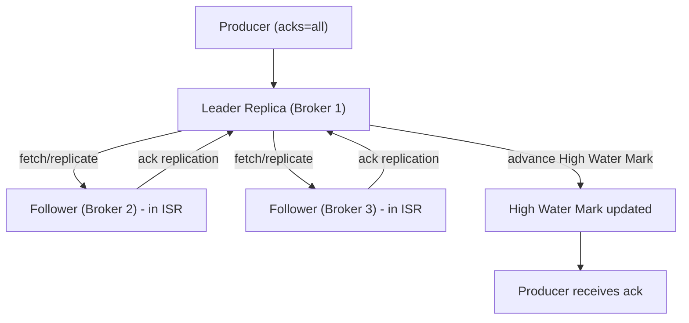
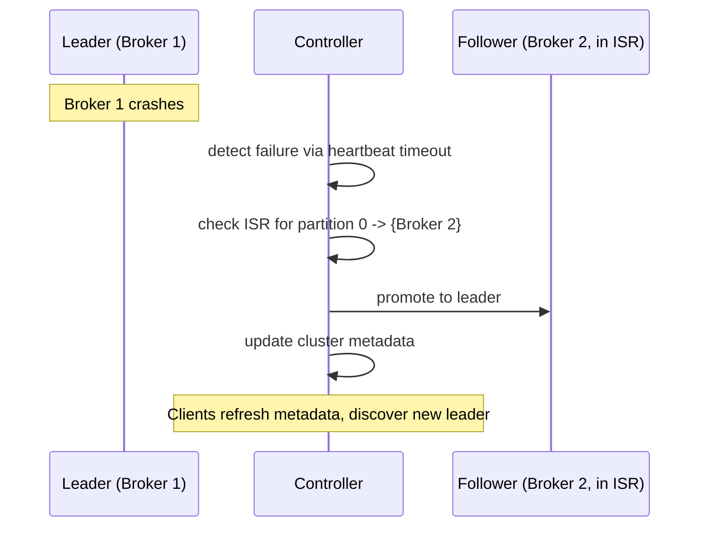
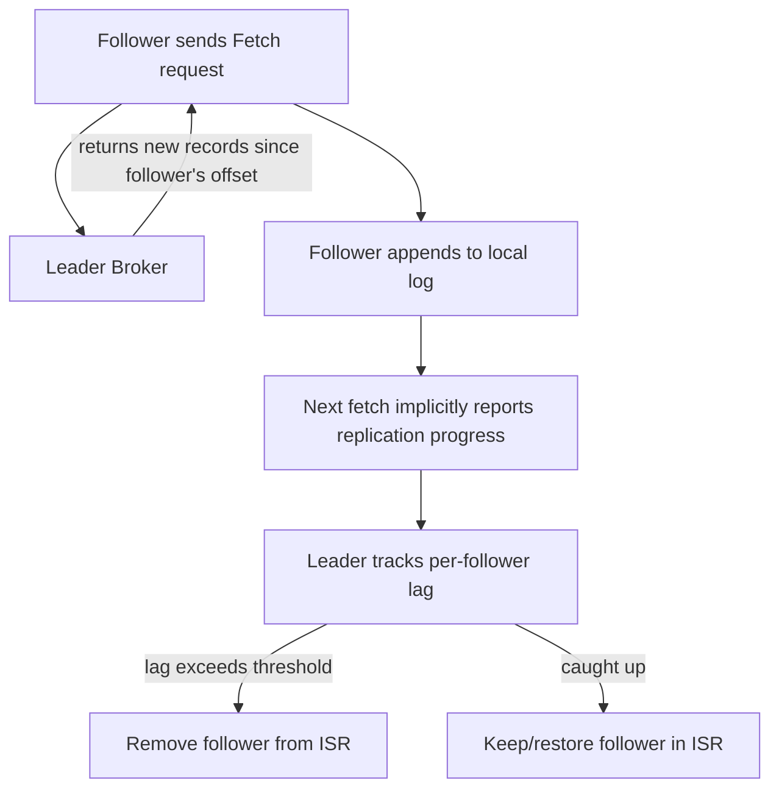
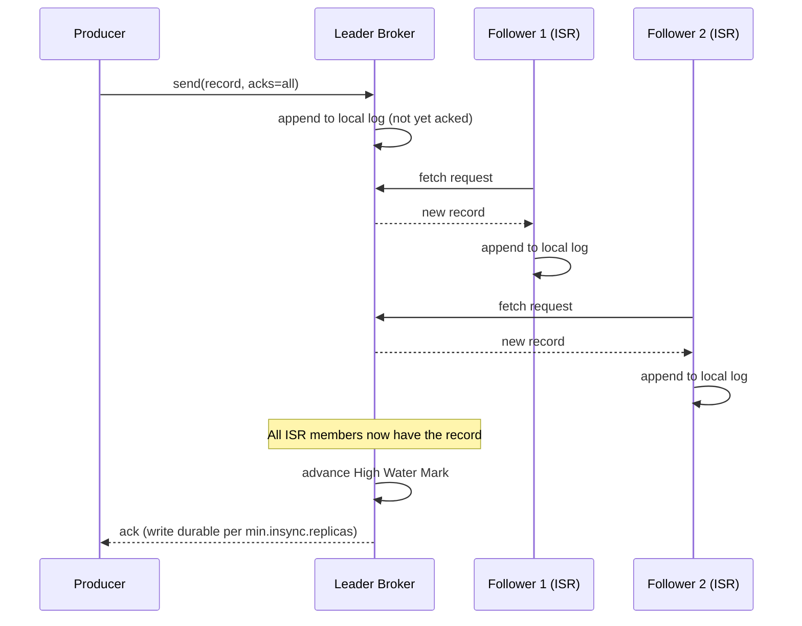

# Module 9 — Replication

**Level:** ⭐⭐ Beginner → Intermediate
**Track:** Kafka Complete Masterclass for Node.js Backend Engineers
**Module:** 9 of 25

---

## 1. Introduction

Every module so far has quietly assumed the data you write to Kafka survives. This module makes that assumption explicit and earns it: how leader/follower replication actually works, what the ISR really guarantees (and doesn't), how failover happens when a broker dies, and the exact configuration knobs (`replication.factor`, `min.insync.replicas`, `acks`) that determine whether your system loses data during a real production failure.

If Module 3 introduced leaders, followers, and ISR as vocabulary, this module is where you learn to reason about them under failure — the difference between knowing the words and knowing what happens when Broker 2 catches fire at 3 AM.

---

## 2. Learning Objectives

By the end of this module, you will be able to:

1. Explain precisely how a follower replica stays in sync with a leader.
2. Explain what the ISR is, how replicas enter and leave it, and why that matters for safety.
3. Explain exactly what happens, step by step, when a partition's leader broker crashes.
4. Reason correctly about the interaction between `replication.factor`, `min.insync.replicas`, and `acks`.
5. Identify and diagnose common replication failure modes (under-replicated partitions, unclean leader election, split-brain risk).
6. Configure topics and producers for the durability guarantees a given use case actually requires.

---

## 3. Why This Concept Exists

A single copy of your data is a single point of failure — no matter how good your disks are, hardware dies, processes crash, and networks partition. Replication exists to answer one core question: **"If the machine holding my data disappears right now, do I lose anything?"**

Kafka's answer is to maintain multiple copies (replicas) of every partition across different brokers, with one replica designated the **leader** (handling all reads/writes) and the rest as **followers** (passively replicating). The hard engineering problem isn't "keep copies" — it's *knowing which copies are safe to promote* when the leader disappears, without silently losing acknowledged data or corrupting ordering. That's what the ISR mechanism and the controller's failover logic solve.

---

## 4. Problem Statement

Consider the `orders` topic in production, with replication factor 3 across a 3-broker cluster:

1. Broker 2 (leader for partition 0) suddenly loses power. Is any acknowledged data lost? How quickly does the system recover, and who decides the new leader?
2. A follower replica has been slow to replicate for the last 10 minutes due to a disk I/O issue. If the leader crashes right now, is it safe to promote that lagging follower?
3. Your topic has `replication.factor=3`, but `min.insync.replicas=1`. During a partial network partition, could you lose data even though you technically have 3 copies?
4. After a broker comes back online following a crash, how does it "catch up" without re-copying the entire log from scratch?

Each of these questions has a precise, mechanical answer rooted in how Kafka's replication protocol actually works — not folklore, not "just use replication factor 3 and you're safe."

---

## 5. Real-World Analogy

### Analogy: A Relay of Scribes Copying a Master Ledger

Imagine a medieval monastery where one scribe (the leader) is the only one allowed to write new entries into the official ledger. Several other scribes (followers) sit nearby, each copying every new entry into their own private ledger, as fast as they can, immediately after the master scribe writes it.

At any moment, some copying scribes are perfectly caught up (**in the ISR**) — every entry the master has written, they've also written. Others might have wandered off, fallen behind, or their candle burned out (**fallen out of the ISR**) — their ledgers are stale.

If the master scribe suddenly collapses, the monastery's overseer (**the controller**) does *not* pick just any scribe to take over — only one whose ledger is **fully caught up** (in the ISR) is trusted to become the new master. Promoting a scribe with a stale ledger would mean silently losing the most recent entries — which is exactly the disaster replication exists to prevent.

---

## 6. Technical Definition

- **Replication Factor**: The total number of copies of a partition maintained across the cluster (1 leader + N-1 followers).
- **Leader Replica**: The single replica for a partition that handles all client reads and writes at any given time.
- **Follower Replica**: A replica that continuously fetches (replicates) records from the leader, staying as close to real-time as possible, but never serves client reads or writes directly (in standard Kafka; some setups allow follower fetching for geo-locality, a distinct advanced feature).
- **Replica Lag**: How far behind a follower is from the leader, measured both in terms of missing records and elapsed time since it last fully caught up.
- **ISR (In-Sync Replicas)**: The subset of a partition's replicas (always including the current leader) that are considered fully caught up, per the broker config `replica.lag.time.max.ms` — the *only* replicas eligible for leader promotion during a failover.
- **`min.insync.replicas`**: A topic/broker configuration specifying the minimum number of replicas in the ISR that must acknowledge a write for it to succeed when the producer uses `acks=all`.
- **Unclean Leader Election**: Promoting a replica that is **not** in the ISR (i.e., known to be behind) to leader — an explicit, opt-in trade-off of availability over consistency, disabled by default in modern Kafka.
- **High Water Mark (HWM)**: The highest offset that has been successfully replicated to *all* replicas currently in the ISR — consumers can only read up to this offset, ensuring they never see data that could still be lost if the leader failed.

---

## 7. Internal Working

### How a follower actually replicates

```
1. Follower broker sends a Fetch request to the leader broker for a
   given partition — structurally the SAME type of request a consumer
   sends (followers are, mechanically, a special kind of "consumer" of
   the leader's log)

2. Leader responds with new records since the follower's last
   fetched offset

3. Follower appends these records to its own local log copy

4. Follower's fetch requests implicitly tell the leader "here is my
   current log-end offset" — the leader uses this to track each
   follower's replication progress

5. If a follower's lag (in time) exceeds replica.lag.time.max.ms,
   the leader removes it from the ISR for that partition
```

### The High Water Mark — why consumers can't read "everything on the leader"

```
Leader's local log:      [0][1][2][3][4][5][6][7]
                                            ▲
                                   latest record written

Follower A (in ISR):     [0][1][2][3][4][5][6]
Follower B (in ISR):     [0][1][2][3][4][5]
                                         ▲
                            High Water Mark = 5
                            (lowest offset replicated to ALL ISR members)

Consumers can only read up to offset 5 — NOT offset 7 — because
offsets 6 and 7 aren't yet safely replicated. If the leader crashed
right now, offsets 6-7 could be lost, so they're not exposed yet.
```

This is a subtle but critical point: **the leader intentionally withholds its very latest writes from consumers** until enough replicas have them, to avoid a consumer ever reading data that later "disappears" after a failover.

### Failover, step by step

```
1. Leader broker for partition 0 crashes (or becomes unreachable)
2. The controller detects this (missed heartbeats / session expiry)
3. The controller looks at partition 0's CURRENT ISR list
4. The controller selects one ISR member (typically the first
   in the preferred replica list that's still in the ISR) as
   the new leader
5. The controller updates cluster metadata: "partition 0's new
   leader is Broker X"
6. This metadata propagates to all brokers, producers, and consumers
7. Producers/consumers automatically discover the new leader via
   a metadata refresh and redirect their requests there
8. The old leader, if it eventually rejoins the cluster, becomes
   a follower of the new leader and must catch up
```

---

## 8. Architecture

```
                          Kafka Cluster (Replication Factor 3)
     ┌─────────────────────────────────────────────────────────────┐
     │                                                                │
     │   Broker 1                Broker 2                Broker 3     │
     │   ┌──────────────┐        ┌──────────────┐        ┌──────────┐ │
     │   │ P0: LEADER   │───────►│ P0: Follower │───────►│P0:Follower│ │
     │   │ [0..7]       │ fetch  │ [0..6]       │ fetch  │ [0..5]    │ │
     │   └──────────────┘        └──────────────┘        └──────────┘ │
     │                                                                │
     │   ISR for P0 = { Broker 1 (leader), Broker 2 }                │
     │   Broker 3 has fallen behind — temporarily OUT of the ISR      │
     │                                                                │
     └─────────────────────────────────────────────────────────────┘
```

---

## 9. Step-by-Step Flow

1. A topic is created with `replicationFactor: 3`. The controller assigns one broker as leader and two as followers for each partition.
2. A producer sends a record with `acks=all`. The leader appends it to its local log.
3. Follower brokers continuously fetch new records from the leader, appending them to their own local logs.
4. Once enough ISR members (per `min.insync.replicas`) have replicated the record, the leader advances the High Water Mark and acknowledges the producer's write.
5. A consumer fetches records — but only up to the High Water Mark, never the leader's absolute latest (unreplicated) offset.
6. If a follower falls too far behind (time-based threshold), the leader removes it from the ISR — it's still replicating, just not "trusted" for failover until it catches up.
7. If the leader broker crashes, the controller promotes an ISR member to be the new leader, and clients transparently redirect to it.
8. The old leader, upon recovery, rejoins as a follower and must catch up to the new leader's log before re-entering the ISR.

---

## 10. Detailed ASCII Diagrams

### 10.1 Normal Replication Flow

```
Producer                Leader (Broker 1)          Follower (Broker 2)
   │  send(acks=all)          │                            │
   ▼                          ▼                            │
   ──────────────────────►  append to log                  │
                              │                             │
                              │◄────── fetch request ───────┤
                              │─────── new records ────────►│
                              │                             ▼
                              │                        append to log
                              │◄──── fetch (ack progress) ──┤
                              │
                    (once ISR members caught up)
                              │
   ◄────────────── ack ───────
```

### 10.2 ISR Shrinking Under Lag

```
Time T0:  ISR = { Broker1 (leader), Broker2, Broker3 }   -- all caught up

Broker3 experiences disk slowdown, stops fetching promptly

Time T1:  Broker3's lag exceeds replica.lag.time.max.ms

Time T1:  ISR = { Broker1 (leader), Broker2 }   -- Broker3 REMOVED

Broker3 keeps trying to replicate in the background, still receiving
data — but is NOT eligible for leader promotion until it rejoins the ISR.
```

### 10.3 Leader Failover Sequence

```
BEFORE:
  Partition 0:  Leader = Broker 1, ISR = {1, 2, 3}

Broker 1 crashes  ──►  Controller detects failure (heartbeat timeout)

Controller checks ISR: {2, 3} remain (1 is gone)
Controller promotes Broker 2 (e.g., first eligible in preferred order)

AFTER:
  Partition 0:  Leader = Broker 2, ISR = {2, 3}

Broker 1 (once it recovers) rejoins as a FOLLOWER of Broker 2,
and must replicate/catch up before being eligible again.
```

### 10.4 The Danger of Unclean Leader Election

```
Partition 0:  Leader = Broker 1 (crashed, unrecoverable)
              ISR = {} (empty — no in-sync follower available!)
              Broker 2 exists but is FAR behind, NOT in ISR

unclean.leader.election.enable = false (default, safe):
   → Partition 0 becomes UNAVAILABLE until Broker 1 recovers
     or an ISR member becomes available. No data loss, but downtime.

unclean.leader.election.enable = true (opt-in, risky):
   → Broker 2 (stale, out-of-date) is promoted to leader anyway
     → ANY records only on Broker 1's log (never replicated to
        Broker 2) are PERMANENTLY LOST
     → Availability is preserved; consistency/durability is not.
```

---

## 11. Mermaid Diagrams





---

## 12. Request Flow Diagram



---

## 13. Sequence Diagram



---

## 14. Kafka Internal Flow

```
1. Producer writes record to leader (subject to acks config)
2. Leader appends record to its local log segment immediately
3. Followers, via their own continuous fetch loop, replicate the
   record to their local logs (this happens whether or not any
   producer is currently waiting on acks=all)
4. Leader tracks the log-end offset each follower has confirmed
5. High Water Mark = min(log-end offset across all current ISR members)
6. Consumers can only fetch records up to the High Water Mark
7. If acks=all, the producer's request completes only once the
   record's offset is <= the newly advanced High Water Mark
8. If a follower's replication falls behind
   replica.lag.time.max.ms, it's removed from the ISR (but keeps
   replicating in the background, and can rejoin once caught up)
```

---

## 15. Producer Perspective

The producer's `acks` setting (Module 4) is inseparable from replication: it's *precisely* the mechanism that ties a producer's durability guarantee to the replication state described in this module.

```javascript
// acks=all only means something because of replication + ISR.
// Without followers, "wait for all ISR members" degenerates to
// "wait for the only replica" — no safety net at all.
await producer.send({
  topic: "orders",
  acks: -1, // wait for all CURRENT in-sync replicas — see Section 21
  messages: [{ key: String(order.id), value: JSON.stringify(order) }],
});
```

If `min.insync.replicas=2` and the ISR shrinks below that (e.g., to 1 during an incident), `acks=all` writes will start failing with `NotEnoughReplicasException` — this is replication's safety mechanism refusing to pretend a write is durable when it can't back that promise up.

---

## 16. Consumer Perspective

Consumers are shielded from almost all replication complexity by design:

- They always read from whichever broker is **currently** the leader for their assigned partition — KafkaJS automatically discovers and redirects to the new leader after a failover.
- They can only ever read up to the High Water Mark — meaning they will **never** see a record that could later vanish due to an unreplicated leader crash.
- A consumer experiences a brief pause (typically sub-second to a few seconds) during an active failover while metadata propagates and the new leader is discovered — this is a normal, expected blip, not a bug.

---

## 17. Broker Perspective

Every broker plays multiple, simultaneous replication roles:

- As a **leader** for some partitions: accepting writes, serving reads, tracking follower progress, computing the High Water Mark.
- As a **follower** for other partitions: continuously fetching and appending, reporting its replication progress implicitly via fetch requests.
- The **controller** (one broker, cluster-wide): watching broker liveness, deciding ISR membership changes, and executing leader promotion during failover.

---

## 18. Node.js Integration

KafkaJS's Admin API can inspect replication state directly — genuinely useful for building health dashboards or pre-flight checks before a risky operation (like a rolling restart).

```javascript
// src/tools/replicationHealth.js
import { Kafka } from "kafkajs";

const kafka = new Kafka({ clientId: "replication-monitor", brokers: ["localhost:9092"] });

async function checkReplicationHealth(topic) {
  const admin = kafka.admin();
  await admin.connect();

  const metadata = await admin.fetchTopicMetadata({ topics: [topic] });

  metadata.topics[0].partitions.forEach((p) => {
    const underReplicated = p.isr.length < p.replicas.length;
    console.log(
      `Partition ${p.partitionId} | Leader: ${p.leader} | Replicas: [${p.replicas}] | ISR: [${p.isr}]` +
        (underReplicated ? "  ⚠️  UNDER-REPLICATED" : "")
    );
  });

  await admin.disconnect();
}

checkReplicationHealth("orders").catch(console.error);
```

---

## 19. KafkaJS Examples

### 19.1 Creating a topic with a safe replication configuration

```javascript
// src/createReplicatedTopic.js
import { Kafka } from "kafkajs";

const kafka = new Kafka({ clientId: "topic-admin", brokers: ["localhost:9092"] });

async function createOrdersTopic() {
  const admin = kafka.admin();
  await admin.connect();

  await admin.createTopics({
    topics: [
      {
        topic: "orders",
        numPartitions: 6,
        replicationFactor: 3, // production-grade — survives 1 broker loss
        configEntries: [
          { name: "min.insync.replicas", value: "2" }, // pairs with acks=all
        ],
      },
    ],
  });

  console.log("Topic 'orders' created with replicationFactor=3, min.insync.replicas=2");
  await admin.disconnect();
}

createOrdersTopic().catch(console.error);
```

### 19.2 Producer that correctly handles `NotEnoughReplicasException`

```javascript
// src/producers/durableOrderProducer.js
import { kafka } from "../config/kafka.js";

const producer = kafka.producer({ idempotent: true });

export async function publishDurableOrderEvent(order) {
  try {
    await producer.send({
      topic: "orders",
      acks: -1, // all ISR members must confirm
      messages: [{ key: String(order.id), value: JSON.stringify(order) }],
    });
  } catch (err) {
    // This specific error means min.insync.replicas could not be
    // satisfied — likely a real cluster health incident, not a bug
    // in your code. Alert loudly; do not silently retry forever.
    if (err.name === "KafkaJSProtocolError" && /NOT_ENOUGH_REPLICAS/i.test(err.message)) {
      console.error("[orders] durability guarantee cannot be met — ISR too small:", err);
    }
    throw err;
  }
}
```

### 19.3 Monitoring ISR shrinkage programmatically

```javascript
// src/tools/isrWatcher.js
import { Kafka } from "kafkajs";

const kafka = new Kafka({ clientId: "isr-watcher", brokers: ["localhost:9092"] });

async function watchIsr(topic, intervalMs = 10000) {
  const admin = kafka.admin();
  await admin.connect();

  setInterval(async () => {
    const metadata = await admin.fetchTopicMetadata({ topics: [topic] });
    metadata.topics[0].partitions.forEach((p) => {
      if (p.isr.length < p.replicas.length) {
        console.warn(
          `[ALERT] Partition ${p.partitionId} is under-replicated: ISR=[${p.isr}] Replicas=[${p.replicas}]`
        );
      }
    });
  }, intervalMs);
}

watchIsr("orders").catch(console.error);
```

### 19.4 Verifying which broker currently leads a partition (post-failover check)

```javascript
// src/tools/whoLeadsPartition.js
import { Kafka } from "kafkajs";

const kafka = new Kafka({ clientId: "leader-check", brokers: ["localhost:9092"] });

async function whoLeadsPartition(topic, partitionId) {
  const admin = kafka.admin();
  await admin.connect();

  const metadata = await admin.fetchTopicMetadata({ topics: [topic] });
  const partition = metadata.topics[0].partitions.find((p) => p.partitionId === partitionId);

  console.log(`Partition ${partitionId} is currently led by broker ${partition.leader}`);
  await admin.disconnect();
}

whoLeadsPartition("orders", 0).catch(console.error);
```

---

## 20. CLI Commands

```bash
# Describe a topic — shows Leader, Replicas, and Isr per partition
kafka-topics.sh --bootstrap-server localhost:9092 --describe --topic orders

# Example output:
# Topic: orders  Partition: 0  Leader: 1  Replicas: 1,2,3  Isr: 1,2,3
# Topic: orders  Partition: 1  Leader: 2  Replicas: 2,3,1  Isr: 2,3

# Show ONLY under-replicated partitions across the whole cluster
kafka-topics.sh --bootstrap-server localhost:9092 --describe --under-replicated-partitions

# Check current min.insync.replicas setting for a topic
kafka-configs.sh --bootstrap-server localhost:9092 \
  --entity-type topics --entity-name orders --describe

# Set/alter min.insync.replicas
kafka-configs.sh --bootstrap-server localhost:9092 \
  --entity-type topics --entity-name orders --alter \
  --add-config min.insync.replicas=2

# Trigger a preferred leader election manually (rebalance leadership
# back to preferred replicas after brokers recover, e.g. post-maintenance)
kafka-leader-election.sh --bootstrap-server localhost:9092 \
  --election-type preferred --all-topic-partitions
```

---

## 21. Configuration Explanation

| Config | Meaning |
|---|---|
| `replication.factor` (topic) | Total number of copies of each partition (leader + followers) |
| `min.insync.replicas` (topic/broker) | Minimum ISR size required for an `acks=all` write to succeed |
| `replica.lag.time.max.ms` (broker) | Max time a follower can lag before being removed from the ISR |
| `unclean.leader.election.enable` (broker/topic) | Whether an out-of-ISR replica can be promoted during an emergency (default `false` — favors consistency over availability) |
| `acks` (producer) | How many replicas must confirm before the producer considers a write successful — directly interacts with `min.insync.replicas` |
| `default.replication.factor` (broker) | Fallback replication factor for auto-created topics (should rarely be relied upon in production) |

### How `acks`, `replication.factor`, and `min.insync.replicas` interact

```
replication.factor = 3       (3 total copies exist)
min.insync.replicas = 2      (at least 2 of those must be "caught up")
acks = all                   (producer waits for min.insync.replicas to confirm)

Result: the system tolerates ONE broker failure (of the 3) with
ZERO data loss and ZERO write rejections, as long as the remaining
2 stay in the ISR. If a SECOND broker also fails (ISR drops to 1,
below min.insync.replicas), acks=all writes start failing loudly
— which is the correct, safe behavior, not a malfunction.
```

---

## 22. Common Mistakes

1. **Setting `replication.factor=3` but leaving `min.insync.replicas=1`.** This means `acks=all` only ever waits for 1 replica in practice — you're paying the latency cost of `acks=all` without getting the durability benefit `min.insync.replicas=2` would provide.
2. **Enabling `unclean.leader.election.enable=true` "for availability"** without understanding that this explicitly trades away durability — appropriate only for specific, deliberately-chosen use cases (e.g., some logging/metrics pipelines), never for financial data.
3. **Assuming replication factor alone guarantees no data loss.** It's `replication.factor` + `min.insync.replicas` + `acks=all` working together — any one missing breaks the guarantee.
4. **Ignoring `UnderReplicatedPartitions` metrics until a second failure causes an outage.** A shrinking ISR is your early warning system — treat it as an active incident, not background noise.
5. **Running a single-broker cluster (or replication factor 1) in production** and being surprised when a broker restart causes data loss or downtime — Module 2 and Module 21 flag this too, but it bears repeating here specifically in the context of replication.

---

## 23. Edge Cases

- **What if a follower is in the ISR, replicates everything, but then the network partitions it from the leader for exactly `replica.lag.time.max.ms`?** It gets removed from the ISR, even though no data was lost — this is a conservative, safety-first mechanism (better to temporarily shrink the ISR than risk promoting a replica whose true state is uncertain).
- **What if ALL replicas for a partition are simultaneously down?** The partition is unavailable until at least one comes back. With `unclean.leader.election.enable=false` (default), Kafka will not promote a stale replica just to restore availability — data safety wins over uptime.
- **What if the leader crashes in the middle of replicating a batch to followers?** Only fully-replicated records (below the High Water Mark) are guaranteed visible after failover; anything still "in flight" to followers at the moment of crash may not survive — this is exactly why `acks=all` waits for confirmation before telling the producer "success."

---

## 24. Performance Considerations

- Higher replication factor increases write amplification (every write must be copied to more brokers) and uses proportionally more disk and network bandwidth — a real, ongoing cost, not just a one-time setup decision.
- `acks=all` adds latency compared to `acks=1`, but in most well-provisioned clusters (good network, reasonable `min.insync.replicas`), this difference is small relative to the durability gained.
- Followers replicating from a leader add continuous background network/disk load to the leader broker — a factor to consider when capacity-planning broker resources (Module 12, Module 21).

---

## 25. Scalability Discussion

- Replication factor doesn't affect consumer parallelism (that's partition count, Module 6) — it's purely a durability/fault-tolerance lever, and can be reasoned about independently.
- As cluster size grows, spreading replica placement across racks/availability zones (rack-awareness) becomes important so that a single infrastructure-level failure (e.g., one rack losing power) doesn't simultaneously take out multiple replicas of the same partition.

---

## 26. Production Best Practices

- Use `replication.factor=3` for anything you can't afford to lose — it's the de facto production standard, tolerating a single broker failure without data loss or downtime.
- Pair it with `min.insync.replicas=2` and `acks=all` for business-critical topics — this specific combination is the standard "safe" trio.
- Keep `unclean.leader.election.enable=false` (the modern default) unless you have a specific, deliberate reason to prioritize availability over consistency for a particular topic.
- Monitor `UnderReplicatedPartitions` and `ActiveControllerCount` continuously (Module 19) — these are your earliest indicators of a developing replication problem.
- Distribute brokers across racks/availability zones where your infrastructure allows, so replicas of the same partition aren't all vulnerable to the same physical failure.

---

## 27. Monitoring & Debugging

- `kafka-topics.sh --describe --under-replicated-partitions` is your single most important replication health command — it should return **nothing** in a healthy cluster.
- Track ISR shrink/expand events over time — frequent shrinking (even if it recovers) often indicates a struggling broker (disk I/O, network, or GC pauses) worth investigating before it becomes a full outage.
- Watch for `NotEnoughReplicasException` in producer logs — a direct signal that `min.insync.replicas` could not be satisfied at write time.

---

## 28. Security Considerations

- Replication traffic between brokers can and should be encrypted with TLS in production, using a separate inter-broker listener from client traffic (Module 20 covers listener configuration in depth).
- Broker-to-broker authentication (mutual TLS or SASL) prevents an unauthorized process from posing as a broker and joining the replication topology.

---

## 29. Interview Questions (Easy → Medium → Hard)

### Easy

1. What is a leader replica? What is a follower replica?
2. What does replication factor control?
3. What is the ISR?

### Medium

4. What is the High Water Mark, and why can't consumers read past it?
5. What happens to a follower that falls too far behind the leader?
6. How do `acks`, `replication.factor`, and `min.insync.replicas` work together to define a durability guarantee?
7. What is unclean leader election, and why is it disabled by default?

### Hard

8. Walk through, step by step, exactly what happens from the moment a partition's leader broker crashes to the moment a producer successfully resumes writing to that partition.
9. Explain why a follower can be "alive" and actively replicating, yet still be excluded from the ISR — and why this is the correct, safe behavior.
10. A topic has `replication.factor=3` and `min.insync.replicas=1`. Explain a concrete failure scenario where data is lost despite having 3 copies of it.
11. Explain precisely why the leader withholds its most recent, not-yet-fully-replicated writes from consumers, using the High Water Mark mechanism.

---

## 30. Common Interview Traps

- **Trap:** "Replication factor 3 means we can survive any 2 broker failures." → **Reality:** You can survive failures only as long as enough replicas remain in the ISR to satisfy `min.insync.replicas`; losing 2 of 3 replicas can leave you below that threshold, causing write failures or, with unclean election enabled, data loss.
- **Trap:** "Followers can serve consumer reads too, to spread load." → **Reality:** In standard Kafka, only the leader serves client reads and writes; followers exist purely for replication (follower fetching for read locality is a distinct, opt-in advanced feature, not the default model).
- **Trap:** "If a replica is technically not crashed, it's safe to promote." → **Reality:** Only replicas in the *current* ISR are safe to promote without explicit, opt-in unclean leader election — an alive-but-lagging replica is exactly the case ISR tracking is designed to catch.

---

## 31. Summary

- Replication protects against data loss and downtime by maintaining multiple copies of each partition across brokers, with one leader and one or more followers.
- The ISR tracks which replicas are genuinely caught up and therefore safe to promote to leader during a failure.
- The High Water Mark ensures consumers never see data that isn't yet safely replicated.
- `replication.factor`, `min.insync.replicas`, and `acks=all` must work together — any one alone doesn't fully define your durability guarantee.
- Unclean leader election is an explicit, opt-in trade of durability for availability, and should be used deliberately, not by default.

---

## 32. Cheat Sheet

```
REPLICATION — ONE PAGE

Leader     = the one replica handling all reads/writes for a partition
Follower   = passively replicates from the leader (mechanically like a consumer)
ISR        = replicas fully caught up with the leader — the ONLY ones
             eligible for promotion during failover

High Water Mark = highest offset replicated to ALL current ISR members
                  consumers can only read UP TO this point

Durability trio:
  replication.factor   = how many copies exist
  min.insync.replicas  = how many ISR members must confirm a write
  acks=all             = producer waits for min.insync.replicas to confirm

unclean.leader.election.enable = false (default)
  → favors CONSISTENCY: partition goes unavailable rather than
    promoting a stale (out-of-ISR) replica and silently losing data

Golden rule: replication.factor=3 + min.insync.replicas=2 + acks=all
             is the standard production-safe combination
```

---

## 33. Hands-on Exercises

1. On a 3-broker KRaft cluster (from Module 2/3's advanced project), create a topic with `replicationFactor: 3` and confirm via `--describe` that leader and replicas are spread across all 3 brokers.
2. Stop (`docker stop`) the broker currently leading a partition, and observe (`--describe`) how quickly a new leader is elected from the ISR.
3. While that broker is down, produce with `acks=all` and confirm writes still succeed (as long as `min.insync.replicas` is still satisfied by the remaining brokers).
4. Restart the stopped broker and observe it rejoin as a follower, catching up before re-entering the ISR.

---

## 34. Mini Project

**Build:** A Node.js `replication-health-check.js` CLI tool that connects via the Admin API, checks every partition of every topic in the cluster, and prints a clear, color-coded (or emoji-flagged) report of any under-replicated partitions, along with current leader and ISR for each.

---

## 35. Advanced Project

**Build:** A controlled failure-injection test: on your 3-broker cluster, create a topic with `replicationFactor=3` and `min.insync.replicas=2`. Run a continuous producer (`acks=all`) and consumer. Kill the current leader broker mid-stream and measure (a) how long writes are blocked/failed during failover, (b) whether any acknowledged messages are missing on the consumer side afterward, and (c) how long the recovered broker takes to fully rejoin the ISR.

---

## 36. Homework

1. Research what `replica.lag.time.max.ms` defaults to in modern Kafka versions, and explain the trade-off of setting it lower vs. higher.
2. Explain, in your own words, why Kafka chose a single-leader-per-partition model (as opposed to allowing writes to any replica, as some other distributed databases do).
3. Write a short comparison of the durability/availability trade-offs between `min.insync.replicas=1` and `min.insync.replicas=2` on a `replication.factor=3` topic, using concrete failure scenarios.

---

## 37. Additional Reading

- Apache Kafka documentation — "Replication" section under Design
- Apache Kafka documentation — "Replication Configs" (`min.insync.replicas`, `unclean.leader.election.enable`, `replica.lag.time.max.ms`)
- Confluent blog: "Hands-free Kafka Replication" — a deep dive into ISR and failover mechanics

---

## Key Takeaways

- Replication maintains multiple copies of each partition; only ISR members are safe to promote to leader.
- The High Water Mark ensures consumers never see data that isn't durably replicated yet.
- True durability requires `replication.factor`, `min.insync.replicas`, and `acks=all` to work together — no single setting is sufficient alone.
- Unclean leader election trades durability for availability, and is disabled by default for good reason.
- Monitoring ISR health and under-replicated partitions is essential, ongoing production practice, not a one-time setup task.

---

## Revision Notes

- Be able to explain, step by step, exactly what happens when a leader broker crashes — from detection to client redirection.
- Memorize the "durability trio": `replication.factor` + `min.insync.replicas` + `acks=all`.
- Understand precisely why the High Water Mark exists and what it protects against.

---

## One-Page Cheat Sheet

*(See Section 32 above.)*

---

## 20 Practice Questions

1. What is a leader replica?
2. What is a follower replica?
3. What does replication factor control?
4. What is the ISR?
5. What does it mean for a replica to be "in-sync"?
6. What causes a follower to be removed from the ISR?
7. What is the High Water Mark?
8. Why can't consumers read past the High Water Mark?
9. What does `min.insync.replicas` control?
10. What happens if `acks=all` but the ISR is smaller than `min.insync.replicas`?
11. What is unclean leader election?
12. Why is unclean leader election disabled by default?
13. Who decides which replica becomes the new leader during a failover?
14. Do followers serve consumer read requests in standard Kafka?
15. What CLI command shows under-replicated partitions?
16. What happens to a crashed leader's data if it later recovers?
17. What's the difference between replication factor and partition count?
18. What broker config controls how long a follower can lag before being removed from the ISR?
19. Can a partition become unavailable even with replication factor 3? Under what circumstance?
20. Why is replicating to a majority of replicas not required, unlike some other systems (Kafka uses ISR-based acknowledgment instead)?

---

## 10 Scenario-Based Questions

1. Your `payments` topic has `replication.factor=3` and `min.insync.replicas=2`. One broker goes down for scheduled maintenance. Explain exactly what happens to producers and consumers during and after this event.
2. A follower has been out of the ISR for 20 minutes due to a slow disk. The leader then crashes. Walk through what happens next, and whether any data is at risk.
3. Your monitoring shows `UnderReplicatedPartitions > 0` for the last 2 hours, but no alerts have fired for actual downtime. What would you investigate, and why is this still urgent?
4. A teammate proposes enabling `unclean.leader.election.enable=true` cluster-wide to "reduce downtime during incidents." What would you push back on, and for which topics might it actually be acceptable?
5. Your cluster has `replication.factor=3`, but a teammate discovers `min.insync.replicas` was never explicitly set and defaults to 1. What's the practical impact on your `acks=all` producers?
6. During a network partition, 2 of 3 brokers hosting a partition's replicas become unreachable from the leader (but are still alive and reachable by clients). Explain what happens to the ISR and to producer writes.
7. A broker that was down for 3 days rejoins the cluster. Is it immediately back in the ISR for the partitions it used to replicate? Explain the catch-up process.
8. Your team is deciding between `replication.factor=2` and `replication.factor=3` for a new topic, given cost constraints. What would you advise, and what specific failure scenario would you use to justify it?
9. A consumer reports seeing a message that later "disappeared" after a broker failover. Given what you know about the High Water Mark, is this expected Kafka behavior, or a sign of misconfiguration?
10. Explain to a non-technical stakeholder why "3 copies of the data" doesn't automatically mean "we can never lose data no matter what," using plain language.

---

## 5 Coding Assignments

1. Write a script using `admin.fetchTopicMetadata()` that flags any partition where `isr.length < replicas.length`, printing a clear warning with topic and partition number.
2. Build a small Express endpoint `/health/replication` that returns `503` if any topic in the cluster has an under-replicated partition, and `200` otherwise.
3. Write a script that, given a topic name, prints a formatted table of every partition's leader, replica list, and ISR list, highlighting (in the console output) any partition where they differ.
4. Implement a producer wrapper that catches `NotEnoughReplicasException` specifically, logs a structured "durability incident" event, and re-throws — distinguishing this from generic send failures.
5. Write a monitoring script that polls replication state every 15 seconds and tracks (in memory) how many times a given partition's ISR has shrunk over the last hour, printing a summary report.

---

## Suggested Next Module

**Module 10 — Delivery Guarantees**
With replication and failover fully understood, the next module addresses the question replication makes possible to answer precisely: what does "at most once," "at least once," and "exactly once" delivery actually mean in Kafka, and how do producer/consumer/broker configuration choices determine which guarantee your system actually gets?
