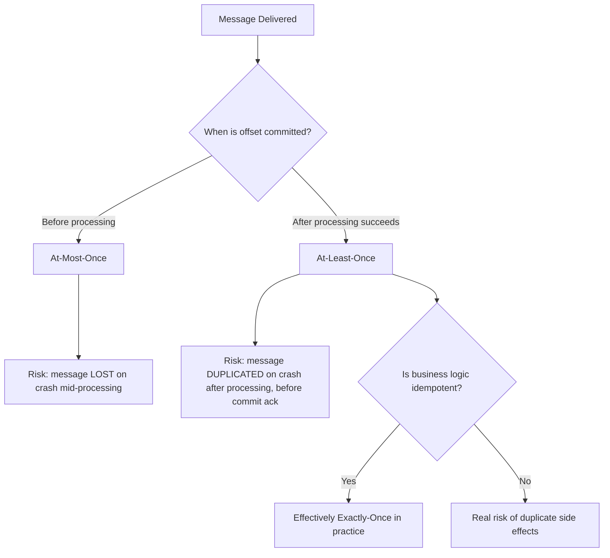
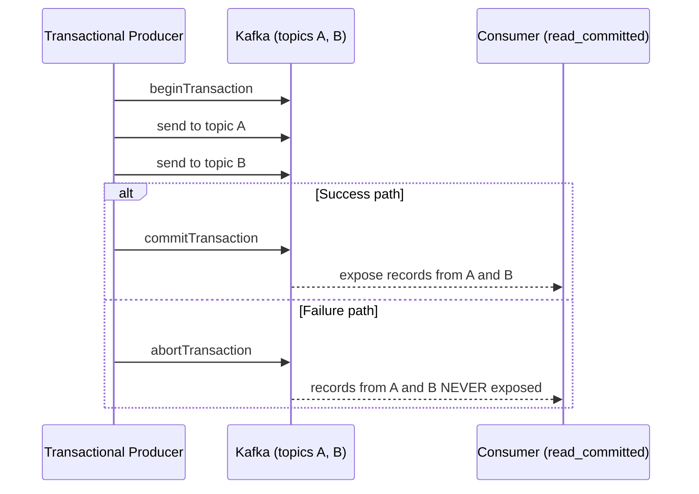
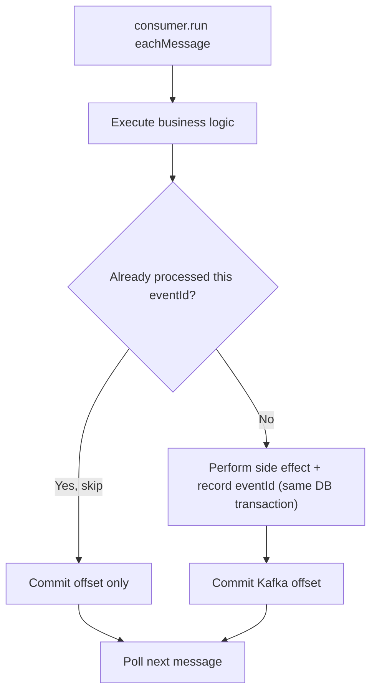
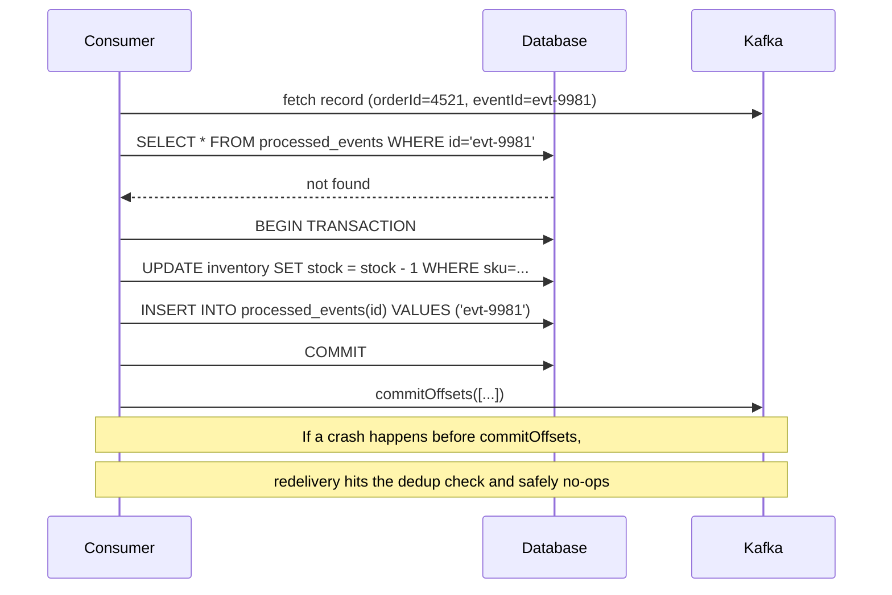

# Module 10 — Delivery Guarantees

**Level:** ⭐⭐⭐ Intermediate
**Track:** Kafka Complete Masterclass for Node.js Backend Engineers
**Module:** 10 of 25

---

## 1. Introduction

"Exactly-once" is one of the most misused phrases in all of distributed systems — and Kafka interviews love to probe exactly how well you actually understand it. Modules 4, 5, and 9 each touched a piece of this puzzle: producer retries and idempotence, consumer commit timing, and replication's durability guarantees. This module assembles those pieces into a precise, end-to-end answer: what **at-most-once**, **at-least-once**, and **exactly-once** actually mean, where each one comes from, and how to deliberately choose (and correctly implement) the right one for a given system.

This is the module where "it depends on your commit strategy" stops being a vague answer and becomes something you can prove, step by step, with a timeline diagram.

---

## 2. Learning Objectives

By the end of this module, you will be able to:

1. Precisely define at-most-once, at-least-once, and exactly-once delivery semantics.
2. Explain exactly which producer and consumer configuration choices produce each guarantee.
3. Explain why "exactly-once" from Kafka's perspective (idempotent producer + transactions) is not automatically "exactly-once" for your business logic's side effects.
4. Implement idempotent consumer logic to safely handle at-least-once redelivery.
5. Reason correctly about transactional (`read_committed`) consumption across producer transactions.
6. Choose the correct delivery guarantee for a given real-world use case and justify the trade-off.

---

## 3. Why This Concept Exists

Every distributed message delivery system faces an unavoidable fact: **a network can fail at literally any point** — before a message arrives, while it's being processed, or after processing but before an acknowledgment is confirmed. There is no way to eliminate this uncertainty; there is only a choice of *which side of the uncertainty you fail toward*.

Delivery guarantees exist to make that choice explicit and controllable, rather than accidental:

- Do you prefer to **never process a message twice**, even if that means occasionally missing one entirely (at-most-once)?
- Do you prefer to **never miss a message**, even if that means occasionally processing one twice (at-least-once)?
- Or do you need the harder, narrower guarantee that a message is processed **exactly once**, which requires additional coordination (idempotent producers, transactions, and/or idempotent consumer logic)?

---

## 4. Problem Statement

Consider the Inventory Service consuming `OrderPlaced` events and reducing stock:

1. If the consumer reduces stock, then crashes **before** committing its offset, will it reprocess that event on restart? Will stock be reduced twice?
2. If the consumer commits its offset **before** finishing the stock reduction (e.g., via auto-commit's timer), and then crashes, will that order's stock reduction be silently skipped?
3. If a producer retries a send due to a network timeout, but the original send actually succeeded, will the `orders` topic end up with a duplicate `OrderPlaced` event?
4. If you need to publish to `orders` AND update a `payments-ledger` topic such that a consumer never sees one without the other, how do transactions solve this specific problem?

Each of these maps to a specific, well-defined combination of producer/consumer configuration covered in this module.

---

## 5. Real-World Analogy

### Analogy: Certified Mail with a Signature

- **At-most-once** is like dropping a letter in a mailbox with no tracking at all — if it's lost in transit, you'll never know, and you won't resend it. Fast, simple, but silent failure is possible.
- **At-least-once** is like using certified mail: if you don't get a delivery confirmation within a reasonable time, you assume it was lost and **resend an identical copy**. The recipient might occasionally get two copies of the same letter (if the confirmation was delayed, not lost) — but they'll never simply *not* receive it.
- **Exactly-once** is like certified mail **plus** the recipient's mailroom keeping a log of tracking numbers it's already received, and discarding any duplicate before it ever reaches the recipient's desk — so even though the postal system might deliver two copies, the recipient's *process* only ever acts on one.

Kafka's idempotent producer prevents duplicate *sends*; your consumer-side idempotency (or Kafka transactions) prevents duplicate *processing*. Both pieces matter for the mailroom analogy to fully hold.

---

## 6. Technical Definition

- **At-Most-Once Delivery**: A message is delivered zero or one times — never more. Achieved by committing the consumer offset **before** processing completes. Risk: message loss if a crash occurs after commit but before processing finishes.
- **At-Least-Once Delivery**: A message is delivered one or more times — never zero. Achieved by committing the consumer offset **only after** processing completes successfully. Risk: duplicate processing if a crash occurs after processing but before the commit is acknowledged.
- **Exactly-Once Semantics (EOS)**: A message's effect is applied precisely once, even in the presence of retries, crashes, and redeliveries. In Kafka, this requires combining:
  - **Idempotent producer** (Module 4) — prevents duplicate *writes* from producer-side retries.
  - **Transactions** (Module 4) — allow atomic multi-partition/multi-topic writes, visible to consumers as all-or-nothing.
  - **Consumer-side idempotency or transactional consume-process-produce loops** — because Kafka's exactly-once guarantee, by itself, only covers Kafka-to-Kafka data flow (e.g., Kafka Streams); it does **not** automatically make an external side effect (like a database write or an API call) exactly-once.
- **Idempotent Consumer**: A consumer designed so that processing the same message multiple times produces the same end result as processing it once (e.g., via a deduplication check, or a naturally idempotent operation like "set stock to X" rather than "decrement stock by 1").
- **`isolation.level`**: A consumer configuration (`read_uncommitted` default, or `read_committed`) controlling whether a consumer sees writes from an aborted/in-progress producer transaction.

---

## 7. Internal Working

### At-most-once timeline

```
1. consumer.run({ autoCommit: true, autoCommitInterval: 1000 })
2. Offset committed to __consumer_offsets (via background timer)
3. eachMessage business logic begins executing
4. CRASH occurs mid-processing
5. On restart, consumer resumes from the COMMITTED offset — which
   is already PAST this message
   → Message is never reprocessed → effectively skipped/lost
```

### At-least-once timeline

```
1. consumer.run({ autoCommit: false })
2. eachMessage business logic executes and completes successfully
3. consumer.commitOffsets([...]) called explicitly, AFTER success
4. CRASH occurs between step 2 completing and step 3's ack
   being durably recorded
5. On restart, consumer resumes from the LAST COMMITTED offset —
   which is BEFORE this message
   → Message is reprocessed → business logic runs a 2nd time
   → Safe ONLY IF processing is idempotent
```

### Why Kafka's own "exactly-once" doesn't automatically cover your database

```
Kafka's idempotent producer + transactions guarantee:
   "This exact record will appear in this Kafka topic exactly once,
    even if the producer retries or the consumer group rebalances
    mid-transaction."

This guarantee does NOT extend to:
   "Your database write, email send, or external API call triggered
    by processing that record will also happen exactly once."

Why: the moment your eachMessage callback calls an EXTERNAL system
(a Postgres UPDATE, a Stripe charge, an SMTP send), that system has
NO knowledge of Kafka offsets or transactions. If your consumer
crashes between "the DB write succeeded" and "the offset commit
succeeded," Kafka will redeliver the message — and your DB write
will run again, UNLESS you've made the DB write itself idempotent
(e.g. via a unique constraint on an eventId, or an UPSERT keyed by
orderId rather than an unconditional "decrement stock" operation).
```

---

## 8. Architecture

```
                     Producer Side                          Consumer Side
     ┌───────────────────────────────────┐    ┌───────────────────────────────────┐
     │ enableIdempotence: true             │    │ autoCommit: false                  │
     │  → prevents duplicate WRITES         │    │  → commit AFTER processing         │
     │    from producer retries             │    │    → prevents SKIPPED messages     │
     │                                       │    │                                     │
     │ transactionalId + producer.transaction│    │ Idempotent business logic          │
     │  → atomic multi-topic writes,         │    │  → prevents DUPLICATE side effects │
     │    all-or-nothing visibility          │    │    from redelivered messages       │
     └───────────────────────────────────┘    └───────────────────────────────────┘
                        │                                        │
                        └──────────────► Kafka Topic ◄───────────┘
                                  (durable, replicated — Module 9)
```

---

## 9. Step-by-Step Flow

### At-least-once consumer flow (the recommended default for most systems)

1. Consumer fetches a batch of records from its assigned partition.
2. For each record, `eachMessage` runs the actual business logic (e.g., reduce stock in a database).
3. Only **after** that logic completes successfully does the consumer call `commitOffsets()`.
4. If the process crashes at any point before step 3 completes, the message will be redelivered on restart.
5. Because business logic is written idempotently (Section 19.2), redelivery is safe — the end state is correct regardless of whether the message was processed once or twice.

### Exactly-once (transactional) producer→consumer flow

1. A producer begins a transaction (`producer.transaction()`).
2. It sends records to one or more topics within that transaction.
3. It commits the transaction — Kafka marks all those records as part of a single atomic unit.
4. A consumer configured with `isolation.level: read_committed` will **never** see the records from an aborted or still-in-progress transaction — only fully committed ones.
5. If the producer aborts the transaction instead (e.g., due to an error), `read_committed` consumers see **none** of those records, ever.

---

## 10. Detailed ASCII Diagrams

### 10.1 The Three Guarantees Compared

```
AT-MOST-ONCE                AT-LEAST-ONCE               EXACTLY-ONCE (Kafka-to-Kafka)

commit offset                process message              begin transaction
      │                            │                            │
      ▼                            ▼                            ▼
process message              commit offset               send to topic A
      │                            │                            │
   (CRASH HERE                (CRASH HERE                  send to topic B
    = message                  = message                        │
    LOST)                      DUPLICATED)                 commit transaction
                                                                  │
                                                            (CRASH HERE = txn
                                                             simply aborts,
                                                             consumers see
                                                             NOTHING — still
                                                             correct, not lost
                                                             or duplicated)
```

### 10.2 Idempotent Consumer Logic — Deduplication Table Pattern

```
Incoming event: { eventId: "evt-9981", orderId: 4521, action: "reduceStock" }

Consumer logic:
   1. Check: does "evt-9981" already exist in a processed_events table?
   2. If YES → skip processing entirely, commit offset, move on
   3. If NO  → process the event, THEN insert "evt-9981" into
              processed_events (ideally in the SAME database
              transaction as the business logic change)
   4. Commit Kafka offset

Even if Kafka redelivers evt-9981 a second time, step 1 catches it
BEFORE any duplicate side effect occurs.
```

### 10.3 `read_committed` vs `read_uncommitted`

```
Producer transaction: writes msg A, msg B — then ABORTS

read_uncommitted consumer (default):
   sees msg A and msg B immediately, even though the transaction
   was later aborted — MISLEADING, can process data that's
   "supposed to not exist"

read_committed consumer:
   sees NEITHER msg A nor msg B — waits for a definitive
   commit/abort marker before exposing anything from that
   transaction, ensuring only truly-final data is visible
```

---

## 11. Mermaid Diagrams





---

## 12. Request Flow Diagram



---

## 13. Sequence Diagram



---

## 14. Kafka Internal Flow

```
1. Producer send-side duplicate prevention:
   enableIdempotence assigns (PID, sequence) per message;
   broker discards duplicate sequences from retries (Module 4)

2. Producer transaction (optional, for multi-topic atomicity):
   broker writes a transaction marker (COMMIT or ABORT) to each
   involved partition after all sends succeed or any one fails

3. Consumer-side offset handling:
   the TIMING of commitOffsets() relative to business logic
   completion determines at-most-once vs at-least-once behavior

4. Consumer isolation.level:
   read_committed consumers skip over records associated with
   a transaction that hasn't yet received a COMMIT marker (or
   skip them permanently if an ABORT marker arrives instead)

5. NONE of the above makes an external side effect (DB write,
   API call) exactly-once automatically — that requires explicit
   idempotent design in your own application code
```

---

## 15. Producer Perspective

The producer's contribution to delivery guarantees is entirely about **preventing its own retries from creating duplicates in the topic itself**:

```javascript
// This combination gives you: "this producer will never cause a
// duplicate WRITE to this topic due to its own retry behavior."
const producer = kafka.producer({
  idempotent: true,
  maxInFlightRequests: 5,
});

// This ADDITIONALLY gives you: "writes to MULTIPLE topics/partitions
// either all become visible to read_committed consumers, or none do."
const transactionalProducer = kafka.producer({
  idempotent: true,
  transactionalId: "order-service-tx-1",
});
```

Neither of these, by itself, prevents your *downstream consumer* from processing the same successfully-written message twice — that's a consumer-side responsibility, covered next.

---

## 16. Consumer Perspective

This is where most of the real engineering effort lives. The consumer must decide, deliberately:

1. **When to commit** relative to processing (Module 5) — this determines at-most-once vs. at-least-once.
2. **Whether business logic is naturally idempotent** (e.g., `SET stock = 42` is idempotent; `stock = stock - 1` is not) or needs an explicit deduplication mechanism (Section 10.2).
3. **Whether to use `read_committed`** if consuming from a topic written to transactionally, to avoid seeing data from aborted transactions.

The practical, production-grade default for most systems is: **at-least-once delivery + idempotent consumer logic** — which achieves an *effectively* exactly-once outcome without the added complexity of full Kafka transactions, which are better reserved for genuine Kafka-to-Kafka atomic multi-write scenarios (like Kafka Streams applications).

---

## 17. Broker Perspective

The broker's role in delivery guarantees is largely mechanical:

- It stores committed offsets (Module 8) exactly as instructed by the consumer — it has no opinion about whether that timing is "safe."
- It tracks producer (PID, sequence) pairs to support idempotent writes (Module 4).
- It writes and honors transaction markers (COMMIT/ABORT) so that `read_committed` consumers can correctly filter what they see.
- It does **not**, and cannot, know anything about your application's external side effects (database writes, API calls) — that responsibility never crosses into the broker's domain.

---

## 18. Node.js Integration

### Recommended service structure for idempotent consumption

```
inventory-service/
├── src/
│   ├── config/kafka.js
│   ├── consumers/idempotentInventoryConsumer.js
│   ├── db/processedEvents.js
│   └── server.js
```

---

## 19. KafkaJS Examples

### 19.1 At-most-once (rarely the right default — shown for contrast)

```javascript
// Auto-commit BEFORE processing completes = at-most-once.
// Appropriate ONLY for use cases that tolerate silent message loss
// (e.g., best-effort metrics pings).
const consumer = kafka.consumer({ groupId: "metrics-service" });

await consumer.run({
  autoCommit: true,
  autoCommitInterval: 1000, // may commit BEFORE eachMessage below finishes
  eachMessage: async ({ message }) => {
    await recordMetric(JSON.parse(message.value.toString()));
  },
});
```

### 19.2 At-least-once with idempotent business logic (recommended default)

```javascript
// src/consumers/idempotentInventoryConsumer.js
import { kafka } from "../config/kafka.js";
import { hasProcessed, markProcessed, reduceStockIdempotently } from "../db/processedEvents.js";

const consumer = kafka.consumer({ groupId: "inventory-service" });

export async function startIdempotentInventoryConsumer() {
  await consumer.connect();
  await consumer.subscribe({ topic: "orders", fromBeginning: false });

  await consumer.run({
    autoCommit: false,
    eachMessage: async ({ topic, partition, message }) => {
      const event = JSON.parse(message.value.toString());

      // 1. Deduplication check FIRST — cheap, avoids reprocessing entirely
      const alreadyDone = await hasProcessed(event.eventId);
      if (alreadyDone) {
        console.log(`[inventory] skipping already-processed event ${event.eventId}`);
      } else {
        // 2. Business logic + dedup marker in the SAME database transaction,
        //    so a crash between them can't create a half-applied state.
        await reduceStockIdempotently(event);
        await markProcessed(event.eventId);
      }

      // 3. Commit Kafka offset only after the above is durably done.
      await consumer.commitOffsets([
        { topic, partition, offset: (Number(message.offset) + 1).toString() },
      ]);
    },
  });
}
```

```javascript
// src/db/processedEvents.js
// Example using a hypothetical DB client with transaction support.
export async function hasProcessed(eventId) {
  const row = await db.query("SELECT 1 FROM processed_events WHERE id = $1", [eventId]);
  return row.rowCount > 0;
}

export async function reduceStockIdempotently(event) {
  // Prefer a SET-based update over an unconditional decrement where
  // possible; if a decrement is unavoidable, the eventId dedup check
  // above is what actually prevents double-application.
  await db.query(
    "UPDATE inventory SET stock = stock - $1 WHERE sku = $2",
    [event.quantity, event.sku]
  );
}

export async function markProcessed(eventId) {
  await db.query("INSERT INTO processed_events (id) VALUES ($1) ON CONFLICT DO NOTHING", [
    eventId,
  ]);
}
```

### 19.3 Exactly-once Kafka-to-Kafka: transactional producer + `read_committed` consumer

```javascript
// src/producers/transactionalOrderProducer.js
import { kafka } from "../config/kafka.js";

const producer = kafka.producer({
  idempotent: true,
  transactionalId: "order-service-tx-1",
  maxInFlightRequests: 5,
});

export async function connectTransactionalProducer() {
  await producer.connect();
}

export async function placeOrderAtomically(order, ledgerEntry) {
  const transaction = await producer.transaction();
  try {
    await transaction.send({
      topic: "orders",
      messages: [{ key: String(order.id), value: JSON.stringify(order) }],
    });
    await transaction.send({
      topic: "payments-ledger",
      messages: [{ key: String(order.id), value: JSON.stringify(ledgerEntry) }],
    });
    await transaction.commit();
  } catch (err) {
    await transaction.abort();
    throw err;
  }
}
```

```javascript
// src/consumers/readCommittedConsumer.js
import { kafka } from "../config/kafka.js";

// isolation.level equivalent in KafkaJS: readUncommitted defaults to
// false, meaning read_committed behavior is already the default for
// KafkaJS consumers — but it's worth setting explicitly for clarity
// and for parity with other Kafka clients where the default may differ.
const consumer = kafka.consumer({
  groupId: "payments-ledger-reader",
  readUncommitted: false, // i.e., isolation.level = read_committed
});

export async function startReadCommittedConsumer() {
  await consumer.connect();
  await consumer.subscribe({ topic: "payments-ledger", fromBeginning: false });

  await consumer.run({
    eachMessage: async ({ message }) => {
      // Guaranteed: this message is from a FULLY COMMITTED transaction.
      console.log("Committed ledger entry:", JSON.parse(message.value.toString()));
    },
  });
}
```

### 19.4 A simple in-memory dedup check (for learning/demo purposes only)

```javascript
// NOT production-safe across restarts (in-memory only) — useful for
// exercises and quick prototyping before wiring up a real DB-backed
// processed_events table.
const seenEventIds = new Set();

export async function eachMessageWithMemoryDedup({ message }) {
  const event = JSON.parse(message.value.toString());
  if (seenEventIds.has(event.eventId)) {
    console.log(`Skipping duplicate ${event.eventId}`);
    return;
  }
  seenEventIds.add(event.eventId);
  // ... process event
}
```

---

## 20. CLI Commands

```bash
# Inspect a consumer group's current commit behavior/lag (Module 8)
kafka-consumer-groups.sh --bootstrap-server localhost:9092 \
  --describe --group inventory-service

# Verify a topic's transaction-related config (relevant for exactly-once)
kafka-configs.sh --bootstrap-server localhost:9092 \
  --entity-type topics --entity-name payments-ledger --describe

# Produce/consume with transaction awareness using the console tools
# (illustrative — most transactional testing is done via client code)
kafka-console-consumer.sh --bootstrap-server localhost:9092 \
  --topic payments-ledger --isolation-level read_committed --from-beginning
```

---

## 21. Configuration Explanation

| Config | Meaning |
|---|---|
| `autoCommit` (consumer) | `true` risks at-most-once (commit may precede processing completion); `false` + manual commit-after-success enables at-least-once |
| `enableIdempotence` / `idempotent` (producer) | Prevents duplicate *writes* from producer retries |
| `transactionalId` (producer) | Enables atomic multi-topic/multi-partition writes |
| `isolation.level` / `readUncommitted` (consumer) | Controls whether a consumer sees writes from uncommitted/aborted transactions |
| Deduplication store (application-level) | Not a Kafka config at all — an application-owned table/cache tracking processed `eventId`s, essential for true exactly-once *effect* |

---

## 22. Common Mistakes

1. **Believing "idempotent producer" makes your whole system exactly-once.** It only prevents duplicate *writes from producer retries* — it says nothing about consumer-side redelivery or your database's behavior.
2. **Using auto-commit for correctness-critical processing.** As shown in Section 10.1, this risks silent message loss, which is often worse than duplication for business-critical events.
3. **Writing non-idempotent side effects** (`stock = stock - 1`) without a deduplication safeguard, then relying purely on "at-least-once" and being surprised by double-processing incidents.
4. **Assuming Kafka transactions cover external systems.** A transaction guarantees atomicity **within Kafka** across topics/partitions — it says nothing about a database write or API call your consumer makes afterward.
5. **Storing the dedup marker in a different transaction than the business logic change.** If they're not atomic together, a crash between them can leave the marker written but the business effect not applied (or vice versa) — reintroducing exactly the bug you were trying to avoid.
6. **Overusing full transactional exactly-once semantics** for simple use cases where at-least-once + idempotent logic would have been simpler and sufficient.

---

## 23. Edge Cases

- **What if a consumer commits an offset, then crashes before actually persisting related state to its own database (reverse of the usual order)?** This is precisely an at-most-once bug hiding inside what looks like an at-least-once setup — always commit the Kafka offset **last**, never first.
- **What if two different consumer instances (during a rebalance) briefly both think they own the same partition?** Kafka's group protocol (Module 7) is designed to prevent this in the steady state, but a slow-to-revoke consumer during a rebalance transition is a known edge case — cooperative rebalancing and short processing times reduce this window.
- **What if your deduplication table itself grows unbounded?** In production, `processed_events` records typically need a retention/cleanup policy (e.g., delete entries older than your topic's retention period, since redelivery beyond that window is impossible anyway).

---

## 24. Performance Considerations

- Idempotent producers add minimal overhead (a sequence number and broker-side check) — there's little reason not to enable it by default.
- Consumer-side deduplication checks (Section 19.2) add a database round-trip per message — for very high-throughput consumers, consider batching these checks or using an in-memory cache with a TTL in front of the durable dedup store.
- Transactions add real coordination overhead (transaction markers, coordinator round-trips) — reserve them for genuine cross-topic atomicity needs, not as a default choice.

---

## 25. Scalability Discussion

- At-least-once + idempotent consumer logic scales well horizontally — each consumer instance's dedup checks are independent and don't require cross-instance coordination beyond what the database/cache already provides.
- Transactional exactly-once pipelines (common in Kafka Streams) introduce additional coordinator load and are typically reserved for stream-processing topologies rather than simple consume-then-call-external-API services.

---

## 26. Production Best Practices

- Default to **at-least-once delivery + idempotent business logic** for the overwhelming majority of production consumers — it's simpler to reason about and operate than full transactional exactly-once, while still achieving a correct, duplicate-safe outcome.
- Always commit Kafka offsets **last**, after all side effects (including dedup marker writes) are durably applied.
- Make your deduplication marker write and your business logic change part of the **same** atomic database transaction wherever possible.
- Reserve Kafka transactions (`transactionalId`, `read_committed`) for genuine atomic multi-topic Kafka writes, not as a substitute for consumer-side idempotency.
- Document, per consumer service, which delivery guarantee it implements and why (Module 24) — this is exactly the kind of detail that saves hours during an incident postmortem.

---

## 27. Monitoring & Debugging

- Track a "duplicate events skipped" counter/metric in consumers using dedup logic — a sudden spike often indicates a rebalance storm or a slow-committing consumer, not a bug in the dedup logic itself.
- Correlate consumer lag (Module 8) with delivery guarantee choice — an at-least-once consumer with a slow, non-idempotent downstream call is a common source of both lag *and* duplicate-processing incidents simultaneously.
- Log every skipped-duplicate event with its `eventId` for traceability during incident investigation.

---

## 28. Security Considerations

- Deduplication stores (e.g., a `processed_events` table) should be access-controlled like any other production data store — an attacker able to delete entries from it could cause replayed events to be reprocessed as if new.
- Transaction IDs (`transactionalId`) should be unique and stable per logical producer instance — reusing them incorrectly across unrelated producers can cause unexpected transaction fencing errors.

---

## 29. Interview Questions (Easy → Medium → Hard)

### Easy

1. What is at-most-once delivery?
2. What is at-least-once delivery?
3. What is exactly-once delivery, in one sentence?

### Medium

4. What consumer commit timing produces at-most-once behavior? What produces at-least-once?
5. Why doesn't an idempotent producer alone guarantee exactly-once processing?
6. What does `isolation.level: read_committed` protect a consumer from?
7. What is an idempotent consumer, and how is it typically implemented?

### Hard

8. Explain, step by step, a scenario where at-least-once delivery combined with non-idempotent business logic causes a real production bug.
9. Why is "exactly-once" achievable within Kafka (Kafka-to-Kafka) but not automatically achievable for a Kafka consumer that calls an external REST API?
10. Design an idempotent consumer for a payment-processing service that must never double-charge a customer, even under redelivery.
11. Compare the operational complexity of "at-least-once + idempotent consumer" vs. "full transactional exactly-once" for a typical microservice, and explain when each is the better choice.

---

## 30. Common Interview Traps

- **Trap:** "Enabling `enableIdempotence: true` on the producer makes my whole pipeline exactly-once." → **Reality:** It only prevents duplicate producer-side writes from retries; consumer-side redelivery and external side effects are untouched by this setting.
- **Trap:** "At-least-once is strictly worse than exactly-once, so always use transactions." → **Reality:** At-least-once + idempotent consumer logic is simpler, cheaper, and sufficient for the vast majority of real systems; full transactional EOS is heavier and best reserved for genuine multi-topic atomicity needs.
- **Trap:** "Committing the offset right after `eachMessage` starts is basically the same as committing after it finishes." → **Reality:** This exact timing difference is the entire distinction between at-most-once and at-least-once — it is not a minor detail.

---

## 31. Summary

- At-most-once risks silent message loss (commit before processing); at-least-once risks duplicate processing (commit after processing) — Kafka lets you choose deliberately via commit timing.
- Idempotent producers prevent duplicate *writes* from retries; they do not make consumer-side processing exactly-once by themselves.
- True exactly-once *effects* on external systems require consumer-side idempotency (deduplication), since Kafka's own exactly-once guarantees only extend to Kafka-to-Kafka data flow.
- Transactions + `read_committed` provide genuine atomicity across multiple Kafka writes, and are the right tool for multi-topic atomic publishing, not a general substitute for consumer idempotency.
- The production-grade default for most systems: at-least-once delivery, paired with deliberately idempotent business logic.

---

## 32. Cheat Sheet

```
DELIVERY GUARANTEES — ONE PAGE

At-most-once:   commit BEFORE processing → risk: message LOST
At-least-once:  commit AFTER processing  → risk: message DUPLICATED
Exactly-once:   Kafka-to-Kafka via idempotent producer + transactions;
                for EXTERNAL effects, requires consumer-side idempotency

Idempotent producer:  no duplicate WRITES from retries (Module 4)
Transactions:         atomic multi-topic writes, read_committed visibility
Idempotent consumer:  dedup check + business logic + marker,
                      atomic together, committed LAST to Kafka

Golden rule: at-least-once + idempotent consumer logic
             = simplest path to a correct, production-safe system
```

---

## 33. Hands-on Exercises

1. Build the at-most-once example (Section 19.1), deliberately crash the process mid-processing, and confirm the message is skipped on restart.
2. Convert it to at-least-once (Section 19.2 without the dedup check) and confirm the message IS reprocessed after a crash — observe the duplicate side effect.
3. Add the dedup check back in and repeat the crash test, confirming the duplicate is now correctly suppressed.
4. Build the transactional producer/consumer pair (Section 19.3), deliberately call `transaction.abort()`, and confirm a `read_committed` consumer never sees those records.

---

## 34. Mini Project

**Build:** An idempotent Inventory Service consumer with a real (or lightweight file/SQLite-based) `processed_events` table, demonstrating that restarting the consumer mid-processing never results in double stock reduction — with a companion script that intentionally replays old offsets to prove the dedup logic holds.

---

## 35. Advanced Project

**Build:** A transactional order-placement pipeline: producer atomically writes to `orders` and `payments-ledger`; a `read_committed` consumer processes `payments-ledger`. Inject a deliberate failure between the two `transaction.send()` calls and confirm, via the consumer, that neither message ever becomes visible — then repeat without the injected failure and confirm both become visible together.

---

## 36. Homework

1. Research how Kafka Streams achieves exactly-once semantics internally, and summarize why it's able to make a stronger guarantee than a typical consume-then-call-an-external-API service.
2. Write a short comparison of idempotency strategies: unique-constraint-based (`INSERT ... ON CONFLICT DO NOTHING`) vs. explicit dedup-table lookup vs. naturally idempotent operations (`SET x = value` instead of `x = x + 1`).
3. Explain, in your own words, why "commit the offset last" is such a consistently repeated rule across this module and Module 5, using a concrete failure scenario as your example.

---

## 37. Additional Reading

- Apache Kafka documentation — "Message Delivery Semantics"
- KIP-98 — Exactly Once Delivery and Transactional Messaging in Kafka
- Confluent blog: "Enabling Exactly-Once in Kafka Streams" (for the Kafka-to-Kafka case)
- Martin Kleppmann, *Designing Data-Intensive Applications* — the chapter on exactly-once semantics in distributed systems, for broader context beyond Kafka specifically

---

## Key Takeaways

- Delivery guarantees are a deliberate engineering choice, not an accident — controlled primarily by consumer commit timing.
- At-most-once risks loss; at-least-once risks duplication; true exactly-once *effects* require consumer-side idempotency even when Kafka's own producer/transaction features are in play.
- Idempotent producers and transactions solve Kafka-internal duplication and atomicity problems — they do not automatically extend to external side effects.
- The pragmatic, widely-used production default is at-least-once delivery with idempotent consumer logic.

---

## Revision Notes

- Be able to draw the at-most-once vs. at-least-once timeline diagrams from memory, with the exact crash point marked.
- Memorize why Kafka's exactly-once guarantee is scoped to Kafka-to-Kafka data flow, not arbitrary external side effects.
- Practice designing an idempotent consumer for at least 2 different hypothetical use cases (payments, inventory) until it feels natural.

---

## One-Page Cheat Sheet

*(See Section 32 above.)*

---

## 20 Practice Questions

1. What is at-most-once delivery?
2. What is at-least-once delivery?
3. What is exactly-once delivery?
4. What consumer commit timing causes at-most-once behavior?
5. What consumer commit timing causes at-least-once behavior?
6. What does an idempotent producer prevent?
7. What does an idempotent producer NOT prevent?
8. What is an idempotent consumer?
9. Name one way to make consumer-side processing idempotent.
10. What does `isolation.level: read_committed` do?
11. What happens to a `read_committed` consumer if a producer transaction is aborted?
12. Is Kafka's exactly-once guarantee automatic for external database writes?
13. What is the risk of committing an offset before processing finishes?
14. What is the risk of committing an offset after processing finishes?
15. Why should the dedup marker write and the business logic change happen in the same transaction?
16. What Kafka producer feature prevents duplicate writes from retries?
17. What Kafka feature allows atomic multi-topic writes?
18. Which delivery guarantee is the common production default, and why?
19. What is a practical downside of using full transactional exactly-once for a simple service?
20. Why must the Kafka offset commit happen LAST in an idempotent consumer design?

---

## 10 Scenario-Based Questions

1. A payment consumer occasionally double-charges customers after a crash-and-restart. Diagnose the likely delivery-guarantee misconfiguration and propose a fix.
2. Your metrics-ingestion consumer occasionally loses data during deploys, but this is considered acceptable. Which delivery guarantee is it likely using, and is that an appropriate choice?
3. A teammate says, "We enabled idempotent producers, so we're exactly-once now." What follow-up questions would you ask to check this claim?
4. You need to publish to two topics atomically and ensure downstream consumers never see a partial write. What Kafka feature would you use, and what consumer-side setting must pair with it?
5. Your dedup table (`processed_events`) grows to hundreds of millions of rows over a year. What operational concern does this raise, and how would you address it?
6. A consumer's business logic performs `stock = stock - quantity`, and duplicate processing has caused inventory drift. Redesign this to be safely idempotent.
7. Your team is deciding between at-least-once + dedup vs. full transactional EOS for a new notification service. What factors would guide this decision?
8. A crash occurs between your consumer's database write and its Kafka offset commit. Walk through what happens on restart and why it's safe (assuming idempotent design).
9. Explain to a junior engineer why "exactly-once" doesn't mean "the message is magically guaranteed to arrive precisely once with zero extra engineering effort."
10. Your `read_committed` consumer seems to be missing some messages that appear in a monitoring tool using `read_uncommitted`. Explain why this discrepancy might be completely expected.

---

## 5 Coding Assignments

1. Implement both an at-most-once and an at-least-once version of the same consumer, and write a test harness that simulates a crash mid-processing to demonstrate the behavioral difference.
2. Build a `processed_events`-backed idempotent consumer using SQLite (or a similar lightweight DB), including a cleanup job that deletes entries older than a configurable retention window.
3. Implement a transactional producer that writes to two topics, with a CLI flag to deliberately abort partway through, and a `read_committed` consumer to verify the all-or-nothing visibility.
4. Write a load test that sends the same message (same `eventId`) 100 times in a row to an idempotent consumer, and assert that the business effect (e.g., a database row) was only applied once.
5. Build a small dashboard endpoint that reports, per consumer group, how many duplicate events have been detected and skipped over the last hour.

---

## Suggested Next Module

**Module 11 — Kafka Internals**
With delivery guarantees now precisely understood, the next module goes underneath all of it — into the log structure, segment files, index files, and the zero-copy, sequential-disk-write design that makes Kafka fast enough to make all of these guarantees practical at scale.
