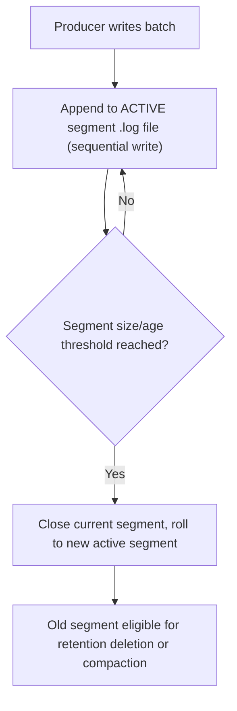
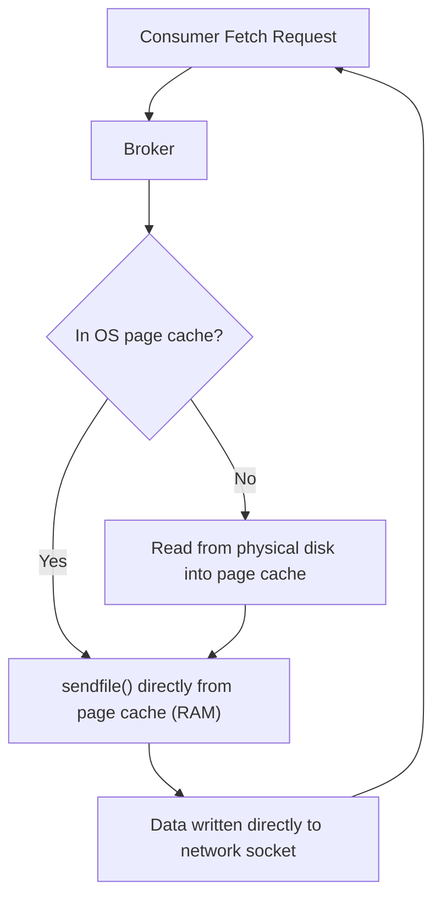
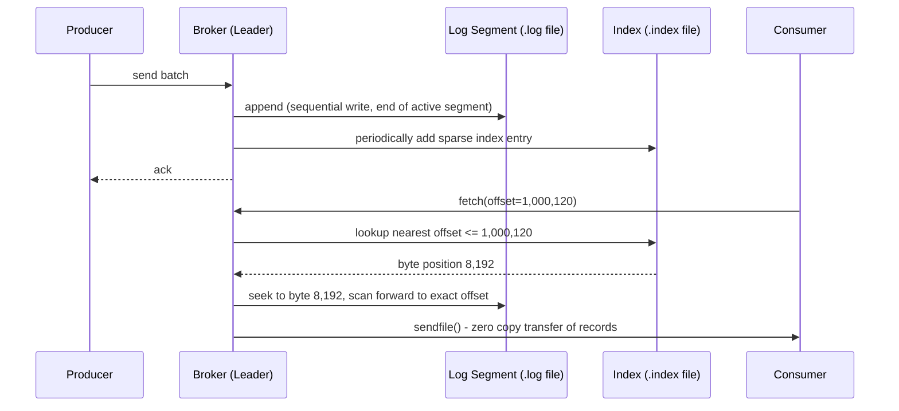

# Module 11 — Kafka Internals

**Level:** ⭐⭐⭐ Intermediate → Advanced
**Track:** Kafka Complete Masterclass for Node.js Backend Engineers
**Module:** 11 of 25

---

## 1. Introduction

Every module so far has treated "the log" as a black box that durably stores your records. This module opens that box. You'll learn exactly how a partition's log is stored on disk (segments, indexes), why Kafka can sustain enormous write throughput on ordinary spinning disks, and the two specific engineering tricks — **sequential disk I/O** and **zero-copy transfer** — that make Kafka dramatically faster than naive designs would predict.

This module is deliberately mechanical and low-level. Understanding it is what separates "I can use Kafka" from "I can explain, in an interview or an incident, *why* Kafka behaves the way it does under load."

---

## 2. Learning Objectives

By the end of this module, you will be able to:

1. Explain how a partition's log is physically broken into segment files on disk.
2. Explain the role of the offset index and time index files, and how they enable fast lookups.
3. Explain why sequential disk writes are dramatically faster than random writes, and how Kafka exploits this.
4. Explain the "zero copy" optimization and why it matters for consumer read throughput.
5. Explain the role of the OS page cache in Kafka's performance model.
6. Reason about log retention, compaction, and segment deletion at a mechanical level.

---

## 3. Why This Concept Exists

Kafka's headline claim — sustained throughput of hundreds of thousands to millions of messages per second per broker, on commodity hardware — sounds implausible until you understand *why* it's achievable. It isn't magic; it's the result of a small number of deliberate architectural decisions that avoid the slow parts of typical I/O and OS behavior:

- **Segmenting the log** exists so old data can be deleted or compacted in bulk (delete a whole file) rather than needing expensive in-place edits to a single, ever-growing file.
- **Index files** exist because sequentially scanning an entire multi-gigabyte segment to find a specific offset would be far too slow — you need a fast way to jump close to the right position.
- **Sequential writes** exist because Kafka's design deliberately avoids ever needing to seek to a random position on disk for writes — the single biggest cost in traditional spinning-disk I/O.
- **Zero copy** exists because, without it, every consumer read would require the OS to copy data between kernel space and user space (and back) multiple times — pure overhead that adds up enormously at scale.

---

## 4. Problem Statement

Consider a broker holding a partition with **50 GB** of retained data, receiving 100,000 writes/second and serving multiple consumer groups reading from various points in the log:

1. How does the broker avoid a single, unmanageably large file for 50 GB of data — and how does it delete the oldest week's worth of data efficiently once retention expires?
2. If a consumer group requests "give me data starting at offset 48,203,991," how does the broker find that position without scanning gigabytes of file from the start?
3. If writes are constantly being appended to disk, how does Kafka avoid the disk-seek overhead that would come from writing to arbitrary, scattered file locations?
4. When a consumer reads a batch of records, how does the broker avoid unnecessarily copying gigabytes of data through multiple memory buffers just to push bytes out over the network?

Each of these has a specific, concrete mechanical answer — segment files, index files, append-only sequential writes, and `sendfile()`-based zero copy, respectively.

---

## 5. Real-World Analogy

### Analogy: A Library's Bound Volumes and Card Catalog

Imagine a library storing an ever-growing multi-volume encyclopedia (a partition's log). Instead of one infinite, continuously-rewritten scroll, the library binds it into **individual volumes** (segment files) — Volume 1 covers entries 1–1,000,000, Volume 2 covers 1,000,001–2,000,000, and so on. When old entries are no longer needed, the library can simply **discard an entire old volume** rather than trying to erase specific pages from a single giant book.

To find a specific entry quickly, the library keeps a **card catalog** (the offset index) — instead of flipping through an entire volume page by page, you look up the card, which tells you roughly which page to start reading from.

Sequential writing is like a scribe who **only ever adds new pages to the end of the current volume**, never flipping back to insert something in the middle — this is far faster than a scribe who has to jump all over a giant book inserting entries in arbitrary places.

Zero copy is like a librarian who, when asked to fax an entire volume to another branch, feeds the **physical pages directly into the fax machine** — instead of first photocopying them, then re-typing the copy into a computer, then printing it out again just to fax it. Fewer unnecessary intermediate copies, dramatically faster overall.

---

## 6. Technical Definition

- **Log Segment**: A single file on disk holding a contiguous range of a partition's records. A partition's full log is composed of one **active segment** (currently being written to) and zero or more **older, closed segments**.
- **Segment Rolling**: The process of closing the current active segment (once it hits a size or time threshold, `log.segment.bytes` / `log.roll.ms`) and starting a new active segment.
- **Offset Index (`.index` file)**: A sparse mapping from record offset to the **byte position** within the corresponding segment file, enabling fast (approximate, then linear-scan-refined) lookups without scanning the whole segment.
- **Time Index (`.timeindex` file)**: A sparse mapping from record timestamp to offset, enabling "give me all records since this timestamp"-style lookups.
- **Sequential Disk I/O**: Writing (or reading) data in the physical order it appears on disk, avoiding the seek-time penalty of random-access I/O — especially significant on spinning HDDs, but still meaningfully beneficial even on SSDs due to filesystem/OS-level efficiencies.
- **Zero-Copy Transfer**: A technique (via the `sendfile()` system call on Linux) that lets the OS transfer data directly from a file on disk to a network socket, without ever copying it into the application's (Kafka broker's) user-space memory.
- **Page Cache**: The operating system's in-memory cache of recently read/written disk blocks — Kafka deliberately relies on this OS-level cache rather than implementing its own separate in-process cache.

---

## 7. Internal Working

### How a partition's log directory looks on disk

```
/var/lib/kafka/data/orders-0/
├── 00000000000000000000.log        <- segment: offsets 0 to ~999,999
├── 00000000000000000000.index      <- offset index for that segment
├── 00000000000000000000.timeindex  <- time index for that segment
├── 00000000000001000000.log        <- segment: offsets 1,000,000+
├── 00000000000001000000.index
├── 00000000000001000000.timeindex
└── leader-epoch-checkpoint
```

Each segment's filename **is** the base offset of its first record — this is what makes locating the right segment for a given offset a fast lookup (binary search over filenames) rather than a scan.

### How an offset lookup actually works

```
Consumer requests: "give me records starting at offset 1,048,203"

1. Broker determines which SEGMENT file could contain this offset
   (the segment whose base offset is <= 1,048,203, and is the
   largest such base offset — found via a quick directory scan
   or cached segment list)

2. Broker consults that segment's .index file — a SPARSE index
   (e.g., one entry every 4KB of log data, not every single record)

3. Broker finds the nearest indexed position <= the target offset,
   giving an approximate BYTE OFFSET into the .log file

4. Broker does a small linear scan forward from that byte position
   within the .log file until it finds the exact target offset

5. Broker begins streaming records from that point onward
```

This "sparse index + short linear scan" design is a deliberate trade-off: a fully dense index (one entry per record) would be large and expensive to maintain; a sparse index gets you *close* almost instantly, and the remaining scan is short and cheap.

### Why sequential writes are so much faster

```
RANDOM WRITES (avoided by Kafka's design)

Disk head:  seek ──► write ──► seek ──► write ──► seek ──► write
            (each seek costs several milliseconds on spinning disks —
             this dominates total time under random access patterns)

SEQUENTIAL WRITES (Kafka's actual pattern — pure append)

Disk head:  write ──► write ──► write ──► write ──► write
            (no seeking between writes — the head simply continues
             from where it left off; this can approach the raw
             sequential throughput of the storage device)
```

### Zero copy, step by step

```
TRADITIONAL read-then-send (WITHOUT zero copy):

  1. Disk ──► kernel buffer                (copy 1: DMA into kernel)
  2. kernel buffer ──► application buffer   (copy 2: kernel to user space)
  3. application buffer ──► kernel socket buffer (copy 3: user space back to kernel)
  4. kernel socket buffer ──► NIC           (copy 4: DMA out to network)

  4 copies total, with 2 context switches between user/kernel space.

ZERO COPY (Kafka's actual approach, via sendfile()):

  1. Disk ──► kernel buffer                 (copy 1: DMA into kernel)
  2. kernel buffer ──► NIC directly          (copy 2: DMA straight out)

  Only 2 copies, the application (Kafka broker process) NEVER
  touches the data directly — the kernel handles the whole transfer.
```

---

## 8. Architecture

```
                    Broker's View of a Single Partition's Log
     ┌───────────────────────────────────────────────────────────┐
     │                                                             │
     │   Segment 1 (closed)     Segment 2 (closed)   Segment 3 (ACTIVE) │
     │   [.log][.index]         [.log][.index]        [.log][.index]    │
     │   offsets 0-999,999      offsets 1M-1,999,999   offsets 2M+       │
     │                                                             │
     └───────────────────────────────────────────────────────────┘
                          │                    │
                 retention/compaction    new writes APPEND here only
                 may delete whole              (sequential I/O)
                 old segment files
```

---

## 9. Step-by-Step Flow

### Write path

1. Producer sends a batch of records to the partition's leader broker.
2. The broker appends the batch to the **active segment's** `.log` file — always at the end (sequential write).
3. Periodically (based on `log.index.interval.bytes`), the broker adds a new sparse entry to the `.index` and `.timeindex` files, mapping the latest offset/timestamp to its byte position.
4. Once the active segment reaches `log.segment.bytes` (size) or `log.roll.ms` (age), it's closed, and a new active segment begins.
5. Old, closed segments become eligible for deletion (based on retention) or compaction (Module 16 preview) once their configured criteria are met.

### Read path

1. A consumer (or follower, Module 9) requests records starting at a specific offset.
2. The broker locates the correct segment file (via base-offset filename matching).
3. The broker uses that segment's sparse `.index` to jump close to the target offset.
4. The broker performs a short linear scan to the exact offset.
5. The broker uses `sendfile()` (zero copy) to transfer the requested byte range directly from the `.log` file on disk (or, more often, from the OS page cache) to the network socket — without copying it into the Kafka broker's own application memory.

---

## 10. Detailed ASCII Diagrams

### 10.1 Segment Rolling Over Time

```
Time T0:  Active segment = 00000000000000000000.log  (writing...)

Segment reaches log.segment.bytes (e.g., 1GB)

Time T1:  00000000000000000000.log  -> CLOSED
          Active segment = 00000000001000000000.log  (new, writing...)

Time T2:  00000000001000000000.log  -> CLOSED
          Active segment = 00000000002000000000.log  (new, writing...)

Only ONE segment is ever being actively written to at a time;
all others are immutable, closed files.
```

### 10.2 Sparse Index Lookup

```
.index file (sparse — NOT one entry per record):

  Offset 1,000,000  →  byte position 0
  Offset 1,000,050  →  byte position 4,096
  Offset 1,000,101  →  byte position 8,192
  Offset 1,000,155  →  byte position 12,288
  ...

Request: find offset 1,000,120

1. Binary search index: closest entry <= 1,000,120 is
   (1,000,101 → byte 8,192)
2. Seek directly to byte 8,192 in the .log file
3. Linear scan FORWARD from there, record by record,
   until offset 1,000,120 is found
   (a short scan — at most ~4KB of data, not gigabytes)
```

### 10.3 Page Cache in the Read Path

```
Consumer requests recent data (still "hot" / recently written)

   Broker checks: is this data in the OS PAGE CACHE (RAM)?
        │
        ├── YES → serve directly from RAM via sendfile()
        │         (extremely fast, no physical disk read needed)
        │
        └── NO  → read from physical disk into page cache first,
                  THEN serve via sendfile()
                  (slower, but now cached for the NEXT read)

Kafka deliberately does NOT maintain its own separate in-JVM cache
for this data — it relies on the OS's already-highly-optimized
page cache, avoiding duplicate caching and extra memory pressure.
```

---

## 11. Mermaid Diagrams




---

## 12. Request Flow Diagram



---

## 13. Sequence Diagram



---

## 14. Kafka Internal Flow

```
1. Batch received from producer, appended to the active segment's
   .log file at its current end-of-file position (pure append,
   no seeking to arbitrary locations)
2. Every log.index.interval.bytes of data written, a new sparse
   entry is added to the corresponding .index and .timeindex files
3. When the active segment reaches log.segment.bytes or log.roll.ms,
   it's closed (becomes immutable) and a new active segment starts
4. On read, the broker locates the correct segment via filename
   (base offset), consults the sparse index to approximate the byte
   position, does a short scan to the exact offset, then uses
   sendfile() to transfer bytes directly from disk/page-cache to
   the requesting socket
5. Old segments are deleted wholesale (by file) once they fall
   outside the retention window, or compacted (Module 16) if the
   topic uses log compaction instead of time/size-based retention
```

---

## 15. Producer Perspective

Producers benefit from this internal design indirectly but significantly: because writes are always sequential appends to whichever segment is currently active, producer-side batching (Module 4) translates almost directly into efficient, low-overhead disk writes on the broker — there's no hidden "sorting" or "placement" cost happening server-side that would offset the benefit of good client-side batching.

---

## 16. Consumer Perspective

Consumers benefit from zero-copy transfer most visibly when reading **recently-produced** data that's still resident in the OS page cache — this is an extremely common case in practice, since most consumers are close to "caught up" (low lag) rather than reading ancient history. Reading far-back historical data (e.g., a full topic replay, Module 8) is more likely to require actual disk reads, since old segments may have been evicted from the page cache — still efficient due to sequential layout, but not quite as fast as a pure RAM-to-network transfer.

---

## 17. Broker Perspective

The broker's core internal responsibilities, viewed through this module's lens:

- Maintain the active segment as a simple append target — never allowing writes to "jump around" within a partition's log.
- Maintain sparse indexes incrementally as data is written, trading a small amount of index-maintenance overhead for dramatically faster future lookups.
- Delegate as much of the actual byte-shuffling work as possible to the OS (page cache, `sendfile()`) rather than reimplementing caching or I/O optimization in the Kafka broker's own (JVM) process — this is a deliberate, foundational design philosophy of Kafka.

---

## 18. Node.js Integration

While the mechanics in this module happen entirely broker-side (you don't control segment files or indexes from a Node.js client), KafkaJS's Admin API lets you inspect log-level configuration that directly affects these internals.

```javascript
// src/tools/inspectLogConfig.js
import { Kafka } from "kafkajs";

const kafka = new Kafka({ clientId: "log-config-inspector", brokers: ["localhost:9092"] });

async function inspectLogConfig(topic) {
  const admin = kafka.admin();
  await admin.connect();

  const configs = await admin.describeConfigs({
    resources: [{ type: 2, name: topic }], // type 2 = TOPIC resource
    includeSynonyms: false,
  });

  configs.resources[0].configEntries
    .filter((entry) =>
      ["segment.bytes", "segment.ms", "index.interval.bytes", "retention.ms", "retention.bytes"].includes(
        entry.configName
      )
    )
    .forEach((entry) => console.log(`${entry.configName} = ${entry.configValue}`));

  await admin.disconnect();
}

inspectLogConfig("orders").catch(console.error);
```

---

## 19. KafkaJS Examples

### 19.1 Creating a topic with explicit segment and index tuning

```javascript
// src/createTunedTopic.js
import { Kafka } from "kafkajs";

const kafka = new Kafka({ clientId: "topic-admin", brokers: ["localhost:9092"] });

async function createTunedOrdersTopic() {
  const admin = kafka.admin();
  await admin.connect();

  await admin.createTopics({
    topics: [
      {
        topic: "orders",
        numPartitions: 6,
        replicationFactor: 3,
        configEntries: [
          // Roll to a new segment every 512MB OR every 7 days, whichever first
          { name: "segment.bytes", value: `${512 * 1024 * 1024}` },
          { name: "segment.ms", value: `${7 * 24 * 60 * 60 * 1000}` },
          // Denser index = faster lookups, more disk/memory for index files
          { name: "index.interval.bytes", value: "4096" },
          // Retain data for 7 days
          { name: "retention.ms", value: `${7 * 24 * 60 * 60 * 1000}` },
        ],
      },
    ],
  });

  console.log("Topic 'orders' created with tuned segment/index/retention settings.");
  await admin.disconnect();
}

createTunedOrdersTopic().catch(console.error);
```

### 19.2 Measuring the practical effect: reading hot vs. cold data

```javascript
// src/tools/benchmarkReadLatency.js
// Illustrative benchmark: compare fetch latency for recently-produced
// (likely page-cache-resident) offsets vs. very old (likely evicted)
// offsets, to observe the practical impact of the internals above.
import { Kafka } from "kafkajs";

const kafka = new Kafka({ clientId: "read-benchmark", brokers: ["localhost:9092"] });

async function timeFetch(topic, partition, offset) {
  const consumer = kafka.consumer({ groupId: `bench-${Date.now()}` });
  await consumer.connect();
  await consumer.assign
    ? null
    : await consumer.subscribe({ topic, fromBeginning: false });

  const start = Date.now();
  // (In practice you'd use consumer.seek + a single eachMessage callback;
  // simplified here for illustration of the concept being measured.)
  await consumer.run({
    eachMessage: async () => {
      console.log(`Fetch near offset ${offset} took ${Date.now() - start}ms`);
      await consumer.stop();
    },
  });
  consumer.seek({ topic, partition, offset: offset.toString() });
}

// Compare: timeFetch("orders", 0, <very old offset>) vs. <recent offset>
```

### 19.3 Inspecting per-partition log start/end offsets (segment boundaries in effect)

```javascript
// src/tools/logOffsetBounds.js
import { Kafka } from "kafkajs";

const kafka = new Kafka({ clientId: "offset-bounds", brokers: ["localhost:9092"] });

async function logOffsetBounds(topic) {
  const admin = kafka.admin();
  await admin.connect();

  const topicOffsets = await admin.fetchTopicOffsets(topic);
  topicOffsets.forEach((p) => {
    console.log(`Partition ${p.partition}: earliest available offset context via low/high watermarks`);
    console.log(`  high (log-end) offset: ${p.offset}`);
  });

  await admin.disconnect();
}

logOffsetBounds("orders").catch(console.error);
```

---

## 20. CLI Commands

```bash
# List the actual segment files on disk for a partition (run on the broker host)
ls -la /var/lib/kafka/data/orders-0/

# Example output:
# 00000000000000000000.log
# 00000000000000000000.index
# 00000000000000000000.timeindex
# 00000000000001048576.log
# 00000000000001048576.index
# 00000000000001048576.timeindex

# Inspect a segment's contents (offsets, timestamps, sizes) using Kafka's
# built-in dump tool
kafka-dump-log.sh --files /var/lib/kafka/data/orders-0/00000000000000000000.log \
  --print-data-log

# Dump and verify the offset index against its segment
kafka-dump-log.sh --files /var/lib/kafka/data/orders-0/00000000000000000000.index \
  --index-sanity-check

# Describe current segment-related topic config
kafka-configs.sh --bootstrap-server localhost:9092 \
  --entity-type topics --entity-name orders --describe
```

---

## 21. Configuration Explanation

| Config | Meaning |
|---|---|
| `log.segment.bytes` | Max size of a single segment file before rolling to a new one (default 1GB) |
| `log.roll.ms` / `log.roll.hours` | Max age of the active segment before rolling, regardless of size |
| `log.index.interval.bytes` | How many bytes of log data pass between each new sparse index entry (denser index = faster lookup, more disk/memory usage) |
| `log.index.size.max.bytes` | Max size of an index file itself (pre-allocated, then trimmed) |
| `retention.ms` / `retention.bytes` | How long / how much data is retained before old segments become eligible for deletion |
| `log.segment.delete.delay.ms` | Grace period after a segment is marked for deletion before it's actually removed from disk |

---

## 22. Common Mistakes

1. **Assuming Kafka does random-access writes anywhere.** All writes are strictly sequential appends to the active segment — this is foundational to Kafka's entire performance story, not an implementation detail you can ignore.
2. **Setting `log.index.interval.bytes` too small** "for faster lookups," without accounting for the increased index file size and slightly higher per-write overhead — the default is well-tuned for most workloads.
3. **Forgetting that zero-copy only helps when data doesn't need transformation.** If you enable broker-side operations that require inspecting/modifying record content (rare, but possible with certain interceptors or older compression handling paths), you can lose the zero-copy fast path.
4. **Assuming more RAM always means proportionally faster reads.** Zero copy and the page cache help most when the **working set** (frequently accessed recent data) fits in available RAM — a consumer group perpetually replaying very old, cold data won't benefit as much.
5. **Manually deleting or editing segment/index files on disk.** These are Kafka's internal, broker-managed representation — direct manual tampering (outside of read-only inspection tools like `kafka-dump-log.sh`) risks corrupting the log.

---

## 23. Edge Cases

- **What if the broker crashes mid-write to a segment?** On restart, Kafka validates the segment and index files, truncating any incomplete/corrupt trailing data to the last known-good, fully-written record — a recovery mechanism built into the broker's startup process.
- **What if an index file becomes corrupted or is deleted?** Kafka can rebuild it by scanning the corresponding `.log` file from scratch — slower to recover from, but not data-losing, since the index is a derived structure, not the source of truth.
- **What if the OS page cache is under heavy memory pressure from other processes on the same host?** Kafka's reliance on the OS cache means broker performance can be affected by "noisy neighbor" processes competing for RAM — a strong argument for dedicating hosts to Kafka brokers in production (Module 21).

---

## 24. Performance Considerations

- Sequential I/O is why Kafka can achieve very high throughput even on spinning disks — a property that becomes even more pronounced advantage-wise as data volumes grow beyond what fits comfortably in RAM.
- Zero copy meaningfully reduces CPU overhead (fewer copies, fewer context switches) for read-heavy workloads — this is part of why a single Kafka broker can serve many consumers simultaneously without the read path becoming the bottleneck.
- The "hot" (recently written, still in page cache) vs. "cold" (old, evicted to disk) distinction is a real, measurable performance boundary — consumers with low lag benefit the most from these optimizations; large historical replays are inherently somewhat slower.

---

## 25. Scalability Discussion

- Because each partition's log is independently segmented and indexed, adding more partitions (Module 6) scales this entire mechanism horizontally — there's no shared, contended index structure across partitions.
- As overall data volume grows well beyond available RAM, an increasing fraction of reads become page-cache misses requiring actual disk I/O — this is one of the practical factors behind capacity planning for disk throughput, not just disk capacity, in large Kafka deployments (Module 21, Module 24).

---

## 26. Production Best Practices

- Leave `log.segment.bytes`, `log.roll.ms`, and `log.index.interval.bytes` at their defaults unless you have a specific, measured reason to change them — they're well-tuned for the overwhelming majority of workloads.
- Provision brokers with enough RAM that your "hot" working set (recent data actively being consumed) comfortably fits in the OS page cache.
- Avoid running other memory-hungry processes on the same host as a Kafka broker, since they compete with the page cache Kafka relies on for its read performance.
- Use fast, dedicated disks (and avoid network-attached storage with significant latency overhead where possible) for Kafka's log directories, since sequential I/O still benefits from underlying storage speed.

---

## 27. Monitoring & Debugging

- Monitor disk I/O metrics (read/write throughput, disk utilization) at the OS level on broker hosts — a broker consistently near its disk's throughput ceiling is a genuine capacity signal, not noise.
- Track page cache hit/miss behavior indirectly via consumer fetch latency — a sudden, unexplained latency increase for a normally-fast consumer can indicate its data has fallen out of the page cache (e.g., due to memory pressure from something else on the host).
- Use `kafka-dump-log.sh` sparingly and read-only, for genuine debugging (e.g., verifying a specific offset's actual on-disk content) — not as a routine operational tool.

---

## 28. Security Considerations

- Segment and index files on disk contain your actual message data in plaintext (unless you're using application-level payload encryption) — filesystem-level permissions and, where required, disk encryption at rest are the relevant controls (Module 20 covers broader security topics).
- Direct filesystem access to a broker's data directory should be tightly restricted — it bypasses all of Kafka's own ACL and authentication mechanisms entirely.

---

## 29. Interview Questions (Easy → Medium → Hard)

### Easy

1. What is a log segment?
2. What is the offset index used for?
3. Why does Kafka use sequential disk writes?

### Medium

4. How does Kafka find a specific offset within a segment without scanning the whole file?
5. What is zero-copy transfer, and what problem does it solve?
6. What is the role of the OS page cache in Kafka's design?
7. What triggers a segment to "roll" into a new file?

### Hard

8. Explain, step by step, exactly what happens when a consumer requests an offset that falls in the middle of an old, closed segment.
9. Why does Kafka deliberately avoid implementing its own in-process (JVM) cache, relying on the OS page cache instead?
10. Explain why sequential disk I/O provides such a large performance advantage over random I/O, and why this advantage persists (to a lesser degree) even on SSDs.
11. What happens if a broker crashes mid-write to the active segment, and how does it recover on restart without corrupting the log?

---

## 30. Common Interview Traps

- **Trap:** "Kafka is fast because it's all in-memory." → **Reality:** Kafka is fundamentally disk-based; its speed comes from sequential I/O, zero-copy transfer, and leveraging the OS page cache — not from avoiding disk entirely.
- **Trap:** "The offset index has an entry for every single record." → **Reality:** The index is deliberately sparse — one entry per configurable byte interval, not per record — trading a short linear scan for a much smaller, cheaper-to-maintain index.
- **Trap:** "Zero copy means the broker never touches the disk." → **Reality:** Zero copy eliminates unnecessary copies *through the application's user-space memory*; data still needs to be read from disk (or page cache) via DMA — it just skips the redundant application-level copy step.

---

## 31. Summary

- A partition's log is physically stored as a series of segment files, with only one active (currently written-to) segment at a time.
- Sparse offset and time indexes allow fast, approximate-then-refined lookups without scanning entire segments.
- All writes are sequential appends — Kafka's design deliberately avoids random-access disk writes, which is central to its throughput.
- Zero-copy transfer (via `sendfile()`) lets the broker serve reads directly from disk/page-cache to the network socket, without copying data through the broker's own application memory.
- Kafka relies on the OS page cache rather than maintaining its own separate cache, keeping the broker simple and letting a well-optimized, battle-tested OS subsystem do the caching work.

---

## 32. Cheat Sheet

```
KAFKA INTERNALS — ONE PAGE

Log segment   = a single file holding a contiguous offset range
Active segment = the ONE segment currently being appended to
Segment roll   = triggered by log.segment.bytes OR log.roll.ms

Offset index (.index)     = sparse offset -> byte position mapping
Time index (.timeindex)   = sparse timestamp -> offset mapping
Lookup = binary search segment by filename -> sparse index ->
         short linear scan to exact offset

Sequential I/O = writes/reads happen in physical disk order,
                 NO seeking between operations -> huge throughput win

Zero copy = sendfile() transfers disk/page-cache data DIRECTLY
            to the network socket, skipping the application's
            own user-space memory entirely

Page cache = Kafka relies on the OS's cache, not its own —
             "hot" (recent) data is served from RAM almost for free

Golden rule: append-only + sparse index + zero copy + page cache
             = why Kafka is fast, mechanically, not magically
```

---

## 33. Hands-on Exercises

1. On your local broker, produce enough messages to a low `log.segment.bytes` topic to force at least 2 segment rolls, then `ls` the partition's data directory and observe multiple `.log`/`.index` file pairs.
2. Use `kafka-dump-log.sh --print-data-log` on one of your segment files to see the raw record contents Kafka stores.
3. Use `kafka-dump-log.sh --index-sanity-check` on an `.index` file to confirm it correctly corresponds to its segment.
4. Produce a large volume of data, then measure (roughly, via consumer fetch timing) whether reading very old offsets "feels" slower than reading recent ones on your local disk.

---

## 34. Mini Project

**Build:** A `segment-inspector.js` Node.js CLI tool that, given a topic, uses the Admin API to report its segment-related configuration (`segment.bytes`, `segment.ms`, `index.interval.bytes`, `retention.ms`) alongside current partition size/offset info, formatted as a clear summary table.

---

## 35. Advanced Project

**Build:** A benchmark harness that creates a topic with an artificially small `log.segment.bytes` (e.g., 1MB) to force frequent segment rolling, produces several GB of data, and measures/logs: (a) total segment count produced, (b) fetch latency for offsets in the oldest vs. newest segment, and (c) disk space reclaimed immediately after lowering `retention.ms` and waiting for cleanup.

---

## 36. Homework

1. Research exactly how Kafka's log recovery process works on broker startup after an unclean shutdown (truncating incomplete writes), and summarize the key steps.
2. Explain, in your own words, why a sparse index (rather than a dense, one-entry-per-record index) is the right trade-off for Kafka's use case.
3. Compare Kafka's page-cache-reliant design to a hypothetical alternative where the broker maintains its own separate in-JVM read cache, and explain the trade-offs Kafka's designers likely considered.

---

## 37. Additional Reading

- Apache Kafka documentation — "Design" section, specifically "Efficiency" and "The Log"
- The original Kafka paper (LinkedIn, 2011) — "Kafka: a Distributed Messaging System for Log Processing"
- Linux `sendfile(2)` man page — for the underlying zero-copy system call Kafka relies on

---

## Key Takeaways

- Kafka's log is physically composed of segment files, with sparse offset/time indexes enabling fast lookups without full scans.
- All writes are sequential appends — this single design choice is central to Kafka's write throughput.
- Zero-copy transfer (`sendfile()`) eliminates unnecessary data copies during reads, significantly reducing CPU overhead.
- Kafka deliberately relies on the OS page cache rather than building its own, keeping recently-produced ("hot") data fast to serve.
- None of Kafka's speed is magic — it's the direct, explainable result of these specific mechanical design choices.

---

## Revision Notes

- Be able to draw the segment file layout (`.log`, `.index`, `.timeindex`) from memory.
- Be able to explain the sparse-index lookup process step by step, including the final linear scan.
- Memorize why zero copy reduces the number of data copies from 4 to 2, and what that saves.

---

## One-Page Cheat Sheet

*(See Section 32 above.)*

---

## 20 Practice Questions

1. What is a log segment?
2. What is the active segment?
3. What triggers a segment roll?
4. What is the offset index used for?
5. What is the time index used for?
6. Is the offset index dense or sparse?
7. Why does Kafka use a sparse index instead of a dense one?
8. What is sequential disk I/O?
9. Why is sequential I/O faster than random I/O?
10. What is zero-copy transfer?
11. What system call does Kafka use for zero-copy transfer on Linux?
12. How many data copies does zero copy eliminate compared to a naive read-then-send approach?
13. What is the OS page cache?
14. Why does Kafka rely on the OS page cache instead of its own cache?
15. What happens to old segments once retention expires?
16. What happens to an index file if it's deleted or corrupted?
17. What happens if a broker crashes mid-write to the active segment?
18. What config controls the maximum size of a segment before rolling?
19. What config controls how often new sparse index entries are added?
20. Why do consumers reading recent data typically get faster reads than consumers replaying very old data?

---

## 10 Scenario-Based Questions

1. Your broker's disk is filling up faster than expected. Explain how segment files and retention settings interact to determine disk usage over time.
2. A consumer group replaying a topic from the very beginning reports much slower throughput than your regular, low-lag consumers. Explain the likely cause using page cache behavior.
3. You lower `log.segment.bytes` significantly to make segments smaller. What trade-offs does this introduce?
4. A broker crashes and restarts. On startup, logs show a segment being truncated. Explain what this means and why it's safe.
5. Your team wants faster offset lookups and considers setting `log.index.interval.bytes` very low. What would you advise, and what's the cost?
6. You're debugging why a specific message seems "missing" and want to verify its actual on-disk content. What tool would you use, and what would you check?
7. A host running a Kafka broker also runs a memory-hungry batch job nightly, and broker read latency spikes during that window. Explain the likely connection to this module's concepts.
8. Your team is deciding between spinning disks and SSDs for a new Kafka cluster on a tight budget. How would you frame the decision given what you know about sequential I/O?
9. A colleague suggests manually editing a `.log` file to remove a bad message. Explain why this is dangerous and what the safe alternative is.
10. Explain to a junior engineer, using the segment/index model, why Kafka can delete a week of old data almost instantly rather than it taking minutes or hours.

---

## 5 Coding Assignments

1. Write a script using the Admin API to report a topic's `segment.bytes`, `segment.ms`, and `retention.ms` configuration in a single formatted summary.
2. Write a small benchmarking script that measures and compares fetch latency for the oldest available offset vs. the most recent offset in a topic with a large amount of retained data.
3. Build a script that monitors a broker's data directory (via a companion shell script or Node's `fs` module, if run on the broker host) and logs whenever a new segment file appears (indicating a roll event).
4. Write a tool that calls `admin.describeConfigs()` for a list of topics and flags any topic whose `segment.bytes` or `retention.ms` deviates significantly from a defined "standard" baseline, useful for governance/auditing.
5. Build a simple report generator that, given output from `kafka-dump-log.sh`, summarizes record count, average record size, and time span covered by a given segment file.

---

## Suggested Next Module

**Module 12 — Performance Tuning**
With the internals of the log, indexes, and I/O model now understood, the next module turns this knowledge into practice: tuning batch size, `linger.ms`, compression, fetch sizes, memory, and network settings to get the most throughput and lowest latency out of a real cluster.
