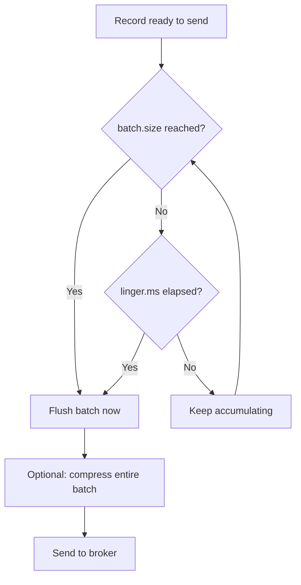
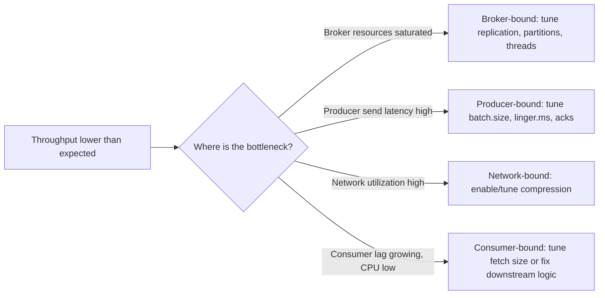
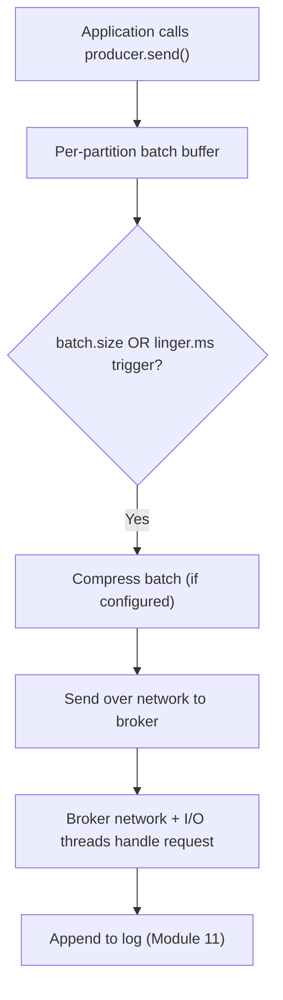
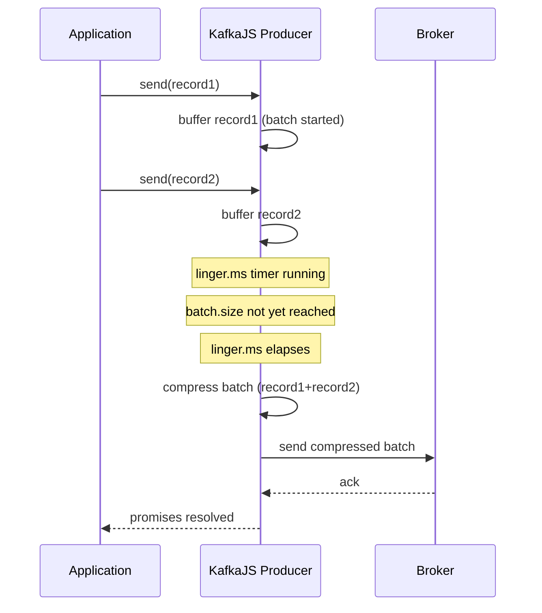

# Module 12 — Performance Tuning

**Level:** ⭐⭐⭐ Intermediate → Advanced
**Track:** Kafka Complete Masterclass for Node.js Backend Engineers
**Module:** 12 of 25

---

## 1. Introduction

Modules 4, 5, and 11 each mentioned performance knobs in passing — `batch.size`, `linger.ms`, compression, fetch sizing — as configuration details. This module treats them as a coherent system: how producer batching, compression, consumer fetch sizing, broker memory, and network configuration all interact to determine your actual observed throughput and latency, and how to tune each deliberately rather than by folklore ("just increase everything").

Performance tuning in Kafka is fundamentally about **trade-offs**, not free wins — every knob you turn to improve throughput typically costs something in latency, memory, or CPU, and vice versa. This module teaches you to name that trade-off explicitly before you make the change.

---

## 2. Learning Objectives

By the end of this module, you will be able to:

1. Explain the relationship between `batch.size` and `linger.ms`, and tune both deliberately for a given workload.
2. Choose an appropriate compression codec based on CPU, network, and payload characteristics.
3. Tune consumer fetch settings (`maxBytesPerPartition`, `maxWaitTimeInMs`, `minBytes`) for throughput vs. latency.
4. Reason about broker-side memory, network thread, and I/O thread configuration.
5. Diagnose whether a real system is producer-bound, broker-bound, network-bound, or consumer-bound.
6. Apply a structured methodology to performance-tune a Kafka pipeline rather than guessing.

---

## 3. Why This Concept Exists

Kafka's defaults are reasonable for a wide range of workloads, but "reasonable for everyone" necessarily means "not optimal for anyone specific." A pipeline handling millions of small (100-byte) IoT sensor readings has fundamentally different optimal settings than one handling thousands of large (500KB) video-processing job payloads per second. Performance tuning exists because:

- **Batching** trades a small amount of added latency for a large gain in throughput — but how much latency you can afford is workload-specific, not universal.
- **Compression** trades CPU cycles for reduced network/disk usage — worthwhile when network or disk is your bottleneck, wasteful when CPU already is.
- **Fetch sizing** trades round-trip efficiency against memory usage and per-fetch latency.
- **Broker threading and memory** determine how much concurrent work a single broker can actually sustain before *it* becomes the bottleneck, regardless of how well-tuned your clients are.

Tuning without understanding *which* resource is actually constrained is how teams "optimize" a setting that was never the bottleneck, wasting effort and sometimes making things worse.

---

## 4. Problem Statement

Consider three different real systems, each hitting a different kind of ceiling:

1. **High-volume clickstream analytics**: millions of tiny (50–200 byte) events/second. Producer throughput is disappointing despite a powerful machine — why, and what should you tune?
2. **Video transcoding job events**: large (200KB+) payloads, moderate volume. Network bandwidth between services is saturating — what lever reduces this most effectively?
3. **A consumer group with growing lag**: CPU on consumer instances is low, but throughput is still poor. Is this a fetch-sizing problem, a processing-logic problem, or something broker-side?

Each of these requires correctly diagnosing *which* resource is the actual constraint before reaching for a specific configuration change — tuning the wrong knob (e.g., increasing `batch.size` when the real bottleneck is consumer processing logic) wastes effort and sometimes makes things worse.

---

## 5. Real-World Analogy

### Analogy: A Delivery Truck Fleet

Imagine a delivery company deciding how to load and dispatch trucks (batches):

- **Batch size** is like deciding how full a truck must be before it leaves the warehouse. A truck that leaves half-empty makes more trips (more overhead per package delivered) — but waiting to fill it completely delays every package already loaded.
- **`linger.ms`** is like setting a maximum wait time: "leave once full, OR after 10 minutes, whichever comes first" — so a slow trickle of packages doesn't mean a nearly-empty truck sits at the dock all day.
- **Compression** is like using vacuum-sealed packaging to fit more into the same truck — great when truck space (network bandwidth) is your limiting factor, pointless (or even counterproductive, given the time to vacuum-seal) if trucks are never full anyway and warehouse labor (CPU) is what's actually scarce.
- **Consumer fetch size** is like the receiving warehouse deciding how large a shipment to request in one call: request too little, and you're constantly calling for more (overhead); request too much, and you're stuck storing a huge shipment you can't process fast enough yet.

---

## 6. Technical Definition

- **`batch.size`**: Maximum number of bytes the producer will accumulate into a single batch, per partition, before sending.
- **`linger.ms`**: Maximum time the producer will wait to accumulate a fuller batch before sending, even if `batch.size` hasn't been reached.
- **Compression Codec**: Algorithm (`gzip`, `snappy`, `lz4`, `zstd`) applied to a batch before sending, trading producer/consumer CPU cycles for reduced network and disk usage.
- **`maxBytesPerPartition`** (consumer fetch config): Maximum bytes the consumer will request per partition, per fetch request.
- **`maxWaitTimeInMs`** (consumer fetch config): Maximum time the broker will wait to accumulate `minBytes` worth of data before responding to a fetch request, even if not fully satisfied.
- **`minBytes`** (consumer fetch config, called `fetch.min.bytes` broker-side): Minimum amount of data the broker tries to accumulate before responding to a fetch request, reducing the number of round trips for low-throughput topics.
- **Network Threads / I/O Threads** (broker config): The broker's internal thread pools handling client network requests and disk I/O respectively — genuine concurrency limits on a single broker's throughput capacity.
- **Throughput vs. Latency Trade-off**: The general principle that most performance levers in Kafka increase one at the expense of the other; there is rarely a change that improves both simultaneously without cost elsewhere.

---

## 7. Internal Working

### How `batch.size` and `linger.ms` interact

```
Producer accumulates records into a per-partition buffer.

Batch is flushed to the broker when EITHER condition is met FIRST:

  (a) accumulated bytes >= batch.size           →  flush now (full)
  (b) time since first record in batch >= linger.ms →  flush now (timeout)

Example: batch.size = 16KB, linger.ms = 10

Scenario A (high volume): 16KB accumulates in 2ms
   → flushed at 2ms due to (a), linger.ms never matters

Scenario B (low volume): only 3KB accumulates in 10ms
   → flushed at 10ms due to (b), batch is smaller than the cap,
     but still gets sent promptly rather than waiting indefinitely
```

Setting `linger.ms` to a nonzero value (even a small one, like 5–20ms) is often the single highest-leverage throughput tuning change for high-volume producers, because it deliberately trades a small, bounded amount of latency for significantly larger, more efficient batches.

### How compression interacts with batching

```
Compression is applied to an ENTIRE BATCH at once, not per-message.

Small individual messages compress poorly in isolation (little
repetition to exploit), but a BATCH of many similar small messages
(e.g., JSON events with the same field names repeated) compresses
MUCH more effectively as a group.

This is why increasing batch.size can improve compression ratio
as a side effect — bigger batches give the compressor more
repetitive structure to work with.
```

### Consumer fetch sizing trade-off

```
maxBytesPerPartition TOO SMALL:
   → many small fetch requests, high per-request network/CPU
     overhead relative to actual data transferred

maxBytesPerPartition TOO LARGE:
   → consumer may pull in a large amount of data per request,
     increasing memory usage and the time before the consumer
     can start processing ANY of it (must receive the batch first)

fetch.min.bytes (broker) + maxWaitTimeInMs (consumer):
   → for LOW-throughput topics, waiting briefly to accumulate a
     more meaningful amount of data per fetch reduces the number
     of near-empty round trips, at the cost of a small added
     per-fetch latency
```

---

## 8. Architecture

```
                Producer Side                                Consumer Side
   ┌─────────────────────────────────────┐    ┌─────────────────────────────────────┐
   │ batch.size  ─┐                        │    │ maxBytesPerPartition  ─┐              │
   │              ├─► flush trigger         │    │                        ├─► fetch size │
   │ linger.ms   ─┘                        │    │ maxWaitTimeInMs       ─┘              │
   │                                        │    │                                       │
   │ compression (gzip/snappy/lz4/zstd)     │    │ minBytes (broker fetch.min.bytes)     │
   │  applied to the WHOLE flushed batch    │    │  broker waits to accumulate data       │
   └─────────────────────────────────────┘    └─────────────────────────────────────┘
                        │                                          │
                        └──────────► Broker (network + I/O threads, memory) ◄──────────┘
                                    genuine, shared concurrency ceiling
```

---

## 9. Step-by-Step Flow

### Diagnosing a throughput problem, methodically

1. Determine which side is actually constrained: measure producer send latency, broker CPU/disk/network utilization, and consumer processing time/lag independently — don't assume.
2. If **producer-bound** (low broker/network utilization, but low send rate): check `batch.size`/`linger.ms` — batches may be too small, or `acks`/compression settings may be adding unnecessary latency per send.
3. If **broker-bound** (high CPU, disk, or network utilization on brokers): check replication factor overhead, compression CPU cost, number of partitions/topics, and broker thread pool sizing.
4. If **network-bound** (network utilization high, CPU/disk moderate): compression is likely your highest-leverage lever — trade CPU for reduced bytes on the wire.
5. If **consumer-bound** (consumer CPU low, but lag growing): check fetch sizing, `eachMessage` vs `eachBatch` (Module 5), and whether business logic itself (a slow downstream DB/API call) is the true bottleneck — no Kafka client tuning fixes a slow database.

---

## 10. Detailed ASCII Diagrams

### 10.1 Batch Size vs. Linger.ms Timeline

```
linger.ms = 0 (default-ish behavior for very bursty traffic):
  Time: 0ms   1ms   2ms   3ms
        [m1]  [m1,m2] [m1,m2,m3] → sent as soon as batch.size hit,
                                    or almost immediately if traffic
                                    is sparse (many tiny batches)

linger.ms = 20 (deliberately batching more):
  Time: 0ms ... 20ms (timeout reached, whatever accumulated is sent)
        [m1, m2, m3, m4, m5, m6, m7, m8] → fewer, larger, more
                                            network-efficient batches
```

### 10.2 Compression Codec Trade-offs (Illustrative, Not Universal)

```
Codec     Compression Ratio    CPU Cost      Typical Use Case
------    ------------------   ----------    -------------------------
none      1.0x (baseline)      none          CPU-constrained, tiny payloads
snappy    moderate             low           balanced default choice
lz4       moderate-good        low-moderate  high-throughput, low latency
gzip      high                 high          network/disk-constrained,
                                              CPU headroom available
zstd      high-very high       moderate      often the best modern balance
                                              of ratio vs. CPU cost

ALWAYS benchmark with YOUR actual payload shape — ratios vary
significantly based on repetitiveness and message size.
```

### 10.3 Diagnosing the Bottleneck

```
Symptom: overall throughput lower than expected

           ┌─────────────────────────────┐
           │ Check broker CPU/disk/network │
           └───────────┬─────────────────┘
                        │
         ┌──────────────┼──────────────────┐
         ▼                                  ▼
   Broker resources                  Broker resources
   near saturation                   are LOW / idle
         │                                  │
         ▼                                  ▼
   BROKER-BOUND:                     Check PRODUCER send latency
   tune replication,                        │
   partition count,               ┌─────────┴─────────┐
   broker threads (Section 21)    ▼                    ▼
                             High latency          Low latency,
                             per send              but low volume
                                  │                     │
                                  ▼                     ▼
                          PRODUCER-BOUND:        Check CONSUMER lag
                          tune batch.size,       and processing time
                          linger.ms, acks               │
                                                  CONSUMER-BOUND:
                                                  tune fetch sizing,
                                                  eachBatch, or fix
                                                  slow downstream logic
```

---

## 11. Mermaid Diagrams





---

## 12. Request Flow Diagram



---

## 13. Sequence Diagram



---

## 14. Kafka Internal Flow

```
1. Records accumulate in a per-partition producer-side buffer
2. Flush triggered by batch.size OR linger.ms, whichever first
3. Batch optionally compressed as a single unit (not per-record)
4. Batch transmitted over the network to the partition leader
5. Broker's NETWORK THREADS accept the incoming request
6. Broker's I/O THREADS (or equivalent processing pool) handle
   appending the batch to the log (Module 11) and, if acks=all,
   coordinating with followers (Module 9)
7. On the consume side, the broker's network threads handle
   incoming fetch requests, respecting fetch.min.bytes and
   maxWaitTimeInMs before responding
8. Broker serves the response via zero-copy transfer (Module 11)
   where possible
```

---

## 15. Producer Perspective

Tuning from the producer's side is about finding the batching/latency sweet spot for your actual traffic pattern:

```javascript
// High-throughput, latency-tolerant workload (e.g., analytics events):
// deliberately batch more aggressively.
const analyticsProducer = kafka.producer({
  // KafkaJS batches per send() call rather than exposing a raw
  // linger.ms knob directly — the practical equivalent is grouping
  // more messages into each send() call, and/or sending less
  // frequently from the application side to let batches grow.
});

await analyticsProducer.send({
  topic: "analytics-events",
  compression: CompressionTypes.LZ4, // good throughput/CPU balance
  messages: largeArrayOfEvents.map((e) => ({ key: e.sessionId, value: JSON.stringify(e) })),
});
```

---

## 16. Consumer Perspective

Tuning from the consumer's side is about matching fetch behavior to your topic's actual traffic volume and your processing capacity:

```javascript
// For a LOW-throughput topic, waiting briefly to accumulate more
// data per fetch avoids excessive near-empty round trips.
const consumer = kafka.consumer({
  groupId: "inventory-service",
  maxWaitTimeInMs: 500,       // willing to wait up to 500ms for more data
  minBytes: 1024,             // but don't bother waiting for less than 1KB
  maxBytesPerPartition: 1048576, // 1MB per partition per fetch
});
```

A consumer whose downstream processing (e.g., a slow database write per message) is the actual bottleneck will **not** be helped by any fetch-size tuning — this is a critical diagnostic distinction (Section 9, step 5).

---

## 17. Broker Perspective

Broker-side, the key resources under contention are:

- **Network threads** (`num.network.threads`): handle incoming/outgoing requests from clients — too few, and requests queue up even if disk I/O is fast.
- **I/O threads** (`num.io.threads`): handle actual disk reads/writes — too few, and disk-bound operations bottleneck even with plenty of network capacity.
- **Replication overhead** (Module 9): every write is amplified by `replication.factor` — a broker's real write capacity is its raw capacity divided, roughly, by this factor.
- **Memory** (JVM heap + reliance on OS page cache, Module 11): under-provisioning RAM shrinks the effective page cache, pushing more reads to slower physical disk.

---

## 18. Node.js Integration

KafkaJS's instrumentation events let you measure real, in-application producer/consumer performance, which is essential for the diagnostic process in Section 9.

```javascript
// src/tools/instrumentProducer.js
import { producer } from "../config/kafka.js";

producer.on(producer.events.REQUEST_TIMEOUT, (e) => {
  console.warn("[producer] request timeout:", e.payload);
});

producer.on(producer.events.REQUEST_QUEUE_SIZE, (e) => {
  // A consistently growing queue size is a strong signal the
  // producer is generating records faster than the broker (or
  // network) can absorb them.
  console.log("[producer] request queue size:", e.payload.queueSize);
});
```

---

## 19. KafkaJS Examples

### 19.1 Tuned producer for high-volume, latency-tolerant events

```javascript
// src/producers/analyticsProducer.js
import { CompressionTypes } from "kafkajs";
import { kafka } from "../config/kafka.js";

const producer = kafka.producer({
  allowAutoTopicCreation: false,
});

let connected = false;
export async function connectAnalyticsProducer() {
  if (!connected) {
    await producer.connect();
    connected = true;
  }
}

// Batch many events into a SINGLE send() call rather than calling
// send() per event — this is the practical KafkaJS equivalent of
// tuning batch.size/linger.ms upward for a high-volume workload.
export async function publishAnalyticsBatch(events) {
  await producer.send({
    topic: "analytics-events",
    compression: CompressionTypes.LZ4,
    messages: events.map((e) => ({
      key: e.sessionId,
      value: JSON.stringify(e),
    })),
  });
}
```

### 19.2 Tuned consumer for higher throughput via `eachBatch`

```javascript
// src/consumers/highThroughputConsumer.js
import { kafka } from "../config/kafka.js";

const consumer = kafka.consumer({
  groupId: "analytics-consumer",
  maxBytesPerPartition: 2 * 1024 * 1024, // 2MB per partition per fetch
  maxWaitTimeInMs: 200,
});

export async function startHighThroughputConsumer() {
  await consumer.connect();
  await consumer.subscribe({ topic: "analytics-events", fromBeginning: false });

  await consumer.run({
    // eachBatch avoids per-message offset-commit overhead, and lets
    // you process many records per callback invocation — meaningfully
    // higher throughput than eachMessage for high-volume topics.
    eachBatch: async ({ batch, resolveOffset, heartbeat, commitOffsetsIfNecessary }) => {
      for (const message of batch.messages) {
        // lightweight processing per message
        processAnalyticsEvent(JSON.parse(message.value.toString()));
        resolveOffset(message.offset);
      }
      await heartbeat();
      await commitOffsetsIfNecessary();
    },
  });
}

function processAnalyticsEvent(event) {
  // ... business logic
}
```

### 19.3 A simple producer-side throughput benchmark

```javascript
// src/tools/benchmarkProducer.js
import { CompressionTypes } from "kafkajs";
import { kafka } from "../config/kafka.js";

async function benchmark(compression, messageCount = 10000) {
  const producer = kafka.producer();
  await producer.connect();

  const messages = Array.from({ length: messageCount }, (_, i) => ({
    key: `key-${i % 100}`,
    value: JSON.stringify({ i, payload: "x".repeat(200) }),
  }));

  const start = Date.now();
  await producer.send({ topic: "bench-topic", compression, messages });
  const elapsed = Date.now() - start;

  console.log(
    `Compression=${compression ?? "none"}: ${messageCount} messages in ${elapsed}ms ` +
      `(${((messageCount / elapsed) * 1000).toFixed(0)} msgs/sec)`
  );

  await producer.disconnect();
}

async function main() {
  await benchmark(undefined);
  await benchmark(CompressionTypes.GZIP);
  await benchmark(CompressionTypes.Snappy);
  await benchmark(CompressionTypes.LZ4);
}

main().catch(console.error);
```

### 19.4 Diagnosing consumer-bound vs. broker-bound lag

```javascript
// src/tools/diagnoseLag.js
import { Kafka } from "kafkajs";

const kafka = new Kafka({ clientId: "lag-diagnostic", brokers: ["localhost:9092"] });

async function diagnose(groupId, topic) {
  const admin = kafka.admin();
  await admin.connect();

  const start = Date.now();
  const groupOffsets = await admin.fetchOffsets({ groupId, topics: [topic] });
  const adminLatency = Date.now() - start;

  console.log(`Admin API round-trip: ${adminLatency}ms (broker/network responsiveness check)`);
  console.log("Per-partition committed offsets:", groupOffsets[0].partitions);

  // If admin latency itself is high, suspect broker-side saturation.
  // If admin latency is low but consumer lag is high and growing,
  // suspect consumer-side processing time as the true bottleneck.

  await admin.disconnect();
}

diagnose("inventory-service", "orders").catch(console.error);
```

---

## 20. CLI Commands

```bash
# Check broker-side thread pool configuration
kafka-configs.sh --bootstrap-server localhost:9092 \
  --entity-type brokers --entity-name 1 --describe

# Monitor consumer group lag over time (the ultimate throughput
# health signal from the consumer side)
kafka-consumer-groups.sh --bootstrap-server localhost:9092 \
  --describe --group inventory-service

# Simple producer throughput test using Kafka's built-in perf tool
kafka-producer-perf-test.sh --topic bench-topic \
  --num-records 1000000 --record-size 200 --throughput -1 \
  --producer-props bootstrap.servers=localhost:9092 batch.size=65536 linger.ms=10

# Simple consumer throughput test
kafka-consumer-perf-test.sh --bootstrap-server localhost:9092 \
  --topic bench-topic --messages 1000000
```

---

## 21. Configuration Explanation

| Config | Side | Meaning |
|---|---|---|
| `batch.size` | Producer | Max bytes accumulated per partition before flushing |
| `linger.ms` | Producer | Max time to wait for a fuller batch before flushing anyway |
| `compression.type` | Producer | Codec applied to each flushed batch |
| `maxBytesPerPartition` | Consumer | Max bytes requested per partition per fetch |
| `maxWaitTimeInMs` | Consumer | Max time consumer/broker waits to accumulate `minBytes` before responding |
| `minBytes` / `fetch.min.bytes` | Consumer/Broker | Minimum data broker tries to accumulate before responding to a fetch |
| `num.network.threads` | Broker | Threads handling client request/response I/O |
| `num.io.threads` | Broker | Threads handling actual disk read/write operations |
| `replica.fetch.max.bytes` | Broker (replication) | Max bytes a follower requests per fetch from the leader — affects replication throughput |

---

## 22. Common Mistakes

1. **Tuning producer settings when the bottleneck is actually the broker or consumer.** Always diagnose (Section 9) before changing configuration — otherwise you're optimizing a part of the pipeline that was never slow.
2. **Enabling heavy compression (e.g., `gzip`) on an already CPU-constrained producer or broker**, worsening the actual bottleneck instead of relieving it.
3. **Setting `linger.ms` very high** ("more batching is always better") without checking whether the added latency is actually acceptable for the use case — this is a genuine trade-off, not a free lunch.
4. **Increasing `maxBytesPerPartition` dramatically** without considering the resulting memory footprint across many partitions/consumer instances.
5. **Benchmarking with unrealistic payloads** (e.g., all-identical dummy messages) that compress far better than real production data, leading to misleadingly optimistic compression ratio conclusions.
6. **Changing multiple settings simultaneously** during a tuning exercise, making it impossible to attribute an observed improvement (or regression) to any specific change.

---

## 23. Edge Cases

- **What if a topic has genuinely bursty traffic** (mostly idle, then sudden spikes)? A moderate `linger.ms` still helps during bursts (letting batches form) without meaningfully hurting latency during idle periods (since there's nothing waiting to be delayed).
- **What if compression makes a batch LARGER** (rare, but possible for very small or already-compressed payloads, due to compression format overhead)? Some clients/brokers will detect this and skip compression for that batch — worth checking your specific client's behavior, and benchmarking with real payloads (Section 22, mistake 5).
- **What if increasing `num.io.threads` doesn't help throughput?** If the underlying disk itself is saturated (not just the thread pool), more threads simply contend for the same limited disk bandwidth — a hardware/capacity problem, not a configuration one.

---

## 24. Performance Considerations

- The single highest-leverage change for many high-volume producer workloads is a modest, deliberate increase in effective batching (via `linger.ms`-equivalent behavior and/or larger application-level batches per `send()` call) — often before touching compression or broker settings at all.
- Compression's CPU cost scales with codec choice and payload size — always benchmark with representative, real payload data (Section 19.3) rather than assuming a codec's general reputation applies to your specific case.
- Broker-side thread pool sizing matters most under genuinely high concurrent client load; for smaller clusters or lower traffic, default thread counts are rarely the binding constraint.

---

## 25. Scalability Discussion

- Throughput tuning at the producer/consumer level has a ceiling set by partition count (Module 6) and broker capacity (Module 3, Module 9) — no amount of client-side tuning overcomes an under-partitioned topic or an under-provisioned cluster.
- As you scale a system, periodically re-run the diagnostic process in Section 9 — the bottleneck often *moves* (e.g., from producer-bound to broker-bound) as you fix earlier constraints, requiring a different tuning focus at each stage.

---

## 26. Production Best Practices

- Always diagnose before tuning: measure producer send latency, broker resource utilization, and consumer lag/processing time independently, and identify the actual constrained resource first.
- Change one setting at a time during tuning exercises, and measure before/after with a consistent, representative benchmark.
- Benchmark compression codecs with real (or realistically representative) payloads, not synthetic dummy data.
- Document your tuned configuration values and the reasoning behind them (Module 24) — future engineers (including future you) will need to know *why* `linger.ms=15` was chosen, not just that it was.
- Re-diagnose periodically as traffic patterns and cluster size evolve — yesterday's bottleneck may not be today's.

---

## 27. Monitoring & Debugging

- Track producer request queue size and send latency (Section 18) as your earliest signal of producer-side saturation.
- Track broker CPU, disk I/O, and network utilization continuously — these are the ground truth for whether the broker itself is the constraint.
- Track consumer lag trend (not just a snapshot) alongside consumer CPU utilization — high lag with low consumer CPU strongly suggests a fetch-sizing or downstream-dependency issue, not a raw processing-power shortage.

---

## 28. Security Considerations

- Compression and batching settings themselves carry no direct security implications, but be aware that larger batches/fetches mean more data held in memory at once — a factor worth considering in threat models involving memory exhaustion or resource-based denial-of-service scenarios (Module 20 covers broader security hardening).

---

## 29. Interview Questions (Easy → Medium → Hard)

### Easy

1. What does `batch.size` control?
2. What does `linger.ms` control?
3. Name two Kafka compression codecs.

### Medium

4. Why does increasing `linger.ms` often improve throughput at the cost of latency?
5. Why can larger batches compress better than many small individual messages?
6. What is the trade-off of setting `maxBytesPerPartition` very high on the consumer side?
7. What broker resources (threads, memory) can become a bottleneck independent of client-side tuning?

### Hard

8. Given a system with low broker CPU/disk utilization but poor producer throughput, walk through your diagnostic steps and likely configuration fix.
9. Given a system with growing consumer lag but low consumer CPU utilization, explain at least two distinct possible causes and how you'd distinguish between them.
10. Explain why tuning compression codec choice without considering CPU availability can make overall system performance worse, not better.
11. Design a tuning approach for a topic with highly bursty traffic (long idle periods, sudden large spikes) — what would you set for `linger.ms` and why?

---

## 30. Common Interview Traps

- **Trap:** "Always enable the strongest compression for best performance." → **Reality:** Compression trades CPU for reduced network/disk usage; the "best" codec depends entirely on which resource is actually scarce in your system.
- **Trap:** "More batching is always better." → **Reality:** Batching improves throughput at the cost of latency — appropriate only when your use case can tolerate the added delay.
- **Trap:** "If throughput is low, the producer configuration must be the problem." → **Reality:** The bottleneck could be anywhere — producer, broker, network, or consumer — and must be diagnosed, not assumed.

---

## 31. Summary

- `batch.size` and `linger.ms` together control the throughput/latency trade-off on the producer side — larger, more patient batches improve throughput at the cost of added latency.
- Compression trades CPU for reduced network/disk usage; codec choice should be benchmarked against real payloads and your actual bottleneck resource.
- Consumer fetch sizing (`maxBytesPerPartition`, `maxWaitTimeInMs`, `minBytes`) has an analogous throughput/latency/memory trade-off on the read side.
- Broker-side thread pools, memory, and replication overhead set a hard ceiling that no amount of client-side tuning can overcome.
- Effective tuning always starts with diagnosing *which* resource is actually constrained — producer, broker, network, or consumer — before changing any configuration.

---

## 32. Cheat Sheet

```
PERFORMANCE TUNING — ONE PAGE

batch.size    = max bytes per partition batch before flush
linger.ms     = max wait time for a fuller batch before flush anyway
                (higher = more throughput, more latency)

Compression: trades CPU for smaller network/disk footprint
  none/snappy/lz4 = lower CPU cost, moderate ratio
  gzip/zstd       = higher ratio, more CPU cost
  ALWAYS benchmark with REAL payloads

Consumer fetch tuning:
  maxBytesPerPartition = cap on data per fetch (memory trade-off)
  maxWaitTimeInMs / minBytes = wait briefly to batch fetches
                               for low-throughput topics

Broker ceiling: num.network.threads, num.io.threads, disk speed,
                replication.factor overhead — client tuning can't
                exceed this

Golden rule: DIAGNOSE the actual bottleneck (producer / broker /
             network / consumer) BEFORE tuning anything
```

---

## 33. Hands-on Exercises

1. Run the compression benchmark (Section 19.3) with your own realistic sample payloads and record actual throughput differences across codecs.
2. Use `kafka-producer-perf-test.sh` with varying `batch.size` and `linger.ms` values and graph the resulting throughput.
3. Deliberately create a slow `eachMessage` consumer (add an artificial delay) and observe lag growth despite low consumer CPU — confirming this is NOT a fetch-sizing problem.
4. Monitor broker CPU/disk/network via `docker stats` or OS tools while running a sustained high-volume producer benchmark, to practice identifying a genuinely broker-bound scenario.

---

## 34. Mini Project

**Build:** A `kafka-bench.js` CLI tool that runs a configurable producer benchmark (varying `batch.size`, `linger.ms`-equivalent batching, and compression codec) against a local topic, printing a comparison table of throughput and average latency for each configuration combination.

---

## 35. Advanced Project

**Build:** A full diagnostic dashboard: a script that simultaneously samples producer send latency, broker resource utilization (via OS-level metrics if accessible, or Admin API round-trip latency as a proxy), and consumer lag/processing time — then applies the decision tree from Section 10.3 automatically, printing a best-guess diagnosis ("likely producer-bound," "likely consumer-bound," etc.) based on the collected signals.

---

## 36. Homework

1. Research the specific default values for `batch.size`, `linger.ms`, `fetch.min.bytes`, and `num.io.threads` in a recent Kafka version, and explain why each default was likely chosen as a broadly reasonable starting point.
2. Compare `zstd` against `lz4` and `gzip` in terms of both compression ratio and CPU cost, citing any benchmarks you can find, and summarize when you'd choose each.
3. Write a short case study (half a page) describing a hypothetical system that is broker-bound due to replication overhead, and propose two different mitigation strategies with their respective trade-offs.

---

## 37. Additional Reading

- Apache Kafka documentation — "Producer Configs" and "Consumer Configs," specifically the performance-related settings
- Confluent blog: "Kafka Performance Tuning" deep-dive posts
- LinkedIn Engineering Blog: original Kafka benchmarking and design rationale posts (for historical context on why these specific trade-offs were chosen)

---

## Key Takeaways

- Batching (`batch.size` + `linger.ms`) is the primary throughput/latency trade-off lever on the producer side.
- Compression trades CPU for network/disk savings — codec choice should match your actual bottleneck resource, verified via real-payload benchmarking.
- Consumer fetch sizing has an analogous trade-off on the read side, but cannot fix a slow downstream processing step.
- Broker-side threads, memory, and replication overhead set a hard ceiling independent of client tuning.
- Always diagnose the actual bottleneck before tuning — the biggest mistake in performance work is optimizing a part of the system that was never slow.

---

## Revision Notes

- Be able to explain the `batch.size` vs. `linger.ms` trade-off with a concrete timeline example.
- Memorize the rough CPU-vs-ratio trade-off ordering of common compression codecs.
- Practice the bottleneck diagnostic decision tree (Section 10.3) until it's second nature.

---

## One-Page Cheat Sheet

*(See Section 32 above.)*

---

## 20 Practice Questions

1. What does `batch.size` control?
2. What does `linger.ms` control?
3. What triggers a batch flush: name both conditions.
4. Why can bigger batches compress better?
5. Name four Kafka compression codecs.
6. What resource does compression trade for reduced network/disk usage?
7. What does `maxBytesPerPartition` control on the consumer side?
8. What does `maxWaitTimeInMs` control?
9. What does `fetch.min.bytes` (broker-side `minBytes`) control?
10. What broker config controls the thread pool handling client requests?
11. What broker config controls the thread pool handling disk I/O?
12. What is the practical ceiling on write capacity introduced by replication factor?
13. What's the risk of setting `linger.ms` too high?
14. What's the risk of setting `maxBytesPerPartition` too high?
15. If broker CPU/disk/network are all low but producer throughput is poor, where's the likely bottleneck?
16. If consumer CPU is low but lag is growing, name two possible causes.
17. Why should you change only one tuning setting at a time during a benchmark?
18. Why should compression benchmarks use realistic payloads?
19. What tool can you use for a quick built-in producer throughput test?
20. What tool can you use for a quick built-in consumer throughput test?

---

## 10 Scenario-Based Questions

1. Your producer's throughput is far below expected, but broker CPU/disk/network utilization are all low. Walk through your diagnostic steps.
2. A consumer group's lag keeps growing, but the consumer instances show very low CPU usage. Propose two different possible causes and how you'd distinguish them.
3. Your network between services is saturated, but CPU on both producer and broker has headroom. What single change would you try first, and why?
4. A teammate enables `gzip` compression cluster-wide "for better performance," and overall throughput gets WORSE. Explain a plausible reason.
5. Your topic has very bursty traffic — long idle stretches, then sudden spikes. How would you set `linger.ms`, and why does it not meaningfully hurt latency during idle periods?
6. You increase `maxBytesPerPartition` significantly to "improve consumer throughput," and now consumer instances are running out of memory. Explain the connection.
7. Your `kafka-producer-perf-test.sh` results look great with synthetic test data, but production throughput is much lower. What might explain the gap?
8. A new engineer proposes increasing `num.io.threads` to fix a throughput problem, but disk utilization is already near 100%. Explain why this change likely won't help.
9. You need to choose between `snappy` and `zstd` for a CPU-constrained producer host. What factors would guide this decision?
10. Explain to a teammate why "just turn everything up" (batch size, linger.ms, fetch size, compression) is not a valid tuning strategy, using the throughput/latency/memory trade-off framework from this module.

---

## 5 Coding Assignments

1. Write a benchmarking script that varies `linger.ms`-equivalent batching (via grouping different numbers of messages per `send()` call) and reports throughput for each configuration.
2. Build a compression comparison tool that benchmarks `none`, `gzip`, `snappy`, and `lz4` against a realistic sample payload you provide via a file, reporting both throughput and resulting message size.
3. Write a consumer that logs, per fetch, how many bytes and messages were received, to help empirically tune `maxBytesPerPartition` for a specific topic's traffic pattern.
4. Build a simple bottleneck-diagnosis script that checks producer send latency, an Admin API round-trip as a broker responsiveness proxy, and consumer lag, printing a best-guess diagnosis based on simple thresholds.
5. Write a load generator with configurable message size and rate, useful as a standard benchmarking harness for testing any future tuning change against a consistent baseline.

---

## Suggested Next Module

**Module 13 — Kafka with Node.js**
With performance tuning fundamentals now in hand, the next module consolidates everything into a focused, practical look at building real Kafka-integrated Node.js services with KafkaJS: producer, consumer, and Admin API patterns, and solid error-handling practices for production code.
