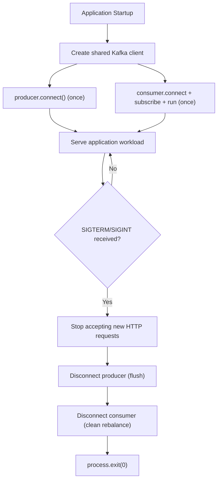
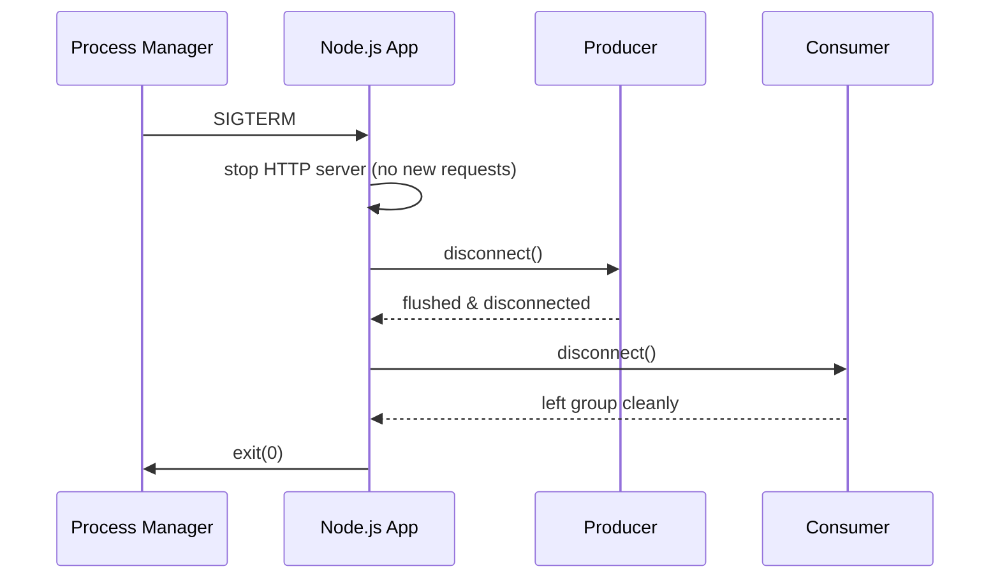
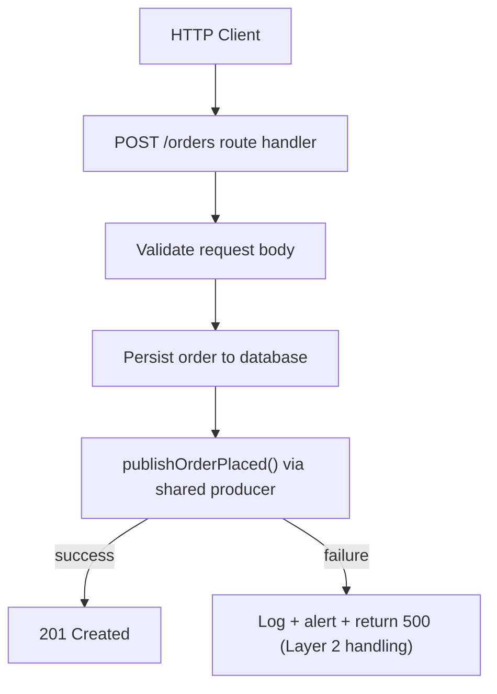
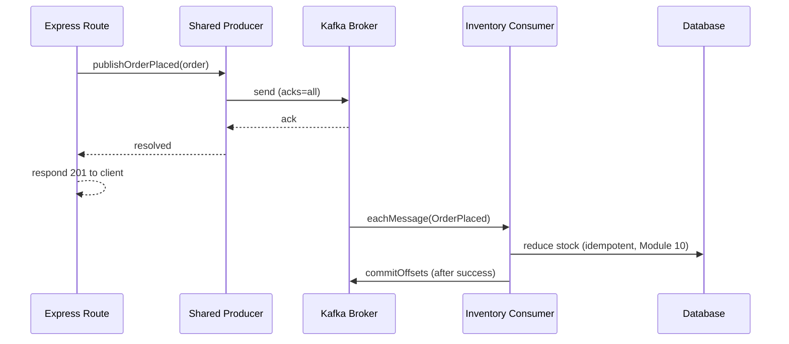

# Module 13 — Kafka with Node.js

**Level:** ⭐⭐⭐ Intermediate → Advanced
**Track:** Kafka Complete Masterclass for Node.js Backend Engineers
**Module:** 13 of 25

---

## 1. Introduction

Modules 1–12 built your Kafka mental model using KafkaJS snippets scattered across each topic. This module steps back and consolidates: a complete, production-grade Node.js service architecture — configuration, producer, consumer, Admin API, and error handling — assembled as one coherent whole rather than isolated examples. If you've been treating each module's code as a standalone snippet, this is where it becomes a real, deployable application.

This module is intentionally less about *new* Kafka concepts and more about *engineering discipline*: how do you structure a Node.js Kafka service so it's testable, observable, and resilient to the failure modes covered in Modules 4–12?

---

## 2. Learning Objectives

By the end of this module, you will be able to:

1. Structure a production-grade Node.js Kafka service (config, producers, consumers, admin tooling) cleanly.
2. Correctly manage the KafkaJS client, producer, and consumer lifecycles (connect once, reuse, disconnect gracefully).
3. Use the Admin API for topic management, health checks, and operational tooling from Node.js.
4. Implement comprehensive, layered error handling across producer sends, consumer processing, and connection-level failures.
5. Apply KafkaJS's instrumentation events for logging and observability.
6. Write integration tests for Kafka-dependent Node.js code.

---

## 3. Why This Concept Exists

Every individual Kafka concept in this course — batching, offsets, replication, delivery guarantees — eventually has to be expressed as real application code that runs in production, gets deployed, crashes sometimes, and needs to be debugged at 2 AM by someone who isn't you. A perfectly understood concept, implemented sloppily, still causes outages.

This module exists because "I understand consumer groups" and "I can write a consumer service that handles a broker restart, a poison-pill message, and a slow database without crashing or silently losing data" are different skills — the second one requires disciplined error handling, structure, and testing on top of the conceptual knowledge from earlier modules.

---

## 4. Problem Statement

Consider taking everything from Modules 1–12 and shipping it as a real Inventory Service:

1. How do you structure the codebase so producer, consumer, and admin logic don't become a tangled mess as the service grows?
2. What happens to your service if Kafka is temporarily unreachable at startup — does it crash immediately, retry forever, or something in between?
3. If `eachMessage` throws an unexpected error (a bug, not a poison pill), how do you avoid silently swallowing it *and* avoid crashing the whole process ungracefully?
4. How do you actually **test** Kafka-dependent code without needing a real, running Kafka cluster for every unit test?

Each of these is a genuine, common production concern that pure conceptual Kafka knowledge doesn't automatically solve.

---

## 5. Real-World Analogy

### Analogy: A Well-Run Restaurant vs. a Chaotic One

Two restaurants can serve identical dishes (the same Kafka concepts, correctly understood) and have wildly different outcomes based on *how the kitchen is run*. A well-run kitchen has clear stations (structured modules: config, producers, consumers), a clear protocol for what happens when an ingredient delivery is late (connection retry/backoff logic), a clear process for a burnt dish (error handling — retry, log, or discard, deliberately chosen per situation), and a habit of tasting dishes before they go out (tests) rather than finding out from a customer complaint.

The chaotic kitchen knows the same recipes but has no station discipline, no plan for a late delivery, and no process for a mistake — every failure becomes a fire drill. This module is about running the well-organized kitchen.

---

## 6. Technical Definition

- **Client Lifecycle Management**: Creating a single, shared KafkaJS `Kafka` client instance and reusing its `producer()`/`consumer()`/`admin()` sub-clients across the application's lifetime, rather than creating new ones per operation.
- **Graceful Shutdown**: Ensuring in-flight producer sends complete (or fail cleanly) and consumers leave their group cleanly (triggering an immediate, minimal-disruption rebalance) when a process receives a termination signal.
- **Instrumentation Events**: KafkaJS's built-in event emitter interface (`producer.on(...)`, `consumer.on(...)`) exposing internal lifecycle events (connects, disconnects, crashes, rebalances, request metrics) for logging and observability.
- **Layered Error Handling**: Distinguishing between different failure categories — connection-level (broker unreachable), send-level (a specific publish failed), and processing-level (business logic threw) — and handling each with an appropriate, deliberate strategy rather than one generic try/catch.
- **Integration Testing with Kafka**: Testing real producer/consumer behavior against either a real (often Dockerized/testcontainer) Kafka instance, or a mocked KafkaJS client, depending on what the specific test needs to verify.

---

## 7. Internal Working

### The application-level Kafka client lifecycle

```
App startup
   │
   ▼
Create ONE Kafka client instance (shared config: brokers, clientId)
   │
   ├──► Create producer(s) — connect ONCE at startup
   │
   ├──► Create consumer(s) — connect + subscribe + run ONCE at startup
   │
   └──► Create admin client — connect on-demand for tooling/health checks
   │
App runs, serving requests / processing messages
   │
   ▼
SIGTERM/SIGINT received
   │
   ├──► Stop accepting new work (e.g., stop HTTP server accepting requests)
   ├──► Disconnect producer(s) (flushes in-flight sends)
   ├──► Disconnect consumer(s) (leaves group cleanly — Module 7)
   └──► Exit process
```

### Error handling layers, explicitly separated

```
LAYER 1 — Connection-level errors (broker unreachable, auth failure)
   → Typically fatal at startup (fail fast, let orchestrator restart);
     transient mid-run issues are handled by KafkaJS's built-in retry logic.

LAYER 2 — Producer send-level errors (a specific .send() call fails)
   → Catch explicitly, log with full context (topic, key, error),
     decide: retry, dead-letter, or propagate to the caller.

LAYER 3 — Consumer processing-level errors (business logic throws
           inside eachMessage/eachBatch)
   → Catch explicitly, decide: retry in place, send to a dead-letter
     topic (Module 15 preview), or (rarely, deliberately) skip and
     log for manual investigation.
```

---

## 8. Architecture

```
inventory-service/
├── src/
│   ├── config/
│   │   └── kafka.js              # single shared Kafka client instance
│   ├── producers/
│   │   └── orderEventProducer.js # connect-once, reusable producer
│   ├── consumers/
│   │   └── inventoryConsumer.js  # consumer with layered error handling
│   ├── admin/
│   │   └── topicAdmin.js         # Admin API tooling (health, topic mgmt)
│   ├── lib/
│   │   └── logger.js             # structured logging used across all of the above
│   ├── app.js                    # Express app (if applicable)
│   └── server.js                 # entry point: wires everything together,
│                                  #   handles graceful shutdown
├── test/
│   └── inventoryConsumer.test.js # integration/unit tests
└── package.json
```

---

## 9. Step-by-Step Flow

1. `server.js` starts, creates the shared Kafka client (Section 19.1).
2. Producer connects once; consumer connects, subscribes, and starts its run loop once — both at application startup, not per-request or per-message.
3. Instrumentation event listeners are attached (Section 19.2) before the producer/consumer begin active work, so no early events are missed.
4. The application serves its normal workload (HTTP requests publishing events, consumer processing incoming events) with each layer's error handling (Section 7) active.
5. On SIGTERM/SIGINT, the server stops accepting new HTTP requests, disconnects the producer (flushing in-flight sends), and disconnects the consumer (triggering a clean rebalance) — in that order — before exiting.
6. If the process crashes unexpectedly (uncaught exception), it logs the error with full context and exits non-zero, relying on the process manager/orchestrator (Module 21) to restart it — deliberately choosing "restart cleanly" over "attempt to self-heal an unknown corrupted state."

---

## 10. Detailed ASCII Diagrams

### 10.1 Connect-Once vs. Connect-Per-Request (Anti-Pattern)

```
CORRECT (connect once, reuse):

App startup ──► producer.connect() ──► [producer reused for
                                         thousands of requests]

WRONG (connect per request — expensive, error-prone):

Request 1 ──► new producer ──► connect ──► send ──► disconnect
Request 2 ──► new producer ──► connect ──► send ──► disconnect
   (wastes connections, adds latency, risks connection leaks
    under load)
```

### 10.2 Graceful Shutdown Order

```
SIGTERM received
      │
      ▼
1. Stop HTTP server from accepting NEW requests
      │
      ▼
2. Wait for in-flight HTTP requests to finish (or timeout)
      │
      ▼
3. Disconnect producer (flush any buffered sends first)
      │
      ▼
4. Disconnect consumer (leaves group -> clean, fast rebalance
   for remaining instances, per Module 7)
      │
      ▼
5. process.exit(0)

Doing this OUT OF ORDER (e.g., killing the consumer connection
before finishing in-flight processing) risks exactly the kind
of message-skipping or duplicate-processing bugs covered in
Module 10.
```

### 10.3 Layered Error Handling in Practice

```
eachMessage callback throws:

   try {
       await reduceStock(event);          // Layer 3 boundary starts here
   } catch (err) {
       if (isPoisonPill(err)) {
           await sendToDeadLetterTopic(message, err);  // Module 15 preview
           // commit offset anyway — this message will never succeed
       } else if (isTransientError(err)) {
           throw err; // let it bubble up — KafkaJS will NOT commit,
                      // message will be retried on next poll/restart
       } else {
           logger.error("unexpected processing error", { err, message });
           throw err; // fail loud rather than silently swallow
       }
   }
```

---

## 11. Mermaid Diagrams





---

## 12. Request Flow Diagram



---

## 13. Sequence Diagram



---

## 14. Kafka Internal Flow

```
1. Node.js process creates ONE KafkaJS client instance, sharing
   brokers/clientId config across producer, consumer, and admin
2. Producer connects once; TCP connections to relevant brokers are
   established and pooled internally by KafkaJS
3. Consumer connects, joins its consumer group (Module 7), and
   begins its internal poll loop (Module 5)
4. All application-level Kafka activity (sends, message processing)
   flows through these long-lived, reused client objects
5. On shutdown signal, KafkaJS's disconnect() methods handle the
   underlying protocol-level cleanup (flushing buffers, sending a
   LeaveGroup request for consumers) so the broker/group coordinator
   sees a clean, intentional disconnect rather than a timeout-based
   failure detection (Module 7)
```

---

## 15. Producer Perspective

A production-grade producer wrapper should, at minimum:

- Connect once at startup, and expose a single `publish()`-style function for the rest of the app to use.
- Explicitly catch and log send failures with full context (topic, key, error) — never let a `.send()` rejection go unhandled.
- Consider a lightweight in-process fallback (e.g., a bounded retry with backoff, or writing to a local dead-letter store) for transient failures, distinct from KafkaJS's own internal retry logic (Module 4).

---

## 16. Consumer Perspective

A production-grade consumer should:

- Separate "expected, recoverable" errors (a known poison-pill pattern, a validation failure) from "unexpected" errors (a bug, a null-pointer-style exception) and handle each deliberately (Section 10.3).
- Never commit an offset for a message whose processing outcome is unknown or failed in an unexpected way — silently committing past a failure risks the message-loss bugs from Module 10.
- Implement graceful shutdown (Section 10.2) so deploys and scaling events trigger clean rebalances (Module 7) rather than relying on session timeouts.

---

## 17. Broker Perspective

From the broker's perspective, a well-behaved Node.js client is indistinguishable in principle from any other well-behaved client in any language — it authenticates, sends heartbeats reliably, commits offsets deliberately, and disconnects cleanly rather than vanishing. Nothing in this module changes the broker's behavior; it's entirely about ensuring your Node.js application *is* that well-behaved client consistently, under real-world failure conditions.

---

## 18. Node.js Integration

This entire module *is* the Node.js integration layer — the sections below assemble the concrete, reusable code.

---

## 19. KafkaJS Examples

### 19.1 Shared Kafka client configuration

```javascript
// src/config/kafka.js
import { Kafka, logLevel } from "kafkajs";

export const kafka = new Kafka({
  clientId: "inventory-service",
  brokers: (process.env.KAFKA_BROKERS || "localhost:9092").split(","),
  logLevel: logLevel.INFO,
  retry: {
    initialRetryTime: 300,
    retries: 8,
  },
});
```

### 19.2 Producer wrapper with connect-once lifecycle and instrumentation

```javascript
// src/producers/orderEventProducer.js
import { kafka } from "../config/kafka.js";
import { logger } from "../lib/logger.js";

const producer = kafka.producer({ idempotent: true, maxInFlightRequests: 5 });
let connected = false;

export async function connectProducer() {
  if (connected) return;

  producer.on(producer.events.CONNECT, () => logger.info("producer connected"));
  producer.on(producer.events.DISCONNECT, () => logger.warn("producer disconnected"));
  producer.on(producer.events.REQUEST_TIMEOUT, (e) =>
    logger.warn("producer request timeout", { payload: e.payload })
  );

  await producer.connect();
  connected = true;
}

export async function publishOrderPlaced(order) {
  try {
    await producer.send({
      topic: "orders",
      acks: -1,
      messages: [
        {
          key: String(order.id),
          value: JSON.stringify({
            eventId: crypto.randomUUID(),
            eventType: "OrderPlaced",
            orderId: order.id,
            items: order.items,
            timestamp: new Date().toISOString(),
          }),
        },
      ],
    });
  } catch (err) {
    // Layer 2: send-level error handling — log with full context,
    // then propagate so the calling route can respond appropriately.
    logger.error("failed to publish OrderPlaced", {
      orderId: order.id,
      error: err.message,
    });
    throw err;
  }
}

export async function disconnectProducer() {
  if (connected) {
    await producer.disconnect();
    connected = false;
  }
}
```

### 19.3 Consumer with layered, deliberate error handling

```javascript
// src/consumers/inventoryConsumer.js
import { kafka } from "../config/kafka.js";
import { logger } from "../lib/logger.js";
import { hasProcessed, markProcessed, reduceStockIdempotently } from "../db/processedEvents.js";
import { sendToDeadLetterTopic } from "./deadLetterProducer.js";

const consumer = kafka.consumer({ groupId: "inventory-service" });

function isPoisonPill(err) {
  return err instanceof SyntaxError; // e.g., malformed JSON payload
}

export async function startInventoryConsumer() {
  consumer.on(consumer.events.CRASH, (e) =>
    logger.error("consumer crashed", { error: e.payload.error?.message, restart: e.payload.restart })
  );
  consumer.on(consumer.events.GROUP_JOIN, (e) =>
    logger.info("consumer joined group", { memberAssignment: e.payload.memberAssignment })
  );

  await consumer.connect();
  await consumer.subscribe({ topic: "orders", fromBeginning: false });

  await consumer.run({
    autoCommit: false,
    eachMessage: async ({ topic, partition, message }) => {
      let event;

      try {
        event = JSON.parse(message.value.toString());
      } catch (err) {
        // Layer 3, poison pill: this message can NEVER succeed as-is.
        await sendToDeadLetterTopic(message, err);
        await consumer.commitOffsets([
          { topic, partition, offset: (Number(message.offset) + 1).toString() },
        ]);
        return;
      }

      try {
        const alreadyDone = await hasProcessed(event.eventId);
        if (!alreadyDone) {
          await reduceStockIdempotently(event);
          await markProcessed(event.eventId);
        }
        await consumer.commitOffsets([
          { topic, partition, offset: (Number(message.offset) + 1).toString() },
        ]);
      } catch (err) {
        // Layer 3, unexpected error: do NOT commit. Let it bubble up
        // so KafkaJS does not advance past this message — it will be
        // retried on the next poll cycle or after a restart.
        logger.error("unexpected error processing order event", {
          orderId: event.orderId,
          error: err.message,
        });
        throw err;
      }
    },
  });
}

export async function stopInventoryConsumer() {
  await consumer.disconnect();
}
```

### 19.4 Admin API health check and topic bootstrap

```javascript
// src/admin/topicAdmin.js
import { kafka } from "../config/kafka.js";

export async function ensureTopicsExist(topicSpecs) {
  const admin = kafka.admin();
  await admin.connect();

  const existing = await admin.listTopics();
  const toCreate = topicSpecs.filter((spec) => !existing.includes(spec.topic));

  if (toCreate.length > 0) {
    await admin.createTopics({ topics: toCreate });
  }

  await admin.disconnect();
}

export async function isKafkaHealthy(timeoutMs = 2000) {
  const admin = kafka.admin();
  try {
    await admin.connect();
    await Promise.race([
      admin.listTopics(),
      new Promise((_, reject) => setTimeout(() => reject(new Error("timeout")), timeoutMs)),
    ]);
    return true;
  } catch {
    return false;
  } finally {
    await admin.disconnect().catch(() => {});
  }
}
```

### 19.5 `server.js` — wiring it all together with graceful shutdown

```javascript
// src/server.js
import "dotenv/config";
import { app } from "./app.js";
import { connectProducer, disconnectProducer } from "./producers/orderEventProducer.js";
import { startInventoryConsumer, stopInventoryConsumer } from "./consumers/inventoryConsumer.js";
import { ensureTopicsExist } from "./admin/topicAdmin.js";
import { logger } from "./lib/logger.js";

const PORT = process.env.PORT || 3000;

async function main() {
  await ensureTopicsExist([
    { topic: "orders", numPartitions: 6, replicationFactor: 3 },
  ]);

  await connectProducer();
  await startInventoryConsumer();

  const server = app.listen(PORT, () => logger.info(`listening on port ${PORT}`));

  const shutdown = async (signal) => {
    logger.info(`received ${signal}, shutting down gracefully`);
    server.close();
    await disconnectProducer();
    await stopInventoryConsumer();
    process.exit(0);
  };

  ["SIGTERM", "SIGINT"].forEach((sig) => process.once(sig, () => shutdown(sig)));

  process.on("unhandledRejection", (err) => {
    logger.error("unhandled rejection", { error: err.message });
    process.exit(1);
  });
}

main().catch((err) => {
  logger.error("fatal startup error", { error: err.message });
  process.exit(1);
});
```

### 19.6 Integration test using a real (test-scoped) Kafka topic

```javascript
// test/inventoryConsumer.test.js
import { kafka } from "../src/config/kafka.js";

describe("inventory consumer", () => {
  const testTopic = `test-orders-${Date.now()}`;
  let producer;

  beforeAll(async () => {
    const admin = kafka.admin();
    await admin.connect();
    await admin.createTopics({ topics: [{ topic: testTopic, numPartitions: 1 }] });
    await admin.disconnect();

    producer = kafka.producer();
    await producer.connect();
  });

  afterAll(async () => {
    await producer.disconnect();
  });

  test("processes an OrderPlaced event and reduces stock exactly once", async () => {
    await producer.send({
      topic: testTopic,
      messages: [
        {
          key: "order-1",
          value: JSON.stringify({
            eventId: "evt-test-1",
            eventType: "OrderPlaced",
            orderId: 1,
            items: [{ sku: "SKU1", quantity: 2 }],
          }),
        },
      ],
    });

    // ... start a consumer against testTopic, assert on resulting DB state,
    // then tear down the consumer and delete the test topic.
  });
});
```

---

## 20. CLI Commands

```bash
# Run the service locally
node src/server.js

# Run integration tests (assumes a local Kafka broker is available)
npm test

# Check the service's Kafka health check endpoint (if exposed via Express)
curl http://localhost:3000/health/kafka

# Tail structured logs for producer/consumer lifecycle events
node src/server.js | jq 'select(.level=="error" or .level=="warn")'
```

---

## 21. Configuration Explanation

| Config | Meaning |
|---|---|
| `clientId` | Shared across producer/consumer/admin — identifies this Node.js service in broker logs/metrics |
| `retry.retries` / `retry.initialRetryTime` | KafkaJS's built-in connection-level retry behavior for transient broker unavailability |
| `groupId` | Consumer group identity — determines partition assignment and offset tracking (Module 7, 8) |
| `autoCommit: false` | Deliberate choice enabling the layered, explicit-commit error handling shown in Section 19.3 |
| Graceful shutdown signal handlers | Not a KafkaJS config per se, but an essential application-level pattern this module standardizes |

---

## 22. Common Mistakes

1. **Creating a new producer or consumer per request/message.** Wastes connections, adds latency, and risks connection leaks under load — always connect once at startup and reuse (Section 10.1).
2. **Swallowing errors silently in `eachMessage`.** An empty or overly broad `catch` block that doesn't rethrow can cause KafkaJS to commit past a message whose processing actually failed, silently losing it (Module 10).
3. **Not distinguishing poison-pill errors from transient/unexpected errors.** Treating every error identically either lets truly bad messages block a partition forever, or lets genuinely important errors get silently discarded.
4. **Skipping graceful shutdown entirely.** Relying on `kill -9` or container orchestrator force-kills causes unnecessary rebalances (Module 7) and increases the risk of losing in-flight work.
5. **Testing only with mocks, never against a real broker.** Mocked KafkaJS clients are useful for fast unit tests, but they can't catch real protocol-level, serialization, or configuration issues — some integration testing against a real (even if ephemeral/Dockerized) broker is essential before production deployment.
6. **Forgetting to handle the Admin API's own connection lifecycle** (connect/disconnect) in one-off tooling scripts, leaking connections in long-running admin utilities.

---

## 23. Edge Cases

- **What if the consumer's `eachMessage` callback hangs indefinitely** (e.g., an external API call with no timeout)? This blocks heartbeats and can trigger an unwanted rebalance (Module 7) — always apply timeouts to downstream calls within message processing.
- **What if graceful shutdown itself takes too long** (e.g., a very large in-flight batch)? Most orchestrators (Kubernetes, etc.) enforce a grace period before force-killing — ensure your shutdown logic completes comfortably within that window, or configure the orchestrator's grace period to match your actual needs.
- **What if the Admin API's `ensureTopicsExist()` races with another instance of the same service starting simultaneously** (e.g., during a rolling deploy)? Topic creation is idempotent in practice (Kafka returns a "topic already exists" condition harmlessly) — but it's worth confirming your specific KafkaJS version's behavior here rather than assuming.

---

## 24. Performance Considerations

- Reusing a single producer/consumer/admin client set, rather than creating them repeatedly, avoids meaningful connection-establishment overhead, especially under high request volume.
- Structured logging (Section 19.2, 19.3) has a real, if usually small, CPU/IO cost — avoid excessively verbose logging (e.g., logging every single message at `info` level) in high-throughput consumers; reserve detailed logs for errors, warnings, and periodic summaries.
- Integration tests against a real broker are slower than unit tests against mocks — structure your test suite so fast unit tests run on every change, and slower integration tests run in CI before merge/deploy, rather than blocking every local iteration.

---

## 25. Scalability Discussion

- The patterns in this module (shared client lifecycle, layered error handling, graceful shutdown) scale directly to running many instances of the same service in a consumer group (Module 7) — nothing here is specific to a single-instance deployment.
- As a service's responsibilities grow, resist the urge to let one Node.js process own an ever-growing number of unrelated producers/consumers for different topics — consider splitting into focused services aligned with clear business boundaries (Module 14 previews this from an architectural angle).

---

## 26. Production Best Practices

- Connect once, reuse everywhere; disconnect gracefully, in the correct order, on shutdown signals.
- Explicitly handle errors at each layer (connection, send, processing) with a deliberate, documented strategy — never rely on one generic top-level catch-all.
- Attach instrumentation event listeners (`CRASH`, `GROUP_JOIN`, `REQUEST_TIMEOUT`, etc.) from day one — they're inexpensive and invaluable during incident response.
- Maintain both fast unit tests (mocked Kafka) and slower integration tests (real, ephemeral broker) — each catches different classes of bugs.
- Keep Kafka-related code in clearly separated modules (config, producers, consumers, admin) so the service remains navigable as it grows (Section 8).

---

## 27. Monitoring & Debugging

- Structured logs from instrumentation events (Section 19.2, 19.3) are often your first, fastest debugging signal during an incident — invest in making them consistently structured (JSON) and greppable/queryable.
- A dedicated `/health/kafka` endpoint (Section 19.4) is invaluable for orchestrator health checks and quick manual verification during deploys.
- Correlate application-level logs (this module) with the broker-side and consumer-group-level monitoring covered in Module 19, rather than treating them as separate concerns.

---

## 28. Security Considerations

- Never hardcode broker credentials (SASL username/password, TLS certs) in source code — load them from environment variables or a secrets manager, consistent with Module 4 and Module 20's guidance.
- Ensure admin-capable code paths (topic creation/deletion, Section 19.4) are not accidentally exposed via a public-facing API route — restrict Admin API usage to trusted, internal tooling and startup scripts.

---

## 29. Interview Questions (Easy → Medium → Hard)

### Easy

1. Why should you connect a Kafka producer once at startup rather than per request?
2. What does graceful shutdown mean for a Kafka consumer?
3. What is an instrumentation event in KafkaJS?

### Medium

4. Why is it dangerous to swallow errors silently inside `eachMessage`?
5. What's the difference between a "poison pill" error and an "unexpected" error, and why handle them differently?
6. Why should integration tests run against a real (even if ephemeral) Kafka broker, not just mocks?
7. What's the correct order of operations during graceful shutdown, and why does the order matter?

### Hard

8. Design the error-handling strategy for a consumer that must distinguish between malformed messages, transient downstream failures, and genuine application bugs — describe what happens to each, end to end.
9. Explain why creating a new producer per HTTP request is a scalability and correctness risk, not just an inefficiency.
10. A consumer's `eachMessage` callback occasionally hangs due to a slow, timeout-less downstream API call, causing unwanted rebalances. Propose a concrete code-level fix.
11. Explain how you would structure both fast unit tests and slower integration tests for a Kafka-dependent Node.js service, and what each layer is responsible for catching.

---

## 30. Common Interview Traps

- **Trap:** "A generic try/catch around all Kafka code is sufficient error handling." → **Reality:** Different failure categories (connection, send, processing) call for genuinely different handling strategies — a single catch-all often masks bugs or causes silent data loss.
- **Trap:** "Testing with a mocked Kafka client is sufficient; you don't need a real broker in tests." → **Reality:** Mocks are valuable for fast unit tests but can't catch real protocol, serialization, or configuration issues — some real-broker integration testing remains essential.
- **Trap:** "`kill -9` and a clean SIGTERM-based shutdown are basically equivalent." → **Reality:** They produce meaningfully different consumer group behavior (Module 7) — an abrupt kill relies on session timeout detection, while a graceful disconnect triggers immediate, minimal-disruption rebalancing.

---

## 31. Summary

- A production-grade Node.js Kafka service reuses a single, shared client/producer/consumer/admin lifecycle rather than reconnecting repeatedly.
- Error handling should be layered and deliberate: connection-level, send-level, and processing-level failures each need their own considered strategy.
- Graceful shutdown, performed in the correct order, is essential for avoiding unnecessary rebalances and in-flight data loss.
- Instrumentation events provide low-cost, high-value observability into producer/consumer internals.
- A healthy test strategy combines fast, mocked unit tests with slower, real-broker integration tests, each catching different classes of issues.

---

## 32. Cheat Sheet

```
KAFKA WITH NODE.JS — ONE PAGE

Client lifecycle: ONE shared Kafka client; connect producer/consumer
                   ONCE at startup; reuse everywhere; disconnect
                   gracefully, in order, on shutdown signal

Error layers:
  Connection-level  -> fail fast at startup / rely on KafkaJS retry
  Send-level        -> catch, log with context, retry/dead-letter/propagate
  Processing-level   -> distinguish poison-pill vs transient vs unexpected;
                        commit offset ONLY after success or deliberate skip

Graceful shutdown order:
  1. stop accepting new HTTP work
  2. disconnect producer (flush)
  3. disconnect consumer (clean rebalance)
  4. exit process

Instrumentation events: CRASH, GROUP_JOIN, REQUEST_TIMEOUT, etc. —
  attach listeners from day one for observability

Testing: fast unit tests (mocked client) + slower integration tests
         (real, ephemeral broker) — different bugs, both needed

Golden rule: connect once, handle errors deliberately by layer,
             shut down in the correct order
```

---

## 33. Hands-on Exercises

1. Refactor a Module 1-style single-file producer script into the modular structure from Section 8 (config, producers, admin, server).
2. Add instrumentation event listeners to an existing consumer and observe the logged events during a manual rebalance (start a second instance) and a manual crash (throw inside `eachMessage`).
3. Implement the layered error handling from Section 19.3, then deliberately send a malformed (non-JSON) message and confirm it's routed to a dead-letter topic instead of crashing the consumer.
4. Implement graceful shutdown and confirm, via `kafka-consumer-groups.sh --describe`, that a `SIGTERM`-based restart causes a faster, cleaner rebalance than a `kill -9`-based one.

---

## 34. Mini Project

**Build:** A complete, modular Inventory Service (matching Section 8's structure) with a connect-once producer, a layered-error-handling consumer, an Admin API-backed `/health/kafka` endpoint, and full graceful shutdown — deployable as a standalone service.

---

## 35. Advanced Project

**Build:** A test suite combining fast unit tests (with a mocked KafkaJS client, e.g., via dependency injection or a test double) and slower integration tests (against a real, ephemeral broker — using Docker Compose or a testcontainers-style setup) for the Inventory Service above, with clear documentation of which scenarios each test layer is responsible for catching.

---

## 36. Homework

1. Research common Node.js process-manager and container-orchestrator grace-period defaults (e.g., Kubernetes' `terminationGracePeriodSeconds`), and explain how you'd tune your application's own shutdown logic to fit comfortably within it.
2. Compare at least two Node.js structured-logging libraries and explain which fields you'd standardize across every Kafka-related log line in a production service.
3. Write a short design note describing how you'd extend this module's error-handling layers to support a dead-letter queue pattern (a full preview of Module 15).

---

## 37. Additional Reading

- KafkaJS official documentation — full API reference, Instrumentation Events section
- Node.js documentation — "Process Signal Events" for graceful shutdown patterns
- Martin Fowler / general software engineering resources on layered error handling and resilience patterns (circuit breakers, retries with backoff) as they apply beyond Kafka specifically

---

## Key Takeaways

- Production-grade Kafka services reuse a single client/producer/consumer lifecycle, connecting once and disconnecting gracefully in the correct order.
- Error handling should be layered by failure category — connection, send, and processing errors each warrant distinct, deliberate handling.
- Instrumentation events provide essential, low-cost observability that pays for itself during incidents.
- A combined testing strategy (fast mocked unit tests + real-broker integration tests) catches a broader range of real bugs than either approach alone.

---

## Revision Notes

- Be able to describe the correct graceful shutdown order from memory, and explain why the order matters.
- Be able to explain the three error-handling layers and give a concrete example of each.
- Practice structuring a Kafka-dependent Node.js service from scratch until the module layout (Section 8) feels natural.

---

## One-Page Cheat Sheet

*(See Section 32 above.)*

---

## 20 Practice Questions

1. Why connect a producer once instead of per request?
2. What does graceful shutdown accomplish for a consumer?
3. What is an instrumentation event?
4. Name two KafkaJS instrumentation events useful for observability.
5. What is a "poison pill" message?
6. Why should poison-pill errors be handled differently from unexpected errors?
7. What happens if you commit an offset for a message whose processing actually failed?
8. What is the correct order of operations during graceful shutdown?
9. Why does shutdown order matter for consumer groups specifically?
10. What's the risk of an `eachMessage` callback that hangs indefinitely?
11. Why should downstream calls inside message processing have timeouts?
12. What's the difference between a mocked-client unit test and a real-broker integration test?
13. Why might you need both types of tests?
14. What does the Admin API's `listTopics()` method help verify in a health check?
15. Why shouldn't Admin API topic-management code be exposed via a public API route?
16. What's a risk of creating a new consumer per message or request?
17. What should a producer wrapper do when a `.send()` call fails?
18. Why is structured (JSON) logging preferable to plain text logs for Kafka event handling?
19. What Node.js process events are typically used to trigger graceful shutdown?
20. What does `autoCommit: false` enable that this module's examples rely on?

---

## 10 Scenario-Based Questions

1. Your service crashes on startup because Kafka is temporarily unreachable. Should it retry indefinitely, fail fast, or something else? Justify your answer.
2. A consumer's `eachMessage` callback throws an unexpected `TypeError` due to a genuine bug. Walk through what your layered error handling should do, step by step.
3. During a rolling deploy, you notice each pod restart causes a multi-second pause in message processing across the whole consumer group. Diagnose the likely cause and propose a fix.
4. A teammate's PR wraps all Kafka code in a single `try { ... } catch (e) { console.log(e) }` block. What specific risks would you flag in review?
5. Your integration test suite is slow and occasionally flaky because it spins up a real Kafka broker for every single test file. How would you restructure this?
6. A message with malformed JSON is stuck at the front of a partition, blocking all further progress. What should your consumer's error handling have done to prevent this?
7. Your `/health/kafka` endpoint always returns healthy, even during a real broker outage. What's likely wrong with its implementation?
8. A production incident review reveals that a service was creating a brand-new producer instance for every single API request. What concrete problems would this likely have caused under load?
9. Your team wants better visibility into consumer rebalance frequency without adding a new monitoring tool. What KafkaJS-native feature would you use, and how?
10. Explain to a new engineer why `kill -9`-ing a Kafka consumer service in production, even "just for a quick restart," is worth avoiding in favor of a graceful SIGTERM-based restart.

---

## 5 Coding Assignments

1. Refactor an existing single-file KafkaJS script into the modular `config/producers/consumers/admin` structure from Section 8.
2. Implement the layered error-handling consumer from Section 19.3, including a working `sendToDeadLetterTopic` function that publishes failed messages (with error context) to a `orders-dlq` topic.
3. Build a `/health/kafka` Express endpoint using the Admin API, returning `503` on any Kafka connectivity failure within a defined timeout.
4. Write a graceful shutdown handler and a small test harness that sends SIGTERM to a running instance mid-processing, verifying no message is lost or duplicated.
5. Write both a mocked-client unit test and a real-broker integration test for the same `publishOrderPlaced` function, documenting in comments what each test is specifically responsible for verifying.

---

## Suggested Next Module

**Module 14 — Event-Driven Architecture**
With a solid, production-grade Node.js Kafka foundation in place, the next module zooms out architecturally: the difference between domain events, integration events, event notification, and event-carried state transfer — the design vocabulary for deciding *what* to actually put in your events, not just how to send and receive them reliably.
