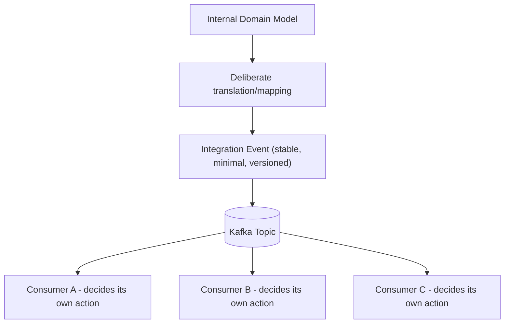
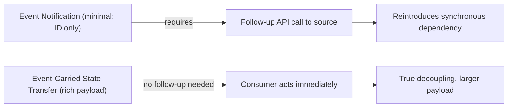
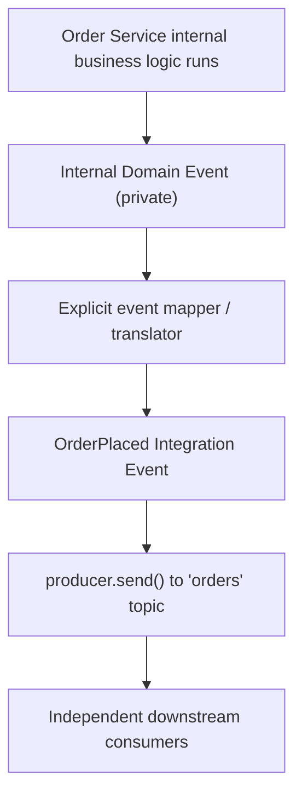
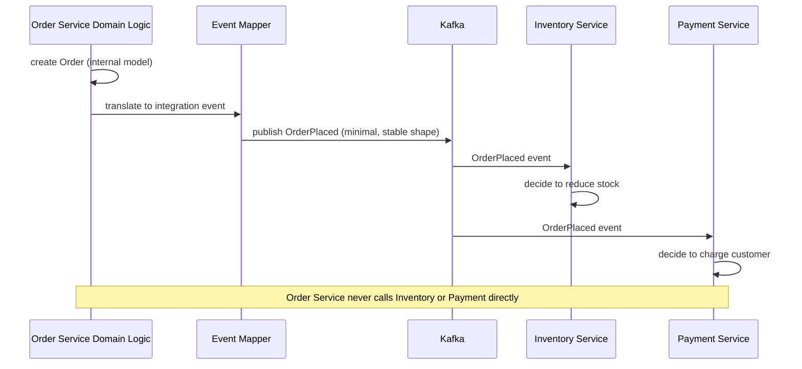

# Module 14 — Event-Driven Architecture

**Level:** ⭐⭐⭐ Intermediate → Advanced
**Track:** Kafka Complete Masterclass for Node.js Backend Engineers
**Module:** 14 of 25

---

## 1. Introduction

Modules 1–13 taught you how to move bytes through Kafka reliably, efficiently, and safely. This module asks a different question entirely: **what should those bytes actually represent?** This is a design question, not a mechanical one — and getting it wrong produces systems that are technically well-built but architecturally brittle: services secretly coupled through event *shape*, even though they're decoupled through direct calls.

This module gives you the vocabulary — event, domain event, integration event, event notification, event-carried state transfer — to make that design decision deliberately, the same way Module 6 gave you the vocabulary to deliberately choose a partition key.

---

## 2. Learning Objectives

By the end of this module, you will be able to:

1. Define "event" precisely, and distinguish it from a "command."
2. Distinguish domain events from integration events, and explain why the distinction matters.
3. Compare the "event notification" and "event-carried state transfer" patterns, and choose between them for a given use case.
4. Identify and avoid the most common event-design anti-patterns (anemic events, leaking internal domain models, disguised commands).
5. Design an event schema for a real business process that balances consumer autonomy against payload bloat.
6. Reason about event versioning and backward compatibility as your domain model evolves.

---

## 3. Why This Concept Exists

Kafka makes it *mechanically* easy to decouple services — Module 1 established that. But mechanical decoupling doesn't automatically produce *design* decoupling. If Service A publishes an event whose exact shape mirrors Service A's internal database schema, and five other services parse that exact shape to extract fields they need, then A's database migration becomes a five-team coordination problem — despite everyone technically "just using Kafka." The tight coupling didn't disappear; it moved from HTTP contracts into event payload shapes.

Event-driven architecture, as a discipline (not just "using Kafka"), exists to make sure the decoupling Kafka enables mechanically is also achieved *architecturally* — through deliberate choices about what an event represents, how much state it carries, and how its shape is allowed to evolve.

---

## 4. Problem Statement

Consider the Order Service's internal domain model changing over time:

1. Today, `OrderPlaced` events include a `customerId` field. Next quarter, the Order Service refactors internally to support "guest checkout" with no `customerId`. How many other services break, and why?
2. The Inventory Service needs the customer's shipping address to check regional stock availability. Should the `OrderPlaced` event include the full address, or should Inventory Service call back to Order Service's API to fetch it?
3. The Notification Service just needs to know "an order was placed" to trigger a workflow — it doesn't need the order's contents at all. Should its event look the same as the one Inventory Service consumes?
4. Six months from now, you need to add a `discountCode` field to `OrderPlaced`. How do you do this without breaking the five consumers already deployed in production?

Each of these is a design question that "just use Kafka" doesn't answer — they require the vocabulary and patterns this module introduces.

---

## 5. Real-World Analogy

### Analogy: A Newspaper vs. a Phone Call

A **command** ("ChargeCustomer") is like calling someone on the phone and telling them exactly what to do — it presumes you know, and are allowed to dictate, their next action. This creates a dependency: the caller must know the receiver's capabilities and business rules.

An **event** ("OrderPlaced") is like publishing a fact in a newspaper: "Order #4521 was placed at 10:32 AM." The newspaper doesn't know or care who reads it, and it doesn't tell anyone what to do — each reader (subscriber) decides for themselves what this fact means for them. The Payment Service reads it and decides to charge the customer; the Analytics Service reads the *same* fact and decides to log it. Neither the newspaper nor the event publisher needs to know these decisions are being made.

**Event notification** is a newspaper headline: "Order Placed — Order #4521." It tells you *something happened* but you must call the source for details. **Event-carried state transfer** is the newspaper printing the entire order confirmation slip inline: everything a reader might need is right there, no follow-up call required — at the cost of a much longer article.

---

## 6. Technical Definition

- **Event**: An immutable statement of fact about something that has already happened (past tense: `OrderPlaced`, not `PlaceOrder`). The publisher makes no assumption about who will read it or what they'll do.
- **Command**: An instruction telling a specific receiver what to do (`ChargeCustomer`). Commands are directed and imperative; they inherently couple the sender to the receiver's responsibilities. Commands are occasionally still modeled over Kafka, but require careful, deliberate design (a specific topic per command type, a single intended consumer) — they are not the default pattern this module recommends.
- **Domain Event**: An event significant within a single bounded context/service's internal domain model (e.g., `InventoryReserved` inside the Inventory Service's own domain), often not published externally at all.
- **Integration Event**: An event specifically designed and versioned for consumption *across* service boundaries — deliberately more stable, more minimal, and more carefully governed than an internal domain event, because external consumers can't be coordinated as easily as internal code.
- **Event Notification**: A minimal event containing just enough information (typically an ID and event type) to notify subscribers that something happened, requiring them to call back to the source system for full details if needed.
- **Event-Carried State Transfer (ECST)**: An event that includes enough of the relevant state directly in its payload that subscribers can act without any follow-up call to the source system.

---

## 7. Internal Working

### Domain event vs. integration event — why the distinction matters

```
Order Service's INTERNAL domain model (rich, may change often):

  Order {
    id, customerId, items[], internalRiskScore, internalPricingTier,
    fulfillmentWarehouseId, promotionsApplied[], ...
  }

Order Service's INTERNAL domain event (only used within its own
codebase, e.g., between internal modules or for its own audit log):

  OrderCreatedDomainEvent {
    ...mirrors internal model closely, changes whenever the
    internal model changes, NEVER published externally...
  }

Order Service's EXTERNAL integration event (published to Kafka,
consumed by other services):

  OrderPlacedIntegrationEvent {
    eventId, eventType: "OrderPlaced", orderId, customerId,
    items: [{ sku, quantity }], totalAmount, timestamp
    -- DELIBERATELY narrower and more stable than the internal
       model; internalRiskScore, fulfillmentWarehouseId, etc.
       are NOT exposed, because external consumers should never
       depend on Order Service's private implementation details --
  }
```

This separation means Order Service can freely refactor `internalRiskScore` or add a dozen new internal fields without ever touching (or breaking) a single external consumer — the integration event acts as a deliberate, stable **contract boundary**.

### Event notification vs. ECST — the payload trade-off

```
EVENT NOTIFICATION (minimal):

  { eventType: "OrderPlaced", orderId: 4521 }

  Inventory Service receives this, then must call:
    GET /orders/4521  (back to Order Service's API)
  to get item details before it can reduce stock.

  Pro: tiny payload, Order Service's internal shape can change
       freely without touching the event schema at all.
  Con: reintroduces a synchronous dependency on Order Service's
       API availability — partially undoing Kafka's decoupling.


EVENT-CARRIED STATE TRANSFER (richer):

  {
    eventType: "OrderPlaced", orderId: 4521,
    items: [{ sku: "ABC", quantity: 2 }],
    totalAmount: 59.98
  }

  Inventory Service has everything it needs directly from the
  event — no follow-up call required.

  Pro: true decoupling — Inventory Service can process even if
       Order Service's API is completely down.
  Con: payload is larger; if MANY different consumers need MANY
       different fields, the event can grow bloated trying to
       serve everyone.
```

---

## 8. Architecture

```
                    Order Service (Bounded Context)
     ┌───────────────────────────────────────────────────┐
     │  Internal Domain Model (rich, changes freely)        │
     │        │                                             │
     │        ▼                                             │
     │  Internal Domain Events (private, never leave here)  │
     │        │                                             │
     │        ▼  (deliberate translation/mapping step)       │
     │  Integration Event (stable, versioned, MINIMAL        │
     │  necessary surface area)                              │
     └────────────────────┬──────────────────────────────┘
                            │  published to Kafka topic
                            ▼
        ┌──────────────────┼──────────────────┐
        ▼                  ▼                  ▼
  Inventory Service   Payment Service   Analytics Service
  (own bounded         (own bounded      (own bounded
   context)              context)          context)
```

---

## 9. Step-by-Step Flow

1. Order Service's internal business logic creates/updates its rich internal domain model as part of placing an order.
2. Before publishing anything externally, Order Service performs a **deliberate translation step**: mapping its internal model to a minimal, stable integration event shape.
3. This integration event (not the raw internal model) is what's published to the `orders` Kafka topic.
4. Each downstream consumer (Inventory, Payment, Analytics) reads this same integration event and decides, independently, what to do with it — none of them ever see Order Service's internal domain model directly.
5. If Order Service needs to change its internal model, only the translation step (step 2) needs to change — the published integration event's shape stays stable, and no consumer needs to be touched, *unless* the integration event's shape itself is deliberately being versioned/evolved (Section 22, Section 26).

---

## 10. Detailed ASCII Diagrams

### 10.1 Command vs. Event

```
COMMAND (imperative, directed, tightly coupled):

  Order Service ──"ChargeCustomer(orderId, amount)"──► Payment Service

  Order Service must know: Payment Service exists, its exact API,
  and that charging is the CORRECT next action right now.


EVENT (declarative, fact-based, decoupled):

  Order Service ──"OrderPlaced(orderId, amount)"──► [Kafka Topic]
                                                          │
                                          ┌───────────────┼───────────────┐
                                          ▼               ▼               ▼
                                   Payment Service   Fraud Service   Analytics
                                   (decides to        (decides to     (decides to
                                    charge)            score risk)     log)

  Order Service knows NOTHING about who's listening or what
  they'll decide to do.
```

### 10.2 The Anemic Event Anti-Pattern

```
BAD: an event that's technically an "event" in name, but is
actually a disguised command:

  {
    eventType: "OrderPlaced",
    action: "ChargeCustomerNow",     <- an instruction, not a fact!
    amountToCharge: 59.98
  }

This LOOKS like an event (past tense name, published to a topic)
but its payload tells the consumer what to DO, coupling Order
Service to Payment Service's internal charging logic anyway.

GOOD: a genuine fact, letting Payment Service decide for itself:

  {
    eventType: "OrderPlaced",
    orderId: 4521,
    totalAmount: 59.98
  }

Payment Service reads this and independently decides "yes, I
should charge this order" — the decision logic lives where it
belongs: inside Payment Service.
```

### 10.3 Domain Model Leakage

```
BAD: publishing the internal domain model directly, unfiltered:

  {
    id: 4521, customerId: 99, internalRiskScore: 0.23,
    fulfillmentWarehouseId: "WH-DFW-2", pricingExperimentGroup: "B",
    items: [...], ...
  }

  Every consumer is now implicitly coupled to Order Service's
  INTERNAL implementation details — a refactor of the pricing
  experiment system breaks the event schema for everyone.

GOOD: an explicit integration event, curated deliberately:

  {
    eventType: "OrderPlaced", orderId: 4521, customerId: 99,
    items: [...], totalAmount: 59.98, timestamp: "..."
  }

  Only genuinely EXTERNAL-relevant fields are included; internal
  implementation details never cross the boundary.
```

---

## 11. Mermaid Diagrams





---

## 12. Request Flow Diagram



---

## 13. Sequence Diagram



---

## 14. Kafka Internal Flow

```
From Kafka's own mechanical perspective (Modules 1-13), an
"integration event" is just a regular record with a key and a
JSON (or Avro/Protobuf, Module 16) value, published to a topic.

Kafka itself enforces NONE of the design discipline this module
describes — it will happily transport an anemic, leaky, or
command-disguised-as-event payload just as readily as a
well-designed one.

This is precisely why event-driven architecture, as a design
discipline, must be applied DELIBERATELY by engineering teams —
Kafka provides the transport guarantees (Modules 1-12); good
event design is a human, architectural responsibility layered
on top.
```

---

## 15. Producer Perspective

The producing service owns the responsibility of:

- Translating its internal domain model into a deliberately-designed integration event (Section 7), never leaking internals.
- Publishing facts, not instructions (Section 10.1) — resisting the temptation to encode "what the consumer should do" into the event.
- Deciding, per event type, between event notification and event-carried state transfer (Section 7) based on realistic consumer needs.
- Owning and versioning the integration event's schema as a genuine, stable contract (Section 22, Section 26) — treating breaking changes with the same care as a public API's breaking changes.

---

## 16. Consumer Perspective

The consuming service's responsibility is to:

- Interpret the event as a fact and independently decide its own reaction — never assume the event is secretly an instruction meant just for it.
- Avoid reaching deep into an event's payload for fields that feel like "internal implementation leakage" from the producer — if a field looks like it shouldn't be there, it's worth raising with the producing team rather than quietly depending on it.
- Handle schema evolution gracefully (Section 22) — new optional fields appearing shouldn't break existing consumers, but consumers should be resilient to this by design (e.g., ignoring unknown fields rather than validating against an overly strict schema).

---

## 17. Broker Perspective

The Kafka broker has no concept of "event design quality" — a topic full of anemic, command-disguised, or domain-model-leaking events replicates, retains, and delivers exactly as reliably as a topic full of well-designed ones (Section 14). This is worth stating explicitly: **good event-driven architecture is not something Kafka enforces for you** — it's a discipline your team must apply and maintain, the same way good API design isn't enforced by HTTP itself.

---

## 18. Node.js Integration

### Recommended structure for event schema ownership

```
order-service/
├── src/
│   ├── events/
│   │   ├── OrderPlacedIntegrationEvent.js  # schema + mapper, explicit
│   │   └── schemas/
│   │       └── order-placed.v1.json         # explicit versioned schema
│   ├── domain/
│   │   └── Order.js                          # internal, rich domain model
│   └── producers/
│       └── orderEventProducer.js             # uses the mapper before publish
```

---

## 19. KafkaJS Examples

### 19.1 An explicit event mapper — the translation boundary

```javascript
// src/events/OrderPlacedIntegrationEvent.js

/**
 * Translates the internal, rich Order domain model into the
 * minimal, stable OrderPlaced integration event contract.
 * This is the ONE place internal changes are absorbed before
 * anything crosses the service boundary.
 */
export function toOrderPlacedIntegrationEvent(order) {
  return {
    eventId: crypto.randomUUID(),
    eventType: "OrderPlaced",
    eventVersion: 1,
    orderId: order.id,
    customerId: order.customerId,
    items: order.items.map((item) => ({ sku: item.sku, quantity: item.quantity })),
    totalAmount: order.totalAmount,
    timestamp: new Date().toISOString(),
    // NOTE: deliberately EXCLUDED: internalRiskScore,
    // fulfillmentWarehouseId, pricingExperimentGroup — these are
    // Order Service's private implementation details and must
    // never leak into the public integration event contract.
  };
}
```

### 19.2 Producer using the mapper — never publishing the raw domain model

```javascript
// src/producers/orderEventProducer.js
import { kafka } from "../config/kafka.js";
import { toOrderPlacedIntegrationEvent } from "../events/OrderPlacedIntegrationEvent.js";

const producer = kafka.producer({ idempotent: true });

export async function publishOrderPlaced(order) {
  // order is the RICH internal domain model — it never goes out directly.
  const integrationEvent = toOrderPlacedIntegrationEvent(order);

  await producer.send({
    topic: "orders",
    messages: [
      {
        key: String(order.id),
        value: JSON.stringify(integrationEvent),
      },
    ],
  });
}
```

### 19.3 A resilient consumer that ignores unknown fields (forward-compatible)

```javascript
// src/consumers/inventoryConsumer.js
import { kafka } from "../config/kafka.js";

const consumer = kafka.consumer({ groupId: "inventory-service" });

export async function startInventoryConsumer() {
  await consumer.connect();
  await consumer.subscribe({ topic: "orders", fromBeginning: false });

  await consumer.run({
    eachMessage: async ({ message }) => {
      const event = JSON.parse(message.value.toString());

      // Only destructure the fields THIS consumer actually needs.
      // Any new fields Order Service adds later (e.g., discountCode)
      // are simply ignored here — no breakage, no coupling to the
      // full event shape.
      const { orderId, items } = event;

      for (const { sku, quantity } of items) {
        await reduceStock(sku, quantity);
      }
      console.log(`[inventory] reduced stock for order ${orderId}`);
    },
  });
}

async function reduceStock(sku, quantity) {
  // ... DB update
}
```

### 19.4 Choosing event-carried state transfer vs. notification explicitly

```javascript
// Event notification variant — minimal, requires a follow-up call.
// Appropriate when the payload would otherwise need to serve MANY
// different, divergent consumer needs (risking bloat), or when the
// full state is large/sensitive and shouldn't be broadly replicated.
export function toOrderPlacedNotification(order) {
  return {
    eventId: crypto.randomUUID(),
    eventType: "OrderPlaced",
    orderId: order.id,
    // Consumers needing details call GET /orders/:id on Order Service.
  };
}

// Event-carried state transfer variant — richer, self-sufficient.
// Appropriate when consumers need to act even if Order Service's
// API is unavailable, and the relevant state is reasonably small.
export function toOrderPlacedFullState(order) {
  return {
    eventId: crypto.randomUUID(),
    eventType: "OrderPlaced",
    orderId: order.id,
    customerId: order.customerId,
    items: order.items,
    totalAmount: order.totalAmount,
    shippingAddress: order.shippingAddress,
  };
}
```

---

## 20. CLI Commands

```bash
# Inspect actual event payloads flowing through a topic, to audit
# for anemic events, leaked internals, or disguised commands
kafka-console-consumer.sh --bootstrap-server localhost:9092 \
  --topic orders --from-beginning --max-messages 5

# Useful during a schema review: pretty-print recent event payloads
kafka-console-consumer.sh --bootstrap-server localhost:9092 \
  --topic orders --from-beginning --max-messages 5 | jq .
```

---

## 21. Configuration Explanation

This module is primarily a design discipline rather than a set of broker/client configurations — there is no Kafka config that enforces "good event design." The closest structural levers are organizational/process ones:

| Practice | Purpose |
|---|---|
| Explicit event schema files (Section 18) | Makes the integration contract visible and reviewable, not implicit in code |
| `eventVersion` field in every event | Enables consumers to handle schema evolution deliberately (Section 22) |
| Schema Registry (Module 16 preview) | Provides tooling-enforced compatibility checking, going beyond convention alone |
| Code review focused on event shape | The actual enforcement mechanism for the discipline this module describes |

---

## 22. Common Mistakes

1. **Publishing the internal domain model directly**, without a translation step — the single most common event-design mistake, and the direct cause of the "one team's refactor breaks five other teams" failure mode.
2. **Disguising commands as events** (Section 10.2) — an event named `OrderPlaced` whose payload actually instructs a specific downstream action reintroduces the exact coupling event-driven architecture is meant to remove.
3. **Choosing event-carried state transfer by default without considering payload bloat** — if ten different consumers each need different fields, a single "include everything" event can become large and awkward to evolve.
4. **Choosing event notification by default without considering the reintroduced synchronous dependency** — if the source system's API becomes unavailable, notification-only consumers are blocked, partially undoing Kafka's core benefit.
5. **Treating integration events as free to change like internal code.** Once other teams depend on an event's shape, it is a genuine contract — breaking changes need the same discipline as breaking a public API.
6. **Not including a version field**, making future schema evolution far harder to manage safely (Section 26).

---

## 23. Edge Cases

- **What if two different consumers genuinely need incompatible views of the same business fact?** Consider publishing two distinct, deliberately-scoped events (e.g., `OrderPlacedForBilling` and `OrderPlacedForFulfillment`) rather than one bloated, all-things-to-all-consumers event.
- **What if a consumer needs data that changes AFTER the event was published** (e.g., the customer's address at the time of the event vs. their current address)? Event-carried state transfer captures a point-in-time snapshot — this is often exactly what's needed (an order's shipping address shouldn't retroactively change if the customer moves later), but it's worth being explicit about this semantic in your schema documentation.
- **What if an internal domain event and an integration event end up looking nearly identical?** This can be perfectly fine for a simple domain — the important thing is that the *decision* to expose them was deliberate, not that they must always differ superficially.

---

## 24. Performance Considerations

- Event-carried state transfer trades a larger payload (Module 4's compression and batching become more relevant) for the elimination of synchronous follow-up calls — for latency-sensitive consumers, this trade is often clearly worth it.
- Overly large, kitchen-sink integration events (trying to satisfy every possible future consumer's needs) can meaningfully increase storage, network, and compression overhead across the entire topic — a real, ongoing cost.

---

## 25. Scalability Discussion

- Well-designed integration events scale organizationally, not just technically: new teams can build new consumers against a stable, documented event contract without needing to coordinate with the publishing team at all — this is the actual architectural payoff of this module's discipline.
- Poorly-designed events (leaking internals, disguised commands) create *hidden* coordination requirements that only surface as production incidents when the publishing team's internal refactor unexpectedly breaks distant consumers — a scaling failure that looks technical but is actually a design-discipline failure.

---

## 26. Production Best Practices

- Maintain explicit, versioned schema definitions for every integration event (Section 18), reviewed with the same rigor as a public API contract.
- Default to additive-only schema evolution: add new optional fields; avoid removing or renaming fields consumers may depend on (Module 16's Schema Registry formalizes this with compatibility modes).
- Write events in the past tense, describing facts, never instructions.
- Periodically audit real production event payloads (Section 20) for anemic events, leaked internals, or disguised commands — this drifts over time without active governance.
- Document, per event type, whether it follows the notification or event-carried-state-transfer pattern, and why — this is a deliberate design decision worth recording (Module 24).

---

## 27. Monitoring & Debugging

- Track integration event schema changes over time (e.g., via schema registry history, Module 16) as a first-class engineering artifact, not an afterthought.
- When a consumer breaks after a producer's deploy, the first diagnostic question should be: "did the event's shape change, and was that change additive or breaking?" — this module's discipline exists specifically to make that question easy to answer.

---

## 28. Security Considerations

- Event-carried state transfer can inadvertently over-share sensitive data (e.g., including full payment details in an event consumed by an unrelated analytics service) — apply the same data minimization principles you'd apply to any API response.
- Be deliberate about which fields are safe to broadcast broadly via Kafka (many potential consumers) versus which should remain accessible only via a more tightly access-controlled direct API call (Module 20).

---

## 29. Interview Questions (Easy → Medium → Hard)

### Easy

1. What is the difference between an event and a command?
2. What is a domain event?
3. What is an integration event?

### Medium

4. What is the difference between event notification and event-carried state transfer?
5. Why is publishing your internal domain model directly considered an anti-pattern?
6. Why should events be named in the past tense?
7. What is a "disguised command," and why is it problematic?

### Hard

8. Design the event schema for an `OrderShipped` event serving three different consumers (Notification, Analytics, Customer Support), deciding between notification and event-carried state transfer, and justify your choice.
9. Explain, with a concrete example, how publishing an internal domain model directly can turn a routine internal refactor into a multi-team production incident.
10. A team wants to add a new required field to an existing, widely-consumed integration event. Explain why this is risky and how you'd approach it safely instead.
11. Compare the coupling implications of a Kafka-based command (a topic with exactly one intended consumer, instructing a specific action) versus a true event, even though both technically flow through the same infrastructure.

---

## 30. Common Interview Traps

- **Trap:** "Since Kafka decouples services technically, event-driven architecture is automatically well-designed." → **Reality:** Kafka provides mechanical decoupling; good event design (facts not commands, no leaked internals, deliberate payload scope) is a separate, human architectural discipline.
- **Trap:** "Domain events and integration events are just two names for the same thing." → **Reality:** Domain events are internal and can change freely; integration events are deliberately stabilized, minimal contracts meant for external consumption.
- **Trap:** "Event-carried state transfer is always better because it avoids follow-up calls." → **Reality:** It trades payload size and schema evolution complexity for that convenience — the right choice depends on actual consumer needs, not a universal rule.

---

## 31. Summary

- Events are immutable facts about what already happened; commands are directed instructions — conflating the two reintroduces the coupling Kafka is meant to remove.
- Domain events are internal and free to change; integration events are deliberately stabilized, minimal contracts for cross-service consumption.
- Event notification (minimal, requires follow-up) and event-carried state transfer (richer, self-sufficient) are two legitimate patterns with different trade-offs — choose deliberately per use case.
- Kafka enforces none of this design discipline mechanically; it must be actively maintained by engineering teams through schema ownership, versioning, and review.
- Good event design is what makes Kafka's mechanical decoupling translate into genuine architectural decoupling at organizational scale.

---

## 32. Cheat Sheet

```
EVENT-DRIVEN ARCHITECTURE — ONE PAGE

Event    = immutable FACT about the past ("OrderPlaced")
Command  = directed INSTRUCTION ("ChargeCustomer") — different pattern,
           reintroduces coupling if disguised as an event

Domain Event       = internal, free to change, private to one service
Integration Event  = external-facing, STABLE CONTRACT, versioned,
                      deliberately minimal, translated from the
                      internal domain model (never published raw)

Event Notification         = minimal (ID only), requires follow-up call
Event-Carried State Transfer = rich payload, self-sufficient, larger

Anti-patterns to avoid:
  - publishing raw internal domain model
  - disguised commands inside "event" payloads
  - unbounded, kitchen-sink events serving every possible consumer
  - breaking changes to a widely-consumed event schema

Golden rule: publish FACTS, translate deliberately at the boundary,
             version your contract, evolve additively
```

---

## 33. Hands-on Exercises

1. Take a raw internal domain model (e.g., an `Order` object with 15+ fields) and design a minimal `OrderPlaced` integration event from it, explicitly listing which fields you excluded and why.
2. Rewrite a "disguised command" event (e.g., `{ eventType: "OrderPlaced", action: "chargeNow" }`) as a genuine fact-based event, and describe how the consuming Payment Service's own logic would need to change.
3. Design both an event-notification and an event-carried-state-transfer version of a `UserSignedUp` event, and write one paragraph justifying which you'd actually choose for a real Notification Service consumer.
4. Audit a real (or example) production topic's message payloads for signs of internal domain model leakage, using the console consumer + `jq` (Section 20).

---

## 34. Mini Project

**Build:** An explicit event-mapping layer (as in Section 19.1) for the Order Service from earlier modules, with a documented schema file (JSON or similar) for `OrderPlaced`, and a test asserting that internal-only fields (like a hypothetical `internalRiskScore`) never appear in the published event payload.

---

## 35. Advanced Project

**Build:** A small multi-service demo (Order Service, Notification Service, Analytics Service) where Notification Service uses an event-notification pattern (calling back to Order Service's API for details) and Analytics Service uses event-carried state transfer (acting purely on the event payload) — then simulate Order Service's API being unavailable and observe which consumer keeps working and which doesn't.

---

## 36. Homework

1. Research and summarize the "Thin Events vs. Fat Events" debate in event-driven architecture literature, and note which factors experienced practitioners weigh when choosing.
2. Find (or recall) a real production incident story (from an engineering blog or your own experience) caused by an internal refactor leaking into a public event schema, and summarize the root cause and fix.
3. Write a short design doc proposing an event schema versioning policy for a hypothetical growing platform with 10+ independent consumer teams.

---

## 37. Additional Reading

- Martin Fowler — "What do you mean by Event-Driven?" (a foundational article distinguishing event notification, event-carried state transfer, event sourcing, and CQRS)
- Confluent blog: "Events vs. Commands" and "Data Contracts" series
- Domain-Driven Design literature (Eric Evans, Vaughn Vernon) on bounded contexts and domain events, for the conceptual foundation this module builds on

---

## Key Takeaways

- Events are facts; commands are instructions — Kafka can technically carry either, but conflating them reintroduces coupling.
- Domain events are internal and freely mutable; integration events are stable, deliberately-scoped external contracts.
- Event notification and event-carried state transfer are both legitimate, with different coupling/payload trade-offs.
- Kafka provides no built-in enforcement of good event design — it's a discipline maintained through deliberate translation layers, schema versioning, and team practice.

---

## Revision Notes

- Be able to explain, with an example, why publishing a raw internal domain model is risky.
- Be able to compare event notification and event-carried state transfer with a concrete scenario for each.
- Practice designing an integration event schema from a rich domain model until the "translation boundary" habit feels automatic.

---

## One-Page Cheat Sheet

*(See Section 32 above.)*

---

## 20 Practice Questions

1. What is an event, in one sentence?
2. What is a command?
3. Why are events named in the past tense?
4. What is a domain event?
5. What is an integration event?
6. Why should integration events be more minimal than internal domain models?
7. What is event notification?
8. What is event-carried state transfer?
9. What's a downside of event notification?
10. What's a downside of event-carried state transfer?
11. What is a "disguised command," and why is it an anti-pattern?
12. What is "domain model leakage" in event design?
13. Why does Kafka not enforce good event design on its own?
14. What role does an explicit event mapper/translator play?
15. Why should integration events include a version field?
16. What kind of schema change is generally safe? What kind is risky?
17. Who is responsible for maintaining the "contract" quality of an integration event?
18. Why might two consumers need two different events rather than one shared one?
19. What tool can help enforce compatibility for evolving event schemas (previewed for Module 16)?
20. Why is auditing real production event payloads a valuable ongoing practice?

---

## 10 Scenario-Based Questions

1. Order Service refactors its internal pricing logic, and five downstream services suddenly break. Diagnose the likely root cause given this module's concepts.
2. Your team is designing a `UserRegistered` event consumed by Email, Analytics, and Fraud Detection services, each needing different data. Walk through your design decision process.
3. A teammate proposes an event called `OrderPlaced` whose payload includes a field `chargeCustomerImmediately: true`. What concern would you raise?
4. Your Notification Service becomes unavailable whenever Order Service's API has an outage, even though both are "using Kafka." Diagnose the likely event-design cause.
5. You need to add a `giftMessage` optional field to an existing, widely-consumed event. Explain how you'd do this safely.
6. A new team wants to build a consumer for an existing event but finds the payload includes confusing internal fields like `pricingExperimentGroup`. What does this suggest about the original event design?
7. Your platform has 15 different event types, each structured completely differently with no shared conventions. What governance practice would you introduce?
8. A stakeholder asks why you can't just "send the whole database row" as the event payload for everything, to simplify things. How would you respond?
9. Two teams both need slightly different views of "a payment happened." Should they share one event or have two? What factors would guide this decision?
10. Explain to a new engineer, using the newspaper analogy, why an event publisher should never need to know who's consuming its events or what they'll do with them.

---

## 5 Coding Assignments

1. Write an explicit mapper function that transforms a rich internal `Order` object into a minimal `OrderPlaced` integration event, with unit tests confirming internal-only fields never appear in the output.
2. Implement both an event-notification and an event-carried-state-transfer version of the same business event, plus two different consumers demonstrating each pattern's actual behavior.
3. Write a schema validation script that checks a directory of example event payloads against a defined JSON Schema, flagging any unexpected/leaked fields.
4. Build a small "event catalog" generator: a script that scans your codebase's event mapper functions and produces a Markdown document listing every integration event, its fields, and its version.
5. Write a test that publishes an event with an added, new optional field, and confirms an "old" consumer (written before that field existed) still processes it correctly without error.

---

## Suggested Next Module

**Module 15 — Kafka Patterns**
With a solid vocabulary for event design in place, the next module covers the recurring architectural patterns built on top of it: retry topics, dead letter queues, request-reply over Kafka, fan-out, event sourcing, and the saga pattern for distributed transactions.
