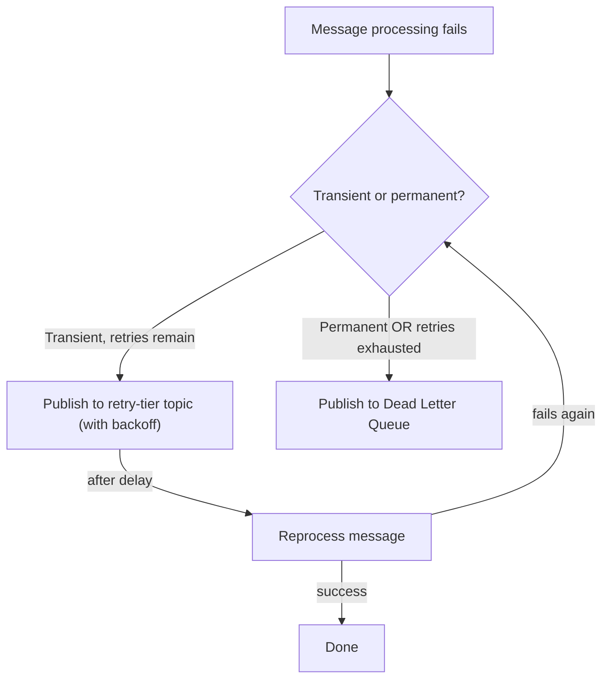
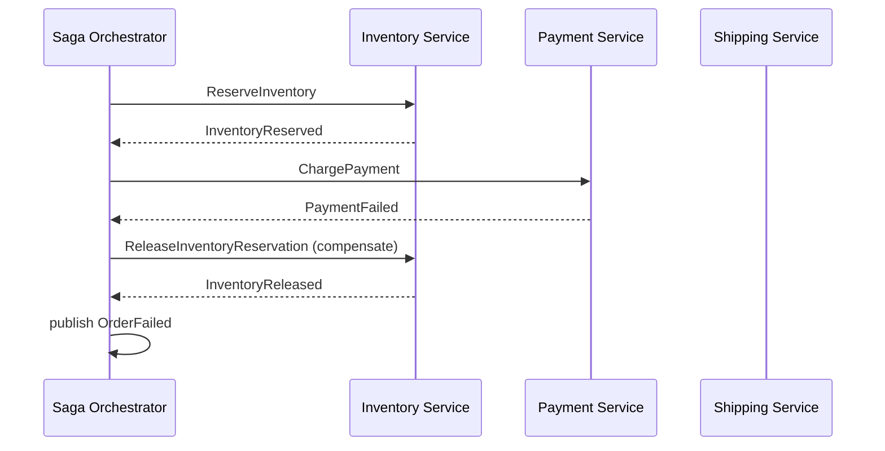
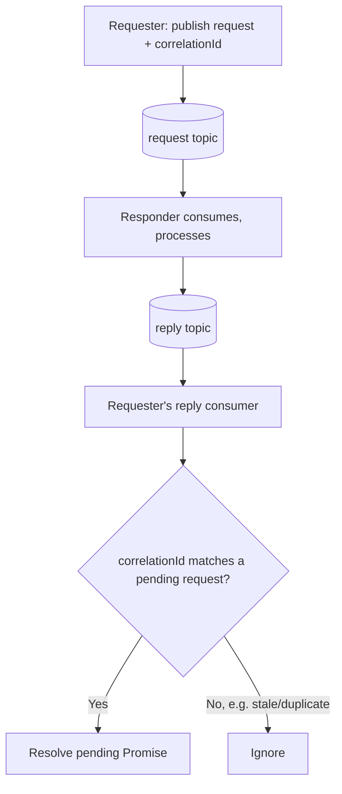
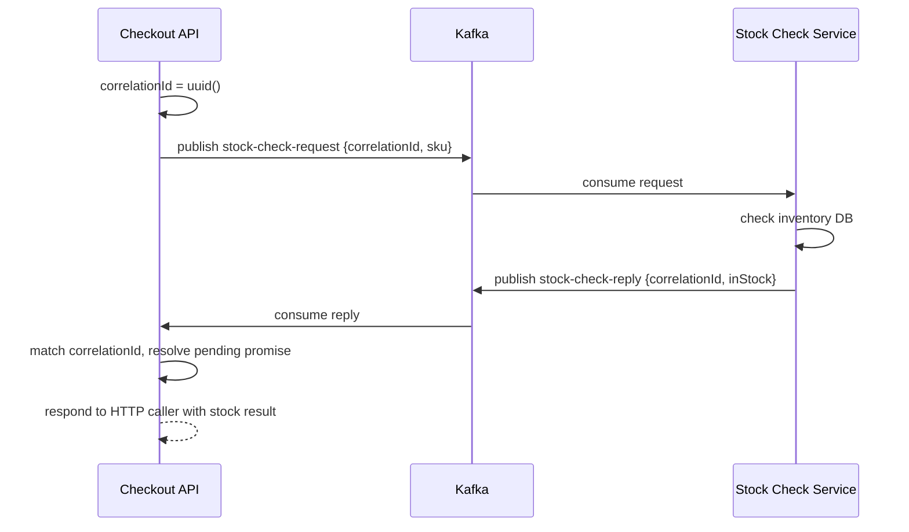

# Module 15 — Kafka Patterns

**Level:** ⭐⭐⭐⭐ Advanced
**Track:** Kafka Complete Masterclass for Node.js Backend Engineers
**Module:** 15 of 25

---

## 1. Introduction

Modules 1–14 gave you the mechanics (producers, consumers, replication, delivery guarantees) and the design vocabulary (events vs. commands, Module 14) to build individual, well-behaved services. This module assembles that foundation into six recurring, named architectural patterns you'll encounter in almost every non-trivial Kafka system: **retry topics**, **dead letter queues**, **request-reply**, **fan-out**, **event sourcing**, and the **saga pattern**.

Each pattern solves a specific, recurring problem that a single producer/consumer pair, by itself, doesn't handle well. Recognizing which pattern a given problem calls for — and knowing how to implement it correctly in Node.js — is a core "senior engineer" Kafka skill.

---

## 2. Learning Objectives

By the end of this module, you will be able to:

1. Implement a retry topic strategy with exponential backoff for transient processing failures.
2. Implement a dead letter queue (DLQ) for messages that can never succeed, with proper context preservation.
3. Implement request-reply messaging over Kafka for cases where a genuine synchronous-style response is needed.
4. Design a fan-out architecture where one event triggers multiple independent, parallel workflows.
5. Explain event sourcing as an architectural style and how Kafka's log model naturally supports it.
6. Explain the saga pattern for coordinating distributed transactions across services without two-phase commit.

---

## 3. Why This Concept Exists

Individually, a producer and a consumer (Modules 4–5) handle the *happy path* well. Real systems constantly deal with the *unhappy paths*: a downstream API that's temporarily down (needs retry), a message that will never be processable no matter how many times you retry it (needs a DLQ), a caller that genuinely needs a response before it can proceed (needs request-reply), one event that must trigger five independent, unrelated workflows (needs fan-out), a need to reconstruct historical state exactly as it evolved (needs event sourcing), and a business process spanning multiple services that must either all complete or all compensate (needs a saga).

These patterns exist because reinventing them ad hoc, under production pressure, tends to produce subtly broken versions of well-known solutions — this module gives you the tested, named version of each.

---

## 4. Problem Statement

Consider the Inventory Service again, now under more realistic failure conditions:

1. Reducing stock occasionally fails because the database is briefly unreachable (a transient issue). Retrying immediately just fails again instantly — how do you retry *intelligently*, without blocking the whole partition?
2. Some messages are permanently malformed (Module 13's poison pill) and will never succeed no matter how many retries. How do you stop them from blocking the partition forever, while still preserving them for investigation?
3. A checkout flow needs to know synchronously "is this item in stock?" before showing a confirmation page — a pure async event isn't a good fit here. How do you get request-reply semantics out of an inherently asynchronous system?
4. Placing an order needs to simultaneously (but independently) trigger inventory reservation, a fraud check, and an analytics log — how do you fan out one event into many independent workflows cleanly?
5. Your business wants a complete, auditable history of every state an order has ever been in, not just its current state — how does Kafka's own design make this almost free?
6. Placing an order requires reserving inventory, charging payment, and arranging shipping — across three separate services, with no shared database transaction. If payment fails after inventory was already reserved, how do you undo the reservation?

Each has a specific, well-known pattern as its answer.

---

## 5. Real-World Analogy

### Analogy: A Hospital's Triage and Referral System

- **Retry topic**: A patient with a treatable-but-not-urgent issue is told "come back in an hour if it hasn't improved" rather than being stuck in an infinite waiting room loop or being turned away permanently.
- **Dead letter queue**: A patient with a case the current clinic simply cannot handle is referred to a specialist clinic (a separate queue) for investigation, rather than endlessly retried at the same desk.
- **Request-reply**: A patient asking "what's my test result, right now?" needs a direct, synchronous answer — not a promise that a nurse will eventually mention it during their commute.
- **Fan-out**: A single patient intake form simultaneously triggers billing, a nurse's care plan, and a public health reporting requirement — three independent departments acting on the same one fact.
- **Event sourcing**: The patient's full medical chart is a complete history of every visit, diagnosis, and treatment ever recorded — never overwritten, only appended to — letting anyone reconstruct exactly how their condition evolved.
- **Saga**: A multi-department surgery requires anesthesiology, surgery, and recovery care to all happen in sequence; if surgery has to be aborted partway, anesthesiology's effects must be deliberately, explicitly reversed (compensated) — there's no single "undo the whole hospital visit" button.

---

## 6. Technical Definition

- **Retry Topic**: A separate Kafka topic (or set of topics) used to hold messages that failed transiently, to be reprocessed after a delay — often with multiple retry topics representing increasing backoff intervals (`retry-1s`, `retry-30s`, `retry-5m`).
- **Dead Letter Queue (DLQ)**: A topic holding messages that failed processing in a way considered non-recoverable (or that exhausted all retry attempts), preserved with error context for manual investigation, without blocking the original partition.
- **Request-Reply over Kafka**: A pattern where a request producer includes a unique correlation ID and a reply-to topic; the responding service processes the request and publishes a response keyed by that correlation ID to the reply topic, which the original requester consumes and matches back.
- **Fan-Out**: A single event, published once, consumed independently by multiple different consumer groups (Module 7), each triggering its own unrelated downstream workflow.
- **Event Sourcing**: An architectural style where the system of record is the complete, ordered sequence of events that have occurred, rather than just the current state — current state is always derived (or "replayed") from this event log, never stored as the sole source of truth.
- **Saga Pattern**: A way of managing a distributed transaction across multiple services as a sequence of local transactions, each with a corresponding **compensating transaction** to undo its effect if a later step fails — implemented either as **choreography** (services react to each other's events independently) or **orchestration** (a central coordinator explicitly directs each step).

---

## 7. Internal Working

### Retry topic with exponential backoff

```
Message fails processing (transient error, e.g., DB timeout)
      │
      ▼
Publish to "orders-retry-1s" topic (includes original message +
retry count + original topic/partition/offset for traceability)
      │
      ▼
A dedicated retry-1s consumer waits ~1s, then reprocesses
      │
      ├── SUCCESS → done
      │
      └── FAILS AGAIN → publish to "orders-retry-30s" (longer backoff)
                              │
                              ├── SUCCESS → done
                              │
                              └── FAILS AGAIN → publish to "orders-retry-5m"
                                                      │
                                                      └── exhausted all
                                                          retries →
                                                          publish to DLQ
```

Using **separate topics per backoff tier** (rather than looping and sleeping inside a single consumer) is deliberate: it avoids blocking the original partition's other messages while waiting, and it keeps retry timing decoupled from the main processing pipeline's throughput.

### Request-reply correlation

```
Requester                          Kafka                       Responder

correlationId = uuid()
   │
   ▼
publish to "stock-check-request"
  { correlationId, sku }
                                       │
                                       ▼
                              stock-check-request topic
                                       │
                                       ▼
                                              consume, check stock
                                              publish to "stock-check-reply"
                                              { correlationId, inStock: true }
                                       │
                                       ▼
                              stock-check-reply topic
   │
   ▼
Requester's reply-consumer receives
ALL replies, matches by correlationId
to the SPECIFIC pending request,
resolves that request's promise
```

The requester typically maintains an in-memory map of `correlationId → pending Promise resolver`, resolving the correct promise when a matching reply arrives — with a timeout to avoid waiting forever if no reply comes.

### Event sourcing — state is derived, not stored directly

```
Event log (source of truth, append-only):
  OrderCreated(orderId=1, items=[...])
  ItemAdded(orderId=1, sku="X", qty=1)
  OrderShipped(orderId=1)

Current state is COMPUTED by replaying these events, e.g.:

  function reduce(events) {
    let state = {};
    for (const e of events) {
      state = apply(state, e);   // pure function per event type
    }
    return state;
  }

  reduce([OrderCreated, ItemAdded, OrderShipped]) => {
    orderId: 1, items: [...], status: "SHIPPED"
  }

The CURRENT state is never the primary source of truth — it's
always reconstructable from the event log, which is Kafka's
natural strength (a durable, ordered, replayable log — Module 1).
```

---

## 8. Architecture

```
                     RETRY + DLQ ARCHITECTURE

  orders (main topic)
       │
       ▼
  Inventory Consumer ──fails (transient)──► orders-retry-1s
       │  succeeds                                │
       ▼                                    (after delay) retry
   done                                            │
                                              fails again
                                                    ▼
                                            orders-retry-30s
                                                    │
                                              fails again
                                                    ▼
                                            orders-dlq (with error
                                            context + original
                                            offset for investigation)
```

```
                    FAN-OUT ARCHITECTURE

                     orders (one topic, published ONCE)
                            │
        ┌───────────────────┼───────────────────┐
        ▼                   ▼                   ▼
  Inventory Group      Fraud Group        Analytics Group
  (own consumer          (own consumer      (own consumer
   group, independent     group)             group)
   offset tracking)
```

---

## 9. Step-by-Step Flow

### DLQ flow, end to end

1. Consumer attempts to process a message; processing throws an error.
2. Consumer classifies the error: transient (retry) or permanent (DLQ) — see Module 13's poison-pill distinction.
3. If retryable and under the max retry count, publish to the appropriate retry-tier topic, including original topic/partition/offset and current retry count in the message headers or payload.
4. If retries are exhausted, or the error is classified as permanent, publish to the DLQ topic with full error context (error message, stack trace summary, timestamp, original message).
5. Commit the original offset either way — the message has been "handled" (moved to retry/DLQ), so the main partition can proceed to the next message without blocking.
6. A separate, dedicated process (or manual/on-call review) consumes the DLQ topic for investigation, potential manual fix-and-replay, or permanent discard.

### Saga (orchestration variant), step by step

1. An Order Placement Saga Orchestrator receives an `OrderPlaced` event and begins coordinating the multi-step transaction.
2. It publishes a `ReserveInventory` command/request; waits for `InventoryReserved` or `InventoryReservationFailed`.
3. On success, it publishes `ChargePayment`; waits for `PaymentCharged` or `PaymentFailed`.
4. If `PaymentFailed` occurs, the orchestrator publishes a **compensating action**: `ReleaseInventoryReservation`, undoing step 2's effect.
5. If all steps succeed, the orchestrator publishes `OrderConfirmed`; if any step fails irrecoverably, it ensures all prior steps are compensated and publishes `OrderFailed`.

---

## 10. Detailed ASCII Diagrams

### 10.1 Retry Topic Message Envelope

```
Original message (on "orders"):
  { eventId: "evt-1", orderId: 4521, items: [...] }

After first failure, published to "orders-retry-1s":
  {
    originalMessage: { eventId: "evt-1", orderId: 4521, items: [...] },
    originalTopic: "orders",
    originalPartition: 2,
    originalOffset: "10345",
    retryCount: 1,
    lastError: "ECONNREFUSED: database unreachable",
    firstFailedAt: "2026-07-09T10:00:00Z"
  }

If it fails again, retryCount increments and it moves to
"orders-retry-30s", carrying the same envelope forward.
```

### 10.2 Request-Reply Timeout Handling

```
Requester sends request, correlationId = "corr-123", starts a
5-second timeout timer

Case A — reply arrives within 5s:
   reply-consumer matches "corr-123" → resolves pending Promise
   → timeout timer is cleared

Case B — no reply within 5s:
   timeout timer fires → pending Promise REJECTED with a
   "request timed out" error → caller handles this explicitly
   (this is why request-reply over Kafka needs careful timeout
    design — unlike a direct HTTP call, there's no built-in
    connection-level timeout to rely on)
```

### 10.3 Saga Compensation Chain

```
Step 1: ReserveInventory   → SUCCESS
Step 2: ChargePayment      → SUCCESS
Step 3: ArrangeShipping    → FAILS

Compensation runs in REVERSE order:
   Compensate Step 2: RefundPayment
   Compensate Step 1: ReleaseInventoryReservation

Final state: OrderFailed (inventory released, payment refunded —
system returned to a consistent state despite the mid-way failure)
```

---

## 11. Mermaid Diagrams





---

## 12. Request Flow Diagram



---

## 13. Sequence Diagram



---

## 14. Kafka Internal Flow

```
These patterns are built ENTIRELY on top of ordinary Kafka
mechanics already covered:

Retry topics / DLQ  -> just regular topics + regular producers/
                        consumers; the "pattern" is in the
                        APPLICATION-LEVEL orchestration logic
                        (classify error, republish, track retryCount)

Request-reply        -> just regular topics + a correlationId
                        convention + an in-memory pending-request
                        map on the requester side; Kafka itself has
                        no native "reply" primitive

Fan-out               -> simply MULTIPLE independent consumer
                        groups (Module 7) reading the SAME topic;
                        Kafka natively supports this with zero
                        extra mechanism required

Event sourcing        -> Kafka's own log model (Module 11) IS
                        essentially an event store already;
                        "current state" is a materialized view
                        derived via replay, often built using
                        Kafka Streams or a custom consumer

Saga                  -> a sequence of ordinary produce/consume
                        steps, coordinated either by an explicit
                        orchestrator service or by services simply
                        reacting to each other's events (choreography)
```

---

## 15. Producer Perspective

Producers implementing these patterns take on specific, deliberate responsibilities:

- **Retry/DLQ**: the consumer-turned-producer (republishing a failed message) must preserve enough context (original topic/partition/offset, retry count, error) for the message to be investigated or safely reprocessed later.
- **Request-reply**: the requester must generate a unique `correlationId` and include a `replyTo` topic reference, and must handle the possibility of no reply ever arriving (timeout).
- **Saga orchestration**: the orchestrator publishes commands/requests to each participating service and must track the overall transaction's state (which steps have succeeded) to know what to compensate if a later step fails.

---

## 16. Consumer Perspective

- **Retry/DLQ consumers**: a retry-tier consumer is often deliberately simple — wait, then attempt reprocessing, escalating to the next tier or DLQ on failure — while a DLQ consumer is typically a human-facing tool (dashboard, alert) rather than an automated reprocessor.
- **Request-reply**: the responder-side consumer is a completely ordinary consumer from its own perspective — it doesn't need to know it's part of a request-reply pattern; it just processes a request-shaped event and publishes a response.
- **Fan-out**: each consumer group is entirely independent and unaware of the others (Module 7) — this is the whole point; no consumer group's logic references or depends on another's existence.
- **Event sourcing**: a consumer building a "read model" (materialized view) processes events in order and applies each to its local projection of current state — this consumer's local state is disposable and rebuildable by replaying the log from the beginning if needed.

---

## 17. Broker Perspective

None of these patterns require anything special from the broker — they're entirely composed of ordinary topics, producers, and consumers (Section 14). The broker's job remains exactly what it's been throughout this course: durably store and serve records. This is worth internalizing — these "patterns" are architecture and application-logic conventions layered on top of Kafka's unchanged core mechanics, not special broker features.

---

## 18. Node.js Integration

### Recommended structure for a retry/DLQ-enabled consumer service

```
inventory-service/
├── src/
│   ├── consumers/
│   │   ├── mainConsumer.js
│   │   ├── retryConsumer.js
│   │   └── dlqConsumer.js  (or a dashboard/alert integration)
│   ├── lib/
│   │   ├── retryPublisher.js
│   │   └── errorClassifier.js
```

---

## 19. KafkaJS Examples

### 19.1 Retry topic publishing with backoff tiers

```javascript
// src/lib/retryPublisher.js
import { kafka } from "../config/kafka.js";

const producer = kafka.producer({ idempotent: true });
let connected = false;

const RETRY_TIERS = [
  { topic: "orders-retry-1s", delayMs: 1000 },
  { topic: "orders-retry-30s", delayMs: 30000 },
  { topic: "orders-retry-5m", delayMs: 300000 },
];

export async function connectRetryPublisher() {
  if (!connected) {
    await producer.connect();
    connected = true;
  }
}

export async function publishToNextTier({ originalMessage, originalTopic, originalPartition, originalOffset, retryCount, lastError }) {
  const nextTier = RETRY_TIERS[retryCount];

  if (!nextTier) {
    // Retries exhausted — escalate to the DLQ instead.
    await publishToDlq({ originalMessage, originalTopic, originalPartition, originalOffset, retryCount, lastError });
    return;
  }

  await producer.send({
    topic: nextTier.topic,
    messages: [
      {
        key: String(originalMessage.orderId ?? ""),
        value: JSON.stringify({
          originalMessage,
          originalTopic,
          originalPartition,
          originalOffset,
          retryCount: retryCount + 1,
          lastError: lastError?.message ?? String(lastError),
          failedAt: new Date().toISOString(),
        }),
      },
    ],
  });
}

export async function publishToDlq({ originalMessage, originalTopic, originalPartition, originalOffset, retryCount, lastError }) {
  await producer.send({
    topic: "orders-dlq",
    messages: [
      {
        key: String(originalMessage.orderId ?? ""),
        value: JSON.stringify({
          originalMessage,
          originalTopic,
          originalPartition,
          originalOffset,
          totalRetries: retryCount,
          finalError: lastError?.message ?? String(lastError),
          deadLetteredAt: new Date().toISOString(),
        }),
      },
    ],
  });
}
```

### 19.2 Main consumer using the retry/DLQ publisher

```javascript
// src/consumers/mainConsumer.js
import { kafka } from "../config/kafka.js";
import { publishToNextTier } from "../lib/retryPublisher.js";
import { isTransientError } from "../lib/errorClassifier.js";

const consumer = kafka.consumer({ groupId: "inventory-service" });

export async function startMainConsumer() {
  await consumer.connect();
  await consumer.subscribe({ topic: "orders", fromBeginning: false });

  await consumer.run({
    autoCommit: false,
    eachMessage: async ({ topic, partition, message }) => {
      const event = JSON.parse(message.value.toString());

      try {
        await reduceStock(event);
      } catch (err) {
        if (isTransientError(err)) {
          await publishToNextTier({
            originalMessage: event,
            originalTopic: topic,
            originalPartition: partition,
            originalOffset: message.offset,
            retryCount: 0,
            lastError: err,
          });
        } else {
          // Permanent failure — go straight to DLQ, skip retries entirely.
          await publishToNextTier({
            originalMessage: event,
            originalTopic: topic,
            originalPartition: partition,
            originalOffset: message.offset,
            retryCount: Infinity, // forces immediate DLQ tier
            lastError: err,
          });
        }
      }

      // Commit either way — this message has been HANDLED
      // (processed, or routed to retry/DLQ), so the main partition
      // is not blocked.
      await consumer.commitOffsets([
        { topic, partition, offset: (Number(message.offset) + 1).toString() },
      ]);
    },
  });
}

async function reduceStock(event) {
  // ... business logic that may throw
}
```

### 19.3 Request-reply implementation

```javascript
// src/lib/requestReply.js
import { randomUUID } from "crypto";
import { kafka } from "../config/kafka.js";

const producer = kafka.producer();
const replyConsumer = kafka.consumer({ groupId: `reply-consumer-${randomUUID()}` });
const pending = new Map();

export async function initRequestReply(replyTopic) {
  await producer.connect();
  await replyConsumer.connect();
  await replyConsumer.subscribe({ topic: replyTopic, fromBeginning: false });

  await replyConsumer.run({
    eachMessage: async ({ message }) => {
      const reply = JSON.parse(message.value.toString());
      const pendingRequest = pending.get(reply.correlationId);
      if (pendingRequest) {
        clearTimeout(pendingRequest.timer);
        pendingRequest.resolve(reply);
        pending.delete(reply.correlationId);
      }
    },
  });
}

export function requestStockCheck(sku, { requestTopic, timeoutMs = 5000 } = {}) {
  const correlationId = randomUUID();

  return new Promise((resolve, reject) => {
    const timer = setTimeout(() => {
      pending.delete(correlationId);
      reject(new Error(`Request ${correlationId} timed out after ${timeoutMs}ms`));
    }, timeoutMs);

    pending.set(correlationId, { resolve, timer });

    producer
      .send({
        topic: requestTopic,
        messages: [{ key: sku, value: JSON.stringify({ correlationId, sku }) }],
      })
      .catch((err) => {
        clearTimeout(timer);
        pending.delete(correlationId);
        reject(err);
      });
  });
}
```

### 19.4 Simple choreography-based saga step (Order → Inventory → Payment)

```javascript
// src/sagas/inventoryReservationHandler.js
// Inventory Service reacting independently to OrderPlaced — this is
// CHOREOGRAPHY: no central orchestrator, each service reacts to events.
import { kafka } from "../config/kafka.js";

const consumer = kafka.consumer({ groupId: "inventory-saga-participant" });
const producer = kafka.producer();

export async function startInventorySagaParticipant() {
  await consumer.connect();
  await producer.connect();
  await consumer.subscribe({ topic: "orders", fromBeginning: false });

  await consumer.run({
    eachMessage: async ({ message }) => {
      const event = JSON.parse(message.value.toString());
      if (event.eventType !== "OrderPlaced") return;

      try {
        await reserveInventory(event);
        await producer.send({
          topic: "inventory-events",
          messages: [
            { key: String(event.orderId), value: JSON.stringify({ eventType: "InventoryReserved", orderId: event.orderId }) },
          ],
        });
      } catch (err) {
        await producer.send({
          topic: "inventory-events",
          messages: [
            { key: String(event.orderId), value: JSON.stringify({ eventType: "InventoryReservationFailed", orderId: event.orderId, reason: err.message }) },
          ],
        });
      }
    },
  });
}

// A separate Payment Service consumer would react to InventoryReserved
// by attempting a charge, and publish PaymentCharged/PaymentFailed —
// and a compensating consumer would react to PaymentFailed by publishing
// a ReleaseInventoryReservation command back to Inventory Service.
```

---

## 20. CLI Commands

```bash
# Create the retry-tier and DLQ topics
kafka-topics.sh --bootstrap-server localhost:9092 \
  --create --topic orders-retry-1s --partitions 6 --replication-factor 3
kafka-topics.sh --bootstrap-server localhost:9092 \
  --create --topic orders-retry-30s --partitions 6 --replication-factor 3
kafka-topics.sh --bootstrap-server localhost:9092 \
  --create --topic orders-dlq --partitions 6 --replication-factor 3

# Inspect DLQ contents for investigation
kafka-console-consumer.sh --bootstrap-server localhost:9092 \
  --topic orders-dlq --from-beginning | jq .

# Check lag specifically on retry topics — a growing retry-tier lag
# often indicates a persistent (not transient) downstream issue
kafka-consumer-groups.sh --bootstrap-server localhost:9092 \
  --describe --group inventory-retry-consumer
```

---

## 21. Configuration Explanation

| Config/Concept | Meaning |
|---|---|
| Retry tier topics | Ordinary topics, typically named by delay (`-retry-1s`, `-retry-30s`) |
| `retryCount` (application field) | Tracks how many times a message has been retried, drives escalation |
| DLQ topic | Ordinary topic, typically named `-dlq`, holding permanently-failed messages with error context |
| `correlationId` (application field) | Unique identifier linking a request to its corresponding reply |
| `replyTo` (application field, optional) | Lets a responder know which topic to publish its reply to, if multiple reply topics are in use |
| Saga orchestrator state store | Application-owned (e.g., a database table) tracking which steps of a given saga instance have completed, for compensation logic |

---

## 22. Common Mistakes

1. **Implementing retry as an in-process sleep-and-retry loop inside `eachMessage`.** This blocks the partition (and delays heartbeats, risking a rebalance, Module 7) for the retry duration — separate retry topics avoid this entirely.
2. **Not preserving enough context when publishing to a DLQ.** A DLQ message without the original error, offset, and timestamp is nearly useless for investigation.
3. **Forgetting a timeout in request-reply implementations.** Without one, a lost or never-sent reply leaves the requester waiting forever.
4. **Using request-reply over Kafka as a default pattern for everything.** It reintroduces synchronous coupling and latency; reserve it for genuine cases where a true async event doesn't fit, and prefer a direct API call if that's actually simpler and available.
5. **Building event sourcing without a clear materialized-view/projection strategy.** An event log alone isn't useful without an efficient way to derive current state — usually via Kafka Streams, a dedicated projector consumer, or periodic snapshotting.
6. **Implementing sagas without designing compensating transactions up front.** A saga design that only handles the happy path isn't a complete saga — the compensation logic is the entire point.

---

## 23. Edge Cases

- **What if a message keeps cycling through all retry tiers and lands in the DLQ, but the underlying issue (e.g., a downstream outage) later resolves?** DLQ messages are typically designed to be manually (or semi-automatically) replayable back into the main topic once the issue is confirmed fixed — this "replay from DLQ" capability should be a deliberate, tested part of your DLQ tooling, not an afterthought.
- **What if a request-reply requester's process crashes while awaiting a reply?** The in-memory pending-request map is lost; on restart, any late-arriving reply for that correlationId simply has no match and is safely ignored (Section 12) — the caller side needs its own retry/recovery logic for this case.
- **What if two saga steps' compensations themselves fail** (e.g., `RefundPayment` fails during compensation)? This is a genuinely hard distributed-systems problem — typically mitigated by making compensating actions idempotent and retryable (Module 10's patterns apply directly), and by alerting a human when compensation itself repeatedly fails.

---

## 24. Performance Considerations

- Retry-tier topics add some overall system complexity and topic count, but isolate retry traffic from main-path traffic — this is usually a net throughput win under partial failure conditions, since the main partition isn't blocked waiting on retries.
- Request-reply over Kafka has meaningfully higher latency than a direct HTTP call in the common case (multiple produce/consume round trips vs. one TCP round trip) — use it only when the asynchronous, Kafka-native benefits (durability, no direct network dependency between the two services) outweigh this cost.
- Event sourcing's replay cost grows with event log length — long-lived aggregates benefit from periodic snapshotting (storing a materialized state at a checkpoint) to avoid replaying an ever-growing full history on every rebuild.

---

## 25. Scalability Discussion

- Retry/DLQ topics scale independently of the main topic — you can provision fewer partitions for a (hopefully low-volume) DLQ than for your high-volume main topic.
- Fan-out scales "for free" in the sense that adding a new consumer group requires zero changes to the producer or existing consumer groups (Module 7) — this is one of event-driven architecture's clearest organizational scaling wins (Module 14).
- Choreography-based sagas scale well technically (no central coordinator bottleneck) but can become hard to reason about as the number of participating services grows; orchestration-based sagas centralize complexity into one visible place at the cost of a coordination dependency.

---

## 26. Production Best Practices

- Always design DLQ tooling (inspection, alerting, and controlled replay) as a first-class part of any retry/DLQ implementation — a DLQ nobody looks at is just a slower way to lose data.
- Set sensible, bounded retry tiers (e.g., 3–5 tiers) rather than unbounded retries — every message must eventually reach a terminal state (success or DLQ).
- For request-reply, always set a reasonable timeout and handle the rejection path explicitly in calling code.
- For sagas, log every step transition and compensation action with the saga instance's correlation ID, so a partially-failed transaction can always be reconstructed and understood after the fact.
- Prefer choreography for a small number of participants with simple flows; prefer orchestration once the number of steps/participants or the need for centralized visibility grows.

---

## 27. Monitoring & Debugging

- Track per-tier retry topic lag and message counts — a consistently growing retry-1s lag, for instance, is an early signal of a persistent (not actually transient) downstream problem.
- Alert on DLQ message arrivals — even a single DLQ message often warrants investigation, since it represents guaranteed lost/stuck business data if ignored.
- For sagas, maintain a dashboard or queryable log of in-flight and completed saga instances, including which step each is currently on — essential for diagnosing a "stuck" distributed transaction.

---

## 28. Security Considerations

- DLQ messages often contain sensitive business data alongside error details — apply the same access controls to DLQ topics as to the original topic, not looser ones.
- Request-reply correlation IDs should be unpredictable (UUIDs) to prevent a malicious actor from guessing and intercepting/injecting responses for another caller's request.

---

## 29. Interview Questions (Easy → Medium → Hard)

### Easy

1. What is a dead letter queue?
2. What is a retry topic?
3. What is request-reply over Kafka?

### Medium

4. Why use separate retry-tier topics instead of an in-process retry loop?
5. What is fan-out, and why does Kafka support it naturally?
6. What is event sourcing?
7. What is the difference between saga choreography and saga orchestration?

### Hard

8. Design a full retry/DLQ pipeline for a payment-processing consumer, including backoff tiers and DLQ replay tooling.
9. Explain why request-reply over Kafka has higher latency than a direct HTTP call, and describe a scenario where it's still the right choice.
10. Design a saga (orchestrated) for a travel-booking system involving flight, hotel, and car rental reservations, including the compensating transaction for each step.
11. Explain how event sourcing's "replay to derive current state" model relates to Kafka's own log-and-offset design from Module 11, and why Kafka is a natural fit for implementing it.

---

## 30. Common Interview Traps

- **Trap:** "Retries should just be a loop with `await sleep()` inside the consumer." → **Reality:** This blocks the partition and risks rebalances; production systems use separate retry-tier topics instead.
- **Trap:** "A DLQ is just for permanently broken messages — nothing to actively monitor." → **Reality:** DLQ arrivals represent real, stuck business data and should be alerted on and investigated promptly, and often replayed once the underlying issue is fixed.
- **Trap:** "Kafka has built-in request-reply support." → **Reality:** Kafka has no native reply mechanism; request-reply is entirely an application-level convention (correlation IDs, reply topics, timeouts) built on ordinary produce/consume.

---

## 31. Summary

- Retry topics and DLQs handle transient and permanent processing failures respectively, without blocking the main partition, using ordinary topics plus application-level orchestration.
- Request-reply over Kafka provides synchronous-style semantics atop an asynchronous system via correlation IDs and reply topics, at the cost of added latency and complexity.
- Fan-out is a natural, zero-extra-mechanism consequence of Kafka's consumer group model (Module 7), enabling independent workflows to react to the same event.
- Event sourcing treats the event log as the source of truth, deriving current state via replay — a natural fit for Kafka's durable, ordered, replayable log.
- The saga pattern coordinates distributed transactions across services via a sequence of local transactions and compensating actions, implemented via choreography or orchestration.

---

## 32. Cheat Sheet

```
KAFKA PATTERNS — ONE PAGE

Retry Topic:   separate topic(s) per backoff tier; republish on
               transient failure; escalate through tiers; commit
               original offset regardless (message is "handled")

Dead Letter Queue: terminal topic for permanently-failed or
               retry-exhausted messages; preserve full error
               context; monitor and support manual replay

Request-Reply: correlationId + reply topic + in-memory pending
               map + TIMEOUT; not Kafka-native, application-built

Fan-Out:       multiple independent consumer GROUPS on the same
               topic; zero extra mechanism, native to Kafka

Event Sourcing: event log = source of truth; current state =
               DERIVED via replay; snapshot for long histories

Saga:          distributed transaction via local transactions +
               COMPENSATING transactions per step
               Choreography = services react to each other's events
               Orchestration = central coordinator directs each step

Golden rule: these are ALL application-level patterns built on
             ordinary Kafka producers/consumers — no special
             broker feature is required for any of them
```

---

## 33. Hands-on Exercises

1. Build the retry/DLQ pipeline from Section 19.1–19.2, deliberately injecting a transient failure (e.g., a flag that fails the first 2 attempts) and confirm the message succeeds on a later retry tier.
2. Force a permanent failure and confirm the message lands in the DLQ with full error context.
3. Build the request-reply pattern from Section 19.3, and test both the success path and the timeout path (by never publishing a reply).
4. Implement 2 independent consumer groups on the same topic (fan-out) and confirm both process every message fully independently, with separate lag tracking.

---

## 34. Mini Project

**Build:** A complete retry/DLQ system for the Inventory Service, with 3 backoff tiers, a DLQ, and a small CLI tool to list DLQ messages and selectively "replay" a chosen message back into the main topic.

---

## 35. Advanced Project

**Build:** An orchestrated saga for order placement spanning three simulated services (Inventory, Payment, Shipping), with a saga orchestrator tracking state in a small database table, full compensation logic for each possible failure point, and a dashboard script showing the current state of all in-flight saga instances.

---

## 36. Homework

1. Research how a real streaming framework (e.g., Kafka Streams, or a Node.js equivalent) implements event-sourcing-style state stores and snapshotting internally, and summarize the key ideas.
2. Compare choreography and orchestration sagas across at least four dimensions (visibility, coupling, complexity growth, failure handling) and write a short recommendation for a 3-service vs. a 10-service saga.
3. Design (on paper) a DLQ alerting and replay policy for a hypothetical production system, specifying who gets alerted, how quickly, and what "safe to replay" means for your scenario.

---

## 37. Additional Reading

- Chris Richardson, *Microservices Patterns* — chapters on Saga, Event Sourcing, and Dead Letter Channel patterns (originally from Enterprise Integration Patterns, adapted for microservices/Kafka)
- Gregor Hohpe & Bobby Woolf, *Enterprise Integration Patterns* — the original "Dead Letter Channel" and "Request-Reply" pattern definitions
- Confluent blog: "Building a Microservices Ecosystem with Kafka Streams and KSQL" (event sourcing and saga examples in a Kafka-native context)

---

## Key Takeaways

- Retry topics and DLQs handle unhappy-path failures without blocking the main processing pipeline, using ordinary Kafka topics plus deliberate application logic.
- Request-reply over Kafka provides synchronous-style semantics at the cost of added latency, using correlation IDs and reply topics — not a native Kafka feature.
- Fan-out is a natural, free consequence of independent consumer groups reading the same topic.
- Event sourcing treats Kafka's log as the source of truth, with current state always derivable via replay.
- The saga pattern coordinates multi-service distributed transactions through local transactions and explicit compensating actions, via choreography or orchestration.

---

## Revision Notes

- Be able to draw the retry-tier escalation diagram and explain why separate topics are used instead of an in-process sleep loop.
- Be able to explain request-reply's correlation ID mechanism and why a timeout is essential.
- Practice designing a saga's compensating transactions for at least two different business processes until it feels natural.

---

## One-Page Cheat Sheet

*(See Section 32 above.)*

---

## 20 Practice Questions

1. What is a dead letter queue?
2. What is a retry topic?
3. Why use separate retry-tier topics instead of an in-process retry loop?
4. What context should a DLQ message preserve?
5. What is request-reply over Kafka?
6. What Kafka-native feature implements request-reply? (Trick question — none.)
7. What is a correlation ID used for?
8. Why does request-reply need a timeout?
9. What is fan-out?
10. Why does Kafka support fan-out with zero extra mechanism?
11. What is event sourcing?
12. What is a materialized view / projection in event sourcing?
13. Why might a long event history need snapshotting?
14. What is the saga pattern used for?
15. What is a compensating transaction?
16. What's the difference between saga choreography and orchestration?
17. What happens if all retry tiers are exhausted for a message?
18. Why should you commit the original offset after routing a message to retry/DLQ?
19. What's a risk of blocking a partition with an in-process retry loop?
20. Why should compensating transactions be idempotent?

---

## 10 Scenario-Based Questions

1. Your Inventory Service's database has an occasional 2-second blip causing processing failures. Design a retry strategy that handles this without blocking the partition.
2. A message with malformed JSON keeps failing and would exhaust all retry tiers pointlessly. How should your consumer classify and handle this differently from a transient failure?
3. Your checkout flow needs a synchronous "is this in stock?" answer. Explain why a plain Kafka event alone doesn't fit, and how request-reply addresses it.
4. Three unrelated teams each need to react independently to `OrderPlaced`. Explain why they don't need to coordinate with each other or with Order Service.
5. Your business wants to audit exactly how an order's status changed over time, including who/what caused each change. How does event sourcing address this naturally?
6. A saga's payment step fails after inventory was already reserved. Walk through the compensation sequence.
7. A saga's compensating "refund payment" step itself fails. What would you do operationally, and how would you prevent this from silently going unnoticed?
8. Your DLQ has been silently accumulating messages for a week with no alerting. What's the practical business impact, and how would you fix the process going forward?
9. You're deciding between saga choreography and orchestration for a new 6-service order fulfillment flow. What factors would tip the decision either way?
10. A request-reply caller's process crashes while waiting for a reply that arrives 10 seconds later. Explain what happens to that reply and why it's safe.

---

## 5 Coding Assignments

1. Implement a 3-tier retry system (1s, 30s, 5m) with a DLQ escalation path, including full error-context preservation at each stage.
2. Build a DLQ replay CLI tool that lists DLQ messages and republishes a selected one back to the original topic, clearing its DLQ envelope.
3. Implement request-reply with a configurable timeout, and write a test confirming both the success path and the timeout/rejection path work correctly.
4. Build two independent consumer groups reading the same topic (fan-out), each maintaining separate state, and confirm via `kafka-consumer-groups.sh --describe` that their offsets track independently.
5. Implement a simple orchestrated saga (3 steps, in-memory state) with full compensation logic, including a deliberate failure injection at each possible step to test all compensation paths.

---

## Suggested Next Module

**Module 16 — Schema Registry**
With these architectural patterns in place, the next module addresses a question this module's event schemas raised repeatedly: how do you enforce and evolve event contracts safely at scale using Avro, Protobuf, or JSON Schema, with tooling-backed compatibility guarantees rather than convention alone?
