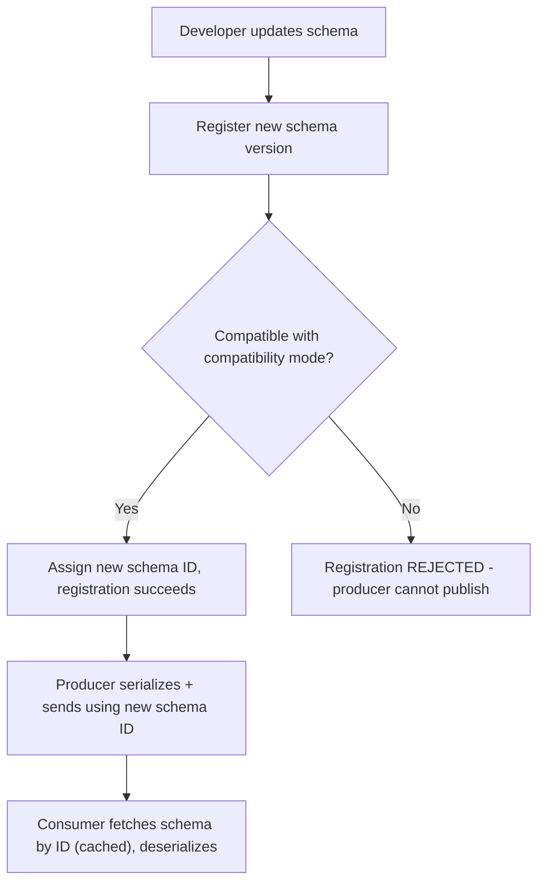
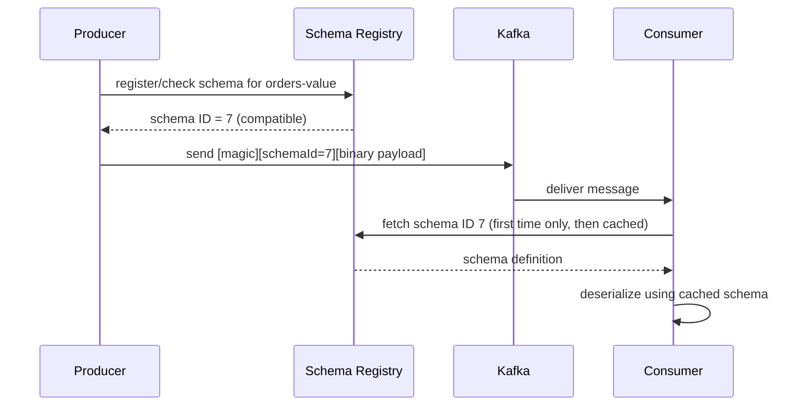
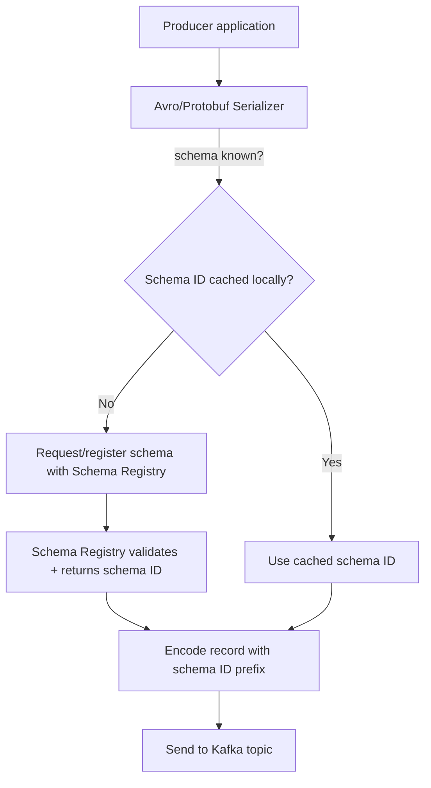
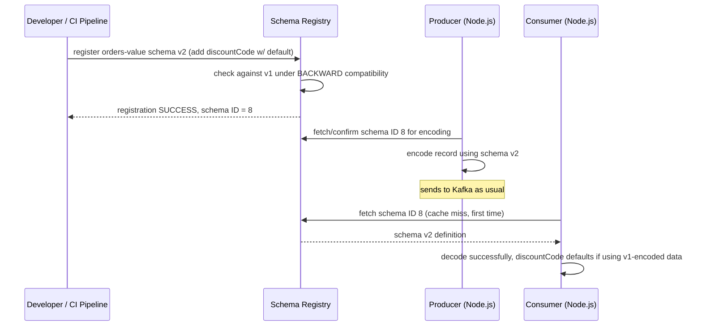

# Module 16 — Schema Registry

**Level:** ⭐⭐⭐⭐ Advanced
**Track:** Kafka Complete Masterclass for Node.js Backend Engineers
**Module:** 16 of 25

---

## 1. Introduction

Module 14 established that integration events are contracts, and that breaking changes to a widely-consumed event schema are as serious as breaking a public API. What it didn't cover is *how you actually enforce that* — beyond convention, code review, and good intentions. This module introduces the **Schema Registry**: a dedicated service that stores, versions, and validates event schemas (Avro, Protobuf, or JSON Schema), and — critically — can **mechanically reject** a producer's attempt to publish a schema-breaking change before it ever reaches a topic.

This is the module where "we have a convention that events shouldn't break compatibility" becomes "the system will not let you publish an incompatible schema," which is a categorically stronger guarantee.

---

## 2. Learning Objectives

By the end of this module, you will be able to:

1. Explain what a Schema Registry is and the specific problem it solves beyond plain JSON payloads.
2. Compare Avro, Protobuf, and JSON Schema as serialization formats for Kafka events.
3. Explain schema compatibility modes (`BACKWARD`, `FORWARD`, `FULL`, and their transitive variants) and choose the right one for a given topic.
4. Register, evolve, and validate schemas using a Schema Registry from Node.js.
5. Implement Avro (or Protobuf) serialization/deserialization in a KafkaJS producer and consumer.
6. Diagnose and prevent common schema evolution failures before they reach production.

---

## 3. Why This Concept Exists

Plain JSON payloads (used throughout this course so far) have a specific, real weakness: **nothing stops a producer from publishing a payload shape that silently breaks an existing consumer**. If Order Service renames `customerId` to `custId`, or changes a field's type from string to number, every consumer parsing that field breaks — and there is no mechanism catching this before it happens in production. Module 14 addressed this at the level of *discipline and design*; the Schema Registry addresses it at the level of **tooling enforcement**.

A Schema Registry exists to answer: "Can I actually stop a bad schema change from being published, rather than just hoping engineers remember not to make one?" It does this by centralizing schema storage, versioning every change, and validating each new schema version against a configured compatibility rule before allowing it to be registered — and, in well-integrated setups, before a producer is even allowed to publish data under it.

---

## 4. Problem Statement

Consider the `orders` topic, now serving 8 different consumer teams across the company:

1. Order Service wants to rename `customerId` to `custId` for internal consistency. How do you catch this breaking change **before** it reaches production, rather than after 8 teams' consumers start throwing errors?
2. A new team wants to add a `discountCode` field. How do you confirm, with certainty (not just a code review "looks fine"), that this addition won't break any of the 8 existing consumers?
3. Different teams are using different serialization formats inconsistently (some JSON, some ad hoc binary) — how do you standardize this while keeping message sizes efficient?
4. You need to know, months later, exactly what the `orders` schema looked like in March vs. today, for debugging an old, still-unprocessed message. How do you retrieve historical schema versions reliably?

Each of these requires infrastructure beyond "write JSON and hope for the best" — this module provides it.

---

## 5. Real-World Analogy

### Analogy: A Building Code Office

Imagine a city where anyone can build any structure they like, however they like, with no inspection — this is the "just publish JSON and hope" approach. Eventually, someone builds something that doesn't connect properly to the water main (a breaking schema change), and it's only discovered when the neighboring building's plumbing floods (a consumer crashes in production).

A **Schema Registry** is the city's building permit office. Before you're allowed to build (publish data under a schema), you submit your blueprint (schema definition). The office checks it against the existing neighborhood's connections (compatibility rules) — a new pipe (an added optional field) is fine; ripping out the water main connection entirely (removing a required field) is rejected outright, before construction even begins. Over time, the office keeps a complete historical record of every blueprint version ever approved for every address (schema version history) — invaluable when you need to understand what was built five years ago.

---

## 6. Technical Definition

- **Schema Registry**: A centralized service (e.g., Confluent Schema Registry, or compatible alternatives) that stores versioned schemas for Kafka topics, validates new schema versions against a configured compatibility rule, and serves schemas to producers/consumers for serialization/deserialization.
- **Avro**: A compact, binary serialization format with a rich schema definition language (JSON-based schema files describing a binary wire format), widely used with Kafka due to strong Schema Registry tooling support and efficient encoding.
- **Protobuf (Protocol Buffers)**: A binary serialization format defined via `.proto` files, offering strong typing, compact encoding, and native support for schema evolution via field numbers.
- **JSON Schema**: A way of formally describing the structure of JSON payloads, offering schema validation for teams that want to keep human-readable JSON on the wire while still gaining Schema Registry compatibility checking.
- **Compatibility Mode**: A per-subject (topic-schema) configuration determining what kind of schema changes are allowed:
  - `BACKWARD`: New schema can read data written with the *previous* schema (safe for consumers upgrading after producers).
  - `FORWARD`: Old schema can read data written with the *new* schema (safe for consumers upgrading before producers).
  - `FULL`: Both backward and forward compatible simultaneously.
  - `*_TRANSITIVE` variants: The same rules applied against *all* previous versions, not just the immediately prior one.
  - `NONE`: No compatibility checking at all (compatibility enforcement is disabled for that subject).
- **Subject**: The Schema Registry's unit of versioning — typically named `<topic>-value` (or `-key`), representing the evolving history of schemas used for a specific topic's message values (or keys).

---

## 7. Internal Working

### How schema registration and validation actually happens

```
1. A producer, before sending, serializes its record according to
   a schema (Avro/Protobuf/JSON Schema)

2. The producer's serializer checks: is this exact schema already
   registered for the subject "orders-value"?

3. If NOT registered yet, the serializer submits it to the Schema
   Registry for registration

4. The Schema Registry checks the new schema against the subject's
   configured COMPATIBILITY MODE, comparing it to the relevant
   prior version(s)

5. If compatible: the schema is registered, assigned a new
   SCHEMA ID, and registration succeeds — the producer proceeds
   to send data referencing this schema ID

6. If INCOMPATIBLE: registration is REJECTED with an error —
   the producer's send() call fails BEFORE any data reaches the
   topic, preventing the breaking change from ever propagating
```

### The wire format — why messages are tiny even with a rich schema

```
A message on the wire does NOT repeat the full schema every time
(that would be wasteful). Instead:

  [magic byte][4-byte schema ID][binary-encoded payload]

The consumer reads the schema ID, fetches (and CACHES) the actual
schema definition from the Schema Registry ONCE, then uses it to
deserialize this message and every subsequent message referencing
the same schema ID — no repeated schema transmission per message.
```

### Compatibility check example

```
Subject: orders-value
Compatibility mode: BACKWARD

Existing schema (v1):
  { orderId: int, customerId: string, totalAmount: float }

Proposed schema (v2) — ADDING an optional field with a default:
  { orderId: int, customerId: string, totalAmount: float,
    discountCode: string = "" }   <- has a DEFAULT VALUE

Compatibility check: can a reader using v2 correctly read data
written under v1? YES — v1 data simply lacks discountCode, and
the reader falls back to the DEFAULT VALUE. REGISTRATION SUCCEEDS.

Proposed schema (v2-bad) — REMOVING a required field:
  { orderId: int, totalAmount: float }   <- customerId REMOVED

Compatibility check: FAILS — old v1 consumers expecting
customerId to exist would break if this were rolled out in a
mixed-version environment. REGISTRATION REJECTED.
```

---

## 8. Architecture

```
                        Schema Registry (separate service)
     ┌───────────────────────────────────────────────────────┐
     │  Subject: orders-value                                   │
     │    v1: { orderId, customerId, totalAmount }               │
     │    v2: { orderId, customerId, totalAmount, discountCode }  │
     │  Compatibility mode: BACKWARD                             │
     └───────────────────────────────────────────────────────┘
                    ▲                              ▲
        register/fetch schema           register/fetch schema
                    │                              │
        ┌───────────┴──────────┐        ┌──────────┴───────────┐
        │   Producer (Node.js)  │        │  Consumer (Node.js)   │
        │   Avro serializer      │        │  Avro deserializer     │
        └───────────┬──────────┘        └──────────┬───────────┘
                    │                              │
                    ▼                              │
        ┌───────────────────────┐                  │
        │   Kafka Topic: orders   │◄─────────────────┘
        │   (binary payload +      │  fetch by schema ID (cached)
        │    schema ID reference)  │
        └───────────────────────┘
```

---

## 9. Step-by-Step Flow

1. A developer defines/updates an Avro schema file for the `orders` topic's value.
2. Before deploying, the schema is registered against the Schema Registry (often via a CI/CD step, not manually).
3. The Schema Registry validates the new schema against the subject's compatibility mode; registration succeeds or fails accordingly.
4. If successful, the producer's Avro serializer (configured with the Schema Registry URL) automatically registers/reuses the schema ID and encodes each record as `[magic byte][schema ID][binary payload]`.
5. A consumer's Avro deserializer reads the schema ID from each message, fetches the corresponding schema from the registry (caching it locally after the first fetch), and decodes the binary payload accordingly.
6. If a future schema change would break compatibility, registration fails at step 3 — the bad change never reaches the topic at all, regardless of how many consumers exist downstream.

---

## 10. Detailed ASCII Diagrams

### 10.1 Compatibility Modes Compared

```
BACKWARD:  new schema can read OLD data
           (safe when CONSUMERS upgrade before/independently of producers)

FORWARD:   old schema can read NEW data
           (safe when PRODUCERS upgrade before all consumers have)

FULL:      both directions hold simultaneously
           (safest, but most restrictive — fewer changes are allowed)

NONE:      no compatibility checking at all
           (maximum flexibility, ZERO safety net — use only when you
            have another way of coordinating schema changes, e.g. a
            single team owning both producer and all consumers)

*_TRANSITIVE: the same check applies against EVERY prior version,
              not just the immediately previous one — catches subtle
              multi-step incompatibilities a single-version check
              would miss
```

### 10.2 Safe vs. Unsafe Schema Changes (Avro, BACKWARD compatibility)

```
SAFE (typically allowed under BACKWARD):
  - Adding a new field WITH a default value
  - Removing a field that HAD a default value
  - Widening a numeric type (int -> long) in Avro's promotable set

UNSAFE (typically rejected under BACKWARD):
  - Adding a new field WITHOUT a default value
  - Removing a REQUIRED field with no default
  - Renaming a field (Avro treats this as remove + add, both risky)
  - Changing a field's type incompatibly (string -> int)
```

### 10.3 Wire Format Comparison

```
PLAIN JSON (no schema registry, Modules 1-15):
  {"orderId":4521,"customerId":99,"totalAmount":59.98}
  ~55 bytes, human-readable, no compatibility enforcement

AVRO WITH SCHEMA REGISTRY:
  [0x00][0x00 0x00 0x00 0x07][<binary-encoded fields>]
   magic   schema ID = 7        compact binary payload
  ~20-25 bytes for the same logical data, NOT human-readable
  without the schema, but with compatibility enforcement at
  registration time
```

---

## 11. Mermaid Diagrams





---

## 12. Request Flow Diagram



---

## 13. Sequence Diagram



---

## 14. Kafka Internal Flow

```
From Kafka's own perspective, a message serialized with Avro/
Protobuf/JSON Schema is STILL just an opaque byte array (Module 3,
Module 11) — Kafka itself has NO awareness of schemas, the Schema
Registry, or compatibility rules.

The Schema Registry is a SEPARATE service, external to the Kafka
broker cluster, that producers and consumers talk to independently
(typically over HTTP) as part of their own serialization/
deserialization logic.

This is an important architectural point: schema enforcement
happens at the CLIENT layer (producer/consumer serializers talking
to the registry), not inside the broker — the broker remains,
as always, a schema-agnostic, dumb, fast, durable log (Module 1,
Module 11).
```

---

## 15. Producer Perspective

The producer's responsibility, when using a Schema Registry, expands slightly:

- Define the schema (Avro/Protobuf/JSON Schema) for its published events, treating it as a first-class artifact (often version-controlled alongside code).
- Register schema changes through a deliberate process (ideally CI/CD-integrated, Section 26), never as an implicit side effect of just running the producer.
- Trust the registry to reject genuinely incompatible changes — but still design changes deliberately (Module 14's discipline), since compatibility checking catches structural breakage, not semantic mistakes (e.g., a field that's technically compatible but means something different now).

---

## 16. Consumer Perspective

The consumer's responsibility:

- Use a deserializer that fetches and caches schemas from the registry by ID, rather than assuming a fixed, hardcoded schema.
- Design deserialization logic that tolerates the compatibility mode in effect — e.g., handling a missing optional field gracefully under `BACKWARD` compatibility, since older messages may lack newer fields.
- Understand that schema compatibility protects against **structural** breakage but not necessarily every possible semantic misunderstanding — a renamed-but-differently-meaning field can still pass compatibility checks in some cases while still confusing a consumer's business logic.

---

## 17. Broker Perspective

As established in Section 14, the broker is entirely unaware of the Schema Registry's existence — it stores and serves the same opaque bytes it always has (Module 11). This separation is deliberate: it keeps the broker simple and format-agnostic, while pushing schema intelligence to a purpose-built, independently-scalable service that clients consult as needed.

---

## 18. Node.js Integration

### Recommended project structure with Avro schemas

```
order-service/
├── schemas/
│   └── order-placed-value-v2.avsc   # Avro schema file, version controlled
├── src/
│   ├── config/
│   │   ├── kafka.js
│   │   └── schemaRegistry.js
│   ├── producers/
│   │   └── orderEventProducer.js    # uses Avro serializer
│   └── consumers/
│       └── inventoryConsumer.js     # uses Avro deserializer
```

```json
// schemas/order-placed-value-v2.avsc
{
  "type": "record",
  "name": "OrderPlaced",
  "namespace": "com.example.orders",
  "fields": [
    { "name": "eventId", "type": "string" },
    { "name": "orderId", "type": "int" },
    { "name": "customerId", "type": "string" },
    { "name": "totalAmount", "type": "float" },
    { "name": "discountCode", "type": "string", "default": "" }
  ]
}
```

---

## 19. KafkaJS Examples

### 19.1 Schema Registry client setup (using `@kafkajs/confluent-schema-registry`)

```javascript
// src/config/schemaRegistry.js
import { SchemaRegistry } from "@kafkajs/confluent-schema-registry";

export const registry = new SchemaRegistry({
  host: process.env.SCHEMA_REGISTRY_URL || "http://localhost:8081",
});
```

### 19.2 Registering a schema (typically run as a deliberate CI/CD step)

```javascript
// scripts/registerOrderPlacedSchema.js
import fs from "fs";
import { registry } from "../src/config/schemaRegistry.js";
import { COMPATIBILITY } from "@kafkajs/confluent-schema-registry";

async function registerSchema() {
  const schema = fs.readFileSync("./schemas/order-placed-value-v2.avsc", "utf-8");

  const { id } = await registry.register(
    { type: "AVRO", schema },
    { subject: "orders-value", compatibility: COMPATIBILITY.BACKWARD }
  );

  console.log(`Registered orders-value schema, assigned ID: ${id}`);
}

registerSchema().catch((err) => {
  // A rejected registration (incompatible schema) throws here —
  // this is EXACTLY the safety net this module is about: catch it
  // in CI, before the bad schema ever reaches a running producer.
  console.error("Schema registration FAILED (likely incompatible change):", err.message);
  process.exit(1);
});
```

### 19.3 Producer using Avro serialization via the Schema Registry

```javascript
// src/producers/orderEventProducer.js
import { kafka } from "../config/kafka.js";
import { registry } from "../config/schemaRegistry.js";

const producer = kafka.producer({ idempotent: true });

export async function connectProducer() {
  await producer.connect();
}

export async function publishOrderPlaced(order) {
  // encode() looks up (or registers, if configured to) the schema
  // and returns the wire-format buffer: [magic][schemaId][binary payload]
  const encodedValue = await registry.encode(await getSchemaId(), {
    eventId: crypto.randomUUID(),
    orderId: order.id,
    customerId: order.customerId,
    totalAmount: order.totalAmount,
    discountCode: order.discountCode ?? "",
  });

  await producer.send({
    topic: "orders",
    messages: [{ key: String(order.id), value: encodedValue }],
  });
}

async function getSchemaId() {
  // In practice, resolve this once at startup via registry.getLatestSchemaId("orders-value")
  // and cache it, rather than looking it up on every publish.
  const { id } = await registry.getLatestSchemaId("orders-value");
  return id;
}
```

### 19.4 Consumer using Avro deserialization via the Schema Registry

```javascript
// src/consumers/inventoryConsumer.js
import { kafka } from "../config/kafka.js";
import { registry } from "../config/schemaRegistry.js";

const consumer = kafka.consumer({ groupId: "inventory-service" });

export async function startInventoryConsumer() {
  await consumer.connect();
  await consumer.subscribe({ topic: "orders", fromBeginning: false });

  await consumer.run({
    eachMessage: async ({ message }) => {
      // decode() reads the schema ID prefix, fetches (or uses cached)
      // the matching schema from the registry, and returns a plain JS object.
      const event = await registry.decode(message.value);

      console.log(`[inventory] processing order ${event.orderId}, discount=${event.discountCode}`);
      // ... business logic — discountCode defaults to "" automatically
      // for messages encoded BEFORE this field existed, thanks to the
      // Avro default value and BACKWARD compatibility.
    },
  });
}
```

### 19.5 A CI check script that fails the build on incompatible schema changes

```javascript
// scripts/checkSchemaCompatibility.js
import fs from "fs";
import fetch from "node-fetch";

async function checkCompatibility(subject, schemaPath) {
  const schema = fs.readFileSync(schemaPath, "utf-8");
  const registryUrl = process.env.SCHEMA_REGISTRY_URL || "http://localhost:8081";

  const res = await fetch(`${registryUrl}/compatibility/subjects/${subject}/versions/latest`, {
    method: "POST",
    headers: { "Content-Type": "application/vnd.schemaregistry.v1+json" },
    body: JSON.stringify({ schema }),
  });

  const result = await res.json();

  if (!result.is_compatible) {
    console.error(`❌ Schema for "${subject}" is INCOMPATIBLE with the current version.`);
    process.exit(1);
  }

  console.log(`✅ Schema for "${subject}" is compatible.`);
}

checkCompatibility("orders-value", "./schemas/order-placed-value-v2.avsc").catch((err) => {
  console.error("Compatibility check failed to run:", err);
  process.exit(1);
});
```

---

## 20. CLI Commands

```bash
# List all subjects registered in the Schema Registry
curl -s http://localhost:8081/subjects | jq .

# List all versions for a given subject
curl -s http://localhost:8081/subjects/orders-value/versions | jq .

# Fetch the latest schema for a subject
curl -s http://localhost:8081/subjects/orders-value/versions/latest | jq .

# Check the current compatibility mode for a subject
curl -s http://localhost:8081/config/orders-value | jq .

# Set the compatibility mode for a subject
curl -X PUT -H "Content-Type: application/vnd.schemaregistry.v1+json" \
  --data '{"compatibility": "BACKWARD"}' \
  http://localhost:8081/config/orders-value

# Test whether a NEW schema would be compatible, WITHOUT registering it
curl -X POST -H "Content-Type: application/vnd.schemaregistry.v1+json" \
  --data @new-schema.json \
  http://localhost:8081/compatibility/subjects/orders-value/versions/latest
```

---

## 21. Configuration Explanation

| Config/Concept | Meaning |
|---|---|
| Subject naming strategy | Typically `<topic>-value` and `<topic>-key`; determines how schemas are scoped per topic |
| Compatibility mode (per-subject) | `BACKWARD` / `FORWARD` / `FULL` / their `_TRANSITIVE` variants / `NONE` — governs what changes are allowed |
| Schema ID | A globally unique identifier assigned to each registered schema version, embedded in every message's wire format |
| Default global compatibility | A registry-wide default applied to any subject without an explicit override |
| Serializer/deserializer cache | Client-side caching of fetched schemas by ID, avoiding a registry round-trip per message |

---

## 22. Common Mistakes

1. **Adding a new required field without a default value.** This is incompatible under `BACKWARD` (and often `FORWARD`) compatibility and will be rejected — always give new fields sensible defaults.
2. **Renaming a field instead of adding a new one and deprecating the old.** Avro treats renames as a remove-plus-add, which is usually incompatible; use explicit aliases (Avro supports this) or a genuine add/deprecate cycle instead.
3. **Registering schemas manually and inconsistently** rather than through an automated CI/CD step — this reintroduces exactly the "hope someone remembers" risk the registry exists to remove.
4. **Choosing `NONE` compatibility "to avoid friction."** This disables the entire safety mechanism this module is built around — appropriate only in narrow, deliberately-coordinated situations (e.g., a single team owning both ends with no external consumers).
5. **Assuming compatibility checking catches semantic mistakes.** A field that's structurally compatible (same name, same type) but now means something subtly different will pass registry checks while still confusing consumers — schema compatibility is necessary, not sufficient, for safe evolution.
6. **Not caching schema lookups client-side**, causing an unnecessary Schema Registry round-trip on every single message rather than once per distinct schema ID.

---

## 23. Edge Cases

- **What if the Schema Registry itself is temporarily unavailable?** Producers/consumers relying on an uncached schema lookup will fail to encode/decode — many client implementations support local schema caching/fallback strategies for resilience; this is a genuine operational dependency worth monitoring (Module 19).
- **What if two teams need genuinely incompatible views of the same event?** As in Module 14, consider whether this indicates the need for two distinct event types/subjects rather than forcing one schema to serve conflicting needs.
- **What if you need to migrate from JSON (no schema) to Avro (schema-enforced) on an existing, actively-consumed topic?** This typically requires a careful, phased migration — often via a new topic and a dual-write/gradual-cutover period — rather than a hard, in-place format switch.

---

## 24. Performance Considerations

- Binary formats (Avro, Protobuf) are meaningfully more compact than JSON for the same logical data (Section 10.3), reducing network and storage overhead — a genuine, measurable win at scale.
- Schema lookups are cached client-side after the first fetch per schema ID, so the Schema Registry itself is not a per-message bottleneck in steady-state operation — only schema *changes* incur a registry round-trip.
- Serialization/deserialization overhead for Avro/Protobuf is generally low, but nontrivially higher per-message than plain JSON.parse()/stringify() — usually negligible relative to the network/storage savings, but worth profiling for extremely latency-sensitive paths.

---

## 25. Scalability Discussion

- The Schema Registry itself is typically deployed as its own small, separate, highly-available service — it should be monitored and scaled independently of the Kafka cluster it supports.
- As the number of topics/subjects and consumer teams grows, a Schema Registry becomes increasingly essential — the "just don't break things" convention from Module 14 scales poorly past a handful of teams, while tooling-enforced compatibility scales far better organizationally.

---

## 26. Production Best Practices

- Integrate schema registration/compatibility checks into CI/CD (Section 19.5) so incompatible changes are caught automatically before merge/deploy, not discovered in production.
- Choose `BACKWARD` compatibility as a strong, common default for most topics (favoring "new consumers can read old data," which fits typical deploy-consumers-after-producers rollout patterns) unless your rollout order specifically calls for `FORWARD` or `FULL`.
- Version-control schema files alongside application code, treating them as a first-class artifact, not an implementation detail.
- Document, per subject, its chosen compatibility mode and the reasoning — this becomes important during incident investigation and onboarding.
- Monitor Schema Registry availability and latency as a genuine production dependency, since producers/consumers depend on it for encoding/decoding.

---

## 27. Monitoring & Debugging

- Track Schema Registry request latency and error rate — a spike here can silently degrade producer/consumer throughput even though Kafka itself looks healthy.
- When a consumer fails to decode a message, check first whether it's a schema-fetch failure (registry unreachable, schema ID unknown) versus a genuine data/logic bug — these have very different remediation paths.
- Maintain visibility into schema version history per subject (`/subjects/{subject}/versions`) as part of your incident-investigation toolkit, especially for understanding old, still-unprocessed messages.

---

## 28. Security Considerations

- The Schema Registry's HTTP API should be access-controlled — an unauthorized actor able to register schemas could degrade compatibility guarantees or disrupt producers/consumers cluster-wide.
- Schema definitions themselves may reveal internal data-model details; treat the registry with similar access discipline to your API documentation or internal service contracts.

---

## 29. Interview Questions (Easy → Medium → Hard)

### Easy

1. What is a Schema Registry?
2. Name two serialization formats commonly used with a Schema Registry.
3. What problem does the Schema Registry solve that plain JSON doesn't?

### Medium

4. What is a compatibility mode, and name three common options.
5. What does `BACKWARD` compatibility guarantee?
6. What does a message's wire format look like when using Avro with a Schema Registry?
7. Why can adding a required field without a default break compatibility?

### Hard

8. Explain, step by step, what happens when a producer attempts to register a genuinely incompatible schema change.
9. Explain why the Schema Registry is a separate service from the Kafka broker, and why the broker itself remains schema-agnostic.
10. Design a schema evolution plan for adding a new required business field to a widely-consumed event, given that adding required fields without defaults is generally rejected under `BACKWARD` compatibility.
11. Compare `BACKWARD`, `FORWARD`, and `FULL` compatibility in terms of which deployment orderings (producer-first vs. consumer-first rollout) they each safely support.

---

## 30. Common Interview Traps

- **Trap:** "The Kafka broker enforces schema compatibility." → **Reality:** Compatibility enforcement happens in the Schema Registry and client-side serializers/deserializers; the broker itself remains entirely schema-agnostic, storing opaque bytes.
- **Trap:** "Schema compatibility checking guarantees your event changes are semantically safe." → **Reality:** It guarantees structural compatibility only; a field that's technically compatible but has a new, different meaning can still cause consumer bugs.
- **Trap:** "Once you add a Schema Registry, you no longer need to think carefully about event design." → **Reality:** The registry mechanically enforces compatibility rules, but deliberate event design (Module 14) is still required to decide *what* those schemas should contain in the first place.

---

## 31. Summary

- A Schema Registry centralizes schema storage and versioning, and mechanically enforces compatibility rules before a schema change can be published.
- Avro, Protobuf, and JSON Schema are common formats; Avro is especially common in the Kafka ecosystem due to mature tooling.
- Compatibility modes (`BACKWARD`, `FORWARD`, `FULL`, and transitive variants) define exactly what kind of schema changes are permitted, matched to your deployment rollout order.
- The wire format embeds a compact schema ID reference rather than the full schema per message, keeping messages small while still enabling rich compatibility enforcement.
- The Kafka broker itself remains entirely unaware of schemas — all enforcement happens at the client/registry layer, keeping the broker simple.

---

## 32. Cheat Sheet

```
SCHEMA REGISTRY — ONE PAGE

Problem solved: mechanically PREVENT incompatible schema changes
                from reaching a topic, not just convention/review

Formats: Avro (most common w/ Kafka), Protobuf, JSON Schema

Wire format: [magic byte][schema ID][binary/encoded payload]
             schema fetched/cached by ID, NOT resent per message

Compatibility modes:
  BACKWARD  = new schema reads OLD data (safe: consumers upgrade after producers)
  FORWARD   = old schema reads NEW data (safe: producers upgrade after all consumers)
  FULL      = both directions
  NONE      = no enforcement (rarely appropriate)
  *_TRANSITIVE = checked against ALL prior versions, not just latest

Safe changes (typically): add optional field w/ default,
                            remove field that had a default
Unsafe changes (typically): add required field w/o default,
                              remove required field, rename, retype

Golden rule: integrate schema compatibility checks into CI/CD —
             catch breaking changes before merge, not in production
```

---

## 33. Hands-on Exercises

1. Register an initial Avro schema for a test topic, then attempt to register an incompatible change (remove a required field) and observe the rejection.
2. Register a compatible change (add an optional field with a default) and confirm it succeeds, receiving a new schema ID.
3. Produce a message using the old schema and consume it using a consumer configured with the new schema, observing the default value being applied correctly.
4. Use the CLI compatibility-check endpoint (Section 20) to test a proposed schema change WITHOUT registering it, as a dry run.

---

## 34. Mini Project

**Build:** A `schema-ci-check.js` script (Section 19.5) integrated into a sample CI pipeline configuration (e.g., a GitHub Actions YAML file) that fails the build if any schema file under `schemas/` is incompatible with its currently registered subject version.

---

## 35. Advanced Project

**Build:** A full Avro-based Order Service and Inventory Service pair (Section 19.3–19.4), then simulate a real schema evolution: add a new required field with a default, redeploy the producer first, confirm old-schema consumers still work, then redeploy consumers to take advantage of the new field — documenting each step's compatibility reasoning.

---

## 36. Homework

1. Research the specific compatibility rules Avro applies for type promotion (e.g., `int` to `long`, `float` to `double`) and summarize which numeric type changes are considered safe.
2. Compare Avro and Protobuf specifically for a Node.js/KafkaJS-based stack: tooling maturity, schema definition ergonomics, and community support.
3. Write a short migration plan (half a page) for converting an existing plain-JSON topic with 5 active consumers to Avro with Schema Registry enforcement, including how you'd sequence the rollout to avoid breaking anyone mid-migration.

---

## 37. Additional Reading

- Confluent documentation — "Schema Registry Overview" and "Schema Evolution and Compatibility"
- Apache Avro documentation — schema resolution and compatibility rules
- `@kafkajs/confluent-schema-registry` — official KafkaJS-compatible Schema Registry client library documentation

---

## Key Takeaways

- A Schema Registry mechanically enforces schema compatibility, catching breaking changes at registration time rather than in production.
- Avro (most common with Kafka), Protobuf, and JSON Schema are the primary supported formats, each with mature client tooling.
- Compatibility modes (`BACKWARD`, `FORWARD`, `FULL`) should be chosen deliberately based on your deployment rollout order.
- The wire format's compact schema-ID reference keeps messages small while enabling rich, versioned compatibility enforcement.
- The Kafka broker remains schema-agnostic; all schema intelligence lives in the registry and client serializers/deserializers.

---

## Revision Notes

- Be able to explain the difference between `BACKWARD`, `FORWARD`, and `FULL` compatibility with a concrete rollout-order example for each.
- Memorize which schema changes are typically safe vs. unsafe under `BACKWARD` compatibility.
- Practice tracing the full registration-and-rejection flow for an incompatible schema change until it's automatic.

---

## One-Page Cheat Sheet

*(See Section 32 above.)*

---

## 20 Practice Questions

1. What is a Schema Registry?
2. Name three serialization formats used with Kafka and a Schema Registry.
3. What problem does a Schema Registry solve beyond plain JSON?
4. What is a "subject" in Schema Registry terminology?
5. What does `BACKWARD` compatibility mean?
6. What does `FORWARD` compatibility mean?
7. What does `FULL` compatibility mean?
8. What does the `NONE` compatibility mode do?
9. What is a schema ID, and where does it appear in a message?
10. Does Kafka's broker understand or enforce schemas?
11. Is adding a required field without a default typically safe under `BACKWARD` compatibility?
12. Is adding an optional field with a default typically safe under `BACKWARD` compatibility?
13. What happens when a producer tries to register an incompatible schema?
14. Why are schemas not resent with every single message?
15. What client-side behavior avoids a Schema Registry round-trip per message?
16. What is a `_TRANSITIVE` compatibility variant?
17. Why might renaming a field be treated as an incompatible change?
18. What's a common CI/CD integration point for schema compatibility checking?
19. Does schema compatibility checking guarantee semantic correctness?
20. Why is the Schema Registry deployed as a separate service from the Kafka brokers?

---

## 10 Scenario-Based Questions

1. A team tries to rename `customerId` to `custId` in a widely-consumed event schema. Walk through what happens when they try to register this change under `BACKWARD` compatibility.
2. Your rollout process always deploys consumers before producers for a given topic. Which compatibility mode best fits this rollout order, and why?
3. A new team wants to add a required `region` field to an existing event with no default value. Explain why this will likely be rejected, and propose a safe alternative.
4. Your Schema Registry becomes temporarily unavailable during a deploy. What's the likely impact on producers and consumers, and how would you mitigate it?
5. Two teams need fundamentally different views of "a payment happened," and forcing one schema is causing constant compatibility friction. What would you recommend?
6. A consumer decodes a message successfully, but the business logic behaves unexpectedly because a field's *meaning* changed even though its type didn't. Explain why schema compatibility checking didn't catch this.
7. Your organization is migrating a legacy plain-JSON topic to Avro with Schema Registry enforcement. What migration strategy would you propose to avoid breaking existing consumers?
8. A CI pipeline lacks any schema compatibility check, and a breaking change reaches production, crashing 3 consumers. What process change would you propose going forward?
9. You're choosing between `BACKWARD` and `FULL` compatibility for a new topic with an uncertain future rollout order. What trade-off would you explain to the team?
10. Explain to a new engineer, using the wire format diagram, why Avro-encoded messages are both smaller AND more strictly validated than plain JSON messages.

---

## 5 Coding Assignments

1. Write a schema registration script (Section 19.2) for a sample Avro schema, and a test that confirms an incompatible follow-up change is correctly rejected.
2. Implement an Avro-based producer and consumer pair for a simple event type, confirming round-trip encode/decode correctness.
3. Build a CI-style compatibility-check script (Section 19.5) that exits non-zero on an incompatible schema change, suitable for wiring into a real CI pipeline.
4. Write a script that lists all subjects in a Schema Registry, their current compatibility mode, and their latest schema version, formatted as a summary report.
5. Build a small migration helper that reads existing plain-JSON messages from a topic, validates them against a newly-defined JSON Schema, and reports any messages that would fail validation under the new schema.

---

## Suggested Next Module

**Module 17 — Kafka Connect**
With schema governance now understood, the next module looks at integrating Kafka with external systems at the edges — source and sink connectors, and how Kafka Connect (often paired with a Schema Registry) moves data between databases and Kafka topics without hand-written producer/consumer code for every integration.
