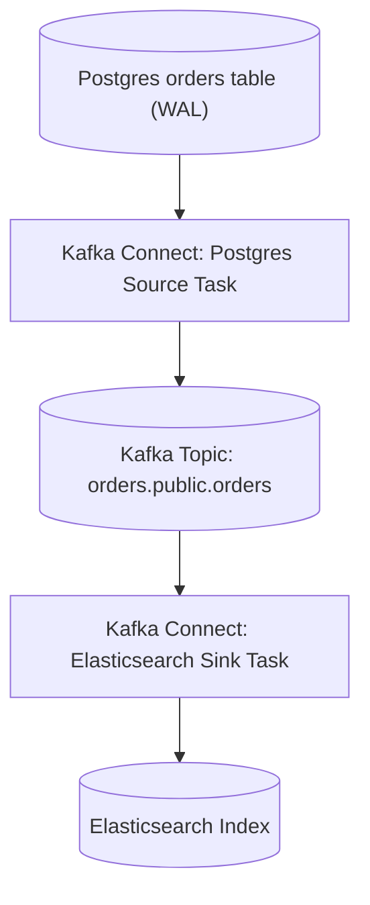
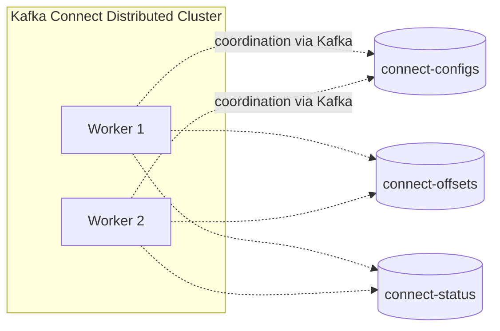
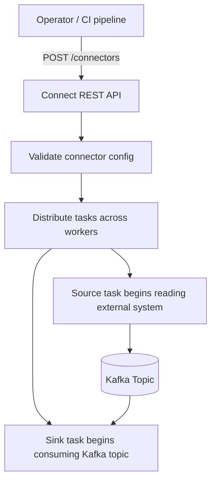
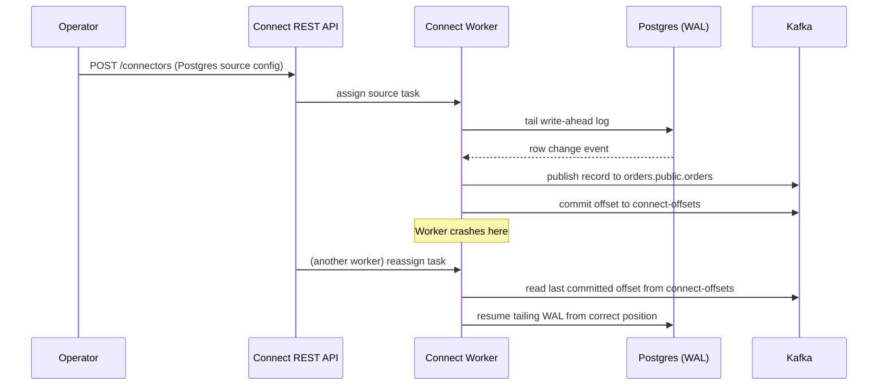

# Module 17 — Kafka Connect

**Level:** ⭐⭐⭐⭐ Advanced
**Track:** Kafka Complete Masterclass for Node.js Backend Engineers
**Module:** 17 of 25

---

## 1. Introduction

Every module so far has assumed a Node.js application on both ends of Kafka — a custom producer or a custom consumer, hand-written with KafkaJS. But an enormous fraction of real-world Kafka usage isn't "app talks to app" at all — it's "get data out of a database, into Kafka" or "get data out of Kafka, into a database/search index/data warehouse," with no custom business logic in between. Writing a bespoke KafkaJS consumer just to copy rows from Postgres into Kafka, verbatim, is solved work — and **Kafka Connect** is Kafka's answer to it.

This module covers Kafka Connect: what it is, why hand-rolling this integration yourself is usually the wrong call, and how source and sink connectors fit into the Node.js-centric architecture you've built in Modules 1–16.

---

## 2. Learning Objectives

By the end of this module, you will be able to:

1. Explain what Kafka Connect is and the specific class of problem it solves.
2. Distinguish source connectors from sink connectors and describe how each moves data.
3. Explain Kafka Connect's own use of Kafka internally (config, offset, and status topics) for fault tolerance.
4. Configure and deploy a source connector (e.g., database CDC) and a sink connector (e.g., database write) using the Connect REST API.
5. Explain how Kafka Connect interacts with the Schema Registry (Module 16) for schema-aware data movement.
6. Decide, for a given integration need, whether Kafka Connect or a custom KafkaJS producer/consumer is the right tool.

---

## 3. Why This Concept Exists

Modules 1–15 taught you to build custom producers and consumers because they carry real business logic — reducing stock, charging payments, orchestrating sagas. But a large class of integration work has **no business logic at all**: "whenever a row changes in the `orders` table, put it in Kafka," or "whenever a message lands on the `analytics-events` topic, insert it into Elasticsearch." Writing custom KafkaJS code for this is possible, but it means re-solving (often poorly) problems that are already solved: reliable offset tracking, schema handling, error recovery, scaling across multiple workers, and configuration management.

Kafka Connect exists to turn this class of "just move data, unchanged, between a system and Kafka" work into **configuration**, not code — you specify a connector class and its settings (a database connection string, a topic name, a polling interval), and Connect handles the runtime mechanics (offsets, retries, scaling, schema propagation) using patterns you've already learned in this course, applied *by* the framework rather than *by* you.

---

## 4. Problem Statement

Consider these common integration needs alongside the Node.js services you've already built:

1. Your `orders` table in Postgres needs to be mirrored into a `orders-cdc` Kafka topic in near-real-time, capturing every insert/update — without your Order Service needing to explicitly publish an event for every single database write.
2. Every event landing on the `analytics-events` topic needs to be written into Elasticsearch for a dashboard — no transformation, just a reliable, scalable pipe.
3. You need this data movement to survive worker crashes, scale across multiple machines, and not require you to hand-manage consumer offsets, retries, or serialization for what is fundamentally a "copy data over" task.
4. Different data sources (Postgres, MySQL, S3, Elasticsearch, Snowflake) all need broadly similar "move data in/out of Kafka" behavior — should every team really write and maintain their own bespoke KafkaJS integration for each one?

Kafka Connect answers all four by turning them into standardized configuration against a battle-tested runtime.

---

## 5. Real-World Analogy

### Analogy: Standardized Shipping Containers vs. Custom Crating

Before standardized shipping containers, moving goods between a truck, a ship, and a train required custom crating and handling for every different cargo type and vehicle combination — slow, expensive, and error-prone at scale. The shipping container standardized the *interface*: any port, truck, or ship built to handle a standard container can move any cargo inside one, without custom-building handling logic per cargo type.

**Kafka Connect connectors** are the standardized containers for data integration: a "Postgres source connector" and an "Elasticsearch sink connector" are pre-built, tested components that know how to move data in and out of Kafka reliably. You don't hand-craft custom crating (a bespoke KafkaJS script) for every new data source or destination — you configure a standard container (a connector) and the runtime (Kafka Connect) handles the loading, unloading, and safe transport.

---

## 6. Technical Definition

- **Kafka Connect**: A framework (part of core Apache Kafka) for reliably streaming data between Kafka and external systems (databases, search indexes, cloud storage, etc.) using pre-built or custom **connectors**, run as a distributed, fault-tolerant service independent of your application code.
- **Source Connector**: A connector that reads data from an external system and publishes it into Kafka topics (e.g., a Postgres CDC source connector reading database changes into a topic).
- **Sink Connector**: A connector that reads data from Kafka topics and writes it into an external system (e.g., an Elasticsearch sink connector writing topic data into a search index).
- **Connect Worker**: A JVM process running one or more connector tasks; workers can run in **standalone mode** (single process, simple, less fault-tolerant) or **distributed mode** (multiple workers coordinating via Kafka itself, for scalability and fault tolerance).
- **Task**: The actual unit of work within a connector — a single connector configuration can be split into multiple parallel tasks (e.g., one task per database table, or one task per source partition) for scalability.
- **Converter**: The component responsible for serializing/deserializing data between Kafka's byte format and the connector's internal representation — commonly configured to use JSON, Avro, or Protobuf, often integrating directly with the Schema Registry (Module 16).
- **Change Data Capture (CDC)**: A source connector pattern that captures row-level insert/update/delete events directly from a database's transaction log (e.g., Postgres's WAL, MySQL's binlog), rather than polling — providing near-real-time, low-overhead replication into Kafka.

---

## 7. Internal Working

### How Kafka Connect achieves fault tolerance — using Kafka itself

```
Kafka Connect (distributed mode) stores its OWN operational state
inside special Kafka topics — the same durable, replicated log
mechanism (Module 9, Module 11) used for your application data:

  connect-configs   -> stores connector configurations
  connect-offsets   -> stores each connector task's processing
                        position (analogous to __consumer_offsets,
                        Module 8, but for connector-specific
                        source positions, e.g., a DB's WAL position)
  connect-status    -> stores the running status of each
                        connector/task, for monitoring

This means Kafka Connect workers are essentially STATELESS
compute — if a worker crashes, another worker in the same
Connect cluster can pick up its tasks, reading the last known
offset from connect-offsets and resuming exactly where the
crashed worker left off.
```

### Source connector flow (database CDC example)

```
1. Postgres CDC source connector reads the database's WRITE-AHEAD
   LOG (WAL) — not by polling the table, but by tailing the
   transaction log directly (extremely low overhead, near-real-time)

2. Each detected row change (insert/update/delete) is converted
   into a Kafka record via the configured Converter (e.g., Avro,
   using the Schema Registry)

3. The record is published to a topic, typically named after the
   source table (e.g., orders.public.orders)

4. The connector's current WAL position is periodically committed
   to the connect-offsets topic, so a restart resumes from the
   correct point rather than replaying or skipping changes
```

### Sink connector flow (Elasticsearch example)

```
1. Elasticsearch sink connector task consumes records from its
   assigned topic partition(s) — mechanically, this IS a Kafka
   consumer (Module 5), just one built into the Connect framework
   rather than hand-written

2. Each record is transformed (if configured) and written to
   Elasticsearch via its bulk API

3. Kafka offsets are committed only after the write to
   Elasticsearch succeeds — the SAME at-least-once delivery
   principle from Module 10 applies here, implemented by the
   connector rather than your own code
```

---

## 8. Architecture

```
   Postgres DB                Kafka Connect Cluster              Elasticsearch
┌───────────────┐    ┌─────────────────────────────────┐    ┌───────────────┐
│  orders table   │    │  Worker 1        Worker 2         │    │  orders index   │
│  (WAL/binlog)   │◄───┤  [Postgres        [Elasticsearch    ├───►│                 │
└───────────────┘    │   Source Task]     Sink Task]        │    └───────────────┘
                       └─────────────┬───────────────────┘
                                     │
                                     ▼
                       ┌───────────────────────────┐
                       │        Kafka Cluster          │
                       │  orders.public.orders topic    │
                       │  connect-configs / -offsets /   │
                       │  -status topics                 │
                       └───────────────────────────┘
```

---

## 9. Step-by-Step Flow

1. An operator (or CI/CD pipeline) submits a connector configuration (JSON) to the Connect REST API — e.g., "run a Postgres source connector against this database, publishing to this topic."
2. The Connect cluster's leader worker distributes the connector's tasks across available workers.
3. Each source connector task begins reading from its external system (e.g., tailing Postgres's WAL) and publishing records to Kafka, tracking its progress via the `connect-offsets` topic.
4. Meanwhile, a sink connector's tasks consume from their assigned Kafka topic partitions and write to their external destination (e.g., Elasticsearch), tracking Kafka consumer offsets exactly as any consumer would (Module 8).
5. If a worker crashes, the Connect cluster's rebalancing protocol (conceptually similar to consumer group rebalancing, Module 7) reassigns its tasks to remaining workers, which resume from the last committed offset — no manual intervention required.
6. Operators monitor connector/task health via the REST API's status endpoints and the `connect-status` topic.

---

## 10. Detailed ASCII Diagrams

### 10.1 Source vs. Sink Connector Data Flow

```
SOURCE CONNECTOR:

  External System ──► Kafka Connect Task ──► Kafka Topic
  (e.g., Postgres)     (reads external data)   (writes records)


SINK CONNECTOR:

  Kafka Topic ──► Kafka Connect Task ──► External System
  (reads records)   (Connect task acts        (e.g., Elasticsearch)
                     as a Kafka consumer)
```

### 10.2 Standalone vs. Distributed Mode

```
STANDALONE MODE:

  ┌─────────────────────────┐
  │  Single Connect Worker     │
  │  (single process, config    │
  │   stored in a LOCAL file)   │
  └─────────────────────────┘

  Simple, good for local dev/testing. NO fault tolerance —
  if this one process dies, everything stops until restarted.


DISTRIBUTED MODE (production):

  ┌───────────┐  ┌───────────┐  ┌───────────┐
  │  Worker 1   │  │  Worker 2   │  │  Worker 3   │
  └───────────┘  └───────────┘  └───────────┘
        │               │               │
        └───────────────┼───────────────┘
                         ▼
             Coordinated via Kafka itself
             (connect-configs/-offsets/-status topics)

  If Worker 2 crashes, its tasks are reassigned to Worker 1
  and/or Worker 3 automatically — genuine fault tolerance.
```

### 10.3 CDC vs. Polling Source Connectors

```
POLLING-based source connector:

  every N seconds: SELECT * FROM orders WHERE updated_at > lastPoll
  - simple to reason about
  - adds periodic query load to the source database
  - inherent latency = poll interval
  - can miss rapid updates to the same row between polls (only
    the latest state at poll time is seen)

CDC-based source connector (e.g., Debezium):

  continuously TAILS the database's transaction log (WAL/binlog)
  - near real-time (sub-second lag typical)
  - captures EVERY individual change, including intermediate
    updates a polling approach might miss
  - lower query load on the source database (reads the log,
    not the table)
  - more operationally complex to set up correctly
```

---

## 11. Mermaid Diagrams





---

## 12. Request Flow Diagram



---

## 13. Sequence Diagram



---

## 14. Kafka Internal Flow

```
From the Kafka BROKER's perspective (Modules 3, 9, 11), Kafka
Connect is just another CLIENT — its source connector tasks are
ordinary producers, and its sink connector tasks are ordinary
consumers (technically using the consumer group protocol from
Module 7 for scaling/rebalancing across multiple tasks/workers).

Nothing about Kafka Connect requires special broker-side support
— all of its "framework magic" (task distribution, fault
tolerance, offset tracking) is implemented ENTIRELY as a
particular, sophisticated USE of ordinary Kafka producer/consumer
mechanics, plus its own internal topics for coordination.
```

---

## 15. Producer Perspective

Source connectors act as producers, but with an important architectural distinction from your custom Node.js producers (Module 4): the connector, not your application code, decides *what* gets published and *when* — driven by changes in the external system, not by your business logic explicitly calling `.send()`. This means the resulting Kafka events are often closer to **domain events / raw change data** (Module 14) than deliberately-designed integration events — worth being mindful of if downstream consumers need a more curated integration event contract instead of the raw table-change shape.

---

## 16. Consumer Perspective

Sink connectors act as consumers, but again with a key distinction: their "business logic" is fixed and generic (e.g., "write this record's fields into a database row" or "index this document in Elasticsearch") rather than custom per-topic logic. If your actual need involves genuine business rules (Module 4's Payment Service deciding whether to charge based on complex logic), a Kafka Connect sink connector is the wrong tool — that calls for a custom KafkaJS consumer (Module 5, Module 13) instead.

---

## 17. Broker Perspective

As established in Section 14, the broker treats Kafka Connect's workers exactly like any other producer/consumer client — no special-casing exists. The broker's only awareness of Connect at all is indirect: the `connect-configs`, `connect-offsets`, and `connect-status` topics are simply ordinary topics it stores and replicates like any other (Module 9), happening to be used by the Connect framework for its own coordination.

---

## 18. Node.js Integration

Kafka Connect itself runs as a separate JVM-based service, not a Node.js library — but Node.js applications interact with it in two common ways:

```
1. As an OPERATOR: a Node.js script or service calls Connect's
   REST API to create, update, monitor, or delete connectors —
   this is where KafkaJS-adjacent Node.js code plays a role.

2. As a DOWNSTREAM CONSUMER: a Node.js KafkaJS consumer (exactly
   as built in earlier modules) reads from a topic that a Kafka
   Connect SOURCE connector populates — from this consumer's
   perspective, it's just an ordinary topic; it doesn't need to
   know or care that Kafka Connect (rather than a custom producer)
   is what's publishing to it.
```

---

## 19. KafkaJS Examples

### 19.1 A Node.js script to manage connectors via the REST API

```javascript
// src/tools/connectManager.js
import fetch from "node-fetch";

const CONNECT_URL = process.env.CONNECT_URL || "http://localhost:8083";

export async function createConnector(name, config) {
  const res = await fetch(`${CONNECT_URL}/connectors`, {
    method: "POST",
    headers: { "Content-Type": "application/json" },
    body: JSON.stringify({ name, config }),
  });

  if (!res.ok) {
    const body = await res.json();
    throw new Error(`Failed to create connector "${name}": ${JSON.stringify(body)}`);
  }

  return res.json();
}

export async function getConnectorStatus(name) {
  const res = await fetch(`${CONNECT_URL}/connectors/${name}/status`);
  return res.json();
}

export async function listConnectors() {
  const res = await fetch(`${CONNECT_URL}/connectors`);
  return res.json();
}

export async function deleteConnector(name) {
  await fetch(`${CONNECT_URL}/connectors/${name}`, { method: "DELETE" });
}
```

### 19.2 Registering a Postgres CDC source connector configuration

```javascript
// src/tools/registerPostgresSourceConnector.js
import { createConnector } from "./connectManager.js";

async function registerOrdersSourceConnector() {
  await createConnector("orders-postgres-source", {
    "connector.class": "io.debezium.connector.postgresql.PostgresConnector",
    "database.hostname": "postgres",
    "database.port": "5432",
    "database.user": "kafka_connect",
    "database.password": process.env.DB_PASSWORD,
    "database.dbname": "orders_db",
    "table.include.list": "public.orders",
    "topic.prefix": "orders",
    "key.converter": "org.apache.kafka.connect.json.JsonConverter",
    "value.converter": "io.confluent.connect.avro.AvroConverter",
    "value.converter.schema.registry.url": "http://schema-registry:8081",
  });

  console.log("Postgres source connector registered.");
}

registerOrdersSourceConnector().catch(console.error);
```

### 19.3 Registering an Elasticsearch sink connector configuration

```javascript
// src/tools/registerElasticsearchSinkConnector.js
import { createConnector } from "./connectManager.js";

async function registerAnalyticsSinkConnector() {
  await createConnector("analytics-events-elasticsearch-sink", {
    "connector.class": "io.confluent.connect.elasticsearch.ElasticsearchSinkConnector",
    "topics": "analytics-events",
    "connection.url": "http://elasticsearch:9200",
    "type.name": "_doc",
    "key.ignore": "true",
    "schema.ignore": "true",
    "value.converter": "org.apache.kafka.connect.json.JsonConverter",
    "value.converter.schemas.enable": "false",
  });

  console.log("Elasticsearch sink connector registered.");
}

registerAnalyticsSinkConnector().catch(console.error);
```

### 19.4 A downstream KafkaJS consumer reading Connect-populated data — unaware of Connect

```javascript
// src/consumers/orderCdcConsumer.js
// This consumer is written EXACTLY like any consumer from Module 5 —
// it has no idea (and doesn't need to know) that a Kafka Connect
// source connector, not a custom producer, populated this topic.
import { kafka } from "../config/kafka.js";

const consumer = kafka.consumer({ groupId: "order-cdc-watcher" });

export async function startOrderCdcConsumer() {
  await consumer.connect();
  await consumer.subscribe({ topic: "orders.public.orders", fromBeginning: false });

  await consumer.run({
    eachMessage: async ({ message }) => {
      const change = JSON.parse(message.value.toString());
      console.log("Detected DB row change:", change);
      // e.g., trigger a cache invalidation, a search index refresh, etc.
    },
  });
}
```

### 19.5 Monitoring connector health from Node.js

```javascript
// src/tools/monitorConnectors.js
import { listConnectors, getConnectorStatus } from "./connectManager.js";

async function monitorAll() {
  const names = await listConnectors();

  for (const name of names) {
    const status = await getConnectorStatus(name);
    const failedTasks = status.tasks.filter((t) => t.state === "FAILED");

    if (status.connector.state !== "RUNNING" || failedTasks.length > 0) {
      console.warn(`⚠️  Connector "${name}" unhealthy:`, JSON.stringify(status, null, 2));
    } else {
      console.log(`✅ Connector "${name}" healthy (${status.tasks.length} tasks running)`);
    }
  }
}

monitorAll().catch(console.error);
```

---

## 20. CLI Commands

```bash
# List all connectors
curl -s http://localhost:8083/connectors | jq .

# Check a specific connector's status (connector + all its tasks)
curl -s http://localhost:8083/connectors/orders-postgres-source/status | jq .

# Create a connector from a JSON config file
curl -X POST -H "Content-Type: application/json" \
  --data @postgres-source-config.json \
  http://localhost:8083/connectors

# Pause / resume a connector
curl -X PUT http://localhost:8083/connectors/orders-postgres-source/pause
curl -X PUT http://localhost:8083/connectors/orders-postgres-source/resume

# Restart a specific failed task
curl -X POST http://localhost:8083/connectors/orders-postgres-source/tasks/0/restart

# Delete a connector entirely
curl -X DELETE http://localhost:8083/connectors/orders-postgres-source
```

---

## 21. Configuration Explanation

| Config | Meaning |
|---|---|
| `connector.class` | Fully-qualified class name of the specific connector implementation (e.g., Debezium's Postgres connector) |
| `tasks.max` | Maximum number of parallel tasks the connector may be split into, for scalability |
| `topics` (sink) / `topic.prefix` (source) | Which Kafka topic(s) a sink connector reads from, or the naming prefix a source connector publishes under |
| `key.converter` / `value.converter` | How records are serialized/deserialized — often `JsonConverter` or an Avro converter integrated with the Schema Registry (Module 16) |
| `offset.storage.topic` / `config.storage.topic` / `status.storage.topic` | The internal Kafka topics (distributed mode) storing Connect's own operational state (Section 7) |

---

## 22. Common Mistakes

1. **Reaching for a custom KafkaJS producer/consumer for a pure "move data unchanged" integration**, reinventing offset tracking, retries, and scaling that Kafka Connect already provides.
2. **Running Kafka Connect in standalone mode in production.** Standalone mode has no fault tolerance — a crashed worker means the integration simply stops until manually restarted; distributed mode is the production-appropriate choice.
3. **Assuming a source connector's raw output is a well-designed integration event.** CDC output typically mirrors the database's row structure directly — it often needs an additional transformation/curation step (Module 14) before being treated as a stable, external-facing contract.
4. **Not setting `tasks.max` appropriately**, either leaving a connector under-parallelized (throughput bottleneck) or over-parallelized relative to the actual source's partitionability (e.g., more tasks than tables to split across).
5. **Ignoring connector/task status monitoring.** A connector can silently enter a `FAILED` state (e.g., due to a schema mismatch or a network issue) and stop moving data entirely without an obvious application-level symptom, unless you're actively polling its status (Section 19.5).
6. **Using polling-based source connectors when CDC is available and appropriate**, incurring unnecessary latency and source-database query load (Section 10.3).

---

## 23. Edge Cases

- **What if the source database's transaction log is purged before a paused/crashed CDC connector catches up?** This can cause the connector to miss changes entirely — CDC connectors and their source databases need compatible log-retention settings to avoid this "log has moved past where I need to resume" scenario.
- **What if a sink connector's external system (e.g., Elasticsearch) is temporarily down?** The connector's consumer offset won't advance past unwritten records (Module 10's at-least-once principle applies), and the connector will retry — but a prolonged outage means growing consumer lag on the source topic, worth monitoring exactly like any consumer group (Module 8).
- **What if you need custom transformation logic, not just "copy unchanged"?** Kafka Connect supports **Single Message Transforms (SMTs)** for lightweight, per-record transformations — but for genuinely complex business logic, a custom KafkaJS consumer (or Kafka Streams) remains the more appropriate tool.

---

## 24. Performance Considerations

- CDC-based source connectors generally impose far less load on the source database than polling-based approaches, since they read the transaction log rather than repeatedly querying tables (Section 10.3).
- Sink connector throughput scales with `tasks.max` up to the source topic's partition count (Module 6's ceiling applies here too, since sink tasks are ordinary consumers within a consumer group).
- Connect's own internal topics (`connect-offsets`, `connect-status`, `connect-configs`) carry relatively low volume/overhead compared to your actual data topics, but still benefit from appropriate replication factor (Module 9) for production fault tolerance.

---

## 25. Scalability Discussion

- Distributed mode Connect clusters scale horizontally by adding more workers — the framework automatically redistributes tasks across available workers (Section 10.2), directly analogous to consumer group rebalancing (Module 7).
- As the number of integration needs grows (more databases, more search indexes, more downstream systems), Kafka Connect's configuration-driven model scales organizationally far better than an ever-growing pile of bespoke KafkaJS integration scripts, each with its own subtly different offset/retry/error-handling implementation.

---

## 26. Production Best Practices

- Always run Kafka Connect in distributed mode in production, with an appropriate replication factor on its internal topics.
- Prefer CDC-based source connectors (e.g., Debezium) over polling-based ones where the source system supports it, for lower latency and lower source-system load.
- Monitor connector and task status continuously (Section 19.5), alerting on any non-`RUNNING` state.
- Treat raw CDC/source-connector output as internal/domain-event-like data (Module 14) rather than a finished, stable integration contract — apply an explicit curation/transformation step if external teams need to consume it as a proper contract.
- Integrate connector configuration into your infrastructure-as-code / CI-CD practices (Section 19.1–19.3), rather than creating connectors via ad hoc manual `curl` commands.

---

## 27. Monitoring & Debugging

- Poll the Connect REST API's `/connectors/{name}/status` endpoint regularly (or via the `connect-status` topic) to detect `FAILED` tasks promptly.
- For source connectors, monitor the gap between the source system's actual latest change and what's been published to Kafka (replication lag) as a key health signal.
- For sink connectors, monitor consumer lag on the source topic exactly as you would for any consumer group (Module 8) — a sink connector falling behind is fundamentally the same diagnostic problem as any lagging consumer.

---

## 28. Security Considerations

- Source connectors typically require direct database credentials (often with elevated permissions to read the transaction log) — store and rotate these via a secrets manager, never in plain connector JSON configs committed to source control.
- The Connect REST API itself should be access-controlled — it can create/modify/delete connectors with access to sensitive external systems, making it a meaningful security boundary in its own right.

---

## 29. Interview Questions (Easy → Medium → Hard)

### Easy

1. What is Kafka Connect?
2. What is a source connector? What is a sink connector?
3. What is the difference between standalone and distributed mode?

### Medium

4. How does Kafka Connect achieve fault tolerance in distributed mode?
5. What is Change Data Capture (CDC), and how does it differ from a polling-based source connector?
6. What internal Kafka topics does a distributed Connect cluster rely on, and what does each store?
7. From the broker's perspective, what kind of client is a Kafka Connect task?

### Hard

8. Explain, step by step, what happens when a Kafka Connect worker crashes mid-task in distributed mode, and how the cluster recovers without data loss or duplication (beyond ordinary at-least-once semantics).
9. Explain why CDC-based source connectors generally impose less load on a source database than polling-based connectors, referencing how each actually reads data.
10. A team wants to use raw Kafka Connect CDC output as a stable, external-facing integration event contract for other teams. Explain the risk in this approach, referencing Module 14's concepts.
11. Design a Kafka Connect-based pipeline replicating a Postgres `orders` table into both Elasticsearch (for search) and a data warehouse (for analytics), and explain how you'd handle the case where the two sinks need slightly different data shapes.

---

## 30. Common Interview Traps

- **Trap:** "Kafka Connect requires custom code for every new data source." → **Reality:** Its whole value proposition is pre-built, reusable connectors configured declaratively — custom connector development is the exception, not the norm.
- **Trap:** "A CDC source connector's output is already a clean, stable integration event." → **Reality:** It typically mirrors the raw database row structure and often needs explicit curation (Module 14) before being treated as a genuine external contract.
- **Trap:** "Kafka Connect is a completely different system from 'regular' Kafka producers/consumers." → **Reality:** Mechanically, Connect tasks ARE ordinary Kafka producers and consumers under the hood — the framework's value is in the orchestration, fault tolerance, and configuration model layered on top.

---

## 31. Summary

- Kafka Connect turns "move data, largely unchanged, between an external system and Kafka" into a configuration exercise rather than custom code, via source and sink connectors.
- Distributed mode provides genuine fault tolerance by coordinating workers through Kafka's own internal topics, mirroring patterns from Modules 7–9.
- CDC-based source connectors offer near-real-time, low-overhead data capture compared to polling, by tailing a database's transaction log directly.
- Mechanically, Connect tasks are ordinary Kafka producers/consumers from the broker's perspective — the framework's value is entirely in orchestration and standardization, not special broker support.
- Raw connector output often needs an explicit curation step before being treated as a stable, external integration contract (Module 14).

---

## 32. Cheat Sheet

```
KAFKA CONNECT — ONE PAGE

Source connector: external system -> Kafka (e.g., Postgres CDC)
Sink connector:   Kafka -> external system (e.g., Elasticsearch)

Standalone mode: single process, simple, NO fault tolerance
Distributed mode: multiple workers, coordinated via Kafka itself,
                  genuine fault tolerance (production default)

Internal coordination topics:
  connect-configs  = connector configurations
  connect-offsets  = per-task processing position
  connect-status   = connector/task health

CDC (e.g., Debezium): tails the DB transaction log (WAL/binlog),
                      near real-time, low source-DB load
Polling: periodic SELECT queries, simpler, higher latency/load

Mechanically: Connect tasks ARE ordinary Kafka producers/consumers
              — no special broker support required

Golden rule: use Kafka Connect for "move data, largely unchanged";
             use custom KafkaJS producers/consumers when real
             business logic is involved
```

---

## 33. Hands-on Exercises

1. Deploy a local Kafka Connect worker in standalone mode with a simple file source connector (built into Apache Kafka) to understand the connector lifecycle without needing a real database.
2. Register a Debezium Postgres source connector against a local test database and observe row changes appearing in a Kafka topic as you insert/update rows.
3. Register a simple sink connector (e.g., a file sink, or Elasticsearch if available locally) and confirm data flows end-to-end from the source topic.
4. Deliberately kill a Connect worker in a multi-worker distributed setup and observe its tasks being reassigned to a remaining worker.

---

## 34. Mini Project

**Build:** A `connect-cli.js` Node.js tool wrapping the Connect REST API (Section 19.1) with commands to create, list, check status, pause/resume, and delete connectors — plus a monitoring command that reports any non-healthy connector/task.

---

## 35. Advanced Project

**Build:** An end-to-end CDC pipeline: a Postgres `orders` table replicated via a Debezium source connector into a Kafka topic, with an explicit downstream KafkaJS "curation" consumer (per Module 14's translation-layer pattern) that transforms the raw CDC events into a clean, versioned `OrderChanged` integration event published to a separate, stable topic for other teams to consume.

---

## 36. Homework

1. Research Debezium specifically (the most common CDC connector implementation) and summarize how it handles an initial "snapshot" of existing data versus ongoing incremental changes.
2. Compare running Kafka Connect as a standalone service versus using a fully-managed connector offering (e.g., a cloud provider's managed CDC/sink service), and note the operational trade-offs.
3. Write a short design note explaining how you'd apply Module 14's event-design discipline to curate raw CDC output into a proper integration event contract for external consumers.

---

## 37. Additional Reading

- Apache Kafka documentation — "Kafka Connect" section under Documentation
- Debezium documentation — "How Debezium Works," particularly the Postgres connector's snapshot and streaming phases
- Confluent Hub — a directory of pre-built source/sink connectors, useful for surveying what's already solved before building custom integration code

---

## Key Takeaways

- Kafka Connect turns data movement between external systems and Kafka into configuration, via source and sink connectors, rather than custom application code.
- Distributed mode provides real fault tolerance by coordinating workers through Kafka's own internal topics — the same patterns (offsets, consumer groups) covered in earlier modules, applied by the framework.
- CDC-based source connectors provide near-real-time, low-overhead data capture by tailing a database's transaction log, rather than polling.
- Connect tasks are, mechanically, ordinary Kafka producers/consumers — the framework's value lies in orchestration and standardization.
- Raw connector output typically needs explicit curation before serving as a stable, external-facing integration event contract.

---

## Revision Notes

- Be able to explain the difference between a source and sink connector with a concrete example of each.
- Be able to describe how distributed mode achieves fault tolerance using Kafka's own internal topics.
- Practice deciding, for a given integration scenario, whether Kafka Connect or a custom KafkaJS service is the appropriate tool.

---

## One-Page Cheat Sheet

*(See Section 32 above.)*

---

## 20 Practice Questions

1. What is Kafka Connect?
2. What is a source connector?
3. What is a sink connector?
4. What is the difference between standalone and distributed mode?
5. What internal topics does distributed mode rely on?
6. What does `connect-offsets` store?
7. What is Change Data Capture (CDC)?
8. How does CDC differ from a polling-based source connector?
9. What is a Connect "task"?
10. What controls how many parallel tasks a connector can have?
11. What is a Converter in Kafka Connect?
12. Does Kafka Connect integrate with a Schema Registry?
13. From the broker's perspective, what type of client is a Connect task?
14. What happens when a Connect worker crashes in distributed mode?
15. What is a Single Message Transform (SMT)?
16. Why is standalone mode unsuitable for production?
17. What tool is commonly used for Postgres/MySQL CDC?
18. Why might raw CDC output need further curation before external consumption?
19. What REST API endpoint would you use to check a connector's health?
20. Why does a sink connector's throughput scale with the source topic's partition count?

---

## 10 Scenario-Based Questions

1. Your team needs to replicate a Postgres table into Kafka in near-real-time with minimal load on the database. What connector approach would you recommend, and why?
2. A Kafka Connect worker crashes in a 3-worker distributed cluster. Walk through what happens to its in-progress tasks.
3. Your sink connector's target system (Elasticsearch) goes down for an hour. What happens to the source topic's consumer lag, and how would you monitor this?
4. A teammate wants to expose raw Debezium CDC output directly to five other teams as their integration contract. What concerns would you raise, referencing Module 14?
5. You're deciding between a polling-based JDBC source connector and a CDC-based Debezium connector for a high-write-volume table. What factors would guide this decision?
6. Your Connect cluster is running in standalone mode in production, and a recent incident caused a multi-hour data gap when the single worker crashed. What would you change?
7. A connector's status shows `FAILED` for one task but `RUNNING` for others. What would you check first, and how would you attempt recovery?
8. Your team needs custom business logic (not just "copy data") applied to data flowing from a database into Kafka. Would Kafka Connect alone be sufficient, or what else would you need?
9. You need the same source data delivered to both Elasticsearch and a data warehouse, but each needs a different shape. How would you architect this using Kafka Connect and/or additional Kafka-native processing?
10. Explain to a stakeholder why moving from a hand-written, per-integration KafkaJS script model to Kafka Connect is worth the migration effort as the number of integrations grows.

---

## 5 Coding Assignments

1. Write a Node.js CLI tool wrapping the Connect REST API to create, list, and check the status of connectors.
2. Build a monitoring script that polls all registered connectors' statuses every 30 seconds and logs a warning for any connector/task not in the `RUNNING` state.
3. Write a downstream KafkaJS consumer that reads raw CDC-style events from a Connect-populated topic and republishes a curated, versioned integration event to a separate topic (a hands-on version of Module 14's translation layer).
4. Write a script that registers a source connector configuration from a JSON file, validates the response, and rolls back (deletes the connector) if registration partially fails.
5. Build a small test harness that inserts/updates rows in a local test database, and asserts that corresponding records appear in the expected Kafka topic within a reasonable time window, verifying an end-to-end CDC pipeline.

---

## Suggested Next Module

**Module 18 — Kafka Streams**
With data movement into and out of Kafka now covered via Connect, the next module turns to processing data that's already flowing *through* Kafka: stream processing concepts, aggregation, windowing, and joins — the tools for building real-time transformations and analytics directly on top of Kafka topics.
