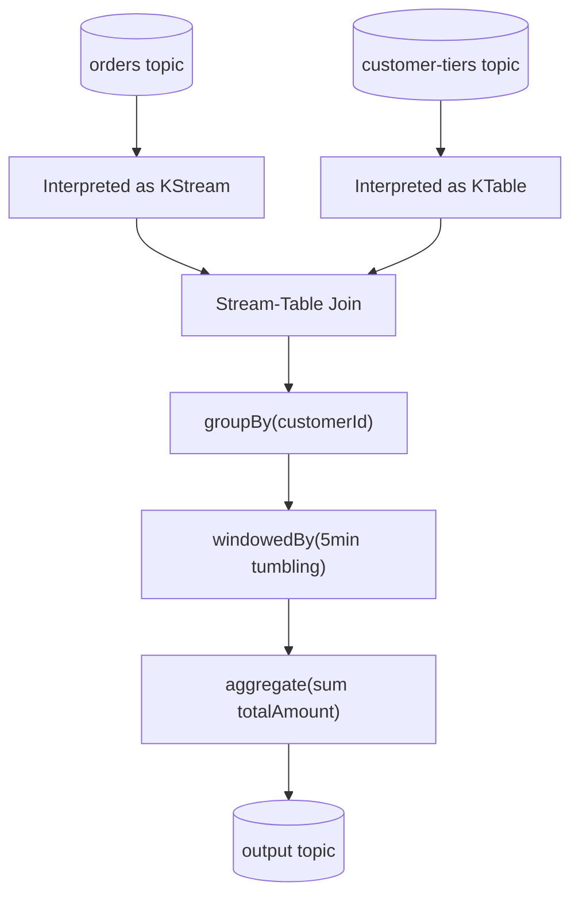
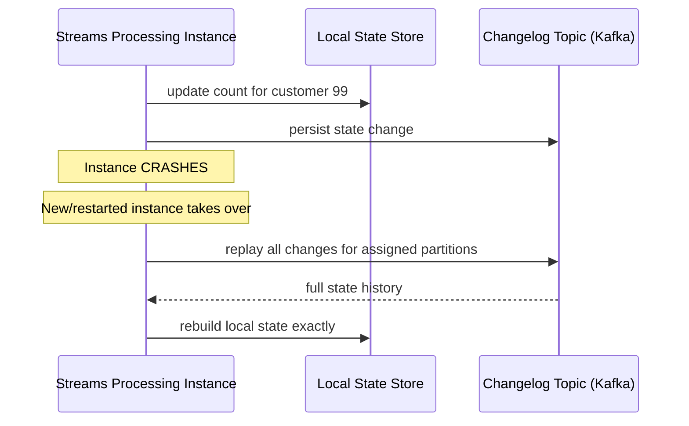
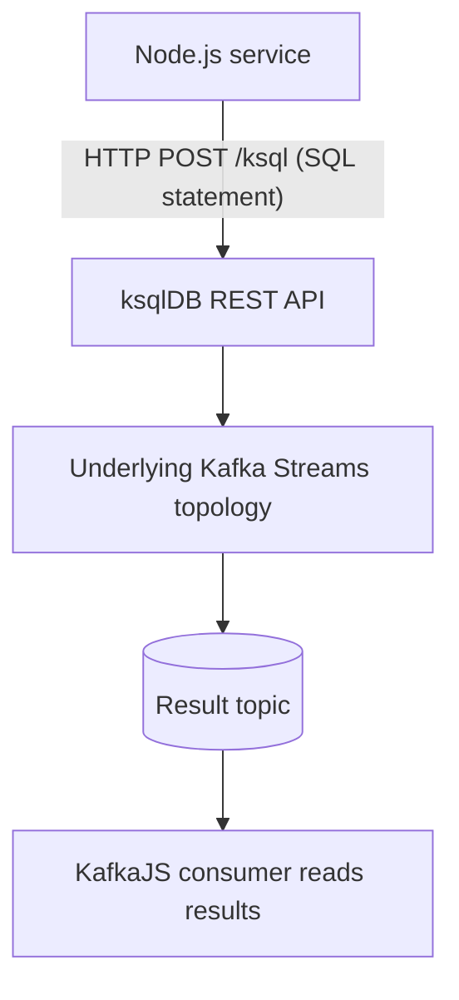
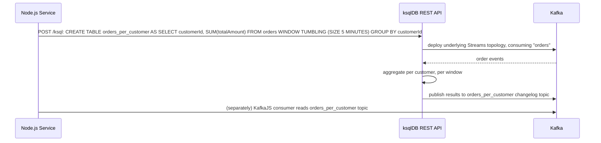

# Module 18 — Kafka Streams

**Level:** ⭐⭐⭐⭐ Advanced
**Track:** Kafka Complete Masterclass for Node.js Backend Engineers
**Module:** 18 of 25

---

## 1. Introduction

A necessary, upfront clarification: **Kafka Streams is a JVM (Java/Scala) library** — there is no official Node.js equivalent. This module still belongs in a Node.js-focused course for two practical reasons: first, as a Node.js backend engineer, you will very likely work alongside Kafka Streams applications written by other teams, and need to understand what they do and how they behave as producers/consumers from your own services' perspective. Second, the *concepts* — stateful stream processing, aggregation, windowing, and joins — are things you'll eventually need to replicate in Node.js using manual consumer-based patterns (or **ksqlDB**, a SQL layer over Kafka Streams that you *can* drive entirely from Node.js via its REST API) when a full JVM stream-processing app isn't the right fit for your team.

This module covers both: the real Kafka Streams concepts, and how to achieve equivalent results from a Node.js-centric architecture.

---

## 2. Learning Objectives

By the end of this module, you will be able to:

1. Explain what Kafka Streams is, and why it's a fundamentally different processing model from a plain consumer (Module 5).
2. Explain the KStream vs. KTable abstraction and how it relates to the event-vs-state duality.
3. Explain aggregation and windowing, and the trade-offs of different window types.
4. Explain stream-stream, stream-table, and table-table joins conceptually.
5. Use ksqlDB from Node.js to achieve stream-processing results (aggregation, windowing, joins) without writing JVM code.
6. Decide, for a given processing need, whether Kafka Streams/ksqlDB or a custom KafkaJS consumer is the right tool.

---

## 3. Why This Concept Exists

A plain consumer (Module 5) processes one record at a time, independently, with no built-in concept of "state accumulated across many records" or "a window of time." This is fine for "reduce stock by this amount" — but it's a poor fit for questions like "what's the rolling 5-minute average order value?" or "join this click event with the most recent page-view event for the same user." These require **stateful, continuous computation across a stream of events**, correctly handling out-of-order data, time windows, and joins — genuinely hard distributed-systems problems if built from scratch.

Kafka Streams (and ksqlDB, built on top of it) exists to solve this class of problem using the same guarantees you've already learned (partitioning, offsets, replication, exactly-once semantics via transactions, Module 9–10) rather than requiring you to hand-roll a fragile, custom stateful consumer.

---

## 4. Problem Statement

Consider real analytical and processing needs on top of the `orders` topic:

1. You need a continuously-updated count of orders placed per customer — not a batch job run nightly, but a live, queryable number that updates as new orders arrive.
2. You need to know the total order value **per 5-minute window**, to feed a real-time dashboard — how do you group events by time without a database?
3. You need to enrich each `OrderPlaced` event with the customer's current tier (from a separate `customer-tiers` topic that changes occasionally) — a join between a stream of events and a table of current state.
4. You want to detect when a `PaymentFailed` event follows an `OrderPlaced` event for the same order within 10 minutes — a join between two streams, correlated by key and time.

A plain KafkaJS consumer *can* be coerced into solving these with an in-memory or external state store, manual window bucketing, and manual join logic — but this is exactly the "reinventing solved infrastructure" problem Module 17 flagged for data movement, now applied to stream computation.

---

## 5. Real-World Analogy

### Analogy: A River vs. A Lake, and a Dam That Does Both

A **KStream** is like a river: a continuous flow of individual events passing by, each one distinct (`OrderPlaced` for order #1, then order #2, then order #3 — each a separate fact).

A **KTable** is like a lake fed by that river: it represents the *current* accumulated state (the latest known value per key) — "customer #99's current loyalty tier," updated whenever a new relevant event flows in, but at any given moment representing one current snapshot per key, not a growing list of every historical change.

**Windowing** is like measuring "how much water flowed through this specific 5-minute stretch of the river" — a bounded slice of the continuous flow, useful for asking time-bounded questions ("what was the flow rate between 10:00 and 10:05?") rather than "how much water has ever flowed, in total, since the river began."

**Joins** are like a dam operator correlating river flow with lake level in real time — "whenever new water arrives in the river (a stream event), look up the current lake level for that same region (a table lookup) and record both together" (a stream-table join), or "compare flow from two different tributaries arriving around the same time" (a stream-stream join).

---

## 6. Technical Definition

- **KStream**: An abstraction representing an unbounded, continuous stream of independent records (events) — each record is a new, distinct fact, and there's no concept of "the current value" for a key, only a sequence of individual events.
- **KTable**: An abstraction representing a continuously-updated table of current state, keyed by record key — a new record for an existing key **updates** (replaces) that key's current value, conceptually similar to a changelog-backed materialized view.
- **Aggregation**: Combining multiple records (e.g., by key) into a single, continuously-updated summary value (a count, sum, average) — implemented as a KTable that updates as new relevant records arrive.
- **Windowing**: Grouping stream records into fixed or sliding time-bounded buckets (e.g., tumbling 5-minute windows, hopping windows, session windows) before aggregating, enabling time-bounded questions rather than all-time totals.
- **Stream-Stream Join**: Correlating records from two KStreams that occur near each other in time (within a defined window), matched by key.
- **Stream-Table Join**: Enriching each record in a KStream with the *current* value from a KTable for the same key, at the moment the stream record arrives.
- **Table-Table Join**: Combining two KTables (current states) into a new, continuously-updated KTable.
- **ksqlDB**: A SQL-like query layer built on top of Kafka Streams, letting you define streams, tables, aggregations, windows, and joins using SQL statements (submitted via a REST API) instead of writing Java/Scala code — the practical entry point for a Node.js-centric team.

---

## 7. Internal Working

### KStream vs. KTable — the same topic, two different interpretations

```
Topic: customer-tier-changes

Records (in order):
  key=99, value={tier: "silver"}
  key=99, value={tier: "gold"}
  key=42, value={tier: "bronze"}

AS A KSTREAM (every record is a distinct event):
  3 separate events processed independently — e.g., "send a
  congratulations email every time a tier changes" cares about
  EACH transition as its own fact.

AS A KTABLE (only the LATEST value per key matters):
  Effectively becomes: { 99: "gold", 42: "bronze" }
  — the intermediate "silver" for customer 99 is superseded;
  a KTable represents CURRENT state, not history.

This is the CORE conceptual duality: the same topic can be
interpreted as a stream of facts OR a table of current state,
depending on what question you're asking.
```

### Windowing types

```
TUMBLING WINDOW (fixed, non-overlapping):
  |--- 0-5min ---|--- 5-10min ---|--- 10-15min ---|
  Each event belongs to EXACTLY ONE window.

HOPPING WINDOW (fixed size, overlapping):
  |--- 0-5min ---|
       |--- 2-7min ---|
            |--- 4-9min ---|
  Windows OVERLAP — an event can belong to MULTIPLE windows,
  useful for smoothed/rolling metrics.

SESSION WINDOW (dynamic, gap-based):
  [event][event]   <5min gap>   [event][event][event]
  ^-- session A --^              ^------ session B ------^
  A NEW session starts after a period of INACTIVITY exceeding
  a configured gap — useful for "user activity sessions" where
  fixed time boundaries don't make business sense.
```

### Stream-table join, conceptually

```
KStream: orders            KTable: customer-tiers (current state)
  { orderId: 1,               { 99: "gold" }
    customerId: 99 }  ──JOIN──┘

Result: { orderId: 1, customerId: 99, customerTier: "gold" }

The join looks up whatever customer-tiers CURRENTLY says for
customerId=99 AT THE MOMENT the order event arrives — if the
tier changes later, past join results are NOT retroactively
updated (this is a snapshot-at-arrival-time semantic).
```

---

## 8. Architecture

```
              Kafka Topics                    Kafka Streams / ksqlDB App
   ┌─────────────────────────┐        ┌───────────────────────────────┐
   │  orders (KStream)          │───────►│  Topology:                       │
   │  customer-tiers (KTable)   │───────►│    orders.join(customerTiers)     │
   └─────────────────────────┘        │    .groupBy(customerId)            │
                                        │    .windowedBy(5min tumbling)      │
                                        │    .aggregate(sum totalAmount)      │
                                        └───────────────┬───────────────┘
                                                        │  writes results to
                                                        ▼
                                        ┌───────────────────────────┐
                                        │  orders-by-customer-5min      │
                                        │  (output topic, itself a       │
                                        │   KTable-backed changelog)      │
                                        └───────────────────────────┘
```

---

## 9. Step-by-Step Flow

### Conceptual Kafka Streams / ksqlDB processing flow

1. Input topics are read and interpreted as either a KStream (event-by-event) or a KTable (current-state-by-key), depending on the query's intent.
2. Records flow through a **topology** — a directed graph of processing steps (filter, map, join, group, aggregate, window).
3. Stateful operations (aggregations, joins, windowing) are backed by a **local state store** (often RocksDB under the hood in real Kafka Streams), which is itself **backed by a Kafka changelog topic** for fault tolerance — if the processing instance crashes, its state store can be rebuilt by replaying its changelog topic.
4. Results are continuously written to an output topic (often itself consumable as either a stream or a table by downstream consumers).
5. A downstream Node.js KafkaJS consumer can read this output topic exactly like any other topic (Module 5) — it doesn't need to know or care that Kafka Streams/ksqlDB, rather than a hand-written aggregator, produced it.

---

## 10. Detailed ASCII Diagrams

### 10.1 Fault Tolerance via Changelog Topics

```
Stream processing instance maintains LOCAL state (e.g., running
count per customer) in memory/RocksDB:

  { customer 99: count=5, customer 42: count=2 }

Every state UPDATE is also written to a CHANGELOG TOPIC
(a Kafka topic, replicated per Module 9):

  changelog: (99, count=1) (99, count=2) ... (99, count=5) (42, count=1) (42, count=2)

If the processing instance CRASHES:
  A new instance (or the same one restarting) REPLAYS the
  changelog topic to REBUILD its exact local state before
  resuming processing — no state is lost, using the same
  durable-log mechanism (Module 11) as everything else in Kafka.
```

### 10.2 Windowed Aggregation Timeline

```
Orders arriving (customerId=99):
  10:01  $20    ─┐
  10:03  $15     ├─ Window [10:00-10:05): total = $35
  10:04  $10    ─┘
  10:06  $25    ─── Window [10:05-10:10): total = $25

Output topic receives UPDATES as each window's total changes:
  (99, window=[10:00-10:05)) -> $20
  (99, window=[10:00-10:05)) -> $35   (updated as 2nd order arrives)
  (99, window=[10:00-10:05)) -> $45   (updated as 3rd order arrives)
  (99, window=[10:05-10:10)) -> $25   (new window begins)
```

### 10.3 Stream-Stream Join with a Time Window

```
orders stream:        PaymentFailed stream:

10:00 OrderPlaced(1)
                       10:04 PaymentFailed(1)   <- within a 10-min
                                                    join window of
                                                    OrderPlaced(1)

JOIN result: { orderId: 1, placedAt: 10:00, failedAt: 10:04 }
             -> triggers an alert / retry workflow

If PaymentFailed(1) had arrived at 10:15 (outside the configured
join window), NO join result would be produced — the join is
explicitly TIME-BOUNDED, not "match forever."
```

---

## 11. Mermaid Diagrams





---

## 12. Request Flow Diagram



---

## 13. Sequence Diagram



---

## 14. Kafka Internal Flow

```
From the BROKER's perspective (as with Kafka Connect, Module 17),
a Kafka Streams / ksqlDB application is just another CLIENT —
its input consumption uses the ordinary consumer group protocol
(Module 7), its output publishing uses ordinary producer sends
(Module 4), and its internal state changelog topics are ordinary,
replicated Kafka topics (Module 9).

The "stream processing" intelligence — windowing, joins,
aggregation — is entirely implemented in the CLIENT-SIDE library
(Kafka Streams' Java code, or ksqlDB's engine built on top of it),
not inside the broker. This is the same architectural pattern
you've now seen repeated across Modules 16 (Schema Registry) and
17 (Connect): Kafka's broker stays simple and general-purpose;
sophisticated behavior lives in purpose-built client-side systems.
```

---

## 15. Producer Perspective

A Kafka Streams/ksqlDB application acts as both a consumer (reading input topics) and a producer (writing output topics) simultaneously — this dual role is often called being part of the same **topology**. From a Node.js service's perspective sitting downstream, the output topic looks and behaves exactly like any topic populated by an ordinary producer (Module 4) — the same delivery guarantees (Module 10) and replication (Module 9) apply.

---

## 16. Consumer Perspective

A Node.js KafkaJS consumer reading a Kafka Streams/ksqlDB output topic needs no special knowledge of stream processing — it just consumes records (Module 5). The one conceptual nuance worth understanding: if the output topic represents a **KTable** (e.g., a continuously-updated aggregate), later records for the same key represent **updates**, not new independent facts — a consumer should generally treat the latest record per key as the current truth, similar to how it would treat a compacted topic (Section 22 preview).

---

## 17. Broker Perspective

As established in Section 14, the broker has no special awareness of Kafka Streams or ksqlDB — it serves their consumer/producer traffic exactly like any other client's. The only broker-adjacent consideration worth flagging: state changelog topics benefit from **log compaction** (retaining only the latest value per key, rather than every historical value) since they represent current state, not a full event history — this is a topic-level configuration (`cleanup.policy=compact`) rather than anything Streams-specific.

---

## 18. Node.js Integration

Since Kafka Streams itself isn't available in Node.js, the practical Node.js-centric approaches are:

```
1. USE ksqlDB: define your streams/tables/aggregations/joins via
   SQL statements submitted through ksqlDB's REST API from a
   Node.js service — this is the most direct way to get Kafka
   Streams-equivalent processing without writing any JVM code.

2. CONSUME Kafka Streams/ksqlDB OUTPUT: a separate team's Java
   Kafka Streams application (or your own ksqlDB queries) writes
   results to an output topic; your Node.js KafkaJS consumer
   reads it like any other topic.

3. HAND-ROLL simplified stream processing in Node.js for cases
   that don't need the full framework: e.g., a KafkaJS consumer
   maintaining an in-memory or Redis-backed windowed counter for
   a specific, narrow use case — appropriate for SIMPLE cases;
   reach for ksqlDB/Streams once you need genuine fault-tolerant
   state, complex joins, or multiple window types.
```

---

## 19. KafkaJS Examples

### 19.1 Driving ksqlDB from Node.js — creating a stream and a windowed aggregate table

```javascript
// src/ksql/setupOrdersAggregation.js
import fetch from "node-fetch";

const KSQLDB_URL = process.env.KSQLDB_URL || "http://localhost:8088";

async function runKsql(statement) {
  const res = await fetch(`${KSQLDB_URL}/ksql`, {
    method: "POST",
    headers: { "Content-Type": "application/vnd.ksql.v1+json" },
    body: JSON.stringify({ ksql: statement, streamsProperties: {} }),
  });
  const body = await res.json();
  if (!res.ok) throw new Error(`ksqlDB error: ${JSON.stringify(body)}`);
  return body;
}

async function setup() {
  // Declare the underlying topic as a KSTREAM
  await runKsql(`
    CREATE STREAM orders_stream (
      orderId VARCHAR, customerId VARCHAR, totalAmount DOUBLE
    ) WITH (KAFKA_TOPIC='orders', VALUE_FORMAT='JSON');
  `);

  // Continuously-updated, windowed aggregation — a KTABLE
  await runKsql(`
    CREATE TABLE orders_per_customer_5min AS
      SELECT customerId, COUNT(*) AS orderCount, SUM(totalAmount) AS totalSpent
      FROM orders_stream
      WINDOW TUMBLING (SIZE 5 MINUTES)
      GROUP BY customerId
      EMIT CHANGES;
  `);

  console.log("ksqlDB stream and windowed aggregate table created.");
}

setup().catch(console.error);
```

### 19.2 Querying a ksqlDB table (a "pull query") from Node.js

```javascript
// src/ksql/getCustomerOrderStats.js
import fetch from "node-fetch";

const KSQLDB_URL = process.env.KSQLDB_URL || "http://localhost:8088";

export async function getCustomerOrderStats(customerId) {
  const res = await fetch(`${KSQLDB_URL}/query`, {
    method: "POST",
    headers: { "Content-Type": "application/vnd.ksql.v1+json" },
    body: JSON.stringify({
      ksql: `SELECT * FROM orders_per_customer_5min WHERE customerId = '${customerId}';`,
      streamsProperties: {},
    }),
  });
  return res.json();
}
```

### 19.3 A stream-table join expressed in ksqlDB

```javascript
// src/ksql/setupEnrichedOrders.js
import fetch from "node-fetch";

const KSQLDB_URL = process.env.KSQLDB_URL || "http://localhost:8088";

async function runKsql(statement) {
  const res = await fetch(`${KSQLDB_URL}/ksql`, {
    method: "POST",
    headers: { "Content-Type": "application/vnd.ksql.v1+json" },
    body: JSON.stringify({ ksql: statement, streamsProperties: {} }),
  });
  return res.json();
}

async function setup() {
  await runKsql(`
    CREATE TABLE customer_tiers (
      customerId VARCHAR PRIMARY KEY, tier VARCHAR
    ) WITH (KAFKA_TOPIC='customer-tiers', VALUE_FORMAT='JSON');
  `);

  // Stream-table join: enrich every order event with the customer's
  // CURRENT tier at the moment the order arrives.
  await runKsql(`
    CREATE STREAM enriched_orders AS
      SELECT o.orderId, o.customerId, o.totalAmount, t.tier AS customerTier
      FROM orders_stream o
      JOIN customer_tiers t ON o.customerId = t.customerId
      EMIT CHANGES;
  `);
}

setup().catch(console.error);
```

### 19.4 A hand-rolled, simplified windowed counter in plain KafkaJS (for narrow cases)

```javascript
// src/consumers/simpleWindowedCounter.js
// Appropriate ONLY for simple, single-instance, non-fault-tolerant
// use cases — for anything production-critical, prefer ksqlDB/Streams
// (Section 19.1) which provides real fault tolerance via changelog topics.
import { kafka } from "../config/kafka.js";

const consumer = kafka.consumer({ groupId: "simple-windowed-counter" });
const windowMs = 5 * 60 * 1000;
const counts = new Map(); // customerId -> { windowStart, total }

export async function startSimpleWindowedCounter() {
  await consumer.connect();
  await consumer.subscribe({ topic: "orders", fromBeginning: false });

  await consumer.run({
    eachMessage: async ({ message }) => {
      const event = JSON.parse(message.value.toString());
      const now = Date.now();
      const windowStart = Math.floor(now / windowMs) * windowMs;

      const existing = counts.get(event.customerId);
      if (!existing || existing.windowStart !== windowStart) {
        counts.set(event.customerId, { windowStart, total: event.totalAmount });
      } else {
        existing.total += event.totalAmount;
      }

      console.log(`Customer ${event.customerId} window total:`, counts.get(event.customerId).total);
    },
  });
}
```

### 19.5 Downstream consumer reading ksqlDB's output topic as an ordinary KafkaJS consumer

```javascript
// src/consumers/enrichedOrdersConsumer.js
import { kafka } from "../config/kafka.js";

const consumer = kafka.consumer({ groupId: "enriched-orders-watcher" });

export async function startEnrichedOrdersConsumer() {
  await consumer.connect();
  // ENRICHED_ORDERS is the Kafka topic ksqlDB writes its stream-table
  // join results to — consumed exactly like any other topic.
  await consumer.subscribe({ topic: "ENRICHED_ORDERS", fromBeginning: false });

  await consumer.run({
    eachMessage: async ({ message }) => {
      const enrichedOrder = JSON.parse(message.value.toString());
      console.log("Enriched order:", enrichedOrder);
    },
  });
}
```

---

## 20. CLI Commands

```bash
# Start the ksqlDB CLI for interactive exploration
docker exec -it ksqldb-cli ksql http://localhost:8088

# Inside the ksqlDB CLI: list streams and tables
SHOW STREAMS;
SHOW TABLES;

# Describe a stream/table's schema
DESCRIBE orders_stream;
DESCRIBE orders_per_customer_5min;

# Run a push query (continuously streams new results)
SELECT * FROM orders_per_customer_5min EMIT CHANGES;

# Inspect the underlying output topic directly with the console consumer
kafka-console-consumer.sh --bootstrap-server localhost:9092 \
  --topic ORDERS_PER_CUSTOMER_5MIN --from-beginning | jq .
```

---

## 21. Configuration Explanation

| Config/Concept | Meaning |
|---|---|
| `WINDOW TUMBLING (SIZE ...)` (ksqlDB) | Fixed, non-overlapping time buckets for aggregation |
| `WINDOW HOPPING (SIZE ..., ADVANCE BY ...)` | Fixed-size, overlapping windows |
| `WINDOW SESSION (... INACTIVITY GAP ...)` | Dynamic windows based on activity gaps |
| `cleanup.policy=compact` (topic config) | Retains only the latest value per key — appropriate for changelog/KTable-backed topics (Module 8's log compaction, previewed here) |
| `EMIT CHANGES` (ksqlDB) | Indicates a continuous "push query" that streams new results as they occur, rather than a one-time snapshot |

---

## 22. Common Mistakes

1. **Treating a KTable-backed output topic like a KStream**, processing every historical update as an independent new fact rather than recognizing later records as updates superseding earlier ones for the same key.
2. **Hand-rolling complex windowed aggregation or joins in plain KafkaJS with in-memory state**, without accounting for fault tolerance (a crash loses all in-memory state) — appropriate only for genuinely low-stakes, simple cases (Section 19.4's caveat).
3. **Choosing the wrong window type.** Using a tumbling window when a session window better matches the actual business question ("user activity sessions" don't align with fixed clock boundaries) produces misleading aggregates.
4. **Forgetting that stream-table joins are snapshot-at-arrival-time.** Assuming a join result will retroactively update if the table side changes later is a common conceptual error — it won't; each join result reflects the table's state at the moment the stream event arrived.
5. **Not compacting changelog/KTable-backing topics**, causing them to grow unbounded when only the latest value per key is actually needed.
6. **Reaching for full Kafka Streams/ksqlDB when a simple, stateless KafkaJS consumer would suffice** — this module's tools solve genuinely stateful, windowed, or join-based problems; don't introduce this complexity for straightforward one-record-at-a-time processing.

---

## 23. Edge Cases

- **What if events arrive out of order relative to their timestamps** (e.g., due to network delay)? Kafka Streams/ksqlDB has configurable "grace period" handling for late-arriving events within windowed operations — events arriving after a window has closed and its grace period has elapsed are typically dropped or handled via a separate late-arrival path, a genuine design decision worth making explicitly.
- **What if a stream-stream join's window never sees a match** (e.g., `PaymentFailed` never arrives for a given order)? No join result is ever produced for that key within that window — this is expected, not an error; downstream logic needs to account for the absence of a match as a meaningful outcome (e.g., "payment succeeded" is often inferred from the *absence* of a `PaymentFailed` within the window, alongside a positive `PaymentSucceeded` signal).
- **What if you need to reprocess historical data through a NEW stream processing topology** (e.g., after fixing a bug in your aggregation logic)? This generally requires resetting the application's consumer offsets/state (an operation analogous to Module 8's offset reset) and replaying from the beginning — a deliberate, carefully-planned operation, not a routine one.

---

## 24. Performance Considerations

- Stateful operations (aggregation, joins, windowing) are meaningfully more resource-intensive than simple stateless processing — they maintain local state stores and write to changelog topics for every state change, adding both compute and network/disk overhead.
- ksqlDB queries run on top of the exact same underlying mechanics as hand-written Kafka Streams applications — there's no meaningful performance penalty for using SQL over Java for equivalent logic; the overhead is in the stateful processing itself, not the interface used to define it.
- Window size and type affect state store size directly — very long windows (e.g., 24-hour tumbling windows) retain more in-flight state than short ones (5-minute windows), a real capacity-planning factor.

---

## 25. Scalability Discussion

- Kafka Streams/ksqlDB applications scale horizontally by adding more processing instances, which (much like consumer groups, Module 7) automatically redistribute the input topic's partitions among available instances.
- State stores are partitioned along with the data — each instance owns the state for its assigned partitions only, meaning scaling out also distributes the state storage/compute load, not just message consumption.

---

## 26. Production Best Practices

- Use ksqlDB (SQL-driven) for a Node.js-centric team's stream processing needs rather than introducing a full JVM codebase, unless a specific requirement (e.g., a custom, complex processor not expressible in SQL) genuinely demands raw Kafka Streams.
- Apply log compaction (`cleanup.policy=compact`) to changelog and KTable-backed output topics representing current state, to bound their storage growth.
- Choose window types deliberately based on the actual business question (tumbling for fixed reporting periods, hopping for smoothed rolling metrics, session for activity-based grouping) rather than defaulting to one type universally.
- Document, for every windowed/joined output topic, whether downstream consumers should treat it as a stream (every record matters) or a table (only the latest per key matters) — this ambiguity is a common source of downstream consumer bugs.

---

## 27. Monitoring & Debugging

- Monitor Kafka Streams/ksqlDB application consumer lag exactly as you would any consumer group (Module 8) — a lagging streams application means its aggregates/joins are stale relative to real time.
- Track state store size and changelog topic growth as capacity-planning signals, particularly for long-window aggregations.
- Use ksqlDB's `EXPLAIN` and query status endpoints to understand a given query's underlying topology and processing health.

---

## 28. Security Considerations

- ksqlDB's REST API, like Kafka Connect's (Module 17), is a meaningful access-control boundary — it can create/modify queries with access to potentially sensitive topics, and should be secured accordingly.
- State stores and changelog topics may contain aggregated or joined sensitive data (e.g., customer spending totals) — apply the same data governance considerations as to the source topics they're derived from.

---

## 29. Interview Questions (Easy → Medium → Hard)

### Easy

1. What is Kafka Streams?
2. What is the difference between a KStream and a KTable?
3. What is ksqlDB?

### Medium

4. What is windowing, and name three window types.
5. What is the difference between a stream-table join and a stream-stream join?
6. How does Kafka Streams achieve fault tolerance for its local state?
7. Why might a Node.js-centric team prefer ksqlDB over writing a native Kafka Streams application?

### Hard

8. Explain, step by step, how a Kafka Streams application recovers its exact in-memory state after a crash, using changelog topics.
9. Explain why a stream-table join reflects the table's state "at arrival time" rather than being retroactively updated, and why this is usually the correct, expected semantic.
10. Design a ksqlDB pipeline that detects a `PaymentFailed` event occurring within 10 minutes of an `OrderPlaced` event for the same order, and explain what happens if no match occurs.
11. Compare tumbling, hopping, and session windows for three different real business questions, justifying which window type fits each.

---

## 30. Common Interview Traps

- **Trap:** "Kafka Streams is available as a Node.js library." → **Reality:** It's a JVM-only library; Node.js teams use ksqlDB (via its REST API) or hand-rolled consumer-based approaches to achieve equivalent results.
- **Trap:** "A KTable and a KStream are just two names for the same underlying topic concept." → **Reality:** They're two different INTERPRETATIONS of a topic's data — one treats every record as an independent event, the other treats later records as updates to current state per key.
- **Trap:** "A stream-table join result updates automatically if the table side changes later." → **Reality:** The join captures the table's state at the moment the stream event arrived — it is not retroactively recomputed.

---

## 31. Summary

- Kafka Streams (and ksqlDB, its SQL-driven layer) provides stateful, continuous stream processing — aggregation, windowing, and joins — using Kafka's own guarantees (partitioning, replication, changelog topics) for fault tolerance.
- KStream represents a sequence of independent events; KTable represents continuously-updated current state per key — the same underlying data can be interpreted either way depending on the question being asked.
- Windowing (tumbling, hopping, session) bounds aggregation to specific time-based buckets, chosen deliberately based on the business question.
- Joins (stream-stream, stream-table, table-table) correlate data across topics, with stream-table joins reflecting the table's state at arrival time, not retroactively.
- Node.js teams typically use ksqlDB's REST API to define this processing declaratively, then consume the resulting output topics with ordinary KafkaJS consumers.

---

## 32. Cheat Sheet

```
KAFKA STREAMS / KSQLDB — ONE PAGE

KStream = sequence of independent EVENTS (every record is a new fact)
KTable  = continuously-updated CURRENT STATE per key (later
          records for a key REPLACE earlier ones)

Windowing:
  Tumbling = fixed, non-overlapping buckets
  Hopping  = fixed size, OVERLAPPING buckets (rolling metrics)
  Session  = dynamic, gap-based (activity sessions)

Joins:
  Stream-Stream = correlate two event streams within a time window
  Stream-Table  = enrich a stream event with a table's CURRENT
                  value at arrival time (snapshot, not retroactive)
  Table-Table   = combine two current-state tables

Fault tolerance: local state store backed by a CHANGELOG TOPIC
                 (an ordinary, replicated Kafka topic) — crash
                 recovery = replay the changelog to rebuild state

Node.js path: use ksqlDB's REST API to define streams/tables/
              windows/joins via SQL; consume output topics with
              ordinary KafkaJS consumers

Golden rule: reach for Streams/ksqlDB for genuinely STATEFUL,
             windowed, or join-based processing; plain KafkaJS
             consumers remain right for simple, per-record logic
```

---

## 33. Hands-on Exercises

1. Set up a local ksqlDB instance, create a stream over an existing topic, and run a simple `SELECT * EMIT CHANGES` push query to observe live data flowing through.
2. Create a tumbling-window aggregation (count per key per 1-minute window) and observe the output topic's values updating as new events arrive within a window.
3. Create a stream-table join and confirm that a stream event arriving BEFORE a corresponding table update reflects the OLD table value, not the new one.
4. Compare a hopping window and a tumbling window over the same data, observing how a single event can appear in multiple hopping-window results but only one tumbling-window result.

---

## 34. Mini Project

**Build:** A ksqlDB-based pipeline (Section 19.1–19.3) computing a 5-minute tumbling-window order total per customer, enriched via a stream-table join with customer tier, with a Node.js KafkaJS consumer (Section 19.5) reading the final output topic and logging a formatted summary.

---

## 35. Advanced Project

**Build:** A stream-stream join detecting `PaymentFailed` events occurring within 10 minutes of their corresponding `OrderPlaced` event, publishing an alert event when this occurs — plus a companion query or consumer that separately confirms "successful" orders (an `OrderPlaced` with no matching `PaymentFailed` within the window), reasoning explicitly about the "absence of a match" case from Section 23.

---

## 36. Homework

1. Research how Kafka Streams handles "grace periods" for late-arriving events in windowed aggregations, and summarize the configuration options and their trade-offs.
2. Compare ksqlDB's push queries (`EMIT CHANGES`, continuous) against pull queries (point-in-time lookups against a table) and explain when you'd use each from a Node.js application.
3. Write a short design note explaining how you would reprocess historical data through an updated ksqlDB aggregation after fixing a bug in its logic, including what "resetting" would actually involve operationally.

---

## 37. Additional Reading

- Apache Kafka documentation — "Kafka Streams" and "ksqlDB" sections
- Confluent documentation — "ksqlDB Concepts: Stream, Table, Materialized View"
- Confluent blog: "Windowing in Kafka Streams" and "Stream-Table Duality" (foundational articles on the KStream/KTable distinction)

---

## Key Takeaways

- Kafka Streams (and ksqlDB) provides stateful, fault-tolerant stream processing — aggregation, windowing, joins — built on Kafka's own partitioning, replication, and changelog-topic mechanisms.
- KStream and KTable represent two different interpretations of the same underlying data: events vs. current state.
- Windowing bounds aggregation to time-based buckets; window type should match the actual business question.
- Stream-table joins are snapshot-at-arrival-time, not retroactively updated — an important, frequently-misunderstood semantic.
- Node.js teams typically use ksqlDB's REST API for the processing logic, consuming its output topics with ordinary KafkaJS consumers downstream.

---

## Revision Notes

- Be able to explain the KStream/KTable duality with the same-topic, two-interpretations example from Section 7.
- Be able to describe all three window types and give a real business scenario fitting each.
- Memorize why stream-table joins are snapshot-at-arrival-time, and be ready to explain why this is usually correct, not a limitation.

---

## One-Page Cheat Sheet

*(See Section 32 above.)*

---

## 20 Practice Questions

1. What is Kafka Streams?
2. What is ksqlDB?
3. What is a KStream?
4. What is a KTable?
5. How can the same topic be interpreted as both a KStream and a KTable?
6. What is a tumbling window?
7. What is a hopping window?
8. What is a session window?
9. What is a stream-stream join?
10. What is a stream-table join?
11. What is a table-table join?
12. Does a stream-table join update retroactively if the table changes later?
13. How does Kafka Streams recover state after a crash?
14. What is a changelog topic?
15. Why should changelog/KTable-backing topics typically use log compaction?
16. Is Kafka Streams available as a native Node.js library?
17. What's the practical Node.js path to Kafka Streams-equivalent processing?
18. What does `EMIT CHANGES` mean in a ksqlDB query?
19. What happens to events that arrive after a window's grace period has elapsed?
20. Why might you choose ksqlDB over writing raw Kafka Streams Java code?

---

## 10 Scenario-Based Questions

1. You need a live, continuously-updated count of orders per customer for a dashboard. Would you model this as a KStream or a KTable output, and why?
2. Your team needs a 5-minute rolling average metric that updates smoothly rather than resetting every 5 minutes. Which window type fits, and why?
3. A stream-table join enriches orders with customer tier, but a customer's tier changed AFTER their order was already joined and published. Is the published join result expected to update? Explain.
4. Your Kafka Streams application crashes mid-processing. Explain, step by step, how it recovers its exact prior state.
5. You need to detect orders with no corresponding payment confirmation within 15 minutes, to trigger a follow-up. Design this using a stream-stream join concept, including how you'd handle the "no match" case.
6. Your team wants to avoid introducing a JVM codebase but still needs windowed aggregation. What tool would you recommend, and how would a Node.js service interact with it?
7. A changelog topic backing a large aggregation table is growing without bound. What configuration would you check and likely change?
8. You need to reprocess 3 months of historical orders through a newly-fixed aggregation query. What operational steps would this likely involve?
9. Your dashboard shows different totals depending on whether it queries the aggregation table via a push query versus reading the raw output topic with a plain consumer. What might explain apparent discrepancies, and how would you reconcile understanding of each approach?
10. Explain to a teammate, using the river/lake analogy, why the same underlying Kafka topic can be treated as a KStream in one query and a KTable in another.

---

## 5 Coding Assignments

1. Set up ksqlDB locally and create a stream + tumbling-window aggregate table over a sample topic, verifying results with a push query.
2. Build a Node.js script that creates a stream-table join via ksqlDB's REST API and a KafkaJS consumer that reads the resulting output topic.
3. Implement the simplified in-memory windowed counter from Section 19.4, and write a short comparison document explaining its limitations versus a real ksqlDB-based approach.
4. Write a script that queries a ksqlDB table via a pull query (point-in-time lookup) for a specific key, parsing and displaying the result.
5. Build a monitoring script that checks a ksqlDB query's status/health via its REST API and logs a warning if it's not in a healthy running state.

---

## Suggested Next Module

**Module 19 — Monitoring**
With stream processing now covered, the next module steps back to observability across the entire Kafka stack built so far: Kafka UI tooling, Prometheus/Grafana integration, the key metrics (lag, under-replication, throughput) worth tracking, and how to turn everything from Modules 1–18 into an actively monitored, production-visible system.
