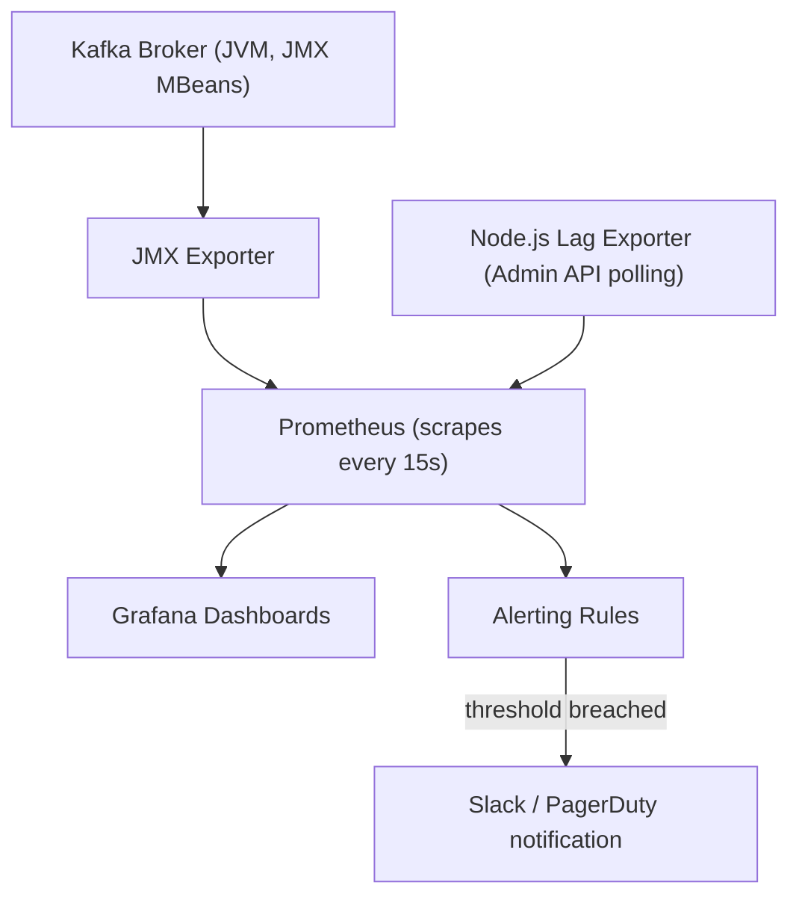
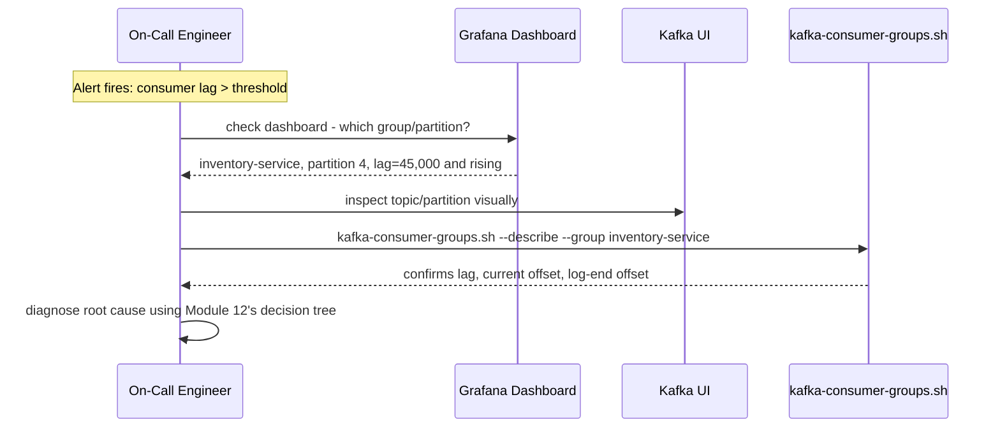
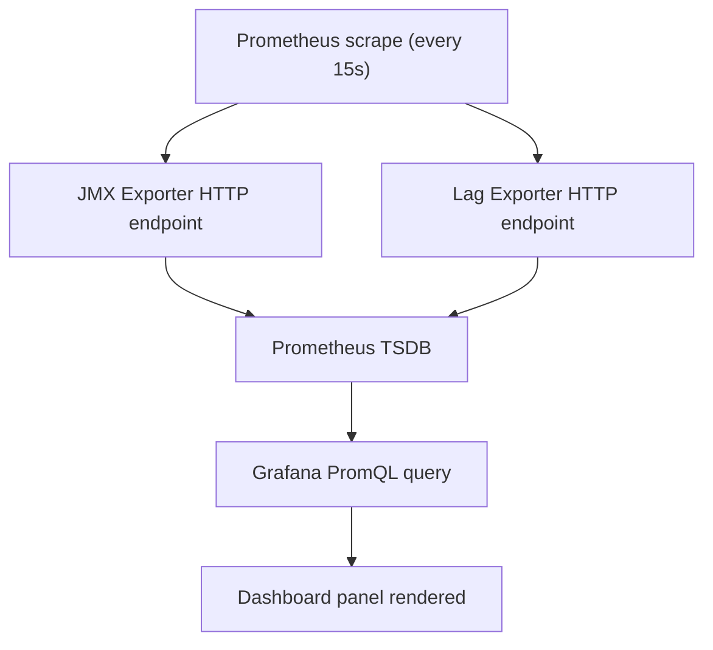
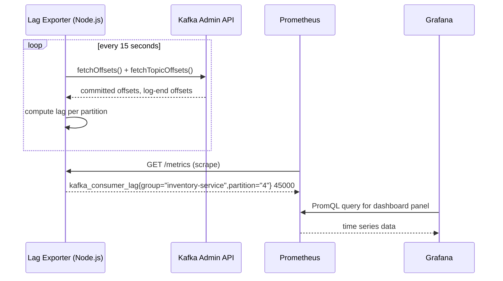

# Module 19 — Monitoring

**Level:** ⭐⭐⭐⭐ Advanced
**Track:** Kafka Complete Masterclass for Node.js Backend Engineers
**Module:** 19 of 25

---

## 1. Introduction

Every module from 1 to 18 has mentioned monitoring in passing — "track consumer lag" (Module 8), "watch for `UnderReplicatedPartitions`" (Module 9), "monitor producer request queue size" (Module 12). This module collects every one of those scattered mentions into a single, coherent observability strategy: which metrics actually matter, where they come from (broker JMX, client instrumentation, Kafka UI), how to wire them into Prometheus and Grafana, and — most importantly — what "healthy" and "unhealthy" actually look like for each one.

Monitoring is the module where all the theory from this course becomes something you can *see*, in real time, on a dashboard, before a small problem becomes a 3 AM incident.

---

## 2. Learning Objectives

By the end of this module, you will be able to:

1. Identify the small set of metrics that matter most for broker, producer, and consumer health.
2. Explain how Kafka exposes metrics via JMX, and how Prometheus scrapes them.
3. Build a Grafana dashboard covering lag, replication, and throughput.
4. Use Kafka UI tools for ad hoc visual inspection alongside a proper metrics pipeline.
5. Set meaningful alert thresholds that distinguish real incidents from normal noise.
6. Instrument a Node.js KafkaJS application to expose its own client-side metrics.

---

## 3. Why This Concept Exists

Every mechanism covered in this course — replication (Module 9), offsets (Module 8), consumer groups (Module 7), delivery guarantees (Module 10) — has a *failure mode*, and every failure mode has an *early warning sign* that appears well before the failure becomes a customer-facing incident. A shrinking ISR (Module 9) doesn't cause an outage the instant it happens; it's a warning that, left unaddressed, could lead to one. Growing consumer lag (Module 8) doesn't mean data is lost; it means a backlog is building that, if the trend continues, eventually will matter.

Monitoring exists to make these early warning signs *visible and actionable* — the difference between an engineer who notices a problem at 9 AM during a routine dashboard check, and one who discovers it at 3 AM because customers started complaining.

---

## 4. Problem Statement

Consider operating the multi-service system built across Modules 1–18 in production:

1. How do you know, right now, whether any partition across your entire cluster is under-replicated (Module 9), without manually running `kafka-topics.sh --describe` on every topic?
2. How do you know if the Inventory Service's consumer group is falling behind, and whether that's a brief blip or a sustained, worsening trend?
3. How do you distinguish "the broker is fine, just naturally busy at peak traffic" from "the broker is actually in trouble"?
4. When an alert fires at 3 AM, how do you go from "something is wrong" to "here is specifically what's wrong and where" as fast as possible?

Each of these requires a monitoring strategy assembled deliberately, not accumulated as an afterthought.

---

## 5. Real-World Analogy

### Analogy: A Hospital's Vital Signs Monitor

A patient's monitor doesn't display every possible measurement a full lab workup could produce — it shows a small, carefully-chosen set of **vital signs**: heart rate, blood pressure, oxygen saturation, temperature. These were chosen because they're the earliest, most reliable indicators that *something* is going wrong, even before a specific diagnosis is known. A nurse glancing at the monitor doesn't need to interpret raw lab chemistry to know "this needs attention now."

Kafka monitoring works the same way: consumer lag, under-replicated partitions, broker resource utilization, and request/error rates are your vital signs — a small set of well-chosen metrics that reliably surface trouble early, well before you need to dig into low-level diagnostics to understand exactly what's wrong. Just as a hospital pairs the vitals monitor (constant, automated) with periodic deeper exams (a doctor's visit), Kafka monitoring pairs continuous metrics/alerting (Prometheus/Grafana) with ad hoc visual inspection tools (Kafka UI) for deeper, situational investigation.

---

## 6. Technical Definition

- **JMX (Java Management Extensions)**: The mechanism Kafka brokers (a JVM application, Module 2) use to expose internal metrics — broker resource usage, request rates, replication state, and more.
- **JMX Exporter**: A companion process/agent that translates JMX metrics into a Prometheus-scrapeable HTTP endpoint, since Prometheus doesn't speak JMX natively.
- **Prometheus**: A time-series metrics database that periodically **scrapes** (pulls) metrics from configured targets (brokers via JMX Exporter, and optionally instrumented client applications) and stores them for querying and alerting.
- **Grafana**: A visualization layer that queries Prometheus (or other data sources) to render dashboards — graphs, gauges, tables — for human interpretation of metrics over time.
- **Consumer Lag**: (Module 8 recap) The gap between a consumer group's committed offset and a partition's log-end offset — the single most important consumer-side health metric.
- **Under-Replicated Partitions (URP)**: (Module 9 recap) Partitions where the ISR is smaller than the full replica set — the single most important broker/cluster-side durability health metric.
- **Alert Threshold**: A configured boundary (e.g., "lag > 10,000 for more than 5 minutes") that triggers a notification, deliberately tuned to distinguish genuine problems from normal, transient fluctuation.

---

## 7. Internal Working

### How metrics actually flow from broker to dashboard

```
1. Kafka broker (JVM process) continuously updates internal JMX
   MBeans (Managed Beans) — counters, gauges, histograms for
   things like BytesInPerSec, UnderReplicatedPartitions,
   RequestQueueSize, etc.

2. A JMX Exporter (often run as a Java agent attached to the
   broker's JVM, or as a separate sidecar process) reads these
   JMX MBeans and exposes them as an HTTP endpoint in Prometheus's
   text-based metrics format:

      kafka_server_replicamanager_underreplicatedpartitions 0

3. Prometheus, configured with this endpoint as a SCRAPE TARGET,
   polls it periodically (e.g., every 15s) and stores each
   metric's value over time in its time-series database

4. Grafana queries Prometheus (using PromQL, Prometheus's query
   language) to render this data as graphs/gauges on a dashboard

5. Prometheus's ALERTING RULES (or Grafana's own alerting)
   continuously evaluate metric values against configured
   thresholds, firing notifications (e.g., to Slack, PagerDuty)
   when a threshold is breached for a sustained period
```

### Consumer lag — where the number actually comes from

```
Two ways to obtain consumer lag data:

  1. kafka-consumer-groups.sh --describe (Module 8) — an on-demand,
     manual CLI snapshot; not automatically continuous.

  2. Admin API polling (as built in Module 8's tooling) — a script
     that periodically calls admin.fetchOffsets() and
     admin.fetchTopicOffsets(), computes lag, and EXPOSES it as a
     Prometheus metric via a small HTTP endpoint — this is how lag
     becomes something Prometheus can scrape and Grafana can graph
     continuously, rather than a one-off manual check.

Some organizations instead run a dedicated lag-exporter tool
(e.g., Burrow, or the Kafka Lag Exporter) that does exactly this
polling-and-exposing work as a standalone, purpose-built service.
```

---

## 8. Architecture

```
   Kafka Brokers               JMX Exporters            Prometheus
┌───────────────┐          ┌───────────────┐        ┌───────────────┐
│  Broker 1 (JMX)  │────────►│  Exporter (HTTP) │────────►│                 │
│  Broker 2 (JMX)  │────────►│  Exporter (HTTP) │────────►│  Scrapes all      │
│  Broker 3 (JMX)  │────────►│  Exporter (HTTP) │────────►│  targets every    │
└───────────────┘          └───────────────┘        │  15s, stores TSDB  │
                                                       └────────┬──────┘
   Node.js Services (lag exporter, client metrics)              │
┌───────────────┐                                              │
│  lag-exporter.js │────────────────────────────────────────────┘
│  (HTTP /metrics)  │
└───────────────┘
                                                                 ▼
                                                       ┌───────────────┐
                                                       │    Grafana      │
                                                       │  (dashboards,    │
                                                       │   alerting)      │
                                                       └───────────────┘
```

---

## 9. Step-by-Step Flow

1. JMX Exporters are attached to each broker's JVM, exposing broker-side metrics on an HTTP endpoint.
2. A Node.js-based lag exporter (Section 19.1) periodically polls consumer group offsets via the Admin API and exposes lag as its own Prometheus-scrapeable HTTP endpoint.
3. Prometheus is configured with all of these endpoints as scrape targets, polling them on a regular interval and storing the resulting time series.
4. Grafana dashboards query Prometheus to visualize broker health (URP, resource utilization, request rates) and consumer health (lag, per-group and per-partition) on the same operational view.
5. Prometheus alerting rules continuously evaluate key metrics against thresholds, notifying the on-call engineer when something crosses into unhealthy territory for a sustained period.
6. During an incident, an engineer starts from the dashboard's high-level view, then drills into Kafka UI or CLI tools (Modules 2, 8, 9) for deeper, ad hoc investigation of the specific topic/partition/consumer group implicated.

---

## 10. Detailed ASCII Diagrams

### 10.1 The Core Metrics Hierarchy

```
CLUSTER-LEVEL (broker health):
  - UnderReplicatedPartitions (target: always 0)
  - ActiveControllerCount (target: always exactly 1, cluster-wide)
  - OfflinePartitionsCount (target: always 0)
  - Broker CPU / Disk / Network utilization

TOPIC/PARTITION-LEVEL:
  - BytesInPerSec / BytesOutPerSec (throughput)
  - Partition count vs. replica/ISR count (Module 9 health)

CONSUMER-LEVEL:
  - Consumer lag (per group, per partition) — target: stable
    or near-zero, NOT continuously growing
  - Rebalance frequency (Module 7) — target: rare, not constant

PRODUCER-LEVEL:
  - Request latency, error rate, retry rate
  - Request queue size (Module 12) — target: not persistently growing
```

### 10.2 A Healthy vs. Unhealthy Lag Graph

```
HEALTHY (lag oscillates near zero, brief spikes recover quickly):

  lag
   │     ╱╲              ╱╲
   │    ╱  ╲            ╱  ╲
   │___╱    ╲__________╱    ╲______
   └──────────────────────────────► time


UNHEALTHY (lag trending upward, NOT recovering — consumer
           genuinely can't keep up):

  lag
   │                        ╱
   │                    ╱‾‾
   │               ╱‾‾‾
   │          ╱‾‾‾
   │_____╱‾‾‾
   └──────────────────────────────► time

This TREND distinction (Module 8's "steadily increasing, not just
spiking" point) is exactly what a lag graph over time makes
immediately, visually obvious — something a single point-in-time
CLI check cannot show you.
```

### 10.3 Alert Threshold Design

```
NAIVE alert: "fire if lag > 0"
  -> constant false-positive noise; lag briefly non-zero is NORMAL

BETTER alert: "fire if lag > 10,000 FOR MORE THAN 5 CONSECUTIVE MINUTES"
  -> tolerates normal, brief fluctuation; catches genuine,
     sustained backlog growth — the "for more than N minutes"
     clause is what separates useful alerts from noisy ones
```

---

## 11. Mermaid Diagrams





---

## 12. Request Flow Diagram



---

## 13. Sequence Diagram



---

## 14. Kafka Internal Flow

```
Kafka's broker exposes metrics as an intrinsic part of its JVM
runtime (JMX) — this requires NO special broker configuration
beyond enabling the JMX port (often on by default) and attaching
an exporter agent.

Client-side metrics (producer/consumer) are exposed differently:
KafkaJS's INSTRUMENTATION EVENTS (Module 13) provide the raw data;
YOUR Node.js application code is responsible for translating those
events into Prometheus-compatible metrics (e.g., via the `prom-client`
npm package) and exposing an HTTP /metrics endpoint of its own —
Kafka itself does not automatically expose Node.js client metrics
the way it does broker JMX metrics.
```

---

## 15. Producer Perspective

A well-instrumented Node.js producer service exposes its own metrics endpoint, translating KafkaJS instrumentation events (Module 13) into Prometheus counters/histograms: send latency, error rate, retry count. This closes the loop from Module 12's performance-tuning diagnostic process — "is the producer the bottleneck?" becomes a dashboard query, not a guess.

---

## 16. Consumer Perspective

Consumer-side, the most important metric by far is lag (Section 7), but a well-instrumented consumer also exposes processing time per message/batch and error/dead-letter rates (Module 15) — together, these let you distinguish "consumer is slow because of fetch sizing" (Module 12) from "consumer is slow because of a downstream dependency" (Module 13) directly from dashboards, without needing to reproduce the issue manually.

---

## 17. Broker Perspective

The broker's metrics are the most mature and comprehensive part of this whole picture, since JMX exposure has been part of Kafka since its earliest versions — nearly every internal counter and gauge discussed throughout this course (ISR size, request queue depth, log flush latency, replication lag) is available via JMX with no custom code required, only the exporter/scraping plumbing (Section 7) to get it into Prometheus.

---

## 18. Node.js Integration

### Recommended structure for an instrumented Node.js Kafka service

```
inventory-service/
├── src/
│   ├── metrics/
│   │   ├── registry.js         # prom-client Registry setup
│   │   ├── producerMetrics.js  # KafkaJS instrumentation -> Prometheus
│   │   └── consumerMetrics.js
│   ├── consumers/
│   │   └── inventoryConsumer.js
│   └── server.js               # exposes GET /metrics
```

---

## 19. KafkaJS Examples

### 19.1 A Node.js consumer-lag Prometheus exporter

```javascript
// src/metrics/lagExporter.js
import express from "express";
import client from "prom-client";
import { kafka } from "../config/kafka.js";

const register = new client.Registry();
const lagGauge = new client.Gauge({
  name: "kafka_consumer_lag",
  help: "Consumer group lag per partition",
  labelNames: ["group", "topic", "partition"],
  registers: [register],
});

async function updateLagMetrics(groupId, topic) {
  const admin = kafka.admin();
  await admin.connect();

  const groupOffsets = await admin.fetchOffsets({ groupId, topics: [topic] });
  const topicOffsets = await admin.fetchTopicOffsets(topic);

  groupOffsets[0].partitions.forEach((p) => {
    const logEnd = topicOffsets.find((t) => t.partition === p.partition)?.offset;
    const lag = Number(logEnd) - Number(p.offset);
    lagGauge.set({ group: groupId, topic, partition: String(p.partition) }, lag);
  });

  await admin.disconnect();
}

export function startLagExporter({ groupId, topic, port = 9308, intervalMs = 15000 }) {
  setInterval(() => updateLagMetrics(groupId, topic).catch(console.error), intervalMs);

  const app = express();
  app.get("/metrics", async (req, res) => {
    res.set("Content-Type", register.contentType);
    res.end(await register.metrics());
  });
  app.listen(port, () => console.log(`Lag exporter listening on :${port}/metrics`));
}
```

### 19.2 Instrumenting a producer with `prom-client` + KafkaJS events

```javascript
// src/metrics/producerMetrics.js
import client from "prom-client";

export function instrumentProducer(producer, register) {
  const sendLatency = new client.Histogram({
    name: "kafka_producer_send_duration_seconds",
    help: "Producer send latency",
    labelNames: ["topic"],
    registers: [register],
  });

  const sendErrors = new client.Counter({
    name: "kafka_producer_send_errors_total",
    help: "Total producer send errors",
    labelNames: ["topic"],
    registers: [register],
  });

  const originalSend = producer.send.bind(producer);
  producer.send = async (payload) => {
    const end = sendLatency.startTimer({ topic: payload.topic });
    try {
      const result = await originalSend(payload);
      end();
      return result;
    } catch (err) {
      end();
      sendErrors.inc({ topic: payload.topic });
      throw err;
    }
  };

  producer.on(producer.events.REQUEST_TIMEOUT, () => {
    sendErrors.inc({ topic: "unknown" });
  });
}
```

### 19.3 Exposing a combined `/metrics` endpoint alongside the app

```javascript
// src/server.js
import express from "express";
import client from "prom-client";
import { instrumentProducer } from "./metrics/producerMetrics.js";
import { producer, connectProducer } from "./producers/orderEventProducer.js";

const register = new client.Registry();
client.collectDefaultMetrics({ register }); // Node.js process metrics (CPU, memory, event loop lag)
instrumentProducer(producer, register);

const app = express();

app.get("/metrics", async (req, res) => {
  res.set("Content-Type", register.contentType);
  res.end(await register.metrics());
});

async function main() {
  await connectProducer();
  app.listen(3000, () => console.log("Service + /metrics listening on :3000"));
}

main().catch(console.error);
```

### 19.4 A simple Prometheus alerting rule (YAML, referenced from Node.js docs/runbooks)

```yaml
# prometheus/alerts.yml
groups:
  - name: kafka-alerts
    rules:
      - alert: HighConsumerLag
        expr: kafka_consumer_lag > 10000
        for: 5m
        labels:
          severity: warning
        annotations:
          summary: "Consumer group {{ $labels.group }} lag exceeds 10,000 for 5+ minutes"

      - alert: UnderReplicatedPartitions
        expr: kafka_server_replicamanager_underreplicatedpartitions > 0
        for: 2m
        labels:
          severity: critical
        annotations:
          summary: "Cluster has under-replicated partitions — durability at risk"
```

### 19.5 A quick Node.js health-check script combining Admin API + metrics

```javascript
// src/tools/quickHealthCheck.js
import { kafka } from "../config/kafka.js";

async function quickHealthCheck() {
  const admin = kafka.admin();
  await admin.connect();

  const cluster = await admin.describeCluster();
  console.log(`Controller: broker ${cluster.controller}, brokers: ${cluster.brokers.length}`);

  const topics = await admin.listTopics();
  for (const topic of topics) {
    const metadata = await admin.fetchTopicMetadata({ topics: [topic] });
    metadata.topics[0].partitions.forEach((p) => {
      if (p.isr.length < p.replicas.length) {
        console.warn(`⚠️  ${topic} partition ${p.partitionId} is under-replicated`);
      }
    });
  }

  await admin.disconnect();
}

quickHealthCheck().catch(console.error);
```

---

## 20. CLI Commands

```bash
# Query Prometheus directly for a metric (useful for quick ad hoc checks)
curl -s 'http://localhost:9090/api/v1/query?query=kafka_consumer_lag' | jq .

# Check a JMX Exporter's raw metrics endpoint directly
curl -s http://localhost:9404/metrics | grep underreplicated

# Reload Prometheus configuration after editing scrape targets/alert rules
curl -X POST http://localhost:9090/-/reload

# Open Kafka UI for ad hoc visual inspection (Module 2's setup)
open http://localhost:8080
```

---

## 21. Configuration Explanation

| Config/Concept | Meaning |
|---|---|
| JMX port (broker) | Must be enabled/exposed for the JMX Exporter to read broker metrics |
| Prometheus `scrape_configs` | Defines which endpoints (JMX exporters, Node.js `/metrics`) Prometheus polls, and how often |
| Alert `for:` duration | The sustained-breach window required before an alert actually fires — critical for avoiding noisy, false-positive alerts (Section 10.3) |
| Grafana data source | Points Grafana at your Prometheus instance so dashboards can query it |
| `prom-client` default metrics | Standard Node.js process metrics (event loop lag, memory, CPU) worth collecting alongside Kafka-specific ones |

---

## 22. Common Mistakes

1. **Alerting on raw, instantaneous values instead of sustained trends.** "Lag > 0" or "lag > 10,000" without a `for:` duration clause produces constant noisy false positives, training the team to ignore alerts (alert fatigue).
2. **Monitoring only broker-side metrics and ignoring consumer lag**, or vice versa — both cluster health and consumer health are independently necessary; neither alone tells the whole story.
3. **Polling consumer lag too infrequently or too frequently.** Too infrequent misses fast-developing incidents; too frequent adds unnecessary load to the group coordinator broker (Module 8's guidance on lag-check intervals applies directly here).
4. **Building dashboards nobody looks at until an incident.** Dashboards should be part of routine, periodic review (even brief daily glances), not purely reactive tools.
5. **Not instrumenting Node.js client applications at all**, relying solely on broker-side metrics — this misses producer/consumer-side problems (Module 12's producer-bound vs. consumer-bound distinction) that broker metrics alone can't reveal.
6. **Treating Kafka UI as a substitute for Prometheus/Grafana**, rather than a complementary tool — Kafka UI is excellent for ad hoc, point-in-time visual inspection but isn't designed for historical trending or automated alerting.

---

## 23. Edge Cases

- **What if Prometheus itself becomes unavailable?** This creates a monitoring blind spot exactly when you might need it most — Prometheus's own availability (and Grafana's) should itself be monitored, ideally by a separate, independent mechanism (a classic "who watches the watchers" problem).
- **What if a metric briefly spikes due to a legitimate, expected event** (e.g., a planned broker restart during maintenance, Module 21)? Well-designed alerts (Section 10.3's sustained-duration approach) naturally tolerate this, but planned maintenance windows are still worth explicitly silencing alerts for, to avoid unnecessary on-call noise.
- **What if two different metrics tell seemingly contradictory stories** (e.g., low broker CPU but high consumer lag)? This is precisely the diagnostic signal from Module 12's bottleneck decision tree — it usually points toward a consumer-side (not broker-side) issue, and the dashboard should make this contradiction visible rather than averaging it away.

---

## 24. Performance Considerations

- Scraping intervals (typically 10–30 seconds) balance monitoring freshness against load on the metrics endpoints and Prometheus's storage — very aggressive scraping (sub-second) is rarely necessary and adds real overhead.
- A Node.js lag exporter's Admin API polling (Section 19.1) adds a small, continuous load to the group coordinator broker — reasonable at typical intervals, but worth being mindful of at very large scale (many consumer groups being polled simultaneously).
- Prometheus's storage grows with the number of unique metric label combinations (cardinality) — be deliberate about label choices (e.g., per-partition labels multiply quickly across many topics) to avoid unexpectedly high cardinality.

---

## 25. Scalability Discussion

- As a cluster grows (more brokers, more topics, more consumer groups), the monitoring pipeline itself needs to scale — Prometheus federation or remote-write setups become relevant at large scale, beyond a single Prometheus instance's comfortable capacity.
- Dashboards should be designed to scale conceptually too: a single dashboard trying to show every partition of every topic individually becomes unusable past a certain size — aggregate views (e.g., "total lag across all consumer groups," with drill-down capability) scale better than exhaustive per-partition panels.

---

## 26. Production Best Practices

- Monitor both broker-side (JMX-derived) and client-side (KafkaJS-instrumented) metrics — neither alone is sufficient.
- Design alerts around sustained trends (`for:` duration), not instantaneous values, to avoid alert fatigue.
- Treat consumer lag and under-replicated partitions as your two most important "vital signs," worth top-of-dashboard prominence.
- Pair continuous metrics/alerting (Prometheus/Grafana) with ad hoc visual tools (Kafka UI) for different, complementary use cases — routine monitoring vs. deep, situational investigation.
- Monitor your monitoring stack's own availability — Prometheus and Grafana being down is itself an incident-worthy condition.

---

## 27. Monitoring & Debugging

- (This entire module is itself about monitoring and debugging — the sections above collectively define the practice.) Build runbooks that link each alert directly to the specific diagnostic steps from the relevant earlier module (e.g., a lag alert links to Module 12's bottleneck decision tree) so on-call engineers aren't starting from scratch during an incident.

---

## 28. Security Considerations

- Metrics endpoints (JMX Exporter HTTP, Node.js `/metrics`) often expose operationally sensitive information (topic names, consumer group names, throughput patterns) — these should not be publicly accessible and should be scoped to your internal monitoring network.
- Grafana and Prometheus access should be authenticated and access-controlled, consistent with the sensitivity of the operational data they expose.

---

## 29. Interview Questions (Easy → Medium → Hard)

### Easy

1. What is consumer lag, and why is it important to monitor?
2. What is JMX, and what role does it play in Kafka monitoring?
3. What is the difference between Prometheus and Grafana?

### Medium

4. What is `UnderReplicatedPartitions`, and why is it a critical metric to monitor?
5. Why does an alert need a sustained-duration clause (`for:`) rather than firing on any instantaneous threshold breach?
6. How does Prometheus obtain metrics from a Kafka broker, given brokers don't speak Prometheus's protocol natively?
7. Why is it insufficient to monitor only broker-side metrics for a complete picture of system health?

### Hard

8. Design a Prometheus alerting rule for consumer lag that avoids both false positives (brief, normal spikes) and false negatives (slow, sustained growth), explaining your threshold and duration choices.
9. Explain how you would build a Node.js consumer-lag exporter from scratch, including how it obtains data and how it avoids adding excessive load to the Kafka cluster.
10. A dashboard shows low broker CPU/disk/network utilization but high, growing consumer lag. Walk through your diagnostic process, referencing concepts from Module 12.
11. Explain the "who watches the watchers" problem as it applies to a Kafka monitoring stack, and propose a concrete mitigation.

---

## 30. Common Interview Traps

- **Trap:** "Consumer lag being non-zero always indicates a problem." → **Reality:** Some non-zero lag is completely normal and expected; sustained, growing lag is the actual concern, not any lag at all.
- **Trap:** "Kafka brokers can be scraped directly by Prometheus without any additional tooling." → **Reality:** Brokers expose metrics via JMX, not Prometheus's native format — a JMX Exporter (or similar bridge) is required in between.
- **Trap:** "Kafka UI is a full replacement for a Prometheus/Grafana monitoring pipeline." → **Reality:** Kafka UI excels at ad hoc, point-in-time visual inspection but isn't designed for historical trending, alerting, or automated notification — the two are complementary, not interchangeable.

---

## 31. Summary

- Kafka monitoring centers on a small set of "vital sign" metrics: consumer lag and under-replicated partitions above all, alongside broker resource utilization and producer/consumer client-side health.
- Broker metrics flow via JMX, through a JMX Exporter, into Prometheus, and finally into Grafana dashboards; consumer lag typically requires a dedicated exporter built on the Admin API.
- Alert thresholds should be based on sustained trends, not instantaneous values, to avoid alert fatigue while still catching genuine, developing incidents.
- Node.js client applications should be explicitly instrumented (via `prom-client` and KafkaJS's instrumentation events) since Kafka doesn't expose client-side metrics automatically the way it does broker JMX metrics.
- Continuous metrics/alerting and ad hoc visual tools (Kafka UI) serve complementary, not overlapping, roles in a complete monitoring strategy.

---

## 32. Cheat Sheet

```
MONITORING — ONE PAGE

Vital signs (top-of-dashboard priority):
  Consumer lag                = per group/partition, watch the TREND
  Under-Replicated Partitions = should ALWAYS be 0
  Active Controller Count     = should ALWAYS be exactly 1
  Broker CPU/Disk/Network     = capacity and bottleneck signal

Metrics pipeline:
  Broker (JMX) -> JMX Exporter -> Prometheus (scrape) -> Grafana
  Consumer lag -> Node.js exporter (Admin API polling) -> Prometheus
  Client apps  -> prom-client + KafkaJS instrumentation events -> /metrics

Alert design: threshold + SUSTAINED DURATION ("for: 5m"), never
              instantaneous-only — avoids alert fatigue

Complementary tools:
  Prometheus/Grafana = continuous, historical, automated alerting
  Kafka UI            = ad hoc, point-in-time, visual deep-dive

Golden rule: monitor BOTH broker-side and client-side metrics —
             neither alone tells the whole story
```

---

## 33. Hands-on Exercises

1. Set up a JMX Exporter against your local Kafka broker and confirm you can `curl` its `/metrics` endpoint and see real values.
2. Configure Prometheus to scrape that endpoint, and confirm the metric appears in Prometheus's own web UI query interface.
3. Build the Node.js lag exporter from Section 19.1 against a real consumer group, and confirm its `/metrics` output updates as you produce/consume messages.
4. Build a basic Grafana dashboard with panels for consumer lag and under-replicated partitions, using the data sources from the exercises above.

---

## 34. Mini Project

**Build:** A complete local monitoring stack (Prometheus + Grafana + JMX Exporter + the Node.js lag exporter from Section 19.1) via Docker Compose, with a pre-built Grafana dashboard covering the "vital signs" from Section 10.1, and at least two working alert rules (Section 19.4).

---

## 35. Advanced Project

**Build:** A full incident-simulation exercise: deliberately induce consumer lag (by pausing a consumer) and an under-replicated partition (by stopping a broker), and confirm both conditions are correctly visualized on your Grafana dashboard and trigger the expected alerts within their configured `for:` durations — then write a short runbook documenting the diagnostic steps an on-call engineer should follow for each alert.

---

## 36. Homework

1. Research Burrow and Kafka Lag Exporter (two purpose-built, widely-used consumer lag monitoring tools) and compare their approach to the hand-rolled Node.js exporter from this module.
2. Write a short guide on PromQL basics sufficient to write the queries needed for the dashboard panels in this module's exercises.
3. Design an alert-routing policy (which alerts page immediately vs. which just notify a Slack channel) for a hypothetical production Kafka deployment, justifying your severity classifications.

---

## 37. Additional Reading

- Apache Kafka documentation — "Monitoring" section, listing all standard JMX metrics
- Prometheus documentation — "Alerting Rules" and "Best Practices" for metric and label design
- Confluent blog: "Monitoring Kafka Performance" and "Consumer Lag: The Most Important Kafka Metric"

---

## Key Takeaways

- Consumer lag and under-replicated partitions are the two most important Kafka "vital signs," deserving top-of-dashboard prominence.
- Broker metrics flow through JMX and a JMX Exporter into Prometheus; client-side metrics require explicit Node.js instrumentation.
- Alert thresholds should be based on sustained trends, not instantaneous values, to avoid alert fatigue.
- Prometheus/Grafana (continuous, historical) and Kafka UI (ad hoc, visual) serve complementary roles in a complete monitoring strategy.
- A monitoring stack's own availability should itself be monitored — it is a genuine, critical piece of production infrastructure.

---

## Revision Notes

- Be able to draw the full metrics pipeline (broker → JMX Exporter → Prometheus → Grafana) from memory.
- Be able to explain why alert thresholds need a sustained-duration clause, with a concrete false-positive example.
- Practice identifying, from a described dashboard scenario, whether an issue is broker-side or client-side, using Module 12's diagnostic framework.

---

## One-Page Cheat Sheet

*(See Section 32 above.)*

---

## 20 Practice Questions

1. What is consumer lag?
2. What is JMX?
3. What is a JMX Exporter used for?
4. What does Prometheus do?
5. What does Grafana do?
6. What is `UnderReplicatedPartitions`, and what should its healthy value be?
7. What is `ActiveControllerCount`, and what should its healthy value be?
8. Why does an alert need a sustained-duration clause?
9. Does Kafka automatically expose Node.js client-side metrics?
10. What library is commonly used to expose Prometheus metrics from a Node.js app?
11. What does a Node.js lag exporter typically use to compute lag?
12. Why might polling consumer lag too frequently be undesirable?
13. What's the difference between Kafka UI and a Prometheus/Grafana pipeline?
14. Why should a monitoring stack's own availability be monitored?
15. What are the two most important Kafka "vital sign" metrics?
16. What is metric cardinality, and why does it matter for Prometheus?
17. What Node.js package provides default process metrics (CPU, memory, event loop lag)?
18. Why is it insufficient to rely only on broker-side metrics?
19. What tool provides ad hoc, point-in-time visual inspection of topics and consumer groups?
20. What's a reasonable typical Prometheus scrape interval?

---

## 10 Scenario-Based Questions

1. Your dashboard shows consumer lag briefly spiking every hour, always recovering within a minute. Should this trigger a page? Design an alert rule that handles this correctly.
2. A new engineer asks why you need both Kafka UI and a full Prometheus/Grafana setup. How would you explain the distinction?
3. Your monitoring stack itself goes down during an actual Kafka incident, delaying detection by 40 minutes. What would you change going forward?
4. A dashboard shows `UnderReplicatedPartitions > 0` for the last 10 minutes with no alert firing. What would you check in your alerting configuration?
5. Your Node.js lag exporter is adding noticeable load to the group coordinator broker at your current scale. What would you investigate or change?
6. Two metrics tell contradictory stories: low broker CPU, but high and growing consumer lag. Walk through your diagnostic process.
7. Your team wants a single "is Kafka healthy?" dashboard number for a status page. What underlying metrics would you combine, and how would you weight them?
8. An alert fires for high producer error rate, but consumer lag and broker metrics all look fine. What area would you investigate first?
9. Your Grafana dashboard has 200 individual per-partition panels and has become unusable during incidents. How would you redesign it?
10. Explain to a new on-call engineer, using this module's runbook concept, how they should move from "an alert fired" to "I know what's wrong and where."

---

## 5 Coding Assignments

1. Build a Node.js Prometheus lag exporter (Section 19.1) and verify its output against a manually-run `kafka-consumer-groups.sh --describe` for consistency.
2. Instrument a KafkaJS producer with `prom-client` histograms/counters for send latency and error rate (Section 19.2), and expose them via a `/metrics` endpoint.
3. Write a Prometheus alerting rule set (Section 19.4) covering consumer lag, under-replicated partitions, and producer error rate, each with an appropriately chosen `for:` duration.
4. Build a small Grafana dashboard JSON export covering the "vital signs" from Section 10.1, suitable for import into any Grafana instance.
5. Write a health-check script that queries Prometheus directly (via its HTTP API) for the current values of your key metrics, and prints a color-coded (or emoji-flagged) summary suitable for a quick terminal-based health check.

---

## Suggested Next Module

**Module 20 — Security**
With full observability now in place, the next module addresses hardening the entire system built across Modules 1–19: SSL/TLS encryption, SASL authentication, ACL-based authorization, and the practical steps for taking a Kafka deployment from "works on my laptop" to "safe to run in a real, adversarial production environment."
