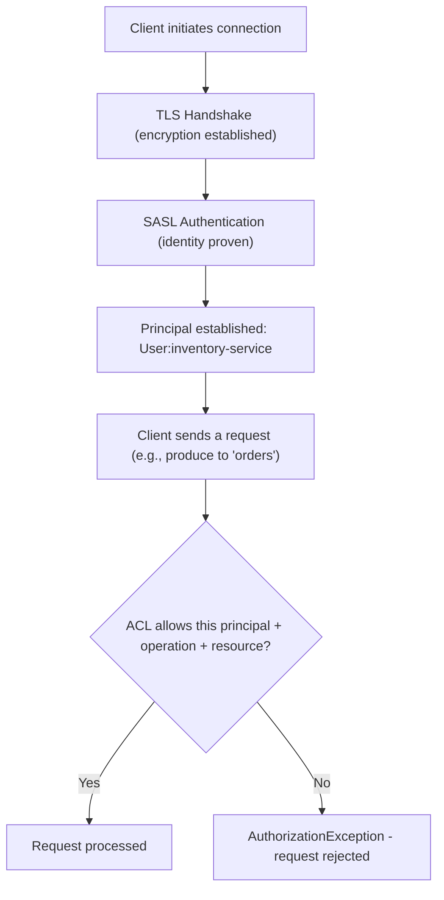
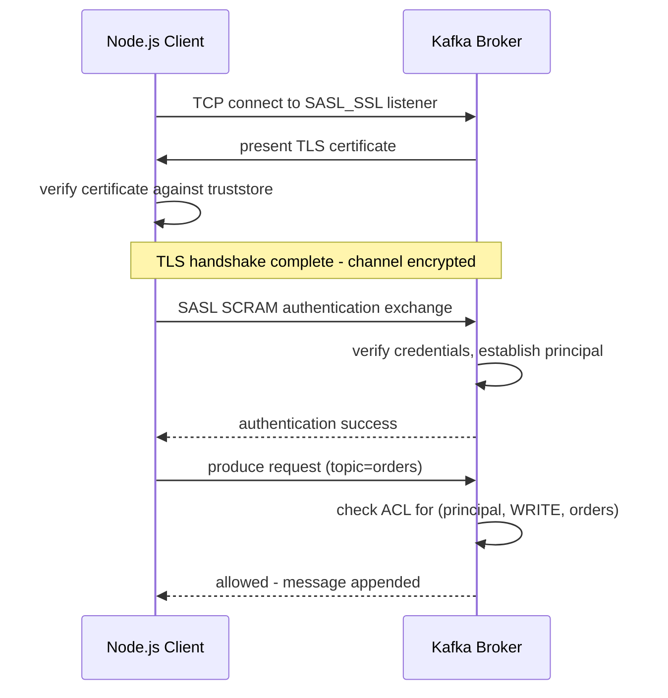
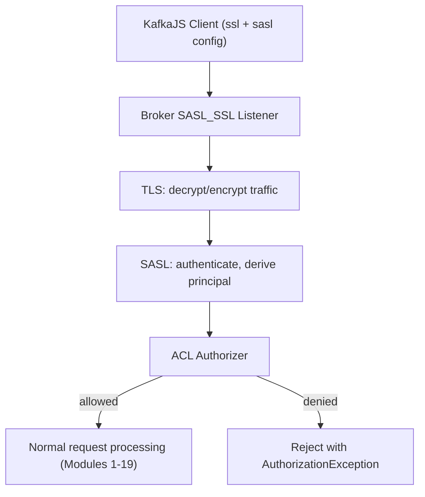
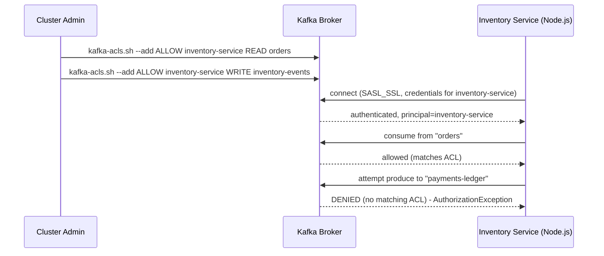

# Module 20 — Security

**Level:** ⭐⭐⭐⭐ Advanced
**Track:** Kafka Complete Masterclass for Node.js Backend Engineers
**Module:** 20 of 25

---

## 1. Introduction

Every module up to this point has used a completely open, unauthenticated local broker — appropriate for learning, dangerous for production. This module closes that gap: encrypting data in transit (SSL/TLS), proving client identity (SASL authentication), and restricting exactly who can do what (ACL-based authorization). By the end, you'll understand the full journey from "anyone who can reach port 9092 can read and write anything" to "only authenticated, authorized clients can perform specifically permitted operations on specifically permitted topics."

This module also revisits several earlier modules' passing security mentions (Module 4's producer credentials, Module 9's replication encryption, Module 16's registry access control) and assembles them into one coherent security model.

---

## 2. Learning Objectives

By the end of this module, you will be able to:

1. Explain the difference between encryption (SSL/TLS), authentication (SASL), and authorization (ACLs) as three distinct, layered concerns.
2. Configure a Kafka broker with SSL/TLS listeners for encrypted client and inter-broker communication.
3. Configure SASL authentication (PLAIN, SCRAM) for a broker and a KafkaJS client.
4. Design and apply ACLs restricting specific service accounts to specific topics and operations.
5. Connect a Node.js KafkaJS client securely, with proper credential management.
6. Reason about the security trade-offs of different configuration choices in a production Kafka deployment.

---

## 3. Why This Concept Exists

Every module in this course has quietly assumed a trusted network: `brokers: ["localhost:9092"]`, no username, no password, no encryption. This is fine for a laptop, catastrophic for a production system reachable by anything beyond a fully isolated, trusted network. Kafka's security model exists to answer three genuinely distinct questions, each requiring a different mechanism:

- **Can someone eavesdrop on data in transit between my client and the broker, or between brokers themselves?** → Answered by **encryption (SSL/TLS)**.
- **How does the broker know a connecting client actually is who it claims to be, rather than anyone who can reach the port?** → Answered by **authentication (SASL)**.
- **Given a proven identity, what is that specific identity actually allowed to do?** → Answered by **authorization (ACLs)**.

Conflating these three (a common beginner mistake) leads to broken security postures — e.g., encrypting traffic but allowing any authenticated user to do anything, or authenticating users but leaving the wire unencrypted so credentials themselves are exposed in transit.

---

## 4. Problem Statement

Consider taking the multi-service system built across Modules 1–19 and deploying it somewhere genuinely untrusted (a shared cloud environment, a network segment beyond your direct control):

1. Anyone who can route traffic to your broker's port can currently read every message in every topic, including sensitive payment and customer data — how do you stop this?
2. Your Order Service's producer credentials, if leaked, currently allow an attacker to publish forged `OrderPlaced` events — how do you scope credentials so a leak has limited blast radius?
3. The Inventory Service should only ever need to **read** from `orders` and **write** to `inventory-events` — it should never be able to delete a topic, read from `payments-ledger`, or write to `orders`. How do you actually enforce this, not just hope the code never does it?
4. Data flowing between brokers themselves (replication traffic, Module 9) — is that also exposed to eavesdropping, and does it need its own protection distinct from client-facing traffic?

Each of these requires a specific piece of Kafka's layered security model.

---

## 5. Real-World Analogy

### Analogy: A Secure Office Building

**Encryption (SSL/TLS)** is like the building's windows being made of one-way, opaque privacy glass — nobody outside can see what's happening inside, or intercept a conversation happening near a window, even if they're standing right next to the building.

**Authentication (SASL)** is the building's front desk checking ID badges — you must prove you are who you claim to be before you're let past the lobby at all. A stolen or forged badge is a serious problem (credential leakage), but this step is specifically about *identity verification*, not what you're allowed to do once inside.

**Authorization (ACLs)** is what happens *after* the front desk lets you in: your badge might grant access to the accounting floor but not the executive suite, and to reading files in a specific cabinet but not shredding them. Two people can both have valid badges (both authenticated) while having completely different permitted actions (different authorization) — this is precisely the distinction between authentication and authorization that trips up many engineers.

---

## 6. Technical Definition

- **SSL/TLS**: A cryptographic protocol encrypting data in transit between two parties (client-broker, or broker-broker for replication), and optionally providing mutual authentication via certificates (mTLS).
- **SASL (Simple Authentication and Security Layer)**: A framework Kafka uses for client authentication, supporting several mechanisms:
  - **SASL/PLAIN**: Username/password, simplest to configure, should always be paired with SSL/TLS (otherwise credentials travel in the clear).
  - **SASL/SCRAM**: A challenge-response mechanism (SCRAM-SHA-256/512) that never sends the password itself over the wire, even without TLS — more resistant to credential interception than PLAIN alone.
  - **SASL/GSSAPI (Kerberos)**: Enterprise-grade authentication integrating with existing Kerberos infrastructure, common in large, established enterprise environments.
  - **SASL/OAUTHBEARER**: Token-based authentication, integrating with modern OAuth2/OIDC identity providers.
- **ACL (Access Control List)**: A rule granting (or denying) a specific principal (authenticated identity) permission to perform a specific operation (Read, Write, Create, Delete, Describe, etc.) on a specific resource (a topic, consumer group, or cluster-level operation).
- **Principal**: The authenticated identity a client presents after successfully completing SASL authentication — the subject ACLs are actually written against.
- **mTLS (Mutual TLS)**: A variant of TLS where both the client and the broker present certificates, providing authentication via certificate identity rather than (or in addition to) SASL credentials.

---

## 7. Internal Working

### How the three layers combine on a single connection

```
1. Client initiates a TCP connection to the broker's configured
   listener (e.g., SASL_SSL://broker:9093)

2. TLS HANDSHAKE occurs first: broker presents its certificate,
   client verifies it (and, if mTLS, presents its own certificate
   in return) — from this point, ALL further communication on
   this connection is ENCRYPTED

3. SASL AUTHENTICATION occurs next, WITHIN the now-encrypted
   channel: client presents credentials (PLAIN username/password,
   or a SCRAM challenge-response exchange) — the broker verifies
   these against its configured credential store

4. Upon successful authentication, the broker now knows the
   PRINCIPAL for this connection (e.g., "User:inventory-service")

5. For EVERY subsequent request on this connection (produce,
   fetch, list topics, etc.), the broker checks its ACL rules:
   "is User:inventory-service permitted to perform THIS operation
   on THIS resource?" — allowing or denying accordingly
```

### Why SASL/PLAIN without TLS is dangerous

```
WITHOUT TLS (plaintext connection):

  Client ──"username=inventory-service, password=hunter2"──► Broker
              (visible to ANYONE who can observe network traffic
               between client and broker — credentials LEAKED)

WITH TLS (encrypted connection):

  Client ──[ENCRYPTED: username=..., password=...]──► Broker
              (unreadable to any network observer; only the
               broker, holding the corresponding decryption
               context, can see the actual credentials)

This is why SASL_PLAINTEXT (SASL without TLS) is considered
UNSAFE for any real deployment — always pair SASL with SSL,
configured as the combined "SASL_SSL" protocol.
```

### ACL evaluation

```
Principal: User:inventory-service
Requested operation: Write to topic "orders"

Broker checks ACLs for this exact (principal, resource, operation)
combination:

  ACL 1: ALLOW User:inventory-service READ on topic "orders" -> N/A (different operation)
  ACL 2: ALLOW User:inventory-service WRITE on topic "inventory-events" -> N/A (different resource)

  NO matching ALLOW rule found for (inventory-service, WRITE, orders)
  -> DEFAULT DENY -> request REJECTED with an AuthorizationException

Kafka's ACL model is DEFAULT-DENY: unless an explicit ALLOW rule
matches, the operation is refused. (A cluster-wide "allow.everyone.
if.no.acl.found" config exists but defeats the purpose of ACLs
entirely and should not be used in production.)
```

---

## 8. Architecture

```
                     Kafka Broker
     ┌───────────────────────────────────────────────────┐
     │  Listener: SASL_SSL://0.0.0.0:9093                    │
     │     │                                                 │
     │     ▼                                                 │
     │  TLS layer (encrypts the connection)                   │
     │     │                                                 │
     │     ▼                                                 │
     │  SASL layer (authenticates -> establishes PRINCIPAL)   │
     │     │                                                 │
     │     ▼                                                 │
     │  ACL Authorizer (checks principal + operation +        │
     │  resource against configured ACL rules)                │
     │     │                                                 │
     │     ▼                                                 │
     │  Request processed (or rejected)                       │
     └───────────────────────────────────────────────────┘
```

---

## 9. Step-by-Step Flow

1. Broker is configured with a `SASL_SSL` listener, a TLS keystore/truststore, and a SASL mechanism (e.g., SCRAM).
2. Service-specific credentials are provisioned (e.g., `inventory-service` / a generated password, stored via SCRAM in the broker or in an external credential store).
3. ACLs are explicitly configured, granting `inventory-service` exactly the operations it needs (e.g., `READ` on `orders`, `WRITE` on `inventory-events`) and nothing more.
4. The Node.js KafkaJS client is configured with matching SSL and SASL settings, using credentials loaded securely (environment variables or a secrets manager, never hardcoded).
5. On connection, the TLS handshake, SASL authentication, and per-request ACL checks (Section 7) all occur transparently as part of KafkaJS's normal operation — your application code (Modules 1–19) doesn't need to change beyond the connection configuration itself.
6. Any request attempting an operation outside the granted ACLs is rejected with an authorization error, which your error-handling layers (Module 13) should catch and handle explicitly, not silently swallow.

---

## 10. Detailed ASCII Diagrams

### 10.1 The Three Layers, Explicitly Separated

```
ENCRYPTION (SSL/TLS)      "Can anyone read this traffic in transit?"
      │
      ▼
AUTHENTICATION (SASL)     "Who is actually on the other end of this connection?"
      │
      ▼
AUTHORIZATION (ACL)       "Given who they are, what are they allowed to do?"

These are INDEPENDENT layers — you can technically have encryption
without authentication (anyone can connect, but traffic is private),
authentication without fine-grained authorization (everyone who's
authenticated can do everything), or the full stack combined
(the only production-appropriate configuration).
```

### 10.2 Principle of Least Privilege via ACLs

```
Service              Needs                          ACLs granted
─────────────────    ──────────────────────────    ──────────────────────────
Order Service         WRITE to "orders"               ALLOW WRITE orders
                                                       (nothing else)

Inventory Service     READ "orders",                  ALLOW READ orders
                       WRITE "inventory-events"          ALLOW WRITE inventory-events
                                                        (nothing else — CANNOT
                                                         write to orders, CANNOT
                                                         read payments-ledger)

Admin/CI tooling       CREATE/DELETE/ALTER topics       ALLOW ALL on cluster
                                                        (broader, but scoped to
                                                         a SEPARATE, tightly-
                                                         controlled principal —
                                                         never the same credential
                                                         application services use)
```

### 10.3 mTLS vs. SASL — Two Ways to Authenticate

```
SASL-BASED (username/password or token):

  Client ──[TLS encrypted]── "SASL: username=X, proof=Y" ──► Broker
  Broker verifies credential against its SASL credential store


mTLS-BASED (certificate identity):

  Client presents CERTIFICATE during TLS handshake itself
  Broker verifies certificate chain against a trusted CA
  Broker derives the PRINCIPAL directly from the certificate's
  Distinguished Name (DN) — no separate SASL exchange needed

Both achieve "prove who you are" — SASL is more common for
application credentials; mTLS is common in environments with
existing PKI (certificate) infrastructure already in place.
```

---

## 11. Mermaid Diagrams





---

## 12. Request Flow Diagram



---

## 13. Sequence Diagram



---

## 14. Kafka Internal Flow

```
1. Broker listener configuration determines which security
   protocol (PLAINTEXT, SSL, SASL_PLAINTEXT, SASL_SSL) applies
   to each configured port
2. TLS handshake (if SSL/SASL_SSL) establishes an encrypted
   channel using the broker's configured keystore and the
   client's truststore (and vice versa, for mTLS)
3. SASL exchange (if SASL_PLAINTEXT/SASL_SSL) authenticates the
   client against the broker's configured mechanism and
   credential store, establishing a PRINCIPAL for the connection
4. EVERY subsequent request on the authenticated connection is
   checked by the configured AUTHORIZER (commonly
   AclAuthorizer or StandardAuthorizer in modern Kafka) against
   the ACL rules stored in Kafka's own internal metadata
5. Inter-broker (replication, Module 9) traffic can be configured
   with its OWN separate listener/security settings, independent
   of client-facing listeners — brokers authenticate to each
   other using their own broker principal
```

---

## 15. Producer Perspective

A producer's security configuration (Module 4's credential-handling guidance, now made concrete) must never hardcode credentials in source code:

```javascript
// Credentials loaded from environment/secrets manager, NEVER hardcoded.
const kafka = new Kafka({
  clientId: "order-service",
  brokers: ["broker1:9093", "broker2:9093", "broker3:9093"],
  ssl: true,
  sasl: {
    mechanism: "scram-sha-512",
    username: process.env.KAFKA_USERNAME,
    password: process.env.KAFKA_PASSWORD,
  },
});
```

A producer whose credentials are scoped (via ACLs) to only `WRITE` on `orders` limits the damage of a credential leak — an attacker with those leaked credentials still cannot read `payments-ledger` or delete topics, a direct, practical benefit of least-privilege ACL design (Section 10.2).

---

## 16. Consumer Perspective

A consumer's ACLs typically need `READ` on its subscribed topic(s) and additionally `READ`/`DESCRIBE` on its consumer group (Kafka's ACL model treats consumer group membership as its own authorizable resource) — a consumer lacking group-level ACLs, even with correct topic-level `READ` access, will fail to join its group at all. This is a common, easy-to-miss configuration gap worth explicitly testing.

---

## 17. Broker Perspective

The broker enforces all three layers (Section 7) on every single request, for every client, without exception — this is genuinely low-overhead relative to the operations it's protecting, but it does mean broker configuration (keystores, SASL credential stores, ACL rules) is a first-class, ongoing operational responsibility, not a one-time setup task. Inter-broker replication traffic (Module 9) should be configured with its own SSL/SASL settings, ensuring even internal cluster traffic isn't left unprotected on a shared, potentially untrusted network.

---

## 18. Node.js Integration

### Recommended structure for secure credential management

```
inventory-service/
├── src/
│   ├── config/
│   │   └── kafka.js         # reads SSL/SASL config from env vars
│   ├── secrets/              # NEVER committed — loaded via a secrets
│   │                          # manager or injected env vars at deploy time
├── .env.example               # documents REQUIRED env vars, no real values
├── .gitignore                 # explicitly excludes .env and any cert files
```

---

## 19. KafkaJS Examples

### 19.1 SSL + SASL/SCRAM client configuration

```javascript
// src/config/kafka.js
import { Kafka, logLevel } from "kafkajs";
import fs from "fs";

export const kafka = new Kafka({
  clientId: "inventory-service",
  brokers: (process.env.KAFKA_BROKERS || "").split(","),
  logLevel: logLevel.INFO,
  ssl: {
    // In production, pin a specific CA rather than trusting the
    // system default store, unless your CA is already broadly trusted.
    ca: [fs.readFileSync(process.env.KAFKA_CA_CERT_PATH, "utf-8")],
    rejectUnauthorized: true, // NEVER set false in production
  },
  sasl: {
    mechanism: "scram-sha-512",
    username: process.env.KAFKA_USERNAME,
    password: process.env.KAFKA_PASSWORD,
  },
});
```

### 19.2 mTLS client configuration (certificate-based identity)

```javascript
// src/config/kafkaMtls.js
import { Kafka } from "kafkajs";
import fs from "fs";

export const kafkaMtls = new Kafka({
  clientId: "inventory-service",
  brokers: (process.env.KAFKA_BROKERS || "").split(","),
  ssl: {
    ca: [fs.readFileSync(process.env.KAFKA_CA_CERT_PATH, "utf-8")],
    cert: fs.readFileSync(process.env.KAFKA_CLIENT_CERT_PATH, "utf-8"),
    key: fs.readFileSync(process.env.KAFKA_CLIENT_KEY_PATH, "utf-8"),
  },
  // No separate `sasl` block needed — the broker derives the
  // principal directly from the client certificate's identity.
});
```

### 19.3 Explicit handling of authorization errors

```javascript
// src/producers/orderEventProducer.js
import { kafka } from "../config/kafka.js";
import { logger } from "../lib/logger.js";

const producer = kafka.producer({ idempotent: true });

export async function publishOrderPlaced(order) {
  try {
    await producer.send({
      topic: "orders",
      messages: [{ key: String(order.id), value: JSON.stringify(order) }],
    });
  } catch (err) {
    if (err.type === "TOPIC_AUTHORIZATION_FAILED" || err.name === "KafkaJSProtocolError") {
      // This is a DELIBERATE, distinct failure category (Module 13's
      // layered error handling) — an authorization failure likely
      // means a misconfigured ACL or leaked/rotated credentials,
      // not a transient network issue. Alert loudly; do not retry blindly.
      logger.error("Kafka authorization failed for publishOrderPlaced", {
        orderId: order.id,
        error: err.message,
      });
    }
    throw err;
  }
}
```

### 19.4 A script to verify a service's effective ACLs before deployment

```javascript
// src/tools/verifyAcls.js
import { kafka } from "../config/kafka.js";

async function verifyExpectedAccess() {
  const admin = kafka.admin();
  await admin.connect();

  const checks = [
    { topic: "orders", expectRead: true, expectWrite: false },
    { topic: "inventory-events", expectRead: false, expectWrite: true },
  ];

  for (const check of checks) {
    try {
      await admin.fetchTopicOffsets(check.topic);
      console.log(`✅ READ access confirmed for ${check.topic}`);
    } catch (err) {
      if (check.expectRead) {
        console.error(`❌ Expected READ access to ${check.topic}, but got:`, err.message);
      }
    }
  }

  await admin.disconnect();
}

verifyExpectedAccess().catch(console.error);
```

### 19.5 Loading secrets safely at startup, failing fast if missing

```javascript
// src/config/requiredSecrets.js
const REQUIRED_ENV_VARS = ["KAFKA_USERNAME", "KAFKA_PASSWORD", "KAFKA_CA_CERT_PATH"];

export function assertSecretsPresent() {
  const missing = REQUIRED_ENV_VARS.filter((key) => !process.env[key]);
  if (missing.length > 0) {
    // Fail fast and loud at startup rather than allowing the app to
    // start with an insecure or broken Kafka configuration.
    throw new Error(`Missing required Kafka security env vars: ${missing.join(", ")}`);
  }
}
```

---

## 20. CLI Commands

```bash
# Create a SCRAM credential for a service account
kafka-configs.sh --bootstrap-server localhost:9093 \
  --alter --add-config 'SCRAM-SHA-512=[password=secretpassword]' \
  --entity-type users --entity-name inventory-service

# Grant an ACL: allow inventory-service to READ the "orders" topic
kafka-acls.sh --bootstrap-server localhost:9093 \
  --command-config admin.properties \
  --add --allow-principal User:inventory-service \
  --operation Read --topic orders

# Grant an ACL: allow inventory-service to WRITE to "inventory-events"
kafka-acls.sh --bootstrap-server localhost:9093 \
  --command-config admin.properties \
  --add --allow-principal User:inventory-service \
  --operation Write --topic inventory-events

# Grant consumer-group-level ACL (often forgotten, Section 16)
kafka-acls.sh --bootstrap-server localhost:9093 \
  --command-config admin.properties \
  --add --allow-principal User:inventory-service \
  --operation Read --group inventory-service

# List all current ACLs
kafka-acls.sh --bootstrap-server localhost:9093 \
  --command-config admin.properties --list

# Remove an ACL
kafka-acls.sh --bootstrap-server localhost:9093 \
  --command-config admin.properties \
  --remove --allow-principal User:inventory-service \
  --operation Write --topic orders
```

---

## 21. Configuration Explanation

| Config | Meaning |
|---|---|
| `listeners` / `advertised.listeners` (broker) | Defines which security protocol (`PLAINTEXT`, `SSL`, `SASL_SSL`) applies to each listener port |
| `ssl.keystore.location` / `ssl.truststore.location` (broker) | The broker's own certificate (keystore) and the CA(s) it trusts for client/peer certificates (truststore) |
| `sasl.enabled.mechanisms` (broker) | Which SASL mechanisms (PLAIN, SCRAM-SHA-256/512, GSSAPI, OAUTHBEARER) the broker accepts |
| `authorizer.class.name` (broker) | Which ACL authorizer implementation is active (e.g., `AclAuthorizer` / `StandardAuthorizer`) |
| `allow.everyone.if.no.acl.found` (broker) | If `true`, disables default-deny behavior — should be `false` in any real deployment |
| `ssl.client.auth` (broker) | Whether client certificates are `none`, `requested`, or `required` (the last enables mTLS) |

---

## 22. Common Mistakes

1. **Using `SASL_PLAINTEXT` (SASL without TLS) in any network you don't fully trust.** Credentials travel in the clear — always pair SASL with SSL (`SASL_SSL`).
2. **Granting overly broad ACLs "to avoid friction"** (e.g., wildcard `*` topic access for an application service account). This defeats the entire purpose of least-privilege authorization and dramatically increases the blast radius of any credential leak.
3. **Forgetting consumer-group-level ACLs.** A consumer with correct topic `READ` access but no group ACL will fail to join its consumer group (Section 16) — a common, confusing early debugging experience.
4. **Hardcoding credentials in source code or committed config files.** Always load via environment variables or a secrets manager, and ensure `.gitignore` excludes any local credential/certificate files.
5. **Setting `rejectUnauthorized: false` or disabling certificate validation "to make it work."** This defeats TLS's core security guarantee (verifying you're actually talking to the real broker) and should never appear in production code.
6. **Using the same, single, all-powerful credential for every service.** This eliminates the least-privilege benefit ACLs are meant to provide — each service should have its own scoped credential.

---

## 23. Edge Cases

- **What if a certificate expires unexpectedly?** All TLS connections using it will start failing — certificate expiration monitoring (an addition to Module 19's monitoring strategy) is essential, since this can cause a full, unexpected outage if unmonitored.
- **What if a service's ACLs are correct, but it's still denied?** Double-check the exact resource pattern (literal vs. prefixed, Kafka's ACL resource-pattern types) and operation name — ACL matching is exact, and small mismatches (e.g., ACL for `Describe` when the operation actually needed is `Read`) are a common source of "should be working" confusion.
- **What if you need to rotate a leaked credential without downtime?** This typically requires provisioning a new credential, updating the ACLs to match the new principal (if the principal name changes) or just rotating the SCRAM password (if the principal name stays the same), deploying the updated credential to the affected service, and then revoking the old credential — a deliberate, sequenced operation, not an instant switch.

---

## 24. Performance Considerations

- TLS encryption adds measurable but generally modest CPU overhead compared to plaintext — for most workloads this is a worthwhile, non-blocking trade-off for the security guarantee gained; extremely high-throughput, latency-sensitive systems should still benchmark this specifically rather than assume it's negligible.
- SASL authentication overhead occurs once per connection (not per message), so its cost is amortized across a connection's lifetime — reusing long-lived producer/consumer connections (Module 13's connect-once guidance) keeps this overhead minimal in practice.
- ACL checks occur per-request but are typically backed by an efficient, cached in-memory structure on the broker — not a meaningful bottleneck for well-configured clusters.

---

## 25. Scalability Discussion

- ACL management itself needs to scale organizationally as the number of services grows — many teams adopt infrastructure-as-code (e.g., Terraform providers for Kafka ACLs) to manage this declaratively rather than via ad hoc CLI commands, directly analogous to Module 17's connector configuration governance.
- Centralized identity providers (via SASL/OAUTHBEARER integrating with an existing OIDC provider) scale better organizationally than manually-managed SCRAM credentials once the number of services/teams grows large, since credential lifecycle then piggybacks on existing organizational identity infrastructure.

---

## 26. Production Best Practices

- Always use `SASL_SSL` (never `SASL_PLAINTEXT`) for any network you don't fully, physically control.
- Apply least-privilege ACLs per service, scoped to exactly the topics/operations/consumer groups each service genuinely needs — never share a single all-powerful credential across services.
- Never hardcode credentials; load them via environment variables or a secrets manager, and monitor certificate expiration proactively.
- Configure inter-broker (replication) traffic with its own SSL/SASL settings — don't assume internal cluster traffic is automatically protected just because client traffic is.
- Manage ACLs declaratively (infrastructure-as-code) as the number of services grows, rather than accumulating ad hoc CLI-managed rules over time.

---

## 27. Monitoring & Debugging

- Monitor authentication failure rates — a sudden spike often indicates a credential rotation gone wrong, an expired certificate, or a genuine attempted intrusion, each warranting a different response.
- Monitor authorization failure rates similarly — a service suddenly hitting `AuthorizationException`s after a deploy often indicates a missed ACL grant for a new topic/operation the deploy introduced.
- Add certificate expiration monitoring to your Module 19 observability stack — treat an approaching expiration date as an actionable, advance-warning alert, not a surprise outage.

---

## 28. Security Considerations

(This entire module is a security module — the above sections collectively constitute its security guidance.) One additional, cross-cutting point: security configuration itself should be reviewed periodically (who has which ACLs, are any credentials over-privileged or unused) — access control that was correctly scoped at setup time tends to drift toward over-permissiveness over time as teams add "just one more grant" under deadline pressure, without ever revisiting or removing old, no-longer-needed access.

---

## 29. Interview Questions (Easy → Medium → Hard)

### Easy

1. What is the difference between encryption, authentication, and authorization?
2. What does SASL provide in Kafka's security model?
3. What is an ACL?

### Medium

4. Why is `SASL_PLAINTEXT` considered unsafe compared to `SASL_SSL`?
5. What is a "principal" in Kafka's security model?
6. What ACL is commonly forgotten when setting up a new consumer, and what breaks without it?
7. What is the difference between SASL-based authentication and mTLS?

### Hard

8. Explain, step by step, what happens on a Kafka connection from TCP connect through to a successfully authorized produce request, referencing all three security layers.
9. Design a least-privilege ACL scheme for a 4-service system (Order, Inventory, Payment, Analytics) sharing 3 topics, explicitly specifying each service's grants.
10. Explain why Kafka's ACL model defaults to deny, and what risk `allow.everyone.if.no.acl.found=true` introduces.
11. Design a credential rotation plan for a leaked SASL/SCRAM credential that avoids downtime for the affected service.

---

## 30. Common Interview Traps

- **Trap:** "SASL and SSL are the same thing / interchangeable terms." → **Reality:** SSL/TLS provides encryption; SASL provides authentication — they're distinct, complementary layers, commonly combined as `SASL_SSL`.
- **Trap:** "Once a client is authenticated, it can do anything." → **Reality:** Authentication (proving identity) and authorization (what that identity is allowed to do) are separate steps — ACLs govern the latter, independently of the former.
- **Trap:** "ACLs are optional if your network is already firewalled." → **Reality:** Network-level controls and ACLs address different threat models (external network access vs. least-privilege among already-connected, potentially compromised internal services) — defense in depth calls for both, not either/or.

---

## 31. Summary

- Kafka's security model has three distinct, layered concerns: encryption (SSL/TLS) protects data in transit, authentication (SASL) proves client identity, and authorization (ACLs) restricts what an authenticated identity can actually do.
- `SASL_SSL` (SASL combined with TLS) is the production-appropriate baseline; `SASL_PLAINTEXT` exposes credentials in transit and should be avoided outside fully trusted networks.
- ACLs should be scoped per service under the principle of least privilege — each service gets exactly the topic/operation/group access it needs, and nothing more.
- Consumer-group-level ACLs are a commonly-missed requirement distinct from topic-level ACLs.
- Credentials should never be hardcoded, should be loaded securely, and should be rotated deliberately with a planned, sequenced process.

---

## 32. Cheat Sheet

```
SECURITY — ONE PAGE

Encryption (SSL/TLS)    = protects data IN TRANSIT from eavesdropping
Authentication (SASL)   = proves WHO a client is (PLAIN, SCRAM, GSSAPI, OAUTHBEARER)
Authorization (ACL)     = restricts WHAT an authenticated identity can do

ALWAYS pair SASL with SSL -> use SASL_SSL, never SASL_PLAINTEXT
                             (credentials leak in plaintext otherwise)

ACL model: DEFAULT DENY — explicit ALLOW rules required per
           (principal, operation, resource) combination

Commonly forgotten: consumer GROUP-level ACLs (not just topic ACLs)

mTLS: certificate-based identity, alternative/complement to SASL

Golden rules:
  - least privilege per service, never one shared all-powerful credential
  - never hardcode credentials; load via env vars / secrets manager
  - never disable certificate validation in production
  - monitor cert expiration and auth/authz failure rates
```

---

## 33. Hands-on Exercises

1. Configure a local broker with a `SASL_SSL` listener using self-signed certificates and SCRAM credentials, and connect a KafkaJS client successfully.
2. Create ACLs granting a test principal `READ` on one topic only, and confirm (via a deliberate attempt) that `WRITE` to that same topic is correctly denied.
3. Deliberately omit a consumer-group ACL and observe the specific error a consumer encounters trying to join its group.
4. Rotate a SCRAM credential for a running service without downtime, following a deliberate, sequenced process.

---

## 34. Mini Project

**Build:** A fully secured local 3-broker cluster (SASL_SSL, SCRAM credentials, least-privilege ACLs for 2 simulated services), with a Node.js verification script (Section 19.4) confirming each service's actual effective access matches its intended design.

---

## 35. Advanced Project

**Build:** A credential rotation automation tool: a Node.js script that provisions a new SCRAM credential, updates ACLs to grant it access identical to an existing credential's, verifies the new credential works end-to-end (produce + consume test), and then revokes the old credential — with rollback logic if any verification step fails.

---

## 36. Homework

1. Research Kafka's ACL resource-pattern types (`LITERAL` vs. `PREFIXED`) and explain a scenario where prefixed ACLs simplify management for a team owning many similarly-named topics.
2. Compare SASL/SCRAM and mTLS for a growing organization, and write a short recommendation for which to adopt as the primary authentication mechanism, and why.
3. Design a security incident response plan (half a page) for a scenario where a service's Kafka credentials are discovered to have leaked publicly (e.g., accidentally committed to a public repository).

---

## 37. Additional Reading

- Apache Kafka documentation — "Security" section, covering SSL, SASL, and Authorization in full detail
- Confluent documentation — "Kafka Security Overview" and ACL resource-pattern documentation
- OWASP guidance on credential management and secrets handling, for broader context beyond Kafka specifically

---

## Key Takeaways

- Kafka's security model layers three distinct concerns: encryption (SSL/TLS), authentication (SASL), and authorization (ACLs) — each solving a different problem.
- `SASL_SSL` is the production baseline; SASL without TLS exposes credentials in transit.
- ACLs are default-deny and should be scoped per service under least privilege, including often-missed consumer-group-level grants.
- Credentials must be loaded securely (never hardcoded) and rotated via a deliberate, sequenced process.
- Security configuration should be reviewed periodically, since access tends to drift toward over-permissiveness over time without active governance.

---

## Revision Notes

- Be able to explain the encryption/authentication/authorization distinction with the office-building analogy or an equivalent of your own.
- Be able to trace a full connection's security flow (TCP connect → TLS handshake → SASL auth → per-request ACL check) from memory.
- Practice designing least-privilege ACL schemes for multi-service systems until it feels like a natural first step, not an afterthought.

---

## One-Page Cheat Sheet

*(See Section 32 above.)*

---

## 20 Practice Questions

1. What does SSL/TLS provide in Kafka's security model?
2. What does SASL provide?
3. What does an ACL provide?
4. What is the difference between authentication and authorization?
5. Why is SASL_PLAINTEXT considered unsafe?
6. What is a principal?
7. Name three SASL mechanisms supported by Kafka.
8. What is mTLS?
9. What does Kafka's ACL model default to: allow or deny?
10. What config would disable default-deny behavior, and why is it dangerous?
11. What ACL type is commonly forgotten for consumers?
12. Should Kafka credentials be hardcoded in source code?
13. What happens to TLS connections when a certificate expires?
14. Why should inter-broker replication traffic have its own SSL/SASL configuration?
15. What is the principle of least privilege, applied to Kafka ACLs?
16. What KafkaJS config option should never be set to `false` in production regarding certificate validation?
17. What's a risk of using one shared, all-powerful credential across multiple services?
18. What tool category helps manage ACLs declaratively at scale?
19. What should you monitor to catch authorization misconfigurations after a deploy?
20. Why should security access be reviewed periodically rather than set once?

---

## 10 Scenario-Based Questions

1. Your team deploys a new consumer service, but it fails to join its consumer group despite having correct topic-level `READ` ACLs. Diagnose the likely missing configuration.
2. A service's Kafka credentials are accidentally committed to a public GitHub repository. Walk through your incident response, referencing least-privilege ACL design's role in limiting the damage.
3. Your organization is choosing between SASL/SCRAM and mTLS for a new deployment with existing PKI infrastructure. What factors would guide this decision?
4. A teammate proposes granting a new analytics service wildcard (`*`) topic access "to save time." What would you push back on, and what would you propose instead?
5. Your broker's TLS certificate silently expired over a holiday weekend, causing a full outage. What monitoring gap does this reveal, and how would you close it?
6. A service that previously worked correctly starts failing with `AuthorizationException` immediately after a deploy that added a new topic subscription. Diagnose the likely cause.
7. You need to rotate a SASL credential for a production service with zero downtime. Outline your step-by-step plan.
8. Your team is auditing ACLs after 2 years of organic growth and finds several services with far broader access than they actually use. What process would you introduce to prevent this drift going forward?
9. A new engineer asks why you need both network firewalls AND Kafka ACLs if the cluster is already on a private network. How would you explain the defense-in-depth reasoning?
10. Explain to a security-conscious stakeholder, using the three-layer model, exactly what protection is (and isn't) provided if only SSL/TLS is configured, with no SASL or ACLs.

---

## 5 Coding Assignments

1. Configure a local Kafka broker with SASL_SSL and SCRAM, and write a KafkaJS producer/consumer pair that connects successfully using environment-variable-loaded credentials.
2. Write an ACL verification script (Section 19.4) that checks a service's actual effective access against a documented, expected access list, flagging any mismatch.
3. Implement the `assertSecretsPresent()` pattern (Section 19.5) for a sample service, with a test confirming it fails fast and clearly when a required credential is missing.
4. Build a credential rotation script that provisions a new SCRAM credential, verifies it works via a test produce/consume, and only then prints instructions for revoking the old one.
5. Write a script that lists all current ACLs via the Admin API (or CLI wrapper) and flags any wildcard (`*`) grants as a governance/audit warning.

---

## Suggested Next Module

**Module 21 — Production Deployment**
With the system now observable (Module 19) and secured (Module 20), the next module addresses running it for real: Docker and Kubernetes deployment patterns, multi-broker cluster sizing, backup strategy, and disaster recovery planning.
