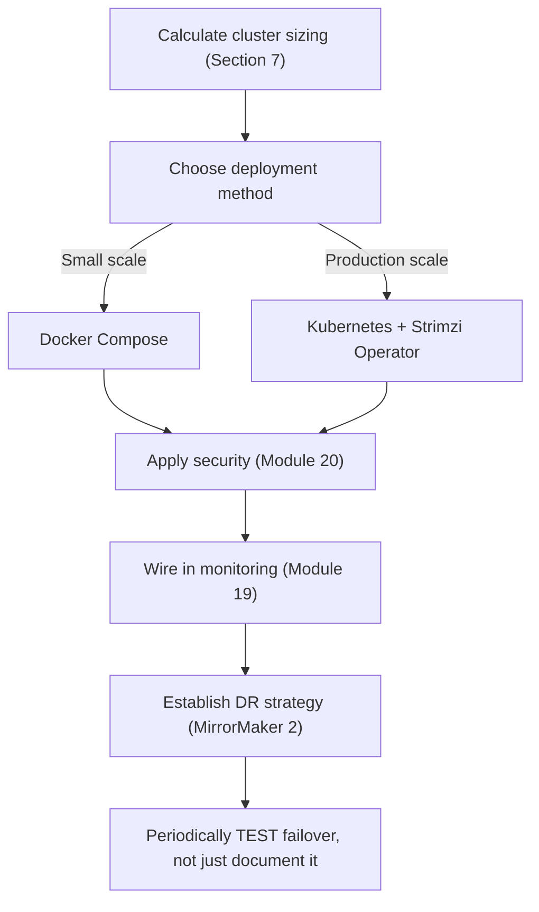
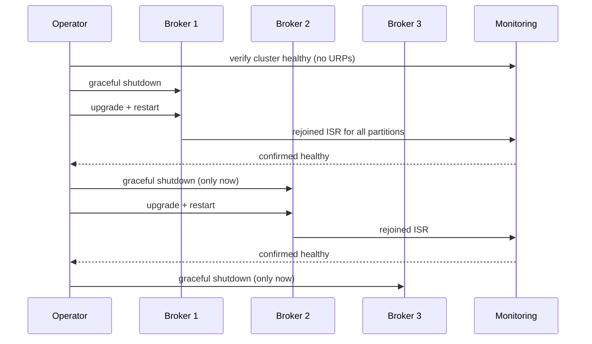
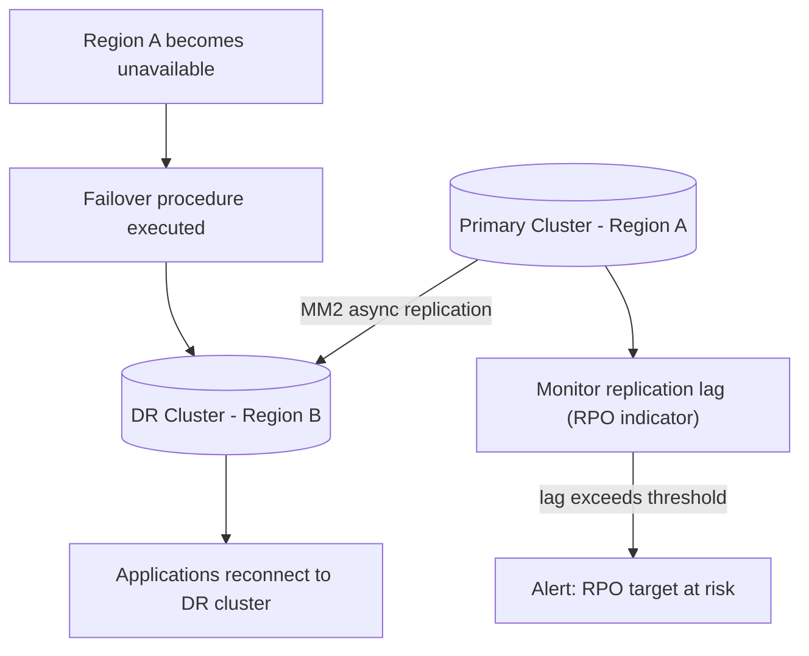
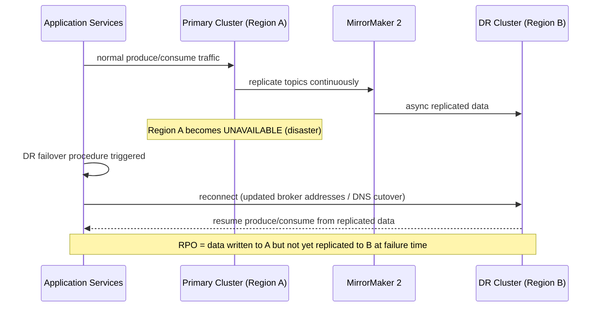

# Module 21 — Production Deployment

**Level:** ⭐⭐⭐⭐ Advanced
**Track:** Kafka Complete Masterclass for Node.js Backend Engineers
**Module:** 21 of 25

---

## 1. Introduction

Module 2 got a single broker running locally via Docker for learning. Modules 3–20 assumed that broker (or a small local cluster) as a given. This module closes the loop: taking everything you've learned — replication (Module 9), security (Module 20), monitoring (Module 19), performance tuning (Module 12) — and assembling it into an actual production deployment: a properly-sized multi-broker cluster, running on Docker Compose or Kubernetes, with a real backup and disaster recovery strategy.

This is the module where "I understand Kafka" becomes "I can actually stand up and operate a Kafka cluster that a real business depends on."

---

## 2. Learning Objectives

By the end of this module, you will be able to:

1. Design a properly-sized multi-broker Kafka cluster for a given workload.
2. Deploy Kafka in production using Docker Compose (small scale) and Kubernetes (via the Strimzi operator, for real scale).
3. Plan broker capacity across CPU, memory, disk, and network dimensions.
4. Implement a backup and disaster recovery strategy for a Kafka cluster, including cross-cluster replication.
5. Execute safe, zero-downtime rolling upgrades and maintenance operations.
6. Build a production readiness checklist synthesizing every prior module's guidance.

---

## 3. Why This Concept Exists

Every individual concept in this course — replication factor, ISR, ACLs, consumer groups — has been taught in isolation, against a toy single-broker setup. Production deployment exists because these concepts don't compose themselves automatically into a working, resilient system; a real deployment requires deliberate decisions about *how many* brokers, *how much* capacity each needs, *where* they physically run, *how* they're upgraded without downtime, and *what* happens if the entire cluster — not just one broker — becomes unavailable. Getting any of these wrong undermines guarantees you spent 20 modules building correctly at the application layer.

---

## 4. Problem Statement

Consider taking the Order/Inventory/Payment system built across this course and actually running it for a real business:

1. How many brokers do you actually need, and how do you size each one's CPU, memory, and disk for your expected throughput?
2. Should you run Kafka on Docker Compose, raw Kubernetes manifests, or a purpose-built operator like Strimzi — and what does each actually buy you?
3. If an entire data center or availability zone hosting your cluster becomes unavailable, do you lose data, availability, or both — and what's your recovery plan?
4. How do you roll out a Kafka version upgrade, or apply an urgent broker configuration change, without taking the whole system down?

Each of these requires synthesizing guidance scattered across nearly every prior module into one coherent operational plan.

---

## 5. Real-World Analogy

### Analogy: Opening a Restaurant vs. Cooking One Meal

Everything in Modules 1–20 is like mastering individual cooking techniques and recipes in a home kitchen — you can make an excellent dish, one plate at a time, for people you know are coming. **Production deployment** is opening an actual restaurant: how many stoves (brokers) do you need for your expected dinner rush (throughput)? Do you build your own kitchen from scratch (raw Kubernetes manifests) or use a modular commercial kitchen system designed for restaurants specifically (Strimzi operator)? What's your plan if the building itself loses power (disaster recovery — do you have a backup location, or do you just close)? How do you renovate the kitchen (upgrades) without closing the restaurant for a month?

None of the individual recipes change — but running a restaurant successfully requires an entirely different layer of planning than knowing how to cook.

---

## 6. Technical Definition

- **Cluster Sizing**: The deliberate process of determining broker count, and each broker's CPU/memory/disk/network allocation, based on expected throughput, retention, replication factor, and partition count (synthesizing Modules 6, 9, 11, 12).
- **Strimzi**: A popular, purpose-built Kubernetes Operator for running Apache Kafka, managing broker StatefulSets, configuration, and many operational tasks (scaling, upgrades, topic/user management via Kubernetes-native custom resources) declaratively.
- **Rolling Upgrade**: Upgrading brokers one at a time (or a small batch at a time), ensuring the cluster remains available and ISR-safe (Module 9) throughout, rather than taking the entire cluster down simultaneously.
- **Disaster Recovery (DR)**: A deliberate plan and mechanism for recovering from a catastrophic failure beyond normal replication's scope (e.g., an entire data center/region becoming unavailable), typically via **cross-cluster replication** to a geographically separate standby cluster.
- **MirrorMaker 2 (MM2)**: Kafka's built-in tool for replicating topics between two separate Kafka clusters (e.g., primary region → DR region), built on top of Kafka Connect (Module 17).
- **RPO / RTO (Recovery Point Objective / Recovery Time Objective)**: DR planning metrics — RPO is "how much data can we afford to lose" (measured in time), RTO is "how long can we afford to be down" — both drive concrete architectural decisions.

---

## 7. Internal Working

### Cluster sizing — working through the dimensions

```
GIVEN:
  - Peak throughput: 50 MB/s sustained writes
  - Retention: 7 days
  - Replication factor: 3

DISK CAPACITY per broker (roughly):
  50 MB/s * 86,400 sec/day * 7 days * 3 (replication) / N brokers
  = ~90 TB total raw data / N brokers
  (in practice, spread across partitions/brokers, plus overhead
   for indexes, headroom, and non-uniform partition distribution)

NETWORK: each broker must sustain its share of:
  - incoming producer traffic
  - outgoing consumer traffic (potentially MULTIPLE consumer
    groups each reading the full volume — Module 7's fan-out)
  - inter-broker REPLICATION traffic (Module 9) — an OFTEN
    UNDERESTIMATED multiplier, since every write is replicated
    to replication.factor - 1 OTHER brokers

CPU: driven largely by TLS overhead (Module 20), compression
     (Module 12), and request handling concurrency (num.network.
     threads / num.io.threads, Module 12)

MEMORY: sized to comfortably fit the "hot" working set in the
        OS PAGE CACHE (Module 11) — under-provisioning memory
        degrades read performance even if disk/CPU are fine
```

### Rolling upgrade, step by step

```
1. Verify cluster is currently HEALTHY (no under-replicated
   partitions, Module 9 — starting an upgrade during an existing
   incident compounds risk)
2. Pick ONE broker (ideally NOT the current active controller,
   to avoid an extra controller re-election mid-upgrade)
3. Gracefully shut it down (clean broker shutdown, NOT kill -9 —
   analogous to Module 13's graceful shutdown discipline, applied
   at the broker level)
4. Upgrade its software version / apply the configuration change
5. Restart it; WAIT for it to fully rejoin the ISR for all its
   previously-owned partitions (Module 9) before proceeding
6. Repeat for the NEXT broker — never proceed to the next broker
   until the current one has fully rejoined the ISR
7. This ensures AT MOST ONE broker is ever unavailable at a time,
   and (with replication.factor >= 3, min.insync.replicas=2,
   Module 9) the cluster remains fully available and durable
   throughout the ENTIRE rolling upgrade
```

### Cross-cluster DR replication via MirrorMaker 2

```
Primary Cluster (Region A)          DR Cluster (Region B)
┌─────────────────────┐          ┌─────────────────────┐
│  orders topic           │          │  A.orders topic          │
│  (live production        │──MM2────►│  (replicated, renamed      │
│   traffic)                │  (async) │   with source prefix       │
└─────────────────────┘          │   by default)              │
                                    └─────────────────────┘

MM2 replication is typically ASYNCHRONOUS (some replication lag
is normal and expected) — this directly determines your DR
cluster's RPO: "how much data might we lose if Region A vanishes
RIGHT NOW" = roughly however far behind MM2's replication lag
currently is.
```

---

## 8. Architecture

```
                       Production Kafka Deployment (Kubernetes + Strimzi)
     ┌─────────────────────────────────────────────────────────────┐
     │  Kubernetes Cluster (Region A)                                  │
     │  ┌───────────┐ ┌───────────┐ ┌───────────┐                   │
     │  │  Broker Pod 0 │ │  Broker Pod 1 │ │  Broker Pod 2 │  StatefulSet │
     │  │  + PVC (disk)  │ │  + PVC (disk)  │ │  + PVC (disk)  │              │
     │  └───────────┘ └───────────┘ └───────────┘                   │
     │  Strimzi Operator (manages lifecycle, config, upgrades)         │
     └───────────────────────────┬───────────────────────────────┘
                                  │  MirrorMaker 2 (async replication)
                                  ▼
     ┌─────────────────────────────────────────────────────────────┐
     │  Kubernetes Cluster (Region B — DR standby)                    │
     │  ┌───────────┐ ┌───────────┐ ┌───────────┐                   │
     │  │  Broker Pod 0 │ │  Broker Pod 1 │ │  Broker Pod 2 │              │
     │  └───────────┘ └───────────┘ └───────────┘                   │
     └─────────────────────────────────────────────────────────────┘
```

---

## 9. Step-by-Step Flow

1. Cluster sizing is calculated (Section 7) based on expected throughput, retention, and replication requirements.
2. A production deployment method is chosen — Docker Compose for small, single-team deployments; Kubernetes with Strimzi for larger, more operationally mature environments.
3. Brokers are deployed with security (Module 20), and appropriate resource requests/limits matching the sizing calculation.
4. Monitoring (Module 19) is wired in from day one, not added retroactively after the first incident.
5. A DR strategy is established: MirrorMaker 2 replicating critical topics to a standby cluster in a separate region/data center, with documented, tested RPO/RTO targets.
6. Routine maintenance (version upgrades, configuration changes) follows the rolling-upgrade discipline (Section 7), verified against monitoring at each step.
7. DR failover procedures are periodically tested (not just documented) — an untested DR plan is, in practice, not a real plan.

---

## 10. Detailed ASCII Diagrams

### 10.1 Docker Compose vs. Kubernetes/Strimzi Trade-offs

```
DOCKER COMPOSE (small scale, single host or small team):

  + Simple, fast to set up, easy to understand
  + Fine for smaller production workloads, single-team ownership
  - No automatic failover if the HOST itself dies
  - Manual scaling, manual upgrade orchestration
  - Not well-suited for large multi-team, multi-cluster environments


KUBERNETES + STRIMZI (real scale, production-grade):

  + Operator handles broker StatefulSet lifecycle declaratively
  + Built-in rolling upgrade orchestration (Section 7) automated
  + Integrates with Kubernetes' own scheduling, self-healing,
    and resource management
  + Manages topics/users/ACLs (Module 20) as Kubernetes custom
    resources — infrastructure-as-code, GitOps-friendly
  - More operational complexity to learn and run correctly
  - Requires genuine Kubernetes operational maturity in the team
```

### 10.2 Rolling Upgrade Safety Window

```
replication.factor = 3, min.insync.replicas = 2

Upgrading Broker 1:
  Broker 1: DOWN (upgrading)
  Broker 2: UP, in ISR
  Broker 3: UP, in ISR
  -> ISR size = 2 = min.insync.replicas -> writes STILL SUCCEED,
     cluster remains FULLY AVAILABLE during this broker's upgrade

Broker 1 rejoins ISR -> proceed to Broker 2, ONLY NOW:
  Broker 1: UP, in ISR
  Broker 2: DOWN (upgrading)
  Broker 3: UP, in ISR
  -> ISR size = 2 again -> still safe

NEVER upgrade Broker 2 while Broker 1 hasn't yet REJOINED the
ISR — doing so would risk ISR size dropping to 1, below
min.insync.replicas, causing write failures (Module 9).
```

### 10.3 RPO/RTO Visualized

```
Disaster strikes at T0 (Region A completely unavailable)

RPO (Recovery Point Objective):
  Last successfully MM2-replicated offset was at T0 - 30 seconds
  -> RPO = 30 seconds of data POTENTIALLY LOST
  (whatever was written to Region A but not yet replicated
   to Region B at the moment of failure)

RTO (Recovery Time Objective):
  Time from T0 until Region B is fully serving production
  traffic (DNS/config cutover, consumer offset translation,
  application redeployment pointing at Region B)
  -> RTO = however long THIS process actually takes,
     which should be TESTED, not just estimated
```

---

## 11. Mermaid Diagrams





---

## 12. Request Flow Diagram



---

## 13. Sequence Diagram



---

## 14. Kafka Internal Flow

```
Production deployment doesn't introduce NEW Kafka mechanics beyond
what Modules 1-20 already covered — it's the deliberate ASSEMBLY
of those mechanics at real scale:

  Replication (Module 9)      -> determines rolling upgrade safety
  Consumer groups (Module 7)  -> determines how MM2 itself scales
                                  (it's built on Kafka Connect,
                                  Module 17, using ordinary
                                  consumer/producer mechanics)
  Log segments (Module 11)    -> directly inform disk sizing math
  Security (Module 20)        -> must be configured consistently
                                  across BOTH primary and DR clusters
  Monitoring (Module 19)      -> must cover the DR cluster too,
                                  not just primary
```

---

## 15. Producer Perspective

Producers in a properly DR-planned system need to know how to redirect to the DR cluster during a failover — this is typically handled via DNS/service-discovery indirection (producers connect to a logical broker address that gets repointed during failover) rather than hardcoded broker addresses, directly extending Module 13's configuration-management discipline to the DR scenario.

---

## 16. Consumer Perspective

Consumers failing over to a DR cluster face a subtler challenge: their consumer group offsets (Module 8) are specific to the primary cluster and don't automatically transfer to the DR cluster's topics. MirrorMaker 2 includes offset translation capabilities specifically to address this, but it's a genuinely complex area worth explicit testing (Section 26) rather than assuming it "just works" during an actual disaster.

---

## 17. Broker Perspective

In a Kubernetes/Strimzi deployment, each broker runs as a pod within a StatefulSet, with a persistent volume (PVC) ensuring its log segments (Module 11) survive pod restarts/rescheduling. The Strimzi operator watches Kubernetes custom resources describing desired cluster state and reconciles the actual broker pods/configuration to match — broker configuration changes become "edit a Kubernetes YAML resource" rather than manual `kafka-configs.sh` commands run by hand.

---

## 18. Node.js Integration

Node.js applications in a production deployment need to be genuinely resilient to broker address changes (DR failover) and should never hardcode a single cluster's broker list without a mechanism for updating it.

```javascript
// src/config/kafka.js — broker list loaded dynamically, not hardcoded,
// to support DR failover (repointing to a new cluster's brokers)
// without a code change/redeploy.
export const kafka = new Kafka({
  clientId: "inventory-service",
  brokers: (process.env.KAFKA_BROKERS || "").split(","), // externally
  // managed (e.g., via a config service, DNS, or deployment env vars
  // updated as part of the DR failover procedure itself)
  ...
});
```

---

## 19. KafkaJS Examples

### 19.1 A cluster-sizing calculator script

```javascript
// src/tools/clusterSizingCalculator.js
function calculateSizing({
  peakThroughputMBps,
  retentionDays,
  replicationFactor,
  brokerCount,
  overheadFactor = 1.3, // headroom for indexes, uneven distribution
}) {
  const totalRawDataGB =
    (peakThroughputMBps * 86400 * retentionDays * replicationFactor * overheadFactor) / 1024;
  const perBrokerDiskGB = totalRawDataGB / brokerCount;

  const peakNetworkMBpsPerBroker =
    (peakThroughputMBps * replicationFactor) / brokerCount; // rough, includes replication traffic

  return {
    totalRawDataGB: totalRawDataGB.toFixed(1),
    perBrokerDiskGB: perBrokerDiskGB.toFixed(1),
    peakNetworkMBpsPerBroker: peakNetworkMBpsPerBroker.toFixed(1),
  };
}

console.log(
  calculateSizing({
    peakThroughputMBps: 50,
    retentionDays: 7,
    replicationFactor: 3,
    brokerCount: 6,
  })
);
```

### 19.2 A pre-upgrade cluster health check script

```javascript
// src/tools/preUpgradeHealthCheck.js
import { kafka } from "../config/kafka.js";

async function preUpgradeHealthCheck() {
  const admin = kafka.admin();
  await admin.connect();

  const cluster = await admin.describeCluster();
  console.log(`Active controller: broker ${cluster.controller}`);

  const topics = await admin.listTopics();
  let unhealthy = false;

  for (const topic of topics) {
    const metadata = await admin.fetchTopicMetadata({ topics: [topic] });
    metadata.topics[0].partitions.forEach((p) => {
      if (p.isr.length < p.replicas.length) {
        console.error(`❌ ${topic} partition ${p.partitionId} is UNDER-REPLICATED — do NOT proceed with upgrade`);
        unhealthy = true;
      }
    });
  }

  await admin.disconnect();

  if (unhealthy) {
    process.exit(1);
  }
  console.log("✅ Cluster healthy — safe to proceed with rolling upgrade");
}

preUpgradeHealthCheck().catch((err) => {
  console.error("Health check failed to run:", err);
  process.exit(1);
});
```

### 19.3 Monitoring MirrorMaker 2 replication lag from Node.js

```javascript
// src/tools/mm2LagMonitor.js
import { Kafka } from "kafkajs";

const primaryKafka = new Kafka({ clientId: "mm2-monitor", brokers: ["primary-broker:9092"] });
const drKafka = new Kafka({ clientId: "mm2-monitor", brokers: ["dr-broker:9092"] });

async function checkReplicationLag(topic) {
  const primaryAdmin = primaryKafka.admin();
  const drAdmin = drKafka.admin();
  await primaryAdmin.connect();
  await drAdmin.connect();

  const primaryOffsets = await primaryAdmin.fetchTopicOffsets(topic);
  const drOffsets = await drAdmin.fetchTopicOffsets(`A.${topic}`); // MM2 default naming

  primaryOffsets.forEach((p) => {
    const drPartition = drOffsets.find((d) => d.partition === p.partition);
    const lag = Number(p.offset) - Number(drPartition?.offset ?? 0);
    if (lag > 1000) {
      console.warn(`⚠️  MM2 replication lag for partition ${p.partition}: ${lag} records behind`);
    }
  });

  await primaryAdmin.disconnect();
  await drAdmin.disconnect();
}

checkReplicationLag("orders").catch(console.error);
```

### 19.4 A DR failover configuration switcher

```javascript
// src/tools/failoverToDR.js
// Illustrative: in a real system this would integrate with your
// actual config/secrets management and deployment tooling, not
// just print instructions.
function generateFailoverInstructions(drBrokers) {
  console.log("=== DR FAILOVER PROCEDURE ===");
  console.log(`1. Update KAFKA_BROKERS env var to: ${drBrokers.join(",")}`);
  console.log("2. Verify DR cluster ACLs (Module 20) match production expectations");
  console.log("3. Confirm consumer offset translation (MM2) for each affected consumer group");
  console.log("4. Redeploy/restart affected services with updated configuration");
  console.log("5. Verify end-to-end produce/consume against DR cluster before declaring failover complete");
}

generateFailoverInstructions(["dr-broker1:9093", "dr-broker2:9093", "dr-broker3:9093"]);
```

---

## 20. CLI Commands

```bash
# Docker Compose: bring up a 3-broker local cluster for testing
# production-like configurations before real deployment
docker compose -f docker-compose.multi-broker.yml up -d

# Kubernetes + Strimzi: check cluster status via kubectl
kubectl get kafka my-cluster -n kafka -o yaml

# Trigger a Strimzi-managed rolling upgrade by updating the Kafka
# custom resource's version field, then watching the rollout
kubectl apply -f kafka-cluster-upgraded.yaml
kubectl rollout status statefulset/my-cluster-kafka -n kafka

# Check under-replicated partitions before/during/after any
# maintenance operation — the single most important pre-flight check
kafka-topics.sh --bootstrap-server localhost:9092 \
  --describe --under-replicated-partitions

# Start MirrorMaker 2 for cross-cluster DR replication
connect-mirror-maker.sh mm2.properties
```

---

## 21. Configuration Explanation

| Config/Concept | Meaning |
|---|---|
| `replicas` (Strimzi Kafka CR) | Number of broker pods in the StatefulSet |
| `storage` (Strimzi Kafka CR) | Persistent volume size/class per broker |
| `resources.requests/limits` (Kubernetes) | CPU/memory allocation per broker pod |
| `mirrors` (MM2 configuration) | Which topics replicate from source to target cluster, and replication settings |
| `sync.topic.acls.enabled` (MM2) | Whether MM2 also replicates ACLs (Module 20) alongside data |

---

## 22. Common Mistakes

1. **Sizing a cluster based only on producer throughput, forgetting replication and multi-consumer-group multiplication of network traffic** (Section 7) — leading to under-provisioned network capacity discovered only under real load.
2. **Upgrading multiple brokers simultaneously "to save time."** This risks dropping the ISR below `min.insync.replicas` (Module 9), causing write failures or downtime — always upgrade one at a time, verifying ISR health between each.
3. **Treating DR as "set up MirrorMaker 2 once and forget it."** Replication lag needs ongoing monitoring (Section 19.3), and failover procedures need periodic, genuine testing — an untested DR plan routinely fails in ways only discovered during a real disaster.
4. **Choosing Kubernetes/Strimzi before the team has genuine Kubernetes operational maturity.** The added complexity is a real cost; Docker Compose is a legitimate, simpler production choice for smaller deployments.
5. **Forgetting consumer offset translation during DR failover.** Consumers reconnecting to a DR cluster without correct offset translation may reprocess large amounts of data or skip data entirely (Module 10's guarantees don't automatically carry across a cluster failover without deliberate handling).
6. **Not applying the same security configuration (Module 20) consistently to the DR cluster** as the primary — a DR cluster with weaker security is a real, often-overlooked vulnerability.

---

## 23. Edge Cases

- **What if the active controller broker is the one you need to upgrade first in a rolling upgrade?** Upgrading it triggers a controller re-election (Module 3, Module 9) as a side effect — generally safe and expected, but worth being aware of rather than surprised by during the maintenance window.
- **What if MirrorMaker 2's replication lag spikes unexpectedly during a traffic surge on the primary cluster?** This directly, measurably worsens your actual RPO in real time — treating MM2 lag as a first-class monitored metric (Section 19.3, extending Module 19) is what makes this visible rather than a nasty surprise during an actual disaster.
- **What if a DR failover is executed, and the primary cluster later recovers?** "Failing back" is its own deliberate, carefully-planned operation (often more complex than the initial failover, since the DR cluster now holds newer data that needs to flow back) — worth planning for explicitly, not treated as a simple reversal.

---

## 24. Performance Considerations

- Cluster sizing (Section 7) should include meaningful headroom (not sizing exactly to today's peak) — production traffic grows, and under-provisioned clusters degrade in ways that are far more disruptive to fix under load than to have planned for upfront.
- Rolling upgrades briefly concentrate load onto fewer available brokers (Section 10.2) — for clusters already running near capacity, this can meaningfully stress the remaining brokers during the upgrade window, worth accounting for in maintenance-window planning.

---

## 25. Scalability Discussion

- Kubernetes/Strimzi deployments scale broker count more operationally smoothly than Docker Compose once a cluster needs to grow significantly, since the operator handles much of the reconciliation/orchestration burden that would otherwise be manual.
- DR architecture itself needs to scale with the number of critical topics — MM2 can replicate many topics, but replication lag monitoring, ACL parity, and failover testing complexity all grow with the surface area being protected, worth accounting for as the system grows beyond its initial scope.

---

## 26. Production Best Practices

- Always run `replication.factor >= 3` and `min.insync.replicas = 2` in production (Module 9), as the foundation that makes safe rolling upgrades possible at all.
- Never upgrade more than one broker at a time, and always verify ISR health between each step.
- Establish and periodically, genuinely test your DR failover procedure — not just document it and hope.
- Monitor MirrorMaker 2 replication lag continuously as a direct proxy for your real-time RPO.
- Keep security configuration (Module 20) consistent across primary and DR clusters.
- Build a production readiness checklist synthesizing this course's guidance (Section 33's exercise) and review it before any new topic/service goes live.

---

## 27. Monitoring & Debugging

- Extend Module 19's monitoring stack to cover the DR cluster and MM2 replication lag specifically, not just the primary cluster.
- Treat a rolling upgrade or maintenance window as an active monitoring event — watch dashboards throughout, not just before and after.
- Maintain a clear, tested runbook for DR failover, linked directly from your alerting (Module 19), so an on-call engineer facing an actual regional outage has a concrete, rehearsed procedure to follow rather than improvising under pressure.

---

## 28. Security Considerations

- DR clusters must be secured identically to production (Module 20) — a common, dangerous oversight is treating the "backup" cluster as lower-priority for security hardening.
- Credentials and ACLs (Module 20) need their own replication/synchronization strategy across primary and DR clusters (MM2's `sync.topic.acls.enabled` addresses topic ACLs specifically; broader credential management needs its own deliberate plan).

---

## 29. Interview Questions (Easy → Medium → Hard)

### Easy

1. What factors go into sizing a Kafka cluster?
2. What is a rolling upgrade?
3. What is MirrorMaker 2 used for?

### Medium

4. Why must you verify ISR health between each broker upgraded during a rolling upgrade?
5. What is the difference between RPO and RTO?
6. What does Strimzi provide beyond raw Kubernetes manifests?
7. Why is consumer offset translation a concern during DR failover?

### Hard

8. Design a rolling upgrade plan for a 6-broker cluster with `replication.factor=3` and `min.insync.replicas=2`, explaining exactly why availability is preserved throughout.
9. Explain why an untested DR plan is, in practice, not a reliable plan — walk through at least two realistic failure modes a real failover test might reveal that documentation alone wouldn't catch.
10. Calculate the approximate per-broker disk requirement for a cluster with 100 MB/s peak throughput, 14-day retention, replication factor 3, and 8 brokers, showing your work.
11. Compare Docker Compose and Kubernetes/Strimzi deployment approaches for a mid-sized company, and justify a recommendation based on team maturity and scale.

---

## 30. Common Interview Traps

- **Trap:** "More replicas always means better disaster recovery." → **Reality:** Replication factor (Module 9) protects against individual broker failures WITHIN a cluster; disaster recovery (this module) protects against losing the ENTIRE cluster/region — these are different, complementary layers of protection, not substitutes for each other.
- **Trap:** "Kubernetes/Strimzi is always the right choice for production Kafka." → **Reality:** It's the right choice at real scale with genuine Kubernetes operational maturity; Docker Compose remains a legitimate, simpler production option for smaller deployments.
- **Trap:** "Setting up MirrorMaker 2 once means DR is 'done.'" → **Reality:** DR requires ongoing replication-lag monitoring and periodic, genuine failover testing — a one-time setup without ongoing validation is not a reliable DR plan.

---

## 31. Summary

- Cluster sizing synthesizes throughput, retention, replication factor, and per-broker capacity across disk, network, CPU, and memory dimensions.
- Docker Compose suits smaller-scale production deployments; Kubernetes with Strimzi suits larger-scale, operationally mature environments, providing declarative broker lifecycle management.
- Rolling upgrades must proceed one broker at a time, verifying ISR health between each step, to preserve availability and durability throughout.
- Disaster recovery, via MirrorMaker 2 cross-cluster replication, requires ongoing lag monitoring and periodic, genuine failover testing — not just initial setup.
- Production deployment is the deliberate assembly of every prior module's guidance (replication, security, monitoring, performance) into one coherent, operable system.

---

## 32. Cheat Sheet

```
PRODUCTION DEPLOYMENT — ONE PAGE

Cluster sizing: throughput x retention x replication.factor / broker
                count = disk; account for replication + multi-consumer-
                group traffic in network sizing; memory for page cache

Deployment: Docker Compose (small scale) vs Kubernetes + Strimzi
            (real scale, operator-managed lifecycle)

Rolling upgrade: ONE broker at a time; verify ISR health (no
                 under-replicated partitions) BEFORE proceeding
                 to the next broker

DR: MirrorMaker 2 = async cross-cluster replication
    RPO = how much data at risk (driven by replication LAG)
    RTO = how long recovery actually takes (must be TESTED)

Consumer offset translation: required for DR failover consumers
                              to resume correctly — MM2 handles
                              this, but test it explicitly

Golden rule: replication.factor=3 + min.insync.replicas=2 makes
             safe rolling upgrades possible; DR plans are only
             real if periodically, actually tested
```

---

## 33. Hands-on Exercises

1. Use the sizing calculator (Section 19.1) to size a hypothetical cluster for your own project's expected throughput and retention needs.
2. Deploy a local 3-broker cluster via Docker Compose and practice a full rolling "upgrade" (even just a config change) one broker at a time, verifying ISR health at each step.
3. Set up a local Strimzi-managed cluster (via a local Kubernetes cluster like kind or minikube) and trigger a Strimzi-managed rolling restart.
4. Configure MirrorMaker 2 between two local clusters and observe replication lag under a simulated load, then simulate a failover and manually verify data on the "DR" cluster.

---

## 34. Mini Project

**Build:** A production readiness checklist document (synthesizing Modules 9, 12, 19, 20, and this module) as a Markdown or structured file, plus a Node.js script (Section 19.2) that automates checking as many of those items as programmatically possible (ISR health, ACL presence, monitoring endpoint reachability) before a "go live" sign-off.

---

## 35. Advanced Project

**Build:** A full primary + DR two-cluster local setup (Docker Compose, two separate compose files/networks) with MirrorMaker 2 replication, a lag-monitoring script (Section 19.3), and a documented, tested failover procedure — executed as a genuine drill (stop the primary cluster, redirect a test producer/consumer to the DR cluster, verify data continuity and measure actual RTO).

---

## 36. Homework

1. Research Strimzi's specific rolling-upgrade orchestration behavior in more detail, and summarize what safety checks it performs automatically versus what an operator still needs to verify manually.
2. Compare MirrorMaker 2's offset translation feature against alternative DR strategies (e.g., dual-write from producers to both clusters) and note the trade-offs of each.
3. Write a one-page disaster recovery runbook for a hypothetical production Kafka deployment, including explicit RPO/RTO targets and the step-by-step failover procedure.

---

## 37. Additional Reading

- Apache Kafka documentation — "Operations" section, covering rolling restarts, cluster expansion, and MirrorMaker 2
- Strimzi documentation — full Kafka Custom Resource reference and rolling update behavior
- Confluent blog: "Disaster Recovery for Multi-Datacenter Apache Kafka Deployments"

---

## Key Takeaways

- Cluster sizing must account for replication and multi-consumer-group traffic multiplication, not just raw producer throughput.
- Docker Compose and Kubernetes/Strimzi serve different scales and operational maturity levels — neither is universally correct.
- Rolling upgrades must proceed one broker at a time with ISR health verification between steps, relying on `replication.factor=3` and `min.insync.replicas=2` as the safety foundation.
- Disaster recovery via MirrorMaker 2 requires ongoing lag monitoring and periodic, genuine failover testing to be a reliable plan rather than just documentation.
- Production deployment is fundamentally the deliberate synthesis of every prior module's guidance into one operable, resilient system.

---

## Revision Notes

- Be able to walk through the rolling upgrade safety argument (ISR size staying at/above `min.insync.replicas` throughout) from memory.
- Be able to explain RPO and RTO with a concrete numeric example.
- Practice the cluster sizing calculation (Section 7/19.1) until the dimensions (disk, network, CPU, memory) and their drivers feel automatic.

---

## One-Page Cheat Sheet

*(See Section 32 above.)*

---

## 20 Practice Questions

1. What factors drive Kafka cluster disk sizing?
2. Why does replication factor multiply network traffic requirements?
3. What is a rolling upgrade?
4. Why must you verify ISR health between each broker upgrade?
5. What is Strimzi?
6. What does a Kubernetes StatefulSet provide that's relevant to Kafka brokers?
7. What is MirrorMaker 2?
8. What is RPO?
9. What is RTO?
10. What determines your actual RPO in an MM2-based DR setup?
11. What is consumer offset translation, and why does DR failover need it?
12. Why is Docker Compose still a legitimate production choice for some deployments?
13. What safety foundation (replication settings) makes rolling upgrades possible without downtime?
14. What happens if you upgrade multiple brokers simultaneously with `min.insync.replicas=2`?
15. Why should a DR cluster be secured identically to the primary cluster?
16. What is "failing back," and why is it its own deliberate operation?
17. What should you check before starting a rolling upgrade?
18. Why is periodic DR failover testing necessary, not just initial setup?
19. What Kubernetes concept does Strimzi use to manage broker lifecycle?
20. What's a common mistake when sizing network capacity for a cluster?

---

## 10 Scenario-Based Questions

1. You're sizing a new cluster for 30 MB/s peak throughput, 5-day retention, and replication factor 3 across 5 brokers. Walk through your disk sizing calculation.
2. A teammate wants to upgrade all 6 brokers simultaneously overnight "to save time." What risk would you flag, and what would you propose instead?
3. Your MM2 replication lag has been steadily climbing over the past hour during a traffic spike. What does this mean for your current RPO, and what would you investigate?
4. Your organization has never actually tested its documented DR failover procedure. What specific risks does this create, and what would you propose to address it?
5. You're choosing between Docker Compose and Kubernetes/Strimzi for a growing 15-person engineering team with no prior Kubernetes experience. What would you recommend, and why?
6. A rolling upgrade is interrupted partway through (broker 2 of 6 is mid-upgrade) by an unrelated incident. What state is the cluster in, and what would you check before resuming?
7. After a real DR failover, some consumers report reprocessing large amounts of already-handled data. Diagnose the likely root cause.
8. Your DR cluster was set up 8 months ago but never had its ACLs updated to match 3 subsequent security changes on the primary cluster. What risk does this create?
9. Leadership asks for a concrete RTO commitment for a new critical service. What would you need to actually test and measure before giving that number confidently?
10. Explain to a stakeholder, using the restaurant analogy or your own, why "we understand Kafka's concepts well" and "we can operate a production Kafka cluster reliably" are related but distinct capabilities.

---

## 5 Coding Assignments

1. Build the cluster sizing calculator (Section 19.1) into a small CLI tool accepting command-line arguments for throughput, retention, replication factor, and broker count.
2. Write a pre-upgrade health check script (Section 19.2) that also verifies ACL presence for a list of expected service principals, extending Module 20's verification approach.
3. Build an MM2 replication lag monitor (Section 19.3) that exposes its results as a Prometheus metric (extending Module 19's exporter pattern).
4. Write a script that automates as much of a rolling upgrade's verification as possible: checks ISR health, waits for a broker to rejoin, and only then signals it's safe to proceed to the next broker.
5. Build a DR failover checklist script that, given a target DR cluster's broker list, verifies connectivity, verifies expected topics exist, and verifies ACLs are present before declaring the DR cluster "ready" for failover.

---

## Suggested Next Module

**Module 22 — System Design**
With a fully operational, production-grade Kafka deployment now understood end-to-end, the next module applies everything from this course to real-world system design scenarios — architecting Kafka-based systems for platforms like Uber, Swiggy, Zomato, Flipkart, and Amazon, the kind of open-ended design problems common in senior engineering interviews.
