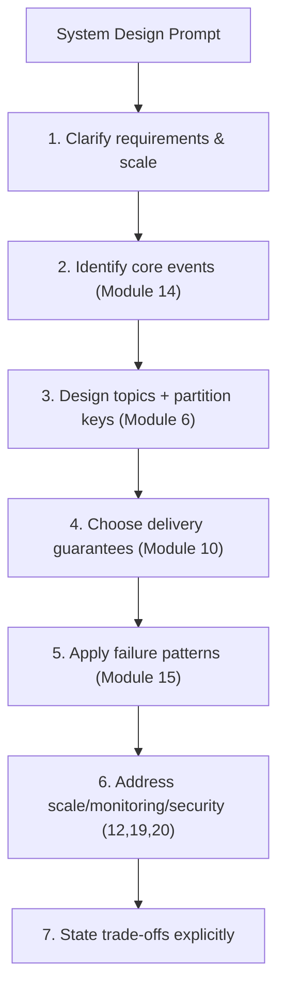
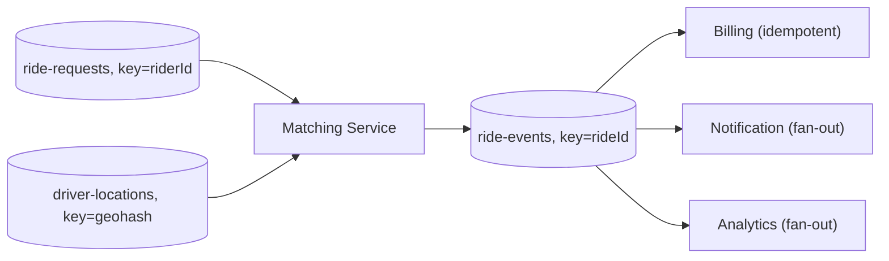
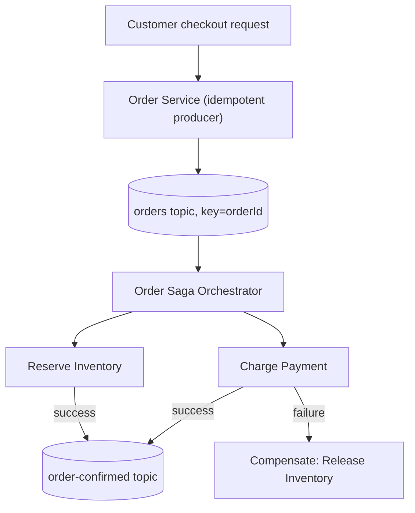
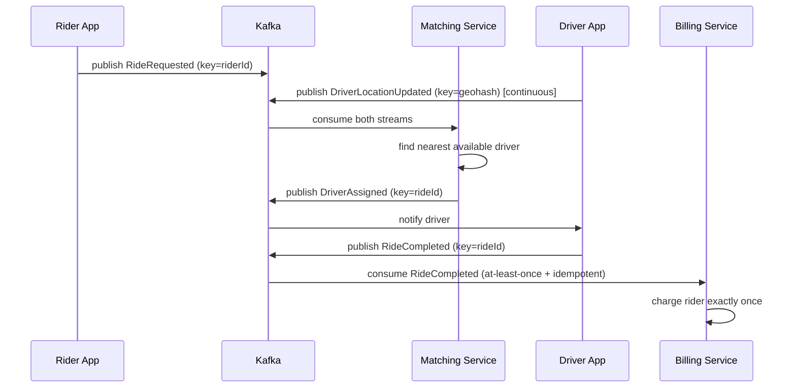

# Module 22 — System Design

**Level:** ⭐⭐⭐⭐⭐ Expert / Interview Preparation
**Track:** Kafka Complete Masterclass for Node.js Backend Engineers
**Module:** 22 of 25

---

## 1. Introduction

Modules 1–21 gave you every individual tool: partitioning, consumer groups, replication, delivery guarantees, schema governance, Connect, Streams, security, and production deployment. This module is where you learn to *compose* them under interview conditions — the open-ended "design Uber's ride-matching backend" or "design Flipkart's order pipeline" questions that show up in senior and staff backend interviews, where Kafka is expected to be a natural part of your answer, not a bolted-on afterthought.

The goal here isn't memorizing one "correct" architecture for each company — real systems evolve and interviewers know it — it's building the *reasoning process* for turning a vague prompt into a defensible Kafka-centric design, using the vocabulary from every prior module fluently.

---

## 2. Learning Objectives

By the end of this module, you will be able to:

1. Apply a structured framework for approaching any Kafka-centric system design interview question.
2. Design a topic/partition/consumer-group architecture for a ride-hailing platform (Uber-style).
3. Design an order-and-delivery pipeline for a food delivery platform (Swiggy/Zomato-style).
4. Design a high-volume order/inventory/payment pipeline for an e-commerce platform (Flipkart/Amazon-style).
5. Justify partition key choices, consumer group boundaries, and delivery guarantee choices explicitly, under interviewer follow-up questioning.
6. Recognize and articulate the trade-offs of your own design, rather than presenting it as beyond critique.

---

## 3. Why This Concept Exists

A system design interview isn't testing whether you remember Kafka's API — it's testing whether you can take a genuinely ambiguous, large-scale problem and produce a coherent, defensible architecture under time pressure, using the right vocabulary (Module 14's events vs. commands, Module 6's partitioning strategy, Module 10's delivery guarantees) to justify every decision. This module exists because knowing individual Kafka concepts and being able to *design a system with them, live, while explaining your reasoning* are different skills — the same gap Module 13 addressed for "knowing Kafka" vs. "shipping production code."

---

## 4. Problem Statement

You will be asked some version of:

1. "Design the backend for a ride-hailing app like Uber — how does a rider's request get matched to a nearby driver, and how does live location tracking work?"
2. "Design the order pipeline for a food delivery app like Swiggy or Zomato — from an order being placed to it being delivered, with live status updates."
3. "Design the order processing and inventory system for an e-commerce platform like Flipkart or Amazon, handling flash-sale-level traffic spikes."

Each of these has no single correct answer — but each has clearly *better* and *worse* answers, distinguished by whether you correctly apply partitioning (Module 6), consumer group boundaries (Module 7), delivery guarantees (Module 10), event design (Module 14), and failure-handling patterns (Module 15).

---

## 5. Real-World Analogy

### Analogy: An Architect's Design Review, Not a Trivia Quiz

A system design interview is like presenting a building design to a review board, not answering a trivia quiz. The board doesn't just want to hear "I'd use steel beams" (a Kafka feature name-drop) — they want to hear *why* steel beams here, what load they're carrying, what happens if one fails, and what you'd do differently for a taller building versus a wider one. A strong design answer, like a strong architectural presentation, walks through requirements, constraints, trade-offs, and a specific, justified structure — and welcomes tough questions about the weak points, rather than pretending there are none.

---

## 6. Technical Definition

- **System Design Framework** (used throughout this module): 
  1. Clarify requirements and scale (read-heavy vs. write-heavy, latency needs, consistency needs).
  2. Identify the core entities and events (Module 14's event design).
  3. Design topics, partition keys, and consumer group boundaries (Modules 6–7).
  4. Choose delivery guarantees and idempotency strategy per consumer (Module 10).
  5. Identify failure modes and apply the appropriate pattern — retry/DLQ, saga, fan-out (Module 15).
  6. Address scale, monitoring, and security as follow-up depth (Modules 12, 19, 20).
  7. Explicitly state trade-offs and alternatives considered.
- **Hot Key / Hot Partition Risk**: A recurring theme across all three case studies — a naive partition key choice (e.g., `driverId` for an extremely popular driver, or `productId` for a flash-sale item) can create a bottleneck (Module 6) that must be explicitly designed around.
- **Geo-Partitioning**: A pattern specific to location-based systems (Uber, delivery apps) where events are partitioned or routed by geographic region (e.g., city or geohash) to keep related, latency-sensitive events co-located.

---

## 7. Internal Working

### The framework applied at a meta level

```
STEP 1 — Clarify:
  "Are we optimizing for ride-matching LATENCY (sub-second) or
   for eventual consistency in analytics? Both, but differently."

STEP 2 — Identify events:
  RideRequested, DriverLocationUpdated, DriverAssigned,
  RideStarted, RideCompleted — each an immutable fact (Module 14)

STEP 3 — Topics & partition keys:
  driver-locations, partitioned by GEOHASH REGION (not driverId
  alone) — co-locates nearby drivers' location updates on the
  same partition for fast regional matching queries, while
  avoiding one wildly popular key becoming a hot partition

STEP 4 — Delivery guarantees:
  DriverLocationUpdated -> at-most-once is ACCEPTABLE (a missed
  GPS ping is superseded by the next one seconds later, Module 10)
  RideCompleted -> at-least-once + idempotent consumer REQUIRED
  (this triggers BILLING — cannot be silently lost OR duplicated)

STEP 5 — Failure patterns:
  Driver matching timeout -> retry topic with SHORT backoff
  (Module 15) since ride-matching is latency-sensitive; a DLQ
  for requests that can't be matched within an SLA, surfaced to
  the rider as "no drivers available"

STEP 6 — Depth: partition count sized for expected concurrent
  ride requests per region (Module 6, Module 12); consumer groups
  scaled per matching-service instance (Module 7)

STEP 7 — Trade-offs: geohash partitioning improves regional
  matching locality but complicates cross-region queries (e.g.,
  "show all active rides company-wide") — explicitly flagged
  as a conscious trade-off, not a gap you missed.
```

---

## 8. Architecture — Case Study 1: Ride-Hailing (Uber-style)

```
                         Rider App                    Driver App
                             │                             │
                     POST /ride-request          location ping (2-5s)
                             │                             │
                             ▼                             ▼
                   ┌───────────────────┐        ┌───────────────────┐
                   │  ride-requests topic │        │ driver-locations topic│
                   │  key = riderId        │        │  key = geohash(lat,lng)│
                   └───────────────────┘        └───────────────────┘
                             │                             │
                             ▼                             ▼
                   ┌─────────────────────────────────────────────┐
                   │        Matching Service (consumer group)         │
                   │  reads BOTH topics, matches nearby drivers,       │
                   │  publishes DriverAssigned                         │
                   └─────────────────────┬─────────────────────┘
                                          ▼
                             ┌───────────────────┐
                             │  ride-events topic    │  (RideStarted,
                             │  key = rideId          │   RideCompleted,
                             └───────────────────┘   at-least-once + idempotent)
                                          │
                        ┌─────────────────┼─────────────────┐
                        ▼                 ▼                 ▼
                  Billing Service   Notification Svc   Analytics Svc
                  (idempotent,      (fan-out,           (fan-out,
                   Module 10)        Module 15)          Module 18)
```

---

## 9. Architecture — Case Study 2: Food Delivery (Swiggy/Zomato-style)

```
Customer App          Restaurant App          Delivery Partner App
     │                       │                        │
  place order          accept/reject             location ping
     │                       │                        │
     ▼                       ▼                        ▼
┌───────────┐      ┌────────────────┐      ┌───────────────────┐
│ orders topic│      │ restaurant-status │      │ partner-locations   │
│ key=orderId │      │ key=restaurantId   │      │ key=geohash          │
└───────────┘      └────────────────┘      └───────────────────┘
     │                       │                        │
     └───────────────────────┼────────────────────────┘
                             ▼
              ┌───────────────────────────────────┐
              │  Order Orchestration Saga (Module 15)   │
              │  ReserveAtRestaurant -> AssignPartner ->  │
              │  PickedUp -> Delivered                     │
              │  (choreography or orchestration)            │
              └───────────────────┬───────────────────┘
                                  ▼
                     ┌───────────────────────┐
                     │  order-status-updates     │  (event-carried
                     │  topic, key=orderId        │   state transfer,
                     └───────────────────────┘   Module 14, for
                                  │                real-time customer
                                  ▼                app status tracking)
                     Customer App (via WebSocket
                     gateway consuming this topic)
```

---

## 10. Architecture — Case Study 3: E-Commerce (Flipkart/Amazon-style, flash-sale scale)

```
                          Customer
                             │
                       POST /checkout
                             │
                             ▼
                  ┌───────────────────┐
                  │   orders topic         │  key = orderId
                  │   (idempotent producer,  │  (NOT productId — avoids
                  │    Module 4)              │   hot partition during
                  └───────────────────┘   a flash sale on ONE product,
                             │                  Module 6, Section 10.2 of
              ┌───────────────┼───────────────┐  this module's Section 22)
              ▼               ▼               ▼
      Inventory Service  Payment Service  Fraud Service
      (SAGA participant,  (SAGA participant, (independent
       Module 15)          Module 15)         fan-out consumer)
              │               │
              ▼               ▼
      Compensating action if downstream step fails
      (e.g., ReleaseInventoryReservation if PaymentFailed)
              │
              ▼
       ┌───────────────────┐
       │  order-confirmed topic │ ── read_committed (Module 10) ──►
       └───────────────────┘     Notification, Shipping, Analytics
                                  (fan-out, Module 15)
```

---

## 11. Mermaid Diagrams





---

## 12. Request Flow Diagram



---

## 13. Sequence Diagram



---

## 14. Kafka Internal Flow

```
Every case study in this module is built ENTIRELY from mechanics
covered in Modules 1-21 — nothing new is introduced at the broker
or protocol level:

  Partition key design       -> Module 6
  Consumer group boundaries  -> Module 7
  Delivery guarantees         -> Module 10
  Saga / retry / DLQ / fan-out -> Module 15
  Schema governance            -> Module 16 (worth mentioning for
                                  a stable OrderPlaced-style contract
                                  across many consuming teams)
  Scale/monitoring/security    -> Modules 12, 19, 20, 21

A system design interview is testing your ability to SELECT and
COMPOSE these correctly under a specific set of requirements —
not to invent new Kafka mechanics.
```

---

## 15. Producer Perspective

Across all three case studies, producers follow the same disciplined pattern from Module 4 and Module 14: publish immutable facts (`RideRequested`, `OrderPlaced`), never disguised commands, using idempotent producers for anything downstream of which billing or inventory depends (Module 10) — and choosing partition keys deliberately (`rideId`/`orderId`, not a naturally hot key like a single popular `driverId` or flash-sale `productId`) to avoid the hot-partition trap that's a near-guaranteed interviewer follow-up question.

---

## 16. Consumer Perspective

Each case study's consumers illustrate the fan-out pattern (Module 15) explicitly: Billing, Notification, and Analytics each independently consume the same `RideCompleted`/`order-confirmed` event via their own consumer group, deciding their own reaction — precisely the decoupling benefit from Module 1, now applied at genuine scale. The interview-critical point to articulate: **which consumers need at-least-once + idempotency (billing, inventory) versus which can tolerate at-most-once (live location pings, Module 10)** — this distinction, stated explicitly and justified, is a strong signal of real understanding.

---

## 17. Broker Perspective

None of these designs require special broker behavior beyond what Modules 3, 9, and 11 already cover — the broker remains a durable, replicated, partitioned log throughout. What changes across designs is topic count, partition count, and partition key strategy (application-layer decisions), not anything broker-internal.

---

## 18. Node.js Integration

### Illustrative topic/service structure for the e-commerce case study

```
ecommerce-platform/
├── order-service/        # producer: publishes OrderPlaced (idempotent, Module 4)
├── inventory-service/     # saga participant, consumer group (Module 15)
├── payment-service/       # saga participant, consumer group (Module 15)
├── fraud-service/         # independent fan-out consumer (Module 15)
├── notification-service/  # independent fan-out consumer
└── shared-schemas/        # versioned OrderPlaced schema (Module 16)
```

---

## 19. KafkaJS Examples

### 19.1 Ride-hailing: geohash-based partition key for driver locations

```javascript
// src/producers/driverLocationProducer.js
import geohash from "ngeohash";
import { kafka } from "../config/kafka.js";

const producer = kafka.producer();

export async function publishDriverLocation(driverId, lat, lng) {
  // Precision 5 ~= ~5km x 5km cell -- co-locates nearby drivers on the
  // same partition for fast regional matching queries, while spreading
  // load across MANY geohash cells rather than hot-keying on driverId.
  const cell = geohash.encode(lat, lng, 5);

  await producer.send({
    topic: "driver-locations",
    // acks=1 is a DELIBERATE choice here: location pings are frequent
    // and superseded within seconds (Module 10, at-most-once is fine).
    acks: 1,
    messages: [{ key: cell, value: JSON.stringify({ driverId, lat, lng, timestamp: Date.now() }) }],
  });
}
```

### 19.2 E-commerce: idempotent order producer with orderId (not productId) as key

```javascript
// src/producers/orderProducer.js
import { kafka } from "../config/kafka.js";

const producer = kafka.producer({ idempotent: true });

export async function publishOrderPlaced(order) {
  // KEY DECISION worth stating explicitly in an interview: keying by
  // orderId (not productId) avoids a single flash-sale product from
  // creating a hot partition that bottlenecks the WHOLE checkout flow.
  await producer.send({
    topic: "orders",
    acks: -1, // this event drives inventory + billing -- durability matters
    messages: [
      {
        key: String(order.id),
        value: JSON.stringify({
          eventId: crypto.randomUUID(),
          eventType: "OrderPlaced",
          orderId: order.id,
          items: order.items,
          totalAmount: order.totalAmount,
        }),
      },
    ],
  });
}
```

### 19.3 Food delivery: order status fan-out consumer for real-time customer updates

```javascript
// src/consumers/orderStatusGatewayConsumer.js
import { kafka } from "../config/kafka.js";

// This consumer group exists SPECIFICALLY to bridge Kafka to a
// WebSocket gateway for real-time customer-facing status updates --
// an explicit example of event-carried state transfer (Module 14)
// chosen because the customer app must NOT need a follow-up API
// call just to render "your order is being prepared."
const consumer = kafka.consumer({ groupId: "order-status-ws-gateway" });

export async function startOrderStatusGateway(broadcastToCustomer) {
  await consumer.connect();
  await consumer.subscribe({ topic: "order-status-updates", fromBeginning: false });

  await consumer.run({
    eachMessage: async ({ message }) => {
      const update = JSON.parse(message.value.toString());
      broadcastToCustomer(update.orderId, update); // push over WebSocket
    },
  });
}
```

### 19.4 E-commerce saga: inventory reservation with compensation on payment failure

```javascript
// src/sagas/inventoryReservationParticipant.js
// This is the SAME pattern from Module 15, applied directly to this
// module's flash-sale case study -- worth citing explicitly as a
// "known pattern" in an interview rather than inventing new logic.
import { kafka } from "../config/kafka.js";

const consumer = kafka.consumer({ groupId: "inventory-saga-participant" });
const producer = kafka.producer();

export async function startInventorySaga() {
  await consumer.connect();
  await producer.connect();
  await consumer.subscribe({ topic: "orders", fromBeginning: false });
  await consumer.subscribe({ topic: "payment-events", fromBeginning: false });

  await consumer.run({
    eachMessage: async ({ topic, message }) => {
      const event = JSON.parse(message.value.toString());

      if (topic === "orders" && event.eventType === "OrderPlaced") {
        const reserved = await tryReserveInventory(event);
        await producer.send({
          topic: "inventory-events",
          messages: [{
            key: String(event.orderId),
            value: JSON.stringify({
              eventType: reserved ? "InventoryReserved" : "InventoryReservationFailed",
              orderId: event.orderId,
            }),
          }],
        });
      }

      if (topic === "payment-events" && event.eventType === "PaymentFailed") {
        await releaseInventoryReservation(event.orderId); // compensating action
      }
    },
  });
}

async function tryReserveInventory(event) { /* ... */ return true; }
async function releaseInventoryReservation(orderId) { /* ... */ }
```

---

## 20. CLI Commands

```bash
# Create the topic structure for the e-commerce case study
kafka-topics.sh --bootstrap-server localhost:9092 --create \
  --topic orders --partitions 12 --replication-factor 3
kafka-topics.sh --bootstrap-server localhost:9092 --create \
  --topic inventory-events --partitions 12 --replication-factor 3
kafka-topics.sh --bootstrap-server localhost:9092 --create \
  --topic payment-events --partitions 12 --replication-factor 3

# Verify partition distribution isn't hot-keyed during a simulated
# flash sale load test
kafka-topics.sh --bootstrap-server localhost:9092 --describe --topic orders
```

---

## 21. Configuration Explanation

| Design Decision | Interview Justification |
|---|---|
| `orderId` as key, not `productId` | Avoids hot partition during flash sales on one popular item (Module 6) |
| `geohash` as key for location pings | Co-locates regional data for fast matching queries while spreading load (Module 6) |
| `acks=1` for location pings, `acks=-1` for orders | Matches durability need to actual business criticality (Module 4, Module 10) |
| Separate consumer groups per downstream service | Independent fan-out, no coordination needed between teams (Module 7, Module 15) |
| Saga (not distributed transaction) for order fulfillment | No cross-service ACID transaction exists in Kafka; saga + compensation is the standard pattern (Module 15) |

---

## 22. Common Mistakes

1. **Choosing a naturally hot key** (`productId` for a flash sale, a single popular `driverId`) without addressing it — this is one of the most common, most heavily-probed interview gaps, directly testing Module 6 retention.
2. **Proposing a single, giant "God topic"** carrying every event type for a whole platform, rather than clearly-scoped topics per bounded context (Module 14) — muddies ownership and schema evolution.
3. **Not distinguishing which events need at-least-once + idempotency versus which can tolerate at-most-once** — treating every event as equally critical is both wasteful (unnecessary `acks=-1` overhead) and imprecise reasoning.
4. **Proposing a distributed ACID transaction across services** ("we'll just use two-phase commit") instead of a saga with compensation (Module 15) — a classic interview red flag revealing a misunderstanding of what's actually achievable in a distributed, multi-service system.
5. **Presenting the design as having no weaknesses.** A design with zero acknowledged trade-offs reads as inexperience, not mastery — strong candidates proactively name the weak points of their own design.
6. **Skipping straight to Kafka mechanics without clarifying requirements first.** Diving into partition counts before establishing scale, latency needs, and consistency requirements is a common structural misstep.

---

## 23. Edge Cases

- **What if the interviewer pushes on "what if two drivers are matched to the same ride simultaneously?"** This is testing your understanding of idempotency and correctness under concurrent processing (Module 10) — a strong answer references either a database-level unique constraint (first-reservation-wins) or an explicit saga compensation step for the loser of the race.
- **What if the interviewer asks "how would this handle a 10x traffic spike during a flash sale?"** This is testing Module 12's performance tuning and Module 6's partition-count-as-parallelism-ceiling concepts together — a strong answer discusses pre-provisioned partition headroom and consumer group auto-scaling, not just "add more brokers."
- **What if the interviewer asks about exactly-once guarantees for billing?** This is testing Module 10 deeply — the correct answer distinguishes Kafka's own exactly-once (producer idempotence + transactions) from the need for consumer-side idempotency when the actual side effect (charging a card) is external to Kafka.

---

## 24. Performance Considerations

- Partition count for high-traffic topics (`orders` during a flash sale, `driver-locations` in a dense city) should be provisioned with real headroom (Module 6, Module 12) — sized for peak, not average, load, since partition count can only be increased with the ordering caveats from Module 6.
- Geo-partitioning strategies trade regional query efficiency for potential complexity in cross-region aggregation — worth naming explicitly as the kind of trade-off senior interviewers want to hear articulated.

---

## 25. Scalability Discussion

- All three case studies scale primarily through partition count (bounding consumer parallelism, Module 6) and horizontal consumer group scaling (Module 7) — the same two scaling levers taught since Module 6, now applied at "millions of users" scale.
- Fan-out (Module 15) is what lets new downstream teams (a new Fraud model, a new Analytics pipeline) be added to any of these systems without touching the producing service at all — worth explicitly citing as the organizational scalability payoff of the whole architecture.

---

## 26. Production Best Practices

- Always state your partition key choice and its rationale explicitly and proactively, rather than waiting to be asked.
- Always distinguish delivery guarantee needs per event type rather than applying one guarantee universally.
- Always name at least one real trade-off or weakness in your own proposed design.
- Reference specific patterns by name (saga, DLQ, fan-out, event-carried state transfer) — this signals fluency with established vocabulary, not just ad hoc problem-solving.
- Ground every design decision in a concrete "why," tied back to a specific requirement from the clarification step.

---

## 27. Monitoring & Debugging

- A strong system design answer proactively mentions monitoring (Module 19) — consumer lag per critical consumer group, under-replicated partitions — as part of "how would you know if this system were unhealthy," even if not explicitly asked.
- Mentioning DLQ monitoring (Module 15) for a payment or inventory saga demonstrates operational maturity beyond the happy-path design.

---

## 28. Security Considerations

- Briefly mentioning ACL scoping (Module 20) — e.g., "the Fraud Service should only have read access to `orders`, never write access" — signals security-conscious design thinking, valuable even in a system design interview that isn't explicitly about security.

---

## 29. Interview Questions (Easy → Medium → Hard)

### Easy

1. Why might you choose `orderId` over `productId` as a partition key for an orders topic?
2. What Kafka pattern would you use to coordinate a multi-service checkout process without a distributed transaction?
3. Why might driver location updates use `acks=1` while payment events use `acks=-1`?

### Medium

4. Design the topic and partition key structure for a ride-hailing platform's core matching flow.
5. How would you ensure a customer's order confirmation email is sent exactly once, even if the Notification Service crashes and restarts?
6. Design a fan-out architecture for a food delivery order event serving Kitchen Display, Delivery Partner Matching, and Customer Notification systems independently.

### Hard

7. Design the complete order fulfillment saga for an e-commerce flash sale, including every compensating transaction, and explain how you'd prevent overselling a limited-stock item under high concurrency.
8. Design a system for real-time driver-to-rider matching that scales to a dense urban area with thousands of concurrent ride requests per minute, addressing partition strategy, hot-key avoidance, and matching latency.
9. A payment processor's `PaymentFailed` webhook occasionally arrives twice for the same transaction. Design the idempotency strategy for your saga orchestrator to handle this correctly.
10. Design a schema evolution strategy (Module 16) for an `OrderPlaced` event consumed by 12 different teams across a large e-commerce platform, addressing how you'd add a new required field without breaking anyone.

---

## 30. Common Interview Traps

- **Trap:** Presenting Kafka as capable of true distributed ACID transactions across services. → **Reality:** Kafka provides transactions WITHIN its own topics (Module 10); cross-service distributed transactions require the saga pattern with explicit compensation (Module 15).
- **Trap:** Treating every event in the system as needing the same, maximal delivery guarantee. → **Reality:** Strong designs deliberately differentiate guarantee levels per event type based on actual business criticality.
- **Trap:** Jumping directly into a detailed topic list without first clarifying scale, latency, and consistency requirements. → **Reality:** Strong system design answers establish requirements FIRST, and derive the architecture from them, visibly and explicitly.

---

## 31. Summary

- System design interviews test your ability to compose Kafka concepts from Modules 1–21 into a coherent, justified architecture under a specific set of requirements — not to recall new mechanics.
- A structured framework (clarify → events → topics/keys → guarantees → failure patterns → depth → trade-offs) produces consistently strong answers across very different prompts.
- Hot-key avoidance, guarantee-per-event-type differentiation, and the saga pattern for multi-service transactions are the three most consistently interview-relevant concepts across ride-hailing, delivery, and e-commerce scenarios.
- Explicitly naming your own design's trade-offs is a stronger signal of seniority than presenting a design with no acknowledged weaknesses.

---

## 32. Cheat Sheet

```
SYSTEM DESIGN — ONE PAGE

Framework: Clarify -> Events -> Topics/Keys -> Guarantees ->
           Failure Patterns -> Depth -> Trade-offs

Hot-key avoidance: key by orderId/rideId, NOT productId/driverId
                   (unless deliberately geo-bucketed, e.g. geohash)

Guarantee differentiation:
  location pings / low-stakes    -> at-most-once (acks=1) OK
  billing / inventory / orders    -> at-least-once + idempotent,
                                     acks=-1

Multi-service transactions -> SAGA + compensation, NEVER
                              "distributed 2PC across services"

Fan-out -> independent consumer groups per downstream team,
           zero coordination needed (Module 7, 15)

Always state explicitly: your key choice's rationale, your
guarantee choice per event type, and at least ONE real trade-off
in your own design

Golden rule: ground every decision in a requirement from step 1 —
             never propose a mechanic without a "because..."
```

---

## 33. Hands-on Exercises

1. Whiteboard (or diagram) the full topic/partition-key/consumer-group architecture for a ride-hailing platform's matching flow, narrating your reasoning out loud as if in a live interview.
2. Repeat for a food delivery platform's order-to-delivery pipeline, explicitly identifying every fan-out consumer.
3. Repeat for an e-commerce flash-sale checkout flow, including a full saga with at least two compensating transactions.
4. Practice answering "what's the weakest part of your design?" for each of the three case studies above, out loud, in under 60 seconds each.

---

## 34. Mini Project

**Build:** A working, simplified implementation of the ride-hailing matching flow (Section 19.1, plus a basic matching consumer), demonstrating the geohash partition key strategy end-to-end with a small set of simulated drivers and ride requests.

---

## 35. Advanced Project

**Build:** A complete, working implementation of the e-commerce flash-sale saga (Section 19.2, 19.4), including deliberate concurrent-order simulation against a single limited-stock item, demonstrating correct compensation behavior and no overselling under load.

---

## 36. Homework

1. Research a real public engineering blog post from Uber, Swiggy/Zomato, or a major e-commerce company describing their actual Kafka-based architecture, and compare it against this module's simplified case study — note at least 3 real-world complexities the simplified version omitted.
2. Write your own one-page system design answer (in prose, following Section 6's framework) for a hypothetical "design a stock trading order book event pipeline" prompt, applying this module's reasoning process to a genuinely new scenario.
3. Practice explaining, out loud or in writing, why a saga is the correct pattern for cross-service order fulfillment, in a way a non-technical interviewer stakeholder could follow.

---

## 37. Additional Reading

- Uber Engineering Blog — posts on their real-time matching and location infrastructure
- Confluent blog: "Real-Time Fraud Detection Using Kafka" and various case-study architecture posts from e-commerce and ride-hailing companies
- Alex Xu, *System Design Interview* (Volumes 1 & 2) — for general system design interview framework practice, complementary to this module's Kafka-specific focus

---

## Key Takeaways

- System design interviews test composition and justification of known concepts, not recall of new Kafka mechanics.
- A structured framework (clarify, events, topics/keys, guarantees, failure patterns, depth, trade-offs) produces consistently strong, defensible answers.
- Hot-key avoidance, per-event-type guarantee differentiation, and the saga pattern are the three highest-yield concepts across ride-hailing, delivery, and e-commerce design prompts.
- Naming your own design's weaknesses explicitly is a stronger signal of seniority than presenting a flawless-seeming design.

---

## Revision Notes

- Be able to walk through the 7-step framework from memory and apply it to an entirely new, unseen prompt.
- Be able to justify a partition key choice for at least three different domains (location, orders, generic events) without hesitation.
- Practice narrating a design out loud, including proactively naming a trade-off, until it feels natural rather than forced.

---

## One-Page Cheat Sheet

*(See Section 32 above.)*

---

## 20 Practice Questions

1. What is the first step in a structured Kafka system design answer?
2. Why is `productId` often a poor partition key for an orders topic during a flash sale?
3. What is geo-partitioning, and when is it useful?
4. Why might location-ping events use `acks=1` while order events use `acks=-1`?
5. What pattern replaces a distributed transaction across services in a Kafka-based system?
6. What is a compensating transaction?
7. Why do independent consumer groups enable clean fan-out?
8. What's a strong way to demonstrate seniority beyond just proposing a working design?
9. Why should delivery guarantees be differentiated per event type rather than applied uniformly?
10. What does "event-carried state transfer" enable for a real-time customer-facing status feature?
11. Why is a "God topic" carrying every event type generally a design smell?
12. What monitoring metric would you proactively mention for a payment saga's health?
13. What security consideration might you proactively mention for a Fraud Service's Kafka access?
14. Why does partition count act as a scaling ceiling in these designs?
15. What's the risk of an unacknowledged hot key in a ride-matching system?
16. How would you handle two drivers being matched to the same ride simultaneously?
17. What Kafka feature prevents duplicate order events from a producer's own retries?
18. What additional layer is needed beyond producer idempotence to prevent duplicate BILLING side effects?
19. Why might cross-region aggregation become harder under a geo-partitioning strategy?
20. What's the value of explicitly citing pattern names (saga, DLQ, fan-out) in an interview answer?

---

## 10 Scenario-Based Questions

1. An interviewer asks you to design Uber's ride-matching backend. Walk through your first three steps before mentioning a single Kafka topic.
2. You're asked how you'd prevent overselling the last 10 units of a flash-sale item under high concurrent order volume. Design your approach.
3. An interviewer pushes back: "Why not just use a distributed transaction across Inventory and Payment services?" How do you respond?
4. You're asked to design real-time order status updates for a food delivery customer app. Justify your choice between event notification and event-carried state transfer.
5. An interviewer asks what happens if your Matching Service crashes mid-processing during ride matching. Walk through the recovery behavior given your design's delivery guarantee choices.
6. You're asked to scale your e-commerce checkout design for a 20x flash-sale traffic spike. What would you change, and why?
7. An interviewer asks you to name the weakest part of your own proposed design. How would you answer for the ride-hailing case study in this module?
8. You're asked how 12 different teams could safely consume an evolving `OrderPlaced` event without breaking each other. What would you propose?
9. An interviewer asks how you'd detect, in production, that your ride-matching system's Kafka consumers were falling behind during a demand surge. What would you monitor?
10. You're asked to justify your partition key choice for `driver-locations`. Walk through why you didn't simply use `driverId`.

---

## 5 Coding Assignments

1. Implement the geohash-based driver location producer and a simple regional matching consumer (Section 19.1), demonstrating correct co-location of nearby drivers' updates.
2. Implement the idempotent order producer and a saga participant pair (inventory + payment) with full compensation logic for the e-commerce case study.
3. Build a load-testing script simulating concurrent flash-sale orders against a single limited-stock product, verifying your saga design prevents overselling.
4. Implement the order-status WebSocket gateway consumer (Section 19.3) and a minimal front-end demonstrating real-time status updates without any follow-up API call.
5. Write an automated test suite that deliberately injects failures at each step of your e-commerce saga (inventory failure, payment failure, shipping failure) and asserts correct compensation occurs in every case.

---

## Suggested Next Module

**Module 23 — Real Node.js Projects**
With the system design reasoning framework now in place, the next module shifts to building complete, real Node.js services end-to-end — Order Processing, Notification, Email, Payment, Inventory, and Analytics services — applying every module from this course as working, deployable code rather than diagrams and discussion.
