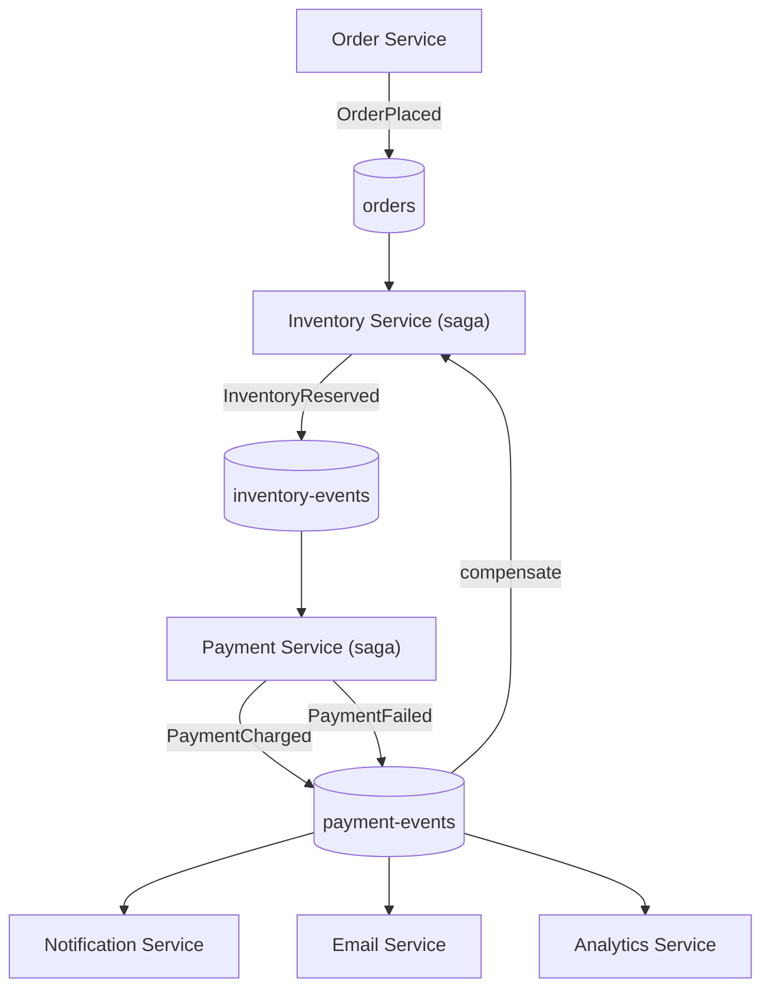
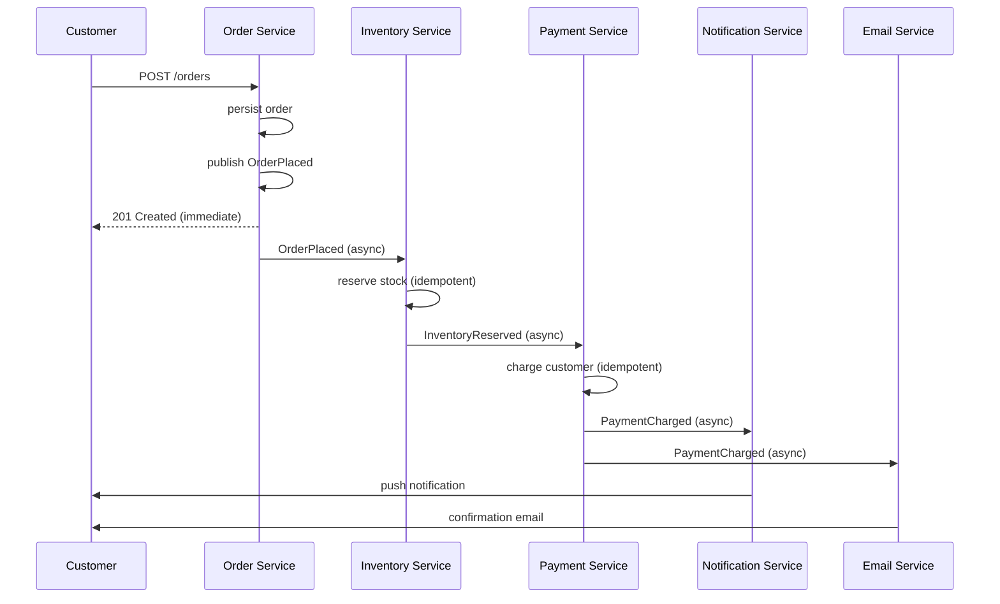
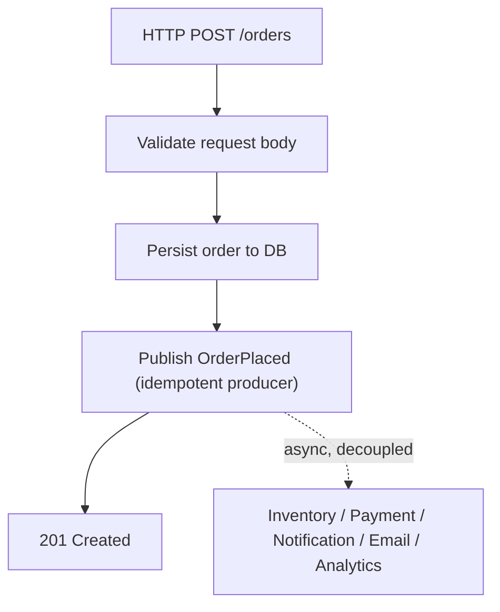
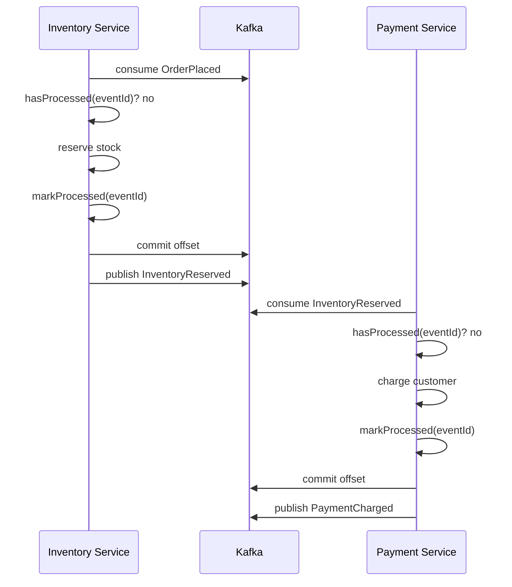

# Module 23 — Real Node.js Projects

**Level:** ⭐⭐⭐⭐⭐ Expert / Capstone
**Track:** Kafka Complete Masterclass for Node.js Backend Engineers
**Module:** 23 of 25

---

## 1. Introduction

Module 22 taught you to *design* systems like Uber's or Flipkart's on a whiteboard. This module builds the real thing — six working Node.js microservices (Order Processing, Inventory, Payment, Notification, Email, Analytics) wired together through Kafka, applying essentially every module in this course as running code rather than diagrams. This is the capstone: if Modules 1–22 were the individual ingredients and techniques, this module is the full, plated dish.

Each service below is intentionally realistic — layered error handling (Module 13), idempotent processing (Module 10), retry/DLQ (Module 15), and proper event design (Module 14) — not toy examples that skip the hard parts.

---

## 2. Learning Objectives

By the end of this module, you will be able to:

1. Architect a multi-service Node.js system where each service has a clear, bounded Kafka responsibility.
2. Implement Order, Inventory, Payment, Notification, Email, and Analytics services with production-grade patterns from Modules 1–21.
3. Wire the services together via well-designed integration events (Module 14) and a saga for order fulfillment (Module 15).
4. Run the full system end-to-end locally via Docker Compose, and trace a single order through all six services.
5. Apply monitoring and graceful shutdown consistently across every service in a multi-service codebase.
6. Extend the system with a new service (e.g., Fraud Detection) without modifying any existing service's code.

---

## 3. Why This Concept Exists

Every module in this course has taught one concept in isolation, with code examples scoped narrowly to illustrate that one concept. Real systems don't work that way — a production Order Service simultaneously needs idempotent producing (Module 4), graceful shutdown (Module 13), proper event design (Module 14), and monitoring hooks (Module 19), all at once, all correctly composed. This module exists to force that composition: building six services that must genuinely interoperate is the only way to validate that you can apply this course's individual lessons together, under the same integration pressure a real engineering team faces.

---

## 4. Problem Statement

You are building the backend for an e-commerce platform's order flow, end to end:

1. A customer places an order via an HTTP API — this must durably persist and publish an event without blocking on any downstream service (Module 1).
2. Inventory must be reserved, and released if payment fails (Module 15's saga).
3. Payment must be charged exactly once, even under redelivery (Module 10).
4. The customer must receive a notification and an email — independently, via fan-out (Module 15) — without either service depending on the other.
5. Every order event must feed an analytics pipeline for a live dashboard (Module 18's aggregation concepts, simplified).
6. The whole system must be observable (Module 19), gracefully shut down (Module 13), and easy to extend with new services later (Module 14's decoupling payoff).

---

## 5. Real-World Analogy

### Analogy: An Orchestra, Not a Solo Recital

Every previous module was a musician practicing their own instrument alone — the violinist perfecting a phrase (Module 4's producer tuning), the cellist mastering a passage (Module 5's consumer lifecycle). This module is the full orchestra performing together: no single musician's skill matters if they can't stay in tempo with everyone else, come in at the right measure, and recover gracefully if another section stumbles. Kafka is the conductor's shared score every musician (service) reads independently — nobody needs to watch each other directly, but everyone needs to read the same score correctly and play their part reliably.

---

## 6. Technical Definition

- **Order Processing Service**: The system's entry point — an Express API accepting order placement, persisting the order, and publishing an `OrderPlaced` integration event (Module 14) via an idempotent producer (Module 4).
- **Inventory Service**: A saga participant (Module 15) consuming `OrderPlaced`, attempting stock reservation, and publishing `InventoryReserved`/`InventoryReservationFailed`; also consumes `PaymentFailed` to run its compensating action.
- **Payment Service**: A saga participant consuming `InventoryReserved`, charging the customer idempotently (Module 10), and publishing `PaymentCharged`/`PaymentFailed`.
- **Notification Service**: An independent fan-out consumer (Module 15) of order lifecycle events, triggering push/SMS-style notifications — deliberately decoupled from Email Service, with no shared code or awareness of each other.
- **Email Service**: A second, independent fan-out consumer of the same events, sending transactional emails — demonstrating true fan-out (Module 7) rather than one service calling another.
- **Analytics Service**: A fan-out consumer aggregating order metrics into a simple in-memory (or Redis-backed) rolling dashboard, illustrating simplified stream-processing concepts (Module 18) without requiring a full Kafka Streams/ksqlDB setup.

---

## 7. Internal Working

### The full event flow across all six services

```
1. Order Service: HTTP POST /orders
     -> persists order to its own DB
     -> publishes OrderPlaced (idempotent producer, key=orderId)
     -> responds 201 immediately (Module 1 — does NOT wait for
        Inventory/Payment/Notification/Email/Analytics)

2. Inventory Service (saga participant):
     consumes OrderPlaced
     -> attempts stock reservation (idempotent, dedup by eventId)
     -> publishes InventoryReserved OR InventoryReservationFailed

3. Payment Service (saga participant):
     consumes InventoryReserved
     -> charges customer (idempotent, dedup by eventId)
     -> publishes PaymentCharged OR PaymentFailed

4. Inventory Service (compensation):
     consumes PaymentFailed
     -> releases the earlier reservation (compensating transaction)

5. Notification Service (independent fan-out):
     consumes PaymentCharged
     -> sends push notification "Your order is confirmed!"

6. Email Service (independent fan-out):
     consumes PaymentCharged
     -> sends transactional confirmation email
     (Notification and Email Service have ZERO awareness of
      each other — this is the fan-out payoff from Module 15)

7. Analytics Service (independent fan-out):
     consumes ALL order lifecycle events
     -> maintains a rolling dashboard: orders/min, revenue/min,
        failure rate (simplified Module 18 aggregation)
```

---

## 8. Architecture

```
                              Customer
                                 │
                          POST /orders
                                 │
                                 ▼
                    ┌─────────────────────┐
                    │    Order Service         │
                    └──────────┬──────────┘
                                 │ OrderPlaced
                                 ▼
                    ┌─────────────────────┐
                    │   orders topic           │
                    └──────────┬──────────┘
                                 ▼
                    ┌─────────────────────┐
                    │  Inventory Service        │◄──── PaymentFailed
                    │  (saga participant)        │      (compensation)
                    └──────────┬──────────┘
                                 │ InventoryReserved
                                 ▼
                    ┌─────────────────────┐
                    │  Payment Service           │
                    │  (saga participant)         │
                    └──────────┬──────────┘
                                 │ PaymentCharged
                    ┌────────────┼────────────┬────────────┐
                    ▼            ▼            ▼            ▼
             Notification    Email      Analytics    (future: Fraud,
             Service         Service    Service       Shipping, ...)
             (fan-out)       (fan-out)  (fan-out)     zero code change
                                                        to existing services
```

---

## 9. Step-by-Step Flow

1. Clone/scaffold the six-service repository structure (Section 18).
2. Start Kafka (3-broker, Module 21-style) and create all required topics via a bootstrap script (Module 3).
3. Start each service; each connects its producer/consumer once at startup (Module 13) and registers instrumentation events (Module 19).
4. Place a test order via `curl` or the Order Service's HTTP API.
5. Trace the event through Inventory → Payment → the three fan-out consumers, observing logs from each service in sequence.
6. Deliberately fail payment (via a test flag) and observe Inventory Service's compensation (release reservation) fire correctly.
7. Query the Analytics Service's simple dashboard endpoint to confirm the order was correctly counted.
8. Shut down the whole system with `docker compose down` / `SIGTERM` and confirm every service logs a clean, graceful disconnect (Module 13).

---

## 10. Detailed ASCII Diagrams

### 10.1 Fan-Out in Action — Zero Coupling Between Notification and Email

```
                     PaymentCharged event (published ONCE)

        ┌────────────────────────┼────────────────────────┐
        ▼                        ▼                        ▼
Notification Service       Email Service           Analytics Service
groupId="notif-svc"        groupId="email-svc"      groupId="analytics-svc"

Each has its OWN committed offset (Module 8), its OWN consumer
group (Module 7) — if Email Service is DOWN for an hour, Notification
Service is completely unaffected, and Email Service catches up
from its own last committed offset once it's back online.
```

### 10.2 Saga Compensation in Practice

```
OrderPlaced ──► InventoryReserved ──► [Payment charge attempt]
                                              │
                                        FAILS (e.g., card declined)
                                              │
                                              ▼
                                       PaymentFailed published
                                              │
                                              ▼
                              Inventory Service consumes PaymentFailed
                                              │
                                              ▼
                                 ReleaseInventoryReservation
                                       (compensating action)
                                              │
                                              ▼
                                   Stock is available again;
                                   OrderFailed published for
                                   Notification/Email to inform
                                   the customer
```

### 10.3 Extending With a New Service — Zero Existing Code Touched

```
BEFORE: Order -> Inventory -> Payment -> {Notification, Email, Analytics}

Add Fraud Detection Service:
  - New consumer group "fraud-service"
  - Subscribes to "orders" topic (already exists, unchanged)
  - Publishes FraudCheckPassed / FraudCheckFlagged to a NEW topic

AFTER: Order -> Inventory -> Payment -> {Notification, Email,
                                          Analytics, Fraud (NEW)}

NOT ONE LINE of Order/Inventory/Payment/Notification/Email/
Analytics service code changed. This is Module 14's decoupling
payoff, made concrete.
```

---

## 11. Mermaid Diagrams





---

## 12. Request Flow Diagram



---

## 13. Sequence Diagram



---

## 14. Kafka Internal Flow

```
Every mechanic in this six-service system is drawn directly from
earlier modules, composed together:

  Idempotent producers          -> Module 4
  Manual commit, layered errors -> Module 5, Module 13
  Partition key = orderId       -> Module 6
  Independent consumer groups   -> Module 7 (fan-out payoff)
  Idempotent consumer dedup     -> Module 10
  Event design (facts, not      -> Module 14
  commands; minimal payload)
  Saga + compensation           -> Module 15
  Instrumentation + /metrics    -> Module 19
  Graceful shutdown             -> Module 13

This module introduces NO new Kafka mechanics — it is a
deliberate, disciplined ASSEMBLY exercise.
```

---

## 15. Producer Perspective

Order Service is the system's only "root" producer — every other service is both a consumer and a producer (consuming one event, producing the next in the chain), which is worth explicitly recognizing as the natural shape of a saga-driven pipeline (Module 15): most services in a real system are neither pure producers nor pure consumers, but both.

---

## 16. Consumer Perspective

The three fan-out consumers (Notification, Email, Analytics) are the clearest illustration in this entire course of Module 7's core payoff: three completely independent teams could own these three services, deploy them on entirely different schedules, and none of them needs to coordinate with Order Service or with each other — each simply subscribes to the same well-designed integration event (Module 14).

---

## 17. Broker Perspective

Nothing here is broker-special — the broker is, as always, a durable, replicated, partitioned log (Modules 3, 9, 11) faithfully storing and serving six services' worth of produce/consume traffic without needing to know anything about orders, inventory, or payments.

---

## 18. Node.js Integration

### Full repository structure

```
ecommerce-platform/
├── docker-compose.yml              # 3-broker Kafka + all 6 services
├── shared/
│   └── kafka-client.js             # shared client factory (Module 13)
├── order-service/
│   ├── src/{producers,routes,server.js}
├── inventory-service/
│   ├── src/{consumers,sagas,db,server.js}
├── payment-service/
│   ├── src/{consumers,sagas,db,server.js}
├── notification-service/
│   ├── src/{consumers,server.js}
├── email-service/
│   ├── src/{consumers,server.js}
└── analytics-service/
    ├── src/{consumers,dashboard,server.js}
```

---

## 19. KafkaJS Examples

### 19.1 Shared Kafka client factory (used by all six services)

```javascript
// shared/kafka-client.js
import { Kafka, logLevel } from "kafkajs";

export function createKafkaClient(serviceName) {
  return new Kafka({
    clientId: serviceName,
    brokers: (process.env.KAFKA_BROKERS || "localhost:9092").split(","),
    logLevel: logLevel.WARN,
    retry: { initialRetryTime: 300, retries: 8 },
  });
}
```

### 19.2 Order Service — HTTP entry point, idempotent producer

```javascript
// order-service/src/producers/orderProducer.js
import { createKafkaClient } from "../../../shared/kafka-client.js";

const kafka = createKafkaClient("order-service");
const producer = kafka.producer({ idempotent: true });

export async function connectProducer() {
  await producer.connect();
}

export async function publishOrderPlaced(order) {
  await producer.send({
    topic: "orders",
    acks: -1,
    messages: [{
      key: String(order.id),
      value: JSON.stringify({
        eventId: crypto.randomUUID(),
        eventType: "OrderPlaced",
        orderId: order.id,
        customerId: order.customerId,
        items: order.items,
        totalAmount: order.totalAmount,
        timestamp: new Date().toISOString(),
      }),
    }],
  });
}
```

```javascript
// order-service/src/routes/orders.js
import { Router } from "express";
import { publishOrderPlaced } from "../producers/orderProducer.js";

export const ordersRouter = Router();

ordersRouter.post("/orders", async (req, res) => {
  const { customerId, items, totalAmount } = req.body;
  if (!customerId || !Array.isArray(items) || items.length === 0) {
    return res.status(400).json({ error: "Invalid order payload" });
  }

  const order = { id: crypto.randomUUID(), customerId, items, totalAmount };
  // await db.orders.insert(order); // persist to source of truth

  await publishOrderPlaced(order);
  return res.status(201).json({ orderId: order.id, status: "PLACED" });
});
```

### 19.3 Inventory Service — saga participant with idempotent reservation + compensation

```javascript
// inventory-service/src/sagas/inventoryParticipant.js
import { createKafkaClient } from "../../../shared/kafka-client.js";
import { hasProcessed, markProcessed, reserveStock, releaseStock } from "../db/processedEvents.js";

const kafka = createKafkaClient("inventory-service");
const consumer = kafka.consumer({ groupId: "inventory-service" });
const producer = kafka.producer({ idempotent: true });

export async function startInventoryParticipant() {
  await consumer.connect();
  await producer.connect();
  await consumer.subscribe({ topics: ["orders", "payment-events"], fromBeginning: false });

  await consumer.run({
    autoCommit: false,
    eachMessage: async ({ topic, partition, message }) => {
      const event = JSON.parse(message.value.toString());

      if (topic === "orders" && event.eventType === "OrderPlaced") {
        if (!(await hasProcessed(event.eventId))) {
          const reserved = await reserveStock(event.items);
          await markProcessed(event.eventId);
          await producer.send({
            topic: "inventory-events",
            messages: [{
              key: String(event.orderId),
              value: JSON.stringify({
                eventId: crypto.randomUUID(),
                eventType: reserved ? "InventoryReserved" : "InventoryReservationFailed",
                orderId: event.orderId,
                items: event.items,
              }),
            }],
          });
        }
      }

      if (topic === "payment-events" && event.eventType === "PaymentFailed") {
        // Compensating transaction (Module 15)
        if (!(await hasProcessed(`compensate-${event.eventId}`))) {
          await releaseStock(event.orderId);
          await markProcessed(`compensate-${event.eventId}`);
        }
      }

      await consumer.commitOffsets([
        { topic, partition, offset: (Number(message.offset) + 1).toString() },
      ]);
    },
  });
}
```

### 19.4 Payment Service — idempotent charge, saga continuation

```javascript
// payment-service/src/sagas/paymentParticipant.js
import { createKafkaClient } from "../../../shared/kafka-client.js";
import { hasProcessed, markProcessed, chargeCustomer } from "../db/processedEvents.js";

const kafka = createKafkaClient("payment-service");
const consumer = kafka.consumer({ groupId: "payment-service" });
const producer = kafka.producer({ idempotent: true });

export async function startPaymentParticipant() {
  await consumer.connect();
  await producer.connect();
  await consumer.subscribe({ topic: "inventory-events", fromBeginning: false });

  await consumer.run({
    autoCommit: false,
    eachMessage: async ({ topic, partition, message }) => {
      const event = JSON.parse(message.value.toString());
      if (event.eventType !== "InventoryReserved") {
        await consumer.commitOffsets([{ topic, partition, offset: (Number(message.offset) + 1).toString() }]);
        return;
      }

      let outcome = "PaymentCharged";
      if (!(await hasProcessed(event.eventId))) {
        const success = await chargeCustomer(event.orderId);
        outcome = success ? "PaymentCharged" : "PaymentFailed";
        await markProcessed(event.eventId);

        await producer.send({
          topic: "payment-events",
          messages: [{
            key: String(event.orderId),
            value: JSON.stringify({
              eventId: crypto.randomUUID(),
              eventType: outcome,
              orderId: event.orderId,
            }),
          }],
        });
      }

      await consumer.commitOffsets([
        { topic, partition, offset: (Number(message.offset) + 1).toString() },
      ]);
    },
  });
}
```

### 19.5 Notification and Email Services — true independent fan-out

```javascript
// notification-service/src/consumers/notificationConsumer.js
import { createKafkaClient } from "../../../shared/kafka-client.js";

const kafka = createKafkaClient("notification-service");
const consumer = kafka.consumer({ groupId: "notification-service" });

export async function startNotificationConsumer() {
  await consumer.connect();
  await consumer.subscribe({ topic: "payment-events", fromBeginning: false });

  await consumer.run({
    eachMessage: async ({ message }) => {
      const event = JSON.parse(message.value.toString());
      if (event.eventType === "PaymentCharged") {
        console.log(`[notification] push: "Order ${event.orderId} confirmed!"`);
      }
    },
  });
}
```

```javascript
// email-service/src/consumers/emailConsumer.js
// NOTE: entirely separate codebase, separate consumer group, ZERO
// import of or dependency on notification-service — true fan-out.
import { createKafkaClient } from "../../../shared/kafka-client.js";

const kafka = createKafkaClient("email-service");
const consumer = kafka.consumer({ groupId: "email-service" });

export async function startEmailConsumer() {
  await consumer.connect();
  await consumer.subscribe({ topic: "payment-events", fromBeginning: false });

  await consumer.run({
    eachMessage: async ({ message }) => {
      const event = JSON.parse(message.value.toString());
      if (event.eventType === "PaymentCharged") {
        console.log(`[email] sending confirmation email for order ${event.orderId}`);
      }
    },
  });
}
```

### 19.6 Analytics Service — simplified rolling dashboard

```javascript
// analytics-service/src/consumers/analyticsConsumer.js
import { createKafkaClient } from "../../../shared/kafka-client.js";

const kafka = createKafkaClient("analytics-service");
const consumer = kafka.consumer({ groupId: "analytics-service" });

const dashboard = { totalOrders: 0, totalRevenue: 0, paymentFailures: 0 };

export async function startAnalyticsConsumer() {
  await consumer.connect();
  await consumer.subscribe({ topics: ["orders", "payment-events"], fromBeginning: false });

  await consumer.run({
    eachMessage: async ({ topic, message }) => {
      const event = JSON.parse(message.value.toString());
      if (topic === "orders" && event.eventType === "OrderPlaced") {
        dashboard.totalOrders += 1;
        dashboard.totalRevenue += event.totalAmount;
      }
      if (topic === "payment-events" && event.eventType === "PaymentFailed") {
        dashboard.paymentFailures += 1;
      }
    },
  });
}

export function getDashboard() {
  return { ...dashboard };
}
```

### 19.7 Graceful shutdown, applied consistently across every service

```javascript
// order-service/src/server.js (representative of ALL six services)
import "dotenv/config";
import { app } from "./app.js";
import { connectProducer } from "./producers/orderProducer.js";

async function main() {
  await connectProducer();
  const server = app.listen(3000, () => console.log("order-service listening on :3000"));

  const shutdown = async (signal) => {
    console.log(`order-service received ${signal}, shutting down gracefully`);
    server.close();
    process.exit(0);
  };
  ["SIGTERM", "SIGINT"].forEach((sig) => process.once(sig, () => shutdown(sig)));
}

main().catch((err) => {
  console.error("order-service fatal startup error:", err);
  process.exit(1);
});
```

---

## 20. CLI Commands

```bash
# Bootstrap all required topics
for topic in orders inventory-events payment-events; do
  kafka-topics.sh --bootstrap-server localhost:9092 --create \
    --topic $topic --partitions 6 --replication-factor 3
done

# Start the full system
docker compose up -d

# Place a test order
curl -X POST http://localhost:3000/orders \
  -H "Content-Type: application/json" \
  -d '{"customerId":"cust-1","items":[{"sku":"ABC","quantity":2}],"totalAmount":59.98}'

# Watch the analytics dashboard update
curl http://localhost:3006/dashboard | jq .

# Tail all order-related events across the pipeline
kafka-console-consumer.sh --bootstrap-server localhost:9092 \
  --topic orders --topic inventory-events --topic payment-events \
  --from-beginning | jq .
```

---

## 21. Configuration Explanation

| Config | Purpose |
|---|---|
| `KAFKA_BROKERS` (per service) | Shared across all six services via `docker-compose.yml` environment |
| `groupId` per service | Each service has its own consumer group, enabling independent fan-out and offset tracking |
| `idempotent: true` (every producer) | Prevents duplicate writes from retries, consistent across the whole pipeline |
| `autoCommit: false` (Inventory, Payment) | Enables the layered, correctness-critical commit-after-success pattern (Module 13) |

---

## 22. Common Mistakes

1. **Letting Notification Service call Email Service directly "to save a topic."** This silently reintroduces the tight coupling Module 1 exists to remove — always route through Kafka, even when it seems like "just one extra call" would be simpler.
2. **Sharing a single database table for idempotency dedup across services.** Each service should own its own dedup store — sharing one couples services at the data layer even after decoupling them at the messaging layer.
3. **Forgetting compensation logic in Inventory Service.** A saga without its compensating transaction (Module 15) is an incomplete saga — stock would remain incorrectly reserved forever after a payment failure.
4. **Testing services only in isolation, never end-to-end.** Each service's unit tests can pass while the full pipeline is subtly broken (e.g., an event field name mismatch between what Order Service publishes and what Inventory Service expects) — full integration testing (Module 13) across the whole pipeline is essential.
5. **Not versioning the shared event schemas (Module 16)** as the system grows — six services agreeing informally on event shape works until it doesn't.

---

## 23. Edge Cases

- **What if Inventory Service is down when Order Service publishes `OrderPlaced`?** The event durably waits in the `orders` topic (Module 1's core value) — Inventory Service processes it whenever it comes back online, with no data loss.
- **What if Payment Service crashes between charging the customer and publishing `PaymentCharged`?** On restart, Module 10's idempotent redelivery handling prevents a double-charge, but the event does need to be reprocessed to actually get published — this is exactly why the dedup check and event publish should ideally be coupled to the same atomic unit of work where possible.
- **What if two order events for the same customer need strict ordering** (e.g., an order then a cancellation)? Keying by `orderId` (Section 19.2) ensures per-order ordering; cross-order ordering for the same customer isn't guaranteed by this design and would require a different key strategy if genuinely needed (Module 6).

---

## 24. Performance Considerations

- The saga's sequential nature (Inventory → Payment) means an order's end-to-end latency is the sum of each step's processing time plus Kafka round trips — for latency-sensitive checkouts, this is worth measuring explicitly (Module 12) rather than assumed acceptable.
- Fan-out consumers (Notification, Email, Analytics) run fully in parallel with each other and with the saga's continuation, since they don't block the saga's progress — this parallelism is a genuine, measurable throughput benefit of the architecture.

---

## 25. Scalability Discussion

- Each of the six services can scale independently by adding more consumer group instances (Module 7), up to their subscribed topic's partition count (Module 6) — Notification Service scaling has zero impact on Payment Service's scaling needs.
- Adding new fan-out consumers (Section 10.3) scales the *system's capability* without scaling its *coordination complexity* — this is the concrete, working proof of Module 14's organizational-scalability claim.

---

## 26. Production Best Practices

- Apply Module 13's connect-once, graceful-shutdown, layered-error-handling pattern identically across all six services — consistency here pays off enormously during on-call incidents.
- Apply Module 16's Schema Registry to the shared event contracts (`OrderPlaced`, `InventoryReserved`, `PaymentCharged`) once the system has more than a couple of consuming teams.
- Apply Module 19's monitoring to every service uniformly — a system is only as observable as its least-instrumented service.
- Apply Module 20's least-privilege ACLs per service — Email Service should never have `WRITE` access to `orders`, for instance.

---

## 27. Monitoring & Debugging

- Trace a single order's `orderId` across all six services' logs (structured logging, Module 13) as your primary debugging tool for any pipeline issue.
- Monitor consumer lag (Module 8, 19) separately for each of the six consumer groups — a lagging Email Service should never be confused with a lagging Payment Service, since they have completely independent operational implications.

---

## 28. Security Considerations

- Apply distinct ACLs (Module 20) per service: Order Service writes to `orders` only; Inventory/Payment read+write their specific topics; Notification/Email/Analytics have read-only access to `payment-events` and `orders` — no service should have broader access than its actual role requires.

---

## 29. Interview Questions (Easy → Medium → Hard)

### Easy

1. Why does Order Service not wait for Inventory or Payment before responding to the customer?
2. Why are Notification and Email Service implemented as two separate consumers rather than one?
3. What happens to an `OrderPlaced` event if Inventory Service is temporarily down?

### Medium

4. Walk through the full compensation flow when Payment Service publishes `PaymentFailed`.
5. Why does each service maintain its own idempotency dedup store rather than sharing one?
6. How would you add a new Fraud Detection service to this system without modifying any existing service?

### Hard

7. Design the full failure-and-recovery story for a scenario where Payment Service crashes immediately after charging a customer but before publishing `PaymentCharged`.
8. Explain how you would extend this system to guarantee `orderId`-scoped ordering across `OrderPlaced`, `InventoryReserved`, and `PaymentCharged`, and why the current design already provides this.
9. Propose a testing strategy (unit, integration, end-to-end) for this six-service system that would have caught a schema mismatch between Order Service and Inventory Service before it reached production.
10. Design the monitoring and alerting strategy (Module 19) you would put in place specifically for this saga's compensation path, and explain why silent compensation failures are especially dangerous.

---

## 30. Common Interview Traps

- **Trap:** "Since all six services are 'part of the same system,' it's fine for them to share a database or call each other directly sometimes." → **Reality:** This defeats the decoupling that's the entire point of the architecture — even within one system, service boundaries should be respected consistently, not treated as optional.
- **Trap:** "A saga's compensation logic is a nice-to-have, added later if needed." → **Reality:** A saga without compensation is not actually a complete implementation of the pattern — compensation is the mechanism that makes the saga safe, not an optional enhancement.
- **Trap:** "Testing each service's unit tests in isolation is sufficient." → **Reality:** Multi-service systems require genuine end-to-end integration testing to catch contract mismatches that isolated unit tests structurally cannot detect.

---

## 31. Summary

- This module assembles Modules 1–21's individual lessons into six real, interoperating Node.js services forming a complete order-fulfillment pipeline.
- Order Service is the system's entry point; Inventory and Payment form a saga with explicit compensation; Notification, Email, and Analytics are genuinely independent fan-out consumers.
- The system can be extended with new services (e.g., Fraud Detection) with zero changes to existing service code — the concrete payoff of Module 14's event-driven design discipline.
- Consistency across services (connect-once lifecycle, layered error handling, graceful shutdown, monitoring, least-privilege ACLs) matters as much as any individual service's internal correctness.

---

## 32. Cheat Sheet

```
REAL NODE.JS PROJECTS — ONE PAGE

Order Service       -> HTTP entry point, publishes OrderPlaced,
                        responds WITHOUT waiting for downstream

Inventory Service   -> saga participant: reserve stock, publish
                        InventoryReserved/Failed; COMPENSATES on
                        PaymentFailed by releasing reservation

Payment Service     -> saga participant: charge customer
                        (idempotent), publish PaymentCharged/Failed

Notification/Email  -> INDEPENDENT fan-out consumers of
                        PaymentCharged — zero awareness of each other

Analytics Service   -> fan-out consumer, simplified rolling
                        aggregation (Module 18 concepts, simplified)

Consistency across ALL SIX services:
  connect-once lifecycle (Module 13)
  idempotent producers + idempotent consumer dedup (Module 4, 10)
  graceful shutdown (Module 13)
  monitoring/instrumentation (Module 19)
  least-privilege ACLs (Module 20)

Golden rule: extend the system by ADDING a new consumer group,
             NEVER by modifying an existing service
```

---

## 33. Hands-on Exercises

1. Scaffold all six services' directory structures and get each one connecting to a local 3-broker Kafka cluster successfully at startup.
2. Implement Order Service and Inventory Service, and confirm an `OrderPlaced` event correctly triggers a logged stock reservation.
3. Implement Payment Service and confirm the full saga (Order → Inventory → Payment) completes end-to-end for a successful order.
4. Deliberately fail a payment (via a test flag in Payment Service) and confirm Inventory Service's compensation logic correctly releases the reservation.

---

## 34. Mini Project

**Build:** The complete six-service system as described in this module, runnable end-to-end via a single `docker compose up`, with a `curl`-able Order Service API and a `curl`-able Analytics dashboard endpoint, demonstrating a full successful order flow and a full compensated-failure flow.

---

## 35. Advanced Project

**Build:** Extend the six-service system with a seventh service — Fraud Detection — subscribing to `orders` independently, publishing `FraudCheckFlagged` for orders matching a simple rule (e.g., unusually high `totalAmount`), and demonstrate that this addition required zero modifications to any of the original six services' code.

---

## 36. Homework

1. Write an end-to-end integration test suite (using a real, ephemeral Kafka broker per Module 13's testing guidance) that places an order via Order Service's HTTP API and asserts the correct sequence of events appears across all relevant topics.
2. Apply Module 16's Schema Registry to this system's three core event types, and document the compatibility mode chosen for each.
3. Design (on paper) how you would apply Module 21's production deployment guidance (cluster sizing, DR) specifically to this six-service system, given a hypothetical expected order volume.

---

## 37. Additional Reading

- Chris Richardson, *Microservices Patterns* — for further real-world examples of saga-based order fulfillment systems closely resembling this module's case study
- Sam Newman, *Building Microservices* — for broader service-boundary design guidance applicable beyond this module's specific six-service example
- Revisit Modules 4, 5, 7, 10, 13, 14, 15, 16, 19, 20 as needed — this module is a direct, applied synthesis of all of them

---

## Key Takeaways

- A real, working multi-service Kafka system is the disciplined composition of every individual concept from Modules 1–21, applied consistently across every service.
- Order Service as the entry point, Inventory/Payment as a compensating saga, and Notification/Email/Analytics as genuine independent fan-out consumers together demonstrate this course's core architectural payoff.
- New capabilities (Fraud Detection) can be added purely by subscribing a new consumer group to existing topics — no existing service needs to change.
- Consistency in lifecycle management, error handling, monitoring, and security across every service matters as much as any single service's internal logic.

---

## Revision Notes

- Be able to trace a single order's full journey through all six services from memory, including the compensation path.
- Be able to explain why Notification and Email Service must remain completely independent, referencing Module 7 and Module 15.
- Practice explaining how a seventh service could be added with zero changes to the existing six, as a concrete demonstration of decoupling.

---

## One-Page Cheat Sheet

*(See Section 32 above.)*

---

## 20 Practice Questions

1. What is Order Service's sole Kafka responsibility?
2. What two services form the order-fulfillment saga in this system?
3. What compensating action does Inventory Service take on `PaymentFailed`?
4. Why are Notification and Email Service implemented as separate consumers?
5. What does Analytics Service consume, and what does it produce?
6. Why does Order Service not wait for Inventory/Payment before responding to the customer?
7. What happens to an `OrderPlaced` event if Inventory Service is down when it's published?
8. Why does each service maintain its own idempotency dedup store?
9. How would you add a new consumer to this system without modifying existing services?
10. What Kafka feature ensures Notification Service's downtime doesn't affect Email Service?
11. What ensures per-order event ordering across `OrderPlaced`, `InventoryReserved`, and `PaymentCharged`?
12. What pattern prevents Payment Service from double-charging a customer on redelivery?
13. Why is compensation logic essential, not optional, in a saga implementation?
14. What should differ between Order Service's and Email Service's ACLs?
15. What's the value of tracing a single `orderId` across all six services' logs?
16. Why might you apply Module 16's Schema Registry to this system's event types?
17. What determines the maximum useful scale-out for any one of these six services?
18. What's a risk of letting Notification Service call Email Service directly?
19. What's a risk of sharing a single dedup store across multiple services?
20. What testing gap can cause a schema mismatch to reach production undetected?

---

## 10 Scenario-Based Questions

1. A customer reports their order confirmation email arrived but the push notification never did. Given this system's design, what would you investigate, and what would you NOT need to investigate?
2. Payment Service crashes immediately after charging a customer's card but before publishing `PaymentCharged`. Walk through what happens on restart and whether the customer is at risk of being double-charged.
3. Your team wants to add SMS notifications alongside push and email. Describe exactly how you'd add this with zero changes to the existing five services.
4. Inventory Service is down for 3 hours during a deploy. What happens to orders placed during that window, and what happens once Inventory Service comes back online?
5. A bug in Order Service publishes `OrderPlaced` events missing the `totalAmount` field for 20 minutes before being caught. What's the blast radius across the other five services, and how would you remediate it?
6. You're asked to add a business rule: "flag any order over $10,000 for manual review before payment is charged." Where in this pipeline would you add this, and what new service or modification would it require?
7. Your monitoring shows Payment Service's consumer lag climbing steadily while Inventory Service's lag stays flat. What does this suggest, and what would you investigate first?
8. A new engineer proposes having Inventory Service call Payment Service's REST API directly "to simplify the flow." What would you explain is lost by this change?
9. You need to guarantee that a customer never receives a confirmation email for an order that was ultimately compensated (failed payment). Walk through how the current design already prevents this, and confirm there's no race condition.
10. Explain to a new team member, using this module's six-service system, why "loosely coupled" doesn't mean "unrelated" — these six services are deeply related in business terms while remaining technically decoupled.

---

## 5 Coding Assignments

1. Implement all six services as described in this module, wired together via Docker Compose, with a working end-to-end successful-order flow.
2. Implement and test the full compensation path (payment failure → inventory release → customer notification of failure).
3. Add a seventh Fraud Detection service (Section 35's advanced project) and write a test proving no existing service's code was modified.
4. Write an end-to-end integration test that places an order and asserts the correct final state across Inventory, Payment, Notification, Email, and Analytics — using real, ephemeral Kafka topics (Module 13).
5. Instrument all six services with Prometheus metrics (Module 19) and build a single Grafana dashboard showing consumer lag for all six consumer groups side by side.

---

## Suggested Next Module

**Module 24 — Production Best Practices**
With a complete, working multi-service system now built, the next module distills everything into durable operating principles: naming conventions, topic design standards, partition strategy guidelines, retry/DLQ policy, and scaling checklists — the reference guide you'll return to when designing the next real system after this course ends.
