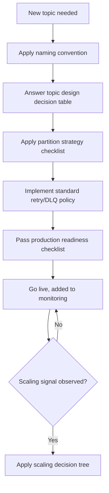
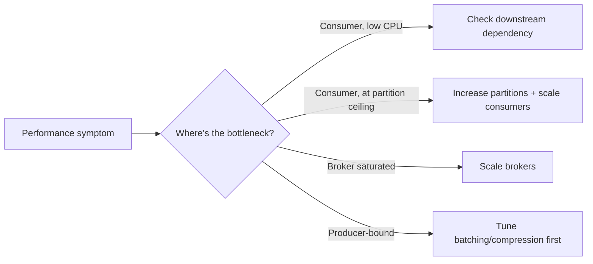
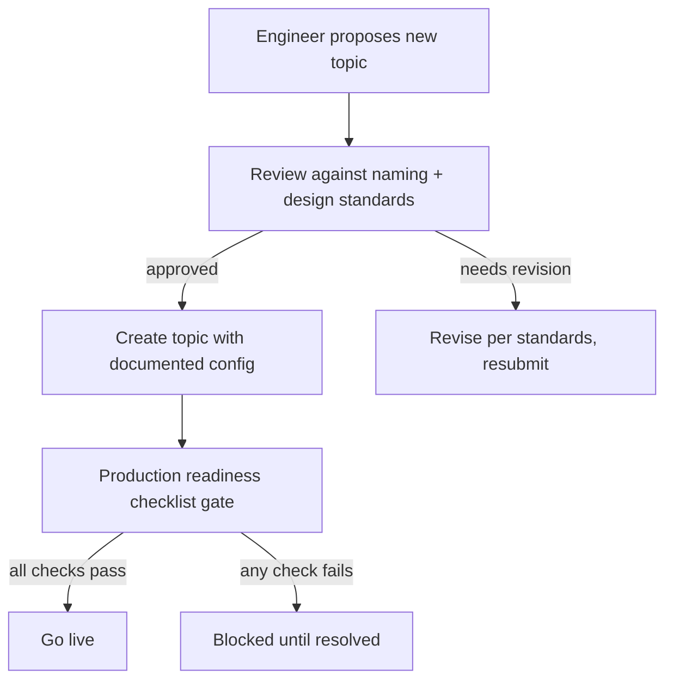
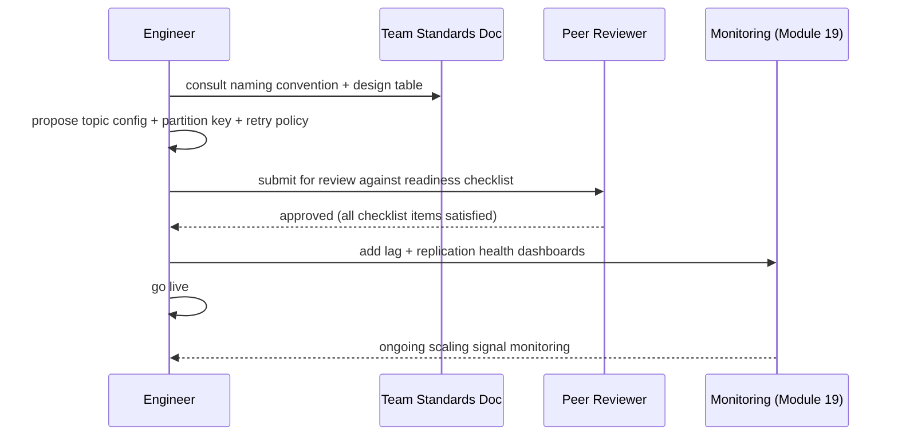

# Module 24 — Production Best Practices

**Level:** ⭐⭐⭐⭐⭐ Expert / Reference
**Track:** Kafka Complete Masterclass for Node.js Backend Engineers
**Module:** 24 of 25

---

## 1. Introduction

Module 23 built a working system. This module distills the *durable, transferable principles* behind it — the standards you'll carry to your next project, your next company, your next Kafka system entirely unrelated to e-commerce. Every prior module taught a concept in depth; this module is a reference guide: naming conventions, topic design standards, partition strategy checklists, retry/DLQ policy, and scaling guidelines, each one a distilled, opinionated summary of guidance that was scattered across Modules 1–23.

Treat this module as the document you print out, pin above your desk, and hand to a new team member on their first day working with your Kafka system.

---

## 2. Learning Objectives

By the end of this module, you will be able to:

1. Apply a consistent, documented topic and consumer group naming convention across a growing system.
2. Make deliberate, documented topic design decisions (partition count, retention, cleanup policy) rather than accepting defaults blindly.
3. Apply a repeatable partition key selection process for any new event type.
4. Define and enforce an organization-wide retry/DLQ policy rather than a per-service ad hoc one.
5. Build and use a production-readiness checklist before any new topic or service goes live.
6. Recognize the signs that a Kafka system needs to scale, and know which lever to pull first.

---

## 3. Why This Concept Exists

Every module in this course taught you *how* a mechanism works and *when* to use it in isolation. But a system with 50 topics, 30 services, and 10 teams doesn't fail because any one engineer misunderstood consumer groups — it fails because 10 different teams each made *reasonable, locally-correct* decisions that don't cohere: three different naming schemes, five different retry strategies, inconsistent partition counts with no documented rationale. This module exists because organizational-scale Kafka systems need **shared standards**, not just individually-competent engineers — the same reason a large codebase needs a style guide even when every contributor is a good programmer.

---

## 4. Problem Statement

Consider a Kafka deployment that has grown organically over two years, across many teams:

1. Some topics are named `orders`, others `order-events`, others `com.company.orders.v1` — nobody can predict a new topic's name without checking existing examples, and tooling that assumes a convention breaks constantly.
2. Some services retry failed messages in an in-process loop (Module 13's anti-pattern), others use a single retry topic, others use three tiers — inconsistent behavior makes on-call response slower and more error-prone.
3. A new engineer needs to create a topic for a new feature and has no idea what partition count or retention to choose, so they copy a random existing topic's settings, which happened to be wrong for their use case.
4. The system is "kind of slow sometimes" and nobody has a structured way to determine whether the fix is more partitions, more brokers, better batching, or something else entirely.

Each of these is an organizational, not technical, failure — solved by shared, written-down standards.

---

## 5. Real-World Analogy

### Analogy: A City's Building Codes vs. One Architect's Good Taste

An individually talented architect can design one beautiful, structurally sound building. A **city**, however, needs **building codes** — standardized rules for wiring, plumbing, fire exits, and structural loads — not because any one architect is incompetent, but because a city has hundreds of architects, contractors, and inspectors who will never all talk to each other directly. The codes let a plumber walk into a building they've never seen and know roughly what to expect; they let an inspector evaluate a new building against an objective standard rather than each architect's personal preferences.

This module is your organization's Kafka "building code" — not because any individual engineer lacks the judgment from Modules 1–23, but because a Kafka deployment at real scale needs conventions that let any engineer, on any team, predict how any other team's topics and services behave without needing to ask.

---

## 6. Technical Definition

- **Naming Convention**: A documented, enforced standard for topic names, consumer group IDs, and event type names — typically hierarchical (`domain.entity.event`) and versioned.
- **Topic Design Standard**: A documented default (and override process) for partition count, replication factor, retention, and cleanup policy, chosen based on a topic's actual traffic/durability profile rather than copied arbitrarily.
- **Partition Strategy Checklist**: A repeatable decision process (Module 6) for choosing a partition key for any new event type, applied consistently rather than reinvented per team.
- **Retry/DLQ Policy**: An organization-wide standard (Module 15) for how many retry tiers, what backoff intervals, and what DLQ alerting/replay process every service should implement — not a per-service improvisation.
- **Production Readiness Checklist**: A concrete, checkable list (synthesizing Modules 9, 12, 16, 19, 20, 21) that must be satisfied before a new topic or service is considered ready for production traffic.
- **Scaling Trigger**: A specific, observable signal (from Module 19's monitoring) that indicates a specific scaling lever (more partitions, more brokers, better client tuning) needs to be pulled — replacing vague "it feels slow" intuitions with a structured decision process.

---

## 7. Internal Working

### A concrete naming convention (adopt and adapt)

```
Topic name:          <domain>.<entity>.<event-type-or-purpose>
  Examples:           orders.order.placed
                       orders.order.cancelled
                       inventory.stock.reserved
                       payments.payment.charged

Internal/derived:     <domain>.<entity>.<purpose>.internal
  Example:            orders.order.placed.retry-1s
                       orders.order.placed.dlq

Consumer group ID:    <owning-team-or-service>-<purpose>
  Examples:            inventory-service-main
                       email-service-notifications
                       analytics-service-aggregator

Why this shape: the DOMAIN prefix groups related topics for
discovery and ACL scoping (Module 20 — grant access per domain
prefix rather than per individual topic); the EVENT TYPE makes
intent obvious without opening documentation; the CONSUMER GROUP
convention makes "who owns this lag metric" (Module 19) obvious
directly from its name in a dashboard.
```

### Topic design decision table (a repeatable process, not guesswork)

```
For EVERY new topic, answer these BEFORE creating it:

  1. Expected peak throughput?        -> informs partition count (Module 6, 12)
  2. Required consumer parallelism?    -> informs partition count (Module 7)
  3. How long must data be retained?   -> informs retention.ms (Module 8)
  4. Is this a "latest value per key"
     topic (KTable-like) or an event
     history (KStream-like)?           -> informs cleanup.policy
                                           (compact vs delete, Module 18)
  5. What's the durability requirement? -> informs replication.factor +
                                            min.insync.replicas (Module 9)
  6. Who needs read/write access?       -> informs ACLs (Module 20)

NEVER create a topic by copying another team's settings without
answering these 6 questions for YOUR topic's actual profile.
```

### Retry/DLQ policy (organization-wide standard)

```
STANDARD (all services should follow this unless a documented,
reviewed exception applies):

  Tier 1: retry-5s   (transient blips: brief DB timeout, network glitch)
  Tier 2: retry-1m   (short outages: a dependency restarting)
  Tier 3: retry-15m  (sustained issues: worth a longer cooldown)
  DLQ:    after Tier 3 exhausted, OR immediately for classified
          permanent failures (malformed payloads, business rule
          violations)

  DLQ SLA: every DLQ topic must have an assigned owner and an
  alerting rule (Module 19) firing within 15 minutes of any new
  DLQ message — "nobody is silently ignoring failed messages"
  is a non-negotiable organizational standard, not a suggestion.
```

---

## 8. Architecture

```
                    Organization-Wide Kafka Standards
     ┌───────────────────────────────────────────────────────────┐
     │  Naming Convention   -> applies to EVERY topic/group          │
     │  Topic Design Table   -> answered for EVERY new topic          │
     │  Partition Strategy   -> applied for EVERY new event type      │
     │  Retry/DLQ Policy      -> implemented by EVERY consumer service │
     │  Readiness Checklist   -> gates EVERY new topic/service launch  │
     │  Scaling Triggers       -> monitored for EVERY topic/service     │
     └───────────────────────────────────────────────────────────┘
                                     │
                applied consistently across
                                     │
     ┌───────────────┬───────────────┼───────────────┬───────────────┐
     ▼               ▼               ▼               ▼               ▼
Order Service  Inventory Service  Payment Service  Notification  (any future
                                                    Service        new service)
```

---

## 9. Step-by-Step Flow

### The lifecycle of a new topic, under these standards

1. A team identifies the need for a new event type.
2. They name it per the convention (Section 7) and document its domain/entity/event-type.
3. They work through the topic design decision table (Section 7), documenting their answers (not just the resulting config, but the *reasoning*).
4. They apply the partition strategy checklist (Section 18) to choose a partition key.
5. Any consumer of this topic implements the standard retry/DLQ policy (Section 7).
6. Before the topic carries real production traffic, it passes the production readiness checklist (Section 19.1).
7. Once live, its consumer groups' lag and the topic's replication health are added to the standard monitoring dashboard (Module 19) using the naming convention's predictable structure.
8. If/when scaling signals appear (Section 18's triggers), the team consults the scaling decision tree rather than guessing.

---

## 10. Detailed ASCII Diagrams

### 10.1 Naming Convention in Practice — Before and After

```
BEFORE (organic, inconsistent growth):

  orders                  <- Order Service
  order_events            <- a different team, different topic!
  com.company.Orders.V2   <- yet another team's convention
  inv-events               <- abbreviated, unclear ownership

AFTER (documented, enforced convention):

  orders.order.placed
  orders.order.cancelled
  inventory.stock.reserved
  inventory.stock.released

  Any engineer can now PREDICT a topic's name without checking
  docs, and ACLs (Module 20) can be scoped by domain PREFIX
  (e.g., "inventory-service can read/write anything under
  inventory.*") instead of an ever-growing explicit list.
```

### 10.2 Production Readiness Checklist (Gate Before Go-Live)

```
[ ] Topic named per convention (Section 7)
[ ] Partition count justified against expected throughput (Module 6, 12)
[ ] replication.factor=3, min.insync.replicas=2 (Module 9) unless
    explicitly, deliberately overridden with documented reasoning
[ ] Retention/cleanup policy matches the topic's actual data shape
    (event history vs. latest-value-per-key, Module 18)
[ ] Schema registered with appropriate compatibility mode (Module 16)
[ ] ACLs scoped to least privilege for every producer/consumer (Module 20)
[ ] Consumer implements the standard retry/DLQ policy (Section 7)
[ ] Consumer lag + replication health added to monitoring dashboard
    (Module 19), with alerting configured
[ ] Graceful shutdown implemented (Module 13)
[ ] Load-tested at 2x expected peak throughput (Module 12)

A topic/service that hasn't checked every box is NOT production-ready,
regardless of how well its "happy path" demo works.
```

### 10.3 Scaling Decision Tree

```
Symptom observed via monitoring (Module 19)
      │
      ▼
Is CONSUMER LAG growing while consumer CPU is LOW?
   YES -> check for a slow downstream dependency (DB, API) FIRST
          (Module 12) -- adding partitions won't fix a slow database
   NO  -> continue
      │
      ▼
Is CONSUMER LAG growing AND all consumer instances are near
partition-count-derived parallelism ceiling (Module 6/7)?
   YES -> INCREASE PARTITION COUNT (with Module 6's ordering
          caveats reviewed) and scale consumer instances to match
   NO  -> continue
      │
      ▼
Is BROKER CPU/DISK/NETWORK near saturation (Module 19)?
   YES -> scale BROKERS (Module 21), review replication overhead
   NO  -> continue
      │
      ▼
Is this a PRODUCER-side bottleneck (Module 12's diagnostic)?
   YES -> tune batching/compression BEFORE touching partition
          count or broker scale
```

---

## 11. Mermaid Diagrams





---

## 12. Request Flow Diagram



---

## 13. Sequence Diagram



---

## 14. Kafka Internal Flow

```
This module introduces NO new Kafka mechanics whatsoever — every
standard here is a deliberate, opinionated APPLICATION of Modules
1-23's mechanics, chosen consistently rather than ad hoc.

Naming convention        -> pure organizational convention, no
                             Kafka-level enforcement (though ACL
                             prefix patterns, Module 20, can partly
                             enforce it structurally)
Topic design table         -> Module 6, 8, 9, 18's configs, applied
                             via a repeatable DECISION PROCESS
Retry/DLQ policy           -> Module 15's pattern, standardized
Readiness checklist         -> Modules 9, 12, 16, 19, 20, 21 combined
Scaling decision tree        -> Module 12's diagnostic process,
                              formalized as an if/then flow
```

---

## 15. Producer Perspective

Every producer in a standards-compliant system publishes to a predictably-named topic, with a deliberately-chosen partition key (never copied blindly from another topic), and — for anything crossing a team boundary — a registered, versioned schema (Module 16). A new engineer should be able to correctly guess 80% of a new topic's name and structure before ever reading its documentation, purely from the convention.

---

## 16. Consumer Perspective

Every consumer implements the same retry/DLQ tiering (Section 7), the same graceful shutdown discipline (Module 13), and reports lag under a predictable consumer group naming pattern that immediately signals ownership on a shared monitoring dashboard (Module 19) — an on-call engineer from a completely different team should be able to look at an unfamiliar consumer group's name and immediately know which team to page.

---

## 17. Broker Perspective

The broker itself is, as always, indifferent to any of these organizational standards (Section 14) — but a broker operator benefits enormously from them in practice: predictable topic naming makes capacity planning and ACL auditing dramatically easier at scale, and a consistent retry/DLQ pattern means broker-side topic proliferation (many retry-tier and DLQ topics) follows an understandable, navigable structure rather than an unpredictable sprawl.

---

## 18. Node.js Integration

### A shared, enforceable configuration module every service imports

```javascript
// shared/kafka-standards.js
// A SINGLE source of truth for naming and defaults, imported by
// every service — the code-level enforcement mechanism for the
// conventions described throughout this module.

export function topicName(domain, entity, eventType) {
  return `${domain}.${entity}.${eventType}`;
}

export function retryTopicName(baseTopic, tier) {
  return `${baseTopic}.retry-${tier}`;
}

export function dlqTopicName(baseTopic) {
  return `${baseTopic}.dlq`;
}

export function consumerGroupId(serviceName, purpose = "main") {
  return `${serviceName}-${purpose}`;
}

export const STANDARD_RETRY_TIERS = [
  { name: "5s", delayMs: 5000 },
  { name: "1m", delayMs: 60000 },
  { name: "15m", delayMs: 900000 },
];

export const STANDARD_TOPIC_DEFAULTS = {
  replicationFactor: 3,
  minInSyncReplicas: 2,
  retentionMs: 7 * 24 * 60 * 60 * 1000, // 7 days, override deliberately
};
```

---

## 19. KafkaJS Examples

### 19.1 A production readiness checker script (automates Section 10.2)

```javascript
// tools/productionReadinessCheck.js
import { kafka } from "../shared/kafka-client.js";
import { STANDARD_TOPIC_DEFAULTS } from "../shared/kafka-standards.js";

const NAMING_PATTERN = /^[a-z]+\.[a-z]+\.[a-z-]+$/;

async function checkTopic(topicName) {
  const admin = kafka.admin();
  await admin.connect();

  const results = { topicName, checks: [] };

  results.checks.push({
    name: "Naming convention",
    pass: NAMING_PATTERN.test(topicName),
  });

  const metadata = await admin.fetchTopicMetadata({ topics: [topicName] });
  const partitions = metadata.topics[0].partitions;

  const underReplicated = partitions.some((p) => p.isr.length < p.replicas.length);
  results.checks.push({ name: "No under-replicated partitions", pass: !underReplicated });

  const replicationOk = partitions.every((p) => p.replicas.length >= STANDARD_TOPIC_DEFAULTS.replicationFactor);
  results.checks.push({ name: `Replication factor >= ${STANDARD_TOPIC_DEFAULTS.replicationFactor}`, pass: replicationOk });

  const configs = await admin.describeConfigs({ resources: [{ type: 2, name: topicName }] });
  const minIsrConfig = configs.resources[0].configEntries.find((e) => e.configName === "min.insync.replicas");
  results.checks.push({
    name: `min.insync.replicas >= ${STANDARD_TOPIC_DEFAULTS.minInSyncReplicas}`,
    pass: Number(minIsrConfig?.configValue ?? 1) >= STANDARD_TOPIC_DEFAULTS.minInSyncReplicas,
  });

  await admin.disconnect();
  return results;
}

async function main(topicName) {
  const results = await checkTopic(topicName);
  const failed = results.checks.filter((c) => !c.pass);

  results.checks.forEach((c) => console.log(`${c.pass ? "✅" : "❌"} ${c.name}`));

  if (failed.length > 0) {
    console.error(`\n${topicName} is NOT production ready — ${failed.length} check(s) failed.`);
    process.exit(1);
  }
  console.log(`\n${topicName} passed all automated readiness checks.`);
}

main(process.argv[2]).catch(console.error);
```

### 19.2 A standardized retry publisher used by every service

```javascript
// shared/standardRetryPublisher.js
import { STANDARD_RETRY_TIERS, retryTopicName, dlqTopicName } from "./kafka-standards.js";

export function createStandardRetryPublisher(kafka, baseTopic) {
  const producer = kafka.producer({ idempotent: true });
  let connected = false;

  async function connect() {
    if (!connected) {
      await producer.connect();
      connected = true;
    }
  }

  async function retryOrDeadLetter({ originalMessage, retryCount, lastError }) {
    await connect();
    const nextTier = STANDARD_RETRY_TIERS[retryCount];

    const topic = nextTier ? retryTopicName(baseTopic, nextTier.name) : dlqTopicName(baseTopic);

    await producer.send({
      topic,
      messages: [{
        key: String(originalMessage.orderId ?? originalMessage.id ?? ""),
        value: JSON.stringify({
          originalMessage,
          retryCount: retryCount + 1,
          lastError: lastError?.message ?? String(lastError),
          timestamp: new Date().toISOString(),
        }),
      }],
    });
  }

  return { retryOrDeadLetter };
}
```

### 19.3 A partition strategy checklist as an interactive CLI prompt

```javascript
// tools/partitionKeyAdvisor.js
import readline from "readline/promises";

async function advisePartitionKey() {
  const rl = readline.createInterface({ input: process.stdin, output: process.stdout });

  const needsOrdering = await rl.question("Does this event type need strict ordering for a specific entity? (y/n) ");
  const entity = needsOrdering === "y" ? await rl.question("Which entity ID (e.g., orderId, userId)? ") : null;
  const highCardinality = entity
    ? await rl.question(`Is ${entity} high-cardinality (many distinct values, no single hot value)? (y/n) `)
    : null;

  rl.close();

  if (needsOrdering !== "y") {
    console.log("\nRecommendation: no key needed (or a low-stakes key) — sticky/round-robin partitioning is fine.");
  } else if (highCardinality === "y") {
    console.log(`\nRecommendation: key by ${entity} — good ordering guarantee, low hot-partition risk.`);
  } else {
    console.log(`\nRecommendation: ${entity} may create hot partitions. Consider a composite key or salting (Module 6).`);
  }
}

advisePartitionKey().catch(console.error);
```

---

## 20. CLI Commands

```bash
# Run the automated production readiness check before go-live
node tools/productionReadinessCheck.js orders.order.placed

# Audit ALL topics in the cluster against the naming convention
kafka-topics.sh --bootstrap-server localhost:9092 --list | \
  grep -vE '^[a-z]+\.[a-z]+\.[a-z-]+$'
  # (any output here is a naming convention violation worth reviewing)

# Audit ACLs for overly broad wildcard grants (Module 20 governance)
kafka-acls.sh --bootstrap-server localhost:9092 --list | grep '\*'
```

---

## 21. Configuration Explanation

| Standard | Default | Override Process |
|---|---|---|
| `replication.factor` | 3 | Requires documented justification for anything lower |
| `min.insync.replicas` | 2 | Requires documented justification for anything lower |
| Retention | 7 days | Adjusted per topic's actual data-shape/compliance needs, documented |
| Retry tiers | 5s / 1m / 15m | Adjusted per consumer's latency sensitivity, documented |
| Naming pattern | `domain.entity.event-type` | No exceptions without team-lead sign-off |

---

## 22. Common Mistakes

1. **Treating standards as suggestions rather than a review gate.** A convention nobody enforces decays into inconsistency within months — the readiness checklist (Section 10.2) needs to be an actual, checked gate, not aspirational documentation.
2. **Copying an existing topic's configuration without answering the design decision table.** This is how a low-traffic topic ends up with 50 partitions (unnecessary overhead) or a high-traffic topic ends up with 3 (a bottleneck) — every module's config choices from earlier in this course exist to be reasoned through, not copy-pasted.
3. **Allowing each team to invent its own retry/DLQ approach.** This might be locally reasonable but creates system-wide inconsistency that slows down cross-team incident response dramatically.
4. **Writing standards once and never revisiting them.** As the system and traffic patterns evolve, defaults chosen two years ago may no longer fit — periodic review (Module 20's access review, applied more broadly here) keeps standards actually useful.
5. **Skipping the "why" when documenting a decision.** Recording "partition count = 12" without recording *why* (expected throughput, consumer parallelism target) leaves the next engineer unable to tell whether 12 is still correct as the system evolves.

---

## 23. Edge Cases

- **What if a genuinely exceptional topic needs to violate a standard** (e.g., `replication.factor=1` for a low-stakes, high-volume debug topic)? Standards should have an explicit, documented **exception process** (a specific reviewer/approver, a required justification comment) rather than either rigidly forbidding all exceptions or allowing silent, undocumented ones.
- **What if two teams, historically, chose genuinely incompatible naming conventions before this standard existed?** A migration plan (rename via dual-write/gradual cutover, similar in spirit to Module 16's schema migration guidance) is usually more realistic than a single, disruptive rename.
- **What if the scaling decision tree (Section 10.3) points to two different levers simultaneously** (e.g., both consumer-side and broker-side signals present)? Address the most severe/urgent signal first, but plan for both — real systems often need more than one lever pulled as they grow.

---

## 24. Performance Considerations

- Standards themselves have no runtime performance cost — they're organizational/process artifacts — but *following* them (right-sized partition counts, appropriate retention) directly produces better runtime performance than ad hoc, copied configuration.
- The scaling decision tree (Section 10.3) exists specifically to prevent wasted effort (e.g., adding brokers when the real issue was a slow downstream database) — a structured process saves real engineering time compared to trial-and-error tuning.

---

## 25. Scalability Discussion

- Naming conventions and design standards are themselves a *scalability mechanism* for engineering organizations — they let a Kafka deployment grow from 5 topics/1 team to 500 topics/50 teams without descending into chaos, which raw technical competence alone does not guarantee.
- A production readiness checklist becomes more valuable, not less, as an organization scales — it's the mechanism that lets a platform/infra team trust that a new topic from an unfamiliar team meets baseline standards without needing to personally review every configuration line.

---

## 26. Production Best Practices

(This entire module is production best practices — the sections above collectively constitute the guidance.) One final, meta-level practice: **treat this module's checklist and conventions as a living document**, owned by a specific team or working group, reviewed and updated as the system and organization evolve — not a one-time artifact frozen at whatever this course's snapshot of best practice looked like.

---

## 27. Monitoring & Debugging

- A consistent naming convention (Section 7) is itself a debugging accelerant — dashboards, log aggregation queries, and alert routing can all be built generically against the naming pattern rather than requiring per-topic special-casing.
- The production readiness checklist's monitoring item (Section 10.2) ensures no topic goes live invisible to Module 19's observability stack — an unmonitored topic is a blind spot waiting to become an incident.

---

## 28. Security Considerations

- Naming conventions with domain prefixes directly simplify ACL scoping (Module 20) — a well-chosen naming standard is a security enabler, not just an organizational nicety.
- The production readiness checklist's ACL item ensures least-privilege access is verified before go-live, not retrofitted after an audit finds an over-permissioned service months later.

---

## 29. Interview Questions (Easy → Medium → Hard)

### Easy

1. Why does a growing Kafka deployment benefit from a topic naming convention?
2. What is a production readiness checklist, and why is it useful?
3. Name three factors that should inform a new topic's partition count.

### Medium

4. Why should retry/DLQ policy be standardized across an organization rather than decided per-service?
5. What's the risk of copying an existing topic's configuration for a new topic without reconsidering it?
6. How does a naming convention simplify ACL management at scale?

### Hard

7. Design a naming convention and topic design decision table for a hypothetical new domain (e.g., a loyalty-points system) joining an existing multi-team Kafka deployment.
8. Explain how you would introduce these standards retroactively into an existing, inconsistent Kafka deployment without disrupting production traffic.
9. Design the exception process for a case where a specific topic has a legitimate reason to deviate from the standard `replication.factor=3` default.
10. Walk through the scaling decision tree for a scenario with BOTH high consumer lag at partition-ceiling AND high broker disk utilization simultaneously, explaining your prioritization.

---

## 30. Common Interview Traps

- **Trap:** "Standards and conventions are bureaucracy that slows down good engineers." → **Reality:** At organizational scale, they're what allows many good engineers to work independently without producing an incoherent, hard-to-operate system — the opposite of slowing things down long-term.
- **Trap:** "A production readiness checklist is a one-time gate, not something to revisit." → **Reality:** Systems and traffic evolve; a topic that passed its checklist at launch can drift out of compliance (e.g., outgrowing its partition count) without ongoing review.
- **Trap:** "Every team should be free to choose its own retry strategy since they know their own service best." → **Reality:** Individual service knowledge should inform *parameters* (which backoff tier fits), but the *pattern* itself should be standardized for organization-wide operability and incident response speed.

---

## 31. Summary

- A documented naming convention, topic design decision table, partition strategy checklist, retry/DLQ policy, and production readiness checklist collectively turn individually-correct engineering decisions into a coherent, operable, organization-scale Kafka system.
- These standards introduce no new Kafka mechanics — they're a deliberate, opinionated, consistently-applied synthesis of Modules 1–23.
- A scaling decision tree replaces vague performance intuitions with a structured, evidence-based process for choosing the right lever.
- Standards must be actively enforced (via review gates and, where possible, code-level tooling) and periodically revisited, not written once and forgotten.

---

## 32. Cheat Sheet

```
PRODUCTION BEST PRACTICES — ONE PAGE

Naming: domain.entity.event-type (topics)
        service-purpose (consumer groups)

Topic design: answer 6 questions BEFORE creating any topic
              (throughput, parallelism, retention, KTable vs
              KStream shape, durability, access) — never copy
              blindly from another topic

Retry/DLQ: STANDARDIZED tiers (e.g., 5s/1m/15m) + DLQ with an
           owner and a 15-minute alerting SLA, org-wide

Readiness checklist: naming, partitions justified, replication
                      (3/2), retention/cleanup matched to shape,
                      schema registered, least-privilege ACLs,
                      retry/DLQ implemented, monitored, graceful
                      shutdown, load-tested — ALL must pass

Scaling tree: diagnose (Module 12) BEFORE scaling ANY lever —
              slow downstream? partition ceiling? broker
              saturation? producer-bound? — different fixes each

Golden rule: standards exist so a new engineer can predict and
             trust behavior across a system built by many teams,
             without needing to ask
```

---

## 33. Hands-on Exercises

1. Write a naming convention and topic design decision table for your own hypothetical domain, and apply it to name 5 example topics.
2. Run the production readiness checker script (Section 19.1) against a topic you've created in an earlier module's exercises, and fix any failing checks.
3. Implement the standardized retry publisher (Section 19.2) and use it in place of a module-specific retry implementation from Module 15.
4. Walk through the scaling decision tree (Section 10.3) for 3 different hypothetical symptom scenarios, and write down your reasoning at each branch.

---

## 34. Mini Project

**Build:** A `kafka-standards` shared npm package (based on Section 18) containing the naming helpers, standard retry tiers, and topic defaults, plus the production readiness checker (Section 19.1) as a CLI tool — ready to be adopted across the six services from Module 23.

---

## 35. Advanced Project

**Build:** Retrofit the Module 23 six-service system to fully adopt this module's standards: rename all topics to the convention, replace each service's ad hoc retry logic with the standardized retry publisher, and run the production readiness checker against every topic in the system, fixing any failures found.

---

## 36. Homework

1. Research how a real, large-scale engineering organization (via a public engineering blog) documents and enforces its internal Kafka topic naming and design standards, and compare it to this module's proposal.
2. Write a one-page "Kafka Standards" document for a hypothetical new team joining your organization, covering naming, topic design, and retry/DLQ policy.
3. Design an automated CI check (extending Module 13's testing guidance) that fails a pull request if a newly-created topic's configuration doesn't match the organization's design standards.

---

## 37. Additional Reading

- Revisit Module 6 (partitioning), Module 8 (retention), Module 9 (replication), Module 15 (retry/DLQ), Module 16 (schema governance), Module 19 (monitoring), and Module 20 (security) — this module is a direct synthesis of all of them into actionable standards
- Confluent blog: "Kafka Topic Naming Conventions" and similar industry guidance posts, for comparison against this module's proposal
- Martin Fowler's writing on "Consistency over Correctness" style arguments for why organizational standards matter even among individually skilled engineers

---

## Key Takeaways

- A documented naming convention, topic design decision table, and production readiness checklist turn individually-good decisions into an organization-wide coherent system.
- Retry/DLQ policy should be standardized, not reinvented per service, for consistent operability and faster incident response.
- A structured scaling decision tree replaces guesswork with an evidence-based diagnostic process (built on Module 12's foundations).
- These standards introduce no new Kafka mechanics — they are the accumulated, opinionated distillation of every prior module, made practical and reusable.
- Standards must be actively enforced and periodically revisited to remain useful as a system and organization evolve.

---

## Revision Notes

- Be able to state the naming convention and the 6-question topic design table from memory.
- Be able to walk the scaling decision tree for any described symptom without hesitation.
- Practice writing a one-page standards document for a hypothetical new domain until it feels natural, not effortful.

---

## One-Page Cheat Sheet

*(See Section 32 above.)*

---

## 20 Practice Questions

1. What is a Kafka naming convention, and why does it matter at scale?
2. What are the 6 questions in the topic design decision table?
3. What is a production readiness checklist?
4. What are the standard retry tiers proposed in this module?
5. What SLA is proposed for DLQ alerting?
6. Why should retry/DLQ policy be standardized organization-wide?
7. What's the risk of copying an existing topic's config for a new topic?
8. How does a naming convention simplify ACL scoping?
9. What is a scaling trigger?
10. What's the first thing to check if consumer lag is growing but consumer CPU is low?
11. What's the second thing to check in the scaling decision tree?
12. Why is an exception process important for standards, rather than rigid enforcement with no exceptions?
13. Why should standards be periodically revisited?
14. What does the production readiness checklist verify about ACLs?
15. What does the production readiness checklist verify about replication?
16. Why is documenting the "why" behind a config choice important, not just the value?
17. What tool-level mechanism can help enforce naming conventions in code?
18. What happens to a Kafka deployment that has no shared standards, as it scales?
19. Why is a scaling decision tree more efficient than trial-and-error tuning?
20. What module's guidance does the retry/DLQ standard in this module draw from?

---

## 10 Scenario-Based Questions

1. Your organization has 5 different topic naming schemes across different teams. Propose a migration plan to a single standard without disrupting production.
2. A new engineer creates a topic by copying another team's high-traffic topic's config for their own low-traffic use case. What problems might this cause, and how would your standards process have prevented it?
3. Your on-call engineer, unfamiliar with a paging service's codebase, needs to quickly understand which team owns a lagging consumer group. How does this module's naming convention help?
4. A team wants an exception to the standard `replication.factor=3` for a genuinely low-stakes debug topic. Design the exception process you'd want in place.
5. Your production readiness checklist hasn't been updated in 18 months, but your system's scale and requirements have changed significantly. What risk does this create?
6. A symptom appears showing both high consumer lag near the partition ceiling AND high broker disk utilization. Walk through how you'd prioritize your response using the scaling decision tree.
7. Your team is retrofitting an older, pre-standards Kafka system with this module's conventions. What would you prioritize first, and why?
8. A new service is about to go live without having implemented the standard retry/DLQ policy. What would you do as the reviewing engineer?
9. Explain to a skeptical engineer who thinks standards are "bureaucratic overhead" why they materially help at your organization's actual scale.
10. Your naming convention audit script (Section 20) finds 12 topics violating the pattern. What process would you use to address this without breaking existing consumers?

---

## 5 Coding Assignments

1. Build the `kafka-standards` shared module (Section 18) with naming helpers, standard retry tiers, and topic defaults.
2. Implement the production readiness checker script (Section 19.1) and run it against every topic in a test cluster, generating a summary report.
3. Implement the standardized retry publisher (Section 19.2) as a reusable package, with tests confirming correct tier escalation and DLQ fallback.
4. Build a CI script that scans a repository's topic-creation code for naming convention violations and fails the build if any are found.
5. Build the partition key advisor tool (Section 19.3) into a more complete interactive CLI, covering additional decision factors (e.g., expected event volume per key) beyond the basic version shown.

---

## Suggested Next Module

**Module 25 — Interview Masterclass**
With standards, real projects, and system design all now covered, the final module consolidates everything into interview preparation: 150+ interview questions spanning every module, system design scenario walkthroughs, scenario-based questions, and coding challenges — the last mile before walking into a real Kafka interview.
