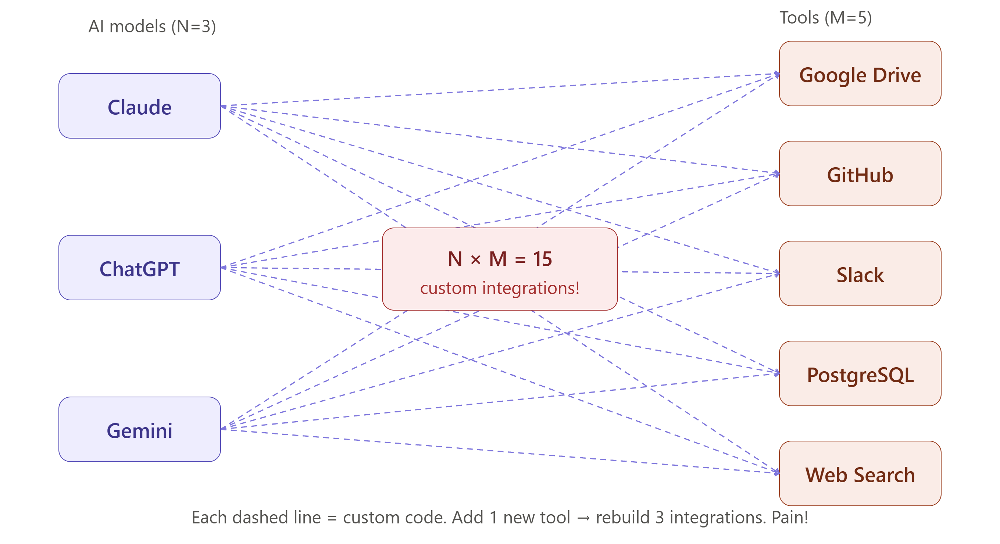
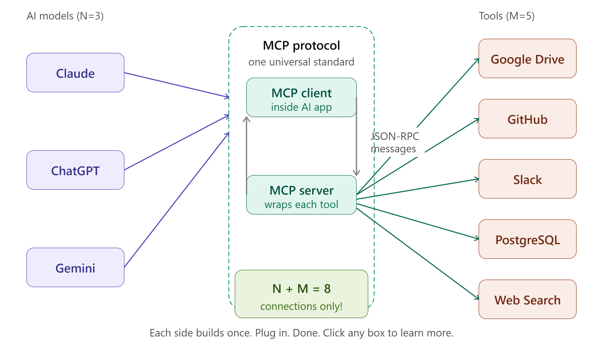
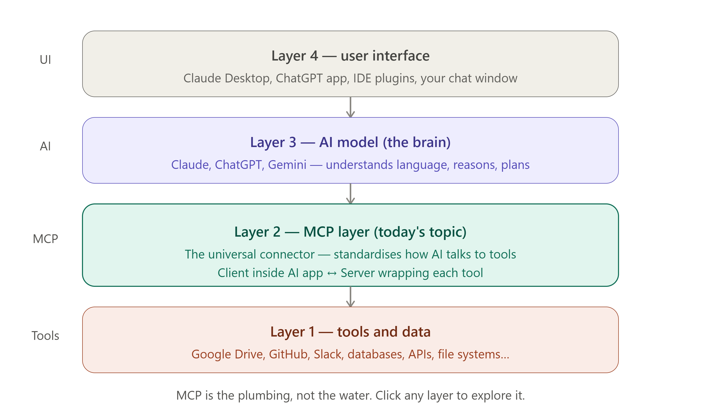

# 🌱 Day 1 — What is MCP? The Big Picture

> **Goal for today:** Understand _why_ MCP was created, _what_ it is in plain English, and _where_ it fits in the AI world — before writing a single line of code.

---

## 📋 Table of Contents

1. [The Problem Before MCP](#1-the-problem-before-mcp)
2. [What is MCP in Plain English?](#2-what-is-mcp-in-plain-english)
3. [The USB-C Analogy](#3-the-usb-c-analogy)
4. [Who Created MCP and When?](#4-who-created-mcp-and-when)
5. [Why is Everyone Adopting MCP?](#5-why-is-everyone-adopting-mcp)
6. [Real-World Analogy — The Universal Translator](#6-real-world-analogy--the-universal-translator)
7. [Where Does MCP Fit in the AI Ecosystem?](#7-where-does-mcp-fit-in-the-ai-ecosystem)
8. [Key Terms to Remember](#8-key-terms-to-remember)
9. [Summary](#9-summary)
10. [Day 1 Quiz — Test Yourself](#10-day-1-quiz--test-yourself)

---

## 1. The Problem Before MCP

### Imagine This Situation

You are building an AI assistant for your company. You want it to:

- Read files from **Google Drive**
- Create tickets in **Jira**
- Send messages on **Slack**
- Query your **PostgreSQL database**
- Search the web using **Brave Search**

Each of these is a different tool. Each tool has its own API. Your AI needs to learn how to talk to _each one separately_.

Now imagine you also want to use **Claude**, **ChatGPT**, and **Gemini** — three different AI models. Each AI model needs its own custom code to connect to each tool.

### The N × M Problem



This is called the **N × M integration problem**:

```
N = number of AI models  (e.g., 3 models: Claude, ChatGPT, Gemini)
M = number of tools      (e.g., 5 tools: Drive, Jira, Slack, DB, Search)

Total integrations needed = N × M = 3 × 5 = 15 separate connections!
```

Every time you add a new AI model → you must rebuild all M connections.
Every time you add a new tool → you must update all N AI models.

This becomes a **nightmare** very quickly. Companies were spending months just connecting AI to their existing systems.

```
BEFORE MCP (The Old Way):

  Claude ──────── Google Drive
  Claude ──────── Jira
  Claude ──────── Slack
  Claude ──────── PostgreSQL
  Claude ──────── Brave Search

  ChatGPT ─────── Google Drive
  ChatGPT ─────── Jira
  ChatGPT ─────── Slack
  ChatGPT ─────── PostgreSQL
  ChatGPT ─────── Brave Search

  Gemini ──────── Google Drive
  Gemini ──────── Jira
  Gemini ──────── Slack
  Gemini ──────── PostgreSQL
  Gemini ──────── Brave Search

  Result: 15 custom integrations. Each one different. Each one needs maintenance.
```

---

## 2. What is MCP in Plain English?

**MCP stands for Model Context Protocol.**

Let's break down each word:

| Word         | Meaning                                            |
| ------------ | -------------------------------------------------- |
| **Model**    | An AI model — like Claude, ChatGPT, or Gemini      |
| **Context**  | Information and tools the AI needs to do its job   |
| **Protocol** | A standard set of rules for how things communicate |

> **Simple definition:** MCP is a set of standard rules that lets _any_ AI model talk to _any_ tool using the _same language_.

### MCP Solves the N × M Problem



With MCP, instead of N × M connections, you only need N + M:

```
AFTER MCP (The New Way):

  Claude ──┐
           │                    ┌── Google Drive MCP Server
  ChatGPT ─┤── MCP Protocol ───┤── Jira MCP Server
           │                    ├── Slack MCP Server
  Gemini ──┘                    ├── PostgreSQL MCP Server
                                └── Brave Search MCP Server

  AI Models build ONE MCP client.
  Tool providers build ONE MCP server.
  They all speak the same language.

  Result: 3 + 5 = 8 connections instead of 15. And it scales!
```

If you add 10 more AI models → you still only need 10 new MCP clients (not 10 × 5 = 50 custom integrations).

If you add 20 more tools → you still only need 20 new MCP servers (not 20 × 3 = 60 custom integrations).

---

## 3. The USB-C Analogy

This is the best analogy to explain MCP to anyone.

### Remember the Old Days of Chargers?

Before USB-C existed:

- iPhones used **Lightning** cables
- Android phones used **Micro-USB**
- Older devices used **Mini-USB**
- Laptops had their own proprietary chargers

You needed a different charger for every device. Your bag was full of cables. If you forgot one, you were stuck.

Then **USB-C** arrived. One standard port. One cable. Works with:

- Phones
- Laptops
- Tablets
- Monitors
- Headphones
- External drives

```
USB-C in Hardware         =         MCP in AI

USB-C port                =         MCP protocol
Any USB-C device          =         Any AI model (Claude, ChatGPT...)
Any USB-C cable           =         MCP client (connector)
Any USB-C charger/device  =         Any MCP server (tool provider)
```

> Just like USB-C lets any device connect to any accessory with one standard, **MCP lets any AI connect to any tool with one standard**.

---

## 4. Who Created MCP and When?

### Origin Story

MCP was created by **Anthropic** (the company behind Claude) and publicly announced in **November 2024**.

It was built by two Anthropic engineers:

- **David Soria Parra**
- **Justin Spahr-Summers**

### Key Milestones

| Date              | Event                                                                 |
| ----------------- | --------------------------------------------------------------------- |
| **November 2024** | Anthropic announces MCP as an open standard                           |
| **November 2024** | Released with Python and TypeScript SDKs                              |
| **March 2025**    | OpenAI officially adopts MCP across all its products                  |
| **April 2025**    | Google DeepMind confirms MCP support for Gemini models                |
| **December 2025** | Anthropic donates MCP to the Linux Foundation (Agentic AI Foundation) |
| **November 2025** | MCP turns 1 year old; new major specification released                |
| **April 2026**    | MCP Dev Summit in New York draws 1,200+ attendees                     |

### It's Open Source and Vendor-Neutral

MCP is **not owned by Anthropic alone** anymore. It was donated to the **Agentic AI Foundation (AAIF)**, co-founded by Anthropic, OpenAI, and Block — under the **Linux Foundation**. This means:

- No single company controls it
- Anyone can contribute to the specification
- It's designed to be a permanent, community-owned standard

---

## 5. Why is Everyone Adopting MCP?

### The Big Players

| Company        | Product                                           | MCP Support                            |
| -------------- | ------------------------------------------------- | -------------------------------------- |
| **Anthropic**  | Claude, Claude Desktop                            | Full native support — MCP creator      |
| **OpenAI**     | ChatGPT, Agents SDK                               | Adopted March 2025                     |
| **Google**     | Gemini models                                     | Confirmed April 2025 by Demis Hassabis |
| **Microsoft**  | Azure OpenAI, Semantic Kernel, Windows AI Foundry | Integrated                             |
| **Cloudflare** | Edge computing                                    | MCP server deployment support          |

### Why They Adopted It — 5 Big Reasons

**1. Reduce Duplication**
Instead of every AI company building their own plugin system, one standard works for all. This saves millions of engineering hours.

**2. Network Effects**
More AI tools supporting MCP → more valuable for services to build MCP servers.
More MCP servers → more valuable for AI tools to support MCP.
It's a positive cycle.

**3. Security Built-In**
MCP includes patterns for access control, OAuth authentication, and permission scoping — instead of everyone inventing their own security.

**4. Speed to Market**
Integration time drops from weeks to hours when you use MCP. Pre-built servers exist for hundreds of popular services.

**5. Future-Proofing**
If you build an MCP server for your product today, it works with every AI assistant that supports MCP — today and in the future.

---

## 6. Real-World Analogy — The Universal Translator

Imagine you work at the United Nations. Diplomats from 195 countries are all trying to communicate. Each country speaks a different language. You would need:

- A French-to-English translator
- An English-to-Mandarin translator
- A Mandarin-to-Spanish translator
- ...and hundreds more

That's the old way AI worked with tools.

Now imagine the UN introduces one universal language that _everyone_ learns. Diplomats speak to each other directly, through a shared standard.

**That universal language is MCP.**

```
Without MCP:
  Claude speaks "Claude-language"  →  Google Drive speaks "Drive-API-language"
  (Need a custom translator for each pair)

With MCP:
  Claude speaks "MCP"
  Google Drive speaks "MCP"
  They understand each other directly!
```

---

## 7. Where Does MCP Fit in the AI Ecosystem?



### The Layers of Modern AI

Think of modern AI systems like a building with floors:

```
┌─────────────────────────────────────────┐
│         FLOOR 4: User Interface         │  ← What you see (chat window, IDE)
├─────────────────────────────────────────┤
│         FLOOR 3: AI Model               │  ← Claude, ChatGPT, Gemini (the brain)
├─────────────────────────────────────────┤
│         FLOOR 2: MCP Layer  ← HERE      │  ← Connects AI to the world (TODAY'S TOPIC)
├─────────────────────────────────────────┤
│         FLOOR 1: Tools & Data           │  ← Google Drive, GitHub, databases, APIs
└─────────────────────────────────────────┘
```

### MCP vs Other Similar Things

| Thing                              | What it does                                                  | How it relates to MCP                                                         |
| ---------------------------------- | ------------------------------------------------------------- | ----------------------------------------------------------------------------- |
| **REST API**                       | A way for software to talk to software over the internet      | MCP servers often _use_ REST APIs internally, but MCP adds a standard wrapper |
| **Function Calling**               | AI model calling a specific function                          | MCP is the _infrastructure layer_ above function calling                      |
| **LangChain**                      | Framework for building AI applications                        | LangChain can _use_ MCP as its tool layer                                     |
| **OpenAPI / Swagger**              | Standard way to describe REST APIs                            | MCP is similar but designed specifically for AI agents                        |
| **Language Server Protocol (LSP)** | Standard for code editors to understand programming languages | MCP was _inspired by_ LSP — same philosophy, different domain                 |

> **Key insight:** MCP is the _plumbing_, not the _water_. The AI model (Claude, ChatGPT) is the water. MCP is the pipe system that carries capability to the AI.

---

## 8. Key Terms to Remember

Here are all the important terms from Day 1, explained simply:

| Term               | Simple Explanation                                                                    |
| ------------------ | ------------------------------------------------------------------------------------- |
| **MCP**            | Model Context Protocol — the universal standard for AI-to-tool communication          |
| **Protocol**       | A set of agreed-upon rules for how two systems talk to each other                     |
| **N × M Problem**  | The explosion of custom integrations when every AI needs custom code for every tool   |
| **N + M Solution** | What MCP achieves — each side only builds once, and they all work together            |
| **Open Standard**  | A specification that is public, free to use, and not owned by one company             |
| **MCP Server**     | A lightweight program that gives AI access to a specific tool (e.g., GitHub, Slack)   |
| **MCP Client**     | The part inside an AI application that talks to MCP servers                           |
| **MCP Host**       | The AI application itself (e.g., Claude Desktop, ChatGPT app)                         |
| **SDK**            | Software Development Kit — pre-built code in Python/TypeScript to help you build MCP  |
| **JSON-RPC**       | The message format MCP uses to send requests and receive responses (Day 4 topic)      |
| **Agentic AI**     | AI that can take actions in the world autonomously, not just answer questions         |
| **Context**        | Information an AI needs to do its job — files, data, past conversations, tool results |

---

## 9. Summary

Let's recap everything from Day 1:

### What You Learned Today ✅

- **The Problem:** Before MCP, connecting AI models to tools required N × M custom integrations — an unsustainable nightmare as the AI ecosystem grew.

- **The Solution:** MCP introduces a single, open standard. AI models and tools each implement MCP _once_, and they can all talk to each other — reducing N × M to N + M.

- **The Best Analogy:** MCP is the USB-C of AI. One standard port that works with everything.

- **Who Made It:** Anthropic (November 2024), now maintained by the Agentic AI Foundation under the Linux Foundation. OpenAI and Google have both adopted it.

- **Why It Matters:** Network effects are kicking in. The ecosystem is growing rapidly. Not knowing MCP in 2025-2026 is like not knowing REST APIs in 2010.

- **Where It Fits:** MCP sits between the AI model and the outside world — the _plumbing layer_ that makes AI genuinely useful in real-world applications.

### The One-Sentence Explanation (for teaching others)

> "MCP is a universal language that lets any AI assistant connect to any tool or data source — once and for all — instead of building custom connections every time."

---

## 10. Day 1 Quiz — Test Yourself

Try answering these without looking at your notes:

**Q1.** What does MCP stand for? What does each word mean?

**Q2.** Explain the N × M problem in your own words with an example.

**Q3.** How does MCP change N × M to N + M? Give a concrete example.

**Q4.** What is the USB-C analogy and why is it a good one?

**Q5.** Who created MCP, and when was it announced?

**Q6.** Name two major AI companies (besides Anthropic) that have adopted MCP.

**Q7.** Fill in the blank: MCP sits between the **\_\_\_\_** and the **\_\_\_\_** in the AI ecosystem.

**Q8.** In one sentence, how would you explain MCP to a non-technical person?

---

> **Tomorrow — Day 2:** We go deeper into the architecture. You'll meet the 3 core players — **Host, Client, and Server** — and trace exactly how a message flows from your question all the way to a tool and back.

---

_MCP Specification Reference: modelcontextprotocol.io_
_Version covered: MCP 2025-11-25_
