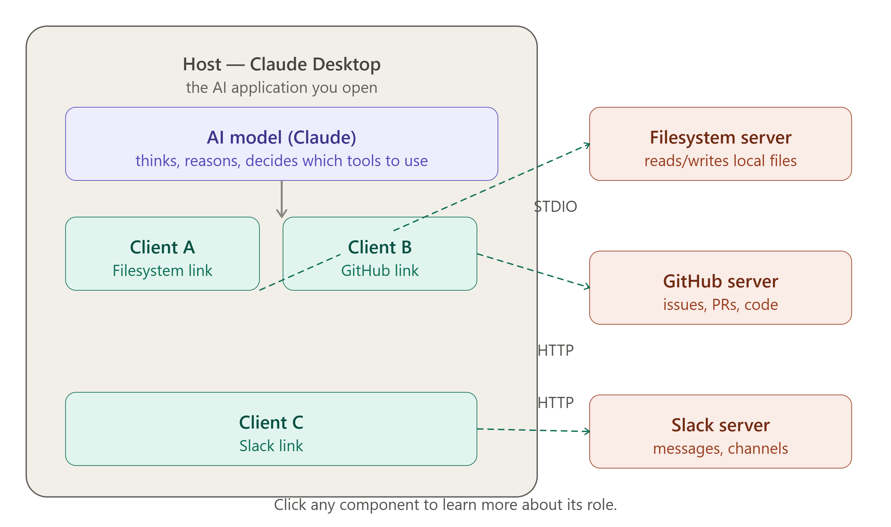
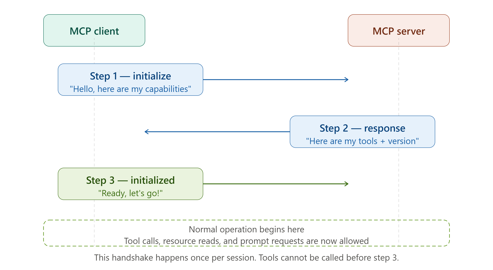
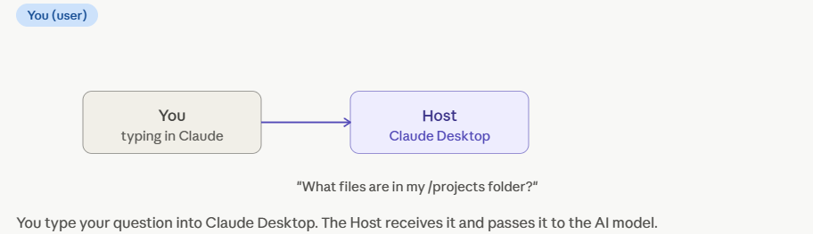
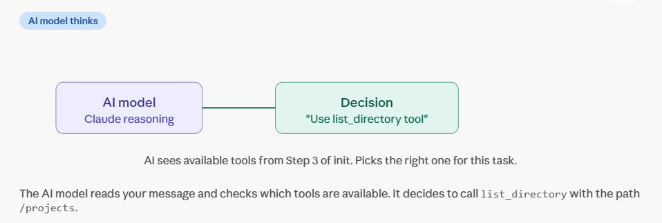
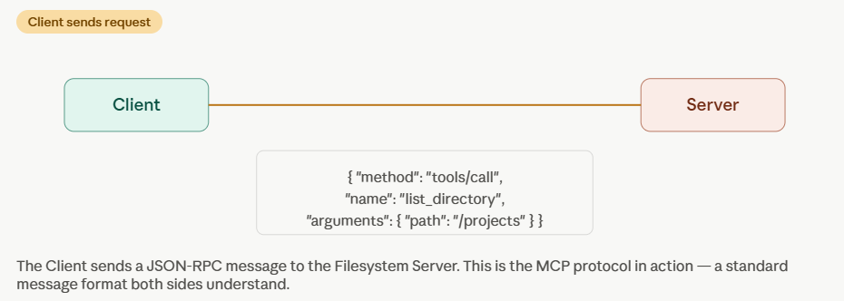
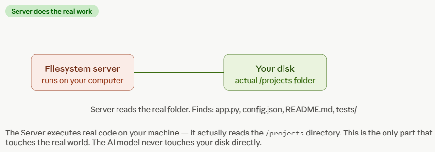
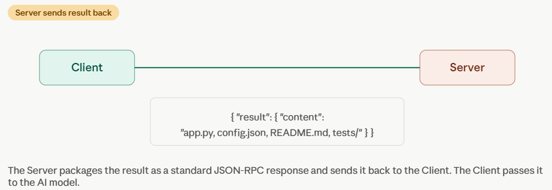
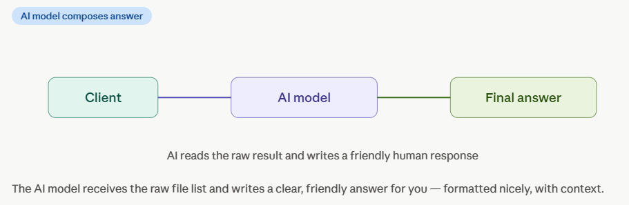
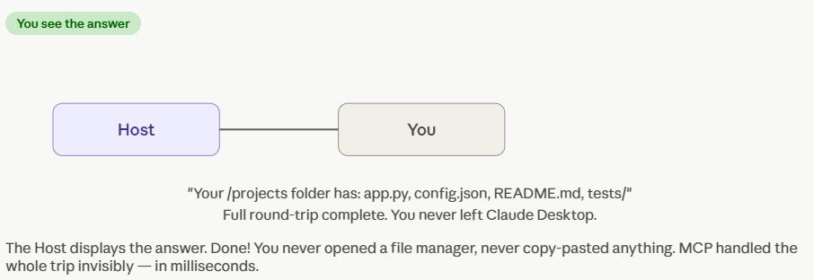

# 🏗️ Day 2 — MCP Architecture: Hosts, Clients & Servers

> **Goal for today:** Understand the 3 core players in MCP — Host, Client, and Server — and trace exactly how a message travels from your question all the way to a tool and back.

---

## 📋 Table of Contents

1. [Quick Recap of Day 1](#1-quick-recap-of-day-1)
2. [The 3 Players — Overview](#2-the-3-players--overview)
3. [The Host — The AI Application](#3-the-host--the-ai-application)
4. [The Client — The Bridge Inside](#4-the-client--the-bridge-inside)
5. [The Server — The Tool Wrapper](#5-the-server--the-tool-wrapper)
6. [How They Talk — The Full Message Flow](#6-how-they-talk--the-full-message-flow)
7. [Local Servers vs Remote Servers](#7-local-servers-vs-remote-servers)
8. [Real Example — Claude Reads Your Google Drive File](#8-real-example--claude-reads-your-google-drive-file)
9. [Key Rules of the Architecture](#9-key-rules-of-the-architecture)
10. [Key Terms to Remember](#10-key-terms-to-remember)
11. [Summary](#11-summary)
12. [Day 2 Quiz — Test Yourself](#12-day-2-quiz--test-yourself)

---

## 1. Quick Recap of Day 1

Before we start Day 2, let's make sure Day 1 is solid:

| Day 1 Concept | One-line reminder                                              |
| ------------- | -------------------------------------------------------------- |
| N×M Problem   | Every AI × Every Tool needed custom code — nightmare           |
| MCP Solution  | One universal standard: N+M instead of N×M                     |
| USB-C Analogy | MCP is the USB-C port of AI                                    |
| Who made it   | Anthropic (Nov 2024), now open standard under Linux Foundation |
| Where it fits | Layer 2 — between the AI brain and the tools/data              |

Today we zoom in on **Layer 2** and see exactly what lives inside it.

---

## 2. The 3 Players — Overview



Every MCP interaction involves exactly **3 players**. Think of them like a restaurant:

```
HOST         =   The Restaurant (the whole experience)
CLIENT       =   The Waiter    (takes your order, carries it to the kitchen)
SERVER       =   The Kitchen   (has the ingredients, does the actual work)
```

You (the user) talk to the waiter. The waiter talks to the kitchen. The kitchen prepares the food and sends it back. You never talk to the kitchen directly.

In MCP:

```
┌─────────────────────────────────────────────────────┐
│                    HOST                              │
│   (Claude Desktop / ChatGPT app / your IDE)         │
│                                                      │
│   ┌─────────────────┐                               │
│   │     CLIENT      │ ◄──── lives INSIDE the host   │
│   │  (MCP Client)   │                               │
│   └────────┬────────┘                               │
└────────────│────────────────────────────────────────┘
             │  speaks MCP protocol
             ▼
┌─────────────────────┐   ┌─────────────────────┐
│   SERVER            │   │   SERVER            │
│  (Google Drive MCP) │   │   (GitHub MCP)      │
└─────────────────────┘   └─────────────────────┘
```

Let's understand each one deeply.

---

## 3. The Host — The AI Application

### What is the Host?

The **Host** is the entire AI application — the thing the user actually opens and uses. It is responsible for:

1. Showing the user interface (the chat window you type into)
2. Running the AI model (Claude, ChatGPT, etc.)
3. Managing one or more MCP Clients internally
4. Deciding _which_ servers to connect to
5. Controlling security — what permissions servers are allowed

### Real-World Examples of Hosts

| Host                     | Description                                                    |
| ------------------------ | -------------------------------------------------------------- |
| **Claude Desktop**       | Anthropic's desktop app — has full MCP host built in           |
| **ChatGPT Desktop**      | OpenAI's desktop app — adopted MCP in March 2025               |
| **VS Code with Copilot** | An IDE acting as an AI host                                    |
| **Cursor IDE**           | AI-first code editor, full MCP support                         |
| **Your own app**         | If you build an AI app using the MCP SDK, your app is the host |

### The Host's Responsibilities

```
HOST is responsible for:

✅ Starting and stopping MCP servers
✅ Managing user authentication
✅ Controlling which tools the AI is allowed to use
✅ Presenting the AI's responses to the user
✅ Deciding what context (files, data) to include in AI requests
✅ Security — user must approve dangerous operations
```

### Key Insight About the Host

The host is like the **manager of the restaurant**. It sets the rules. It decides which kitchens (servers) to work with. It handles billing (authentication). It makes sure customers (users) are served safely.

The AI model runs _inside_ the host. When Claude gives you an answer, it is the host (Claude Desktop) that is showing you that answer — Claude the model is just doing the thinking.

---

## 4. The Client — The Bridge Inside

### What is the Client?

The **MCP Client** is a component that lives _inside_ the host application. It is the actual implementation of the MCP protocol. Think of it as:

> The client is the translator and messenger between the AI brain and the outside world.

The client:

- Maintains a **1-to-1 connection** with each MCP server
- Sends requests to servers on behalf of the AI
- Receives results from servers and passes them to the AI
- Handles the technical details of the MCP protocol (JSON-RPC messages, connection lifecycle)

### Why Is the Client Separate from the Host?

Good question! The host is the _application_ (the big thing). The client is a _component inside_ the application (the specific MCP-speaking part).

```
Claude Desktop App (HOST)
│
├── Chat UI component
├── AI model runner (Claude)
├── File system component
└── MCP Client component   ◄── THIS is the "client"
         │
         ├── Connection to Google Drive Server
         ├── Connection to GitHub Server
         └── Connection to Slack Server
```

One host can contain **multiple clients**, each maintaining its own connection to a different server.

### The Client's Job in 4 Steps

```
Step 1: DISCOVER
   Client asks server: "What tools do you have?"
   Server replies: "I have create_file, read_file, list_files"

Step 2: INFORM
   Client tells the AI model: "Here are the available tools and what they do"

Step 3: EXECUTE
   AI decides to use a tool → Client sends the request to the correct server

Step 4: RELAY
   Server sends back the result → Client passes it to the AI model
```

---

## 5. The Server — The Tool Wrapper

### What is the Server?

The **MCP Server** is a lightweight program that:

- Wraps a specific tool or data source (e.g., GitHub, Slack, a database)
- Exposes that tool's capabilities in MCP-standard format
- Does the actual work when the AI wants to use the tool

The server is _not_ a big web server. It is usually a small program — sometimes just 50-100 lines of code — that acts as a translator between the MCP protocol and the tool's native API.

### Think of It This Way

```
GitHub has its own API:
  GET /repos/{owner}/{repo}/issues
  POST /repos/{owner}/{repo}/issues
  ...complex authentication...

GitHub MCP Server wraps this:
  Tool: list_issues(repo, filters)    ← simple, standard MCP format
  Tool: create_issue(title, body)     ← simple, standard MCP format
  Resource: repo://owner/repo/README  ← simple, standard MCP format
```

The AI model talks to the MCP server using simple, standard MCP language. The server handles all the complexity of GitHub's real API behind the scenes.

### What Can a Server Expose?

A server can expose 3 types of things (you'll learn these deeply on Day 3):

| Type          | What it is                   | Example                                     |
| ------------- | ---------------------------- | ------------------------------------------- |
| **Tools**     | Actions the AI can perform   | `create_github_issue`, `send_slack_message` |
| **Resources** | Data the AI can read         | A file, a database record, a web page       |
| **Prompts**   | Templates for specific tasks | A code review template, a bug report format |

### Server Examples in the Real World

| Server               | What it wraps       | Key tools it exposes                        |
| -------------------- | ------------------- | ------------------------------------------- |
| **GitHub MCP**       | GitHub API          | create_issue, list_prs, read_file           |
| **Google Drive MCP** | Google Drive API    | list_files, read_file, create_doc           |
| **Slack MCP**        | Slack API           | send_message, list_channels, read_thread    |
| **PostgreSQL MCP**   | Database connection | execute_query, list_tables, describe_schema |
| **Filesystem MCP**   | Your local files    | read_file, write_file, list_directory       |
| **Brave Search MCP** | Web search API      | search(query) → list of results             |

### Local vs Remote Servers

Servers come in two flavours:

```
LOCAL SERVER                        REMOTE SERVER
─────────────────────────           ─────────────────────────
Runs on YOUR computer               Runs on THE INTERNET
Uses STDIO transport                Uses HTTP/SSE transport
Good for: local files, tools        Good for: cloud services
Fast, no network delay              Slight network latency
Example: Filesystem server          Example: GitHub server
```

_(We'll cover this more in Section 7)_

---

## 6. How They Talk — The Full Message Flow

This is the most important section of Day 2. Let's trace a real message from start to finish.

### Scenario: You ask Claude — "What files are in my project folder?"

#### Phase 1 — Initialization (happens once when app starts)



```
HOST starts up
│
├── HOST launches the Filesystem MCP Server
│
├── CLIENT sends: "Hello, I'm MCP Client v1.0, what can you do?"
│
└── SERVER replies: "I'm Filesystem Server. I have these tools:
                      - list_directory(path)
                      - read_file(path)
                      - write_file(path, content)
                      - search_files(pattern)"
│
└── CLIENT tells the AI model: "FYI, you can use these 4 tools"
```

#### Phase 2 — Normal Conversation (happens every time you chat)

```
YOU type: "What files are in my /projects folder?"
             │
             ▼
HOST receives your message
             │
             ▼
AI MODEL thinks: "The user wants to list files.
                  I have a tool: list_directory(path)
                  I should call it with path='/projects'"
             │
             ▼
AI MODEL tells HOST: "Please call list_directory('/projects')"
             │
             ▼
CLIENT sends to SERVER:
{
  "method": "tools/call",
  "params": {
    "name": "list_directory",
    "arguments": { "path": "/projects" }
  }
}
             │
             ▼
SERVER runs the actual code:
  → reads the real /projects folder on your computer
  → gets: ["app.py", "config.json", "README.md", "tests/"]
             │
             ▼
SERVER sends back to CLIENT:
{
  "result": {
    "content": "app.py, config.json, README.md, tests/"
  }
}
             │
             ▼
CLIENT passes result to AI MODEL
             │
             ▼
AI MODEL composes a human-friendly answer:
"Your /projects folder contains 3 files and 1 folder:
 - app.py (Python script)
 - config.json (configuration)
 - README.md (documentation)
 - tests/ (folder)"
             │
             ▼
HOST displays answer to YOU  ✅
```

### The Flow in One Picture

```
YOU
 │  (type your question)
 ▼
HOST  →  AI Model  →  "I need tool X"
                           │
                           ▼
                        CLIENT  →  (MCP protocol)  →  SERVER
                                                         │
                                                    (real work)
                                                         │
                        CLIENT  ←  (MCP protocol)  ←  SERVER
                           │
                           ▼
HOST  →  AI Model  →  "Here's the result, let me answer"
 │
 ▼
YOU  ✅ (see the answer)
```

---

## 7. Local Servers vs Remote Servers

### Local Servers

A **local server** runs on your own computer. It starts when your host application starts, and stops when you close the app.

```
Your Computer
┌────────────────────────────────────────┐
│  Claude Desktop (HOST)                 │
│  ├── MCP Client                        │
│  └── spawns ──► Filesystem MCP Server  │
│                 (runs as local process) │
└────────────────────────────────────────┘
```

**Communication method:** STDIO (Standard Input/Output)

- The host literally starts the server as a child process
- They talk through the terminal's stdin/stdout pipes
- Very fast — no network involved
- Perfect for: reading local files, running local scripts, accessing local databases

**Config example** (Claude Desktop `config.json`):

```json
{
  "mcpServers": {
    "filesystem": {
      "command": "npx",
      "args": [
        "-y",
        "@modelcontextprotocol/server-filesystem",
        "/Users/yourname/projects"
      ]
    }
  }
}
```

This tells Claude Desktop: "When you start, also start this filesystem server pointing at my projects folder."

### Remote Servers

A **remote server** runs somewhere on the internet — a company's cloud, a third-party service, or your own server.

```
Your Computer                     The Internet
┌──────────────────┐              ┌──────────────────────┐
│  Claude Desktop  │              │  GitHub MCP Server   │
│  (HOST)          │──── HTTP ───►│  (runs on GitHub's   │
│  ├── MCP Client  │◄─── SSE ────│   infrastructure)    │
└──────────────────┘              └──────────────────────┘
```

**Communication method:** HTTP + SSE (Server-Sent Events)

- Client sends requests over regular HTTPS
- Server sends responses back via SSE (a streaming connection)
- Works across the internet
- Perfect for: cloud services (GitHub, Slack, Google Drive), APIs

**When to use which:**

| Use Case                      | Recommended       |
| ----------------------------- | ----------------- |
| Read/write local files        | Local (STDIO)     |
| Run local scripts or commands | Local (STDIO)     |
| Connect to GitHub             | Remote (HTTP/SSE) |
| Connect to Slack              | Remote (HTTP/SSE) |
| Use a local database          | Local (STDIO)     |
| Use a cloud database          | Remote (HTTP/SSE) |

---

## 8. Real Example — Claude Reads Your Google Drive File

Let's walk through a complete real-world example step by step.

**Scenario:** You ask Claude Desktop: _"Summarise the Q3 report in my Google Drive"_

### Step 1 — Setup (done once)


You have already:

- Installed Claude Desktop (the HOST)
- Connected the Google Drive MCP server (a REMOTE server)
- Authenticated with your Google account

### Step 2 — Your Message



You type: `"Summarise the Q3 report in my Google Drive"`

### Step 3 — AI Understands Intent



The AI model (Claude) reads your message and thinks:

> "The user wants a summary of a file. I have Google Drive tools available. I should first search for the Q3 report, then read it."

### Step 4 — First Tool Call: Search



```
CLIENT → Google Drive SERVER:
  tools/call: search_files(query="Q3 report")

SERVER → CLIENT:
  Found: "Q3_Financial_Report_2025.pdf" (file_id: "abc123")
```

### Step 5 — Second Tool Call: Read



```
CLIENT → Google Drive SERVER:
  tools/call: read_file(file_id="abc123")

SERVER → CLIENT:
  [Returns the full text content of the PDF]
```

### Step 6 — AI Composes the Answer



Claude now has the file content. It reads it and writes a summary:

> "Your Q3 Financial Report shows total revenue of ₹45 crore, a 12% increase over Q2. Key highlights: Product A grew by 23%, while Product B declined by 5%..."

### Step 7 — You See the Answer



Claude Desktop shows you the summary. Done! ✅

**Notice what happened:** You never left Claude Desktop. You didn't open Google Drive. You didn't copy-paste anything. MCP handled it all invisibly.

---

## 9. Key Rules of the Architecture

These are important rules that define how MCP works. Understanding them prevents confusion:

### Rule 1 — One Client per Server Connection

Each MCP Client maintains exactly **one dedicated connection** to exactly **one MCP Server**.

```
✅ Correct:
  Client A ──► Server A (Filesystem)
  Client B ──► Server B (GitHub)
  Client C ──► Server C (Slack)

❌ Wrong assumption:
  One Client ──► Multiple Servers directly
```

One host can have _many_ clients. But each client talks to exactly one server.

### Rule 2 — Servers Don't Know About Each Other

MCP servers are completely **isolated** from each other. Server A cannot see what Server B is doing.

```
Filesystem Server  }
GitHub Server      }  ← These have NO idea the others exist
Slack Server       }
```

This is a security feature. A compromised server cannot access data from other servers.

### Rule 3 — The Host Controls Everything

The host is the **gatekeeper**. It decides:

- Which servers to connect to
- Which tools the AI is allowed to call
- Whether to ask the user for confirmation before running sensitive tools
- When to disconnect from servers

### Rule 4 — Servers Can Run Concurrently

The host can query **multiple servers at the same time** (in parallel). This makes complex tasks faster.

```
AI needs to:
  1. List files from Filesystem Server
  2. Get recent commits from GitHub Server

HOST can ask both servers simultaneously:
  Client A ──► Filesystem Server  ┐
  Client B ──► GitHub Server      ┘  (at the same time!)
```

### Rule 5 — Initialization Always Comes First

Before any tool can be used, the client and server must complete an **initialization handshake**. This is mandatory. No tools can be called before it.

```
ALWAYS happens first:
  Client: "initialize" + {my capabilities}
  Server: {server capabilities}
  Client: "initialized" notification

ONLY THEN can tools be called.
```

---

## 10. Key Terms to Remember

| Term                     | Simple Explanation                                                       |
| ------------------------ | ------------------------------------------------------------------------ |
| **Host**                 | The full AI application (e.g., Claude Desktop). Manages everything.      |
| **Client**               | Component _inside_ the host that speaks MCP protocol with servers        |
| **Server**               | Lightweight program that wraps a tool and exposes it via MCP             |
| **STDIO**                | Standard Input/Output — how local servers communicate (fast, no network) |
| **HTTP/SSE**             | How remote servers communicate over the internet                         |
| **Initialization**       | The mandatory first handshake between client and server                  |
| **Capability discovery** | Client asking server: "What tools do you have?"                          |
| **Tool call**            | When the AI asks a server to perform an action                           |
| **Spawning**             | Host launching a local server as a child process                         |
| **1-to-1 connection**    | Each client maintains exactly one connection to one server               |
| **Isolation**            | Servers cannot see each other — a key security property                  |
| **Concurrent queries**   | Host can ask multiple servers at the same time                           |

---

## 11. Summary

### What You Learned Today ✅

**The 3 Players:**

- **Host** = The AI application (Claude Desktop, ChatGPT). Manages the whole experience, controls security, runs the AI model.
- **Client** = Lives _inside_ the host. Speaks MCP protocol. One client per server connection. Discovers tools and relays messages.
- **Server** = Lightweight wrapper around a tool. Does the actual work. Exposes tools, resources, and prompts via MCP standard.

**The Message Flow:**

```
User → Host → AI Model → Client → Server → (real work) → Server → Client → AI Model → Host → User
```

**Two Transport Types:**

- Local (STDIO): fast, your computer, great for files and local tools
- Remote (HTTP/SSE): internet, cloud services like GitHub and Slack

**Key Rules:**

- 1 client = 1 server connection
- Servers are isolated from each other
- Host is the gatekeeper and security enforcer
- Initialization handshake always comes first
- Multiple servers can be queried in parallel

### The One-Sentence Explanation (for teaching others)

> "In MCP, the Host is the AI app you use, the Client is the invisible messenger inside it, and the Server is the translator that gives the AI access to a specific tool — together they let AI do real work in the world."

---

## 12. Day 2 Quiz — Test Yourself

**Q1.** Name the 3 players in MCP architecture. What is each one responsible for?

**Q2.** The restaurant analogy: which MCP component is the waiter? Why?

**Q3.** A user has Claude Desktop connected to GitHub, Slack, and Filesystem servers. How many MCP Clients exist inside Claude Desktop?

**Q4.** What is the difference between STDIO transport and HTTP/SSE transport? When would you use each?

**Q5.** True or False: A GitHub MCP Server can read data from the Filesystem MCP Server running on the same host. Explain why.

**Q6.** What happens during "initialization"? Why must it happen first?

**Q7.** Describe the full message flow when you ask Claude: _"Send a Slack message to my team saying the deployment is complete."_ Name every step.

**Q8.** Who is the "gatekeeper" in MCP architecture, and what does that mean in practice?

---

> **Tomorrow — Day 3:** We go inside the MCP Server and learn about the **3 Primitives** — Tools, Resources, and Prompts. You'll understand exactly what servers can expose to AI, with real code examples.

---

_MCP Specification Reference: modelcontextprotocol.io_
_Version covered: MCP 2025-11-25_
