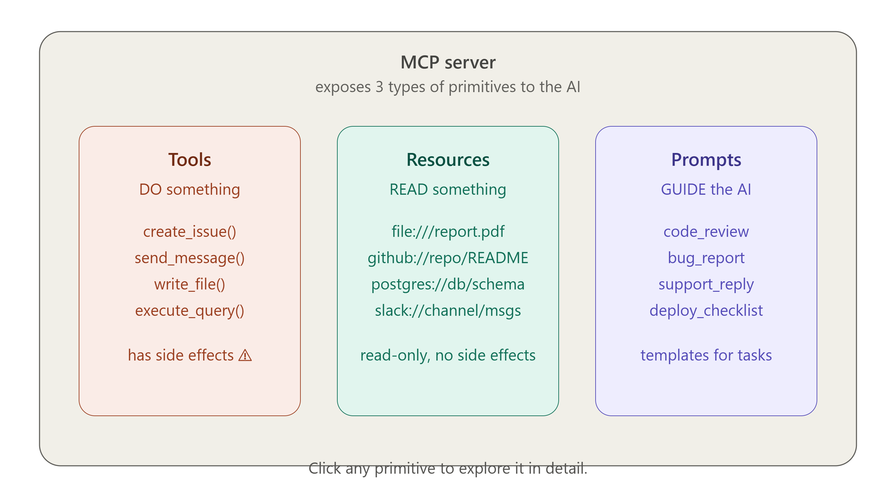
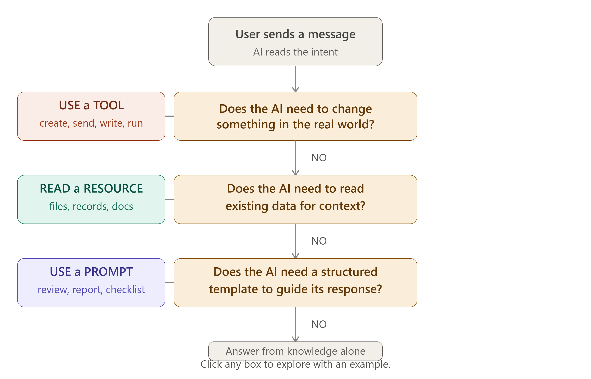
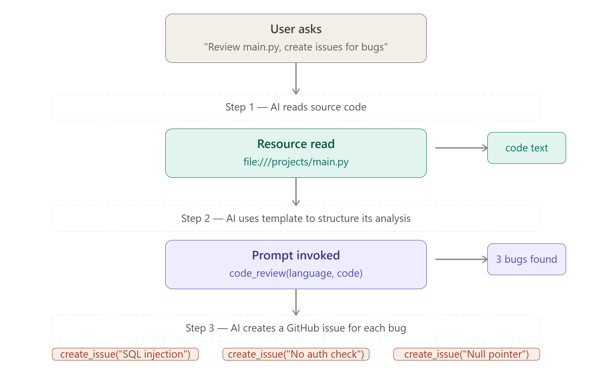
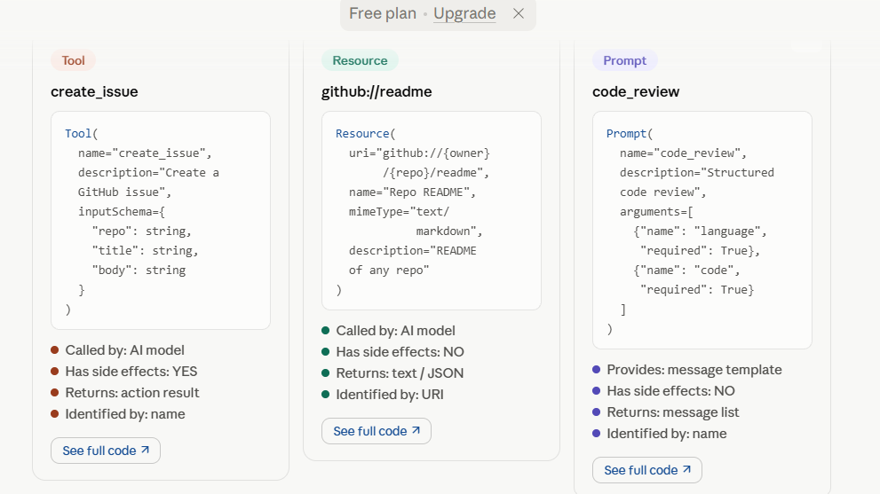

# 🔧 Day 3 — The 3 Primitives: Tools, Resources & Prompts

> **Goal for today:** Understand the 3 things an MCP Server can expose to an AI — Tools, Resources, and Prompts — with real examples and actual code so you can recognize and build them yourself.

---

## 📋 Table of Contents

1. [Quick Recap of Day 2](#1-quick-recap-of-day-2)
2. [What Are Primitives?](#2-what-are-primitives)
3. [Primitive 1 — Tools (Do Something)](#3-primitive-1--tools-do-something)
4. [Primitive 2 — Resources (Read Something)](#4-primitive-2--resources-read-something)
5. [Primitive 3 — Prompts (Guide Something)](#5-primitive-3--prompts-guide-something)
6. [Side-by-Side Comparison](#6-side-by-side-comparison)
7. [How the AI Decides Which to Use](#7-how-the-ai-decides-which-to-use)
8. [Real Code — A GitHub MCP Server](#8-real-code--a-github-mcp-server)
9. [Combining All 3 Primitives](#9-combining-all-3-primitives)
10. [Key Terms to Remember](#10-key-terms-to-remember)
11. [Summary](#11-summary)
12. [Day 3 Quiz — Test Yourself](#12-day-3-quiz--test-yourself)

---

## 1. Quick Recap of Day 2

| Day 2 Concept  | One-line reminder                                          |
| -------------- | ---------------------------------------------------------- |
| Host           | The AI application (Claude Desktop). Manager of everything |
| Client         | Lives inside the Host. Speaks MCP to exactly one Server    |
| Server         | Lightweight wrapper around a tool. Does real work          |
| Initialization | Mandatory 3-step handshake before any tool can be called   |
| STDIO vs HTTP  | Local servers use STDIO; remote servers use HTTP/SSE       |

Today we zoom into the **Server** and see exactly what it can expose.

---

## 2. What Are Primitives?

The word **"primitive"** in programming means a basic building block — something simple that everything else is built from.

In MCP, a Server can expose exactly **3 types of primitives** to the AI:


```
┌─────────────────────────────────────────────────────┐
│              MCP SERVER                             │
│                                                     │
│  TOOLS      →  Things the AI can DO                │
│  RESOURCES  →  Things the AI can READ              │
│  PROMPTS    →  Templates that GUIDE the AI         │
│                                                     │
└─────────────────────────────────────────────────────┘
```

A simple memory trick:

> **Tools = Do**, **Resources = Read**, **Prompts = Guide**

Let's understand each one deeply.

---

## 3. Primitive 1 — Tools (Do Something)

### What Is a Tool?

A **Tool** is a function that the AI can call to **perform an action** in the real world. It is the most powerful primitive because it can:

- Create, update, or delete data
- Send messages
- Execute code
- Call external APIs
- Run terminal commands
- Write files

Think of Tools as the **hands** of the AI — they let it reach out and do things.

### Key Characteristics of Tools

| Property          | Description                                     |
| ----------------- | ----------------------------------------------- |
| **Direction**     | AI → Server (AI initiates, Server executes)     |
| **Side effects**  | YES — tools change things in the real world     |
| **Returns**       | A result the AI can read and use                |
| **Requires care** | Yes — running wrong tools can cause real damage |

### Real Tool Examples

#### GitHub MCP Server — Tools

```python
# Tool 1: Create a GitHub Issue
@server.tool("create_issue")
def create_issue(repo: str, title: str, body: str) -> dict:
    """Create a new issue in a GitHub repository"""
    # Calls GitHub API behind the scenes
    response = github_api.post(f"/repos/{repo}/issues", {
        "title": title,
        "body": body
    })
    return {"issue_number": response["number"], "url": response["html_url"]}

# Tool 2: List Pull Requests
@server.tool("list_pull_requests")
def list_pull_requests(repo: str, state: str = "open") -> list:
    """List all pull requests in a repository"""
    prs = github_api.get(f"/repos/{repo}/pulls?state={state}")
    return [{"number": pr["number"], "title": pr["title"]} for pr in prs]

# Tool 3: Merge a Pull Request
@server.tool("merge_pull_request")
def merge_pull_request(repo: str, pr_number: int) -> dict:
    """Merge a pull request"""
    result = github_api.put(f"/repos/{repo}/pulls/{pr_number}/merge")
    return {"merged": result["merged"], "sha": result["sha"]}
```

#### Filesystem MCP Server — Tools

```python
@server.tool("write_file")
def write_file(path: str, content: str) -> dict:
    """Write content to a file"""
    with open(path, 'w') as f:
        f.write(content)
    return {"success": True, "path": path}

@server.tool("delete_file")
def delete_file(path: str) -> dict:
    """Delete a file from disk"""
    os.remove(path)
    return {"success": True, "deleted": path}
```

### How a Tool Call Looks in Practice

**User asks:** _"Create a GitHub issue titled 'Login button broken' in my project repo"_

```
AI decides:  I need to call create_issue

Tool call:
{
  "name": "create_issue",
  "arguments": {
    "repo": "myuser/myproject",
    "title": "Login button broken",
    "body": "The login button on the home page is not responding to clicks."
  }
}

Tool result:
{
  "issue_number": 142,
  "url": "https://github.com/myuser/myproject/issues/142"
}

AI responds: "Done! I've created Issue #142 — 'Login button broken' in your project repo.
              You can view it here: https://github.com/myuser/myproject/issues/142"
```

### Tool Safety — Important!

Because Tools can **change real things**, MCP includes annotations to tell clients how risky a tool is:

```python
@server.tool(
    "delete_database",
    annotations={
        "destructive": True,        # This tool destroys data
        "requiresConfirmation": True # Ask user before running
    }
)
def delete_database(db_name: str) -> dict:
    ...
```

Hosts can use these annotations to show a confirmation dialog before running dangerous tools.

---

## 4. Primitive 2 — Resources (Read Something)

### What Is a Resource?

A **Resource** is a piece of data that the AI can **read** to get context. It is read-only — the AI cannot modify a Resource directly (it would need a Tool for that).

Think of Resources as **documents in a library** — the AI can open them, read them, and use the information inside, but it cannot write on the pages.

### Key Characteristics of Resources

| Property          | Description                                           |
| ----------------- | ----------------------------------------------------- |
| **Direction**     | AI reads FROM Server                                  |
| **Side effects**  | NO — resources only provide data, never change it     |
| **Identified by** | A unique URI (like a web address)                     |
| **Returns**       | Text content, JSON data, or binary content            |
| **Best for**      | Giving AI background context without a full tool call |

### URI Format for Resources

Every Resource has a unique URI (Uniform Resource Identifier):

```
Scheme    ://  Authority    /  Path
─────────────────────────────────────
file      ://  /home/user   /  report.pdf
github    ://  myuser       /  myrepo/README.md
postgres  ://  localhost    /  mydb/users_table
slack     ://  workspace    /  #general/messages
notion    ://  workspace    /  page-id-12345
```

### Real Resource Examples

#### Filesystem MCP Server — Resources

```python
@server.resource("file://{path}")
def read_file_resource(path: str) -> Resource:
    """Expose any local file as a readable resource"""
    with open(path, 'r') as f:
        content = f.read()
    return Resource(
        uri=f"file://{path}",
        name=os.path.basename(path),
        mimeType="text/plain",
        text=content
    )
```

**Example URIs this server exposes:**

```
file:///home/user/projects/README.md
file:///home/user/documents/Q3_report.pdf
file:///home/user/code/app.py
```

#### GitHub MCP Server — Resources

```python
@server.resource("github://{owner}/{repo}/readme")
def get_readme(owner: str, repo: str) -> Resource:
    """Expose a repo's README as a resource"""
    content = github_api.get(f"/repos/{owner}/{repo}/readme")
    return Resource(
        uri=f"github://{owner}/{repo}/readme",
        name=f"{repo} README",
        mimeType="text/markdown",
        text=base64.decode(content["content"])
    )
```

#### Database MCP Server — Resources

```python
@server.resource("postgres://{db}/schema")
def get_schema(db: str) -> Resource:
    """Expose the full database schema as a resource"""
    schema = db_connection.execute("SELECT * FROM information_schema.tables")
    return Resource(
        uri=f"postgres://{db}/schema",
        name="Database Schema",
        mimeType="application/json",
        text=json.dumps(schema)
    )
```

### Resource Templates — Dynamic Resources

Resources can also be **templated** — you define a pattern and the AI fills in the blanks:

```python
# Static resource — one specific thing
@server.resource("config://app/settings")
def app_settings() -> Resource:
    return Resource(uri="config://app/settings", ...)

# Templated resource — dynamic, many possible values
@server.resource("github://{owner}/{repo}/file/{path}")
def repo_file(owner: str, repo: str, path: str) -> Resource:
    # AI can read ANY file in ANY repo using this template
    ...
```

### How a Resource Read Looks in Practice

**User asks:** _"Summarise our project's README"_

```
AI decides:  I need to read a resource, not call a tool
             (reading = resource, not action = tool)

Resource request:
{
  "uri": "github://myuser/myproject/readme"
}

Resource content returned:
{
  "text": "# My Project\n\nThis project is a web app that...[full README content]"
}

AI responds: "Your project is a web application for managing customer orders.
              Key features include: real-time inventory tracking, automated billing..."
```

---

## 5. Primitive 3 — Prompts (Guide Something)

### What Is a Prompt?

A **Prompt** is a pre-written template that **helps the AI behave in a specific, structured way** for a particular task. It is like a form or a script that guides the conversation.

Think of Prompts as **recipes** — instead of the AI figuring out how to do something from scratch, it follows a proven recipe designed by the server for that exact task.

### Key Characteristics of Prompts

| Property         | Description                                                               |
| ---------------- | ------------------------------------------------------------------------- |
| **Direction**    | Server → AI (server provides the template)                                |
| **Side effects** | NO — prompts only shape behaviour, they don't do anything                 |
| **Accepts**      | Optional arguments to fill into the template                              |
| **Best for**     | Complex tasks with specific formats (bug reports, code reviews, analyses) |
| **Invoked by**   | User selecting a prompt, or AI recognizing it's needed                    |

### Why Do Prompts Exist?

Without prompts, the user would have to explain the full context every time:

```
WITHOUT a prompt (user does all the work):
  User: "Review my code. Check for security vulnerabilities, performance issues,
         code style, naming conventions, missing error handling, potential null
         pointer exceptions, SQL injection risks, and XSS vulnerabilities.
         Format your response with sections for each category..."

WITH a "code_review" prompt (one word does it all):
  User: "Do a code review" → Server sends the full structured prompt automatically
```

### Real Prompt Examples

#### GitHub MCP Server — Prompts

```python
@server.prompt("bug_report")
def bug_report_prompt(
    title: str,
    description: str,
    steps_to_reproduce: str
) -> list[Message]:
    """A structured bug report template"""
    return [
        Message(
            role="user",
            content=f"""Please create a well-formatted GitHub issue for this bug:

Title: {title}

Description:
{description}

Steps to reproduce:
{steps_to_reproduce}

Format the issue with:
- Clear summary
- Environment details section
- Exact reproduction steps (numbered)
- Expected vs actual behaviour
- Suggested labels and priority"""
        )
    ]
```

#### Code Review Prompt

````python
@server.prompt("code_review")
def code_review_prompt(
    language: str,
    code: str,
    focus: str = "all"
) -> list[Message]:
    """A thorough code review template"""
    return [
        Message(
            role="user",
            content=f"""Please review this {language} code:

```{language}
{code}
````

Review focus: {focus}

Provide a structured review covering:

1. Security vulnerabilities
2. Performance issues
3. Code readability and naming
4. Error handling gaps
5. Testing suggestions
6. Overall quality score (1-10)"""
   )
   ]

````

#### Customer Support Prompt

```python
@server.prompt("support_response")
def support_response_prompt(
    customer_name: str,
    issue_type: str,
    ticket_id: str
) -> list[Message]:
    """Template for writing customer support replies"""
    return [
        Message(role="system",
                content="You are a helpful, empathetic customer support agent."),
        Message(role="user",
                content=f"""Write a support response for:
Customer: {customer_name}
Issue type: {issue_type}
Ticket ID: {ticket_id}

The response should be warm, professional, acknowledge their frustration,
provide clear next steps, and include the ticket ID for reference.""")
    ]
````

### How a Prompt Looks in Practice

**User selects the "code_review" prompt and provides their Python code**

```
Prompt invocation:
{
  "name": "code_review",
  "arguments": {
    "language": "python",
    "code": "def get_user(id):\n  return db.query(f'SELECT * FROM users WHERE id={id}')",
    "focus": "security"
  }
}

Server generates the full structured prompt →
AI model receives it →
AI responds:

"Security Review — CRITICAL ISSUE FOUND

1. SQL Injection Vulnerability (Severity: CRITICAL)
   The query uses f-string interpolation directly in SQL.
   An attacker could pass id="1 OR 1=1" to dump all users.

   FIX: Use parameterized queries:
   db.query('SELECT * FROM users WHERE id = ?', [id])

2. No input validation — id is used without type checking..."
```

---

## 6. Side-by-Side Comparison

Here is the complete comparison of all 3 primitives:

|                         | Tools                      | Resources                    | Prompts                               |
| ----------------------- | -------------------------- | ---------------------------- | ------------------------------------- |
| **Purpose**             | DO an action               | READ data                    | GUIDE the AI                          |
| **Direction**           | AI calls → Server executes | AI reads ← Server provides   | Server provides → shapes AI behaviour |
| **Has side effects?**   | YES                        | No                           | No                                    |
| **Changes real world?** | YES                        | No                           | No                                    |
| **Identified by**       | Name (string)              | URI                          | Name (string)                         |
| **Returns**             | Action result              | Content (text/JSON/binary)   | Message list                          |
| **Example**             | `send_slack_message()`     | `file:///path/to/report.pdf` | `code_review` template                |
| **Analogy**             | Hands                      | Eyes                         | Brain script                          |
| **Used when**           | AI needs to act            | AI needs context             | AI needs structure                    |

### Decision Tree: Which Primitive?



```
Does the AI need to CHANGE something?
├── YES → TOOL
│         (create, update, delete, send, run)
└── NO →  Does the AI need to READ existing data?
          ├── YES → RESOURCE
          │         (files, database records, docs)
          └── NO →  Does the AI need a structured format/template?
                    └── YES → PROMPT
                              (code review, bug report, support reply)
```

---

## 7. How the AI Decides Which to Use



The AI model doesn't randomly pick primitives. It follows a logical process:

### Step 1 — Understand the user's intent

```
"Create a PR for my feature branch"  →  needs a TOOL (create_pull_request)
"What does our README say?"          →  needs a RESOURCE (github://repo/readme)
"Do a code review on this function"  →  needs a PROMPT (code_review)
```

### Step 2 — Check what's available

The client told the AI during initialization exactly what tools, resources, and prompts are available. The AI has this list.

### Step 3 — Match intent to primitive

```
Intent: "Create a PR"
Available tools: create_pull_request, merge_pr, list_issues
Match: create_pull_request ✅

Intent: "Summarise our README"
Available resources: github://user/repo/readme, github://user/repo/changelog
Match: github://user/repo/readme ✅

Intent: "Code review this function"
Available prompts: code_review, bug_report, deployment_checklist
Match: code_review ✅
```

### Step 4 — Chain if needed

For complex tasks, the AI can use multiple primitives in sequence:

```
User: "Review the code in main.py and create a GitHub issue for any bugs you find"

AI plan:
  1. READ resource:  file:///projects/main.py      (get the code)
  2. USE prompt:     code_review                   (structure the analysis)
  3. CALL tool:      create_github_issue()         (create the issue with findings)
```

This chaining is what makes MCP-powered AI genuinely powerful.

---

## 8. Real Code — A GitHub MCP Server



Here is a complete, working MCP server in Python that exposes all 3 primitives for GitHub:

```python
# Install: pip install mcp
from mcp.server import Server
from mcp.types import Resource, Tool, Prompt, TextContent
import httpx
import json

# Create the server
server = Server("github-mcp-server")
GITHUB_TOKEN = "your_token_here"
headers = {"Authorization": f"token {GITHUB_TOKEN}"}

# ─────────────────────────────────────────────
# TOOLS — things the AI can DO
# ─────────────────────────────────────────────

@server.list_tools()
async def list_tools():
    return [
        Tool(
            name="create_issue",
            description="Create a new GitHub issue in a repository",
            inputSchema={
                "type": "object",
                "properties": {
                    "repo":  {"type": "string", "description": "owner/repo"},
                    "title": {"type": "string", "description": "Issue title"},
                    "body":  {"type": "string", "description": "Issue description"}
                },
                "required": ["repo", "title"]
            }
        ),
        Tool(
            name="list_issues",
            description="List open issues in a repository",
            inputSchema={
                "type": "object",
                "properties": {
                    "repo":  {"type": "string"},
                    "state": {"type": "string", "enum": ["open", "closed", "all"]}
                },
                "required": ["repo"]
            }
        )
    ]

@server.call_tool()
async def call_tool(name: str, arguments: dict):
    if name == "create_issue":
        async with httpx.AsyncClient() as client:
            r = await client.post(
                f"https://api.github.com/repos/{arguments['repo']}/issues",
                headers=headers,
                json={"title": arguments["title"], "body": arguments.get("body", "")}
            )
        data = r.json()
        return [TextContent(type="text", text=f"Created issue #{data['number']}: {data['html_url']}")]

    if name == "list_issues":
        async with httpx.AsyncClient() as client:
            r = await client.get(
                f"https://api.github.com/repos/{arguments['repo']}/issues",
                headers=headers,
                params={"state": arguments.get("state", "open")}
            )
        issues = r.json()
        text = "\n".join([f"#{i['number']}: {i['title']}" for i in issues])
        return [TextContent(type="text", text=text)]

# ─────────────────────────────────────────────
# RESOURCES — things the AI can READ
# ─────────────────────────────────────────────

@server.list_resources()
async def list_resources():
    return [
        Resource(
            uri="github://readme/{owner}/{repo}",
            name="Repository README",
            description="The README file of any GitHub repository",
            mimeType="text/markdown"
        )
    ]

@server.read_resource()
async def read_resource(uri: str):
    # Parse: github://readme/myuser/myrepo
    parts = uri.replace("github://readme/", "").split("/")
    owner, repo = parts[0], parts[1]
    async with httpx.AsyncClient() as client:
        r = await client.get(
            f"https://api.github.com/repos/{owner}/{repo}/readme",
            headers=headers
        )
    import base64
    content = base64.b64decode(r.json()["content"]).decode()
    return [TextContent(type="text", text=content)]

# ─────────────────────────────────────────────
# PROMPTS — templates that GUIDE the AI
# ─────────────────────────────────────────────

@server.list_prompts()
async def list_prompts():
    return [
        Prompt(
            name="bug_report",
            description="Creates a well-formatted GitHub issue for a bug",
            arguments=[
                {"name": "title",       "description": "Bug title",          "required": True},
                {"name": "description", "description": "What went wrong",    "required": True},
                {"name": "steps",       "description": "How to reproduce it", "required": False}
            ]
        )
    ]

@server.get_prompt()
async def get_prompt(name: str, arguments: dict):
    if name == "bug_report":
        return {
            "messages": [{
                "role": "user",
                "content": f"""Create a GitHub issue for this bug:

Title: {arguments['title']}
Description: {arguments['description']}
Steps to reproduce: {arguments.get('steps', 'Not provided')}

Format with: summary, environment, numbered steps, expected vs actual, labels."""
            }]
        }

# Run the server
if __name__ == "__main__":
    import asyncio
    from mcp.server.stdio import stdio_server
    asyncio.run(stdio_server(server))
```

---

## 9. Combining All 3 Primitives

Here is a real-world scenario showing all 3 primitives working together:

### Scenario: "AI Code Review Assistant"

**User says:** _"Review the main.py file in my project and create a GitHub issue for each bug you find"_

**Step-by-step execution:**

```
Step 1 — AI reads a RESOURCE
  ↳ Reads: file:///home/user/projects/main.py
  ↳ Gets: the full Python source code

Step 2 — AI uses a PROMPT
  ↳ Invokes: code_review prompt
  ↳ Arguments: { language: "python", code: [the code from step 1] }
  ↳ Gets: a structured analysis with bugs found

Step 3 — AI calls TOOLS (one per bug)
  ↳ Calls: create_issue("Login validation missing", "...")
  ↳ Calls: create_issue("SQL injection in user lookup", "...")
  ↳ Calls: create_issue("Unhandled exception in payment handler", "...")

Final response:
  "I reviewed main.py and found 3 bugs. I've created GitHub issues for each:
   - Issue #201: Login validation missing
   - Issue #202: SQL injection in user lookup
   - Issue #203: Unhandled exception in payment handler"
```

This single user message triggered 1 resource read + 1 prompt + 3 tool calls — all invisible to the user, all handled by MCP.

---

## 10. Key Terms to Remember

| Term                  | Simple Explanation                                                         |
| --------------------- | -------------------------------------------------------------------------- |
| **Primitive**         | A basic building block — one of the 3 things a server can expose           |
| **Tool**              | An action the AI can perform. Has side effects. Changes real things.       |
| **Resource**          | Data the AI can read. Read-only. Identified by URI. No side effects.       |
| **Prompt**            | A pre-written template that structures the AI's behaviour for a task       |
| **URI**               | Unique Resource Identifier — an address for a Resource (like a URL)        |
| **inputSchema**       | JSON Schema that describes what arguments a Tool accepts                   |
| **Side effects**      | Changes to the real world caused by running a Tool                         |
| **Tool annotation**   | Metadata on a Tool (destructive, requiresConfirmation) for safety          |
| **Resource template** | A dynamic resource URI with placeholders (e.g., `github://{owner}/{repo}`) |
| **Chaining**          | Using multiple primitives in sequence to complete complex tasks            |
| **list_tools()**      | The server function that tells clients what tools are available            |
| **call_tool()**       | The server function that actually executes a tool when called              |
| **list_resources()**  | The server function that advertises available resources                    |
| **read_resource()**   | The server function that returns a resource's content                      |
| **get_prompt()**      | The server function that returns a rendered prompt template                |

---

## 11. Summary

### What You Learned Today ✅

**3 Primitives:**

- **Tools** = Actions the AI can perform. They have side effects (create, update, delete, send). They are the most powerful primitive. Require care because they change real things.

- **Resources** = Data the AI can read. They are read-only, identified by URIs, and give the AI context without side effects. Great for files, database records, documentation.

- **Prompts** = Pre-written templates that guide the AI's behaviour for specific tasks. They make complex, structured tasks easy and consistent — like a recipe for the AI.

**Decision rule:**

- Need to act? → Tool
- Need context? → Resource
- Need structure? → Prompt

**Chaining is where the magic happens:** Real AI tasks often combine all three — read a resource for context, use a prompt to structure the thinking, call a tool to act on the result.

### The One-Sentence Explanation (for teaching others)

> "An MCP Server can give AI three things: Tools (hands to act with), Resources (eyes to read data), and Prompts (scripts to follow) — together they let AI do complex real-world work in a structured, safe way."

---

## 12. Day 3 Quiz — Test Yourself

**Q1.** What are the 3 MCP primitives? Give a one-word description of each.

**Q2.** What is the key difference between a Tool and a Resource? Which one has side effects?

**Q3.** A user says "Summarise our team wiki". Which primitive does the AI use and why?

**Q4.** A user says "Send a Slack message to the team". Which primitive does the AI use and why?

**Q5.** A user says "Do a security review of this code". Which primitive does the AI use and why?

**Q6.** What is a URI? Give two examples of resource URIs from different servers.

**Q7.** What is "chaining"? Give an example of a task that would require all 3 primitives.

**Q8.** What is a Tool annotation? Name two examples and explain why they matter.

**Q9.** What is the difference between a static Resource and a Resource template? Give an example of each.

**Q10.** Write out the decision tree: When does the AI choose a Tool vs Resource vs Prompt?

---

> **Tomorrow — Day 4:** We open the hood and look at the actual messages flying between Client and Server. You'll learn **JSON-RPC 2.0** — the message format MCP uses — and understand the difference between STDIO and HTTP/SSE transport with real message examples.

---

_MCP Specification Reference: modelcontextprotocol.io_
_Version covered: MCP 2025-11-25_
