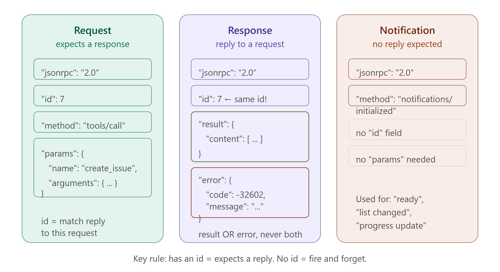
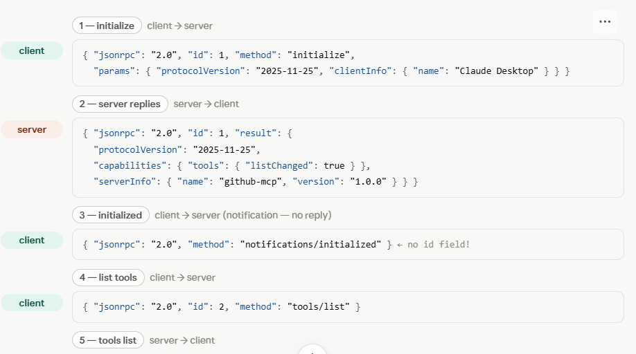
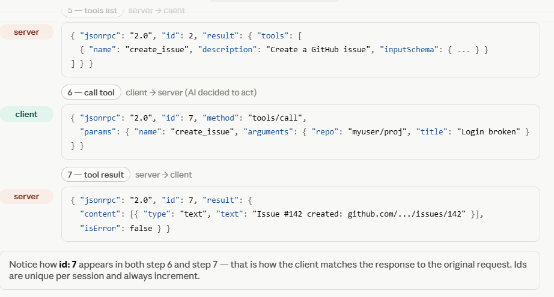
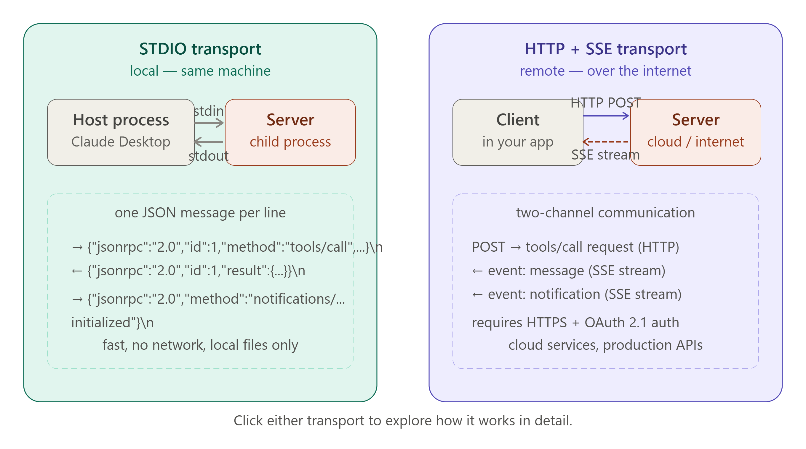
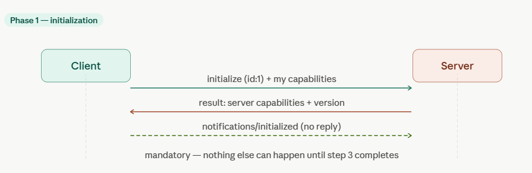
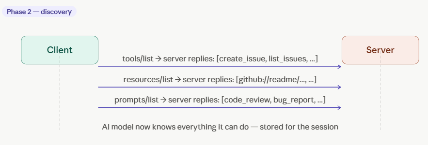
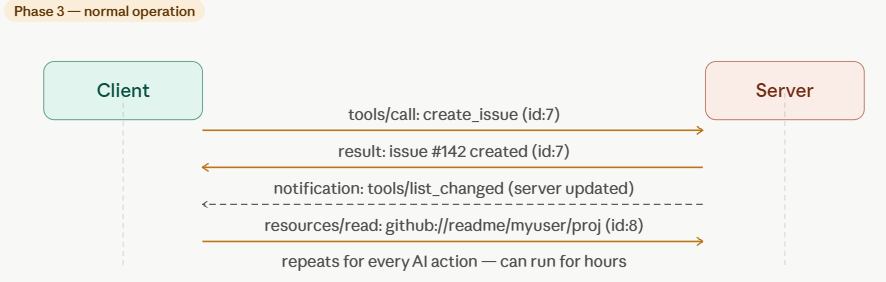
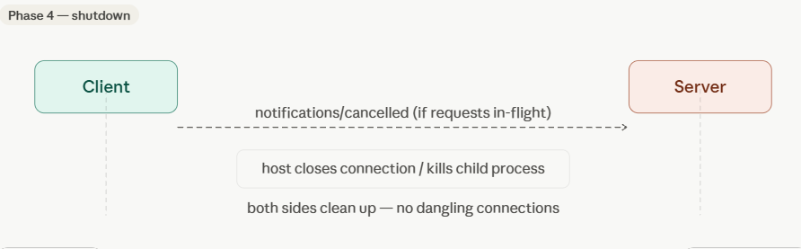

# 📡 Day 4 — How MCP Communicates: JSON-RPC & Transport

> **Goal for today:** Understand the actual messages flying between Client and Server. Learn JSON-RPC 2.0 — the language MCP speaks — and the two transport methods: STDIO (local) and HTTP/SSE (remote).

---

## 📋 Table of Contents

1. [Quick Recap of Day 3](#1-quick-recap-of-day-3)
2. [Why Does MCP Need a Message Format?](#2-why-does-mcp-need-a-message-format)
3. [What is JSON-RPC 2.0?](#3-what-is-json-rpc-20)
4. [The 3 Message Types](#4-the-3-message-types)
5. [Message Type 1 — Request](#5-message-type-1--request)
6. [Message Type 2 — Response](#6-message-type-2--response)
7. [Message Type 3 — Notification](#7-message-type-3--notification)
8. [Real MCP Messages — Full Examples](#8-real-mcp-messages--full-examples)
9. [Transport Layer 1 — STDIO](#9-transport-layer-1--stdio)
10. [Transport Layer 2 — HTTP + SSE](#10-transport-layer-2--http--sse)
11. [STDIO vs HTTP/SSE — Full Comparison](#11-stdio-vs-httpsse--full-comparison)
12. [The Connection Lifecycle](#12-the-connection-lifecycle)
13. [Key Terms to Remember](#13-key-terms-to-remember)
14. [Summary](#14-summary)
15. [Day 4 Quiz — Test Yourself](#15-day-4-quiz--test-yourself)

---

## 1. Quick Recap of Day 3

| Day 3 Concept | One-line reminder                                                           |
| ------------- | --------------------------------------------------------------------------- |
| Tools         | Actions the AI can DO — has side effects                                    |
| Resources     | Data the AI can READ — identified by URI, no side effects                   |
| Prompts       | Templates that GUIDE AI behaviour for specific tasks                        |
| Decision rule | Change something? Tool. Read something? Resource. Structure needed? Prompt. |
| Chaining      | Real tasks combine all 3 primitives in sequence                             |

Today we go one level deeper — not _what_ is exchanged, but _how_ it is physically sent.

---

## 2. Why Does MCP Need a Message Format?

When two programs need to talk to each other, they must agree on:

1. **What language to use** — the format of the message
2. **How to send it** — the transport (pipe, network, etc.)
3. **How to match replies to requests** — so you know which answer belongs to which question

Without a standard, every pair of programs invents their own format and it becomes chaos again (the N×M problem all over again, but for messages).

MCP solves this by adopting **JSON-RPC 2.0** — a simple, well-known, open standard for sending function calls as JSON messages.

---

## 3. What is JSON-RPC 2.0?

### Breaking Down the Name

| Word     | Meaning                                                                                       |
| -------- | --------------------------------------------------------------------------------------------- |
| **JSON** | JavaScript Object Notation — a simple text format for data (you've seen `{ "key": "value" }`) |
| **RPC**  | Remote Procedure Call — calling a function on another machine, as if it were local            |
| **2.0**  | Version 2 of the spec (released 2010, widely used, very stable)                               |

### Simple Analogy

Imagine you want to ask your colleague (who sits in a different office) to look up a file for you. You send them a note that says:

```
Note ID: 42
Request: Please look up the file named "Q3_report.pdf"
```

They look it up and send you back:

```
Note ID: 42  ← same ID so you know it's the answer to your question
Result: [file contents here]
```

This is exactly what JSON-RPC does — but in a computer-readable format.

### What Makes JSON-RPC Special?

- It is **transport-agnostic** — it works over pipes, HTTP, WebSockets, anything
- It is **language-agnostic** — Python, TypeScript, Go, Rust — all can use it
- It is **simple** — just 4 fields in a request, 3 fields in a response
- It is **battle-tested** — used by Bitcoin nodes, VS Code Language Servers, and now MCP

---

## 4. The 3 Message Types



JSON-RPC 2.0 defines exactly 3 types of messages:

```
┌─────────────────────────────────────────────────────┐
│              JSON-RPC 2.0 Message Types             │
│                                                     │
│  1. REQUEST      — "Please do X and tell me result" │
│  2. RESPONSE     — "Here is the result of X"        │
│  3. NOTIFICATION — "FYI: something happened"        │
│                    (no reply expected)              │
│                                                     │
└─────────────────────────────────────────────────────┘
```

The key difference:

- **Requests** have an `id` and expect a **Response** back
- **Notifications** have **no `id`** and expect **no reply**

---

## 5. Message Type 1 — Request

### Structure

```json
{
  "jsonrpc": "2.0",
  "id": 1,
  "method": "tools/call",
  "params": {
    "name": "create_issue",
    "arguments": {
      "repo": "myuser/myproject",
      "title": "Login button broken"
    }
  }
}
```

### Every Field Explained

| Field     | Type             | Required?          | What it means                                                             |
| --------- | ---------------- | ------------------ | ------------------------------------------------------------------------- |
| `jsonrpc` | string           | YES                | Always `"2.0"` — identifies this as JSON-RPC version 2                    |
| `id`      | number or string | YES (for requests) | A unique ID so the response can be matched back to this request           |
| `method`  | string           | YES                | The function you want to call — like `"tools/call"` or `"resources/read"` |
| `params`  | object           | NO (optional)      | The arguments to pass to the function                                     |

### Common MCP Methods

| Method           | What it does                             |
| ---------------- | ---------------------------------------- |
| `initialize`     | Start the session, exchange capabilities |
| `tools/list`     | Ask server what tools it has             |
| `tools/call`     | Call a specific tool                     |
| `resources/list` | Ask server what resources it exposes     |
| `resources/read` | Read a specific resource                 |
| `prompts/list`   | Ask server what prompts it has           |
| `prompts/get`    | Get a specific prompt rendered           |
| `ping`           | Check if the server is alive             |

---

## 6. Message Type 2 — Response

After a Request, the server sends back a Response. There are two kinds:

### Success Response

```json
{
  "jsonrpc": "2.0",
  "id": 1,
  "result": {
    "content": [
      {
        "type": "text",
        "text": "Created issue #142: https://github.com/myuser/myproject/issues/142"
      }
    ]
  }
}
```

### Error Response

```json
{
  "jsonrpc": "2.0",
  "id": 1,
  "error": {
    "code": -32602,
    "message": "Invalid params",
    "data": "The 'repo' field is required but was not provided"
  }
}
```

### Response Fields Explained

| Field     | What it means                                            |
| --------- | -------------------------------------------------------- |
| `jsonrpc` | Always `"2.0"`                                           |
| `id`      | Same ID as the request — this is how you match them      |
| `result`  | Present on success — contains the return value           |
| `error`   | Present on failure — contains the error code and message |

**Rule:** A response has either `result` OR `error` — never both, never neither.

### Standard Error Codes

| Code     | Meaning                                            |
| -------- | -------------------------------------------------- |
| `-32700` | Parse error — message is not valid JSON            |
| `-32600` | Invalid request — missing required fields          |
| `-32601` | Method not found — server doesn't have this method |
| `-32602` | Invalid params — wrong arguments provided          |
| `-32603` | Internal error — something crashed on the server   |

---

## 7. Message Type 3 — Notification

A Notification is a message sent by either side that **does not expect a reply**. It has no `id` field.

```json
{
  "jsonrpc": "2.0",
  "method": "notifications/tools/list_changed"
}
```

### When Are Notifications Used?

| Notification                           | Sent by | Meaning                                         |
| -------------------------------------- | ------- | ----------------------------------------------- |
| `notifications/initialized`            | Client  | "I've finished initialising, ready to go"       |
| `notifications/tools/list_changed`     | Server  | "My list of tools has changed, please re-fetch" |
| `notifications/resources/list_changed` | Server  | "My resources have changed"                     |
| `notifications/progress`               | Server  | "Here's an update on a long-running task"       |
| `notifications/cancelled`              | Either  | "Cancel that request I sent earlier"            |

### Key Rule

> If a message has an `id` field → it is a Request (expects a Response)
> If a message has NO `id` field → it is a Notification (no Response expected)

---

## 8. Real MCP Messages — Full Examples

### Example 1 — Full Initialize Handshake

**Client → Server (Request):**

```json
{
  "jsonrpc": "2.0",
  "id": 1,
  "method": "initialize",
  "params": {
    "protocolVersion": "2025-11-25",
    "capabilities": {
      "roots": { "listChanged": true },
      "sampling": {}
    },
    "clientInfo": {
      "name": "Claude Desktop",
      "version": "1.0.0"
    }
  }
}
```

**Server → Client (Response):**

```json
{
  "jsonrpc": "2.0",
  "id": 1,
  "result": {
    "protocolVersion": "2025-11-25",
    "capabilities": {
      "tools": { "listChanged": true },
      "resources": { "subscribe": true, "listChanged": true },
      "prompts": { "listChanged": true }
    },
    "serverInfo": {
      "name": "github-mcp-server",
      "version": "0.9.1"
    }
  }
}
```

**Client → Server (Notification — no reply expected):**

```json
{
  "jsonrpc": "2.0",
  "method": "notifications/initialized"
}
```

---

### Example 2 — List Available Tools

**Client → Server (Request):**

```json
{
  "jsonrpc": "2.0",
  "id": 2,
  "method": "tools/list"
}
```

**Server → Client (Response):**

```json
{
  "jsonrpc": "2.0",
  "id": 2,
  "result": {
    "tools": [
      {
        "name": "create_issue",
        "description": "Create a new GitHub issue",
        "inputSchema": {
          "type": "object",
          "properties": {
            "repo": { "type": "string", "description": "owner/repo" },
            "title": { "type": "string", "description": "Issue title" },
            "body": { "type": "string", "description": "Issue body" }
          },
          "required": ["repo", "title"]
        }
      },
      {
        "name": "list_issues",
        "description": "List open issues in a repository",
        "inputSchema": {
          "type": "object",
          "properties": {
            "repo": { "type": "string" },
            "state": { "type": "string", "enum": ["open", "closed", "all"] }
          },
          "required": ["repo"]
        }
      }
    ]
  }
}
```

---

### Example 3 — Call a Tool

**Client → Server (Request):**

```json
{
  "jsonrpc": "2.0",
  "id": 7,
  "method": "tools/call",
  "params": {
    "name": "create_issue",
    "arguments": {
      "repo": "myuser/myproject",
      "title": "Login button broken",
      "body": "The login button on the home page is not responding to clicks on mobile Safari."
    }
  }
}
```

**Server → Client (Success Response):**

```json
{
  "jsonrpc": "2.0",
  "id": 7,
  "result": {
    "content": [
      {
        "type": "text",
        "text": "Issue #142 created successfully.\nURL: https://github.com/myuser/myproject/issues/142"
      }
    ],
    "isError": false
  }
}
```

---

### Example 4 — Read a Resource

**Client → Server (Request):**

```json
{
  "jsonrpc": "2.0",
  "id": 9,
  "method": "resources/read",
  "params": {
    "uri": "github://readme/myuser/myproject"
  }
}
```

**Server → Client (Response):**

```json
{
  "jsonrpc": "2.0",
  "id": 9,
  "result": {
    "contents": [
      {
        "uri": "github://readme/myuser/myproject",
        "mimeType": "text/markdown",
        "text": "# My Project\n\nA web application for managing customer orders...\n[full README content]"
      }
    ]
  }
}
```




---

## 9. Transport Layer 1 — STDIO

### What is STDIO?

STDIO stands for **Standard Input / Standard Output** — the basic pipes that every program has:

- `stdin` (standard input) — where a program reads data coming in
- `stdout` (standard output) — where a program writes data going out
- `stderr` (standard error) — where a program writes error messages

When you use STDIO transport:

- The **Host spawns the MCP Server** as a child process (like running a program in the terminal)
- The Host writes JSON-RPC messages to the server's **stdin**
- The Server writes JSON-RPC responses to its **stdout**
- The Server writes logs/errors to **stderr** (the host can display these as debug info)

### How it Looks

```
HOST PROCESS
│
├── starts → SERVER PROCESS (as child)
│
│   HOST writes to server's stdin:
│   {"jsonrpc":"2.0","id":1,"method":"initialize",...}\n
│
│   SERVER writes to its stdout:
│   {"jsonrpc":"2.0","id":1,"result":{...}}\n
│
│   Each message is one line, ended with \n (newline)
│
└── when host closes → server process terminates
```

### Config in Claude Desktop

```json
{
  "mcpServers": {
    "filesystem": {
      "command": "npx",
      "args": [
        "-y",
        "@modelcontextprotocol/server-filesystem",
        "/Users/yourname/projects"
      ]
    },
    "github": {
      "command": "python",
      "args": ["-m", "github_mcp_server"],
      "env": {
        "GITHUB_TOKEN": "ghp_your_token_here"
      }
    }
  }
}
```

Each entry tells Claude Desktop:

- What command to run to start the server
- What arguments to pass
- What environment variables to set (like API tokens)

### STDIO Characteristics

| Property | Value                                              |
| -------- | -------------------------------------------------- |
| Speed    | Very fast — no network, just memory pipes          |
| Setup    | Simple — just run a command                        |
| Security | High — server runs on your machine, no internet    |
| Distance | Local only — server must be on the same machine    |
| Best for | Files, local databases, local scripts, development |

---

## 10. Transport Layer 2 — HTTP + SSE

### What is HTTP + SSE?

For remote servers (running on the internet), MCP uses two web technologies together:

**HTTP (HyperText Transfer Protocol):**

- The standard protocol for web requests
- Client sends a request → Server sends one response → connection closes
- Used for: sending tool calls, resource reads, initialization

**SSE (Server-Sent Events):**

- A technology for the server to push messages to the client over a long-lived connection
- Like a one-way stream: server → client
- Used for: server sending back results, progress notifications, streaming updates

### Why Both?

HTTP alone is request-response — you send one, you get one. But MCP servers sometimes need to:

- Send progress updates during a long-running tool
- Notify the client that the tool list changed
- Stream results back as they're generated

SSE solves this — it's a persistent connection where the server can push data at any time.

### How it Works

```
CLIENT                              SERVER (remote)
   │                                     │
   │─── GET /sse ────────────────────────►│  Open SSE stream (stays open)
   │◄─── event: endpoint ────────────────│  Server sends the POST endpoint URL
   │                                     │
   │─── POST /messages ─────────────────►│  Client sends requests via HTTP POST
   │                                     │
   │◄─── event: message (SSE) ───────────│  Server sends responses via SSE stream
   │◄─── event: notification (SSE) ──────│  Server sends notifications via SSE
   │                                     │
   │─── POST /messages ─────────────────►│  More requests...
   │◄─── event: message (SSE) ───────────│  More responses...
```

### The 2025 Update — Streamable HTTP

In the MCP 2025-11-25 spec update, a newer transport was introduced: **Streamable HTTP**. This simplifies the original SSE approach:

- Single endpoint (just `POST /mcp`)
- Server can respond with either a regular HTTP response OR an SSE stream
- Simpler to implement and deploy
- The old HTTP+SSE is still supported but Streamable HTTP is now preferred

### HTTP/SSE Characteristics

| Property | Value                                                         |
| -------- | ------------------------------------------------------------- |
| Speed    | Slightly slower — network round-trips                         |
| Setup    | More complex — needs a web server, SSL, auth                  |
| Security | Requires OAuth 2.1, HTTPS                                     |
| Distance | Works anywhere on the internet                                |
| Best for | Cloud services (GitHub, Slack, Google Drive), production APIs |

---

## 11. STDIO vs HTTP/SSE — Full Comparison



| Feature                    | STDIO                                         | HTTP + SSE                            |
| -------------------------- | --------------------------------------------- | ------------------------------------- |
| **Where server runs**      | Your computer                                 | The internet                          |
| **How server starts**      | Host spawns it as a child process             | Already running on a web server       |
| **Message transport**      | stdin/stdout pipes                            | HTTP POST + SSE stream                |
| **Speed**                  | Fastest — in-memory                           | Slower — network latency              |
| **Authentication**         | Not needed (same machine)                     | OAuth 2.1 required                    |
| **Security**               | High (local only)                             | Must use HTTPS + OAuth                |
| **Can access your files?** | Yes directly                                  | Only if you give it access            |
| **Setup complexity**       | Low (run a command)                           | High (web server, SSL, auth)          |
| **Good for**               | Files, local DBs, scripts, development        | GitHub, Slack, cloud APIs, production |
| **Example**                | `npx @modelcontextprotocol/server-filesystem` | `https://api.github.com/mcp`          |

### Decision Rule

```
Server needs access to LOCAL resources (files, local DB, scripts)?
→ Use STDIO

Server provides access to CLOUD services (GitHub, Slack, Google Drive)?
→ Use HTTP + SSE
```

---

## 12. The Connection Lifecycle

Every MCP session follows a strict lifecycle, regardless of which transport is used:

### Phase 1 — Initialization



```
Client sends:  initialize (Request with capabilities)
Server sends:  initialize response (with its capabilities)
Client sends:  notifications/initialized (Notification — no reply)

Result: Both sides know what the other can do.
```

### Phase 2 — Discovery



```
Client sends:  tools/list (Request)
Server sends:  tools/list response (list of all tools)

Client sends:  resources/list (Request)
Server sends:  resources/list response (list of all resources)

Client sends:  prompts/list (Request)
Server sends:  prompts/list response (list of all prompts)

Result: AI model knows all available capabilities.
```

### Phase 3 — Normal Operation



```
[Repeat as many times as needed during the session]

Client sends:  tools/call or resources/read or prompts/get (Request)
Server sends:  result or error (Response)
Server sends:  notifications as needed (Notification — no reply)
```

### Phase 4 — Shutdown



```
Client sends:  notifications/cancelled (if any requests are in flight)
Host closes the connection / terminates the server process

Result: Clean shutdown.
```

### The Lifecycle as a State Machine

```
[Unconnected]
     │
     │  Host starts server
     ▼
[Initializing]
     │
     │  initialize ↔ response ↔ notifications/initialized
     ▼
[Discovering]
     │
     │  tools/list, resources/list, prompts/list
     ▼
[Ready]  ◄────────────────────────────┐
     │                                │
     │  tools/call                    │
     │  resources/read                │  more requests
     │  prompts/get                   │
     ▼                                │
[Running]  ──────────────────────────►┘
     │
     │  Host closes connection
     ▼
[Closed]
```

---

## 13. Key Terms to Remember

| Term                | Simple Explanation                                                          |
| ------------------- | --------------------------------------------------------------------------- |
| **JSON-RPC 2.0**    | The message format MCP uses — function calls as JSON                        |
| **Request**         | A JSON-RPC message with an `id` — expects a Response                        |
| **Response**        | Reply to a Request — has same `id`, contains `result` or `error`            |
| **Notification**    | A JSON-RPC message without `id` — no reply expected                         |
| **`method`**        | The function being called (e.g. `"tools/call"`, `"resources/read"`)         |
| **`params`**        | The arguments passed with the method                                        |
| **`id`**            | Unique identifier to match a Response to its Request                        |
| **`result`**        | Success data in a Response                                                  |
| **`error`**         | Error data in a Response (code + message)                                   |
| **STDIO**           | Standard Input/Output — transport for local servers (fast, simple)          |
| **HTTP**            | HyperText Transfer Protocol — used for sending requests to remote servers   |
| **SSE**             | Server-Sent Events — a stream for the server to push messages to the client |
| **Streamable HTTP** | Newer MCP transport (2025) — single endpoint, simpler than HTTP+SSE         |
| **Transport**       | The physical mechanism used to send messages (pipes, HTTP, etc.)            |
| **Lifecycle**       | The sequence of phases: Initialize → Discover → Operate → Close             |
| **Child process**   | A program started by another program (how STDIO servers are launched)       |
| **stdin**           | Standard Input — where a program receives incoming data                     |
| **stdout**          | Standard Output — where a program sends outgoing data                       |
| **OAuth 2.1**       | The authentication protocol used for remote MCP servers                     |

---

## 14. Summary

### What You Learned Today ✅

**JSON-RPC 2.0:**

- The message format MCP uses — simple JSON with `jsonrpc`, `id`, `method`, `params`
- 3 message types: Request (has id, expects response), Response (has id, has result or error), Notification (no id, no reply)
- Standard methods: `initialize`, `tools/list`, `tools/call`, `resources/read`, `prompts/get`

**Transport Layer 1 — STDIO:**

- For local servers running on your machine
- Host spawns server as a child process
- Messages flow through stdin/stdout pipes
- Fast, simple, secure, best for local files and development

**Transport Layer 2 — HTTP + SSE:**

- For remote servers running on the internet
- Client sends requests via HTTP POST
- Server sends responses and notifications via SSE stream
- Requires HTTPS and OAuth 2.1 authentication

**The Connection Lifecycle:**

1. Initialize — exchange capabilities
2. Discover — learn what tools/resources/prompts are available
3. Operate — normal tool calls and resource reads
4. Close — clean shutdown

### The One-Sentence Explanation (for teaching others)

> "MCP uses JSON-RPC 2.0 — simple JSON messages with a method name and parameters — sent over either local pipes (STDIO) for servers on your machine, or HTTP and SSE for servers on the internet."

---

## 15. Day 4 Quiz — Test Yourself

**Q1.** What does JSON-RPC stand for? Explain each word.

**Q2.** What are the 3 message types in JSON-RPC? How do you tell them apart?

**Q3.** What is the purpose of the `id` field in a JSON-RPC message? What happens if a message has no `id`?

**Q4.** Write a JSON-RPC Request message to call the `send_slack_message` tool with `channel="#general"` and `text="Deployment complete"`.

**Q5.** A server returns this response — what went wrong?

```json
{
  "jsonrpc": "2.0",
  "id": 5,
  "error": { "code": -32601, "message": "Method not found" }
}
```

**Q6.** What is STDIO transport? How does the Host start a STDIO server?

**Q7.** Why does HTTP/SSE use two technologies instead of just HTTP?

**Q8.** You are building a server that reads files from your laptop. Which transport should you use and why?

**Q9.** You are building a server that connects to the Slack API. Which transport should you use and why?

**Q10.** List the 4 phases of the MCP connection lifecycle in order.

---

> **Tomorrow — Day 5:** We stop reading and start **building**. You will write your own MCP server from scratch in Python — with a Tool, a Resource, and a Prompt — and connect it to Claude Desktop.

---

_MCP Specification Reference: modelcontextprotocol.io_
_Version covered: MCP 2025-11-25_
