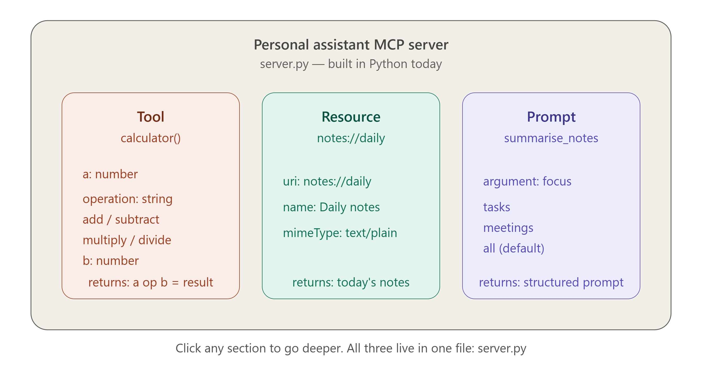
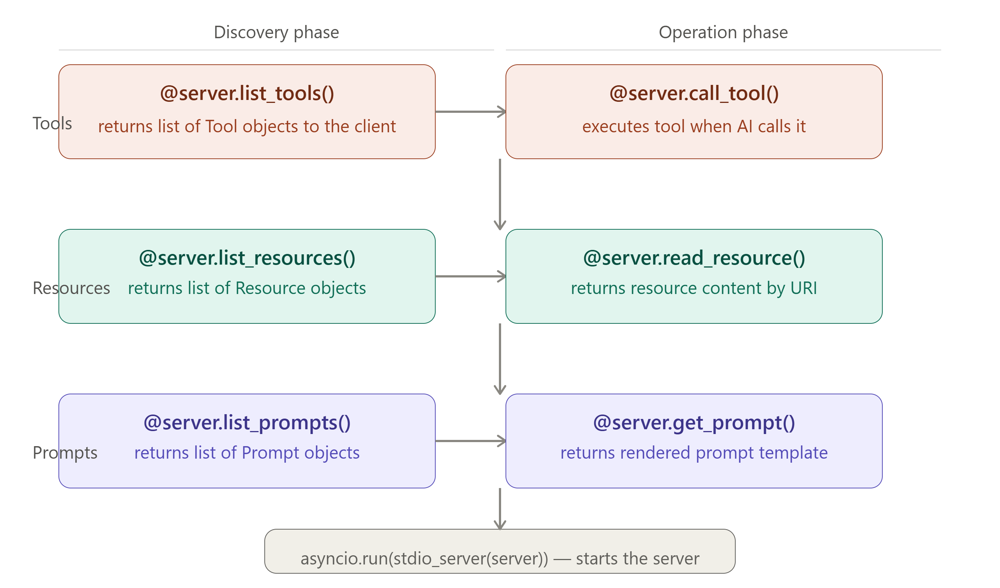

# 🛠️ Day 5 — Build Your First MCP Server in Python

> **Goal for today:** Stop reading, start building. Write a complete working MCP server from scratch in Python — with a Tool, a Resource, and a Prompt — then connect it to Claude Desktop and see it work live.

---

## 📋 Table of Contents

1. [Quick Recap of Day 4](#1-quick-recap-of-day-4)
2. [What We Are Building Today](#2-what-we-are-building-today)
3. [Setup — Install the Python SDK](#3-setup--install-the-python-sdk)
4. [Step 1 — The Minimal Server (5 Lines)](#4-step-1--the-minimal-server-5-lines)
5. [Step 2 — Add Your First Tool](#5-step-2--add-your-first-tool)
6. [Step 3 — Add a Resource](#6-step-3--add-a-resource)
7. [Step 4 — Add a Prompt](#7-step-4--add-a-prompt)
8. [Step 5 — The Complete Server](#8-step-5--the-complete-server)
9. [Step 6 — Connect to Claude Desktop](#9-step-6--connect-to-claude-desktop)
10. [Step 7 — Test It Live](#10-step-7--test-it-live)
11. [Common Errors and Fixes](#11-common-errors-and-fixes)
12. [Bonus — Add More Tools](#12-bonus--add-more-tools)
13. [Key Terms to Remember](#13-key-terms-to-remember)
14. [Summary](#14-summary)
15. [Day 5 Quiz — Test Yourself](#15-day-5-quiz--test-yourself)

---

## 1. Quick Recap of Day 4

| Day 4 Concept | One-line reminder                                                 |
| ------------- | ----------------------------------------------------------------- |
| JSON-RPC 2.0  | The message format MCP uses — JSON with method, params, id        |
| Request       | Has an `id` — expects a Response                                  |
| Response      | Same `id` as Request — has `result` or `error`                    |
| Notification  | No `id` — no reply expected                                       |
| STDIO         | Local servers — host spawns child process, uses stdin/stdout      |
| HTTP + SSE    | Remote servers — HTTP POST for requests, SSE stream for responses |
| Lifecycle     | Initialize → Discover → Operate → Close                           |

Today all of that theory becomes real code you can run and touch.

---

## 2. What We Are Building Today

We will build a **Personal Assistant MCP Server** — a server that gives Claude three capabilities:


```
┌─────────────────────────────────────────────────────────┐
│          Personal Assistant MCP Server                  │
│                                                         │
│  TOOL:     calculator(a, op, b)                         │
│            → performs math operations for Claude        │
│                                                         │
│  RESOURCE: notes://daily                                │
│            → gives Claude access to your daily notes    │
│                                                         │
│  PROMPT:   summarise_notes                              │
│            → a structured template for note summaries   │
│                                                         │
└─────────────────────────────────────────────────────────┘
```

By the end of today, you will be able to ask Claude:

- _"What is 847 × 23?"_ → Claude uses your calculator tool
- _"What are my notes for today?"_ → Claude reads your notes resource
- _"Summarise my notes"_ → Claude uses your prompt template

---

## 3. Setup — Install the Python SDK



### Prerequisites

You need:

- **Python 3.10 or higher** (`python --version` to check)
- **pip** (comes with Python)
- **Claude Desktop** installed (download from claude.ai)

### Install the MCP Python SDK

```bash
pip install mcp
```

That is all. The MCP SDK includes everything you need:

- The `Server` class
- Tool, Resource, Prompt types
- STDIO transport runner

### Verify the install

```bash
python -c "import mcp; print('MCP version:', mcp.__version__)"
```

You should see something like: `MCP version: 1.0.0`

### Create your project folder

```bash
mkdir my_mcp_server
cd my_mcp_server
touch server.py
```

---

## 4. Step 1 — The Minimal Server (5 Lines)

Open `server.py` and write this:

```python
from mcp.server import Server
from mcp.server.stdio import stdio_server
import asyncio

server = Server("my-assistant")

if __name__ == "__main__":
    asyncio.run(stdio_server(server))
```

### What Each Line Does

| Line                                        | What it does                                   |
| ------------------------------------------- | ---------------------------------------------- |
| `from mcp.server import Server`             | Import the Server class from the MCP SDK       |
| `from mcp.server.stdio import stdio_server` | Import the STDIO transport runner              |
| `import asyncio`                            | Python's async library — MCP servers are async |
| `server = Server("my-assistant")`           | Create a server instance with a name           |
| `asyncio.run(stdio_server(server))`         | Start the server using STDIO transport         |

### Run it

```bash
python server.py
```

The server starts and waits for input on stdin. Press `Ctrl+C` to stop. It works! But it has no tools yet.

---

## 5. Step 2 — Add Your First Tool

Now let's add the calculator tool. Update `server.py`:

```python
from mcp.server import Server
from mcp.server.stdio import stdio_server
from mcp.types import Tool, TextContent
import asyncio

server = Server("my-assistant")

# ─────────────────────────────────────────────
# TOOLS
# ─────────────────────────────────────────────

@server.list_tools()
async def list_tools():
    """Tell the client what tools this server has"""
    return [
        Tool(
            name="calculator",
            description="Perform basic math: add, subtract, multiply, divide",
            inputSchema={
                "type": "object",
                "properties": {
                    "a": {
                        "type": "number",
                        "description": "The first number"
                    },
                    "operation": {
                        "type": "string",
                        "enum": ["add", "subtract", "multiply", "divide"],
                        "description": "The math operation to perform"
                    },
                    "b": {
                        "type": "number",
                        "description": "The second number"
                    }
                },
                "required": ["a", "operation", "b"]
            }
        )
    ]

@server.call_tool()
async def call_tool(name: str, arguments: dict):
    """Execute a tool when the AI calls it"""
    if name == "calculator":
        a = arguments["a"]
        b = arguments["b"]
        op = arguments["operation"]

        if op == "add":
            result = a + b
        elif op == "subtract":
            result = a - b
        elif op == "multiply":
            result = a * b
        elif op == "divide":
            if b == 0:
                return [TextContent(
                    type="text",
                    text="Error: Cannot divide by zero"
                )]
            result = a / b
        else:
            return [TextContent(type="text", text=f"Unknown operation: {op}")]

        return [TextContent(
            type="text",
            text=f"{a} {op} {b} = {result}"
        )]

    return [TextContent(type="text", text=f"Unknown tool: {name}")]

if __name__ == "__main__":
    asyncio.run(stdio_server(server))
```

### Understanding the Two Decorators

**`@server.list_tools()`**

- Called during the Discovery phase
- Returns a list of all Tool objects
- Each Tool has a `name`, `description`, and `inputSchema`
- The `inputSchema` is JSON Schema — tells the AI what arguments to pass

**`@server.call_tool()`**

- Called during Normal Operation when AI wants to use a tool
- Receives `name` (which tool) and `arguments` (the values)
- Must return a list of `TextContent` objects
- The text content is what the AI reads as the tool's result

### Understanding inputSchema

The `inputSchema` is a **JSON Schema** object that defines:

- `type`: the top-level type (always "object" for tool arguments)
- `properties`: each argument and its type/description
- `required`: which arguments must be provided (can't be skipped)

```python
"inputSchema": {
    "type": "object",           # always "object"
    "properties": {
        "a": {                  # argument name
            "type": "number",   # data type: number, string, boolean, array
            "description": "The first number"  # helps AI understand what to pass
        }
    },
    "required": ["a", "b"]     # these must always be provided
}
```

---

## 6. Step 3 — Add a Resource

Now add a Resource — your daily notes. Extend `server.py` by adding after the tools section:

```python
from mcp.types import Tool, Resource, TextContent
import datetime

# ─────────────────────────────────────────────
# RESOURCES
# ─────────────────────────────────────────────

@server.list_resources()
async def list_resources():
    """Tell the client what resources are available"""
    today = datetime.date.today().isoformat()
    return [
        Resource(
            uri="notes://daily",
            name=f"Daily Notes — {today}",
            description="Your personal notes for today",
            mimeType="text/plain"
        )
    ]

@server.read_resource()
async def read_resource(uri: str):
    """Return the content of a resource when the AI requests it"""
    if uri == "notes://daily":
        today = datetime.date.today().isoformat()
        notes = f"""Daily Notes — {today}

Morning:
- Team standup at 9am: discussed Q3 roadmap progress
- Review PR #245 for the authentication refactor
- Meeting with design team about new dashboard UI

Afternoon:
- Write unit tests for the payment module
- Update documentation for the API endpoints
- 3pm call with the product manager

Evening:
- Learn MCP Day 5 — build first server!
- Read the MCP specification section on Resources
"""
        return [TextContent(type="text", text=notes)]

    raise ValueError(f"Unknown resource URI: {uri}")
```

### Understanding the Two Resource Decorators

**`@server.list_resources()`**

- Returns a list of `Resource` objects describing what is available
- Each Resource needs a `uri` (unique address), `name`, `description`, `mimeType`
- Called during Discovery so the AI knows what it can read

**`@server.read_resource()`**

- Called when the AI wants to actually read a resource
- Receives the `uri` of the resource requested
- Must return a list of `TextContent` (or `BlobContent` for binary)
- If the URI is unknown, raise a `ValueError`

### Real-World Resource Ideas

Instead of hardcoded notes, a real server might:

```python
# Read from a real file
with open(f"/home/user/notes/{today}.txt") as f:
    content = f.read()

# Read from a database
cursor.execute("SELECT content FROM notes WHERE date = ?", [today])
content = cursor.fetchone()[0]

# Fetch from an API
response = requests.get(f"https://api.notion.com/pages/{page_id}")
content = response.json()["content"]
```

---

## 7. Step 4 — Add a Prompt

Finally, add a Prompt — a structured template for summarising notes:

```python
from mcp.types import Tool, Resource, Prompt, PromptMessage, TextContent

# ─────────────────────────────────────────────
# PROMPTS
# ─────────────────────────────────────────────

@server.list_prompts()
async def list_prompts():
    """Tell the client what prompt templates are available"""
    return [
        Prompt(
            name="summarise_notes",
            description="Summarise daily notes into key actions and priorities",
            arguments=[
                {
                    "name": "focus",
                    "description": "What to focus on: 'tasks', 'meetings', or 'all'",
                    "required": False
                }
            ]
        )
    ]

@server.get_prompt()
async def get_prompt(name: str, arguments: dict | None):
    """Return the rendered prompt template"""
    if name == "summarise_notes":
        focus = (arguments or {}).get("focus", "all")

        if focus == "tasks":
            instruction = "Focus only on action items and tasks. List them with priority."
        elif focus == "meetings":
            instruction = "Focus only on meetings and discussions. Who was involved and what was decided."
        else:
            instruction = "Provide a complete summary covering tasks, meetings, and key highlights."

        return {
            "messages": [
                PromptMessage(
                    role="user",
                    content=TextContent(
                        type="text",
                        text=f"""Please summarise my daily notes with the following structure:

1. Key highlights (2-3 bullet points)
2. Action items (numbered list with priority)
3. Meetings attended (brief recap)
4. Unfinished items to carry forward

Focus: {instruction}

Please be concise and actionable."""
                    )
                )
            ]
        }

    raise ValueError(f"Unknown prompt: {name}")
```

### Understanding the Two Prompt Decorators

**`@server.list_prompts()`**

- Returns a list of `Prompt` objects describing available templates
- Each Prompt has a `name`, `description`, and optional `arguments`
- Arguments are not required — but they let users customise the prompt

**`@server.get_prompt()`**

- Called when the AI or user wants to use a specific prompt
- Receives `name` and optional `arguments`
- Returns a dict with a `messages` list of `PromptMessage` objects
- Each PromptMessage has a `role` ("user" or "assistant") and `content`

---

## 8. Step 5 — The Complete Server

Here is the full `server.py` — everything together:

```python
# server.py — My First MCP Server
# Run with: python server.py

from mcp.server import Server
from mcp.server.stdio import stdio_server
from mcp.types import Tool, Resource, Prompt, PromptMessage, TextContent
import asyncio
import datetime

# Create the server
server = Server("my-assistant")

# ─────────────────────────────────────────────
# TOOLS — things the AI can DO
# ─────────────────────────────────────────────

@server.list_tools()
async def list_tools():
    return [
        Tool(
            name="calculator",
            description="Perform basic math: add, subtract, multiply, divide",
            inputSchema={
                "type": "object",
                "properties": {
                    "a":         {"type": "number", "description": "First number"},
                    "operation": {"type": "string",
                                  "enum": ["add", "subtract", "multiply", "divide"],
                                  "description": "Math operation"},
                    "b":         {"type": "number", "description": "Second number"}
                },
                "required": ["a", "operation", "b"]
            }
        )
    ]

@server.call_tool()
async def call_tool(name: str, arguments: dict):
    if name == "calculator":
        a   = arguments["a"]
        b   = arguments["b"]
        op  = arguments["operation"]

        if op == "add":        result = a + b
        elif op == "subtract": result = a - b
        elif op == "multiply": result = a * b
        elif op == "divide":
            if b == 0:
                return [TextContent(type="text", text="Error: Division by zero")]
            result = a / b
        else:
            return [TextContent(type="text", text=f"Unknown operation: {op}")]

        return [TextContent(type="text", text=f"{a} {op} {b} = {result}")]

    return [TextContent(type="text", text=f"Unknown tool: {name}")]

# ─────────────────────────────────────────────
# RESOURCES — data the AI can READ
# ─────────────────────────────────────────────

@server.list_resources()
async def list_resources():
    today = datetime.date.today().isoformat()
    return [
        Resource(
            uri="notes://daily",
            name=f"Daily Notes — {today}",
            description="Your personal notes for today",
            mimeType="text/plain"
        )
    ]

@server.read_resource()
async def read_resource(uri: str):
    if uri == "notes://daily":
        today = datetime.date.today().isoformat()
        return [TextContent(type="text", text=f"""Daily Notes — {today}

Morning:
- Team standup at 9am: discussed Q3 roadmap progress
- Review PR #245 for the authentication refactor
- Meeting with design team about new dashboard UI

Afternoon:
- Write unit tests for the payment module
- Update documentation for the API endpoints
- 3pm call with the product manager

Evening:
- Learn MCP Day 5 — build first server!
""")]
    raise ValueError(f"Unknown resource: {uri}")

# ─────────────────────────────────────────────
# PROMPTS — templates that GUIDE the AI
# ─────────────────────────────────────────────

@server.list_prompts()
async def list_prompts():
    return [
        Prompt(
            name="summarise_notes",
            description="Summarise daily notes into key actions and priorities",
            arguments=[
                {"name": "focus",
                 "description": "tasks, meetings, or all",
                 "required": False}
            ]
        )
    ]

@server.get_prompt()
async def get_prompt(name: str, arguments: dict | None):
    if name == "summarise_notes":
        focus = (arguments or {}).get("focus", "all")
        instruction = {
            "tasks":    "Focus only on tasks and action items with priority.",
            "meetings": "Focus only on meetings — who attended and what was decided.",
        }.get(focus, "Complete summary: tasks, meetings, and highlights.")

        return {
            "messages": [PromptMessage(
                role="user",
                content=TextContent(type="text", text=f"""Summarise my daily notes:

1. Key highlights (2-3 bullets)
2. Action items (numbered, prioritised)
3. Meetings recap
4. Items to carry forward tomorrow

Focus: {instruction}""")
            )]
        }
    raise ValueError(f"Unknown prompt: {name}")

# ─────────────────────────────────────────────
# START THE SERVER
# ─────────────────────────────────────────────

if __name__ == "__main__":
    asyncio.run(stdio_server(server))
```

---

## 9. Step 6 — Connect to Claude Desktop

Now let's connect your server to Claude Desktop.

### Find the config file

| Operating System | Config file location                                              |
| ---------------- | ----------------------------------------------------------------- |
| **macOS**        | `~/Library/Application Support/Claude/claude_desktop_config.json` |
| **Windows**      | `%APPDATA%\Claude\claude_desktop_config.json`                     |
| **Linux**        | `~/.config/Claude/claude_desktop_config.json`                     |

### Edit the config

Open the file (create it if it doesn't exist) and add:

```json
{
  "mcpServers": {
    "my-assistant": {
      "command": "python",
      "args": ["/full/path/to/your/server.py"]
    }
  }
}
```

**Replace** `/full/path/to/your/server.py` with the actual path to your file.

**Examples:**

```json
// macOS / Linux
{
  "mcpServers": {
    "my-assistant": {
      "command": "python3",
      "args": ["/Users/yourname/my_mcp_server/server.py"]
    }
  }
}

// Windows
{
  "mcpServers": {
    "my-assistant": {
      "command": "python",
      "args": ["C:\\Users\\yourname\\my_mcp_server\\server.py"]
    }
  }
}
```

### Restart Claude Desktop

1. Quit Claude Desktop completely
2. Reopen it
3. Look for the **plug icon** (🔌) in the bottom left of the chat window
4. Click it — you should see "my-assistant" listed with your tools

If you see a green dot next to "my-assistant", your server is connected!

---

## 10. Step 7 — Test It Live

Once connected, try these prompts in Claude Desktop:

### Test the Tool

```
What is 847 multiplied by 23?
```

Claude should call your `calculator` tool and return `19481`.

```
Calculate 1000 divided by 7
```

Claude should return `142.857...`

### Test the Resource

```
What are my daily notes for today?
```

Claude should read your `notes://daily` resource and show you the notes.

```
Can you read my notes and tell me what I need to do this afternoon?
```

Claude reads the resource and extracts the afternoon tasks.

### Test the Prompt

```
Summarise my notes
```

Claude should use the `summarise_notes` prompt template.

```
Summarise my notes focusing on tasks only
```

Claude uses the prompt with `focus="tasks"`.

### Verify Tool Usage in Claude Desktop

In Claude Desktop, when a tool is called, you will see a small widget showing:

```
Used my-assistant: calculator
  a: 847, operation: "multiply", b: 23
  → 847 multiply 23 = 19481
```

This confirms your MCP server is working!

---

## 11. Common Errors and Fixes

### Error 1: Server not appearing in Claude Desktop

**Symptom:** No plug icon, or "my-assistant" not listed

**Fixes:**

```bash
# Check Python path
which python3  # macOS/Linux
where python   # Windows

# Use full path in config
{
  "mcpServers": {
    "my-assistant": {
      "command": "/usr/bin/python3",   # use full path
      "args": ["/Users/you/server.py"]
    }
  }
}
```

### Error 2: ImportError — mcp not found

**Symptom:** `ModuleNotFoundError: No module named 'mcp'`

**Fix:**

```bash
# Make sure you installed for the right Python version
python3 -m pip install mcp

# Or if using a virtual environment
source venv/bin/activate
pip install mcp
```

### Error 3: JSON decode error

**Symptom:** Server crashes with `JSONDecodeError`

**Cause:** Something is printing to stdout that isn't valid JSON. MCP uses stdout for messages — ANY print statement will break it.

**Fix:**

```python
# WRONG — breaks MCP
print("Server started!")

# RIGHT — use stderr for logging
import sys
print("Server started!", file=sys.stderr)
```

### Error 4: Tool not being called

**Symptom:** Claude answers without using your tool

**Fixes:**

- Make the `description` clearer — Claude uses this to decide when to call the tool
- Be more explicit in your prompt: _"Use the calculator tool to work out 847 × 23"_
- Check the tool name matches exactly between `list_tools` and `call_tool`

### Error 5: async errors

**Symptom:** `RuntimeError: coroutine was never awaited`

**Cause:** Forgot `async def` or `await` somewhere

**Fix:**

```python
# WRONG
@server.list_tools()
def list_tools():        # ← missing async
    return [...]

# RIGHT
@server.list_tools()
async def list_tools():  # ← async required
    return [...]
```

### Viewing server logs

Add debug logging to stderr:

```python
import sys
import logging

logging.basicConfig(
    stream=sys.stderr,
    level=logging.DEBUG,
    format='%(asctime)s %(levelname)s %(message)s'
)
logger = logging.getLogger(__name__)

@server.call_tool()
async def call_tool(name: str, arguments: dict):
    logger.debug(f"Tool called: {name} with {arguments}")
    ...
```

Claude Desktop shows stderr output in its developer tools (`Cmd+Shift+I` on Mac).

---

## 12. Bonus — Add More Tools

Once the basic server works, try extending it:

### Tool: Get Current Time

```python
Tool(
    name="get_time",
    description="Get the current date and time",
    inputSchema={
        "type": "object",
        "properties": {
            "timezone": {
                "type": "string",
                "description": "Timezone name (e.g. 'Asia/Kolkata', 'UTC')",
                "default": "UTC"
            }
        }
    }
)

# In call_tool:
if name == "get_time":
    now = datetime.datetime.now()
    return [TextContent(type="text", text=f"Current time: {now.strftime('%Y-%m-%d %H:%M:%S')}")]
```

### Tool: Word Counter

```python
Tool(
    name="count_words",
    description="Count words, characters, and sentences in a text",
    inputSchema={
        "type": "object",
        "properties": {
            "text": {"type": "string", "description": "The text to analyse"}
        },
        "required": ["text"]
    }
)

# In call_tool:
if name == "count_words":
    text = arguments["text"]
    words = len(text.split())
    chars = len(text)
    sentences = text.count('.') + text.count('!') + text.count('?')
    return [TextContent(type="text",
        text=f"Words: {words} | Characters: {chars} | Sentences: {sentences}")]
```

### Resource: Weekly Goals

```python
Resource(
    uri="notes://weekly-goals",
    name="Weekly Goals",
    description="Your goals for this week",
    mimeType="text/plain"
)

# In read_resource:
if uri == "notes://weekly-goals":
    return [TextContent(type="text", text="""Weekly Goals:
1. Complete MCP learning (Days 1-7)
2. Build and deploy a personal MCP server
3. Read the full MCP specification
4. Teach one concept to a colleague""")]
```

---

## 13. Key Terms to Remember

| Term                         | Simple Explanation                                                         |
| ---------------------------- | -------------------------------------------------------------------------- |
| `Server("name")`             | Creates a new MCP server instance with a unique name                       |
| `@server.list_tools()`       | Decorator — registers the function that lists available tools              |
| `@server.call_tool()`        | Decorator — registers the function that executes tool calls                |
| `@server.list_resources()`   | Decorator — registers the function that lists available resources          |
| `@server.read_resource()`    | Decorator — registers the function that returns resource content           |
| `@server.list_prompts()`     | Decorator — registers the function that lists available prompts            |
| `@server.get_prompt()`       | Decorator — registers the function that returns rendered prompts           |
| `Tool`                       | Type class representing a tool definition (name, description, inputSchema) |
| `Resource`                   | Type class representing a resource definition (uri, name, mimeType)        |
| `Prompt`                     | Type class representing a prompt definition (name, description, arguments) |
| `TextContent`                | Return type for tool results and resource content                          |
| `PromptMessage`              | A single message in a prompt template (role + content)                     |
| `inputSchema`                | JSON Schema defining what arguments a tool accepts                         |
| `stdio_server`               | The function that starts the server using STDIO transport                  |
| `async/await`                | Python async syntax — required because MCP servers are asynchronous        |
| `decorator`                  | The `@` syntax that registers a function to handle MCP requests            |
| `claude_desktop_config.json` | The file that tells Claude Desktop which MCP servers to connect to         |

---

## 14. Summary

### What You Built Today ✅

A complete, working MCP server in Python with all 3 primitives:

- **Tool** (`calculator`): accepts arguments `a`, `operation`, `b`, performs math, returns result
- **Resource** (`notes://daily`): returns your daily notes as text
- **Prompt** (`summarise_notes`): a structured template for summarising notes with optional `focus` argument

Connected it to Claude Desktop via `claude_desktop_config.json` and tested all three primitives live.

### The Pattern to Remember

Every MCP server in Python follows this exact pattern:

```python
server = Server("name")

@server.list_tools()     → what tools exist?
@server.call_tool()      → execute this tool

@server.list_resources() → what resources exist?
@server.read_resource()  → read this resource

@server.list_prompts()   → what prompts exist?
@server.get_prompt()     → render this prompt

asyncio.run(stdio_server(server))
```

Six decorators. That is the whole pattern. Everything else is your business logic inside those functions.

### The One-Sentence Explanation (for teaching others)

> "An MCP server in Python is just a Server object with six decorator functions — list and handle each of the three primitives — then run it with stdio_server."

---

## 15. Day 5 Quiz — Test Yourself

**Q1.** What command installs the MCP Python SDK?

**Q2.** What are the 6 decorator functions every MCP server uses? (list them)

**Q3.** What is the `inputSchema` field in a Tool definition? What does it describe?

**Q4.** Why must all MCP server handler functions use `async def`?

**Q5.** You add a `print("hello")` statement in your server and it stops working. Why?

**Q6.** Where is the Claude Desktop config file on macOS?

**Q7.** Write a minimal `Tool` definition for a tool called `get_weather` that accepts a `city` (string, required) argument.

**Q8.** What does `TextContent(type="text", text="result here")` do? Why is it in a list?

**Q9.** A user asks Claude "What time is it?" but Claude answers from memory instead of calling your `get_time` tool. What could you do to fix this?

**Q10.** Write the `claude_desktop_config.json` entry for a server called `"weather-server"` that runs `python3 /home/user/weather.py`.

---

> **Tomorrow — Day 6:** We level up into advanced MCP — **OAuth authentication, the Sampling feature (server asking AI to think), Elicitation (pausing to ask the user), multi-agent systems, and prompt injection security**. This is where enterprise-grade MCP begins.

---

_MCP Python SDK: github.com/modelcontextprotocol/python-sdk_
_Version covered: MCP Python SDK 1.x / MCP spec 2025-11-25_
