# 🚀 Day 7 — Real-World Usage & What Comes Next

> **Goal for today:** Tour the MCP ecosystem, explore the top 10 real-world use cases, understand how MCP and function calling work together, learn production best practices, and build your personal framework for teaching MCP to others confidently.

---

## 📋 Table of Contents

1. [Quick Recap of Day 6](#1-quick-recap-of-day-6)
2. [The MCP Ecosystem — What Exists Today](#2-the-mcp-ecosystem--what-exists-today)
3. [Top 10 Real-World Use Cases](#3-top-10-real-world-use-cases)
4. [MCP vs Function Calling — They Work Together](#4-mcp-vs-function-calling--they-work-together)
5. [MCP Apps — Interactive UIs from Servers](#5-mcp-apps--interactive-uis-from-servers)
6. [Production Checklist](#6-production-checklist)
7. [Where MCP is Heading in 2026 and Beyond](#7-where-mcp-is-heading-in-2026-and-beyond)
8. [Your Teaching Framework — How to Explain MCP](#8-your-teaching-framework--how-to-explain-mcp)
9. [Your Complete 7-Day Knowledge Map](#9-your-complete-7-day-knowledge-map)
10. [Key Terms — The Complete Glossary](#10-key-terms--the-complete-glossary)
11. [Final Summary](#11-final-summary)
12. [Final Assessment — 20 Questions](#12-final-assessment--20-questions)

---

## 1. Quick Recap of Day 6

| Day 6 Concept    | One-line reminder                                                |
| ---------------- | ---------------------------------------------------------------- |
| OAuth 2.1        | Authentication for remote servers — access token + refresh token |
| Least Privilege  | Only grant what is absolutely necessary                          |
| Tool Annotations | readOnlyHint, destructiveHint, confirmationRequired              |
| Sampling         | Server asks the AI model to reason or generate                   |
| Elicitation      | Server asks the human user for structured form input             |
| Multi-agent      | Agents as both Hosts and Servers — trust flows downward          |
| Prompt injection | Malicious content in data hijacks AI — sanitise, wrap, lock      |

Today we zoom out and see the full picture.

---

## 2. The MCP Ecosystem — What Exists Today

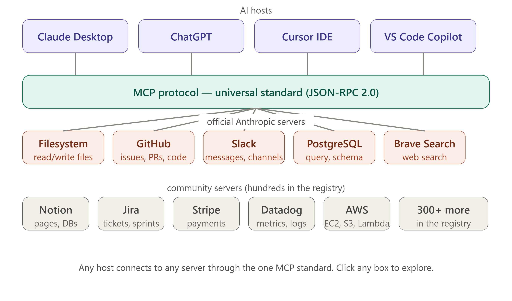

### The MCP Registry

The official MCP registry at **modelcontextprotocol.io/servers** lists hundreds of ready-made MCP servers. You do not need to build everything from scratch.

### Official Anthropic Servers

These are built and maintained by Anthropic:

| Server                                      | What it connects to     | Key tools                                              |
| ------------------------------------------- | ----------------------- | ------------------------------------------------------ |
| `@modelcontextprotocol/server-filesystem`   | Local file system       | read_file, write_file, list_directory, search_files    |
| `@modelcontextprotocol/server-github`       | GitHub API              | create_issue, list_prs, get_file_contents, search_code |
| `@modelcontextprotocol/server-google-drive` | Google Drive            | list_files, read_file, create_doc, upload_file         |
| `@modelcontextprotocol/server-postgres`     | PostgreSQL database     | query, list_tables, describe_table                     |
| `@modelcontextprotocol/server-sqlite`       | SQLite database         | query, create_table, insert_row                        |
| `@modelcontextprotocol/server-slack`        | Slack workspace         | send_message, list_channels, get_thread                |
| `@modelcontextprotocol/server-puppeteer`    | Web browser automation  | navigate, click, screenshot, fill_form                 |
| `@modelcontextprotocol/server-brave-search` | Brave web search        | search(query) → results                                |
| `@modelcontextprotocol/server-memory`       | Persistent memory graph | store_memory, recall_memory, list_entities             |
| `@modelcontextprotocol/server-fetch`        | HTTP requests           | fetch(url) → web content                               |

### Community Servers (Popular)

| Server         | Category                | What it does                                         |
| -------------- | ----------------------- | ---------------------------------------------------- |
| Jira MCP       | Project management      | Create/update tickets, sprints, boards               |
| Notion MCP     | Knowledge base          | Read pages, create databases, update content         |
| Linear MCP     | Engineering workflow    | Issues, cycles, projects, roadmaps                   |
| Figma MCP      | Design                  | Read designs, extract components, export assets      |
| Stripe MCP     | Payments                | Create charges, manage subscriptions, view analytics |
| Sentry MCP     | Error monitoring        | Get issues, traces, performance data                 |
| Datadog MCP    | Observability           | Query metrics, logs, traces, dashboards              |
| AWS MCP        | Cloud                   | EC2, S3, Lambda, CloudWatch via AWS CLI              |
| Kubernetes MCP | Container orchestration | Pods, deployments, services, namespaces              |
| Cloudflare MCP | Edge platform           | Workers, KV, R2, DNS management                      |

### Hosts That Support MCP

| Host              | Type                        | MCP support                         |
| ----------------- | --------------------------- | ----------------------------------- |
| Claude Desktop    | AI chat app                 | Full native support                 |
| ChatGPT Desktop   | AI chat app                 | Full native support (March 2025)    |
| Cursor            | AI code editor              | Full support — very popular         |
| Windsurf          | AI code editor              | Full support                        |
| VS Code + Copilot | IDE + AI                    | Full support (GitHub Copilot agent) |
| Zed               | Code editor                 | Full support                        |
| Cline             | VS Code extension           | Full support                        |
| Continue          | VS Code/JetBrains extension | Full support                        |

### Install a Server in 60 Seconds

```bash
# Install the GitHub MCP server
npx -y @modelcontextprotocol/server-github

# Add to Claude Desktop config
# claude_desktop_config.json:
{
  "mcpServers": {
    "github": {
      "command": "npx",
      "args": ["-y", "@modelcontextprotocol/server-github"],
      "env": {
        "GITHUB_PERSONAL_ACCESS_TOKEN": "your_token_here"
      }
    }
  }
}
```

---

## 3. Top 10 Real-World Use Cases

### Use Case 1 — AI-Powered Code Review Assistant

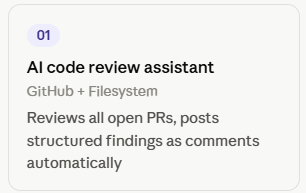

```
MCP Servers: GitHub + Filesystem
User: "Review all open PRs and summarise issues by severity"

AI workflow:
  1. list_pull_requests(state="open")          → 12 open PRs
  2. For each PR: get_pr_files(pr_number)       → changed files
  3. read_file(path) for each changed file      → source code
  4. Runs code_review prompt                    → finds issues
  5. create_pr_comment(pr_number, findings)     → posts review

Result: 12 PRs reviewed and commented in 2 minutes
```

### Use Case 2 — Intelligent Customer Support Agent

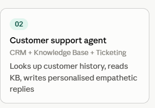

```
MCP Servers: CRM + Knowledge Base + Ticketing
User asks: "Why did my payment fail?"

AI workflow:
  1. search_customer(email)                     → customer record
  2. read resource: kb://payment-failures       → knowledge base article
  3. get_ticket_history(customer_id)            → past issues
  4. Uses support_response prompt               → writes empathetic reply
  5. create_ticket(summary, priority="high")    → creates ticket

Result: Personalised, informed reply created in seconds
```

### Use Case 3 — Automated DevOps Assistant

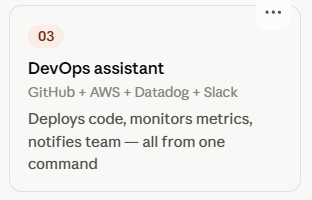

```
MCP Servers: GitHub + AWS + Datadog + Slack
User: "Deploy main branch to production and monitor"

AI workflow:
  1. get_latest_commit(branch="main")           → commit SHA
  2. trigger_deployment(sha, env="production")  → starts deploy
  3. watch_deployment_status()                  → polls every 30s
  4. query_metrics(service, last="5m")          → checks error rate
  5. send_slack_message("#ops", summary)        → notifies team

Result: Full deploy + monitor + notify, all from one command
```

### Use Case 4 — Research and Report Generation

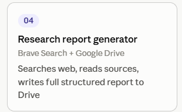

```
MCP Servers: Brave Search + Google Drive + Notion
User: "Research quantum computing breakthroughs in 2025 and write a report"

AI workflow:
  1. search("quantum computing breakthroughs 2025")  → 10 sources
  2. fetch(url) for each relevant source             → full articles
  3. Uses report_outline prompt                       → structures findings
  4. create_google_doc("Quantum Computing 2025")      → creates doc
  5. write_content(doc_id, structured_report)         → fills content
  6. create_notion_page(link_to_doc)                  → adds to wiki

Result: Full 2000-word research report in Google Drive + Notion
```

### Use Case 5 — Database Query Assistant

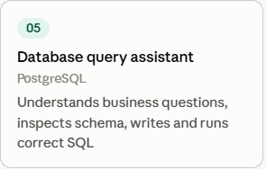

```
MCP Servers: PostgreSQL
User: "Which customers have not placed an order in 90 days?"

AI workflow:
  1. list_tables()                               → sees all tables
  2. describe_table("customers")                 → schema
  3. describe_table("orders")                    → schema
  4. execute_query(
       "SELECT c.email, MAX(o.created_at) as last_order
        FROM customers c
        LEFT JOIN orders o ON c.id = o.customer_id
        GROUP BY c.email
        HAVING MAX(o.created_at) < NOW() - INTERVAL '90 days'
        OR MAX(o.created_at) IS NULL"
     )                                           → 342 customers

Result: AI understood the business question, wrote correct SQL, returned data
```

### Use Case 6 — Personal Productivity Assistant

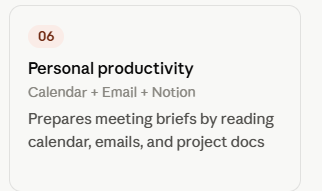

```
MCP Servers: Calendar + Email + Notion + Filesystem
User: "Prepare me for my 3pm meeting with the product team"

AI workflow:
  1. get_calendar_event("3pm")                  → attendees, agenda
  2. search_emails(from="product team", days=7) → recent threads
  3. read resource: notion://projects/roadmap   → current roadmap
  4. list_directory("~/Documents/Q3-planning")  → relevant files
  5. Uses meeting_prep prompt                   → structured brief

Result: 2-page meeting brief delivered in seconds
```

### Use Case 7 — Security Vulnerability Scanner

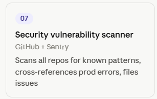

```
MCP Servers: GitHub + Sentry + custom security tools
User: "Scan all repos for SQL injection vulnerabilities"

AI workflow:
  1. list_repositories()                        → 23 repos
  2. For each repo: get_all_files(pattern="*.py") → Python files
  3. Search for dangerous patterns               → raw f-string SQL
  4. Cross-reference with Sentry error logs      → production issues
  5. create_security_issue() for each finding   → detailed reports

Result: 23 repos scanned, 7 vulnerabilities found, issues created
```

### Use Case 8 — E-commerce Operations

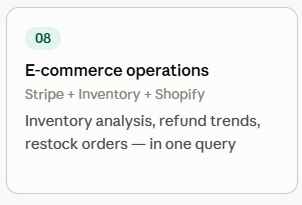

```
MCP Servers: Stripe + Inventory + Shopify + Slack
User: "What products are running low and what is our refund rate this week?"

AI workflow:
  1. query_inventory(threshold=10)              → 8 low stock items
  2. get_refund_rate(period="7d")               → 2.3% (high)
  3. get_refund_reasons(period="7d")            → mostly "wrong size"
  4. draft_restock_order(low_items)             → purchase orders
  5. send_slack_message("#ecommerce", summary)  → team alert

Result: Inventory + refund analytics + action taken in one query
```

### Use Case 9 — Healthcare Data Assistant (with permissions)

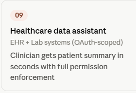

```
MCP Servers: EHR system + Lab systems (fully OAuth-scoped)
Clinician: "Summarise patient 12345's recent test results"

AI workflow:
  1. Verify: clinician has view permission for patient 12345
  2. get_patient_summary(patient_id)            → demographics
  3. get_lab_results(patient_id, last="30d")    → recent tests
  4. get_medications(patient_id)                → current meds
  5. Uses clinical_summary prompt               → structured summary

Result: Clinician gets a clean summary in seconds, not 20 minutes
```

### Use Case 10 — Multi-Language Documentation Generator

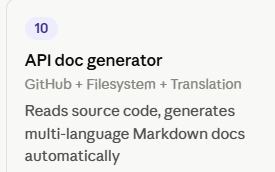

```
MCP Servers: GitHub + Filesystem + Translation API
User: "Generate API docs for all public functions in src/"

AI workflow:
  1. list_directory("src/")                     → all .py files
  2. read_file(path) for each file              → source code
  3. Extract: function signatures, docstrings   → structured data
  4. Uses api_doc prompt                        → Markdown docs
  5. Translate to: Hindi, Japanese, Spanish     → 3 translated versions
  6. write_file("docs/api/*.md")               → saves all files

Result: Complete multi-language API docs from one command
```

---

## 4. MCP vs Function Calling — They Work Together

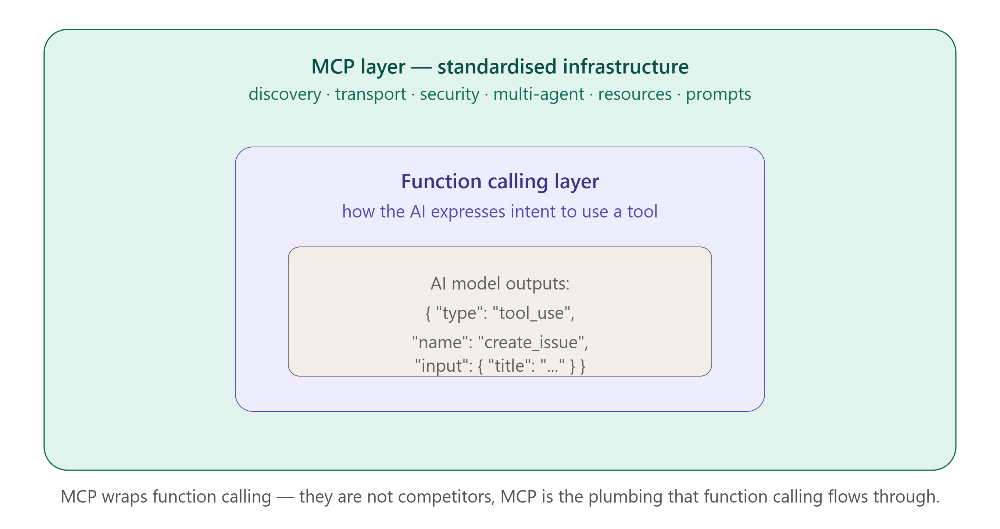

### The Common Confusion

Many people ask: "Why do we need MCP if AI models already have function calling?"

The answer: they solve different problems and work together, not against each other.

### Function Calling (what it is)

Function calling is a feature of AI model APIs (like Anthropic's API or OpenAI's API) that allows the model to express its desire to call a function:

```python
# Function calling — defined in your application code
response = anthropic.messages.create(
    model="claude-opus-4-6",
    tools=[{
        "name": "get_weather",
        "description": "Get weather for a city",
        "input_schema": {
            "type": "object",
            "properties": {"city": {"type": "string"}},
            "required": ["city"]
        }
    }],
    messages=[{"role": "user", "content": "What's the weather in Mumbai?"}]
)
```

### MCP (what it adds)

MCP is the **infrastructure layer** that makes tool definitions discoverable, reusable, and standardised across different AI models and applications:

```python
# MCP — defined once in a server, works with ANY MCP-compatible AI
@server.list_tools()
async def list_tools():
    return [Tool(
        name="get_weather",
        description="Get weather for a city",
        inputSchema={...}
    )]
```

### The Relationship

```
┌──────────────────────────────────────────────────────────┐
│                    MCP LAYER                             │
│  (Standardised discovery + transport + security)         │
│                                                          │
│  ┌────────────────────────────────────────────────┐      │
│  │           FUNCTION CALLING LAYER               │      │
│  │  (How the AI model communicates its intent)    │      │
│  └────────────────────────────────────────────────┘      │
│                                                          │
└──────────────────────────────────────────────────────────┘
```

MCP uses function calling internally — when an MCP tool is invoked, the AI model uses function calling to express which tool to call and with what arguments. MCP then handles the rest: routing the call to the right server, managing the connection, returning the result.

### Side-by-Side Comparison

| Dimension          | Function Calling                  | MCP                                    |
| ------------------ | --------------------------------- | -------------------------------------- |
| **Scope**          | Single AI model API               | Any MCP-compatible AI + any MCP server |
| **Discovery**      | You define tools in code manually | Server advertises tools automatically  |
| **Reusability**    | Tools tied to your application    | Tools reusable by any AI host          |
| **Transport**      | Direct API call                   | STDIO or HTTP/SSE                      |
| **Authentication** | Your responsibility               | OAuth 2.1 built-in for remote          |
| **Resources**      | Not supported                     | Full resource primitive                |
| **Prompts**        | Not supported                     | Full prompt primitive                  |
| **Multi-agent**    | Complex to set up                 | Built-in agent-to-agent                |

### When to Use Which

```
Use Function Calling when:
  - Building a simple app with one AI model
  - Quick prototype, few tools
  - You control the whole stack
  - Tools are app-specific, not meant to be shared

Use MCP when:
  - Building tools meant for multiple AI models
  - Enterprise deployment with auth + security
  - Tools that should be reusable across apps
  - You want a standard, maintainable integration
  - Building a product others will connect their AI to
```

---

## 5. MCP Apps — Interactive UIs from Servers

### What Are MCP Apps?

MCP Apps (introduced in 2025) allow MCP Servers to deliver **interactive user interfaces** — forms, dashboards, wizards — directly into the conversation, rendered by the Host.

This is beyond just text responses. A server can now send:

- A form with fields (combining with Elicitation)
- An interactive dashboard
- A data visualisation
- A multi-step wizard

### Example: Deployment Dashboard MCP App

```python
@server.call_tool()
async def call_tool(name, arguments, context):
    if name == "show_deployment_status":
        # Returns a rich UI component, not just text
        return [MCPAppContent(
            type="app",
            component={
                "type": "dashboard",
                "title": "Deployment Status",
                "sections": [
                    {
                        "type": "metric-grid",
                        "metrics": [
                            {"label": "Services", "value": "24", "status": "healthy"},
                            {"label": "Error rate", "value": "0.02%", "status": "good"},
                            {"label": "P99 latency", "value": "142ms", "status": "warning"}
                        ]
                    },
                    {
                        "type": "action-buttons",
                        "buttons": [
                            {"label": "Deploy v2.4", "tool": "deploy", "args": {"version": "2.4"}},
                            {"label": "Rollback",    "tool": "rollback", "style": "danger"}
                        ]
                    }
                ]
            }
        )]
```

The Host renders this as an interactive UI widget in the chat — not a wall of text, but a real dashboard.

---

## 6. Production Checklist

Before shipping an MCP server to real users, go through this list:

### Performance

```
✅ Cache frequently-accessed resources (don't fetch the same README 100x/day)
✅ Rate-limit tool calls per user per minute (prevent runaway AI loops)
✅ Set timeouts on all external API calls (fail fast if GitHub is down)
✅ Stream large responses instead of loading everything into memory
✅ Use connection pooling for database MCP servers
```

### Error Handling

```
✅ Every tool returns a proper error response, never crashes the server
✅ External API failures return user-friendly error messages
✅ Log all errors with context (which tool, which user, which arguments)
✅ Implement retry logic with exponential backoff for flaky APIs
✅ Never expose internal error details (stack traces) to the AI model
```

### Observability

```
✅ Log every tool call: timestamp, user, tool name, arguments, duration, result
✅ Track tool call latency and surface P95/P99 metrics
✅ Alert on error rate > 1% or latency spikes
✅ Dashboard showing which tools are most/least used
✅ Audit log retained for 90+ days for compliance
```

### Scalability

```
✅ Stateless server design (any instance can handle any request)
✅ Horizontal scaling behind a load balancer
✅ Graceful shutdown: finish in-flight requests before stopping
✅ Health check endpoint (GET /health → 200 OK) for load balancers
✅ Resource limits on memory and CPU per server instance
```

### Testing

```
✅ Unit tests for every tool function with mock external APIs
✅ Integration tests using the MCP Python/TypeScript SDK test utilities
✅ Test with multiple MCP clients (Claude Desktop, Cursor, ChatGPT)
✅ Load test: can your server handle 100 concurrent tool calls?
✅ Security test: try prompt injection, path traversal, auth bypass
```

---

## 7. Where MCP is Heading in 2026 and Beyond

### What Has Already Happened (by mid-2026)

- **Agentic AI Foundation (AAIF)** formed — Anthropic, OpenAI, Block as founding members under Linux Foundation
- **MCP Dev Summit NYC** (April 2026) — 1,200+ attendees, 80+ speakers
- **MCP Registry** launched — official, searchable directory of verified MCP servers
- **Streamable HTTP** became the standard transport for remote servers
- **Tasks** added — long-running operations with state tracking
- **Elicitation** added — server-to-user structured input
- **All major AI companies** have adopted MCP (OpenAI, Google, Microsoft, Meta)

### What is Coming Next

**MCP in embedded devices**
IoT devices exposing sensor data and controls via MCP. Your smart home as an MCP server. AI that can control your thermostat, read your energy usage, and optimise accordingly.

**Federated MCP networks**
Multiple organisations sharing MCP servers securely. Hospital A's AI connects to Hospital B's anonymised research MCP server via federated identity.

**MCP for edge AI**
Local, on-device AI models connecting to local MCP servers — no cloud required. Complete privacy, complete control.

**AI-built MCP servers**
Claude and other AI models helping you build and deploy MCP servers — "Build me an MCP server for my company's HR system" → Claude writes the code, tests it, helps you deploy it.

**Standard vertical protocols**
Industry-specific MCP profiles for healthcare (HL7 FHIR via MCP), finance (FIX protocol via MCP), manufacturing (OPC-UA via MCP). MCP becomes the lingua franca for AI in regulated industries.

### The Big Picture

```
2024: MCP announced — early adopters
2025: Ecosystem explosion — hundreds of servers, all major AI companies adopt
2026: MCP becomes invisible infrastructure — developers assume it exists, like REST APIs
2027+: Regulated industries standardise on MCP — healthcare, finance, government
```

---

## 8. Your Teaching Framework — How to Explain MCP

You have spent 7 days learning MCP deeply. Now here is how to teach it to others at different levels.

### Level 1 — The Non-Technical Person (30 seconds)

> "Imagine you hired a brilliant assistant, but they could only talk to people — they couldn't use any apps or tools. MCP is like giving that assistant hands. Now they can open files, send emails, search the web, and do real work — not just answer questions. Any AI that uses MCP can connect to any tool. It's like a universal remote control for AI."

### Level 2 — The Business Person (2 minutes)

> "Before MCP, connecting AI to your company's systems was expensive and slow. You needed custom code for every combination of AI model and business tool. If you had 3 AI tools and 5 business systems, that's 15 custom integrations to build and maintain.

> MCP is a standard that cuts that to 8 — each side builds once and they all work together. Think of it like USB-C for AI. The moment your ERP system has an MCP server, every AI assistant your team uses can instantly access it — Claude, ChatGPT, your internal AI — all of them, no extra development needed."

### Level 3 — The Developer (5 minutes)

Start with the problem:

1. "The N×M integration problem — before MCP, building N AI models connecting to M tools required N×M custom integrations."

Introduce the solution: 2. "MCP is an open standard (JSON-RPC 2.0 over STDIO or HTTP/SSE) for AI-to-tool communication. AI models implement an MCP Client; tool providers implement an MCP Server. They speak the same language."

Explain the 3 primitives: 3. "Servers expose 3 things: Tools (actions to DO), Resources (data to READ), and Prompts (templates to GUIDE)."

Show the architecture: 4. "The Host (Claude Desktop) manages MCP Clients. Each Client has a 1-to-1 connection to one Server. The initialization handshake happens first; then normal operation."

Close with impact: 5. "The MCP registry has hundreds of pre-built servers. Install one in 60 seconds. All major AI companies have adopted it. It's the infrastructure layer of the agentic AI era."

### Level 4 — The Sceptic (handle objections)

**"Is this just another standard that will die in 2 years?"**

> "MCP is now governed by the Agentic AI Foundation under the Linux Foundation — the same body that governs Linux, Kubernetes, and Node.js. OpenAI, Google, and Microsoft are all on board. The network effect is self-reinforcing: more AI hosts → more value in building servers → more servers → more value in AI hosts supporting MCP."

**"Can't we just use REST APIs directly?"**

> "REST APIs require the AI model to know the exact endpoint, authentication method, and parameter format for every service. MCP provides a discovery layer: the AI asks 'what can you do?' and the server tells it. It's the difference between knowing someone's phone number and having a contact book."

**"Is it secure enough for enterprise?"**

> "MCP mandates OAuth 2.1 for remote servers, includes tool annotations for permission scoping, supports Elicitation for human-in-the-loop on dangerous operations, and has built-in patterns for prompt injection defence. It's designed for enterprise from the ground up."

### The Teaching Sequence (for a 1-hour workshop)

```
Minutes 0-10:   The problem (N×M, show the diagram)
Minutes 10-20:  The solution (USB-C analogy, architecture diagram)
Minutes 20-35:  The 3 primitives (Tools, Resources, Prompts — live demo)
Minutes 35-45:  Build a simple server together (5-minute server)
Minutes 45-55:  Connect to Claude Desktop and test it live
Minutes 55-60:  Q&A + where to go next (registry, SDK docs)
```

---

## 9. Your Complete 7-Day Knowledge Map

Here is everything you have learned across all 7 days:

### Day 1 — The Big Picture

- The N×M problem and why it needed solving
- MCP = USB-C for AI (universal standard)
- Anthropic created it (Nov 2024), now open standard
- Where MCP fits: Layer 2 between AI and tools

### Day 2 — Architecture

- Host = the AI application (Claude Desktop)
- Client = lives inside Host, speaks MCP, 1-to-1 with Server
- Server = lightweight tool wrapper, does real work
- Message flow: User → Host → AI → Client → Server → back
- STDIO (local) vs HTTP/SSE (remote)

### Day 3 — The 3 Primitives

- Tools = DO (actions, side effects, identified by name)
- Resources = READ (data, no side effects, identified by URI)
- Prompts = GUIDE (templates, arguments, message lists)
- Decision: Change? Tool. Read? Resource. Structure? Prompt.
- Chaining: real tasks combine all 3 in sequence

### Day 4 — JSON-RPC & Transport

- JSON-RPC 2.0: method + params + id (for requests)
- 3 message types: Request (id, expects reply), Response (same id), Notification (no id)
- STDIO: local, fast, stdin/stdout pipes, no auth needed
- HTTP+SSE: remote, cloud, needs OAuth, supports streaming
- Lifecycle: Initialize → Discover → Operate → Close

### Day 5 — Build Your First Server

- `Server("name")` + 6 decorators = complete server
- list_tools / call_tool / list_resources / read_resource / list_prompts / get_prompt
- Never print() to stdout (use stderr for logs)
- Connect via claude_desktop_config.json
- Test: calculator tool, notes resource, summarise prompt

### Day 6 — Security & Advanced

- OAuth 2.1: access token (short) + refresh token (long)
- Least Privilege: only grant what is needed
- Annotations: readOnlyHint, destructiveHint, confirmationRequired
- Sampling: server → AI model (get reasoning)
- Elicitation: server → human user (get form input)
- Multi-agent: trust flows downward, context is structured
- Prompt injection: sanitise, wrap, lock down post-read tools

### Day 7 — Ecosystem & Teaching

- Registry: hundreds of ready-made servers
- Top 10 use cases across industries
- MCP vs Function Calling: they work together, MCP is the infrastructure layer
- Production: cache, rate-limit, log, test, monitor
- Future: IoT, federated, edge, regulated industries
- Teaching: 4 levels, objection handling, 1-hour workshop format

---

## 10. Key Terms — The Complete Glossary

| Term             | Day | Definition                                                               |
| ---------------- | --- | ------------------------------------------------------------------------ |
| MCP              | 1   | Model Context Protocol — universal standard for AI-to-tool communication |
| N×M Problem      | 1   | N AI models × M tools = N×M custom integrations needed (before MCP)      |
| N+M Solution     | 1   | MCP reduces to N+M: each side builds once                                |
| USB-C Analogy    | 1   | MCP is the universal connector for AI                                    |
| Host             | 2   | The AI application (Claude Desktop). Manages everything.                 |
| Client           | 2   | Component inside Host. Speaks MCP. 1-to-1 with Server.                   |
| Server           | 2   | Lightweight program wrapping a tool. Exposes primitives.                 |
| STDIO            | 2   | Transport for local servers — stdin/stdout pipes                         |
| HTTP+SSE         | 2   | Transport for remote servers — HTTP POST + SSE stream                    |
| Initialization   | 2   | Mandatory 3-step handshake before tools can be called                    |
| Tool             | 3   | Action AI can DO. Has side effects. Identified by name.                  |
| Resource         | 3   | Data AI can READ. No side effects. Identified by URI.                    |
| Prompt           | 3   | Template that GUIDEs AI. Arguments fill it. Returns messages.            |
| inputSchema      | 3   | JSON Schema defining a Tool's required arguments                         |
| Chaining         | 3   | Using multiple primitives in sequence for complex tasks                  |
| JSON-RPC 2.0     | 4   | Message format MCP uses — JSON with method, params, id                   |
| Request          | 4   | JSON-RPC message with id — expects a Response                            |
| Response         | 4   | Reply to a Request — contains result or error                            |
| Notification     | 4   | JSON-RPC message without id — no reply expected                          |
| Lifecycle        | 4   | Initialize → Discover → Operate → Close                                  |
| Decorator        | 5   | @ syntax in Python that registers a handler function                     |
| asyncio          | 5   | Python async library — MCP servers are asynchronous                      |
| TextContent      | 5   | Return type for tool results and resource content                        |
| OAuth 2.1        | 6   | Auth standard for remote MCP servers                                     |
| Access Token     | 6   | Short-lived credential sent with every API request                       |
| Refresh Token    | 6   | Long-lived credential used to get new access tokens                      |
| Least Privilege  | 6   | Only grant minimum permissions needed                                    |
| Annotations      | 6   | Metadata on Tools (readOnly, destructive, confirmationRequired)          |
| Sampling         | 6   | Server asks AI model to reason or generate content                       |
| Elicitation      | 6   | Server asks human user for structured form input                         |
| Orchestrator     | 6   | Agent that coordinates specialist agents                                 |
| Prompt Injection | 6   | Malicious content in data tries to hijack AI actions                     |
| MCP Registry     | 7   | Official directory of verified MCP servers                               |
| Function Calling | 7   | AI model API feature for expressing tool call intent                     |
| MCP Apps         | 7   | Interactive UI components delivered by MCP Servers                       |
| Tasks            | 7   | Long-running operations with state tracking (MCP 2025)                   |
| AAIF             | 7   | Agentic AI Foundation — governs the MCP standard                         |

---

## 11. Final Summary

### What You Can Now Do

After 7 days of MCP, you can:

✅ **Explain** MCP to anyone — from a child to a CTO  
✅ **Draw** the architecture from memory — Host, Client, Server  
✅ **Identify** which primitive to use for any task — Tool, Resource, or Prompt  
✅ **Read** JSON-RPC messages and understand exactly what is happening  
✅ **Build** a complete MCP server in Python with all 3 primitives  
✅ **Connect** your server to Claude Desktop and test it live  
✅ **Secure** an MCP server with OAuth, annotations, and injection defences  
✅ **Design** multi-agent systems with proper trust hierarchies  
✅ **Deploy** MCP servers to production with the full checklist  
✅ **Teach** MCP at 4 different levels with objection-handling ready

### The One-Paragraph Summary of MCP

> MCP (Model Context Protocol) is an open standard created by Anthropic in November 2024 and now governed by the Agentic AI Foundation. It solves the N×M integration problem by giving every AI model and every tool a single, universal way to communicate. An MCP Host (like Claude Desktop) contains Clients that connect to Servers — each Server exposes three types of primitives: Tools (actions), Resources (readable data), and Prompts (templates). All communication uses JSON-RPC 2.0 over either STDIO (local) or HTTP/SSE (remote). Remote servers authenticate with OAuth 2.1, and the spec includes built-in patterns for tool safety annotations, Sampling (server-to-AI), Elicitation (server-to-user), multi-agent coordination, and prompt injection defence. With hundreds of ready-made servers in the registry and adoption by every major AI company, MCP is becoming the standard infrastructure layer of the agentic AI era.

---

## 12. Final Assessment — 20 Questions

Answer all 20. This covers all 7 days.

**Foundations**

**Q1.** What is the N×M problem and how does MCP solve it?

**Q2.** Explain the USB-C analogy for MCP in 2-3 sentences.

**Q3.** Who created MCP and who governs it today?

**Architecture**

**Q4.** Name the 3 players in MCP architecture and explain what each one does.

**Q5.** What is the difference between STDIO and HTTP/SSE transport? When do you use each?

**Q6.** What happens during the initialization phase? Why is it mandatory?

**Primitives**

**Q7.** A user says "Send a tweet about our product launch". Which primitive? Why?

**Q8.** A user says "What does our API documentation say about authentication?". Which primitive? Why?

**Q9.** A user says "Write a structured incident report". Which primitive? Why?

**Q10.** What is "chaining" and give an example that uses all 3 primitives?

**Communication**

**Q11.** Write a JSON-RPC Request to call a tool named `send_email` with `to="user@example.com"` and `subject="Hello"`.

**Q12.** A JSON-RPC message has no `id` field. What type of message is it and what does this mean?

**Building**

**Q13.** List the 6 decorator functions every Python MCP server uses.

**Q14.** Why can you NEVER use `print()` in an MCP server? What should you use instead?

**Q15.** Write the `claude_desktop_config.json` entry for a server called "my-tools" that runs `python3 /home/user/server.py`.

**Security & Advanced**

**Q16.** What is the difference between an Access Token and a Refresh Token in OAuth 2.1?

**Q17.** A tool has `destructiveHint=True` and `confirmationRequired=True`. Describe what the user sees.

**Q18.** What is Sampling? Give a real-world example where it is useful.

**Q19.** What is a prompt injection attack? Give one concrete example and one defence.

**Ecosystem**

**Q20.** Explain the relationship between MCP and function calling. Do they compete or complement each other?

---

> **Congratulations!** You have completed the 7-Day MCP Learning Journey. You now have the knowledge to build, deploy, secure, and teach MCP. The ecosystem is growing fast — keep building, keep exploring, and share what you know.

---

### What to Do Next

1. **Build something real** — pick one tool your daily work needs and build an MCP server for it
2. **Explore the registry** — browse modelcontextprotocol.io/servers and connect 3 new servers this week
3. **Contribute** — if you build something useful, publish it as an open-source MCP server
4. **Teach** — run the 1-hour workshop with your team using the framework from Day 7
5. **Follow the spec** — modelcontextprotocol.io for the latest spec updates

---

_MCP Specification: modelcontextprotocol.io_
_MCP Registry: modelcontextprotocol.io/servers_
_Python SDK: github.com/modelcontextprotocol/python-sdk_
_TypeScript SDK: github.com/modelcontextprotocol/typescript-sdk_
_AAIF: agenticai.foundation_
