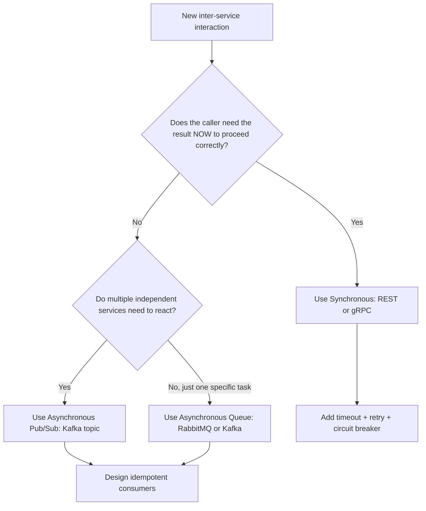
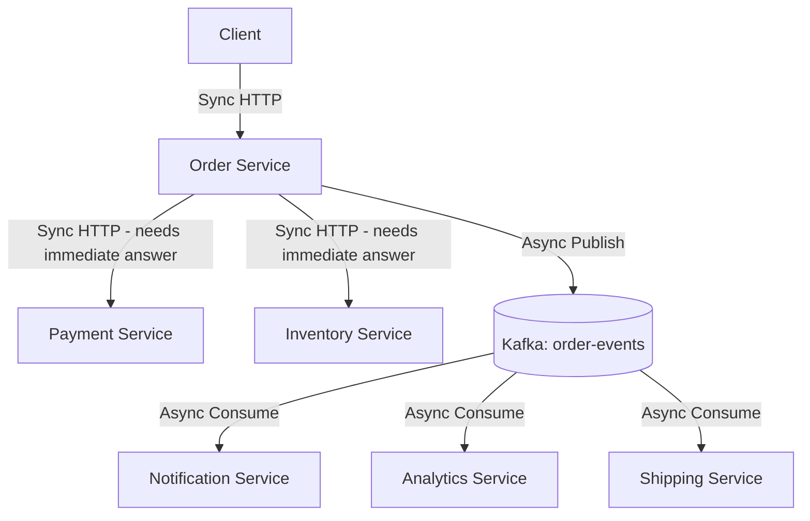
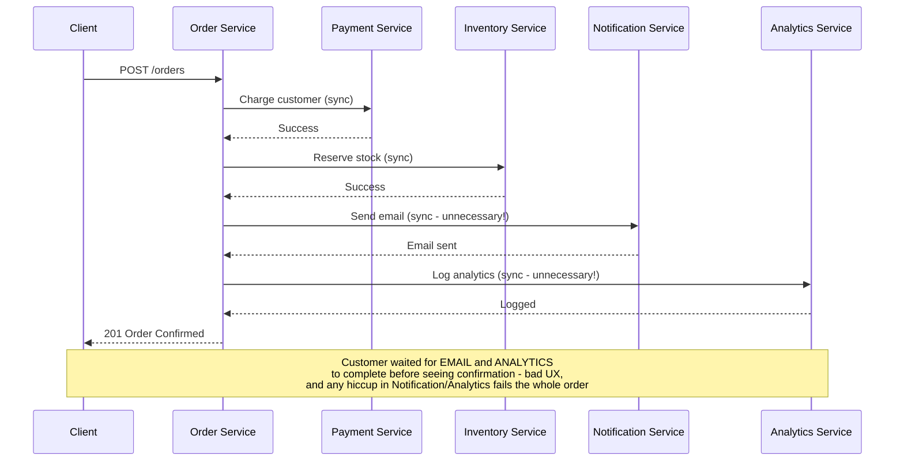

# Module 6 — Communication Between Services

> **Microservices Masterclass** | Level: Intermediate | Track: Node.js Backend Engineering
> Prerequisite: Module 1–5 (especially Module 5 — Service Boundaries)
> Next Module: Module 7 — REST Communication

---

## Table of Contents

1. [Introduction](#1-introduction)
2. [Learning Objectives](#2-learning-objectives)
3. [Problem Statement](#3-problem-statement)
4. [Why This Concept Exists](#4-why-this-concept-exists)
5. [Historical Background](#5-historical-background)
6. [Real-World Analogy](#6-real-world-analogy)
7. [Technical Definition](#7-technical-definition)
8. [Core Terminology](#8-core-terminology)
9. [Internal Working](#9-internal-working)
10. [Step-by-Step Request Flow](#10-step-by-step-request-flow)
11. [Architecture Overview](#11-architecture-overview)
12. [ASCII Diagrams](#12-ascii-diagrams)
13. [Mermaid Flowcharts](#13-mermaid-flowcharts)
14. [Mermaid Sequence Diagrams](#14-mermaid-sequence-diagrams)
15. [Component Diagrams](#15-component-diagrams)
16. [Deployment Diagrams](#16-deployment-diagrams)
17. [Database Interaction](#17-database-interaction)
18. [Failure Scenarios](#18-failure-scenarios)
19. [Scalability Discussion](#19-scalability-discussion)
20. [High Availability Considerations](#20-high-availability-considerations)
21. [CAP Theorem Implications](#21-cap-theorem-implications)
22. [Node.js Implementation](#22-nodejs-implementation)
23. [Express.js Examples](#23-expressjs-examples)
24. [Docker Examples](#24-docker-examples)
25. [Kafka/Redis Integration](#25-kafkaredis-integration)
26. [Error Handling](#26-error-handling)
27. [Logging & Monitoring](#27-logging--monitoring)
28. [Security Considerations](#28-security-considerations)
29. [Performance Optimization](#29-performance-optimization)
30. [Production Best Practices](#30-production-best-practices)
31. [Anti-Patterns and Common Mistakes](#31-anti-patterns-and-common-mistakes)
32. [Debugging Tips](#32-debugging-tips)
33. [Interview Questions](#33-interview-questions)
34. [Scenario-Based Questions](#34-scenario-based-questions)
35. [Hands-on Exercises](#35-hands-on-exercises)
36. [Mini Project](#36-mini-project)
37. [Advanced Project](#37-advanced-project)
38. [Summary](#38-summary)
39. [Revision Notes](#39-revision-notes)
40. [One-Page Cheat Sheet](#40-one-page-cheat-sheet)

---

## 1. Introduction

Modules 1–5 established what microservices are and where their boundaries should go. Now we address a question every one of those boundaries immediately raises: **once you've split your system into separate services, how do they actually talk to each other?**

In a monolith, "communication" between modules was invisible — a function call. The moment you draw a service boundary, that function call becomes a **network call**, and network calls are fundamentally different: they can be slow, they can fail, they can arrive out of order, and they can be duplicated. This module is the foundation for everything that follows in Modules 7–10 (REST, gRPC, Event-Driven Architecture, API Gateway) — it establishes the core mental model of **synchronous vs. asynchronous** communication that every one of those specific technologies builds on.

Get this mental model right, and choosing between REST, gRPC, and Kafka in a given scenario becomes straightforward. Get it wrong, and you'll reach for the wrong tool constantly — using synchronous calls where events belong, or vice versa.

---

## 2. Learning Objectives

By the end of this module, you will be able to:

- Explain the fundamental difference between synchronous and asynchronous communication.
- Identify which communication style fits a given business scenario, and why.
- Describe the main communication protocols used in microservices (REST, gRPC, message queues, event streams) at a conceptual level.
- Explain the risks unique to network communication (partial failure, latency, ordering) that don't exist in a monolith.
- Design a communication strategy for a multi-service business process, mixing sync and async appropriately.
- Recognize communication anti-patterns like excessive synchronous chaining ("call chains") and inappropriate use of async for time-critical operations.

---

## 3. Problem Statement

A team has correctly split their e-commerce system into Order, Payment, Inventory, and Notification services (following Module 5's boundary principles). Now, placing an order requires:

- Confirming payment (the customer is waiting — they need to know NOW if their card was charged).
- Confirming/reserving stock (also needs a fast, in-the-moment answer).
- Notifying the warehouse to prepare shipment (doesn't need to happen before the customer gets their confirmation).
- Sending a confirmation email (definitely doesn't need to block the customer's response).
- Updating analytics dashboards (can happen minutes later with zero impact on the user).

If the team makes **everything** a synchronous REST call, the customer waits for the email to send and the analytics dashboard to update before they even see "Order Confirmed" — unnecessarily slow, and fragile (if the Notification service has a hiccup, the whole order fails, even though email delivery has nothing to do with whether the order should succeed).

If the team makes **everything** asynchronous (fire an event and hope for the best), then the customer's payment might not have actually gone through yet when they see "Order Confirmed" — a data integrity and trust problem.

This module solves exactly this problem: **choosing the right communication style for each interaction**, based on whether the caller genuinely needs an immediate answer.

---

## 4. Why This Concept Exists

Communication strategy exists as a distinct concern because **the network is not free, not instant, and not reliable** — properties that in-process function calls in a monolith simply don't have to worry about. Specifically:

| In-Process Call (Monolith) | Network Call (Microservices) |
|---|---|
| Always available (same process) | Can fail — the other service might be down |
| Effectively instantaneous | Has latency — milliseconds to seconds |
| Always succeeds or throws immediately | Can time out, partially succeed, or hang |
| Strong ordering guaranteed | Messages/requests can arrive out of order |
| No serialization needed | Requires serialization (JSON, Protobuf) and deserialization |

Because these properties are fundamentally different, engineers need an explicit framework — synchronous vs. asynchronous — to reason about which properties matter for a given interaction, and to design accordingly rather than defaulting to whatever's most familiar (usually REST, used indiscriminately).

---

## 5. Historical Background

- **1980s–1990s**: Remote Procedure Call (RPC) mechanisms (like CORBA, DCOM) attempted to make network calls "look like" local function calls — an approach that turned out to be misleading, since it hid the fundamentally different failure modes of network calls behind a deceptively simple interface. This became a well-known cautionary lesson in distributed systems (often summarized as "the network is not reliable, don't pretend otherwise").
- **2000s**: Enterprise Service Bus (ESB) architectures, part of SOA, centralized message routing and transformation logic, but often became a complex, hard-to-maintain bottleneck of their own.
- **2010s**: With the rise of microservices, **REST over HTTP** became the default synchronous communication choice due to its simplicity and ubiquity, while **message queues and event streaming platforms** (RabbitMQ, and later Kafka, originally built at LinkedIn) became the standard for asynchronous communication.
- **Mid-2010s onward**: **gRPC**, built by Google on HTTP/2 and Protocol Buffers, gained popularity for internal service-to-service synchronous communication requiring higher performance and strict, strongly-typed contracts than typical JSON REST APIs provide (covered in depth in Module 8).
- **Present**: Most mature microservices architectures use a deliberate **mix** of synchronous (REST/gRPC) and asynchronous (Kafka/RabbitMQ) communication, chosen per interaction based on the principles this module introduces.

---

## 6. Real-World Analogy

**Analogy: Phone Call vs. Text Message vs. Mailing a Letter**

- **Synchronous communication (a phone call)**: You call someone, and you **wait on the line** for their answer before you can proceed. This is appropriate when you genuinely need an immediate answer to continue — "Can you confirm this payment right now?" You can't hang up and plan your next move until you know the answer.
- **Asynchronous communication (a text message)**: You send a message and go about your business. The recipient will read and respond when they can, and you've designed your day so that you don't need their answer *immediately* to keep functioning — "Hey, FYI, the meeting moved to 3pm." Perfect for "Please send a confirmation email" or "Please update the analytics dashboard."
- **Asynchronous, durable, replayable communication (mailing an important letter, with a copy kept)**: This is like an event log (Kafka) — the message is durably recorded, can be "read" by multiple recipients independently at different times, and can even be "re-read" later if needed (event replay), unlike a phone call which is gone the moment it ends.

Choosing the wrong analogy for a task — insisting on a "phone call" (blocking, synchronous) for something that's really just an "FYI text" (fire-and-forget) — wastes everyone's time and creates unnecessary fragility (what if the person you're calling doesn't pick up?).

---

## 7. Technical Definition

> **Synchronous communication** is a request-response interaction where the calling service **blocks and waits** for a response from the called service before proceeding — typically implemented via REST (HTTP) or gRPC.

> **Asynchronous communication** is a fire-and-forget (or eventually-processed) interaction where the calling service **does not wait** for the receiving service to process the message before continuing — typically implemented via a message queue (RabbitMQ) or an event streaming platform (Kafka).

> The choice between them for a given interaction should be driven by one core question: **"Does the caller need to know the outcome before it can correctly proceed?"** If yes → synchronous. If no (the caller can proceed and let the outcome happen "eventually") → asynchronous.

---

## 8. Core Terminology

| Term | Meaning |
|---|---|
| **Synchronous Communication** | Caller blocks, waiting for an immediate response |
| **Asynchronous Communication** | Caller proceeds without waiting for the receiver's processing to complete |
| **Request-Response** | The classic synchronous pattern: one request, one matching response |
| **Fire-and-Forget** | Caller sends a message and doesn't wait for or expect any response |
| **Publish-Subscribe (Pub/Sub)** | One publisher, multiple independent subscribers, asynchronous by nature |
| **Message Queue** | A broker (e.g., RabbitMQ) that holds messages until a consumer processes them, typically one consumer per message |
| **Event Stream** | A durable, ordered, replayable log of events (e.g., Kafka) that multiple independent consumers can read at their own pace |
| **Latency** | The time delay between sending a request and receiving a response |
| **Timeout** | A maximum time a caller will wait before giving up on a synchronous call |
| **Idempotency** | The property that performing an operation multiple times has the same effect as performing it once — critical for safely retrying both sync and async calls |
| **Call Chain** | A sequence of synchronous calls where Service A calls B, which calls C, which calls D — an anti-pattern when overused |

---

## 9. Internal Working

Here's the decision process for choosing communication style for any given interaction between two services:

1. **Ask: does the caller need the result to proceed correctly, right now?**
   - "Is this payment valid?" → Yes, synchronous. The order can't proceed without knowing.
   - "Please send a receipt email." → No, asynchronous. The order flow doesn't depend on the email being sent.
2. **Ask: is there a hard business requirement for immediate confirmation to the *end user*?**
   - Customers expect to know instantly whether checkout succeeded — that end-to-end user experience typically requires the customer-facing calls to be synchronous (or a fast synchronous "accepted" response, followed by async processing with a status they can check later).
3. **Ask: can this operation tolerate eventual consistency?**
   - "Update the recommendation engine with this purchase" can happen seconds or minutes later — perfect for async.
   - "Deduct this amount from the customer's balance before allowing the next purchase" typically cannot tolerate being "eventually" correct — needs synchronous (or carefully designed compensating logic if async, via Saga patterns in Module 15).
4. **Ask: how many services need to know about this event?**
   - If it's exactly one specific answer needed from exactly one other service → synchronous request-response is often simplest.
   - If multiple, decoupled services need to react independently (Inventory, Notification, Analytics all care about "OrderPlaced") → asynchronous publish-subscribe is a much better fit than the caller making 3 separate synchronous calls.
5. **Design the failure behavior explicitly** for whichever style you choose — synchronous calls need timeouts/retries/circuit breakers (Module 18); asynchronous flows need to handle message loss, duplication, and ordering (often via idempotent consumers and, for stricter ordering needs, keyed partitioning as covered in the Kafka Masterclass).

---

## 10. Step-by-Step Request Flow

**Scenario: "Place Order" — a well-designed mix of sync and async.**

```
Step 1:  Client sends POST /orders (customer is waiting for a response)
Step 2:  Order Service SYNCHRONOUSLY calls Payment Service
         -> caller needs to know NOW if payment succeeded
Step 3:  Payment Service responds: payment succeeded
Step 4:  Order Service SYNCHRONOUSLY calls Inventory Service
         -> caller needs to know NOW if stock can be reserved
Step 5:  Inventory Service responds: stock reserved
Step 6:  Order Service saves the Order to its own database
Step 7:  Order Service returns "Order Confirmed" to the Client
         -> customer sees confirmation NOW; critical path is done
Step 8:  Order Service ASYNCHRONOUSLY publishes "OrderPlaced" to Kafka
         -> caller does NOT wait for what happens next
Step 9:  Notification Service (independently) consumes the event,
         sends a confirmation email minutes or seconds later
Step 10: Analytics Service (independently) consumes the SAME event,
         updates dashboards — completely decoupled from Steps 1-7
```

Steps 2–5 are synchronous because the customer's order literally cannot proceed correctly without those answers. Steps 8–10 are asynchronous because nothing about the customer's immediate experience depends on email delivery or analytics timing.

---

## 11. Architecture Overview

```
                         Client
                            │
                            ▼
                     ┌─────────────┐
                     │ Order Service │
                     └──────┬──────┘
             SYNC (block)   │   SYNC (block)
        ┌────────────────────┼────────────────────┐
        ▼                                         ▼
┌───────────────┐                        ┌───────────────┐
│ Payment Service │                        │Inventory Service│
└───────────────┘                        └───────────────┘

                     Order Service (after
                     synchronous steps complete)
                            │
                    ASYNC (fire-and-forget)
                            ▼
                     ┌─────────────┐
                     │  Kafka Topic  │
                     │ "order-events"│
                     └──────┬──────┘
             ┌───────────────┼───────────────┐
             ▼               ▼               ▼
     Notification Svc   Analytics Svc   Shipping Svc
     (independent,       (independent,   (independent,
      async consumer)     async consumer) async consumer)
```

---

## 12. ASCII Diagrams

### 12.1 Synchronous vs Asynchronous Timing

```
SYNCHRONOUS (caller blocks and waits):

  Order Service:  ──send request──▶ [WAITING...] ◀──response──
  Payment Service:                   [processing]
                                            │
  Total time for Order Service = time until Payment responds


ASYNCHRONOUS (caller proceeds immediately):

  Order Service:  ──publish event──▶ [continues immediately]
  Kafka:                             [event stored durably]
  Notification Svc:                       [consumes whenever ready]

  Total time for Order Service = near-zero (just the publish call)
```

### 12.2 The "Call Chain" Anti-Pattern (Over-Synchronous)

```
BAD: Deeply chained synchronous calls

  Client ──▶ Order Svc ──▶ Payment Svc ──▶ Fraud Check Svc ──▶ Bank API
                              (waits)         (waits)            (waits)

  Total latency = SUM of every hop's latency
  Total failure risk = failure at ANY hop breaks the ENTIRE chain
```

### 12.3 Publish-Subscribe Fan-Out (Good Use of Async)

```
GOOD: One event, many independent async consumers

                     Order Service
                          │
                   publishes ONE event
                          │
                          ▼
                  ┌───────────────┐
                  │  Kafka Topic   │
                  └───────┬───────┘
        ┌─────────────────┼─────────────────┐
        ▼                 ▼                 ▼
  Notification Svc   Analytics Svc     Shipping Svc
  (reads on its       (reads on its     (reads on its
   own schedule)       own schedule)     own schedule)

  Order Service made ONE call, not three — and doesn't
  wait for or even know how many consumers exist
```

---

## 13. Mermaid Flowcharts

### 13.1 Choosing Sync vs Async



### 13.2 Full Order Flow Communication Map



---

## 14. Mermaid Sequence Diagrams

### 14.1 Mixed Sync/Async Order Flow

```mermaid
sequenceDiagram
    participant C as Client
    participant O as Order Service
    participant P as Payment Service
    participant I as Inventory Service
    participant K as Kafka
    participant N as Notification Service

    C->>O: POST /orders
    O->>P: Charge customer (SYNC - blocking)
    P-->>O: Payment success
    O->>I: Reserve stock (SYNC - blocking)
    I-->>O: Stock reserved
    O->>O: Save order to DB
    O-->>C: 201 Order Confirmed (customer sees this NOW)
    O->>K: Publish OrderPlaced (ASYNC - fire and forget)
    Note over O,C: Customer already has their response;<br/>everything below happens independently
    K-->>N: Consume OrderPlaced (whenever ready)
    N->>N: Send confirmation email
```

### 14.2 Anti-Pattern: Everything Synchronous (for comparison)



---

## 15. Component Diagrams

```
┌─────────────────────────────────────────────────────────┐
│                     Order Service                          │
│  ┌───────────────────┐      ┌───────────────────┐          │
│  │  Sync HTTP Clients  │      │  Async Event         │          │
│  │  (axios/fetch)      │      │  Publisher (KafkaJS) │          │
│  │  - Payment Client   │      │  - order-events topic│          │
│  │  - Inventory Client │      │                      │          │
│  └───────────────────┘      └───────────────────┘          │
└─────────────────────────────────────────────────────────┘
           │                              │
   Blocking, awaited                Fire-and-forget,
   HTTP calls with                  durable event log
   timeouts/retries
```

---

## 16. Deployment Diagrams

```
┌───────────────────────────────────────────────────────────┐
│                    Kubernetes Cluster                        │
│                                                               │
│  order-svc pods ──(sync HTTP, ClusterIP Service)──▶ payment-svc pods │
│  order-svc pods ──(sync HTTP, ClusterIP Service)──▶ inventory-svc pods│
│                                                               │
│  order-svc pods ──(async, produces to)──▶ Kafka StatefulSet   │
│                              │                                │
│         ┌────────────────────┼────────────────────┐          │
│         ▼                    ▼                    ▼          │
│  notification-svc pods  analytics-svc pods  shipping-svc pods │
│  (independently consume, independently scale, independently  │
│   deploy — no direct dependency on order-svc's deployment)    │
└───────────────────────────────────────────────────────────┘
```

---

## 17. Database Interaction

Communication style has direct implications for data consistency:

```
SYNCHRONOUS interactions:
  Order Service ──sync call──▶ Payment Service ──writes──▶ Payment DB
  Order Service can be CONFIDENT the payment was recorded
  before it proceeds to write its OWN Order DB row — strong,
  immediate consistency between these two writes (at the cost
  of Order Service being blocked/dependent on Payment's availability)

ASYNCHRONOUS interactions:
  Order Service ──publish event──▶ Kafka
  Notification Service ──(later, independently)──▶ writes to its own DB
  There is a WINDOW OF TIME where Order DB says "order placed" but
  Notification DB doesn't yet reflect "email sent" — this is
  ACCEPTABLE because nothing depends on those two facts being
  simultaneously true
```

---

## 18. Failure Scenarios

| Scenario | Synchronous Behavior | Asynchronous Behavior |
|---|---|---|
| Downstream service is completely down | Caller's request fails or times out immediately — visible right away | Message queues/waits in the broker (Kafka retains it); processed once the consumer recovers — invisible to the original caller |
| Downstream service is slow (not down) | Caller hangs until timeout, risking cascading slowness up the call chain | No impact on the caller at all — consumer just takes longer to catch up |
| Message/request duplicated by a network retry | Caller might double-charge unless the operation is idempotent | Consumer might process the same event twice unless it's idempotent (deduplicate by event ID) |
| Network partition between two services | Caller cannot get an answer; must decide to fail or fall back | Events queue up in the broker and are delivered once connectivity resumes — brokers are specifically designed to absorb this |

```
Synchronous failure cascade (bad if overused):

  Order Svc ──▶ Payment Svc ──▶ Fraud Svc (DOWN)
     │              │                │
   blocked        blocked          TIMEOUT
     │              │                │
  Customer sees a failure, even though the actual
  payment charge logic itself was perfectly fine


Asynchronous absorption (Kafka retains events):

  Order Svc ──publish──▶ Kafka (retains message)
                              │
                    Notification Svc (DOWN)
                              │
              Kafka just holds the message until
              Notification Svc comes back — Order Svc
              was never blocked or aware of the outage
```

---

## 19. Scalability Discussion

Asynchronous communication generally scales better under load spikes because it **decouples the producer's throughput from the consumer's processing speed** — Kafka can absorb a burst of 10,000 "OrderPlaced" events even if Notification Service can currently only process 100/second, and it will simply catch up over time rather than causing failures. Synchronous communication has no such buffer — if Payment Service can only handle 100 requests/second and Order Service suddenly needs 1,000/second, those requests will queue, time out, or fail directly and immediately impact users. This is a major reason asynchronous patterns are favored for high-throughput, non-critical-path operations.

---

## 20. High Availability Considerations

- Synchronous call chains reduce overall system availability multiplicatively: if Order Service depends synchronously on Payment (99.9% available) AND Inventory (99.9% available), the combined availability for a request needing both is at best ~99.8% — availability degrades with each additional synchronous hop.
- Asynchronous communication improves perceived availability for non-critical operations: even if Notification Service is completely down, Order Service (and the customer's experience) is entirely unaffected, since the event just waits in the broker.
- Minimizing the number of **required synchronous dependencies** for the customer-facing critical path is one of the most effective ways to improve overall system availability.

---

## 21. CAP Theorem Implications

- Synchronous interactions typically favor **Consistency** at the potential cost of **Availability** — you wait for a definitive, up-to-date answer, and if that answer isn't available (network partition), the operation fails rather than proceeding with stale/guessed data.
- Asynchronous interactions typically favor **Availability** (and eventual consistency) — the system keeps functioning and accepting new events/requests even during partial outages, accepting that some data will be briefly inconsistent across services until events are fully processed.
- Choosing sync vs async for a given interaction is, in effect, **making a local CAP theorem trade-off decision** for that specific piece of business logic.

---

## 22. Node.js Implementation

Let's implement both styles side-by-side for the Order Service to make the contrast concrete.

**Folder structure:**
```
order-service/
├── src/
│   ├── clients/
│   │   ├── paymentClient.js       <- SYNCHRONOUS
│   │   └── inventoryClient.js     <- SYNCHRONOUS
│   ├── events/
│   │   └── orderEventsPublisher.js <- ASYNCHRONOUS
│   ├── application/
│   │   └── PlaceOrderService.js
│   └── app.js
```

**`src/clients/paymentClient.js`** (Synchronous)
```javascript
import axios from "axios";

// SYNCHRONOUS: Order Service genuinely cannot proceed without
// knowing whether the charge succeeded. We wait for this answer.
export async function chargeCustomer(customerId, amount) {
  const response = await axios.post(
    `${process.env.PAYMENT_SERVICE_URL}/charges`,
    { customerId, amount },
    { timeout: 5000 } // fail fast rather than hang indefinitely
  );
  return response.data; // { success: true, transactionId: "..." }
}
```

**`src/events/orderEventsPublisher.js`** (Asynchronous)
```javascript
import { Kafka } from "kafkajs";

const kafka = new Kafka({ clientId: "order-service", brokers: [process.env.KAFKA_BROKER] });
const producer = kafka.producer();
await producer.connect();

// ASYNCHRONOUS: Order Service does NOT wait for anyone to consume
// this event, and does not care how many consumers exist or when
// they process it. This call returns almost immediately.
export async function publishOrderPlaced(order) {
  await producer.send({
    topic: "order-events",
    messages: [
      { key: order.id, value: JSON.stringify({ type: "OrderPlaced", payload: order }) },
    ],
  });
  // Note: we do NOT wait for Notification/Analytics/Shipping to
  // process this — that's the entire point of asynchronous design.
}
```

**`src/application/PlaceOrderService.js`** — combining both deliberately:
```javascript
import { chargeCustomer } from "../clients/paymentClient.js";
import { reserveStock } from "../clients/inventoryClient.js";
import { publishOrderPlaced } from "../events/orderEventsPublisher.js";
import { orderRepository } from "../repositories/OrderRepository.js";

export async function placeOrder({ customerId, items, amount }) {
  // SYNCHRONOUS: must know the outcome before proceeding
  const payment = await chargeCustomer(customerId, amount);
  if (!payment.success) {
    throw new Error("Payment failed");
  }

  // SYNCHRONOUS: must know stock is reserved before confirming the order
  const stockReserved = await reserveStock(items);
  if (!stockReserved) {
    throw new Error("Insufficient stock");
  }

  const order = { id: crypto.randomUUID(), customerId, items, amount, status: "PLACED" };
  await orderRepository.save(order);

  // ASYNCHRONOUS: fire and forget — the customer's confirmation
  // does not, and should not, depend on this completing
  await publishOrderPlaced(order);

  return order; // returned to the customer immediately after this point
}
```

---

## 23. Express.js Examples

```javascript
// src/app.js
import express from "express";
import { placeOrder } from "./application/PlaceOrderService.js";

const app = express();
app.use(express.json());

app.post("/orders", async (req, res) => {
  try {
    // The response is sent as soon as placeOrder() resolves —
    // which happens right after the async publish call fires,
    // NOT after any consumer has processed the event.
    const order = await placeOrder(req.body);
    res.status(201).json(order);
  } catch (err) {
    res.status(400).json({ error: err.message });
  }
});

app.listen(4002, () => console.log("Order Service running on port 4002"));
```

---

## 24. Docker Examples

```yaml
version: "3.9"
services:
  order-service:
    build: ./order-service
    ports: ["4002:4002"]
    environment:
      - PAYMENT_SERVICE_URL=http://payment-service:4003
      - INVENTORY_SERVICE_URL=http://inventory-service:4004
      - KAFKA_BROKER=kafka:9092
    depends_on: [payment-service, inventory-service, kafka]

  payment-service:
    build: ./payment-service
    ports: ["4003:4003"]

  inventory-service:
    build: ./inventory-service
    ports: ["4004:4004"]

  notification-service:
    build: ./notification-service
    environment:
      - KAFKA_BROKER=kafka:9092
    depends_on: [kafka]
    # Notice: notification-service has NO dependency on order-service
    # being "up" in a synchronous sense — it just needs Kafka.

  kafka:
    image: bitnami/kafka:latest
    ports: ["9092:9092"]
```

Note that `order-service` explicitly `depends_on` `payment-service` and `inventory-service` (its synchronous dependencies) but `notification-service` does **not** depend on `order-service` at all — it only needs Kafka to be available, demonstrating the decoupling asynchronous communication provides.

---

## 25. Kafka/Redis Integration

**Idempotent consumer pattern** — critical for asynchronous communication, since messages can be delivered more than once:

```javascript
// notification-service: must handle the SAME event being delivered
// twice (e.g., due to a consumer restart mid-processing) without
// sending a duplicate email.
import { redis } from "../db/redis.js";

export async function handleOrderPlaced(event) {
  const dedupeKey = `processed-event:${event.eventId}`;
  const alreadyProcessed = await redis.get(dedupeKey);
  if (alreadyProcessed) {
    return; // skip — we've already handled this exact event
  }

  await sendConfirmationEmail(event.payload);

  // Mark as processed for 24 hours — long enough to cover realistic
  // redelivery windows for this system
  await redis.set(dedupeKey, "true", { EX: 60 * 60 * 24 });
}
```

**Redis for synchronous call latency reduction** (a cache-aside pattern reducing how often a synchronous call is even needed):
```javascript
// order-service: cache Inventory's stock-check result briefly to reduce
// the frequency (and latency impact) of synchronous calls under high load
export async function reserveStockCached(items) {
  const cacheKey = `stock-check:${items.map((i) => i.productId).join(",")}`;
  const cached = await redis.get(cacheKey);
  if (cached) return JSON.parse(cached);

  const result = await reserveStock(items); // the real synchronous call
  await redis.set(cacheKey, JSON.stringify(result), { EX: 5 }); // very short TTL
  return result;
}
```

---

## 26. Error Handling

**Synchronous error handling** requires timeouts, retries (for idempotent operations only), and circuit breakers:
```javascript
import CircuitBreaker from "opossum";

const breaker = new CircuitBreaker(chargeCustomer, {
  timeout: 5000,          // fail if it takes longer than 5s
  errorThresholdPercentage: 50,
  resetTimeout: 10000,    // try again after 10s of being "open"
});

breaker.fallback(() => ({ success: false, reason: "Payment service unavailable" }));
```

**Asynchronous error handling** requires a strategy for messages that repeatedly fail to process — typically a **Dead Letter Queue (DLQ)**, covered in depth in Module 15 (Kafka Patterns):
```javascript
export async function handleOrderPlacedSafely(event) {
  try {
    await handleOrderPlaced(event);
  } catch (err) {
    logger.error({ err, event }, "Failed to process OrderPlaced event");
    await publishToDeadLetterTopic(event, err.message); // isolate for later inspection
  }
}
```

---

## 27. Logging & Monitoring

- For synchronous calls, monitor **P50/P95/P99 latency** and **timeout rate** per downstream dependency — these directly impact user-facing responsiveness.
- For asynchronous flows, monitor **consumer lag** (how far behind the latest event a consumer is) as the primary health signal — a growing lag indicates a struggling or stuck consumer, even though producers are entirely unaffected.
- Always propagate a **trace ID** through both synchronous headers and asynchronous event payloads, so a single business operation's full journey (sync AND async legs) can be reconstructed in your tracing system.

```javascript
// Propagating trace ID into an async event payload
await producer.send({
  topic: "order-events",
  messages: [{
    key: order.id,
    value: JSON.stringify({ type: "OrderPlaced", payload: order, traceId: req.traceId }),
  }],
});
```

---

## 28. Security Considerations

- Synchronous service-to-service calls should use **mTLS or short-lived service tokens** to authenticate the caller, since these calls often carry sensitive data directly (e.g., payment amounts).
- Asynchronous message payloads (Kafka events) should avoid including highly sensitive data (full card numbers, plaintext passwords) even though the broker is internal — treat event logs as a durable, potentially long-retained record that a broader set of consumers can read.
- Validate and authenticate messages even in async flows — a compromised producer publishing malicious/malformed events is a real risk in a system with many independent teams producing to shared topics.

---

## 29. Performance Optimization

- Minimize the number of **sequential synchronous hops** on any single user-facing critical path — parallelize independent synchronous calls where possible (e.g., call Payment and Inventory concurrently with `Promise.all` if neither depends on the other's result) rather than chaining them unnecessarily.
- Move as much work as possible to the **asynchronous side** of the boundary — anything that doesn't need to block the caller's response should be an event, not a blocking call.
- Batch asynchronous message production where appropriate (e.g., batch several analytics events together) to reduce broker overhead under very high throughput.

```javascript
// Parallelizing independent synchronous calls instead of chaining them
const [payment, stockReserved] = await Promise.all([
  chargeCustomer(customerId, amount),
  reserveStock(items),
]);
```

---

## 30. Production Best Practices

- Document, per service-to-service interaction, **why** it's synchronous or asynchronous — this becomes part of your architectural documentation and prevents future engineers from "fixing" a deliberate async design back into an unnecessary synchronous call (or vice versa).
- Default to **asynchronous** for anything that isn't strictly required to be synchronous — it's usually easier to add synchronicity later (if truly needed) than to retrofit asynchronicity into a tightly-coupled synchronous chain.
- Ensure every asynchronous consumer is **idempotent** — assume at-least-once delivery semantics (the norm for most message brokers) rather than assuming exactly-once behavior by default.
- Set sensible **timeouts** on every synchronous call — a call with no timeout is effectively a hidden availability risk waiting to cascade.

---

## 31. Anti-Patterns and Common Mistakes

| Anti-Pattern | Why It's a Problem |
|---|---|
| **Synchronous Call Chains** | A→B→C→D synchronous chains multiply latency and failure risk at every hop |
| **Using Sync Where Async Belongs** | Blocking the customer on non-critical work (email, analytics) hurts UX and availability for no benefit |
| **Using Async Where Sync Belongs** | Treating a payment confirmation as "fire and forget" risks confirming orders that were never actually paid for |
| **Non-Idempotent Async Consumers** | Assuming events are delivered exactly once leads to duplicate side effects (double emails, double charges) under normal broker redelivery behavior |
| **No Timeout on Synchronous Calls** | A hung downstream service can hang the caller indefinitely, risking resource exhaustion and cascading failure |

```
Synchronous Call Chain (anti-pattern):

  Order Svc ──▶ Payment Svc ──▶ Fraud Svc ──▶ Risk Scoring Svc ──▶ External Bank API
     (waits)       (waits)         (waits)          (waits)

  Total latency = SUM of all 4 hops
  Total failure probability compounds at every additional hop
```

---

## 32. Debugging Tips

- When a synchronous request is slow, check each hop's individual latency via distributed tracing — the slowest hop is usually not the one closest to the client.
- When async processing seems "stuck," check **consumer lag** first, then check for a poison message (one malformed event repeatedly crashing the consumer, blocking all messages behind it in that partition).
- If duplicate side effects appear (e.g., two emails sent for one order), suspect a **non-idempotent consumer** combined with normal at-least-once delivery redelivery — verify deduplication logic first before assuming a broker bug.

---

## 33. Interview Questions

### Easy
1. What is the difference between synchronous and asynchronous communication?
2. Give an example of when you'd use synchronous communication, and when you'd use asynchronous.
3. What is a "fire-and-forget" message?
4. What is Publish-Subscribe, and how does it differ from a simple request-response call?
5. Why do network calls need timeouts, unlike in-process function calls?

### Medium
6. What is the "call chain" anti-pattern, and why is it problematic?
7. How does asynchronous communication improve system availability for non-critical operations?
8. Why must asynchronous consumers typically be designed to be idempotent?
9. Explain how CAP theorem trade-offs show up differently in synchronous vs asynchronous interactions.
10. When would you choose a message queue (single consumer) over an event stream (multiple independent consumers)?

### Hard
11. Design the communication strategy (sync vs async, and why) for a complete "Book a Ride" flow on a ride-sharing platform.
12. How would you handle a scenario where a "synchronous" payment confirmation call times out, but you're not sure if the payment actually succeeded on the other side?
13. Explain how you'd redesign a system suffering from a 5-hop synchronous call chain to reduce latency and failure risk.
14. What monitoring/metrics would definitively tell you whether a given asynchronous pipeline is healthy?
15. Discuss the trade-offs of using a short synchronous "accepted" response followed by asynchronous processing with a status the client can poll, versus a single long synchronous call.

---

## 34. Scenario-Based Questions

1. Customers complain that checkout takes 4+ seconds. Investigation shows Order Service makes 5 sequential synchronous calls (Payment, Inventory, Tax, Shipping Estimate, Loyalty Points). How would you redesign this?
2. Your Notification Service occasionally sends duplicate emails for the same order. What's the most likely root cause, and how would you fix it?
3. A colleague proposes making "send confirmation email" a synchronous call inside the order placement flow "to make sure it definitely sends." How do you respond?
4. Your payment integration occasionally fails silently — the synchronous call times out, but you later discover the charge actually succeeded on the payment provider's side. How would you redesign this interaction to handle this ambiguity safely?
5. Leadership wants sub-200ms checkout responses, but your current design requires 3 sequential synchronous cross-service calls averaging 100ms each. What are your options?

---

## 35. Hands-on Exercises

1. For a "Hotel Booking" flow (check availability, charge deposit, confirm booking, notify hotel, send confirmation email, update analytics), classify each step as sync or async and justify each choice.
2. Rewrite Section 22's `PlaceOrderService` to parallelize the payment and inventory calls using `Promise.all`, and explain when this parallelization is and isn't safe to do.
3. Implement a simple idempotent Kafka consumer (using an in-memory Set for deduplication, for practice) that processes an "OrderPlaced" event exactly once even if delivered twice.
4. Diagram a 5-hop synchronous call chain and redesign it into a mix of sync (only where truly required) and async, reducing the chain to at most 2 sequential synchronous hops.
5. Write a short internal design doc justifying, for one interaction of your choice, exactly why it should be synchronous or asynchronous — including what happens on failure.

---

## 36. Mini Project

**Build: A Service With Both a Synchronous and Asynchronous Path**

1. Build `order-service` that synchronously calls a mock `payment-service` (return success/failure based on a random or configurable rule) before confirming an order.
2. After confirming the order, have `order-service` asynchronously publish an `OrderPlaced` event to Kafka.
3. Build `notification-service` that consumes this event and logs "Email sent for order X" — with an idempotency check using Redis, as shown in Section 25.
4. Demonstrate that if `notification-service` is stopped, `order-service` still successfully confirms orders (proving the decoupling).

---

## 37. Advanced Project

**Build: A Full Sync/Async Hybrid Order Pipeline**

1. Build 4 services: `order-service`, `payment-service`, `inventory-service`, `notification-service`, plus an `analytics-service`.
2. `order-service` synchronously calls `payment-service` and `inventory-service` in parallel (`Promise.all`) before confirming the order.
3. `order-service` asynchronously publishes `OrderPlaced` to Kafka; both `notification-service` and `analytics-service` consume it independently.
4. Implement a circuit breaker (using `opossum`) around the synchronous `payment-service` call, with a sensible fallback.
5. Implement idempotent consumers in both async consumers using Redis-based deduplication.
6. Chaos-test your system: stop `notification-service` and confirm orders still succeed; stop `payment-service` and confirm orders correctly fail with a clear error; introduce artificial latency in `inventory-service` and observe the circuit breaker/timeout behavior.

---

## 38. Summary

- The core question for every inter-service interaction is: **does the caller need the result immediately to proceed correctly?** If yes, use synchronous communication (REST/gRPC); if no, use asynchronous communication (message queues/event streams).
- Synchronous communication is simpler to reason about but couples availability and latency across every hop in a call chain.
- Asynchronous communication decouples producers from consumers, improving availability and scalability for non-critical-path work, at the cost of eventual (not immediate) consistency.
- Idempotency is essential for both styles, but especially critical for asynchronous consumers under normal at-least-once delivery semantics.
- Well-designed systems deliberately mix both styles, using synchronous calls sparingly and only where truly required, and asynchronous events as the default for everything else.

---

## 39. Revision Notes

- Sync: caller waits, needs the answer now, tightly coupled to availability/latency of the callee.
- Async: caller proceeds immediately, callee processes independently, favors availability and scalability.
- Call chains multiply latency and failure risk — minimize sequential synchronous hops.
- Pub/Sub (Kafka) is ideal when multiple independent services need to react to one event.
- Idempotency is mandatory for safe retries (sync) and safe redelivery handling (async).
- CAP trade-offs are made implicitly, per interaction, by choosing sync (favor consistency) vs async (favor availability).

---

## 40. One-Page Cheat Sheet

```
ASK: "Does the caller need this result RIGHT NOW to proceed correctly?"
   YES -> SYNCHRONOUS  (REST / gRPC) -> add timeout + retry + circuit breaker
   NO  -> ASYNCHRONOUS (Kafka / RabbitMQ) -> add idempotent consumer + DLQ

SYNC PROS:  simple to reason about, immediate consistency
SYNC CONS:  couples availability/latency across every hop, call-chain risk

ASYNC PROS: decoupled, resilient to downstream outages, scales under bursts
ASYNC CONS: eventual consistency, requires idempotency, harder to trace

GOLDEN RULES:
  - Never make the customer wait on non-critical work (email, analytics)
  - Never treat a must-succeed operation (payment) as fire-and-forget
  - Parallelize independent synchronous calls; never chain unnecessarily
  - Every async consumer must be idempotent (assume at-least-once delivery)
  - Every sync call must have a timeout, or it becomes a hidden risk
```

---

**Suggested Next Module:** Module 7 — REST Communication (deep dive into designing robust, production-grade REST APIs for synchronous service-to-service communication)
