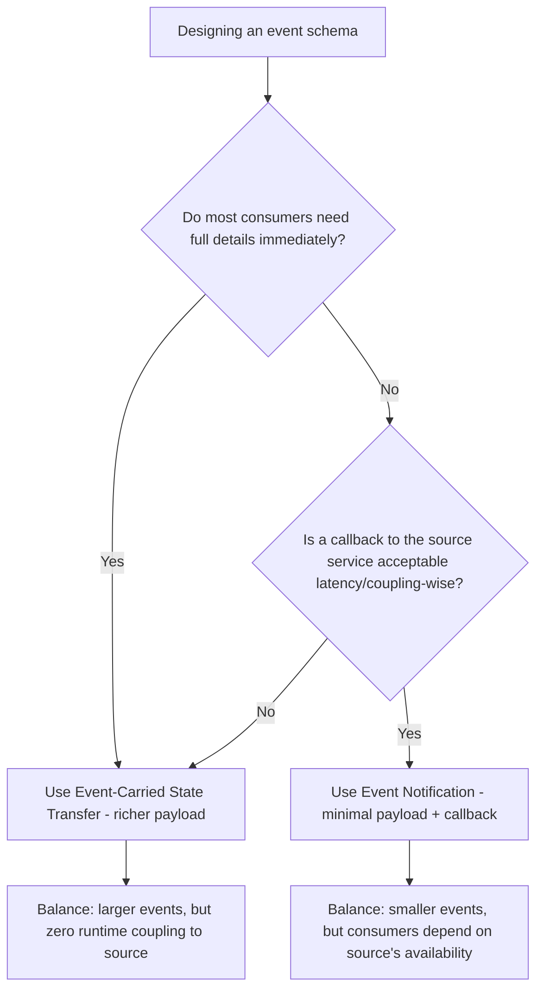
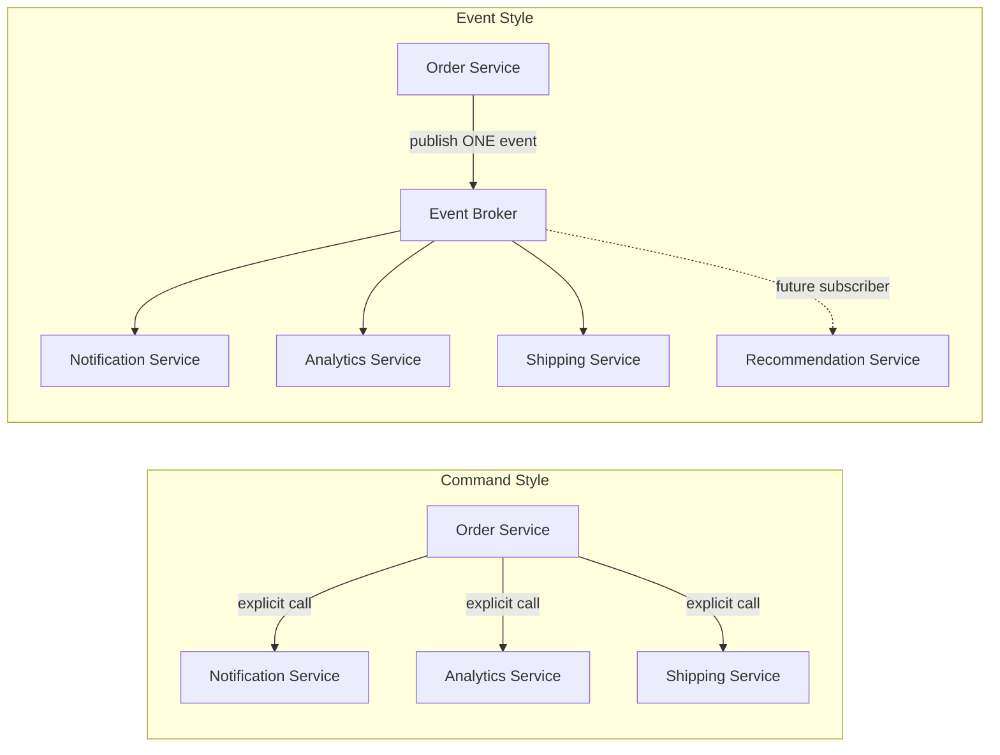
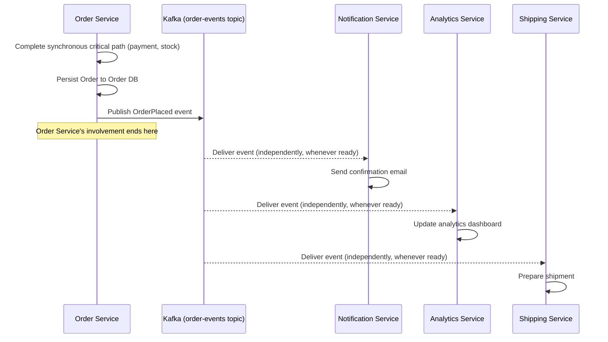

# Module 9 — Event-Driven Architecture

> **Microservices Masterclass** | Level: Intermediate | Track: Node.js Backend Engineering
> Prerequisite: Module 1–8 (especially Module 6 — Communication Between Services)
> Next Module: Module 10 — API Gateway

---

## Table of Contents

1. [Introduction](#1-introduction)
2. [Learning Objectives](#2-learning-objectives)
3. [Problem Statement](#3-problem-statement)
4. [Why This Concept Exists](#4-why-this-concept-exists)
5. [Historical Background](#5-historical-background)
6. [Real-World Analogy](#6-real-world-analogy)
7. [Technical Definition](#7-technical-definition)
8. [Core Terminology](#8-core-terminology)
9. [Internal Working](#9-internal-working)
10. [Step-by-Step Request Flow](#10-step-by-step-request-flow)
11. [Architecture Overview](#11-architecture-overview)
12. [ASCII Diagrams](#12-ascii-diagrams)
13. [Mermaid Flowcharts](#13-mermaid-flowcharts)
14. [Mermaid Sequence Diagrams](#14-mermaid-sequence-diagrams)
15. [Component Diagrams](#15-component-diagrams)
16. [Deployment Diagrams](#16-deployment-diagrams)
17. [Database Interaction](#17-database-interaction)
18. [Failure Scenarios](#18-failure-scenarios)
19. [Scalability Discussion](#19-scalability-discussion)
20. [High Availability Considerations](#20-high-availability-considerations)
21. [CAP Theorem Implications](#21-cap-theorem-implications)
22. [Node.js Implementation](#22-nodejs-implementation)
23. [Express.js Examples](#23-expressjs-examples)
24. [Docker Examples](#24-docker-examples)
25. [Kafka/Redis Integration](#25-kafkaredis-integration)
26. [Error Handling](#26-error-handling)
27. [Logging & Monitoring](#27-logging--monitoring)
28. [Security Considerations](#28-security-considerations)
29. [Performance Optimization](#29-performance-optimization)
30. [Production Best Practices](#30-production-best-practices)
31. [Anti-Patterns and Common Mistakes](#31-anti-patterns-and-common-mistakes)
32. [Debugging Tips](#32-debugging-tips)
33. [Interview Questions](#33-interview-questions)
34. [Scenario-Based Questions](#34-scenario-based-questions)
35. [Hands-on Exercises](#35-hands-on-exercises)
36. [Mini Project](#36-mini-project)
37. [Advanced Project](#37-advanced-project)
38. [Summary](#38-summary)
39. [Revision Notes](#39-revision-notes)
40. [One-Page Cheat Sheet](#40-one-page-cheat-sheet)

---

## 1. Introduction

Module 6 introduced the sync-vs-async decision. Modules 7 and 8 went deep on the synchronous side (REST and gRPC). This module goes deep on the asynchronous side: **Event-Driven Architecture (EDA)** — a style of system design where services communicate primarily by producing and consuming **events**, rather than by calling each other directly.

This is more than "use Kafka instead of REST sometimes." Event-Driven Architecture is a distinct architectural philosophy: instead of services asking each other "please do this and tell me the result" (a command, typically synchronous), services announce "this happened" (an event) and let interested parties react independently, on their own schedule, without the originating service needing to know or care who's listening.

This module establishes the conceptual vocabulary — events, event types, event schemas, event notification vs. event-carried state transfer — that later modules (10: API Gateway, 15: Kafka Patterns, 16: CQRS, 17: Event Sourcing) all build directly on top of.

---

## 2. Learning Objectives

By the end of this module, you will be able to:

- Explain what an event is, and how it differs from a command or a simple message.
- Distinguish Domain Events, Integration Events, Event Notification, and Event-Carried State Transfer.
- Design an event schema that balances information richness against coupling.
- Explain the benefits and trade-offs of event-driven architecture compared to request-driven (synchronous) architecture.
- Implement event producers and consumers in Node.js using Kafka.
- Recognize event-driven anti-patterns, including the "event as a disguised RPC call" mistake.

---

## 3. Problem Statement

A team has an Order Service that, upon a successful order, needs to trigger: inventory decrementing, a confirmation email, a loyalty points update, an analytics record, and (eventually) a fraud-check flag. Using synchronous calls (Module 7), Order Service would need to:

- Know about all 5 downstream services explicitly.
- Call each one directly, waiting for (or at least attempting) each call.
- Be modified every single time a new downstream capability needs to react to an order (e.g., adding "Recommendation Engine" as a 6th caller requires editing Order Service's code).
- Suffer if any one of these 5 services is temporarily slow or down, since a naive synchronous implementation would block or fail the whole request.

This is a **tight coupling problem** at the communication level: Order Service has to know about, and be modified for, every single downstream consumer of "an order happened." Event-Driven Architecture solves this directly: Order Service publishes **one** event — `OrderPlaced` — and has **zero knowledge** of how many services consume it, what they do with it, or whether new consumers are added in the future.

---

## 4. Why This Concept Exists

Event-Driven Architecture exists to solve the **coupling and extensibility problem** inherent in purely synchronous, command-based service communication. Specifically:

| Problem With Pure Command/RPC Style | EDA's Answer |
|---|---|
| Producer must know every consumer explicitly | Producer publishes one event; consumers subscribe independently |
| Adding a new consumer requires modifying the producer | New consumers just subscribe to the existing event — zero producer changes |
| Producer's request fails if ANY downstream call fails | Producer's publish succeeds regardless of consumer health; consumers process independently |
| Tight temporal coupling — everyone must be available at the same instant | Consumers process events whenever they're ready — temporal decoupling |
| Hard to replay history or add new functionality retroactively | Durable event logs (Kafka) can often be replayed to build new capabilities from historical events |

EDA is, in effect, the architectural embodiment of the Publish-Subscribe pattern from Module 6, elevated into a first-class design philosophy rather than just "a technique for some calls."

---

## 5. Historical Background

- **1990s** — Event-driven programming was already common **within** applications (GUI event loops, for instance) — reacting to button clicks or system events was a well-established programming model long before distributed systems adopted the idea at the architecture level.
- **2000s** — Enterprise Application Integration (EAI) and Enterprise Service Bus (ESB) systems introduced early forms of event-based integration between large enterprise systems, though often centralized and complex to manage.
- **2006–2011** — **Apache Kafka** was developed internally at LinkedIn to handle the company's massive volume of activity-stream and operational data, and was open-sourced in 2011 — providing, for the first time at this scale, a durable, replayable, high-throughput event log that fundamentally changed what "event-driven" could mean for backend systems (not just fire-and-forget messaging, but a durable source of truth).
- **2010s** — As microservices matured, practitioners like Martin Fowler and others in the DDD/microservices community formalized vocabulary distinguishing **Domain Events** (meaningful business occurrences) from simple technical messages, and highlighted patterns like **Event Sourcing** and **CQRS** (covered in Modules 16–17) that push event-driven thinking even further, into how state itself is stored and derived.
- **Present** — Event-Driven Architecture, powered largely by Kafka (and alternatives like AWS EventBridge, Google Pub/Sub, RabbitMQ), is considered a standard, mature pattern for building loosely-coupled, extensible microservices systems, especially at companies with many independent teams needing to react to shared business occurrences.

---

## 6. Real-World Analogy

**Analogy: A Newspaper Publisher vs. Making Individual Phone Calls**

Imagine a newspaper publisher who discovers breaking news. They have two options:

**Option A (Command/RPC style):** Call every single subscriber on the phone, one by one, reading them the news directly, waiting for each call to complete before moving to the next person. If they later get 10,000 more subscribers, they need 10,000 more phone calls — and if any subscriber doesn't pick up, does that mean the publisher failed to "deliver the news"? What if a totally new type of subscriber (a TV station) wants this news too — does the publisher need to learn to make TV-station-shaped calls now?

**Option B (Event-Driven style):** The publisher simply **prints and distributes the newspaper** (publishes the event). Anyone — existing subscribers, new subscribers, TV stations that want to pick up a copy, historians who want to read last week's edition — can independently pick up a copy and read it whenever they want, at their own pace, without the publisher needing to know or care who's reading it or how many readers there are. Publishing the newspaper is a single, decoupled act; the *newspaper itself* (the event) is what carries the information, durably and independently of any specific reader.

This is exactly the shift EDA makes: from "the producer actively delivers information to each specific consumer" to "the producer publishes a durable record of what happened, and consumers independently decide to read and react to it."

---

## 7. Technical Definition

> An **Event** is an immutable record of something that has **already happened** in the system (past tense, e.g., `OrderPlaced`, `PaymentProcessed`) — as opposed to a **Command**, which is a request for something to happen in the future (imperative, e.g., `PlaceOrder`, `ProcessPayment`).

> **Event-Driven Architecture (EDA)** is an architectural style where services communicate primarily by producing events representing meaningful occurrences, and other services independently subscribe to and react to those events, without the producer needing direct knowledge of its consumers.

> A **Domain Event** represents something meaningful that happened within a Bounded Context (Module 4), expressed in the Ubiquitous Language (e.g., `OrderPlaced`, `StudentEnrolled`).

> An **Integration Event** is a Domain Event (or a derived, potentially simplified version of it) specifically intended for consumption by **other** Bounded Contexts/services — the "public," cross-boundary version of an internal domain occurrence.

> **Event Notification** is a lightweight event containing minimal information (e.g., just an ID) — consumers must call back to the source service for full details if needed.

> **Event-Carried State Transfer** is an event containing enough data (a denormalized snapshot) for consumers to act **without** needing to call back to the source service at all — trading a larger event payload for reduced runtime coupling.

---

## 8. Core Terminology

| Term | Meaning |
|---|---|
| **Event** | An immutable record of something that already happened (past tense) |
| **Command** | A request for something to happen (imperative, future-oriented) |
| **Event Producer** | A service that publishes events |
| **Event Consumer** | A service that subscribes to and processes events |
| **Event Bus / Broker** | Middleware (Kafka, RabbitMQ) that transports events from producers to consumers |
| **Domain Event** | An event representing a meaningful business occurrence within a Bounded Context |
| **Integration Event** | The version of a Domain Event shared across service/Bounded Context boundaries |
| **Event Notification** | A minimal event (just an ID/reference); consumers fetch details separately if needed |
| **Event-Carried State Transfer** | A rich event containing enough data for consumers to act without a callback |
| **Event Schema** | The defined structure/fields of an event, ideally versioned and documented |
| **Choreography** | Services react to each other's events independently, with no central coordinator (covered further in Module 9's Saga discussion, Module 15) |
| **At-Least-Once Delivery** | The common guarantee that an event will be delivered one or more times — requiring idempotent consumers |

---

## 9. Internal Working

Here's how a real event-driven interaction works end-to-end, using the "Place Order" scenario:

1. Order Service completes its **synchronous** critical-path work (charging payment, reserving stock — from Module 6) and persists the Order in its own database.
2. Order Service constructs an **event** — not a command — named in the past tense: `OrderPlaced`, capturing what has already, definitively happened.
3. Order Service decides: should this be a lightweight **Event Notification** (just `{ orderId: "123" }`) or a richer **Event-Carried State Transfer** (`{ orderId, customerId, items, total, shippingAddress }`)? This decision balances event size/coupling against the number of callback round-trips consumers will otherwise need.
4. Order Service publishes this event to a **topic** (e.g., `order-events`) on the event broker (Kafka), and its involvement ends here — it does not know or care who (if anyone) is listening.
5. Zero or more **independent consumers** (Notification Service, Analytics Service, Shipping Service, and any future service) each subscribe to this topic on their own schedule.
6. Each consumer processes the event according to its own business logic — sending an email, updating a dashboard, preparing a shipment — completely independently of the others and of Order Service's own execution timeline.
7. If a new business capability needs to react to orders in the future (e.g., a new "Recommendation Engine"), it simply subscribes to the **same existing event** — **zero changes** are required to Order Service.

---

## 10. Step-by-Step Request Flow

**Scenario: A "Command vs Event" comparison for the same underlying occurrence.**

```
COMMAND-STYLE (imperative, tightly coupled):

Step 1: Order Service explicitly calls:
        - notificationService.sendConfirmationEmail(orderId)
        - analyticsService.recordOrder(orderId)
        - shippingService.prepareShipment(orderId)
Step 2: Order Service must know about all THREE services by name
Step 3: If ANY of these calls fails, Order Service must decide
        how to handle it (retry? ignore? fail the whole order?)
Step 4: Adding a FOURTH capability requires modifying Order Service's code


EVENT-STYLE (declarative, loosely coupled):

Step 1: Order Service publishes ONE event: OrderPlaced { orderId, ... }
Step 2: Order Service's job is DONE — it has no further involvement
Step 3: Notification Service, Analytics Service, and Shipping Service
        each independently consume this SAME event, on their own schedule
Step 4: Adding a FOURTH capability (e.g., Recommendation Service) just
        means it subscribes to the EXISTING topic — Order Service's
        code is completely untouched
```

---

## 11. Architecture Overview

```
                       Order Service
                            │
                  (synchronous critical path:
                   payment + inventory checks,
                   covered in Modules 6-8)
                            │
                            ▼
                Persist Order to Order DB
                            │
                            ▼
              Publish "OrderPlaced" Event
                            │
                            ▼
                  ┌─────────────────┐
                  │  Kafka Topic       │
                  │  "order-events"     │
                  └─────────┬─────────┘
        ┌───────────────────┼───────────────────┐
        ▼                   ▼                   ▼
  Notification Svc    Analytics Svc       Shipping Svc
  (sends email)        (updates            (prepares
                        dashboard)           shipment)

     ▲ Future: Recommendation Svc can subscribe here
       WITHOUT any change to Order Service
```

---

## 12. ASCII Diagrams

### 12.1 Command vs Event (Naming Convention Matters)

```
COMMAND (imperative, future-oriented, directed at ONE specific receiver):

  "PlaceOrder"       <- asking someone to DO something
  "ChargeCustomer"
  "SendEmail"


EVENT (declarative, past-tense, broadcast to ANYONE interested):

  "OrderPlaced"      <- announcing something ALREADY happened
  "CustomerCharged"
  "EmailSent"
```

### 12.2 Event Notification vs Event-Carried State Transfer

```
EVENT NOTIFICATION (minimal, requires callback):

  { "type": "OrderPlaced", "orderId": "123" }

  Consumer must THEN call Order Service's API:
  GET /orders/123  ── to get full details it actually needs
  (keeps events small, but reintroduces a synchronous dependency
   on Order Service being available when the consumer processes it)


EVENT-CARRIED STATE TRANSFER (rich, self-contained):

  {
    "type": "OrderPlaced",
    "orderId": "123",
    "customerId": "456",
    "items": [{"productId": "abc", "qty": 2}],
    "total": 49.99,
    "shippingAddress": {...}
  }

  Consumer has EVERYTHING it needs right in the event —
  no callback to Order Service required, even if Order
  Service is completely down when the consumer processes it
```

### 12.3 Choreography (No Central Coordinator)

```
   Order Svc          Inventory Svc         Shipping Svc
      │                     │                    │
  publishes            consumes                consumes
  OrderPlaced        OrderPlaced,             ShipmentReady,
      │              publishes                 does its own
      │              StockReserved              thing
      │                     │
      └─────────────────────┴────── each service reacts to
                                     events independently;
                                     no central "orchestrator"
                                     tells them what to do next
                                     (contrast with Orchestration,
                                     covered in Module 15's Saga pattern)
```

---

## 13. Mermaid Flowcharts

### 13.1 Deciding Event Notification vs Event-Carried State Transfer



### 13.2 Command vs Event Architecture



---

## 14. Mermaid Sequence Diagrams

### 14.1 Full Event-Driven Order Flow



---

## 15. Component Diagrams

```
┌─────────────────────────────────────────────────────────┐
│                     Order Service                          │
│  ┌───────────────────┐                                      │
│  │  Application Logic    │                                    │
│  │  (Module 4's DDD       │                                    │
│  │   Aggregate + Domain    │                                    │
│  │   Events)               │                                    │
│  └─────────┬───────────┘                                    │
│            ▼                                                 │
│  ┌───────────────────┐                                      │
│  │  Event Publisher       │  <- translates Domain Event into    │
│  │  (Integration Event      │     Integration Event, publishes    │
│  │   translation layer)     │     to Kafka                        │
│  └───────────────────┘                                      │
└─────────────────────────────────────────────────────────┘
                          │
                  Kafka Topic (durable log)
                          │
        ┌─────────────────┼─────────────────┐
        ▼                 ▼                 ▼
  Notification Svc   Analytics Svc     Shipping Svc
  (each with its       (each with its    (each with its
   own consumer          own consumer      own consumer
   group + logic)        group + logic)    group + logic)
```

---

## 16. Deployment Diagrams

```
┌───────────────────────────────────────────────────────────┐
│                    Kubernetes Cluster                        │
│                                                               │
│  order-svc pods ──produce──▶ Kafka StatefulSet (order-events)  │
│                                     │                          │
│         ┌───────────────────────────┼───────────────────────┐  │
│         ▼                           ▼                       ▼  │
│  notification-svc pods    analytics-svc pods         shipping-svc pods │
│  (own Deployment,          (own Deployment,           (own Deployment, │
│   own scaling, own          own scaling, own           own scaling, own│
│   release schedule —        release schedule —         release schedule│
│   ZERO dependency on        ZERO dependency on          — ZERO dependency│
│   order-svc's deploy)       order-svc's deploy)         on order-svc's  │
│                                                          deploy)         │
└───────────────────────────────────────────────────────────┘
```

This diagram makes concrete one of EDA's biggest organizational benefits: consumer services can be deployed, scaled, and even added **entirely independently** of the producer's release cycle.

---

## 17. Database Interaction

Event-Driven Architecture directly enables the **database-per-service** principle to function smoothly across services, since each consumer builds and maintains its own local view of whatever data it needs, derived from events, rather than querying another service's database:

```
Order Service DB:        owns Orders, OrderItems (source of truth)

Notification Service DB: doesn't need order data persisted at all —
                          just processes and sends, statelessly

Analytics Service DB:    maintains its OWN denormalized event log/
                          aggregated tables, built entirely from
                          consumed events (OrderPlaced, PaymentProcessed,
                          etc.) — NEVER queries Order Service's DB directly

Shipping Service DB:     maintains its OWN "shippable orders" table,
                          populated by consuming OrderPlaced events,
                          containing only the fields Shipping actually needs
```

This pattern (building a local, purpose-specific data store from consumed events) is a lightweight precursor to the full **CQRS** and **Event Sourcing** patterns covered in Modules 16–17.

---

## 18. Failure Scenarios

| Scenario | EDA Behavior |
|---|---|
| A consumer service is down when an event is published | The event broker (Kafka) retains the event durably; the consumer processes it once it comes back online — no data is lost |
| A consumer crashes mid-processing | Depending on commit strategy (see Kafka Masterclass), the event may be redelivered — consumers MUST be idempotent to handle this safely |
| An event is malformed or unexpected by a consumer | A robust consumer should validate incoming events and route unprocessable ones to a Dead Letter Queue (Module 15) rather than crashing or silently dropping them |
| The event schema changes in a breaking way | Existing consumers built against the old schema may break — schema versioning and additive-only evolution (similar to Module 8's protobuf discipline) is essential |
| Events arrive out of order | For most event types this is fine (idempotent, order-independent processing), but for state-dependent events (e.g., `OrderPlaced` then `OrderCancelled`), you need explicit ordering guarantees (e.g., Kafka's per-partition ordering, using orderId as the partition key) |

```
Consumer down when event published:

  Order Svc ──publish──▶ Kafka (retains message durably)
                              │
                    Notification Svc (DOWN)
                              │
              Kafka holds the event until Notification Svc
              reconnects and resumes consuming — NO event lost,
              NO impact on Order Service whatsoever
```

---

## 19. Scalability Discussion

EDA scales exceptionally well for bursty, high-volume workloads because the event broker (Kafka) acts as a buffer absorbing spikes in production rate, decoupled from the (potentially slower) rate at which consumers can process — consumers simply "catch up" over time rather than causing failures under load. Additionally, since each consumer service scales independently (Module 3), a slow consumer (e.g., Analytics, doing heavy aggregation) never limits the throughput of a fast consumer (e.g., Notification, sending simple emails) or the producer itself.

---

## 20. High Availability Considerations

- The producer's availability is **completely decoupled** from every consumer's availability — Order Service can keep successfully placing orders even if every single consumer is simultaneously down, since it only needs the broker to accept the publish.
- Consumers should be deployed as **multiple instances within a consumer group** (a Kafka concept covered in depth in the Kafka Masterclass) so that one instance failing doesn't stop event processing entirely.
- The event broker itself (Kafka) must be run as a **highly available, replicated cluster** — since it's now a shared, critical piece of infrastructure that many services depend on.

---

## 21. CAP Theorem Implications

EDA is fundamentally an embrace of **eventual consistency**, favoring **Availability** — the system continues accepting new events and functioning even when some consumers (or even parts of the network) are temporarily unavailable, at the cost of a delay before all parts of the system reflect the latest state. This is precisely why EDA pairs so naturally with DDD's Bounded Contexts (Module 4): crossing a Bounded Context boundary was already identified as a natural place to accept eventual consistency, and EDA provides the concrete mechanism (durable, replayable events) for implementing that acceptance reliably.

---

## 22. Node.js Implementation

Let's implement the full event publishing/consuming pattern, including the Event Notification vs Event-Carried State Transfer decision made explicit in code.

**Folder structure:**
```
order-service/
├── src/
│   ├── events/
│   │   ├── OrderPlacedEvent.js
│   │   └── eventPublisher.js
│   └── application/
│       └── PlaceOrderService.js

notification-service/
├── src/
│   ├── consumers/
│   │   └── orderEventsConsumer.js
│   └── app.js
```

**`order-service/src/events/OrderPlacedEvent.js`** — an explicit, versioned event schema
```javascript
// A well-defined Integration Event: Event-Carried State Transfer style,
// since Notification/Shipping/Analytics all need enough detail to act
// without calling back to Order Service.
export function createOrderPlacedEvent(order) {
  return {
    eventType: "OrderPlaced",
    eventVersion: 1, // explicit schema versioning, mirroring Module 8's discipline
    eventId: crypto.randomUUID(), // for consumer-side deduplication
    occurredAt: new Date().toISOString(),
    payload: {
      orderId: order.id,
      customerId: order.customerId,
      items: order.lineItems.map((item) => ({
        productId: item.productId,
        quantity: item.quantity,
      })),
      total: order.total,
      shippingAddress: order.shippingAddress,
    },
  };
}
```

**`order-service/src/events/eventPublisher.js`**
```javascript
import { Kafka } from "kafkajs";

const kafka = new Kafka({ clientId: "order-service", brokers: [process.env.KAFKA_BROKER] });
const producer = kafka.producer();
await producer.connect();

export async function publishEvent(topic, event, partitionKey) {
  await producer.send({
    topic,
    messages: [
      {
        key: partitionKey, // ensures events for the SAME order stay ordered
        value: JSON.stringify(event),
      },
    ],
  });
}
```

**`order-service/src/application/PlaceOrderService.js`**
```javascript
import { createOrderPlacedEvent } from "../events/OrderPlacedEvent.js";
import { publishEvent } from "../events/eventPublisher.js";

export async function placeOrder(orderInput) {
  const order = await buildAndPersistOrder(orderInput); // synchronous critical path

  const event = createOrderPlacedEvent(order);
  // partitionKey = order.id ensures all events about THIS order are
  // processed in order by any given consumer, even across multiple
  // Kafka partitions (a detail covered fully in the Kafka Masterclass)
  await publishEvent("order-events", event, order.id);

  return order; // Order Service's job is done here
}
```

---

## 23. Express.js Examples

```javascript
// order-service/src/app.js
import express from "express";
import { placeOrder } from "./application/PlaceOrderService.js";

const app = express();
app.use(express.json());

app.post("/orders", async (req, res) => {
  try {
    const order = await placeOrder(req.body);
    res.status(201).json(order);
  } catch (err) {
    res.status(400).json({ error: err.message });
  }
});

app.listen(4002, () => console.log("Order Service running on port 4002"));
```

**`notification-service/src/consumers/orderEventsConsumer.js`** — an idempotent, defensive consumer
```javascript
import { Kafka } from "kafkajs";
import { redis } from "../db/redis.js";
import { sendConfirmationEmail } from "../email/emailSender.js";

const kafka = new Kafka({ clientId: "notification-service", brokers: [process.env.KAFKA_BROKER] });
const consumer = kafka.consumer({ groupId: "notification-service-group" });

export async function startOrderEventsConsumer() {
  await consumer.connect();
  await consumer.subscribe({ topic: "order-events", fromBeginning: false });

  await consumer.run({
    eachMessage: async ({ message }) => {
      let event;
      try {
        event = JSON.parse(message.value.toString());
      } catch (err) {
        // Malformed event — route to a dead letter mechanism (Module 15)
        // rather than crashing the entire consumer
        console.error("Malformed event, skipping:", err);
        return;
      }

      if (event.eventType !== "OrderPlaced") return; // ignore irrelevant events

      // Idempotency check — since Kafka guarantees at-least-once delivery,
      // this event might arrive more than once
      const dedupeKey = `processed-event:${event.eventId}`;
      const alreadyProcessed = await redis.get(dedupeKey);
      if (alreadyProcessed) return;

      // This service needed NO callback to Order Service — everything
      // it needs is already in the event payload (Event-Carried State Transfer)
      await sendConfirmationEmail(event.payload.customerId, event.payload);

      await redis.set(dedupeKey, "true", { EX: 60 * 60 * 24 });
    },
  });
}
```

---

## 24. Docker Examples

```yaml
version: "3.9"
services:
  order-service:
    build: ./order-service
    ports: ["4002:4002"]
    environment:
      - KAFKA_BROKER=kafka:9092
    depends_on: [kafka]

  notification-service:
    build: ./notification-service
    environment:
      - KAFKA_BROKER=kafka:9092
      - REDIS_URL=redis://cache:6379
    depends_on: [kafka, cache]
    # Notice: NO dependency on order-service being up at all —
    # it only needs Kafka, demonstrating the decoupling in practice

  analytics-service:
    build: ./analytics-service
    environment:
      - KAFKA_BROKER=kafka:9092
    depends_on: [kafka]

  kafka:
    image: bitnami/kafka:latest
    ports: ["9092:9092"]

  cache:
    image: redis:7-alpine
```

---

## 25. Kafka/Redis Integration

This entire module has been demonstrating Kafka integration throughout — Sections 22–24 show the full producer/consumer pattern. One additional pattern worth highlighting: using Redis to maintain a **local materialized view** built entirely from consumed events, avoiding any synchronous dependency on Order Service:

```javascript
// analytics-service: builds its own running order-count-per-customer
// view purely from consumed events — never queries Order Service directly
export async function handleOrderPlaced(event) {
  const key = `customer-order-count:${event.payload.customerId}`;
  await redis.incr(key);
}
```

This is a small-scale preview of the **read model** concept central to CQRS (Module 16).

---

## 26. Error Handling

Beyond the malformed-event handling shown in Section 23, a robust event-driven system needs a clear policy for events that **repeatedly** fail to process (not just malformed, but ones that throw during valid-looking business logic):

```javascript
export async function handleOrderPlacedSafely(event) {
  const MAX_ATTEMPTS = 3;
  let attempt = 0;

  while (attempt < MAX_ATTEMPTS) {
    try {
      await handleOrderPlaced(event);
      return; // success
    } catch (err) {
      attempt++;
      if (attempt === MAX_ATTEMPTS) {
        // Give up on this event for now — route to a Dead Letter Topic
        // for later inspection/manual reprocessing (full pattern in Module 15)
        await publishToDeadLetterTopic("order-events-dlq", event, err.message);
        return;
      }
      await new Promise((resolve) => setTimeout(resolve, 500 * attempt));
    }
  }
}
```

---

## 27. Logging & Monitoring

- Log every event **published** (with its `eventId`, `eventType`, and partition key) and every event **consumed** (with the same `eventId` for correlation), enabling you to trace a single event's full journey across every consumer.
- Monitor **consumer lag** per consumer group as the primary health metric for asynchronous pipelines — a growing lag on `notification-service-group` specifically (while other groups stay healthy) points to a problem isolated to that one consumer.
- Track **Dead Letter Topic volume** — a sudden increase signals a systemic issue (e.g., a bad deploy introducing a bug in event processing logic) that needs immediate attention.

```javascript
logger.info({ eventId: event.eventId, eventType: event.eventType, orderId: event.payload.orderId }, "Event published");
```

---

## 28. Security Considerations

- Avoid including highly sensitive data (full payment card numbers, plaintext secrets) directly in event payloads — even internal event logs are often retained for extended periods and read by numerous, evolving sets of consumers, unlike a single-use synchronous response.
- Authenticate and authorize event producers at the broker level (Kafka supports SASL/ACLs, covered further in the Kafka Masterclass) to prevent unauthorized services from publishing malicious or malformed events into shared topics.
- Validate event schemas on the consumer side defensively — never assume every event on a topic was produced by a well-behaved, bug-free producer, especially as more teams gain publish access over time.

---

## 29. Performance Optimization

- Choose between Event Notification (smaller payloads, more consumer callbacks) and Event-Carried State Transfer (larger payloads, zero consumer callbacks) based on actual measured trade-offs for your specific consumers — there's no universally "correct" choice, only a right choice for a given access pattern.
- Batch event production where appropriate (e.g., publishing several related analytics events together) to reduce broker overhead under very high throughput — covered in depth in the Kafka Masterclass's performance tuning module.
- Use a sensible **partition key** (e.g., `orderId`) so that related events for the same entity are processed in order by the same consumer instance, without introducing artificial serialization for unrelated entities.

---

## 30. Production Best Practices

- Maintain a **shared event schema registry or documentation** (similar in spirit to Module 8's shared `.proto` files) so all teams producing and consuming events agree on exact field names, types, and versioning conventions.
- Evolve event schemas **additively** — add new optional fields with sensible defaults; avoid removing or renaming existing fields, which silently breaks existing consumers.
- Design every consumer to be **idempotent** by default — treat "the same event might be delivered more than once" as a permanent fact of life, not an edge case.
- Clearly distinguish, in naming and documentation, between **Domain Events** (internal to a Bounded Context) and **Integration Events** (the explicit, stable, cross-service contract) — don't leak internal domain model details directly into shared topics.

---

## 31. Anti-Patterns and Common Mistakes

| Anti-Pattern | Why It's a Problem |
|---|---|
| **Events named as commands** (e.g., `SendEmail` instead of `OrderPlaced`) | Confuses the fundamental nature of events (things that happened) with commands (requests for action), and often signals hidden RPC-style coupling disguised as "events" |
| **"Event as disguised RPC"** — producer expects a specific consumer to do something and waits/depends on it | Defeats the entire purpose of decoupling; if you need a guaranteed synchronous response, use REST/gRPC (Modules 7-8) instead |
| **No idempotency in consumers** | At-least-once delivery is the norm; non-idempotent consumers WILL eventually process duplicate events, causing duplicate side effects |
| **Overly chatty micro-events** (e.g., a separate event for every single field change) | Creates excessive event volume and consumer complexity for little benefit — batch logically related changes into one meaningful event |
| **Leaking internal domain model directly into Integration Events** | Creates tight coupling between the internal implementation of one service and every consumer of its events — always translate to an explicit, stable Integration Event schema |

```
Event as disguised RPC (anti-pattern):

  Order Service publishes "OrderPlaced" and then WAITS,
  checking a database flag, for Notification Service to
  set "emailSent = true" before considering the order
  "fully processed."

  Problem: this recreates synchronous, blocking coupling
  through the back door — if you need this guarantee,
  it should be a REST/gRPC call, not a disguised "event"
```

---

## 32. Debugging Tips

- Use the `eventId` to trace a single event's journey across every consumer's logs — this is your primary debugging tool for event-driven flows.
- If a consumer seems to be processing events "twice," check its idempotency logic first (Section 23's Redis-based deduplication) before assuming a Kafka delivery bug — at-least-once delivery is expected behavior, not a bug.
- If events seem to be processed out of order for the same entity, verify your **partition key** — events without a consistent key (e.g., `orderId`) for the same entity may land on different partitions and be processed out of order relative to each other.
- Check the Dead Letter Topic regularly (or set up alerting on its volume) to catch systemic processing failures early, rather than discovering them only when a business stakeholder notices something didn't happen.

---

## 33. Interview Questions

### Easy
1. What is the difference between an event and a command?
2. What is Event-Driven Architecture, and what problem does it solve?
3. What is the difference between Event Notification and Event-Carried State Transfer?
4. Why must event consumers typically be idempotent?
5. Give a real-world example of an event-driven interaction in an e-commerce system.

### Medium
6. Why is naming an event `SendEmail` considered an anti-pattern?
7. Explain how a producer's availability is decoupled from its consumers' availability in EDA.
8. What is a Domain Event vs. an Integration Event, and how do they relate?
9. Why would you choose Event-Carried State Transfer over Event Notification for a specific event, and what's the trade-off?
10. How does adding a new consumer to an existing event topic differ from adding a new caller in a synchronous, command-based system?

### Hard
11. Design the event schema and payload strategy (notification vs. carried-state) for a "Product Price Changed" event, considering at least 3 different consumer types with different needs.
12. Explain how you would detect and handle a scenario where a consumer is silently failing to process a specific subset of events without crashing.
13. How would you migrate an existing purely synchronous, command-based integration between two services into an event-driven one, incrementally and safely?
14. Discuss the trade-offs of choreography (services react independently to each other's events) versus orchestration (a central coordinator directs the process) for a multi-step business process — and when you'd prefer each.
15. Explain how event schema evolution should be handled to avoid breaking existing consumers, using an example.

---

## 34. Scenario-Based Questions

1. Your Notification Service occasionally sends duplicate emails, and investigation reveals it's periodically restarted by the orchestrator mid-processing. How would you fix this using this module's concepts?
2. Leadership wants to add a "Recommendation Engine" that reacts to every purchase. Using event-driven principles, what changes (if any) would be needed to Order Service?
3. A teammate proposes having Order Service "publish an event and then poll a status table to confirm Notification Service processed it" before returning a response to the customer. What's wrong with this design?
4. Your event schema for `OrderPlaced` needs an additional field that 3 different consumers would each benefit from in different ways. How do you evolve the schema safely?
5. Your analytics dashboard is reporting incorrect, duplicated purchase counts. Walk through your debugging process using this module's concepts.

---

## 35. Hands-on Exercises

1. For a "Ride-Sharing" platform, design the event schema for a `RideCompleted` event, deciding between Event Notification and Event-Carried State Transfer, and justify your choice for at least 2 different hypothetical consumers (e.g., Billing, Driver Ratings).
2. Rewrite a hypothetical synchronous, command-based integration (e.g., "Order Service directly calls 3 other services") into an event-driven design, listing the exact event(s) you'd introduce.
3. Implement the idempotent consumer pattern from Section 23 and write a test proving that processing the same event twice doesn't cause a duplicate side effect.
4. Identify one "event as disguised RPC" anti-pattern in a hypothetical (or real) system you've encountered, and redesign it properly.
5. Draw the full choreography diagram (similar to Section 12.3) for a 4-service event-driven order fulfillment process of your choosing.

---

## 36. Mini Project

**Build: A Producer With Two Independent Consumers**

1. Build `order-service`, publishing an `OrderPlaced` event (Event-Carried State Transfer style, as in Section 22) to Kafka after persisting an order.
2. Build `notification-service` and `analytics-service` as two **completely independent** consumers of the same topic, each with their own consumer group.
3. Demonstrate that stopping `notification-service` does not affect `order-service`'s ability to keep placing orders, and that `analytics-service` continues consuming events independently regardless of `notification-service`'s state.
4. Implement idempotent processing in both consumers using Redis-based deduplication, as shown in Section 23.

---

## 37. Advanced Project

**Build: A Full Choreographed Event-Driven Order Pipeline With Dead Letter Handling**

1. Extend the Mini Project into a 5-service pipeline: `order-service`, `notification-service`, `analytics-service`, `shipping-service`, and a new `inventory-service` that consumes `OrderPlaced` to decrement stock and publishes its own `StockReserved` (or `StockReservationFailed`) event.
2. Implement `shipping-service` to consume `StockReserved` events (not `OrderPlaced` directly) — demonstrating **choreography**, where services react to each other's events in a chain, without a central coordinator.
3. Implement the retry + Dead Letter Topic pattern from Section 26 in at least one consumer, and simulate a permanently failing event to verify it correctly lands in the DLQ after retries are exhausted.
4. Add structured logging with `eventId` correlation across all 5 services, and produce a simple report showing one event's full journey through the pipeline.
5. Simulate an event schema evolution: add a new optional field to `OrderPlaced`, and verify all existing consumers continue to function correctly without modification.

---

## 38. Summary

- Event-Driven Architecture shifts communication from "producer explicitly calls each consumer" to "producer publishes what happened; consumers independently subscribe and react."
- Events are past-tense, immutable records of things that already happened — fundamentally different from commands, which request future action.
- The Event Notification vs. Event-Carried State Transfer decision balances event payload size/coupling against consumer callback dependency.
- EDA decouples producer availability from consumer availability, decouples deployment schedules, and enables adding new consumers with zero changes to the producer.
- Idempotent consumers are mandatory, since event brokers typically guarantee at-least-once delivery.
- EDA is an explicit embrace of eventual consistency, trading immediate consistency for availability and loose coupling — directly complementary to DDD's Bounded Context boundaries (Module 4).

---

## 39. Revision Notes

- Event = past tense, "this happened." Command = imperative, "do this."
- Domain Event (internal) vs Integration Event (cross-service contract).
- Event Notification (minimal, needs callback) vs Event-Carried State Transfer (rich, self-contained).
- Producer availability fully decoupled from consumer availability.
- Idempotent consumers are mandatory (at-least-once delivery is the norm).
- Choreography = services react to each other's events independently, no central coordinator.
- Schema evolution must be additive; never break existing consumers silently.

---

## 40. One-Page Cheat Sheet

```
EVENT:                past-tense, immutable record of something that happened
COMMAND:               imperative request for future action (different concept!)
DOMAIN EVENT:           internal to one Bounded Context
INTEGRATION EVENT:      the stable, cross-service contract version

EVENT NOTIFICATION:     minimal payload, consumer calls back for details
EVENT-CARRIED STATE:    rich payload, consumer needs NO callback

KEY BENEFIT:            adding a new consumer requires ZERO producer changes
KEY REQUIREMENT:        consumers MUST be idempotent (at-least-once delivery)
KEY TRADE-OFF:          eventual consistency, not immediate consistency

GOLDEN RULES:
  - Name events in the past tense (OrderPlaced, not PlaceOrder)
  - Never make a producer wait on a consumer's processing - that's disguised RPC
  - Always design consumers assuming duplicate delivery is possible
  - Evolve event schemas additively; never silently break the contract
  - Use a partition/ordering key for events about the same entity
```

---

**Suggested Next Module:** Module 10 — API Gateway (deep dive into gateway routing, authentication, rate limiting, and response aggregation patterns, building directly on Module 3's introduction)
