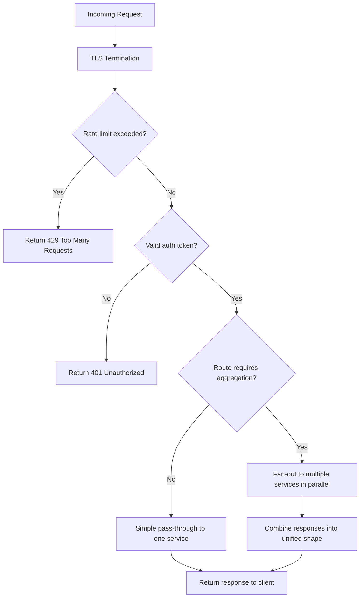
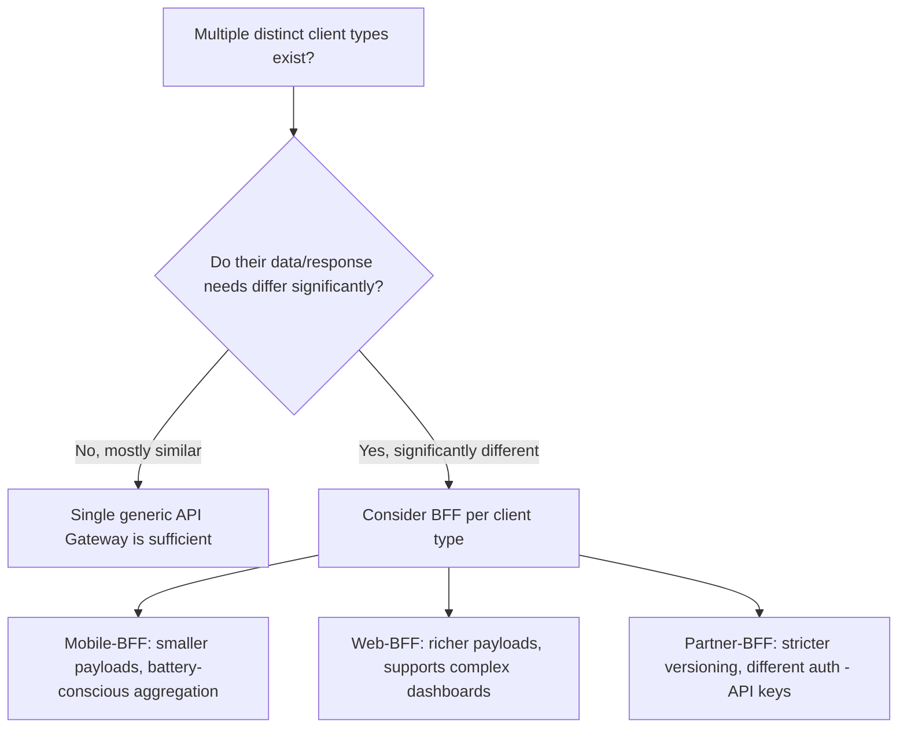
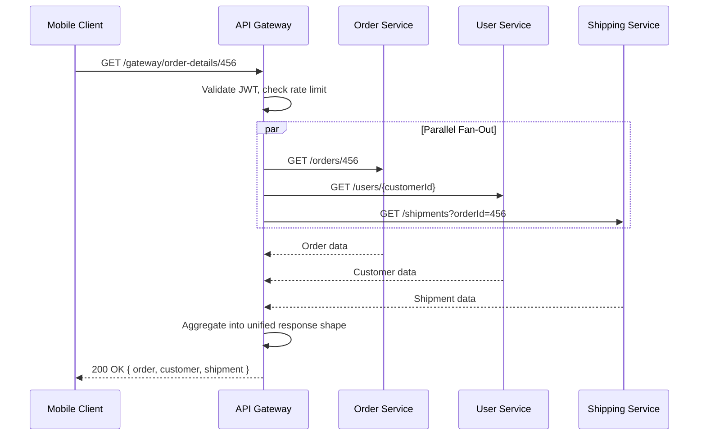

# Module 10 — API Gateway

> **Microservices Masterclass** | Level: Intermediate | Track: Node.js Backend Engineering
> Prerequisite: Module 1–9 (especially Module 3 — Microservice Architecture, Module 7 — REST Communication)
> Next Module: Module 11 — Service Discovery

---

## Table of Contents

1. [Introduction](#1-introduction)
2. [Learning Objectives](#2-learning-objectives)
3. [Problem Statement](#3-problem-statement)
4. [Why This Concept Exists](#4-why-this-concept-exists)
5. [Historical Background](#5-historical-background)
6. [Real-World Analogy](#6-real-world-analogy)
7. [Technical Definition](#7-technical-definition)
8. [Core Terminology](#8-core-terminology)
9. [Internal Working](#9-internal-working)
10. [Step-by-Step Request Flow](#10-step-by-step-request-flow)
11. [Architecture Overview](#11-architecture-overview)
12. [ASCII Diagrams](#12-ascii-diagrams)
13. [Mermaid Flowcharts](#13-mermaid-flowcharts)
14. [Mermaid Sequence Diagrams](#14-mermaid-sequence-diagrams)
15. [Component Diagrams](#15-component-diagrams)
16. [Deployment Diagrams](#16-deployment-diagrams)
17. [Database Interaction](#17-database-interaction)
18. [Failure Scenarios](#18-failure-scenarios)
19. [Scalability Discussion](#19-scalability-discussion)
20. [High Availability Considerations](#20-high-availability-considerations)
21. [CAP Theorem Implications](#21-cap-theorem-implications)
22. [Node.js Implementation](#22-nodejs-implementation)
23. [Express.js Examples](#23-expressjs-examples)
24. [Docker Examples](#24-docker-examples)
25. [Kafka/Redis Integration](#25-kafkaredis-integration)
26. [Error Handling](#26-error-handling)
27. [Logging & Monitoring](#27-logging--monitoring)
28. [Security Considerations](#28-security-considerations)
29. [Performance Optimization](#29-performance-optimization)
30. [Production Best Practices](#30-production-best-practices)
31. [Anti-Patterns and Common Mistakes](#31-anti-patterns-and-common-mistakes)
32. [Debugging Tips](#32-debugging-tips)
33. [Interview Questions](#33-interview-questions)
34. [Scenario-Based Questions](#34-scenario-based-questions)
35. [Hands-on Exercises](#35-hands-on-exercises)
36. [Mini Project](#36-mini-project)
37. [Advanced Project](#37-advanced-project)
38. [Summary](#38-summary)
39. [Revision Notes](#39-revision-notes)
40. [One-Page Cheat Sheet](#40-one-page-cheat-sheet)

---

## 1. Introduction

Module 3 introduced the API Gateway as one of the essential building blocks of a microservices architecture — the single front door clients use to reach your backend. Modules 6–9 then gave you the communication protocols (REST, gRPC, events) that flow *behind* that front door. This module returns to the Gateway itself and goes deep: how do you actually design, build, and operate a production-grade API Gateway?

An API Gateway is deceptively simple to describe ("it routes requests") but surprisingly rich in responsibility once you look closely: authentication, rate limiting, request/response transformation, response aggregation (calling multiple services and combining their results for a single client request), protocol translation (REST-in, gRPC-out), and observability all typically live here. Getting the Gateway right is one of the highest-leverage architectural decisions you'll make, since literally every external request flows through it.

---

## 2. Learning Objectives

By the end of this module, you will be able to:

- Explain the full range of responsibilities an API Gateway typically owns.
- Implement routing, authentication, and rate limiting in a Node.js-based Gateway.
- Design and implement response aggregation for client requests that span multiple services.
- Distinguish an API Gateway from a Backend-for-Frontend (BFF) and know when to use each.
- Avoid the "Gateway as a hidden monolith" anti-pattern.
- Design a highly available, horizontally scalable Gateway layer.

---

## 3. Problem Statement

A mobile app needs to render a single "Order Details" screen showing: order info, customer name, product details for each item, and current shipping status. Without a Gateway:

- The mobile app would need to know the internal hostnames/ports of `order-service`, `user-service`, `product-service`, and `shipping-service`, and make **four separate network calls**, each over a (likely slower, less reliable) public mobile network connection — multiplying latency and battery drain.
- Every one of those four services would need to implement its own authentication logic, duplicated four times, and each would be directly exposed to the public internet, expanding the attack surface significantly.
- If the company wants to add rate limiting per API key, they'd need to implement and maintain it consistently across all four services rather than in one place.
- Any change to internal service topology (e.g., splitting `product-service` into two) would require updating the mobile app itself — a slow, painful release process compared to updating an internal Gateway configuration.

This module solves this precisely: the Gateway becomes the **one** thing the mobile app talks to, aggregates the four internal calls into one response, handles auth/rate-limiting centrally, and completely hides internal topology changes from external clients.

---

## 4. Why This Concept Exists

The API Gateway pattern exists because **directly exposing internal microservices to external clients creates several compounding problems simultaneously**: security (larger attack surface, duplicated auth logic), performance (multiple round trips from potentially slow/unreliable client networks), coupling (clients become tightly coupled to internal service topology), and operational complexity (no central place to apply cross-cutting policies like rate limiting or logging). The Gateway centralizes all of these concerns into one well-understood, well-monitored layer, at the cost of introducing a new component that must itself be built resiliently and kept highly available (since, unlike any single backend service, **everything** depends on it.

---

## 5. Historical Background

- **2000s (SOA era)** — Enterprise Service Bus (ESB) products attempted to centralize routing and integration logic for large enterprise systems, but were often criticized for becoming complex, heavyweight, centralized bottlenecks that slowed down development rather than accelerating it.
- **2012–2013** — **Netflix** open-sourced **Zuul**, one of the earliest and most influential dedicated API Gateway implementations built specifically for a microservices architecture, handling routing, authentication, and resiliency for Netflix's massive-scale streaming platform.
- **Mid-2010s** — Dedicated API Gateway products matured rapidly: **Kong** (built on NGINX), **Amazon API Gateway** (a fully managed cloud offering), and later cloud-native **Ingress Controllers** for Kubernetes, each providing routing, auth, and rate limiting as configurable, production-ready infrastructure rather than something every team had to build from scratch.
- **Mid-2010s onward** — The related **Backend-for-Frontend (BFF)** pattern emerged (popularized by teams at companies like SoundCloud and Netflix), addressing a specific limitation of a single, generic Gateway: different client types (mobile vs. web vs. third-party partners) often need meaningfully different response shapes, and a single generic Gateway can become bloated trying to serve all of them identically.
- **Present** — Most production microservices systems use either a dedicated API Gateway product (Kong, AWS API Gateway, Apigee) or a Kubernetes-native Ingress/service-mesh-based gateway (Istio Gateway, Envoy-based solutions), often combined with one or more BFFs for client-specific needs.

---

## 6. Real-World Analogy

**Analogy: A Hotel's Front Desk**

Guests (clients) never wander the hotel's back offices directly to talk to housekeeping, room service, the laundry department, and billing separately for every request. Instead, they interact with **one front desk**:

- The front desk **authenticates** you (checks you're a registered guest with a room key).
- It **routes** your request to the right department (asking for extra towels routes to housekeeping; a billing question routes to accounting) — you never need to know which department handles what, or where they're physically located in the building.
- For a complex request ("I'd like to check out, and please also confirm my late checkout fee and my parking charges"), the front desk **aggregates** the answer from housekeeping status, billing, and parking into **one single response** to you, rather than sending you to three separate windows.
- It **enforces policies** uniformly (e.g., "no more than 3 service requests per hour without contacting a manager") without each individual department needing to independently track and enforce that same rule.
- If the hotel reorganizes its back-office departments next year, guests at the front desk never notice — the front desk's interface to guests stays exactly the same.

---

## 7. Technical Definition

> An **API Gateway** is a server that acts as the single entry point for external client requests into a microservices system, responsible for **routing** requests to the appropriate backend service(s), enforcing cross-cutting concerns (**authentication**, **rate limiting**, **logging**), and optionally performing **response aggregation** (combining results from multiple backend calls into a single client-facing response) and **protocol translation** (e.g., accepting REST from clients while calling gRPC internally, as introduced in Module 8).

> A **Backend-for-Frontend (BFF)** is a specialized variant of this pattern: rather than one generic Gateway serving all client types identically, each distinct client type (mobile app, web app, third-party partner API) gets its **own** tailored Gateway/aggregation layer, optimized for that client's specific needs (data shape, latency requirements, authentication method).

---

## 8. Core Terminology

| Term | Meaning |
|---|---|
| **API Gateway** | Single entry point handling routing, auth, rate limiting for external client requests |
| **Backend-for-Frontend (BFF)** | A client-type-specific Gateway/aggregation layer (one per client type, e.g., mobile-BFF, web-BFF) |
| **Response Aggregation** | Combining results from multiple backend service calls into a single response for the client |
| **Routing** | Directing an incoming request to the correct backend service based on path/host/headers |
| **Rate Limiting** | Restricting the number of requests a client can make in a given time window |
| **Protocol Translation** | Converting between protocols at the Gateway (e.g., client-facing REST, internal gRPC) |
| **Edge Authentication** | Validating client identity/tokens once at the Gateway, rather than in every backend service |
| **Fan-Out** | The Gateway making multiple parallel calls to different backend services for one client request |
| **Gateway Aggregation Anti-Pattern** | The Gateway accumulating so much business logic it becomes a hidden monolith |

---

## 9. Internal Working

Here's how a full-featured API Gateway processes a request end-to-end:

1. A client request arrives at the Gateway (already behind a Load Balancer, as covered in Module 3).
2. The Gateway performs **TLS termination** (decrypting HTTPS) if not already done upstream.
3. The Gateway applies **rate limiting** (per API key, IP, or user) — rejecting the request early if the client has exceeded their allowed quota, protecting downstream services from being overwhelmed.
4. The Gateway performs **authentication** — validating a JWT or session token — and extracts the caller's identity for downstream use.
5. The Gateway determines **routing**: based on the request path (and possibly headers, like `Accept-Version`), it decides which backend service(s) should handle this request.
6. For a **simple pass-through** request, the Gateway forwards the request to one backend service (via Service Discovery + Load Balancing, as in Module 3) and returns its response, mostly unchanged.
7. For an **aggregated** request (e.g., "Order Details" screen needing data from 4 services), the Gateway makes **multiple, ideally parallel**, backend calls, waits for all of them, and **combines** their results into one unified response shape tailored to the client's needs.
8. The Gateway logs the request (with a generated **trace ID** propagated to all downstream calls) and records metrics (latency, status code) for observability.
9. The Gateway returns the final response to the client, having hidden all internal topology, protocols, and the number of backend calls involved.

---

## 10. Step-by-Step Request Flow

**Scenario: Mobile app requests the "Order Details" screen, requiring aggregation across 4 services.**

```
Step 1:  Mobile app sends GET /gateway/order-details/456 with a JWT
Step 2:  Gateway validates the JWT, extracts customerId
Step 3:  Gateway applies rate limiting check for this customer/API key
Step 4:  Gateway determines this route requires AGGREGATION, not a
         simple pass-through
Step 5:  Gateway fires 3 PARALLEL calls:
           - GET order-service/orders/456
           - GET user-service/users/{customerId} (using ID from order)
           - GET shipping-service/shipments?orderId=456
Step 6:  Gateway awaits all 3 responses (with an overall timeout budget)
Step 7:  Gateway combines the 3 results into ONE tailored response shape:
         { order: {...}, customer: {...}, shipment: {...} }
Step 8:  Gateway logs the request with a trace ID, records latency metrics
Step 9:  Gateway returns the single combined response to the mobile app
```

Compare this to the "no Gateway" scenario from Section 3: the mobile app made **zero** direct calls to internal services, needed **zero** knowledge of `user-service` or `shipping-service`'s existence, and received exactly the shape of data its UI needed in **one** round trip over its (potentially slow) mobile network connection.

---

## 11. Architecture Overview

```
                     Mobile App / Web App
                              │
                              ▼
                       Load Balancer
                              │
                              ▼
                  ┌─────────────────────┐
                  │      API Gateway       │
                  │  - TLS termination      │
                  │  - Rate limiting        │
                  │  - Authentication       │
                  │  - Routing              │
                  │  - Response Aggregation │
                  └──────────┬──────────┘
        ┌───────────────────┼───────────────────┐
        ▼                   ▼                   ▼
  Order Service       User Service        Shipping Service
  (own DB)             (own DB)            (own DB)
```

---

## 12. ASCII Diagrams

### 12.1 Pass-Through Routing vs Response Aggregation

```
PASS-THROUGH (simple routing, no aggregation):

  Client ──▶ Gateway ──▶ Order Service ──▶ Gateway ──▶ Client
             (routes based on /orders/* path, returns response as-is)


RESPONSE AGGREGATION (Gateway combines multiple calls):

  Client ──▶ Gateway ──┬──▶ Order Service     ──┐
                        ├──▶ User Service       ──┼──▶ Gateway combines ──▶ Client
                        └──▶ Shipping Service   ──┘     results into ONE
                                                          response
```

### 12.2 API Gateway vs Backend-for-Frontend (BFF)

```
SINGLE GENERIC GATEWAY (one-size-fits-all):

              Mobile App ──┐
              Web App ─────┼──▶ ONE Gateway ──▶ Backend Services
              Partner API ─┘    (must satisfy ALL client needs,
                                  risk of becoming bloated)


BFF PATTERN (client-specific gateways):

  Mobile App ──▶ Mobile-BFF   ──▶ Backend Services
  Web App    ──▶ Web-BFF       ──▶ Backend Services
  Partner API──▶ Partner-BFF   ──▶ Backend Services

  Each BFF is tailored EXACTLY to its client's needs
  (different response shapes, different auth methods, etc.)
```

### 12.3 Rate Limiting at the Gateway

```
Client requests:  [====================================]  100 req/min

  Gateway Rate Limiter (per API key):
    Allowed: 60 req/min
    │
    ▼
  First 60 requests: forwarded to backend
  Remaining 40 requests: rejected with 429 Too Many Requests
                          (backend services NEVER see this excess load)
```

---

## 13. Mermaid Flowcharts

### 13.1 Gateway Request Processing Pipeline



### 13.2 Gateway vs BFF Decision



---

## 14. Mermaid Sequence Diagrams

### 14.1 Response Aggregation in Detail



---

## 15. Component Diagrams

```
┌─────────────────────────────────────────────────────────┐
│                       API Gateway                           │
│  ┌───────────────┐ ┌───────────────┐ ┌───────────────┐      │
│  │ Auth Middleware  │ │ Rate Limiter    │ │ Router           │      │
│  └───────────────┘ └───────────────┘ └───────────────┘      │
│  ┌─────────────────────────────────────────────────┐         │
│  │           Aggregation / Orchestration Layer          │         │
│  │   (fan-out calls, Promise.all, combine results)      │         │
│  └─────────────────────────────────────────────────┘         │
│  ┌───────────────┐ ┌───────────────┐ ┌───────────────┐      │
│  │ Logging/Tracing  │ │ Circuit Breakers│ │ Response Cache   │      │
│  └───────────────┘ └───────────────┘ └───────────────┘      │
└─────────────────────────────────────────────────────────┘
```

---

## 16. Deployment Diagrams

```
┌───────────────────────────────────────────────────────────┐
│                    Kubernetes Cluster                        │
│                                                               │
│  Ingress / Load Balancer                                     │
│         │                                                     │
│  ┌──────▼──────┐  ┌─────────────┐  ┌─────────────┐          │
│  │ gateway pod   │  │ gateway pod   │  │ gateway pod   │          │
│  │ (replica 1)   │  │ (replica 2)   │  │ (replica 3)   │          │
│  └──────┬──────┘  └──────┬──────┘  └──────┬──────┘          │
│         │                 │                 │                 │
│         └─────────────────┴─────────────────┘                 │
│                           │                                    │
│           (routes to backend services via                      │
│            Kubernetes Service discovery + load balancing)       │
└───────────────────────────────────────────────────────────┘
```

The Gateway itself must be deployed with **multiple replicas** behind its own load balancer — since it's now the single entry point, its own availability is as critical as any backend service, if not more so.

---

## 17. Database Interaction

The Gateway itself is typically **stateless** and should **not** own a primary database of its own — but it commonly uses supporting stores for specific cross-cutting concerns:

```
API Gateway (stateless, no primary data ownership)
       │
       ├──▶ Redis: rate limiting counters (e.g., "customer X: 45/60 requests this minute")
       ├──▶ Redis: short-lived response caching for GET aggregations
       └──▶ (No direct access to any backend service's database — EVER)
```

A Gateway that starts accumulating its own primary business data storage is a strong signal it has drifted into the "hidden monolith" anti-pattern (Section 31).

---

## 18. Failure Scenarios

| Scenario | Impact & Mitigation |
|---|---|
| Gateway instance crashes | Load balancer routes to healthy replicas; orchestrator restarts the crashed instance — requires multiple Gateway replicas to avoid total outage |
| One backend service (in an aggregated call) is down | Gateway should return a **partial response** with a clear indicator for the missing piece, rather than failing the entire aggregated request (graceful degradation) |
| Rate limiter's Redis store is unavailable | Gateway must decide: fail open (allow all requests, risking backend overload) or fail closed (reject all requests, risking unnecessary denial) — a deliberate policy choice, not an accident |
| One backend call in a fan-out is slow | Use a **timeout budget** for the overall aggregated request; a slow/hanging call shouldn't block the entire response indefinitely |

```
Graceful degradation for a failed aggregation leg:

  GET /gateway/order-details/456
       │
       ├──▶ Order Service: SUCCESS
       ├──▶ User Service: SUCCESS
       └──▶ Shipping Service: TIMEOUT/FAILED
       │
       ▼
  Return 200 OK with:
  {
    order: {...},
    customer: {...},
    shipment: null,          <- explicitly indicates missing data
    warnings: ["shipment data temporarily unavailable"]
  }

  Better than failing the ENTIRE request just because
  one non-critical piece of the aggregation failed
```

---

## 19. Scalability Discussion

Because the Gateway is stateless, it scales horizontally in exactly the same straightforward way as any other stateless service — add more replicas behind a load balancer. The Gateway's scalability ceiling is usually determined by the **slowest, most resource-intensive aggregation calls** it performs — heavy fan-out aggregation logic consumes more Gateway CPU/memory per request than simple pass-through routing, so capacity planning should account for the actual mix of simple vs. aggregated routes your Gateway handles in production.

---

## 20. High Availability Considerations

- The Gateway is arguably **the single most critical component** in your entire architecture from an availability standpoint — if it's down, the entire system is unreachable by external clients, regardless of how healthy every backend service is.
- Always run the Gateway with **multiple replicas across multiple availability zones**, behind a highly available load balancer (often a managed cloud load balancer for maximum reliability).
- Implement **circuit breakers** (Module 7) around each backend dependency the Gateway calls, so one unhealthy backend service doesn't consume the Gateway's own resources and risk making the Gateway itself unresponsive for unrelated routes.

---

## 21. CAP Theorem Implications

The Gateway itself doesn't typically hold data requiring CAP trade-offs directly, but it is the layer where **you must decide, per route, how to handle a backend partition/outage** — as shown in Section 18's graceful degradation example. The Gateway's rate limiter (if Redis-backed) makes its own CAP trade-off: most rate limiting implementations favor **Availability** (fail open — allow traffic through — if the Redis store is briefly unreachable) since blocking all traffic due to a rate-limiting infrastructure hiccup is usually a worse outcome than temporarily allowing slightly more traffic than intended.

---

## 22. Node.js Implementation

Let's build a Gateway that performs authentication, rate limiting, simple pass-through routing, AND response aggregation.

**Folder structure:**
```
api-gateway/
├── src/
│   ├── middleware/
│   │   ├── auth.js
│   │   └── rateLimiter.js
│   ├── routes/
│   │   ├── passthrough.js
│   │   └── orderDetailsAggregation.js
│   └── app.js
```

**`src/routes/orderDetailsAggregation.js`** — the core aggregation logic
```javascript
import axios from "axios";

const TIMEOUT_MS = 3000;

async function safeFetch(url, fallbackValue = null) {
  try {
    const res = await axios.get(url, { timeout: TIMEOUT_MS });
    return res.data;
  } catch (err) {
    // Graceful degradation: return the fallback instead of failing
    // the ENTIRE aggregated response over one non-critical piece
    return fallbackValue;
  }
}

export async function getOrderDetails(req, res) {
  const { orderId } = req.params;

  // Order data is CRITICAL — if this fails, the whole request should fail
  let order;
  try {
    const orderRes = await axios.get(
      `${process.env.ORDER_SERVICE_URL}/orders/${orderId}`,
      { timeout: TIMEOUT_MS }
    );
    order = orderRes.data;
  } catch (err) {
    return res.status(502).json({ error: "Unable to fetch order details" });
  }

  // Customer and shipment data are SUPPLEMENTARY — degrade gracefully if unavailable
  const [customer, shipment] = await Promise.all([
    safeFetch(`${process.env.USER_SERVICE_URL}/users/${order.customerId}`),
    safeFetch(`${process.env.SHIPPING_SERVICE_URL}/shipments?orderId=${orderId}`),
  ]);

  const warnings = [];
  if (!customer) warnings.push("Customer details temporarily unavailable");
  if (!shipment) warnings.push("Shipment details temporarily unavailable");

  res.status(200).json({ order, customer, shipment, warnings });
}
```

---

## 23. Express.js Examples

**`src/middleware/auth.js`**
```javascript
import jwt from "jsonwebtoken";

export function authenticate(req, res, next) {
  const authHeader = req.headers.authorization;
  if (!authHeader) return res.status(401).json({ error: "Missing authorization header" });

  try {
    req.user = jwt.verify(authHeader.split(" ")[1], process.env.JWT_SECRET);
    next();
  } catch (err) {
    res.status(401).json({ error: "Invalid or expired token" });
  }
}
```

**`src/middleware/rateLimiter.js`**
```javascript
import { redis } from "../db/redis.js";

const LIMIT = 60; // requests per window
const WINDOW_SECONDS = 60;

export async function rateLimit(req, res, next) {
  const key = `ratelimit:${req.user?.id || req.ip}`;

  try {
    const current = await redis.incr(key);
    if (current === 1) {
      await redis.expire(key, WINDOW_SECONDS);
    }
    if (current > LIMIT) {
      return res.status(429).json({ error: "Rate limit exceeded, please slow down" });
    }
    next();
  } catch (err) {
    // Fail OPEN: if Redis is briefly unavailable, allow the request
    // through rather than blocking all traffic due to an infra hiccup
    next();
  }
}
```

**`src/app.js`**
```javascript
import express from "express";
import { authenticate } from "./middleware/auth.js";
import { rateLimit } from "./middleware/rateLimiter.js";
import { getOrderDetails } from "./routes/orderDetailsAggregation.js";

const app = express();
app.use(express.json());

app.get("/health", (req, res) => res.json({ status: "ok" }));

app.use(authenticate);
app.use(rateLimit);

// Aggregated route: combines 3 backend calls into 1 response
app.get("/gateway/order-details/:orderId", getOrderDetails);

// Simple pass-through route (for comparison)
app.use("/gateway/orders", (req, res) => {
  // proxy directly to order-service, as shown in Module 3
});

app.listen(3000, () => console.log("API Gateway running on port 3000"));
```

---

## 24. Docker Examples

```yaml
version: "3.9"
services:
  api-gateway:
    build: ./api-gateway
    ports: ["3000:3000"]
    environment:
      - JWT_SECRET=supersecret
      - ORDER_SERVICE_URL=http://order-service:4002
      - USER_SERVICE_URL=http://user-service:4001
      - SHIPPING_SERVICE_URL=http://shipping-service:4006
      - REDIS_URL=redis://gateway-cache:6379
    depends_on: [order-service, user-service, shipping-service, gateway-cache]
    deploy:
      replicas: 3   # Gateway runs multiple replicas for HA

  order-service:
    build: ./order-service
  user-service:
    build: ./user-service
  shipping-service:
    build: ./shipping-service

  gateway-cache:
    image: redis:7-alpine
```

---

## 25. Kafka/Redis Integration

The Gateway can also cache **read-heavy aggregated responses** briefly, reducing repeated fan-out calls for identical requests within a short window:

```javascript
import { redis } from "../db/redis.js";

export async function getOrderDetailsCached(req, res) {
  const cacheKey = `order-details:${req.params.orderId}`;
  const cached = await redis.get(cacheKey);
  if (cached) {
    return res.status(200).json(JSON.parse(cached));
  }

  // ... perform the aggregation as in Section 22 ...
  const result = { order, customer, shipment, warnings };

  await redis.set(cacheKey, JSON.stringify(result), { EX: 15 }); // short TTL
  res.status(200).json(result);
}
```

Kafka is less commonly used directly *within* the Gateway itself (since the Gateway's role is primarily synchronous request handling), but the Gateway may publish **audit/analytics events** (e.g., "GatewayRequestHandled") asynchronously for observability purposes without impacting response latency.

---

## 26. Error Handling

The Gateway must translate errors from multiple, differently-behaving backend services into a **consistent** error contract for clients:

```javascript
function normalizeUpstreamError(err) {
  if (err.code === "ECONNABORTED") {
    return { status: 504, body: { error: "Upstream service timed out" } };
  }
  if (!err.response) {
    return { status: 503, body: { error: "Upstream service unavailable" } };
  }
  return { status: err.response.status, body: err.response.data };
}
```

This ensures a mobile client only ever needs to understand **one** consistent error shape, regardless of which internal service actually failed.

---

## 27. Logging & Monitoring

- The Gateway is the ideal place to generate the **trace ID** for every request (as first introduced in Module 3), since it's the true entry point for all external traffic.
- Monitor **per-route latency and error rate** — separately for pass-through routes and aggregation routes, since aggregation routes will naturally have higher latency (bounded by the slowest fan-out call) and deserve separate alerting thresholds.
- Track **rate limit rejection counts** per client/API key to identify abusive clients or clients that may need a higher allocated quota.

```javascript
app.use((req, res, next) => {
  req.traceId = req.headers["x-trace-id"] || crypto.randomUUID();
  res.setHeader("x-trace-id", req.traceId);
  const start = Date.now();
  res.on("finish", () => {
    logger.info(
      { traceId: req.traceId, route: req.path, status: res.statusCode, durationMs: Date.now() - start },
      "Gateway request handled"
    );
  });
  next();
});
```

---

## 28. Security Considerations

- The Gateway is your **primary security perimeter** — backend services should ideally not be reachable directly from the public internet at all, only through the Gateway.
- Apply **strict input validation** at the Gateway before forwarding requests, catching malformed or malicious payloads as early as possible.
- Use **short-lived, scoped tokens** for the Gateway's own calls to backend services (rather than simply forwarding the client's original token unchanged) where finer-grained internal authorization is needed.
- Keep the Gateway's dependencies (npm packages, base Docker image) rigorously up to date — as the single most exposed component, it's also the highest-value target for attackers.

---

## 29. Performance Optimization

- **Parallelize** independent fan-out calls using `Promise.all` (as shown in Section 22) rather than awaiting them sequentially — sequential aggregation calls needlessly multiply latency.
- Set a **timeout budget** for the entire aggregated request (not just per individual call) so the Gateway doesn't wait longer than the client's own patience/timeout would allow.
- Cache **safe-to-cache, read-heavy aggregated responses** briefly (Section 25) to reduce redundant fan-out load on backend services for identical, frequently-requested data.
- Use HTTP **keep-alive connections** to backend services (as covered in Module 7) to avoid repeated connection setup overhead for high-volume Gateway-to-service traffic.

---

## 30. Production Best Practices

- Keep the Gateway **free of deep business logic** — its job is routing, aggregation shaping, and cross-cutting concerns, not domain rules that belong inside a specific service (Section 31's anti-pattern).
- Version your Gateway's external API contract (`/v1/gateway/...`) just as you would any REST API (Module 7), independent of how the internal services are versioned.
- Treat Gateway configuration (routes, rate limits, auth rules) as code — version-controlled, reviewed, and tested like any other critical system component.
- Consider a **BFF** per distinct client type once a single generic Gateway starts accumulating client-specific special-casing logic — this is a strong signal it's time to split.

---

## 31. Anti-Patterns and Common Mistakes

| Anti-Pattern | Why It's a Problem |
|---|---|
| **Gateway as a hidden monolith** | Accumulating deep business logic, database access, or domain rules inside the Gateway recreates monolithic coupling in a new location |
| **No redundancy for the Gateway itself** | A single Gateway instance is now a single point of failure for the ENTIRE system |
| **Sequential (not parallel) fan-out calls** | Needlessly multiplies aggregation latency by the number of backend calls |
| **One generic Gateway trying to serve wildly different client types identically** | Leads to bloated, special-cased logic — consider BFFs instead |
| **Exposing backend services directly alongside the Gateway** | Undermines the Gateway's role as the security perimeter; defeats much of its purpose |

```
Gateway as hidden monolith (anti-pattern):

  API Gateway contains:
    - Direct database queries for "quick" business logic
    - Complex domain validation rules
    - Its OWN business data storage

  Problem: the Gateway has quietly become a new monolith that
  every client depends on directly, recreating exactly the
  coupling problem microservices were meant to solve
```

---

## 32. Debugging Tips

- For a failed aggregated request, check each fan-out leg's individual status/latency separately — the failure is very likely isolated to just one of the several backend calls, not the Gateway itself.
- Use the Gateway-generated trace ID to follow a single request across every backend service it fanned out to.
- If rate limiting seems inconsistent, check whether your rate limiter key (Section 23) correctly distinguishes between different clients (e.g., accidentally rate-limiting by a shared IP behind a corporate NAT, rather than by authenticated user/API key).
- If the Gateway itself becomes a bottleneck under load, profile whether the bottleneck is CPU-bound (heavy aggregation/transformation logic) or I/O-bound (waiting on slow backend calls) — the fixes differ significantly.

---

## 33. Interview Questions

### Easy
1. What is the primary role of an API Gateway?
2. What is response aggregation, and why is it useful?
3. What is a Backend-for-Frontend (BFF), and how does it differ from a generic API Gateway?
4. Why should the API Gateway avoid holding significant business logic or its own primary database?
5. Why must the API Gateway itself be deployed with multiple replicas?

### Medium
6. How would you handle a scenario where one of several backend calls in an aggregated request fails, but the others succeed?
7. Explain how rate limiting should behave if its backing store (e.g., Redis) becomes temporarily unavailable, and why.
8. When would you introduce a BFF instead of continuing to extend a single generic Gateway?
9. Why should Gateway-to-backend calls be parallelized rather than sequential where possible?
10. What security benefits does centralizing authentication at the Gateway provide over each service authenticating independently?

### Hard
11. Design the aggregation logic (with graceful degradation) for a "Product Page" screen requiring data from Product, Inventory, Reviews, and Recommendations services, where Recommendations is allowed to fail silently but the others are not.
12. How would you detect and prevent the "Gateway as hidden monolith" anti-pattern from creeping into a system over time?
13. Explain the trade-offs of doing protocol translation (REST-in, gRPC-out) at the Gateway versus having each backend service expose both protocols itself.
14. Design a Gateway architecture that must serve three very different client types (a low-bandwidth mobile app, a rich internal admin dashboard, and a third-party partner API) — would you use one Gateway or multiple BFFs, and why?
15. How would you load-test and capacity-plan for a Gateway that handles a mix of simple pass-through and heavy aggregation routes?

---

## 34. Scenario-Based Questions

1. Your mobile team complains that the "Order Details" screen takes 2+ seconds to load due to 4 sequential API calls made directly from the app. How would you redesign this using the concepts in this module?
2. After adding Gateway-level response aggregation, engineers start adding more and more business validation logic directly into the Gateway "since it's convenient." How do you address this before it becomes a problem?
3. Your API Gateway goes down for 5 minutes due to a bad deploy, and the entire platform becomes unreachable even though every backend service was healthy. What redundancy and deployment practices would you put in place to prevent this?
4. A third-party partner integration needs a completely different authentication method (API keys, not JWT) and a much simpler response shape than your mobile app. How would you architecturally support this?
5. Your rate limiter's Redis store had an outage, and during that time your Gateway "failed open," allowing significantly more traffic than intended, causing a backend service to become overloaded. How do you balance this trade-off going forward?

---

## 35. Hands-on Exercises

1. Design (on paper) the Gateway routes and aggregation logic needed for a "Restaurant Detail" screen for a food delivery app (needs Restaurant info, Menu items, and current Reviews from 3 separate services).
2. Implement the `getOrderDetails` aggregation handler from Section 22, including graceful degradation for at least one non-critical backend call.
3. Implement the rate limiter from Section 23, and write a test verifying it correctly fails open when Redis is unreachable.
4. Identify one signal (from Section 31) that would indicate a real or hypothetical Gateway has become a "hidden monolith," and describe how you'd address it.
5. Sketch an architecture diagram showing when you'd use a single generic Gateway versus multiple BFFs for a system with mobile, web, and partner API clients.

---

## 36. Mini Project

**Build: A Gateway With Auth, Rate Limiting, and Simple Pass-Through Routing**

1. Build `api-gateway` with JWT authentication (Section 23) and Redis-backed rate limiting (fail-open on Redis errors).
2. Implement simple pass-through routing to two mock backend services (`user-service`, `order-service`).
3. Add a trace ID middleware and structured logging for every request (Section 27).
4. Deploy with Docker Compose, running the Gateway with 2 replicas behind a simple load balancer (e.g., NGINX) to demonstrate horizontal scaling.

---

## 37. Advanced Project

**Build: A Full Aggregating Gateway With Graceful Degradation and Caching**

1. Extend the Mini Project into a full aggregation scenario: implement `GET /gateway/order-details/:orderId`, fanning out to `order-service` (critical), `user-service` (non-critical, degrade gracefully), and `shipping-service` (non-critical, degrade gracefully), exactly as in Section 22.
2. Add short-TTL Redis caching for the aggregated response (Section 25).
3. Add circuit breakers (using `opossum`, from Module 7) around each backend call within the aggregation logic, so a persistently failing backend doesn't slow down every subsequent aggregated request.
4. Chaos-test: stop `shipping-service` and verify the Gateway still returns a 200 response with a `warnings` array, rather than failing the entire request.
5. Write a short architectural decision document explaining whether this system would benefit from a BFF split (e.g., separate mobile vs. web Gateways) as it grows, and why.

---

## 38. Summary

- The API Gateway is the single entry point for external clients, centralizing routing, authentication, rate limiting, and (optionally) response aggregation and protocol translation.
- Response aggregation lets the Gateway combine multiple backend calls into one client-facing response, dramatically reducing round trips for client applications, especially on slower networks.
- Non-critical pieces of an aggregated response should degrade gracefully rather than failing the entire request.
- The Backend-for-Frontend (BFF) pattern addresses the limitation of one generic Gateway trying to serve meaningfully different client types identically.
- The Gateway must be treated as a first-class, highly available service in its own right — since everything depends on it — while carefully avoiding the "hidden monolith" anti-pattern of accumulating deep business logic.

---

## 39. Revision Notes

- API Gateway: single entry point — routing, auth, rate limiting, aggregation, protocol translation.
- Response Aggregation: parallel fan-out + combine; degrade gracefully for non-critical legs.
- BFF: client-type-specific Gateway variant, used when client needs diverge significantly.
- Gateway must be stateless, horizontally scalable, and highly available — it's now the most critical single component.
- Avoid the "hidden monolith" anti-pattern: no deep business logic or primary data ownership in the Gateway.
- Rate limiting typically fails open (favors availability) if its backing store is briefly unavailable.

---

## 40. One-Page Cheat Sheet

```
API GATEWAY RESPONSIBILITIES: routing | auth | rate limiting | aggregation | protocol translation
RESPONSE AGGREGATION:          parallel fan-out (Promise.all) + combine into ONE response
GRACEFUL DEGRADATION:          non-critical legs return null/warning, not a full failure
BFF:                           client-type-specific Gateway (mobile-BFF, web-BFF, partner-BFF)
RATE LIMITING FAILURE MODE:    typically FAIL OPEN (favor availability over strict enforcement)

GOLDEN RULES:
  - Gateway = routing + cross-cutting concerns, NEVER deep business logic (no hidden monolith)
  - Parallelize fan-out calls; never sequential-await independent backend calls
  - Degrade gracefully - one failed non-critical leg should not fail the whole aggregation
  - Run the Gateway with multiple replicas - it is now your most critical single component
  - Consider a BFF once one generic Gateway must serve meaningfully different client needs
```

---

**Suggested Next Module:** Module 11 — Service Discovery (deep dive into static vs dynamic discovery, and implementations like Eureka, Consul, and Kubernetes-native discovery)
