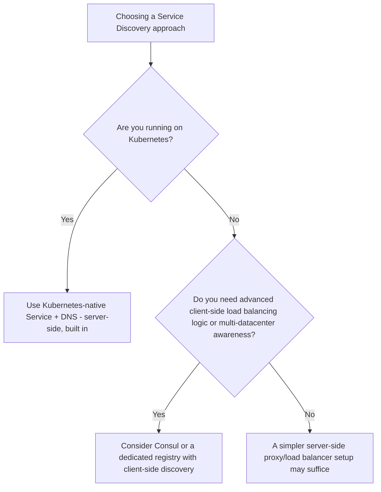
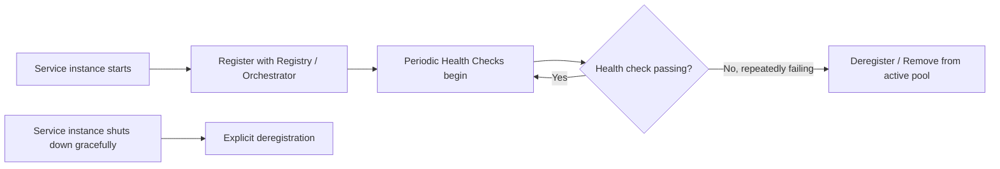
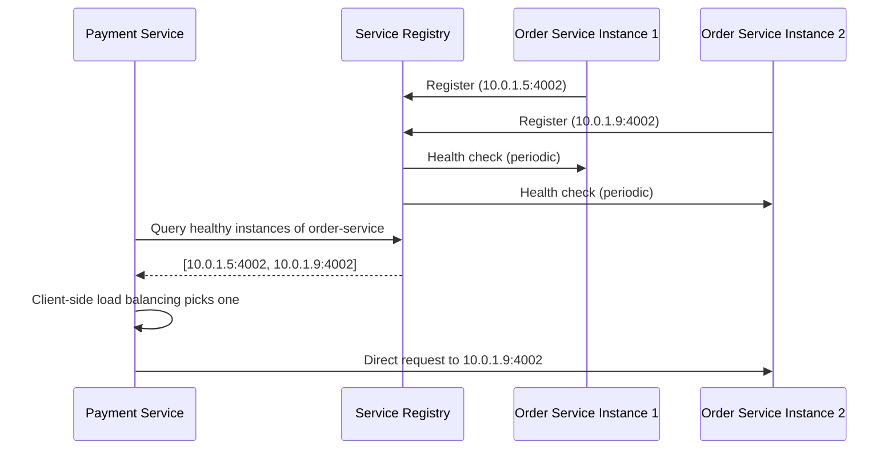
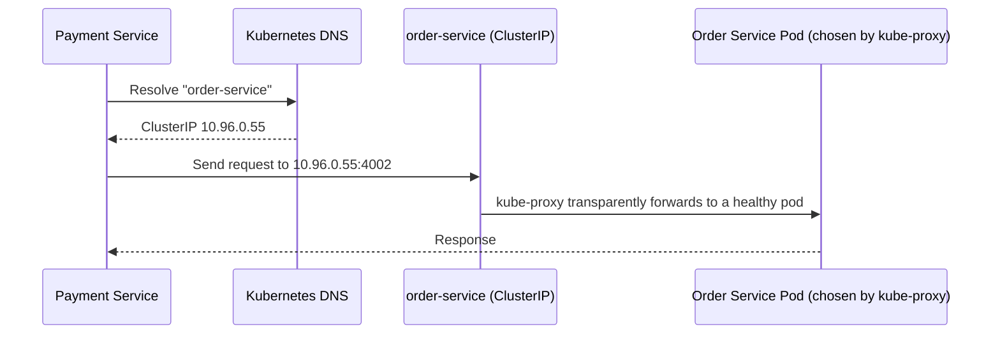

# Module 11 — Service Discovery

> **Microservices Masterclass** | Level: Intermediate | Track: Node.js Backend Engineering
> Prerequisite: Module 1–10 (especially Module 3 — Microservice Architecture, Module 10 — API Gateway)
> Next Module: Module 12 — Configuration Management

---

## Table of Contents

1. [Introduction](#1-introduction)
2. [Learning Objectives](#2-learning-objectives)
3. [Problem Statement](#3-problem-statement)
4. [Why This Concept Exists](#4-why-this-concept-exists)
5. [Historical Background](#5-historical-background)
6. [Real-World Analogy](#6-real-world-analogy)
7. [Technical Definition](#7-technical-definition)
8. [Core Terminology](#8-core-terminology)
9. [Internal Working](#9-internal-working)
10. [Step-by-Step Request Flow](#10-step-by-step-request-flow)
11. [Architecture Overview](#11-architecture-overview)
12. [ASCII Diagrams](#12-ascii-diagrams)
13. [Mermaid Flowcharts](#13-mermaid-flowcharts)
14. [Mermaid Sequence Diagrams](#14-mermaid-sequence-diagrams)
15. [Component Diagrams](#15-component-diagrams)
16. [Deployment Diagrams](#16-deployment-diagrams)
17. [Database Interaction](#17-database-interaction)
18. [Failure Scenarios](#18-failure-scenarios)
19. [Scalability Discussion](#19-scalability-discussion)
20. [High Availability Considerations](#20-high-availability-considerations)
21. [CAP Theorem Implications](#21-cap-theorem-implications)
22. [Node.js Implementation](#22-nodejs-implementation)
23. [Express.js Examples](#23-expressjs-examples)
24. [Docker Examples](#24-docker-examples)
25. [Kafka/Redis Integration](#25-kafkaredis-integration)
26. [Error Handling](#26-error-handling)
27. [Logging & Monitoring](#27-logging--monitoring)
28. [Security Considerations](#28-security-considerations)
29. [Performance Optimization](#29-performance-optimization)
30. [Production Best Practices](#30-production-best-practices)
31. [Anti-Patterns and Common Mistakes](#31-anti-patterns-and-common-mistakes)
32. [Debugging Tips](#32-debugging-tips)
33. [Interview Questions](#33-interview-questions)
34. [Scenario-Based Questions](#34-scenario-based-questions)
35. [Hands-on Exercises](#35-hands-on-exercises)
36. [Mini Project](#36-mini-project)
37. [Advanced Project](#37-advanced-project)
38. [Summary](#38-summary)
39. [Revision Notes](#39-revision-notes)
40. [One-Page Cheat Sheet](#40-one-page-cheat-sheet)

---

## 1. Introduction

Module 3 mentioned Service Discovery briefly as one of the essential building blocks. Module 10 showed you the Gateway routing to backend services "via Service Discovery + Load Balancing" without dwelling on how that actually works. This module fills that gap completely: **how do services actually find each other's current network location in a system where instances are constantly starting, stopping, scaling, and moving?**

This sounds like it should be simple — "just use the IP address" — until you remember that in a modern containerized, auto-scaled, self-healing system, IP addresses are **not stable**. A Kubernetes pod can be rescheduled to a different node and get an entirely new IP at any moment. A service might scale from 3 to 15 instances during a traffic spike. Hardcoding locations, even briefly, is not an option. This module explains the mechanisms — client-side and server-side discovery, registries, health checks — that solve this continuously-changing-location problem reliably.

---

## 2. Learning Objectives

By the end of this module, you will be able to:

- Explain why static configuration (hardcoded IPs/hostnames) fails in a dynamic microservices environment.
- Distinguish client-side service discovery from server-side service discovery, and the trade-offs of each.
- Explain how a Service Registry works, including registration, health checks, and deregistration.
- Describe how Kubernetes provides service discovery natively via its Service and DNS objects.
- Implement a basic client-side discovery mechanism in Node.js.
- Recognize discovery-related failure modes (stale entries, split-brain registries) and how to mitigate them.

---

## 3. Problem Statement

A team deploys `order-service` with 3 instances behind a container orchestrator. Over the course of a normal day:

- Instance 2 crashes due to a memory spike; the orchestrator restarts it on a **different node**, giving it a **new IP address**.
- Traffic increases during lunch hour; the orchestrator **auto-scales** `order-service` from 3 to 8 instances, each getting a **new IP address** that didn't exist an hour ago.
- A routine deployment **replaces all 3 original instances** with 3 brand new ones (rolling deployment), each with yet another new IP address.

If `payment-service` (or the API Gateway) had hardcoded `order-service`'s IP addresses anywhere — in a config file, an environment variable set once at deploy time, or worse, directly in code — every one of these completely normal, everyday events would break inter-service communication. This module solves this: **how do calling services always find the current, correct, healthy set of instances, without ever needing to hardcode a location?**

---

## 4. Why This Concept Exists

Service Discovery exists because **container orchestration and auto-scaling fundamentally break the assumption that a service's network location is stable** — an assumption that held reasonably well in the era of manually-provisioned, long-lived physical or virtual servers, but does not hold at all in a modern, elastic, self-healing microservices environment. Service Discovery provides the missing piece: a live, continuously-updated, queryable source of truth for "where is service X *right now*, and which of its instances are actually healthy?" — decoupling callers entirely from the ever-changing physical/network reality of where callees happen to be running at any given moment.

---

## 5. Historical Background

- **Pre-2010s** — In traditional data centers with long-lived physical servers, service location was often managed via manually-updated DNS entries or static configuration files — acceptable because servers rarely moved or changed IPs, and scaling events were infrequent, planned, manual processes.
- **2012–2014** — As Netflix pioneered large-scale, dynamic cloud deployments on AWS (where instances are ephemeral by design), they built and open-sourced **Eureka**, one of the most influential early dedicated Service Registry implementations, specifically to handle this new reality of constantly-changing instance locations.
- **2014** — **HashiCorp** released **Consul**, another widely-adopted service discovery and service mesh tool, offering both a registry and built-in health checking.
- **2014–2015** — **Kubernetes** was announced, building service discovery directly into its core design via **kube-dns** (later **CoreDNS**) and the **Service** object — meaning teams adopting Kubernetes often got robust service discovery "for free," without needing a separate dedicated tool like Eureka or Consul.
- **Present** — Kubernetes-native discovery (via Services and DNS) has become the dominant approach for teams already using Kubernetes, while Consul remains popular for non-Kubernetes or hybrid/multi-platform environments, and Netflix Eureka, while historically influential, has become less commonly adopted for new projects as Kubernetes-native patterns took over.

---

## 6. Real-World Analogy

**Analogy: A Package Delivery Service Using a Live Tracking System, Not a Fixed Address Book**

Imagine trying to deliver a package to a fleet of delivery trucks that are **constantly moving** — you can't write down "Truck 7 is at 123 Main Street" in a fixed address book, because by the time you check it, Truck 7 has moved to a completely different location. Instead, a well-run delivery company uses a **live GPS tracking system**: every truck continuously reports its current location, and anyone needing to route a package to "whichever truck is closest and available" queries this **live, constantly-updated system** rather than relying on a static, outdated address book.

- **Registration** = each truck's GPS unit continuously reporting "I am Truck 7, currently at [live coordinates], and I'm operational."
- **Health Check** = the tracking system periodically confirming each truck is still responding and functioning, removing trucks that have gone silent (broken down) from the active list.
- **Discovery/Lookup** = a dispatcher asking the live tracking system "which trucks are currently available and where are they?" right before assigning a new delivery — never relying on yesterday's printout.

This is exactly Service Discovery: services (trucks) continuously register their live location and health with a central system (the tracking dashboard), and callers (dispatchers) always query this live system rather than any static, potentially stale record.

---

## 7. Technical Definition

> **Service Discovery** is the mechanism by which a calling service determines the current network location (host and port) of one or more healthy instances of a target service, without relying on static, hardcoded configuration.

> A **Service Registry** is the component (or distributed system) that maintains the live, continuously-updated mapping of service names to the network locations of their currently healthy instances — services **register** themselves (or are auto-registered by the orchestrator) upon startup, and are **deregistered** upon shutdown or when health checks fail.

> **Client-Side Discovery** is a pattern where the calling service itself queries the registry directly and chooses which instance to call (often incorporating its own load-balancing logic).

> **Server-Side Discovery** is a pattern where the calling service simply sends its request to a well-known, stable address (e.g., a load balancer or the orchestrator's built-in networking layer), and that intermediary component consults the registry and routes the request on the caller's behalf — the caller never queries the registry directly.

---

## 8. Core Terminology

| Term | Meaning |
|---|---|
| **Service Registry** | The live, queryable store of service names → healthy instance locations |
| **Registration** | A service instance announcing its existence and location to the registry upon startup |
| **Deregistration** | Removing a service instance's entry from the registry upon shutdown or failure |
| **Health Check** | A periodic probe confirming a registered instance is still alive and able to handle traffic |
| **Client-Side Discovery** | Caller queries the registry directly and picks an instance itself |
| **Server-Side Discovery** | Caller sends requests to a stable endpoint; an intermediary handles registry lookup and routing |
| **DNS-Based Discovery** | Using standard DNS resolution (often augmented) as the discovery mechanism, as Kubernetes does |
| **Self-Registration** | The service instance itself is responsible for registering with the registry on startup |
| **Third-Party Registration** | A separate component (e.g., the orchestrator) registers instances on the service's behalf, without the service's own code needing to know about the registry at all |
| **Stale Entry** | A registry entry pointing to an instance that is no longer actually healthy/running |

---

## 9. Internal Working

Here's how service discovery works end-to-end, contrasting the two main patterns:

**Client-Side Discovery:**
1. Each `order-service` instance, upon startup, **registers itself** with the Service Registry (e.g., Consul or Eureka), providing its host, port, and service name.
2. The registry periodically performs **health checks** against each registered instance (e.g., hitting its `/health` endpoint) and removes any instance that fails to respond.
3. When `payment-service` needs to call `order-service`, it **queries the registry directly**: "give me all healthy instances of order-service."
4. `payment-service`'s own client-side load-balancing logic **picks one instance** from the returned list (round-robin, random, or least-connections) and sends the request directly to that instance.
5. `payment-service` typically **caches** this list briefly to avoid querying the registry on every single request, refreshing periodically.

**Server-Side Discovery (the Kubernetes-native approach):**
1. Each `order-service` pod is automatically registered by Kubernetes itself (via its built-in mechanisms) as soon as it becomes healthy — no application code is needed to "register."
2. `payment-service` simply sends its request to a **stable DNS name**: `order-service.production.svc.cluster.local` (or simply `order-service` within the same namespace).
3. Kubernetes's internal DNS resolves this name to the **Service's** stable virtual IP (ClusterIP), and `kube-proxy` (or the CNI's networking layer) transparently load-balances the actual TCP connection across the currently healthy pod IPs behind that Service.
4. `payment-service`'s code never directly queries a registry or handles a list of instances — from its perspective, it just called a normal, stable hostname.

---

## 10. Step-by-Step Request Flow

**Scenario: Client-side discovery flow using Consul, contrasted with Kubernetes-native discovery.**

```
CLIENT-SIDE DISCOVERY (e.g., using Consul):

Step 1:  order-service instance starts, registers itself with Consul:
         { name: "order-service", address: "10.0.1.5", port: 4002 }
Step 2:  Consul begins periodic health checks against 10.0.1.5:4002/health
Step 3:  payment-service needs to call order-service
Step 4:  payment-service queries Consul: "GET healthy instances of order-service"
Step 5:  Consul returns: [{10.0.1.5:4002}, {10.0.1.9:4002}]
Step 6:  payment-service's client-side load balancer picks one (e.g., round-robin)
Step 7:  payment-service sends the actual request directly to 10.0.1.5:4002


SERVER-SIDE / KUBERNETES-NATIVE DISCOVERY:

Step 1:  order-service pods are scheduled and become healthy; Kubernetes
         automatically updates the Endpoints for the order-service Service object
Step 2:  payment-service sends a request to http://order-service:4002/orders
Step 3:  Kubernetes's internal DNS resolves "order-service" to the Service's
         stable ClusterIP (e.g., 10.96.0.55)
Step 4:  kube-proxy transparently routes the connection to one of the
         currently healthy pod IPs behind that ClusterIP
Step 5:  payment-service's code never directly interacted with any
         registry or instance list — Kubernetes handled it all transparently
```

---

## 11. Architecture Overview

```
CLIENT-SIDE DISCOVERY ARCHITECTURE:

  order-service instances ──register──▶  Service Registry (Consul/Eureka)
        (multiple, changing)                        ▲
                                                       │ query
                                              payment-service
                                          (picks an instance itself,
                                           calls it DIRECTLY)


SERVER-SIDE / KUBERNETES-NATIVE ARCHITECTURE:

  order-service pods ──auto-registered──▶  Kubernetes Service + Endpoints
        (multiple, changing)                        ▲
                                                       │ DNS lookup + transparent routing
                                              payment-service
                                    (calls a STABLE name; Kubernetes
                                     handles everything behind it)
```

---

## 12. ASCII Diagrams

### 12.1 Client-Side vs Server-Side Discovery

```
CLIENT-SIDE DISCOVERY:

  Payment Svc ──query registry──▶ Registry ──returns instance list──▶ Payment Svc
  Payment Svc ──picks instance, calls DIRECTLY──▶ Order Svc Instance #2

  Payment Svc needs discovery-aware client logic (e.g., a Consul client library)


SERVER-SIDE DISCOVERY:

  Payment Svc ──simple call to stable name──▶ order-service:4002
                                                      │
                                            (Kubernetes Service/Proxy
                                             handles registry lookup +
                                             load balancing INVISIBLY)
                                                      ▼
                                            Order Svc Instance #2

  Payment Svc code has ZERO discovery-specific logic
```

### 12.2 Registration & Health Check Lifecycle

```
  order-service instance starts
           │
           ▼
  Registers with registry: "I am order-service @ 10.0.1.5:4002"
           │
           ▼
  Registry begins periodic health checks (e.g., every 10s)
           │
     ┌─────┴─────┐
     ▼           ▼
  Healthy      Unhealthy (missed N consecutive checks)
     │           │
  Stays in     Automatically REMOVED from registry
  registry     (callers stop being routed to it)
```

### 12.3 Kubernetes Service/Endpoints Mapping

```
              Kubernetes Service: "order-service"
                     (stable ClusterIP: 10.96.0.55)
                              │
                   automatically tracks
                              │
                              ▼
                    Endpoints object:
              [10.0.1.5:4002, 10.0.1.9:4002, 10.0.1.14:4002]
              (updated automatically as pods start/stop/become
               healthy or unhealthy via readiness probes)
```

---

## 13. Mermaid Flowcharts

### 13.1 Choosing a Discovery Approach



### 13.2 Registration and Deregistration Flow



---

## 14. Mermaid Sequence Diagrams

### 14.1 Client-Side Discovery Call



### 14.2 Kubernetes-Native (Server-Side) Discovery Call



---

## 15. Component Diagrams

```
┌─────────────────────────────────────────────────────────┐
│                   Service Registry Layer                    │
│   (Consul / Eureka / Kubernetes API Server + CoreDNS)         │
│  ┌───────────────┐  ┌───────────────┐  ┌───────────────┐   │
│  │ Registration     │  │ Health Checking  │  │ Query/Lookup     │   │
│  │ Endpoint          │  │ Subsystem         │  │ API/DNS           │   │
│  └───────────────┘  └───────────────┘  └───────────────┘   │
└─────────────────────────────────────────────────────────┘
        ▲                                          │
  register/heartbeat                        query/resolve
        │                                          ▼
┌───────────────┐                        ┌───────────────┐
│ Service Instances │                        │  Calling Services  │
│ (order-service,    │                        │  (payment-service,  │
│  user-service,...)  │                        │   API Gateway,...)   │
└───────────────┘                        └───────────────┘
```

---

## 16. Deployment Diagrams

```
┌───────────────────────────────────────────────────────────┐
│                    Kubernetes Cluster                        │
│                                                               │
│  order-service Deployment (5 replicas, IPs change on restart) │
│         │                                                     │
│  order-service Service object (STABLE ClusterIP + DNS name)   │
│         │                                                     │
│  Endpoints automatically tracked & updated by Kubernetes       │
│         │                                                     │
│  payment-service pods call "order-service" — Kubernetes         │
│  handles ALL discovery and load balancing transparently         │
└───────────────────────────────────────────────────────────┘

┌───────────────────────────────────────────────────────────┐
│              Non-Kubernetes / Hybrid Environment              │
│                                                               │
│  order-service instances on VMs (register with Consul agent)  │
│         │                                                     │
│  Consul Server Cluster (the Service Registry, replicated       │
│  across multiple nodes for HA, using the Raft consensus         │
│  algorithm)                                                    │
│         │                                                     │
│  payment-service queries Consul directly (client-side           │
│  discovery) or via a local Consul agent/sidecar                │
└───────────────────────────────────────────────────────────┘
```

---

## 17. Database Interaction

Service Discovery systems have their own internal storage needs, distinct from any business service's database:

```
Consul / etcd (used by Kubernetes internally):
  - A distributed, replicated key-value store
  - Stores the live registry data: service name -> [instance locations]
  - Uses a CONSENSUS ALGORITHM (Raft) to keep this data consistent
    across multiple registry nodes, favoring CONSISTENCY over
    availability during a network partition (see Section 21)

This is a COMPLETELY SEPARATE concern from any business service's
own database (Order DB, Payment DB, etc.) — the registry only
stores "where are instances," never business data.
```

---

## 18. Failure Scenarios

| Scenario | Impact & Mitigation |
|---|---|
| A service instance crashes ungracefully (no clean shutdown) | Health checks will eventually detect the failure and remove it from the registry — but there's a brief window where the registry may still list a dead instance (a "stale entry") |
| The registry itself becomes unavailable | Depending on design, callers may fall back to a **cached** list of recently-known-healthy instances (client-side discovery) or, for Kubernetes, the control plane being briefly unavailable doesn't affect *already-configured* routing, since kube-proxy's rules are already in place on each node |
| A newly-started instance isn't yet ready to receive traffic | **Readiness probes** (distinct from liveness/health checks) ensure an instance isn't added to the registry/Endpoints until it's actually ready to serve requests, not just "process started" |
| Network partition between a service and the registry | The service may be unable to register/health-check successfully, potentially being removed from the registry even though it's still healthy — a classic CAP theorem trade-off (Section 21) |

```
Stale entry scenario:

  order-service instance crashes WITHOUT a graceful shutdown
  (e.g., the process is killed abruptly, OOM-killed)
           │
           ▼
  Registry still lists this instance as "healthy" until
  the NEXT health check cycle detects it's unresponsive
           │
           ▼
  Callers may briefly route requests to this dead instance,
  experiencing connection failures/timeouts until the registry
  catches up and removes the stale entry
```

---

## 19. Scalability Discussion

Service Discovery systems must themselves scale to handle the query/registration volume of potentially hundreds or thousands of service instances across a large system. Kubernetes's approach (using its own distributed `etcd` store internally, with DNS caching at each node) scales well because most of the actual load-balancing decision-making (`kube-proxy`'s routing rules) is pre-computed and distributed to each node, rather than requiring a live registry query for every single request. Dedicated registries like Consul similarly rely on efficient gossip protocols and local agent caching to avoid every single service instance hammering a central registry server on every request.

---

## 20. High Availability Considerations

- The Service Registry itself must be **highly available** — if it becomes a single point of failure, the entire system's ability to route requests correctly is at risk. Both Consul and Kubernetes's underlying `etcd` run as **replicated clusters** (typically 3 or 5 nodes) using consensus algorithms specifically for this reason.
- **Health checks** must be tuned carefully: too infrequent, and a failed instance stays in rotation too long (causing failed requests); too frequent/aggressive, and you risk false-positive removals of healthy-but-momentarily-slow instances.
- **Readiness vs. liveness** distinction (Kubernetes terminology, but the concept applies broadly): a service can be "alive" (process running) but not yet "ready" (still warming up, loading data) — only ready instances should receive traffic.

---

## 21. CAP Theorem Implications

Service registries are themselves distributed systems and must make their own CAP trade-offs. Kubernetes's underlying `etcd` (and by extension, its service discovery) is built on the **Raft consensus algorithm**, which favors **Consistency** over Availability during a network partition — meaning in rare, severe partition scenarios, the control plane may become temporarily unable to update routing information rather than risk serving inconsistent/incorrect data about which instances are healthy. In practice, this rarely affects *already-established* data plane routing (existing `kube-proxy` rules on each node continue working even if the control plane is briefly partitioned), which is a deliberate design choice separating the "control plane" (where CP trade-offs matter) from the "data plane" (which should remain available even during control plane hiccups).

---

## 22. Node.js Implementation

Let's implement a simple client-side discovery mechanism against a mock registry, illustrating the core mechanics (since in practice, most Node.js teams either use Kubernetes-native discovery directly or a client library for Consul/Eureka).

**Folder structure:**
```
order-service/
├── src/
│   ├── discovery/
│   │   └── registerWithRegistry.js
│   └── app.js

payment-service/
├── src/
│   ├── discovery/
│   │   └── discoveryClient.js
│   └── clients/
│       └── orderServiceClient.js
```

**`order-service/src/discovery/registerWithRegistry.js`** — self-registration pattern
```javascript
import axios from "axios";
import os from "os";

const REGISTRY_URL = process.env.REGISTRY_URL || "http://registry:8500";
const SERVICE_NAME = "order-service";
const SERVICE_PORT = 4002;

// Determine this instance's own reachable address (in a real system,
// this would typically come from the container/pod's network interface)
function getInstanceAddress() {
  return process.env.POD_IP || os.hostname();
}

export async function registerService() {
  const instanceId = `${SERVICE_NAME}-${getInstanceAddress()}-${SERVICE_PORT}`;
  await axios.put(`${REGISTRY_URL}/v1/agent/service/register`, {
    ID: instanceId,
    Name: SERVICE_NAME,
    Address: getInstanceAddress(),
    Port: SERVICE_PORT,
    Check: {
      HTTP: `http://${getInstanceAddress()}:${SERVICE_PORT}/health`,
      Interval: "10s",
      Timeout: "2s",
    },
  });
  console.log(`Registered ${instanceId} with the service registry`);

  // Deregister gracefully on shutdown
  process.on("SIGTERM", async () => {
    await axios.put(`${REGISTRY_URL}/v1/agent/service/deregister/${instanceId}`);
    process.exit(0);
  });
}
```

**`payment-service/src/discovery/discoveryClient.js`** — client-side discovery + basic load balancing
```javascript
import axios from "axios";

const REGISTRY_URL = process.env.REGISTRY_URL || "http://registry:8500";
let cachedInstances = {};
let lastFetchTime = {};
const CACHE_TTL_MS = 5000; // refresh the instance list periodically, not on every call

async function fetchHealthyInstances(serviceName) {
  const now = Date.now();
  if (cachedInstances[serviceName] && now - lastFetchTime[serviceName] < CACHE_TTL_MS) {
    return cachedInstances[serviceName]; // use cached list to avoid hammering the registry
  }

  const response = await axios.get(`${REGISTRY_URL}/v1/health/service/${serviceName}?passing=true`);
  const instances = response.data.map((entry) => ({
    address: entry.Service.Address,
    port: entry.Service.Port,
  }));

  cachedInstances[serviceName] = instances;
  lastFetchTime[serviceName] = now;
  return instances;
}

let roundRobinCounters = {};

// Simple round-robin client-side load balancing over discovered instances
export async function pickInstance(serviceName) {
  const instances = await fetchHealthyInstances(serviceName);
  if (instances.length === 0) {
    throw new Error(`No healthy instances found for ${serviceName}`);
  }

  roundRobinCounters[serviceName] = (roundRobinCounters[serviceName] || 0) + 1;
  const index = roundRobinCounters[serviceName] % instances.length;
  return instances[index];
}
```

---

## 23. Express.js Examples

**`payment-service/src/clients/orderServiceClient.js`** — using discovery in a real call
```javascript
import axios from "axios";
import { pickInstance } from "../discovery/discoveryClient.js";

export async function getOrder(orderId) {
  const instance = await pickInstance("order-service");
  const url = `http://${instance.address}:${instance.port}/orders/${orderId}`;

  try {
    const response = await axios.get(url, { timeout: 3000 });
    return response.data;
  } catch (err) {
    // A failed call to a specific instance could mean it just went
    // unhealthy since our last cache refresh — a production system
    // would typically retry against a DIFFERENT instance here
    throw new Error(`Failed to reach order-service instance at ${url}: ${err.message}`);
  }
}
```

**`order-service/src/app.js`** — registering on startup
```javascript
import express from "express";
import { registerService } from "./discovery/registerWithRegistry.js";

const app = express();
app.use(express.json());

app.get("/health", (req, res) => res.json({ status: "ok" }));

app.get("/orders/:id", (req, res) => {
  res.json({ id: req.params.id, status: "PLACED" });
});

const PORT = 4002;
app.listen(PORT, async () => {
  console.log(`Order Service running on port ${PORT}`);
  await registerService(); // register with the registry only AFTER we're ready to serve traffic
});
```

**Contrast: the same call using Kubernetes-native discovery (no discovery-specific code needed at all):**
```javascript
// payment-service, running on Kubernetes — discovery is entirely invisible
import axios from "axios";

export async function getOrder(orderId) {
  // "order-service" is a stable Kubernetes Service DNS name;
  // Kubernetes handles ALL discovery and load balancing transparently
  const response = await axios.get(`http://order-service:4002/orders/${orderId}`, { timeout: 3000 });
  return response.data;
}
```

---

## 24. Docker Examples

```yaml
version: "3.9"
services:
  registry:
    image: consul:1.18
    ports: ["8500:8500"]
    command: agent -dev -client=0.0.0.0

  order-service:
    build: ./order-service
    environment:
      - REGISTRY_URL=http://registry:8500
    depends_on: [registry]
    deploy:
      replicas: 3   # each replica self-registers independently

  payment-service:
    build: ./payment-service
    environment:
      - REGISTRY_URL=http://registry:8500
    depends_on: [registry, order-service]
```

For a Kubernetes-native equivalent, the "registry" is Kubernetes itself — no separate Consul container is needed; a standard `Service` manifest provides the same capability:

```yaml
apiVersion: v1
kind: Service
metadata:
  name: order-service
spec:
  selector:
    app: order-service
  ports:
    - port: 4002
      targetPort: 4002
```

---

## 25. Kafka/Redis Integration

Service discovery is orthogonal to Kafka/Redis usage, but it's worth noting: **Kafka brokers themselves** need to be discoverable by producers/consumers, typically via a **bootstrap server list** (a small, relatively stable set of broker addresses) rather than full dynamic service discovery — Kafka clients, once connected to any bootstrap broker, learn about the full cluster topology (including partition leaders) directly from the brokers' own metadata protocol, which is a specialized discovery mechanism covered in depth in the Kafka Masterclass. Redis, similarly, is often accessed via a stable endpoint (e.g., a managed Redis cluster's configuration endpoint) rather than requiring the same dynamic per-instance discovery mechanism used for your own microservices.

---

## 26. Error Handling

When a discovered instance turns out to be unreachable (a stale entry), the calling client should retry against a **different** instance rather than simply failing outright:

```javascript
export async function getOrderWithFailover(orderId, maxAttempts = 3) {
  for (let attempt = 1; attempt <= maxAttempts; attempt++) {
    try {
      return await getOrder(orderId); // internally picks an instance via discovery
    } catch (err) {
      if (attempt === maxAttempts) throw err;
      // Force a fresh registry lookup on retry, in case the failed
      // instance is now stale/deregistered
      invalidateCache("order-service");
    }
  }
}
```

---

## 27. Logging & Monitoring

- Log every discovery **lookup and cache refresh** (which instances were returned, from where) to help debug routing anomalies.
- Monitor the **registry's own health** (Consul cluster status, Kubernetes control plane health) as critical infrastructure metrics — a degraded registry is a system-wide risk, not a single-service concern.
- Track **health check failure rates** per service to catch instances that are flapping (repeatedly failing and recovering health checks), which often indicates an underlying resource or configuration issue worth investigating.

---

## 28. Security Considerations

- Restrict access to the Service Registry's API/UI to internal networks only — exposing your live service topology publicly is a significant information leak aiding potential attackers.
- Use **mutual TLS** between services and the registry (Consul supports this natively) to prevent unauthorized services from registering malicious/spoofed entries.
- In Kubernetes, use **Network Policies** to restrict which pods can even attempt to reach which services, adding a layer of defense beyond just discovery.

---

## 29. Performance Optimization

- **Cache discovery results** briefly on the client side (as shown in Section 22) rather than querying the registry on every single request — this dramatically reduces load on the registry at high request volumes.
- For Kubernetes, DNS caching (often handled by `NodeLocal DNSCache` in larger clusters) reduces the latency and load of repeated DNS lookups for the same service name.
- Prefer **connection pooling/keep-alive** to the resolved instance once discovered, rather than re-resolving on every single call within a short burst of requests to the same service.

---

## 30. Production Best Practices

- On Kubernetes, prefer the **native Service + DNS mechanism** over introducing a separate dedicated registry (Consul/Eureka) unless you have a specific cross-platform, multi-cluster, or advanced traffic-management need that Kubernetes-native discovery doesn't cover.
- Always implement **separate readiness and liveness health checks** — readiness determines whether an instance should receive new traffic; liveness determines whether the orchestrator should restart it. Conflating the two can cause instances to be prematurely removed from or kept in rotation incorrectly.
- Ensure services **deregister gracefully** on shutdown (handling `SIGTERM`) rather than relying solely on health checks to eventually notice they're gone — this minimizes the "stale entry" window during planned deployments.
- Monitor and alert on the registry/control plane's own health as a top-tier, critical piece of infrastructure.

---

## 31. Anti-Patterns and Common Mistakes

| Anti-Pattern | Why It's a Problem |
|---|---|
| **Hardcoding service IPs/hostnames anywhere** | Breaks the moment an instance restarts, scales, or is redeployed — defeats the entire purpose of dynamic environments |
| **No readiness probe, only a liveness check** | A newly-started instance that's alive but not yet ready to serve traffic may receive requests prematurely, causing errors during startup/deployment |
| **Querying the registry on every single request with no caching** | Creates unnecessary load on the registry at scale, and adds latency to every call |
| **No graceful deregistration on shutdown** | Leaves stale entries in the registry until health checks eventually catch up, causing avoidable failed requests during routine deploys |
| **Treating the registry as an afterthought for HA** | The registry becoming unavailable can be as catastrophic as any single business service going down — it deserves equal operational rigor |

```
No readiness probe (anti-pattern):

  New order-service instance starts, process is "alive"
  immediately, but is still loading a large in-memory cache
  and isn't ready to correctly answer requests yet
           │
           ▼
  Registry adds it to the pool immediately (only checking
  liveness, not readiness)
           │
           ▼
  Callers start sending it traffic BEFORE it's actually ready,
  causing errors/incorrect responses during every deployment
```

---

## 32. Debugging Tips

- If a service intermittently fails to reach another service, check the registry/Endpoints directly for **stale or unhealthy entries** before assuming a code-level bug.
- For Kubernetes, use `kubectl get endpoints <service-name>` to see exactly which pod IPs are currently registered behind a Service — a quick, authoritative way to verify discovery is working as expected.
- If discovery seems to return outdated instance lists, check your **cache TTL** configuration (Section 22) — a TTL that's too long can mask recent scaling/deployment changes for longer than expected.
- For registry outages, check whether your client-side discovery code has a sensible **fallback** (e.g., using the last known cached list) rather than failing every single call the moment the registry is briefly unreachable.

---

## 33. Interview Questions

### Easy
1. What is Service Discovery, and why is it necessary in a microservices architecture?
2. What is the difference between client-side and server-side service discovery?
3. What is a Service Registry?
4. How does Kubernetes provide service discovery without a separate tool like Consul?
5. Why can't you simply hardcode a service's IP address in a modern containerized environment?

### Medium
6. Explain the difference between a readiness probe and a liveness probe, and why both matter for discovery.
7. What is a "stale entry" in a service registry, and how does it occur?
8. Why should a calling service cache discovery results rather than querying the registry on every request?
9. Compare the operational complexity of client-side discovery (e.g., with Consul) versus Kubernetes-native server-side discovery.
10. Why must the Service Registry itself be highly available, and how do systems like Consul and Kubernetes's etcd achieve this?

### Hard
11. Design a graceful deployment strategy that minimizes the window during which stale/not-yet-ready instances could receive traffic.
12. Explain how Kubernetes's Raft-based etcd handles a network partition, and what CAP theorem trade-off this represents.
13. How would you debug a scenario where a client-side discovery cache is returning instances that no longer exist, causing intermittent connection failures?
14. Design a service discovery strategy for a hybrid environment where some services run on Kubernetes and others still run on traditional VMs.
15. Discuss the trade-offs of a very short discovery cache TTL (near-real-time accuracy, higher registry load) versus a longer TTL (lower load, higher risk of stale data).

---

## 34. Scenario-Based Questions

1. During a rolling deployment, your team notices a spike in failed requests for about 10 seconds. Investigation shows new instances were receiving traffic before they'd finished loading their startup cache. What's the fix?
2. Your Consul cluster experiences a brief network partition, and some services report being unable to discover others even though they were healthy. How would you explain what likely happened, using CAP theorem concepts?
3. A payment-service engineer hardcodes an order-service IP "just for local testing" and forgets to remove it before merging to production. What's your recommended safeguard to prevent this class of mistake?
4. Your discovery cache TTL is set to 60 seconds, and during a traffic spike your orchestrator scales a service from 3 to 15 instances, but calling services take almost a minute to start using the new instances. How would you address this?
5. You're migrating from a Consul-based system to Kubernetes. What specific code changes (if any) would be needed in your services' discovery-related logic?

---

## 35. Hands-on Exercises

1. Implement the self-registration pattern from Section 22 for a simple Express service, registering with a locally-running Consul instance (via Docker).
2. Implement the client-side discovery + round-robin load balancing pattern from Section 22, and verify it correctly distributes calls across 2+ registered instances.
3. Deploy a simple 2-service system on a local Kubernetes cluster (e.g., via `minikube` or `kind`) and verify that Kubernetes-native DNS-based discovery works without any application-level discovery code.
4. Write a readiness probe endpoint (`/ready`) distinct from a liveness endpoint (`/health`) for a service that takes a few seconds to warm up a cache on startup.
5. Simulate a stale entry: manually deregister an instance mid-flight while a client's cache still references it, and observe/handle the resulting failed request with a retry-against-a-different-instance strategy.

---

## 36. Mini Project

**Build: Self-Registering Services With Client-Side Discovery**

1. Set up a Consul container (as in Section 24).
2. Build `order-service` (2+ replicas) that self-registers on startup and gracefully deregisters on `SIGTERM`, as in Section 22.
3. Build `payment-service` with the client-side discovery + round-robin load balancing client from Section 22–23.
4. Verify: stop one `order-service` replica and confirm `payment-service` correctly stops routing to it (after the health check interval elapses) without any code changes or restarts needed on `payment-service`'s side.

---

## 37. Advanced Project

**Build: Comparing Client-Side Discovery vs Kubernetes-Native Discovery**

1. Deploy the Mini Project's Consul-based system inside Docker Compose, exactly as built.
2. Separately, deploy the same two services (`order-service`, `payment-service`) on a local Kubernetes cluster (`minikube`/`kind`), this time using Kubernetes-native Service objects and DNS-based discovery, removing all Consul-specific registration/discovery code entirely.
3. Write a comparison document covering: lines of discovery-specific code required in each approach, operational complexity (extra Consul infrastructure vs. built-in Kubernetes features), and behavior during a simulated instance failure in each environment.
4. In the Kubernetes deployment, implement and test a readiness probe that delays an instance from receiving traffic for 5 seconds after startup (simulating a cache warm-up), and confirm Kubernetes correctly withholds traffic during that window.
5. Document what would change if you needed to support a hybrid environment with services running both on Kubernetes and on traditional VMs simultaneously.

---

## 38. Summary

- Service Discovery solves the problem of finding the current, correct network location of healthy service instances in a dynamic, elastic environment where IP addresses are never stable.
- Client-side discovery (Consul, Eureka) has the calling service query a registry directly and choose an instance itself; server-side discovery (Kubernetes-native) hides this entirely behind a stable name and transparent routing layer.
- Kubernetes provides service discovery natively via its Service objects and internal DNS, making a separate dedicated registry unnecessary for most Kubernetes-based systems.
- Health checks (and the readiness/liveness distinction) are essential to ensure only genuinely healthy, ready instances receive traffic.
- The registry itself is critical infrastructure requiring high availability, typically achieved via a consensus algorithm (Raft) favoring consistency during partitions.

---

## 39. Revision Notes

- Service Discovery: finding current healthy instance locations dynamically, never hardcoded.
- Client-side discovery: caller queries registry + load-balances itself (Consul/Eureka).
- Server-side discovery: caller uses a stable name; an intermediary (Kubernetes Service/kube-proxy) handles the rest.
- Readiness probe: is this instance ready for traffic? Liveness probe: is this instance alive/should it be restarted?
- Registry HA: typically built on a consensus algorithm (Raft), favoring Consistency during partitions.
- Cache discovery results client-side to reduce registry load; balance freshness vs. load with TTL.

---

## 40. One-Page Cheat Sheet

```
SERVICE DISCOVERY:      finding current, healthy instance locations dynamically
CLIENT-SIDE DISCOVERY:  caller queries registry + load-balances itself (Consul/Eureka)
SERVER-SIDE DISCOVERY:  caller uses stable name; K8s Service/kube-proxy handles the rest
SERVICE REGISTRY:       live store of service name -> healthy instance locations
READINESS PROBE:        is this instance ready for traffic RIGHT NOW?
LIVENESS PROBE:         is this instance alive / should the orchestrator restart it?
STALE ENTRY:            registry entry pointing to a no-longer-healthy instance

GOLDEN RULES:
  - NEVER hardcode service IPs/hostnames anywhere
  - Prefer Kubernetes-native discovery when already on Kubernetes
  - Always separate readiness from liveness checks
  - Deregister gracefully on shutdown (SIGTERM) - don't rely only on health checks
  - Cache discovery results briefly on the client side to reduce registry load
  - The registry itself is critical infrastructure - it needs its own HA strategy
```

---

**Suggested Next Module:** Module 12 — Configuration Management (environment variables, config servers, secrets management, and feature flags in a microservices context)
