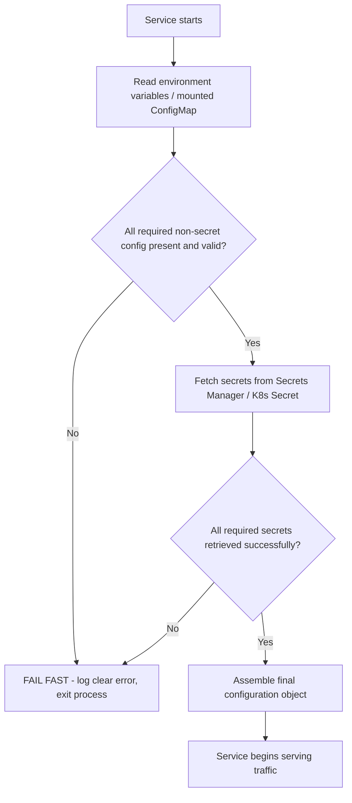
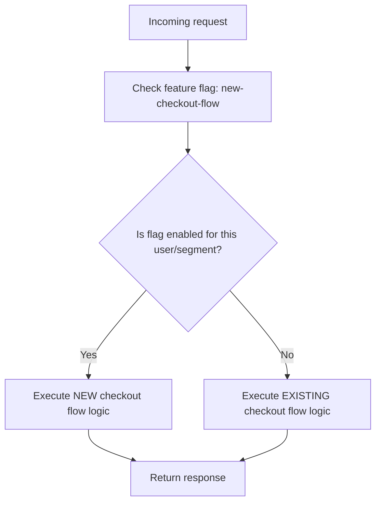
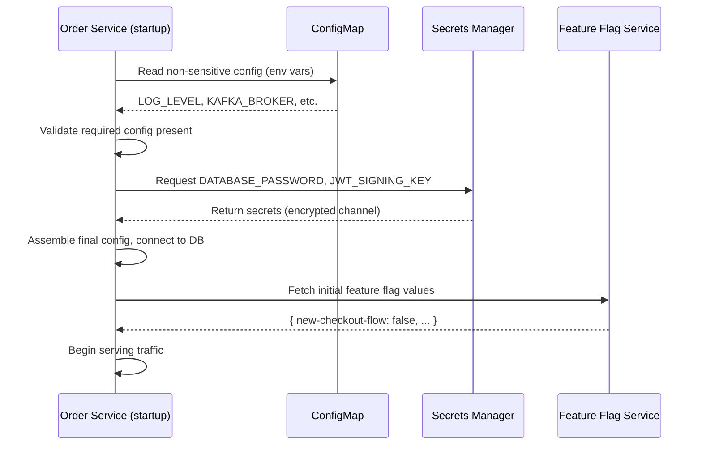

# Module 12 — Configuration Management

> **Microservices Masterclass** | Level: Intermediate | Track: Node.js Backend Engineering
> Prerequisite: Module 1–11 (especially Module 11 — Service Discovery)
> Next Module: Module 13 — Authentication

---

## Table of Contents

1. [Introduction](#1-introduction)
2. [Learning Objectives](#2-learning-objectives)
3. [Problem Statement](#3-problem-statement)
4. [Why This Concept Exists](#4-why-this-concept-exists)
5. [Historical Background](#5-historical-background)
6. [Real-World Analogy](#6-real-world-analogy)
7. [Technical Definition](#7-technical-definition)
8. [Core Terminology](#8-core-terminology)
9. [Internal Working](#9-internal-working)
10. [Step-by-Step Request Flow](#10-step-by-step-request-flow)
11. [Architecture Overview](#11-architecture-overview)
12. [ASCII Diagrams](#12-ascii-diagrams)
13. [Mermaid Flowcharts](#13-mermaid-flowcharts)
14. [Mermaid Sequence Diagrams](#14-mermaid-sequence-diagrams)
15. [Component Diagrams](#15-component-diagrams)
16. [Deployment Diagrams](#16-deployment-diagrams)
17. [Database Interaction](#17-database-interaction)
18. [Failure Scenarios](#18-failure-scenarios)
19. [Scalability Discussion](#19-scalability-discussion)
20. [High Availability Considerations](#20-high-availability-considerations)
21. [CAP Theorem Implications](#21-cap-theorem-implications)
22. [Node.js Implementation](#22-nodejs-implementation)
23. [Express.js Examples](#23-expressjs-examples)
24. [Docker Examples](#24-docker-examples)
25. [Kafka/Redis Integration](#25-kafkaredis-integration)
26. [Error Handling](#26-error-handling)
27. [Logging & Monitoring](#27-logging--monitoring)
28. [Security Considerations](#28-security-considerations)
29. [Performance Optimization](#29-performance-optimization)
30. [Production Best Practices](#30-production-best-practices)
31. [Anti-Patterns and Common Mistakes](#31-anti-patterns-and-common-mistakes)
32. [Debugging Tips](#32-debugging-tips)
33. [Interview Questions](#33-interview-questions)
34. [Scenario-Based Questions](#34-scenario-based-questions)
35. [Hands-on Exercises](#35-hands-on-exercises)
36. [Mini Project](#36-mini-project)
37. [Advanced Project](#37-advanced-project)
38. [Summary](#38-summary)
39. [Revision Notes](#39-revision-notes)
40. [One-Page Cheat Sheet](#40-one-page-cheat-sheet)

---

## 1. Introduction

Every service you've built across this masterclass has needed configuration: database URLs, service endpoints, JWT secrets, Kafka broker addresses, feature toggles. In a monolith, this was one `.env` file. In a system with 20+ microservices — each with its own database credentials, its own downstream service URLs, its own feature flags — configuration becomes a distinct, non-trivial engineering problem in its own right.

This module addresses a question that seems boring until it causes a 3am incident: **where does configuration live, how does it get to a running service, how do you change it safely, and how do you keep secrets (passwords, API keys, signing keys) out of your source code and version control entirely?** Get this wrong, and you either leak credentials publicly (a serious security incident) or you can't safely change a single config value without a full redeployment (a serious velocity problem).

---

## 2. Learning Objectives

By the end of this module, you will be able to:

- Explain the different layers of configuration in a microservices system (environment variables, config files, centralized config servers, secrets managers).
- Distinguish configuration from secrets, and explain why they need different handling.
- Implement environment-variable-based configuration correctly and safely in Node.js.
- Explain when and why to introduce a centralized configuration server or feature flag system.
- Integrate with a secrets manager (e.g., HashiCorp Vault, AWS Secrets Manager, Kubernetes Secrets) conceptually and in code.
- Recognize configuration anti-patterns, including hardcoded secrets and configuration drift across environments.

---

## 3. Problem Statement

A team runs `order-service` in three environments: local development, staging, and production. Each environment needs a different database URL, a different Kafka broker address, and different feature flag values (e.g., "new checkout flow" enabled in staging but not yet in production). Without a deliberate configuration strategy:

- An engineer accidentally commits the **production database password** directly into a config file in the Git repository — now it's in the Git history forever, even if later deleted, and needs to be rotated immediately as a security incident.
- Each environment's config drifts out of sync over time (someone updates staging's Kafka broker address but forgets production), causing confusing, hard-to-reproduce bugs that only manifest in one specific environment.
- To change a single feature flag (e.g., enabling a new feature for 10% of users), the team must modify code, rebuild, and redeploy the entire service — a slow, high-risk process for what should be an instant, low-risk toggle.
- Fifteen different services each read configuration slightly differently (some use `.env` files, some hardcode defaults, some read from a shared but undocumented config file), making it impossible to audit or reason about the system's configuration as a whole.

This module solves each of these: a clear separation of config vs. secrets, environment-specific configuration without code duplication, and centralized feature flag management for safe, instant behavioral changes.

---

## 4. Why This Concept Exists

Configuration Management exists as a distinct discipline because **the same codebase must behave correctly across multiple environments (local, staging, production) and must be changeable without requiring a code change and redeployment for every adjustment** — two requirements that, without deliberate design, pull against clean, secure software engineering. The core principle underlying this entire module, widely known as one of the **Twelve-Factor App** methodology's central tenets, is: **strict separation of configuration from code.** Configuration varies substantially across deploys (dev, staging, production); code does not (or should not) — and treating these as the same thing leads directly to the security and operational problems in Section 3.

---

## 5. Historical Background

- **Pre-2010s** — Configuration was often baked directly into deployed application packages, or managed via environment-specific build artifacts (e.g., separate WAR files for each environment in Java shops) — a slow, error-prone, and duplication-heavy approach.
- **2011** — Heroku published **"The Twelve-Factor App"**, a highly influential methodology for building cloud-native, portable applications, with **Factor III: Config** stating explicitly that configuration (which varies between environments) must be strictly separated from code (which does not), and stored in **environment variables** rather than in the codebase itself.
- **Early-to-mid 2010s** — As microservices proliferated, teams needed to manage configuration across dozens or hundreds of services simultaneously, giving rise to dedicated **configuration server** products — Spring Cloud Config (2015) being a notable early example in the Java ecosystem, centralizing configuration for many services in one place.
- **2014** — **HashiCorp** released **Vault**, addressing the specific and increasingly recognized need for **secrets** (as opposed to general configuration) to be managed with stronger security guarantees: encryption at rest, fine-grained access policies, and automatic secret rotation.
- **Present** — Kubernetes's native **ConfigMaps** and **Secrets** objects, combined with cloud-native secrets managers (AWS Secrets Manager, Google Secret Manager, HashiCorp Vault) and feature flag platforms (LaunchDarkly, Unleash, or simpler in-house solutions), represent the current standard toolkit for configuration management in microservices systems.

---

## 6. Real-World Analogy

**Analogy: A Restaurant Chain's Recipe Book vs. Local Ingredient Sourcing vs. the Safe**

Imagine a restaurant chain with locations in different cities:

- **The recipe (code)** stays the **same** everywhere — every location makes the same dish the same way.
- **Local ingredient sourcing details (configuration)** vary by location — the Chicago restaurant sources tomatoes from a different local supplier than the Miami restaurant, but this doesn't change the recipe itself, just which supplier's phone number is on file at each location.
- **The restaurant's safe combination and banking credentials (secrets)** are a fundamentally different category of information — they must never be written on a whiteboard in the kitchen where any staff member (or the recipe book itself, which gets photocopied and shared) could see them. They're kept in a genuinely secure, access-controlled location, changed periodically, and only the specific people/systems that need them can access them.

Treating "which tomato supplier to use" the same way you'd treat "the safe's combination" is a mistake in either direction: over-securing simple config creates unnecessary friction, while under-securing genuine secrets creates real risk. This module is about correctly sorting your system's configuration into the right category and handling each appropriately.

---

## 7. Technical Definition

> **Configuration** is any value that a service needs to run correctly and that legitimately varies between environments (development, staging, production) or between deployments — such as a database hostname, a feature flag value, or a downstream service's URL — but that is **not sensitive** if exposed.

> A **Secret** is a specific category of configuration that is **sensitive**: if exposed (e.g., leaked in logs, committed to version control, or accessed by an unauthorized party), it creates a genuine security risk — examples include database passwords, API keys, JWT signing keys, and TLS private keys.

> **Twelve-Factor App Factor III (Config)** states that configuration must be **strictly separated from code**, stored outside the codebase (e.g., in environment variables), so the same compiled/packaged application artifact can be deployed unchanged across every environment, differing only in its externally-supplied configuration.

> A **Feature Flag (or Feature Toggle)** is a runtime-configurable switch that enables or disables a specific piece of functionality **without requiring a code deployment**, often supporting gradual rollouts (e.g., enabled for 10% of users) or instant rollback if a new feature causes problems.

---

## 8. Core Terminology

| Term | Meaning |
|---|---|
| **Environment Variable** | A key-value pair supplied to a process by its runtime environment, the most common config mechanism |
| **Config Server** | A centralized service that serves configuration values to multiple services (e.g., Spring Cloud Config) |
| **Secrets Manager** | A specialized, security-hardened store for sensitive values (e.g., HashiCorp Vault, AWS Secrets Manager) |
| **ConfigMap** | A Kubernetes object storing non-sensitive configuration data as key-value pairs |
| **Kubernetes Secret** | A Kubernetes object storing sensitive data, base64-encoded (not encrypted by default — see Section 28) |
| **Feature Flag / Toggle** | A runtime switch enabling/disabling functionality without a code deployment |
| **Configuration Drift** | Inconsistency in configuration values across environments or instances over time |
| **Secret Rotation** | Periodically changing a secret's value (e.g., a database password) to limit the impact of a potential leak |
| **Twelve-Factor App** | An influential methodology for building portable, cloud-native applications, including strict config/code separation |
| **Dynamic Configuration** | Configuration that can change at runtime without restarting the service (as opposed to values only read once at startup) |

---

## 9. Internal Working

Here's how a well-designed configuration strategy works end-to-end for a Node.js microservice:

1. At startup, the service reads **environment variables** injected by its runtime environment (Docker Compose, Kubernetes, a CI/CD pipeline) — never hardcoded values baked into the source code itself.
2. Configuration is validated immediately at startup (e.g., using a schema validation library) — if a required variable is missing or malformed, the service should **fail fast and loudly** rather than starting in a broken, half-configured state.
3. **Non-sensitive** configuration (feature flags, service URLs, log levels) may come from environment variables directly, or from a centralized config source (Kubernetes ConfigMap, a config server) for easier centralized management across many services.
4. **Sensitive** configuration (database passwords, API keys, signing keys) is retrieved from a dedicated **secrets manager** (Vault, AWS Secrets Manager, or Kubernetes Secrets) — never stored in the same plain-text config files as non-sensitive values, and never committed to version control under any circumstances.
5. For values that need to change **without a restart** (e.g., a feature flag toggled instantly for all running instances), the service either polls a config/feature-flag source periodically, or subscribes to change notifications (some feature flag systems use a streaming/websocket connection for near-instant propagation).
6. Secrets are ideally **rotated periodically**, with the secrets manager and the consuming service coordinating to pick up the new value without requiring a full redeployment (a more advanced pattern, but increasingly standard in mature systems).

---

## 10. Step-by-Step Request Flow

**Scenario: Order Service starts up in production and needs its database credentials plus a feature flag.**

```
Step 1:  order-service container starts in the production Kubernetes cluster
Step 2:  Non-sensitive config (LOG_LEVEL, KAFKA_BROKER, feature flag defaults)
         is injected via a Kubernetes ConfigMap, mounted as environment variables
Step 3:  order-service's startup code validates all required env vars are
         present and correctly typed — FAILS FAST if anything is missing
Step 4:  For the database password (a SECRET), order-service does NOT read
         it from the ConfigMap — instead, it reads from a Kubernetes Secret
         (or, in a more advanced setup, fetches it directly from Vault
         using a short-lived service identity token)
Step 5:  order-service constructs its database connection string using
         the non-sensitive host/port (from config) combined with the
         sensitive password (from the secrets source)
Step 6:  order-service checks a feature flag ("new-checkout-flow") by
         querying a feature flag service (or reading a periodically-
         refreshed local cache of flag values)
Step 7:  order-service begins serving traffic, having assembled its full
         configuration from multiple appropriately-secured sources
Step 8:  Later, an operator toggles "new-checkout-flow" to enabled for
         50% of users via the feature flag service's dashboard — NO
         code deployment or restart of order-service is required
```

---

## 11. Architecture Overview

```
                order-service (running instance)
                            │
        ┌───────────────────┼───────────────────┐
        ▼                   ▼                   ▼
  Environment Vars    Kubernetes ConfigMap   Secrets Manager
  (basic, static        (non-sensitive,        (Vault / AWS Secrets
   per-container         centrally managed,     Manager / K8s Secret)
   config)               shared across          - DB password
                          replicas)              - JWT signing key
                                                  - API keys
        │                   │                   │
        └───────────────────┴───────────────────┘
                            │
                            ▼
              order-service's assembled,
              fully-validated runtime configuration
                            │
                            ▼
                  Feature Flag Service
              (queried/streamed at runtime,
               changes WITHOUT a redeploy)
```

---

## 12. ASCII Diagrams

### 12.1 Configuration vs Secrets

```
CONFIGURATION (non-sensitive, can be in ConfigMaps, even logged safely):

  LOG_LEVEL=info
  KAFKA_BROKER=kafka:9092
  FEATURE_NEW_CHECKOUT=true
  ORDER_SERVICE_URL=http://order-service:4002


SECRETS (sensitive, must be encrypted, access-controlled, NEVER logged):

  DATABASE_PASSWORD=***********
  JWT_SIGNING_KEY=***********
  STRIPE_API_KEY=***********
  TLS_PRIVATE_KEY=***********
```

### 12.2 Configuration Sources Layered

```
   Environment Variables (lowest-level, per-container)
              │
              ▼
   Kubernetes ConfigMap (centralized, non-sensitive)
              │
              ▼
   Kubernetes Secret / Vault (centralized, SENSITIVE)
              │
              ▼
   Feature Flag Service (dynamic, changes WITHOUT restart)
              │
              ▼
   Final assembled runtime configuration for the service
```

### 12.3 Feature Flag Rollout

```
  "new-checkout-flow" feature flag:

  Day 1:  [off  ] 0% of users see the new checkout flow
  Day 3:  [██   ] 10% of users (canary rollout)
  Day 5:  [████ ] 50% of users
  Day 7:  [██████] 100% of users - full rollout

  ALL of this happens WITHOUT a single code deployment —
  purely by changing the feature flag's configuration
```

---

## 13. Mermaid Flowcharts

### 13.1 Startup Configuration Loading and Validation



### 13.2 Feature Flag Decision at Runtime



---

## 14. Mermaid Sequence Diagrams

### 14.1 Startup Sequence With Config and Secrets



---

## 15. Component Diagrams

```
┌─────────────────────────────────────────────────────────┐
│                     Order Service                           │
│  ┌───────────────────┐                                      │
│  │  Config Loader        │  <- reads env vars, validates       │
│  │  (startup-time)        │     schema, fails fast on error     │
│  └─────────┬───────────┘                                    │
│            ▼                                                 │
│  ┌───────────────────┐                                      │
│  │  Secrets Client       │  <- fetches sensitive values         │
│  │  (Vault SDK / AWS     │     from a dedicated secure store    │
│  │   SDK / K8s Secret     │                                     │
│  │   volume mount)        │                                     │
│  └─────────┬───────────┘                                    │
│            ▼                                                 │
│  ┌───────────────────┐                                      │
│  │  Feature Flag Client  │  <- polls or streams dynamic         │
│  │  (runtime, no restart  │     flag values                     │
│  │   needed for changes)  │                                     │
│  └───────────────────┘                                      │
└─────────────────────────────────────────────────────────┘
```

---

## 16. Deployment Diagrams

```
┌───────────────────────────────────────────────────────────┐
│                    Kubernetes Cluster                        │
│                                                               │
│  ConfigMap: order-service-config                              │
│    LOG_LEVEL: info                                             │
│    KAFKA_BROKER: kafka:9092                                    │
│                                                               │
│  Secret: order-service-secrets                                 │
│    DATABASE_PASSWORD: <base64-encoded, or Vault-injected>       │
│                                                               │
│  order-service pods mount BOTH as environment variables         │
│  or as mounted files, assembled at container startup            │
└───────────────────────────────────────────────────────────┘
```

A production-grade setup often goes further, using a tool like **Vault Agent Injector** or **External Secrets Operator** to sync secrets from an external secrets manager (Vault, AWS Secrets Manager) into Kubernetes Secrets automatically, combining centralized secret management with Kubernetes-native consumption.

---

## 17. Database Interaction

Configuration management directly determines how a service connects to its database — but a critical principle applies: **the database connection details themselves are split** between configuration (non-sensitive: host, port, database name) and secrets (sensitive: username, password):

```
Non-sensitive (ConfigMap):        Sensitive (Secret/Vault):
  DB_HOST=order-db                  DB_PASSWORD=<secret value>
  DB_PORT=5432
  DB_NAME=orders

Combined at runtime into:
  postgresql://order_service_user:<SECRET>@order-db:5432/orders
```

Never store the full connection string (including the password) as a single "configuration" value if it means the password ends up in the same less-protected location as your other, non-sensitive config.

---

## 18. Failure Scenarios

| Scenario | Impact & Mitigation |
|---|---|
| A required environment variable is missing at startup | Service should **fail fast** with a clear error message identifying exactly which variable is missing, rather than starting in a broken or partially-functional state |
| The Secrets Manager is temporarily unreachable at startup | Service startup should fail clearly (better to not start than to start without credentials) — some systems cache the last successfully-retrieved secret for resilience during brief outages, a deliberate design trade-off |
| Configuration drifts between staging and production | Regular audits/diffs between environment configurations (often automated) catch drift before it causes environment-specific bugs |
| A secret is accidentally committed to version control | Immediate secret rotation is required — treat the leaked value as compromised permanently, since Git history retains it even after later removal |
| A feature flag service is down when a service needs to check a flag | The client should have a sensible **default/fallback value** for each flag (typically "off," favoring the known-safe existing behavior) rather than failing the entire request |

```
Missing required config at startup (fail-fast behavior):

  order-service starts, checks for DATABASE_URL
           │
           ▼
  DATABASE_URL is not set!
           │
           ▼
  Log clearly: "FATAL: Required environment variable
  DATABASE_URL is not set. Refusing to start."
           │
           ▼
  Process exits immediately (exit code 1) — the orchestrator
  will see this as a failed startup and can alert accordingly,
  rather than the service silently limping along broken
```

---

## 19. Scalability Discussion

Configuration management itself doesn't typically become a scalability bottleneck for the services consuming it (config is usually read once at startup, or infrequently for dynamic values), but the **systems providing** configuration and secrets (config servers, secrets managers) must be built to handle the query volume of potentially hundreds of service instances all requesting configuration/secrets simultaneously, especially during large-scale deployments or restarts. Feature flag systems in particular need to scale to handle very frequent flag evaluation checks (potentially on every request) — which is why most mature feature flag systems use local SDK caching with periodic background refresh, rather than a network call to evaluate every single flag check.

---

## 20. High Availability Considerations

- If your Secrets Manager or Config Server becomes unavailable, **already-running** service instances should ideally continue functioning with their last-successfully-loaded configuration (assuming they cached it at startup), while **new** instances attempting to start may be unable to do so until the outage resolves — a deliberate design trade-off favoring safety (don't start improperly configured) over availability (start anyway with defaults).
- Run Secrets Managers and Config Servers as **highly available, replicated services** themselves — they become critical infrastructure that many services depend on for their very ability to start.
- Feature flag clients should have **sensible local defaults** baked in, so a feature flag service outage doesn't take down the entire application — it should simply mean flags stay at their last-known (or safely-defaulted) state.

---

## 21. CAP Theorem Implications

Configuration and secrets management systems generally favor **Consistency** for security-critical secrets (you don't want a service to run with a stale, potentially-revoked credential) but often favor **Availability** for feature flags and non-sensitive configuration (better to keep serving traffic with a slightly stale flag value than to fail requests entirely because the flag service is temporarily unreachable). This module reinforces a pattern seen throughout the masterclass: **the right CAP trade-off is not universal — it depends on the specific consequence of being wrong**, and configuration management requires making this judgment call explicitly for secrets versus feature flags versus general config.

---

## 22. Node.js Implementation

Let's implement a robust configuration loader with validation, secret separation, and a simple feature flag client.

**Folder structure:**
```
order-service/
├── src/
│   ├── config/
│   │   ├── index.js
│   │   └── schema.js
│   ├── secrets/
│   │   └── secretsClient.js
│   ├── featureFlags/
│   │   └── featureFlagClient.js
│   └── app.js
```

**`src/config/schema.js`** — validate configuration at startup using `zod`
```javascript
import { z } from "zod";

// Explicit schema: every config value the service needs, with types
// and required/optional status made VISIBLE and ENFORCED, not implicit.
export const configSchema = z.object({
  NODE_ENV: z.enum(["development", "staging", "production"]),
  PORT: z.coerce.number().default(4002),
  LOG_LEVEL: z.enum(["debug", "info", "warn", "error"]).default("info"),
  KAFKA_BROKER: z.string().min(1),
  DB_HOST: z.string().min(1),
  DB_PORT: z.coerce.number().default(5432),
  DB_NAME: z.string().min(1),
});
```

**`src/config/index.js`** — fail-fast loader
```javascript
import { configSchema } from "./schema.js";

function loadConfig() {
  const result = configSchema.safeParse(process.env);

  if (!result.success) {
    // FAIL FAST: log exactly which config is missing/invalid, then exit
    console.error("FATAL: Invalid or missing configuration:");
    console.error(result.error.format());
    process.exit(1);
  }

  return result.data;
}

export const config = loadConfig(); // validated ONCE, at module load time
```

**`src/secrets/secretsClient.js`** — a simple secrets abstraction (swappable backend)
```javascript
// This abstraction lets the SAME application code work whether secrets
// come from environment variables (local dev), Kubernetes Secrets
// (mounted as files), or a real Vault client (production) — the
// consuming code never needs to know or care which backend is active.
import fs from "fs";

export async function getSecret(name) {
  // Strategy 1: Kubernetes Secret mounted as a file (common pattern)
  const mountedPath = `/run/secrets/${name}`;
  if (fs.existsSync(mountedPath)) {
    return fs.readFileSync(mountedPath, "utf-8").trim();
  }

  // Strategy 2: environment variable fallback (local development)
  if (process.env[name]) {
    return process.env[name];
  }

  throw new Error(`Secret "${name}" could not be resolved from any source`);
}
```

---

## 23. Express.js Examples

**`src/featureFlags/featureFlagClient.js`** — a simple polling-based feature flag client
```javascript
import axios from "axios";

let cachedFlags = {};
const DEFAULTS = { "new-checkout-flow": false }; // safe defaults if the service is unreachable

async function refreshFlags() {
  try {
    const response = await axios.get(`${process.env.FEATURE_FLAG_SERVICE_URL}/flags`, {
      timeout: 2000,
    });
    cachedFlags = response.data;
  } catch (err) {
    console.warn("Could not refresh feature flags, using last known values:", err.message);
    // Deliberately do NOT clear cachedFlags — keep serving with the
    // last successfully retrieved values rather than failing requests
  }
}

// Refresh periodically in the background — flag checks in request
// handlers are always served from this LOCAL cache, never a live
// network call per request (critical for performance and resilience)
setInterval(refreshFlags, 10_000);
await refreshFlags(); // initial fetch at startup

export function isFeatureEnabled(flagName) {
  if (flagName in cachedFlags) return cachedFlags[flagName];
  return DEFAULTS[flagName] ?? false; // unknown flags default to OFF (safe default)
}
```

**`src/app.js`** — wiring it all together
```javascript
import express from "express";
import { config } from "./config/index.js";
import { getSecret } from "./secrets/secretsClient.js";
import { isFeatureEnabled } from "./featureFlags/featureFlagClient.js";

const app = express();
app.use(express.json());

app.post("/orders", async (req, res) => {
  if (isFeatureEnabled("new-checkout-flow")) {
    // ... new checkout logic
    return res.json({ flow: "new" });
  }
  // ... existing checkout logic
  res.json({ flow: "existing" });
});

async function start() {
  const dbPassword = await getSecret("DB_PASSWORD"); // sensitive, from secrets store
  const dbUrl = `postgresql://order_service_user:${dbPassword}@${config.DB_HOST}:${config.DB_PORT}/${config.DB_NAME}`;

  // ... connect to database using dbUrl ...

  app.listen(config.PORT, () => {
    console.log(`Order Service running on port ${config.PORT} (env: ${config.NODE_ENV})`);
  });
}

start();
```

---

## 24. Docker Examples

```yaml
version: "3.9"
services:
  order-service:
    build: ./order-service
    ports: ["4002:4002"]
    environment:
      - NODE_ENV=development
      - LOG_LEVEL=debug
      - KAFKA_BROKER=kafka:9092
      - DB_HOST=order-db
      - DB_PORT=5432
      - DB_NAME=orders
      - FEATURE_FLAG_SERVICE_URL=http://feature-flags:5000
      # DB_PASSWORD deliberately NOT set here in plaintext for
      # production-like setups — see the secrets file approach below
    secrets:
      - db_password
    depends_on: [order-db, kafka]

secrets:
  db_password:
    file: ./secrets/db_password.txt  # NEVER committed to version control (.gitignore this)
```

Kubernetes equivalent (illustrative):
```yaml
apiVersion: v1
kind: ConfigMap
metadata:
  name: order-service-config
data:
  LOG_LEVEL: "info"
  KAFKA_BROKER: "kafka:9092"
  DB_HOST: "order-db"
  DB_PORT: "5432"
  DB_NAME: "orders"
---
apiVersion: v1
kind: Secret
metadata:
  name: order-service-secrets
type: Opaque
data:
  DB_PASSWORD: c3VwZXJzZWNyZXQ=  # base64-encoded (NOT the same as encrypted - see Section 28)
```

---

## 25. Kafka/Redis Integration

Configuration for Kafka and Redis follows the same non-sensitive/sensitive split as everything else:

```javascript
// Non-sensitive: broker address, topic names — safe to log, safe in a ConfigMap
const kafka = new Kafka({
  clientId: "order-service",
  brokers: [config.KAFKA_BROKER], // from validated, non-sensitive config
});

// If Kafka requires SASL authentication (common in production), the
// SASL credentials themselves ARE secrets and must come from the
// secrets client, never plain environment variables in production:
const kafkaSecure = new Kafka({
  clientId: "order-service",
  brokers: [config.KAFKA_BROKER],
  sasl: {
    mechanism: "plain",
    username: await getSecret("KAFKA_SASL_USERNAME"),
    password: await getSecret("KAFKA_SASL_PASSWORD"),
  },
  ssl: true,
});
```

Redis, similarly, might have a non-sensitive host/port in config, but an **auth password** (if configured) treated as a secret.

---

## 26. Error Handling

Configuration and secret retrieval failures should be treated as **startup-blocking** errors, not runtime errors to be caught and ignored:

```javascript
async function start() {
  let dbPassword;
  try {
    dbPassword = await getSecret("DB_PASSWORD");
  } catch (err) {
    console.error("FATAL: Could not retrieve database password:", err.message);
    process.exit(1); // do NOT start the service without required secrets
  }
  // ... proceed with startup using dbPassword ...
}
```

For feature flags (Section 23), the error handling philosophy is different: **degrade gracefully** rather than fail startup, since a feature flag service being briefly unavailable shouldn't prevent the entire application from running — this contrast (fail-fast for critical secrets, graceful degradation for feature flags) is an important, deliberate distinction to internalize.

---

## 27. Logging & Monitoring

- **Never log secret values**, even at debug level — implement explicit redaction for known sensitive field names (`password`, `apiKey`, `token`, `secret`) in your logging library's configuration.
- Log configuration **loading and validation results** at startup (which values were used, NOT their sensitive values) to aid debugging environment-specific issues.
- Monitor **feature flag evaluation** distribution (e.g., "what % of requests are hitting the new-checkout-flow path") to verify gradual rollouts are behaving as expected.

```javascript
// Example of redacting sensitive fields in structured logging
const SENSITIVE_KEYS = ["password", "apiKey", "token", "secret"];
function redact(obj) {
  const redacted = { ...obj };
  for (const key of Object.keys(redacted)) {
    if (SENSITIVE_KEYS.some((s) => key.toLowerCase().includes(s))) {
      redacted[key] = "***REDACTED***";
    }
  }
  return redacted;
}
```

---

## 28. Security Considerations

- **Kubernetes Secrets are base64-encoded, not encrypted, by default** — base64 is trivially reversible and should never be treated as a security measure on its own; enable **encryption at rest** for `etcd` (where Kubernetes Secrets are stored) and consider a dedicated secrets manager (Vault) for stronger guarantees.
- **Never commit secrets to version control**, even temporarily — use `.gitignore` for local secret files, and consider tools like `git-secrets` or pre-commit hooks that scan for accidentally-committed credentials before they're pushed.
- Implement **least-privilege access** to secrets — a service should only be able to retrieve the specific secrets it actually needs, not a blanket "all secrets" access grant.
- **Rotate secrets periodically**, and immediately upon any suspected or confirmed leak — treat any leaked secret as permanently compromised, since removing it from a Git commit does not remove it from Git's history.

---

## 29. Performance Optimization

- **Load configuration once at startup** and cache it in memory for the lifetime of the process — never re-read environment variables or re-fetch secrets on every request.
- For feature flags, use a **local, periodically-refreshed cache** (as shown in Section 23) rather than a network call per flag check per request — this is essential for both performance and resilience.
- If using a centralized config server, ensure it's not a bottleneck during mass service restarts (e.g., during a rolling deployment of many services simultaneously) — consider caching or a CDN-like distribution layer for very large-scale systems.

---

## 30. Production Best Practices

- Adopt the **Twelve-Factor App** principle of strict config/code separation across your entire organization, as a non-negotiable standard.
- Use **schema validation** (as in Section 22) for all configuration, ensuring services fail fast and clearly at startup rather than misbehaving subtly at runtime due to a missing or malformed value.
- Maintain **separate secrets per environment** (never reuse a production secret in staging, and vice versa) to limit the blast radius of any single environment's compromise.
- Automate **secret rotation** where possible, and audit secret access regularly to detect unusual or unauthorized access patterns.
- Document, per service, exactly what configuration and secrets it requires — this becomes essential onboarding and operational documentation.

---

## 31. Anti-Patterns and Common Mistakes

| Anti-Pattern | Why It's a Problem |
|---|---|
| **Hardcoding secrets in source code** | Immediately and permanently compromises the secret via version control history, even after later removal |
| **Storing secrets in the same plaintext config file as non-sensitive values** | Removes the extra protections (encryption, access control) that a dedicated secrets manager provides |
| **No configuration validation at startup** | Services may start in a broken, partially-configured state, failing unpredictably at runtime instead of failing clearly at startup |
| **Requiring a full redeploy to change a single feature flag** | Turns simple, low-risk toggles into slow, high-risk deployment events |
| **Configuration drift between environments** | Causes "works in staging, breaks in production" bugs that are hard to diagnose |
| **Logging secret values, even accidentally** | Leaks secrets into log aggregation systems, which are often far less access-controlled than the original secrets manager |

```
Hardcoded secret (anti-pattern):

  const dbPassword = "SuperSecret123!"; // NEVER do this

  Problem: this value is now in your Git history FOREVER,
  readable by anyone with repository access (including past
  contributors, CI/CD logs that might print env vars, etc.)
  even if you later "remove" this line in a subsequent commit
```

---

## 32. Debugging Tips

- If a service fails to start, check its **configuration validation output first** — a well-designed fail-fast loader (Section 22) should tell you exactly which value is missing or malformed.
- If behavior differs unexpectedly between environments, **diff the actual resolved configuration** (non-sensitive values only) between environments to catch drift.
- If a feature flag doesn't seem to be taking effect, check whether the service's local flag cache has refreshed recently (Section 23's polling interval) — a change in the flag service's dashboard isn't instant if your client only polls every 10+ seconds.
- If you suspect a secret has leaked, immediately check version control history, CI/CD logs, and any log aggregation system for accidental exposure, and rotate the secret regardless of whether you find confirmed exposure.

---

## 33. Interview Questions

### Easy
1. What is the Twelve-Factor App principle regarding configuration?
2. What is the difference between configuration and a secret?
3. Why shouldn't secrets be committed to version control?
4. What is a feature flag, and why is it useful?
5. Why should a service "fail fast" if required configuration is missing?

### Medium
6. Why are Kubernetes Secrets base64-encoded rather than encrypted by default, and what are the security implications?
7. How would you design a configuration loading strategy that validates all required values at startup?
8. Explain why feature flag checks should use a local cache rather than a network call per request.
9. What's the difference in error-handling philosophy between a missing database secret (fail startup) and an unreachable feature flag service (degrade gracefully)?
10. How would you prevent configuration drift between staging and production environments?

### Hard
11. Design a secrets rotation strategy for a database password that doesn't require restarting the consuming service.
12. How would you detect and respond to a secret that was accidentally committed to a Git repository 6 months ago?
13. Design a feature flag system supporting gradual percentage-based rollouts, and explain how you'd ensure consistent flag evaluation for the same user across multiple requests.
14. Explain the trade-offs of a centralized config server (e.g., Spring Cloud Config) versus Kubernetes-native ConfigMaps/Secrets for a large microservices system.
15. How would you audit an entire microservices system to ensure no service has hardcoded secrets or is logging sensitive values?

---

## 34. Scenario-Based Questions

1. An engineer discovers a database password has been sitting in a public GitHub repository's history for 3 months. Walk through your incident response.
2. Your team wants to instantly disable a newly-launched, buggy feature for all users without deploying new code. How would you have designed the system in advance to support this?
3. A service works perfectly in staging but crashes immediately on startup in production, with a cryptic error. Using this module's principles, what would you check first?
4. Leadership wants a gradual 5%-then-25%-then-100% rollout of a new pricing algorithm, with the ability to instantly roll back if error rates spike. Design this using feature flags.
5. Your team's Kubernetes Secrets are stored without encryption at rest enabled on `etcd`. What risk does this pose, and what would you recommend?

---

## 35. Hands-on Exercises

1. Implement the schema-validated configuration loader from Section 22 for a hypothetical service with at least 5 required configuration values.
2. Implement the secrets abstraction from Section 22, supporting both a mounted-file strategy and an environment-variable fallback.
3. Implement the feature flag client from Section 23, including its safe-default behavior when the flag service is unreachable, and write a test simulating that unreachability.
4. Write a `.gitignore` and a pre-commit check (conceptually or using a real tool like `git-secrets`) to prevent accidentally committing files matching common secret patterns.
5. Design (on paper) the ConfigMap and Secret split for a service needing: a log level, 3 downstream service URLs, a database password, and a third-party API key.

---

## 36. Mini Project

**Build: A Service With Fail-Fast Config and Safe-Default Feature Flags**

1. Build a Node.js service with the schema-validated config loader from Section 22, requiring at least `NODE_ENV`, `PORT`, `DATABASE_URL` (non-sensitive parts), and a secret-backed `DB_PASSWORD`.
2. Implement the secrets client abstraction (Section 22) supporting a local `.env`-based fallback for development.
3. Implement the feature flag client (Section 23) against a simple mock feature flag endpoint (even a static JSON file served locally), with a safe default value if unreachable.
4. Demonstrate: (a) the service fails clearly and immediately if `DATABASE_URL` is missing, and (b) the service continues running normally (using the safe default) if the feature flag endpoint is unreachable.

---

## 37. Advanced Project

**Build: A Full Config/Secrets/Feature-Flag Pipeline With Kubernetes**

1. Deploy the Mini Project's service to a local Kubernetes cluster (`minikube`/`kind`), using a ConfigMap for non-sensitive values and a Secret for `DB_PASSWORD`.
2. Implement a simple feature flag service (a small separate Express app backed by Redis) supporting percentage-based rollouts (e.g., hash the user ID and compare against a configured percentage threshold).
3. Demonstrate a live rollout: start with the flag at 0%, incrementally increase to 100%, and show (via logging) the proportion of requests taking the new code path shifting accordingly, all without redeploying the consuming service.
4. Implement redaction (Section 27) in your logging setup, and write a test proving that a field named `password` or `apiKey` is never printed in plaintext in logs.
5. Write a short security review document identifying every place secrets flow through your system (env vars, mounted files, logs, memory) and confirm none of them are exposed inappropriately.

---

## 38. Summary

- Configuration Management is the discipline of externalizing environment-varying values from code (Twelve-Factor App's Factor III), enabling the same build artifact to run correctly across development, staging, and production.
- Configuration and Secrets are distinct categories requiring different handling — secrets need encryption, strict access control, and rotation; general configuration does not.
- Services should validate all required configuration at startup and **fail fast** with a clear error rather than starting in a broken state.
- Feature flags enable safe, instant, code-deployment-free changes to application behavior, supporting gradual rollouts and instant rollback.
- Kubernetes ConfigMaps and Secrets, combined with dedicated secrets managers (Vault, AWS Secrets Manager) for stronger security guarantees, form the standard modern toolkit for this discipline.

---

## 39. Revision Notes

- Twelve-Factor Config: strict separation of configuration (varies per environment) from code (doesn't).
- Configuration vs Secrets: different sensitivity, different storage/access requirements.
- Fail-fast at startup for missing/invalid required configuration.
- Feature flags: runtime-toggleable behavior, no redeploy needed; degrade gracefully with safe defaults if unreachable.
- Kubernetes Secrets are base64-encoded, NOT encrypted, by default — enable encryption at rest or use Vault for stronger guarantees.
- Never commit secrets to version control; rotate immediately upon any suspected leak.

---

## 40. One-Page Cheat Sheet

```
TWELVE-FACTOR CONFIG:  strict separation of config (varies) from code (doesn't)
CONFIGURATION:         non-sensitive, safe to log/store in ConfigMaps
SECRETS:               sensitive, need encryption + access control + rotation
FAIL-FAST:             validate ALL required config at startup; exit clearly if invalid
FEATURE FLAGS:         runtime toggle, no redeploy, degrade gracefully to safe default

K8S CONFIGMAP:         non-sensitive config storage
K8S SECRET:            base64-encoded (NOT encrypted by default!) sensitive storage
SECRETS MANAGER:       Vault / AWS Secrets Manager - stronger security guarantees

GOLDEN RULES:
  - NEVER hardcode or commit secrets to version control
  - NEVER log secret values, even at debug level
  - FAIL FAST at startup for missing/invalid required config
  - Feature flag services unreachable? Degrade to a safe DEFAULT, don't crash
  - Rotate secrets periodically and immediately upon any suspected leak
```

---

**Suggested Next Module:** Module 13 — Authentication (JWT, OAuth2, API keys, service-to-service authentication, and token validation strategies)
