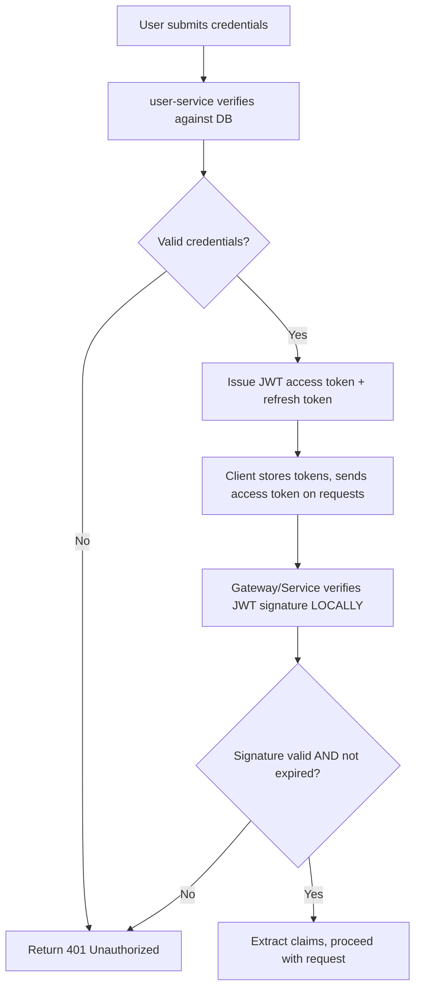
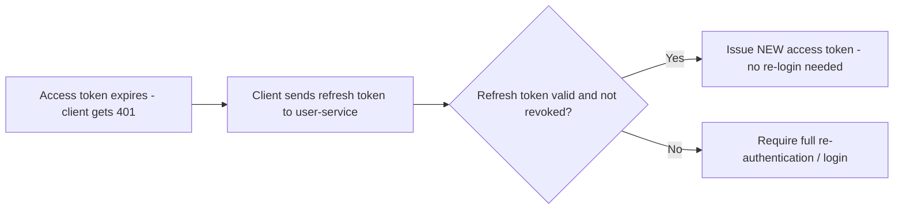
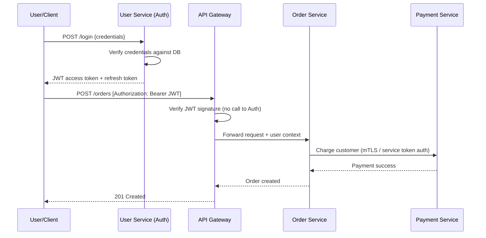

# Module 13 — Authentication

> **Microservices Masterclass** | Level: Intermediate | Track: Node.js Backend Engineering
> Prerequisite: Module 1–12 (especially Module 10 — API Gateway, Module 12 — Configuration Management)
> Next Module: Module 14 — Database per Service

---

## Table of Contents

1. [Introduction](#1-introduction)
2. [Learning Objectives](#2-learning-objectives)
3. [Problem Statement](#3-problem-statement)
4. [Why This Concept Exists](#4-why-this-concept-exists)
5. [Historical Background](#5-historical-background)
6. [Real-World Analogy](#6-real-world-analogy)
7. [Technical Definition](#7-technical-definition)
8. [Core Terminology](#8-core-terminology)
9. [Internal Working](#9-internal-working)
10. [Step-by-Step Request Flow](#10-step-by-step-request-flow)
11. [Architecture Overview](#11-architecture-overview)
12. [ASCII Diagrams](#12-ascii-diagrams)
13. [Mermaid Flowcharts](#13-mermaid-flowcharts)
14. [Mermaid Sequence Diagrams](#14-mermaid-sequence-diagrams)
15. [Component Diagrams](#15-component-diagrams)
16. [Deployment Diagrams](#16-deployment-diagrams)
17. [Database Interaction](#17-database-interaction)
18. [Failure Scenarios](#18-failure-scenarios)
19. [Scalability Discussion](#19-scalability-discussion)
20. [High Availability Considerations](#20-high-availability-considerations)
21. [CAP Theorem Implications](#21-cap-theorem-implications)
22. [Node.js Implementation](#22-nodejs-implementation)
23. [Express.js Examples](#23-expressjs-examples)
24. [Docker Examples](#24-docker-examples)
25. [Kafka/Redis Integration](#25-kafkaredis-integration)
26. [Error Handling](#26-error-handling)
27. [Logging & Monitoring](#27-logging--monitoring)
28. [Security Considerations](#28-security-considerations)
29. [Performance Optimization](#29-performance-optimization)
30. [Production Best Practices](#30-production-best-practices)
31. [Anti-Patterns and Common Mistakes](#31-anti-patterns-and-common-mistakes)
32. [Debugging Tips](#32-debugging-tips)
33. [Interview Questions](#33-interview-questions)
34. [Scenario-Based Questions](#34-scenario-based-questions)
35. [Hands-on Exercises](#35-hands-on-exercises)
36. [Mini Project](#36-mini-project)
37. [Advanced Project](#37-advanced-project)
38. [Summary](#38-summary)
39. [Revision Notes](#39-revision-notes)
40. [One-Page Cheat Sheet](#40-one-page-cheat-sheet)

---

## 1. Introduction

Every module so far has assumed a request "comes from an authenticated user" without explaining how that authentication actually happens across a distributed system. In a monolith, authentication was simple: log in once, get a session, and every subsequent request checks that same session against the same in-process memory or a single shared database.

In microservices, this gets meaningfully harder: **who verifies the user's identity, where, and how does that identity travel safely and efficiently to every service that needs it** — without every single one of your 15+ services needing to independently re-implement login logic or repeatedly query a central "who is this user" database on every single request? This module answers that question thoroughly: JWTs, OAuth2, API keys, and — critically for microservices specifically — how services authenticate to **each other**, not just to end users.

---

## 2. Learning Objectives

By the end of this module, you will be able to:

- Explain how JSON Web Tokens (JWT) work and why they fit microservices particularly well.
- Distinguish authentication (who are you) from authorization (what can you do).
- Explain OAuth2's core flows and where they fit in a microservices system.
- Design service-to-service authentication using mTLS or service tokens.
- Implement JWT issuance, validation, and refresh token handling in Node.js.
- Recognize authentication anti-patterns, including duplicated auth logic and insecure token handling.

---

## 3. Problem Statement

A team has `user-service` (which owns login/authentication), `order-service`, `payment-service`, and `notification-service`. Without a deliberate authentication strategy:

- Each service might implement its **own** login-checking logic, querying `user-service`'s database directly (violating Module 3's database-per-service principle) or calling `user-service` synchronously on **every single request** just to check "is this user logged in?" — adding unnecessary latency and a hard synchronous dependency on `user-service`'s availability for every request across the entire system.
- When `order-service` calls `payment-service` internally, how does `payment-service` know this request is legitimately coming from `order-service` and not from some unauthorized source that gained network access? Simply trusting all internal traffic is a real security risk.
- If a user's session needs to be invalidated (e.g., they changed their password, or an admin needs to force-logout a compromised account), how does that invalidation propagate to every service that might be holding onto some cached notion of "this user is logged in"?

This module solves each of these: JWTs let identity travel with the request itself (avoiding a synchronous call to `user-service` on every request), and dedicated service-to-service authentication mechanisms (mTLS, service tokens) secure internal traffic explicitly, rather than relying on implicit network trust.

---

## 4. Why This Concept Exists

Authentication in microservices exists as a distinct architectural concern because the trust model of a monolith (a single process, a single shared memory space, a single database) breaks down completely once you have many independently-deployed services communicating over an inherently untrusted network. Specifically:

| Monolith Trust Model | Microservices Reality |
|---|---|
| One process checks a session once, in memory | Every service needs to verify identity, but can't share in-process session memory |
| The database is the single, trusted source of session truth | Querying a central session database on every request across every service creates a bottleneck and tight coupling |
| All code runs in one trusted process boundary | Internal network traffic between services is not inherently trustworthy — must be explicitly authenticated |
| A logout simply clears one shared session store | Identity/session state needs to somehow be recognized (or invalidated) consistently across many independent services |

JWTs, in particular, exist specifically to solve the "avoid a synchronous call to the auth service on every single request" problem, by making the token itself a **self-contained, cryptographically verifiable** proof of identity that any service can check independently, without needing to call back to a central authority for every request.

---

## 5. Historical Background

- **1990s–2000s** — Server-side sessions (a session ID in a cookie, mapped to session data stored in server memory or a shared database) were the dominant web authentication pattern — simple, but requiring a shared, centrally-queried session store, which doesn't scale cleanly across many independent microservices.
- **2010** — **OAuth 1.0a** was standardized, providing a framework for delegated authorization (letting a third-party app act on a user's behalf without seeing their password) — complex to implement correctly due to its cryptographic signing requirements.
- **2012** — **OAuth 2.0** was published (RFC 6749), simplifying and generalizing the delegated authorization model, becoming the dominant standard for modern authentication/authorization flows, especially for "Login with Google/GitHub/etc." style integrations.
- **2015** — **JSON Web Tokens (JWT)** were standardized (RFC 7519), providing a compact, URL-safe, self-contained, cryptographically-signed token format — a natural fit for microservices, since a JWT can be verified by any service holding the appropriate public key/shared secret, **without a network call back to the issuing authentication service**.
- **Mid-2010s onward** — As microservices matured, patterns for **service-to-service authentication** (mutual TLS, service mesh-provided identity, short-lived service tokens) became standard practice, addressing the specific need to authenticate internal, service-to-service traffic — a concern largely absent from earlier, single-application-focused authentication discussions.

---

## 6. Real-World Analogy

**Analogy: A Sealed, Tamper-Evident Wristband at a Festival**

Imagine a large music festival with many independent stages, each run by a different vendor (analogous to your microservices). At the entrance, a **single check-in booth** (your authentication service) verifies your ticket and identity once, then gives you a **sealed, tamper-evident wristband** (a JWT) that states, in a way that **cannot be forged or altered** without detection, "this person is verified, has VIP access, valid until midnight."

- Every stage's security guard (each microservice) can **independently check your wristband** — glancing at its tamper-evident seal and printed details — **without radioing back to the check-in booth** every single time you walk up to a new stage. This is exactly why JWTs avoid a synchronous call back to the authentication service on every request.
- If your wristband needs to be **revoked** (say, you were caught causing trouble and are being ejected), the festival needs a **separate mechanism** — perhaps a broadcast list of revoked wristband IDs that security guards check — since the wristband itself, once issued, can't be "un-printed." This mirrors the real challenge of **JWT revocation**, discussed in Section 18.
- **Service-to-service authentication** is like festival **staff and vendors** needing their own separate, distinct credentials (staff badges) to move between backstage areas — a completely different trust mechanism than the attendee wristbands, appropriate for a different category of "who is asking."

---

## 7. Technical Definition

> **Authentication** is the process of verifying **who** a requester is (a specific user, or a specific service).

> **Authorization** is the process of determining **what** an already-authenticated requester is permitted to do.

> A **JSON Web Token (JWT)** is a compact, URL-safe, cryptographically signed token consisting of three parts (Header, Payload, Signature) that encodes claims about an authenticated identity, verifiable by any party holding the appropriate verification key, **without needing to contact the original issuer**.

> **OAuth 2.0** is an authorization framework enabling a third-party application to obtain limited access to a user's resources without exposing the user's credentials directly to that third party, via defined "grant type" flows (Authorization Code, Client Credentials, etc.).

> **Service-to-Service Authentication** refers to mechanisms — such as **mutual TLS (mTLS)** or **short-lived service tokens** — by which services verify each other's identity for internal, service-to-service calls, distinct from end-user authentication.

---

## 8. Core Terminology

| Term | Meaning |
|---|---|
| **Authentication** | Verifying who a requester is |
| **Authorization** | Determining what an authenticated requester can do |
| **JWT (JSON Web Token)** | A compact, signed token encoding identity claims, independently verifiable |
| **Claims** | The pieces of information encoded within a JWT's payload (e.g., user ID, roles, expiry) |
| **Access Token** | A short-lived token granting access to protected resources |
| **Refresh Token** | A longer-lived token used to obtain a new access token without re-authenticating fully |
| **OAuth 2.0** | A standard authorization framework for delegated access |
| **Authorization Code Grant** | An OAuth2 flow typically used for web/mobile apps involving a redirect and code exchange |
| **Client Credentials Grant** | An OAuth2 flow used for service-to-service (machine-to-machine) authentication with no end user involved |
| **mTLS (Mutual TLS)** | Both client and server present and verify certificates, authenticating each other |
| **Token Revocation** | Invalidating a token before its natural expiry (a nontrivial challenge for self-contained JWTs) |

---

## 9. Internal Working

Here's how JWT-based authentication works end-to-end across a microservices system:

1. A user logs in via `user-service`, providing credentials (username/password, or via an OAuth2 provider).
2. `user-service` verifies the credentials against its own database, and if valid, **issues a JWT**, signing it with a private key (or shared secret) that only `user-service` (the issuer) possesses.
3. This JWT is returned to the client, which includes it in the `Authorization` header of all subsequent requests.
4. Requests arrive at the **API Gateway** (Module 10), which validates the JWT's signature using the corresponding **public key** (or shared secret) — this validation happens **without any network call back to `user-service`**, since the signature alone proves authenticity.
5. If valid, the Gateway extracts the claims (user ID, roles) and forwards the request downstream, often propagating the identity via a trusted internal header or by simply forwarding the validated JWT itself.
6. Downstream services (Order, Payment, Notification) can **independently re-verify** the same JWT if they need to (using the same shared public key/secret), without any of them needing to call `user-service` either.
7. When the access token expires (typically short-lived, e.g., 15 minutes), the client uses its longer-lived **refresh token** to request a new access token from `user-service`, without requiring the user to log in again.
8. For **service-to-service** calls (e.g., `order-service` calling `payment-service` directly, not on behalf of a specific end-user action), a separate mechanism — mTLS certificates or short-lived service tokens obtained via an OAuth2 Client Credentials flow — authenticates the calling service's own identity.

---

## 10. Step-by-Step Request Flow

**Scenario: A user logs in, places an order, and the request flows through multiple services.**

```
Step 1:  User submits login credentials to user-service
Step 2:  user-service verifies credentials against its database
Step 3:  user-service issues a JWT access token (15-min expiry) and
         a refresh token (7-day expiry), signed with its private key
Step 4:  Client stores both tokens, includes the access token in
         subsequent requests: Authorization: Bearer <JWT>
Step 5:  Client sends POST /orders with the JWT to the API Gateway
Step 6:  API Gateway verifies the JWT's signature using the shared
         public key — NO network call to user-service required
Step 7:  Gateway extracts { userId, roles } from the JWT's claims
Step 8:  Gateway forwards the request to order-service, propagating
         the validated identity (e.g., via an x-user-id header, or
         by forwarding the JWT itself for order-service to re-verify)
Step 9:  order-service, needing to call payment-service internally,
         authenticates itself using a SEPARATE service-to-service
         mechanism (e.g., mTLS certificate or a service token) —
         NOT the end-user's JWT, since this is a service-initiated call
Step 10: 15 minutes later, the access token expires; the client uses
         its refresh token to obtain a new access token from
         user-service WITHOUT requiring the user to log in again
```

---

## 11. Architecture Overview

```
                        Client
                          │
                (Authorization: Bearer <JWT>)
                          │
                          ▼
                    API Gateway
              (verifies JWT signature,
               NO call back to user-service)
                          │
        ┌─────────────────┼─────────────────┐
        ▼                 ▼                 ▼
  Order Service      Payment Service   Notification Service
  (can independently  (can independently (can independently
   re-verify JWT if     re-verify JWT if    re-verify JWT if
   needed)               needed)             needed)
        │
        │ (service-to-service call,
        │  DIFFERENT auth mechanism:
        │  mTLS or service token)
        ▼
  Payment Service


                    user-service
              (the ONLY service that verifies
               original credentials and ISSUES
               JWTs — the "source of truth" for
               identity, but NOT queried on
               every single downstream request)
```

---

## 12. ASCII Diagrams

### 12.1 JWT Structure

```
A JWT is three Base64URL-encoded parts, separated by dots:

  HEADER.PAYLOAD.SIGNATURE

  HEADER (algorithm + token type):
    { "alg": "RS256", "typ": "JWT" }

  PAYLOAD (claims - the actual identity information):
    { "sub": "user123", "roles": ["customer"], "exp": 1735689600 }

  SIGNATURE (cryptographic proof, computed using the issuer's
             private key, verifiable using the public key):
    RS256(base64(header) + "." + base64(payload), privateKey)

  Anyone with the PUBLIC KEY can verify the signature is authentic
  WITHOUT needing the private key or calling the issuer
```

### 12.2 Session-Based vs JWT-Based Authentication

```
SESSION-BASED (requires a shared, centrally-queried store):

  Client ──sessionId──▶ Any Service ──▶ QUERY shared Session Store
                                         (network call EVERY request)


JWT-BASED (self-contained, independently verifiable):

  Client ──JWT──▶ Any Service ──▶ VERIFY SIGNATURE LOCALLY
                                   (no network call needed AT ALL,
                                    assuming the service has the
                                    public key/shared secret)
```

### 12.3 End-User Auth vs Service-to-Service Auth

```
END-USER AUTHENTICATION (JWT, represents a SPECIFIC PERSON):

  User ──login──▶ user-service ──issues──▶ JWT { sub: "user123" }


SERVICE-TO-SERVICE AUTHENTICATION (represents a SPECIFIC SERVICE,
not tied to any particular end user):

  order-service ──mTLS cert / service token──▶ payment-service
       (proves: "I am genuinely order-service,"
        NOT "I am acting on behalf of user123")

  Both mechanisms may be used TOGETHER: order-service forwards
  the user's JWT (for authorization context) WHILE ALSO
  authenticating itself via mTLS (for service identity)
```

---

## 13. Mermaid Flowcharts

### 13.1 JWT Issuance and Validation Flow



### 13.2 Access Token Refresh Flow



---

## 14. Mermaid Sequence Diagrams

### 14.1 Full Authentication and Authorized Request Flow



---

## 15. Component Diagrams

```
┌─────────────────────────────────────────────────────────┐
│                       API Gateway                           │
│  ┌───────────────────┐                                      │
│  │  JWT Verification      │  <- uses PUBLIC key only            │
│  │  Middleware              │     (never the private signing key) │
│  └─────────┬───────────┘                                    │
└────────────┼───────────────────────────────────────────────┘
             ▼
┌─────────────────────────────────────────────────────────┐
│                      User Service                           │
│  ┌───────────────────┐                                      │
│  │  Credential Verifier   │  <- checks username/password        │
│  └─────────┬───────────┘        against hashed values             │
│            ▼                                                 │
│  ┌───────────────────┐                                      │
│  │  JWT Issuer            │  <- holds the PRIVATE signing key   │
│  │  (signs new tokens)     │     (highly sensitive, per Module 12)│
│  └───────────────────┘                                      │
└─────────────────────────────────────────────────────────┘
```

---

## 16. Deployment Diagrams

```
┌───────────────────────────────────────────────────────────┐
│                    Kubernetes Cluster                        │
│                                                               │
│  user-service pods (hold PRIVATE JWT signing key,              │
│  retrieved from a Secrets Manager, per Module 12)               │
│         │                                                     │
│  gateway pods + all other service pods (hold only the PUBLIC   │
│  verification key, or a shared symmetric secret if using HS256) │
│         │                                                     │
│  Service mesh (e.g., Istio) MAY additionally provide             │
│  automatic mTLS between ALL pods for service-to-service          │
│  authentication, transparently, without application code        │
│  changes — an increasingly common production pattern             │
└───────────────────────────────────────────────────────────┘
```

---

## 17. Database Interaction

Authentication-related data ownership follows the same database-per-service principle as everything else in this masterclass:

```
user-service DB:
  - users table (id, email, hashed_password, roles)
  - refresh_tokens table (token_id, user_id, expires_at, revoked)

NO other service should EVER directly query user-service's database
to "check if a user is logged in" — that's exactly the tight coupling
JWTs are designed to avoid. Other services rely ENTIRELY on verifying
the JWT's signature and reading its claims.
```

---

## 18. Failure Scenarios

| Scenario | Challenge & Mitigation |
|---|---|
| A user's account is compromised and needs immediate access revocation | JWTs are self-contained and can't be "un-issued" before their natural expiry — mitigate with **short access token lifetimes** (e.g., 15 minutes) combined with a **refresh token revocation list** checked by `user-service` on every refresh attempt |
| The JWT signing key is compromised | ALL issued tokens become suspect — requires immediate key rotation and, ideally, a mechanism to invalidate all currently-issued tokens (a severe, rare event requiring a well-rehearsed incident response plan) |
| A service's clock is significantly out of sync | JWT expiry (`exp` claim) checks rely on accurate system time — clock drift can cause valid tokens to be rejected or expired tokens to be incorrectly accepted; mitigate with NTP time synchronization across all infrastructure |
| A downstream service doesn't validate the JWT at all, blindly trusting the Gateway | If an attacker gains direct network access to an internal service, bypassing the Gateway, an unvalidated service is fully exposed — defense-in-depth suggests downstream services should still validate at least basic token integrity, not blindly trust network position alone |

```
Immediate revocation challenge:

  User's account compromised at 10:00am
           │
           ▼
  Their JWT access token (issued at 9:50am, expires 10:05am)
  is STILL VALID for another 5 minutes — JWTs cannot be
  "un-issued" once created
           │
           ▼
  Mitigation: short expiry limits the exposure window; refresh
  token revocation prevents them from getting a NEW access token
  once the current one naturally expires
```

---

## 19. Scalability Discussion

JWT-based authentication scales exceptionally well precisely because it **eliminates the need for a centralized, synchronously-queried session store** — every service can verify tokens independently and in parallel, with no shared bottleneck. This is a direct, deliberate trade-off: you give up the ability to instantly revoke a specific token (Section 18's challenge) in exchange for massive scalability gains, since verification is a fast, local cryptographic operation rather than a network round-trip to a central authority.

---

## 20. High Availability Considerations

- Because JWT verification doesn't require a call back to `user-service`, the **rest of the system remains fully functional for already-authenticated users even if `user-service` experiences an outage** — only new logins and token refreshes would be affected, not already-issued, still-valid access tokens being used by other services.
- The JWT signing/verification key material itself must be **highly available** (via your Module 12 secrets management strategy) — if services can't retrieve the public key to verify signatures, authentication breaks system-wide.
- For service-to-service mTLS, certificate rotation and renewal must be automated and monitored — expired certificates causing authentication failures between services is a common, avoidable operational incident.

---

## 21. CAP Theorem Implications

JWT-based authentication is an explicit trade of **immediate consistency of revocation** for **availability and partition tolerance** — a validating service doesn't need to reach any central authority (favoring Availability), but this means a revoked/compromised token remains technically valid (from a pure signature-verification standpoint) until it naturally expires, unless you layer on an additional, explicitly-consulted revocation check (which reintroduces a CP-favoring dependency for that specific check). This mirrors a now-familiar pattern throughout this masterclass: favor availability broadly, but make **deliberate, explicit exceptions** where correctness genuinely can't tolerate staleness (in this case, checking a small, fast revocation list specifically during refresh token exchange, rather than on every single request).

---

## 22. Node.js Implementation

Let's implement JWT issuance, verification, and refresh token handling.

**Folder structure:**
```
user-service/
├── src/
│   ├── auth/
│   │   ├── tokenService.js
│   │   └── refreshTokenStore.js
│   ├── controllers/
│   │   └── auth.controller.js
│   └── app.js

shared/  (a small shared library, or duplicated consistently across services)
├── jwtVerification.js
```

**`user-service/src/auth/tokenService.js`**
```javascript
import jwt from "jsonwebtoken";
import { getSecret } from "../secrets/secretsClient.js"; // from Module 12

const ACCESS_TOKEN_TTL = "15m";
const REFRESH_TOKEN_TTL = "7d";

export async function issueAccessToken(user) {
  const privateKey = await getSecret("JWT_PRIVATE_KEY"); // RS256 asymmetric signing
  return jwt.sign(
    { sub: user.id, roles: user.roles }, // claims
    privateKey,
    { algorithm: "RS256", expiresIn: ACCESS_TOKEN_TTL, issuer: "user-service" }
  );
}

export function issueRefreshToken() {
  // A refresh token is typically an opaque, random string (NOT a JWT
  // itself), stored server-side so it CAN be explicitly revoked —
  // addressing the revocation challenge from Section 18
  return crypto.randomUUID();
}
```

**`user-service/src/auth/refreshTokenStore.js`**
```javascript
import { redis } from "../db/redis.js";

const REFRESH_TTL_SECONDS = 60 * 60 * 24 * 7; // 7 days

export async function storeRefreshToken(token, userId) {
  await redis.set(`refresh:${token}`, userId, { EX: REFRESH_TTL_SECONDS });
}

export async function validateAndConsumeRefreshToken(token) {
  const userId = await redis.get(`refresh:${token}`);
  if (!userId) return null; // not found, expired, or already revoked
  return userId;
}

// EXPLICIT revocation — e.g., triggered on logout or a security incident
export async function revokeRefreshToken(token) {
  await redis.del(`refresh:${token}`);
}
```

**`shared/jwtVerification.js`** — used by EVERY service that needs to verify a JWT
```javascript
import jwt from "jsonwebtoken";

// Only the PUBLIC key is needed here — this code can safely live in
// every service, since it can only VERIFY tokens, never CREATE new ones
export function verifyAccessToken(token, publicKey) {
  try {
    return jwt.verify(token, publicKey, { algorithms: ["RS256"], issuer: "user-service" });
  } catch (err) {
    if (err.name === "TokenExpiredError") {
      throw new Error("Access token has expired");
    }
    throw new Error("Invalid access token");
  }
}
```

---

## 23. Express.js Examples

**`user-service/src/controllers/auth.controller.js`**
```javascript
import bcrypt from "bcrypt";
import { findUserByEmail } from "../repositories/userRepository.js";
import { issueAccessToken, issueRefreshToken } from "../auth/tokenService.js";
import { storeRefreshToken, validateAndConsumeRefreshToken } from "../auth/refreshTokenStore.js";

export async function login(req, res) {
  const { email, password } = req.body;
  const user = await findUserByEmail(email);

  if (!user || !(await bcrypt.compare(password, user.hashedPassword))) {
    return res.status(401).json({ error: "Invalid email or password" });
  }

  const accessToken = await issueAccessToken(user);
  const refreshToken = issueRefreshToken();
  await storeRefreshToken(refreshToken, user.id);

  res.status(200).json({ accessToken, refreshToken });
}

export async function refresh(req, res) {
  const { refreshToken } = req.body;
  const userId = await validateAndConsumeRefreshToken(refreshToken);

  if (!userId) {
    return res.status(401).json({ error: "Invalid or expired refresh token" });
  }

  const user = await findUserById(userId);
  const newAccessToken = await issueAccessToken(user);
  res.status(200).json({ accessToken: newAccessToken });
}
```

**API Gateway middleware verifying the JWT (as introduced in Module 10, expanded here):**
```javascript
import { verifyAccessToken } from "../../shared/jwtVerification.js";
import { getPublicKey } from "../config/publicKeyLoader.js"; // fetched once, cached

export function authenticate(req, res, next) {
  const authHeader = req.headers.authorization;
  if (!authHeader?.startsWith("Bearer ")) {
    return res.status(401).json({ error: "Missing or malformed authorization header" });
  }

  try {
    const publicKey = getPublicKey();
    const claims = verifyAccessToken(authHeader.split(" ")[1], publicKey);
    req.user = { id: claims.sub, roles: claims.roles };
    next();
  } catch (err) {
    res.status(401).json({ error: err.message });
  }
}
```

---

## 24. Docker Examples

```yaml
version: "3.9"
services:
  user-service:
    build: ./user-service
    ports: ["4001:4001"]
    environment:
      - REDIS_URL=redis://auth-cache:6379
    secrets:
      - jwt_private_key
    depends_on: [user-db, auth-cache]

  api-gateway:
    build: ./api-gateway
    ports: ["3000:3000"]
    environment:
      - JWT_PUBLIC_KEY_PATH=/run/secrets/jwt_public_key
    secrets:
      - jwt_public_key   # only the PUBLIC key — Gateway can verify, never issue
    depends_on: [user-service]

  user-db:
    image: postgres:16-alpine
  auth-cache:
    image: redis:7-alpine

secrets:
  jwt_private_key:
    file: ./secrets/jwt_private_key.pem   # highly sensitive — user-service ONLY
  jwt_public_key:
    file: ./secrets/jwt_public_key.pem    # safe to distribute widely
```

Notice the asymmetric key split: `user-service` alone holds the **private** key (capable of issuing/signing tokens); every other service holds only the **public** key (capable only of verifying, never forging, a token) — a deliberate security design enabled by using RS256 rather than a shared symmetric secret (HS256).

---

## 25. Kafka/Redis Integration

Redis is used above for **refresh token storage** (enabling explicit revocation, unlike self-contained JWTs). It's also commonly used for a **short-lived revocation/denylist** for access tokens in higher-security scenarios:

```javascript
// An optional, additional layer: check a denylist of explicitly-revoked
// access tokens (e.g., for a forced logout), consulted ONLY for
// high-sensitivity operations, not on every single request (to preserve
// the scalability benefit of JWTs from Section 19)
export async function isTokenRevoked(jti) {
  const revoked = await redis.get(`revoked-token:${jti}`);
  return revoked !== null;
}
```

Kafka can be used to **broadcast security events** (e.g., "UserPasswordChanged", "AccountCompromised") so interested services can react — for example, a service maintaining its own short-lived cache of "should I extra-verify this user's tokens right now" could invalidate that cache upon receiving such an event.

---

## 26. Error Handling

Distinguish clearly between different authentication failure modes so clients (and your own debugging) can respond appropriately:

```javascript
export function authenticate(req, res, next) {
  const authHeader = req.headers.authorization;
  if (!authHeader) {
    return res.status(401).json({ error: "MISSING_TOKEN", message: "Authorization header required" });
  }

  try {
    req.user = verifyAccessToken(authHeader.split(" ")[1], getPublicKey());
    next();
  } catch (err) {
    if (err.message.includes("expired")) {
      return res.status(401).json({ error: "TOKEN_EXPIRED", message: "Please refresh your access token" });
    }
    return res.status(401).json({ error: "INVALID_TOKEN", message: "Authentication failed" });
  }
}
```

A well-designed client can distinguish `TOKEN_EXPIRED` (attempt a silent refresh) from `INVALID_TOKEN` (force a full re-login) automatically.

---

## 27. Logging & Monitoring

- Log authentication **failures** (with reason: expired, invalid signature, missing token) to detect potential attack patterns (e.g., a surge of invalid token attempts from one source).
- **Never log the token value itself** — even though a JWT's payload isn't encrypted (just signed, and thus readable by anyone, a common point of confusion), logging full tokens is still poor practice and increases exposure risk unnecessarily.
- Monitor **refresh token usage patterns** — an unusual spike in refresh requests from a single user could indicate a compromised refresh token being used by an attacker.

```javascript
logger.warn({ reason: "TOKEN_EXPIRED", path: req.path, ip: req.ip }, "Authentication failed");
```

---

## 28. Security Considerations

- **JWT payloads are NOT encrypted by default** — they are Base64URL-encoded and signed, meaning anyone can **read** the claims (though not forge or alter them without detection). Never put sensitive data (passwords, full card numbers) in a JWT payload.
- Use **RS256 (asymmetric)** rather than **HS256 (symmetric)** signing when multiple services need to *verify* tokens but only one service should be able to *issue* them — this follows the principle of least privilege (Module 12) applied to authentication.
- Keep access token lifetimes **short** (minutes, not hours or days) to limit the exposure window if a token is somehow leaked.
- Store refresh tokens securely on the client (e.g., httpOnly, secure cookies for web apps, secure storage for mobile) — never in easily-accessible `localStorage` for browser-based apps, which is vulnerable to XSS-based token theft.
- Implement **mTLS or service tokens** for service-to-service traffic — don't rely solely on network position/firewalls as your only internal security boundary.

---

## 29. Performance Optimization

- **Cache the public key** in memory at each service's startup (refreshing only periodically or on a key rotation event) rather than fetching it from the secrets store on every single verification.
- JWT verification itself (a cryptographic signature check) is fast and entirely local — this is precisely the performance benefit motivating JWTs' use in high-throughput microservices systems over centrally-queried sessions.
- Avoid unnecessarily large JWT payloads (many claims, embedded permissions lists) — every request carries this payload over the network, so keep it lean, including only what's genuinely needed frequently.

---

## 30. Production Best Practices

- Use **short-lived access tokens + longer-lived, explicitly revocable refresh tokens** as the standard pattern, balancing performance (JWTs avoid central lookups) against the need for eventual revocability.
- Rotate your JWT signing keys periodically, and support **verifying tokens signed with either the old or new key during a transition window** (a "key ID" / `kid` header claim helps services pick the right verification key).
- Use a **service mesh** (Istio, Linkerd) for automatic mTLS between services in mature, larger systems, rather than hand-rolling certificate management in every service.
- Clearly document which services are allowed to **issue** tokens (should be exactly one: your dedicated auth/user service) versus which merely **verify** them (every other service) — this asymmetry is a core security design principle.

---

## 31. Anti-Patterns and Common Mistakes

| Anti-Pattern | Why It's a Problem |
|---|---|
| **Every service independently implementing login logic** | Duplicates security-critical code across many services, multiplying the chance of a vulnerability, and violates the single-source-of-truth principle for identity |
| **Using a symmetric secret (HS256) shared across many services** | Any service holding the shared secret can also FORGE tokens, not just verify them — a significant security risk if any one service is compromised |
| **Storing sensitive data in JWT claims** | JWT payloads are readable by anyone (not encrypted), so sensitive data here is effectively exposed |
| **Long-lived access tokens with no refresh mechanism** | Extends the exposure window if a token is leaked, and makes revocation even harder to reason about |
| **Trusting internal network position alone for service-to-service auth** | If an attacker gains any internal network access, unauthenticated internal services are fully exposed |

```
Symmetric secret shared too widely (anti-pattern):

  user-service:     signs tokens using SHARED_SECRET
  order-service:    ALSO has SHARED_SECRET (to verify tokens)
  payment-service:  ALSO has SHARED_SECRET (to verify tokens)

  Problem: if payment-service is EVER compromised, the attacker
  now has SHARED_SECRET and can FORGE valid tokens claiming to
  be ANY user — asymmetric (RS256) signing avoids this entirely,
  since verification-only services never hold the signing key
```

---

## 32. Debugging Tips

- If authentication fails unexpectedly, first check whether the failure is `TOKEN_EXPIRED` (an expected, handleable case) versus `INVALID_TOKEN` (a genuine problem — mismatched keys, tampered token, or clock skew).
- Decode a JWT's payload (without verifying the signature) using any JWT debugging tool to inspect its claims and expiry during development — remember this reveals the payload's plaintext content, so never do this with a real production user's token outside a secure debugging context.
- If verification fails intermittently across service instances, check whether all instances have loaded the **same, current** public key — a rollout mid-key-rotation without proper `kid`-based key selection is a common cause.
- For service-to-service auth failures, check certificate expiry dates first (a very common, avoidable cause of mTLS failures) before assuming a deeper configuration issue.

---

## 33. Interview Questions

### Easy
1. What is the difference between authentication and authorization?
2. What is a JWT, and what are its three parts?
3. Why don't JWTs require a network call back to the issuing service for verification?
4. What is the difference between an access token and a refresh token?
5. What is mTLS, and what problem does it solve?

### Medium
6. Why is RS256 (asymmetric) often preferred over HS256 (symmetric) for JWT signing in a microservices system?
7. How would you handle immediate revocation of a user's access given that JWTs are self-contained and can't be "un-issued"?
8. Explain the OAuth2 Client Credentials grant and when you'd use it versus the Authorization Code grant.
9. Why should JWT payloads never contain sensitive data like passwords or full card numbers?
10. How does service-to-service authentication differ conceptually from end-user authentication?

### Hard
11. Design a JWT-based authentication system that supports both fast, scalable verification AND the ability to force-revoke a specific user's access within seconds.
12. Explain how you would safely rotate a JWT signing key in a live production system with zero downtime or failed verifications.
13. How would you design a defense-in-depth authentication strategy where BOTH the API Gateway and individual downstream services validate identity, without duplicating significant logic?
14. Discuss the security implications of storing a JWT in browser localStorage versus an httpOnly cookie, and which you'd recommend for a web application.
15. Design an authentication strategy for a system where some internal services need to call other services on their own behalf (not on behalf of any specific end user) — how would this differ from end-user JWT flows?

---

## 34. Scenario-Based Questions

1. A user reports their account was compromised, and you need to immediately invalidate their current session across all services. Walk through your response using this module's concepts.
2. Your team discovers that all services share the same symmetric JWT secret, and one lower-security internal service was recently compromised. What's the risk, and what's your remediation plan?
3. Leadership wants "Login with Google" support added to your platform. How does this fit into your existing JWT-based architecture?
4. Your JWT signing key needs to be rotated due to a suspected (but unconfirmed) leak. Design a zero-downtime rotation plan.
5. An engineer proposes storing the refresh token in browser localStorage "for simplicity." What security concerns would you raise, and what would you recommend instead?

---

## 35. Hands-on Exercises

1. Implement JWT issuance (RS256, using a generated key pair) and verification exactly as shown in Section 22–23.
2. Implement the refresh token store (Section 22) using Redis, including explicit revocation on logout.
3. Write a script that decodes a JWT's payload (without verifying signature) to inspect its claims, and explain what this demonstrates about JWT's "signed but not encrypted" nature.
4. Design (on paper) a key rotation plan supporting both the old and new signing keys during a transition window, using a `kid` header claim.
5. Compare, in your own words, the security trade-offs of storing tokens in localStorage vs. httpOnly cookies for a web application.

---

## 36. Mini Project

**Build: A Complete Login + JWT Verification Flow**

1. Build `user-service` with a `/login` endpoint (Section 23) issuing an RS256-signed access token and a Redis-backed refresh token.
2. Build a `/refresh` endpoint that validates and consumes the refresh token, issuing a new access token.
3. Build a simple `order-service` (or reuse the API Gateway middleware from Section 23) that verifies the JWT using only the public key, without any dependency on `user-service` being available at verification time.
4. Demonstrate: stopping `user-service` entirely, and confirming `order-service` can still successfully verify and accept ALREADY-ISSUED, still-valid access tokens.

---

## 37. Advanced Project

**Build: Full Auth System With Revocation and Service-to-Service Security**

1. Extend the Mini Project with an explicit **logout** endpoint that revokes the refresh token (Section 22) and adds the current access token's `jti` to a short-lived revocation denylist (Section 25).
2. Implement the `isTokenRevoked` check in your Gateway/service authentication middleware, but ONLY for a designated "high-sensitivity" route (e.g., `/account/delete`), demonstrating the deliberate performance/security trade-off discussed in Section 21.
3. Implement basic mTLS (or a simpler short-lived service-token mechanism) between `order-service` and `payment-service` for service-to-service calls, distinct from the end-user JWT flow.
4. Simulate a key rotation: generate a new key pair, support verifying tokens signed by EITHER the old or new key (using a `kid` claim), issue new tokens only with the new key, and confirm zero authentication failures during the transition.
5. Write a security review document covering: where tokens are stored, how revocation works, how service-to-service calls are authenticated, and what would happen in the event of a suspected signing key leak.

---

## 38. Summary

- Authentication verifies identity; Authorization determines permitted actions — related but distinct concerns.
- JWTs enable scalable, decentralized verification by encoding signed, self-contained identity claims that any service can verify independently, without a network call back to the issuer.
- Short-lived access tokens combined with longer-lived, explicitly-revocable refresh tokens balance JWT's performance benefits against the need for eventual revocability.
- Service-to-service authentication (mTLS, service tokens) is a distinct concern from end-user authentication, addressing "which service is this" rather than "which user is this."
- RS256 (asymmetric signing) is generally preferred over HS256 (symmetric) in microservices, since it lets many services verify tokens without any of them being able to forge new ones.

---

## 39. Revision Notes

- Authentication (who) vs. Authorization (what they can do).
- JWT: Header.Payload.Signature — self-contained, independently verifiable, NOT encrypted (payload is readable).
- Access token: short-lived. Refresh token: longer-lived, explicitly revocable (stored server-side).
- RS256 (asymmetric): one service issues (private key), many services verify (public key only).
- Service-to-service auth (mTLS/service tokens) is distinct from end-user JWT auth.
- Revocation trade-off: JWTs favor availability/scalability; explicit revocation lists reintroduce a targeted consistency check where truly needed.

---

## 40. One-Page Cheat Sheet

```
AUTHENTICATION:        verifying WHO a requester is
AUTHORIZATION:         determining WHAT they can do
JWT:                   Header.Payload.Signature - self-contained, signed, NOT encrypted
ACCESS TOKEN:          short-lived (minutes), used on every request
REFRESH TOKEN:         longer-lived, stored server-side, explicitly revocable
RS256 vs HS256:        RS256 (asymmetric) - many can verify, only ONE can issue - PREFERRED
SERVICE-TO-SERVICE:    mTLS or service tokens - DIFFERENT mechanism than end-user JWT

GOLDEN RULES:
  - Never put sensitive data in a JWT payload - it's signed, NOT encrypted
  - Use RS256 (asymmetric): issuing service holds private key; others hold public key only
  - Keep access tokens short-lived; use revocable refresh tokens for longer sessions
  - Authenticate service-to-service calls separately (mTLS/service tokens), don't rely on network trust
  - Never log full token values, even though JWT payloads are technically readable
```

---

**Suggested Next Module:** Module 14 — Database per Service (polyglot persistence, data duplication strategies, and managing eventual consistency across service-owned databases)
