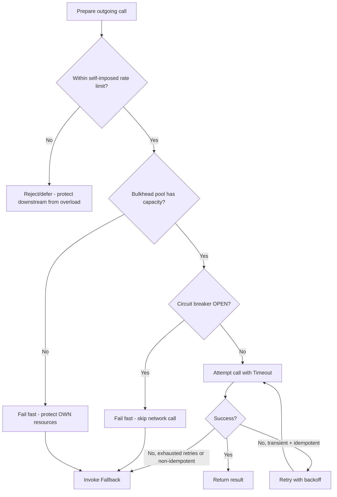
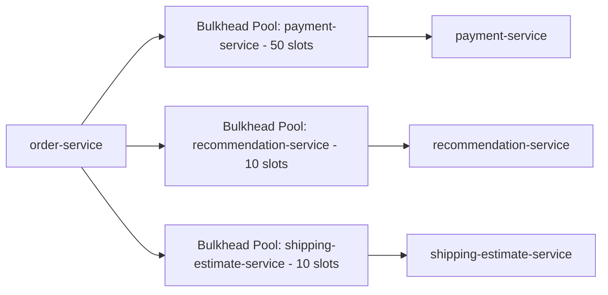
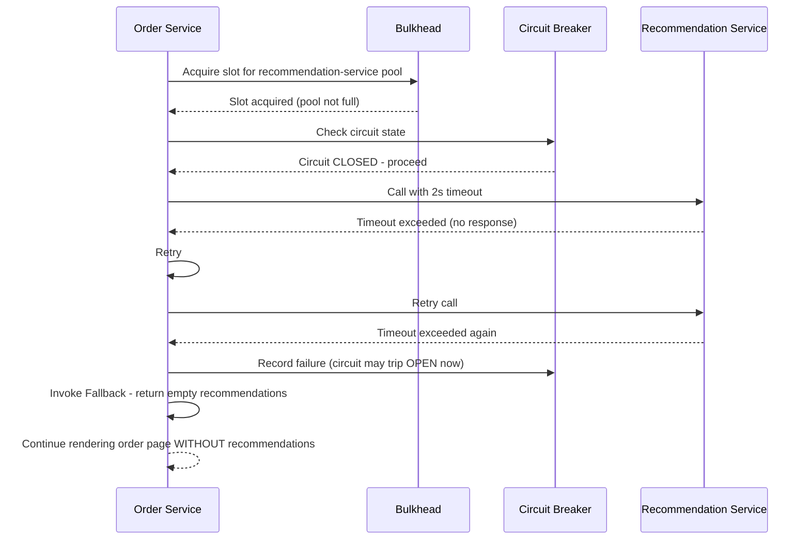

# Module 18 — Resilience Patterns

> **Microservices Masterclass** | Level: Advanced | Track: Node.js Backend Engineering
> Prerequisite: Module 1–17 (especially Module 6 — Communication Between Services, Module 7 — REST Communication)
> Next Module: Module 19 — Dockerizing Microservices

---

## Table of Contents

1. [Introduction](#1-introduction)
2. [Learning Objectives](#2-learning-objectives)
3. [Problem Statement](#3-problem-statement)
4. [Why This Concept Exists](#4-why-this-concept-exists)
5. [Historical Background](#5-historical-background)
6. [Real-World Analogy](#6-real-world-analogy)
7. [Technical Definition](#7-technical-definition)
8. [Core Terminology](#8-core-terminology)
9. [Internal Working](#9-internal-working)
10. [Step-by-Step Request Flow](#10-step-by-step-request-flow)
11. [Architecture Overview](#11-architecture-overview)
12. [ASCII Diagrams](#12-ascii-diagrams)
13. [Mermaid Flowcharts](#13-mermaid-flowcharts)
14. [Mermaid Sequence Diagrams](#14-mermaid-sequence-diagrams)
15. [Component Diagrams](#15-component-diagrams)
16. [Deployment Diagrams](#16-deployment-diagrams)
17. [Database Interaction](#17-database-interaction)
18. [Failure Scenarios](#18-failure-scenarios)
19. [Scalability Discussion](#19-scalability-discussion)
20. [High Availability Considerations](#20-high-availability-considerations)
21. [CAP Theorem Implications](#21-cap-theorem-implications)
22. [Node.js Implementation](#22-nodejs-implementation)
23. [Express.js Examples](#23-expressjs-examples)
24. [Docker Examples](#24-docker-examples)
25. [Kafka/Redis Integration](#25-kafkaredis-integration)
26. [Error Handling](#26-error-handling)
27. [Logging & Monitoring](#27-logging--monitoring)
28. [Security Considerations](#28-security-considerations)
29. [Performance Optimization](#29-performance-optimization)
30. [Production Best Practices](#30-production-best-practices)
31. [Anti-Patterns and Common Mistakes](#31-anti-patterns-and-common-mistakes)
32. [Debugging Tips](#32-debugging-tips)
33. [Interview Questions](#33-interview-questions)
34. [Scenario-Based Questions](#34-scenario-based-questions)
35. [Hands-on Exercises](#35-hands-on-exercises)
36. [Mini Project](#36-mini-project)
37. [Advanced Project](#37-advanced-project)
38. [Summary](#38-summary)
39. [Revision Notes](#39-revision-notes)
40. [One-Page Cheat Sheet](#40-one-page-cheat-sheet)

---

## 1. Introduction

Across this masterclass, you've encountered pieces of resilience engineering piecemeal: timeouts and circuit breakers in Module 7, graceful degradation in Module 10, idempotent retries throughout. This module brings the **complete toolkit** together as a single, coherent discipline, and adds the patterns not yet covered in depth: the **Bulkhead** pattern (isolating failure domains within a single service) and a unified view of **Fallback** strategies.

The core insight this module drives home: in a distributed system, **failure is not an edge case — it is a certainty.** Networks partition. Services slow down. Dependencies crash. A resilient system isn't one that never fails; it's one where failures are contained, predictable, and recoverable, rather than cascading into a total outage. This module is about designing deliberately for that reality, using a small set of well-understood, composable patterns.

---

## 2. Learning Objectives

By the end of this module, you will be able to:

- Explain each of the six core resilience patterns: Retry, Timeout, Bulkhead, Circuit Breaker, Rate Limiting, and Fallback.
- Implement the Bulkhead pattern to isolate one dependency's failure from affecting unrelated request-handling capacity.
- Combine multiple resilience patterns correctly (the right layering order matters).
- Design fallback strategies appropriate to different types of failures and business contexts.
- Avoid resilience anti-patterns, including retry storms and circuit breakers with poorly-tuned thresholds.
- Build a fully resilient HTTP client in Node.js combining all six patterns coherently.

---

## 3. Problem Statement

`order-service` calls three downstream dependencies: `payment-service` (critical), `recommendation-service` (non-critical, used for "customers also bought"), and `shipping-estimate-service` (non-critical, used for a delivery date estimate). One day, `recommendation-service` becomes extremely slow (not down — just slow, perhaps due to a bad deployment or a database issue on its end). Without deliberate resilience patterns:

- Every request to `order-service` that touches the recommendations feature starts **hanging**, waiting on the slow `recommendation-service` call.
- `order-service`'s connection pool / event loop / thread pool (depending on runtime) starts filling up with requests stuck waiting on `recommendation-service` — **including requests that have nothing to do with recommendations**, like a simple `payment-service` charge, because the underlying resource pool is now exhausted.
- Within minutes, `order-service` itself becomes unresponsive to **all** traffic, not just the recommendations feature — a single non-critical dependency's slowness has taken down the entire service. This is precisely the "cascading failure" pattern this module exists to prevent.

The Bulkhead pattern (isolating resources per dependency, so `recommendation-service` calls can only ever exhaust their **own**, limited pool of resources) directly prevents this. Combined with Timeout, Circuit Breaker, Retry, Rate Limiting, and Fallback, this module gives you the complete toolkit.

---

## 4. Why This Concept Exists

Resilience patterns exist because **microservices trade a monolith's simple, single-process failure model for a much more complex one, where any of dozens of network calls can fail independently, and — critically — where failures can propagate and compound if not deliberately contained.** Each pattern in this module exists to address one **specific** failure propagation mechanism:

| Failure Propagation Mechanism | Pattern That Contains It |
|---|---|
| A transient, one-off failure that would succeed if tried again | Retry (with backoff) |
| A call that hangs indefinitely, consuming resources forever | Timeout |
| One dependency's resource exhaustion spilling into others | Bulkhead |
| Repeatedly calling a service that's clearly currently failing | Circuit Breaker |
| A client accidentally (or maliciously) overwhelming your service | Rate Limiting |
| Any failure, from any of the above, still needing a graceful response | Fallback |

Together, these patterns form a **defense-in-depth strategy** — no single pattern handles every failure mode, but layered together, they make a system substantially more likely to degrade gracefully rather than catastrophically.

---

## 5. Historical Background

- **1970s-80s** — The **Bulkhead** pattern's name and concept originate from **ship design**: a ship's hull is divided into watertight compartments (bulkheads) so that a hull breach in one compartment floods only that section, not the entire ship — the Titanic's design (and its famous, tragic bulkhead limitations) is the most commonly cited real-world reference point for this pattern's name.
- **2012** — **Netflix** open-sourced **Hystrix**, a library implementing Circuit Breaker, Bulkhead (via thread pool isolation), Fallback, and Timeout patterns together as a cohesive resilience toolkit for their large-scale, highly distributed streaming platform — Hystrix became hugely influential in popularizing these patterns as a standard, named toolkit for the broader industry (though Netflix later placed Hystrix into maintenance mode in favor of newer internal tools, its concepts remain foundational).
- **2014** — Michael Nygard's book **"Release It!"** extensively documented and named many of these patterns (Circuit Breaker, Bulkhead, Timeout) in the context of building stable, production-grade distributed systems, becoming a widely-cited reference for resilience engineering.
- **Present** — These patterns are now considered standard, expected practice for any serious microservices system, implemented either via application-level libraries (like Node.js's `opossum` for circuit breaking, used in Module 7) or transparently via a **service mesh** (Istio, Linkerd), which can apply many of these patterns at the infrastructure level without application code changes.

---

## 6. Real-World Analogy

**Analogy: A Ship's Design, Combined With a Restaurant's Operations**

This module's patterns map onto a mix of nautical and restaurant analogies, since together they cover both "contain the damage" and "manage the flow" concerns:

- **Bulkhead** = the ship's watertight compartments (its literal namesake) — if the "recommendations" compartment floods (fails), the "payments" compartment stays dry and operational, because they're physically separated resource pools.
- **Timeout** = a kitchen's rule that "if an order hasn't come back from the walk-in freezer in 2 minutes, assume something's wrong and check on it" rather than the chef waiting indefinitely, blocking every other task.
- **Circuit Breaker** = a restaurant manager who, after the walk-in freezer has failed to respond correctly 5 times in a row, tells all the chefs "stop sending orders to the freezer for the next 10 minutes, we'll check back then" — rather than every chef individually, repeatedly, wasting time on a freezer that's clearly broken right now.
- **Retry** = a chef trying the freezer door once more after a brief pause, in case it was just momentarily stuck (a transient issue), rather than giving up (or endlessly hammering it) after just one failed attempt.
- **Rate Limiting** = the restaurant's host controlling how many parties are seated per 15 minutes, ensuring the kitchen is never given more orders than it can realistically handle at once.
- **Fallback** = when the special of the day genuinely isn't available, the server offers "how about our chef's regular signature dish instead?" — a graceful, prepared alternative rather than the customer just being told "sorry, nothing" and leaving unhappy.

---

## 7. Technical Definition

> **Retry** is the pattern of automatically re-attempting a failed operation, typically with **exponential backoff** (increasing delay between attempts), applied only to operations that are safe to repeat (idempotent, per Module 7) and errors believed to be transient.

> **Timeout** is a maximum duration a caller will wait for a response before abandoning the attempt and treating it as a failure, preventing indefinite resource consumption on a hung call.

> **Bulkhead** is the pattern of partitioning resources (connection pools, thread pools, or concurrency limits) **per dependency**, so that one dependency's resource exhaustion cannot spill over and starve calls to unrelated dependencies.

> **Circuit Breaker** (introduced in Module 7) monitors failure rates for a dependency and, upon crossing a threshold, "opens" to fail fast without attempting the call at all, for a cool-down period.

> **Rate Limiting** restricts the number of requests a client (or the service itself, toward a downstream dependency) can make within a given time window, protecting against both incoming overload and outgoing "retry storm" scenarios.

> **Fallback** is a predefined, graceful alternative response provided when a primary operation fails (after applicable retries/circuit-breaking), ensuring the caller still receives a usable, if degraded, result rather than an unhandled error.

---

## 8. Core Terminology

| Term | Meaning |
|---|---|
| **Retry** | Automatically re-attempting a failed, idempotent operation |
| **Exponential Backoff** | Increasing the delay between successive retry attempts |
| **Jitter** | Adding randomness to backoff delays to avoid synchronized retry storms across many clients |
| **Timeout** | Maximum wait duration before abandoning an attempt |
| **Bulkhead** | Partitioning resources per dependency to contain failure/exhaustion |
| **Circuit Breaker** | Fails fast against a detected-unhealthy dependency, for a cool-down period |
| **Rate Limiting** | Restricting request volume within a time window |
| **Fallback** | A graceful, predefined alternative response when the primary path fails |
| **Retry Storm** | A cascading failure caused by many clients retrying simultaneously, overwhelming a recovering dependency |
| **Graceful Degradation** | Continuing to provide (reduced) service despite a failure, rather than failing entirely |

---

## 9. Internal Working

Here's how these six patterns combine and layer together for a single outgoing call, in the correct conceptual order:

1. **Rate Limiting** (outbound) — before even attempting the call, check whether this caller has budget remaining to make calls to this dependency at all (relevant when you want to self-limit your own outgoing traffic to a downstream dependency, e.g., to respect its known capacity).
2. **Bulkhead** — acquire a resource slot from this **specific dependency's own, isolated** pool (e.g., a maximum of 10 concurrent calls to `recommendation-service`, entirely separate from the pool used for `payment-service`). If the pool is full, fail immediately (or queue briefly) rather than consuming shared, unbounded resources.
3. **Circuit Breaker** — check whether the circuit for this dependency is currently open (recently failing repeatedly). If open, fail fast immediately, skipping the network call entirely.
4. **Timeout** — if the circuit is closed (or half-open, testing recovery), attempt the call, but with a strict maximum wait time.
5. **Retry** — if the call fails with a transient-seeming error, and the operation is idempotent, retry with exponential backoff (and jitter), up to a maximum number of attempts — but only while the circuit remains closed/half-open.
6. **Fallback** — if all of the above ultimately fail (circuit open, timeout exceeded, retries exhausted), return a predefined, graceful fallback response instead of propagating a raw, unhandled error to the caller.

---

## 10. Step-by-Step Request Flow

**Scenario: order-service calling recommendation-service, all six patterns applied together.**

```
Step 1:  order-service prepares to call recommendation-service for
         "customers also bought" data

Step 2:  RATE LIMIT check: has order-service exceeded its own
         self-imposed outbound call budget to recommendation-service
         this second? (protects recommendation-service from being
         overwhelmed by order-service itself during a traffic spike)

Step 3:  BULKHEAD check: is there an available slot in the DEDICATED
         concurrency pool for recommendation-service calls (e.g.,
         max 10 concurrent)? If full, fail immediately - this
         protects order-service's OWN resources from being
         exhausted by a slow recommendation-service

Step 4:  CIRCUIT BREAKER check: is the circuit for recommendation-
         service currently OPEN (recently failing repeatedly)?
         If so, skip the network call entirely, fail fast

Step 5:  TIMEOUT: attempt the actual network call, bounded to a
         maximum of e.g. 2 seconds

Step 6:  Call fails (timeout exceeded) -> RETRY with exponential
         backoff (e.g., wait 200ms, try again) - up to 2 total attempts

Step 7:  Second attempt ALSO fails -> circuit breaker records this
         failure (may now trip to OPEN if threshold reached)

Step 8:  FALLBACK: since recommendations are NON-CRITICAL, return
         an empty recommendations list (or a cached, slightly
         stale one) rather than failing the entire order page

Step 9:  order-service's response to the CLIENT still succeeds,
         just without the "customers also bought" section -
         graceful degradation, exactly as introduced in Module 10
```

---

## 11. Architecture Overview

```
                    order-service
                          │
              ┌───────────┴───────────┐
              ▼                       ▼
     Bulkhead Pool A            Bulkhead Pool B
     (recommendation-service,   (payment-service,
      max 10 concurrent)         max 50 concurrent -
              │                  SEPARATE, protected pool)
              ▼                       ▼
     Circuit Breaker A          Circuit Breaker B
     (independent state)        (independent state)
              │                       │
              ▼                       ▼
     recommendation-service      payment-service
     (slow/failing - ONLY        (healthy, UNAFFECTED
      Pool A/Breaker A            by Pool A's issues)
      affected)
```

This diagram is the entire point of the Bulkhead pattern made visual: `recommendation-service`'s problems are completely contained within Pool A / Circuit Breaker A, and cannot spill into Pool B, which serves the critical `payment-service` dependency.

---

## 12. ASCII Diagrams

### 12.1 Without Bulkhead (Cascading Failure)

```
WITHOUT BULKHEAD (shared, unbounded resource pool):

  order-service's SHARED connection pool (e.g., 100 connections)

  recommendation-service (slow) ──consumes──▶ 80 connections, all HUNG
  payment-service (healthy)     ──tries to use──▶ remaining 20 connections
                                                    ...then ALSO exhausted
                                                    as more requests arrive

  RESULT: order-service becomes unresponsive to ALL traffic,
  including completely unrelated payment-service calls
```

### 12.2 With Bulkhead (Contained Failure)

```
WITH BULKHEAD (isolated, dedicated pools per dependency):

  recommendation-service pool (10 connections) ──ALL HUNG, but ISOLATED
  payment-service pool (50 connections)        ──UNAFFECTED, fully available

  RESULT: recommendation-service's slowness only affects requests
  that specifically need recommendations; payment-service (and
  everything else) continues functioning normally
```

### 12.3 Full Resilience Stack Layering

```
   Outgoing Call
        │
        ▼
   [Rate Limiter]  ── am I over MY OWN outbound budget?
        │
        ▼
   [Bulkhead]      ── is there room in THIS dependency's isolated pool?
        │
        ▼
   [Circuit Breaker] ── is this dependency's circuit currently OPEN?
        │
        ▼
   [Timeout]        ── attempt the call, bounded by max wait time
        │
        ▼
   [Retry]          ── if transient failure + idempotent, retry w/ backoff
        │
        ▼
   [Fallback]       ── if ALL else fails, return a graceful default
```

---

## 13. Mermaid Flowcharts

### 13.1 The Full Resilience Decision Pipeline



### 13.2 Bulkhead Isolation Design



---

## 14. Mermaid Sequence Diagrams

### 14.1 All Patterns Combined for One Call



---

## 15. Component Diagrams

```
┌─────────────────────────────────────────────────────────┐
│                  Resilient HTTP Client Layer                  │
│  ┌───────────────┐ ┌───────────────┐ ┌───────────────┐      │
│  │ Rate Limiter      │ │ Bulkhead          │ │ Circuit Breaker   │      │
│  │ (per outbound       │ │ (per-dependency     │ │ (per-dependency     │      │
│  │  dependency)         │ │  concurrency limit)  │ │  failure tracking)   │      │
│  └───────────────┘ └───────────────┘ └───────────────┘      │
│  ┌───────────────┐ ┌───────────────┐                          │
│  │ Timeout + Retry     │ │ Fallback Provider    │                          │
│  │ (with backoff/jitter)│ │ (per-call-site           │                          │
│  │                       │ │  default response)      │                          │
│  └───────────────┘ └───────────────┘                          │
└─────────────────────────────────────────────────────────┘
```

---

## 16. Deployment Diagrams

```
┌───────────────────────────────────────────────────────────┐
│                    Kubernetes Cluster                        │
│                                                               │
│  order-service pods (each pod maintains ITS OWN in-process    │
│  bulkhead pools + circuit breaker state PER DEPENDENCY)         │
│         │                                                     │
│  Alternative production approach: a SERVICE MESH (Istio,        │
│  Linkerd) applying Timeout, Circuit Breaker, Retry, and           │
│  Bulkhead-like connection limits TRANSPARENTLY at the              │
│  network/sidecar level, WITHOUT requiring application code          │
│  changes in order-service at all - an increasingly common           │
│  production pattern for organization-wide consistency                │
└───────────────────────────────────────────────────────────┘
```

---

## 17. Database Interaction

Resilience patterns apply just as directly to a service's own database calls as they do to calls to other services:

```
Database connection pooling IS a form of Bulkhead applied to
database access: a service's database connection pool has a
MAXIMUM SIZE, preventing a burst of slow queries from
consuming unlimited connections and starving the ENTIRE
service's ability to reach its own database

Query TIMEOUTS are the database-level equivalent of Module 7's
HTTP timeouts - a query that runs too long should be cancelled
rather than holding a connection (and blocking other queries)
indefinitely

CIRCUIT BREAKERS can even be applied to a database itself: if
a specific query pattern is repeatedly failing/timing out
(e.g., due to a missing index discovered only under load),
temporarily failing fast for that specific query type can
protect the rest of the service's database interactions
```

---

## 18. Failure Scenarios

| Scenario | Resilience Pattern Response |
|---|---|
| A dependency is completely down | Circuit Breaker opens after threshold failures, subsequent calls fail fast; Fallback provides a graceful degraded response |
| A dependency is slow but not down | Timeout bounds the wait; Bulkhead ensures this slowness doesn't exhaust resources needed for OTHER dependencies |
| A transient network blip causes one failed call | Retry (with backoff) succeeds on the second attempt, invisible to the end user |
| Many clients retry simultaneously after a dependency recovers | Without jitter, a "thundering herd" retry storm can immediately overwhelm the just-recovered dependency again; jitter spreads retries out over time to prevent this |
| An unexpected traffic spike from a legitimate but overly-aggressive client | Rate Limiting caps the incoming request volume, protecting the service's capacity for all other clients |

```
Retry storm WITHOUT jitter (a real risk):

  Dependency recovers at exactly 10:00:00
  1000 clients ALL retrying with the SAME fixed backoff schedule
  ALL hit the dependency AGAIN at exactly 10:00:00.2 (simultaneously)
           │
           ▼
  Dependency is IMMEDIATELY overwhelmed again by the retry storm,
  potentially failing again, causing ANOTHER synchronized retry wave


WITH jitter (randomized backoff):

  1000 clients retry at RANDOMLY SPREAD times between 10:00:00.1
  and 10:00:00.5, rather than all at once
           │
           ▼
  Dependency receives a smooth ramp-up of traffic instead of
  a synchronized spike, much more likely to recover successfully
```

---

## 19. Scalability Discussion

Resilience patterns directly protect scalability by preventing one degraded dependency from artificially reducing a service's **effective** capacity for handling unrelated traffic — without Bulkhead, a service's real-world scalability under partial failure can be far worse than its theoretical capacity suggests, since resources get needlessly tied up waiting on a struggling dependency. Rate Limiting also directly protects downstream dependencies' scalability, ensuring a service doesn't unintentionally overwhelm a dependency that's operating within its own designed capacity limits.

---

## 20. High Availability Considerations

- Bulkhead isolation is one of the most impactful patterns for **overall system availability**, since it directly prevents the most damaging failure mode in distributed systems: one weak link causing a total, unrelated outage.
- Circuit Breakers improve availability by quickly "giving up" on a clearly-unhealthy dependency, freeing resources to serve requests that don't depend on it, and giving the unhealthy dependency room to recover without being hammered further.
- Fallback strategies are what ultimately convert a dependency failure into a **degraded but available** experience rather than a full outage — designing good fallbacks for every non-critical dependency is one of the highest-leverage investments for overall system availability.

---

## 21. CAP Theorem Implications

Resilience patterns are, collectively, the practical machinery for implementing the **Availability**-favoring choices discussed throughout this masterclass's CAP theorem sections. A Circuit Breaker choosing to fail fast (or serve a Fallback) rather than wait indefinitely for a possibly-partitioned dependency is a direct, concrete instance of choosing Availability over waiting for perfect Consistency/completeness of the response — this module essentially provides the engineering toolkit that makes those theoretical CAP trade-off decisions actually implementable in running code.

---

## 22. Node.js Implementation

Let's build a complete, resilient HTTP client combining all six patterns.

**Folder structure:**
```
resilience/
├── bulkhead.js
├── rateLimiter.js
├── resilientClient.js
```

**`resilience/bulkhead.js`**
```javascript
// A simple semaphore-based Bulkhead: limits CONCURRENT calls to a
// specific dependency, isolating its resource usage from others
export class Bulkhead {
  constructor(maxConcurrent) {
    this.maxConcurrent = maxConcurrent;
    this.currentCount = 0;
    this.queue = [];
  }

  async acquire() {
    if (this.currentCount < this.maxConcurrent) {
      this.currentCount++;
      return;
    }
    // Pool is full - fail fast rather than queueing indefinitely,
    // to keep the Bulkhead's isolation guarantee meaningful
    throw new Error("BULKHEAD_FULL: dependency pool exhausted");
  }

  release() {
    this.currentCount = Math.max(0, this.currentCount - 1);
  }
}
```

**`resilience/rateLimiter.js`**
```javascript
// A simple token-bucket style OUTBOUND rate limiter - protects the
// DOWNSTREAM dependency from being overwhelmed by THIS service's
// own outgoing call volume
export class OutboundRateLimiter {
  constructor(maxPerSecond) {
    this.maxPerSecond = maxPerSecond;
    this.callTimestamps = [];
  }

  allow() {
    const now = Date.now();
    this.callTimestamps = this.callTimestamps.filter((t) => now - t < 1000);
    if (this.callTimestamps.length >= this.maxPerSecond) {
      return false;
    }
    this.callTimestamps.push(now);
    return true;
  }
}
```

**`resilience/resilientClient.js`** — combining ALL six patterns
```javascript
import axios from "axios";
import CircuitBreaker from "opossum";
import { Bulkhead } from "./bulkhead.js";
import { OutboundRateLimiter } from "./rateLimiter.js";

// Adds random jitter to backoff delay, preventing synchronized retry storms
function backoffWithJitter(attempt, baseMs = 200) {
  const exponential = baseMs * 2 ** attempt;
  const jitter = Math.random() * exponential * 0.5;
  return exponential + jitter;
}

export function createResilientClient({
  name,
  baseUrl,
  timeoutMs = 2000,
  maxConcurrent = 10,
  maxRetries = 2,
  rateLimitPerSecond = 20,
  fallbackValue = null,
}) {
  const bulkhead = new Bulkhead(maxConcurrent);
  const rateLimiter = new OutboundRateLimiter(rateLimitPerSecond);

  async function rawCall(path) {
    const response = await axios.get(`${baseUrl}${path}`, { timeout: timeoutMs });
    return response.data;
  }

  const breaker = new CircuitBreaker(rawCall, {
    timeout: timeoutMs,
    errorThresholdPercentage: 50,
    resetTimeout: 10000,
  });
  breaker.fallback(() => fallbackValue);

  return {
    async call(path) {
      // 1. RATE LIMIT (outbound self-throttling)
      if (!rateLimiter.allow()) {
        console.warn(`[${name}] Rate limit exceeded, using fallback`);
        return fallbackValue;
      }

      // 2. BULKHEAD (isolated concurrency pool)
      try {
        await bulkhead.acquire();
      } catch (err) {
        console.warn(`[${name}] Bulkhead full, using fallback`);
        return fallbackValue;
      }

      try {
        // 3-5. CIRCUIT BREAKER + TIMEOUT + RETRY, combined
        for (let attempt = 0; attempt <= maxRetries; attempt++) {
          try {
            return await breaker.fire(path);
          } catch (err) {
            if (attempt === maxRetries) {
              // 6. FALLBACK (final safety net)
              console.warn(`[${name}] All retries exhausted, using fallback`);
              return fallbackValue;
            }
            await new Promise((r) => setTimeout(r, backoffWithJitter(attempt)));
          }
        }
      } finally {
        bulkhead.release(); // ALWAYS release, even on error
      }
    },
  };
}
```

---

## 23. Express.js Examples

**Using the resilient client in `order-service`:**
```javascript
import express from "express";
import { createResilientClient } from "./resilience/resilientClient.js";

// TWO SEPARATE clients with TWO SEPARATE bulkhead pools -
// recommendation-service's issues can NEVER affect payment-service's pool
const paymentClient = createResilientClient({
  name: "payment-service",
  baseUrl: process.env.PAYMENT_SERVICE_URL,
  maxConcurrent: 50,   // critical dependency - larger pool
  fallbackValue: null, // no sensible fallback for payment - must propagate failure
});

const recommendationClient = createResilientClient({
  name: "recommendation-service",
  baseUrl: process.env.RECOMMENDATION_SERVICE_URL,
  maxConcurrent: 10,          // non-critical - smaller, isolated pool
  fallbackValue: [],          // GRACEFUL fallback: empty recommendations list
});

const app = express();

app.get("/orders/:orderId/page", async (req, res) => {
  const [payment, recommendations] = await Promise.all([
    paymentClient.call(`/charges/${req.params.orderId}`),
    recommendationClient.call(`/recommendations?orderId=${req.params.orderId}`),
  ]);

  if (!payment) {
    // Payment has NO fallback - its absence means something is
    // genuinely wrong and must be surfaced, not silently hidden
    return res.status(502).json({ error: "Unable to load payment details" });
  }

  // Recommendations gracefully degrades to an empty array - the
  // page still renders successfully, just without this section
  res.json({ payment, recommendations });
});

app.listen(4002, () => console.log("Order Service running on port 4002"));
```

---

## 24. Docker Examples

```yaml
version: "3.9"
services:
  order-service:
    build: ./order-service
    ports: ["4002:4002"]
    environment:
      - PAYMENT_SERVICE_URL=http://payment-service:4003
      - RECOMMENDATION_SERVICE_URL=http://recommendation-service:4007
    depends_on: [payment-service, recommendation-service]

  payment-service:
    build: ./payment-service
    ports: ["4003:4003"]

  recommendation-service:
    build: ./recommendation-service
    ports: ["4007:4007"]
    # In testing, this service can be configured to artificially
    # slow down or fail, to verify order-service's resilience patterns
    environment:
      - ARTIFICIAL_DELAY_MS=5000  # simulate a slow dependency for chaos testing
```

---

## 25. Kafka/Redis Integration

Resilience patterns apply to Kafka producer calls too — a producer send can be wrapped with a timeout and retry (with idempotent production, a native KafkaJS feature) to handle transient broker unavailability:

```javascript
// Applying Timeout + Retry to a Kafka publish, mirroring the same
// principles applied to HTTP calls throughout this module
export async function publishWithResilience(topic, message, maxRetries = 3) {
  for (let attempt = 0; attempt <= maxRetries; attempt++) {
    try {
      await producer.send({ topic, messages: [message], timeout: 5000 });
      return;
    } catch (err) {
      if (attempt === maxRetries) {
        // Fallback: write to a local durable buffer for later replay,
        // rather than silently losing the message
        await bufferForLaterRetry(topic, message);
        return;
      }
      await new Promise((r) => setTimeout(r, backoffWithJitter(attempt)));
    }
  }
}
```

Redis can serve as a simple, fast **rate limiting** backing store shared across multiple instances of a service (as introduced in Module 10's Gateway rate limiting), extending the in-process rate limiter from Section 22 to work correctly across a horizontally-scaled fleet.

---

## 26. Error Handling

A well-designed resilient client should distinguish **why** a call ultimately failed, so callers can respond appropriately:

```javascript
export class ResilienceError extends Error {
  constructor(reason, dependencyName) {
    super(`Call to ${dependencyName} failed: ${reason}`);
    this.reason = reason; // "RATE_LIMITED" | "BULKHEAD_FULL" | "CIRCUIT_OPEN" | "TIMEOUT" | "RETRIES_EXHAUSTED"
    this.dependencyName = dependencyName;
  }
}
```

This lets calling code decide, per failure reason, whether a Fallback is appropriate or whether the failure must be surfaced (as with `payment-service` in Section 23, which has no safe fallback).

---

## 27. Logging & Monitoring

- Log and alert on **Bulkhead rejections** (pool full) — a rising rejection rate for a specific dependency indicates it's becoming a real bottleneck, deserving either capacity investigation or a larger pool allocation.
- Monitor **Circuit Breaker state transitions** (Module 7) alongside **Bulkhead pool utilization** together — a dependency that's both frequently tripping its circuit AND filling its bulkhead pool is a strong signal of a genuine, ongoing health problem requiring attention.
- Track **Fallback invocation rate** per dependency — this directly measures how often your system is degrading gracefully, valuable both for alerting and for justifying further resilience/capacity investment.

```javascript
logger.warn({ dependency: name, poolSize: bulkhead.currentCount, maxConcurrent }, "Bulkhead near capacity");
```

---

## 28. Security Considerations

- Rate Limiting serves a dual purpose: resilience (protecting against accidental overload) AND security (mitigating denial-of-service style abuse, whether malicious or accidental) — the same mechanism from Module 10's Gateway applies here to internal service-to-service calls as well.
- Ensure Fallback responses never leak sensitive internal error details (stack traces, internal hostnames) to external clients — a Fallback should be a clean, safe, generic degraded response.
- Be cautious with Retry logic on any operation involving authentication — retrying a failed login attempt automatically, for instance, could inadvertently assist a brute-force attack; apply resilience patterns thoughtfully based on the operation's security sensitivity, not indiscriminately everywhere.

---

## 29. Performance Optimization

- Tune **Bulkhead pool sizes** based on actual measured concurrency needs per dependency — too small unnecessarily limits legitimate throughput; too large defeats the isolation purpose.
- Use **jitter** (Section 22) on all retry backoff logic to prevent synchronized retry storms, which can otherwise turn a brief dependency hiccup into a prolonged, self-inflicted outage.
- Cache Fallback values where sensible (e.g., a "last known good" cached response) rather than always falling back to an empty/generic default, providing a better degraded experience at effectively no additional latency cost.

---

## 30. Production Best Practices

- Apply **all six patterns** deliberately, per dependency, based on that dependency's criticality (critical dependencies need robust Bulkhead + Circuit Breaker + a well-considered "no fallback, must fail visibly" policy; non-critical dependencies deserve generous Fallback strategies).
- Document, per external call in your codebase, which resilience patterns are applied and why — this becomes essential operational knowledge for on-call engineers during incidents.
- Consider a **service mesh** (Istio, Linkerd) for organization-wide consistency in applying these patterns, rather than each team implementing them independently and inconsistently in application code.
- Regularly **chaos test** your resilience patterns (deliberately injecting failures, latency, and errors into dependencies in a controlled environment) to verify they behave as designed under real failure conditions, not just in theory.

---

## 31. Anti-Patterns and Common Mistakes

| Anti-Pattern | Why It's a Problem |
|---|---|
| **Retrying without backoff/jitter** | Risks retry storms that can prolong or worsen an outage rather than helping recovery |
| **No Bulkhead isolation (shared, unbounded resource pools)** | Allows one slow/failing dependency to exhaust resources needed for completely unrelated, healthy dependencies |
| **Applying a generic Fallback to critical operations (e.g., payment)** | Silently "succeeding" with fake/default data for a critical operation can cause much worse downstream consequences than a visible failure |
| **Circuit breaker thresholds set arbitrarily, without tuning** | Too sensitive: false-positive circuit trips on normal, brief blips; too lenient: doesn't protect against genuine, sustained failures |
| **No monitoring/alerting on resilience pattern activations** | Bulkhead rejections, circuit trips, and fallback invocations happening silently mean genuine problems go unnoticed until they become severe |

```
Fallback for a critical operation (dangerous anti-pattern):

  async function chargeCustomer(amount) {
    try {
      return await paymentService.charge(amount);
    } catch (err) {
      return { success: true, transactionId: "FALLBACK" };  // NEVER do this!
    }
  }

  Problem: this makes the ORDER appear successfully paid even
  though the actual charge FAILED - a silent, dangerous lie that
  could result in shipping products that were never actually paid for
```

---

## 32. Debugging Tips

- When investigating a slow or unresponsive service, check **Bulkhead pool utilization** first — a pool at 100% capacity for a specific dependency is often the direct, immediate cause, even if the ROOT cause is that dependency's own health issue.
- If Fallback values are being returned unexpectedly often, check Circuit Breaker state and recent error logs for that dependency — a persistently open circuit means every call is failing fast to Fallback, which might mask an ongoing incident from end users while still needing urgent attention.
- If retries seem to make an incident worse rather than better, check for missing jitter — a retry storm is a common, easily-overlooked cause of prolonged outages.

---

## 33. Interview Questions

### Easy
1. Name the six core resilience patterns covered in this module.
2. What is the Bulkhead pattern, and where does its name come from?
3. Why is jitter added to retry backoff delays?
4. What is the difference between a Timeout and a Circuit Breaker?
5. When is it inappropriate to provide a Fallback for a failed operation?

### Medium
6. Explain how a slow (not down) dependency can cause a cascading failure without Bulkhead isolation.
7. Why should Rate Limiting be applied to OUTGOING calls, not just incoming ones?
8. Describe the correct layering order of these six patterns for a single outgoing call.
9. Why must Retry only be applied to idempotent operations?
10. How does a Fallback strategy differ for a critical dependency (e.g., payment) versus a non-critical one (e.g., recommendations)?

### Hard
11. Design the complete resilience strategy (all six patterns, with specific configuration choices and justifications) for a service calling three dependencies of varying criticality.
12. Explain how you would chaos-test a system's resilience patterns to verify they behave correctly under simulated failure conditions.
13. Discuss the trade-offs of implementing these patterns in application code (per-service libraries) versus a service mesh (infrastructure-level, transparent).
14. How would you tune Circuit Breaker thresholds and Bulkhead pool sizes based on production telemetry, and what metrics would you monitor to validate your tuning?
15. Design a monitoring/alerting strategy specifically for resilience pattern activations (bulkhead rejections, circuit trips, fallback invocations) that would give an on-call engineer clear, actionable signal during an incident.

---

## 34. Scenario-Based Questions

1. Your `order-service` becomes completely unresponsive whenever `recommendation-service` (a non-critical dependency) slows down. Diagnose the missing resilience pattern and propose a fix.
2. After a dependency recovers from an outage, it immediately falls back over again due to an overwhelming wave of simultaneous retries from all your service's instances. What's missing, and how do you fix it?
3. A teammate implements a Fallback for the payment charge call that silently returns "success" on failure, to "keep the checkout flow smooth." What's wrong with this, and what would you recommend instead?
4. Your Circuit Breaker for a specific dependency keeps flapping between open and closed every few seconds during a genuine partial outage, creating confusing, noisy alerts. How would you address this?
5. Leadership asks whether these resilience patterns should be implemented in every service's application code, or centralized via a service mesh. What factors would inform your recommendation?

---

## 35. Hands-on Exercises

1. Implement the Bulkhead class from Section 22, and write a test verifying that exceeding the pool's capacity causes an immediate rejection rather than queuing indefinitely.
2. Implement exponential backoff with jitter (Section 22), and write a test showing that retry delays vary across multiple simulated failed attempts rather than being identical.
3. Build the full resilient client (Section 22-23) and chaos-test it against a mock dependency configured to be slow, then completely down, then recovering — verifying each pattern activates appropriately at each stage.
4. Design (on paper) the appropriate resilience configuration (Bulkhead size, Circuit Breaker thresholds, Fallback strategy) for THREE dependencies of a hypothetical service, with different criticality levels, and justify each choice.
5. Write a short incident postmortem (hypothetical) describing a cascading failure caused by missing Bulkhead isolation, and the specific fix that would have prevented it.

---

## 36. Mini Project

**Build: A Service With Bulkhead-Isolated Dependencies**

1. Build `order-service` calling two mock dependencies: `payment-service` (critical, larger bulkhead pool, no fallback) and `recommendation-service` (non-critical, smaller bulkhead pool, empty-array fallback), using the resilient client from Section 22-23.
2. Configure `recommendation-service` to become artificially slow (e.g., via an environment variable controlling an injected delay).
3. Demonstrate: while `recommendation-service` is slow, verify `order-service` can still successfully and quickly process calls to `payment-service`, proving Bulkhead isolation is working correctly.

---

## 37. Advanced Project

**Build: A Full Chaos-Tested Resilience Suite**

1. Extend the Mini Project with THREE dependencies of varying criticality, each with its own tuned Bulkhead pool size, Circuit Breaker thresholds, and Fallback strategy.
2. Implement a simple chaos-testing script that can, on command, make any of the three mock dependencies: (a) respond normally, (b) respond slowly, (c) fail outright, or (d) intermittently fail (e.g., 50% failure rate).
3. Run a series of chaos scenarios and verify, via logs/metrics, that: Bulkhead pools correctly isolate slowness, Circuit Breakers correctly trip and recover, Retries correctly use jittered backoff, and Fallbacks correctly activate only for non-critical dependencies.
4. Build a simple dashboard/log-summary showing, per dependency: current circuit state, bulkhead pool utilization, and fallback invocation count over the test run.
5. Write a resilience design document for this system, explaining the specific configuration choices made for each dependency and why, based on its criticality and observed behavior during chaos testing.

---

## 38. Summary

- Resilience patterns exist to contain and manage the many ways distributed systems fail, preventing individual dependency issues from cascading into total outages.
- Retry (with jittered backoff) handles transient failures; Timeout bounds indefinite waiting; Bulkhead isolates resource pools per dependency; Circuit Breaker fails fast against clearly-unhealthy dependencies; Rate Limiting protects against overload in both directions; Fallback provides graceful degradation.
- These patterns must be layered together deliberately, in a specific conceptual order, and configured per-dependency based on that dependency's criticality.
- Critical dependencies (like payment) often should NOT have a "success-pretending" fallback — failures there must be surfaced, not silently masked.
- Chaos testing is essential to verify these patterns behave correctly under real failure conditions, not just in theory.

---

## 39. Revision Notes

- Retry: re-attempt transient, idempotent failures with EXPONENTIAL BACKOFF + JITTER.
- Timeout: bound maximum wait time for any call.
- Bulkhead: isolate resource pools PER DEPENDENCY to contain failure spillover.
- Circuit Breaker: fail fast against a repeatedly-failing dependency.
- Rate Limiting: cap request volume, protecting BOTH incoming capacity and outgoing dependency load.
- Fallback: graceful degraded response - NEVER for operations where "fake success" would be dangerous (e.g., payment).
- Correct layering: Rate Limit → Bulkhead → Circuit Breaker → Timeout → Retry → Fallback.

---

## 40. One-Page Cheat Sheet

```
RETRY:            re-attempt TRANSIENT + IDEMPOTENT failures, w/ backoff + JITTER
TIMEOUT:          bound max wait time - never leave a call unbounded
BULKHEAD:         isolate resource pools PER DEPENDENCY - contain failure spillover
CIRCUIT BREAKER:  fail fast against a repeatedly-failing dependency
RATE LIMITING:    cap request volume - protects incoming capacity AND outbound targets
FALLBACK:         graceful degraded response - NEVER "fake success" for critical ops

LAYERING ORDER:   Rate Limit -> Bulkhead -> Circuit Breaker -> Timeout -> Retry -> Fallback

GOLDEN RULES:
  - NEVER let one dependency's slowness exhaust resources needed by others (BULKHEAD)
  - ALWAYS add jitter to retry backoff - prevents synchronized retry storms
  - NEVER provide a "success" fallback for critical, correctness-sensitive operations
  - Monitor bulkhead rejections, circuit trips, and fallback rates - they ARE incidents
  - Chaos-test regularly to verify these patterns work under REAL failure conditions
```

---

**Suggested Next Module:** Module 19 — Dockerizing Microservices (Dockerfile best practices, multi-stage builds, Docker Compose orchestration, networking, and volumes for a multi-service Node.js system)
