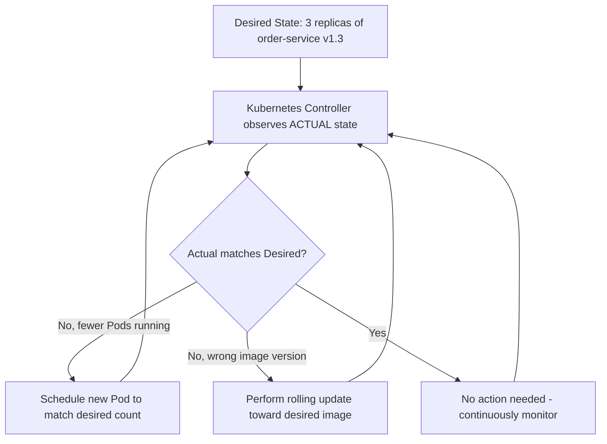
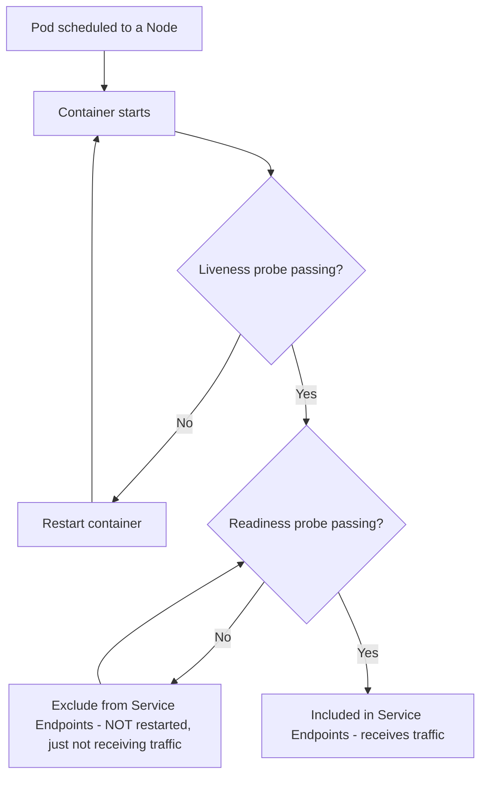
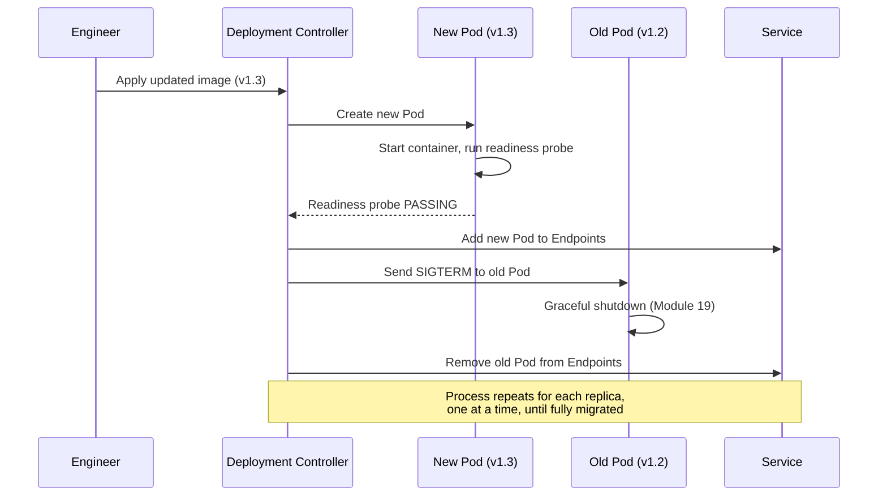

# Module 20 — Kubernetes for Microservices

> **Microservices Masterclass** | Level: Advanced | Track: Node.js Backend Engineering
> Prerequisite: Module 1–19 (especially Module 19 — Dockerizing Microservices, Module 11 — Service Discovery)
> Next Module: Module 21 — Observability

---

## Table of Contents

1. [Introduction](#1-introduction)
2. [Learning Objectives](#2-learning-objectives)
3. [Problem Statement](#3-problem-statement)
4. [Why This Concept Exists](#4-why-this-concept-exists)
5. [Historical Background](#5-historical-background)
6. [Real-World Analogy](#6-real-world-analogy)
7. [Technical Definition](#7-technical-definition)
8. [Core Terminology](#8-core-terminology)
9. [Internal Working](#9-internal-working)
10. [Step-by-Step Request Flow](#10-step-by-step-request-flow)
11. [Architecture Overview](#11-architecture-overview)
12. [ASCII Diagrams](#12-ascii-diagrams)
13. [Mermaid Flowcharts](#13-mermaid-flowcharts)
14. [Mermaid Sequence Diagrams](#14-mermaid-sequence-diagrams)
15. [Component Diagrams](#15-component-diagrams)
16. [Deployment Diagrams](#16-deployment-diagrams)
17. [Database Interaction](#17-database-interaction)
18. [Failure Scenarios](#18-failure-scenarios)
19. [Scalability Discussion](#19-scalability-discussion)
20. [High Availability Considerations](#20-high-availability-considerations)
21. [CAP Theorem Implications](#21-cap-theorem-implications)
22. [Node.js Implementation](#22-nodejs-implementation)
23. [Express.js Examples](#23-expressjs-examples)
24. [Docker Examples](#24-docker-examples)
25. [Kafka/Redis Integration](#25-kafkaredis-integration)
26. [Error Handling](#26-error-handling)
27. [Logging & Monitoring](#27-logging--monitoring)
28. [Security Considerations](#28-security-considerations)
29. [Performance Optimization](#29-performance-optimization)
30. [Production Best Practices](#30-production-best-practices)
31. [Anti-Patterns and Common Mistakes](#31-anti-patterns-and-common-mistakes)
32. [Debugging Tips](#32-debugging-tips)
33. [Interview Questions](#33-interview-questions)
34. [Scenario-Based Questions](#34-scenario-based-questions)
35. [Hands-on Exercises](#35-hands-on-exercises)
36. [Mini Project](#36-mini-project)
37. [Advanced Project](#37-advanced-project)
38. [Summary](#38-summary)
39. [Revision Notes](#39-revision-notes)
40. [One-Page Cheat Sheet](#40-one-page-cheat-sheet)

---

## 1. Introduction

Module 19 gave you Docker — the packaging technology that makes a service portable and consistent. But packaging a box doesn't answer a much bigger set of questions: **which of your many physical (or virtual) machines should run this container? What happens when that machine dies? How do you run 15 replicas instead of 1, and route traffic evenly across them? How do you roll out a new version without downtime, and roll back instantly if it's broken?**

These are **orchestration** questions, and **Kubernetes** is the industry-standard answer. Throughout this masterclass, Kubernetes has appeared in nearly every module's "Deployment Diagrams" section, treated as the assumed production runtime. This module finally goes deep on Kubernetes itself: its core objects (Pods, Deployments, Services, ConfigMaps, Secrets, Ingress), how they work together, and how to actually define and manage a real microservices system running on it.

---

## 2. Learning Objectives

By the end of this module, you will be able to:

- Explain Kubernetes's core objects — Pod, Deployment, Service, ConfigMap, Secret, Ingress — and the specific job each one does.
- Write Kubernetes manifests (YAML) to deploy a Node.js microservice with proper health checks, resource limits, and configuration.
- Explain how Kubernetes provides service discovery and load balancing natively (revisiting and deepening Module 11).
- Perform a zero-downtime rolling update and understand rollback mechanics.
- Configure horizontal autoscaling based on resource utilization.
- Recognize common Kubernetes misconfigurations that cause outages or resource waste.

---

## 3. Problem Statement

A team has successfully containerized their 6 microservices (Module 19) and can run them all locally with Docker Compose. Now they need to run this system in **production**, where:

- They have multiple physical/virtual machines, and need containers automatically placed across them, with automatic rescheduling if one machine fails.
- Traffic to `order-service` needs to be load-balanced across however many replicas are currently running — a number that should change automatically based on load.
- A new version of `payment-service` needs to be deployed **without any downtime**, and if the new version turns out to be broken, it needs to be **rolled back instantly**.
- Configuration and secrets (Module 12) need to be managed consistently and securely across dozens of running containers.
- External traffic needs to be routed to the right internal service based on the request path or hostname, without exposing every internal service directly.

Docker Compose (Module 19) simply isn't designed to solve any of these production-scale problems — it runs on a single host with no self-healing, no rolling updates, no multi-host scheduling. Kubernetes is purpose-built for exactly this set of problems, and this module shows you how it solves each one.

---

## 4. Why This Concept Exists

Kubernetes exists because **running containers reliably at scale, across many machines, requires solving a set of hard distributed-systems problems that no individual team should need to solve from scratch**: scheduling (which machine runs which container), self-healing (detecting and replacing failed containers), service discovery and load balancing (Module 11, now implemented natively), configuration management (Module 12, now implemented via native objects), and safe, zero-downtime deployment strategies. Kubernetes centralizes solutions to all of these problems into one coherent, declarative system: you describe the **desired state** ("I want 3 replicas of order-service, each with these resource limits, connected to this Service"), and Kubernetes continuously works to make the actual state match that desired state — automatically handling failures, scaling, and updates along the way.

---

## 5. Historical Background

- **2003–2013** — Google internally developed and used **Borg**, a large-scale cluster management system running the vast majority of Google's internal workloads (search, Gmail, and more) across enormous fleets of machines — Borg's internal design directly informed Kubernetes's architecture.
- **2014** — Google **announced and open-sourced Kubernetes**, based directly on lessons learned from over a decade of running Borg internally, donating it to the newly-formed **Cloud Native Computing Foundation (CNCF)** shortly after.
- **2015-2017** — Kubernetes rapidly won what was, at the time, an active "container orchestration wars" competition against alternatives like Docker Swarm and Apache Mesos, largely due to its strong community backing, extensibility (via Custom Resource Definitions), and major cloud providers (AWS, Google Cloud, Azure) all offering managed Kubernetes services.
- **Present** — Kubernetes has become the de facto standard for container orchestration across the industry, with virtually every major cloud provider offering a managed Kubernetes service (EKS, GKE, AKS), and a vast ecosystem of tools (Helm, Istio, Prometheus Operator, and many others) built around it.

---

## 6. Real-World Analogy

**Analogy: An Airport's Air Traffic Control System**

Individual planes (containers) need to take off, land, and be routed to the correct gates — but no single pilot decides all of this in isolation; an **air traffic control system** (Kubernetes) coordinates the entire airport:

- **Scheduling**: ATC decides which runway/gate a given flight uses, based on availability and constraints — exactly like Kubernetes deciding which physical node runs a given Pod, based on resource availability.
- **Self-healing**: if a gate becomes unusable, ATC reroutes affected flights to another available gate automatically — exactly like Kubernetes rescheduling a Pod from a failed node onto a healthy one.
- **Load balancing**: multiple check-in counters (multiple Pod replicas) serve the same airline's passengers, with ATC/ground staff routing new passengers to whichever counter has capacity — exactly like a Kubernetes Service load-balancing traffic across healthy Pod replicas.
- **Rolling updates**: when the airport gradually transitions from an old boarding process to a new one, it doesn't shut down entirely — it transitions gate by gate, ensuring the airport keeps functioning throughout, exactly like a Kubernetes rolling deployment replacing old Pods with new ones gradually, never taking the whole service down at once.

---

## 7. Technical Definition

> **Kubernetes** is an open-source container orchestration platform that automates the deployment, scaling, networking, and management of containerized applications across a cluster of machines, based on a **declarative** model: you describe desired state, and Kubernetes continuously reconciles actual state to match it.

> A **Pod** is the smallest deployable unit in Kubernetes — one or more tightly-coupled containers that share a network namespace and storage, typically (for microservices) just a single application container.

> A **Deployment** manages a set of identical Pod replicas, handling rolling updates, rollbacks, and self-healing (automatically replacing failed Pods to maintain the desired replica count).

> A **Service** provides a stable network identity (a DNS name and virtual IP) for a set of Pods, load-balancing traffic across all currently-healthy Pods matching its selector — this is Kubernetes's native implementation of Module 11's Service Discovery.

> A **ConfigMap** and **Secret** store non-sensitive and sensitive configuration respectively (directly implementing Module 12's principles), injected into Pods as environment variables or mounted files.

> An **Ingress** manages external HTTP(S) access into the cluster, routing requests to the correct internal Service based on hostname/path rules — commonly serving as (or working alongside) the API Gateway from Module 10.

---

## 8. Core Terminology

| Term | Meaning |
|---|---|
| **Cluster** | A set of machines (nodes) managed together by Kubernetes |
| **Node** | A single machine (physical or virtual) in the cluster, running Pods |
| **Pod** | The smallest deployable unit — one or more containers sharing network/storage |
| **Deployment** | Manages a set of Pod replicas, handles rolling updates and self-healing |
| **ReplicaSet** | Ensures a specified number of Pod replicas are running (managed automatically by a Deployment) |
| **Service** | Stable network identity + load balancing for a set of Pods |
| **ConfigMap** | Non-sensitive configuration storage |
| **Secret** | Sensitive configuration storage (base64-encoded, not encrypted by default — Module 12) |
| **Ingress** | Manages external HTTP(S) routing into the cluster |
| **Namespace** | A logical partition within a cluster, isolating groups of resources |
| **kubectl** | The command-line tool for interacting with a Kubernetes cluster |
| **Horizontal Pod Autoscaler (HPA)** | Automatically adjusts replica count based on observed metrics (e.g., CPU utilization) |

---

## 9. Internal Working

Here's how Kubernetes actually manages a microservice end-to-end:

1. You define a **Deployment** manifest specifying: the container image, desired replica count (e.g., 3), resource requests/limits, and health check probes (Module 11's readiness/liveness).
2. Kubernetes's **scheduler** examines the cluster's available Nodes and their current resource usage, and places each of the 3 Pods onto Nodes with sufficient available capacity.
3. Each Pod runs the specified container; Kubernetes continuously monitors it via the configured **liveness probe** (is it alive? restart if not) and **readiness probe** (is it ready for traffic? exclude from load balancing if not, without restarting it).
4. A **Service** object, configured with a label selector matching these Pods, automatically maintains an up-to-date list of healthy Pod IPs (called **Endpoints**) and provides a stable DNS name (e.g., `order-service.default.svc.cluster.local`, or simply `order-service` within the same namespace) that other Pods can use to reach this Deployment — implementing Module 11's server-side service discovery natively.
5. If a Node fails, Kubernetes detects the Pods that were running on it are gone, and the Deployment's controller automatically schedules replacement Pods on healthy Nodes to restore the desired replica count — self-healing, with no manual intervention.
6. When you update the Deployment's image (a new version), Kubernetes performs a **rolling update**: gradually replacing old Pods with new ones, a few at a time, only proceeding as new Pods pass their readiness probes — ensuring the Service always has enough healthy Pods (old or new) to keep serving traffic throughout the update, with zero downtime.
7. An **Ingress** resource, backed by an Ingress Controller (e.g., NGINX Ingress, or a cloud provider's load balancer integration), routes external HTTP traffic to the correct internal Service based on path/hostname rules.

---

## 10. Step-by-Step Request Flow

**Scenario: Deploying order-service, then rolling out an update, in Kubernetes.**

```
Step 1:  Engineer applies a Deployment manifest: order-service,
         image: myregistry/order-service:v1.2, replicas: 3
Step 2:  Kubernetes scheduler places 3 Pods across available Nodes
Step 3:  Each Pod starts; Kubernetes checks READINESS probes before
         marking each Pod as available to receive traffic
Step 4:  A Service (order-service) automatically tracks these 3
         healthy Pods as its Endpoints
Step 5:  External traffic arrives via an Ingress, routed to the
         order-service Service, which load-balances across the 3 Pods

--- LATER: Rolling Update ---

Step 6:  Engineer updates the Deployment's image to
         myregistry/order-service:v1.3 and applies the change
Step 7:  Kubernetes starts ONE new Pod (v1.3), waits for it to
         pass its READINESS probe
Step 8:  Once healthy, Kubernetes terminates ONE old Pod (v1.2),
         sending SIGTERM (Module 19's graceful shutdown handling)
Step 9:  This repeats, one Pod at a time (configurable), until ALL
         3 Pods are running v1.3 - AT NO POINT did the Service have
         fewer than the minimum required healthy Pods to serve traffic
Step 10: If v1.3 turns out to be broken (failing readiness checks
         or crashing), the engineer runs a ROLLBACK command,
         and Kubernetes reverses the process back to v1.2 - quickly
```

---

## 11. Architecture Overview

```
                        Internet
                            │
                            ▼
                        Ingress
                  (routes by path/host)
                            │
                            ▼
                  order-service (Service object)
                  (stable DNS name + load balancer)
                            │
              ┌─────────────┼─────────────┐
              ▼              ▼              ▼
        Pod (v1.3)      Pod (v1.3)      Pod (v1.3)
        (managed by a Deployment,
         which maintains 3 replicas,
         handles rolling updates,
         and self-heals failures)
              │
       ┌──────┴──────┐
       ▼             ▼
  ConfigMap      Secret
  (non-sensitive  (sensitive
   config)         config)
```

---

## 12. ASCII Diagrams

### 12.1 Pod, ReplicaSet, Deployment Relationship

```
   Deployment (order-service)
        │  "I want 3 replicas of this Pod spec, and I'll
        │   manage rolling updates/rollbacks for you"
        ▼
   ReplicaSet
        │  "I ensure EXACTLY 3 Pods matching this spec
        │   are running at all times"
        ▼
   Pod   Pod   Pod
   (v1.3) (v1.3) (v1.3)

  If a Pod crashes, the ReplicaSet notices the count
  dropped to 2 and immediately creates a replacement
```

### 12.2 Rolling Update Sequence

```
BEFORE (3x v1.2):        [v1.2] [v1.2] [v1.2]

Step 1: Start 1 new Pod:  [v1.2] [v1.2] [v1.2] [v1.3-starting]
Step 2: v1.3 passes readiness, terminate 1 old:
                           [v1.2] [v1.2] [v1.3]
Step 3: Start next new:    [v1.2] [v1.2] [v1.3] [v1.3-starting]
Step 4: terminate next old: [v1.2] [v1.3] [v1.3]
...continues until fully migrated...

AFTER (3x v1.3):          [v1.3] [v1.3] [v1.3]

At EVERY step, at least 2-3 healthy Pods (old or new)
are ALWAYS serving traffic - ZERO DOWNTIME
```

### 12.3 Service Load Balancing + Endpoints

```
         Service: order-service
      (stable DNS: order-service.default.svc.cluster.local)
                     │
              tracks ENDPOINTS
                     │
        ┌────────────┼────────────┐
        ▼            ▼            ▼
   Pod IP:         Pod IP:        Pod IP:
   10.0.1.5        10.0.1.9       10.0.1.14
   (healthy)       (healthy)       (JUST FAILED
                                     readiness -
                                     REMOVED from
                                     Endpoints, traffic
                                     no longer routed here)
```

---

## 13. Mermaid Flowcharts

### 13.1 Kubernetes Reconciliation Loop



### 13.2 Pod Lifecycle With Probes



---

## 14. Mermaid Sequence Diagrams

### 14.1 Rolling Update With Health Checks



---

## 15. Component Diagrams

```
┌─────────────────────────────────────────────────────────┐
│                    Kubernetes Control Plane                   │
│  ┌───────────────┐ ┌───────────────┐ ┌───────────────┐      │
│  │ API Server        │ │ Scheduler         │ │ Controller        │      │
│  │ (all interactions   │ │ (places Pods on     │ │ Manager             │      │
│  │  go through here)   │ │  Nodes)              │ │ (reconciliation      │      │
│  │                      │ │                      │ │  loops - Deployments,│      │
│  │                      │ │                      │ │  ReplicaSets, etc.)   │      │
│  └───────────────┘ └───────────────┘ └───────────────┘      │
│  ┌───────────────────────────────────────────────┐          │
│  │                       etcd                          │          │
│  │  (distributed key-value store - the cluster's        │          │
│  │   source of truth for ALL desired/actual state)        │          │
│  └───────────────────────────────────────────────┘          │
└─────────────────────────────────────────────────────────┘
                          │
              ┌───────────┼───────────┐
              ▼            ▼            ▼
        Worker Node   Worker Node   Worker Node
        (runs Pods,    (runs Pods,    (runs Pods,
         kubelet,        kubelet,        kubelet,
         kube-proxy)     kube-proxy)     kube-proxy)
```

---

## 16. Deployment Diagrams

```
┌───────────────────────────────────────────────────────────┐
│                    Production Kubernetes Cluster              │
│                                                               │
│  Namespace: production                                        │
│                                                               │
│  Ingress ──▶ order-service (Service) ──▶ order-service Pods (3x)│
│         └──▶ payment-service (Service) ──▶ payment-service Pods (2x)│
│                                                               │
│  ConfigMaps: order-service-config, payment-service-config        │
│  Secrets: order-service-secrets, payment-service-secrets           │
│                                                               │
│  Horizontal Pod Autoscaler: order-service                       │
│  (scales between 3-10 replicas based on CPU utilization)          │
└───────────────────────────────────────────────────────────┘
```

---

## 17. Database Interaction

Databases in Kubernetes are typically handled differently from stateless application services, given their need for stable storage:

```
STATELESS services (order-service, payment-service):
  -> Deployment + Service (Pods are interchangeable, no
     persistent identity needed)

STATEFUL services (databases):
  -> StatefulSet (provides stable network identity AND stable
     storage per replica - important for databases where
     "which specific replica has which data" matters)
  -> PersistentVolumeClaim (requests durable storage that
     survives Pod rescheduling, backed by the underlying
     infrastructure's storage system)

In PRODUCTION, many teams instead use a MANAGED database
service (AWS RDS, Google Cloud SQL) OUTSIDE the Kubernetes
cluster entirely, rather than running their own database
StatefulSet - trading some flexibility for significantly
reduced operational burden
```

---

## 18. Failure Scenarios

| Scenario | Kubernetes Handling |
|---|---|
| A Node fails completely | Kubernetes detects the Node is unresponsive and reschedules all its Pods onto healthy Nodes automatically |
| A single Pod crashes | The ReplicaSet notices the replica count dropped and immediately creates a replacement Pod |
| A new deployment's image is broken (crashes on startup) | Readiness probes fail; Kubernetes won't add the broken Pods to the Service's Endpoints, and (depending on rollout strategy) may pause the rollout, limiting the blast radius to only the Pods already replaced |
| A Pod is using too much memory | Kubernetes can be configured to enforce memory `limits`, and will kill (OOMKill) a Pod that exceeds its limit, which the ReplicaSet then replaces — contained, rather than affecting the whole Node |
| A ConfigMap/Secret is updated | Depending on how it's mounted, running Pods may need to be manually restarted to pick up the change (environment variables are set at Pod startup, not dynamically updated) — a common operational gotcha |

```
Node failure and self-healing:

  Node "worker-2" becomes unresponsive (hardware failure)
           │
           ▼
  Kubernetes control plane detects the Node is NotReady
  after a configured grace period
           │
           ▼
  ALL Pods that were on worker-2 are marked for rescheduling
           │
           ▼
  ReplicaSets create REPLACEMENT Pods, scheduled onto
  OTHER healthy Nodes
           │
           ▼
  Service Endpoints update automatically - traffic
  continues flowing to the NEW Pod locations, with NO
  manual intervention required
```

---

## 19. Scalability Discussion

Kubernetes provides both **manual scaling** (changing a Deployment's `replicas` count) and **automatic scaling** via the **Horizontal Pod Autoscaler (HPA)**, which monitors metrics (commonly CPU or memory utilization, or custom metrics like queue depth) and automatically adjusts the replica count within configured min/max bounds. This directly implements the independent, per-service scaling benefit promised since Module 1 — `order-service` can scale to 15 replicas during a sale while `payment-service` stays at 3, entirely automatically, based on each service's own observed load.

---

## 20. High Availability Considerations

- Running a Deployment with **multiple replicas** (at minimum 2-3) across **multiple Nodes** (and ideally multiple availability zones, in a cloud environment) ensures no single Node or zone failure takes down a service entirely.
- The Kubernetes **control plane itself** (API Server, etcd, Scheduler) should also be run in a highly available configuration (multiple control plane nodes) in any serious production cluster — most managed Kubernetes offerings (EKS, GKE, AKS) handle this automatically.
- **Pod Disruption Budgets** can be configured to limit how many Pods of a Deployment can be voluntarily disrupted at once (e.g., during a Node maintenance drain), ensuring a minimum number of healthy replicas remain available even during planned operational activities.

---

## 21. CAP Theorem Implications

Kubernetes's own control plane, built on **etcd** (using the Raft consensus algorithm), favors **Consistency** over Availability during a control-plane partition — as discussed in Module 11, this rarely affects already-configured **data plane** routing (existing Pods and Services continue serving traffic even if the control plane is briefly partitioned), a deliberate design separating "deciding what should happen" (control plane, CP-leaning) from "actually serving traffic" (data plane, which remains available). This distinction is one of Kubernetes's most important architectural properties for production reliability.

---

## 22. Node.js Implementation

While Kubernetes manifests are YAML (not Node.js code), your Node.js application must be written to cooperate correctly with Kubernetes's health check and shutdown mechanisms — building directly on Module 11 and Module 19's foundations.

**`src/app.js`** — a Kubernetes-ready Express application
```javascript
import express from "express";

const app = express();
let isReady = false; // tracks whether startup (e.g., DB connection) has completed

app.use(express.json());

// LIVENESS probe: "is this process alive and not deadlocked?"
// Kept intentionally simple - it should almost NEVER fail unless
// the process is genuinely broken (Kubernetes RESTARTS on failure)
app.get("/health/live", (req, res) => {
  res.status(200).json({ status: "alive" });
});

// READINESS probe: "am I ready to receive traffic RIGHT NOW?"
// This can legitimately be false during startup (still connecting
// to the database) WITHOUT indicating the process itself is broken
// (Kubernetes just WITHHOLDS traffic, does NOT restart)
app.get("/health/ready", (req, res) => {
  if (isReady) {
    return res.status(200).json({ status: "ready" });
  }
  res.status(503).json({ status: "not ready" });
});

app.get("/orders/:id", (req, res) => {
  res.json({ id: req.params.id, status: "PLACED" });
});

const server = app.listen(4002, async () => {
  console.log("Order Service starting...");
  await connectToDatabase(); // simulated async startup work
  isReady = true;
  console.log("Order Service is now READY");
});

// Graceful shutdown on SIGTERM (Kubernetes sends this before
// forcibly killing a Pod during termination/rolling update)
process.on("SIGTERM", () => {
  console.log("SIGTERM received - shutting down gracefully");
  isReady = false; // stop accepting NEW readiness-gated traffic immediately
  server.close(() => {
    console.log("Server closed, exiting");
    process.exit(0);
  });
});

async function connectToDatabase() {
  // simulate connection delay
  await new Promise((resolve) => setTimeout(resolve, 2000));
}
```

---

## 23. Express.js Examples

The Express code above already demonstrates the essential pattern. It's worth highlighting explicitly: **liveness and readiness are different questions with different consequences** — conflating them (using the same endpoint/logic for both) is one of the most common Kubernetes misconfigurations, covered further in Section 31.

---

## 24. Docker Examples

**Kubernetes manifests** for `order-service`, tying together everything covered in this module:

```yaml
# deployment.yaml
apiVersion: apps/v1
kind: Deployment
metadata:
  name: order-service
  namespace: production
spec:
  replicas: 3
  selector:
    matchLabels:
      app: order-service
  strategy:
    rollingUpdate:
      maxUnavailable: 1   # at most 1 Pod down at a time during updates
      maxSurge: 1         # at most 1 EXTRA Pod during updates
    type: RollingUpdate
  template:
    metadata:
      labels:
        app: order-service
    spec:
      containers:
        - name: order-service
          image: myregistry/order-service:v1.3
          ports:
            - containerPort: 4002
          envFrom:
            - configMapRef:
                name: order-service-config
            - secretRef:
                name: order-service-secrets
          resources:
            requests:
              cpu: "100m"
              memory: "128Mi"
            limits:
              cpu: "500m"
              memory: "256Mi"
          readinessProbe:
            httpGet:
              path: /health/ready
              port: 4002
            initialDelaySeconds: 5
            periodSeconds: 5
          livenessProbe:
            httpGet:
              path: /health/live
              port: 4002
            initialDelaySeconds: 10
            periodSeconds: 10
---
# service.yaml
apiVersion: v1
kind: Service
metadata:
  name: order-service
  namespace: production
spec:
  selector:
    app: order-service
  ports:
    - port: 4002
      targetPort: 4002
  type: ClusterIP
---
# hpa.yaml
apiVersion: autoscaling/v2
kind: HorizontalPodAutoscaler
metadata:
  name: order-service-hpa
  namespace: production
spec:
  scaleTargetRef:
    apiVersion: apps/v1
    kind: Deployment
    name: order-service
  minReplicas: 3
  maxReplicas: 10
  metrics:
    - type: Resource
      resource:
        name: cpu
        target:
          type: Utilization
          averageUtilization: 70
---
# ingress.yaml
apiVersion: networking.k8s.io/v1
kind: Ingress
metadata:
  name: api-ingress
  namespace: production
spec:
  rules:
    - host: api.mycompany.com
      http:
        paths:
          - path: /orders
            pathType: Prefix
            backend:
              service:
                name: order-service
                port:
                  number: 4002
```

---

## 25. Kafka/Redis Integration

Kafka and Redis, when run **inside** the Kubernetes cluster, are typically deployed as **StatefulSets** (for stable identity/storage) rather than standard Deployments — often via a dedicated Kubernetes **Operator** (e.g., the Strimzi Kafka Operator) that understands the specific operational needs of running a stateful, clustered system like Kafka correctly, rather than a hand-rolled StatefulSet manifest. Many production teams instead choose a **managed** Kafka/Redis service (e.g., Confluent Cloud, AWS MSK, AWS ElastiCache) precisely to avoid the operational complexity of running these stateful systems themselves within Kubernetes.

---

## 26. Error Handling

Kubernetes surfaces container failures via **Pod status** and events, which your monitoring should track:

```bash
# Common diagnostic commands (conceptual, not Node.js code)
kubectl get pods -n production               # see current Pod status
kubectl describe pod <pod-name> -n production # see recent events (why did it restart?)
kubectl logs <pod-name> -n production          # see application logs
kubectl logs <pod-name> -n production --previous  # see logs from BEFORE a crash/restart
```

A Pod stuck in `CrashLoopBackOff` indicates the container is repeatedly failing shortly after starting — the application's own error handling and logging (Module 19's `uncaughtException`/`unhandledRejection` handlers) are what make the root cause visible via `kubectl logs`.

---

## 27. Logging & Monitoring

- Kubernetes captures container stdout/stderr automatically (same principle as Module 19's Docker logging), typically aggregated cluster-wide via a logging stack (e.g., Fluentd/Fluent Bit + Elasticsearch/Loki + Grafana).
- Monitor **Pod restart counts** — a Pod restarting frequently indicates a crash loop or a liveness probe misconfiguration requiring investigation.
- Monitor the **Horizontal Pod Autoscaler's** current vs. desired replica count and the underlying metric it's scaling on, to verify autoscaling is behaving as expected under real traffic patterns.
- Use **kubectl top pods** (with metrics-server installed) to see real-time CPU/memory usage per Pod, useful for right-sizing resource requests/limits.

---

## 28. Security Considerations

- Use Kubernetes **Role-Based Access Control (RBAC)** to restrict which users/service accounts can perform which actions on which resources — never grant broad, cluster-wide admin access by default.
- Use **Network Policies** to restrict which Pods can communicate with which other Pods, providing network-level segmentation beyond just Kubernetes's default (permissive) inter-Pod networking.
- As emphasized in Module 12, remember Kubernetes **Secrets are base64-encoded, not encrypted, by default** — enable encryption at rest for etcd, and consider integrating a dedicated secrets manager (Vault) for stronger guarantees in genuinely sensitive environments.
- Run containers with the **least privilege** possible: non-root users (Module 19), read-only root filesystems where feasible, and dropped Linux capabilities not needed by the application.

---

## 29. Performance Optimization

- Set **resource requests** accurately based on real observed usage — requests that are too low can cause the scheduler to overcommit a Node, leading to resource contention; too high wastes cluster capacity.
- Configure the **Horizontal Pod Autoscaler** with a metric and thresholds that genuinely reflect your service's actual bottleneck (CPU is a reasonable default, but a service bottlenecked on I/O or queue depth may need custom metrics for effective autoscaling).
- Use **readiness probes** with appropriate `initialDelaySeconds` and `periodSeconds` tuned to your application's actual startup time — probes that are too aggressive can cause a slow-starting-but-healthy Pod to be prematurely excluded from traffic or even restarted.

---

## 30. Production Best Practices

- Always define **both** readiness and liveness probes, understanding their distinct purposes (Section 22) — never use the same shallow check for both, and never skip either.
- Always set **resource requests and limits** for every container — an unbounded Pod can starve its Node's resources, affecting unrelated Pods scheduled on the same Node.
- Use **namespaces** to logically separate environments or teams within a shared cluster, applying appropriate RBAC and resource quotas per namespace.
- Practice rolling updates and rollbacks regularly (not just in an emergency) so your team is confident and fast when it genuinely matters.
- Prefer a **managed Kubernetes service** (EKS, GKE, AKS) over self-managing the control plane, unless you have a specific, well-justified reason not to — the operational burden of running Kubernetes's control plane yourself is substantial.

---

## 31. Anti-Patterns and Common Mistakes

| Anti-Pattern | Why It's a Problem |
|---|---|
| **Using the same check for liveness and readiness** | A temporary dependency slowdown (which should only affect readiness) can cause unnecessary, disruptive container RESTARTS if it's also wired to the liveness probe |
| **No resource requests/limits** | A single misbehaving Pod can consume unbounded Node resources, starving unrelated Pods on the same Node |
| **Deploying directly to `latest` tag** | Makes rollbacks ambiguous (which exact version was "latest" yesterday?) and rollouts non-reproducible — always use specific, immutable image tags |
| **Ignoring Pod Disruption Budgets** | During planned Node maintenance, too many replicas of a critical service could be taken down simultaneously, causing an avoidable outage |
| **Manually editing live cluster resources instead of updating manifests** | Creates configuration drift between your version-controlled manifests and the actual running cluster state, a significant operational risk |

```
Same check for liveness AND readiness (anti-pattern):

  livenessProbe:
    httpGet: { path: /health, port: 4002 }   <- checks DB connection
  readinessProbe:
    httpGet: { path: /health, port: 4002 }   <- SAME check

  Problem: if the database is BRIEFLY slow (a TRANSIENT issue that
  readiness should handle by temporarily excluding this Pod from
  traffic), the SAME check failing also triggers the LIVENESS
  probe, causing Kubernetes to RESTART a perfectly healthy process
  unnecessarily - compounding a transient problem into an
  unnecessary restart storm
```

---

## 32. Debugging Tips

- `kubectl describe pod <name>` is almost always your first step when a Pod isn't behaving as expected — its Events section reveals scheduling issues, probe failures, and image pull errors clearly.
- `kubectl logs <name> --previous` retrieves logs from a Pod's PRIOR instance if it recently crashed and restarted — essential for diagnosing a `CrashLoopBackOff`.
- If a Service isn't routing traffic correctly, check `kubectl get endpoints <service-name>` to confirm it's tracking the Pod IPs you expect — an empty Endpoints list usually means the Service's label selector doesn't match any currently-Ready Pods.
- If a rolling update seems stuck, check whether new Pods are failing their readiness probe (`kubectl describe pod` on the new Pods) — Kubernetes will pause a rollout that can't get new Pods to a healthy, Ready state.

---

## 33. Interview Questions

### Easy
1. What is a Pod, and why is it the smallest deployable unit rather than a container directly?
2. What is the difference between a Deployment and a ReplicaSet?
3. What does a Kubernetes Service do?
4. What is the difference between a liveness probe and a readiness probe?
5. What is an Ingress used for?

### Medium
6. Explain how a Kubernetes rolling update achieves zero downtime.
7. What happens when a Node fails, and how does Kubernetes recover?
8. Why should liveness and readiness probes typically check different things?
9. What is a Horizontal Pod Autoscaler, and what metrics can it scale on?
10. Why are Kubernetes Secrets base64-encoded rather than encrypted by default, and what's the security implication?

### Hard
11. Design the Deployment, Service, and HPA manifests for a service that needs to scale between 2 and 20 replicas based on CPU utilization, with zero-downtime rolling updates.
12. Explain the relationship between the Kubernetes control plane's CAP theorem trade-offs (via etcd/Raft) and the separate availability of the data plane during a control-plane partition.
13. How would you diagnose a Pod stuck in CrashLoopBackOff, walking through your exact debugging steps?
14. Discuss the trade-offs of running a database as a Kubernetes StatefulSet versus using an external managed database service.
15. Design a Pod Disruption Budget strategy for a critical 3-replica service to ensure availability during planned Node maintenance.

---

## 34. Scenario-Based Questions

1. Your team deploys a new version of payment-service, and it repeatedly restarts in a CrashLoopBackOff. Walk through your exact diagnostic steps.
2. A single Pod's memory usage spiked unexpectedly, and it appears to have affected OTHER, unrelated Pods on the same Node. What Kubernetes configuration would you check first?
3. During a rolling update, new Pods are stuck "Pending" and never become Ready. What are the most likely causes, and how would you investigate each?
4. Leadership asks why your team's Kubernetes Secrets aren't sufficiently secure "since Kubernetes has Secrets built in." How do you explain the actual security posture and what additional measures you'd recommend?
5. Your service's Horizontal Pod Autoscaler isn't scaling up despite genuinely high load. What would you check to diagnose this?

---

## 35. Hands-on Exercises

1. Write a Deployment, Service, and HPA manifest for a simple Node.js service, following the pattern in Section 24.
2. Deploy this manifest to a local Kubernetes cluster (`minikube` or `kind`), and verify the Service correctly load-balances across all replicas.
3. Perform a rolling update (change the image tag) and observe, via `kubectl get pods -w`, the gradual replacement of old Pods with new ones.
4. Intentionally misconfigure a readiness probe (pointing to a non-existent path) and observe how Kubernetes responds (Pod stays "not ready," never receives traffic).
5. Simulate a Pod crash (`kubectl delete pod <name>`) and observe the ReplicaSet automatically creating a replacement.

---

## 36. Mini Project

**Build: A Kubernetes-Ready Node.js Service**

1. Build a simple Express service with SEPARATE, correctly-distinguished liveness and readiness endpoints (Section 22), and graceful SIGTERM shutdown handling.
2. Write Deployment, Service, and ConfigMap manifests for this service (Section 24).
3. Deploy to a local Kubernetes cluster and verify: (a) the Service correctly load-balances across 3 replicas, (b) killing one Pod results in automatic replacement, and (c) the readiness probe correctly withholds traffic from a Pod during a simulated slow startup.

---

## 37. Advanced Project

**Build: A Full Production-Pattern Kubernetes Deployment**

1. Extend the Mini Project with a Secret (for a simulated database password), an HPA configured to scale based on CPU utilization, and an Ingress routing external traffic to the service.
2. Perform a rolling update from v1 to v2 of your image, and verify zero downtime by running a continuous curl loop against the Service throughout the update, confirming no failed requests.
3. Intentionally deploy a broken v3 image (crashes immediately), and observe Kubernetes's behavior — verify the rollout is appropriately limited in its blast radius, then perform a `kubectl rollout undo` to roll back to the last known-good version.
4. Load-test the service (e.g., using a simple script generating concurrent requests) and observe the Horizontal Pod Autoscaler scaling the replica count up in response, then back down once load subsides.
5. Write a short production-readiness checklist based on this module's concepts (probes, resource limits, rolling update strategy, HPA, secrets handling) that you'd use to review any new service before its first production deployment.

---

## 38. Summary

- Kubernetes automates the deployment, scaling, self-healing, and networking of containerized applications across a cluster, based on a declarative desired-state model.
- Pods are the smallest deployable unit; Deployments manage replica sets of Pods, handling rolling updates and self-healing; Services provide stable network identity and load balancing, implementing Module 11's service discovery natively.
- Liveness and readiness probes serve genuinely different purposes and must be configured distinctly — conflating them is one of the most common, damaging misconfigurations.
- Rolling updates achieve zero-downtime deployments by gradually replacing old Pods with new ones, only proceeding as new Pods pass their readiness checks.
- The Horizontal Pod Autoscaler enables automatic, metric-driven scaling, directly realizing the independent per-service scaling benefit promised throughout this masterclass.

---

## 39. Revision Notes

- Pod: smallest deployable unit (usually one container for microservices).
- Deployment: manages Pod replicas, rolling updates, self-healing.
- Service: stable DNS + load balancing across healthy Pods (native service discovery).
- ConfigMap/Secret: configuration/secrets injection (Module 12's principles, natively implemented).
- Ingress: external HTTP(S) routing into the cluster.
- Liveness probe: restart if failing. Readiness probe: exclude from traffic if failing (no restart).
- HPA: automatic scaling based on observed metrics (CPU, memory, custom).
- Control plane favors Consistency (etcd/Raft); data plane remains available during control-plane partitions.

---

## 40. One-Page Cheat Sheet

```
POD:                smallest deployable unit - one or more containers, shared network
DEPLOYMENT:          manages Pod replicas - rolling updates, rollbacks, self-healing
SERVICE:             stable DNS + load balancing across healthy Pods
CONFIGMAP:           non-sensitive config injection
SECRET:              sensitive config injection (base64-encoded, NOT encrypted by default!)
INGRESS:             external HTTP(S) routing into the cluster
HPA:                 automatic scaling based on observed metrics

LIVENESS PROBE:      is this process ALIVE? Fail -> RESTART
READINESS PROBE:     is this Pod READY for traffic RIGHT NOW? Fail -> WITHHOLD traffic, no restart

GOLDEN RULES:
  - NEVER use the same check for liveness AND readiness
  - ALWAYS set resource requests AND limits on every container
  - ALWAYS use specific image tags, never `latest`, for reproducible deploys
  - Prefer a MANAGED Kubernetes service over self-managing the control plane
  - Practice rollouts and rollbacks regularly, not just during emergencies
```

---

**Suggested Next Module:** Module 21 — Observability (Metrics, Health Checks, Prometheus, and Grafana for monitoring microservices in production)
