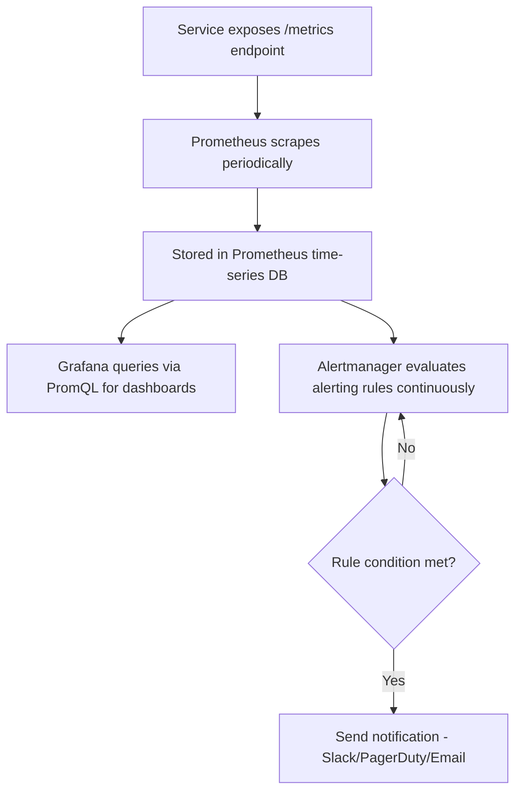
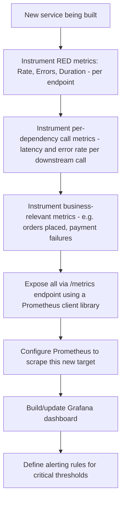
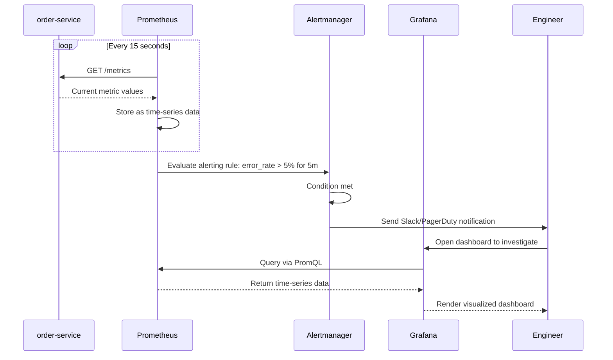

# Module 21 — Observability

> **Microservices Masterclass** | Level: Advanced | Track: Node.js Backend Engineering
> Prerequisite: Module 1–20 (especially Module 18 — Resilience Patterns, Module 20 — Kubernetes)
> Next Module: Module 22 — Distributed Logging

---

## Table of Contents

1. [Introduction](#1-introduction)
2. [Learning Objectives](#2-learning-objectives)
3. [Problem Statement](#3-problem-statement)
4. [Why This Concept Exists](#4-why-this-concept-exists)
5. [Historical Background](#5-historical-background)
6. [Real-World Analogy](#6-real-world-analogy)
7. [Technical Definition](#7-technical-definition)
8. [Core Terminology](#8-core-terminology)
9. [Internal Working](#9-internal-working)
10. [Step-by-Step Request Flow](#10-step-by-step-request-flow)
11. [Architecture Overview](#11-architecture-overview)
12. [ASCII Diagrams](#12-ascii-diagrams)
13. [Mermaid Flowcharts](#13-mermaid-flowcharts)
14. [Mermaid Sequence Diagrams](#14-mermaid-sequence-diagrams)
15. [Component Diagrams](#15-component-diagrams)
16. [Deployment Diagrams](#16-deployment-diagrams)
17. [Database Interaction](#17-database-interaction)
18. [Failure Scenarios](#18-failure-scenarios)
19. [Scalability Discussion](#19-scalability-discussion)
20. [High Availability Considerations](#20-high-availability-considerations)
21. [CAP Theorem Implications](#21-cap-theorem-implications)
22. [Node.js Implementation](#22-nodejs-implementation)
23. [Express.js Examples](#23-expressjs-examples)
24. [Docker Examples](#24-docker-examples)
25. [Kafka/Redis Integration](#25-kafkaredis-integration)
26. [Error Handling](#26-error-handling)
27. [Logging & Monitoring](#27-logging--monitoring)
28. [Security Considerations](#28-security-considerations)
29. [Performance Optimization](#29-performance-optimization)
30. [Production Best Practices](#30-production-best-practices)
31. [Anti-Patterns and Common Mistakes](#31-anti-patterns-and-common-mistakes)
32. [Debugging Tips](#32-debugging-tips)
33. [Interview Questions](#33-interview-questions)
34. [Scenario-Based Questions](#34-scenario-based-questions)
35. [Hands-on Exercises](#35-hands-on-exercises)
36. [Mini Project](#36-mini-project)
37. [Advanced Project](#37-advanced-project)
38. [Summary](#38-summary)
39. [Revision Notes](#39-revision-notes)
40. [One-Page Cheat Sheet](#40-one-page-cheat-sheet)

---

## 1. Introduction

You've now built resilient services (Module 18), packaged them in containers (Module 19), and deployed them to Kubernetes (Module 20). But once a system with 15+ independently-deployed services is actually running in production, a new, urgent question arises: **when something goes wrong — and something always eventually does — how do you even know, and how do you find out why, fast enough to matter?**

In a monolith, "just attach a debugger" was often a viable answer. In a distributed system, that's simply not possible — a single slow customer request might have touched eight different services, running on different machines, and no single log file or debugger session shows you the full picture. **Observability** is the discipline of instrumenting your system so that, when something breaks, you can ask arbitrary questions about its internal state from the *outside*, without having anticipated the exact question in advance. This module covers its foundational pillar — **metrics** — and the standard tools (Prometheus, Grafana) used to collect and visualize them.

---

## 2. Learning Objectives

By the end of this module, you will be able to:

- Explain observability and distinguish it from simple monitoring.
- Identify the "three pillars" of observability: metrics, logs, and traces (with this module focusing on metrics; Modules 22-23 cover the other two).
- Design and implement meaningful application-level metrics (the RED and USE methods) in a Node.js service.
- Instrument a Node.js service with Prometheus client libraries and expose a `/metrics` endpoint.
- Build Grafana dashboards to visualize service health effectively.
- Design alerting rules that surface genuine problems without excessive noise.

---

## 3. Problem Statement

A team's e-commerce platform experiences a sudden spike in customer complaints about slow checkout. Without deliberate observability:

- The team has no way to know, at a glance, **which** of their 12 microservices is actually responsible for the slowdown — is it `order-service`? `payment-service`? The database? The network between them?
- They have basic infrastructure metrics (CPU, memory) from their cloud provider, but no application-level insight into request latency, error rates, or throughput **per service, per endpoint** — the exact information needed to pinpoint the actual bottleneck.
- Engineers resort to manually SSH-ing into servers and grepping through raw log files across multiple machines, a slow, error-prone process during an active incident when speed matters most.
- By the time they identify the root cause (a slow database query in `payment-service` under specific load conditions), 45 minutes have passed — 45 minutes of degraded checkout experience and lost revenue that better observability could have caught and diagnosed in minutes.

This module solves this directly: instrumenting services to expose meaningful metrics, collecting them centrally (Prometheus), visualizing them clearly (Grafana), and alerting proactively — turning "we don't know what's wrong" into "we can see exactly which service, which endpoint, and roughly why, within seconds."

---

## 4. Why This Concept Exists

Observability exists because **traditional monitoring, designed for monolithic systems with a small, known set of failure modes, doesn't scale to microservices' combinatorial explosion of possible failure points and interactions.** Traditional monitoring asks pre-defined questions ("is CPU above 80%? alert") — but in a complex distributed system, the actual questions you need to ask during an incident are often ones **you didn't think to ask in advance** ("is this specific slowdown correlated with a specific downstream dependency, for a specific subset of customers, since a specific deployment?"). Observability's goal is to instrument systems richly enough that these unanticipated questions can still be answered from the collected data, rather than requiring you to have predicted every possible failure mode ahead of time.

---

## 5. Historical Background

- **1990s–2000s** — Traditional monitoring tools (Nagios, founded 1999) focused on simple up/down health checks and basic infrastructure metrics (CPU, disk, memory) — adequate for monolithic systems with relatively few, well-understood failure modes.
- **2003** — Google's internal monitoring system **Borgmon** pioneered many concepts (a metrics-based, pull-based monitoring model) that would later directly influence Prometheus's design, itself informed by Google's massive internal scale and its need for exactly this kind of flexible, ad-hoc-queryable system.
- **2012** — **Prometheus** was created at SoundCloud, directly inspired by Borgmon, providing an open-source, pull-based metrics collection and querying system purpose-built for dynamic, containerized/microservices environments — a significant departure from earlier push-based, less flexible monitoring tools.
- **2014** — **Grafana** was created, providing a powerful, flexible visualization layer that could query Prometheus (and many other data sources), quickly becoming the standard companion tool for building operational dashboards.
- **2016** — Prometheus became the **second project** (after Kubernetes itself) to graduate from the Cloud Native Computing Foundation, cementing its status as the de facto standard metrics tool in the cloud-native/Kubernetes ecosystem.
- **2017 onward** — The term **"Observability"** (borrowed from control theory, referring to how well a system's internal state can be inferred from its external outputs) gained widespread adoption in the software industry, popularized by companies like Honeycomb and increasingly distinguishing itself from "monitoring" as a richer, more exploratory discipline.

---

## 6. Real-World Analogy

**Analogy: A Modern Car's Dashboard vs. an Old Car With Only a "Check Engine" Light**

An old car's dashboard has very few indicators: a speedometer, a fuel gauge, and a single, vague "check engine" light. When that light comes on, you know **something** is wrong, but not **what** — you have to take the car to a mechanic who plugs in a diagnostic tool to actually figure out the specific issue. This is like traditional monitoring: you know *that* something is broken (an alert fired), but not *why*.

A modern car (or, better yet, a Formula 1 race car during a live race) has dozens of continuously-monitored metrics: engine temperature, tire pressure per wheel, fuel consumption rate, brake temperature, and more — all visible to the pit crew **in real time**, letting them diagnose an emerging problem (a tire losing pressure, an engine running hot) **before** it causes a catastrophic failure, and precisely pinpoint which specific component needs attention. This is Observability: rich, granular, real-time telemetry about many aspects of the system's internal behavior, letting you answer specific diagnostic questions quickly, rather than just knowing "something is wrong" from one blunt warning light.

---

## 7. Technical Definition

> **Observability** is the degree to which a system's internal state can be inferred from its external outputs (metrics, logs, and traces) — a system is observable if, when an unexpected problem occurs, engineers can determine its root cause using only this externally-collected data, without needing to add new instrumentation or guess.

> **Metrics** are numerical measurements of a system's behavior over time (e.g., request count, error rate, latency), typically aggregated and queried to reveal trends, anomalies, and correlations.

> **Prometheus** is an open-source systems monitoring toolkit that **pulls** (scrapes) metrics from instrumented services at regular intervals, stores them in a time-series database, and provides a powerful query language (**PromQL**) for analysis and alerting.

> **Grafana** is an open-source visualization platform that queries data sources like Prometheus to build interactive, real-time dashboards.

> The **RED Method** (Rate, Errors, Duration) is a widely-used framework for the essential metrics every request-driven service should expose: the rate of requests, the rate of errors, and the distribution of request durations.

---

## 8. Core Terminology

| Term | Meaning |
|---|---|
| **Observability** | The degree to which internal system state can be inferred from external outputs |
| **Metric** | A numerical measurement of system behavior over time |
| **Prometheus** | An open-source, pull-based metrics collection and time-series database/query system |
| **Grafana** | An open-source dashboard/visualization platform |
| **PromQL** | Prometheus's query language for analyzing collected metrics |
| **Scraping** | Prometheus's pull-based mechanism of periodically fetching metrics from a service's `/metrics` endpoint |
| **RED Method** | Rate, Errors, Duration — key metrics for request-driven services |
| **USE Method** | Utilization, Saturation, Errors — key metrics for resources (CPU, memory, disk) |
| **Counter** | A metric type that only ever increases (e.g., total requests served) |
| **Gauge** | A metric type that can go up or down (e.g., current active connections) |
| **Histogram** | A metric type recording observations into configurable buckets, enabling percentile calculations (e.g., request duration) |
| **Alerting Rule** | A condition, evaluated continuously against metrics, that triggers a notification when met |

---

## 9. Internal Working

Here's how a Prometheus + Grafana observability stack works end-to-end:

1. Each microservice is **instrumented** using a Prometheus client library (e.g., `prom-client` for Node.js), which tracks metrics (counters, gauges, histograms) in-process as the application runs.
2. The service exposes these metrics via a standard **`/metrics`** HTTP endpoint, in Prometheus's plain-text exposition format.
3. **Prometheus itself** is configured with a list of "targets" (typically discovered automatically in Kubernetes via service discovery integration) and periodically **scrapes** (pulls) each target's `/metrics` endpoint, storing the results in its internal time-series database.
4. Engineers (or automated alerting rules) query this data using **PromQL**, Prometheus's expression language, to compute rates, percentiles, and other derived values from the raw counters/gauges/histograms.
5. **Grafana** connects to Prometheus as a data source, and dashboards are built using PromQL queries to visualize trends over time — request rate, error rate, P95 latency, and more, typically broken down per service and per endpoint.
6. **Alerting rules** (defined in Prometheus's Alertmanager, or increasingly directly in Grafana) continuously evaluate specific PromQL expressions (e.g., "error rate > 5% for 5 minutes") and trigger notifications (Slack, PagerDuty, email) when the condition is met.

---

## 10. Step-by-Step Request Flow

**Scenario: Diagnosing a checkout slowdown using metrics.**

```
Step 1:  Customer complaints about slow checkout start arriving
Step 2:  Engineer opens the Grafana "Checkout Flow" dashboard
Step 3:  The dashboard shows order-service's P95 latency has
         jumped from 200ms to 3.5 seconds, starting ~10 minutes ago
Step 4:  Engineer drills into order-service's PER-DEPENDENCY
         latency breakdown (a metric this team deliberately
         instrumented, per Section 22) - it shows the SLOWNESS
         is isolated to calls to payment-service specifically,
         not order-service's own database
Step 5:  Engineer checks payment-service's own dashboard - its
         REQUEST RATE hasn't changed, but its P95 LATENCY has
         also spiked at the exact same time
Step 6:  Engineer checks payment-service's DATABASE query
         duration metric - THIS is the actual root cause: a
         specific slow query pattern, correlated exactly with
         the timing of the incident
Step 7:  Root cause identified within MINUTES (not 45+), because
         metrics were instrumented at each relevant layer
         (request rate/latency AND per-dependency breakdown AND
         database query performance) rather than only having
         generic infrastructure metrics (CPU/memory) available
```

---

## 11. Architecture Overview

```
   order-service         payment-service        shipping-service
   (exposes /metrics)    (exposes /metrics)      (exposes /metrics)
        │                      │                       │
        └──────────────────────┼───────────────────────┘
                                │
                        Prometheus
                  (SCRAPES /metrics from
                   each service periodically,
                   stores as time-series data)
                                │
                    ┌───────────┼───────────┐
                    ▼                       ▼
                Grafana                 Alertmanager
             (dashboards, ad-hoc      (evaluates alerting
              PromQL exploration)      rules, sends
                                        notifications)
```

---

## 12. ASCII Diagrams

### 12.1 The RED Method

```
For EVERY request-driven service/endpoint, track:

  RATE:      How many requests per second is this endpoint handling?
             (throughput - is traffic normal, spiking, or dropped?)

  ERRORS:    What fraction of requests are failing (4xx/5xx)?
             (correctness/health - is something actively broken?)

  DURATION:  How long do requests take (ideally as a distribution -
             P50, P95, P99 - not just an average)?
             (latency - is the SERVICE feeling slow to users?)
```

### 12.2 Metric Types

```
COUNTER (only ever increases):

  http_requests_total{service="order-service", status="200"} = 145,302
  (use rate() in PromQL to see requests PER SECOND from this
   ever-increasing total)


GAUGE (can go up OR down):

  active_connections{service="order-service"} = 47
  (current value - can be read directly, no rate() needed)


HISTOGRAM (bucketed observations, enables percentile math):

  http_request_duration_seconds_bucket{le="0.1"} = 8,200   <- requests ≤ 100ms
  http_request_duration_seconds_bucket{le="0.5"} = 9,850   <- requests ≤ 500ms
  http_request_duration_seconds_bucket{le="1.0"} = 9,990   <- requests ≤ 1s
  http_request_duration_seconds_bucket{le="+Inf"} = 10,000  <- ALL requests

  (PromQL can compute P95, P99, etc. from these buckets)
```

### 12.3 Pull-Based (Prometheus) vs Push-Based Monitoring

```
PULL-BASED (Prometheus's model):

  Prometheus ──scrapes (GET /metrics)──▶ order-service
  Prometheus ──scrapes (GET /metrics)──▶ payment-service

  Prometheus CONTROLS the collection schedule; services just
  need to expose current state whenever asked


PUSH-BASED (some alternative systems):

  order-service ──pushes metrics──▶ Central Collector
  payment-service ──pushes metrics──▶ Central Collector

  Services must actively SEND data on their own schedule;
  can be harder to reason about for very dynamic/ephemeral
  workloads (though Prometheus DOES support a Pushgateway
  for specific short-lived job use cases)
```

---

## 13. Mermaid Flowcharts

### 13.1 Metrics Collection and Alerting Pipeline



### 13.2 Designing Metrics for a New Service



---

## 14. Mermaid Sequence Diagrams

### 14.1 Scraping and Alerting Flow



---

## 15. Component Diagrams

```
┌─────────────────────────────────────────────────────────┐
│                     order-service                           │
│  ┌───────────────────┐                                      │
│  │  prom-client library   │  <- tracks counters, gauges,        │
│  │  (in-process)            │     histograms as requests happen   │
│  └─────────┬───────────┘                                    │
│            ▼                                                 │
│  ┌───────────────────┐                                      │
│  │  /metrics endpoint      │  <- exposes current values in       │
│  │                          │     Prometheus's text format         │
│  └───────────────────┘                                      │
└─────────────────────────────────────────────────────────┘
                    ▲
              scraped by
                    │
┌─────────────────────────────────────────────────────────┐
│                       Prometheus                             │
│  ┌───────────────┐ ┌───────────────┐ ┌───────────────┐      │
│  │ Scrape Config      │ │ Time-Series DB    │ │ Alerting Rules    │      │
│  └───────────────┘ └───────────────┘ └───────────────┘      │
└─────────────────────────────────────────────────────────┘
```

---

## 16. Deployment Diagrams

```
┌───────────────────────────────────────────────────────────┐
│                    Kubernetes Cluster                        │
│                                                               │
│  order-service pods (each exposes /metrics on its own port)    │
│  payment-service pods (each exposes /metrics)                  │
│         │                                                     │
│  Prometheus (typically deployed via the Prometheus Operator,   │
│  which uses ServiceMonitor CRDs to automatically discover        │
│  and scrape targets across the cluster, WITHOUT manual            │
│  scrape-config updates every time a new service is added)         │
│         │                                                     │
│  Grafana (queries Prometheus, renders dashboards)                │
│         │                                                     │
│  Alertmanager (routes firing alerts to Slack/PagerDuty/etc.)      │
└───────────────────────────────────────────────────────────┘
```

---

## 17. Database Interaction

Metrics data itself lives in Prometheus's own specialized time-series database, entirely separate from your services' own business databases:

```
Prometheus's TSDB (Time-Series Database):
  - Optimized SPECIFICALLY for storing and querying
    time-stamped numerical data at high volume
  - NOT a general-purpose database - don't try to store
    business data here
  - Typically retains data for a LIMITED period (e.g., 15-30
    days) for cost/storage reasons; long-term retention
    requires a separate remote-write integration to a
    dedicated long-term storage system (e.g., Thanos, Cortex,
    or a managed equivalent)

Your SERVICE's own database (Order DB, Payment DB) remains
COMPLETELY SEPARATE and unaffected by this - metrics
instrumentation happens IN YOUR APPLICATION CODE, not in
your database layer directly (though database QUERY DURATION
itself is often exposed AS a metric)
```

---

## 18. Failure Scenarios

| Scenario | Observability Impact & Mitigation |
|---|---|
| Prometheus itself goes down temporarily | Metrics collection pauses (a gap in historical data), but services continue functioning normally — Prometheus's availability doesn't gate application availability, a deliberate, appropriate design separation |
| A service's `/metrics` endpoint is slow or errors | Prometheus marks that specific scrape as failed, but this doesn't affect the service's actual request handling — metrics collection should be lightweight and non-blocking by design |
| An alerting rule threshold is poorly tuned (too sensitive) | Causes alert fatigue — engineers start ignoring alerts, potentially missing a genuinely critical one buried among noise |
| Metric cardinality explodes (e.g., using a raw user ID as a label) | Can overwhelm Prometheus's storage and query performance — a critical anti-pattern covered in Section 31 |

```
Cardinality explosion (a serious, common mistake):

  http_requests_total{service="order-service", user_id="42891"}
  http_requests_total{service="order-service", user_id="42892"}
  http_requests_total{service="order-service", user_id="42893"}
  ... (millions of unique label combinations)

  Problem: EACH unique combination of label VALUES creates a
  SEPARATE time series in Prometheus - using a high-cardinality
  value (like a user ID) as a label can create MILLIONS of
  time series, overwhelming storage and query performance

  FIX: NEVER use unbounded, high-cardinality values as metric
  labels - use them in LOGS (Module 22) instead, where this
  concern doesn't apply the same way
```

---

## 19. Scalability Discussion

Prometheus itself can become a scalability concern at very large scale (many services, high metric cardinality, long retention needs) — solutions include **federation** (multiple Prometheus instances, each handling a subset of targets, aggregated by a higher-level Prometheus) or dedicated scalable storage backends (Thanos, Cortex, Mimir) designed specifically to extend Prometheus's storage and query capabilities beyond a single instance's practical limits. For most mid-sized microservices systems, however, a well-configured single (or per-cluster) Prometheus instance, combined with careful attention to metric cardinality (Section 18), scales perfectly well.

---

## 20. High Availability Considerations

- Prometheus itself should typically be deployed with **redundancy** (multiple replicas, or a properly configured HA pattern) in production, so a single Prometheus instance failure doesn't create a complete observability blind spot during an incident — precisely when you need it most.
- Alertmanager supports clustering for its own high availability, ensuring alert notifications aren't silently dropped due to a single Alertmanager instance's failure.
- Since metrics collection is decoupled from application availability (Section 18), a full observability stack outage is a serious operational concern, but does NOT directly cause application downtime — an important distinction to communicate clearly during incident response.

---

## 21. CAP Theorem Implications

Prometheus's pull-based model and its own storage generally favor **Availability** for the monitored services themselves — a service's core functionality is entirely unaffected by Prometheus's own health, by design. Within Prometheus's own clustering/federation setups (at larger scale), the usual distributed systems CAP trade-offs apply to how consistently different Prometheus replicas or federation tiers see the same data — but for the vast majority of teams, this is a secondary concern behind simply getting solid, well-instrumented metrics collection and visualization working reliably in the first place.

---

## 22. Node.js Implementation

Let's instrument a Node.js Express service with Prometheus metrics following the RED method.

**Folder structure:**
```
order-service/
├── src/
│   ├── metrics/
│   │   └── metrics.js
│   ├── middleware/
│   │   └── metricsMiddleware.js
│   └── app.js
```

**`src/metrics/metrics.js`**
```javascript
import client from "prom-client";

// Collect default Node.js process metrics (memory, event loop lag,
// GC pauses, etc.) automatically - a valuable, easy baseline
client.collectDefaultMetrics();

// RATE + ERRORS: a Counter, incremented on every request, labeled
// by route and status code - enables both request rate AND error
// rate calculations via PromQL's rate() function
export const httpRequestsTotal = new client.Counter({
  name: "http_requests_total",
  help: "Total number of HTTP requests",
  labelNames: ["method", "route", "status_code"],
});

// DURATION: a Histogram, tracking request duration distribution -
// enables P50/P95/P99 latency calculations, not just a misleading average
export const httpRequestDuration = new client.Histogram({
  name: "http_request_duration_seconds",
  help: "HTTP request duration in seconds",
  labelNames: ["method", "route", "status_code"],
  buckets: [0.01, 0.05, 0.1, 0.3, 0.5, 1, 2, 5], // tuned to this service's expected latency range
});

// A GAUGE for a business-relevant, point-in-time value
export const activeOrders = new client.Gauge({
  name: "active_orders_in_progress",
  help: "Number of orders currently being processed",
});

// A per-dependency latency Histogram - directly enables the
// "isolate the slow dependency" diagnostic flow from Section 10
export const dependencyCallDuration = new client.Histogram({
  name: "dependency_call_duration_seconds",
  help: "Duration of calls to downstream dependencies",
  labelNames: ["dependency", "outcome"],
  buckets: [0.01, 0.05, 0.1, 0.3, 0.5, 1, 2, 5],
});

export { client };
```

**`src/middleware/metricsMiddleware.js`**
```javascript
import { httpRequestsTotal, httpRequestDuration } from "../metrics/metrics.js";

// Automatically instruments EVERY request with RED metrics -
// no need to manually add this to every single route handler
export function metricsMiddleware(req, res, next) {
  const start = process.hrtime.bigint();

  res.on("finish", () => {
    const durationSeconds = Number(process.hrtime.bigint() - start) / 1e9;
    // Use req.route?.path (not req.originalUrl) to avoid cardinality
    // explosion from path parameters like /orders/12345 vs /orders/67890
    const route = req.route?.path || "unmatched";

    httpRequestsTotal.inc({ method: req.method, route, status_code: res.statusCode });
    httpRequestDuration.observe(
      { method: req.method, route, status_code: res.statusCode },
      durationSeconds
    );
  });

  next();
}
```

---

## 23. Express.js Examples

**`src/app.js`**
```javascript
import express from "express";
import { client } from "./metrics/metrics.js";
import { metricsMiddleware } from "./middleware/metricsMiddleware.js";
import { dependencyCallDuration } from "./metrics/metrics.js";
import axios from "axios";

const app = express();
app.use(express.json());
app.use(metricsMiddleware); // instruments EVERY route automatically

// The /metrics endpoint Prometheus SCRAPES
app.get("/metrics", async (req, res) => {
  res.set("Content-Type", client.register.contentType);
  res.end(await client.register.metrics());
});

app.get("/orders/:id", async (req, res) => {
  const start = process.hrtime.bigint();
  let outcome = "success";

  try {
    const payment = await axios.get(`${process.env.PAYMENT_SERVICE_URL}/charges/${req.params.id}`);
    res.json({ id: req.params.id, payment: payment.data });
  } catch (err) {
    outcome = "error";
    res.status(502).json({ error: "Unable to fetch payment details" });
  } finally {
    // Per-dependency latency metric - THIS is what let the engineer
    // in Section 10 isolate the slowness to payment-service specifically
    const durationSeconds = Number(process.hrtime.bigint() - start) / 1e9;
    dependencyCallDuration.observe({ dependency: "payment-service", outcome }, durationSeconds);
  }
});

app.listen(4002, () => console.log("Order Service running on port 4002"));
```

---

## 24. Docker Examples

```yaml
version: "3.9"
services:
  order-service:
    build: ./order-service
    ports: ["4002:4002"]
    environment:
      - PAYMENT_SERVICE_URL=http://payment-service:4003
    depends_on: [payment-service]

  payment-service:
    build: ./payment-service
    ports: ["4003:4003"]

  prometheus:
    image: prom/prometheus:latest
    ports: ["9090:9090"]
    volumes:
      - ./prometheus.yml:/etc/prometheus/prometheus.yml

  grafana:
    image: grafana/grafana:latest
    ports: ["3001:3000"]
    depends_on: [prometheus]
```

**`prometheus.yml`** — scrape configuration
```yaml
global:
  scrape_interval: 15s

scrape_configs:
  - job_name: "order-service"
    static_configs:
      - targets: ["order-service:4002"]

  - job_name: "payment-service"
    static_configs:
      - targets: ["payment-service:4003"]
```

---

## 25. Kafka/Redis Integration

Kafka consumer lag (introduced conceptually in Module 9) is a critical metric to expose via Prometheus for observability into asynchronous pipelines:

```javascript
import client from "prom-client";

const consumerLag = new client.Gauge({
  name: "kafka_consumer_lag",
  help: "Number of unprocessed messages for this consumer group",
  labelNames: ["topic", "consumer_group"],
});

// Periodically update this gauge based on the actual lag reported
// by the Kafka client/admin API
async function updateConsumerLagMetric() {
  const lag = await getConsumerLagFromKafkaAdmin();
  consumerLag.set({ topic: "order-events", consumer_group: "notification-service-group" }, lag);
}
setInterval(updateConsumerLagMetric, 15000);
```

Redis cache hit/miss rates are similarly valuable metrics:
```javascript
const cacheHits = new client.Counter({ name: "cache_hits_total", help: "Cache hit count", labelNames: ["cache_name"] });
const cacheMisses = new client.Counter({ name: "cache_misses_total", help: "Cache miss count", labelNames: ["cache_name"] });
```

---

## 26. Error Handling

Ensure the `/metrics` endpoint itself is resilient and lightweight — it should never become a source of failure for the service itself:

```javascript
app.get("/metrics", async (req, res) => {
  try {
    res.set("Content-Type", client.register.contentType);
    res.end(await client.register.metrics());
  } catch (err) {
    // Metrics collection itself failing should NEVER crash the service -
    // log it and return a 500, but keep the main application running
    console.error("Failed to collect metrics:", err);
    res.status(500).send("Error collecting metrics");
  }
});
```

---

## 27. Logging & Monitoring

This entire module IS the "Monitoring" half of "Logging & Monitoring" — the key additional practice worth emphasizing here is **dashboard design discipline**: build dashboards around the RED method (Section 12.1) per service, with drill-down capability into per-dependency breakdowns (Section 22-23), rather than a disorganized wall of every possible metric. A well-designed dashboard should let an engineer answer "is this service healthy right now, and if not, roughly why" within seconds of opening it during an incident.

---

## 28. Security Considerations

- The `/metrics` endpoint should typically **not** be publicly exposed to the internet — restrict it to internal network access only (e.g., only reachable within the Kubernetes cluster, not through the external Ingress), since it can reveal internal architecture details and operational patterns.
- Avoid including sensitive data (customer IDs, order details) as metric label values — beyond the cardinality concern (Section 18), this could also constitute an inappropriate data exposure, since metrics systems are often less strictly access-controlled than primary business databases.
- Secure access to Grafana and Prometheus themselves with proper authentication, since they can reveal significant operational and architectural detail about your systems.

---

## 29. Performance Optimization

- Metrics collection itself should be **lightweight** — incrementing a counter or observing a histogram value is a fast, in-memory operation; avoid any expensive computation within the metrics-recording code path itself.
- Tune **histogram bucket boundaries** (Section 22) to match your service's actual expected latency distribution — buckets that don't align well with real values reduce the precision of percentile calculations.
- Be deliberate about **scrape interval** (Section 24's `scrape_interval`) — very frequent scraping increases Prometheus's storage and CPU load; too infrequent misses short-lived spikes.

---

## 30. Production Best Practices

- Instrument every service with the **RED method** at minimum (request rate, error rate, duration per endpoint) as a non-negotiable baseline, adding per-dependency and business-specific metrics on top.
- Design Grafana dashboards **per service**, following a consistent template/layout across the organization, so any engineer can quickly navigate an unfamiliar service's dashboard during an incident.
- Define **alerting rules based on symptoms users would notice** (elevated error rate, high latency) rather than purely on internal implementation details (a specific internal queue's depth) wherever possible — symptom-based alerts are more directly actionable and less noisy.
- Regularly review and prune metrics with unexpectedly high cardinality or low practical value, keeping your observability stack efficient and focused.

---

## 31. Anti-Patterns and Common Mistakes

| Anti-Pattern | Why It's a Problem |
|---|---|
| **High-cardinality labels (user IDs, raw IPs, timestamps)** | Explodes the number of unique time series, overwhelming Prometheus's storage and query performance |
| **Only tracking averages, not percentiles** | An average latency can look fine while a significant fraction of users experience terrible P99 latency — averages hide exactly the problems that matter most |
| **Alerting on every possible metric threshold** | Causes alert fatigue; engineers start ignoring alerts, risking missing a genuinely critical one |
| **No per-dependency breakdown metrics** | Makes it hard to isolate WHICH downstream call is responsible for an observed slowdown, exactly as demonstrated in Section 10 |
| **Publicly exposing the /metrics endpoint** | Reveals internal architecture and operational patterns to anyone who can reach it |

```
Only tracking averages (a common, misleading mistake):

  Average request latency: 250ms   <- looks totally fine!

  But the ACTUAL distribution:
  P50: 100ms   (half of users have a great experience)
  P95: 3,000ms (5% of users wait 3 FULL SECONDS)
  P99: 8,000ms (1% of users wait 8 SECONDS - likely giving up)

  The AVERAGE hid a SIGNIFICANT tail latency problem -
  this is exactly why HISTOGRAMS (enabling percentile
  calculation) are essential, not just simple averages
```

---

## 32. Debugging Tips

- When investigating an incident, always check the **RED metrics dashboard first** for the suspected service — this usually narrows down "is it a rate problem, an error problem, or a latency problem" within seconds.
- Use **per-dependency latency breakdowns** (Section 22-23) to quickly isolate which specific downstream call is responsible for an observed slowdown, rather than guessing.
- If a metric seems to be missing entirely from Grafana, check Prometheus's own **Targets** page (`http://prometheus:9090/targets`) to confirm the service is being successfully scraped — a common cause is a misconfigured scrape target or a `/metrics` endpoint that's erroring.
- Use PromQL's `rate()` function correctly on Counters (never read a raw Counter's absolute value directly for a "rate" — always compute a rate over a time window).

---

## 33. Interview Questions

### Easy
1. What is Observability, and how does it differ from traditional monitoring?
2. What is the RED method, and what does each letter stand for?
3. What is the difference between a Counter, a Gauge, and a Histogram in Prometheus?
4. What does Prometheus's "pull-based" scraping model mean?
5. What is Grafana used for?

### Medium
6. Why is tracking only the average request latency insufficient, and what should you track instead?
7. Explain what metric cardinality is, and why high-cardinality labels are problematic.
8. How would you design metrics to isolate which specific downstream dependency is responsible for a service's slowdown?
9. Why should the `/metrics` endpoint not be publicly exposed to the internet?
10. What's the difference between alerting on symptoms (e.g., high latency) versus internal implementation details (e.g., a specific queue depth)?

### Hard
11. Design a complete metrics instrumentation strategy (RED + per-dependency + business metrics) for a multi-service checkout flow.
12. How would you diagnose and fix a cardinality explosion that's degrading your Prometheus instance's performance?
13. Design an alerting strategy that balances catching genuine incidents quickly against avoiding alert fatigue from noisy, poorly-tuned rules.
14. Explain how you would scale Prometheus for a very large organization with hundreds of microservices and high metric volume.
15. Discuss the trade-offs of pull-based (Prometheus) versus push-based metrics collection models, and scenarios where each is more appropriate.

---

## 34. Scenario-Based Questions

1. Your team's on-call engineer receives 50 alerts overnight, most of which turn out to be non-issues, and a genuine incident is missed in the noise. How would you redesign the alerting strategy?
2. A dashboard shows "average latency: 200ms, looks healthy" but customers are complaining about slow page loads. What would you investigate, and what's the likely explanation?
3. Your Prometheus instance's memory usage has grown dramatically after a recent deployment. What's the most likely cause, and how would you diagnose it?
4. Leadership wants to know, within the first 5 minutes of any incident, which specific service is responsible. What instrumentation and dashboard design would you put in place to make this possible?
5. A new engineer adds a metric label using the raw user ID "to make debugging individual user issues easier." What risk does this introduce, and what would you recommend instead?

---

## 35. Hands-on Exercises

1. Instrument a simple Express service with RED metrics (Section 22-23) using `prom-client`, and verify the `/metrics` endpoint outputs correctly formatted Prometheus metrics.
2. Set up a local Prometheus instance (via Docker Compose, Section 24) scraping your instrumented service, and verify metrics appear correctly in Prometheus's own web UI.
3. Connect Grafana to this Prometheus instance and build a simple dashboard showing request rate, error rate, and P95 latency for your service.
4. Write a PromQL query calculating the error rate percentage over a 5-minute window, and another calculating P99 latency from a histogram metric.
5. Intentionally introduce a high-cardinality label (e.g., a random UUID per request) into a test metric, and observe the resulting explosion in unique time series in Prometheus.

---

## 36. Mini Project

**Build: A Fully Instrumented Service With Dashboards**

1. Build a simple Express service instrumented with RED metrics and a per-dependency latency metric, as shown in Section 22-23.
2. Set up Prometheus (Docker Compose) to scrape this service.
3. Set up Grafana, connect it to Prometheus, and build a dashboard showing: request rate (by endpoint), error rate, and P50/P95/P99 latency.
4. Generate some test traffic (including some intentional errors) and verify the dashboard reflects this activity correctly.

---

## 37. Advanced Project

**Build: A Full Observability Stack With Alerting**

1. Extend the Mini Project to a 2-service system (`order-service` calling `payment-service`), with per-dependency latency metrics in `order-service` isolating calls to `payment-service`.
2. Configure Prometheus alerting rules: (a) error rate > 5% for 5 minutes, and (b) P95 latency > 1 second for 5 minutes, for each service.
3. Set up Alertmanager (or Grafana's built-in alerting) to route these alerts to a test notification channel (e.g., a webhook logging to console, simulating a Slack integration).
4. Simulate an incident: artificially slow down or fail `payment-service`, and verify (a) the dashboards correctly show the degradation, (b) the per-dependency metric in `order-service` correctly isolates the issue to `payment-service`, and (c) the alerting rule fires correctly within the expected time window.
5. Write a short runbook document: given this specific alert firing, what are the first 3 diagnostic steps an on-call engineer should take, referencing the specific dashboards and metrics you've built.

---

## 38. Summary

- Observability is the discipline of instrumenting systems so that unanticipated questions about internal behavior can be answered from externally-collected data, going beyond traditional monitoring's simpler, predefined health checks.
- The RED method (Rate, Errors, Duration) provides a solid baseline for instrumenting any request-driven service; per-dependency metrics enable rapid root-cause isolation in multi-service incidents.
- Prometheus (pull-based scraping, time-series storage, PromQL) and Grafana (visualization) form the standard, widely-adopted toolkit for metrics-based observability in cloud-native systems.
- Percentile-based latency tracking (via Histograms) is essential — averages hide exactly the tail-latency problems that matter most to real user experience.
- Metric cardinality must be carefully managed — high-cardinality labels (user IDs, raw timestamps) can overwhelm a metrics system's storage and query performance.

---

## 39. Revision Notes

- Observability: infer internal state from external outputs, even for unanticipated questions.
- RED method: Rate, Errors, Duration — the baseline for request-driven service metrics.
- Prometheus: pull-based scraping + time-series DB + PromQL. Grafana: visualization layer.
- Counter (only increases), Gauge (up/down), Histogram (bucketed, enables percentiles).
- NEVER use high-cardinality values (user IDs, raw timestamps) as metric labels.
- Track percentiles (P95, P99), not just averages — averages hide tail-latency problems.
- Alert on symptoms (latency, error rate) more than internal implementation details, to reduce noise.

---

## 40. One-Page Cheat Sheet

```
OBSERVABILITY:        infer internal state from external outputs, even for
                       unanticipated questions (beyond traditional monitoring)
RED METHOD:            Rate, Errors, Duration - baseline for request-driven services
PROMETHEUS:            pull-based scraping + time-series DB + PromQL query language
GRAFANA:               dashboard/visualization layer querying Prometheus

COUNTER:               only increases (e.g., total requests)
GAUGE:                 up or down (e.g., active connections)
HISTOGRAM:             bucketed observations -> enables P50/P95/P99 percentile math

GOLDEN RULES:
  - Instrument RED metrics for every request-driven endpoint, minimum baseline
  - Track PERCENTILES (P95/P99), never rely on averages alone - they hide problems
  - NEVER use high-cardinality values (user IDs, raw timestamps) as metric labels
  - Add PER-DEPENDENCY metrics to isolate root cause quickly during incidents
  - Alert on user-facing SYMPTOMS, not just internal details - reduces alert fatigue
  - Never expose /metrics publicly - internal network access only
```

---

**Suggested Next Module:** Module 22 — Distributed Logging (Winston, Pino, structured logging, and the ELK/Loki stack for aggregating logs across many microservices)
