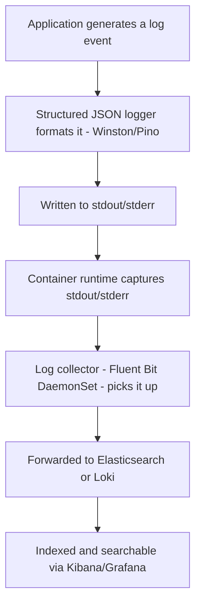
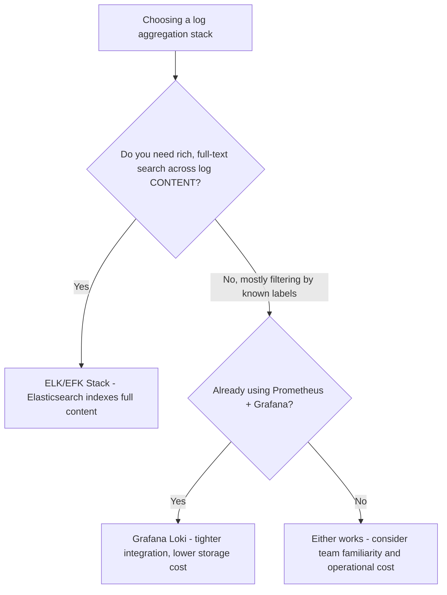
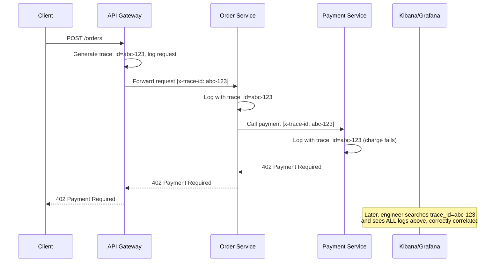

# Module 22 — Distributed Logging

> **Microservices Masterclass** | Level: Advanced | Track: Node.js Backend Engineering
> Prerequisite: Module 1–21 (especially Module 21 — Observability)
> Next Module: Module 23 — Distributed Tracing

---

## Table of Contents

1. [Introduction](#1-introduction)
2. [Learning Objectives](#2-learning-objectives)
3. [Problem Statement](#3-problem-statement)
4. [Why This Concept Exists](#4-why-this-concept-exists)
5. [Historical Background](#5-historical-background)
6. [Real-World Analogy](#6-real-world-analogy)
7. [Technical Definition](#7-technical-definition)
8. [Core Terminology](#8-core-terminology)
9. [Internal Working](#9-internal-working)
10. [Step-by-Step Request Flow](#10-step-by-step-request-flow)
11. [Architecture Overview](#11-architecture-overview)
12. [ASCII Diagrams](#12-ascii-diagrams)
13. [Mermaid Flowcharts](#13-mermaid-flowcharts)
14. [Mermaid Sequence Diagrams](#14-mermaid-sequence-diagrams)
15. [Component Diagrams](#15-component-diagrams)
16. [Deployment Diagrams](#16-deployment-diagrams)
17. [Database Interaction](#17-database-interaction)
18. [Failure Scenarios](#18-failure-scenarios)
19. [Scalability Discussion](#19-scalability-discussion)
20. [High Availability Considerations](#20-high-availability-considerations)
21. [CAP Theorem Implications](#21-cap-theorem-implications)
22. [Node.js Implementation](#22-nodejs-implementation)
23. [Express.js Examples](#23-expressjs-examples)
24. [Docker Examples](#24-docker-examples)
25. [Kafka/Redis Integration](#25-kafkaredis-integration)
26. [Error Handling](#26-error-handling)
27. [Logging & Monitoring](#27-logging--monitoring)
28. [Security Considerations](#28-security-considerations)
29. [Performance Optimization](#29-performance-optimization)
30. [Production Best Practices](#30-production-best-practices)
31. [Anti-Patterns and Common Mistakes](#31-anti-patterns-and-common-mistakes)
32. [Debugging Tips](#32-debugging-tips)
33. [Interview Questions](#33-interview-questions)
34. [Scenario-Based Questions](#34-scenario-based-questions)
35. [Hands-on Exercises](#35-hands-on-exercises)
36. [Mini Project](#36-mini-project)
37. [Advanced Project](#37-advanced-project)
38. [Summary](#38-summary)
39. [Revision Notes](#39-revision-notes)
40. [One-Page Cheat Sheet](#40-one-page-cheat-sheet)

---

## 1. Introduction

Module 21 gave you metrics — the "is something wrong, and roughly where" signal. But metrics, by design, are aggregated numbers; they can tell you "error rate spiked to 8%" but not "here is the exact error message, stack trace, and request context for the specific failed requests." For that level of detail, you need **logs** — and in a system with 15+ independently-deployed services, each potentially running multiple replicas across multiple machines, **finding** the right log lines for one specific failed request is a real, distinct engineering problem.

This module covers **Distributed Logging**: how to structure logs so they're machine-parseable and consistently correlatable across services (building directly on the trace ID concept introduced back in Module 3), and how to centrally aggregate logs from every service instance into one searchable system, so "grep this one server's log file" becomes "search across your entire fleet in seconds."

---

## 2. Learning Objectives

By the end of this module, you will be able to:

- Explain why distributed logging requires deliberate design, unlike a monolith's single log file.
- Implement structured (JSON) logging in Node.js using Winston or Pino.
- Design a consistent logging schema (including correlation/trace IDs) applied uniformly across services.
- Explain the ELK stack (Elasticsearch, Logstash, Kibana) and the Loki alternative, and how log aggregation pipelines work end-to-end.
- Apply log level discipline appropriately across different environments and severities.
- Recognize distributed logging anti-patterns, including unstructured logs and inconsistent correlation IDs.

---

## 3. Problem Statement

A customer reports a failed checkout at 2:47 PM. The request touched `api-gateway`, `order-service`, `payment-service`, and `inventory-service` — four services, each potentially running 3+ replicas, across a Kubernetes cluster with dozens of nodes. Without deliberate distributed logging:

- The engineer has no idea which of the 3 replicas of `payment-service` actually handled this specific request, so they'd need to check logs from **all** of them.
- Each service logs in a different, inconsistent, human-readable text format (`"Error: payment failed for order 123"` vs. `[ERROR] order=123 payment declined` vs. a completely different format from a third team) — there's no reliable way to search across all of them with one consistent query.
- There's no way to connect "the request that failed at the Gateway" to "the specific downstream log lines in `payment-service` that explain why," since no shared identifier ties them together.
- Logs are scattered across dozens of individual container filesystems, most of which get destroyed the moment their Pod is rescheduled (Module 20) — the evidence needed to diagnose this specific incident might already be gone.

This module solves each of these: structured (JSON) logs with a shared **trace ID** propagated through every hop of a request, centrally aggregated into one searchable system that survives individual container/Pod lifecycles entirely.

---

## 4. Why This Concept Exists

Distributed Logging exists as a distinct discipline because **microservices fundamentally break the simple assumption that "check the log file" means one file, on one machine, that you can just `tail` or `grep`.** In a monolith, one process, one log file (or a small number of near-identical replica logs) captures a request's entire journey. In microservices, a single business operation can generate log lines across many independently-deployed, independently-scaled, ephemeral (container lifecycles are often short, especially with rolling updates and autoscaling, Module 20) services — making a deliberate strategy for **structuring**, **correlating**, and **centrally aggregating** these scattered log lines an operational necessity, not a nice-to-have.

---

## 5. Historical Background

- **Pre-2010s** — Logging typically meant writing plain-text lines to a local file on a server, examined via `tail -f` or `grep` directly on that machine — perfectly workable for a small number of long-lived servers, but immediately painful once you have many, ephemeral, containerized instances.
- **2010** — The **ELK Stack** (Elasticsearch, Logstash, Kibana) emerged as a popular, integrated open-source solution: Logstash (or later, the lighter-weight Filebeat) collects and forwards logs, Elasticsearch indexes and stores them for fast full-text search, and Kibana provides a web UI for searching and visualizing — becoming, for years, the de facto standard log aggregation stack.
- **Mid-2010s** — As containerization (Docker, Module 19) and orchestration (Kubernetes, Module 20) became standard, the need to automatically collect logs from many short-lived, dynamically-scheduled containers (rather than long-lived, known servers) drove adoption of lightweight collection agents like **Fluentd** and **Fluent Bit**, often running as a per-node "sidecar" or "daemon" specifically to handle this dynamic environment.
- **2018** — **Grafana Loki** was introduced as a lighter-weight alternative to the full ELK stack, deliberately indexing only metadata (labels) rather than full log content, trading some full-text search flexibility for significantly lower storage and operational cost — designed to integrate tightly with the Prometheus/Grafana ecosystem already covered in Module 21.
- **Present** — Both the ELK/EFK (Elasticsearch + Fluentd/Fluent Bit + Kibana) stack and Grafana Loki remain widely used, with the choice often depending on whether a team prioritizes ELK's powerful full-text search or Loki's lower operational cost and tighter Grafana integration.

---

## 6. Real-World Analogy

**Analogy: A Detective Investigating a Crime Across Multiple Witness Statements**

Imagine a detective investigating an incident that several different witnesses each partially observed — one witness saw the beginning, another saw the middle, a third saw the aftermath. If each witness writes their statement in their own **personal shorthand, with no case number, no timestamp format, and no reference to a shared incident identifier**, the detective has an enormous, error-prone task piecing together what actually happened, especially if there are dozens of unrelated incidents happening simultaneously that day, each generating their own scattered set of witness statements.

Now imagine instead that every witness statement is filed using a **standardized form**: a specific **case number** (the trace ID) linking all statements about the same incident together, a precise timestamp, and a consistent structure (who, what, when, where) rather than free-form prose. The detective can now instantly **pull every statement tagged with case #4521** and reconstruct the complete timeline, regardless of which witness wrote which part or when. This standardized form is exactly what **structured logging with a consistent trace ID** provides — turning a scattered pile of inconsistent notes into a queryable, correlatable record.

---

## 7. Technical Definition

> **Distributed Logging** is the practice of generating log output in a **structured** (typically JSON) format, consistently including a **correlation/trace ID** that ties together all log lines produced across every service involved in handling a single business request, and centrally **aggregating** these logs from all service instances into one searchable system, independent of any individual container or machine's lifecycle.

> **Structured Logging** means log entries are emitted as key-value data (typically JSON objects) rather than free-form text strings, enabling reliable, automated parsing, filtering, and querying — as opposed to unstructured logs, which require fragile regex-based text parsing to extract meaningful fields.

> A **Correlation ID** (or **Trace ID**, first introduced in Module 3 and used consistently since) is a unique identifier generated at the start of a request (typically at the API Gateway) and propagated through every subsequent internal call and log line, allowing all log entries related to one specific request to be reliably grouped together.

> The **ELK/EFK Stack** refers to a common log aggregation pipeline: a lightweight collector (Filebeat or Fluent Bit) forwards logs from each host/container, into **Elasticsearch** for indexed storage and full-text search, visualized through **Kibana**.

---

## 8. Core Terminology

| Term | Meaning |
|---|---|
| **Structured Logging** | Emitting logs as machine-parseable key-value data (typically JSON), not free-form text |
| **Correlation ID / Trace ID** | A unique identifier propagated through a request's full journey, tying related log lines together |
| **Log Level** | A severity classification (e.g., DEBUG, INFO, WARN, ERROR) used to filter log verbosity |
| **Log Aggregation** | Centrally collecting logs from many distributed sources into one searchable system |
| **Log Shipper / Collector** | An agent (Fluentd, Fluent Bit, Filebeat) that forwards logs from a host/container to a central store |
| **Elasticsearch** | A distributed search and analytics engine commonly used to index and query aggregated logs |
| **Kibana** | A web UI for searching, filtering, and visualizing data stored in Elasticsearch |
| **Grafana Loki** | A lightweight log aggregation system indexing only metadata labels, tightly integrated with Grafana |
| **Log Retention Policy** | Rules governing how long log data is kept before being deleted, balancing cost against investigative needs |

---

## 9. Internal Working

Here's how a distributed logging pipeline works end-to-end, from a single request to a searchable, correlated result:

1. A request arrives at the **API Gateway** (Module 10), which generates (or extracts from an incoming header) a unique **trace ID** for this request.
2. The Gateway logs a structured JSON entry including this trace ID, and **propagates** it (typically via an `x-trace-id` HTTP header) to every downstream service it calls.
3. Each downstream service (`order-service`, `payment-service`, etc.) **extracts** this trace ID from the incoming request header and includes it in **every** log line it produces while handling that request — including any further downstream calls it makes, propagating the same trace ID onward.
4. Every service writes its structured JSON logs to **stdout/stderr** (the standard container logging practice from Module 19), rather than to a local file that would be lost when the container is rescheduled.
5. In a Kubernetes environment, a **log collector** (Fluent Bit, commonly deployed as a DaemonSet — one instance per Node) automatically picks up stdout/stderr from every container running on that Node, without requiring any application-level configuration for this collection step.
6. The collector forwards these logs to a central aggregation system — **Elasticsearch** (indexing the full JSON structure for rich querying) or **Loki** (indexing primarily metadata labels, keeping the full log line as unindexed content for lower cost).
7. An engineer investigating an incident opens **Kibana** (or **Grafana**, for Loki) and searches for the specific **trace ID** they're interested in (perhaps obtained from a customer support ticket, or cross-referenced from a metrics dashboard's timeframe), instantly retrieving **every** log line from **every** service involved in that one specific request, correctly ordered and correlated.

---

## 10. Step-by-Step Request Flow

**Scenario: Investigating a failed checkout using distributed logging.**

```
Step 1:  Customer reports a failed checkout; support ticket includes
         a trace ID (ideally surfaced to the customer or captured
         automatically, e.g., in an error response's metadata)

Step 2:  Engineer opens Kibana (or Grafana/Loki) and searches:
         trace_id: "abc-123-def-456"

Step 3:  Results instantly show ALL log lines across ALL services
         that handled this exact request, correctly ordered by timestamp:

         [api-gateway]    trace_id=abc-123 "Request received: POST /orders"
         [order-service]  trace_id=abc-123 "Validating order payload"
         [order-service]  trace_id=abc-123 "Calling payment-service"
         [payment-service] trace_id=abc-123 "Charge attempt for $49.99"
         [payment-service] trace_id=abc-123 level=ERROR "Card declined: insufficient_funds"
         [order-service]  trace_id=abc-123 "Payment failed, order cancelled"
         [api-gateway]    trace_id=abc-123 "Returning 402 to client"

Step 4:  Root cause is IMMEDIATELY clear: the customer's card was
         declined due to insufficient funds - a business-level
         issue, not a system bug - identified within seconds,
         across FOUR different services' logs, correlated
         automatically by the trace ID
```

---

## 11. Architecture Overview

```
   api-gateway         order-service        payment-service
   (generates/         (propagates          (propagates
    propagates           trace_id,             trace_id,
    trace_id)             logs to stdout)        logs to stdout)
        │                      │                       │
        └──────────────────────┼───────────────────────┘
                                │
                     Log Collector (Fluent Bit,
                     DaemonSet - one per Node,
                     collects ALL container stdout/stderr)
                                │
                                ▼
                  Elasticsearch (or Loki)
                  (indexed, centrally stored)
                                │
                                ▼
                        Kibana (or Grafana)
                  (search by trace_id, service,
                   log level, time range, etc.)
```

---

## 12. ASCII Diagrams

### 12.1 Unstructured vs Structured Logging

```
UNSTRUCTURED (free-form text - fragile to parse):

  "2026-01-05 14:32:07 ERROR Payment failed for order 123, card declined"

  Problem: extracting "order 123" or "card declined" reliably
  requires FRAGILE regex parsing, easily broken by minor format changes


STRUCTURED (JSON - reliably machine-parseable):

  {
    "timestamp": "2026-01-05T14:32:07.123Z",
    "level": "error",
    "service": "payment-service",
    "trace_id": "abc-123-def-456",
    "message": "Payment failed",
    "order_id": "123",
    "reason": "card_declined"
  }

  Every field is DIRECTLY queryable - no regex needed, no
  ambiguity about what "123" refers to
```

### 12.2 Trace ID Propagation Across Services

```
Client Request
     │
     ▼
api-gateway   [generates trace_id: abc-123]
     │  (propagates via "x-trace-id: abc-123" header)
     ▼
order-service [extracts trace_id: abc-123, logs with it]
     │  (propagates the SAME trace_id onward)
     ▼
payment-service [extracts trace_id: abc-123, logs with it]

EVERY log line, across ALL THREE services, includes the
SAME trace_id="abc-123" - enabling a single search to pull
the ENTIRE request's story across every service it touched
```

### 12.3 ELK/EFK Pipeline

```
   Container stdout/stderr (order-service, payment-service, etc.)
                │
       Fluent Bit (DaemonSet - one per Kubernetes Node,
       automatically collects ALL container logs on that Node)
                │
                ▼
         Elasticsearch (indexes structured JSON fields,
                         enables fast full-text + field search)
                │
                ▼
            Kibana (web UI: search, filter, visualize)
```

---

## 13. Mermaid Flowcharts

### 13.1 Log Line Lifecycle



### 13.2 Choosing ELK vs Loki



---

## 14. Mermaid Sequence Diagrams

### 14.1 Trace ID Propagation and Correlated Search



---

## 15. Component Diagrams

```
┌─────────────────────────────────────────────────────────┐
│                     order-service                           │
│  ┌───────────────────┐                                      │
│  │  Winston/Pino Logger   │  <- structured JSON output,          │
│  │  (structured JSON)      │     includes trace_id automatically  │
│  └─────────┬───────────┘                                    │
│            ▼                                                 │
│  ┌───────────────────┐                                      │
│  │  stdout/stderr         │  <- container's standard output      │
│  └───────────────────┘                                      │
└─────────────────────────────────────────────────────────┘
                    │
        (captured by container runtime)
                    ▼
┌─────────────────────────────────────────────────────────┐
│              Fluent Bit (DaemonSet, per Node)                 │
└─────────────────────────────────────────────────────────┘
                    │
                    ▼
┌─────────────────────────────────────────────────────────┐
│           Elasticsearch / Loki (central storage)              │
└─────────────────────────────────────────────────────────┘
```

---

## 16. Deployment Diagrams

```
┌───────────────────────────────────────────────────────────┐
│                    Kubernetes Cluster                        │
│                                                               │
│  Node 1: order-service pods, payment-service pods                │
│           + Fluent Bit DaemonSet Pod (collects ALL logs          │
│             from EVERY container on THIS node)                    │
│                                                               │
│  Node 2: order-service pods, inventory-service pods               │
│           + Fluent Bit DaemonSet Pod (collects ALL logs          │
│             from EVERY container on THIS node)                    │
│                                                               │
│  Both Fluent Bit instances forward to the SAME central          │
│  Elasticsearch/Loki cluster, typically running as its              │
│  OWN dedicated (often external/managed) infrastructure,             │
│  NOT inside the same application cluster in many production        │
│  setups, to isolate logging infrastructure from application        │
│  workload resource contention                                       │
└───────────────────────────────────────────────────────────┘
```

---

## 17. Database Interaction

Elasticsearch (or Loki) functions as a specialized, purpose-built database for log storage and search — distinct from any service's own business database:

```
Elasticsearch:
  - A distributed search engine, storing logs as INDEXED
    JSON documents
  - Optimized for fast FULL-TEXT search and FIELD-based
    filtering across massive volumes of semi-structured data
  - NOT a general-purpose transactional database - don't
    use it as your service's PRIMARY business data store

Loki:
  - Indexes only METADATA LABELS (e.g., service name, log
    level, trace_id if extracted as a label), NOT full log
    content - keeps storage costs significantly lower
  - Full-text search within log CONTENT is less powerful
    than Elasticsearch's, but sufficient for most teams'
    actual query patterns (filter by label, THEN read content)
```

---

## 18. Failure Scenarios

| Scenario | Distributed Logging Handling |
|---|---|
| A service instance crashes before its logs are shipped | Since logs go to stdout/stderr and are typically shipped near-real-time by the collector, only a very brief window of logs (milliseconds to seconds) risks being lost — still far better than logs trapped entirely on an ephemeral container's now-destroyed filesystem |
| The log aggregation pipeline (Elasticsearch/Loki) is down | Logs may queue at the collector level briefly, or be dropped if the outage is prolonged and buffering capacity is exceeded — application behavior itself remains unaffected, since logging is asynchronous and non-blocking |
| Trace ID propagation is missing in one service | Log lines from that service become impossible to correlate with the rest of the request's journey — a significant, avoidable gap requiring a code fix, not an infrastructure fix |
| Log volume is extremely high, overwhelming storage | Requires log level discipline (Section 30), sampling strategies, or a shorter retention policy to manage cost and performance |

```
Missing trace ID propagation (a common, damaging gap):

  api-gateway logs: trace_id=abc-123 "Forwarding to order-service"
  order-service logs: (NO trace_id field at all - forgot to
                        extract/propagate it!)
       "Processing order"
       "Payment failed"

  Problem: an engineer searching for trace_id=abc-123 will see
  the Gateway's log line but NONE of order-service's - the
  correlation is BROKEN, exactly at the point where it matters
  most for diagnosing the actual failure
```

---

## 19. Scalability Discussion

Distributed log aggregation systems must scale to handle potentially enormous log volumes from many services and replicas. Elasticsearch scales via sharding and clustering, but can become a significant operational and cost burden at very high volume, particularly due to full-content indexing. Loki's design (indexing only labels, not full content) trades some search flexibility for substantially better scalability and lower cost at high volume — a key reason for its growing popularity in cost-conscious, large-scale Kubernetes environments already using Prometheus/Grafana.

---

## 20. High Availability Considerations

- The log aggregation pipeline (collectors, Elasticsearch/Loki, Kibana/Grafana) should be deployed with appropriate redundancy in production, since it's your primary tool for diagnosing incidents — an unavailable logging system precisely during a major incident is a serious compounding problem.
- Since logging is asynchronous (application writes to stdout, doesn't wait for the aggregation pipeline), a logging pipeline outage does **not** directly impact application availability — an important, deliberate architectural separation, mirroring Module 21's discussion of Prometheus's independence from application health.
- Configure appropriate buffering/retry behavior in your log collector to handle brief aggregation backend outages without permanently losing log data.

---

## 21. CAP Theorem Implications

Log aggregation systems generally favor **Availability** for the ingestion side (accepting and buffering incoming logs even during backend pressure or partial outages) over strict consistency guarantees about exactly when every log line becomes searchable — a brief delay in a log line's availability for search is a much more acceptable trade-off than dropping application requests or blocking application code waiting on the logging pipeline's health. This mirrors the broader pattern seen throughout this masterclass: observability infrastructure should almost always favor availability and graceful degradation over risking any impact to the actual business-critical application traffic it's meant to help you understand.

---

## 22. Node.js Implementation

Let's implement structured logging with trace ID propagation using Pino (a fast, widely-used structured logger for Node.js).

**Folder structure:**
```
shared/
├── logger.js
├── traceMiddleware.js

order-service/
├── src/
│   ├── app.js
│   └── clients/
│       └── paymentClient.js
```

**`shared/logger.js`** — a consistent, structured logger used across all services
```javascript
import pino from "pino";

// A consistent, structured JSON logger configuration, shared
// across services for uniform log format organization-wide
export function createLogger(serviceName) {
  return pino({
    base: { service: serviceName }, // every log line automatically tagged with the service name
    timestamp: pino.stdTimeFunctions.isoTime, // ISO 8601 timestamps
    formatters: {
      level(label) {
        return { level: label }; // "info", "error", etc. as a string, not a numeric code
      },
    },
  });
}
```

**`shared/traceMiddleware.js`** — trace ID generation/propagation (extending Module 3's introduction)
```javascript
import crypto from "crypto";

export function traceMiddleware(req, res, next) {
  // Extract an incoming trace ID (if this service is NOT the entry
  // point), or generate a NEW one if this is the first hop
  req.traceId = req.headers["x-trace-id"] || crypto.randomUUID();
  res.setHeader("x-trace-id", req.traceId);
  next();
}
```

**`order-service/src/app.js`**
```javascript
import express from "express";
import { createLogger } from "../../shared/logger.js";
import { traceMiddleware } from "../../shared/traceMiddleware.js";
import { chargeCustomer } from "./clients/paymentClient.js";

const logger = createLogger("order-service");
const app = express();
app.use(express.json());
app.use(traceMiddleware);

app.post("/orders", async (req, res) => {
  // EVERY log line includes trace_id - the key to correlation
  logger.info({ trace_id: req.traceId, customerId: req.body.customerId }, "Validating order payload");

  try {
    const payment = await chargeCustomer(req.body.customerId, req.body.amount, req.traceId);
    logger.info({ trace_id: req.traceId, transactionId: payment.transactionId }, "Payment succeeded, order confirmed");
    res.status(201).json({ status: "CONFIRMED" });
  } catch (err) {
    // STRUCTURED error logging - includes the trace_id, the error
    // message, AND relevant business context, all as SEPARATE fields
    logger.error(
      { trace_id: req.traceId, error: err.message, customerId: req.body.customerId },
      "Payment failed, order cancelled"
    );
    res.status(402).json({ status: "CANCELLED", reason: "payment_failed" });
  }
});

app.listen(4002, () => logger.info("Order Service running on port 4002"));
```

---

## 23. Express.js Examples

**`order-service/src/clients/paymentClient.js`** — propagating trace_id to a downstream call
```javascript
import axios from "axios";
import { createLogger } from "../../../shared/logger.js";

const logger = createLogger("order-service");

export async function chargeCustomer(customerId, amount, traceId) {
  logger.info({ trace_id: traceId, customerId, amount }, "Calling payment-service");

  try {
    const response = await axios.post(
      `${process.env.PAYMENT_SERVICE_URL}/charges`,
      { customerId, amount },
      {
        timeout: 3000,
        // Propagate the SAME trace_id downstream - this is the
        // critical step that makes cross-service correlation possible
        headers: { "x-trace-id": traceId },
      }
    );
    return response.data;
  } catch (err) {
    logger.error({ trace_id: traceId, error: err.message }, "payment-service call failed");
    throw err;
  }
}
```

---

## 24. Docker Examples

```yaml
version: "3.9"
services:
  order-service:
    build: ./order-service
    ports: ["4002:4002"]
    environment:
      - PAYMENT_SERVICE_URL=http://payment-service:4003
    depends_on: [payment-service]
    # Logs go to stdout/stderr by default (Module 19's principle) -
    # Docker captures these automatically, viewable via `docker logs`

  payment-service:
    build: ./payment-service
    ports: ["4003:4003"]

  elasticsearch:
    image: docker.elastic.co/elasticsearch/elasticsearch:8.11.0
    environment:
      - discovery.type=single-node
      - xpack.security.enabled=false
    ports: ["9200:9200"]

  kibana:
    image: docker.elastic.co/kibana/kibana:8.11.0
    ports: ["5601:5601"]
    depends_on: [elasticsearch]

  fluent-bit:
    image: fluent/fluent-bit:latest
    volumes:
      - /var/lib/docker/containers:/var/lib/docker/containers:ro
      - ./fluent-bit.conf:/fluent-bit/etc/fluent-bit.conf
    depends_on: [elasticsearch]
```

---

## 25. Kafka/Redis Integration

Kafka consumers should also propagate and log trace IDs, extending correlation into asynchronous flows (connecting directly to Module 9's event-driven patterns):

```javascript
// notification-service: extracting a trace_id carried WITHIN the
// event payload itself (since there's no HTTP header in an async flow)
export async function handleOrderPlaced(event) {
  const traceId = event.trace_id; // propagated as part of the event's own structure

  logger.info({ trace_id: traceId, orderId: event.payload.orderId }, "Processing OrderPlaced event");

  try {
    await sendConfirmationEmail(event.payload);
    logger.info({ trace_id: traceId }, "Confirmation email sent");
  } catch (err) {
    logger.error({ trace_id: traceId, error: err.message }, "Failed to send confirmation email");
  }
}
```

This extends the trace ID's reach from synchronous HTTP calls (Section 22-23) into asynchronous, Kafka-based flows — a single trace ID can span an ENTIRE business operation, sync and async legs alike.

---

## 26. Error Handling

Ensure logging itself never becomes a source of application failure — a logging library error should never crash the application:

```javascript
try {
  logger.info({ trace_id: req.traceId }, "Processing request");
} catch (loggingErr) {
  // Logging failures should be caught and SWALLOWED (perhaps with a
  // fallback console.error), never allowed to break the actual
  // business logic that was being logged about
  console.error("Logging failed:", loggingErr);
}
```

In practice, well-maintained logging libraries like Pino are designed to be extremely robust and rarely throw, but this defensive principle remains worth internalizing for any critical-path instrumentation.

---

## 27. Logging & Monitoring

This entire module IS the "Logging" half of "Logging & Monitoring" from earlier modules — the key discipline to reinforce here is **log level usage**:

```javascript
logger.debug(...)  // verbose, development-only detail - typically DISABLED in production
logger.info(...)   // normal operational events (request received, order placed)
logger.warn(...)   // recoverable, non-critical issues worth noting (a fallback was used)
logger.error(...)  // genuine failures requiring attention
```

Set the minimum log level per environment (e.g., `debug` locally, `info` in production) via configuration (Module 12), avoiding both excessive noise in production and insufficient detail during local development/debugging.

---

## 28. Security Considerations

- **Never log sensitive data** — passwords, full payment card numbers, JWTs (Module 13), or other PII should never appear in log lines, since log aggregation systems are often less strictly access-controlled than primary databases, and logs are frequently retained for extended periods.
- Implement **field redaction** at the logger configuration level (many structured logging libraries support this natively) so sensitive field names are automatically masked, rather than relying on every engineer remembering not to log them manually.
- Restrict access to Kibana/Grafana (log viewing tools) appropriately, since aggregated logs can reveal significant business and technical detail across your entire system.

```javascript
import pino from "pino";

const logger = pino({
  redact: ["req.headers.authorization", "customerId.ssn", "*.password"],
  // Automatically masks these fields wherever they appear in logged objects
});
```

---

## 29. Performance Optimization

- Use a **fast, low-overhead** structured logging library (Pino is specifically designed and benchmarked for high throughput with minimal overhead compared to some alternatives) for high-volume services.
- Avoid excessive **DEBUG**-level logging in production — high log volume increases both application overhead (minor, but non-zero) and log aggregation infrastructure cost/load significantly.
- Consider **sampling** extremely high-volume, low-value log lines (e.g., successful health check pings) rather than logging every single occurrence, to reduce noise and storage cost without losing meaningful signal.

---

## 30. Production Best Practices

- Adopt a **consistent structured logging schema** organization-wide (service name, trace ID, timestamp, level, message, plus contextual fields) — Section 22's shared `logger.js` pattern is one practical way to enforce this consistency across many teams.
- Always propagate the trace ID through **every** hop, synchronous and asynchronous alike (Section 25) — a single missing propagation point breaks correlation for that entire branch of a request's journey.
- Set appropriate **log retention policies** balancing storage cost against realistic investigative needs (e.g., 30 days for detailed logs, longer for a more compact audit trail if legally/business required).
- Never log to a local file inside a container — always log to stdout/stderr (Module 19), letting the container runtime and log collector handle capture and shipping.

---

## 31. Anti-Patterns and Common Mistakes

| Anti-Pattern | Why It's a Problem |
|---|---|
| **Unstructured, free-form text logs** | Requires fragile regex parsing to extract meaningful fields, unlike reliably queryable structured JSON |
| **Missing trace ID propagation in any service** | Breaks correlation for that entire branch, making incident diagnosis significantly harder |
| **Logging sensitive data (passwords, PII, tokens)** | Creates a security/compliance risk, since log systems are often less tightly access-controlled than primary data stores |
| **Logging to a local file inside a container** | Log data is lost the moment the ephemeral container is rescheduled or removed (Module 19/20) |
| **Excessive DEBUG-level logging left enabled in production** | Increases both application overhead and aggregation infrastructure cost/noise unnecessarily |

```
Unstructured logging (anti-pattern):

  console.log("Payment failed for order " + orderId + " reason: " + reason);

  Problem: to later SEARCH for all failures with reason="card_declined",
  you'd need a FRAGILE regex against free-form text, which breaks
  the moment anyone changes the log message's wording slightly

  FIX: logger.error({ orderId, reason }, "Payment failed") - a
  STRUCTURED object where "reason" is a DIRECTLY queryable field
```

---

## 32. Debugging Tips

- Always start incident investigation by searching for the **trace ID** first (if available from a customer report, error response, or metrics dashboard timeframe correlation) — this is almost always the fastest path to the relevant log lines.
- If correlation seems broken (some services' logs for a request are missing), check whether trace ID propagation was correctly implemented in that specific service — this is the most common root cause of "I can't find the logs for this request in service X."
- Use Kibana's/Grafana's time-range filtering combined with service-name filtering as a fallback when a trace ID isn't available, narrowing down to the relevant window before searching further.
- Check log level configuration if expected DEBUG-level detail is missing in a specific environment — a common oversight is leaving production's minimum log level set too high, silently dropping detail needed for a specific investigation.

---

## 33. Interview Questions

### Easy
1. What is structured logging, and how does it differ from traditional text-based logging?
2. What is a trace ID / correlation ID, and why is it essential in microservices?
3. What does the ELK stack stand for, and what role does each component play?
4. Why should containers log to stdout/stderr rather than a local file?
5. Name the standard log levels and briefly describe when each should be used.

### Medium
6. Explain how a trace ID propagates through both synchronous (HTTP) and asynchronous (Kafka event) hops in a request's journey.
7. What is the difference between Elasticsearch's and Loki's approach to indexing logs, and what trade-off does this represent?
8. Why is logging sensitive data (passwords, PII) in application logs a security risk, even in an internal system?
9. How would you diagnose a scenario where a trace ID search returns logs from only some, but not all, services involved in a request?
10. Why should log aggregation infrastructure be designed to never block or slow down the application being logged?

### Hard
11. Design a structured logging schema (field names, types, required vs. optional) to be used consistently across a 15-service organization.
12. How would you migrate an existing system using unstructured, inconsistent logging across many services to a consistent, structured, trace-ID-correlated approach, incrementally?
13. Discuss the trade-offs of Elasticsearch versus Grafana Loki for a large-scale, cost-sensitive microservices system already using Prometheus/Grafana for metrics.
14. Design a log redaction strategy to prevent sensitive fields from ever appearing in aggregated logs, even if an engineer forgets to manually avoid logging them.
15. How would you design a log sampling strategy for an extremely high-volume, low-value log line (e.g., health check pings) without losing the ability to detect a genuine problem in that code path?

---

## 34. Scenario-Based Questions

1. A customer's failed checkout can't be diagnosed because the engineer can't find the relevant payment-service log lines, despite having the trace ID from the Gateway's logs. What's the most likely cause, and how would you fix it?
2. Your team's Elasticsearch cluster storage costs have grown dramatically as you've added more services. What options would you consider to manage this?
3. A security review discovers that customer credit card numbers have been appearing in your application logs for months. What's your immediate remediation plan, and what would you put in place to prevent recurrence?
4. Your team wants to correlate a Kafka-consumed event's processing with the original HTTP request that triggered it. How would you design this, given there's no HTTP header to carry a trace ID in an async flow?
5. Leadership asks whether to adopt the ELK stack or Grafana Loki for a new, large-scale system. What questions would you ask to inform this recommendation?

---

## 35. Hands-on Exercises

1. Implement structured JSON logging using Pino (Section 22) for a simple Express service, including a trace ID middleware.
2. Extend this to a two-service system, propagating the trace ID via an HTTP header (Section 23), and verify both services' logs share the same trace ID for a single request.
3. Set up a local ELK stack (via Docker Compose, Section 24) and configure Fluent Bit (or Filebeat) to ship your services' container logs into Elasticsearch.
4. In Kibana, search for a specific trace ID and verify you can see the full, correlated request journey across both services.
5. Implement field redaction (Section 28) for a sensitive field, and verify it's correctly masked in the resulting log output.

---

## 36. Mini Project

**Build: A Two-Service System With Correlated Structured Logging**

1. Build `order-service` and `payment-service`, both using the shared logger pattern (Section 22) and trace ID middleware/propagation (Section 22-23).
2. Ensure every meaningful operation (request received, downstream call made, success, failure) is logged with the trace ID and relevant structured context.
3. Set up a local ELK or Loki stack and verify logs from both services are searchable by trace ID, service name, and log level.
4. Simulate a failed payment and demonstrate finding the complete, correlated story of that failure across both services' logs using a single trace ID search.

---

## 37. Advanced Project

**Build: A Full Distributed Logging Pipeline With Redaction and Async Correlation**

1. Extend the Mini Project to a 3-service system, adding an asynchronous `notification-service` that consumes a Kafka event carrying the trace ID within its payload (Section 25), extending correlation into the async flow.
2. Implement field redaction (Section 28) for at least one sensitive field across all services, and verify it's never exposed in the aggregated log output.
3. Configure log level filtering (Section 27) to differ between a simulated "development" and "production" environment configuration, verifying DEBUG-level logs are appropriately suppressed in the production configuration.
4. Simulate a complete failed order flow spanning all three services (sync HTTP + async Kafka), and demonstrate retrieving the ENTIRE correlated story — sync and async legs both — using one single trace ID search in Kibana/Grafana.
5. Write a log retention and redaction policy document for this system, specifying what data is logged, for how long, and what fields are always redacted.

---

## 38. Summary

- Distributed Logging solves the problem of correlating and centrally searching log data scattered across many independently-deployed, often-ephemeral microservice instances.
- Structured (JSON) logging enables reliable, automated parsing and querying, unlike fragile, regex-dependent unstructured text logs.
- A consistently-propagated trace/correlation ID, extended across both synchronous (HTTP headers) and asynchronous (event payload) hops, is the key mechanism tying together a single request's complete story across every service it touches.
- The ELK/EFK stack (full-text search, higher cost) and Grafana Loki (label-based indexing, lower cost, tighter Grafana integration) are the two dominant log aggregation approaches, each with different trade-offs.
- Sensitive data must never appear in logs, enforced via deliberate redaction configuration rather than relying solely on individual engineer discipline.

---

## 39. Revision Notes

- Structured logging: JSON, machine-parseable, reliably queryable (vs. fragile unstructured text).
- Trace ID / correlation ID: propagated through EVERY hop (sync HTTP headers, async event payloads) to correlate a request's full journey.
- ELK/EFK: full-text search, higher cost. Loki: label-indexed, lower cost, tight Grafana integration.
- Log to stdout/stderr always — never a local file inside an ephemeral container.
- Redact sensitive fields at the logger configuration level, not by relying on manual discipline.
- Log levels: DEBUG (dev only) < INFO (normal ops) < WARN (recoverable issues) < ERROR (genuine failures).

---

## 40. One-Page Cheat Sheet

```
STRUCTURED LOGGING:   JSON key-value logs, reliably queryable (not free-form text)
TRACE ID:             unique ID propagated through EVERY hop (sync + async) to correlate a request
ELK/EFK STACK:        Elasticsearch (full-text index) + Fluent Bit/Filebeat + Kibana
GRAFANA LOKI:         label-indexed only, lower cost, tight Grafana integration

LOG LEVELS:           DEBUG (dev only) < INFO (normal) < WARN (recoverable) < ERROR (failure)

GOLDEN RULES:
  - ALWAYS log structured JSON, never free-form text
  - ALWAYS propagate trace_id through EVERY hop - sync headers AND async event payloads
  - NEVER log sensitive data (passwords, PII, tokens) - redact at the logger config level
  - ALWAYS log to stdout/stderr, NEVER to a local file inside a container
  - Set log level per environment - DEBUG locally, INFO (or higher) in production
```

---

**Suggested Next Module:** Module 23 — Distributed Tracing (OpenTelemetry, Jaeger, Zipkin, and Trace IDs in depth — visualizing a request's full timing and dependency graph across every service it touches)
