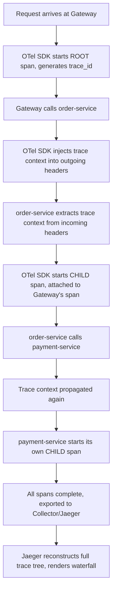
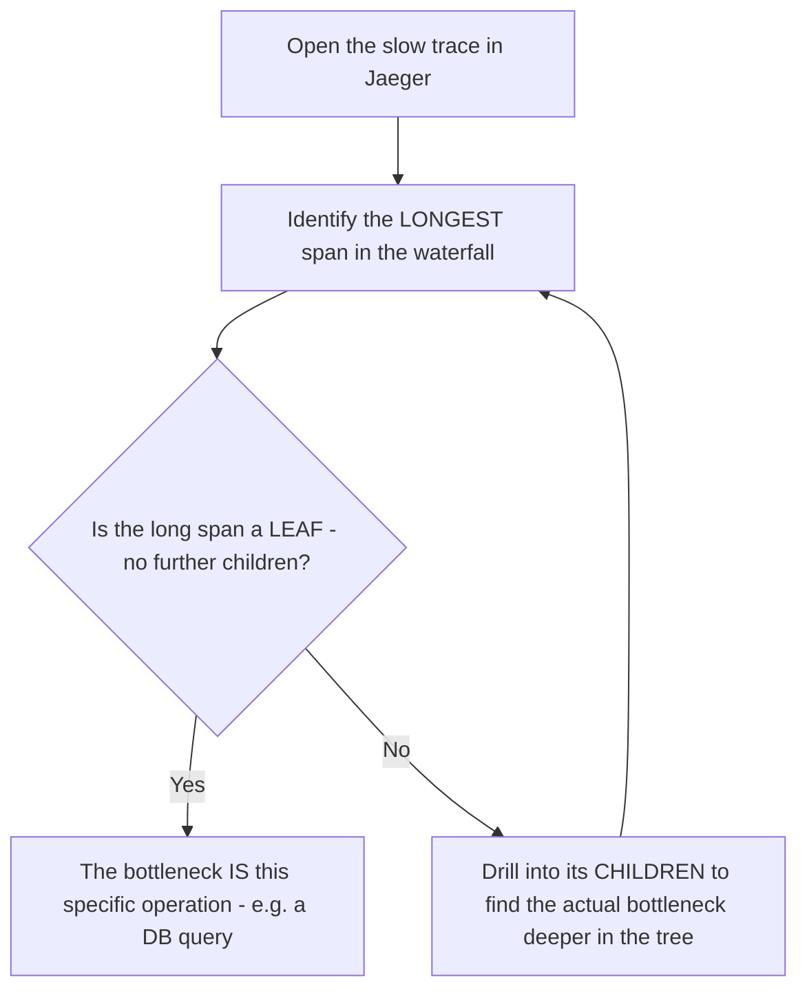
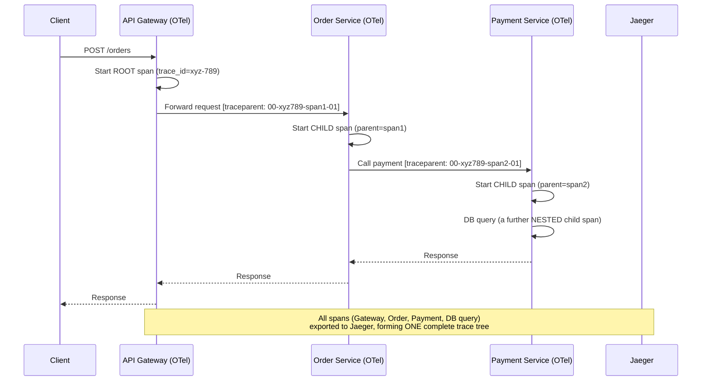

# Module 23 — Distributed Tracing

> **Microservices Masterclass** | Level: Advanced | Track: Node.js Backend Engineering
> Prerequisite: Module 1–22 (especially Module 21 — Observability, Module 22 — Distributed Logging)
> Next Module: Module 24 — Scaling Microservices

---

## Table of Contents

1. [Introduction](#1-introduction)
2. [Learning Objectives](#2-learning-objectives)
3. [Problem Statement](#3-problem-statement)
4. [Why This Concept Exists](#4-why-this-concept-exists)
5. [Historical Background](#5-historical-background)
6. [Real-World Analogy](#6-real-world-analogy)
7. [Technical Definition](#7-technical-definition)
8. [Core Terminology](#8-core-terminology)
9. [Internal Working](#9-internal-working)
10. [Step-by-Step Request Flow](#10-step-by-step-request-flow)
11. [Architecture Overview](#11-architecture-overview)
12. [ASCII Diagrams](#12-ascii-diagrams)
13. [Mermaid Flowcharts](#13-mermaid-flowcharts)
14. [Mermaid Sequence Diagrams](#14-mermaid-sequence-diagrams)
15. [Component Diagrams](#15-component-diagrams)
16. [Deployment Diagrams](#16-deployment-diagrams)
17. [Database Interaction](#17-database-interaction)
18. [Failure Scenarios](#18-failure-scenarios)
19. [Scalability Discussion](#19-scalability-discussion)
20. [High Availability Considerations](#20-high-availability-considerations)
21. [CAP Theorem Implications](#21-cap-theorem-implications)
22. [Node.js Implementation](#22-nodejs-implementation)
23. [Express.js Examples](#23-expressjs-examples)
24. [Docker Examples](#24-docker-examples)
25. [Kafka/Redis Integration](#25-kafkaredis-integration)
26. [Error Handling](#26-error-handling)
27. [Logging & Monitoring](#27-logging--monitoring)
28. [Security Considerations](#28-security-considerations)
29. [Performance Optimization](#29-performance-optimization)
30. [Production Best Practices](#30-production-best-practices)
31. [Anti-Patterns and Common Mistakes](#31-anti-patterns-and-common-mistakes)
32. [Debugging Tips](#32-debugging-tips)
33. [Interview Questions](#33-interview-questions)
34. [Scenario-Based Questions](#34-scenario-based-questions)
35. [Hands-on Exercises](#35-hands-on-exercises)
36. [Mini Project](#36-mini-project)
37. [Advanced Project](#37-advanced-project)
38. [Summary](#38-summary)
39. [Revision Notes](#39-revision-notes)
40. [One-Page Cheat Sheet](#40-one-page-cheat-sheet)

---

## 1. Introduction

Modules 21 and 22 gave you two of the "three pillars of observability": metrics (the aggregated "is something wrong" signal) and logs (the detailed "what exactly happened" record, correlated via trace IDs). This module completes the trio with **Distributed Tracing**: a way to visualize the **complete timing and dependency structure** of a single request as it moves through every service it touches — not just correlated log lines, but an actual, visual timeline showing exactly how long each hop took and how the hops relate to each other as a tree.

If Module 22's trace ID search gives you a correlated **list** of log lines, Distributed Tracing gives you a correlated **timeline** — a waterfall diagram showing "the Gateway took 5ms of its own time, then waited 800ms for order-service, which itself waited 750ms specifically on its call to payment-service" — turning "something in this request chain was slow" into "this exact hop, in this exact service, was the bottleneck," visually and immediately.

---

## 2. Learning Objectives

By the end of this module, you will be able to:

- Explain distributed tracing and how it differs from (and complements) logging and metrics.
- Understand the core tracing concepts: traces, spans, and parent-child span relationships.
- Explain OpenTelemetry's role as a vendor-neutral standard for generating trace data.
- Instrument a Node.js service to produce and propagate trace spans automatically and manually.
- Use Jaeger (or Zipkin) to visualize a request's full trace as a waterfall/timeline diagram.
- Use tracing data to pinpoint exact latency bottlenecks in a multi-service request chain.

---

## 3. Problem Statement

An engineer, using Module 22's distributed logging, has found all the correlated log lines for a slow request — but the logs only show **when** each log line was written, not a clean, visual picture of exactly how the total 3.2-second request time was **distributed** across the 6 services it touched, including which calls happened in parallel versus sequentially, and which specific hop consumed the majority of that time. Reconstructing this timing picture by manually cross-referencing timestamps across dozens of scattered log lines is slow and error-prone, especially when some calls happen concurrently.

Distributed Tracing solves this directly: it captures each unit of work (a "span") with **precise start and end times** and explicit **parent-child relationships** between spans, so a single trace can be rendered as a **waterfall diagram** — immediately, visually showing which specific span (which specific service, which specific operation) consumed the most time, and whether operations ran sequentially or in parallel.

---

## 4. Why This Concept Exists

Distributed Tracing exists because **logs and metrics, even when well-correlated (Module 22) and well-aggregated (Module 21), don't naturally answer the specific question: "exactly how was this one request's total latency distributed across every hop it made, and how do those hops relate to each other structurally?"** A list of correlated log lines requires manual timestamp arithmetic to reconstruct timing; a metrics dashboard shows aggregated latency trends across many requests, not the precise shape of one specific slow request. Distributed Tracing fills this specific gap by modeling a request as an explicit **tree of timed operations (spans)**, purpose-built to be rendered as an intuitive, visual timeline — the fastest possible way for a human to spot exactly where time was spent in a complex, multi-service request.

---

## 5. Historical Background

- **2010** — Google published the influential **"Dapper" paper**, describing their internal, production-scale distributed tracing system, which established the foundational concepts (traces, spans, sampling) that essentially every subsequent tracing system has built upon.
- **2012** — **Twitter** open-sourced **Zipkin**, one of the first widely-adopted open-source distributed tracing systems directly inspired by Google's Dapper paper, providing both instrumentation libraries and a visualization UI.
- **2015** — **Uber** open-sourced **Jaeger**, another Dapper-inspired tracing system, which was later donated to the CNCF and became (alongside Zipkin) one of the two most widely-used open-source tracing backends.
- **2016–2019** — Two competing instrumentation standards emerged: **OpenTracing** (focused on a vendor-neutral tracing API) and **OpenCensus** (Google's combined metrics + tracing instrumentation project) — creating some fragmentation and confusion about which standard to adopt.
- **2019** — OpenTracing and OpenCensus **merged** to form **OpenTelemetry**, now a single, unified, vendor-neutral CNCF standard for generating and exporting traces (and metrics, and logs), supported by essentially every major tracing backend (Jaeger, Zipkin, and commercial platforms alike) — eliminating the earlier fragmentation and becoming the modern default choice for new instrumentation.

---

## 6. Real-World Analogy

**Analogy: A Relay Race With a Detailed Stopwatch Log for Every Runner**

Imagine a relay race with several runners, where the baton (the request) is passed from one runner (service) to the next. A basic log (Module 22) tells you "Runner A started at 10:00:00, Runner B started at 10:00:05, Runner C started at 10:00:08, Runner C finished at 10:00:12" — from this, you *can* calculate that Runner A ran for 5 seconds, Runner B for 3 seconds, and Runner C for 4 seconds, but you'd have to do that arithmetic yourself, and it gets much harder if runners sometimes run in parallel (imagine a relay where two runners occasionally sprint side-by-side for a leg).

**Distributed Tracing is like a race organizer providing an actual visual chart** — a horizontal bar for each runner's leg, precisely positioned and sized to represent exactly when they started, how long they ran, and clearly showing any legs that overlapped in time (parallel work). At a single glance, you can see: "Runner B's leg was clearly the longest bar — that's where the team lost the most time," without doing any timestamp arithmetic yourself. This visual, immediately-interpretable timeline is exactly what a distributed trace's **waterfall diagram** (Section 12) provides for a multi-service request.

---

## 7. Technical Definition

> **Distributed Tracing** is an observability technique that tracks a single request's journey across multiple services by recording each discrete unit of work as a **span**, with explicit timing (start/end) and parent-child relationships to other spans, collectively forming a **trace** — a complete, visualizable record of the request's full execution path and timing.

> A **Span** represents a single operation (e.g., "handle HTTP request," "call payment-service," "query database") with a name, a start time, a duration, and a set of key-value **attributes** (tags) providing context.

> A **Trace** is the complete collection of all spans belonging to one single request, structured as a tree (or more generally, a directed acyclic graph) based on parent-child relationships between spans.

> **OpenTelemetry (OTel)** is a vendor-neutral, CNCF-hosted set of APIs, SDKs, and tools for generating, collecting, and exporting traces (and metrics and logs) in a standardized way, allowing you to instrument your code once and send the resulting data to any compatible backend (Jaeger, Zipkin, or a commercial platform) without changing your instrumentation.

> **Jaeger** is an open-source, CNCF-hosted distributed tracing backend that collects, stores, and visualizes traces, commonly used together with OpenTelemetry-instrumented services.

---

## 8. Core Terminology

| Term | Meaning |
|---|---|
| **Trace** | The complete record of one request's journey, composed of all its related spans |
| **Span** | A single timed operation within a trace, with a name, duration, and attributes |
| **Parent Span / Child Span** | Spans form a tree; a child span represents work done "within" its parent's operation |
| **Trace ID** | A unique identifier for the entire trace, shared by every span within it (the same concept as Module 22's correlation ID, now formalized) |
| **Span ID** | A unique identifier for one specific span within a trace |
| **Context Propagation** | Passing trace/span identifiers across service boundaries so child spans correctly attach to their parent |
| **OpenTelemetry (OTel)** | The vendor-neutral standard for instrumenting, collecting, and exporting trace (and metrics/log) data |
| **Jaeger / Zipkin** | Popular open-source distributed tracing backends for storing and visualizing traces |
| **Sampling** | The practice of recording only a subset of all traces (rather than every single one) to manage data volume/cost |
| **Waterfall Diagram** | The standard visualization of a trace: a horizontal timeline showing each span's start, duration, and nesting |

---

## 9. Internal Working

Here's how distributed tracing works end-to-end for a single request:

1. A request arrives at the **API Gateway**, which (using an OpenTelemetry SDK) starts a new **trace**, creating the first (root) **span** representing "handle incoming request," and generating a unique trace ID.
2. As the Gateway makes a call to `order-service`, the OpenTelemetry SDK automatically **injects** the current trace ID and the current span's ID (as the "parent" reference) into the outgoing request's headers (standardized via the **W3C Trace Context** header format).
3. `order-service`'s own OpenTelemetry SDK **extracts** this propagated context from the incoming request, and starts a new **child span** ("handle order request"), correctly attaching it as a child of the Gateway's span within the same overall trace.
4. As `order-service` calls `payment-service`, this same propagation process repeats — a new child span is created, correctly nested under `order-service`'s span.
5. Each span, upon completing, records its precise start time, end time (duration), and any attributes (e.g., HTTP status code, a specific business identifier) the application code chose to attach.
6. All these spans, from every service involved, are exported (typically via an **OpenTelemetry Collector**, an intermediary aggregation/processing service) to a tracing backend like **Jaeger**.
7. Jaeger stores these spans and, crucially, reconstructs the **full trace tree** by following the parent-child relationships, rendering it as an intuitive **waterfall diagram** for an engineer to inspect.

---

## 10. Step-by-Step Request Flow

**Scenario: Tracing a slow "Place Order" request across 3 services.**

```
Step 1:  Request arrives at api-gateway
         -> ROOT SPAN starts: "gateway: handle POST /orders"
         (trace_id: xyz-789 generated)

Step 2:  Gateway calls order-service
         -> Trace context (trace_id=xyz-789, parent_span_id=<gateway's
            span id>) injected into the outgoing request's headers

Step 3:  order-service receives the request
         -> CHILD SPAN starts: "order-service: handle POST /orders"
         (attached as a child of the Gateway's span, same trace_id)

Step 4:  order-service calls payment-service
         -> Trace context propagated again (same trace_id, NEW
            parent_span_id = order-service's span)

Step 5:  payment-service receives the request
         -> CHILD SPAN starts: "payment-service: handle POST /charges"
         (attached as a child of order-service's span)

Step 6:  payment-service's charge takes 2.8 seconds (a slow
         database query WITHIN this span, itself perhaps
         instrumented as an even DEEPER child span:
         "payment-service: DB query - INSERT charge")

Step 7:  All spans complete, are exported to Jaeger

Step 8:  Engineer opens Jaeger's UI, finds trace xyz-789, and sees
         a WATERFALL DIAGRAM immediately showing:
           gateway span:          [====================================] 3.0s total
             order-service span:    [==================================] 2.95s
               payment-service span:  [================================] 2.9s
                 DB query span:          [==============================] 2.8s  <- HERE is the bottleneck

Step 9:  Root cause VISUALLY OBVIOUS within seconds: a specific
         slow database query inside payment-service, not a
         network issue, not order-service's own logic, not the Gateway
```

---

## 11. Architecture Overview

```
   api-gateway         order-service         payment-service
   (OTel SDK,          (OTel SDK,             (OTel SDK,
    starts root span)   propagates context,     propagates context,
                         creates child span)      creates child span)
        │                      │                        │
        └──────────────────────┼────────────────────────┘
                                │
                     OpenTelemetry Collector
                  (receives spans from all services,
                   processes/batches, exports onward)
                                │
                                ▼
                            Jaeger
                  (stores traces, reconstructs the
                   full span tree, renders waterfall
                   diagrams via its web UI)
```

---

## 12. ASCII Diagrams

### 12.1 A Trace as a Waterfall Diagram

```
Trace: xyz-789 (Total duration: 3.0s)

gateway: handle POST /orders          [==============================] 3.0s
  order-service: handle order         [============================]   2.95s
    payment-service: handle charge    [==========================]     2.9s
      DB query: INSERT charge         [========================]       2.8s  <- BOTTLENECK

Each indented bar represents a CHILD span, nested within its
parent, with its horizontal position/length showing EXACTLY
when it started and how long it took, relative to the whole trace
```

### 12.2 Parallel vs Sequential Spans

```
SEQUENTIAL (each span waits for the previous to finish):

  order-service: handle order   [==========================================]
    call payment-service         [==============]
    call inventory-service                        [==============]
  (total time = SUM of both child spans)


PARALLEL (spans overlap in time - e.g., Promise.all from Module 18):

  order-service: handle order   [====================]
    call payment-service         [==============]
    call inventory-service       [==============]
  (total time = MAX of the two child spans, NOT their sum -
   a trace visually reveals whether your code is ACTUALLY
   parallelizing independent calls, or accidentally serializing them)
```

### 12.3 Trace Context Propagation (W3C Trace Context Header)

```
HTTP Request Headers, propagated between services:

  traceparent: 00-xyz789abc...-parentspanid123-01
               │  │                │              │
               │  │                │              └─ flags (e.g., sampled?)
               │  │                └─ PARENT SPAN ID (this hop's caller)
               │  └─ TRACE ID (shared across the ENTIRE trace)
               └─ version

This standardized header format (W3C Trace Context) is what
allows DIFFERENT services, even using DIFFERENT tracing
libraries, to correctly participate in the SAME trace
```

---

## 13. Mermaid Flowcharts

### 13.1 Span Creation and Propagation Flow



### 13.2 Using a Trace to Diagnose Latency



---

## 14. Mermaid Sequence Diagrams

### 14.1 Full Trace Propagation Across Three Services



---

## 15. Component Diagrams

```
┌─────────────────────────────────────────────────────────┐
│                     order-service                           │
│  ┌───────────────────┐                                      │
│  │  OpenTelemetry SDK      │  <- auto-instruments HTTP calls,   │
│  │  (auto + manual           │     Express routes; supports        │
│  │   instrumentation)         │     MANUAL spans for custom logic   │
│  └─────────┬───────────┘                                    │
│            ▼                                                 │
│  ┌───────────────────┐                                      │
│  │  OTLP Exporter          │  <- sends spans to the Collector     │
│  └───────────────────┘                                      │
└─────────────────────────────────────────────────────────┘
                    │
                    ▼
┌─────────────────────────────────────────────────────────┐
│              OpenTelemetry Collector                          │
│  (receives, batches, processes, and forwards spans              │
│   to one or more backends - vendor-neutral)                     │
└─────────────────────────────────────────────────────────┘
                    │
                    ▼
┌─────────────────────────────────────────────────────────┐
│                        Jaeger                                 │
│  (storage + query engine + waterfall visualization UI)          │
└─────────────────────────────────────────────────────────┘
```

---

## 16. Deployment Diagrams

```
┌───────────────────────────────────────────────────────────┐
│                    Kubernetes Cluster                        │
│                                                               │
│  order-service pods, payment-service pods (each instrumented    │
│  with the OpenTelemetry SDK, exporting spans via OTLP)            │
│         │                                                     │
│  OpenTelemetry Collector (often deployed as a DaemonSet or        │
│  a dedicated Deployment, receiving spans from all services)         │
│         │                                                     │
│  Jaeger (storage backend - often backed by Elasticsearch or        │
│  Cassandra for scalable trace storage at production volume)         │
└───────────────────────────────────────────────────────────┘
```

---

## 17. Database Interaction

Jaeger's own trace storage is a specialized system, distinct from any service's business database:

```
Jaeger typically uses Elasticsearch or Cassandra as its
underlying STORAGE BACKEND for trace data - chosen for their
ability to handle high write throughput (every span from
every request, potentially sampled) and support the specific
query patterns Jaeger's UI needs (find traces by trace_id,
service name, duration range, tags)

Database query DURATION within your OWN services is commonly
instrumented as its OWN span (as shown in Section 10's example),
giving visibility into exactly how much of a request's total
time was spent specifically on DATABASE work, distinct from
network calls or application logic
```

---

## 18. Failure Scenarios

| Scenario | Distributed Tracing Handling |
|---|---|
| The Collector or Jaeger backend is temporarily unavailable | Spans may be buffered briefly by the exporter, or dropped if the outage persists — application behavior itself is unaffected, since span export is asynchronous and non-blocking, mirroring Modules 21-22's principle |
| Trace context propagation is missing in one service | That service's spans become **orphaned** — they either don't appear in the trace at all, or appear as a disconnected, separate trace, breaking the complete picture exactly at the point that matters |
| Extremely high trace volume overwhelms storage | Requires a **sampling strategy** (Section 8) — recording only a percentage of all traces (or specifically, always sampling error/slow traces) rather than every single one |
| A span's parent-child relationship is misconfigured | The waterfall diagram renders incorrectly (e.g., spans appear as siblings instead of nested, or in the wrong order), misleading the engineer's diagnosis |

```
Missing trace context propagation (a critical, common gap):

  order-service correctly starts its own span, but FORGETS
  to propagate the trace context when calling payment-service
  (e.g., a raw axios call bypassing the auto-instrumented client)
           │
           ▼
  payment-service receives NO trace context, so IT starts
  a completely NEW, UNRELATED trace instead of a child span
           │
           ▼
  The engineer viewing order-service's trace in Jaeger sees
  it end abruptly after calling payment-service, with NO
  visibility into what happened downstream - the exact
  information needed to diagnose a payment-service-side
  slowdown is now in a SEPARATE, disconnected trace
```

---

## 19. Scalability Discussion

Distributed tracing, if capturing every single request's full trace, can generate an enormous volume of span data at high traffic scale — this is precisely why **sampling** (Section 8) is standard practice: rather than tracing 100% of requests, many production systems sample a smaller percentage (e.g., 1-10%) of "normal" traffic, while using **tail-based sampling** strategies to ensure traces associated with errors or unusually high latency are always captured (since these are exactly the traces most valuable for diagnosis) — balancing storage/processing cost against retaining the diagnostic value that matters most.

---

## 20. High Availability Considerations

- The OpenTelemetry Collector and Jaeger backend should be deployed with appropriate redundancy in production, since tracing infrastructure becomes a valuable diagnostic tool precisely during incidents, when its own availability matters most.
- Since span export is asynchronous (Section 18), a tracing infrastructure outage does not directly impact application availability — the same deliberate separation principle established for metrics (Module 21) and logs (Module 22) applies identically here.
- Configure the OpenTelemetry SDK's exporter with sensible batching and retry/backoff behavior (similar in spirit to Module 18's resilience patterns) to gracefully handle brief backend unavailability without losing excessive span data.

---

## 21. CAP Theorem Implications

As with metrics and logging infrastructure, distributed tracing systems overwhelmingly favor **Availability** for the application being traced — tracing must never become a source of application failure or added latency risk, which is precisely why span export is always asynchronous and designed to degrade gracefully (dropping spans, if necessary, rather than blocking or failing application requests) during any tracing infrastructure issue. This is the same recurring observability principle from Modules 21-22, now applied to the third and final pillar.

---

## 22. Node.js Implementation

Let's instrument a Node.js Express service with OpenTelemetry, including both automatic and manual span creation.

**Folder structure:**
```
order-service/
├── src/
│   ├── tracing.js       (OTel SDK setup - loaded FIRST, before anything else)
│   └── app.js
```

**`src/tracing.js`** — OpenTelemetry SDK initialization
```javascript
import { NodeSDK } from "@opentelemetry/sdk-node";
import { getNodeAutoInstrumentations } from "@opentelemetry/auto-instrumentations-node";
import { OTLPTraceExporter } from "@opentelemetry/exporter-trace-otlp-http";
import { Resource } from "@opentelemetry/resources";
import { SemanticResourceAttributes } from "@opentelemetry/semantic-conventions";

const sdk = new NodeSDK({
  resource: new Resource({
    [SemanticResourceAttributes.SERVICE_NAME]: "order-service",
  }),
  traceExporter: new OTLPTraceExporter({
    url: process.env.OTEL_COLLECTOR_URL || "http://otel-collector:4318/v1/traces",
  }),
  // Auto-instrumentation automatically creates spans for common
  // operations (incoming HTTP requests, outgoing HTTP calls, DB
  // queries) WITHOUT requiring manual code changes for the basics
  instrumentations: [getNodeAutoInstrumentations()],
});

sdk.start();

// Ensure spans are flushed on graceful shutdown (Module 19/20's pattern)
process.on("SIGTERM", async () => {
  await sdk.shutdown();
});
```

**`src/app.js`** — must import tracing.js FIRST
```javascript
import "./tracing.js"; // CRITICAL: must be the FIRST import, before Express itself,
                         // so auto-instrumentation can correctly patch Express/HTTP

import express from "express";
import { trace } from "@opentelemetry/api";
import axios from "axios";

const app = express();
app.use(express.json());

app.post("/orders", async (req, res) => {
  // Auto-instrumentation ALREADY created a span for this incoming
  // HTTP request. We can add MANUAL, business-relevant attributes
  // to the CURRENT active span for richer diagnostic context:
  const currentSpan = trace.getActiveSpan();
  currentSpan?.setAttribute("customer.id", req.body.customerId);

  // A MANUAL child span for a specific piece of business logic
  // not automatically covered by auto-instrumentation
  const tracer = trace.getTracer("order-service");
  const validationSpan = tracer.startSpan("validate-order-payload");
  const isValid = validateOrderPayload(req.body);
  validationSpan.setAttribute("validation.result", isValid);
  validationSpan.end(); // MUST explicitly end manual spans

  if (!isValid) {
    return res.status(400).json({ error: "Invalid order payload" });
  }

  // This outgoing axios call is AUTOMATICALLY traced (context
  // propagation + child span creation) thanks to auto-instrumentation -
  // NO manual code needed for this common case
  const payment = await axios.post(`${process.env.PAYMENT_SERVICE_URL}/charges`, {
    customerId: req.body.customerId,
    amount: req.body.amount,
  });

  res.status(201).json({ status: "CONFIRMED", transactionId: payment.data.transactionId });
});

function validateOrderPayload(body) {
  return Boolean(body.customerId && body.amount > 0);
}

app.listen(4002, () => console.log("Order Service running on port 4002"));
```

---

## 23. Express.js Examples

The Express application code above already demonstrates the core pattern. It's worth highlighting the **manual span** pattern (`validation-span`) separately, since it's the technique you'll reach for whenever auto-instrumentation doesn't cover a specific piece of custom business logic you want visibility into:

```javascript
async function processRefund(orderId, amount) {
  const tracer = trace.getTracer("order-service");
  const span = tracer.startSpan("process-refund", {
    attributes: { "order.id": orderId, "refund.amount": amount },
  });

  try {
    const result = await refundService.issue(orderId, amount);
    span.setAttribute("refund.status", "success");
    return result;
  } catch (err) {
    span.recordException(err); // attaches the exception details to the span
    span.setAttribute("refund.status", "failed");
    throw err;
  } finally {
    span.end(); // ALWAYS end the span, success or failure
  }
}
```

---

## 24. Docker Examples

```yaml
version: "3.9"
services:
  order-service:
    build: ./order-service
    ports: ["4002:4002"]
    environment:
      - PAYMENT_SERVICE_URL=http://payment-service:4003
      - OTEL_COLLECTOR_URL=http://otel-collector:4318/v1/traces
    depends_on: [payment-service, otel-collector]

  payment-service:
    build: ./payment-service
    ports: ["4003:4003"]
    environment:
      - OTEL_COLLECTOR_URL=http://otel-collector:4318/v1/traces
    depends_on: [otel-collector]

  otel-collector:
    image: otel/opentelemetry-collector:latest
    volumes:
      - ./otel-collector-config.yaml:/etc/otel-collector-config.yaml
    command: ["--config=/etc/otel-collector-config.yaml"]
    ports: ["4318:4318"]
    depends_on: [jaeger]

  jaeger:
    image: jaegertracing/all-in-one:latest
    ports:
      - "16686:16686"  # Jaeger UI
      - "4317:4317"    # OTLP gRPC receiver
```

**`otel-collector-config.yaml`** (simplified)
```yaml
receivers:
  otlp:
    protocols:
      http:
      grpc:

exporters:
  otlp:
    endpoint: jaeger:4317
    tls:
      insecure: true

service:
  pipelines:
    traces:
      receivers: [otlp]
      exporters: [otlp]
```

---

## 25. Kafka/Redis Integration

Trace context can (and should) be propagated through Kafka messages too, extending distributed tracing into asynchronous flows — mirroring exactly the same principle established for logging correlation in Module 22:

```javascript
import { trace, context, propagation } from "@opentelemetry/api";

// Producer: inject the current trace context into the Kafka message headers
export async function publishOrderPlaced(order) {
  const headers = {};
  propagation.inject(context.active(), headers); // W3C trace context injected here

  await producer.send({
    topic: "order-events",
    messages: [{
      key: order.id,
      value: JSON.stringify({ type: "OrderPlaced", payload: order }),
      headers, // carries the trace context alongside the event
    }],
  });
}

// Consumer: extract the trace context and start a properly-linked child span
export async function handleOrderPlaced(kafkaMessage) {
  const extractedContext = propagation.extract(context.active(), kafkaMessage.headers);
  const tracer = trace.getTracer("notification-service");

  await context.with(extractedContext, async () => {
    const span = tracer.startSpan("handle-order-placed-event");
    try {
      await sendConfirmationEmail(JSON.parse(kafkaMessage.value.toString()));
    } finally {
      span.end();
    }
  });
}
```

This ensures a trace can span an entire business operation — synchronous HTTP hops AND asynchronous Kafka-consumed hops — all visible within one single, complete waterfall diagram.

---

## 26. Error Handling

Tracing instrumentation itself must never crash the application — wrap manual span management defensively, and rely on well-tested SDKs for auto-instrumentation:

```javascript
function safelyEndSpan(span) {
  try {
    span.end();
  } catch (err) {
    console.error("Failed to end tracing span:", err); // never let this propagate further
  }
}
```

Additionally, use `span.recordException(err)` (Section 23) to attach error details directly to the relevant span — this makes errors immediately visible within the trace visualization itself, not just in separate logs.

---

## 27. Logging & Monitoring

Distributed tracing, logging (Module 22), and metrics (Module 21) work best **together**, not in isolation — the modern best practice is to include the **trace ID** in every structured log line (exactly as Module 22 already established) so an engineer can move fluidly between a metrics dashboard (spotting an anomaly), a specific trace (seeing the exact timing breakdown), and the correlated logs (seeing exact error messages and business context) for the same request:

```javascript
import { trace } from "@opentelemetry/api";

// Automatically pull the CURRENT trace ID from OpenTelemetry's active
// context, ensuring your Module 22 structured logs and your
// distributed traces share the EXACT SAME identifier
function getCurrentTraceId() {
  const span = trace.getActiveSpan();
  return span?.spanContext().traceId;
}

logger.info({ trace_id: getCurrentTraceId() }, "Processing order");
```

---

## 28. Security Considerations

- Span attributes should follow the same sensitive-data rules as structured logs (Module 22) — never attach passwords, full card numbers, or other sensitive PII as span attributes, since tracing backends are similarly often less strictly access-controlled than primary databases.
- Restrict access to Jaeger's UI appropriately, since traces can reveal significant internal architecture and business operation detail.
- Be mindful that trace context propagation headers (`traceparent`) are visible on the wire — while they don't contain sensitive business data themselves, ensure your overall transport security (TLS, Module 13) remains in place regardless.

---

## 29. Performance Optimization

- Rely on OpenTelemetry's **auto-instrumentation** for common operations (HTTP, database queries) wherever possible — it's well-optimized and covers the majority of your tracing needs with minimal manual code.
- Implement **sampling** (Section 8/19) for very high-traffic services to manage data volume and cost, while ensuring error and high-latency traces are still reliably captured via tail-based sampling strategies.
- Batch span export (the OpenTelemetry SDK does this by default) rather than sending each span individually, reducing network overhead.

---

## 30. Production Best Practices

- Instrument every service in your system with OpenTelemetry as a consistent, organization-wide standard — a trace is only as complete as the weakest, un-instrumented link in the chain (Section 18's "orphaned span" failure mode).
- Ensure trace context propagation is correctly implemented across **all** communication paths — synchronous HTTP/gRPC calls AND asynchronous Kafka events alike (Section 25) — treating any gap as a priority fix.
- Correlate trace IDs with your structured logs (Section 27) as standard practice, enabling fluid navigation between all three observability pillars during an investigation.
- Configure appropriate sampling strategies for production traffic volume, always ensuring error/slow traces are captured even under aggressive sampling of "normal" traffic.

---

## 31. Anti-Patterns and Common Mistakes

| Anti-Pattern | Why It's a Problem |
|---|---|
| **Missing trace context propagation in any service or async path** | Creates orphaned spans/broken traces, exactly at the point where visibility matters most |
| **Not ending manually-created spans** | Causes span data to be lost or inaccurately timed, and can leak memory in long-running processes |
| **Sampling 100% of traffic at very high volume without cost/capacity planning** | Can overwhelm tracing infrastructure storage and processing capacity |
| **Tracing infrastructure blocking application requests** | Violates the fundamental principle that observability tooling must never risk application availability |
| **No correlation between trace IDs and structured logs** | Forces engineers to manually cross-reference two separate systems instead of navigating fluidly between them |

```
Not ending a manual span (a subtle but real problem):

  const span = tracer.startSpan("process-refund");
  const result = await refundService.issue(orderId, amount);
  return result;
  // FORGOT: span.end() — this span's duration is NEVER recorded
  // correctly, and depending on the SDK's implementation, may
  // leak memory over the life of a long-running process

  FIX: ALWAYS use try/finally to guarantee span.end() is called,
  exactly as shown in Section 23's processRefund example
```

---

## 32. Debugging Tips

- When investigating a slow request, open its trace in Jaeger and look for the **longest bar** in the waterfall — this is almost always your fastest path to the actual bottleneck.
- If a trace appears to "end abruptly" after a specific service call, suspect **missing trace context propagation** in that specific outgoing call (Section 18) — check whether it used an auto-instrumented client or bypassed it somehow.
- Cross-reference the trace ID with your structured logs (Section 27) to see the exact error messages and business context alongside the visual timing breakdown.
- If parallel operations (e.g., `Promise.all`) appear as sequential bars in the waterfall instead of overlapping, verify the code is genuinely running them concurrently, not accidentally awaiting them one at a time.

---

## 33. Interview Questions

### Easy
1. What is Distributed Tracing, and how does it differ from logging?
2. What is a Span, and what does it represent?
3. What is a Trace, and how does it relate to Spans?
4. What is OpenTelemetry, and why does it matter that it's vendor-neutral?
5. What is a waterfall diagram, and what does it show?

### Medium
6. Explain how trace context propagation works across an HTTP call between two services.
7. Why must manually-created spans always be explicitly ended?
8. What is sampling, and why is it necessary for high-traffic systems?
9. How would you extend distributed tracing into an asynchronous, Kafka-based flow?
10. Why should trace IDs be included in structured log lines?

### Hard
11. Design the instrumentation strategy (auto + manual spans) for a complex, multi-step business operation spanning 5 services, some synchronous and some asynchronous.
12. How would you diagnose and fix a trace that appears to "end" after a specific service call, with no visibility into what happened downstream?
13. Discuss tail-based sampling strategies for ensuring error and high-latency traces are always captured, even under aggressive sampling of normal traffic.
14. Explain how a waterfall diagram reveals whether independent operations are being correctly parallelized versus accidentally serialized in code.
15. Design a plan for retrofitting distributed tracing onto an existing 10-service system with no current tracing instrumentation, prioritizing which services to instrument first.

---

## 34. Scenario-Based Questions

1. A customer's slow checkout request shows a trace that abruptly ends after `order-service`'s span, with no visibility into `payment-service`. Diagnose the likely cause.
2. Your team's Jaeger storage costs have grown significantly since instrumenting tracing across all 20 of your services. What strategies would you consider to manage this?
3. A trace shows two operations that SHOULD be running in parallel (via `Promise.all`) appearing as sequential bars in the waterfall diagram. What would you investigate?
4. Leadership wants to know exactly where time is being spent in a specific slow business operation spanning 6 services. How would you use tracing to answer this quickly and precisely?
5. An engineer manually creates a span for a critical operation but the code has an early return path that skips ending it. What's the consequence, and how would you prevent this class of bug going forward?

---

## 35. Hands-on Exercises

1. Set up OpenTelemetry auto-instrumentation (Section 22) for a simple Express service, and verify spans appear correctly in a local Jaeger instance.
2. Extend this to a two-service system, verifying trace context propagates correctly across the HTTP call between them, forming one connected trace.
3. Add a manual span (Section 23) for a piece of custom business logic, including at least one custom attribute, and verify it appears correctly nested in the Jaeger waterfall view.
4. Intentionally introduce a missing-propagation bug (e.g., a raw, non-instrumented HTTP client call) and observe the resulting broken/orphaned trace in Jaeger.
5. Implement trace ID correlation with structured logs (Section 27), and verify you can navigate from a Jaeger trace to the corresponding log lines using the shared trace ID.

---

## 36. Mini Project

**Build: A Traced Two-Service System**

1. Set up OpenTelemetry auto-instrumentation in both `order-service` and `payment-service`, exporting to a local Jaeger instance (Section 22, 24).
2. Verify that placing an order produces a single, complete trace in Jaeger showing both services' spans correctly nested.
3. Add a manual span for order validation logic (Section 22-23), including a custom attribute.
4. Artificially introduce a slow database query (or a `setTimeout` delay) in `payment-service`, and verify the resulting trace's waterfall diagram clearly highlights this as the bottleneck.

---

## 37. Advanced Project

**Build: Full Tracing Across Sync and Async Flows With Log Correlation**

1. Extend the Mini Project to a 3-service system, adding an asynchronous `notification-service` consuming a Kafka event, with trace context propagated through the event's headers (Section 25).
2. Verify a single trace in Jaeger spans BOTH the synchronous HTTP portion (Gateway → Order → Payment) AND the asynchronous Kafka-consumed portion (→ Notification), all as one connected waterfall diagram.
3. Implement trace ID correlation with structured logs (Section 27) across all three services, and demonstrate navigating from a specific Jaeger trace to the exact corresponding log lines.
4. Implement a basic sampling configuration (e.g., sample 100% of error traces, 10% of successful traces), and verify the behavior with both successful and intentionally-failing requests.
5. Write a short "trace-driven incident response" runbook: given a reported slow request, the exact steps an engineer should take — starting from Jaeger, cross-referencing logs, and identifying the root cause — using this project's system as the concrete example.

---

## 38. Summary

- Distributed Tracing completes the three pillars of observability (alongside metrics and logs), providing a precise, visual timeline of exactly how a single request's time was distributed across every service and operation it touched.
- Traces are composed of Spans, structured as a parent-child tree, propagated across services via standardized trace context headers (W3C Trace Context).
- OpenTelemetry provides a vendor-neutral standard for instrumenting, collecting, and exporting trace data, supported by backends like Jaeger and Zipkin.
- Waterfall diagrams make bottleneck identification immediate and visual — the longest bar in the diagram is almost always your fastest path to the root cause.
- Trace context must be propagated across every hop, synchronous and asynchronous alike, or traces become broken/orphaned exactly where visibility matters most; correlating trace IDs with structured logs enables fluid navigation across all three observability pillars.

---

## 39. Revision Notes

- Trace: complete record of one request's journey. Span: one timed operation within it.
- Spans form a parent-child tree; rendered as a waterfall diagram for visual bottleneck identification.
- OpenTelemetry: vendor-neutral standard for generating/exporting traces (and metrics/logs).
- Jaeger/Zipkin: popular open-source tracing backends for storage and visualization.
- Trace context propagation (W3C Trace Context header) must cover EVERY hop — sync AND async.
- Sampling manages data volume at scale; always capture error/slow traces regardless of sampling rate.
- Correlate trace IDs with structured logs for fluid navigation between observability pillars.

---

## 40. One-Page Cheat Sheet

```
TRACE:                 complete record of ONE request's journey across all services
SPAN:                   ONE timed operation within a trace (has start, duration, attributes)
PARENT/CHILD SPANS:     form a TREE - rendered as a WATERFALL DIAGRAM
OPENTELEMETRY (OTEL):   vendor-neutral standard for instrumenting/exporting traces
JAEGER / ZIPKIN:        open-source tracing backends - storage + visualization
TRACE CONTEXT PROP:     W3C traceparent header - MUST cover every hop, sync AND async
SAMPLING:               record a subset of traces at scale; ALWAYS capture errors/slow ones

GOLDEN RULES:
  - Propagate trace context across EVERY hop - sync HTTP headers AND async event payloads
  - ALWAYS end manually-created spans (use try/finally)
  - The LONGEST bar in the waterfall is your fastest path to the bottleneck
  - Correlate trace_id with structured logs for fluid cross-pillar navigation
  - Sample intelligently at scale - but ALWAYS capture error/high-latency traces
```

---

**Suggested Next Module:** Module 24 — Scaling Microservices (horizontal vs vertical scaling, auto-scaling strategies, and load balancing algorithms for production-scale microservices systems)
