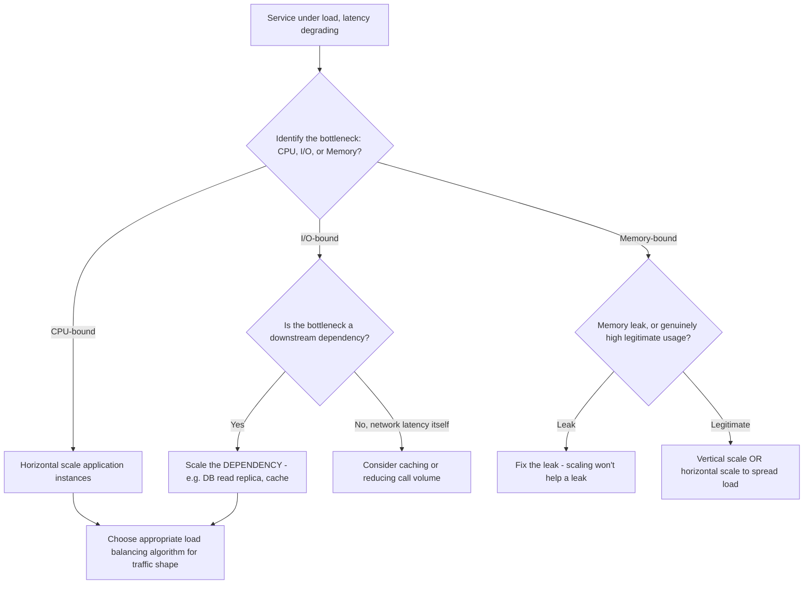
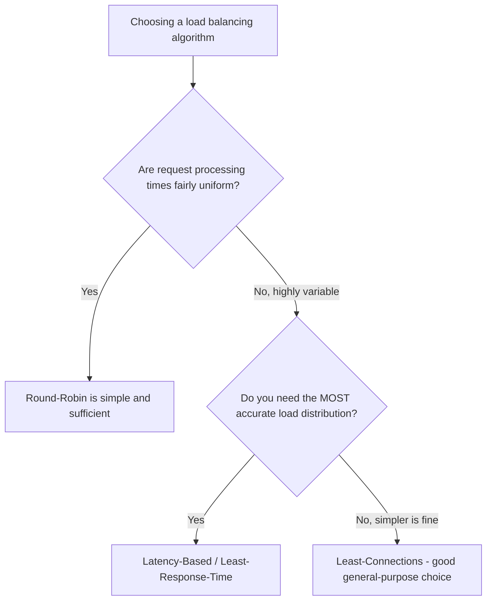
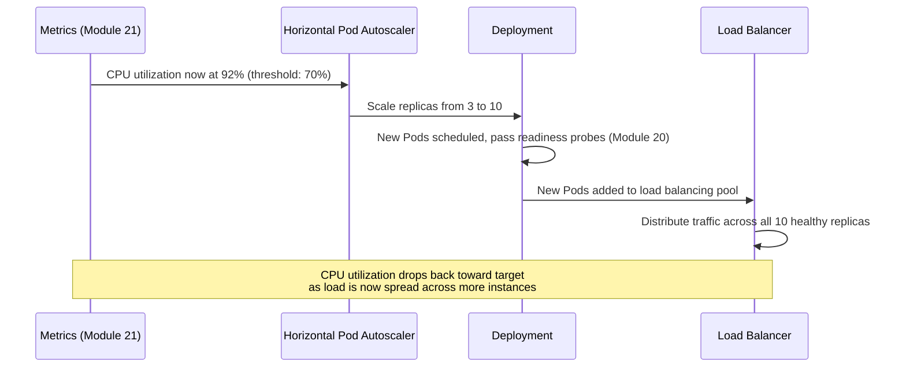

# Module 24 — Scaling Microservices

> **Microservices Masterclass** | Level: Advanced | Track: Node.js Backend Engineering
> Prerequisite: Module 1–23 (especially Module 20 — Kubernetes, Module 21 — Observability)
> Next Module: Module 25 — Security Best Practices

---

## Table of Contents

1. [Introduction](#1-introduction)
2. [Learning Objectives](#2-learning-objectives)
3. [Problem Statement](#3-problem-statement)
4. [Why This Concept Exists](#4-why-this-concept-exists)
5. [Historical Background](#5-historical-background)
6. [Real-World Analogy](#6-real-world-analogy)
7. [Technical Definition](#7-technical-definition)
8. [Core Terminology](#8-core-terminology)
9. [Internal Working](#9-internal-working)
10. [Step-by-Step Request Flow](#10-step-by-step-request-flow)
11. [Architecture Overview](#11-architecture-overview)
12. [ASCII Diagrams](#12-ascii-diagrams)
13. [Mermaid Flowcharts](#13-mermaid-flowcharts)
14. [Mermaid Sequence Diagrams](#14-mermaid-sequence-diagrams)
15. [Component Diagrams](#15-component-diagrams)
16. [Deployment Diagrams](#16-deployment-diagrams)
17. [Database Interaction](#17-database-interaction)
18. [Failure Scenarios](#18-failure-scenarios)
19. [Scalability Discussion](#19-scalability-discussion)
20. [High Availability Considerations](#20-high-availability-considerations)
21. [CAP Theorem Implications](#21-cap-theorem-implications)
22. [Node.js Implementation](#22-nodejs-implementation)
23. [Express.js Examples](#23-expressjs-examples)
24. [Docker Examples](#24-docker-examples)
25. [Kafka/Redis Integration](#25-kafkaredis-integration)
26. [Error Handling](#26-error-handling)
27. [Logging & Monitoring](#27-logging--monitoring)
28. [Security Considerations](#28-security-considerations)
29. [Performance Optimization](#29-performance-optimization)
30. [Production Best Practices](#30-production-best-practices)
31. [Anti-Patterns and Common Mistakes](#31-anti-patterns-and-common-mistakes)
32. [Debugging Tips](#32-debugging-tips)
33. [Interview Questions](#33-interview-questions)
34. [Scenario-Based Questions](#34-scenario-based-questions)
35. [Hands-on Exercises](#35-hands-on-exercises)
36. [Mini Project](#36-mini-project)
37. [Advanced Project](#37-advanced-project)
38. [Summary](#38-summary)
39. [Revision Notes](#39-revision-notes)
40. [One-Page Cheat Sheet](#40-one-page-cheat-sheet)

---

## 1. Introduction

You now have the full observability toolkit (Modules 21-23) to know exactly *when* a service is struggling and exactly *why*. This module addresses what you actually **do** about it: how do you scale a service to handle more load, correctly and cost-effectively? Module 20 briefly introduced the Horizontal Pod Autoscaler, but scaling is a richer topic than "add more replicas" — it involves choosing between horizontal and vertical scaling, understanding what metric should actually drive an autoscaling decision, choosing the right load balancing algorithm for your specific traffic pattern, and recognizing that some parts of your system (notably, stateful databases) scale very differently from your stateless application services.

This module consolidates and deepens the scaling concepts referenced since Module 1, giving you a complete, practical framework for scaling any given microservice correctly.

---

## 2. Learning Objectives

By the end of this module, you will be able to:

- Distinguish horizontal scaling from vertical scaling, and know when each is appropriate.
- Design effective autoscaling strategies using the right metrics for a given service's actual bottleneck.
- Explain and choose between common load balancing algorithms (round-robin, least-connections, latency-based).
- Identify a service's specific scaling bottleneck (CPU-bound, I/O-bound, memory-bound, or database-bound).
- Understand the specific scaling challenges of stateful components (databases, caches) versus stateless services.
- Recognize scaling anti-patterns, including scaling the wrong resource or ignoring downstream bottlenecks.

---

## 3. Problem Statement

An e-commerce platform's `product-service` experiences 20x normal traffic during a flash sale. The team scales it from 3 to 30 replicas (Horizontal Pod Autoscaler, Module 20) — but the situation **doesn't improve**, and in some ways gets worse:

- The 30 replicas are now hammering the same single-instance `product-db` with 10x more concurrent connections than before, and the database itself — which was never scaled — becomes the actual bottleneck, causing every replica (old and new) to slow down waiting on database responses.
- The team's autoscaler was configured to scale based on **memory** utilization, but `product-service`'s actual bottleneck during this spike is **CPU**-bound JSON serialization of large product catalogs — so the autoscaler didn't even trigger the additional replicas fast enough, since memory usage barely moved while CPU was pegged.
- The load balancer in front of these 30 replicas uses a simple **round-robin** algorithm, but some requests (bulk catalog exports) take far longer than others (single product lookups) — round-robin sends a similar volume of requests to every replica regardless of how busy each one currently is, causing uneven load and some replicas to become overloaded while others sit idle.

This module directly addresses each of these: identifying the actual bottleneck resource, choosing the right autoscaling metric, recognizing which downstream dependencies (like a database) need their own, different scaling strategy, and choosing a load balancing algorithm that matches your actual traffic pattern.

---

## 4. Why This Concept Exists

Scaling strategy exists as a distinct discipline because **"add more replicas" is necessary but insufficient** — a genuinely effective scaling strategy requires correctly identifying **what** resource is actually constrained (CPU? Memory? I/O? A downstream dependency?), scaling **that specific resource** appropriately (which might mean scaling a different service, or a database, not just the service showing symptoms), and distributing load **intelligently** across whatever capacity you do have. Scaling blindly — adding replicas without understanding the actual bottleneck, or using a generic load balancing algorithm mismatched to your traffic's actual shape — can fail to help, or even actively worsen a situation, exactly as shown in Section 3's scenario.

---

## 5. Historical Background

- **1990s-2000s** — **Vertical scaling** (buying a bigger, more powerful single server) was the dominant scaling strategy for most applications, since horizontal scaling required significant, often manually-managed infrastructure (load balancers, session replication strategies) that wasn't broadly accessible or well-tooled.
- **2000s** — As web-scale companies (Amazon, Google, eBay) hit the practical and cost limits of vertical scaling, **horizontal scaling** — adding more, smaller machines rather than fewer, bigger ones — became increasingly favored, directly enabling the "scale-out" architecture that later became foundational to cloud computing and microservices.
- **2006** — **Amazon Web Services (AWS)** launched, making horizontal scaling (via easily-provisioned, elastic compute instances) accessible to any organization, not just those with data-center-scale engineering resources — a major catalyst for horizontal scaling becoming the industry default.
- **2014 onward** — Kubernetes (Module 20) and its **Horizontal Pod Autoscaler** made automatic, metric-driven horizontal scaling a standard, built-in capability rather than something teams needed to build custom tooling for — directly enabling the "independent, automatic per-service scaling" benefit promised since Module 1 of this masterclass.
- **Present** — Modern scaling strategy typically combines horizontal scaling (the default for stateless application services) with careful, separate strategies for scaling stateful components (databases via read replicas/sharding, caches via clustering), recognizing these require fundamentally different techniques.

---

## 6. Real-World Analogy

**Analogy: A Restaurant Handling a Sudden Rush**

**Vertical scaling** is like replacing your one chef with a single, much faster "super-chef" who can cook twice as fast — helpful up to a point, but there's a practical limit to how fast any one person (or one machine) can go, and eventually you simply can't buy a "faster" chef at any price.

**Horizontal scaling** is like adding more chefs to the kitchen — if one chef can handle 20 orders/hour, ten chefs can handle roughly 200/hour (assuming the kitchen's other resources — ingredients, stove space — also scale to support them). This is why horizontal scaling has become the dominant strategy for most modern systems: it scales much further than "buy an even bigger single machine" ever can.

But — and this is the crucial lesson from Section 3 — **adding more chefs doesn't help if the restaurant only has ONE walk-in refrigerator that all ten chefs now need to access simultaneously** (the shared database). If the refrigerator (not the chefs' individual cooking speed) was always the actual bottleneck, adding more chefs just creates a longer line of frustrated chefs all waiting for refrigerator access — you needed to scale the refrigerator (or reduce how often chefs need to access it), not just add more chefs.

---

## 7. Technical Definition

> **Horizontal Scaling (scaling out)** is the practice of adding more instances (replicas) of a service to handle increased load, distributing work across a larger number of smaller units.

> **Vertical Scaling (scaling up)** is the practice of increasing the resources (CPU, memory) allocated to a single existing instance, making that one instance more powerful rather than adding more instances.

> A **Load Balancing Algorithm** determines how incoming requests are distributed across multiple available instances — common algorithms include **Round-Robin** (cycling through instances in order), **Least-Connections** (routing to the instance currently handling the fewest active requests), and **Latency-Based/Least-Response-Time** (routing to the instance currently responding fastest).

> **Autoscaling** is the automated process of adjusting the number of running instances (horizontal) or the resources allocated to instances (vertical) based on observed metrics, without requiring manual intervention.

---

## 8. Core Terminology

| Term | Meaning |
|---|---|
| **Horizontal Scaling** | Adding more instances/replicas to handle increased load |
| **Vertical Scaling** | Increasing resources (CPU/memory) of an existing instance |
| **Round-Robin** | Load balancing by cycling through instances in a fixed order |
| **Least-Connections** | Load balancing by routing to the instance with the fewest current active requests |
| **Latency-Based Load Balancing** | Routing to the instance currently responding fastest |
| **CPU-Bound** | A workload whose performance is limited by processor speed/availability |
| **I/O-Bound** | A workload whose performance is limited by network or disk operations, not CPU |
| **Memory-Bound** | A workload whose performance is limited by available memory |
| **Read Replica** | A copy of a database used specifically to handle read queries, scaling read capacity separately from writes |
| **Sharding** | Splitting a dataset across multiple database instances, each handling a subset of the data, to scale beyond a single instance's capacity |

---

## 9. Internal Working

Here's the practical process for scaling a service correctly:

1. **Identify the actual bottleneck resource** using observability data (Module 21's metrics): is the service's CPU pegged? Is it waiting heavily on I/O (network calls, disk)? Is memory usage climbing toward its limit? Different bottlenecks require different scaling responses.
2. **Determine whether horizontal or vertical scaling fits the bottleneck.** For most stateless Node.js services under CPU or memory pressure from increased *request volume*, horizontal scaling (more replicas) is the standard, more elastic, more cost-effective choice. Vertical scaling remains relevant for services with a genuinely single-instance nature (some databases) or where a specific instance-level resource constraint (e.g., needing more memory for a single large in-memory cache) can't be addressed by simply adding more instances.
3. **Configure autoscaling using the metric that actually reflects the bottleneck** — CPU utilization (Module 20's HPA default) is a reasonable general-purpose choice, but a service bottlenecked on external I/O wait time, queue depth, or memory might need a custom metric to trigger scaling correctly and promptly.
4. **Check whether scaling this service actually requires scaling its dependencies too** — as Section 3 demonstrated, scaling a stateless service that shares a single-instance database doesn't help if the database itself becomes the new bottleneck; database scaling (read replicas, sharding) often requires separate, deliberate planning.
5. **Choose a load balancing algorithm matching your traffic's actual shape** — Round-Robin works well for uniform, similarly-sized requests; Least-Connections or Latency-Based algorithms handle better when request processing times vary significantly (Section 3's bulk export vs. single lookup scenario).

---

## 10. Step-by-Step Request Flow

**Scenario: Correctly diagnosing and scaling product-service during a flash sale.**

```
Step 1:  Traffic spikes 20x during a flash sale; product-service's
         P95 latency climbs sharply (Module 21's metrics dashboard)

Step 2:  Engineer checks WHICH resource is actually constrained:
         CPU utilization on product-service pods is at 95%+ -
         CPU-BOUND, likely due to JSON serialization of large
         catalog responses under high concurrent request volume

Step 3:  Engineer confirms product-service is STATELESS (no local
         state that would complicate horizontal scaling) - HORIZONTAL
         scaling is the correct choice here

Step 4:  Engineer verifies the HPA (Module 20) is configured to scale
         on CPU utilization (matching the ACTUAL bottleneck identified
         in Step 2) - confirms this is correctly configured

Step 5:  Engineer checks product-service's DOWNSTREAM dependency:
         product-db. Is IT also becoming a bottleneck as replicas scale?
         Metrics show product-db's connection count and query
         latency are ALSO rising as replicas increase

Step 6:  Engineer adds a READ REPLICA for product-db (since this
         traffic is overwhelmingly READS - browsing the catalog
         during a sale, not writes) and configures product-service
         to route read queries to the replica, distributing DATABASE
         load alongside the APPLICATION scaling

Step 7:  Engineer reviews the load balancer's algorithm: currently
         Round-Robin. Given that SOME requests (bulk catalog export
         for a partner integration) take much longer than typical
         product lookups, switches to LEAST-CONNECTIONS, so slow
         requests don't cause an uneven pile-up on specific replicas

Step 8:  With CPU-appropriate autoscaling, a scaled database read
         path, AND a traffic-appropriate load balancing algorithm,
         product-service now handles the 20x spike smoothly
```

---

## 11. Architecture Overview

```
                    Load Balancer
              (Least-Connections algorithm,
               chosen for VARIABLE request duration)
                          │
        ┌─────────────────┼─────────────────┐
        ▼                 ▼                 ▼
   Pod (replica 1)   Pod (replica 2)   ... Pod (replica 30)
   (product-service, scaled HORIZONTALLY based on
    CPU utilization - the metric matching the ACTUAL
    bottleneck)
        │                 │                 │
        └─────────────────┴─────────────────┘
                          │
              ┌───────────┴───────────┐
              ▼                       ▼
        product-db (PRIMARY,      product-db-replica
        handles WRITES)            (handles READS,
                                     scales read capacity
                                     SEPARATELY from the
                                     application layer)
```

---

## 12. ASCII Diagrams

### 12.1 Horizontal vs Vertical Scaling

```
VERTICAL SCALING (scale UP - bigger instance):

  BEFORE: [ 1 instance: 2 CPU, 4GB RAM ]
  AFTER:  [ 1 instance: 8 CPU, 16GB RAM ]  <- SAME instance, MORE power

  Limits: eventually hits a MAXIMUM machine size; single point
  of failure REMAINS (still just ONE instance)


HORIZONTAL SCALING (scale OUT - more instances):

  BEFORE: [ 3 instances: 2 CPU, 4GB RAM each ]
  AFTER:  [ 30 instances: 2 CPU, 4GB RAM each ]  <- MORE instances,
                                                     SAME size each

  Benefits: scales MUCH further in practice; improves FAULT
  TOLERANCE too (losing ONE of 30 instances is a MUCH smaller
  impact than losing your ONLY vertically-scaled instance)
```

### 12.2 Load Balancing Algorithms Compared

```
ROUND-ROBIN (cycles through instances in fixed order):

  Request 1 -> Instance A
  Request 2 -> Instance B
  Request 3 -> Instance C
  Request 4 -> Instance A  (cycle repeats)

  GOOD for: uniform, similarly-sized requests
  BAD for: highly variable request processing times (a slow
  request on Instance A doesn't stop MORE requests being sent there)


LEAST-CONNECTIONS (routes to the currently LEAST busy instance):

  Instance A: 8 active requests
  Instance B: 2 active requests   <- NEXT request goes HERE
  Instance C: 5 active requests

  GOOD for: variable request processing times - naturally
  avoids piling more work onto an already-busy instance
```

### 12.3 Identifying the Actual Bottleneck

```
Is the service CPU-bound, I/O-bound, or memory-bound?

  CPU-BOUND:    CPU utilization near 100%, I/O wait LOW
                -> Fix: horizontal scale, or optimize CPU-heavy code
                   (e.g., expensive JSON serialization, encryption)

  I/O-BOUND:    CPU utilization LOW, but requests are SLOW,
                waiting heavily on network calls or disk I/O
                -> Fix: the BOTTLENECK is likely a DOWNSTREAM
                   dependency (database, another service) - scaling
                   THIS service alone won't help; scale the
                   DEPENDENCY, or reduce dependency calls (caching,
                   Module 14's Data Duplication)

  MEMORY-BOUND: Memory utilization climbing toward limits, possibly
                triggering garbage collection pauses or OOM kills
                -> Fix: vertical scaling (more memory per instance),
                   OR fix a memory leak, OR horizontal scale to
                   spread memory-intensive work across more instances
```

---

## 13. Mermaid Flowcharts

### 13.1 Scaling Decision Process



### 13.2 Choosing a Load Balancing Algorithm



---

## 14. Mermaid Sequence Diagrams

### 14.1 Autoscaling Triggered by the Correct Metric



---

## 15. Component Diagrams

```
┌─────────────────────────────────────────────────────────┐
│                  Scaling Decision Pipeline                    │
│  ┌───────────────┐ ┌───────────────┐ ┌───────────────┐      │
│  │ Metrics             │ │ Bottleneck          │ │ Scaling Action    │      │
│  │ (Module 21 -         │ │ Identification       │ │ (horizontal,        │      │
│  │  CPU, memory,         │ │ (CPU/IO/Memory/        │ │  vertical, or        │      │
│  │  I/O wait, queue       │ │  Dependency-bound)      │ │  dependency scaling)  │      │
│  │  depth)                │ │                          │ │                        │      │
│  └───────────────┘ └───────────────┘ └───────────────┘      │
│  ┌───────────────────────────────────────────────┐          │
│  │      Load Balancing Algorithm Selection             │          │
│  │  (Round-Robin / Least-Connections / Latency-Based)   │          │
│  └───────────────────────────────────────────────┘          │
└─────────────────────────────────────────────────────────┘
```

---

## 16. Deployment Diagrams

```
┌───────────────────────────────────────────────────────────┐
│                    Kubernetes Cluster                        │
│                                                               │
│  product-service Deployment (HPA: scale on CPU, 3-30 replicas) │
│         │                                                     │
│  Service (load balances across replicas - Kubernetes Services  │
│  use a simple, effective default algorithm; more sophisticated  │
│  algorithms like least-connections often require a Service Mesh  │
│  or dedicated Ingress Controller configuration)                  │
│         │                                                     │
│  product-db (PRIMARY - StatefulSet, scaled VERTICALLY or via     │
│  read replicas, NOT via the same horizontal Pod-replica            │
│  mechanism as the stateless application layer)                     │
│         │                                                     │
│  product-db-read-replica (additional instances specifically       │
│  for scaling READ capacity, separate from the primary's WRITE      │
│  capacity)                                                          │
└───────────────────────────────────────────────────────────┘
```

---

## 17. Database Interaction

Database scaling requires fundamentally different techniques from stateless application scaling:

```
STATELESS APPLICATION SCALING (product-service):
  -> Simply add MORE IDENTICAL replicas (horizontal scaling) -
     each replica is interchangeable, no data to coordinate

STATEFUL DATABASE SCALING (product-db):
  -> READ REPLICAS: additional copies handling READ queries,
     reducing load on the PRIMARY (which still handles ALL writes) -
     directly addresses READ-heavy workloads like the flash sale scenario

  -> SHARDING: splitting the DATASET itself across multiple
     database instances (e.g., by customer ID range, or by
     product category) - addresses WRITE scaling and datasets
     too large for a single instance, but adds significant
     application-level complexity (routing queries to the
     correct shard)

  -> VERTICAL SCALING: simply using a bigger database instance -
     often the SIMPLEST first step before reaching for read
     replicas or sharding's added complexity
```

---

## 18. Failure Scenarios

| Scenario | Scaling-Related Root Cause & Fix |
|---|---|
| Adding replicas doesn't improve latency at all | The actual bottleneck is likely a shared, unscaled downstream dependency (a database, Section 9's Step 5) — scale the dependency, not just the application layer |
| Autoscaler doesn't trigger despite genuine overload | The scaling metric doesn't match the actual bottleneck (e.g., scaling on memory when the real issue is CPU or I/O wait) — reconfigure to the correct metric |
| Some replicas become overloaded while others sit idle | The load balancing algorithm (often default Round-Robin) doesn't account for variable request processing times — switch to Least-Connections or Latency-Based |
| Vertical scaling hits a hard ceiling | Cloud providers impose maximum instance sizes; a service outgrowing even the largest available instance size MUST move to horizontal scaling (or a fundamentally different architecture) |

```
Scaling the wrong layer (Section 3's core lesson, restated):

  product-service: 3 -> 30 replicas (SCALED)
  product-db:       1 instance, UNCHANGED (NOT scaled)
           │
           ▼
  30 replicas now generate 10x the CONCURRENT database
  connections/queries that 3 replicas did
           │
           ▼
  product-db becomes THE bottleneck - EVERY replica (old
  and new) now waits on database responses, and the
  SYMPTOM (slow product-service) looks unchanged or WORSE,
  even though you "scaled" - because you scaled the WRONG
  component relative to where the actual constraint was
```

---

## 19. Scalability Discussion

This entire module IS the scalability discussion — but worth summarizing the key principle: **scalability is a property of your ENTIRE request path, not any single component in isolation.** A request path is only as scalable as its **least scalable component** — if `product-service` can scale to 100 replicas but `product-db` cannot handle the resulting connection/query load, your system's real-world scalability ceiling is set by the database, regardless of how elastically the application layer itself can scale. Effective scaling strategy requires mapping out and addressing the entire chain, not just the component showing the most visible symptoms.

---

## 20. High Availability Considerations

Horizontal scaling directly improves fault tolerance as a valuable side effect: losing 1 of 30 replicas has a far smaller impact than losing your only vertically-scaled instance — this is one of horizontal scaling's under-appreciated benefits beyond raw capacity. However, scaling a stateless application layer while leaving a single-instance database unscaled and unreplicated creates an availability mismatch: your application layer might survive individual instance failures gracefully, while the database remains a single point of failure for the entire system — a gap worth addressing deliberately (via database replication, covered further in dedicated database HA strategies) as part of any comprehensive scaling and availability plan.

---

## 21. CAP Theorem Implications

Scaling reads via database read replicas introduces an explicit, deliberate eventual consistency trade-off: a read replica may lag slightly behind the primary's most recent writes (an application reading from a replica immediately after writing to the primary might not see its own just-written change) — the same fundamental trade-off discussed since Module 4, now applied specifically to database scaling technique. Teams must decide, per read query, whether this acceptable staleness window (often milliseconds) is tolerable for that specific use case, or whether a specific critical read must go to the primary instead, favoring consistency over the read replica's improved scalability for that one query.

---

## 22. Node.js Implementation

Let's implement a Node.js service that correctly routes reads to a database replica and writes to the primary, alongside CPU-aware scaling considerations.

**Folder structure:**
```
product-service/
├── src/
│   ├── db/
│   │   └── connectionRouter.js
│   └── app.js
```

**`src/db/connectionRouter.js`** — routing reads to a replica, writes to the primary
```javascript
import pg from "pg";

// TWO separate connection pools - one for the PRIMARY (writes),
// one for the READ REPLICA (reads) - this is the application-level
// piece that makes database read scaling actually work
const primaryPool = new pg.Pool({ connectionString: process.env.DATABASE_PRIMARY_URL });
const replicaPool = new pg.Pool({ connectionString: process.env.DATABASE_REPLICA_URL });

export async function readQuery(sql, params) {
  // Reads go to the REPLICA, distributing read load away from
  // the primary - directly addressing the flash-sale scenario
  return replicaPool.query(sql, params);
}

export async function writeQuery(sql, params) {
  // Writes MUST go to the primary - replicas are typically
  // read-only in a standard primary/replica setup
  return primaryPool.query(sql, params);
}

// For operations where READ-AFTER-WRITE consistency is critical
// (Section 21's trade-off), explicitly read from the PRIMARY instead
export async function readFromPrimary(sql, params) {
  return primaryPool.query(sql, params);
}
```

**`src/app.js`**
```javascript
import express from "express";
import { readQuery, writeQuery, readFromPrimary } from "./db/connectionRouter.js";

const app = express();
app.use(express.json());

// A high-volume READ endpoint (browsing the catalog) - uses the
// REPLICA, since slight staleness here is completely acceptable
app.get("/products", async (req, res) => {
  const result = await readQuery("SELECT * FROM products WHERE category = $1", [req.query.category]);
  res.json(result.rows);
});

// A WRITE endpoint - always goes to the PRIMARY
app.post("/products", async (req, res) => {
  const result = await writeQuery(
    "INSERT INTO products (name, price) VALUES ($1, $2) RETURNING id",
    [req.body.name, req.body.price]
  );
  res.status(201).json({ id: result.rows[0].id });
});

// A read IMMEDIATELY after a write, where staleness would be
// confusing to the user (e.g., "confirm your just-created product")
// - explicitly reads from the PRIMARY to guarantee freshness
app.post("/products/:id/confirm", async (req, res) => {
  const result = await readFromPrimary("SELECT * FROM products WHERE id = $1", [req.params.id]);
  res.json(result.rows[0]);
});

app.listen(4008, () => console.log("Product Service running on port 4008"));
```

---

## 23. Express.js Examples

Node.js's single-threaded event loop has specific implications for CPU-bound scaling — if `product-service`'s bottleneck is genuinely CPU-bound (e.g., heavy JSON serialization), consider using Node's **cluster module** to utilize multiple CPU cores **within a single container**, in addition to (not instead of) horizontal scaling across multiple containers/Pods:

```javascript
import cluster from "cluster";
import os from "os";

if (cluster.isPrimary) {
  const numCPUs = os.cpus().length;
  // Fork one worker process PER available CPU core, since Node.js
  // itself is single-threaded and won't use multiple cores otherwise
  for (let i = 0; i < numCPUs; i++) {
    cluster.fork();
  }
  cluster.on("exit", (worker) => {
    console.log(`Worker ${worker.process.pid} died, forking a replacement`);
    cluster.fork(); // self-healing at the process level too
  });
} else {
  // Each worker runs the actual Express application independently
  const app = express();
  // ... routes ...
  app.listen(4008);
}
```

This is a complementary technique to Kubernetes-level horizontal scaling (Module 20) — it maximizes the utilization of resources **already allocated** to a single container/Pod, before you even need to add more replicas.

---

## 24. Docker Examples

```yaml
# hpa.yaml - CPU-based autoscaling, matching the identified bottleneck
apiVersion: autoscaling/v2
kind: HorizontalPodAutoscaler
metadata:
  name: product-service-hpa
spec:
  scaleTargetRef:
    apiVersion: apps/v1
    kind: Deployment
    name: product-service
  minReplicas: 3
  maxReplicas: 30    # sized to handle a flash-sale-level spike
  metrics:
    - type: Resource
      resource:
        name: cpu
        target:
          type: Utilization
          averageUtilization: 70   # matches Section 22's identified CPU bottleneck
```

```yaml
# service.yaml with a load balancing hint (many production setups
# use a Service Mesh or Ingress Controller annotation for more
# sophisticated algorithms than Kubernetes Services provide by default)
apiVersion: v1
kind: Service
metadata:
  name: product-service
  annotations:
    # Example annotation for an NGINX Ingress Controller supporting
    # least-connections load balancing (syntax varies by controller)
    nginx.ingress.kubernetes.io/load-balance: "least_conn"
spec:
  selector:
    app: product-service
  ports:
    - port: 4008
```

---

## 25. Kafka/Redis Integration

Kafka itself scales via **partitions** (covered in depth in the Kafka Masterclass) — adding more partitions to a topic allows more consumer instances to process messages in parallel, directly analogous to horizontal scaling for application services. Redis scales via **clustering** (splitting data across multiple Redis nodes) or simply adding **read replicas** for read-heavy caching workloads, mirroring the exact primary/replica pattern shown for PostgreSQL in Section 22:

```javascript
// Redis read replica routing, mirroring the database pattern
import { createClient } from "redis";

const primaryClient = createClient({ url: process.env.REDIS_PRIMARY_URL });
const replicaClient = createClient({ url: process.env.REDIS_REPLICA_URL });

export async function cacheGet(key) {
  return replicaClient.get(key); // reads distributed to the replica
}

export async function cacheSet(key, value) {
  return primaryClient.set(key, value); // writes go to the primary
}
```

---

## 26. Error Handling

When routing reads to a replica, handle the case where the replica is temporarily unavailable by falling back to the primary (a deliberate resilience choice, echoing Module 18's Fallback pattern) rather than failing the read entirely:

```javascript
export async function readQueryWithFallback(sql, params) {
  try {
    return await replicaPool.query(sql, params);
  } catch (err) {
    console.warn("Replica unavailable, falling back to primary:", err.message);
    return primaryPool.query(sql, params); // primary handles both reads and writes if needed
  }
}
```

---

## 27. Logging & Monitoring

- Monitor **CPU, memory, and I/O wait time** separately (not just a generic "load average") to correctly identify a service's actual bottleneck category, exactly as demonstrated in Section 9's diagnostic process.
- Monitor **database connection pool utilization** and **query latency**, separately for primary and replica instances, to catch a database-side bottleneck before (or as) it manifests as apparent application-layer slowness.
- Track **autoscaling events** (when did the HPA scale up/down, and in response to what metric value) to verify your autoscaling configuration is actually responding appropriately to real load patterns over time.

---

## 28. Security Considerations

- Ensure read replicas have **appropriately scoped credentials** (read-only database users) — a compromised read-path connection should never be able to write to your primary data store.
- Autoscaling configuration itself (min/max replica bounds) has a security dimension: an unbounded or excessively high `maxReplicas` could be exploited by a malicious traffic flood to drive excessive cloud infrastructure costs — set sensible upper bounds and monitor for anomalous scaling events.

---

## 29. Performance Optimization

- Always **identify the actual bottleneck** (Section 9, Section 12.3) before choosing a scaling strategy — scaling the wrong resource wastes both engineering effort and infrastructure cost.
- Combine **Node.js clustering** (Section 23, utilizing all CPU cores within a container) with **Kubernetes horizontal scaling** (across containers/nodes) for maximum resource utilization at every level.
- Use **caching** (Module 14's Data Duplication, Redis) to reduce the read load reaching your database in the first place, often a more cost-effective scaling lever than adding more database read replicas.

---

## 30. Production Best Practices

- Always base autoscaling decisions on the metric that **genuinely reflects your service's actual bottleneck** — verify this with real observability data (Module 21), not assumptions.
- Plan database scaling **explicitly and separately** from application-layer scaling — never assume a database will "just handle" whatever load your newly-scaled application layer throws at it.
- Load-test your scaling configuration (min/max replicas, target thresholds, chosen load balancing algorithm) under realistic, representative traffic patterns **before** a real high-stakes event (like a flash sale) — Section 3's failure scenario is exactly the kind of costly surprise deliberate load testing prevents.
- Document your system's actual scaling limits and known bottlenecks (e.g., "product-db's primary can handle X writes/second before becoming a bottleneck") as living operational knowledge.

---

## 31. Anti-Patterns and Common Mistakes

| Anti-Pattern | Why It's a Problem |
|---|---|
| **Scaling the application layer while ignoring an unscaled shared database** | The database becomes the new, unaddressed bottleneck — the exact scenario from Section 3 |
| **Autoscaling on a metric that doesn't match the actual bottleneck** | The autoscaler either doesn't trigger when genuinely needed, or triggers unnecessarily, wasting cost |
| **Using Round-Robin load balancing for highly variable request durations** | Causes uneven load distribution, with some replicas overloaded while others sit idle |
| **No upper bound on autoscaling (`maxReplicas`)** | Risks runaway infrastructure costs during an anomalous traffic event (legitimate spike or malicious flood) |
| **Never load-testing scaling configuration before a real high-stakes event** | Discovering scaling gaps live, during an actual flash sale or major event, is far more costly than discovering them in a controlled test |

```
Ignoring the database bottleneck (the module's central lesson):

  Application layer: scaled from 3 to 30 replicas (correctly
  identified CPU as the APPLICATION's bottleneck)

  Database layer: LEFT COMPLETELY UNCHANGED

  Result: the OVERALL system's scalability is still capped by
  whatever the SINGLE, unscaled database instance can handle -
  the expensive, seemingly-correct application-layer scaling
  effort delivered LITTLE OR NO actual improvement in the
  metric that mattered (end-to-end customer-facing latency)
```

---

## 32. Debugging Tips

- When scaling doesn't improve latency, always check **downstream dependencies' metrics** (database connection counts, query latency) immediately after — this is the single most common root cause of "we scaled but it didn't help."
- Use CPU, memory, and I/O wait metrics **together** (Section 12.3) to correctly categorize a bottleneck before choosing a scaling response — don't guess based on symptoms alone.
- If some replicas appear far more loaded than others despite identical instance sizing, investigate the load balancing algorithm first (Section 12.2) before assuming an application-level bug.
- Review autoscaling event history (Section 27) after an incident to verify the HPA actually triggered when expected, and investigate its configured metric/threshold if it didn't.

---

## 33. Interview Questions

### Easy
1. What is the difference between horizontal and vertical scaling?
2. What is a load balancing algorithm, and name three common examples.
3. What is a database read replica, and what problem does it solve?
4. Why does horizontal scaling also improve fault tolerance, not just capacity?
5. What does it mean for a workload to be "CPU-bound" versus "I/O-bound"?

### Medium
6. Explain why adding more application replicas might not improve performance if a shared database isn't also scaled.
7. When would Least-Connections load balancing be preferable to Round-Robin?
8. What metric would you choose to drive autoscaling for a service that's genuinely CPU-bound versus one that's I/O-bound waiting on a downstream dependency?
9. Why does Node.js's single-threaded nature make the cluster module relevant even within a single, horizontally-scaled container?
10. What CAP theorem trade-off is introduced by routing reads to a database read replica?

### Hard
11. Design a complete scaling strategy (application layer, database layer, load balancing algorithm) for a service expecting a 20x traffic spike during a planned promotional event.
12. How would you diagnose, in production, whether a service's scaling problem is CPU-bound, I/O-bound, or downstream-dependency-bound?
13. Discuss the trade-offs of database sharding versus read replicas for scaling a write-heavy versus read-heavy workload.
14. Design an autoscaling configuration with appropriate min/max bounds and a chosen metric, justifying each choice for a specific hypothetical service's known bottleneck.
15. Explain how you would load-test a scaling configuration before a high-stakes event, and what specific failure modes you'd want to intentionally trigger during that test.

---

## 34. Scenario-Based Questions

1. Your team scales an application service from 5 to 50 replicas during a major sale, but customer-facing latency doesn't improve. Walk through your diagnostic process.
2. Your Horizontal Pod Autoscaler is configured to scale on memory utilization, but the service's actual bottleneck during peak load is CPU. What would you observe, and how would you fix the configuration?
3. Some replicas of a service are consistently far busier than others despite identical resource allocation. What would you investigate first?
4. Leadership wants to plan infrastructure for an upcoming flash sale expected to bring 15x normal traffic. Walk through your complete scaling readiness plan.
5. Your database's read replica is lagging significantly behind the primary during high load, and a "confirm your order" page is showing stale data to customers immediately after they place an order. How would you fix this specific read path?

---

## 35. Hands-on Exercises

1. Configure a Horizontal Pod Autoscaler for a sample service, choosing an appropriate metric based on a hypothetical, stated bottleneck (CPU, memory, or a custom metric).
2. Implement the database read/write routing pattern from Section 22, using two separate PostgreSQL instances (a simple primary/replica-like setup) locally.
3. Load-test a service configured with Round-Robin versus Least-Connections load balancing, using requests with intentionally varying processing times, and compare the resulting load distribution across replicas.
4. Implement Node.js's cluster module (Section 23) for a CPU-bound sample workload, and measure the throughput improvement compared to a single, unclustered process.
5. Design (on paper) a complete scaling plan for a hypothetical service, including the application layer, its database dependency, and the chosen load balancing algorithm, with justification for each decision.

---

## 36. Mini Project

**Build: A Service With Correctly-Configured Autoscaling**

1. Build a simple Express service with an intentionally CPU-intensive endpoint (e.g., a computationally expensive operation) and a lightweight endpoint.
2. Deploy it to a local Kubernetes cluster with an HPA configured to scale on CPU utilization.
3. Load-test the CPU-intensive endpoint and observe the HPA correctly triggering additional replicas as CPU utilization rises.
4. Verify the load balancer distributes traffic across all replicas as they come online.

---

## 37. Advanced Project

**Build: A Full Scaling Strategy Across Application and Database Layers**

1. Extend the Mini Project with a PostgreSQL primary and a read replica, implementing the read/write routing pattern from Section 22.
2. Configure the application service's HPA to scale based on CPU (matching an intentionally CPU-bound workload) and load-test it to trigger scaling from 3 to 15+ replicas.
3. Simultaneously load-test heavy READ traffic and observe database read load being distributed to the replica, keeping the primary's load manageable even as the application layer scales significantly.
4. Compare Round-Robin versus Least-Connections load balancing under a traffic pattern with deliberately mixed request durations (some fast, some artificially slow), measuring and documenting the resulting load distribution difference across replicas.
5. Write a scaling readiness document for this system: identified bottlenecks at each layer, the specific scaling strategy for each, chosen autoscaling metrics and thresholds, and load balancing algorithm choice, with justification tied to your load-testing results.

---

## 38. Summary

- Effective scaling requires first identifying the actual bottleneck resource (CPU, I/O, memory, or a downstream dependency) before choosing a scaling response — scaling blindly can fail to help or even worsen a situation.
- Horizontal scaling (more instances) is the standard default for stateless application services, offering better elasticity and fault tolerance than vertical scaling (bigger instances).
- Autoscaling must be configured against the metric that genuinely reflects the service's actual bottleneck, not a generic or mismatched default.
- Stateful components (databases, caches) require fundamentally different scaling techniques (read replicas, sharding, clustering) than stateless application services, and must be scaled as a deliberate, separate part of any complete scaling strategy.
- Load balancing algorithm choice (Round-Robin, Least-Connections, Latency-Based) should match your traffic's actual request-duration distribution, not default to the simplest option unconditionally.

---

## 39. Revision Notes

- Horizontal scaling: more instances (standard default, better fault tolerance). Vertical scaling: bigger instance (has a hard ceiling).
- Identify the ACTUAL bottleneck (CPU/I/O/memory/dependency) before choosing a scaling response.
- Autoscaling metric MUST match the actual bottleneck, or it won't trigger appropriately.
- Databases scale differently: read replicas (reads), sharding (writes/dataset size), vertical scaling (simplest first step).
- Load balancing: Round-Robin (uniform requests), Least-Connections/Latency-Based (variable request durations).
- A system's real scalability ceiling is set by its LEAST scalable component in the request path.

---

## 40. One-Page Cheat Sheet

```
HORIZONTAL SCALING:   more instances - standard default, better fault tolerance
VERTICAL SCALING:     bigger instance - simpler, but has a hard ceiling
ROUND-ROBIN:          cycles through instances - good for UNIFORM request durations
LEAST-CONNECTIONS:    routes to least-busy instance - good for VARIABLE durations
READ REPLICA:         scales database READS separately from writes
SHARDING:             splits DATASET across instances - scales writes/total size

IDENTIFY BOTTLENECK FIRST:
  CPU-bound       -> horizontal scale application / optimize CPU-heavy code
  I/O-bound       -> likely a DOWNSTREAM dependency - scale/cache THAT, not just this service
  Memory-bound    -> check for a LEAK first; else vertical scale or spread across more instances

GOLDEN RULES:
  - ALWAYS identify the ACTUAL bottleneck before choosing a scaling strategy
  - Autoscaling metric MUST match the real bottleneck, or it won't help
  - Scale the DATABASE deliberately and separately - it rarely "just handles" more load
  - Match load balancing algorithm to your traffic's ACTUAL request-duration shape
  - LOAD-TEST scaling configuration before a real high-stakes event, not during one
```

---

**Suggested Next Module:** Module 25 — Security Best Practices (mTLS, API security, Zero Trust architecture, and secrets management at scale for production microservices systems)
