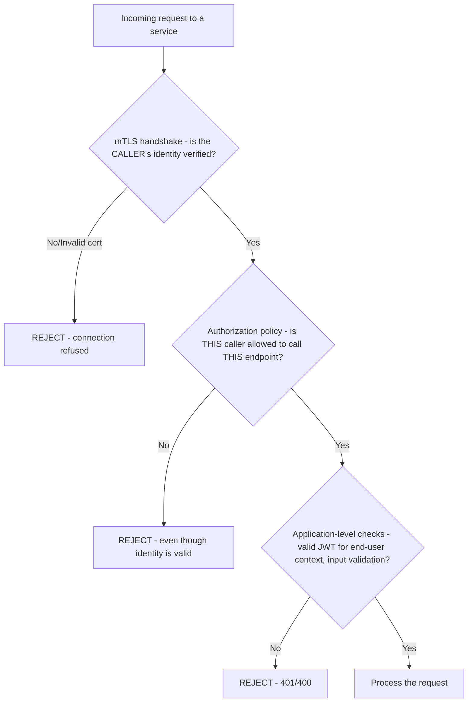
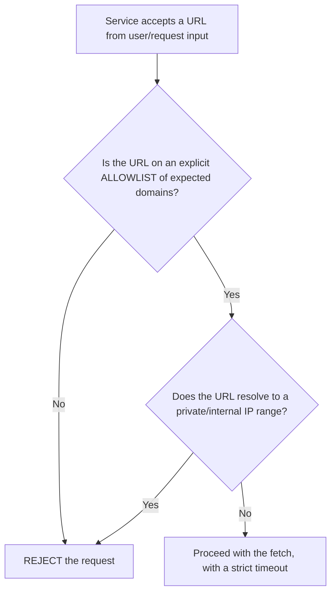
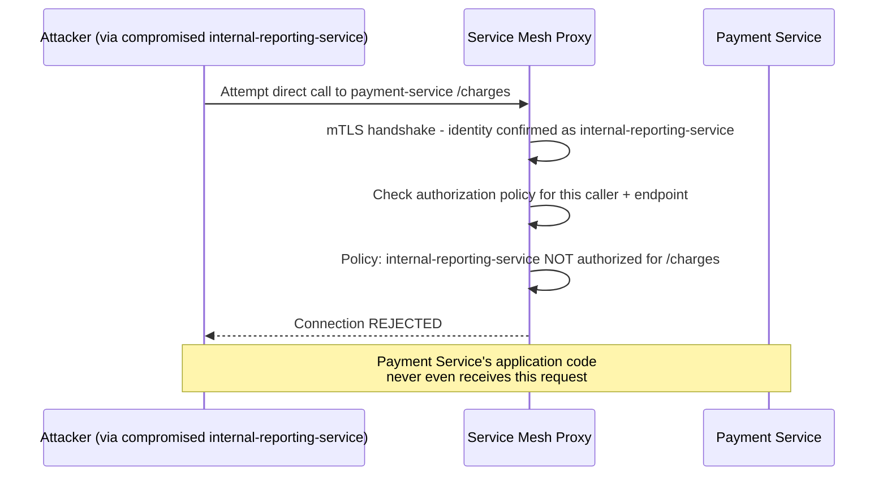

# Module 25 — Security Best Practices

> **Microservices Masterclass** | Level: Advanced | Track: Node.js Backend Engineering
> Prerequisite: Module 1–24 (especially Module 13 — Authentication, Module 12 — Configuration Management)
> Next Module: Module 26 — CI/CD for Microservices

---

## Table of Contents

1. [Introduction](#1-introduction)
2. [Learning Objectives](#2-learning-objectives)
3. [Problem Statement](#3-problem-statement)
4. [Why This Concept Exists](#4-why-this-concept-exists)
5. [Historical Background](#5-historical-background)
6. [Real-World Analogy](#6-real-world-analogy)
7. [Technical Definition](#7-technical-definition)
8. [Core Terminology](#8-core-terminology)
9. [Internal Working](#9-internal-working)
10. [Step-by-Step Request Flow](#10-step-by-step-request-flow)
11. [Architecture Overview](#11-architecture-overview)
12. [ASCII Diagrams](#12-ascii-diagrams)
13. [Mermaid Flowcharts](#13-mermaid-flowcharts)
14. [Mermaid Sequence Diagrams](#14-mermaid-sequence-diagrams)
15. [Component Diagrams](#15-component-diagrams)
16. [Deployment Diagrams](#16-deployment-diagrams)
17. [Database Interaction](#17-database-interaction)
18. [Failure Scenarios](#18-failure-scenarios)
19. [Scalability Discussion](#19-scalability-discussion)
20. [High Availability Considerations](#20-high-availability-considerations)
21. [CAP Theorem Implications](#21-cap-theorem-implications)
22. [Node.js Implementation](#22-nodejs-implementation)
23. [Express.js Examples](#23-expressjs-examples)
24. [Docker Examples](#24-docker-examples)
25. [Kafka/Redis Integration](#25-kafkaredis-integration)
26. [Error Handling](#26-error-handling)
27. [Logging & Monitoring](#27-logging--monitoring)
28. [Security Considerations](#28-security-considerations)
29. [Performance Optimization](#29-performance-optimization)
30. [Production Best Practices](#30-production-best-practices)
31. [Anti-Patterns and Common Mistakes](#31-anti-patterns-and-common-mistakes)
32. [Debugging Tips](#32-debugging-tips)
33. [Interview Questions](#33-interview-questions)
34. [Scenario-Based Questions](#34-scenario-based-questions)
35. [Hands-on Exercises](#35-hands-on-exercises)
36. [Mini Project](#36-mini-project)
37. [Advanced Project](#37-advanced-project)
38. [Summary](#38-summary)
39. [Revision Notes](#39-revision-notes)
40. [One-Page Cheat Sheet](#40-one-page-cheat-sheet)

---

## 1. Introduction

Module 13 covered authentication — verifying who's making a request. This module zooms out to the full security picture a production microservices system needs: **mTLS** for securing service-to-service traffic at the network level, a **Zero Trust** philosophy for how services should treat every request (even "internal" ones), and disciplined **secrets and API security** practices that tie together threads from Modules 12 and 13 into a cohesive security posture.

Microservices introduce a genuinely larger attack surface than a monolith: instead of one process to secure, you have dozens of network-exposed services, each a potential entry point. This module is about closing that expanded surface deliberately, rather than relying on the comforting but false assumption that "it's internal, so it's safe."

---

## 2. Learning Objectives

By the end of this module, you will be able to:

- Explain the Zero Trust security model and why it's essential for microservices specifically.
- Implement mutual TLS (mTLS) for service-to-service authentication and encryption.
- Apply API security best practices: input validation, rate limiting, and secure headers.
- Design a defense-in-depth security strategy spanning the network, application, and data layers.
- Recognize and mitigate common microservices-specific vulnerabilities (SSRF via internal calls, over-permissioned service accounts).
- Conduct a basic security review of a microservices architecture using this module's checklist.

---

## 3. Problem Statement

A team has built a secure-looking system: the API Gateway (Module 10) validates JWTs (Module 13), and all internal services are "safe" because they're not directly exposed to the internet. Then:

- An attacker compromises one low-security internal service (say, a rarely-updated internal reporting tool with a known, unpatched dependency vulnerability). Because internal traffic is entirely unauthenticated and unencrypted ("it's internal, we trust it"), the attacker now has unrestricted network access to call `payment-service`, `user-service`, and every other internal service directly, completely bypassing the Gateway's authentication entirely.
- A `notification-service` has a database credential with **full read/write access to every table**, even though it only ever needs to read customer email addresses — a classic over-permissioning risk, meaning a compromise of this one, relatively low-value service grants far more access than it should.
- An internal service accepts a URL parameter and fetches its content server-side (e.g., for a "preview link" feature) without validating that URL — an attacker crafts a request pointing this URL parameter at an internal-only endpoint (like a cloud metadata service or another internal service's admin API), a **Server-Side Request Forgery (SSRF)** attack that uses the trusted internal service as a proxy to reach otherwise-unreachable internal targets.

This module directly addresses each of these: Zero Trust (never assume internal traffic is safe), mTLS (encrypt and authenticate every service-to-service call, not just external ones), least-privilege credentials (Section 28), and input validation practices that specifically guard against SSRF and similar microservices-specific attack patterns.

---

## 4. Why This Concept Exists

Security best practices for microservices exist as a distinct discipline because **the "castle and moat" security model — strong perimeter defense, implicit trust once inside — breaks down catastrophically once your "castle" contains dozens of independently-deployed services, any one of which might have a vulnerability.** In a monolith, there's effectively one thing to secure well. In microservices, an attacker only needs to find **one weak link** among many services to gain a foothold, and if internal traffic is implicitly trusted (Section 3's scenario), that single foothold can then be leveraged to reach everything else. Zero Trust and mTLS exist specifically to eliminate this "trusted internal network" assumption, ensuring a compromise of one service doesn't automatically cascade into a compromise of the entire system.

---

## 5. Historical Background

- **1990s-2000s** — Traditional network security followed a **perimeter defense** model: a strong firewall separating "trusted internal network" from "untrusted internet," with comparatively little authentication or encryption required for traffic that stayed within the internal network — a model that made sense when internal networks were small, well-understood, and changed infrequently.
- **2010** — Forrester Research analyst John Kindervag coined the term **"Zero Trust"**, articulating a fundamentally different philosophy: never automatically trust any request, whether it originates externally or "internally," and instead verify every request explicitly, regardless of its network origin.
- **2014** — **Google's BeyondCorp** initiative publicly documented Google's own internal shift away from perimeter-based trust toward a Zero Trust model, becoming a hugely influential real-world case study that accelerated broader industry adoption of these principles.
- **Mid-2010s onward** — As microservices architectures proliferated, the Zero Trust model's specific relevance to inter-service communication became increasingly clear, and **service meshes** (Istio, Linkerd) emerged partly to make implementing mTLS and fine-grained authorization between services operationally practical at scale, without requiring every single team to hand-implement this security layer themselves.
- **Present** — Zero Trust, mTLS between services, and least-privilege access control are now considered standard, expected practices for any serious production microservices system, particularly in regulated industries (finance, healthcare) where security audits explicitly probe for exactly these controls.

---

## 6. Real-World Analogy

**Analogy: An Office Building's Badge Access System vs. a Single Front Door Lock**

**Perimeter-only security** is like an office building with a locked front door, but once you're inside, **every single room** — the CEO's office, the server room, HR's filing cabinets — is unlocked and freely accessible to anyone who made it past the front door. If a single compromised access badge (or a broken window) gets someone inside, they have unrestricted access to everything.

**Zero Trust security** is like a modern office building where **every single door**, not just the front entrance, requires its own badge scan — including doors between departments, and even doors leading to areas you were just in five minutes ago. Getting past the front door tells the system nothing about whether you should be allowed into the server room; that decision is made **independently, every single time**, based on your specific, current authorization for that specific door. **mTLS is the badge-scanning mechanism itself** — a way for both the person and the door to cryptographically verify each other's identity at every single doorway, not just once at the building's front entrance.

---

## 7. Technical Definition

> **Zero Trust** is a security model based on the principle "never trust, always verify" — no request is implicitly trusted based on its network origin (including requests from "internal" services); every request must be explicitly authenticated and authorized, regardless of where it comes from.

> **Mutual TLS (mTLS)** is an extension of standard TLS where **both** the client and the server present and verify certificates, providing both encryption of the communication and mutual authentication — each side cryptographically proves its identity to the other, rather than only the server proving its identity to the client (as in typical one-way TLS for a public website).

> **Server-Side Request Forgery (SSRF)** is a vulnerability where an attacker manipulates a server into making unintended requests, often to internal-only resources the attacker couldn't otherwise reach directly, by exploiting a feature that fetches a URL supplied (even partially) by the attacker.

> **Least Privilege** is the principle that any given identity (a user, a service, a service account) should be granted only the **minimum** access/permissions genuinely necessary for its specific function — nothing more.

---

## 8. Core Terminology

| Term | Meaning |
|---|---|
| **Zero Trust** | Never implicitly trust any request based on network origin; verify everything, always |
| **Mutual TLS (mTLS)** | Both client and server present certificates, providing mutual authentication + encryption |
| **Perimeter Security** | The older model of strong boundary defense with implicit internal trust |
| **SSRF (Server-Side Request Forgery)** | Tricking a server into making unintended requests to internal/restricted resources |
| **Least Privilege** | Granting only the minimum necessary access/permissions to any given identity |
| **Service Mesh** | Infrastructure layer (Istio, Linkerd) that can provide mTLS and fine-grained authorization transparently |
| **Defense in Depth** | Layering multiple, independent security controls so a single control's failure doesn't fully compromise the system |
| **Attack Surface** | The total set of points where an attacker could attempt to interact with or exploit a system |
| **Secrets Sprawl** | The risk of sensitive credentials being duplicated, exposed, or inconsistently managed across many services |

---

## 9. Internal Working

Here's how Zero Trust and mTLS work together in a properly-secured microservices system:

1. Every service is issued its own **cryptographic identity** — typically an X.509 certificate, often automatically issued and rotated by a service mesh's built-in certificate authority (Istio's Citadel, or a similar component), rather than manually managed.
2. When `order-service` calls `payment-service`, **both sides** present their certificates during the TLS handshake: `payment-service` verifies `order-service`'s certificate genuinely identifies it as `order-service` (not an imposter), and `order-service` simultaneously verifies `payment-service`'s certificate.
3. This handshake happens **transparently**, often via a **sidecar proxy** (in a service mesh architecture) that intercepts all network traffic in and out of each service, applying mTLS without requiring application code changes.
4. Beyond just authenticating **which service** is calling, Zero Trust also requires **authorizing what that specific service is allowed to do** — a service mesh's authorization policies can enforce rules like "only `order-service` is permitted to call `payment-service`'s `/charges` endpoint; no other service may," even if both services are technically on the same internal network.
5. This means that even if an attacker compromises a low-value internal service (Section 3's scenario), they **cannot** simply call `payment-service` directly — the mTLS handshake would fail (the compromised service's legitimate certificate doesn't grant it authorization for calls it wasn't designed to make) or the authorization policy would explicitly reject the call, containing the breach's impact significantly.
6. This entire mTLS + authorization layer works **alongside**, not instead of, the end-user JWT authentication from Module 13 — mTLS answers "which service is this," JWTs answer "which end-user is this request ultimately on behalf of," and both checks apply together for a complete security posture.

---

## 10. Step-by-Step Request Flow

**Scenario: A compromised, low-security internal service attempts to call payment-service, and is blocked by Zero Trust + mTLS.**

```
Step 1:  Attacker compromises "internal-reporting-service" via an
         unpatched dependency vulnerability

Step 2:  Attacker, now with code execution inside internal-reporting-
         service, attempts to call payment-service's /charges
         endpoint directly, bypassing the API Gateway entirely

Step 3:  payment-service's sidecar proxy (in a service mesh)
         intercepts this incoming connection attempt

Step 4:  mTLS handshake begins: internal-reporting-service's
         LEGITIMATE certificate correctly identifies it AS
         internal-reporting-service (the cert itself isn't fake -
         the SERVICE was compromised, not its cryptographic identity)

Step 5:  payment-service's AUTHORIZATION POLICY is checked:
         "is internal-reporting-service permitted to call
         payment-service's /charges endpoint?"

Step 6:  Policy answer: NO - only order-service is authorized
         for this specific endpoint

Step 7:  The request is REJECTED at the mesh/proxy level,
         BEFORE it ever reaches payment-service's actual
         application code

Step 8:  The attacker's compromise of internal-reporting-service
         is CONTAINED - they cannot pivot to payment-service
         despite having code execution on an "internal" service,
         exactly the containment Zero Trust is designed to provide
```

---

## 11. Architecture Overview

```
                     Zero Trust Enforcement Layer
              (typically a Service Mesh's sidecar proxies)

  order-service ──mTLS + authorized──▶ payment-service   ✓ ALLOWED
  (legitimate,
   authorized caller)

  internal-reporting-service ──mTLS OK, but NOT authorized──▶ payment-service  ✗ BLOCKED
  (compromised, but its
   certificate correctly
   identifies it as ITSELF -
   the AUTHORIZATION POLICY,
   not the identity check,
   is what blocks it)
```

---

## 12. ASCII Diagrams

### 12.1 Perimeter Security vs Zero Trust

```
PERIMETER SECURITY (implicit internal trust):

  Internet ──[FIREWALL]──▶ Internal Network
                              │
                    ALL services trust EACH OTHER
                    implicitly once inside - NO
                    verification between them
                              │
                    ONE compromised service =
                    FULL internal network access


ZERO TRUST (verify everything, always):

  Internet ──[Gateway: JWT auth]──▶ order-service
                                          │
                              ──[mTLS + authz]──▶ payment-service
                                          │
                              ──[mTLS + authz]──▶ inventory-service

  EVERY hop, even "internal" ones, is INDEPENDENTLY
  authenticated AND authorized - a compromised service
  gains ONLY what it was SPECIFICALLY authorized for
```

### 12.2 mTLS Handshake

```
  order-service                          payment-service
       │                                        │
       │──── ClientHello ─────────────────────▶│
       │◀──── ServerHello + SERVER CERTIFICATE ──│
       │   (order-service verifies THIS cert)    │
       │──── CLIENT CERTIFICATE ────────────────▶│
       │   (payment-service verifies THIS cert)   │
       │◀──── Handshake complete, ENCRYPTED ─────▶│
       │       channel established                │

  BOTH sides verified the OTHER's identity - this is
  the "MUTUAL" in Mutual TLS, unlike standard one-way
  TLS where only the SERVER proves its identity
```

### 12.3 SSRF Attack Pattern

```
  Attacker sends: POST /preview-link { "url": "http://169.254.169.254/latest/meta-data/" }
                                              │
                                              ▼
                          Vulnerable service FETCHES this URL
                          server-side, WITHOUT validating it's
                          a legitimate, expected EXTERNAL url
                                              │
                                              ▼
                          The URL actually points to the CLOUD
                          PROVIDER'S INTERNAL METADATA ENDPOINT
                          (a well-known SSRF target, often exposing
                          sensitive credentials/instance metadata)
                                              │
                                              ▼
                          Attacker receives sensitive internal
                          data THROUGH the compromised service,
                          which acted as an unwitting PROXY
```

---

## 13. Mermaid Flowcharts

### 13.1 Zero Trust Request Evaluation



### 13.2 SSRF Prevention Flow



---

## 14. Mermaid Sequence Diagrams

### 14.1 Zero Trust Blocking a Compromised Service's Lateral Movement



---

## 15. Component Diagrams

```
┌─────────────────────────────────────────────────────────┐
│                     Service Mesh Layer                       │
│  ┌───────────────┐ ┌───────────────┐ ┌───────────────┐      │
│  │ Certificate         │ │ mTLS Enforcement    │ │ Authorization       │      │
│  │ Authority             │ │ (sidecar proxies)     │ │ Policy Engine         │      │
│  │ (issues/rotates         │ │                        │ │ (who can call whom)    │      │
│  │  service certs)          │ │                        │ │                          │      │
│  └───────────────┘ └───────────────┘ └───────────────┘      │
└─────────────────────────────────────────────────────────┘
                          │
          ┌───────────────┼───────────────┐
          ▼               ▼               ▼
   order-service    payment-service   inventory-service
   (application       (application       (application
    code UNCHANGED -    code UNCHANGED -    code UNCHANGED -
    mTLS applied         mTLS applied         mTLS applied
    TRANSPARENTLY)        TRANSPARENTLY)        TRANSPARENTLY)
```

---

## 16. Deployment Diagrams

```
┌───────────────────────────────────────────────────────────┐
│                    Kubernetes Cluster (with Istio)             │
│                                                               │
│  order-service Pod                                             │
│  ┌─────────────────────────┐                                 │
│  │  order-service container    │                                 │
│  │  Istio sidecar proxy         │  <- intercepts ALL network      │
│  │  (Envoy)                      │     traffic, applies mTLS       │
│  └─────────────────────────┘     transparently                 │
│                                                               │
│  payment-service Pod                                           │
│  ┌─────────────────────────┐                                 │
│  │  payment-service container   │                                 │
│  │  Istio sidecar proxy         │  <- same pattern, EVERY Pod      │
│  └─────────────────────────┘     gets a sidecar automatically   │
│                                                               │
│  PeerAuthentication policy: mTLS REQUIRED cluster-wide           │
│  AuthorizationPolicy: explicit allow-lists per service            │
└───────────────────────────────────────────────────────────┘
```

---

## 17. Database Interaction

Least-privilege access control applies directly to database credentials, extending Module 12's secrets management principles:

```
BAD (over-permissioned):

  notification-service's DB credential: FULL READ/WRITE access
  to the ENTIRE customer database, even though it only EVER
  needs to READ email addresses to send notifications


GOOD (least privilege):

  notification-service's DB credential: READ-ONLY access,
  SCOPED to only the specific "customer_email" VIEW/column
  it actually needs

  If notification-service is EVER compromised, the attacker's
  database access is STRICTLY LIMITED to what this narrow,
  read-only credential permits - NOT the entire database
```

---

## 18. Failure Scenarios

| Scenario | Zero Trust/mTLS Handling |
|---|---|
| One internal service is compromised | mTLS + authorization policies prevent it from calling services/endpoints it wasn't explicitly authorized for, containing the breach's impact |
| A certificate expires unexpectedly | mTLS handshakes begin failing for that service — a well-monitored certificate rotation system (Section 20) prevents this; if it occurs, it manifests as connection failures requiring urgent certificate renewal |
| An SSRF vulnerability is exploited | Without proper URL validation/allowlisting (Section 13.2), an attacker can reach internal-only resources through a vulnerable service acting as an unwitting proxy |
| An over-permissioned credential is compromised | The attacker gains far more access than the compromised service's actual function required, significantly amplifying the breach's impact — least privilege directly limits this amplification |

---

## 19. Scalability Discussion

mTLS and Zero Trust enforcement, when implemented via a service mesh's sidecar proxies, adds a modest but real performance overhead (additional network hop, TLS handshake overhead) per request — generally an acceptable, well-understood trade-off given the security benefit, and one that scales linearly with request volume rather than becoming a distinct bottleneck of its own. Certificate issuance/rotation at scale (potentially thousands of short-lived certificates across many service instances) requires a properly automated certificate authority — manual certificate management simply doesn't scale to a large, dynamic microservices environment.

---

## 20. High Availability Considerations

- The **Certificate Authority** issuing and rotating service certificates becomes critical infrastructure — its unavailability could eventually prevent new service instances from obtaining valid certificates, though existing, already-issued certificates typically remain valid for their configured lifetime, providing some buffer.
- Configure appropriate certificate lifetimes and **automated rotation** well before expiry, avoiding a scenario where a batch of certificates expiring simultaneously causes a sudden wave of mTLS handshake failures across the system.
- Authorization policy changes should be tested carefully in staging before production rollout — an overly restrictive policy change could inadvertently block legitimate service-to-service traffic, a self-inflicted availability incident.

---

## 21. CAP Theorem Implications

Security enforcement mechanisms (mTLS, authorization policies) generally favor **Consistency and correctness of the security decision** over availability — a service mesh should **reject** a request when it cannot properly verify identity or authorization (e.g., during a certificate authority outage preventing proper verification) rather than **failing open** and allowing potentially unauthorized traffic through, a deliberate and appropriate exception to this masterclass's general "favor availability" guidance, since the cost of an incorrect security decision (a breach) generally far outweighs the cost of a legitimate request being temporarily blocked.

---

## 22. Node.js Implementation

While mTLS is often best implemented transparently via a service mesh (Section 9), it's valuable to understand how to configure it directly in Node.js for contexts without a mesh.

**`payment-service/src/server.js`** — an HTTPS server requiring client certificates
```javascript
import https from "https";
import fs from "fs";
import express from "express";

const app = express();
// ... routes ...

const options = {
  key: fs.readFileSync("/etc/certs/server-key.pem"),
  cert: fs.readFileSync("/etc/certs/server-cert.pem"),
  ca: fs.readFileSync("/etc/certs/ca-cert.pem"), // the CA that issued CLIENT certs
  requestCert: true,       // REQUEST a client certificate
  rejectUnauthorized: true, // REJECT connections without a valid client cert - this IS mTLS
};

const server = https.createServer(options, app);

// Middleware to verify the AUTHENTICATED client's identity matches
// an EXPECTED, AUTHORIZED caller for this specific service
app.use((req, res, next) => {
  const clientCert = req.socket.getPeerCertificate();
  if (!clientCert || !clientCert.subject) {
    return res.status(403).json({ error: "Client certificate required" });
  }

  const callerServiceName = clientCert.subject.CN; // Common Name identifies the calling service
  const AUTHORIZED_CALLERS = ["order-service"]; // explicit allow-list for THIS endpoint

  if (!AUTHORIZED_CALLERS.includes(callerServiceName)) {
    return res.status(403).json({ error: `${callerServiceName} is not authorized to call this service` });
  }

  req.callerService = callerServiceName;
  next();
});

server.listen(4003, () => console.log("Payment Service running with mTLS on port 4003"));
```

---

## 23. Express.js Examples

**SSRF prevention middleware** — validating any user/request-supplied URL before a server-side fetch:

```javascript
import dns from "dns/promises";
import { isIP } from "net";

const ALLOWED_DOMAINS = ["cdn.mycompany.com", "images.partner-cdn.com"];

// Private/internal IP ranges that should NEVER be reachable via a
// user-supplied URL, regardless of what domain it claims to be
const PRIVATE_IP_RANGES = [
  /^10\./, /^172\.(1[6-9]|2[0-9]|3[0-1])\./, /^192\.168\./, /^127\./, /^169\.254\./,
];

export async function validateExternalUrl(req, res, next) {
  const { url } = req.body;
  let parsed;

  try {
    parsed = new URL(url);
  } catch {
    return res.status(400).json({ error: "Invalid URL" });
  }

  // 1. ALLOWLIST check - only permit known, expected domains
  if (!ALLOWED_DOMAINS.includes(parsed.hostname)) {
    return res.status(400).json({ error: "URL domain not permitted" });
  }

  // 2. RESOLVE the domain and check it doesn't secretly point to an
  // internal/private IP address (a common SSRF bypass technique -
  // "DNS rebinding" or simply using an allowlisted-LOOKING domain
  // that's been configured to resolve internally)
  const { address } = await dns.lookup(parsed.hostname);
  if (isIP(address) && PRIVATE_IP_RANGES.some((range) => range.test(address))) {
    return res.status(400).json({ error: "URL resolves to a restricted internal address" });
  }

  req.validatedUrl = parsed.toString();
  next();
}
```

---

## 24. Docker Examples

**Istio `PeerAuthentication` and `AuthorizationPolicy`** — enforcing mTLS and least-privilege authorization cluster-wide, without application code changes:

```yaml
# peer-authentication.yaml - REQUIRE mTLS for ALL services in this namespace
apiVersion: security.istio.io/v1beta1
kind: PeerAuthentication
metadata:
  name: default
  namespace: production
spec:
  mtls:
    mode: STRICT   # reject ANY non-mTLS traffic, no exceptions
---
# authorization-policy.yaml - explicit allow-list for payment-service
apiVersion: security.istio.io/v1beta1
kind: AuthorizationPolicy
metadata:
  name: payment-service-authz
  namespace: production
spec:
  selector:
    matchLabels:
      app: payment-service
  action: ALLOW
  rules:
    - from:
        - source:
            principals: ["cluster.local/ns/production/sa/order-service"]
      to:
        - operation:
            paths: ["/charges"]
            methods: ["POST"]
  # Anything NOT explicitly matched by a rule above is DENIED by
  # default - this is Zero Trust's "never trust, always verify"
  # principle enforced declaratively at the infrastructure level
```

---

## 25. Kafka/Redis Integration

Kafka supports its own mTLS and SASL-based authentication/authorization mechanisms (introduced conceptually in Module 12), ensuring only explicitly authorized producers/consumers can publish to or read from specific topics:

```javascript
import { Kafka } from "kafkajs";
import fs from "fs";

const kafka = new Kafka({
  clientId: "order-service",
  brokers: [process.env.KAFKA_BROKER],
  ssl: {
    ca: [fs.readFileSync("/etc/certs/kafka-ca.pem", "utf-8")],
    key: fs.readFileSync("/etc/certs/order-service-key.pem", "utf-8"),
    cert: fs.readFileSync("/etc/certs/order-service-cert.pem", "utf-8"),
  },
  // Kafka ACLs (configured broker-side) enforce which specific
  // authenticated clients can produce to / consume from which topics -
  // the SAME least-privilege principle applied to the message broker
});
```

---

## 26. Error Handling

Security-related rejections should return clear, appropriately-generic error messages — informative enough for legitimate debugging, but not so detailed that they help an attacker refine their approach:

```javascript
app.use((req, res, next) => {
  if (!isAuthorized(req)) {
    // GOOD: generic enough to not leak WHY authorization specifically
    // failed (was it identity? was it a policy mismatch? an attacker
    // shouldn't learn which)
    return res.status(403).json({ error: "Forbidden" });
  }
  next();
});
```

Log the **detailed** reason internally (Module 22) for legitimate engineering debugging, while keeping the **external-facing** response appropriately generic.

---

## 27. Logging & Monitoring

- Log and alert on **mTLS handshake failures** and **authorization policy denials** — these are directly security-relevant signals, potentially indicating a misconfiguration or an active attack attempt.
- Monitor for **unusual service-to-service call patterns** (e.g., a service suddenly attempting to call an endpoint it's never called before) as a potential indicator of compromise, exactly the kind of anomaly Zero Trust's explicit authorization policies are designed to catch and block.
- Regularly **audit credential permissions** (database access, service account roles) against the principle of least privilege, catching over-permissioning drift before it becomes a significant risk.

---

## 28. Security Considerations

This entire module is security considerations; a few additional, cross-cutting points worth emphasizing:

- **Defense in depth**: never rely on a single security control — Module 13's JWT authentication, this module's mTLS/Zero Trust, input validation, and least-privilege credentials should all work **together**, so a single control's failure doesn't fully compromise the system.
- **Regularly patch dependencies** — Section 3's compromise scenario began with an unpatched dependency vulnerability; automated dependency scanning (e.g., `npm audit`, Snyk, Dependabot) should be a standard part of your CI/CD pipeline (Module 26).
- **Conduct periodic security reviews/penetration testing** — proactively looking for gaps (over-permissioned credentials, missing input validation, SSRF vectors) before an attacker finds them.

---

## 29. Performance Optimization

- mTLS's performance overhead is generally modest and well-optimized by mature service mesh implementations (Envoy proxies, used by Istio, are specifically engineered for this) — the security benefit typically far outweighs this cost for production systems.
- Cache DNS resolution results briefly (with appropriate invalidation) for SSRF validation checks (Section 23) to avoid adding unnecessary latency to every URL-accepting request.
- Certificate rotation should be designed to happen **without connection drops** (a well-implemented service mesh handles this transparently) rather than requiring service restarts.

---

## 30. Production Best Practices

- Adopt Zero Trust as your **default assumption** for all inter-service communication — no request, regardless of its apparent network origin, should be implicitly trusted.
- Use a **service mesh** to implement mTLS and authorization policies at the infrastructure level wherever feasible, rather than requiring every team to hand-implement this security layer inconsistently in application code.
- Apply **least privilege** rigorously to every credential, service account, and database access grant in your system — and audit this regularly, since permissions tend to accumulate ("permission creep") over time without deliberate review.
- Validate and allowlist any user-supplied URL a service will fetch server-side, specifically guarding against SSRF (Section 23).
- Treat security as a **continuous practice**, not a one-time setup — regular audits, dependency updates, and policy reviews should be a standing part of your operational rhythm.

---

## 31. Anti-Patterns and Common Mistakes

| Anti-Pattern | Why It's a Problem |
|---|---|
| **Assuming "internal" traffic is inherently safe** | Directly enables the lateral-movement breach scenario from Section 3 — exactly what Zero Trust exists to prevent |
| **Over-permissioned service credentials** | Amplifies the impact of any single service compromise far beyond what that service's actual function requires |
| **No input validation on server-side-fetched URLs** | Creates an SSRF vulnerability, letting an attacker use a trusted service as a proxy to reach internal-only resources |
| **Manually managing service certificates without automated rotation** | Risks certificates expiring unexpectedly, causing sudden mTLS handshake failures across the system |
| **Relying on a single security control (e.g., only the Gateway's JWT check)** | A single point of bypass (like Section 3's direct internal call) defeats the entire security model if there's no defense in depth |

```
Assuming internal traffic is safe (the module's central anti-pattern):

  "payment-service doesn't need auth on internal calls, it's
   behind the firewall, only OUR OTHER SERVICES can reach it"

  Problem: this assumption is EXACTLY what allows a SINGLE
  compromised internal service (even a seemingly low-value one,
  like an internal reporting tool) to pivot and gain FULL
  access to your most SENSITIVE internal services, with
  ZERO additional verification required
```

---

## 32. Debugging Tips

- If mTLS handshakes are failing unexpectedly, check certificate **expiry dates first** — this is the most common, most easily-overlooked cause.
- If a legitimate service-to-service call is being unexpectedly rejected, check the **authorization policy** configuration for that specific caller/endpoint combination — a common cause after adding a new legitimate call path that wasn't yet added to the allow-list.
- For suspected SSRF vulnerabilities, test with known SSRF payloads (pointing at localhost, private IP ranges, and cloud metadata endpoints) in a **controlled, authorized security testing context** to verify your validation logic correctly blocks them.
- Review authorization policy denial logs (Section 27) regularly, not just during active incidents — a pattern of unexpected denials can reveal both misconfigurations and potential reconnaissance/attack attempts worth investigating.

---

## 33. Interview Questions

### Easy
1. What is Zero Trust, and how does it differ from traditional perimeter security?
2. What is Mutual TLS (mTLS), and how does it differ from standard, one-way TLS?
3. What is the principle of Least Privilege?
4. What is Server-Side Request Forgery (SSRF)?
5. What is a service mesh, and what security capabilities can it provide?

### Medium
6. Explain how mTLS and authorization policies together contain the impact of a single compromised internal service.
7. Why is "internal traffic is safe" considered a dangerous assumption in a microservices architecture?
8. How would you validate a user-supplied URL to prevent SSRF, and what specific checks are needed?
9. What is defense in depth, and why is it important even with strong individual security controls in place?
10. Why should service certificates be automated for issuance and rotation rather than manually managed?

### Hard
11. Design a complete Zero Trust security architecture for a 10-service system, including mTLS, authorization policies, and least-privilege database credentials.
12. How would you detect and respond to a scenario where a low-value internal service is compromised and attempting lateral movement toward more sensitive services?
13. Discuss the trade-offs of implementing mTLS via a service mesh versus hand-implementing it in each service's application code.
14. Design an SSRF prevention strategy for a feature that must fetch arbitrary, user-submitted URLs (e.g., a link preview feature), balancing security against the feature's legitimate functionality.
15. How would you conduct a least-privilege audit across a large, existing microservices system's database credentials and service account permissions?

---

## 34. Scenario-Based Questions

1. A security audit discovers that any service on your internal network can call any other service's API with no authentication whatsoever. What would you recommend, and how would you prioritize the rollout given the risk of breaking existing legitimate traffic?
2. Your team discovers a low-priority internal admin tool was compromised, and logs show it attempted (unsuccessfully) to call your payment processing service directly. What does this reveal about your security posture, and what should you verify?
3. A feature allowing users to submit a URL for a "link preview" is flagged in a security review as a potential SSRF vector. How would you redesign it securely while preserving its functionality?
4. Your notification-service's database credential is discovered to have full write access to your entire customer database, despite only ever reading email addresses. What's your remediation plan?
5. Leadership asks whether your organization should adopt a service mesh specifically for its security capabilities (mTLS, authorization policies). What trade-offs would you present?

---

## 35. Hands-on Exercises

1. Generate a set of self-signed certificates (using `openssl`) for a client and server, and implement the mTLS server configuration from Section 22 in a sample Node.js service.
2. Implement the SSRF prevention middleware from Section 23, and test it against several attack payloads (a private IP, a cloud metadata IP, a non-allowlisted domain).
3. Write an Istio `AuthorizationPolicy` (Section 24) for a hypothetical 3-service system, explicitly allow-listing exactly which services may call which endpoints.
4. Conduct a least-privilege audit (on paper) of a hypothetical system's database credentials, identifying at least 2 over-permissioned examples and proposing corrected, scoped-down permissions.
5. Design a defense-in-depth diagram for a system combining Module 13's JWT authentication, this module's mTLS/Zero Trust, and least-privilege database access, showing how each layer provides independent protection.

---

## 36. Mini Project

**Build: A Service Enforcing mTLS**

1. Generate a CA and issue client/server certificates for two services (`order-service`, `payment-service`).
2. Implement the mTLS server configuration from Section 22 in `payment-service`, requiring and verifying client certificates.
3. Configure `order-service` as an mTLS client, presenting its certificate when calling `payment-service`.
4. Demonstrate: a legitimate call from `order-service` succeeds; a call attempt using no certificate (or an untrusted one) is rejected.

---

## 37. Advanced Project

**Build: A Zero Trust System With SSRF Prevention and Least Privilege**

1. Extend the Mini Project to a 3-service system, with explicit application-level authorization checks (Section 22's `AUTHORIZED_CALLERS` pattern) ensuring only specific, intended callers can reach specific endpoints.
2. Implement the SSRF prevention middleware (Section 23) for a hypothetical "link preview" feature, and write tests verifying it correctly blocks private IP ranges and non-allowlisted domains while allowing legitimate requests.
3. Design and implement least-privilege database credentials for each service (even if simulated with role-based PostgreSQL users), ensuring each service's credential only grants the specific access it actually needs.
4. Simulate a compromise: intentionally allow one service to attempt an unauthorized call to another, and verify your authorization checks correctly block it, logging the denial appropriately (Section 27).
5. Write a complete security review document for this system, covering: mTLS/identity verification, authorization policies, least-privilege credentials, SSRF prevention, and a defense-in-depth summary showing how these layers work together.

---

## 38. Summary

- Zero Trust replaces perimeter-based implicit internal trust with explicit verification of every request, regardless of its apparent network origin — essential for containing the impact of any single compromised service in a microservices architecture.
- Mutual TLS (mTLS) provides both encryption and mutual authentication for service-to-service communication, typically implemented transparently via a service mesh's sidecar proxies.
- Least privilege ensures any given credential or service account has only the minimum access it genuinely needs, limiting the damage a compromise can cause.
- SSRF is a microservices-relevant vulnerability requiring deliberate URL validation/allowlisting wherever a service fetches user-influenced URLs server-side.
- Defense in depth — combining authentication (Module 13), mTLS/Zero Trust (this module), least privilege, and input validation — ensures no single control's failure fully compromises the system.

---

## 39. Revision Notes

- Zero Trust: never implicitly trust based on network origin; verify every request, always.
- mTLS: both client and server present certificates — mutual authentication + encryption.
- Least privilege: grant only the minimum necessary access to any credential/service account.
- SSRF: validate/allowlist any user-influenced URL a service fetches server-side; check resolved IPs against private ranges.
- Service mesh: implements mTLS + authorization policies transparently, without application code changes.
- Defense in depth: layer multiple independent security controls — no single control should be your only line of defense.

---

## 40. One-Page Cheat Sheet

```
ZERO TRUST:            never trust based on network origin - verify EVERY request, always
MTLS:                   BOTH client and server present certs - mutual auth + encryption
LEAST PRIVILEGE:        grant ONLY the minimum access a credential/service genuinely needs
SSRF:                   attacker tricks a server into fetching internal/restricted resources
SERVICE MESH:           implements mTLS + authz policies transparently (Istio, Linkerd)
DEFENSE IN DEPTH:       layer MULTIPLE independent controls - never rely on just one

GOLDEN RULES:
  - NEVER assume "internal" traffic is safe - verify every request, every hop
  - Implement mTLS for ALL service-to-service communication, not just external traffic
  - Grant LEAST PRIVILEGE to every credential and service account - audit regularly
  - ALLOWLIST + validate any user-influenced URL fetched server-side (prevent SSRF)
  - Combine MULTIPLE security layers (auth + mTLS + least privilege + input validation)
```

---

**Suggested Next Module:** Module 26 — CI/CD for Microservices (GitHub Actions, Jenkins, Docker Registry, and automated Kubernetes deployment pipelines for independently-deployable services)
