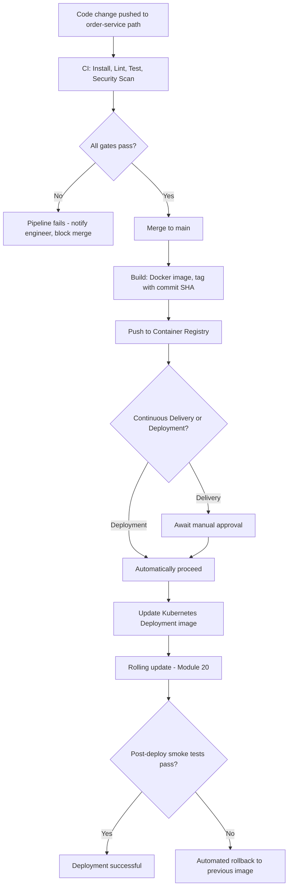
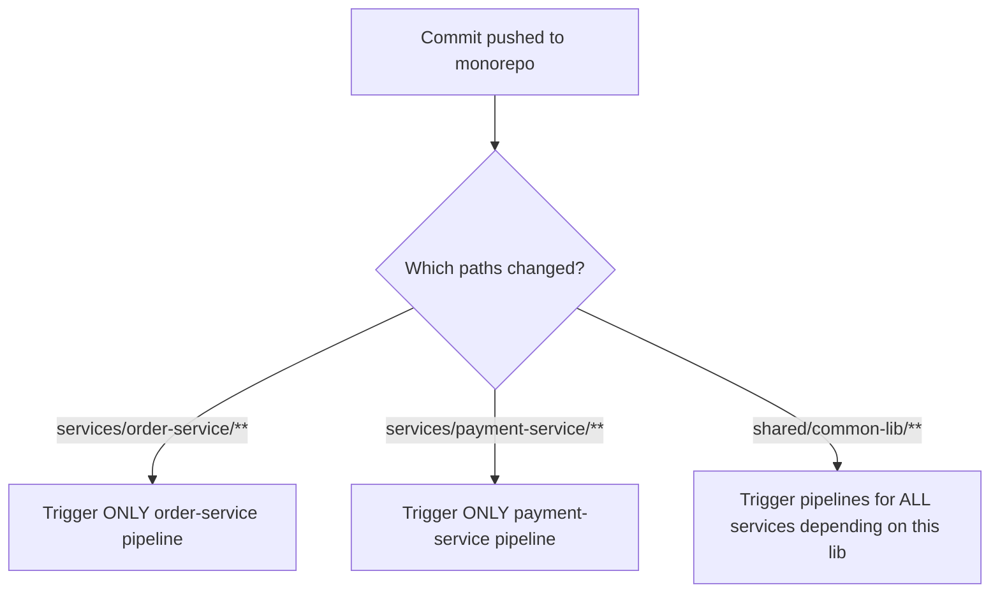
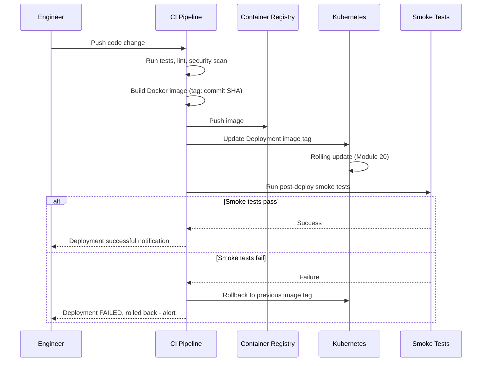

# Module 26 — CI/CD for Microservices

> **Microservices Masterclass** | Level: Advanced | Track: Node.js Backend Engineering
> Prerequisite: Module 1–25 (especially Module 19 — Dockerizing Microservices, Module 20 — Kubernetes)
> Next Module: Module 27 — Production Architecture

---

## Table of Contents

1. [Introduction](#1-introduction)
2. [Learning Objectives](#2-learning-objectives)
3. [Problem Statement](#3-problem-statement)
4. [Why This Concept Exists](#4-why-this-concept-exists)
5. [Historical Background](#5-historical-background)
6. [Real-World Analogy](#6-real-world-analogy)
7. [Technical Definition](#7-technical-definition)
8. [Core Terminology](#8-core-terminology)
9. [Internal Working](#9-internal-working)
10. [Step-by-Step Request Flow](#10-step-by-step-request-flow)
11. [Architecture Overview](#11-architecture-overview)
12. [ASCII Diagrams](#12-ascii-diagrams)
13. [Mermaid Flowcharts](#13-mermaid-flowcharts)
14. [Mermaid Sequence Diagrams](#14-mermaid-sequence-diagrams)
15. [Component Diagrams](#15-component-diagrams)
16. [Deployment Diagrams](#16-deployment-diagrams)
17. [Database Interaction](#17-database-interaction)
18. [Failure Scenarios](#18-failure-scenarios)
19. [Scalability Discussion](#19-scalability-discussion)
20. [High Availability Considerations](#20-high-availability-considerations)
21. [CAP Theorem Implications](#21-cap-theorem-implications)
22. [Node.js Implementation](#22-nodejs-implementation)
23. [Express.js Examples](#23-expressjs-examples)
24. [Docker Examples](#24-docker-examples)
25. [Kafka/Redis Integration](#25-kafkaredis-integration)
26. [Error Handling](#26-error-handling)
27. [Logging & Monitoring](#27-logging--monitoring)
28. [Security Considerations](#28-security-considerations)
29. [Performance Optimization](#29-performance-optimization)
30. [Production Best Practices](#30-production-best-practices)
31. [Anti-Patterns and Common Mistakes](#31-anti-patterns-and-common-mistakes)
32. [Debugging Tips](#32-debugging-tips)
33. [Interview Questions](#33-interview-questions)
34. [Scenario-Based Questions](#34-scenario-based-questions)
35. [Hands-on Exercises](#35-hands-on-exercises)
36. [Mini Project](#36-mini-project)
37. [Advanced Project](#37-advanced-project)
38. [Summary](#38-summary)
39. [Revision Notes](#39-revision-notes)
40. [One-Page Cheat Sheet](#40-one-page-cheat-sheet)

---

## 1. Introduction

Every module so far has focused on building and running services correctly. This module addresses the process that gets your code from a developer's local commit into production, safely and repeatedly: **CI/CD** (Continuous Integration / Continuous Delivery/Deployment). Modules 2 and 5 emphasized independent deployability as one of microservices' core benefits — but that benefit is only realized if each service actually **has** its own automated pipeline, capable of building, testing, and deploying it independently, without needing to coordinate with every other service's release schedule.

This module shows you how to build exactly that: a per-service CI/CD pipeline using GitHub Actions (with notes on Jenkins as an alternative), covering automated testing, building and pushing Docker images to a registry, and deploying to Kubernetes — turning "independent deployability" from an architectural aspiration into an actual, repeatable, automated process any engineer on the team can trigger with confidence.

---

## 2. Learning Objectives

By the end of this module, you will be able to:

- Explain Continuous Integration, Continuous Delivery, and Continuous Deployment, and the distinctions between them.
- Design a per-service CI/CD pipeline for a Node.js microservice, from commit to production.
- Implement automated testing, linting, and security scanning as pipeline gates.
- Build, tag, and push Docker images to a container registry as part of an automated pipeline.
- Automate Kubernetes deployment from a CI/CD pipeline, including safe rollout strategies.
- Recognize CI/CD anti-patterns specific to microservices, including shared pipelines that recreate deployment coupling.

---

## 3. Problem Statement

A team has 10 microservices, but a **single, shared** Jenkins pipeline builds, tests, and deploys **all of them together** whenever any one service's code changes. This recreates exactly the deployment-coupling problem microservices were meant to solve (Module 2):

- A tiny, low-risk change to `notification-service`'s email template triggers a full pipeline run that also rebuilds, retests, and redeploys `payment-service` and `order-service` — services that didn't change at all, adding unnecessary risk and wait time to a trivial change.
- If `inventory-service`'s test suite is flaky and occasionally fails for unrelated reasons, it blocks `payment-service`'s otherwise-ready, urgent hotfix from deploying, since they share the same pipeline run.
- There's no way for the Payment team to deploy their own service on their own schedule, independent of what the Inventory team is doing — recreating the exact cross-team coordination bottleneck Module 2 warned against.

This module solves this directly: each microservice gets its **own**, independent CI/CD pipeline, triggered only by changes to that specific service's own code, deployable on its own team's schedule — genuinely realizing the independent deployability promised since Module 1.

---

## 4. Why This Concept Exists

CI/CD exists because **manual building, testing, and deployment is slow, error-prone, and inconsistent — and at microservices scale, with potentially dozens of independently-changing services, manual processes simply cannot keep pace.** Continuous Integration exists specifically to catch integration problems **early and often** (by automatically building and testing every single code change, rather than only occasionally, when problems are harder and more expensive to diagnose). Continuous Delivery/Deployment exists to make releasing software a **routine, low-risk, repeatable** event rather than a rare, high-stakes, manually-orchestrated one — directly enabling the frequent, independent, low-risk deployments that are one of microservices' central promised benefits.

---

## 5. Historical Background

- **1990s–2000s** — Software releases were often infrequent, manually-tested, high-ceremony events ("release day") — a natural fit for monolithic systems where any change required extensive, coordinated manual regression testing across the entire application.
- **2000** — **Kent Beck** and others in the Extreme Programming community popularized **Continuous Integration** as a core practice: integrating and testing code changes frequently (multiple times a day) rather than in large, risky, infrequent batches.
- **2010** — Jez Humble and David Farley published **"Continuous Delivery"**, extending CI's principles all the way through to production release, establishing the now-standard distinction between "delivery" (code is always in a deployable state, but a human decides when to actually release) and "deployment" (every passing change is automatically released, with no manual approval gate).
- **2010s** — As Docker (Module 19) and Kubernetes (Module 20) matured, CI/CD pipelines increasingly incorporated **building and pushing container images** and **automated Kubernetes deployment** as standard pipeline stages, directly connecting CI/CD to the containerized, orchestrated deployment model this masterclass has built up since Module 19.
- **2018** — **GitHub Actions** launched, providing tightly-integrated, YAML-configured CI/CD directly within GitHub, rapidly becoming one of the most widely-adopted CI/CD platforms alongside established tools like **Jenkins** (open-source, self-hosted, highly extensible via plugins, and widely used since the mid-2000s under its earlier name, Hudson).

---

## 6. Real-World Analogy

**Analogy: An Assembly Line With Automated Quality Checkpoints**

Imagine a car factory where, historically, cars were built by hand, and quality inspection happened only once, at the very end of the entire build process — meaning a defect introduced early (say, in the engine assembly stage) might not be discovered until the finished car reaches final inspection, by which point significant additional work has already been built on top of the flawed component, making the defect far more expensive and disruptive to fix.

A modern automated assembly line instead has **checkpoints at every stage**: as soon as the engine is installed, an automated sensor immediately verifies it's correctly seated and functioning **before** the car moves to the next station. If a defect is detected, the line stops **right there**, at the earliest possible point, when the fix is cheapest and simplest. **CI/CD pipelines work identically for software**: every code change is immediately built, tested, and validated at multiple checkpoints (unit tests, linting, security scanning) **before** it's ever allowed to proceed toward production — catching problems at the earliest, cheapest possible point, rather than discovering them much later, in production, when the cost and disruption of fixing them is far higher.

---

## 7. Technical Definition

> **Continuous Integration (CI)** is the practice of automatically building and testing every code change (typically on every commit or pull request), ensuring integration problems are caught immediately, rather than accumulating unnoticed until a later, more disruptive discovery.

> **Continuous Delivery (CD)** extends CI by ensuring every change that passes automated testing is automatically prepared into a deployable artifact (e.g., a built and tagged Docker image), kept in a state ready for release at any time — but the actual production release still requires an explicit, typically manual, trigger/approval.

> **Continuous Deployment** goes one step further than Continuous Delivery: every change that passes all automated checks is **automatically released to production**, with no manual approval gate at all.

> A **CI/CD Pipeline** is the automated sequence of stages (build, test, scan, package, deploy) a code change passes through, typically defined as configuration (YAML) and executed by a CI/CD platform (GitHub Actions, Jenkins, GitLab CI, and others).

---

## 8. Core Terminology

| Term | Meaning |
|---|---|
| **Continuous Integration (CI)** | Automatically building and testing every code change |
| **Continuous Delivery (CD)** | Every passing change is automatically packaged as deployable, release requires manual trigger |
| **Continuous Deployment** | Every passing change is automatically released to production, no manual gate |
| **Pipeline** | The automated sequence of build/test/deploy stages a change passes through |
| **Pipeline Gate** | A required check (tests passing, security scan clean) that must succeed before proceeding |
| **Container Registry** | A storage/distribution system for Docker images (e.g., Docker Hub, AWS ECR, GitHub Container Registry) |
| **Artifact** | The built, deployable output of a pipeline (e.g., a tagged Docker image) |
| **Canary Deployment** | Gradually rolling out a change to a small subset of traffic/instances before a full rollout |
| **Blue-Green Deployment** | Running two complete environments (old and new), switching traffic entirely once the new one is verified |
| **Monorepo vs Polyrepo** | Storing all services in one repository vs. each service in its own separate repository |

---

## 9. Internal Working

Here's how a per-service CI/CD pipeline works end-to-end:

1. An engineer pushes a commit (or opens a pull request) to `order-service`'s repository (or the `order-service` directory within a monorepo, with **path-based triggering** ensuring only relevant changes trigger this specific pipeline).
2. The CI/CD platform (GitHub Actions) automatically triggers `order-service`'s pipeline — **and only this pipeline**, not pipelines for unrelated services, directly solving Section 3's coupling problem.
3. The pipeline's **CI stage** runs: install dependencies, run linting, run unit tests, run integration tests — each acting as a **gate**; if any fails, the pipeline stops immediately, and the engineer is notified.
4. If CI passes, the pipeline's **build stage** builds a Docker image (Module 19's multi-stage build) and tags it with a unique, immutable identifier (typically the Git commit SHA), then **pushes** this image to a container registry.
5. Depending on whether the team practices Continuous Delivery or Continuous Deployment, the pipeline either **stops here**, awaiting a manual trigger to deploy this now-ready artifact, or **automatically proceeds** to the deployment stage.
6. The **deployment stage** updates the Kubernetes Deployment (Module 20) with the new image tag, triggering a rolling update — Kubernetes handles the actual zero-downtime rollout mechanics, while the pipeline is responsible for triggering this update correctly and safely (e.g., via `kubectl set image` or a GitOps-style manifest update).
7. Post-deployment, automated **smoke tests** or health checks may verify the newly-deployed version is functioning correctly, with an automated **rollback** triggered if these checks fail.

---

## 10. Step-by-Step Request Flow

**Scenario: A code change to order-service flows through CI/CD to production.**

```
Step 1:  Engineer opens a pull request with a code change to
         order-service (in a monorepo, ONLY files under
         /services/order-service/** trigger this pipeline)

Step 2:  GitHub Actions triggers order-service's CI workflow:
           - Install dependencies (npm ci)
           - Run ESLint (code quality gate)
           - Run unit tests (Jest/Vitest)
           - Run integration tests (against a test database)
           - Run a security/dependency scan (npm audit / Snyk)

Step 3:  ALL gates pass -> pull request is marked as ready to merge

Step 4:  Engineer merges the pull request to main

Step 5:  A SEPARATE workflow triggers on merge to main:
           - Build the Docker image (multi-stage, Module 19)
           - Tag it with the Git commit SHA (immutable, traceable)
           - Push the image to the container registry (e.g., GHCR)

Step 6:  (Continuous Delivery) The pipeline STOPS here, and a
         team member manually triggers the deployment via a
         button click / approval step in the CI/CD platform

         OR

         (Continuous Deployment) The pipeline AUTOMATICALLY
         proceeds to Step 7 with no manual gate

Step 7:  Deployment stage updates the Kubernetes Deployment's
         image tag to the new commit SHA, triggering a rolling
         update (Module 20) - zero downtime, gradual replacement

Step 8:  Post-deployment smoke tests verify the new version is
         healthy; if they fail, an automated ROLLBACK reverts
         to the previous, known-good image tag
```

---

## 11. Architecture Overview

```
   Git Push / PR
   (order-service/** changes ONLY)
         │
         ▼
   CI Workflow (GitHub Actions)
   - Install, Lint, Test, Security Scan
         │
     ALL PASS
         │
         ▼
   Build Workflow
   - Docker build (multi-stage) -> tag with commit SHA
   - Push to Container Registry
         │
         ▼
   Deployment Workflow
   - kubectl set image (or GitOps manifest update)
   - Kubernetes performs rolling update (Module 20)
         │
         ▼
   Post-Deploy Smoke Tests
   - Health check verification
         │
    ┌────┴────┐
    ▼         ▼
  PASS      FAIL
  (done)  (auto-rollback
           to previous image)
```

---

## 12. ASCII Diagrams

### 12.1 Shared Pipeline (Anti-Pattern) vs Per-Service Pipeline

```
SHARED PIPELINE (anti-pattern - recreates coupling):

  ANY change to ANY service
         │
         ▼
  ONE pipeline builds/tests/deploys ALL 10 services TOGETHER
         │
  A flaky test in service #7 blocks service #3's urgent hotfix


PER-SERVICE PIPELINE (correct):

  order-service change   -> order-service PIPELINE ONLY
  payment-service change -> payment-service PIPELINE ONLY

  EACH service deploys INDEPENDENTLY, on ITS OWN schedule,
  UNAFFECTED by other services' pipeline status
```

### 12.2 Continuous Delivery vs Continuous Deployment

```
CONTINUOUS DELIVERY:

  Code change -> CI passes -> Build artifact -> READY for release
                                                       │
                                            [MANUAL APPROVAL]
                                                       │
                                                       ▼
                                                  Deployed


CONTINUOUS DEPLOYMENT:

  Code change -> CI passes -> Build artifact -> AUTOMATICALLY deployed
                                                  (NO manual gate)
```

### 12.3 Rolling Deployment Triggered by CI/CD

```
  CI/CD pipeline updates Deployment's image tag:
  order-service: v1.2 (SHA: abc123) -> v1.3 (SHA: def456)
                        │
                        ▼
          Kubernetes performs the ROLLING UPDATE
          (exactly as detailed in Module 20) -
          CI/CD's job was simply to trigger this
          update correctly; Kubernetes handles the
          actual zero-downtime mechanics
```

---

## 13. Mermaid Flowcharts

### 13.1 Full Per-Service Pipeline



### 13.2 Path-Based Pipeline Triggering (Monorepo)



---

## 14. Mermaid Sequence Diagrams

### 14.1 Full CI/CD Flow With Automated Rollback



---

## 15. Component Diagrams

```
┌─────────────────────────────────────────────────────────┐
│                 order-service CI/CD Pipeline                  │
│  ┌───────────────┐ ┌───────────────┐ ┌───────────────┐      │
│  │ CI Stage            │ │ Build Stage         │ │ Deploy Stage       │      │
│  │ - Lint                │ │ - Docker build        │ │ - kubectl apply /    │      │
│  │ - Unit tests           │ │ - Tag w/ commit SHA    │ │   GitOps manifest     │      │
│  │ - Integration tests     │ │ - Push to registry      │ │   update               │      │
│  │ - Security scan          │ │                          │ │ - Smoke tests           │      │
│  └───────────────┘ └───────────────┘ └───────────────┘      │
└─────────────────────────────────────────────────────────┘
```

---

## 16. Deployment Diagrams

```
┌───────────────────────────────────────────────────────────┐
│  GitHub Actions Runner                                        │
│    │                                                          │
│    ├─▶ Container Registry (GHCR / ECR / Docker Hub)             │
│    │      (stores tagged, versioned images)                      │
│    │                                                          │
│    └─▶ Kubernetes Cluster (production)                          │
│           order-service Deployment - image tag UPDATED             │
│           by the pipeline, triggering Module 20's rolling            │
│           update mechanics                                            │
└───────────────────────────────────────────────────────────┘
```

---

## 17. Database Interaction

CI/CD pipelines commonly need to run database migrations as part of deployment — a step requiring careful sequencing to avoid breaking a running service mid-deployment:

```
DEPLOYMENT SEQUENCING for a schema change:

  Step 1: Deploy a BACKWARD-COMPATIBLE migration (e.g., add a
          new NULLABLE column) - OLD code and NEW code can
          BOTH work correctly against this schema

  Step 2: Deploy the NEW application code (which starts using
          the new column) - via the normal rolling update

  Step 3: (Later, once fully rolled out) Deploy a FOLLOW-UP
          migration to clean up (e.g., make the column
          NOT NULL, drop an old column) - only safe AFTER
          Step 2 is fully complete

  This "expand and contract" pattern avoids a moment where
  OLD code (still running during a rolling update) breaks
  against a schema change designed only for the NEW code
```

---

## 18. Failure Scenarios

| Scenario | CI/CD Handling |
|---|---|
| Tests fail on a pull request | The pipeline blocks merging, preventing broken code from reaching `main` — the earliest, cheapest point to catch a problem |
| A deployment introduces a bug not caught by tests | Post-deployment smoke tests (Section 9/14) detect the issue and trigger an automated rollback to the previous, known-good image |
| The container registry is temporarily unavailable | The build/push stage fails; the pipeline should retry with backoff (Module 18's principles) or fail clearly, blocking deployment until resolved |
| A database migration fails mid-deployment | Requires careful migration design (Section 17's expand/contract pattern) and a clear rollback plan for the migration itself, not just the application code |

```
Automated rollback in action:

  New order-service version deployed (v1.3)
           │
           ▼
  Post-deploy smoke test: GET /health -> expects 200
           │
           ▼
  Smoke test FAILS (v1.3 has a startup bug)
           │
           ▼
  Pipeline AUTOMATICALLY reverts the Kubernetes Deployment's
  image tag back to v1.2 (the last known-good version)
           │
           ▼
  Customer impact MINIMIZED - the bad version was live for
  only the brief window between rollout and smoke test failure,
  not indefinitely until a human noticed and manually intervened
```

---

## 19. Scalability Discussion

Per-service CI/CD pipelines scale naturally with the number of services in your system — each pipeline is independent, so adding an 11th service simply means adding an 11th independent pipeline, with no impact on the other 10's build/deploy speed or reliability. This is a direct contrast to the shared-pipeline anti-pattern (Section 12.1), where pipeline run time and flakiness risk grow with the **total** number of services, regardless of which one actually changed.

---

## 20. High Availability Considerations

- CI/CD pipeline infrastructure itself (GitHub Actions runners, Jenkins masters/agents) should have appropriate redundancy for organizations where deployment velocity is business-critical — though a temporary CI/CD outage, unlike an application outage, "only" blocks new deployments rather than affecting already-running production traffic.
- Automated rollback (Section 18) is itself a high-availability mechanism — minimizing the duration of impact from a bad deployment by detecting and reverting it automatically, rather than waiting for manual detection and intervention.
- Canary deployments (gradually shifting a small percentage of traffic to a new version before a full rollout) further reduce the blast radius of a bad deployment, catching issues while only a small fraction of users are affected.

---

## 21. CAP Theorem Implications

CI/CD pipelines themselves don't directly make CAP theorem trade-offs (they orchestrate deployment processes, not live application data), but the **deployment strategies** they enable directly interact with availability considerations discussed throughout this masterclass: rolling updates (Module 20) and canary deployments both prioritize maintaining availability throughout a deployment, accepting a brief period where old and new versions run simultaneously (a form of "version inconsistency" analogous to eventual consistency) rather than an all-at-once cutover that would risk a availability-impacting failure if the new version has an undiscovered issue.

---

## 22. Node.js Implementation

While CI/CD pipelines are primarily YAML configuration (not application code), your Node.js project needs to be structured to support automated testing and building effectively.

**`package.json`** scripts supporting the pipeline
```json
{
  "scripts": {
    "lint": "eslint src/",
    "test:unit": "jest --testPathPattern=unit",
    "test:integration": "jest --testPathPattern=integration",
    "build": "echo 'No build step for plain JS' && exit 0",
    "start": "node src/app.js"
  }
}
```

**`tests/unit/orderValidation.test.js`** — a simple unit test the CI pipeline will run
```javascript
import { describe, it, expect } from "vitest";
import { validateOrderPayload } from "../../src/validation/orderValidation.js";

describe("validateOrderPayload", () => {
  it("rejects an order with no line items", () => {
    const result = validateOrderPayload({ customerId: "42", items: [] });
    expect(result.valid).toBe(false);
  });

  it("accepts a valid order payload", () => {
    const result = validateOrderPayload({
      customerId: "42",
      items: [{ productId: "abc", quantity: 1 }],
    });
    expect(result.valid).toBe(true);
  });
});
```

---

## 23. Express.js Examples

**A smoke test script**, run by the pipeline immediately after deployment (Section 9's Step 8):

```javascript
// scripts/smoke-test.js - run AFTER deployment, against the LIVE,
// just-deployed service, to catch issues before declaring success
import axios from "axios";

const BASE_URL = process.env.SMOKE_TEST_URL || "http://order-service:4002";

async function runSmokeTests() {
  try {
    const health = await axios.get(`${BASE_URL}/health/ready`, { timeout: 5000 });
    if (health.status !== 200) throw new Error(`Unexpected status: ${health.status}`);

    const testOrder = await axios.post(`${BASE_URL}/orders`, {
      customerId: "smoke-test-customer",
      items: [{ productId: "smoke-test-product", quantity: 1 }],
    });
    if (testOrder.status !== 201) throw new Error(`Order creation failed: ${testOrder.status}`);

    console.log("✅ Smoke tests PASSED");
    process.exit(0);
  } catch (err) {
    console.error("❌ Smoke tests FAILED:", err.message);
    process.exit(1); // non-zero exit code signals FAILURE to the pipeline
  }
}

runSmokeTests();
```

---

## 24. Docker Examples

**`.github/workflows/order-service-ci.yml`** — the CI workflow (build + test), triggered ONLY by changes to `order-service`

```yaml
name: order-service CI

on:
  pull_request:
    paths:
      - "services/order-service/**"   # PATH-BASED triggering (Section 12.2)

jobs:
  test:
    runs-on: ubuntu-latest
    defaults:
      run:
        working-directory: services/order-service
    steps:
      - uses: actions/checkout@v4
      - uses: actions/setup-node@v4
        with:
          node-version: "20"
          cache: "npm"
      - run: npm ci
      - run: npm run lint
      - run: npm run test:unit
      - run: npm run test:integration
      - run: npm audit --audit-level=high   # security scan gate (Module 25)
```

**`.github/workflows/order-service-deploy.yml`** — the build + deploy workflow, triggered on merge to `main`

```yaml
name: order-service Deploy

on:
  push:
    branches: [main]
    paths:
      - "services/order-service/**"

jobs:
  build-and-push:
    runs-on: ubuntu-latest
    outputs:
      image_tag: ${{ steps.meta.outputs.tag }}
    steps:
      - uses: actions/checkout@v4
      - id: meta
        run: echo "tag=${{ github.sha }}" >> "$GITHUB_OUTPUT"
      - uses: docker/setup-buildx-action@v3
      - uses: docker/login-action@v3
        with:
          registry: ghcr.io
          username: ${{ github.actor }}
          password: ${{ secrets.GITHUB_TOKEN }}
      - uses: docker/build-push-action@v5
        with:
          context: services/order-service
          push: true
          tags: ghcr.io/mycompany/order-service:${{ github.sha }}

  deploy:
    needs: build-and-push
    runs-on: ubuntu-latest
    environment: production   # can require MANUAL APPROVAL here (Continuous Delivery)
    steps:
      - uses: azure/setup-kubectl@v3
      - run: |
          kubectl set image deployment/order-service \
            order-service=ghcr.io/mycompany/order-service:${{ github.sha }} \
            -n production
      - name: Run smoke tests
        run: node scripts/smoke-test.js
      - name: Rollback on failure
        if: failure()
        run: kubectl rollout undo deployment/order-service -n production
```

---

## 25. Kafka/Redis Integration

Integration tests within the CI pipeline commonly spin up **ephemeral** Kafka/Redis/database instances (using Docker Compose or the CI platform's service containers) specifically for the test run, ensuring tests run against a realistic environment without depending on shared, potentially-flaky external test infrastructure:

```yaml
# Excerpt from a GitHub Actions workflow using service containers for integration tests
jobs:
  integration-test:
    runs-on: ubuntu-latest
    services:
      kafka:
        image: bitnami/kafka:latest
        ports: ["9092:9092"]
      redis:
        image: redis:7-alpine
        ports: ["6379:6379"]
    steps:
      - uses: actions/checkout@v4
      - run: npm ci
      - run: npm run test:integration
        env:
          KAFKA_BROKER: localhost:9092
          REDIS_URL: redis://localhost:6379
```

---

## 26. Error Handling

Pipelines should fail **clearly and immediately** at the first failing gate, with actionable error output — a pipeline that fails silently or with an unclear error wastes engineering time diagnosing the pipeline itself rather than the actual code issue:

```yaml
- name: Run tests
  run: npm run test:unit
  # If this step fails, GitHub Actions automatically stops the
  # workflow and clearly marks this step as failed in the UI,
  # with the full test output visible for debugging
```

For deployment steps specifically, always pair a deploy action with an explicit rollback path (Section 24's `if: failure()` step) rather than leaving a failed deployment in an ambiguous, half-updated state.

---

## 27. Logging & Monitoring

- Every pipeline run should be **auditable** — who triggered it, what commit, what the outcome was — most CI/CD platforms provide this natively, but ensure it's actually being reviewed periodically, not just recorded.
- Monitor **pipeline success/failure rates and duration** over time as an engineering health metric — a rising failure rate or growing pipeline duration for a specific service can indicate accumulating technical debt (flaky tests, slow builds) worth addressing.
- Integrate deployment events into your observability stack (Module 21) — annotating metrics dashboards with deployment markers helps quickly correlate a metrics anomaly with a recent deployment.

---

## 28. Security Considerations

- Never hardcode secrets (registry credentials, Kubernetes cluster access tokens) directly in pipeline YAML — use your CI/CD platform's secrets management (GitHub Actions Secrets, Jenkins Credentials) exactly as Module 12 established for application secrets.
- Include automated **dependency vulnerability scanning** (`npm audit`, Snyk, Dependabot) as a standard pipeline gate, directly addressing Module 25's emphasis on patching known vulnerabilities promptly.
- Restrict who can approve production deployments (for Continuous Delivery's manual gate) and who has access to modify pipeline configurations themselves, since a compromised pipeline configuration is a significant, high-leverage attack vector.
- Scan built container images for known vulnerabilities (e.g., Trivy) as a pipeline gate before allowing a push to the registry or a deployment to proceed.

---

## 29. Performance Optimization

- Use **dependency caching** (as shown in Section 24's `cache: "npm"`) to avoid reinstalling unchanged dependencies on every single pipeline run, significantly speeding up build times.
- Run independent test suites (unit vs. integration) in **parallel** where your CI platform supports it, reducing overall pipeline duration.
- Leverage Docker layer caching (Module 19) within your CI/CD build stage too, not just locally — most CI platforms support registry-based or platform-native layer caching for Docker builds.

---

## 30. Production Best Practices

- Give every microservice its **own, independent** CI/CD pipeline, triggered only by changes to that service's own code — this is the single most important practice for genuinely realizing microservices' independent deployability benefit.
- Treat pipeline configuration as code: version-controlled, reviewed via pull request, just like application code.
- Always include automated tests, linting, and security scanning as non-negotiable pipeline gates before any deployment.
- Implement automated smoke tests and rollback for every deployment — never rely on a human noticing a bad deployment before customers do.
- Choose Continuous Delivery (manual release gate) versus full Continuous Deployment (fully automatic) deliberately, based on your team's testing maturity and risk tolerance — Continuous Deployment requires very high confidence in your automated test coverage.

---

## 31. Anti-Patterns and Common Mistakes

| Anti-Pattern | Why It's a Problem |
|---|---|
| **A single, shared pipeline for all microservices** | Recreates deployment coupling — one service's unrelated failure blocks another's release |
| **No automated tests as pipeline gates** | Allows broken code to reach production, defeating CI's core purpose |
| **Deploying without post-deployment smoke tests** | A bad deployment can go undetected until a customer or a slower-to-fire alert notices |
| **Hardcoded secrets in pipeline configuration** | A significant, easily-avoidable security risk (Module 25's principles apply directly here) |
| **No automated rollback mechanism** | Extends the duration of customer impact from a bad deployment, relying on slow manual intervention |

```
Shared pipeline (anti-pattern, restated):

  git push (ANY of 10 services) -> ONE pipeline builds/tests/
  deploys ALL 10 services together

  Problem: this is EXACTLY the deployment coupling Module 2
  identified as a core monolith problem microservices are
  supposed to solve - a shared PIPELINE recreates this coupling
  at the DEPLOYMENT PROCESS level, even if the services
  themselves are architecturally well-separated
```

---

## 32. Debugging Tips

- When a pipeline fails, check the **first** failing step, not the overall failure message — later steps often fail as a consequence of an earlier, root-cause failure.
- If a pipeline is flaky (intermittently failing without a code change), suspect either a genuinely flaky test (needs fixing) or a resource/timing issue in the CI environment itself (e.g., a service container not being fully ready before tests run against it).
- If a deployment succeeds in the pipeline but the application seems broken, verify the smoke tests are actually testing meaningful functionality, not just a trivial "the process started" check.
- Review pipeline run history for a specific service to spot trends (increasing duration, increasing flakiness) that indicate a growing maintenance need before they become a significant blocker.

---

## 33. Interview Questions

### Easy
1. What is Continuous Integration, and what problem does it solve?
2. What is the difference between Continuous Delivery and Continuous Deployment?
3. What is a pipeline gate, and give an example.
4. Why should each microservice have its own independent CI/CD pipeline?
5. What is a smoke test, and when does it run in a deployment pipeline?

### Medium
6. Explain how path-based triggering in a monorepo prevents unrelated services from being rebuilt/redeployed unnecessarily.
7. Why is automated rollback an important pipeline capability, and how would you trigger it?
8. What security practices should be included as pipeline gates?
9. Explain the "expand and contract" pattern for safely deploying database schema changes via CI/CD.
10. Why is dependency caching important for pipeline performance?

### Hard
11. Design a complete, per-service CI/CD pipeline for a Node.js microservice, from pull request to production deployment with automated rollback.
12. How would you migrate a team from a single, shared CI/CD pipeline for 10 microservices to independent, per-service pipelines, incrementally and safely?
13. Discuss the trade-offs of Continuous Delivery (manual release gate) versus full Continuous Deployment for a team with varying levels of automated test coverage confidence.
14. Design a canary deployment strategy integrated into a CI/CD pipeline, including how you'd automatically decide whether to proceed to a full rollout or roll back.
15. How would you design CI/CD pipeline security to prevent a compromised pipeline configuration from becoming a significant attack vector into production systems?

---

## 34. Scenario-Based Questions

1. Your team's single, shared CI/CD pipeline for all 8 microservices has become a major bottleneck — any one service's flaky test blocks everyone's deployments. How would you migrate to independent pipelines?
2. A recent deployment introduced a bug that wasn't caught by smoke tests and went unnoticed for 3 hours before a customer reported it. How would you improve your smoke test and monitoring strategy?
3. Leadership wants to move from Continuous Delivery (manual approval) to full Continuous Deployment for a specific, well-tested service. What would you verify is in place before recommending this?
4. Your team discovers a container registry credential was hardcoded in a pipeline YAML file, now visible in Git history. What's your remediation plan?
5. A database migration deployed via your CI/CD pipeline caused a brief outage because old application code (still running during the rolling update) was incompatible with the new schema. How would you redesign your migration deployment process?

---

## 35. Hands-on Exercises

1. Write a GitHub Actions CI workflow for a simple Node.js service, including linting, unit tests, and a security audit gate, triggered only on changes to a specific service's directory.
2. Extend this into a build-and-deploy workflow: build a Docker image, tag it with the commit SHA, and push it to a container registry.
3. Write a smoke test script (Section 23) and integrate it as a post-deployment pipeline step, including an automated rollback step triggered on smoke test failure.
4. Design (on paper) a path-based triggering configuration for a monorepo containing 5 microservices, ensuring each has its own independent pipeline.
5. Write an "expand and contract" migration plan (Section 17) for a hypothetical schema change, specifying the exact sequence of deployments required.

---

## 36. Mini Project

**Build: A Complete Per-Service CI/CD Pipeline**

1. Build a simple Express service with unit tests, a linter configuration, and a Dockerfile (Module 19's multi-stage pattern).
2. Write a GitHub Actions CI workflow running lint, unit tests, and a security audit on every pull request.
3. Write a build-and-deploy workflow triggered on merge to `main`, building and pushing a tagged Docker image to a registry (e.g., GitHub Container Registry).
4. Add a manual approval gate (Continuous Delivery style) before the deployment step actually runs.

---

## 37. Advanced Project

**Build: A Full Pipeline With Automated Deployment, Smoke Tests, and Rollback**

1. Extend the Mini Project with an automated Kubernetes deployment step (`kubectl set image`) targeting a local or test cluster.
2. Implement the smoke test script from Section 23, run automatically after deployment.
3. Implement automated rollback (`kubectl rollout undo`) triggered specifically on smoke test failure.
4. Intentionally deploy a broken version (e.g., a version that fails its health check) and verify the pipeline correctly detects this via smoke tests and automatically rolls back.
5. Write a CI/CD architecture document for a hypothetical 10-service system, specifying: repository structure (monorepo vs. polyrepo) and justification, per-service pipeline triggering strategy, chosen deployment strategy (Continuous Delivery vs. Deployment) per service tier (critical vs. non-critical), and rollback strategy.

---

## 38. Summary

- CI/CD automates the build, test, and deployment process, catching problems early (CI) and making releases routine, low-risk, and repeatable (CD).
- Each microservice must have its own independent pipeline, triggered only by changes to that specific service, to genuinely realize the independent deployability benefit promised since Module 1 — a shared pipeline recreates deployment coupling.
- Pipelines should include automated tests, linting, and security scanning as non-negotiable gates, plus automated smoke testing and rollback after deployment.
- Continuous Delivery (manual release gate) and Continuous Deployment (fully automatic) represent different points on a spectrum of automation and risk tolerance, chosen deliberately based on testing maturity and business context.
- Database schema changes require careful "expand and contract" sequencing to remain compatible with both old and new application code during a rolling deployment.

---

## 39. Revision Notes

- CI: automatically build/test every change. CD (Delivery): auto-package, manual release gate. CD (Deployment): fully automatic release.
- Each microservice needs its OWN independent pipeline — shared pipelines recreate deployment coupling.
- Pipeline gates: lint, unit tests, integration tests, security scan — all before merge/deploy.
- Post-deployment smoke tests + automated rollback minimize the impact of a bad deployment.
- "Expand and contract": deploy backward-compatible schema changes BEFORE the code that depends on them.
- Never hardcode secrets in pipeline configuration — use the CI/CD platform's secrets management.

---

## 40. One-Page Cheat Sheet

```
CI:                    auto build/test EVERY change - catch problems early
CD (DELIVERY):          auto-package, MANUAL release gate
CD (DEPLOYMENT):         fully automatic release, NO manual gate
PIPELINE GATE:           lint, test, security scan - must PASS to proceed
SMOKE TEST:              post-deploy check verifying the new version works
AUTOMATED ROLLBACK:      auto-revert to previous image on smoke test failure

GOLDEN RULES:
  - Each microservice gets its OWN independent pipeline - NEVER share one across services
  - Path-based triggering in a monorepo - only rebuild/redeploy what actually changed
  - ALWAYS include automated tests + security scanning as pipeline gates
  - ALWAYS run smoke tests post-deployment, with AUTOMATED rollback on failure
  - NEVER hardcode secrets in pipeline config - use the platform's secrets management
  - Use "expand and contract" for schema changes - never break old code mid-rollout
```

---

**Suggested Next Module:** Module 27 — Production Architecture (building a complete, production-ready e-commerce platform architecture, integrating every pattern covered across this masterclass)
