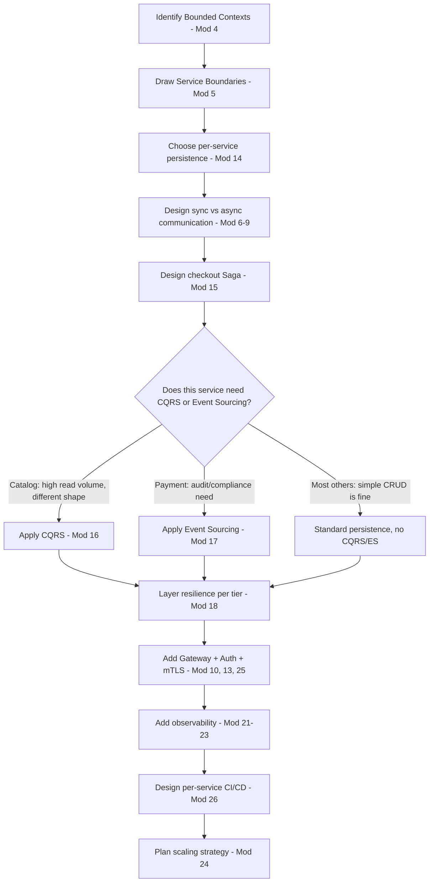
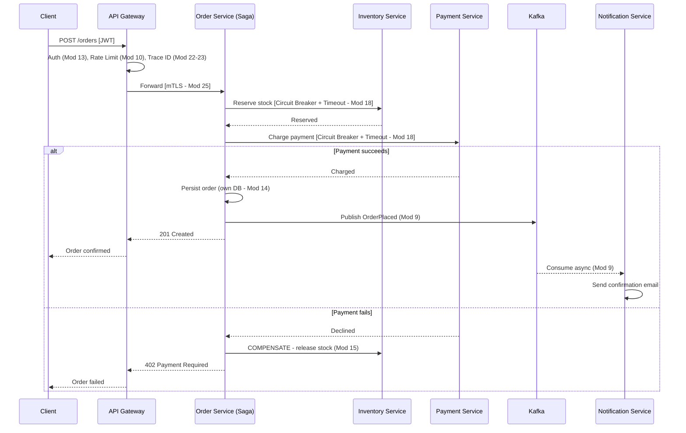

# Module 27 — Production Architecture

> **Microservices Masterclass** | Level: Expert | Track: Node.js Backend Engineering
> Prerequisite: Module 1–26 (this module integrates the entire masterclass)
> Next Module: Module 28 — Real-world Projects

---

## Table of Contents

1. [Introduction](#1-introduction)
2. [Learning Objectives](#2-learning-objectives)
3. [Problem Statement](#3-problem-statement)
4. [Why This Concept Exists](#4-why-this-concept-exists)
5. [Historical Background](#5-historical-background)
6. [Real-World Analogy](#6-real-world-analogy)
7. [Technical Definition](#7-technical-definition)
8. [Core Terminology](#8-core-terminology)
9. [Internal Working](#9-internal-working)
10. [Step-by-Step Request Flow](#10-step-by-step-request-flow)
11. [Architecture Overview](#11-architecture-overview)
12. [ASCII Diagrams](#12-ascii-diagrams)
13. [Mermaid Flowcharts](#13-mermaid-flowcharts)
14. [Mermaid Sequence Diagrams](#14-mermaid-sequence-diagrams)
15. [Component Diagrams](#15-component-diagrams)
16. [Deployment Diagrams](#16-deployment-diagrams)
17. [Database Interaction](#17-database-interaction)
18. [Failure Scenarios](#18-failure-scenarios)
19. [Scalability Discussion](#19-scalability-discussion)
20. [High Availability Considerations](#20-high-availability-considerations)
21. [CAP Theorem Implications](#21-cap-theorem-implications)
22. [Node.js Implementation](#22-nodejs-implementation)
23. [Express.js Examples](#23-expressjs-examples)
24. [Docker Examples](#24-docker-examples)
25. [Kafka/Redis Integration](#25-kafkaredis-integration)
26. [Error Handling](#26-error-handling)
27. [Logging & Monitoring](#27-logging--monitoring)
28. [Security Considerations](#28-security-considerations)
29. [Performance Optimization](#29-performance-optimization)
30. [Production Best Practices](#30-production-best-practices)
31. [Anti-Patterns and Common Mistakes](#31-anti-patterns-and-common-mistakes)
32. [Debugging Tips](#32-debugging-tips)
33. [Interview Questions](#33-interview-questions)
34. [Scenario-Based Questions](#34-scenario-based-questions)
35. [Hands-on Exercises](#35-hands-on-exercises)
36. [Mini Project](#36-mini-project)
37. [Advanced Project](#37-advanced-project)
38. [Summary](#38-summary)
39. [Revision Notes](#39-revision-notes)
40. [One-Page Cheat Sheet](#40-one-page-cheat-sheet)

---

## 1. Introduction

Modules 1 through 26 each went deep on one specific concept — Bounded Contexts, Sagas, CQRS, Kubernetes, Observability, Security, CI/CD — largely in isolation from one another. This module is where they all come together. We're going to design a **complete, production-ready e-commerce platform** from the ground up, making every architectural decision explicitly, and showing exactly which prior module's pattern justifies each choice.

This is the module where "I understand microservices patterns" becomes "I can architect a real system." Real production systems don't apply patterns individually — they combine dozens of them into one coherent whole, where each decision interacts with several others. This module walks through that integration exercise concretely, using a realistic e-commerce platform as the running example, referencing back to the specific module that introduced each technique as we apply it.

---

## 2. Learning Objectives

By the end of this module, you will be able to:

- Design a complete microservices architecture for a realistic e-commerce platform, integrating patterns from across this entire masterclass.
- Justify each architectural decision by referencing the specific problem it solves and the module that introduced it.
- Draw a full, coherent system architecture diagram spanning services, data stores, communication patterns, and infrastructure.
- Identify which patterns apply to which parts of the system, and why (not every service needs every pattern).
- Present and defend a complete architecture in a system design interview setting.
- Recognize how architectural decisions in one area (e.g., data ownership) constrain or enable decisions in another (e.g., consistency strategy).

---

## 3. Problem Statement

You've been asked, in a system design interview (or a real architecture review), to design the backend for **"ShopFast,"** a mid-sized e-commerce platform: customers browse products, place orders, pay, track shipments, and leave reviews; the business needs solid observability, security, and a repeatable deployment process. A candidate who has only memorized individual patterns in isolation will struggle here — the actual skill being tested is **integration**: correctly deciding which of the 26 patterns covered so far apply to which part of this system, and why, while explaining the trade-offs of each choice coherently as one connected design.

This module works through exactly that exercise, end to end, so you have both a template for approaching any similar system design problem and a concrete, complete reference architecture you can adapt.

---

## 4. Why This Concept Exists

This module exists because **microservices mastery isn't measured by knowing individual patterns — it's measured by knowing which patterns to combine, in what proportion, for a specific real system.** Every module in this masterclass deliberately emphasized *when to use* a pattern as much as *how* to use it (Module 5's boundary heuristics, Module 16's "don't apply CQRS everywhere" warning, Module 25's Zero Trust). This module is the culmination of that recurring emphasis: a full, worked example showing that real architecture is about **selective, justified application** of a toolkit, not indiscriminate pattern-stacking.

---

## 5. Historical Background

Real production e-commerce architectures evolved iteratively at companies like Amazon, eBay, Shopify, and Alibaba — each starting as a monolith (Module 2) and incrementally decomposing (Module 5's Strangler Fig) as scale and team size demanded it. Amazon's well-documented internal shift toward service-oriented teams in the early 2000s, and its "two-pizza team" organizational philosophy (directly tied to Conway's Law from Module 5), is one of the most cited real-world precedents for the kind of architecture this module builds. Modern e-commerce reference architectures published by cloud providers (AWS, Google Cloud, Azure) as "well-architected framework" guides similarly integrate the same layered set of concerns — service boundaries, data ownership, resilience, observability, security, deployment — that this module walks through as one coherent design.

---

## 6. Real-World Analogy

**Analogy: Designing a City, Not Just One Building**

Every prior module was like mastering one specific building trade in isolation — plumbing (data), electrical (communication), structural engineering (service boundaries), security systems (Zero Trust), fire safety (resilience patterns). This module is **urban planning**: designing an entire city where all these trades must work together coherently. A city planner doesn't apply "maximum security everywhere" (that would make the city unlivable, just as CQRS everywhere makes a system needlessly complex) or "cheapest plumbing everywhere" (that would make critical buildings unreliable, just as skipping resilience patterns on payment services is dangerous). Good urban planning — like good production architecture — is about applying the **right** trade, at the **right** intensity, in the **right** part of the city, with a coherent overall plan tying it all together.

---

## 7. Technical Definition

> **Production Architecture** is the complete, integrated design of a real system, encompassing service boundaries (Modules 3-5), data ownership and consistency strategy (Modules 14-17), communication patterns (Modules 6-10), resilience and scaling (Modules 18, 24), security (Modules 13, 25), observability (Modules 21-23), and deployment (Modules 19, 20, 26) — where every decision is made deliberately, justified by the specific problem it solves, and consistent with every other decision in the same system.

---

## 8. Core Terminology

This module references terminology from every prior module; the key **integration-specific** terms are:

| Term | Meaning |
|---|---|
| **Reference Architecture** | A complete, worked example system design serving as a template for similar problems |
| **Critical Path** | The sequence of services/operations that must succeed synchronously for a core business operation (e.g., checkout) |
| **Tiered Criticality** | Classifying services by business importance to decide how much resilience/observability investment each deserves |
| **Architecture Decision Record (ADR)** | A documented record of a specific architectural choice, its context, and its justification |
| **System Design Interview** | A common technical interview format testing exactly this module's integration skill |

---

## 9. Internal Working

Here's the systematic process for designing ShopFast's complete architecture, referencing the module that justifies each step:

1. **Identify the domain and Bounded Contexts** (Module 4): Catalog, Inventory, Ordering, Payments, Shipping, Reviews, Notifications, Identity/Auth.
2. **Draw service boundaries** using coupling/cohesion/team-size heuristics (Module 5): each Bounded Context above becomes its own service, since each has genuinely distinct data, distinct scaling needs, and a plausible dedicated team.
3. **Choose data ownership and persistence per service** (Module 14): PostgreSQL for Orders/Payments (need ACID, relational structure); a document store for Product Catalog (flexible, varying attributes); Redis for session/cart state (fast, ephemeral).
4. **Design communication**: synchronous REST/gRPC (Modules 7-8) for the checkout critical path (Payment, Inventory reservation — need immediate answers); asynchronous events via Kafka (Module 9) for everything else (Notifications, Analytics, Shipping preparation).
5. **Design the multi-service checkout transaction** using a Saga (Module 15): reserve inventory → charge payment → confirm order, with compensations (release inventory) if payment fails.
6. **Decide where CQRS/Event Sourcing apply** (Modules 16-17): the Order Catalog read side (product browsing, high read volume, different shape than the write side) benefits from CQRS; full Event Sourcing is justified specifically for Payments (audit/compliance need), not for every service.
7. **Layer in resilience** (Module 18): Bulkhead + Circuit Breaker + Fallback for every cross-service call on the checkout critical path, tuned per dependency's criticality.
8. **Design the infrastructure**: Docker (Module 19) + Kubernetes (Module 20) for all services, with an API Gateway (Module 10) as the single entry point applying auth (Module 13) and rate limiting.
9. **Layer in security**: JWT auth at the Gateway, mTLS + Zero Trust between all internal services (Module 25), least-privilege database credentials.
10. **Layer in observability**: RED metrics (Module 21) + structured logs with trace IDs (Module 22) + distributed tracing (Module 23) for every service, with tiered alerting severity based on service criticality.
11. **Design CI/CD**: independent, per-service pipelines (Module 26), with stricter deployment gates (manual approval, canary rollout) for Payments than for, say, Reviews.
12. **Plan scaling** (Module 24): horizontal autoscaling on CPU for stateless services; read replicas for the Product Catalog database (read-heavy); careful capacity planning ahead of known sale events.

---

## 10. Step-by-Step Request Flow

**Scenario: A complete "Place Order" request through ShopFast's full production architecture.**

```
Step 1:  Client sends POST /orders through the API GATEWAY (Module 10)
Step 2:  Gateway validates the JWT (Module 13), applies rate limiting
Step 3:  Gateway generates a TRACE ID (Module 22/23), forwards to
         Order Service via mTLS (Module 25)
Step 4:  Order Service's SAGA ORCHESTRATOR (Module 15) begins:
           a. SYNC call to Inventory Service: reserve stock
              (wrapped in Circuit Breaker + Timeout, Module 18)
           b. SYNC call to Payment Service: charge customer
              (wrapped in Circuit Breaker + Timeout, Module 18)
           c. If Payment FAILS: COMPENSATE by releasing the
              reserved stock (Module 15)
Step 5:  On SUCCESS, Order Service persists the order (its OWN
         database, Module 14) and PUBLISHES an OrderPlaced
         event (Module 9) to Kafka
Step 6:  ASYNCHRONOUSLY, independent consumers react:
           - Notification Service sends a confirmation email
           - Shipping Service prepares a shipment record
           - Analytics/CQRS read model (Module 16) updates a
             denormalized "customer order history" view
Step 7:  Every hop logs STRUCTURED, trace-ID-correlated log
         lines (Module 22) and emits a TRACING SPAN (Module 23)
Step 8:  Gateway returns the order confirmation to the client -
         the CRITICAL PATH (Steps 1-5) completed synchronously;
         Step 6's async work continues independently
```

---

## 11. Architecture Overview

```
                             Client (Web / Mobile)
                                       │
                                       ▼
                              API Gateway (Module 10)
                    (JWT auth - Mod 13, Rate Limiting, Trace ID gen)
                                       │
        ┌──────────────┬──────────────┼──────────────┬──────────────┐
        ▼              ▼              ▼              ▼              ▼
   Identity Svc   Catalog Svc    Order Svc      Payment Svc   Shipping Svc
   (Postgres)     (MongoDB +     (Postgres +    (Postgres +   (Postgres)
                   CQRS read      Saga           Event
                   model,          Orchestrator,  Sourcing -
                   Mod 16)         Mod 15)        Mod 17)
                                       │
                                 Publishes Events
                                       │
                                       ▼
                              Kafka (Module 9)
                    ┌──────────────────┼──────────────────┐
                    ▼                  ▼                  ▼
            Notification Svc    Analytics/CQRS       Review Svc
            (stateless)          Read Model            (Postgres)
                                 (Module 16)

  ALL services: mTLS + Zero Trust (Mod 25) | RED metrics + structured
  logs + tracing (Mod 21-23) | independent CI/CD (Mod 26) | running
  on Kubernetes with HPA (Mod 20, 24)
```

---

## 12. ASCII Diagrams

### 12.1 Tiered Criticality — Not Every Service Gets the Same Treatment

```
TIER 1 - CRITICAL (Payment, Order, Inventory):
  - Full resilience stack (Bulkhead + Circuit Breaker + Retry + Fallback)
  - Manual approval gate before production deploy (Module 26)
  - Aggressive alerting thresholds (Module 21)
  - mTLS + strict authorization policies (Module 25)
  - Event Sourcing for Payment specifically (audit/compliance, Module 17)

TIER 2 - IMPORTANT (Catalog, Shipping, Identity):
  - Standard resilience (Circuit Breaker + Timeout)
  - Automated deployment, standard smoke tests
  - Standard alerting thresholds

TIER 3 - SUPPORTING (Reviews, Notifications, Analytics):
  - Basic resilience (Timeout + Fallback)
  - Fully automated Continuous Deployment (Module 26)
  - Relaxed alerting - failures here are NON-CRITICAL by design
    (Module 18's Fallback: reviews/recommendations degrade
     gracefully, checkout does NOT)
```

### 12.2 Data Ownership Map

```
Identity Svc  --owns--> users, credentials         (PostgreSQL)
Catalog Svc   --owns--> products, categories        (MongoDB - flexible schema)
              --derives-> product_search_view       (Elasticsearch, CQRS read model)
Order Svc     --owns--> orders, order_line_items    (PostgreSQL)
Payment Svc   --owns--> payment_events (event log)   (PostgreSQL, Event Sourced)
Shipping Svc  --owns--> shipments                    (PostgreSQL)
Review Svc    --owns--> reviews                      (PostgreSQL)

NO service EVER queries another's database directly (Module 14) -
ALL cross-service data flows through APIs (sync) or events (async)
```

### 12.3 Sync Critical Path vs Async Everything Else

```
SYNC (customer waits - Module 6):
  Gateway -> Order Svc -> Inventory Svc (reserve)
                       -> Payment Svc (charge)

ASYNC (customer does NOT wait - Module 9):
  Order Svc --publish--> Kafka --> Notification Svc
                               --> Shipping Svc (prepare)
                               --> Analytics/CQRS read model
                               --> Review Svc (nothing to react to yet)
```

---

## 13. Mermaid Flowcharts

### 13.1 Full Architectural Decision Flow for ShopFast



---

## 14. Mermaid Sequence Diagrams

### 14.1 Full Checkout Flow, Integrating the Whole Masterclass



---

## 15. Component Diagrams

```
┌─────────────────────────────────────────────────────────┐
│                     ShopFast Platform                        │
│                                                               │
│  EDGE LAYER:        API Gateway (Mod 10) + Auth (Mod 13)        │
│  APPLICATION LAYER:  8 domain services (Mod 3-5), each with:     │
│                        - Its own DB (Mod 14)                     │
│                        - Resilience stack (Mod 18)                │
│                        - Observability instrumentation (Mod 21-23) │
│  COORDINATION LAYER: Saga Orchestrator (Mod 15), Kafka (Mod 9)     │
│  READ LAYER:         CQRS Projections (Mod 16) for Catalog/Analytics│
│  INFRA LAYER:        Kubernetes (Mod 20) + Service Mesh (Mod 25)     │
│  DELIVERY LAYER:     Per-service CI/CD pipelines (Mod 26)             │
└─────────────────────────────────────────────────────────┘
```

---

## 16. Deployment Diagrams

```
┌───────────────────────────────────────────────────────────┐
│                 Production Kubernetes Cluster (Mod 20)         │
│                                                               │
│  Namespace: shopfast-production                                │
│    - 8 Deployments (one per service), each with its own HPA      │
│      (Mod 24), readiness/liveness probes (Mod 20)                 │
│    - Service Mesh sidecars enforcing mTLS + AuthorizationPolicy    │
│      cluster-wide (Mod 25)                                          │
│    - ConfigMaps + Secrets per service (Mod 12)                       │
│                                                               │
│  Namespace: shopfast-observability                              │
│    - Prometheus + Grafana (Mod 21)                                │
│    - Elasticsearch/Loki + Kibana/Grafana for logs (Mod 22)           │
│    - Jaeger for traces (Mod 23)                                      │
│                                                               │
│  External/Managed:                                              │
│    - Managed PostgreSQL instances per service (Mod 14)              │
│    - Managed Kafka cluster (or Strimzi Operator, Mod 20)             │
│    - Container Registry + CI/CD runners (Mod 26)                     │
└───────────────────────────────────────────────────────────┘
```

---

## 17. Database Interaction

ShopFast's complete data ownership and consistency map, tying Modules 14, 16, and 17 together:

```
Order Service DB (PostgreSQL, normalized, ACID):
  - orders, order_line_items - SOURCE OF TRUTH for order state

Payment Service (EVENT-SOURCED, Mod 17):
  - payment_events (append-only) - full audit trail, REQUIRED
    for financial compliance; current balance/state is REPLAYED,
    not directly stored

Catalog Service (MongoDB, document-oriented):
  - products - flexible schema for varying product attributes
  - DENORMALIZED CQRS read model (Elasticsearch) for fast,
    faceted product search - kept in sync via events (Mod 16)

Cross-service reads: NEVER direct DB access - always via API
(sync, Mod 7-8) or locally-duplicated read models built from
events (async, Mod 9/14)
```

---

## 18. Failure Scenarios

| Scenario | ShopFast's Integrated Response |
|---|---|
| Payment Service is completely down | Circuit Breaker (Mod 18) opens; checkout fails FAST and CLEARLY (no fallback for payment - Module 18's rule); Order Service does NOT proceed with an unpaid order |
| Recommendation/Review Service is down | Fallback (Mod 18) returns an empty list; the product page still renders successfully, just without that section (Module 10's graceful degradation) |
| A single Kubernetes Node fails | Kubernetes reschedules affected Pods automatically (Mod 20); Service continues routing to healthy replicas |
| A bad deployment introduces a bug in Order Service | CI/CD's smoke tests (Mod 26) detect it, automated rollback reverts to the last known-good version within minutes |
| An internal, low-value service is compromised | Zero Trust + mTLS + authorization policies (Mod 25) prevent it from reaching Payment Service, containing the breach |

---

## 19. Scalability Discussion

ShopFast's scaling strategy (Module 24) is deliberately **tiered and bottleneck-aware**: Catalog Service (read-heavy, especially during sales) scales horizontally with an aggressive HPA and a database read replica; Payment Service scales more conservatively (write-heavy, correctness-critical, doesn't need to scale as aggressively as browsing traffic); Order Service's Saga Orchestrator scales horizontally but relies on its own durable, persisted Saga state (Mod 15) so any single instance's failure doesn't lose in-progress checkout transactions.

---

## 20. High Availability Considerations

Every layer of ShopFast's architecture has HA built in deliberately: multiple replicas per service (Mod 20), a highly available Kafka cluster (Mod 9), database replication for critical services, a redundant API Gateway (Mod 10), and — critically — the **entire resilience stack** (Mod 18) ensuring that if any *non-critical* dependency fails, the overall customer experience degrades gracefully rather than failing outright, while *critical* dependencies (Payment) are protected by stricter deployment gates and monitoring specifically because their failure cannot be gracefully hidden.

---

## 21. CAP Theorem Implications

ShopFast makes CAP trade-offs **explicitly, per data need**, exactly as this masterclass has emphasized throughout: Order and Payment favor Consistency for their own synchronous, critical-path operations (Module 6, 15); Catalog's CQRS read model favors Availability and accepts eventual consistency (Module 16) since a few seconds of stale product data is an acceptable trade-off for fast, always-available browsing; Kafka-based cross-service data duplication (Module 9, 14) favors Availability system-wide for anything off the critical path.

---

## 22. Node.js Implementation

Rather than repeating full code from prior modules, this module's "implementation" is the **integration wiring** — showing how a Node.js service in this architecture references multiple prior modules' patterns together.

**`order-service/src/app.js`** — integrating auth, tracing, resilience, and the Saga
```javascript
import "./tracing.js"; // Module 23 - MUST be first
import express from "express";
import { authenticate } from "./middleware/auth.js"; // Module 13
import { metricsMiddleware } from "./middleware/metrics.js"; // Module 21
import { traceMiddleware } from "./middleware/trace.js"; // Module 22
import { runPlaceOrderSaga } from "./sagas/placeOrderSaga.js"; // Module 15
import { createLogger } from "./logger.js"; // Module 22

const logger = createLogger("order-service");
const app = express();
app.use(express.json());
app.use(traceMiddleware);
app.use(metricsMiddleware);
app.use(authenticate); // JWT verification, Module 13

app.post("/orders", async (req, res) => {
  logger.info({ trace_id: req.traceId, customerId: req.user.id }, "Order placement started");

  try {
    // The Saga internally uses Bulkhead + Circuit Breaker + Retry
    // (Module 18) for its calls to Inventory and Payment services
    const result = await runPlaceOrderSaga({
      customerId: req.user.id,
      items: req.body.items,
      traceId: req.traceId,
    });
    res.status(201).json(result);
  } catch (err) {
    logger.error({ trace_id: req.traceId, error: err.message }, "Order placement failed");
    res.status(400).json({ error: err.message });
  }
});

app.get("/health/ready", (req, res) => res.status(200).json({ status: "ready" })); // Module 20
app.get("/metrics", async (req, res) => { /* Module 21 */ });

app.listen(4002, () => logger.info("Order Service running on port 4002"));
```

---

## 23. Express.js Examples

The example above IS the integrated Express example — every middleware layer corresponds to a specific prior module, applied in the correct order: **trace context (22) → metrics (21) → authentication (13) → business logic (Saga, 15, using resilience patterns from 18)**.

---

## 24. Docker Examples

**A representative Kubernetes manifest excerpt showing multiple modules' patterns together:**

```yaml
apiVersion: apps/v1
kind: Deployment
metadata:
  name: order-service
  namespace: shopfast-production
spec:
  replicas: 5
  strategy:
    rollingUpdate: { maxUnavailable: 1, maxSurge: 1 }  # Module 20
  template:
    spec:
      containers:
        - name: order-service
          image: ghcr.io/shopfast/order-service:abc123  # Module 26, immutable tag
          envFrom:
            - configMapRef: { name: order-service-config }  # Module 12
            - secretRef: { name: order-service-secrets }     # Module 12
          resources:
            requests: { cpu: "200m", memory: "256Mi" }        # Module 24
            limits: { cpu: "1000m", memory: "512Mi" }
          readinessProbe:
            httpGet: { path: /health/ready, port: 4002 }        # Module 20
          livenessProbe:
            httpGet: { path: /health/live, port: 4002 }
---
apiVersion: security.istio.io/v1beta1
kind: PeerAuthentication  # Module 25
metadata:
  name: default
  namespace: shopfast-production
spec:
  mtls: { mode: STRICT }
```

---

## 25. Kafka/Redis Integration

ShopFast's Kafka topic design directly reflects Module 9's Event-Driven Architecture principles: `order-events` (OrderPlaced, OrderCancelled), `payment-events` (PaymentProcessed, PaymentFailed), `inventory-events` (StockReserved, StockReleased) — each consumed independently by Notification, Analytics/CQRS, and Shipping services, with idempotent consumers (Module 9) and a Dead Letter Topic (Module 15) for events that repeatedly fail processing. Redis serves both as a fast session/cart store and as the backing store for rate limiting at the Gateway (Module 10) and idempotency keys for payment operations (Module 7).

---

## 26. Error Handling

ShopFast's error handling strategy is explicitly **tiered by criticality** (Section 12.1): Payment errors are surfaced clearly and never silently swallowed (Module 18's warning against fake-success fallbacks); Review/Recommendation errors degrade gracefully to empty results; every error, regardless of tier, is logged with full structured context and a trace ID (Module 22) for correlation.

---

## 27. Logging & Monitoring

Every ShopFast service exposes RED metrics (Module 21), emits structured, trace-correlated logs (Module 22), and produces distributed traces (Module 23) — with **alerting thresholds tiered by service criticality** (Section 12.1): Payment and Order alert aggressively on any error rate increase; Reviews and Recommendations have much more relaxed thresholds, since occasional failures there are an accepted, gracefully-degraded trade-off, not an incident.

---

## 28. Security Considerations

ShopFast applies defense in depth exactly as Module 25 prescribes: JWT authentication at the Gateway (Module 13), mTLS + Zero Trust authorization policies for all internal service-to-service traffic (Module 25), least-privilege database credentials per service (Modules 14, 25), and SSRF-safe URL validation anywhere user input influences a server-side fetch (e.g., a product image URL preview feature).

---

## 29. Performance Optimization

Performance work at ShopFast follows Module 24's bottleneck-first discipline: before scaling any service, the team identifies whether the actual constraint is CPU, I/O, memory, or a downstream dependency (most commonly, the Catalog database during sales, addressed via read replicas — Module 14/24 — rather than blindly adding more Catalog Service replicas alone).

---

## 30. Production Best Practices

ShopFast's complete practice checklist, drawn from every module: Bounded Context-aligned service boundaries (Mod 4-5); database-per-service with deliberate Polyglot Persistence (Mod 14); explicit sync/async choice per interaction (Mod 6); Sagas for cross-service transactions (Mod 15); CQRS/Event Sourcing applied selectively, not universally (Mod 16-17); full resilience stack tiered by criticality (Mod 18); containerized, Kubernetes-orchestrated deployment (Mod 19-20); complete observability (Mod 21-23); tiered, bottleneck-aware scaling (Mod 24); Zero Trust security (Mod 25); independent per-service CI/CD (Mod 26).

---

## 31. Anti-Patterns and Common Mistakes

| Anti-Pattern | Why It's a Problem (Integration-Level) |
|---|---|
| **Applying every pattern to every service uniformly** | Wastes engineering effort on low-value complexity (e.g., Event Sourcing for the Reviews service) while under-investing where it matters (Payment) |
| **Treating all services as equally critical** | Leads to either excessive process overhead everywhere, or insufficient rigor where it's actually needed |
| **Designing services and infrastructure in isolation, without cross-referencing decisions** | A data ownership decision (Mod 14) that ignores the chosen communication pattern (Mod 6) or resilience needs (Mod 18) produces an incoherent system |
| **Skipping the "why" when presenting an architecture** | In an interview or design review, listing patterns without justifying each one signals memorization, not understanding |

---

## 32. Debugging Tips

When reviewing or debugging a real production architecture, use this masterclass's own structure as a checklist: are service boundaries aligned with actual business capabilities (Mod 4-5)? Is data ownership clean (Mod 14)? Is the sync/async split deliberate (Mod 6)? Are cross-service transactions handled via Saga, not assumed-away (Mod 15)? Is resilience tiered by criticality (Mod 18)? Is observability complete across all three pillars (Mod 21-23)? Is security Zero Trust, not perimeter-only (Mod 25)? A gap in any of these areas is usually traceable to a specific module's principle being skipped or misapplied.

---

## 33. Interview Questions

### Easy
1. Walk through, at a high level, how you'd decompose an e-commerce platform into microservices.
2. Why might different services in the same system use different database technologies?
3. What's the difference in how you'd handle a Payment Service failure versus a Recommendation Service failure?

### Medium
4. Design the checkout flow for an e-commerce platform, specifying which calls are synchronous and which are asynchronous, and why.
5. How would you decide which services in a system need CQRS or Event Sourcing, and which don't?
6. Explain how you'd apply different levels of resilience and observability investment across services of varying criticality.

### Hard
7. Design a complete, production-ready architecture for a ride-sharing platform (Rider, Driver, Trip Matching, Pricing, Payment services), integrating boundary design, data ownership, communication, resilience, security, and observability.
8. Walk through, end to end, what happens when a customer places an order on your designed platform, referencing every architectural layer involved.
9. How would you present and defend trade-offs in your architecture (e.g., why you chose eventual consistency for one part of the system but strong consistency for another) in a system design interview?
10. Design the CI/CD and deployment strategy for your architecture, explaining why different services might have different deployment gates.

---

## 34. Scenario-Based Questions

1. You're asked to design ShopFast's architecture in a 45-minute system design interview. Walk through how you'd allocate your time across the different architectural layers (boundaries, data, communication, resilience, security, observability, deployment).
2. A stakeholder asks why Payment Service uses Event Sourcing but Review Service doesn't. How do you explain this decision clearly and confidently?
3. Leadership wants to know your platform's plan for a Black Friday-level traffic spike. Walk through your complete readiness plan across every architectural layer.
4. A new engineer joins and asks why some services deploy automatically (Continuous Deployment) while others require manual approval. How do you explain your tiered approach?

---

## 35. Hands-on Exercises

1. Draw the complete architecture diagram for ShopFast from memory, labeling which module's pattern justifies each component.
2. Write Architecture Decision Records (ADRs) for three of ShopFast's key decisions (e.g., "Why Event Sourcing for Payments," "Why CQRS for Catalog," "Why Saga Choreography vs Orchestration for Checkout").
3. Redesign ShopFast's architecture for a different domain (e.g., a ride-sharing platform), applying the same systematic process from Section 9.
4. Practice presenting ShopFast's architecture out loud in under 10 minutes, as if in a system design interview, justifying each major decision.
5. Identify one area of ShopFast's design in this module where you'd make a different trade-off, and justify your alternative choice.

---

## 36. Mini Project

**Build: A Core Slice of ShopFast**

1. Implement `order-service`, `payment-service`, and `inventory-service` with a working Saga-based checkout flow (Module 15), each with its own database (Module 14).
2. Add JWT authentication at a simple API Gateway (Modules 10, 13).
3. Add RED metrics and structured logging with trace ID propagation (Modules 21-22) to all three services.
4. Containerize all three with Docker Compose (Module 19).

---

## 37. Advanced Project

**Build: A More Complete ShopFast Slice**

1. Extend the Mini Project with `notification-service` and `catalog-service` (with a basic CQRS read model, Module 16), connected via Kafka (Module 9).
2. Add the full resilience stack (Module 18) to the checkout critical path, tiered appropriately (Payment gets no fallback; Notification gets full fallback).
3. Deploy the system to a local Kubernetes cluster (Module 20) with appropriate HPAs (Module 24) and a basic Istio mTLS policy (Module 25).
4. Set up distributed tracing (Module 23) and verify a single checkout request's full trace spans all services correctly.
5. Write a complete architecture document for this slice, including a diagram, an explicit data ownership map, and ADRs for your three most significant decisions — treating this as a portfolio piece demonstrating integrated, end-to-end microservices architecture skill.

---

## 38. Summary

- Production architecture is the integration of every pattern covered in this masterclass, applied selectively and justifiably to a real system's specific needs — not indiscriminate pattern-stacking.
- ShopFast's design demonstrates: Bounded Context-driven service boundaries, deliberate per-service data ownership, explicit sync/async communication choices, Saga-based cross-service transactions, selectively-applied CQRS/Event Sourcing, tiered resilience and observability investment, Zero Trust security, and independent CI/CD.
- The single most important integration skill is **tiering** — recognizing that not every service deserves the same level of architectural investment, and matching effort to actual business criticality.
- This module's systematic design process (Section 9) is a repeatable template applicable to any similar system design problem, in an interview or in real practice.

---

## 39. Revision Notes

- Real architecture = selective, justified integration of many patterns, not universal application of all of them.
- Tiered criticality drives differentiated investment in resilience, observability, and deployment rigor per service.
- Data ownership (Mod 14) + communication style (Mod 6) + transaction strategy (Mod 15) must all be decided coherently together, not independently.
- CQRS/Event Sourcing (Mod 16-17) apply only where genuinely justified (Catalog reads, Payment audit needs) — not universally.
- Security (Mod 25) and observability (Mod 21-23) apply to every service, but with depth/strictness tiered by criticality.

---

## 40. One-Page Cheat Sheet

```
DESIGN PROCESS:
  1. Bounded Contexts (Mod 4) -> 2. Service Boundaries (Mod 5)
  3. Data Ownership + Persistence choice (Mod 14)
  4. Sync vs Async communication design (Mod 6-9)
  5. Cross-service transactions -> Saga (Mod 15)
  6. CQRS/Event Sourcing WHERE JUSTIFIED ONLY (Mod 16-17)
  7. Tiered Resilience (Mod 18) 8. Containerize + Orchestrate (Mod 19-20)
  9. Full Observability (Mod 21-23) 10. Tiered Scaling (Mod 24)
  11. Zero Trust Security (Mod 25) 12. Independent CI/CD (Mod 26)

TIERING PRINCIPLE:
  CRITICAL (Payment, Order):    max resilience, strict deploy gates, no fake fallbacks
  IMPORTANT (Catalog, Shipping): standard resilience, automated deploy
  SUPPORTING (Reviews, Notify):  basic resilience, full auto-deploy, graceful degradation OK

GOLDEN RULE: Every architectural decision must be JUSTIFIED by a specific
             problem it solves - never apply a pattern "because it's best practice"
             without explaining WHY it fits THIS specific service's needs.
```

---

**Suggested Next Module:** Module 28 — Real-world Projects (building complete, portfolio-ready projects: an E-Commerce Platform, Food Delivery App, and Banking System, applying this module's integrated architecture approach)
