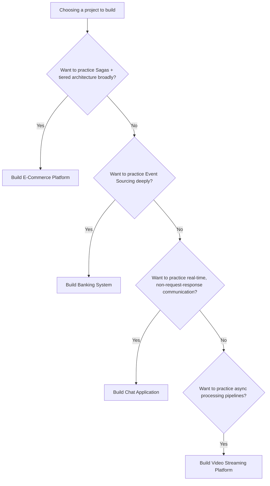
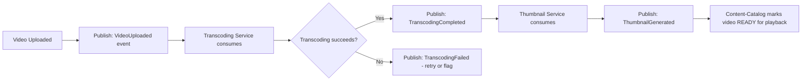
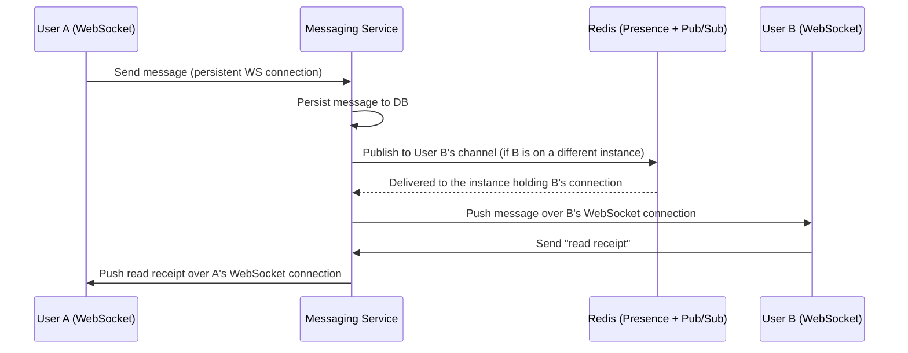

# Module 28 — Real-World Projects

> **Microservices Masterclass** | Level: Expert | Track: Node.js Backend Engineering
> Prerequisite: Module 1–27 (this module applies the entire masterclass to six complete projects)
> Next Module: Module 29 — System Design Interview Questions

---

## Table of Contents

1. [Introduction](#1-introduction)
2. [Learning Objectives](#2-learning-objectives)
3. [Problem Statement](#3-problem-statement)
4. [Why This Concept Exists](#4-why-this-concept-exists)
5. [Historical Background](#5-historical-background)
6. [Real-World Analogy](#6-real-world-analogy)
7. [Technical Definition](#7-technical-definition)
8. [Core Terminology](#8-core-terminology)
9. [Internal Working](#9-internal-working)
10. [Step-by-Step Request Flow](#10-step-by-step-request-flow)
11. [Architecture Overview](#11-architecture-overview)
12. [ASCII Diagrams](#12-ascii-diagrams)
13. [Mermaid Flowcharts](#13-mermaid-flowcharts)
14. [Mermaid Sequence Diagrams](#14-mermaid-sequence-diagrams)
15. [Component Diagrams](#15-component-diagrams)
16. [Deployment Diagrams](#16-deployment-diagrams)
17. [Database Interaction](#17-database-interaction)
18. [Failure Scenarios](#18-failure-scenarios)
19. [Scalability Discussion](#19-scalability-discussion)
20. [High Availability Considerations](#20-high-availability-considerations)
21. [CAP Theorem Implications](#21-cap-theorem-implications)
22. [Node.js Implementation](#22-nodejs-implementation)
23. [Express.js Examples](#23-expressjs-examples)
24. [Docker Examples](#24-docker-examples)
25. [Kafka/Redis Integration](#25-kafkaredis-integration)
26. [Error Handling](#26-error-handling)
27. [Logging & Monitoring](#27-logging--monitoring)
28. [Security Considerations](#28-security-considerations)
29. [Performance Optimization](#29-performance-optimization)
30. [Production Best Practices](#30-production-best-practices)
31. [Anti-Patterns and Common Mistakes](#31-anti-patterns-and-common-mistakes)
32. [Debugging Tips](#32-debugging-tips)
33. [Interview Questions](#33-interview-questions)
34. [Scenario-Based Questions](#34-scenario-based-questions)
35. [Hands-on Exercises](#35-hands-on-exercises)
36. [Mini Project](#36-mini-project)
37. [Advanced Project](#37-advanced-project)
38. [Summary](#38-summary)
39. [Revision Notes](#39-revision-notes)
40. [One-Page Cheat Sheet](#40-one-page-cheat-sheet)

---

## 1. Introduction

Module 27 taught you the systematic process for turning a domain into a complete, justified architecture. This module puts that process into practice **six times**, across genuinely different domains: an E-Commerce Platform, a Food Delivery App, a Ride-Sharing App, a Banking System, a Chat Application, and a Video Streaming Platform. Each domain stresses this masterclass's patterns differently — a Banking System pushes hard on Event Sourcing and strong consistency; a Chat Application pushes hard on real-time, low-latency communication and different scaling characteristics; a Video Streaming Platform pushes hard on content delivery and asynchronous processing pipelines.

Building (or at minimum, deeply designing) these six projects is the single best way to convert "I understand the patterns" into genuine, portfolio-demonstrable expertise. This module gives you a complete specification, architecture, and build plan for each.

---

## 2. Learning Objectives

By the end of this module, you will be able to:

- Design and (optionally) build six distinct, production-grade microservices systems, each applying this masterclass's patterns appropriately to its specific domain.
- Recognize how domain characteristics (transaction-heavy vs. read-heavy vs. real-time vs. content-heavy) drive different architectural choices.
- Build a portfolio of concrete, defensible projects demonstrating end-to-end microservices competency.
- Compare and contrast architectural decisions across genuinely different domains, deepening your understanding of *why* those decisions differ.
- Confidently discuss any of these six projects in a technical interview, using them as concrete evidence of your skills.

---

## 3. Problem Statement

Many engineers can recite microservices patterns but have never actually **built** anything beyond a two-service toy example. When asked in an interview "tell me about a distributed system you've built," they have nothing substantive to point to. This module solves that directly: six complete, realistic project specifications, each substantial enough to serve as genuine portfolio material and interview talking points, each deliberately exercising a different subset of this masterclass's patterns so that collectively, building all six (or even two or three) demonstrates comprehensive, practical mastery.

---

## 4. Why This Concept Exists

This module exists because **architectural understanding that has never been tested against a real, complete build is often shallower than it feels.** Diagrams and explanations are necessary but insufficient — actually wiring together a Saga, an Event Store, a CQRS projection, a resilience stack, and a CI/CD pipeline for one real project surfaces integration questions and edge cases that reading alone never will. Six deliberately varied projects also demonstrate a specific, valuable skill: recognizing that **the same patterns don't apply uniformly across domains** — a skill directly extending Module 27's tiering principle to domain-level architectural judgment.

---

## 5. Historical Background

Each of these six domains has well-documented real-world precedents worth studying alongside this module: Amazon and Shopify for e-commerce; Uber Eats and DoorDash for food delivery; Uber and Lyft for ride-sharing (Uber's own engineering blog extensively documents their historical migration from a monolith to microservices); large banks' core banking platforms (typically built on Event Sourcing-like ledger patterns, given the centuries-old double-entry bookkeeping tradition referenced in Module 17); Slack and Discord for chat; Netflix and YouTube for video streaming (Netflix's engineering blog is one of the most cited sources for microservices and resilience patterns throughout this entire masterclass). Studying these companies' publicly available engineering blogs alongside this module's specifications will deepen your understanding of how these patterns play out at genuine production scale.

---

## 6. Real-World Analogy

**Analogy: A Portfolio of Different Building Types**

An architect who has only ever designed one type of building (say, single-family homes) has real but narrow expertise. An architect who has designed a home, an office tower, a hospital, and a school has demonstrated something much more valuable: the judgment to recognize that a hospital's fire-safety requirements differ fundamentally from a school's, and to apply the right building codes and materials to each, rather than a one-size-fits-all approach. This module is that portfolio-building exercise for backend architecture: each of these six domains is architecturally a different "building type," and working through all of them develops the judgment this masterclass has emphasized from Module 5 onward.

---

## 7. Technical Definition

> This module provides **Project Specifications** — complete, buildable descriptions of a real system including its domain model (Bounded Contexts, Module 4), service boundaries (Module 5), data ownership (Module 14), communication design (Modules 6-9), and the specific subset of advanced patterns (Sagas, CQRS, Event Sourcing) each domain particularly stresses, following the systematic design process established in Module 27.

---

## 8. Core Terminology

| Term | Meaning |
|---|---|
| **Domain Stress Point** | The specific architectural challenge a given domain emphasizes (e.g., Banking stresses consistency; Chat stresses real-time low latency) |
| **Portfolio Project** | A complete, demonstrable system suitable for showing to interviewers or including in a resume/portfolio |
| **MVP Scope** | The minimum set of services/features needed to meaningfully demonstrate the domain's key architectural challenges |
| **Stretch Scope** | Additional features/services extending a project beyond its MVP, for deeper practice |

---

## 9. Internal Working

Each of the six project specifications below follows the same structure: **Domain & Stress Point**, **Bounded Contexts / Services**, **Key Architectural Decisions** (with module references), **MVP Scope**, and **Stretch Scope**. This consistent structure lets you compare across projects easily and reuse the same systematic design process from Module 27 for each.

---

### Project 1: E-Commerce Platform

**Domain & Stress Point:** Broad, balanced — this is ShopFast from Module 27. Stresses Sagas (checkout), Polyglot Persistence, and tiered criticality.

**Services:** Identity, Catalog, Inventory, Order, Payment, Shipping, Review, Notification.

**Key Architectural Decisions:**
- Saga (Module 15) for checkout: reserve stock → charge payment → confirm order, with compensation.
- CQRS (Module 16) for Catalog's product search/browse read model.
- Event Sourcing (Module 17) for Payment, given the audit/compliance need.
- Polyglot Persistence (Module 14): PostgreSQL for Order/Payment, MongoDB for Catalog, Redis for cart/session.

**MVP Scope:** Order, Payment, Inventory with a working Saga; basic Catalog and Identity.
**Stretch Scope:** Full CQRS read model, Shipping + Notification via Kafka, complete observability stack (Modules 21-23).

---

### Project 2: Food Delivery App

**Domain & Stress Point:** Real-time state transitions and multi-party coordination (Customer, Restaurant, Driver) — stresses Choreography-based Sagas and event-driven state machines.

**Services:** Restaurant, Menu, Order, Delivery/Driver-Matching, Payment, Notification.

**Key Architectural Decisions:**
- Choreography-based Saga (Module 15): Order placed → Restaurant accepts → Driver matched → Delivered, with each service reacting to the previous stage's event (Module 9), rather than one central orchestrator, since this is a naturally multi-party, long-running process.
- A state machine per Order tracking its lifecycle (PLACED → ACCEPTED → PREPARING → PICKED_UP → DELIVERED), each transition an event.
- Driver-Matching Service benefits from a geospatial query capability — a deliberate Polyglot Persistence choice (e.g., PostGIS or a geospatial-capable document store).

**MVP Scope:** Order + Restaurant + a simplified Driver-Matching (random assignment) with event-driven status updates.
**Stretch Scope:** Real-time customer-facing status updates (via WebSockets, connecting to this masterclass's sync/async principles from Module 6 in a new context), proper geospatial driver matching.

---

### Project 3: Ride-Sharing App

**Domain & Stress Point:** Extremely strict real-time matching and pricing calculation under high concurrency — stresses low-latency synchronous calls, careful data consistency for surge pricing, and precise event ordering.

**Services:** Rider, Driver, Trip-Matching, Pricing, Payment, Trip-Tracking.

**Key Architectural Decisions:**
- Trip-Matching requires very low-latency synchronous calls (Modules 7-8) — gRPC (Module 8) is a strong fit here, given its performance characteristics, over REST.
- Pricing (surge pricing) requires careful handling of a rapidly-changing shared value (current demand/supply ratio) — a candidate for Redis-backed, carefully-designed concurrency control.
- Trip-Tracking benefits from Event Sourcing (Module 17) — a trip's full location/status history has genuine value for disputes, safety incidents, and analytics.

**MVP Scope:** Rider requests a trip, Trip-Matching assigns a driver (simple, non-geospatial), Pricing calculates a fare, Payment charges it.
**Stretch Scope:** gRPC-based Trip-Matching, Event-Sourced Trip-Tracking, surge pricing calculation.

---

### Project 4: Banking System

**Domain & Stress Point:** Maximum consistency and auditability requirements — the clearest possible real-world justification for Event Sourcing (Module 17) and strong, careful concurrency control across this entire masterclass.

**Services:** Account, Ledger/Transaction, Transfer (Saga), Fraud-Detection, Notification.

**Key Architectural Decisions:**
- Ledger Service is **fully Event-Sourced** (Module 17) — this is the textbook justification case: every transaction must be a permanent, replayable, auditable event, mirroring double-entry bookkeeping directly.
- Transfer between two accounts is a Saga (Module 15): debit Account A → credit Account B, with compensation (credit back A) if crediting B fails — a direct, classic Saga use case.
- Strict optimistic concurrency control (Module 17) is non-negotiable here — two concurrent transactions against the same account must never silently corrupt the balance.
- Fraud-Detection consumes transaction events asynchronously (Module 9) without blocking the transaction's own critical path.

**MVP Scope:** Account + Ledger with Event Sourcing, and a working Transfer Saga between two accounts.
**Stretch Scope:** Fraud-Detection consumer, a CQRS read model (Module 16) for account statements/history, full audit trail querying (temporal queries, Module 17).

---

### Project 5: Chat Application

**Domain & Stress Point:** Real-time, low-latency, high-connection-count communication — stresses a genuinely different communication pattern (persistent connections, not simple request-response) and different scaling characteristics (connection count, not just request throughput).

**Services:** User/Presence, Messaging, Notification, Media (file/image uploads).

**Key Architectural Decisions:**
- Messaging requires **persistent, bidirectional connections** (WebSockets) rather than typical REST request-response — a genuinely new communication pattern this masterclass's REST/gRPC modules (7-8) didn't cover directly, requiring you to extend those principles to a streaming context (directly analogous to gRPC's bidirectional streaming from Module 8).
- Presence (who's online) is a classic **Gauge**-like piece of state (Module 21's metric types, applied conceptually to business state) requiring careful, fast-changing state management, well-suited to Redis.
- Message delivery guarantees (has this message been delivered? read?) require careful idempotency and ordering thinking, directly extending Module 9's event-ordering discussions.
- Scaling (Module 24) here is bottlenecked by **concurrent connection count**, not just request throughput — a genuinely different scaling profile than the other five projects.

**MVP Scope:** Basic User service + a WebSocket-based Messaging service supporting 1:1 chat with message persistence.
**Stretch Scope:** Presence service, group chat, read receipts, Media upload service with async processing (Module 9).

---

### Project 6: Video Streaming Platform

**Domain & Stress Point:** Heavy asynchronous processing pipelines (video transcoding) and content delivery at scale — stresses long-running background job orchestration and a fundamentally different data shape (large binary media, not small JSON records).

**Services:** Content-Catalog, Upload, Transcoding-Pipeline, Playback, Recommendation, Subscription/Billing.

**Key Architectural Decisions:**
- Video upload triggers a **long-running, multi-stage asynchronous pipeline** (Module 9's event-driven principles, applied to a background job workflow): Uploaded → Transcoding → Thumbnail-Generation → Ready-for-Playback, each stage its own event, potentially its own service.
- This pipeline is itself a natural fit for a **Saga-like** state machine (Module 15), even though it's not a "transaction" in the traditional sense — the same compensating-action thinking applies if, say, transcoding fails and needs to be retried or the upload flagged as failed.
- Playback and Content-Catalog are extremely read-heavy — a strong CQRS (Module 16) candidate, with a denormalized "what's trending/recommended for you" read model built from viewing history events.
- Actual video file storage/delivery is typically delegated to specialized infrastructure (object storage + CDN) rather than modeled as a traditional microservice database — an important, deliberate architectural distinction from this masterclass's typical relational/document database focus.

**MVP Scope:** Upload + a simulated Transcoding-Pipeline (event-driven state transitions) + Content-Catalog.
**Stretch Scope:** CQRS-based Recommendation read model, Subscription/Billing with a Saga for payment + access-grant coordination.

---

## 10. Step-by-Step Request Flow

**Representative flow: Project 4 (Banking System)'s Transfer Saga — chosen because it's this module's clearest, highest-stakes example of Event Sourcing + Saga working together.**

```
Step 1:  Client requests: Transfer $500 from Account A to Account B
Step 2:  Transfer Saga Orchestrator begins:
           a. Load Account A's CURRENT balance by REPLAYING its
              event stream (Module 17) - not a stored "balance" field
           b. Validate sufficient funds
           c. Append a "FundsDebited" event to Account A's stream
              (Module 17's optimistic concurrency control REQUIRED here)
Step 3:  Saga proceeds: append a "FundsCredited" event to Account
         B's stream
Step 4:  If Step 3 FAILS (e.g., Account B doesn't exist, or a
         concurrency conflict): COMPENSATE by appending a
         "FundsCredited" event BACK to Account A (Module 15) -
         note this is a NEW event, NEVER a modification of the
         original "FundsDebited" event (Module 17's append-only rule)
Step 5:  Both events, once successfully appended, are published
         to Kafka (Module 9) for Fraud-Detection and the CQRS
         statement read model (Module 16) to consume independently
Step 6:  Client receives confirmation - the ENTIRE operation is
         now a PERMANENT, AUDITABLE, REPLAYABLE part of both
         accounts' event histories
```

---

## 11. Architecture Overview

```
              (Representative: Banking System's core flow)

                        Client
                          │
                          ▼
                  Transfer Saga Orchestrator (Mod 15)
                          │
              ┌───────────┴───────────┐
              ▼                       ▼
        Account A                Account B
        (Event Store,             (Event Store,
         Mod 17)                    Mod 17)
              │                       │
              └───────────┬───────────┘
                          ▼
                    Kafka (Mod 9)
              ┌───────────┼───────────┐
              ▼                       ▼
      Fraud-Detection          CQRS Statement
      (async consumer)          Read Model (Mod 16)
```

---

## 12. ASCII Diagrams

### 12.1 Domain Stress Points Compared

```
E-COMMERCE:        Broad balance - Sagas + CQRS + tiered criticality
FOOD DELIVERY:      Choreography-based multi-party state machines
RIDE-SHARING:       Low-latency sync (gRPC) + careful concurrency (pricing)
BANKING:            Event Sourcing + strict concurrency - the STRONGEST
                    consistency requirements of all six projects
CHAT:               Persistent connections (WebSockets) - a DIFFERENT
                    communication pattern; connection-count-based scaling
VIDEO STREAMING:    Async processing PIPELINES + read-heavy CQRS +
                    specialized binary/media storage (NOT a typical DB)
```

### 12.2 Consistency Spectrum Across the Six Projects

```
STRONGEST CONSISTENCY NEEDS:
  Banking (Ledger)        <- Event Sourcing, strict optimistic concurrency
  Ride-Sharing (Pricing)   <- careful concurrency on a shared, fast-changing value
  E-Commerce (Checkout)     <- Saga, synchronous critical path

MODERATE:
  Food Delivery (Order state)  <- Choreographed events, eventual consistency OK
                                   between stages

MOST TOLERANT OF EVENTUAL CONSISTENCY:
  Video Streaming (Recommendations)  <- CQRS read model, staleness of
                                         minutes is perfectly fine
  Chat (Presence)                     <- brief staleness in "online" status
                                         is a normal, accepted UX trade-off
```

---

## 13. Mermaid Flowcharts

### 13.1 Choosing Which Project to Build First



### 13.2 Video Streaming's Async Transcoding Pipeline



---

## 14. Mermaid Sequence Diagrams

### 14.1 Chat Application's WebSocket Message Flow



---

## 15. Component Diagrams

```
┌─────────────────────────────────────────────────────────┐
│              Video Streaming Platform (representative)        │
│  ┌───────────────┐ ┌───────────────┐ ┌───────────────┐      │
│  │ Upload Service      │ │ Transcoding         │ │ Content-Catalog     │      │
│  │ (accepts file,        │ │ Pipeline               │ │ (CQRS read model,     │      │
│  │  stores to Object      │ │ (multi-stage,           │ │  Mod 16)               │      │
│  │  Storage, publishes     │ │  event-driven,           │ │                          │      │
│  │  VideoUploaded)          │ │  Mod 9)                  │ │                          │      │
│  └───────────────┘ └───────────────┘ └───────────────┘      │
└─────────────────────────────────────────────────────────┘
```

---

## 16. Deployment Diagrams

```
All six projects share the SAME underlying infrastructure pattern
(Modules 19-20, 26): containerized services, Kubernetes orchestration,
independent per-service CI/CD. What DIFFERS is:

  Chat:            requires STICKY SESSIONS or a Pub/Sub backplane
                   (Redis) for WebSocket connections across replicas
                   (a Kubernetes Service alone doesn't naturally
                    handle "this specific user's persistent
                    connection is on THIS specific replica")

  Video Streaming: requires OBJECT STORAGE (S3-compatible) and a
                   CDN in front of it for actual video file delivery -
                   NOT modeled as a typical service+database pair

  Banking:         requires the STRICTEST database backup/replication
                   and disaster recovery planning of all six, given
                   the stakes of financial data
```

---

## 17. Database Interaction

Data ownership patterns vary meaningfully across the six projects, reinforcing Module 14's Polyglot Persistence principle:

```
E-Commerce Catalog:     MongoDB (flexible product attributes)
Banking Ledger:          Event-sourced PostgreSQL (Module 17)
Ride-Sharing Matching:   Redis + geospatial-capable store
Chat Presence:           Redis (fast-changing, ephemeral state)
Video Catalog:           CQRS read model, possibly Elasticsearch
                         for search/discovery
Video Files themselves:  Object storage (S3-compatible) - NOT a
                         traditional database at all
```

---

## 18. Failure Scenarios

| Project | A Representative Failure & Its Handling |
|---|---|
| E-Commerce | Payment fails mid-checkout → Saga compensates (release stock), Module 15 |
| Food Delivery | No driver accepts within N minutes → timeout triggers re-broadcast to more drivers, or order cancellation |
| Ride-Sharing | Pricing service is briefly unavailable during a surge calculation → fall back to last-known base fare rather than blocking the ride request entirely (Module 18) |
| Banking | A transfer's credit step fails after the debit succeeded → compensating credit-back event, NEVER a silent retry that could double-process (Module 15/17) |
| Chat | A user's WebSocket connection drops → messages sent while disconnected are queued and delivered on reconnect (a message queue pattern, Module 9) |
| Video Streaming | Transcoding fails for a specific format → retry with backoff (Module 18); if it exhausts retries, flag the video for manual review rather than silently failing |

---

## 19. Scalability Discussion

Each project's scaling bottleneck (Module 24) differs meaningfully: E-Commerce's Catalog is read-heavy and CPU/DB-bound; Ride-Sharing's Trip-Matching is latency-sensitive and benefits from gRPC's efficiency; Banking deliberately does NOT prioritize aggressive horizontal scaling over correctness — a slower, more carefully-controlled scaling approach is appropriate given the stakes; Chat's bottleneck is concurrent connection count, requiring a fundamentally different scaling approach (connection-aware load balancing, a Pub/Sub backplane) than simple stateless HPA scaling; Video Streaming's Transcoding Pipeline is CPU-intensive and benefits from a job-queue-based scaling model (scale worker consumers based on queue depth, not just CPU).

---

## 20. High Availability Considerations

Banking demands the strictest HA guarantees of all six (multi-region database replication, rigorous disaster recovery testing) given the financial and regulatory stakes; Chat requires HA design specifically around its Pub/Sub backplane (Redis) so a single instance failure doesn't drop active connections' message delivery; the other four projects follow the standard HA patterns established in Modules 18-20 (multi-replica deployments, resilience patterns tiered by criticality).

---

## 21. CAP Theorem Implications

This module is a rich, concrete demonstration of CAP trade-offs varying by genuine business need: Banking's Ledger favors Consistency almost absolutely (Module 17's strict concurrency control); Video Streaming's Recommendations favor Availability heavily (staleness of minutes is a non-issue); Chat's Presence sits somewhere in between (brief staleness acceptable, but not minutes-long); Ride-Sharing's Pricing requires careful, deliberate reasoning about exactly how fresh a "current demand" value needs to be for a fair, defensible fare calculation.

---

## 22. Node.js Implementation

Given the breadth of six projects, this section provides a **starter service list and folder structure** for the two projects with the most distinctive implementation needs — Banking (Event Sourcing) and Chat (WebSockets) — as templates to extend using patterns from earlier modules.

**Banking System's Ledger Service** (directly extends Module 17's implementation):
```
ledger-service/
├── src/
│   ├── eventstore/        (Module 17's event store pattern)
│   ├── domain/
│   │   └── accountReducer.js   (applies FundsDebited/FundsCredited events)
│   ├── sagas/
│   │   └── transferSaga.js     (Module 15's Saga pattern)
│   └── app.js
```

**Chat Application's Messaging Service** (a new pattern — WebSocket handling):
```javascript
import { WebSocketServer } from "ws";
import { createClient } from "redis";

const wss = new WebSocketServer({ port: 4030 });
const redisSub = createClient({ url: process.env.REDIS_URL });
await redisSub.connect();

const localConnections = new Map(); // userId -> WebSocket, on THIS instance only

wss.on("connection", (ws, req) => {
  const userId = getUserIdFromAuthToken(req); // Module 13's JWT verification, adapted
  localConnections.set(userId, ws);

  ws.on("message", async (data) => {
    const { toUserId, content } = JSON.parse(data);
    await persistMessage(userId, toUserId, content); // Module 14's data ownership

    // If the recipient is connected to THIS instance, deliver directly;
    // otherwise, publish via Redis so WHICHEVER instance holds their
    // connection can deliver it - solving the "sticky session" problem
    // mentioned in Section 16
    const localTarget = localConnections.get(toUserId);
    if (localTarget) {
      localTarget.send(JSON.stringify({ from: userId, content }));
    } else {
      await redisPub.publish(`user-channel:${toUserId}`, JSON.stringify({ from: userId, content }));
    }
  });

  ws.on("close", () => localConnections.delete(userId));
});
```

---

## 23. Express.js Examples

Most of the six projects' HTTP-facing services (Order, Account, Restaurant, Content-Catalog) follow the same Express patterns established across Modules 7, 10, 13, 21-22 — the differentiating implementation work is in each domain's specific business logic and the distinctive patterns highlighted in Section 9's per-project breakdown (Sagas, Event Sourcing, WebSockets, async pipelines).

---

## 24. Docker Examples

Each project's `docker-compose.yml` follows Module 19's established patterns, with project-specific additions:

```yaml
# Chat Application - notice Redis is now BOTH a cache/session store
# AND a Pub/Sub backplane for cross-instance WebSocket delivery
services:
  messaging-service:
    build: ./messaging-service
    deploy:
      replicas: 3   # MULTIPLE instances - Redis Pub/Sub solves cross-instance delivery
    environment:
      - REDIS_URL=redis://redis:6379
  redis:
    image: redis:7-alpine
```

```yaml
# Video Streaming - notice the addition of object storage, absent
# from the other five projects' typical service+database pattern
services:
  upload-service:
    build: ./upload-service
    environment:
      - OBJECT_STORAGE_ENDPOINT=http://minio:9000  # S3-compatible, local dev
  minio:
    image: minio/minio
    command: server /data
    ports: ["9000:9000"]
```

---

## 25. Kafka/Redis Integration

Kafka's role varies meaningfully: in E-Commerce/Banking/Ride-Sharing, it's the standard Module 9 event backbone for cross-service, business-event communication; in Video Streaming, it additionally drives the **transcoding pipeline's own internal stage transitions**, essentially using Kafka as a durable job queue between pipeline stages; in Chat, Redis (not Kafka) is the primary real-time backbone, given its lower latency for the Pub/Sub pattern needed for instant message delivery across instances.

---

## 26. Error Handling

Each project's error handling philosophy should be tiered exactly per Module 27's principle: Banking's Ledger surfaces every error explicitly, with zero tolerance for silent failures (Module 18's "no fake success" rule applied maximally); Video Streaming's Recommendation service degrades gracefully to a generic "popular videos" fallback if personalized recommendations fail; Chat's message delivery should queue and retry on a dropped connection rather than silently losing a message.

---

## 27. Logging & Monitoring

All six projects should apply the complete observability stack (Modules 21-23) — RED metrics, structured trace-correlated logs, distributed tracing — with project-specific additions: Chat should monitor **active connection count per instance** as a first-class metric (a new metric type this masterclass hasn't emphasized until now, but a natural extension of Module 21's Gauge concept); Video Streaming should monitor **transcoding queue depth and processing time** per pipeline stage.

---

## 28. Security Considerations

Banking demands the strictest security posture of all six (Module 25's Zero Trust and mTLS are essentially non-negotiable, plus regulatory compliance concerns beyond this masterclass's scope); Chat requires careful attention to WebSocket connection authentication (verifying the JWT at connection time, not just at initial HTTP handshake); Video Streaming's Upload service needs strict validation of uploaded file types/sizes to prevent abuse.

---

## 29. Performance Optimization

Video Streaming's Transcoding Pipeline is the most performance-sensitive of the six from a raw compute perspective — worth applying Module 24's bottleneck-identification discipline specifically to CPU-bound transcoding work, considering dedicated worker pools sized independently from the platform's other, more typical web-request-serving services.

---

## 30. Production Best Practices

Across all six projects, apply Module 27's complete checklist: justified Bounded Contexts, deliberate data ownership, explicit sync/async choices, Sagas where multi-service transactions exist, CQRS/Event Sourcing only where domain-justified, tiered resilience, full observability, Zero Trust security, and independent CI/CD — adapting each specifically to the domain's actual stress points as detailed in Section 9.

---

## 31. Anti-Patterns and Common Mistakes

| Anti-Pattern | Why It's a Problem |
|---|---|
| **Applying Banking's strict Event Sourcing approach to Chat's Presence data** | Wildly over-engineered for data that's inherently ephemeral and tolerant of staleness |
| **Applying Chat's WebSocket pattern to Video Streaming's Catalog browsing** | Unnecessary complexity for what's fundamentally simple request-response read traffic |
| **Treating Video files as if they belong in a typical relational database** | Massive performance and cost inefficiency compared to purpose-built object storage + CDN |
| **Ignoring domain-specific stress points and applying a generic "microservices template" everywhere** | Produces a technically-functioning but poorly-fitted architecture for each project's actual needs |

---

## 32. Debugging Tips

When building any of these six projects, if you find yourself fighting a pattern (e.g., Event Sourcing feels awkward for something clearly ephemeral, or REST feels wrong for genuinely real-time bidirectional communication), that friction is valuable diagnostic signal — revisit Section 9's stress point for that domain and confirm you've selected the pattern that genuinely fits, rather than forcing a pattern from a different project's context.

---

## 33. Interview Questions

### Easy
1. Name one architectural pattern each of these six domains particularly stresses, and why.
2. Why does a Banking system justify Event Sourcing so much more clearly than, say, a Review service?
3. Why does a Chat application need a fundamentally different communication pattern than a typical REST API?

### Medium
4. Compare the consistency requirements of a Banking transfer versus a Video Streaming recommendation, and explain the CAP trade-off each makes.
5. Why does Chat's horizontal scaling require a Pub/Sub backplane, unlike a typical stateless REST service?
6. Design the async transcoding pipeline for a Video Streaming platform, specifying each stage as an event.

### Hard
7. Design a complete Ride-Sharing platform architecture, addressing trip matching, surge pricing consistency, and payment.
8. Design a Banking system's Transfer Saga in full detail, including compensation and concurrency control.
9. Compare and contrast the architectural decisions across any two of these six projects, explaining specifically why they differ.
10. Design a Chat application's message delivery guarantee strategy (at-least-once? exactly-once? how do you handle duplicate delivery on reconnect?).

---

## 34. Scenario-Based Questions

1. You're asked in an interview to design a food delivery platform. Walk through your complete design process, from Bounded Contexts to deployment.
2. A stakeholder for your Banking project asks why you chose Event Sourcing specifically for the Ledger but not for the Notification service. Justify this clearly.
3. Your Chat application's WebSocket connections are unevenly distributed across replicas, causing one instance to be overloaded. Diagnose and propose a fix.
4. Your Video Streaming platform's transcoding pipeline is falling behind during a traffic spike of new uploads. Walk through your scaling response.

---

## 35. Hands-on Exercises

1. Write the complete Bounded Context and service boundary design (Modules 4-5) for one of the two projects not chosen for your Mini/Advanced Project below.
2. Draw the full architecture diagram for the Ride-Sharing project, labeling each module's pattern applied.
3. Implement the Chat application's WebSocket message routing (Section 22) and test it with two connected clients.
4. Design the Banking system's Transfer Saga state machine on paper, listing every possible state and transition.
5. Write Architecture Decision Records justifying your top 3 decisions for any one of the six projects.

---

## 36. Mini Project

**Build: One Complete Project From This Module's List**

Choose ONE of the six projects and build its MVP Scope (as specified in Section 9), applying the full range of this masterclass's patterns appropriate to that domain. Document your architecture with a diagram and at least 3 Architecture Decision Records.

---

## 37. Advanced Project

**Build: Two Complete Projects, Deliberately Contrasting**

Choose TWO projects with meaningfully different stress points (e.g., Banking and Chat, or E-Commerce and Video Streaming) and build both to their Stretch Scope. Write a comparative architecture document explicitly contrasting the two systems' data consistency strategies, communication patterns, and scaling approaches — demonstrating the domain-driven architectural judgment this module is designed to build.

---

## 38. Summary

- This module provided complete specifications for six architecturally distinct real-world projects: E-Commerce, Food Delivery, Ride-Sharing, Banking, Chat, and Video Streaming.
- Each domain stresses a different subset of this masterclass's patterns: Sagas and tiered criticality (E-Commerce), Choreography (Food Delivery), low-latency sync communication (Ride-Sharing), Event Sourcing and strict consistency (Banking), real-time persistent connections (Chat), and async processing pipelines (Video Streaming).
- Building even one or two of these projects to completion converts theoretical pattern knowledge into genuine, demonstrable, interview-ready expertise.
- The recurring lesson across all six: architectural patterns must be **matched to domain-specific stress points**, never applied uniformly as a generic template.

---

## 39. Revision Notes

- Six projects, six different architectural stress points — match patterns to domain needs, not a generic template.
- E-Commerce: broad balance, Sagas + CQRS + tiering.
- Food Delivery: Choreography-based multi-party state machines.
- Ride-Sharing: low-latency sync (gRPC), careful concurrency for pricing.
- Banking: Event Sourcing + strict consistency — the strongest consistency needs of all six.
- Chat: persistent connections (WebSockets), connection-count-based scaling, Pub/Sub backplane.
- Video Streaming: async processing pipelines, CQRS-heavy reads, specialized object storage.

---

## 40. One-Page Cheat Sheet

```
E-COMMERCE:      Saga (checkout) + CQRS (catalog) + Event Sourcing (payment) + tiering
FOOD DELIVERY:    Choreography-based Saga, multi-party event-driven state machine
RIDE-SHARING:     gRPC (low latency), careful concurrency for surge pricing
BANKING:          Event Sourcing (mandatory), strict optimistic concurrency, Saga (transfer)
CHAT:             WebSockets, Redis Pub/Sub backplane, connection-count scaling
VIDEO STREAMING:  Async transcoding pipeline (event-driven stages), CQRS reads, object storage

GOLDEN RULE: Match architectural patterns to EACH domain's actual stress points -
             never copy-paste one project's architecture onto a fundamentally
             different domain's problem.
```

---

**Suggested Next Module:** Module 29 — System Design Interview Questions (Design Swiggy, Design Uber, Design WhatsApp, Design Netflix, Design Amazon, Design Payment Gateway — full interview-style walkthroughs)
